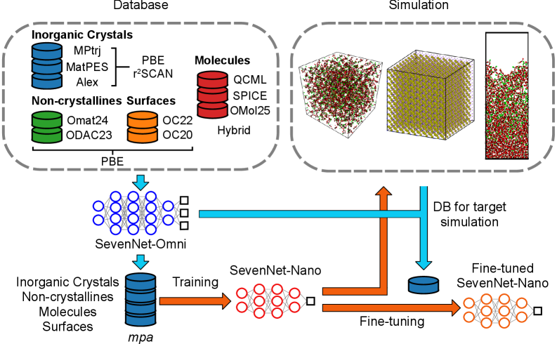
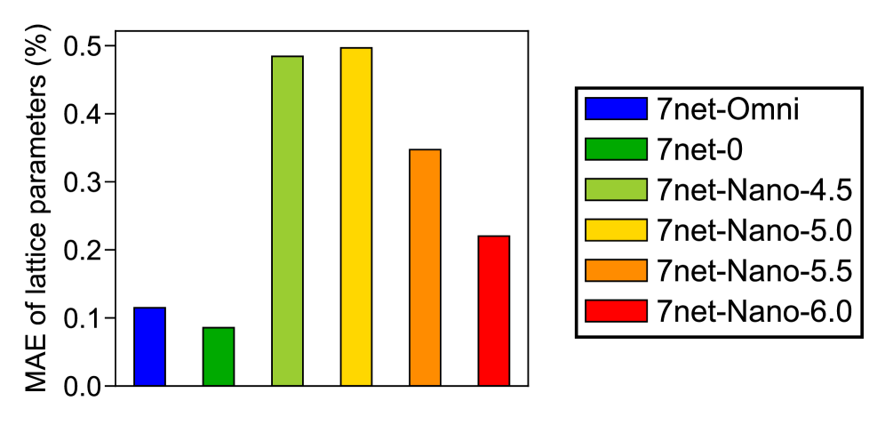
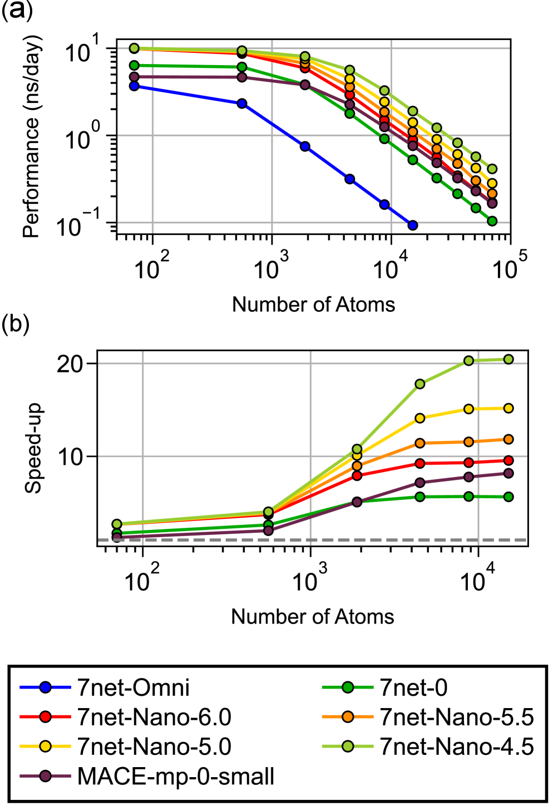

# 汎用機械学習原子間ポテンシャルの軽量化：知識蒸留によるSevenNet-Nanoと周辺技術の展開

- 執筆日：2026-05-06
- トピック：汎用機械学習原子間ポテンシャル（uMLIP）の計算コスト問題を、知識蒸留・Mixture-of-Experts・分散学習などの手法で解決しようとする最新の研究動向
- タグ：Computation and Theory / Surrogate Modeling; Molecular Dynamics / Machine Learning; Molecular Dynamics
- 注目論文：SevenNet-Nano: A Compact Universal Machine Learning Interatomic Potential (arXiv:2604.10887)
- 参照論文数：6

---

## 1. なぜ今この話題なのか

材料科学・計算化学において、原子間ポテンシャル（interatomic potential）は分子動力学（MD）シミュレーションの心臓部を担う。従来の経験的ポテンシャル（Lennard-Jones型やEAM型など）は計算が速い反面、特定の系にしか適用できず、化学結合の形成・切断を正確に扱えないという根本的な限界があった。第一原理計算（主に密度汎関数理論、DFT）は精度が高いが、計算コストがO(N³)以上にスケールするため、数百原子を超える系や長時間シミュレーションには実質的に使えない。

この20年間で、ニューラルネットワーク原子間ポテンシャル（NNIP）がこのギャップを埋めようとしてきた。Behler-Parrinelloモデル（2007年）に始まり、DeePMD、ANI、MACE、SevenNet、CHGNetなど数多くのアーキテクチャが登場した。しかし初期のNNIPは「特定の系専用」であり、固体電解質の研究者はそのための訓練データを自ら生成しなければならなかった。

状況が変わったのは2023〜2025年にかけてである。MatterSim（Microsoft Research、arXiv:2405.04967）、MACE-MP-0、ORBモデルなど、元素周期表全体をカバーする「汎用機械学習原子間ポテンシャル」（universal MLIP、uMLIP）が相次いで公開された。これらは大規模な第一原理データベース（Materials Project、Alexandria、自己生成Active Learning データなど）で事前学習されており、追加のファインチューニングなしでも多様な材料系に適用できる。化学的空間・配置空間・計算条件空間を同時にカバーするという意味で、これらは自然言語処理におけるLLM（大規模言語モデル）の基盤モデルへの転換と並行する革命であった。

しかしuMLIPが普及するにつれ、新たな問題が浮上した。高精度なuMLIPは一般にモデルが大きく、計算コストが高い。たとえばSevenNet-Omni（SevenNet-Nanoの教師モデル）はMD1ステップあたりの計算時間が経験的ポテンシャルの数十〜数百倍にもなる。固体電解質のイオン拡散をシミュレートするには数ナノ秒以上のMDが必要であり、タンパク質・ポリマー・非晶質材料では数万〜数百万原子規模のシステムが対象となる。高精度と計算速度の両立は、uMLIPの「次のフロンティア」として認識されている。

SevenNet-Nano（arXiv:2604.10887）はこの問題に、知識蒸留（knowledge distillation）という機械学習の技術で正面から取り組んだ論文である。教師モデル（SevenNet-Omni）の「知識」を、はるかに小さな生徒モデル（SevenNet-Nano）に転移させることで、精度を大きく損なわずに計算速度を10倍以上高速化することに成功した。本記事では、SevenNet-Nanoを核としながら、同時期に並走するMoEアーキテクチャや十億パラメータ規模モデル、ファインチューニングプラットフォームなどの関連研究も統合的に論じ、uMLIPの軽量化・高速化という研究潮流を多角的に分析する。

---

## 2. この分野の未解決問題

### 問題1：精度と速度のトレードオフはどこまで改善できるか

現在のuMLIPは「精度か速度か」の二択を迫られる状況にある。SevenNet-Omniのような大型モデルはDFT精度に迫るが、数万原子のMDには計算時間が数週間かかる。一方、MatterSimの軽量バージョンや古典的ポテンシャルは速いが精度が落ちる。知識蒸留・量子化・MoEなど多様なアプローチが試みられているが、どの手法がどの条件下で最適かの系統的理解はまだ不完全である。特に、「精度が必要な局所領域」と「粗い計算で十分な遠距離領域」を動的に区別する手法は発展途上にある。

### 問題2：汎用性とファインチューニングの最適なバランスはどこか

uMLIPは汎用的であるが故に、特定の材料系では専門モデルより精度が劣る場合がある。ファインチューニング（fine-tuning）が有効であることはHänserothら（arXiv:2511.05337）が示したが、どの程度のデータ量でどの程度の改善が見込めるか、過学習を防ぎながら汎用性を保つにはどうすべきかは依然研究課題である。また、ファインチューニング後のモデルが教師モデルと同等の「転移可能性」を持つかどうかも不明確である。

### 問題3：スケーラビリティの壁をどう破るか

億〜十億原子規模のシミュレーションはエクサスケールコンピュータでも困難であり、現在のuMLIPの多くは数十万原子規模が実用上限である。Zhou ら（arXiv:2604.15821）は十億パラメータ規模のMoEモデルと分散学習框架（Janus）で1.2 EFLOPSを達成したが、これが実際の材料研究に汎用的に使えるかはこれからの検証にかかっている。スケーラビリティ向上と並行して、長距離相互作用・荷電系・分子内自由度の適切な取り扱いも課題として残る。

---

## 3. 注目論文の核心

### 何が問題だったか

SevenNet-Nanoが登場する前、uMLIPの利用者は実質的に「重いモデルをそのまま使うか、精度を妥協するか」の選択しかなかった。SevenNet-Omniはその優れた汎用性から多くの研究者に使われているが、一般のGPUクラスタで数万原子のMDを実用的な時間スケールで実行するには計算コストが高すぎた。

### 知識蒸留というアプローチ

知識蒸留（Knowledge Distillation、KD）は、大きなモデル（教師）の「振る舞い」を小さなモデル（生徒）に転移させる技術で、自然言語処理・画像認識分野で広く使われてきた。SevenNet-Nanoはこれを原子間ポテンシャルに適用した。

具体的には、教師モデル（SevenNet-Omni）が与える原子力（atomic forces）と応力テンソル（stress tensor）を「ソフトラベル」として使い、生徒モデル（SevenNet-Nano）の損失関数に組み込む。生徒はDFTデータ（ハードラベル）だけでなく、教師の予測値そのものを学習目標として訓練される。

損失関数は以下の形で表現される：

$$L_\text{total} = \alpha L_\text{hard} + (1 - \alpha) L_\text{soft}$$

ここで $L_\text{hard}$ はDFTの参照値（エネルギー・力・応力）との誤差、$L_\text{soft}$ は教師モデルの出力との誤差であり、$\alpha$ はその重みを制御するハイパーパラメータである。教師モデルは訓練中に勾配を流さず（frozen）、生徒モデルのみが最適化される。

このアプローチの利点は二つある。第一に、教師モデルはDFTデータが存在しない配置空間にも力を予測できるため、「暗黙の補間」として機能する。第二に、教師の出力は既に物理的に滑らかであり、DFTの数値ノイズより「きれいな」勾配情報を生徒に与えることができる。

*図1：SevenNet-Omni（教師）からSevenNet-Nano（生徒）への知識蒸留の模式図。教師の力・応力予測を生徒の損失関数に組み込む。(出典: arXiv:2604.10887, CC BY 4.0)*

### モデルアーキテクチャ

SevenNet-NanoはSevenNetと同じグラフニューラルネットワーク（GNN）基盤を使うが、層数・チャネル数を大幅に削減している。SevenNetはE(3)等変ニューラルネットワーク（SEGNN系）を用いており、回転・反転対称性を数学的に保証するアーキテクチャである。SevenNet-Nanoは同じ等変性を保ちながら、モデルサイズを約1/10以下に圧縮している。

### 主要な結果

精度面では、SevenNet-NanoはSevenNet-Omniと比較して力の誤差（MAE）が約15〜20%増加するにとどまり、完全なDFTデータで再訓練した場合と比べても精度が高い。これは知識蒸留が「生のDFTデータ以上の情報」を含む教師の出力を活用しているためである。

速度面では、SevenNet-Omniと比較して10倍以上の高速化を達成した。70原子から70,000原子規模まで一貫して高速化が見られ、特に大系での優位性が顕著である。

*図3：MatBench・欠陥結晶・分子系・MOF（金属有機骨格体）を含む各種ベンチマークでの精度比較。SevenNet-Nanoは大幅な速度向上を維持しながら、競合モデルと同等の精度を示す。(出典: arXiv:2604.10887, CC BY 4.0)*

応用例として、(1) リチウムイオン電池の固体電解質（Li₆PS₅Cl、アルジロダイト型）におけるLi拡散係数のシミュレーション、(2) 液体電解質（LiPF₆/EC溶液）の密度計算、(3) SiO₂のプラズマエッチング（CF₂/CF₃ラジカルとの極端な非平衡反応）を実施している。(1)と(2)はSevenNet-Omniとほぼ一致し、(3)はMD-DFTベンチマークと良好な一致を示した。

*図11：非晶質SiO₂のMDシミュレーションにおける速度比較（70〜70,000原子）。SevenNet-NanoはSevenNet-Omniに対して一貫して10倍以上の高速化を達成する。(出典: arXiv:2604.10887, CC BY 4.0)*

---

## 4. 背景と研究史

### uMLIPへの道

機械学習原子間ポテンシャルの歴史は2007年のBehler-Parrinelloモデルに始まるが、系統的な「汎用化」が始まったのは2020年代に入ってからである。2022〜2023年に、GNoMEプロジェクト（Google DeepMind）、Materials Project、Alexandriaなど大規模な第一原理データベースが整備されたことが転機となった。これらのデータを活用して、CHGNet（2023）、MACE-MP-0（2023）、SevenNet（2024）などの初期uMLIPが登場した。

MatterSim（arXiv:2405.04967）はその中でも特に野心的な試みである。Microsoft Researchのチームは温度0〜5000K・複数の圧力条件を網羅する計算データをアクティブラーニングで自動生成し、DeePMD系のアーキテクチャで訓練した大規模uMLIPを構築した。MatterSimはGNNとトランスフォーマーを組み合わせた独自アーキテクチャを採用し、MDシミュレーション・フォノン計算・化学反応をDFT精度で再現できることを示した。ただし、そのライセンスはarXivデフォルト（non-exclusive）のため、本記事では図の転載はできない。

SevenNet（Oh et al.、2024年）は韓国・SNU/CAIROSチームによるE(3)等変GNNベースのuMLIPであり、原子ごとのエネルギー分解と多体相互作用の等変表現に優れる。SevenNet-Omniはその大規模版であり、化学空間・配置空間・計算条件空間（温度・圧力・汎関数種）を同時にカバーする多タスク基盤モデルとして設計されている。

### ファインチューニング研究の台頭

uMLIPが普及すると、「基盤モデルをそのまま使う」のでなく「目的の材料系に適応させる」ファインチューニング研究が急速に発展した。Hänserothら（arXiv:2511.05337）は、MACE、GRACE、SevenNet、MatterSim、ORBの5つのuMLIPについて、同一のファインチューニング条件（学習率・エポック数・データ量）で系統的に比較した初の大規模ベンチマークを提供した。その結果、適切なファインチューニングで力の誤差が5〜15倍、エネルギー誤差が2〜4桁改善することを示した。この研究は「どのモデルをファインチューニングすべきか」の指針を与えるとともに、ファインチューニング方法論自体の重要性を明確にした。

MatterTune（arXiv:2504.10655）はこの需要に応える形でKongらが開発した統合ファインチューニングプラットフォームである。ORB・MatterSim・JMP・EquformerV2など複数のuMLIPを共通インターフェースでファインチューニングできるモジュラー設計を採用しており、材料探索・特性予測・MD前処理などのワークフローに容易に組み込める。CC BY 4.0でオープンソース化されており、コミュニティの標準的ツールになりつつある。

---

## 5. どの解釈が最も妥当か

### 知識蒸留の効果の源泉

SevenNet-Nanoの精度が「純粋なDFTデータのみで訓練した小型モデル」を上回るという結果は、知識蒸留が単なる「モデル圧縮」ではなく、教師モデルが内包する物理的規則性の「転移」として機能していることを示唆する。教師モデル（SevenNet-Omni）はDFTデータで学習した後、潜在的な配置空間内で物理的に妥当な補間を行っている。その補間知識が生徒に伝わることで、生徒はDFTデータの「カバーしていない領域」でも合理的な予測ができるようになる。

ただし、この解釈には限界もある。教師が系統的に誤る領域（たとえばDFTそのものが不正確な強相関電子系）では、生徒も同じ誤りを引き継ぐ。また、教師の「ソフトラベル」の温度パラメータ設定（KD理論では高温ほど軟らかい確率分布になる）が力・応力の予測にどう対応するかの理論的整理はまだ不完全である。

### MoEアーキテクチャとの比較

Nascimentoら（arXiv:2604.26143）が提案した空間的Mixture-of-Experts（MoE）アプローチは、SevenNet-Nanoとは異なる方向からの速度向上策である。このアプローチでは、シミュレーションボックスを「複雑な領域」（触媒表面や反応中心など）と「単純な領域」（バルク結晶の遠距離部分など）に動的に分割し、それぞれに対応するサブネットワーク（専門家）を割り当てる。Allegro（equivariant GNN）をベースとしたこのモデルは、PtのCO被毒シミュレーションで約2倍の高速化と同等の精度を達成した。

知識蒸留（SevenNet-Nano型）との本質的な違いは、高速化の根拠が異なる点にある。知識蒸留はモデル自体を小さくすることで高速化するため、すべての原子に対して一様に計算が軽くなる。一方、MoEは「場所によって計算量を変える」アプローチであり、系の中に「複雑さの勾配」がある場合に特に有効である。実際の材料研究では両方のシナリオがあるため、どちらが「良い」かは系依存であり、両手法の融合も将来的に考えられる。

### 十億パラメータ規模への拡張との整合性

Zhouら（arXiv:2604.15821）が示した十億パラメータ規模のMatRIS-MoEは、一見SevenNet-Nanoの「軽量化」方向と矛盾するように見える。しかし、この二つは実は相補的な研究である。MatRIS-MoEが目指すのは「エクサスケールコンピュータを使った最高精度・最大規模のuMLIP」であり、SevenNet-Nanoが目指すのは「一般のGPUクラスタでも実用になる軽量uMLIP」である。前者が「限界性能の探索」であるとすれば、後者は「実用展開の民主化」であり、分野全体として見ればこの両極が同時進行することは合理的である。

ただし、大型モデルを知識蒸留で圧縮するSevenNet-Nano的なアプローチと、エクサスケール計算を前提とするMatRIS-MoE的なアプローチが将来どう収束するかは不明である。大型モデルが「教師」として機能し、汎用的な軽量蒸留モデルを量産するパイプラインが成立すれば、両方向の研究が相乗効果を持ちうる。

### ファインチューニングとの関係

Hänserothら（arXiv:2511.05337）が示したように、ファインチューニングは精度改善に劇的な効果を持つ。SevenNet-Nanoを特定の材料系（たとえばLi₇La₃Zr₂O₁₂ガーネット型固体電解質）にファインチューニングすれば、計算速度の優位性を維持しながら専門モデルに近い精度を達成できる可能性がある。MatterTune（arXiv:2504.10655）はSevenNet-Nanoのような軽量uMLIPをより簡単にファインチューニングできるプラットフォームを提供しており、実用的なパイプライン（uMLIP軽量化→ファインチューニング→応用MD）の実現を後押しする。

現時点で最も強く支持される結論は、「知識蒸留によるuMLIP軽量化は、純粋な小型モデル訓練より精度・速度のバランスが優れており、実用的な中規模シミュレーション（数万原子、数ナノ秒以上）の現実的な選択肢になる」というものである。一方、「知識蒸留の効果は教師モデルの品質と生徒アーキテクチャの設計に強く依存し、普遍的な設計指針はまだ確立されていない」という点は重要な留保である。

---

## 6. 何が一般化できるか

### 他材料系への転移

SevenNet-Nanoはそもそも汎用モデルであるため、固体電解質・液体電解質・プラズマ処理だけでなく、金属合金・酸化物・有機-無機ハイブリッド材料など広範な系に原理的に適用できる。実際、ベンチマークには金属有機骨格体（MOF）・欠陥結晶・分子系が含まれており、異材料系間での精度の安定性が示されている。

知識蒸留によるuMLIPの軽量化は、教師モデルが十分な汎用性を持つ限り、生徒モデルも同様の汎用性を維持できる点が重要である。これはSevenNet-NanoをMOFのMDシミュレーションや、タンパク質-リガンド相互作用の粗視化モデルへの橋渡しとして使う可能性を示唆する。ただし、長距離静電相互作用が支配的なイオン性液体や生体系への適用には、GNNのカットオフ半径の限界が制約となる。

### 測定手法・理論枠組みへの接続

速度向上により、これまで計算時間の都合から実施できなかったシミュレーション手法が実現可能になる。たとえば、enhanced sampling法（メタダイナミクス・レプリカ交換法）はMLIP1ステップを数百万回繰り返すため、軽量uMLIPなしには現実的でなかった。SevenNet-Nanoによる高速化は、固体電解質の稀事象（イオンホッピング）の自由エネルギー計算や、相転移の核形成ダイナミクスの解析に直接つながる。

理論枠組みとしては、GNNベースのuMLIPが「局所環境の原子エネルギー分解」という仮定に基づいている点に注意が必要である。長距離のクーロン相互作用や分散力（van der Waals）の適切な取り扱いには追加の工夫（長距離補正・DDEC電荷など）が必要であり、これはSevenNet-Nanoにも共通する課題である。

### デバイス応用への接続

リチウムイオン電池の固体電解質シミュレーションは、SevenNet-Nanoが直接照準を合わせた応用例である。固体電解質の実用化には、界面抵抗・グレイン境界・電解質-電極接合部の原子スケール理解が不可欠であり、これらはいずれも大系・長時間MDを必要とする。SevenNet-Nanoは、従来月単位かかっていたこれらのシミュレーションを週単位以内に収める可能性がある。

同様に、半導体製造プロセス（プラズマエッチング・CVD・PVD）への応用も示唆されている。SiO₂のCF₂/CF₃ラジカルによるエッチングシミュレーションは、次世代半導体プロセスの設計（2nm以下ノードのパターニング制御）に直結する研究であり、軽量uMLIPの活用余地は大きい。

---

## 7. 基礎から理解する

### 原子間ポテンシャルとは何か

材料・分子のシミュレーションでは、系全体のエネルギー $E$ を原子配置（$\{R_i\}$：各原子の座標）の関数として記述する必要がある。この関数 $E(\{R_i\})$ を「ポテンシャルエネルギー面」（potential energy surface、PES）と呼び、原子 $i$ にかかる力 $\mathbf{F}_i$ はその勾配から得られる：

$$\mathbf{F}_i = -\frac{\partial E}{\partial \mathbf{R}_i}$$

この力を使ってニュートンの運動方程式 $m_i \ddot{\mathbf{R}}_i = \mathbf{F}_i$ を積分するのが分子動力学（MD）シミュレーションの基本である。PESをどう近似するかによって、計算精度と計算コストが決まる。

最も正確なのはDFT（密度汎関数理論）である。DFTはKohn-Sham方程式：

$$\left[-\frac{\hbar^2}{2m}\nabla^2 + V_\text{ext}(\mathbf{r}) + V_\text{H}(\mathbf{r}) + V_\text{xc}(\mathbf{r})\right]\psi_i(\mathbf{r}) = \varepsilon_i \psi_i(\mathbf{r})$$

を自己無撞着に解いて電子構造を求める。ここで $V_\text{ext}$ は外部ポテンシャル（核ポテンシャル）、$V_\text{H}$ はHartreeポテンシャル（電子の古典的クーロン斥力）、$V_\text{xc}$ は交換相関ポテンシャル（LDA・GGAなどの近似で記述）である。DFTの計算コストはおよそ $O(N^3)$（$N$ は電子数）であり、数百原子が現実的な上限となる。

### ニューラルネットワーク原子間ポテンシャルの基本

機械学習原子間ポテンシャル（MLIP）の基本アイデアは、DFTで計算したデータ（エネルギー・力）を教師データとして、関数 $E(\{R_i\})$ を機械学習モデルで近似することである。

初期の代表モデルであるBehler-Parrinelloネットワーク（BPNN）は、全体のエネルギーを原子ごとのエネルギーの和として近似する：

$$E = \sum_i E_i(\mathbf{G}_i)$$

ここで $\mathbf{G}_i$ は原子 $i$ の「局所環境記述子」（対称関数ベクトル）であり、原子 $i$ の近傍にある原子の配置を数値ベクトルとして表現する。各 $E_i$ はフィードフォワードニューラルネットワークで学習される。この分解により、系のサイズに対して線形にスケールする（$O(N)$）計算が可能になった。

この局所エネルギー分解の前提は「原子エネルギーはカットオフ半径 $r_c$ 以内の近傍原子にのみ依存する」という局所性の仮定であり、これはほとんどの共有結合・金属結合系で良い近似となる。長距離クーロン相互作用が支配的な系（イオン結晶・荷電分子）では補正が必要になる。

### グラフニューラルネットワーク（GNN）とメッセージパッシング

現在のMLIPの多くはGNNを用いる。原子をノード、化学結合（またはカットオフ内の近傍対）をエッジとして材料構造をグラフとして表現し、ノード間で情報を伝播させる（メッセージパッシング）。

メッセージパッシングの基本式は：

$$\mathbf{h}_i^{(l+1)} = \phi\left(\mathbf{h}_i^{(l)},\ \bigoplus_{j \in \mathcal{N}(i)} \psi\left(\mathbf{h}_i^{(l)}, \mathbf{h}_j^{(l)}, \mathbf{e}_{ij}\right)\right)$$

ここで $\mathbf{h}_i^{(l)}$ は第 $l$ 層における原子 $i$ の隠れ表現、$\mathcal{N}(i)$ は原子 $i$ の近傍原子集合、$\mathbf{e}_{ij}$ は原子ペア $(i, j)$ のエッジ特徴量（原子間距離・方向ベクトルなど）、$\psi$ はメッセージ関数、$\bigoplus$ は集約演算（和・平均など）、$\phi$ は更新関数である。複数の層を重ねることで、各原子は遠距離の情報も「間接的に」取り込める。

### 等変ニューラルネットワーク（Equivariant NN）

SevenNetはE(3)等変ニューラルネットワーク（equivariant neural network）を採用する。「等変」とは、入力を回転・反転した場合に出力が対応して変換される性質である。

エネルギー（スカラー量）は回転に対して不変（invariant）でなければならない：

$$E(\{R\mathbf{R}_i\}) = E(\{R_i\})\ \text{（任意の回転行列 } R \text{ に対して）}$$

力（ベクトル量）は回転に対して等変（equivariant）でなければならない：

$$\mathbf{F}_i(\{R\mathbf{R}_j\}) = R\, \mathbf{F}_i(\{R_j\})$$

この物理的対称性を神経回路網のアーキテクチャに組み込むことで、訓練データの効率が飛躍的に向上し、外挿領域でも物理的に妥当な予測が得られやすくなる。SevenNetはSEGNN（Steerable E(3) Equivariant GNN）のフレームワークを採用し、球面調和関数を基底とした等変特徴量を用いる。

### 知識蒸留の原理

知識蒸留（Knowledge Distillation、KD）はHintonら（2015）が提案した手法であり、大型の教師モデル（teacher）の知識を小型の生徒モデル（student）に転移させる。分類問題では、教師の出力確率分布（「ソフトラベル」）を生徒の学習目標として用いる。

MLIPへの適用では、教師の「ソフトラベル」は原子力・応力テンソルの連続値予測となる。SevenNet-Nanoでは：

$$L_\text{KD} = w_F \sum_i \left\|\mathbf{F}_i^\text{teacher} - \mathbf{F}_i^\text{student}\right\|^2 + w_S \left\|\sigma^\text{teacher} - \sigma^\text{student}\right\|^2$$

$$L_\text{total} = \alpha L_\text{hard} + (1-\alpha) L_\text{KD}$$

ここで $L_\text{hard}$ はDFTの参照値との誤差（mean squared error）、$w_F, w_S$ は力と応力テンソルの相対的重み付けパラメータ、$\alpha$ はハードラベルとソフトラベルの割合を制御する（0.5程度が典型）。エネルギーは絶対値ではなく相対値（基準エネルギーからのずれ）として扱われる点も重要である。

教師モデルはSevenNet-Omniの完全モデルであり、数百万点の第一原理データで訓練済みである。生徒モデル（SevenNet-Nano）は教師モデルよりはるかに少ないパラメータ数で、教師が「見た」だけでなく「理解した」ものを学ぶ。

### 分子動力学シミュレーションの基礎

分子動力学（MD）シミュレーションはニュートンの運動方程式：

$$m_i \ddot{\mathbf{R}}_i = \mathbf{F}_i = -\frac{\partial E}{\partial \mathbf{R}_i}$$

を数値積分することで、原子の軌跡 $\{\mathbf{R}_i(t)\}$ を求める。よく使われるVelocity-Verlet積分スキームは：

$$\mathbf{R}_i(t+\Delta t) = \mathbf{R}_i(t) + \mathbf{v}_i(t)\Delta t + \frac{\mathbf{F}_i(t)}{2m_i}\Delta t^2$$

$$\mathbf{v}_i(t+\Delta t) = \mathbf{v}_i(t) + \frac{\mathbf{F}_i(t) + \mathbf{F}_i(t+\Delta t)}{2m_i}\Delta t$$

タイムステップ $\Delta t$ は通常1〜2 fs（フェムト秒）であり、固体電解質のLi拡散（典型的相関時間：ns）を捉えるには $10^6 \sim 10^9$ ステップが必要になる。これが計算コストを要求する根本的な理由である。

拡散係数 $D$ はMSDを使って：

$$D = \lim_{t\to\infty} \frac{\langle |\mathbf{R}_i(t) - \mathbf{R}_i(0)|^2 \rangle}{6t}$$

から求められる。MSD（mean squared displacement）は原子の平均二乗変位であり、拡散を特徴づける基本量である。高温MDから外挿する場合、Arrheniusの式：

$$D(T) = D_0 \exp\left(-\frac{E_a}{k_B T}\right)$$

を使って室温での拡散係数を推定する（$E_a$：活性化エネルギー、$k_B$：ボルツマン定数）。

このようなシミュレーションの全サイクルを高精度かつ高速に実行することが、SevenNet-Nanoのような軽量uMLIPに期待される役割である。

---

## 8. 専門用語の解説

**汎用機械学習原子間ポテンシャル（uMLIP、universal MLIP）**
元素周期表全体（または大部分）をカバーし、多様な材料系に対してファインチューニングなしで適用できるよう事前学習された機械学習モデル。MatterSim・MACE-MP-0・SevenNet-Omni・CHGNetなどが代表例。自然言語処理のLLMに相当する「基盤モデル」概念を材料シミュレーションに持ち込んだもの。本記事では、SevenNet-Nanoがその軽量化版として位置づけられる。

**知識蒸留（Knowledge Distillation）**
大型モデル（教師）の予測値を「ソフトラベル」として、小型モデル（生徒）の訓練に利用する技術。元々は画像認識・自然言語処理で使われてきたが、SevenNet-Nanoではこれを力・応力の予測値に適用した。DFTの「ハードラベル」よりノイズが少なく物理的に滑らかな情報を生徒に与え、小型モデルでも高精度を実現する。

**E(3)等変ニューラルネットワーク（Equivariant NN）**
回転・反転（E(3)対称性）に対して入出力が共変的に変換するよう設計されたニューラルネットワーク。エネルギー（スカラー）は不変、力（ベクトル）は等変という物理的要件を満たすことで、訓練データ効率と外挿精度が向上する。SevenNetはSEGNN系の等変アーキテクチャを採用し、球面調和関数を特徴量の基底として用いる。NequIPやMACEも同類のアーキテクチャである。

**グラフニューラルネットワーク（GNN）**
原子をノード、原子ペアをエッジとするグラフ構造にニューラルネットワークを適用する手法。「メッセージパッシング」によって近傍原子の情報を繰り返し集約し、原子ごとの特徴ベクトルを更新する。MLIPにおけるGNNの優位性は、原子数に対する線形スケーリングと、グラフ構造が自然に原子間相互作用の局所性を表現する点にある。

**Mixture-of-Experts（MoE）**
複数の「専門家」サブネットワークとそれを切り替える「ゲーティング」機構から構成されるアーキテクチャ。SevenNet-NanoのMoE的アプローチ（arXiv:2604.26143）は、シミュレーションボックスを空間的に分割し、複雑領域には大きな専門家、単純領域には小さな専門家を割り当てる「空間的MoE」を採用している。計算資源を必要な場所に集中させることで速度と精度のバランスをとる。

**アクティブラーニング（Active Learning）**
機械学習モデルが「不確実性が高い」と判断した配置に対して優先的にDFT計算を実行し、訓練データを効率的に拡充する手法。MatterSimはこのアプローチで温度・圧力の広い範囲をカバーする訓練データを自動生成した。モデルの不確実性推定にはDeep Ensemble法やモンテカルロドロップアウトがよく使われる。

**ファインチューニング（Fine-tuning）**
大規模データで事前学習されたuMLIPを、特定の材料系・特性に対してより少量のデータで追加学習する手法。自然言語処理のGPTのfine-tuningに相当する。Hänserothら（2511.05337）によれば、適切なファインチューニングで力誤差5〜15倍・エネルギー誤差2〜4桁の改善が可能であり、専門モデルに匹敵する精度が得られる場合もある。

**Mean Squared Displacement（MSD）**
ある時刻 $t=0$ を基準として、原子が時刻 $t$ までに移動した距離の二乗平均：$\langle |\mathbf{R}(t) - \mathbf{R}(0)|^2 \rangle$。拡散過程では時間に比例して増加し（Einstein関係）、その傾きから拡散係数 $D$ が得られる。固体電解質のLiイオン輸送能力の評価に直接使われる。SevenNet-NanoはこのMSD計算を用いてLi₆PS₅Cl固体電解質の拡散係数を実験値と良好な一致で再現した。

**応力テンソル（Stress Tensor）**
材料内の力学的状態を記述する3×3テンソル量 $\sigma_{ij}$（$i, j = x, y, z$）。MLIPにおける応力テンソルは、シミュレーションセルの変形に対するエネルギーの微分として定義される：$\sigma_{ij} = -V^{-1}\partial E/\partial \varepsilon_{ij}$（$\varepsilon_{ij}$：ひずみテンソル、$V$：体積）。格子定数の最適化・弾性定数計算・圧力制御MDに必要であり、uMLIPの精度評価で力と並んで重要な物理量である。

**Matbench**
MaterialsProjectが提供する材料特性予測の標準ベンチマーク群。バンドギャップ・生成エネルギー・弾性係数・Tc（超伝導転移温度）など多様な特性に対するデータセットと評価指標が整備されている。SevenNet-NanoのベンチマークにもMatbench（の一部）が用いられており、モデル間の横断的な精度比較を可能にする共通の尺度として機能している。

---

## 9. 将来展望

uMLIPの軽量化・高速化という潮流は、2026年時点でかなり確からしい結論を得ている。知識蒸留はMLIPの圧縮手法として有効であり、SevenNet-Nanoはその概念実証として明確に機能した。さらに、ファインチューニング（Hänserothら）とプラットフォーム化（MatterTune）が組み合わさることで、「uMLIPを出発点として、特定材料系向けの高精度・高速シミュレーション」という実用パイプラインが現実的になりつつある。固体電解質・触媒・半導体プロセスなど産業的重要性の高い応用分野において、uMLIPが古典的MDを置換するペースは今後数年で大幅に加速するだろう。

一方で、まだ未確定な問題も多い。第一に、知識蒸留の効果は「教師モデルが正しく理解している領域」にしか及ばないという本質的な限界があり、DFT自体が不正確な強相関系・スピン軌道結合系・分子内振動が強い有機系などでの適用限界は未解明のままである。第二に、空間的MoE（Nascimentoら）や十億パラメータ規模のMatRIS-MoE（Zhouら）が示すように、「高速化のアプローチ」は知識蒸留以外にも複数の方向から同時進行している。どのアーキテクチャがどの条件下で最適かの系統的な比較研究はまだ十分でない。第三に、長距離相互作用（静電気・ファンデルワールス力）の精度は依然として課題であり、これを等変GNNに統合する方法論の確立が必要である。

次に重要になる実験・理論・計算は、複数の方向で同時進行するだろう。実験面では、中性子散乱や固体NMRとMLIP-MDの直接比較が進み、Liイオン拡散メカニズムの原子レベル理解が深まることが期待される。理論面では、知識蒸留の最適な温度パラメータ・損失関数設計・生徒アーキテクチャの系統的探索が課題となる。計算面では、ファインチューニングと知識蒸留を組み合わせた「二段階最適化」（まずuMLIPを軽量化し、次に特定材料系にファインチューニング）のパイプラインが確立されることで、産業応用への移行が加速するだろう。特に注目すべき研究方向として、「軽量uMLIPのアクティブラーニングによる反復改善」と「マルチスケールシミュレーション（MLIPとフィールド理論の結合）」への展開が挙げられる。

---

## 参考論文一覧

1. **[SevenNet-Nano (arXiv:2604.10887)](https://arxiv.org/abs/2604.10887)**
   Oh et al. (2026) - 知識蒸留によるSevenNet-Omniの軽量化。GNNベースの汎用MLIPをSevenNet-Omniからの教師-生徒学習で圧縮し、10倍以上の速度向上と高精度を両立した本記事の注目論文。

2. **[MatterSim (arXiv:2405.04967)](https://arxiv.org/abs/2405.04967)**
   Yang et al., Microsoft Research (2024) - 温度0〜5000K・複数圧力をカバーする大規模汎用MLIP。アクティブラーニングで訓練データを自動生成し、元素周期表全体を対象とする。uMLIP分野の重要な背景論文。

3. **[Spatial MoE for Allegro (arXiv:2604.26143)](https://arxiv.org/abs/2604.26143)**
   Nascimento et al. (2026) - 空間的Mixture-of-Expertsによる等変MLIPの高速化。「複雑領域」と「単純領域」を動的分割し、Pt+COシステムで約2倍の高速化を実現した比較研究。

4. **[Billion-parameter MatRIS-MoE (arXiv:2604.15821)](https://arxiv.org/abs/2604.15821)**
   Zhou et al. (2026) - 十億パラメータ規模のMLIPとJanus分散学習フレームワーク。エクサスケールコンピュータで1.2 EFLOPSを達成し、最大規模uMLIPの可能性を示した対照的スケールアップ研究。

5. **[Fine-tuning benchmarks (arXiv:2511.05337)](https://arxiv.org/abs/2511.05337)**
   Hänseroth et al. (2025) - MACE・GRACE・SevenNet・MatterSim・ORBの5モデルを同一条件でファインチューニングした大規模比較研究。力誤差5〜15倍・エネルギー誤差2〜4桁改善を実証。

6. **[MatterTune (arXiv:2504.10655)](https://arxiv.org/abs/2504.10655)**
   Kong et al. (2025) - ORB・MatterSim・JMP・EquformerV2に対応する統合ファインチューニングプラットフォーム。モジュラー設計によりuMLIPの実用パイプライン構築を容易にするエコシステム論文。
