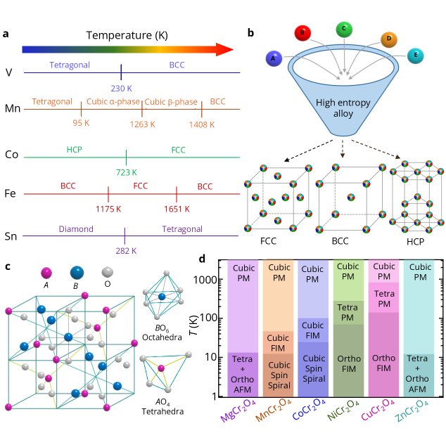
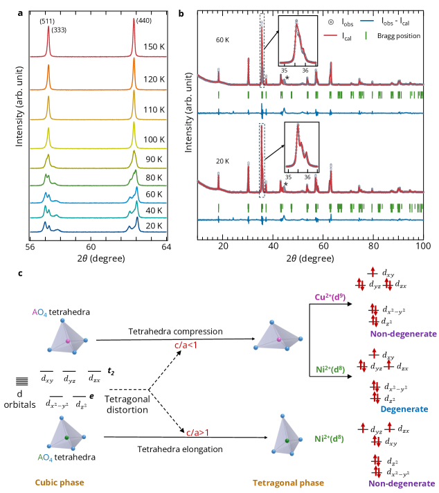
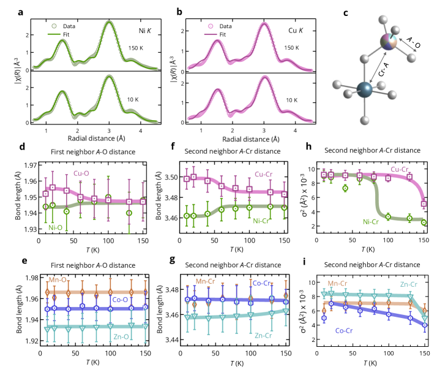
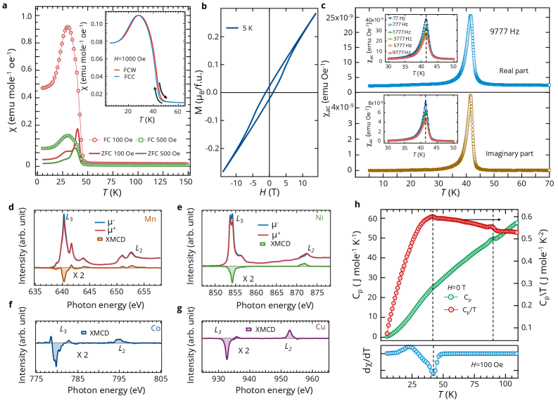
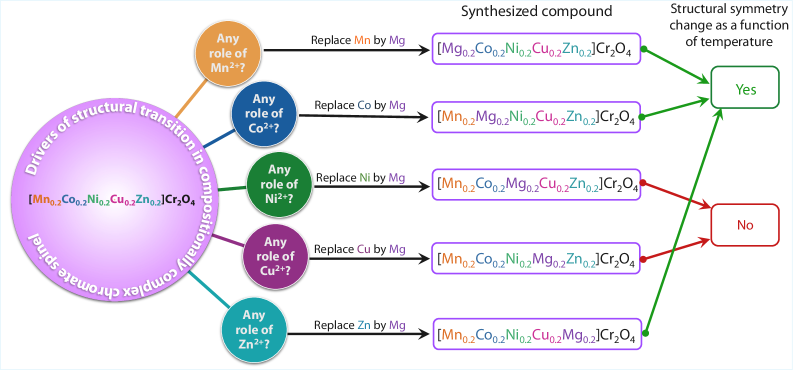

# 高エントロピー酸化物における配置エントロピーと協調的相転移

- 執筆日：2026-05-07
- トピック：高エントロピースピネル酸化物における軌道・磁気・構造連成相転移と、元素固有局所歪みの競合・協調メカニズム
- タグ：Structure and Microstructure / Charge, Orbital, and Spin Order / Defects and Impurities / Synchrotron Measurements / First-Principles Calculations
- 注目論文：arXiv:2605.03444 — S. Dey, R. Nevgi et al., "Coupled phase transitions in crystalline solids with extreme chemical disorder" (2025)
- 参照論文数：6

---

## 1. なぜ今この話題なのか

材料科学において「エントロピー」という言葉が設計原理として語られるようになったのは、高エントロピー合金（HEA: High-Entropy Alloy）の登場からである。2004年にCantor らと Yeh らがそれぞれ独立に発表した5元素以上を等原子比で混合した合金系は、単相のFCCやBCC構造を安定化するという驚くべき性質を持ち、超高強度・耐熱性・耐腐食性を両立できることが示された。この成功の鍵は「配置エントロピー」であった。多数の元素が結晶格子上にランダムに配置されることで生まれる混合エントロピーが、金属間化合物の生成を抑制し、単相の固溶体を熱力学的に安定化するというアイデアである。

このHEA概念は、2015年にRost らによって酸化物セラミックスへと拡張された。コーネル大学のグループが (Mg, Co, Ni, Cu, Zn)O という5元素等原子比の岩塩型酸化物を合成し、高い混合エントロピー（$S_\text{config} \geq 1.5R$, ここで $R$ は気体定数）が単相の安定化をもたらすことを示した。これが高エントロピー酸化物（HEO: High-Entropy Oxide）の誕生であり、以来、スピネル型・ペロブスカイト型・蛍石型・希土類酸化物など多様な結晶構造系でHEOの合成と機能探索が急速に展開されてきた。

しかしHEOに関しては、HEAと同様の「通説」が長らく支配していた。それは「エントロピーが大きいほど、温度変化に伴う対称性低下型の構造相転移は起こりにくい」というものである。HEAでは多数の元素が格子を共有することで格子歪みが複雑に絡み合い、熱力学的な対称性破れの駆動力が抑制される。HEOでも同様に、各遷移金属イオンが好む局所歪みの向きや大きさが異なるため、それらが互いに打ち消し合い、格子全体としては高対称な立方晶構造に留まると考えられてきた。

ところが、2025年5月に Indian Institute of Science（インド科学大学院大学）の Middey グループが発表したのは、この通説を真っ向から覆す実験結果であった。スピネル型クロム酸化物 [Mn$_{0.2}$Co$_{0.2}$Ni$_{0.2}$Cu$_{0.2}$Zn$_{0.2}$]Cr$_2$O$_4$（以下MCNCZCr$_2$O$_4$と略記）が、冷却過程で2段階の連成構造相転移を起こすことを直接実証したのである。しかも注目すべきことに、この転移はランダムな化学的無秩序の存在にもかかわらず起こるのではなく、異なるヤーン・テラー（JT）活性イオンが共存することで「競合を通じた協力」という新しい機構によって生じることが示された。

この発見はHEO設計に新しいパラダイムをもたらす。配置エントロピーは単に秩序を抑制するだけではなく、適切な設計によっては多彩な相転移を誘起できる。化学的無秩序という混沌のなかから、組織化された秩序が生まれる可能性を示したことで、機能材料設計の概念が大きく広がりつつある。

---

## 2. この分野の未解決問題

高エントロピー酸化物の物性研究には、現在もいくつかの根本的な問いが未解決のまま残されている。

第一の問いは「極度の化学的無秩序の中で、長距離秩序は本当に発現できるか」というものである。磁気秩序や軌道秩序は通常、多体相互作用の長距離相関が積み重なることで生じる。HEOでは各格子点に異なる種類のイオンがランダムに座るため、イオン間の交換相互作用の強さや符号がサイトごとに大きく異なる。このような非一様な相互作用の海において、スピングラスではなく長距離磁気秩序が発現するか否か、またその転移がどの統計力学的クラスに属するかは、議論が続いている。Sharma ら（arXiv:2407.20393）が報告したスピネル型HEOでの室温近傍の強磁性体転移と平均場的な臨界指数の実証は、「均一化された平均的環境」の近似が意外にも成立することを示す重要な例となっている。

第二の問いは「元素固有の局所歪みは、どうして互いに独立に存在でき、またどのように全体の秩序に結びつくのか」である。HEOでは各サイトで異なる遷移金属イオンが局所的に周囲の酸素を歪ませる。この局所歪みは平均結晶構造には反映されない場合が多く、拡張X線吸収微細構造（EXAFS）などの局所プローブでのみ検出できる。局所歪みから大局的な対称性破れが生じるための条件、特に異種ヤーン・テラーイオン間の相互作用の役割は、まだ十分には理解されていない。Dey ら（arXiv:2605.03444）が示した「NiとCuの反対向きの局所歪みが協力して転移を起こす」というメカニズムは、この問いへの一つの回答であるが、どの程度普遍的かは今後の検証を要する。

第三の問いは「配置エントロピーと相転移温度・転移の種類の関係を定量的に予測できるか」である。HEA研究でさえ、高エントロピーが構造相転移を抑制する定量的な理論は未完成である。HEOではさらに酸素配位環境や混合原子価状態の問題が加わり、第一原理計算やモデル理論によるHEOの相図予測は困難を極めている。Bejger ら（arXiv:2505.08055）のランタノイドHEO研究が示すように、XANESとDFT計算を組み合わせることで価数状態や相安定性の化学的起源を解明する試みは進んでいるが、予測能力は限定的である。

---

## 3. 注目論文の核心

Dey, Nevgi, Joshi らとMiddeyグループ（IISc Bengaluru）が2025年5月に発表した論文（arXiv:2605.03444）の核心は、「化学的無秩序度が極めて高いにもかかわらず、複数の連成相転移が起きる」という直接証拠を示した点である。

対象物質は等原子比5元素を A サイトに配置したスピネル型クロム酸化物 MCNCZCr$_2$O$_4$：[Mn$_{0.2}$Co$_{0.2}$Ni$_{0.2}$Cu$_{0.2}$Zn$_{0.2}$]Cr$_2$O$_4$ である。室温では単相の立方晶スピネル構造（空間群 $Fd\bar{3}m$）であることが粉末X線回折（XRD）のリートベルト解析で確認され、走査型電子顕微鏡のEDSマッピングと走査型透過電子顕微鏡観察から、5種類の A サイト陽イオンはマイクロメートルからナノメートルスケールにわたって均一に分布していることが確かめられた。

*図1（arXiv:2605.03444 Fig.1, CC BY 4.0）: (a) 単体金属の温度誘起相転移、(b) 高エントロピー合金では相転移が抑制されること、(c) 正スピネル構造のAサイト（四面体配位）とBサイト（八面体配位）、(d) 親化合物 ACr$_2$O$_4$ の各Aイオン種に対応する構造・磁気転移のまとめ。*

この物質を冷却すると、XRDで2段階の構造相転移が観察された。

第1段階：約100 K 付近で立方晶から正方晶（空間群 $I4_1/amd$）への転移。XRDで57°付近の回折ピークが分裂することで検出される。60 K における相組成はリートベルト解析から立方晶 21.44%、正方晶 78.56%。

第2段階：約40 K 付近で正方晶から斜方晶（空間群 $Fddd$）への転移。20 K では正方晶 25.85%、斜方晶 74.15%の共存が確認される。

*図2（arXiv:2605.03444 Fig.2, CC BY 4.0）: (a) 温度降下に伴う回折ピーク分裂の進行、(b) 60K・20K でのリートベルト解析、(c) Cu$^{2+}$（d$^9$）とNi$^{2+}$（d$^8$）で方向が逆の正方歪みが縮退を解くスキーム。*

第1段階の転移は**軌道秩序**によって引き起こされると論文は主張している。磁気測定（後述）は40 K で強磁性体転移を示すため、100 K の転移は磁気スピン相関よりも軌道自由度が主な駆動力であることが示唆される。重要な問いは「なぜ複数のJT活性イオンが競合しているにもかかわらず、1種類の正方歪み方向が選ばれるのか」である。リートベルト解析では格子定数 $c = 8.27$ Å, $a = 5.92$ Å の圧縮正方歪み（$c/a^* < 1$）が得られており、これはCuCr$_2$O$_4$型の振る舞いに対応する。しかしNi$^{2+}$（d$^8$）は本来、軌道縮退を解くために $c$ 軸方向への伸長（$c/a^* > 1$）を好む。平均の格子は Cu 型の歪みを取っているが、Ni の縮退はどのように解けるのかという矛盾が生じる。

この謎を解くために論文は元素固有のEXAFS測定を行った。Mn, Co, Ni, Cu, Zn, Cr の各K端でのEXAFSを150 K〜10 K の温度範囲で測定した結果、Cu と Ni の局所構造が互いに**反対方向**に変化することが明らかになった。具体的には、100 K 以下の冷却で Cu-O 結合長と Cu-Cr 結合長は増加する一方、Ni-O 結合長と Ni-Cr 結合長は減少する。すなわち Cu 周囲は膨張し、Ni 周囲は収縮する、という互いに競合した局所歪みが共存しているのである。Mn, Co, Zn の各 A サイト陽イオンは温度によらず結合長が安定しており、転移に関与しない。

*図3（arXiv:2605.03444 Fig.3, CC BY 4.0）: (a) Ni K端、(b) Cu K端のEXAFSスペクトルと150K・10Kでのフィット。(d-i) JT活性なNi・Cuとそれ以外の結合長・デバイ-ウォーラー因子の温度依存性。NiとCuの局所歪みが逆方向に変化することが示されている。*

磁気測定では、40 K 付近で急激な磁化率の増加が見られ、強磁性体（ferrimagnetic）転移が確認された。AC磁化率測定では周波数依存性がなく、スピングラスではない長距離磁気秩序であることが確かめられた。XMCD（X線磁気円二色性）測定で Mn, Co, Ni, Cu の L 端の信号が同符号であり、A サイトの全スピンが同方向に並んでいることも示された。

*図4（arXiv:2605.03444 Fig.4, CC BY 4.0）: (a) ZFC/FC磁化率（100・500 Oe）と履歴（1000 Oe）、(b) 5K でのM-H曲線（±14 T）、(c) AC磁化率の周波数依存なしのピーク（～41K）、(d-g) Mn, Ni, Co, Cu L端のXMCD信号、(h) 比熱 $C_P$ と $C_P/T$ の2つの特徴（90K・41.8K）。*

比熱測定は90 K と41.8 K に2つの特徴を示す。90 K のピークは磁場（9 T）に依存せず純粋な構造転移に対応し、41.8 K の特徴は9 T 磁場下で48.4 K にシフトし、磁気-構造連成転移であることを示す。

系統的な置換実験（各A サイト陽イオンを1種類ずつ非磁性・非JT活性な Mg$^{2+}$で置換）から、NiとCuが両方同時に存在する場合にのみ相転移が起こることが実証された。さらに $[Mn_{0.2}Co_{0.2}Cu_{0.4}Zn_{0.2}]$Cr$_2$O$_4$（Ni を Cu に置換した組成、$S_\text{config} < 1.5R$）では20 K で100% 斜方晶となり、高エントロピー閾値以下でも相転移が起こることが確認された。逆に $S_\text{config} = 1.61R$ の組成でも JT 活性イオンが片方しか存在しない場合は転移が起こらない。これは「配置エントロピーの高さではなく、異種 JT 活性イオンの共存が転移の必要条件」であることを決定的に示している。

*図5（arXiv:2605.03444 Fig.5, CC BY 4.0）: Ni または Cu を Mg で選択的に置換した系列における、温度誘起構造相転移の有無のまとめ。NiとCuの共存が転移の必要条件であることが一目でわかる。*

論文はこのメカニズムを「**competition through cooperation（競合を通じた協力）**」と名付けた。Cu$^{2+}$ と Ni$^{2+}$ が互いに反対方向の局所歪みを生じさせ（競合）ながら、その競合が格子全体の対称性破れを協力して駆動する（協力）という逆説的な現象である。

---

## 4. 背景と研究史

高エントロピー合金（HEA）の概念が登場した2004年以降、「多数の元素の混合が秩序を壊す」という見方は金属材料科学の常識となった。HEAでは BCC や FCC の高対称構造が常に優先され、温度変化によって対称性が下がる相転移はほぼ報告されていない。この安定性は、金属結合の等方性と多元素のランダム配置が格子歪みを均質化するためと理解されている（George et al., Nature Reviews Materials 2019）。

酸化物系でも同様の考え方が引き継がれた。Rost らが2015年に報告した (Mg, Co, Ni, Cu, Zn)O 岩塩型 HEO では、各カチオンが好む局所配位歪みが相殺し合い、平均構造としては理想的な岩塩型が安定化される。以来、多くのHEO合成研究が「単相立方晶の安定化」を主目標とし、配置エントロピーが高いほど構造転移が抑制されるという傾向が繰り返し報告されてきた。

スピネル構造の酸化物は、HEO研究にとって特別に豊かな舞台を提供する。一般式 AB$_2$O$_4$ で表されるスピネルは、A サイト（四面体配位）と B サイト（八面体配位）が異なる局所対称性を持つため、A サイトと B サイトに異なる元素を配置して機能を制御する設計の自由度が高い。親化合物の単一元素系スピネル ACr$_2$O$_4$ では A イオンの種類に応じて多彩な相転移が見られる。非磁性・非JT活性な Zn や Mg を A サイトとする ZnCr$_2$O$_4$ はスピン・パイエルス転移を示し、磁性だがJT不活性な Mn や Co を A サイトとする場合は強磁性体（ferrimagnet）転移のみが起こる。そして JT 活性な Ni$^{2+}$ や Cu$^{2+}$ を A サイトとする NiCr$_2$O$_4$ や CuCr$_2$O$_4$ では、冷却とともに軌道秩序による立方晶→正方晶転移と、続く磁気秩序による正方晶→斜方晶転移という2段階の連成転移が知られていた。

このような単成分系の知見を多成分 HEO に持ち込もうとした先行研究として、Dey ら（2024年、arXiv:2406.01156）による「組成複雑スピネル酸化物 A$_5$Cr$_2$O$_4$ における局所構造歪みが磁気分子場を支配する」という研究がある。この研究では Ni$^{2+}$ または Cu$^{2+}$ を含む組成複雑スピネルにおいて、局所的な JT 歪みが EXAFS で観測され、それが磁気分子場の大きさを決定することが示された。注目論文（2605.03444）はこの先行研究を直接の出発点とし、「では複数の JT 活性イオンが共存したらどうなるか」という問いを立てて進化させたものといえる。

一方で Sharma ら（arXiv:2407.20393）が別のスピネル型 HEO（(Ni,Mg,Co,Cu,Zn)(Mn,Fe,Cr)O$_4$）において室温近傍での強磁性体転移と平均場理論と整合する臨界指数を報告したことは、HEO の磁気転移研究に重要な文脈を与えている。彼らの系では磁気転移温度は約293 K と非常に高く、飽和磁化も 766 emu/cm$^3$ と大きいが、今回の注目論文が扱う構造相転移は低温（100 K, 40 K）で起こる点で異なる。Sharma らの結果は「高エントロピーの乱れの中でも長距離磁気秩序が成立し得る」というエビデンスとして背景を与えつつ、今回の転移とは転移温度・機構の双方で区別される。

---

## 5. どの解釈が最も妥当か

この論文の中心的な主張——「二種類の JT 活性イオンの反対向き局所歪みの競合が、大局的な対称性破れを協力して引き起こす」——はどの程度支持されているか、他の解釈と比較して検討しよう。

まず最も直接的な根拠はEXAFSである。Cu-O と Ni-O の結合長が100 K 以下で反対方向に変化し、しかもその変化が XRD の相転移温度と一致することは強力な証拠である。デバイ-ウォーラー因子 $\sigma^2$ の増大も Cu の局所 JT 歪みが大局的な対称性破れよりやや先行することを示しており（Cu の $\sigma^2$ 増大は130 K 付近から、大局転移は100 K）、Cu が転移の「先行者」である可能性を示唆する。これはKhomskii の教科書で強調された「局所歪みが長距離ひずみ場を介して遠距離の軌道占有に影響する」という議論と整合している。

次に系統的な置換実験が決定的な証拠を追加する。Ni のみ（Cuなし）でも Cu のみ（Niなし）でも相転移は起こらず、両者が共存する場合にのみ転移が見られる。さらに $[Mn_{0.2}Co_{0.2}Cu_{0.4}Zn_{0.2}]$Cr$_2$O$_4$ では Ni が Cu に置換されているにもかかわらず（つまり同種の JT イオンしかない）20 K で100% 斜方晶となる。この対照実験は「相転移に必要なのは高エントロピーではなく、異種 JT イオンの共存」であることを明確に示す。

一つの代替解釈として「化学的偏析が起こっており、NiCr$_2$O$_4$や CuCr$_2$O$_4$ のミクロ相がそれぞれ転移を起こしているだけではないか」という疑問がある。しかし論文はこれをいくつかの手段で否定している。第一に、室温での XRD と TEM・SEM の観察では全元素が均一に分布し、相分離の証拠がない。第二に、低温での構造相共存（例えば60 K での立方晶21% + 正方晶79%）が観測されるが、これは長距離拡散が凍結する低温でのミクロ相分離では説明できない。高エントロピー材料の「拡散緩慢効果」によっても、低温での化学的偏析は起こりえない。

もう一つの問題は「正方歪みの方向性の選択」である。Cu$^{2+}$（d$^9$）は圧縮正方歪み（$c/a^* < 1$）を好み、Ni$^{2+}$（d$^8$）は伸長正方歪み（$c/a^* > 1$）を好む。実際の格子は Cu 型の圧縮正方晶となっているが、Ni の d$^8$ 縮退はどのように解けているのか。EXAFS が示す答えは「Ni は局所的に収縮（つまり Ni-O 結合は短くなる）し、Cu は局所的に膨張する」という反対方向の局所歪みによって、平均正方晶格子の中でそれぞれの縮退を解くということである。これは非常に示唆に富む解釈であり、単一元素系では見られない「複数の JT イオンが各自の縮退を異なる方向で解く共存状態」を実現している。

この点で Sharma ら（arXiv:2407.20393）のスピネル型 HEO での平均場理論の成立は興味深い対比を与える。Sharma らの系では均一な平均磁気環境の近似が成立し、磁気転移の統計力学的記述に平均場が使える。これは「無秩序が均質化効果をもたらす」という HEO の一面を表す。一方で Dey らの今回の研究は「無秩序の中でも元素固有の局所差異が残存し、それが転移の鍵を握る」という反対の側面を明らかにする。両者は矛盾するのではなく、「磁気秩序の統計論的側面では平均場が成立する一方で、局所構造の元素固有性は消えない」という二面性としてHEOを理解する枠組みを提供する。

Bejger ら（arXiv:2505.08055）のランタノイド系 HEO（(Ce,Sm,Pr,La,Y)O$_2$）では Ce 濃度を増やすと蛍石型からビックスバイト型への相転移が観測されたが、これは陽イオンの酸化還元によらず組成効果（configurational effect）によって駆動されることが DFT + Bader 電荷解析によって示された。これは注目論文の「転移が JT 活性イオンの選択によって駆動される」という化学設計の論理と対応しており、HEO における相転移の起源が「特定の化学成分の選択」によって制御できることを示す傍証となる。

まだ弱い結論としては、転移温度の定量的な起源の帰属が挙げられる。なぜ転移が100 K と40 K に起こるのかを第一原理計算や模型理論で定量的に再現した研究はまだない。また2段階転移の位相共存（立方晶/正方晶の共存、正方晶/斜方晶の共存）が本質的に起こるメカニズム、すなわち「なぜ100% の相転換でなく位相共存になるのか」についても、論文は「異種 JT イオンの反対向き歪みによって相転換のエネルギー障壁が不均一になるため」と推測しているが、直接証拠は限られる。中性子回折による低温磁気構造の完全解析も今後の課題として残されている。

---

## 6. 何が一般化できるか

今回の「競合を通じた協力」パラダイムは、スピネル型クロム酸化物以外にどこまで広げられるか。

まず他の結晶構造への一般化として、同様の A サイト（低対称配位）と B サイト（高対称配位）の組み合わせを持つペロブスカイト構造が候補となる。ペロブスカイト型 ABO$_3$ では A サイトのイオン半径差が傾角（tilting）構造転移を駆動し、B サイトの JT 活性イオン（例えば Mn$^{3+}$ や Cu$^{2+}$）が軌道秩序を引き起こす。高エントロピーペロブスカイト型酸化物（HEP）においても、複数の JT 活性 B サイトイオンを組み合わせることで類似の協調的転移が起きる可能性がある。

機能性への接続という観点では、磁気-構造連成転移はマルテンサイト変態型のアクチュエータ材料や磁気カロリック効果（磁気冷凍）への応用が期待される。配置エントロピーを活用した材料では、転移ヒステリシスを組成で精密にチューニングできる可能性があり、固体冷凍のカルノー効率限界への接近という意味でも注目される。

また今回の研究は元素固有局所構造解析の重要性を改めて示した点で、材料解析手法の観点からも意義がある。XRD では単相と見なされる高エントロピー材料に、実は元素ごとに大きく異なる局所歪みが潜んでいる。EXAFS, XANES, XMCD といった元素選択的なシンクロトロン測定技術が、HEO 研究の標準的手法として確立される必要性をこの論文は明確に示している。

Bejger ら（arXiv:2505.08055）の XAS + DFT アプローチは、ランタノイド系 HEO における価数状態と相安定性の関係を解明するうえで有力な手法の組み合わせを示している。X線吸収分光とDFT計算の組み合わせは、次世代の HEO 設計において「どの元素の組み合わせが目標の転移を引き起こすか」を予測するためのスクリーニングツールとして機能し得る。

---

## 7. 基礎から理解する

### 配置エントロピーとは何か

熱力学では系の乱れの度合いをエントロピー $S$ で表す。特に多成分材料において、異なる種類の原子が格子点にどのように配置されているかという「配列の乱れ」から生じるエントロピーを配置エントロピー（configurational entropy）と呼ぶ。

$N$ 個の格子点に $n$ 種類の元素が $x_1, x_2, \ldots, x_n$ のモル分率で占有されているとき、配置エントロピーは以下のように表される：

$$S_\text{config} = -R \sum_{i=1}^{n} x_i \ln x_i$$

ここで $R = 8.314$ J/(mol·K) は気体定数である。この式はボルツマン統計から導かれる：$S = k_B \ln W$ においてW を多項分布の経路数として計算した結果である。各 $x_i$ が等しい（等原子比、$x_i = 1/n$）とき $S_\text{config}$ は最大値 $R \ln n$ をとる。

$n = 5$ のとき $S_\text{config}^\text{max} = R \ln 5 \approx 1.61R$ である。このため高エントロピー材料の慣習的定義として「5元素以上で $S_\text{config} \geq 1.5R$」という閾値が使われることが多い。注目論文の MCNCZCr$_2$O$_4$ は A サイト5元素等原子比なので $S_\text{config} = 1.61R$ である。

なぜこのエントロピーが相安定性と関係するのか。ギブス自由エネルギー $G = H - TS$ において、温度 $T$ が十分高いとき配置エントロピーの寄与 $-TS_\text{config}$ がエンタルピー $H$（原子間結合の選好性）を凌駕し、混合物の単相安定化を熱力学的に有利にする。これが高エントロピー材料において「多成分が単一の相に安定に共存できる」理由である。

温度が下がると $-TS_\text{config}$ の寄与は小さくなるため、エンタルピー項が支配的になり得る。HEA では金属結合の等方性によってエンタルピー差が小さいため、低温でも単相が保たれやすい。一方 HEO ではイオン結合・共有結合性があり、各カチオンの電子状態に応じた局所歪みエネルギーが無視できない。このため低温で局所歪みが相転移を駆動できる余地が生じる。

### スピネル構造とサイト選択性

スピネル型酸化物 AB$_2$O$_4$ では、A イオンは4個の酸素で囲まれた四面体配位（$T_d$ 対称）、B イオンは6個の酸素で囲まれた八面体配位（$O_h$ 対称）にある。これらの配位環境の違いが各イオンの局所電子状態に大きく影響する。

正スピネル（normal spinel）では2価の陽イオンが A サイト、3価の陽イオンが B サイトを占める。今回の MCNCZCr$_2$O$_4$ では、Mn$^{2+}$, Co$^{2+}$, Ni$^{2+}$, Cu$^{2+}$, Zn$^{2+}$ が等原子比で A サイトをランダムに占有し、Cr$^{3+}$ が B サイトを占める。XAS（X線吸収分光）はこのサイト占有の正しさを確認する有力な手法であり、Cr の L 端 XAS が3価の Cr の $O_h$ 配位に特徴的なスペクトルを示すことで正スピネル構造が確認された。

### 結晶場理論とヤーン・テラー効果

遷移金属イオンの d 電子はどの軌道に入るかによってエネルギーが決まるが、その分裂の様子は周囲の酸素イオンとの静電的相互作用（結晶場）によって決定される。

正八面体配位 $O_h$ では d 軌道が $e_g$（$d_{z^2}$ と $d_{x^2-y^2}$）と $t_{2g}$（$d_{xy}$, $d_{yz}$, $d_{zx}$）の2組に分裂し、$e_g$ の方が高エネルギーとなる。その分裂エネルギーを 10Dq または $\Delta_O$ で表す。

四面体配位 $T_d$ では分裂の符号が逆転し、$e$（$d_{z^2}$ と $d_{x^2-y^2}$）が低エネルギーとなる。分裂エネルギーは $4/9 \Delta_O$ と小さい。

ヤーン・テラー（JT）効果は、軌道縮退した基底状態をもつイオンが格子歪みを通じてエネルギーを得るという現象である。JT 定理は「軌道縮退した基底状態を持つ非線形分子（または格子点）は、対称性を下げることでエネルギーを低下させる」ことを保証する。

Ni$^{2+}$ は d$^8$ 電子配置を持ち、$O_h$ 環境では $t_{2g}^6 e_g^2$ となる。$e_g$ の2つの軌道に電子が1個ずつ（または空軌道との組み合わせ）入ると縮退が生じる場合があり、四面体配位の Ni$^{2+}$ は弱い JT 変形（伸長）を示す。一方 Cu$^{2+}$ は d$^9$ であり、$t_{2g}^6 e_g^3$ の配置は $e_g$ 軌道に3個の電子が入り強い縮退を生じさせる。四面体配位の Cu$^{2+}$ は圧縮型の JT 歪みを好む（d$^9$ では $e$ 軌道縮退を圧縮で解くことが有利）。

この Cu$^{2+}$ と Ni$^{2+}$ のJT歪みの方向の違いが、今回の論文の核心に直結する。それぞれ方向が逆の局所歪みを好むため、5元素共存の格子では「競合」が生じる。しかしその競合が、ある閾値（両者の共存）を超えると大局的な対称性破れを「協力」して引き起こす。

### XAFSとは何か

X線吸収微細構造（XAFS: X-ray Absorption Fine Structure）は、特定の元素のX線吸収端近傍のスペクトルを解析して局所構造情報を得る手法である。XAFS は大きく XANES と EXAFS に分かれる。

X線吸収近端構造（XANES: X-ray Absorption Near Edge Structure）は吸収端から約50 eV 以内の領域を指し、吸収原子の酸化数や配位対称性に敏感な情報を含む。EXAFS（Extended X-ray Absorption Fine Structure）は吸収端から数十〜千 eV 以上の領域の振動構造であり、フーリエ変換によって吸収原子周囲の動径分布関数（配位原子の種類・距離・数）が得られる。

EXAFS の原理はシンプルである。X線による光電効果で放出された光電子が周囲の原子で後方散乱され、その干渉によって吸収係数に振動が生じる。吸収係数の振動 $\chi(k)$ は以下の式で記述される：

$$\chi(k) = \sum_j \frac{N_j S_0^2 f_j(k)}{k R_j^2} \exp(-2\sigma_j^2 k^2) \exp\left(-\frac{2R_j}{\lambda(k)}\right) \sin(2kR_j + \phi_j(k))$$

ここで $k$ は光電子の波数、$N_j$ は第 $j$ 配位殻の配位数、$R_j$ は吸収原子との距離、$\sigma_j^2$ はデバイ-ウォーラー因子（位置の乱れの二乗平均）、$f_j(k)$ と $\phi_j(k)$ はそれぞれ散乱振幅と位相シフトである。

デバイ-ウォーラー因子 $\sigma^2$ は熱振動と静的歪みの両方の寄与を含む。温度降下とともに $\sigma^2$ が増大する場合、それは熱振動の凍結ではなく静的な局所歪みの増大を意味し、局所 JT 歪みの出現を示す有力な指標となる。今回の論文で Cu-Cr 距離の $\sigma^2$ が130 K 付近から増大する観測は、この指標に基づいた解析の成果である。

XAFS は元素選択的なプローブであるため、今回のように5種類の A サイト陽イオンが存在する HEO で「どの元素の局所環境が変化するか」を個別に識別できる。XRD が格子全体の平均構造を与えるのに対し、EXAFS は原子スケールでの個別元素の局所環境情報を与える。この相補性が、HEO 研究において極めて重要な意味を持つ。

### 磁気-構造連成転移

磁気秩序と格子歪みの連成（magnetostructural coupling）は、交換相互作用がイオン間距離に依存することで生じる。超交換相互作用（superexchange）は酸素を介した間接的な交換であり、磁気モーメントを持つ金属イオン-酸素-金属イオンの角度と距離に強く依存する。Goodenough-Kanamori 則はこの角度依存性を整理した半経験則であり、M-O-M 角度が180° に近いほど反強磁性的、90° に近いほど強磁性的となる傾向がある。

構造転移によって M-O-M 角度が変化すると超交換の符号や大きさが変わるため、磁気秩序のオンセットが構造転移と連動する。今回の MCNCZCr$_2$O$_4$ では40 K で斜方晶転移と強磁性体転移が同時に起こるのは、この連成の典型例である。比熱の41.8 K ピークが9 T 磁場で48.4 K にシフトする事実は、磁気エネルギーが転移温度を変えるほど構造自由エネルギーに寄与していることを示す直接証拠であり、「磁気-構造連成」の強さを定量的に示している。

---

## 8. 専門用語の解説

**高エントロピー酸化物（HEO: High-Entropy Oxide）**
5種類以上の主要カチオンを等原子比（またはほぼ等原子比）で含む複合酸化物で、配置エントロピーが $S_\text{config} \geq 1.5R$ を満たすもの。単相の結晶構造を熱力学的に安定化する「エントロピー安定化」が特徴。2015年のRost らの岩塩型 (Mg,Co,Ni,Cu,Zn)O が最初の代表例。HEO はリチウムイオン電池カソード材料・触媒・熱電変換材料・磁性材料など幅広い応用が期待されている。今回の論文ではスピネル型 HEO が対象であり、複数の JT 活性イオンの組み合わせによって相転移が制御されることが示された。

**スピネル構造**
一般式 AB$_2$O$_4$ で表される複合酸化物の結晶構造。立方晶系（空間群 $Fd\bar{3}m$）をとり、A サイト（四面体配位）と B サイト（八面体配位）が異なる局所対称性を持つ。A サイトは全体の1/8を占め、B サイトは1/2を占める。磁性スピネルは変圧器の磁心など磁性材料として産業的にも重要。今回の MCNCZCr$_2$O$_4$ では A サイトに5種類の2価イオン、B サイトに Cr$^{3+}$ が入った正スピネル型。

**ヤーン・テラー（JT）効果**
対称性の高い配位環境にある遷移金属イオンが、軌道縮退を持つとき自発的に周囲の配位子を変位させて縮退を解き、エネルギーを下げる現象。Cu$^{2+}$（d$^9$）と Ni$^{2+}$（d$^8$、四面体配位）が代表的な JT 活性イオン。単成分の CuCr$_2$O$_4$ や NiCr$_2$O$_4$ では JT 効果が軌道秩序と構造転移を引き起こす。今回の論文ではCu と Ni が反対方向の JT 歪みを生じさせるため「競合」が生じ、それが「協力」して相転移を引き起こすという新しい描像が提示された。

**配置エントロピー（Configurational Entropy）**
多成分系で格子点に複数種の原子がランダム配置される際に生じる混合エントロピー。$S_\text{config} = -R\sum_i x_i \ln x_i$ で計算される（$x_i$ は各元素のモル分率）。等原子比 $n$ 元素では $S_\text{config} = R\ln n$。配置エントロピーはギブス自由エネルギーを下げることで多成分の単相固溶体を安定化させる熱力学的駆動力となる。今回の研究では、高い配置エントロピー（1.61R）を持つにもかかわらず相転移が起こり、転移の決定因が $S_\text{config}$ ではなく特定のイオンの組み合わせであることが実証された。

**軌道秩序（Orbital Order）**
JT 活性イオンが特定の d 軌道を選択的に占有し、その占有パターンが長距離的に規則化した状態。典型的には格子の対称性低下（立方晶→正方晶など）として現れる。LaMnO$_3$ やマンガン酸化物での $e_g$ 軌道秩序が有名な例。NiCr$_2$O$_4$ や CuCr$_2$O$_4$ では冷却とともに軌道秩序が立方晶→正方晶転移を引き起こす。今回の HEO スピネルでは100 K の立方晶→正方晶転移が軌道秩序によって引き起こされると解釈されており、その証拠として磁気転移（40 K）との分離が挙げられている。

**EXAFS（拡張X線吸収微細構造）**
特定元素のX線吸収端から数十〜千 eV 以上のエネルギー領域に現れる振動構造で、吸収原子周囲の局所構造（結合距離、配位数、熱・静的乱れ）を元素選択的に調べる手法。シンクロトロン放射光を用いることで高精度な測定が可能。フーリエ変換によって動径分布関数が得られる。今回の論文では Mn, Co, Ni, Cu, Zn, Cr の K 端 EXAFS を各温度で測定し、JT 活性な Ni と Cu だけが温度変化に伴う局所環境変化を示すことを確認した。平均結晶構造（XRD）では見えない元素固有の局所歪みを可視化する点で、HEO 研究に不可欠な手法。

**XMCD（X線磁気円二色性）**
右円偏光と左円偏光のX線吸収スペクトルの差を測定することで、特定元素の磁気モーメントを元素選択的に調べる手法。差スペクトルは吸収原子の純磁気モーメントに比例し、L 端の XMCD では和則（sum rules）から軌道磁気モーメントとスピン磁気モーメントを分離することもできる。今回の論文では 2 K・6 T 磁場下で Mn, Co, Ni, Cu の L 端 XMCD を測定し、全 A サイトスピンが同方向に向いていること（ferrimagnetic ではなくコリニア型配列）を確認した。Cr の XMCD が検出されなかった事実は Cr スピン間の強反強磁性的交換を示唆する。

**強磁性体転移（Ferrimagnetic Transition）**
強磁性体（ferrimagnet）とは、異なるサブ格子に逆向きの磁気モーメントが並んでいるが、それらが完全に打ち消し合わず正味の自発磁化を持つ磁気相。フェライト（Fe$_3$O$_4$ など）が典型例。スピネル型では A サイトと B サイトのスピンが反平行（$d-$ 型の超交換）となることで、両サブ格子の磁化の差として自発磁化が生じる。今回の MCNCZCr$_2$O$_4$ では40 K 以下で長距離強磁性体秩序が現れ、XMCD から A サイト（Mn,Co,Ni,Cu）スピンが全て同方向（Cr と逆方向）であることが示された。

**デバイ-ウォーラー因子（Debye-Waller factor）**
EXAFS の解析において、吸収原子と散乱原子間の距離の乱れを表すパラメータ $\sigma^2$。熱振動由来の動的乱れと、局所構造の不規則性による静的乱れの両方を含む。温度が低下しても $\sigma^2$ が増加する場合、静的な局所歪みの増大を意味する。今回の論文では Cu-Cr 結合の $\sigma^2$ が130 K 付近から増大し始め、これが100 K の全体的な構造転移に先立つ局所 JT 歪みの先駆けとして解釈された。

**磁気-構造連成転移（Magnetostructural Phase Transition）**
磁気秩序と格子構造変化が同時に、または強く連動して起こる転移。一次転移的な性格を持つことが多く、転移温度近傍での熱ヒステリシス（加熱・冷却曲線の不一致）として観察される。マルテンサイト変態と磁気転移の連成は磁気形状記憶効果の起源でもある。今回の MCNCZCr$_2$O$_4$ では40 K の磁気-構造連成転移が 1000 Oe での冷却・昇温磁化率のヒステリシス、9 T 磁場での転移温度シフト、比熱ピークの磁場依存性から実証された。

---

## 9. 将来展望

今回の研究によってかなり確からしくなったことの第一は、「高エントロピー酸化物においても温度誘起型の構造相転移が可能であり、その可否は配置エントロピーの高さよりも特定のイオン組み合わせが鍵を握る」という設計原理である。Ni$^{2+}$ と Cu$^{2+}$ という異種 JT 活性イオンの共存が必要条件であることが置換実験で実証されており、「JT 不活性イオンを JT 活性イオンに置換すれば新たな転移が生じる可能性がある」という逆設計の道筋が開かれた。HEO の研究コミュニティにとって、「エントロピー＝秩序の破壊」という固定観念を脱却し、「特定の競合する局所歪みを組み合わせることで秩序を制御できる」という積極的な設計思想が確立しつつある。

一方でまだ未確定なことも多い。まず定量的な予測能力の欠如が課題である。なぜ転移が100 K と40 K にそれぞれ起こるのか、第一原理計算や有効模型理論による定量的な再現は達成されていない。JT 活性イオンの局所歪みエネルギー、弾性エネルギー、磁気交換相互作用の三者の競合を同時に扱う計算は困難であり、DFT＋U や DFT＋DMFT（動的平均場理論）を用いた大規模計算が必要になる。また位相共存の出現機構——なぜ100% の相変換でなく立方晶・正方晶が40〜80% ずつ共存するのか——についても定量的なモデルはまだない。さらに2段階転移に伴う磁気構造の完全解析（スピン配列の詳細）は、中性子回折の磁場環境での精密実験を待っている。

次に重要になる実験・理論・計算として、以下のものが挙げられる。まず偏極中性子回折実験による磁気構造精密化は最優先課題であり、A サイト（Mn,Co,Ni,Cu,Zn の混合）と B サイト（Cr）のスピン配列を直接可視化できる。次に固体 NMR や μSR（ミュオン・スピン緩和）による局所磁場分布の測定は、スピングラス的成分の有無や短距離磁気秩序の消長を調べるうえで有効である。計算面では、機械学習力場（MLFF）を用いた大規模分子動力学が、10 nm スケール以上の局所構造不均一性の熱力学的記述に貢献するかもしれない。設計面では、今回の知見をスピネル以外のペロブスカイトや他の複合酸化物型に展開し、「異種 JT 活性イオンの共存」という設計指針の普遍性を検証することが次のステップとなる。「競合を通じた協力」というパラダイムが、複数の物性（磁気・強誘電・弾性）が連成する高機能マルチフェロイック HEO の設計原理へと発展する可能性は、今後の研究にとって最も期待される方向の一つである。

---

## 参考論文一覧

1. **[arXiv:2605.03444](https://arxiv.org/abs/2605.03444)** — S. Dey, R. Nevgi et al., "Coupled phase transitions in crystalline solids with extreme chemical disorder," (2025). 【注目論文】高エントロピースピネル MCNCZCr$_2$O$_4$ における2段階連成構造相転移（100 K 軌道秩序・40 K 磁気秩序）を実証し、異種 JT 活性イオン（Ni,Cu）の「競合を通じた協力」メカニズムを提案した。

2. **[arXiv:2407.20393](https://arxiv.org/abs/2407.20393)** — N. Sharma et al., "Validating Mean Field Theory in a New Complex, Disordered High-Entropy Spinel Oxide," (2024). 高エントロピースピネル (Ni,Mg,Co,Cu,Zn)(Mn,Fe,Cr)O$_4$ において室温近傍の強磁性体転移と平均場臨界指数を確認し、極度の無秩序の中でも長距離磁気秩序と平均場描像が成立することを示した。

3. **[arXiv:2505.08055](https://arxiv.org/abs/2505.08055)** — G.R. Bejger et al., "Lanthanide L-Edge Spectroscopy of High-Entropy Oxides: Insights into Valence and Phase Stability," (2025). ランタノイド系 HEO (Ce,Sm,Pr,La,Y)O$_2$ で Ce 濃度増加によるビックスバイト→蛍石型の相転移を XAS と DFT で解析し、相転移が酸化還元でなく組成効果で駆動されることを示した。

4. **[arXiv:2406.01156](https://arxiv.org/abs/2406.01156)** — (2024). 組成複雑スピネル A$_5$Cr$_2$O$_4$ における局所 JT 歪みが磁気分子場の強さを決定することを EXAFS/XANES で示し、局所構造と磁気特性の定量的関係を確立した先行研究。

5. **C.M. Rost et al., Nature Communications 6, 8485 (2015)** — HEO の概念を最初に報告した論文。5元素等原子比の岩塩型 (Mg,Co,Ni,Cu,Zn)O がエントロピー安定化によって単相を保つことを示し、高エントロピー酸化物研究の出発点となった。

6. **E.P. George, D. Raabe, R.O. Ritchie, Nature Reviews Materials 4, 515 (2019)** — 高エントロピー合金の包括的レビュー。HEA が単相高対称構造を優先し構造相転移を示さない理由を整理し、エントロピー安定化の概念を体系化した。HEO への類推的適用の基礎となる文献。
