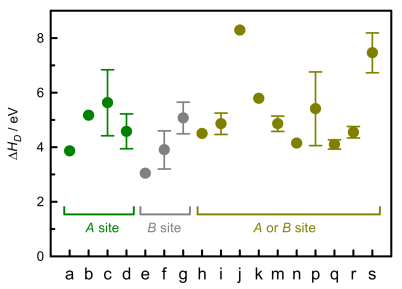
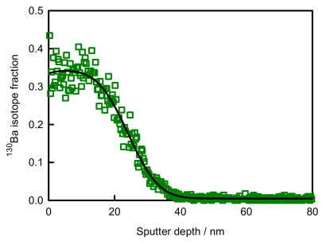
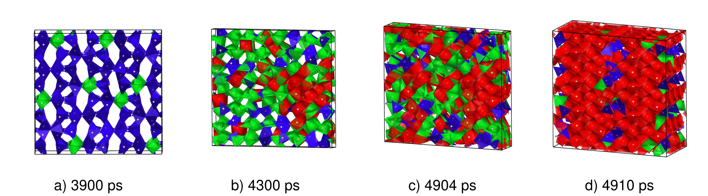
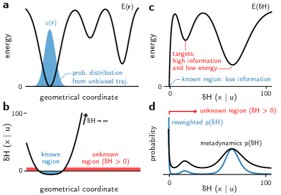
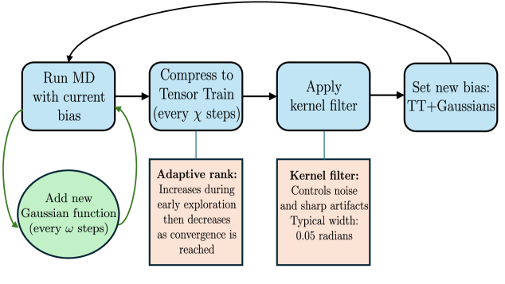
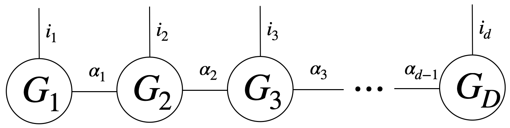

# 結晶中の空孔拡散と相変態を自由エネルギー地形から解く

- 執筆日: 2026-05-07
- トピック: 結晶中の欠陥拡散・相変態に対するメタダイナミクス拡張サンプリング法
- タグ: Computation and Theory / Defects and Impurities; Phase Transitions / Molecular Dynamics; Machine Learning
- 注目論文: arXiv:2604.09007 — "Metadynamics for Vacancy Dynamics in Crystals," Toyoura & Yamada (2026)
- 参照論文数: 7

---

## 1. なぜ今この話題なのか

固体材料の性能を左右する多くの現象——空孔拡散、イオン伝導、固相転移、核生成——は共通して「稀な事象（rare event）」という性質をもつ。エネルギー障壁が高いため、通常の分子動力学（MD）シミュレーションで観察されるフェムト秒からナノ秒の時間スケールでは事象が起こらず、実験で観察される現象（マイクロ秒から秒以上）を直接計算で再現することが難しい。

材料設計の観点から、この問題が特に重要になっているのは三つの理由による。第一に、電池・燃料電池・半導体デバイスの性能がイオン拡散や欠陥移動の障壁高さに直接依存しており、第一原理精度でのエネルギー障壁評価が設計の要となっている。第二に、機械学習ポテンシャル（MLIP）の急速な発展により、第一原理計算と同程度の精度を持ちながら古典力場の速度で動くMDシミュレーションが実現しつつあり、「いかに長時間・大規模なサンプリングを行うか」というボトルネックが顕在化している。第三に、これまでNEB法（Nudged Elastic Band法）が遷移状態探索の標準手法であったが、多段階経路や複合欠陥、相変態のような複雑な自由エネルギー地形には適用が難しく、より一般的な手法の需要が高まっている。

こうした背景の中で、メタダイナミクス（MetaD）法を中心とした拡張サンプリング手法が材料科学の問題に急速に展開されつつある。2026年4月に Toyoura & Yamada が発表した論文 (arXiv:2604.09007) は、結晶中の空孔ダイナミクスにメタダイナミクスを適用するための新しい手法——「分割ファミリーを持つ並列バイアス MetaD（PB MetaDPF）」——を提案し、従来の空孔座標問題を解決した。本記事では、この論文を主軸に、拡張サンプリング手法の基礎と最前線の展開を俯瞰する。

---

## 2. この分野の未解決問題

### 問い1: 結晶系における有効な集団座標（CV）はどう選ぶか

拡張サンプリング手法の根幹には「集団座標（collective variable, CV）の選択」という問題がある。CVは系の遷移を代表する低次元座標であり、バイアスポテンシャルはこのCV空間に加えられる。タンパク質の折り畳みでは二面角や回転半径が自然なCVとなるが、結晶中の空孔ダイナミクスでは「空孔の位置」を一意に定義すること自体が難しい。等価なサイトが無数にある結晶では、どの位置がどの空孔に対応するかを連続関数として記述する必要があり、単純な座標では対称性の問題が生じる。

さらに、CVとして採用する物理量が間違っている場合、サンプリングが不完全になり自由エネルギー面（FES）に誤差が生じる。何が「正しいCV」かを事前に知ることは難しく、この問いは方法論としての最重要課題の一つである。

### 問い2: 高次元自由エネルギー面の探索をどう効率化するか

固相転移や複合欠陥の問題では、一つのCVでは不十分で複数のCVを同時にバイアスする必要がある。しかし標準的なメタダイナミクスでは、CV数 $d$ が増えると蓄積するガウス関数の評価コストがシミュレーション時間に比例して増加し、さらにCV空間の体積が指数的に増大する（次元の呪い）。このため3〜4次元を超えるCVを同時に扱うことが現実的に困難だという問題がある。テンソルネットワーク (arXiv:2603.13549) や情報エントロピー (arXiv:2604.05239) などの新手法がこの問題への回答として提案されているが、結晶系への一般化はまだ途上にある。

### 問い3: 機械学習ポテンシャルと拡張サンプリングの統合をどこまでスケールできるか

機械学習ポテンシャル（MLIP）と拡張サンプリングの組み合わせは、第一原理計算に近い精度で大規模系の自由エネルギーを求める可能性を開くが、MLIPのエラー蓄積・学習データ不足領域でのシミュレーション信頼性・GPU並列化の技術的課題が残る。GPU加速メタダイナミクスで百万原子の核生成シミュレーション (arXiv:2510.06873) が示されているが、イオン結晶中の複合欠陥や多成分系への適用は依然として難しい。

---

## 3. 注目論文の核心

### 空孔の「位置」を定義するという難問

Toyoura & Yamada (arXiv:2604.09007) が解こうとした問題の核心は、結晶中の空孔を一意に追跡するための集団座標の設計である。

金属やイオン性結晶において、空孔拡散は以下のように進行する。結晶格子上に空孔（原子が抜けた格子点）があり、隣接原子が障壁を越えて空孔サイトにホップすることで実効的に空孔が移動する。この移動エネルギー障壁は典型的に 0.5〜3 eV 程度であり、室温では指数関数的に遅いため、通常のMDでは観察できない。

最大の問題は、「空孔の位置を連続的なCVで記述する方法がない」ことだ。ある格子点が空孔かどうかは離散的であり（ある点に原子があるかないか）、連続的な座標として表現しにくい。これまでの研究では、空孔の位置を表すために「空孔中心の座標」を連続的に追跡する工夫がなされてきたが、等価なサイトが多数存在する結晶では、FESのトポロジーがCV定義に強く依存してしまうという問題があった。

### PB MetaDPF の提案

本論文が提案するのは、この制約を回避するアプローチである。著者らは「並列バイアス MetaD（Parallel Bias MetaD, PB MetaD）」の枠組みを採用し、そこに「分割ファミリー（partitioned families）」という概念を導入した。

PB MetaDでは、複数のCVを同時にバイアスする際に、各CVへのバイアスを独立に計算して足し合わせる。標準的な多次元メタダイナミクスでは全CVを同時にバイアスするガウス関数を蓄積するが、PB MetaDでは各CVのバイアスを独立に更新するため、計算コストがCVの次元数に線形にスケールする。

ここに「分割ファミリー」の概念を組み合わせる。一つの拡散経路を複数の部分経路（ファミリー）に分割し、各ファミリーに対して独立のバイアスポテンシャルを蓄積することで、空孔のホッピング経路全体をCVとして一意に定義することなくFESを構築できる。さらに結晶の並進・回転対称性を活用した「マルチヒル戦略」を導入し、対称的に等価なサイトに対して同じバイアス情報を共有することで、独立に計算する部分を大幅に削減する。

### 検証と主要な結果

この手法を以下の系に適用して検証している。

(1) 金属結晶（面心立方（FCC）金属）における自己拡散：モノ空孔の最近接ホッピングFESを構築し、既知の活性化エネルギーと良好な一致を得た。

(2) 金属結晶（FCC）における不純物拡散：異種原子の近傍に空孔がある状況での拡散経路と障壁高さを計算した。

(3) イオン性結晶における拡散：ペロブスカイト型酸化物でのモノ空孔およびダイ空孔（2つの空孔が対になった欠陥複合体）の拡散経路を計算した。

特に重要なのは、従来困難だった「空孔対（divacancy）」を含む系でのFES計算が可能になった点だ。ダイ空孔は2つの空孔が近接した場合に生じる欠陥複合体であり、FES探索には2つの空孔の相対位置を考慮した多次元CV空間が必要になる。PB MetaDPFは、このような多段階・多体的な空孔問題を統一的に扱えるという点で、従来のNEB法や単純なMetaDアプローチに対して大きな前進を示している。

---

## 4. 背景と研究史

### メタダイナミクスの原点

メタダイナミクスは Laio & Parrinello (PNAS, 2002) によって提案された。基本的なアイデアは「過去に訪れたCV空間の位置に小さなガウス形のバイアスポテンシャルを蓄積していく」ことで、系が同じ場所に留まることを防ぎ、エネルギー障壁を越えやすくするというものだ。長時間の計算後、蓄積したバイアスポテンシャルの符号を反転すると、元のFESの近似が得られる。

その後、Barducci et al. (2008) が「ウェルテンパード MetaD（WT-MetaD）」を提案し、ガウス関数の高さを経過時間と共に徐々に減衰させることで、FESの収束性と精度が大幅に改善された。現在の材料科学研究のほとんどはWT-MetaDを基盤としている。

### NEB法との比較と棲み分け

これまで固体中の遷移経路計算の標準手法は NEB（Nudged Elastic Band）法だった。NEBは既知の初期・終状態から最小エネルギー経路（MEP）を求める方法で、遷移状態の探索には非常に有効だ。しかし、NEBには重要な制限がある。まず、始状態と終状態を事前に知っていなければならない（事前知識が必要）。また、有限温度での自由エネルギー障壁（エンタルピー障壁だけでなくエントロピー寄与を含む）を直接計算することが難しい。さらに、複数の中間状態を経由する複雑な経路や、競合する複数の経路を同時に探索することが難しい。

メタダイナミクスはこれらの制限を補う形で機能する。FESを全体的に「塗りつぶして」探索するため、事前知識なしに複数の経路と中間状態を発見でき、有限温度での自由エネルギー変化を直接得られる。一方で、CVの設計が重要で、CV選択が悪いと正確なFESが得られないという制約がある。NEB は精密な遷移状態特定に、MetaD は探索的・統計的FES計算に、それぞれ相補的な役割を果たす。

### 最近の材料科学への応用

イオン性酸化物への応用として注目すべき論文が、Koerfer et al. による BaTiO3 中の Ba カチオン拡散の研究 (arXiv:2601.09344, CC BY-NC-ND 4.0) だ。この研究は実験（トレーサー拡散実験、TOF-SIMS）とメタダイナミクスシミュレーションを組み合わせ、BaTiO3 中でのバリウム拡散機構を解明した。

*図1: BaTiO3中のBa空孔拡散の活性化エンタルピー（各経路 a〜s は異なる空孔ホッピング機構に対応）。緑のドットは A サイト，灰色は B サイト，黄緑は A または B サイト経由の機構を示す。Koerfer et al., arXiv:2601.09344, CC BY-NC-ND 4.0*

特に興味深いのは結論で、孤立したバリウム空孔ではなく、酸素空孔やチタン空孔との欠陥複合体（defect associate）が実際の拡散を担っているという知見が得られた点だ。これは活性化エンタルピーのみを根拠に拡散機構を解釈することの危険性を明確に示しており、複合欠陥を含む複雑な拡散問題でメタダイナミクスが威力を発揮することを示している。Toyoura & Yamada の提案するダイ空孔計算能力は、まさにこのような欠陥複合体問題に直結する。

*図2: BaTiO3単結晶中の130Baトレーサー拡散プロファイル（実験データ点と拡散方程式によるフィット曲線）。実験は1348〜1498 Kで行われ、活性化エネルギーが決定された。Koerfer et al., arXiv:2601.09344, CC BY-NC-ND 4.0*

高圧相転移への応用の代表例として、コエサイト (SiO2 高圧相) の圧縮経路をメタダイナミクスで追跡した研究 (arXiv:2508.19716) がある。CVとして Si-O 配位数と体積を用い、機械学習ポテンシャル（ACE）と組み合わせることで、35 GPa を超える超高圧下でコエサイトが非晶質化・コエサイト-IV・正八面体相という3つの異なる経路で変態する機構を原子スケールで解明している。

*図3: コエサイトから高圧八面体相（HPO）への変態過程の原子構造スナップショット。コエサイト構造（左）から中間の無秩序状態を経て高圧八面体相（右）へ変態する過程で、Si の配位数が 4 から 6 に変化する。Barrón et al., arXiv:2508.19716, CC BY-NC-SA 4.0*

---

## 5. どの解釈が最も妥当か

### 空孔CVの設計問題への複数のアプローチ

Toyoura & Yamada の提案は「空孔を一意に追跡するCVを定義しない」という逆転の発想に基づくものだが、この問いへの別のアプローチも並行して進んでいる。

**情報エントロピーをCVとするアプローチ** (arXiv:2604.05239) は、CV設計の問題を根本から回避しようとする試みだ。原子配置の局所的な情報エントロピー $\delta H$ をCVとして用い、エントロピーが増加する方向（「未探索の配置に向かう方向」）にバイアスをかける。これにより、秩序変数を事前に定義することなく、核生成・ガラス転移・固相転移を含む多様な系で反応経路と中間状態を「盲目的に発見」できることが示されている。

*図4: 情報エントロピー CV の概念図。δH は局所的な情報エントロピーの超過分を表し、既訪問領域（既知）と未訪問領域（未知）をCV空間で区別する。Liu et al., arXiv:2604.05239, CC BY-SA 4.0*

情報エントロピーCVの長所は汎用性で、原子種・結晶構造に依存しないCVを使えることだ。しかし空孔拡散のような「特定の原子の特定の移動」を選択的にサンプリングしたい場合には、バイアスの目標が拡散しすぎるという問題がある。つまり「何が起こるかわからないが広く探索したい」という用途と、「空孔の拡散経路を精密に求めたい」という用途では、異なる手法が有利になる。

**テンソルトレイン（TT）メタダイナミクス** (arXiv:2603.13549) は次元の呪いという根本的な問題へのアルゴリズム的な回答だ。標準的なメタダイナミクスでは $d$ 次元CVに対するバイアスポテンシャルの評価コストはシミュレーション時間 $t$ とともに $O(t)$ で増大するが、TT-MetaDでは蓄積したガウス関数の和を定期的にテンソルトレイン（TT）形式に圧縮することでメモリと計算コストを$O(d)$に抑える。

*図5: TT-Metadynamics のアルゴリズムフロー。MDを実行しながらガウス関数を追加し、一定ステップごとにテンソルトレイン形式に圧縮することでメモリと計算コストを制御する。Moran & Lindsey, arXiv:2603.13549, CC BY 4.0*

*図6: テンソルトレインの数学的構造。$d$ 次元の自由エネルギー面を $d$ 個の低ランクコアテンソルの積として表現する。各コアテンソルの次元は $n_i \times r_{i-1} \times r_i$（$r_i$ はボンド次元）であり、情報量を制御しながら高次元関数を圧縮できる。Moran & Lindsey, arXiv:2603.13549, CC BY 4.0*

ベンチマーク結果では最大14次元のCVに対して正確なFESが得られており、特に高障壁系では標準的なメタダイナミクスを上回る精度が得られた。ただし、TT-MetaDはあくまで「多次元FES計算の効率化」であり、CV設計の問題自体を解決するものではない。空孔問題では、そもそも何をCVとすべきかという問いに答えるものではなく、Toyoura & Yamadaの手法とは相補的な関係にある。

### GPU加速MLIPとの統合——大規模化の最前線

Zhang et al. の GPU-MetaD (arXiv:2510.06873) は、これらの手法開発とは別の方向からの突破を示す。機械学習ポテンシャルをGPU上で並列実行するフレームワークを構築し、百万原子規模の系に対してメタダイナミクスを適用することを可能にした。GaN の核生成をシミュレーションした結果、従来未知だった「サイズ依存の二段階核生成機構」が発見されている。

空孔拡散問題との関連では、GPU-MetaDのようなスケーラブルなフレームワークはMLIPと組み合わせることで、より大きなスーパーセルや複雑な組成の系に対するFES計算を可能にする。ただし現時点では、Toyoura & Yamadaのアプローチと直接統合しているわけではなく、将来的な発展方向の一つとして位置づけられる。

### 現時点で確実に言えること、言えないこと

比較的強く支持されている結論として、以下が挙げられる。

- PB MetaDPF は空孔CVを一意に定義する必要をなくし、FCC金属やイオン性結晶で既知の活性化エネルギーと一致したFESを与える
- イオン性酸化物（BaTiO3）での実験との比較により、欠陥複合体が拡散を支配するという機構を支持する証拠がある
- メタダイナミクス+MLIPの組み合わせは、コエサイトの高圧相変態、ダイヤモンドのBC8相変態など、複雑な固相転移の複数の経路を「事前知識なし」に再現できる

一方でまだ弱い結論・不確定な点として、以下がある。

- PB MetaDPFは「空孔を含む系に特化した」設計であり、より一般的な欠陥（格子間原子、フレンケル対、不純物クラスター）への拡張が示されていない
- MLIPの精度が自由エネルギー障壁の絶対値に与える影響の定量化がまだ不十分
- 多成分系（三元系以上のイオン性結晶）や高い空孔濃度を持つ系への適用性は未検証
- 情報エントロピーCVやTT-Metadynamicsと空孔問題専用手法のベンチマーク比較が存在しない

---

## 6. 何が一般化できるか

### イオン伝導体・電池材料への展開

最も直接的な応用分野は、固体電解質中のイオン拡散問題だ。Li イオン電池の固体電解質（例：LLZO, LGPS, NASICONなど）や固体酸化物燃料電池の電解質（YSZ, CGO など）では、キャリアイオンが格子空孔や格子間サイトを経由して拡散する。欠陥複合体の拡散障壁が輸送特性を決める重要な因子であるという BaTiO3 での知見 (arXiv:2601.09344) は、これらの系でも同様の状況が存在することを示唆する。Toyoura & Yamada の PB MetaDPF を固体電解質中のリチウム空孔・格子間拡散に適用することで、設計指針が得られると期待できる。

### 高圧・極端条件下での相変態

コエサイトの高圧変態 (arXiv:2508.19716) やダイヤモンドのBC8相変態 (arXiv:2509.00423) の研究は、拡張サンプリング+MLIPが従来のNEB法では困難だった「結晶-結晶型の再構築型相変態」に有効であることを示している。特に後者は、超高圧（1.5〜2 TPa）でダイヤモンドが BC8 相や単純立方相に変態する機構を原子スケールで初めて明らかにしたもので、核生成の液滴形成→結晶化という二段階機構が発見されている。

配位数ベースのCVが「Si-O の4配位→6配位」や「炭素の4配位→高配位」といった変態を自然に記述できることは、結晶の再構築型転移に対するメタダイナミクスの汎用性を示している。空孔拡散でも、一部の系では配位数の変化（例：イオン結合性の強い酸化物でのサイトの部分的な空き）と空孔移動が共役しており、同様のCVが適用できる可能性がある。

### NEB法との相補的利用

実際の材料計算フローでは、MetaDとNEBを相補的に使い分けることが有効と考えられる。MetaDで広域的にFES地形を探索して候補経路を同定し、その後 NEB で各経路の精密な遷移状態を特定するという戦略だ。PB MetaDPF の提案は「MetaDによる探索ステップ」をイオン結晶の空孔問題に利用可能にするものであり、この設計フローの前半部を強化する。

---

## 7. 基礎から理解する

### 稀な事象問題とボルツマン統計

通常の分子動力学シミュレーションは、ニュートンの運動方程式

$$\mathbf{F}_i = m_i \ddot{\mathbf{r}}_i = -\nabla_i U(\{\mathbf{r}\})$$

を数値的に積分するものだ。ここで $U(\{\mathbf{r}\})$ は全原子の位置 $\{\mathbf{r}\}$ に依存するポテンシャルエネルギー（力場）であり、$m_i$ は原子 $i$ の質量、$\mathbf{F}_i$ は原子にかかる力だ。

温度 $T$ での平衡状態では、配置 $\{\mathbf{r}\}$ が実現する確率はボルツマン分布

$$P(\{\mathbf{r}\}) \propto \exp\left[-\frac{U(\{\mathbf{r}\})}{k_\mathrm{B}T}\right]$$

に従う（$k_\mathrm{B}$ はボルツマン定数）。平衡状態では、系は低エネルギーの状態に多くの時間を過ごす。

問題は「障壁」だ。二つのエネルギー的に有利な状態 A と B を隔てる障壁の高さを $\Delta U^{\ddagger}$ とすると、遷移率（単位時間あたりに A→B へ移る確率）は Arrhenius 則に従い

$$k_{A \to B} \approx \nu \exp\left[-\frac{\Delta U^{\ddagger}}{k_\mathrm{B}T}\right]$$

と表せる（$\nu$ はプリエクスポネント因子、通常 $10^{12}$ Hz 程度）。

$\Delta U^{\ddagger} = 1$ eV、$T = 300$ K では $k_\mathrm{B}T \approx 0.026$ eV なので

$$k_{A \to B} \approx 10^{12} \times \exp\left[-\frac{1}{0.026}\right] \approx 10^{12} \times 10^{-17} = 10^{-5}~\mathrm{s}^{-1}$$

つまり平均して $10^5$ 秒（約 28 時間）に一回しか起こらない事象だ。典型的なMDシミュレーションの時間スケールはナノ秒（$10^{-9}$ s）程度であり、これをリアルタイムに観察することは絶対に不可能だ。

### 自由エネルギー面（FES）とは何か

熱力学では、有限温度での安定性を決めるのは自由エネルギーであり、単純なポテンシャルエネルギーではない。CV $s$ の空間での自由エネルギー面（Free Energy Surface, FES）は

$$F(s) = -k_\mathrm{B}T \ln P(s)$$

と定義される。ここで $P(s)$ はCV $s$ の実現確率（周辺確率分布）であり

$$P(s) = \int \exp\left[-\frac{U(\{\mathbf{r}\})}{k_\mathrm{B}T}\right] \delta(s(\{\mathbf{r}\}) - s) d\{\mathbf{r}\} \Bigg/ Z$$

とCV空間への射影として書ける（$Z$ は分配関数）。FES には有限温度でのエントロピー効果が自然に取り込まれており、これがポテンシャルエネルギーの差（NEB で計算される量）とは異なる点だ。

遷移状態から見て、FES上の障壁高さ $\Delta F^{\ddagger}$ が真の遷移速度

$$k_{A \to B} \propto \exp\left[-\frac{\Delta F^{\ddagger}}{k_\mathrm{B}T}\right]$$

を決める量に対応する。高温では、遷移状態付近のエントロピーが大きければ実効的な障壁が低くなる（エントロピー安定化）。メタダイナミクスが直接与えるのはこの $F(s)$ である。

### メタダイナミクスのアルゴリズム

メタダイナミクスの基本アルゴリズムは次のように動作する。

(1) 初期状態から MD を実行し、時刻 $t$ でのCV値 $s(t)$ をトラッキングする。

(2) 一定ステップ $\tau$ ごとに、その時点でのCV空間の位置にガウス関数型のバイアスポテンシャル

$$V_G(s, t) = w \exp\left[-\frac{(s - s(t))^2}{2\sigma^2}\right]$$

を蓄積する。ここで $w$ はガウス関数の高さ（エネルギー単位）、$\sigma$ は幅だ。

(3) 時刻 $t$ でのトータルバイアスポテンシャルは過去のガウス関数の和

$$V(s, t) = \sum_{t' < t, \text{step}} V_G(s, t')$$

となる。

(4) 系は元のポテンシャル $U$ とバイアス $V$ の和 $U + V$ の上を動く。バイアスが蓄積するにつれ、すでに多く訪問した領域は高いバイアスがかかり、系は未訪問の領域に「押し出される」。

(5) 十分長い時間が経過してFESが「均らされた」後、蓄積したバイアスの負の値が元のFESの近似を与える：$F(s) \approx -V(s, t \to \infty)$。

**ウェルテンパード MetaD** では、ガウス関数の高さを動的に減衰させる：

$$w(t) = w_0 \exp\left[-\frac{V(s(t), t)}{k_\mathrm{B}\Delta T}\right]$$

ここで $\Delta T$ はバイアス因子の温度に相当するパラメータだ。この修正により、初期は積極的に探索し、収束後はFESを精密化するバランスが自動的に取れる。

### 集団座標（CV）とその選択

CVは高次元の配置空間 $\{r\}$（$3N$ 次元）から低次元の記述子 $s \in \mathbb{R}^d$ への写像 $s = s(\{r\})$ である。良いCVは以下の条件を満たす必要がある。

(a) 遷移の前後（始状態と終状態）でCV値が異なること。
(b) 遷移状態の近くで急激に変化しないこと（緩やかに連続であること）。
(c) 計算が高速であること（MD の各ステップで評価するため）。

結晶中の空孔の場合、候補となるCVとしては次のようなものが考えられる。

- 空孔「中心」の座標（ただし一意な定義が困難）
- 隣接原子と格子点の距離
- Steinhardt 型の局所秩序パラメータ（六次対称性 $Q_6$ など）
- 各格子点の占有「スムーズ」関数（Gaussian smeared occupancy）
- 配位数や結合数の変化

Toyoura & Yamada は、特定の格子点や方向に依存する従来のCVではなく、空孔の「ホッピング経路」そのものを複数のセグメントに分割してCVを定義するという考え方を採っている。これにより、空孔が結晶中のどこにあるかを一意な座標として追跡する必要がなくなる。

### 並列バイアスMetaDの数学的構造

PB MetaD（Pfaendtner & Bonomi, 2015）では、$d$ 個のCV $s_1, s_2, \ldots, s_d$ に対して独立なバイアスを蓄積する：

$$V^\mathrm{PB}(\{s\}, t) = \sum_{i=1}^{d} V_i(s_i, t)$$

各 $V_i$ は1次元のウェルテンパードMetaDバイアスとして更新される。これに対して標準的な多次元MetaDでは $d$ 次元空間内にガウス関数を蓄積するため、評価コストが $O(Nd^2)$（$N$ は蓄積したガウス関数の数）になるのに対し、PB MetaD では $O(Nd)$ に抑えられる。

PB MetaDPF はこれに「分割ファミリー」の概念を加えたものだ。空孔の移動経路を複数のサブ経路（ファミリー）に分割し、各ファミリーに対して独立な PB MetaD を走らせ、晶体対称性を利用して対称的に等価な経路からの情報を共有することで計算を効率化する。

---

## 8. 専門用語の解説

**稀な事象（Rare Event）**
通常の分子動力学シミュレーションの時間スケール（ナノ秒程度）では起こらないが、実験的に重要な現象を指す。空孔のホッピング、核生成、固相転移などが代表例。エネルギー障壁 $\Delta U^{\ddagger}$ が高いと発生頻度が指数関数的に低下する（Arrhenius 則）。メタダイナミクスは、このような稀な事象を人工的なバイアスポテンシャルによって「加速」するための手法だ。

**集団座標（Collective Variable, CV）**
原子座標の高次元空間を低次元に圧縮する記述子。反応進行度、配位数、結合角、局所秩序パラメータなどが具体例。メタダイナミクスはこのCV空間でバイアスを蓄積するため、CVの選択が結果を大きく左右する。本論文の核心は、結晶中の空孔に適した CV を「一意な空孔座標なし」で設計するアプローチにある。

**自由エネルギー面（Free Energy Surface, FES）**
CV 空間上での自由エネルギー $F(s) = -k_\mathrm{B}T \ln P(s)$ をプロットしたもの。エンタルピー（エネルギー）だけでなく、エントロピー（配位の自由度）の効果が自動的に含まれる。FES の局所極小がメタ安定状態、極大が遷移状態に対応する。実験で測定される拡散係数や相変態速度はこのFESの形状から直接計算できる。

**空孔（Vacancy）**
結晶格子上の原子が抜けた空き格子点。点欠陥の一種。金属中の自己拡散や不純物拡散の主要機構は、この空孔を介したホッピングによる。空孔の形成エネルギーと移動障壁が材料の拡散特性を決定する重要なパラメータで、NEB法やメタダイナミクスで計算される。

**ダイ空孔（Divacancy）**
隣接した2つの格子点が共に空孔になった欠陥複合体。ダイ空孔はモノ空孔2個の結合エネルギーが正（結合している状態が安定）であれば自発的に形成される。BaTiO3のようなペロブスカイト型酸化物では、異種欠陥（Ba空孔と O 空孔）が複合体を形成して拡散することが今回の研究で示されており、これは広義のダイ空孔（欠陥複合体）問題だ。

**NEB法（Nudged Elastic Band Method）**
既知の始状態と終状態を結ぶ最小エネルギー経路（MEP）を求める手法。経路上に複数のイメージ（中間構造）を置き、それらをスプリングで繋いだバンドを緩和することでMEPを探索する。遷移状態の精密な特定に優れるが、始・終状態を事前に知っている必要があり、複数の経路や有限温度効果を扱いにくい。メタダイナミクスとの最大の違いは、自由エネルギー（温度効果）ではなく零温度エネルギー障壁を計算する点だ。

**機械学習ポテンシャル（Machine Learning Interatomic Potential, MLIP）**
量子力学的な電子状態計算（DFT など）のデータを学習し、その精度で原子間相互作用を予測するニューラルネットワーク等のモデル。従来の古典力場より高精度で、第一原理計算より 3〜6 桁高速。拡張サンプリングとの組み合わせにより、第一原理精度でのFES計算が現実的になりつつある。ACE ポテンシャル、MACE、DeePMD などの実装が広く使われる。

**ウェルテンパード MetaD（Well-Tempered Metadynamics）**
Barducci et al. (2008) が提案したMetaDの改良版。ガウス関数の高さを時間とともに指数的に減衰させることで、FESの収束性が大幅に向上した。現在の材料科学研究における事実上の標準で、パラメータとして「バイアス因子 $(\Delta T + T) / T$」（通常 5〜20 の値）を用いる。

**テンソルトレイン（Tensor Train, TT）**
高次元テンソル（多次元配列）を低ランクの行列積として表現する手法。$d$ 次元データを $O(dnr^2)$（$r$ はボンド次元、$n$ は各次元のグリッド数）の情報量で近似できるため、次元の呪いを緩和できる。TT-MetaD (arXiv:2603.13549) では、メタダイナミクスで蓄積したガウス関数の和をTT形式に圧縮することで、高次元CV（最大14次元での検証）のFES計算を実現した。

**並列バイアス MetaD（Parallel Bias MetaD, PB MetaD）**
Pfaendtner & Bonomi (2015) が提案したMetaDの変形。多次元のCVに対して各CV軸のバイアスを独立に更新することで、計算コストをCVの次元数に線形にスケールさせる。Toyoura & Yamada の PB MetaDPF はこれを結晶の空孔問題に拡張し、「分割ファミリー（partitioned families）」と「マルチヒル対称性戦略」を加えた方法だ。

---

## 9. 将来展望

**かなり確からしくなったこと**

メタダイナミクスと機械学習ポテンシャルを組み合わせた拡張サンプリングが、固体材料の稀な事象計算の標準的手法として定着しつつあることは、今回の一連の研究から明確だ。コエサイトやダイヤモンドのような複雑な固相転移で実験を定量的に再現していること、BaTiO3 での欠陥複合体拡散機構を実験と組み合わせて解明できていることは、この手法の信頼性が高いことを示している。また Toyoura & Yamada の手法が「空孔座標の一意な定義」という長年の課題を回避する原理的解決を示したことも確実な進展だ。

**まだ未確定なこと**

空孔問題へのMLIPの適用では、高欠陥濃度領域・多成分系・複雑な電荷状態（酸化物中の多価イオン空孔）でMLIPの精度が十分かどうかは未検証だ。また、PB MetaDPF が複雑なサブラティス構造（スピネル、ガーネット、ペロブスカイト超格子）を持つ材料系に拡張できるかという問いも開かれている。情報エントロピー CV や TT-MetaD がどのような系で従来のアプローチより有利になるかを系統的に評価したベンチマーク研究も欠如している。

**次に重要になる実験・理論・計算**

方法論的には、MLIPのオンライン学習（シミュレーション中に訓練データを追加する手法）とメタダイナミクスの統合が重要な研究方向だ。バイアス空間に向かうにつれてMLIPが不確実になる問題を、Uncertainty Quantification とアクティブラーニングで自動的に解消するフレームワークが実現すれば、完全自律的なFES計算が可能になる。

材料応用としては、次世代固体電池（硫化物系・酸化物系）でのリチウム・ナトリウムイオン拡散経路の精密な自由エネルギー計算が緊急の課題だ。欠陥複合体（空孔対、空孔-不純物対）の寄与を精密に区別することで、「なぜあの組成は高いイオン伝導率を示すのか」という設計原理の解明につながる。PB MetaDPF はこのような多成分イオン結晶への展開が最も期待される次のステップだと言えるだろう。

---

## 参考論文一覧

1. **[注目論文]** Toyoura K., Yamada S., "Metadynamics for Vacancy Dynamics in Crystals," arXiv:2604.09007 (2026).  
   [https://arxiv.org/abs/2604.09007](https://arxiv.org/abs/2604.09007)  
   結晶中の空孔FES計算のための「PB MetaDPF」手法を提案し、空孔座標を一意に定義せずに金属・イオン性結晶の単空孔・複合空孔拡散経路を計算することを実証した論文。

2. Koerfer S. et al., "The Diffusion Kinetics of Ba Cations in Perovskite BaTiO3: A Combined Tracer Diffusion and Metadynamics Study," arXiv:2601.09344 (2026).  
   [https://arxiv.org/abs/2601.09344](https://arxiv.org/abs/2601.09344)  
   実験（TOF-SIMS）とメタダイナミクスシミュレーションを組み合わせ、BaTiO3中のBa拡散が孤立空孔ではなく欠陥複合体を介して進行することを明らかにした論文。

3. Zhang H. et al., "GPU-MetaD: Full-Life-Cycle GPU Accelerated Metadynamics with Machine Learning Potentials," arXiv:2510.06873 (2025).  
   [https://arxiv.org/abs/2510.06873](https://arxiv.org/abs/2510.06873)  
   GPU加速メタダイナミクスとMLIPを統合した百万原子規模の計算フレームワークを構築し、GaN核生成の二段階機構を発見した論文。

4. Moran A., Lindsey J., "Adaptive tensor train metadynamics for high-dimensional free energy exploration," arXiv:2603.13549 (2026).  
   [https://arxiv.org/abs/2603.13549](https://arxiv.org/abs/2603.13549)  
   メタダイナミクスのバイアスポテンシャルをテンソルトレイン形式に圧縮することで、14次元のCVまで効率的にFESを計算できることを示したアルゴリズム論文。

5. Liu J. et al., "Information Entropy is a General-Purpose Collective Variable for Enhanced Sampling," arXiv:2604.05239 (2026).  
   [https://arxiv.org/abs/2604.05239](https://arxiv.org/abs/2604.05239)  
   局所的な情報エントロピーを汎用CVとしてWT-MetaDに組み込み、事前知識なしに固相転移・核生成・ガラス転移の反応経路を発見できることを示した論文。

6. Barrón I. et al., "Kinetic pathways of coesite densification from metadynamics," arXiv:2508.19716 (2025).  
   [https://arxiv.org/abs/2508.19716](https://arxiv.org/abs/2508.19716)  
   配位数と体積をCVとしたMetaD+ACEポテンシャルにより、コエサイト(SiO2)の35GPa以上での高圧変態が非晶質化・コエサイト-IV・高圧八面体相の3経路で進行することを解明した論文。

7. Briggs R. et al., "From diamond to BC8 to simple cubic and back: kinetic pathways to post-diamond carbon phases from metadynamics," arXiv:2509.00423 (2025).  
   [https://arxiv.org/abs/2509.00423](https://arxiv.org/abs/2509.00423)  
   配位数CVとSNAPポテンシャルを用いたMetaDシミュレーションで、1.5 TPa以上の超高圧下でのダイヤモンドのBC8・単純立方相への変態機構を解明し、液滴を介した二段階核生成を発見した論文。
