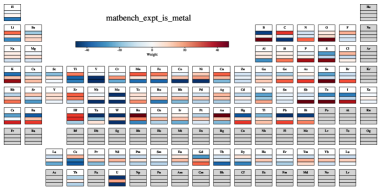

# 組成式だけで材料特性を予測するシンボリック回帰

- 執筆日：2026-05-07
- トピック：組成加重シンボリック回帰による汎用材料特性予測
- タグ：Computation and Theory / Semiconductors and Electronic Materials / Machine Learning / Surrogate Modeling
- 注目論文：arXiv:2605.02267 "Composition-Weighted Symbolic Regression for General-Purpose Property Prediction"
- 参照論文数：6

---

## 1. 研究背景

材料探索における最大のボトルネックの一つは、「候補材料が多すぎる」という問題である。元素の組み合わせ方を考えると、三元系以上の合金や化合物の数は天文学的になり、すべての候補を実験や第一原理計算で評価するのは現実的ではない。そこで近年急速に発展してきたのが、既知の材料データから特性を予測する機械学習（Machine Learning, ML）を用いたマテリアルズ・インフォマティクスである。

現在のMLベースの材料特性予測モデルは大きく二つの流れに分けられる。一方は結晶構造情報を入力とするグラフニューラルネットワーク（Graph Neural Network, GNN）系のアプローチで、原子位置の情報を活用して高い予測精度を達成しているが、そのためには構造が既知であることが前提となる。もう一方は、化学組成式（chemical formula）だけを入力として使う組成ベースのアプローチで、構造未同定の新規材料候補にも適用できるという利点がある。

組成ベースのモデルは実用上重要な場面が多い。新規材料の探索では、まず「どの元素をどの割合で混ぜるか」という組成設計が先行する。合成前や構造決定前の段階で特性を予測できれば、実験の方向性を絞り込む上で大きな助けとなる。また、III-V族半導体合金や高エントロピー合金など、組成が連続的に変化する系では、特定の組成での特性を素早く推定する需要が特に高い。

しかし、組成ベースのモデルには根本的な課題がある。それは「ブラックボックス性」である。ディープニューラルネットワーク（DNN）や大規模言語モデル（LLM）を用いた手法は高い予測精度を示す一方で、なぜその予測値が出るのかを人間が解釈することが難しい。材料科学者が求めるのは単なる数値ではなく、物理・化学的な洞察を含む「理解可能な関係式」であることが多い。たとえばバンドギャップがなぜその値になるのか、どの元素がどのように寄与しているのかが分かれば、逆設計（目標特性から出発して組成を決める）や実験の解釈に直結する知識が得られる。

この「予測精度」と「解釈可能性」のトレードオフは、マテリアルズ・インフォマティクスにおける未解決の中心的課題である。精度を追求するとモデルが複雑になり解釈できなくなり、解釈しやすいシンプルなモデルでは精度が落ちる。この問題を根本から打開するアプローチとして、最近注目されているのがシンボリック回帰（Symbolic Regression, SR）である。

シンボリック回帰とは、データから数学的な解析式そのものを探索する手法である。線形回帰がパラメータを最適化するのと異なり、シンボリック回帰は式の構造（加減乗除や初等関数の組み合わせ）自体を探索する。原理的には、物理法則のような閉じた式を自動発見できる可能性があり、材料科学との親和性が高い。しかし、シンボリック回帰を高次元・大規模データに適用することは計算上の困難を伴い、これまで材料特性予測への本格的な応用例は限られていた。

## 2. 未解決問題は何か

組成ベースの材料特性予測をめぐる未解決問題は複数の層に分かれている。

第一に、「組成から特性への写像はどのような数学的構造を持つか」という根本的な問いがある。バンドギャップ、金属性、ガラス形成能といった特性は、構成元素の何らかの平均的性質（電気陰性度、原子半径、価電子数など）の組み合わせで表せるのだろうか。それとも、非線形な相互作用や元素間の特異的な結合が本質的な役割を担うのだろうか。この問いに答えることは、単に予測精度を上げるだけでなく、材料物理の本質を理解する上で意義深い。

第二に、「どのくらいの複雑さの式が必要か」という問題がある。原子番号が一つ変わるだけで特性が大きく変わることもあれば（例：GeからAsへ）、広い組成範囲でなめらかに変化することもある。線形混合則（Vegard則など）が成り立つ場合もあれば、強い非線形性（ボーイング効果など）が現れる場合もある。適切な式の複雑さを事前に知ることはできないため、データ駆動でそれを見つける仕組みが必要である。

第三に、「汎用性と解釈可能性をどう両立するか」という設計上の問いがある。これまでのシンボリック回帰を材料に適用した試みは、特定の物性に特化していたり、扱う材料系が限られていたりした。複数の物性タスク（回帰・分類）に横断的に適用できる汎用的なシンボリック回帰フレームワークは存在しなかった。

第四に、「元素レベルの貢献をどう定量化するか」という問いがある。組成ベースのモデルが「ある元素がバンドギャップに正に寄与している」と示せれば、それ自体が材料設計の指針になる。しかし、DNNやトランスフォーマーベースのモデルでは、この種の元素ごとの寄与を直接的に読み出すことは困難である。

第五に、「少数データ・限定された組成での外挿性能」という実用的問題がある。実験データは一般に限られており、未測定の組成における予測（特にデータの少ない合金系）では、過学習せず信頼できる外挿ができるモデルが必要である。

2605.02267 の論文は、これらの問いに対して「組成加重シンボリック回帰（Composition-Weighted Symbolic Regression, CW-SR）」という手法で一括して挑戦するものである。

## 3. 注目論文の概要

### 手法の骨格：組成加重特徴量とシンボリック回帰の結合

CW-SR の基本的なアイデアはシンプルである。材料特性 P を予測するために、まず「組成加重特徴量（composition-weighted feature）」と呼ばれる中間変数を構築し、その変数の解析関数として P をシンボリック回帰で探索する。

組成加重特徴量 $x_k$ は以下の式で定義される。

$$x_k = \sum_{i} w_{k,i} \cdot c_i$$

ここで $c_i$ は元素 $i$ の組成比（モル分率）であり、$w_{k,i}$ は元素 $i$ が特徴 $k$ に与える学習可能な重みパラメータである。$k$ の数（特徴量の次元数）はハイパーパラメータとして事前に設定する。最終的な予測値は

$$P = \mathcal{F}(x_0, x_1, \ldots, x_{K-1};\, \theta)$$

という解析式 $\mathcal{F}$ で表される。ここで $\theta$ は $\mathcal{F}$ の中に現れる連続パラメータである。

このフレームワークの特徴は、各元素 $i$ ごとに各特徴 $k$ への重み $w_{k,i}$ を独立に持つ点にある。元素数を約 90（周期表の主要元素）、特徴量の数を $K = 3$ とすると、重みの総数は $90 \times 3 = 270$ 個程度となる。これは、CrabNet（数百万パラメータ）や DNN モデルと比べて圧倒的に少ない。

### 探索アルゴリズム：MCTS と遺伝的プログラミングのハイブリッド

解析式 $\mathcal{F}$ の構造を探索するために、CW-SR はモンテカルロ木探索（Monte Carlo Tree Search, MCTS）と遺伝的プログラミング（Genetic Programming, GP）を組み合わせたハイブリッド手法を採用している（図1）。

MCTS は、数学演算子（+, -, ×, ÷, exp, log, max, min など）のノードを逐次追加して式のツリーを構築しながら、UCB（Upper Confidence Bound）アルゴリズムで探索効率を制御する。各候補式が生成されるたびに、連続パラメータ $\theta$ と重み $w_{k,i}$ を L-BFGS 法で最適化し、その損失値を MCTS へのフィードバックとして使う。GP は MCTS で見つかった有望な式を遺伝的操作（突然変異・交叉）でさらに改良する。この組み合わせにより、局所探索（GP）と大域探索（MCTS）のバランスをとりながら、有望な解析式を効率的に見つける。

### 主要な結果

著者らは 3 つの代表的な MatBench タスクで CW-SR を評価した。

バンドギャップ予測（matbench_expt_gap）では、実験値データベースを使った回帰タスクである。CW-SR が発見したバンドギャップの式は

$$\mathcal{F}_{\rm gap} = x_1 \cdot \exp\!\left[-\exp\!\left(\max(x_2,\, \min(x_0, x_1))\right)\right]$$

であり、MAE = 0.471 eV を達成した。この式は、$x_1$ をバンドギャップの大きさのスケールを決める変数と解釈でき、$x_2$ や $x_0$ との組み合わせで非線形な補正を行う構造になっている。

金属性分類（matbench_expt_is_metal）では ROC-AUC = 0.873 を達成。ガラス形成能分類（matbench_glass）では ROC-AUC = 0.816 を達成した。

元素の重みを周期表上に可視化した結果（図2）では、バンドギャップタスクでは希ガス・ハロゲンが大きな正の重みを持ち、金属（アルカリ金属・遷移金属）は負の重みを持つという化学的に整合した傾向が示された。この元素ごとの重みの解釈可能性は、ブラックボックスモデルでは得られない独自の強みである。

さらに CW-SR を III-V 族半導体合金（GaAs, InP, InAs, GaP など）に適用した結果、実験的に知られている組成依存性のボーイング（bowing、非線形性）を定性的に再現することができた（図4）。

*図1：CW-SR の探索フロー。MCTS が式のツリー構造を逐次構築し、各ノードで L-BFGS 最適化を行い、GP で有望な式を改良する。*

## 4. 研究史の中での位置づけ

### 組成ベース材料 ML の流れ

組成だけを用いた材料特性予測の試みは 2010 年代後半から本格化した。Meredig ら（2014）がランダムフォレストを用いて組成特徴量から形成エネルギーを予測したのが先駆的研究の一つである。その後、元素埋め込み（elemental embedding）を活用したニューラルネットワークや、トランスフォーマーアーキテクチャが導入された。

特に影響力が大きかったのが CrabNet（Wang et al., 2021, npj Computational Materials）である。CrabNet は自己注意機構（self-attention）を使って元素間の相互作用を学習し、28 個のベンチマークデータセットで当時の最先端と同等の性能を示した。パラメータ数は数百万規模に達するが、注意重みを可視化することで限定的な解釈可能性も提供している。

MODNet（de Breuck et al., arXiv:2102.02263, 2021）は別のアプローチを取り、化学的・物理的に意味のある記述子（Matminer で計算される特徴量）をフォワードニューラルネットワークに入力し、特徴選択と joint learning によってデータ数が 10,000 未満の小規模データセットで特に強みを発揮することを示した。これは、データが少ない実験系では記述子ベースの手法が有利であることを示唆する重要な知見である。

大規模言語モデル（LLM）の台頭も見逃せない。DARWIN（Xie et al., arXiv:2308.13565, 2023）は自然科学向けに微調整した LLM シリーズで、MatBench タスクを含む多様な材料科学タスクで高い性能を示した。組成情報をテキストとして入力し、特性値をテキストとして出力するという全く異なるパラダイムで、バンドギャップ予測 MAE = 0.287 eV という高い精度を達成した。

### Ma et al. 2025 との比較

CW-SR と特に興味深い比較対象となるのが、Ma, Dugan, Soljačić（arXiv:2501.02932, 2025）が提案したシンプルなバンドギャップ予測モデルである。この論文では、バンドギャップの分布が混合連続変数（insulators と metals の混在）であることに着目し、

$$\hat{E}_g = \max\!\left(\sum_i w_i c_i,\; 0\right)$$

という ReLU 型の線形モデル（元素ごとに 1 パラメータ、合計約 100 パラメータ）を提案した。このモデルは要素数が少なく極めてシンプルだが、組成情報だけで合理的な予測精度を達成し、化学的な解釈可能性も持つ。

CW-SR は Ma らのアプローチをより一般化したと見ることができる。$x_k = \sum_i w_{k,i} c_i$ という組成加重特徴量の構造は本質的に同じ「元素ごとの寄与の組成平均」であるが、CW-SR はその線形結合にとどまらず、非線形解析式 $\mathcal{F}$ をシンボリック回帰で自動発見する。バンドギャップ以外の特性（金属性、ガラス形成能）にも同じ枠組みで適用できる汎用性が CW-SR の追加的価値である。

### 物理法則発見としてのシンボリック回帰

シンボリック回帰を物理法則の自動発見に適用した先駆的研究として AIFeynman（Udrescu & Tegmark, arXiv:1905.11481, 2020）が挙げられる。AIFeynman は Feynman の物理公式集 100 本以上をニューラルネットワークの助けを借りてシンボリック回帰で再発見し、次元解析や対称性の検出を組み込むことで探索効率を大幅に高めた。

CW-SR は AIFeynman のアプローチを材料特性予測に橋渡しした試みとして位置づけられる。ただし材料科学の特性式は物理定数の式ほど明確な対称性制約がないため、AIFeynman が使った物理的制約の多くは適用できない。CW-SR が取った解決策は「組成加重特徴量」という前処理段階を設け、高次元の元素空間を低次元の実数変数に圧縮してからシンボリック回帰を行うという設計である。

### MatBench 上での位置づけ

MatBench（Dunn et al., arXiv:2005.00707, 2020）は材料 ML の標準ベンチマーク規格であり、13 種類のタスクについて交差検定の手順まで統一している。バンドギャップタスク（matbench_expt_gap）では、現時点での MatBench 上位手法（DARWIN の 0.287 eV など）に対して CW-SR の 0.471 eV は見劣りする。しかし重要なのは、この差がモデルの「読みやすさ」と「パラメータ数の節約」とのトレードオフにあるということである。

DARWIN は数十億パラメータの LLM をファインチューニングしており、その出力は自然言語から実数値に変換されるブラックボックスである。CrabNet は数百万パラメータのトランスフォーマーで、注意重みは限定的な解釈しか提供しない。これに対し CW-SR は数百パラメータの解析式であり、元素の寄与が直接的に読み取れる。

*図2：バンドギャップ（上段）、金属性（中段）、ガラス形成能（下段）の各タスクで学習された元素重み。化学的に合理的なパターンが自動的に抽出されている。*

## 5. 批判的考察

### 結論を支持する根拠とその強さ

CW-SR の主張の核心は「組成加重特徴量 + シンボリック回帰で、解釈可能かつ競争力のある材料特性予測ができる」というものだ。この主張を支持する根拠は複数ある。

まず、発見された式の化学的整合性は説得力がある。図2に示される元素重みは、バンドギャップタスクで金属元素（アルカリ金属・遷移金属）が負の重みを持ち、絶縁体を形成しやすい元素（窒素、酸素、フッ素など）が正の重みを持つという傾向を示す。これは既知の化学的直感と一致しており、モデルが物理的に無意味な関係を学習しているわけではないことを示す。

次に、III-V 族半導体合金への適用結果（図4）は重要な検証例である。これらの合金では実験的なバンドギャップデータが比較的豊富であり、組成依存性の非線形性（ボーイング効果）が文献でよく知られている。CW-SR がこの非線形性を定性的に捉えられたことは、単なる内挿精度以上の意味を持つ。

さらに、パラメータ数という観点での「節約」は定量的に評価できる。$K = 3$ 特徴量の場合、元素重みパラメータは約 270 個、$\mathcal{F}$ の中の連続パラメータは式の複雑さに依存するが多くても数十個程度であり、CrabNet（~10^6 パラメータ）の 4 桁少ないモデルで MatBench ランキング中位程度の性能を出している。

### 解釈上の限界と過剰解釈の可能性

一方で、CW-SR には無視できない限界がある。

最も重要な問題は「精度の絶対値」である。バンドギャップ MAE = 0.471 eV は、実験データの典型的なノイズレベルや材料探索における有用閾値（一般に 0.2〜0.3 eV 程度が目安）と比較すると高い。最先端の DARWIN (0.287 eV) やグラフベース手法と比べて約 60〜80% 高い誤差は、高精度が必要な応用では致命的な差になりうる。

第二に、「発見された式の一意性」への注意が必要だ。シンボリック回帰の解は一般に一意ではなく、データに同程度にフィットする異なる式が複数存在しうる。$\mathcal{F}_{\rm gap} = x_1 \cdot \exp[-\exp(\max(x_2, \min(x_0, x_1)))]$ という形が「真の」バンドギャップの関数形であるとは言い切れない。特に探索空間が広い場合、確率的な探索アルゴリズム（MCTS + GP）が偶然この形を発見したという可能性は排除できない。

第三に、「組成加重という仮定の妥当性」の問題がある。$x_k = \sum_i w_{k,i} c_i$ は、各元素の寄与が加法的・線形結合であることを前提としている。これは多くの系で近似的に成り立つが、元素間の相互作用（たとえば強いd-p ハイブリダイゼーション、化学量論的な相変化、クラスター形成など）が支配的な系では根本的な近似の破綻が起きうる。発見された式が特定の材料系（III-V 半導体合金のような「モデル系」）でよく機能する一方で、より複雑な系（例：高エントロピー合金や多成分酸化物）では大幅な性能低下が起きる可能性がある。

第四に、「評価タスクの多様性不足」という問題がある。本論文が示した 3 タスク（baing gap, metallicity, glass-forming ability）は MatBench の 13 タスク中の 3 つに過ぎない。特に、$10^5$ を超えるサンプル数の大規模タスクや、周期表上での広い分布を持つタスクで CW-SR がどの程度機能するかは不明である。

第五に、「計算コスト」の問題が実用上は無視できない。シンボリック回帰の探索自体は、DNNの学習と比べて必ずしも安価ではない。MCTS + GP の探索は初期ランダム性に依存するため、再現性を確保するためには複数回の独立した試行が必要であり、最良式の選定に人間の判断を伴うことも多い。

*図3：$x_1$（横軸）と $\mathcal{F}_{\rm gap}/x_1$（縦軸）の関係。ゼロギャップ系（灰色）と有限ギャップ系（カラー）が自然に分離されており、発見式の構造が化学的に意味を持つことを示唆する。*

## 6. 何が一般化できるか

### 他の材料系・物性への拡張可能性

CW-SR のフレームワーク自体は、バンドギャップや金属性に特化したものではなく、任意の組成ベース材料特性に適用できる設計になっている。形成エネルギー、熱電特性（ゼーベック係数、熱伝導率）、磁気モーメント、弾性定数など、組成と特性の間に何らかの（非線形かもしれないが）解析的関係が存在する系は潜在的な適用対象となる。

特に有望なのは「組成依存性が明確だが構造データが乏しい系」である。高エントロピー合金（High-Entropy Alloy, HEA）は五成分以上の合金系で、組成空間が広大な一方、構造決定済みのデータは限られる。組成加重特徴量の枠組みはそのような系への応用に本質的な障壁が少ない。ただし、上述のように加法的寄与の仮定が HEA では成り立たない可能性があり、この点の実証的検証が必要である。

### 材料設計指針としての活用

発見された式から直接的に「元素設計指針」を読み取れることは、CW-SR の重要な付加価値である。元素重み $w_{k,i}$ を周期表上に可視化することで、どの元素が目標特性を大きくするか・小さくするかが一目で分かる。逆設計（目標バンドギャップを持つ合金の組成最適化）においても、解析式が分かっていれば勾配情報を直接計算でき、効率的な最適化が可能になる。

### ML ポテンシャルとの補完関係

機械学習ポテンシャル（MLP）が原子間ポテンシャルをシンボリック回帰で表現しようとする試み（Symbolic Regression force fields）とは方向性が異なる。CW-SR は構造情報を使わず組成だけから巨視的特性を予測する「上から見た」アプローチであり、MLP は原子スケールの力場を精密に表現する「下から見た」アプローチである。両者は補完的であり、CW-SR で候補組成を絞り込んでから MLP で詳細な構造・ダイナミクスを評価するという二段階探索が将来の標準的なワークフローになりうる。

### 一般化に慎重であるべき点

「解析式が見つかった」ことをもって「真の物理メカニズムが解明された」と解釈することには慎重であるべきだ。発見された式は訓練データへの最良フィットであり、それが普遍的な物理法則を反映しているかどうかは別の問題である。特に訓練データのバイアス（構成元素の偏り、測定条件の多様性の不足）が式に組み込まれる可能性は常にある。AIFeynman のように、式が実際の物理法則（万有引力の式、クーロン則など）と一致するかどうかを検証できる場合とは異なり、材料特性の「真の式」は既知でないため、発見された式の物理的妥当性の評価が難しい。

## 7. 基礎から理解する

### 組成記述子と元素特徴量

材料の組成は化学式 A$_{x}$B$_{1-x}$ のような表記で表される。組成比 $c_i$ は元素 $i$ のモル分率（すべての元素について $\sum_i c_i = 1$）であり、0〜1 の値をとる。

組成から特性を予測する最も単純なモデルは「線形混合則」あるいは「Vegard 則」と呼ばれ、二元合金 AB の格子定数 $a$ が

$$a_{\rm AB}(x) = x \cdot a_A + (1-x) \cdot a_B$$

と二端成分の格子定数の線形補間で表せるという経験則である。ただし、この線形則からのずれ（ボーイング、bowing）が生じることも多く、バンドギャップでは特に顕著である。III-V 族半導体 In$_x$Ga$_{1-x}$As のバンドギャップは

$$E_g(x) = x \cdot E_g({\rm InAs}) + (1-x) \cdot E_g({\rm GaAs}) - b \cdot x(1-x)$$

と表され、$b$ がボーイングパラメータ（InGaAs で $b \approx 0.58$ eV）である。CW-SR の枠組みでは、このような非線形性を MCTS + GP が自動発見した解析式 $\mathcal{F}$ で近似しようとしている。

### シンボリック回帰の仕組み

シンボリック回帰（Symbolic Regression）は、データの集合 $\{(x^{(n)}, y^{(n)})\}_{n=1}^N$ が与えられたとき、$y \approx \mathcal{F}(x)$ を満たす解析式 $\mathcal{F}$ を探索する問題である。ここで「解析式」とは、四則演算（+, -, ×, ÷）、冪乗、初等超越関数（exp, log, sin, cos など）、および条件付き演算子（max, min など）の有限の組み合わせで書かれた式を指す。

最も古典的な実装は遺伝的プログラミング（Genetic Programming, GP）であり、式を二分木（binary tree）として表現し、突然変異（ノードの置き換え、サブツリーの削除・挿入）と交叉（二つの式のサブツリーを入れ替え）を繰り返して適応度（フィット誤差）を最小化する個体群を進化させる。GP の問題点は探索空間が非常に広く（式の長さ $L$ の二分木の数は $L$ に対して指数的に増える）、多数の評価が必要なため計算コストが高いことである。

モンテカルロ木探索（Monte Carlo Tree Search, MCTS）は、ゲームの探索（囲碁の AlphaGo で有名）に使われるアルゴリズムで、探索ツリーのノード $s$ と行動 $a$ に対して

$${\rm UCB}(s, a) = Q(s,a) + C \sqrt{\frac{\ln N(s)}{N(s,a)}}$$

という UCB スコアを計算し、Q 値（報酬の推定値）と探索ボーナス項のバランスで次の展開ノードを選ぶ。$Q(s,a)$ は行動 $a$ をとった後に得られた報酬（ここでは式のフィット誤差の逆数）の平均、$N(s)$ はノード $s$ の訪問回数、$N(s,a)$ は行動 $a$ の選択回数、$C$ は探索係数である。MCTS はこのスコアを使って有望な式のサブツリーを優先的に深く探索する。

### L-BFGS による連続パラメータ最適化

式の構造が決まったら、その中の連続パラメータ $\theta$（数値定数）と元素重み $w_{k,i}$ を最適化する必要がある。CW-SR では L-BFGS（Limited-memory Broyden–Fletcher–Goldfarb–Shanno）法を使う。これは準ニュートン法の一種で、目的関数の勾配（解析的または自動微分で計算）と過去数ステップの勾配情報からヘッセ行列を近似し、効率的に局所最適解を見つける。

勾配計算は $\partial \mathcal{F} / \partial w_{k,i}$ および $\partial \mathcal{F} / \partial \theta$ を連鎖律で計算する。$x_k = \sum_i w_{k,i} c_i$ は $w_{k,i}$ に関して線形であるため、$\partial x_k / \partial w_{k,i} = c_i$ と計算できる。$\mathcal{F}$ の $\theta$ に関する微分は式の構造に依存し、exp, max, min などの演算子の微分を含む。max/min は不連続点を持つが、ほぼ至る所微分可能であり実用上問題は少ない。

### バンドギャップの物理

バンドギャップ（band gap）$E_g$ は、固体の電子状態のエネルギーが禁止された幅のある領域（禁制帯）の大きさである。価電子帯（valence band）の最大エネルギー $E_v$ と伝導帯（conduction band）の最小エネルギー $E_c$ の差 $E_g = E_c - E_v$ として定義される。$E_g = 0$ であれば金属（metal）、$E_g > 0$ であれば半導体または絶縁体に分類される。

半導体では $E_g$ の大きさが光吸収波長（$\lambda = hc/E_g$）、電気伝導度の温度依存性、発光波長などを決める最重要パラメータである。例えば太陽電池材料では Shockley-Queisser 極限の観点から $E_g \approx 1.0 \sim 1.5$ eV が最適とされ、LED 材料では可視光（$\lambda = 400 \sim 700$ nm 対応の $E_g = 1.8 \sim 3.1$ eV）が望ましい。

$E_g$ は化学組成に強く依存する。一般に以下の傾向がある。
より電気陰性度の高い（electronegative な）元素を含む化合物ではバンドギャップが大きい傾向がある。$d$ 電子を持つ遷移金属を含むと $d$ バンドが禁制帯内に出やすく、バンドギャップが小さくなることが多い。希ガス電子配置（閉殻）を持つイオンからなる化合物（NaCl, MgO など）は一般にバンドギャップが大きい。

CW-SR の元素重み（図2上段）がこれらの傾向を自動的に学習していることは、モデルが化学的に意味のある特徴を捉えていることを示す。

### MatBench ベンチマークの設計

MatBench（Dunn et al., 2020）は材料 ML の「ImageNet 的」ベンチマークであり、13 種類のタスク（回帰 7 件、分類 6 件）に対して 5-fold cross-validation の標準的プロトコルを規定している。各タスクには入力形式（組成式のみ / 結晶構造あり）、サンプル数（数百から数万）、測定対象（実験値 / DFT 計算値）などが異なるため、幅広いモデルの能力を評価できる。

matbench_expt_gap は Materials Project の実験バンドギャップデータ約 4,604 件からなり、組成のみを入力として使う。matbench_expt_is_metal は同様に約 4,921 件の金属/絶縁体分類タスク。matbench_glass は AFLOW データベースの結晶化傾向（ガラス形成能）約 5,680 件の分類タスクである。いずれも小規模データセットであり、データ効率の良いモデルが有利な条件となっている。

## 8. 専門用語の解説

**シンボリック回帰（Symbolic Regression）**
データから解析的な数式（analytical formula）を自動探索する機械学習手法。ニューラルネットワークが数値計算でパラメータを最適化するのとは異なり、式の「構造（どの演算子をどの順序で組み合わせるか）」を離散的に探索する。発見された式は人間が読んで解釈できるため、解釈可能 AI（Explainable AI）の一形態とも見なされる。本論文では MCTS + GP ハイブリッドで式の構造を探索し、L-BFGS で連続パラメータを最適化する。

**組成加重特徴量（Composition-Weighted Feature）**
CW-SR の核心となる入力変数 $x_k = \sum_i w_{k,i} c_i$。組成比 $c_i$ と学習可能な元素重み $w_{k,i}$ の内積として定義される。Vegard 則（線形混合則）の一般化版と見ることができる。元素重み $w_{k,i}$ はタスク固有に学習され、周期表の元素ごとの傾向として可視化・解釈できる。

**モンテカルロ木探索（Monte Carlo Tree Search, MCTS）**
ゲームの探索アルゴリズムとして発展した確率的探索手法。候補解を木構造で表現し、UCB スコアを用いた「探索と活用のバランス制御」によって有望な枝を優先的に深く探索する。囲碁の AlphaGo が採用したことで広く知られる。CW-SR では式のツリー構造の展開に使用。

**遺伝的プログラミング（Genetic Programming, GP）**
シンボリック回帰の古典的アプローチ。数式を二分木で表現し、突然変異（mutation）と交叉（crossover）という「遺伝的操作」を繰り返して、フィット誤差を最小化する式の集団を進化させる。探索の多様性を維持しやすい反面、局所最適に陥りやすい。CW-SR では MCTS で見つけた有望な式を GP でさらに改良するハイブリッドとして使用。

**MatBench**
材料 ML のための標準ベンチマークスイート（Dunn et al., 2020）。13 種類の材料特性予測タスク（回帰・分類）と標準的な評価プロトコル（5-fold cross-validation）を定める。異なる手法間の公平な比較を可能にし、材料 ML 分野における「ImageNet 的」標準規格として機能している。

**ボーイング効果（Bowing Effect）**
二元合金のバンドギャップが組成の線形補間（Vegard 則）から外れ、下向きに湾曲（bowing）する現象。$E_g(x) = xE_g^A + (1-x)E_g^B - bx(1-x)$ の $b > 0$ が正の値をとる場合に生じる。InGaAs, AlGaAs などの III-V 族合金で実験的に確認されており、デバイス設計で重要なパラメータ。組成の非線形性の典型例として、CW-SR がシンボリック回帰で自動捕捉することに成功した。

**ガラス形成能（Glass-Forming Ability）**
液体を急冷したとき、結晶化せずに非晶質（ガラス）固体を形成しやすさの尺度。組成によって大きく変わり、材料設計上重要な特性。matbench_glass タスクでは「急冷でガラスになるか否か（二値分類）」を組成から予測することが目標。CW-SR は ROC-AUC = 0.816 を達成した。

**L-BFGS 法**
大規模な非線形最適化のための準ニュートン法の一種。目的関数の勾配と限られたメモリを使ってヘッセ行列の逆行列を近似することで、ニュートン法の収束速度と確率的勾配降下法のメモリ効率を両立する。材料 ML では DFT 計算の構造最適化や、ここでは式の連続パラメータ最適化に使用される。特に変数の数が数百程度（本論文では元素重み＋式の定数）の中規模最適化に適している。

**ROC-AUC（Receiver Operating Characteristic - Area Under Curve）**
二値分類器の性能指標。横軸を偽陽性率（False Positive Rate）、縦軸を真陽性率（True Positive Rate）とした ROC 曲線の下の面積。値が 1.0 で完全な分類、0.5 でランダム分類を表す。しきい値によらない分類能力を評価できるため、クラス不均衡データ（金属/非金属の比率が偏るケース）でも信頼性の高い評価指標となる。

**平均絶対誤差（MAE：Mean Absolute Error）**
予測値 $\hat{y}_i$ と真値 $y_i$ の差の絶対値の平均：${\rm MAE} = \frac{1}{N}\sum_{i=1}^N |\hat{y}_i - y_i|$。外れ値の影響を受けにくく、物理的な「典型的誤差の大きさ」として解釈しやすい。バンドギャップ予測では eV 単位で評価され、一般に 0.3 eV 以下が「有用な精度」の目安とされることが多い。

**CrabNet（Compositionally-Restricted Attention-Based Network）**
Wang et al.（2021）が提案した組成ベース材料特性予測のための Transformer アーキテクチャ。組成内の各元素をトークンとして扱い、自己注意機構で元素間の相互作用を学習する。約 10^6 パラメータを持ち、28 個のベンチマークで当時最先端を達成した。注意重みを可視化することで限定的な解釈可能性を提供するが、CW-SR と比べると可読な解析式は得られない。

## 9. 将来展望

現時点で CW-SR によって比較的確かになったのは、「組成加重という線形的な前処理の後に非線形解析式を置く」という二段階の設計が材料特性予測に対して有効であるという概念実証である。発見された式の元素重みが化学的に直感的なパターンを示し、III-V 族半導体合金での検証でも定性的な傾向を捉えられていることは、このアプローチが単なる過学習ではないことを示す。また Ma et al.（2025）のシンプルな ReLU モデルと比較することで、「線形モデル + ReLU」以上の非線形構造が必要な場合にシンボリック回帰が優位に立つことが分かる。

一方でまだ未確定な点も多い。発見された解析式の「物理的必然性」vs「偶然のデータへのフィット」という区別は、現状では難しい。式の一意性が保証されないため、異なる初期条件やランダムシードでどの程度式が変化するかを系統的に調べる「式の安定性解析」が必要である。また、今回評価した 3 タスクはいずれも数千件規模の小規模データセットであり、大規模データセットや多元素系（HEA、複合酸化物）での性能は未知数である。さらに、$K = 3$ という特徴量次元の選択が最適かどうかも実証されておらず、$K$ の選択が式の複雑さと予測精度のトレードオフに与える影響を系統的に調べる必要がある。

今後の研究で最も決定的な意義を持つのは、CW-SR で発見した式を他の材料系・特性へと拡張した際に、発見された式が人間の専門家が提案する物理モデルと一致するかどうかを検証することであろう。たとえば熱伝導率の Slack モデル（組成・質量・ボンド硬さの関数）、磁気モーメントの Slater-Pauling 則など、既知の経験則が自動発見されるかを確認することが、このアプローチの「物理的洞察の獲得」という主張を定量的に評価する一つの方法となる。加えて、MCTS + GP という確率的探索の代わりに、最近進展著しい大規模言語モデル誘導のシンボリック回帰（LLM-guided SR）を導入することで、探索効率と式の解釈可能性を同時に高めることができるかもしれない。最終的には、CW-SR を組成スクリーニングの一段階として、その後に構造生成（拡散モデル）・ML ポテンシャルによる物性精密評価・実験検証というパイプラインに組み込む統合的なワークフローの確立が、材料設計への実用的な貢献となるだろう。

---

## 参考論文一覧

1. **[arXiv:2605.02267]** — 注目論文（anchor）
   Composition-Weighted Symbolic Regression for General-Purpose Property Prediction.
   https://arxiv.org/abs/2605.02267
   組成加重特徴量と MCTS+GP ハイブリッドシンボリック回帰を組み合わせ、バンドギャップ・金属性・ガラス形成能を解釈可能な解析式で予測した本論文のアンカー論文。

2. **[arXiv:2005.00707]** — 背景（MatBench ベンチマーク）
   Benchmarking materials property prediction methods: the Matbench test set and Automatminer reference algorithm.
   https://arxiv.org/abs/2005.00707
   材料 ML の標準ベンチマーク体系 MatBench を提案した論文。13 タスクと標準評価プロトコルを定め、手法間の公正な比較を可能にした。

3. **[arXiv:1905.11481]** — 比較（物理法則のシンボリック回帰発見）
   AI Feynman: a Physics-Inspired Method for Symbolic Regression.
   https://arxiv.org/abs/1905.11481
   物理的な対称性・次元解析を組み込んだシンボリック回帰で Feynman の物理公式を自動再発見した先駆的論文。CW-SR の設計思想の背景となる。

4. **[arXiv:2501.02932]** — 比較（シンプルな組成ベースモデル）
   Predicting band gap from chemical composition: A simple learned model for a material property with atypical statistics.
   https://arxiv.org/abs/2501.02932
   バンドギャップの分布統計に着目し、元素ごと 1 パラメータの ReLU 型線形モデルを提案した論文。CW-SR との直接的な比較対象であり、シンプルモデルの解釈可能性を実証。

5. **[arXiv:2102.02263]** — 比較（特徴量ベース DNN）
   Robust model benchmarking and bias-imbalance in data-driven materials science: a case study on MODNet.
   https://arxiv.org/abs/2102.02263
   化学的・物理的記述子と特徴選択 + 順結合 DNN からなる MODNet が小規模データセットで優れた性能を示すことを実証。CW-SR のパラメータ数対性能の比較点。

6. **[arXiv:2308.13565]** — 比較（大規模言語モデル）
   DARWIN Series: Domain Specific Large Language Models for Natural Science.
   https://arxiv.org/abs/2308.13565
   自然科学向けにチューニングされた LLM シリーズ DARWIN を提案。MatBench のバンドギャップタスクで MAE = 0.287 eV を達成し、CW-SR (0.471 eV) との精度差がモデルの解釈可能性とのトレードオフを示す。
