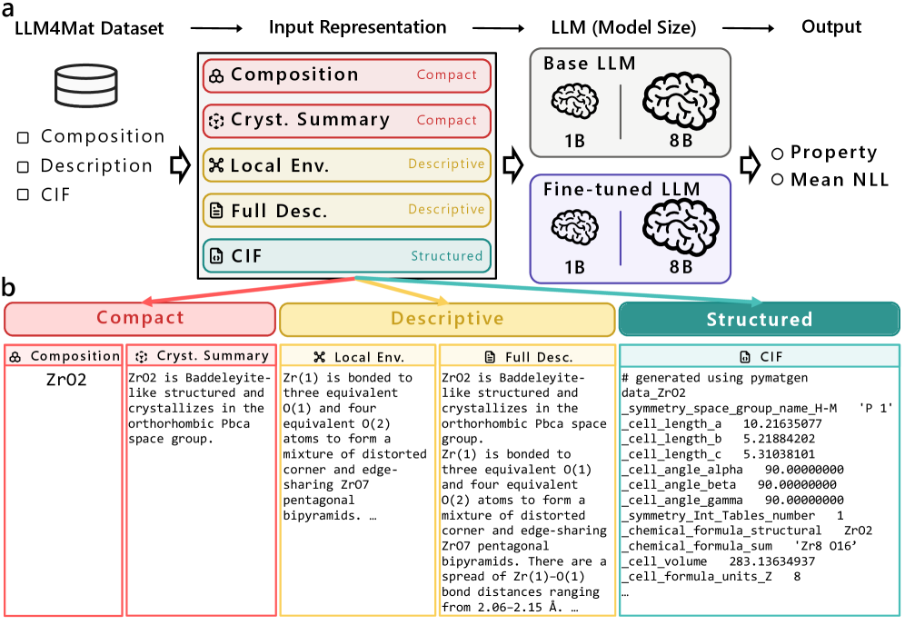
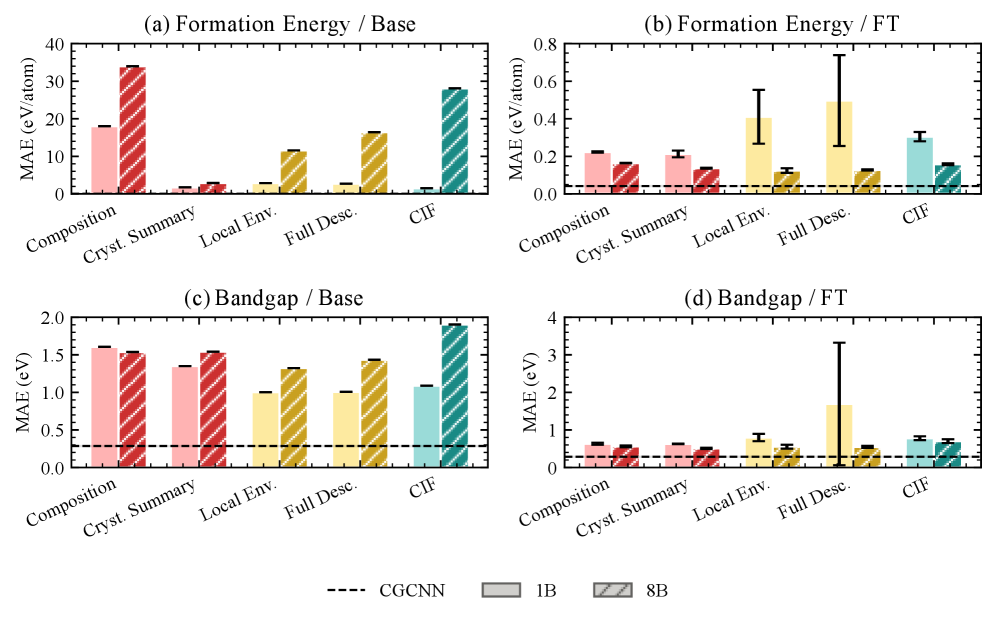

# 大規模言語モデルが変える材料科学の研究様式

- 執筆日：2026-05-09
- トピック：大規模言語モデル（LLM）の材料科学・化学への応用 — 知識インフラの構築から自律的実験まで
- タグ：Computation and Theory, Inverse Design, Machine Learning, Surrogate Modeling
- 注目論文：[2605.03205] From Knowledge to Action: Outcomes of the 2025 Large Language Model (LLM) Hackathon for Applications in Materials Science and Chemistry
- 参照論文数：7

---

## 1. 研究背景

材料科学はいま、研究の進め方そのものに関わる大きな変革期を迎えている。その中心にいるのは、ChatGPT に代表される大規模言語モデル（Large Language Model、LLM）である。LLM とは、膨大なテキストコーパスから統計的に言語を学習した神経ネットワークモデルであり、近年では科学論文を含む幅広い情報を学習することで、専門的な問いにも驚くべき精度で回答できるようになってきた。

材料科学分野には、一般的な AI 適用の難しさとして有名な問題がある。毎年数十万本に上る論文が出版され、それぞれに実験条件、組成、物性値、合成プロセスが記載されているにもかかわらず、そのほとんどは構造化されていない自然言語のテキストや図として存在する。データベース（Materials Project、ICSD、AFLOW など）には機械可読なデータが蓄積されているが、実験で得られた知識の大部分はまだ「論文の中に眠ったまま」だ。化合物の合成条件やキャラクタリゼーション手順、失敗に終わった実験の記録はほぼデジタル化されていない。この「知識の孤島」問題を解決しなければ、材料探索の速度には限界がある。

グラフニューラルネットワーク（GNN）や機械学習ポテンシャル（MLIP）など、材料科学における従来の機械学習手法は、主に数値データ（原子座標、エネルギー、力）を入力として物性を予測するモデルに特化してきた。しかし LLM は、テキスト・数値・図を横断的に処理でき、さらに推論・質問応答・コード生成を同じ枠組みで実行できる点でまったく異なるパラダイムを提供する。これにより「文献から知識を抽出する」「仮説を言語で記述してシミュレーションに渡す」「実験手順を自動生成する」といった、これまで人間が担っていたタスクの一部をAIに委ねることが現実的になってきた。

2023 年以降、材料科学コミュニティでは LLM の可能性を集中的に探るハッカソン（短期集中開発イベント）が毎年開催されている。第 1 回（2023）、第 2 回（2024）、そして第 3 回（2025）と積み重ねることで、材料 LLM の応用がどのような方向に向かいつつあるかの「コミュニティとしての答え」が見えつつある。2026 年 5 月に公開された 2605.03205 は、2025 年度ハッカソンの成果をまとめたものであり、現在の材料科学 LLM 応用の到達点と方向性を最もよく示すスナップショットである。

---

## 2. 未解決問題

LLM が材料科学に本格的に浸透するためには、いくつかの根本的な課題が解決されていない。

第一に、ハルシネーション（幻覚）問題がある。LLM は確率的に次のトークンを予測するモデルであり、学習データに含まれていない事実や、数値的精度が要求される答えを誤って「もっともらしく」生成することがある。材料科学では、形成エネルギーやバンドギャップのような数値物性の正確な予測が不可欠であり、ハルシネーションは致命的な誤りにつながりうる。

第二に、ドメイン特化知識の欠如がある。汎用 LLM（GPT-4 など）は一般的な科学知識を持つが、材料科学の専門的な実験条件、特定の材料系の挙動、最新の論文に基づく知識には限界がある。ファインチューニング（微調整）や検索拡張生成（Retrieval-Augmented Generation、RAG）によって部分的に補えるが、どの程度の追加学習や文脈付与が必要かは明確でない。

第三に、入力表現のスケール依存性がある。結晶構造情報をどのような形式で LLM に与えるべきか、また与えるべき情報量はモデルのサイズに依存するのかが不明だった。化学組成だけでよいのか、空間群・結合距離・CIF（Crystallographic Information File）形式の詳細な構造データまで与えるべきなのか、これはモデルの規模によっても異なる可能性がある（後述の 2605.03515 が解明している）。

第四に、計算・実験との統合の課題がある。LLM が生成した仮説や合成手順を、実際の DFT 計算や自動合成装置と接続する「接合点」をどう設計するかが未解決だった。単体ツールとしての LLM から、実験・計算の閉ループシステムへの発展には、エージェント設計・インターフェース設計・エラー処理の問題が山積している。

---

## 3. 注目論文の概要

### 2025 年 LLM ハッカソンが明らかにしたこと

Ben Blaiszik らを中心に、世界中の数百人の研究者が参加した 2025 年 LLM ハッカソンの成果論文（arXiv:2605.03205）は、材料科学・化学における LLM 応用の現状を俯瞰的に捉えた最新のコミュニティスナップショットである。24 時間の集中開発を通じて生まれた多数のプロジェクトを分析し、LLM がどのような役割を担えるかを体系的に整理した。

著者らは全プロジェクトを 2 つの補完的カテゴリに分類した。

**知識インフラ（Knowledge Infrastructure）** は、科学知識を構造化・取得・統合・検証するシステムである。具体的には、検索拡張生成（RAG）による文献検索、マルチモーダル情報からのデータ抽出、知識グラフの自動構築、研究コミュニティ内での知識共有プラットフォームなどが含まれる。これは「AI が科学知識を整理する」側面を担う。

**アクションシステム（Action Systems）** は、科学的な作業を実行・調整・自動化するシステムである。具体的には、実験計画の自動生成、DFT や分子シミュレーションの自動実行・解析、自動合成装置との連携、マルチエージェントワークフローによる研究サイクルの自動化が含まれる。これは「AI が科学的行動を起こす」側面を担う。

今回の 2025 年ハッカソンで明確になった最大の傾向は、**単目的ツールから統合マルチエージェントワークフローへの移行**である。2023 年の第 1 回では、LLM を単体で使って特定タスク（論文要約、プロパティ予測など）を解く試みが中心だった。2024 年の第 2 回では、複数のツールを連携させる実験が増えた。2025 年の第 3 回では、検索・推論・ツール使用・ドメイン特化検証を組み合わせた「統合的な研究インフラ」が明確に姿を現してきた。

特に注目されるテーマとして、(1) RAG を基盤とする根拠付き情報生成、(2) 永続的な構造化知識表現（ナレッジグラフ）、(3) マルチモーダルおよび多言語対応の科学入力、(4) 実験室と連携した閉ループシステムの初期実装、の 4 点が挙げられている。

新規性は「単一の AI ツールを超えた、科学的推論と行動のための構成可能なインフラ」としての LLM の位置づけを明確化した点にある。これは材料科学における AI 活用の質的転換を示している。

---

## 4. 研究史の中での位置づけ

### 第 1 回ハッカソン（2023）：可能性の発見

Zheng et al.（arXiv:2306.06283）による 2023 年の第 1 回 LLM ハッカソン報告では、14 個のプロジェクトが報告された。材料合成の自動化、文献からの材料情報抽出、コードの自動生成による分子シミュレーション、教育支援ツールなど、幅広い領域で LLM が有用であることが実証された。ただしこの段階では、各プロジェクトは単体の LLM ツールとして動作するものが多く、計算や実験との統合は限定的だった。

### 第 2 回ハッカソン（2024）：スケールと自動化

Zimmermann et al.（arXiv:2411.15221）による 2024 年の第 2 回では、34 のプロジェクトが発表された。報告では 7 つの応用領域が定義されており、分子・材料の物性予測、材料設計、自動化インターフェース、科学コミュニケーション、研究データ管理、仮説生成・評価、文献からの知識抽出がカバーされた。特に、LLM の能力の向上（GPT-4 世代の登場）によって、より複雑なワークフローの自動化が可能になったことが強調された。またハイブリッド開催（物理ハブ: トロント、モントリオール、サンフランシスコ、ベルリン、ローザンヌ、東京）により国際的なコミュニティが形成された。

### 第 3 回ハッカソン（2025）：統合インフラへの移行

2025 年の第 3 回（2605.03205）では、この傾向がさらに加速した。単体ツールから「マルチエージェントワークフロー」への移行が顕著になり、RAG、ツール使用、推論チェーン（Chain-of-Thought）が組み合わさったシステムが多数登場した。

### MatterChat：マルチモーダル LLM の具体例

Tang et al.（arXiv:2502.13107、Nature Machine Intelligence 掲載）の MatterChat は、材料の結晶構造グラフと自然言語テキストを統合して処理できるマルチモーダル LLM である。Materials Project から得た 142,899 種の結晶構造データを訓練に使用し、生成エネルギー、バンドギャップ、磁気秩序などの多様な物性を自然言語の問答形式で回答できる。さらに、合成手順を段階的に記述する「ステップバイステップ合成」も可能であることが示された。これは知識インフラ（物性データへのアクセス）とアクションシステム（合成プロトコル生成）の両方を一つのモデルで実現した具体例として位置づけられる。

### MOFGen：マルチエージェント自律設計の具体例

Noh et al.（arXiv:2504.14110）の MOFGen は、金属有機構造体（MOF）の自律的設計・合成を実現したマルチエージェントシステムである。LLM が新規 MOF の組成を提案し、拡散モデルが結晶構造を生成し、量子力学的エージェントが候補を絞り込み、合成実現可能性エージェントがフィルタリングを行う。実際に 5 つの「AI が夢想した」MOF の合成に成功し、CO2 吸収や水捕集への応用が期待される。これは実験室と統合した閉ループシステムの初期実装例として 2605.03205 が指摘するパターンの具体的な実例である。

### 知識インフラの具体例：Material Database Agent

Gangan et al.（arXiv:2605.04278）の Material Database Agent（MDA）は、科学論文の PDF を入力として受け取り、マルチエージェント構成で並列処理することで材料データベースを自動構築するシステムである。マルチモーダル LLM がテキストだけでなく図表からも情報を抽出できるようになったことで、従来は人手に頼らざるを得なかった文献からのデータ収集が自動化できるようになった。これは 2605.03205 が「知識インフラ」として分類するアーキテクチャの典型例である。

---

## 5. 批判的考察

### モデルスケールと入力表現：UTokyo からの重要な実験的知見

2605.03205 のハッカソン報告は広範な傾向を示したが、LLM を材料科学に適用する際の具体的な方法論的課題を定量的に分析した研究として、Ozawa et al.（arXiv:2605.03515）の研究が重要な補足的知見を提供している。東京大学のグループはこの研究で、異なるスケールの Llama モデル（1B パラメータと 8B パラメータ）を、5 種類の入力表現で評価した。5 種類とは、化学組成のみ、結晶サマリー（空間群・格子定数を含む）、局所環境記述（原子近傍の情報を含む）、完全テキスト記述、CIF 形式の構造ファイルである。

*図1: 入力表現の実験パイプラインと各種入力表現の例（ZrO2 を使用）。入力はコンパクト（組成、結晶サマリー）、記述的（局所環境、完全記述）、構造的（CIF）の3カテゴリに分類される。出典: Ozawa et al., arXiv:2605.03515 (CC BY 4.0)*

結果として浮かび上がったのは、**最適な入力表現がモデルサイズに依存する**という重要な事実である。1B モデルはコンパクトな表現（化学組成や結晶サマリー）で良い精度を示す一方、CIF など長大な入力では精度が低下した。これに対し 8B モデルは、長い自然言語記述や CIF でも高い精度を維持できた。いずれのモデルサイズでも、空間群情報を含む「結晶サマリー」は組成のみの入力を常に上回った。

*図2: 5 種類の入力表現とモデルサイズの組み合わせによる平均絶対誤差（MAE）。形成エネルギーおよびバンドギャップ予測の結果。ファインチューニング後、特に 8B モデルでの精度が大幅に改善される。出典: Ozawa et al., arXiv:2605.03515 (CC BY 4.0)*

さらに注目すべき発見として、**平均負の対数尤度（mean NLL）が予測信頼度の指標として機能する**ことが示された。ベースモデルでは予測誤差と NLL の相関は見られないが、ファインチューニング後のモデルでは、NLL が小さいほど予測誤差も小さくなる傾向が明確に現れる。つまり、モデルが「確信を持って出力したトークン」ほど正確という意味になり、追加の不確かさ推定モジュールを必要とせずに信頼度評価が行える。これはハルシネーション対策として実用的に重要な知見である。

### ハルシネーション問題と RAG による対処

LLM の最大の弱点であるハルシネーションは、材料科学においては特に深刻である。数値物性を間違えることは、誤った実験計画や合成失敗に直結するためだ。RAG（検索拡張生成）はこの問題への有力なアプローチであり、LLM が回答を生成する際に、外部データベースや文献から関連情報を検索して文脈として与えることで、根拠のある回答を引き出す。

ハッカソン 2025（2605.03205）でも RAG が「基盤的インフラ」として位置づけられており、多くのプロジェクトが RAG を実装または活用していた。ただし、RAG の有効性はドメイン特化した高品質コーパスの構築に依存するため、信頼できる材料データベースをどう構築・維持するかという別の問題を生む。MDA（2605.04278）のような自動データベース構築ツールは、この RAG のコーパス構築問題を解決しようとするものとして位置づけられる。

### シングルツールからマルチエージェントへの移行の妥当性

2605.03205 が指摘する「シングルツールからマルチエージェントへの移行」は、理にかなった発展方向ではあるが、同時に複雑性リスクも高める。複数のエージェントが連携するシステムでは、一つのエージェントのエラーが連鎖的に伝播する可能性がある。MOFGen（2504.14110）のように実験装置まで統合した閉ループシステムでは、エラー処理・安全停止・結果の検証が特に重要になる。現状の多くのシステムは概念実証（PoC）段階であり、実際の研究現場での長期運用には耐えていない点は認識しておく必要がある。

### 物性予測における LLM の限界と GNN との比較

2605.03515 の結果では、ファインチューニング後の 8B LLM が CGCNN などの GNN に対して競争力を持つ精度を達成しているが、計算コスト面では GNN が依然として有利である。LLM のトークン生成は自回帰的なプロセスであり、GNN の順伝播と比較して推論コストが高い。LLM の優位性は数値予測精度ではなく、「自然言語でのインタラクション」「マルチタスク対応」「少量データへの適応性」などにあると考えられる。したがって、LLM と GNN（またはMLIP）は競合するというより補完的な関係にある。

---

## 6. 何が一般化できるか

### 知識インフラ・アクションシステムという分類の普遍性

2605.03205 が提案した「知識インフラ」と「アクションシステム」という分類は、材料科学に限らず、物理学・生物学・創薬・気候科学など他の科学分野への LLM 適用を考える際にも有効なフレームワークである。どの分野でも「既存知識の効率的な整理・検索・検証」と「AI を介した新しい行動（実験・計算・分析）の実行」という 2 つの軸は普遍的に存在する。

### RAG + ドメイン知識の組み合わせという設計原理

材料科学での経験から導かれる設計原理として、**汎用 LLM + 高品質ドメインコーパスを用いた RAG + ドメイン特化ファインチューニング**という組み合わせが有望であることがわかってきた。この原理は材料科学を超えて、専門的な科学知識が必要なあらゆるタスクに適用できる。特に、データが少ない専門領域では、小規模な高品質データでのファインチューニングが大量の低品質データでの学習より効果的である可能性がある（2605.03515 が示す LoRA ファインチューニングの有効性はこれを示唆する）。

### LLM の物性予測への適用可能性の限界

一方で、数値的精度が最優先される物性予測（形成エネルギーや格子定数）については、LLM はまだ GNN や ML ポテンシャルの代替としては力不足である。LLM の強みは、「数値の精確な計算」より「科学的文脈の理解と推論」にある。材料設計の初期段階での仮説生成、合成プロセスの設計、文献調査の自動化など、人間の知的作業に近いタスクで LLM は高い価値を発揮できると考えられる。

---

## 7. 基礎から理解する

### Transformer と Attention：LLM の基盤技術

大規模言語モデルの基盤となるのは Transformer アーキテクチャ（Vaswani et al., 2017）である。Transformer は、入力テキストをトークン（単語の断片）に分割し、それぞれのトークンを高次元ベクトル空間の埋め込み（embedding）で表現した上で、「自己注意機構（self-attention）」によってトークン間の関係を学習する。

自己注意機構の計算は以下のように記述される。クエリ行列 $Q$、キー行列 $K$、バリュー行列 $V$ を用いて、

$$\text{Attention}(Q, K, V) = \text{softmax}\left(\frac{QK^T}{\sqrt{d_k}}\right)V$$

ここで $d_k$ はキーベクトルの次元数であり、スケーリング因子 $\sqrt{d_k}$ は勾配の消失を防ぐために用いられる。$QK^T$ の内積が各トークンペア間の関連度（類似度）を表し、softmax で正規化した重みで $V$ の重み付き和を計算することで、コンテキストに応じた特徴表現が得られる。

材料科学への適用では、「Si と O の結合エネルギー」のような物性情報も、Attention メカニズムによって文章中の他の化学情報と関連付けられながら処理される。これにより、「SiO2 の構造についてのコンテキスト」の中で「バンドギャップは約 9 eV」という知識が活性化されるようなことが（理想的には）起こる。

### LLM の事前学習とファインチューニング

LLM は 2 段階で能力を獲得する。まず、ウェブテキスト・書籍・論文などを含む膨大なデータで**事前学習**が行われる。次に、特定のタスク（例えば「材料物性の予測」）に最適化するための**ファインチューニング**が行われる。

ファインチューニングの際に問題となるのがパラメータ数である。Llama 3.1-8B の場合、80 億個のパラメータを全て更新しようとすると、膨大な GPU メモリと計算時間が必要になる。これに対し、Low-Rank Adaptation（LoRA）という手法は、全パラメータを更新する代わりに、ランクの低い（次元の小さい）行列を挿入して少数のパラメータだけを更新する方法である。重み行列 $W$ のファインチューニング後の変化 $\Delta W$ を、低ランク行列の積 $\Delta W = AB^T$（ここで $A \in \mathbb{R}^{d \times r}$、$B \in \mathbb{R}^{d \times r}$、$r \ll d$）で近似することで、学習パラメータ数を大幅に削減できる。

2605.03515 では、Llama-3.1 の 1B・8B モデルに LoRA（ランク $r = 32$）を適用し、LLM4Mat-Bench の無機結晶データセットでファインチューニングを行っている。

### 平均負の対数尤度（mean NLL）と予測信頼度

LLM が数値「3.2」を出力する際、実際には「3」「.」「2」というトークン列を順に生成している。各トークン $y_t$ の生成確率は、それまでの入力コンテキスト $x$ と直前のトークン列 $y_{<t}$ を条件とした条件付き確率 $p_\theta(y_t | y_{<t}, x)$ として定義される。

負の対数尤度（NLL）は以下で定義される。

$$\text{NLL}(y_t) = -\log p_\theta(y_t \mid y_{<t},\ x)$$

そして数値回答トークン全体の平均 NLL（mean NLL）は、

$$\text{mean NLL} = -\frac{1}{T}\sum_{t=1}^{T}\log p_\theta(y_t \mid y_{<t},\ x)$$

となる。ここで $T$ は予測値のトークン数、$\theta$ はモデルパラメータである。この mean NLL は、モデルが「どれだけ確信を持ってその数値を生成したか」の指標となる。NLL が小さい（確率が高い）ほどモデルは確信しており、ファインチューニング後のモデルではこの確信度が実際の予測精度と相関することが 2605.03515 によって示された。

### 検索拡張生成（RAG）の仕組み

RAG の基本的な仕組みは以下のとおりである。まず、大量の文書（論文・データベースなど）を「チャンク」に分割し、それぞれを数百〜千次元のベクトル（埋め込み）として保存したベクトルデータベースを構築する。次に、ユーザーがクエリを投入すると、クエリも同じ埋め込み空間に変換され、コサイン類似度などによって最も関連性の高いチャンクが検索される。最後に、検索されたチャンクを「文脈」として LLM のプロンプトに付加することで、LLM はより根拠のある回答を生成できる。

材料科学への応用では、Materials Project のデータや論文中の実験データをベクトルデータベース化することで、「FeCoNi 合金の室温飽和磁化は？」のようなクエリに対して、正確な数値情報を検索した上で回答できるようになる。ハルシネーションの低減には、LLM が学習済み知識だけでなく、信頼できるデータベースから情報を引き出せるこの仕組みが有効である。

### マルチエージェントシステムの設計

単一 LLM を超えたマルチエージェントシステムでは、異なる役割を持つ複数の「エージェント」が協調して作業する。エージェントとは、ある目標に向かって自律的に行動できる AI システムの単位であり、ツール（コード実行、データベース検索、API 呼び出しなど）を使用できる場合が多い。

MOFGen（2504.14110）の例では、
- LinkerGen（LLM エージェント）: 新規 MOF 組成の提案
- 拡散モデルエージェント: 結晶構造の生成
- QForge（量子力学エージェント）: 構造最適化と安定性評価
- SynthABLE（合成実現可能性エージェント）: 合成可能性のスクリーニング
- SynthGen（合成プラットフォーム）: 自動ロボット合成

というように、各エージェントが専門的な役割を担い、結果を次のエージェントに渡す形でパイプライン処理が行われる。重要なのは、LLM が言語的な推論と提案を担い、物理・化学的計算はそれに適した専用ツールが担う分業体制が取られている点である。

---

## 8. 専門用語の解説

**大規模言語モデル（Large Language Model、LLM）**：数十億〜数兆個のパラメータを持つニューラルネットワークモデルで、大規模なテキストデータから言語の統計的パターンを学習する。材料科学では、GPT-4・Claude・Llama などのモデルが論文要約・物性予測・合成計画に応用されている。本記事では材料科学コミュニティがどのように LLM を活用しているかを体系的に分析した論文が中心となる。

**Transformer アーキテクチャ**：2017 年に提案された、自己注意機構（self-attention）を核とするニューラルネットワーク構造。入力の全トークンペア間の関係を並列計算できるため、長文の文脈理解が得意。現在のほぼ全ての LLM の基盤であり、GPT・Llama・Gemini など名だたるモデルがこれを採用している。

**検索拡張生成（Retrieval-Augmented Generation、RAG）**：LLM の回答生成時に、外部データベースから関連情報を検索して文脈として付加する手法。LLM 単体では学習データに含まれる情報のみに基づく回答しかできないが、RAG を使うと最新の文献や特定のデータベースに根拠を置いた回答が可能になる。ハルシネーション低減に有効な手法として材料科学 LLM 応用の中核技術の一つになっている。

**ハルシネーション（Hallucination）**：LLM が、事実に基づかない情報を「もっともらしく」生成してしまう現象。「幻覚」とも訳される。材料科学では、形成エネルギーや格子定数のような数値物性の誤った値を自信満々に提示する事例が問題になる。RAG やファインチューニング、NLL フィルタリングなどで軽減を図る研究が進んでいる。

**LoRA（Low-Rank Adaptation）**：LLM のパラメータを効率的にファインチューニングする手法。全パラメータを更新する代わりに、ランク $r$ の低次元行列の積でパラメータの変化分を近似することで、学習パラメータ数を大幅削減（元の 0.1〜1% 程度）できる。GPU メモリ制約の厳しい環境や、小規模データでの専門特化が必要な場面で特に有効。

**マルチエージェントシステム（Multi-Agent System）**：複数の AI エージェントが協調・競合しながら目標を達成するシステム。各エージェントは特定の役割（情報検索、計算実行、合成計画など）に特化し、互いの出力を共有しながら複雑なタスクをこなす。MOFGen（2504.14110）のように、LLM・拡散モデル・量子化学ソルバー・ロボット合成装置を統合した例が登場している。

**CIF（Crystallographic Information File）**：結晶構造情報を標準的に記述するテキスト形式のファイル。格子定数・空間群・原子座標・変位因子などが含まれる。2605.03515 では、CIF を LLM の入力として与える場合の効果を検討しており、8B 規模のモデルでは CIF 入力が有効に機能することが示された。

**平均負の対数尤度（mean NLL）**：LLM が数値トークンを生成する際の確信度の指標。値が小さいほどモデルが高確率で予測したことを意味し、ファインチューニング後は予測誤差との相関が現れる。不確かさ推定のための追加学習不要な実用的信頼度指標として注目されている。

**ナレッジグラフ（Knowledge Graph）**：エンティティ（材料・化合物・物性など）とその間の関係（「AはBを構成する」「CはDに由来する」など）を有向グラフで表現した知識表現形式。RAG と組み合わせることで、単純な文書検索よりも構造的な知識推論が可能になる。2605.03205 では、永続的な構造化知識表現の重要性が指摘されている。

**In-Context Learning（文脈内学習）**：LLM のパラメータを変更せず、プロンプト内に例示（few-shot 例）を含めることでタスクを解く手法。MOFGen（2504.14110）では、既存の実験的 MOF 有機リンカーを例として与える In-Context Learning によって新規リンカーの SMILES を生成している。少量の高品質な例示だけで専門的タスクに適応できる LLM の柔軟性を示す。

**エンベディング（Embedding）**：単語・文・分子・結晶構造などの離散的な対象を、連続的な高次元実数ベクトル空間に写像したもの。意味的に近い対象は埋め込みベクトル空間でも近くに配置される（訓練されることで）。RAG では、クエリと文書チャンクをそれぞれエンベディングして類似度を計算することで関連情報を検索する。MatterChat（2502.13107）では、原子レベルの結晶構造をグラフとして処理したエンベディングを、ブリッジモジュールを介して LLM のテキストエンベディング空間に整合させている。

---

## 9. 将来展望

2025 年 LLM ハッカソンの成果と関連研究が示す現時点での最も確かな知見は、「LLM は材料科学研究の特定フェーズで明確な価値を発揮できる」ということである。文献からの情報抽出、研究計画の言語的記述、マルチタスク対応の物性予測（高精度は不要で多様なタスクに対応できることが重要な場合）、合成プロセスのプロトコル生成など、人間の知的労働に近いタスクで LLM は汎用的なツールとして機能する。LoRA を用いたドメイン特化ファインチューニングが効果的であること、RAG がハルシネーション緩和に寄与すること、モデルスケールが適切な入力表現の選択を左右することは、実験的根拠を持つ知見として確立されつつある。

一方で、まだ不確定なことも多い。閉ループ自律実験システム（LLM が実験計画を立て、ロボットが実験し、結果を LLM が解析して次の実験を提案するサイクル）の実用的スケーラビリティは、MOFGen のような初期実装では限定的なスコープに留まっており、広い化学空間や多様な材料系への展開は未検証である。また、マルチエージェントシステムにおけるエラー伝播や再現性の問題も系統的には研究されていない。物性予測の精度面でも、構造情報を伴う場合には GNN に対するLLM の優位性は現状では限定的であり、どのような材料・タスク・データ量の組み合わせで LLM が GNN を上回るのかは未解決のままである。

今後の重要な研究方向として 3 つが挙げられる。第一に、マルチモーダル LLM と実験ロボット・計算コードの堅牢なインターフェース設計であり、LLM の推論エラーを受け取り側で検証・修正する仕組みの確立が求められる。第二に、材料科学特化の大規模ベンチマーク構築であり、物性予測・合成計画・文献要約にわたる標準的な評価基盤（ChemRAG-Bench のような材料版）の整備が、分野横断的な比較研究を可能にする。第三に、ナレッジグラフと LLM の融合による「記憶を持つ」科学エージェントの実現であり、個々の実験結果を永続的な知識として蓄積し、仮説生成の精度を継続的に向上できるシステムが、次世代の AI 駆動材料発見基盤になると考えられる。

---

## 参考論文一覧

1. [arXiv:2605.03205](https://arxiv.org/abs/2605.03205) — Blaiszik et al., "From Knowledge to Action: Outcomes of the 2025 Large Language Model (LLM) Hackathon for Applications in Materials Science and Chemistry" (2026). 2025 年度 LLM ハッカソンの成果論文。材料科学・化学における LLM 応用を「知識インフラ」と「アクションシステム」に分類し、マルチエージェントワークフローへの移行を示した。**本記事の注目論文。**

2. [arXiv:2306.06283](https://arxiv.org/abs/2306.06283) — Zheng et al., "14 Examples of How LLMs Can Transform Materials Science and Chemistry: A Reflection on a Large Language Model Hackathon" (2023). 第 1 回 LLM ハッカソンの報告。14 のプロジェクトを通して LLM の材料科学応用可能性を初めて体系的に示した背景論文。

3. [arXiv:2411.15221](https://arxiv.org/abs/2411.15221) — Zimmermann et al., "Submissions and Reflections from the 2024 Large Language Model (LLM) Hackathon for Applications in Materials Science and Chemistry" (2024). 第 2 回ハッカソン（34 プロジェクト）の報告。自動化ワークフローへの展開と LLM 能力向上を示した。

4. [arXiv:2502.13107](https://arxiv.org/abs/2502.13107) — Tang et al., "MatterChat: A Multi-Modal LLM for Material Science" (2025, Nature Machine Intelligence). 結晶構造グラフと自然言語を統合したマルチモーダル LLM。物性予測と合成プロトコル生成を一つのモデルで実現し、GPT-4 を上回る精度を達成。

5. [arXiv:2504.14110](https://arxiv.org/abs/2504.14110) — Noh et al., "System of Agentic AI for the Discovery of Metal-Organic Frameworks" (2025). LLM・拡散モデル・量子力学エージェント・ロボット合成を統合したマルチエージェントシステム MOFGen。AI が設計した 5 つの MOF の合成に成功した。

6. [arXiv:2605.04278](https://arxiv.org/abs/2605.04278) — Gangan et al., "Material Database Agent: A Multimodal Agentic Framework for Scientific Literature Mining" (2026). 論文 PDF からマルチエージェント処理で材料データベースを自動構築するシステム。RAG 基盤構築のためのデータ収集自動化として位置づけられる。

7. [arXiv:2605.03515](https://arxiv.org/abs/2605.03515) — Ozawa, Takahara, Mizoguchi, "Scale-Dependent Input Representation and Confidence Estimation for LLMs in Materials Property Prediction" (2026). 東京大学グループによる定量的研究。モデルスケールと入力表現の相互作用を系統的に評価し、mean NLL を信頼度指標として提案した。
