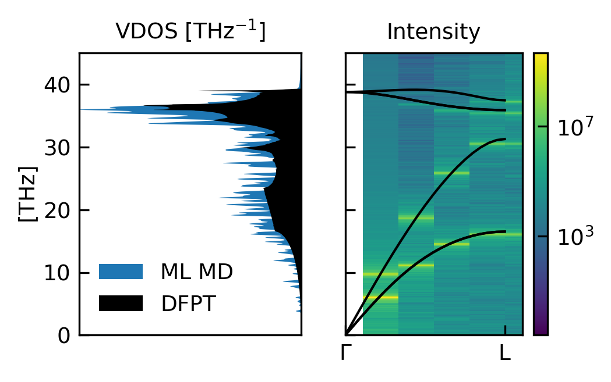
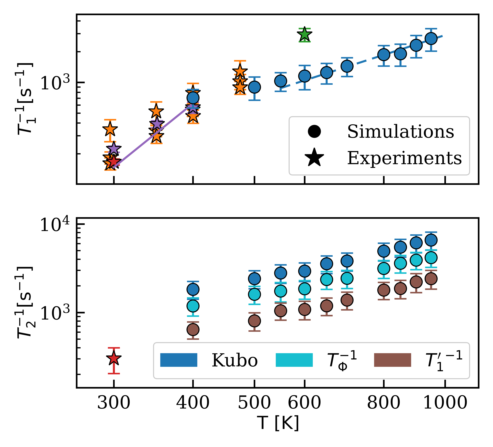
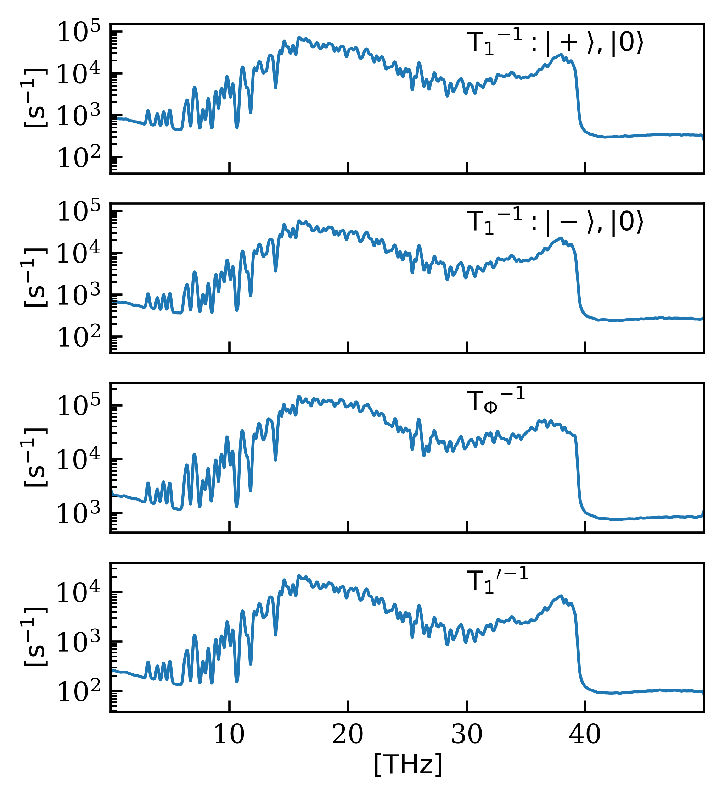

# 機械学習で加速するスピン緩和時間の第一原理計算：ダイヤモンドNVセンターを例に

- 執筆日：2026-05-09
- トピック：量子欠陥スピンの緩和時間（T1・T2）を機械学習分子動力学とゼロ磁場分裂ニューラルネットワークで予測する新手法
- タグ：Computation and Theory, Measurement and Spectroscopy, Defects and Impurities, Spin-Orbit Interaction, Machine Learning, Molecular Dynamics
- 注目論文：[Spin Dynamics from Atomistic Quantum Simulations (2605.04294)](https://arxiv.org/abs/2605.04294)
- 参照論文数：6

---

## 1. なぜ今この話題か

量子コンピューティングと量子センシングは、ここ数年で急速に応用研究の段階へと移行している。量子コンピュータの各種プラットフォーム——超伝導回路、トラップイオン、フォトニクス——が注目される一方、固体中のスピン欠陥（スピン量子ビット）は、室温動作・ナノスケール集積・光学的読み出しといった実用上の強みを持ち、独自の地位を占めている。なかでもダイヤモンド中の窒素空孔（NV）センターは、室温でも数十マイクロ秒のコヒーレンス時間を保持できる稀有な量子系として、量子ビット・量子センサ・量子メモリの候補として世界中の研究室で精力的に研究されている。

しかし、量子技術の実用化に向けて決定的に重要なのは、スピン緩和時間 T1（縦緩和：スピンのエネルギーが格子に移る時間スケール）と T2（横緩和・脱コヒーレンス：量子位相情報が失われる時間スケール）である。この二つのパラメータが、量子ビットの誤り率、センサの感度限界、量子メモリの保持時間を直接決定する。T1 が長いほどスピンは長く「量子状態」を保ち、T2 は T1 の上限（$T_2 \leq 2T_1$）に縛られることから、T1 の最大化は量子技術設計の最優先課題のひとつである。

ここで材料科学が問われる。T1 や T2 を長くするためには、どの結晶を選び、どの欠陥を使い、どんな条件を整えればいいのか。答えを得るには「T1, T2 を温度・材料の関数として第一原理的に計算する」能力が必要だ。ところが、これが極めて難しい。スピンは格子振動（フォノン）と絶えず相互作用し、この「スピン-格子結合」がスピンを熱平衡状態へと引き戻す（T1 緩和）。この過程を正確に計算するには、数千原子の超格子でナノ秒スケールの分子動力学（MD）シミュレーションが必要となり、第一原理（密度汎関数理論：DFT）での直接計算は現実的ではなかった。

2025〜2026年にかけて、この壁を突破する糸口として機械学習が登場した。ML原子間ポテンシャル（MLIP）と、スピンハミルトニアン専用のニューラルネットワーク（NN）モデルを組み合わせることで、DFT精度を保ちながら計算を桁違いに高速化できる。本稿の注目論文（arXiv:2605.04294）は、この方針を実際に実現し、ダイヤモンド中のNVセンターに対してT1とT2を初めて広い温度域にわたって定量的に計算し、実験と優れた一致を示した研究である。

---

## 2. 未解決問題は何か

### 問い1：スピン-格子緩和時間をどうやって第一原理的に予測するか？

従来のT1計算には主に二つの枠組みがあった。(a) フォノンの準粒子近似に基づくRedfield方程式アプローチと、(b) Kubo線形応答理論（LRT）アプローチである。Redfieldアプローチは一般に低温・低次フォノン過程の記述に優れるが、高温領域や非調和効果が重要な系では信頼性が低下する。Kubo LRTは格子振動の時間発展をMDシミュレーションで直接サンプリングするため、温度に関してより広い適用範囲を持つが、MD自体の計算コストが課題だった。「十分な精度のMDを走らせるには何が必要か」という問いが、本分野の核心にある。

### 問い2：スピン-格子結合をどう記述するか？

NVセンターでは、スピンのエネルギー準位（特にゼロ磁場分裂：ZFS）が原子位置の関数として変化する。原子が振動するたびにZFSテンソルが揺らぎ、この揺らぎがスピンの緩和を引き起こす。これを計算するには、各MD描像においてZFSテンソルをDFTで評価する必要があるが、これはMDのボトルネック以上に計算量を要求する。NN によるZFSテンソルの近似が鍵となる。

### 問い3：実験と理論の定量的比較はどこまでできるか？

ダイヤモンドNVセンターのT1は、温度・磁場・不純物濃度に複雑な依存性を示す。既存の理論計算はしばしばフィッティングパラメータを使うか、特定の温度範囲に限定されていた。実験データ（2209.14446など）と真に無パラメータで比較できる理論が存在しなかった。

---

## 3. 注目論文の核心

### 何が明らかになったか

本論文（2605.04294）は、ダイヤモンドNVセンターのT1とT2を温度の関数として第一原理的に計算し、実験結果と定量的に一致させることに初めて成功した。核心的な新規性は、(i) Kubo LRTによるT1・T2の一般公式の導出、(ii) ML分子動力学（MACE MLIPを用いたML-MD）による長時間・大規模シミュレーションの実現、(iii) ゼロ磁場分裂（ZFS）テンソルを予測する専用MACEアーキテクチャNNモデルの構築、の三点にある。

### 理論枠組み：Kubo線形応答理論

スピン-格子系の全ハミルトニアンを次のように分解する：

$$\mathcal{H} = \mathcal{H}_{\rm S}^{0} + \mathcal{H}_{\rm L} + \mathcal{H}_{\rm SL}$$

ここで $\mathcal{H}_{\rm S}^{0}$ は「凍結格子」スピンハミルトニアン、$\mathcal{H}_{\rm L}$ は格子のハミルトニアン、$\mathcal{H}_{\rm SL} = \mathcal{H}_{\rm S} - \langle\mathcal{H}_{\rm S}\rangle_L$ はスピン-格子結合項である。

Kubo LRTを高温・二次摂動近似のもとで適用すると、縦緩和時間 T1 と横緩和時間 T2 の公式が得られる：

$$\frac{1}{T_1} = \sum_{\omega_\delta \neq 0} \omega_\delta^2 \int_0^\infty dt\, e^{i\omega_\delta t} \frac{\langle \mathcal{H}_{\rm SL}^{(\delta)}(t)\, \mathcal{H}_{\rm SL}^{(-\delta)} \rangle}{\langle \mathcal{H}_{\rm S}^2 \rangle}$$

$$\frac{1}{T_2} = \sum_{\omega_\delta} \int_0^\infty dt\, e^{i\omega_\delta t} \frac{\langle [\mathcal{M}^\perp, \mathcal{H}_{\rm SL}^{(\delta)}(t)] \cdot [\mathcal{M}^\perp, \mathcal{H}_{\rm SL}^{(-\delta)}] \rangle}{\hbar^2 \langle |\mathcal{M}^\perp|^2 \rangle}$$

ここで $\omega_\delta = (E_n - E_m)/\hbar$ はスピン準位間エネルギー差、$\mathcal{M}^\perp$ は横方向磁化演算子、$\langle \cdot \rangle$ は $\mathcal{H}_0 = \mathcal{H}_{\rm S}^0 + \mathcal{H}_{\rm L}$ に関する期待値である。

この公式から重要な物理が読み取れる。T1 は「非久期的」遷移（エネルギーの実際の移動を伴う準位間遷移）のみに依存し、T2 はそれに加えて「久期的」純粋脱位相（固有値揺らぎによる位相のずれ）も含む。すなわち：

$$\frac{1}{T_2} = \frac{1}{T_\Phi} + \frac{1}{T_1'}$$

$T_\Phi^{-1}$ は純粋脱位相の寄与、$T_1'^{-1}$ は準位間遷移に由来する成分である。計算によれば $T_\Phi^{-1}$ は $T_1'^{-1}$ よりも約1桁大きく、純粋脱位相が T2 の主要な制限要因であることが判明した。

### MACEによるML-MDとZFS NNモデル

第一原理（DFT/PBE）の精度を保ちながら計算を加速するために、論文では二種類のMLモデルを組み合わせる。

第一に、MACE MLIPを原子間ポテンシャルとして使用し、ML-MDシミュレーションを実施する。MACEは等変グラフニューラルネットワーク（GNN）であり、原子系の回転・並進・反転対称性をSO(3)表現を通じて厳密に満たす（等変性）。これにより、DFTの精度でポテンシャルエネルギー面を近似しつつ、5832〜10648原子の超格子での16 nsスケールMDが可能となった。直接DFTで行えば数千年かかるレベルの計算である。

第二に、ZFSテンソル $\overline{\bm{D}}$ を予測するための別のMACEアーキテクチャGNNモデルを訓練する。ZFSテンソルは欠陥近傍の局所的電子構造のみに依存するため、「アテンション機構」で重要原子を特定し、その原子からの寄与を足し合わせる局所出力モデルを採用する。ZFSテンソルは回転のもとで2階テンソル（球面調和 $\ell=2$ の表現）として変換するため、等変性の課題が生じるが、Clebsch-Gordan係数の縮約によって厳密に実施されている。

損失関数は：

$$\mathcal{L} = \sum_{i \in \mathcal{D}} \left\| \overline{\mathbf{D}}_i - \sum_{j \in \mathcal{A}} \overline{\bm{\mathcal{T}}}(\bm{R}_j^i) \right\|^2 + \left\| \sum_{j \notin \mathcal{A}} \overline{\bm{\mathcal{T}}}(\bm{R}_j^i) \right\|^2$$

第二項は「活性領域外の原子の寄与をゼロにする」ペナルティであり、局所性を強制する。

### 主要結果

MACE MLIPのベンチマークとして、5832原子・1000 Kでの2 ns ML-MDから計算した振動状態密度（VDOS）とフォノン分散を、密度汎関数摂動理論（DFPT）の結果と比較すると、全域で極めて良好な一致が見られた（図1に対応）。

ZFS NN モデルについては、ZFS 軸方向係数 D の温度微分 $\partial D/\partial T \approx -100\,{\rm kHz/K}$（ML-MD計算）が実験値 $-76(1)$ および $-80\,{\rm kHz/K}$ とよく一致した。

最も重要な検証として、T1 の温度依存性を 400 K から 1000 K の範囲で計算し、同位体精製ダイヤモンドの実験データと比較した結果、調整パラメータなしで定量的な一致が得られた（図4に対応）。低温域（400〜600 K）では $T_1 \sim \mu{\rm s}$ オーダー、高温域（600〜1000 K）では急激な減少が再現された。これは、高温で活性化する二フォノンRamanプロセスの寄与が正確に捉えられたことを意味する。

T2 の計算では、磁気ノイズ（核スピン浴）の効果を T=0 での CCE（クラスター相関展開）計算で補完し、実験と矛盾しない範囲の値が得られた。

*図1（2605.04294 Fig.1）：ML-MD で計算した NV センター in ダイヤモンドの振動状態密度（VDOS）とフォノン分散（ML）と、DFPT で計算した純粋ダイヤモンドの結果（DFPT）の比較。CC BY 4.0*

*図4（2605.04294 Fig.4）：上パネル：NV センターの T1 の温度依存性（ML-MD 計算 vs 実験）。下パネル：T2 の温度依存性。CC BY 4.0*

---

## 4. 背景と研究史

### NVセンターと量子技術の接点

ダイヤモンド中のNVセンターは、窒素（N）と空孔（V：Vacancy）が隣接した点欠陥である。1990年代に光学的性質が詳細に研究され、2000年代以降は単一スピン操作・読み出しが実現し、量子センサとしての可能性が急速に広まった。特に、室温・大気圧で操作でき、光磁気共鳴（ODMR）で電子スピン状態を光学的に読み出せる点は、超伝導量子ビットやイオントラップと比較したときの大きな優位性である。

スピン-格子緩和の実験研究としては、Larssonらの 2012年の論文（1112.5936）が先駆的で、5〜475 Kの温度範囲でT1の磁場・温度依存性を詳細に調べ、高温ではRamanプロセス（二フォノン散乱）、低温ではOrbachプロセス（73 meVの活性化エネルギー）が支配的であることを実験的に確立した。2022年には（2209.14446）、高純度サンプルでのT1測定が9〜474 Kにわたって実施され、二フォノン散乱が68.2 meVと167 meVに中心を持つ準局在フォノンとの相互作用に帰せられることが示された。

理論面では、2402.19418が電子-フォノン結合の群論的解析に基づいて核スピン緩和のab initioスキームを提示し、NVセンターにおける14N核スピンの緩和時間が光励起状態への電子-フォノン結合によって著しく増強されることを示した。これは電子スピンの緩和とは異なる過程を対象とした研究であり、NV系の豊かな物理を示している。

### 表面脱コヒーレンスとDFT研究

2512.10726は、ダイヤモン表面近傍のNVセンターにおける表面誘起脱コヒーレンスをDFTで調べた研究である。表面の磁気・電気ノイズがT2を著しく劣化させるメカニズムを原子論的に明らかにしており、ナノスケールセンサの設計に直接関わる知見を提供している。この研究はML加速を使わない純粋なDFT計算によるものであり、2605.04294とは手法が異なる。

### 分子スピン系でのML加速

2410.08912は分子スピン系（磁気単分子磁石など）を対象として、MLを使った加速スピン緩和計算フレームワークを提案している。分子の振動モードのフォノンをMLポテンシャルで近似し、スピン-振動結合テンソルをNNモデルで予測するという構成は、2605.04294と概念的に類似しているが、対象材料が異なる。この研究は固体欠陥系（NVセンター）でなく分子系を対象とし、固体格子のカラム効果（有限サイズ効果、長波長音響フォノンの寄与）への配慮が異なる。

---

## 5. どの解釈が最も妥当か

### Kubo LRTは正しい枠組みか？

Kubo LRTと従来のRedfield方程式はどちらも二次摂動論に基づくが、アプローチが異なる。Redfieldでは格子を「ボース浴」として扱い、フォノンの分布関数を使った解析的表式を導く。Kubo LRTでは、格子の時間発展をMDで直接サンプリングし、時間相関関数を数値的に評価する。

本論文で明らかになったことは、Kubo LRTのフレームワーク内で T1 が「純粋に非久期的」（準位間遷移のみ）であり、T2 には非久期的成分（T1' の寄与）に加えて久期的成分（純粋脱位相 $T_\Phi$）が含まれるという解析的分離である。$T_\Phi^{-1} \gg T_1'^{-1}$ という結果は、実験的に知られているT2 << 2T1 という事実と整合し、NVセンターではスピン-格子間のエネルギー交換よりも位相の乱れが速いことを説明する。

### ML加速の精度は信頼できるか？

MLIPのベンチマークとして、(a) VDOSのDFPTとの比較、(b) フォノン分散、(c) 温度依存ZFS係数 D の実験値との比較が示されており、いずれも良好な一致を示している（図1）。ただし、ZFS NN のPBE汎関数による系統的バイアス（Dの絶対値が実験より約150 MHz ずれる）は認識されており、著者らはこれがZFS NN の問題ではなくPBE自体の限界であると結論している。これは重要な区別だ。温度微分 $\partial D/\partial T$ の計算値は実験と一致しており、温度依存性を支配する物理（格子振動との結合）は正しく捉えられている。

有限サイズ効果の解析（図2）も重要な示唆を与える。500 Kで5000原子以上の超格子が必要であることが示されており、これはMLIPがあって初めて可能な規模の計算である。計算規模と精度の両立が、本研究の最大の技術的成果と言える。

### 未確定な点

高温（>1000 K）での挙動や、磁気ノイズが有意な条件でのT2の計算には、CCEアプローチとの組み合わせが必要であり、CCEの精度はNV濃度・同位体組成に依存する。また、ZFS NNモデルをPBEより高精度な汎関数（HSE06など）で再訓練した場合の影響も未検証である。さらに、圧力・ひずみ依存性や欠陥クラスター（N-V複合体以外）への拡張は今後の課題だ。

2410.08912の分子スピン系との比較では、固体格子特有の長波長フォノン（低エネルギー音響分岐）の寄与を正確に扱うために大きな超格子が必要であるという点が固体系の特殊性として際立つ。分子系では超格子の概念がないため有限サイズ効果は問題にならず、固体スピン欠陥の計算はより挑戦的である。

### 実験との整合性

実験（2209.14446）でフォノンのエネルギー（68.2 meV, 167 meV）に帰せられた構造が、ML-MDで得られたフォノンスペクトルにも反映されているかどうかは今後の検証ポイントである。本論文の計算は全フォノン寄与の積分を取る形式であり、特定フォノンへの帰属分析はなされていない。周波数分解解析（Eq.(3)(4)のフーリエ分解）を使えば、どのフォノン周波数帯が主に緩和を引き起こしているかを特定できる。図3が500 KでのZFSスペクトルの遷移・周波数分解を示しており、ダイヤモンドの光学フォノン（40 THz）以上の周波数域には顕著なピークが見られないことから、主に低周波数（音響フォノン）が T1 緩和を支配していることが示唆されている。

*図3（2605.04294 Fig.3）：500 KでのT1・T2・Tφの遷移および周波数分解。CC BY 4.0*

---

## 6. 何が一般化できるか

### ダイヤモン以外の固体欠陥への応用

本論文の枠組みは、MLIPとZFS-NNを適切に訓練すれば、任意の固体スピン欠陥系に原理的に適用できる。最有力候補は炭化ケイ素（SiC）のSiシリコン欠陥（VSi欠陥）やジバカンシー（VV欠陥）で、ダイヤモンドより製造が容易でありながら長いコヒーレンス時間を持つ。実際、SiCのMLIPは既に報告されており（2110.10843）、ZFS-NNの構築は技術的に実現可能と考えられる。

### 2次元材料の量子欠陥

2504.00154は六方晶窒化ホウ素（hBN）中のホウ素空孔（BV欠陥）のスピン-フォノン緩和を第一原理的に系統調査した研究である。2D材料の特異な次元性（面内振動と面外振動の分離、van der Waals積層、層数依存性）がT1に影響することを示しており、2Dスピンデバイスの設計指針として重要な知見を提供する。本論文（2605.04294）の手法をhBN-BV系に適用すれば、2D量子欠陥の緩和を温度の関数として予測する道が開ける。

### 量子センサ設計への波及

2603.14728は、NVセンターを磁場・温度・応力センサとして使う際のODMRスペクトル解析に深層学習を適用したフレームワークを提案している。このようなMLを使った読み出し手法と、T1・T2の第一原理予測を組み合わせることで、「どの材料・どの条件でセンサ感度が最大化されるか」を事前に計算で予測する設計ループが実現する。

### 設計原理の一般化

ZFSテンソルがどの原子座標に強く依存するか（アテンション機構による特定）は、欠陥近傍のどの振動モードが緩和に最も寄与するかという物理的知見に直結する。特定の振動モードとスピン緩和経路の対応が明確になれば、欠陥近傍の化学的修飾（同位体置換、近接不純物制御）によってT1を能動的に延長する設計指針が得られる。

---

## 7. 基礎から理解する

### 量子ビットとコヒーレンス

量子コンピューティングでは情報を量子ビット（qubit）として扱う。古典ビットが0か1かのどちらか一方であるのに対して、量子ビットは重ね合わせ状態

$$|\psi\rangle = \alpha|0\rangle + \beta|1\rangle \quad (|\alpha|^2 + |\beta|^2 = 1)$$

をとることができる。複数の量子ビットの間には「量子もつれ」が生まれ、これが量子コンピュータの指数関数的な計算能力の根拠となる。

しかし量子状態は壊れやすい。環境との相互作用により、量子ビットは古典的な0/1の混合状態（混合状態）へと退化していく。この過程が「脱コヒーレンス（decoherence）」であり、量子技術の最大の敵である。スピン量子ビットの場合、脱コヒーレンスには主に二種類の経路がある：

- 縦緩和（T1 緩和）：スピンのエネルギーが格子（フォノン）へと散逸し、スピンが熱平衡のポピュレーションへと戻る過程。$|0\rangle$ と $|1\rangle$ の確率の差が消える。
- 横緩和・脱位相（T2 緩和）：スピンの位相コヒーレンスが失われる過程。磁気ノイズや格子振動による「位相のランダムキック」が原因。

これらの時間スケールの間には関係 $T_2 \leq 2T_1$ が成り立ち、T1 を延ばさなければT2 は伸ばせない。

### NVセンターの構造とエネルギー準位

NVセンターはダイヤモン結晶格子（炭素原子が正四面体で結合したsp3結合の共有結合結晶）の中に、隣接する「窒素（N）原子と炭素の欠陥（V）」が形成した点欠陥である。負電荷のNV⁻として機能し、$^3A_2$（スピン三重項）の基底状態を持つ。

基底状態のスピン三重項は $m_s = 0, \pm 1$ の三つの状態に分裂している。外部磁場がゼロのときでも、スピン-スピン双極子相互作用によって $m_s = 0$ と $m_s = \pm 1$ の間に D ≈ 2.87 GHz のエネルギー差が生じる。これが「ゼロ磁場分裂（ZFS：Zero-Field Splitting）」であり、マイクロ波を使ってこのエネルギー差の遷移を駆動することでスピン状態を制御する（ESR/ODMR）。

NVセンターの重要な特徴：
1. 光学的初期化：532 nm のレーザーで照射すると、スピンは $m_s = 0$ 状態に光学的にポンピングされる（初期化）。
2. 光学的読み出し：$m_s = 0$ と $m_s = \pm 1$ では蛍光強度が異なるため、蛍光強度でスピン状態を読み出せる（ODMR：光学検出磁気共鳴）。
3. 室温動作：超伝導量子ビット（mK）と異なり、室温でも有意なコヒーレンス時間が保たれる。

### ゼロ磁場分裂テンソルとスピンハミルトニアン

NVセンターの電子スピンのハミルトニアンは主に：

$$\mathcal{H}_{\rm ZFS} = \bm{\mathcal{S}}\,\overline{\bm{D}}\,\bm{\mathcal{S}}^T$$

で記述される。ここで $\bm{\mathcal{S}} = (S_x, S_y, S_z)$ はスピン演算子ベクトル、$\overline{\bm{D}}$ は2階テンソルのZFSテンソルである。ZFSテンソルは通常、軸方向成分 $D$（単位：MHz または GHz）と菱面体非対称成分 $E$ で特徴づけられる。対称軸方向（NV軸）に外部磁場がないとき：

$$\mathcal{H}_{\rm ZFS} = D\left(S_z^2 - \frac{1}{3}S(S+1)\right) + E(S_x^2 - S_y^2)$$

$D \approx 2.87$ GHz が $m_s = 0$ と $m_s = \pm 1$ の分裂を与え、$E$ は対称性の低下（ひずみなど）で生じる。

格子振動によって原子位置が変動すると、ZFSテンソルも時間変動する：

$$\overline{\bm{D}}(t) = \overline{\bm{D}}_{\rm eq} + \delta\overline{\bm{D}}(t)$$

この揺らぎ $\delta\overline{\bm{D}}(t)$ がスピン-格子相互作用ハミルトニアン $\mathcal{H}_{\rm SL}$ の主成分となり、スピン緩和を引き起こす。

### スピン-格子緩和のメカニズム

スピン-格子緩和は、格子フォノンとスピン系の間のエネルギー交換で起きる。一フォノン過程（直接過程）と二フォノン過程（Ramanプロセス、Orbachプロセス）が主要なメカニズムである：

- 直接過程（one-phonon）：スピン分裂エネルギー $\hbar\omega_{\rm spin}$ に等しいエネルギーを持つフォノンを1個放出（または吸収）する過程。$1/T_1 \propto T$（低温）。

- Ramanプロセス（two-phonon）：エネルギーの異なる2個のフォノンが関与し、その差のエネルギーがスピン分裂に等しい仮想状態を経由する散乱。$1/T_1 \propto T^5$（低音）〜$T^9$（高温）。

- Orbachプロセス（two-phonon, real intermediate）：中間状態として実の励起状態を経由する二フォノン過程。$1/T_1 \propto e^{-\Delta/k_B T}$（活性化型）。

ダイヤモンドNVセンターでは室温以上でRamanプロセスが支配的であり、温度上昇とともにT1は急速に短くなる。本論文のML-MD計算でも、この急激な温度依存性が正確に再現された。

### Kubo線形応答理論の核心

Kubo線形応答理論（Kubo LRT）は、系が小さな外部摂動を受けたとき、その応答が揺らぎ散逸定理に基づいて平衡状態の時間相関関数で表現できることを示す。この文脈では、スピンの緩和速度 $1/T_1$ は「平衡状態でのスピン-格子相互作用ハミルトニアンの自己相関関数」のフーリエ変換として書かれる。

$$\frac{1}{T_1} \propto \int_0^\infty dt\, \langle \mathcal{H}_{\rm SL}(t)\, \mathcal{H}_{\rm SL}(0) \rangle$$

このアプローチの利点は、格子の時間発展を古典MD（あるいはML-MD）でサンプリングすることで、非調和効果・温度効果・複雑なフォノン分散を自然に取り込める点にある。準粒子フォノンの仮定を必要とせず、広い温度域で適用可能である。

### 機械学習原子間ポテンシャル（MLIP）と等変GNN

密度汎関数理論（DFT）計算は非常に精度が高いが、計算コストが原子数 $N$ の約3乗でスケールする（$O(N^3)$）ため、1000原子以上の系でのMDは困難である。MLIPはDFTの精度を保ちながら、計算コストを $O(N)$〜$O(N\log N)$ に劇的に削減する。

MACE（Message-passing Atomic Cluster Expansion）は等変グラフニューラルネットワーク（GNN）の一種であり、原子環境を記述する特徴量を計算し、エネルギーと力を出力する。「等変性（equivariance）」とは、入力に回転変換を施したとき、出力が対応して適切に変換されることを意味する。

$$f(R\cdot\{r_i\}) = D(R)\cdot f(\{r_i\})$$

ここで $R$ は回転行列、$D(R)$ は出力の表現空間での変換行列である。エネルギー（スカラー）は $\ell=0$ の表現（回転不変）、力（ベクトル）は $\ell=1$ の表現（ベクトルとして回転）、ZFSテンソル（2階テンソル、traceless symmetric）は $\ell=2$ の表現として変換する。Clebsch-Gordan係数を使った縮約で、これらの等変性が実施される。

訓練データはDFT計算で生成し、「能動学習（active learning）」で効率的にデータを追加する。能動学習では、モデルの予測不確かさが大きい構造を次の訓練データとして選択するため、少ないDFT計算で高精度なモデルが構築できる。

---

## 8. 専門用語の解説

**ゼロ磁場分裂（Zero-Field Splitting, ZFS）**：外部磁場がゼロでもスピン三重項の縮退が解ける現象。NVセンターでは電子スピン-スピン双極子相互作用が原因で、$D \approx 2.87$ GHz の準位分裂が生じる。原子位置の変化に敏感であり、スピン-格子結合の主要な経路となる。格子が振動するたびにZFSが揺らぎ、この揺らぎがスピン緩和を引き起こす。

**縦緩和時間 T1（スピン格子緩和時間）**：スピンの「向き（ポピュレーション）」が熱平衡へ回復する時間スケール。エネルギーが格子フォノンに散逸することで起きる。量子ビットとして使える最長の動作時間の上限を与える。ダイヤモンドNVセンターでは室温で約 1〜6 ms、高温では急速に短くなる。

**横緩和時間 T2（脱コヒーレンス時間）**：スピンの「位相（コヒーレンス）」が失われる時間スケール。T1 緩和に加え、環境磁気ノイズ（核スピン浴）や格子振動による「純粋脱位相」が寄与する。$T_2 \leq 2T_1$ が必ず成立し、実用上は $T_2 \ll T_1$ の場合が多い。

**Kubo線形応答理論（Kubo LRT）**：日本の物理学者久保亮五が1957年に提案した理論枠組み。外部摂動に対する系の応答が、平衡状態における揺らぎ（自己相関関数）で表現されるという「揺らぎ散逸定理」を数学的に精密化したもの。本論文ではスピン緩和速度 $1/T_{1,2}$ を、スピン-格子相互作用の時間相関関数のフーリエ変換として表現するために使用される。

**久期的・非久期的寄与（Secular/Non-secular）**：スピン緩和の寄与を周波数で分類する概念。非久期的寄与（$\omega_\delta \neq 0$）はエネルギーが実際に移動するスピン準位間の遷移を表し、T1 緩和の原因となる。久期的寄与（$\omega_\delta = 0$）は固有値の揺らぎによる純粋脱位相を表し、T2 のみに影響する。NVセンターでは久期的純粋脱位相 $T_\Phi^{-1}$ が非久期的成分より約1桁大きく、T2 << 2T1 を説明する。

**MACE（Message-passing Atomic Cluster Expansion）**：等変グラフニューラルネットワークを基盤とした高精度機械学習ポテンシャルの一種。原子間の距離・角度情報を球面調和関数で展開し、SO(3)対称性を厳密に保った特徴量計算を行う。本論文では二つの役割で使用される：(1) 原子間ポテンシャルとしてのMLIPで長時間MDを実施、(2) ZFSテンソルを直接予測するGNNモデル。

**能動学習（Active Learning）**：機械学習モデルの訓練効率を高める手法。モデルの予測不確かさが高い（未知の）構造を優先的に第一原理計算でラベル付けし、訓練データに追加する。これにより、少ない計算コストで多様な構造をカバーした高精度モデルを構築できる。本論文では、高温MD中の特異な原子配置に対してDFT計算を追加することで、MACE MLIPの精度を向上させている。

**振動状態密度（VDOS：Vibrational Density of States）**：系中に存在する振動モード（フォノン）のエネルギー分布を表す関数。$g(\omega)d\omega$ が $[\omega, \omega+d\omega]$ の振動数を持つモード数に対応する。MD軌道からフーリエ変換によって計算でき、フォノン分散やデバイ温度、比熱などの熱的性質と結びつく。ML-MDと第一原理フォノン計算（DFPT）のVDOSの比較が、MLIPの精度検証に使われた。

**クラスター相関展開（CCE：Cluster Correlation Expansion）**：核スピンのランダムな配置（核スピン浴）がNVセンターのT2に与える影響を計算する手法。NV近傍の13C核スピンのクラスターを逐次展開し、核スピン-電子スピン双極子相互作用による脱コヒーレンスを定量的に評価する。本論文ではT=0での磁気ノイズ効果の見積もりに使用された。

**等変性（Equivariance）**：ニューラルネットワークなどの関数が、入力に対称変換を施したとき、出力が対応する（同じ対称群の）変換で変わる性質。スカラー量（エネルギー）はRotation-invariant（回転不変）、ベクトル量（力）はrotation-equivariant（回転等変）、テンソル量（ZFS）は高次表現で等変である。等変性を構造的に組み込んだNNは、データ効率が高く、少ない訓練サンプルで高精度を達成できる。

**Ramanプロセス（スピン緩和の文脈で）**：二フォノン散乱過程。NVセンターの量子エネルギー準位の差（~2.87 GHz）と等しいエネルギー差を持つ2個のフォノン（一方が放出、他方が吸収）を通じてスピンが緩和する。仮想中間状態を経由するため、「オフシェル」過程とも呼ばれる。温度依存性は $1/T_1 \propto T^5$ または $T^9$ となり、高温領域でNVセンターのT1を急激に短くする主要なメカニズムである。

---

## 9. 将来展望

### 確からしくなったこと

本研究で最も確立されたことは、「MLIPとZFS-NNを組み合わせたKubo LRTアプローチが、固体スピン欠陥のT1を温度の関数として定量的に予測できる」という命題の実証である。ダイヤモンドNVセンターという最も研究が進んだ系で実験との一致が示されたことは、手法の妥当性を強く支持する。また、T2 の主要な制限因子が純粋脱位相（久期的寄与）であることの理論的確認も、実験界での知識と整合する。計算的には、10000原子規模のMLIPベースのMDが現実的に実施可能であることが示され、今後の大規模シミュレーションへの道が開けた。

### まだ未確定なこと

PBE汎関数が引き起こすZFSテンソルの系統誤差（約150 MHz のシフト）が温度依存性の精度にどの程度影響するかは、より高精度な汎関数（HSE06、SCAN）を用いた再訓練によって検証される必要がある。低温領域（< 400 K）では一フォノン過程やOrbachプロセスがRedfieldアプローチで捉えやすく、Kubo LRTの有効性との境界条件が曖昧なままである。また、磁気ノイズ（核スピン浴）の温度依存性を完全に取り込むには、CCEと有限温度効果を組み合わせた拡張が必要である。

### 今後の鍵となる実験・理論・計算

最も重要な次のステップとして、SiCの量子欠陥（VSiやVV欠陥）へのフレームワーク移植がある。SiCはダイヤモンドより製造コストが低く、半導体技術との統合が容易であることから、量子技術への即応用が期待される。また、2D量子欠陥（hBN中のBV欠陥など、2504.00154）への適用も重要で、2D特有の次元性効果がT1にどう影響するかを定量的に明らかにできれば、2Dベース量子センサの設計に直結する。理論的には、Kubo LRTにおける量子補正（核の量子揺らぎ、PATH INTEGRAL MDとの組み合わせ）が低温精度の改善に貢献しうる。さらに、ZFS-NNの予測から「どの振動モードがT1を最も強く制御するか」を特定し、その振動モードを抑制する欠陥・格子設計原理を導出する「逆設計ループ」の構築が、量子材料設計の未来を切り開くと考えられる。

---

## 参考論文一覧

1. **[2605.04294] Spin Dynamics from Atomistic Quantum Simulations**  
   https://arxiv.org/abs/2605.04294  
   本稿の注目論文。Kubo LRT + MACE MLIP + ZFS NN による NV センターの T1・T2 の第一原理計算と実験検証を初めて実現。

2. **[2410.08912] A machine-learning framework for accelerating spin-lattice relaxation simulations**  
   https://arxiv.org/abs/2410.08912  
   分子スピン系（磁気単分子磁石など）を対象として ML 加速スピン緩和計算フレームワークを提案。固体欠陥系との比較において計算概念の共通性と相違点を示す。

3. **[2209.14446] Temperature-dependent spin-lattice relaxation of the nitrogen-vacancy spin triplet in diamond**  
   https://arxiv.org/abs/2209.14446  
   9〜474 K の幅広い温度域での NV センター T1 実験測定。二フォノン Raman 散乱の ab initio 理論との比較を示す重要な実験ベースライン。

4. **[2402.19418] Nuclear spin relaxation in solid state defect quantum bits via electron-phonon coupling in their optical excited state**  
   https://arxiv.org/abs/2402.19418  
   NV センターの電子スピン緩和とは異なる核スピン（14N）の緩和機構を DFT ＋群論で解析。光学励起状態経由の電子-フォノン結合が核スピン T1 を支配することを示す。

5. **[2512.10726] Understanding Surface-Induced Decoherence of NV Centers in Diamond**  
   https://arxiv.org/abs/2512.10726  
   表面近傍 NV センターの磁気・電気ノイズ由来の表面脱コヒーレンスを DFT で解析。ML 非依存のアプローチでナノスケール量子センサの性能限界を示す。

6. **[2603.14728] A Deep-Learning-Boosted Framework for Quantum Sensing with Nitrogen-Vacancy Centers in Diamond**  
   https://arxiv.org/abs/2603.14728  
   ODMR スペクトル解析に深層学習を適用し、磁場・温度・応力の高速測定を実現する応用研究。T1・T2 の材料設計と量子センサ応用をつなぐ。

7. **[2504.00154] Spin-Phonon Relaxation of Boron-Vacancy Centers in Two-Dimensional Boron Nitride Polytypes**  
   https://arxiv.org/abs/2504.00154  
   2D 材料 hBN 中のホウ素空孔欠陥のスピン-フォノン緩和を第一原理的に系統調査。2D 次元性がT1 に与える影響を解明し、2D 量子技術材料設計への指針を提供。
