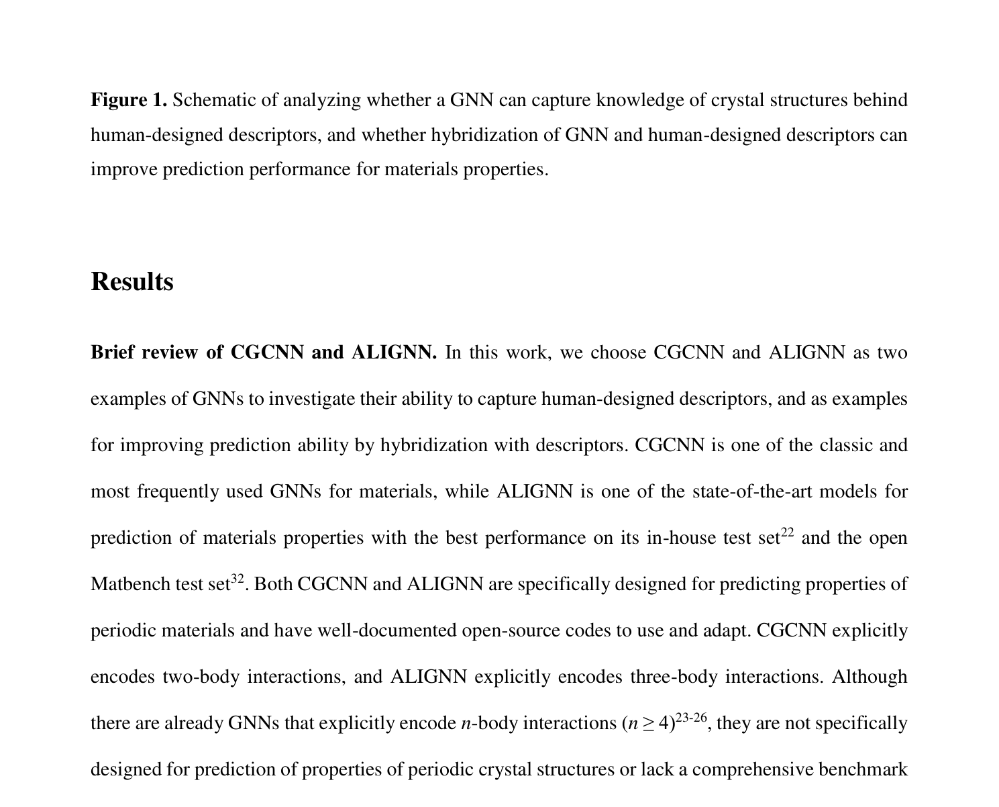
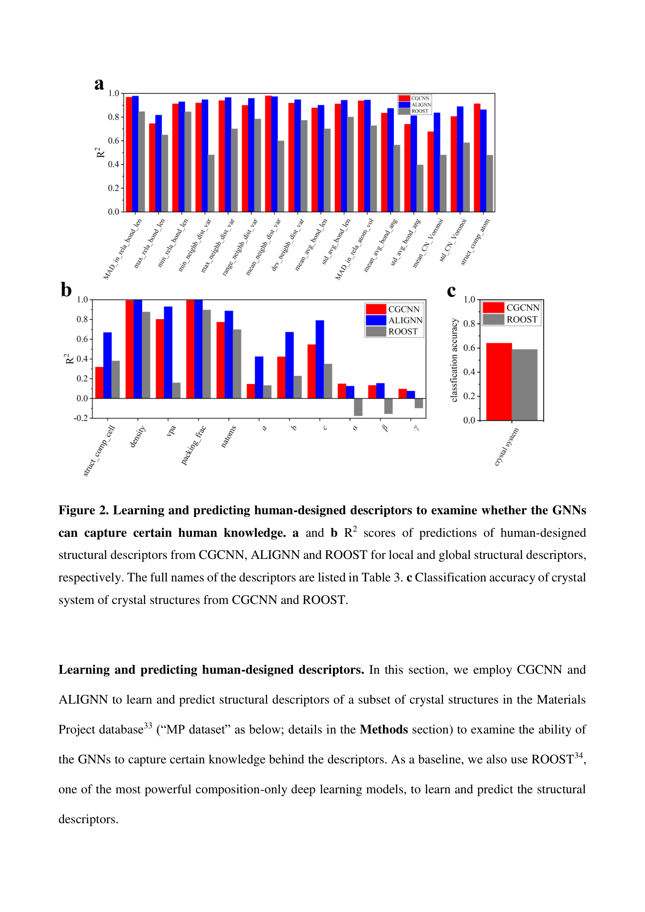
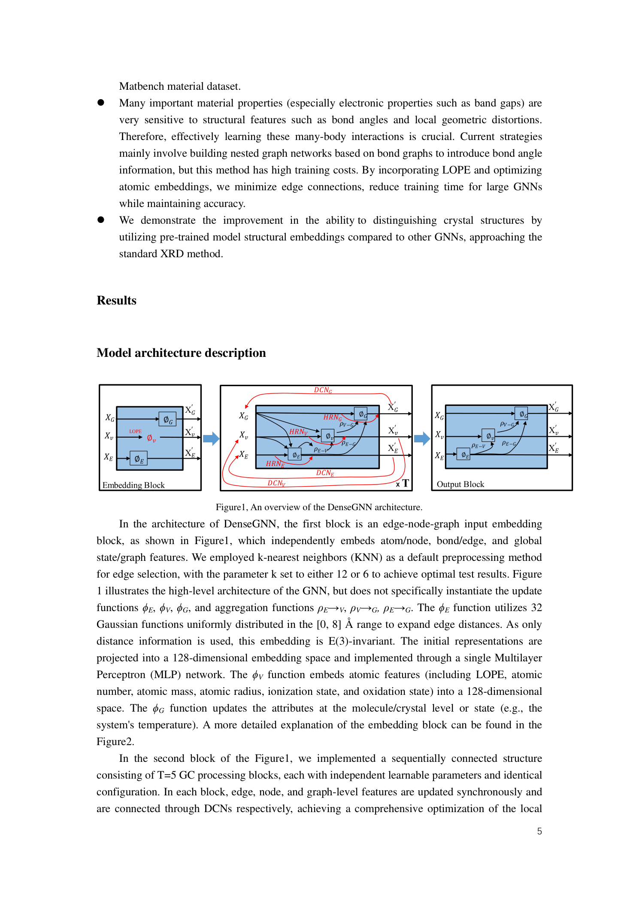
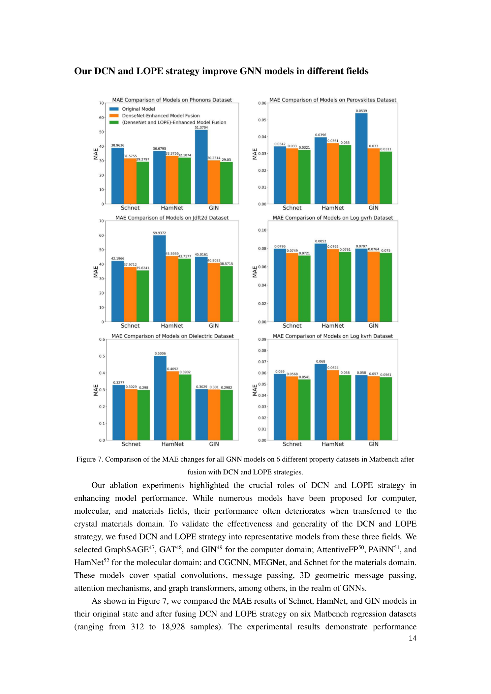

# 結晶GNNを用いた共有再帰畳み込みによる材料特性予測

- 執筆日: 2026-05-09
- トピック: 結晶グラフニューラルネットワークにおける重み共有と再帰的メッセージパッシングの有効性
- タグ: Computation and Theory, Surrogate Modeling, Machine Learning
- 注目論文: SR-CGCNN: Shared Recurrent Convolution in Crystal Graph Neural Networks for Materials Property Prediction (arXiv:2605.01304, Satadeep Bhattacharjee, 2026)
- 参照論文数: 6

---

## 1. 研究背景

材料科学の中心的な課題の一つは、ある原子配置が与えられたとき、その物質の生成エネルギーやバンドギャップ、弾性定数、磁気モーメントといった物性を精度よく予測することである。密度汎関数理論 (DFT) はその代表的な第一原理計算手法であり、原子構造から電子状態を自己無撞着に求めることで物性を高精度に算出できる。しかしDFT計算は原子数 $N$ に対して $O(N^3)$ 以上の計算コストを要し、数百万件以上の候補構造を網羅的にスクリーニングする材料探索には時間的・計算的に限界がある。この限界を打ち破る手段として、DFT計算データを教師データとした機械学習による物性代理モデルが急速に発展してきた。

結晶材料の機械学習予測の歴史的転換点となったのが、グラフニューラルネットワーク (GNN) の材料科学への応用である。2018年にXieとGrossmanが提案した Crystal Graph Convolutional Neural Network (CGCNN) は、結晶構造を「原子ノード・結合エッジ」のグラフとして表現し、エンドツーエンドで材料物性を学習する枠組みを確立した。それ以前の機械学習モデルが組成記述子や人手設計の構造特徴量に頼っていたのに対し、CGCNNは原子間の結合トポロジーと距離情報から直接グラフ表現を学習することで、多様な結晶型・組成に汎用的に適用できる点が画期的であった。Materials Projectデータベースに収録された数万点のDFT計算データで学習した結果、生成エネルギーの平均絶対誤差 (MAE) がおよそ0.1 eV/atom以下という実用的な精度が得られ、材料インフォマティクスにGNNが根付く契機となった。

その後、SchNetの連続フィルタ畳み込み、MEGNetのグローバル状態変数の導入、ALIGNNの角度情報の明示的な組み込みなど、CGCNNを起点として多様なGNNアーキテクチャが提案されてきた。これらの拡張はいずれも、局所環境の表現をより豊かにすることで予測精度を向上させることを目指している。その一方で、より根本的な問いが置き去りにされていた。「GNNを深くすることで精度が上がるのは、単に情報が広い範囲に伝播するからなのか、それとも独立に学習できる変換が増えるからなのか」という問いである。この二つの効果は通常の積層アーキテクチャでは同時に変化してしまい、切り離して評価することが難しい。

さらに、GNNが結晶周期構造を本当に捉えられているかという疑問も浮上している。Gongらは系統的な分析により、現在の最先端GNNが結晶の周期性を十分に表現できていないことを明らかにした。局所的な配位環境の情報は比較的よく学習されるが、長距離の構造周期性やグローバルな結晶系の情報はGNNには難しいという事実は、GNNの設計思想そのものの再考を促している。材料データセットは多くの場合、ImageNetのような大規模データセットとは異なり、数千から数万点という中程度の規模に限られる。このデータ制限の中で、いかにパラメータ効率のよいモデルを構築するかは、材料インフォマティクスにおける普遍的な課題である。

---

## 2. 未解決問題

### メッセージパッシングの深さとパラメータ数の不可分性

標準的なCGCNN（およびそれに準じるGNN）では、畳み込み層を積み重ねることで情報の伝播距離（受容野）を拡大する。$L$ 層のCGCNNでは、あるノードの表現が $L$ ホップ先までの原子情報を統合できる。しかし同時に、独立して学習されるパラメータ集合の数も $L$ 倍に増える。

このことは二つの問題を引き起こす。第一に、適度な大きさのデータセットでは、層数を増やすほど過適合のリスクが高まる。第二に、「深くすることで精度が向上した」という観察が、「より広い受容野が効いている」のか「より多くの独立パラメータが効いている」のかを判断できない。設計知見として、「この材料系には $L = 3$ 層が最適」という経験則が広まっていても、その根拠は必ずしも明確ではない。

材料物性の予測において、受容野の広さは重要な物理的意味を持つ。生成エネルギーやバンドギャップは、第一隣接球だけでなく第二・第三配位圏の結合トポロジーや中距離秩序にも依存する。したがって、メッセージパッシングステップ数を増やすこと自体には物理的正当性がある。しかし、それに伴うパラメータ数の増加は本質的に必要なのだろうか。

### 過平滑化と情報の欠落

深いGNNに特有の問題として過平滑化 (oversmoothing) がある。メッセージパッシングを繰り返すと、全ノードの表現が均質化していき、個々の原子の区別がつかなくなっていく。これは特に、全結晶の原子表現を平均プーリングして結晶レベルの表現を得るCGCNN型アーキテクチャでは深刻である。プーリングの前に原子表現が過度に均質化すると、結晶全体の情報が失われる。

加えて、Gongらが指摘するように、現在のGNNは結晶の周期性を適切に表現できていない部分がある。図2に示すように、局所的な構造記述子（最近接距離、配位数など）はCGCNNやALIGNNでそれなりに予測できる一方、空間群、点群、結晶系といったグローバルな対称性情報はGNNに捉えにくい。これは、GNNが本質的に局所的な情報伝播機構だからであり、長距離・周期性情報を得るには何らかの補完機構が必要だという指摘につながる。

### この論文が答えようとした問い

SR-CGCNNが直接答えようとした問いは、「同じ重みを共有した畳み込みブロックを $T$ 回繰り返すことで、独立した $L$ 層の積み重ねの効果を代替できるか」というものである。もしこの問いへの答えが「ほぼ等価に代替できる」なら、モデルの小型化・高速化が実現でき、データ制限下の材料インフォマティクスにとって重要な設計知見となる。

---

## 3. 注目論文の概要

### 研究の目的と手法

Bhattacharjee (2026) が提案したSR-CGCNN (Shared Recurrent CGCNN) は、標準的なCGCNNの結晶グラフ畳み込み部分において、独立した重みセットを持つ複数の層を、単一の重みセットを $T$ 回繰り返す再帰的な構造に置き換えたものである。グラフ構築、原子特徴、距離のガウス基底展開、プーリング操作、予測ヘッドはすべてオリジナルのCGCNNと同一であり、変更点は畳み込み部分の重み共有のみである。この制御された比較設計により、「重み共有が精度に与える影響」を純粋に評価できる点がこの研究の強みである。

実験には Materials Project データベースから取得した生成エネルギー (formation energy) とバンドギャップ (band gap) の2種類のデータセットを使用した。学習:検証:テストの分割は60:20:20であり、最適化にはAdamオプティマイザ（学習率0.001）、バッチサイズ256、300エポックの学習を用いた。比較対象としたモデルは以下の4つである。

- CGCNN-1: 独立した1層の標準CGCNN
- CGCNN-3: 独立した3層の標準CGCNN
- SR-CGCNN-3: 1つの共有ブロックを3回繰り返す再帰CGCNN
- SR-CGCNN-5: 1つの共有ブロックを5回繰り返す再帰CGCNN

### 主要な実験結果

表1に生成エネルギー予測の結果を示す。

| モデル | ブロック数 | ステップ数 | 畳み込みパラメータ数 | 全パラメータ数 | テストMAE (eV/atom) |
|--------|------------|------------|---------------------|----------------|---------------------|
| CGCNN-1 | 1 | 1 | 22,144 | 36,545 | 0.1208 |
| CGCNN-3 | 3 | 3 | 66,432 | 80,833 | 0.0945 |
| SR-CGCNN-3 | 1 | 3 | 22,912 | 37,313 | 0.0986 |
| SR-CGCNN-5 | 1 | 5 | 23,680 | 38,081 | 0.1031 |

バンドギャップ予測では、CGCNN-3のMAEが0.4346 eV、SR-CGCNN-3が0.4503 eVであり、同様の傾向を示す。

最も重要な数字は、SR-CGCNN-3がCGCNN-3の畳み込みパラメータの34.5%（= 22,912 / 66,432）しか使わずに、生成エネルギーMAEで4.3%の増加（0.0945 → 0.0986 eV/atom）に留まっていることである。一方、SR-CGCNN-5はSR-CGCNN-3よりも精度が低下しており、再帰ステップを増やしても単調に精度が向上するわけではないことを示している。

### 著者の主張と新規性

著者は、「反復的な共有メッセージパッシングは、積み重ねたCGCNN深さのパラメータ効率的な近似を提供できる」と結論づけている。これは、メッセージパッシング深さの拡大（広い受容野の獲得）とパラメータ数の拡大（独立な変換の増加）を分離できることを、Materials Project規模のデータセット上で定量的に示した最初の研究の一つである。また、SR-CGCNN-1（= CGCNN-1）と比較してSR-CGCNN-3が大幅に精度向上することは、再帰ステップが単に同じ操作を繰り返すのではなく、情報を段階的に精緻化していることを示唆している。

---

## 4. 研究史の中での位置づけ

### CGCNNから始まる結晶GNNの系譜

結晶グラフGNNの出発点は、2018年のCGCNN（Xie & Grossman）である。CGCNNは原子ノードと結合エッジをグラフで表現し、グラフ畳み込みによって局所環境の情報を集約、プーリングを経て結晶レベルの表現を得る。8種類の材料物性（生成エネルギー、バンドギャップ、フェルミエネルギーなど）で有望な精度を示し、Materials Projectデータとの組み合わせで大規模な材料スクリーニングへの応用可能性を示した点が先駆的であった。

しかしCGCNNは、距離情報をガウス基底に展開した離散的な表現のみを用い、原子間距離の滑らかな依存性を十分に捉えられないという制限がある。これを克服したのがSchNet（Schütt et al., 2017）である。SchNetは連続フィルタ畳み込み (continuous-filter convolution) を用いて、相互作用カーネルを原子間距離の滑らかな関数として学習する。格子点に縛られない柔軟な相互作用表現が特徴で、分子と結晶の両方に適用できる。

続いて改良版のCGCNN（iCGCNN、Louis et al., 2020）は、グローバルコンテキストプーリングや改良されたエッジ特徴を導入することで、元のCGCNNよりも安定した学習と精度向上を達成した。MEGNet（Chen et al., 2019）はグラフネットワークの更新スキームにグローバル状態変数を追加し、原子・結合・システムレベルの情報を統合して更新する形式を導入した。これらはいずれも「局所環境の表現をより豊かにする」という方向での拡張である。

さらに大きな革新をもたらしたのがALIGNN（Choudhary & DeCost, 2021）である。ALIGNNは結合グラフとそのラインクラフを連動させ、ペアワイズな距離情報だけでなく、結合-結合角度情報も明示的にメッセージパッシングに組み込んだ。これにより、三体相互作用の効果を組み込むことができ、CGCNN・MEGNetより明確な精度改善が得られた。

### 深いGNNへの別アプローチ：DenseGNN

SR-CGCNNとは異なるアプローチで深いGNNの問題に取り組んだのがDenseGNN（Du et al., 2025）である。DenseGNNは Dense Connectivity Network (DCN)、階層的なノード-エッジ-グラフ残差ネットワーク (HRN)、および局所構造秩序パラメータ埋め込み (LOPE) という三つの工夫を組み合わせ、過平滑化を抑制しながら深いアーキテクチャを実現した。

DenseGNNはJARVIS-DFT、Materials Project、QM9など複数のベンチマークで最先端の結果を示しており、特にXRD（X線回折）手法に迫る結晶構造識別能力を主張している。SR-CGCNNとの比較で興味深いのは、DenseGNNが「より豊かな局所表現＋深い接続」を追求するのに対し、SR-CGCNNは「局所表現をシンプルに保ちながら深さを再帰で実現する」という、設計哲学的に対照的な立場をとっていることである。

### SR-CGCNNが加えた知見

SR-CGCNNが既存研究に追加した知見は、主として二点ある。第一に、受容野の拡大（メッセージパッシング深さの増加）とパラメータ数増加の効果を分離した最初の体系的な実験的証拠を提示したことである。CGCNN-1からCGCNN-3への精度向上の多くが、独立パラメータの増加ではなく、情報伝播距離の拡大に起因することをSR-CGCNN-3の精度（CGCNN-3の96%程度）が示唆している。第二に、重み共有という単純な変更がCGCNN的な構造にそのまま適用可能であり、大きなアーキテクチャの再設計なしにパラメータを大幅削減できることを実証した点である。

---

## 5. 批判的考察

### 論文の主張を支持する根拠

SR-CGCNNの主張を支える最も説得力のある証拠は、SR-CGCNN-3 vs. CGCNN-1の比較である。CGCNN-1（MAE = 0.1208 eV/atom）とSR-CGCNN-3（MAE = 0.0986 eV/atom）は、畳み込みパラメータ数がほぼ同じ（22,144 vs. 22,912）でありながら、精度に18.4%の差がある。これは、SR-CGCNN-3の3ステップ再帰が、パラメータを増やすことなく有意義な追加情報を取り込んでいることを強く示唆している。

物理的観点からの解釈も自然である。同じ変換を繰り返し適用するという考え方は、材料科学における反復的な局所更新則（自己無撞着場 (SCF) サイクルや電荷平衡化法など）と概念的に類似している。現実の電子状態は繰り返し計算で収束するように、GNNの原子表現も繰り返し更新で段階的に精緻化されるという解釈には直感的な物理的根拠がある。

### 別解釈と残された疑問

一方で、注意すべき点もある。まず、SR-CGCNN-5がSR-CGCNN-3より精度が低い（0.1031 vs. 0.0986 eV/atom）という結果は、単純に「ステップ数を増やせばよい」わけではないことを意味する。この原因として考えられるのは、過平滑化（ノード表現の均質化）か、あるいは逆伝播時の勾配消失・爆発である。しかし論文はこの点を詳細に分析しておらず、どちらの効果が支配的かは不明である。特に、重み共有のある再帰的ネットワークでは逆伝播時に同一の勾配が繰り返し積み重なるため、long-range gradient依存の問題（Recurrent Neural Networkにおけるvanishing gradientと類似）が生じやすいことは考慮すべきである。

次に、SR-CGCNNはSchNetやALIGNN、DenseGNNと直接比較されていない。同じMaterials Projectデータセット上で比較すれば、最先端のALIGNN等と比べてどの程度の精度差があるかが明確になる。SR-CGCNN-3のMAE = 0.0986 eV/atomという値は、CGCNN-3（0.0945）と比べてそれほど大きな差ではないが、ALIGNNではさらに低い値が報告されていることを考えると、SR-CGCNNは精度の最高点を狙うよりも「パラメータ効率の最適化」に特化したモデルであるという位置づけが適切であろう。

さらに、Materials Projectのみでの検証は一般化の証拠として十分ではない。JARVIS-DFTやMatbenchの複数タスクでのテストがなければ、他の材料系・他の物性への適用可能性は未検証のままである。特に弾性定数のようにグローバルな長距離情報が重要な物性への適用は、局所的なメッセージパッシングの限界から困難な可能性がある。

### 強く言える結論と慎重であるべき点

「Weight tying applied to 3 steps of graph convolution can recover most of the predictive accuracy of independently parameterized 3-layer CGCNN」という主張については、Materials Projectの生成エネルギーとバンドギャップに関してはデータが支持している。しかし、「一般的な結晶物性予測タスクに広く通用するアーキテクチャ原理」としての主張にはまだデータが少なく、慎重に扱うべきである。また、GNNが結晶周期性を十分に捉えられていないというGongらの指摘（図1, 2）は、SR-CGCNNでも未解決の問題であり、重み共有によってこの制限が緩和されるかどうかは全く検討されていない。

---

## 6. 何が一般化できるか

### パラメータ効率設計の原理として

SR-CGCNNが示したパラメータ効率の原理は、CGCNN固有のものではなく、より広いGNNアーキテクチャに適用可能である。任意のメッセージパッシングGNNにおいて、多層の積み重ねを重み共有した再帰に置き換えることは概念的に可能であり、SchNetの連続フィルタ畳み込みブロックやALIGNNのエッジ-ラインクラフ結合ブロックにも同様の変更を加えることができる。特に、材料インフォマティクスで一般的なMaterials Projectデータのように、数万点規模のデータセット上で大型モデルが過適合しやすい状況では、このパラメータ効率化の考え方は実用的価値が高い。

連続学習や転移学習のシナリオでも、共有重みのコンパクトなモデルは有利に働く可能性がある。微調整 (fine-tuning) の際、独立した多層よりも共有重みの少ないモデルの方が、新しいデータドメインへの適応が容易になるかもしれない。また、アクティブラーニングのループにおいて予測モデルを繰り返し再学習するコストも、パラメータ効率的なモデルでは低減できる。

### 他の材料系・物性への適用

SR-CGCNN的な設計原理が有効に機能するのは、「近隣の化学・構造情報の伝播が性能を支配していて、独立な変換の積み重ねが必ずしも必要でない場合」と考えられる。生成エネルギーやバンドギャップはこの条件を比較的満たす。一方、長距離の周期的対称性（空間群、ランダウ秩序パラメータなど）が本質的に関与する物性や、非常に短い距離での微細な差異が重要な物性（例えば特定の欠陥準位エネルギー）では、単純な重み共有による再帰が十分かどうかは検討が必要である。

材料設計の観点から言えば、SR-CGCNN型のコンパクトなモデルは、少数のデータで素早くプロトタイプを構築してスクリーニングするフェーズと、大量の計算資源を使って精度を磨くフェーズを切り分けるワークフローに適合する。すなわち「速くて軽い代理モデル」としての役割が一般化できる知見である。

---

## 7. 基礎から理解する

### 7.1 結晶構造のグラフ表現

結晶材料は、単位格子内の原子位置と格子ベクトルによって定義される周期構造である。この構造をニューラルネットワークに入力するために、グラフ $\mathcal{G} = (\mathcal{V}, \mathcal{E})$ として表現する。ここで $\mathcal{V}$ は原子のノード集合、$\mathcal{E}$ は近傍原子間の結合のエッジ集合である。

各原子 $i$ には初期特徴ベクトル $\bm{v}_i \in \mathbb{R}^{d_v}$ を割り当てる。この特徴ベクトルは原子番号（one-hot表現）、電気陰性度、共有結合半径、酸化状態など、元素に依存する情報を含む。CGCNNではこれを64次元のベクトルにエンコードすることが多い。

各エッジ $(i, j)$（原子 $i$ と原子 $j$ が近傍である）には、原子間距離 $r_{ij}$ をガウス基底に展開したエッジ特徴ベクトル $\bm{u}_{ij} \in \mathbb{R}^{d_u}$ を与える：

$$u_{ij,k} = \exp\left(-\frac{(r_{ij} - \mu_k)^2}{\sigma^2}\right), \quad k = 1, 2, \ldots, d_u$$

ここで $\mu_k$ は等間隔に配置されたガウス関数の中心（例：0 Åから6 Åの範囲を40点など）、$\sigma$ はガウスの幅パラメータである。このガウス基底展開は、距離という連続量をGNNが扱いやすいベクトルに変換する役割を果たす。

近傍の定義には通常、カットオフ距離（例：8 Å以内）と最大近傍数（例：12個）を設ける。周期境界条件のある結晶では、単位格子の画像 (image) も含めた全ての近傍が考慮される。

### 7.2 標準的なCGCNN畳み込みの更新則

初期原子特徴を隠れ空間に射影する埋め込み層を経て：

$$\bm{h}_i^{(0)} = W_{\mathrm{emb}} \bm{v}_i + \bm{b}_{\mathrm{emb}}$$

ここで $W_{\mathrm{emb}} \in \mathbb{R}^{d_h \times d_v}$（$d_h$ は隠れ次元、例えば64）、$\bm{b}_{\mathrm{emb}} \in \mathbb{R}^{d_h}$ は学習可能なバイアスである。

各畳み込みステップ $t$ では、原子 $i$と近傍 $j$ の特徴ベクトル、および結合特徴ベクトルを連結した中間特徴を計算する：

$$\bm{z}_{ij}^{(t)} = \bm{h}_i^{(t)} \oplus \bm{h}_j^{(t)} \oplus \bm{u}_{ij}$$

ここで $\oplus$ は連結 (concatenation) 操作を表す。$\bm{z}_{ij}^{(t)}$ の次元は $2d_h + d_u$ となる。

この連結ベクトルをゲート付き変換に通してメッセージ $\bm{m}_{ij}^{(t)}$ を計算する：

$$\bm{m}_{ij}^{(t)} = \sigma\left(W_f \bm{z}_{ij}^{(t)} + \bm{b}_f\right) \odot g\left(W_s \bm{z}_{ij}^{(t)} + \bm{b}_s\right)$$

ここで $\sigma(\cdot)$ はシグモイド関数（ゲート）、$g(\cdot)$ はSoftplusなどの非線形活性化関数、$\odot$ はアダマール積（要素ごとの積）である。$W_f, W_s \in \mathbb{R}^{d_h \times (2d_h + d_u)}$ と $\bm{b}_f, \bm{b}_s \in \mathbb{R}^{d_h}$ がこの層の学習パラメータである。1層あたりのパラメータ数は $2 \times d_h \times (2d_h + d_u) + 2d_h \approx 2d_h(2d_h + d_u)$ となる。$d_h = 64, d_u = 41$ の場合、約22,000個のパラメータとなり、論文の数値（22,144）と整合する。

近傍原子からのメッセージを集約し：

$$\bm{m}_i^{(t)} = \sum_{j \in \mathcal{N}(i)} \bm{m}_{ij}^{(t)}$$

残差的な更新で原子埋め込みを更新する：

$$\bm{h}_i^{(t+1)} = g\left(\bm{h}_i^{(t)} + \bm{m}_i^{(t)}\right)$$

この更新則を標準CGCNNでは $L$ 回繰り返すが、その際各層は独立したパラメータ $\{W_f^{(t)}, W_s^{(t)}, \bm{b}_f^{(t)}, \bm{b}_s^{(t)}\}_{t=1}^L$ を持つ。

### 7.3 共有再帰畳み込みへの変更

SR-CGCNNの変更点は、全 $T$ ステップで同一の重みセット $\theta = \{W_f, W_s, \bm{b}_f, \bm{b}_s\}$ を使うことだけである：

$$\bm{h}^{(t+1)} = \mathrm{Conv}_{\theta}\left(\bm{h}^{(t)}, \mathcal{E}\right), \quad t = 0, 1, \ldots, T-1$$

標準CGCNN-3と対比させると：

$$\bm{h}_{\mathrm{CGCNN-3}}^{(3)} = \mathrm{Conv}_{\theta_3} \circ \mathrm{Conv}_{\theta_2} \circ \mathrm{Conv}_{\theta_1}\left(\bm{h}^{(0)}\right)$$

$$\bm{h}_{\mathrm{SR-CGCNN-3}}^{(3)} = \mathrm{Conv}_{\theta} \circ \mathrm{Conv}_{\theta} \circ \mathrm{Conv}_{\theta}\left(\bm{h}^{(0)}\right)$$

CGCNN-3では3組の独立した $\{\theta_1, \theta_2, \theta_3\}$（合計66,432の畳み込みパラメータ）を持つのに対し、SR-CGCNN-3では1組の $\theta$（22,912の畳み込みパラメータ）のみである。ただし、埋め込み層と予測ヘッドは両者で共有されるため、全パラメータ数の差（80,833 vs. 37,313）は若干縮まる。

### 7.4 プーリングと予測

$T$ ステップのメッセージパッシング後、原子埋め込みを平均プーリングして結晶レベルの表現を得る：

$$\bm{h}_{\mathrm{crys}} = \frac{1}{N} \sum_{i=1}^{N} \bm{h}_i^{(T)}$$

ここで $N$ は単位格子中の原子数である。この結晶表現を全結合層（MLP）に通して目標物性を予測する：

$$\hat{y} = f_{\mathrm{MLP}}\left(\bm{h}_{\mathrm{crys}}\right)$$

学習の目的関数はMAE損失 $\mathcal{L} = \frac{1}{N} \sum_n |y_n - \hat{y}_n|$ であり、Adam法で最小化する。

### 7.5 過平滑化の物理的理解

重み共有の再帰構造において、$T \to \infty$ の極限では何が起きるか。隣接行列を $A$、正規化ラプラシアンを $\hat{L}$ とすると、シンプルな線形メッセージパッシング（無限回繰り返し）は全ノードのスペクトル全体を固有ベクトル成分に従って拡散させる。最大固有値に対応する成分（定数関数）のみが残り、全ノードが同一の表現に収束する──これが過平滑化の本質である。非線形活性化や残差接続がなければ、十分大きな $T$ で SR-CGCNNも同様の問題に直面する。SR-CGCNN-5がSR-CGCNN-3より精度が低い観察は、このような過平滑化の萌芽的な現象と解釈できる。

DenseGNNが採用した密な接続（Dense Connectivity）は、各層の出力を後続の全層への入力として供給することで、初期の局所情報がネットワーク全体に保持され続けるという設計である。SR-CGCNNの重み共有アプローチと異なり、DenseGNNは各層に独立したパラメータを持つが、過去の全層の情報を常に参照することで過平滑化を抑制する。

---

## 8. 専門用語の解説

**1. グラフニューラルネットワーク (GNN)**
グラフ構造（ノードとエッジで表現されたネットワーク）を入力とするニューラルネットワークの総称。各ノードが近傍ノードから情報を収集・集約して自己の表現を更新する「メッセージパッシング」を基本操作とする。材料科学では原子=ノード、化学結合=エッジとして結晶や分子をグラフ化し、物性予測に用いる。

**2. メッセージパッシング (Message Passing)**
GNNの情報伝播機構。各ステップで、あるノード（原子）が近傍ノード（近接原子）から「メッセージ」を受け取り、自身の特徴ベクトルを更新する。1ステップで第1近接、2ステップで第2近接まで情報が届く。本論文では、このステップ数（深さ）と学習パラメータ数の関係が中心テーマである。

**3. 受容野 (Receptive Field)**
あるノードの更新に情報が寄与できる近傍の範囲。$T$ ステップのメッセージパッシングでは、$T$ ホップ以内の全ての原子からの情報が統合される。結晶物性（特に電子的物性）は原子の第1〜第3近接圏の化学環境に強く依存するため、適切な受容野の設定が重要である。

**4. 重み共有 / パラメータ拘束 (Weight Tying)**
複数のネットワーク層または複数の計算ステップで同一の学習パラメータセットを用いること。Recurrent Neural Network (RNN) が時系列の各時刻ステップで同一の重みを使うのが代表例。計算フロー上は深いネットワークと等価であっても、パラメータ数は大幅に削減できる。SR-CGCNNはこれを結晶グラフ畳み込みに適用した。

**5. 過平滑化 (Oversmoothing)**
GNNを深くすると、メッセージパッシングを繰り返すうちに全ノードの表現が均質化（ほぼ同一の値）になってしまう現象。グラフ上の情報がローパスフィルタリングされ、局所的な多様性が失われる。材料GNNでは、原子の個性が埋もれて物性予測が困難になる。SR-CGCNN-5の精度低下はこの現象の可能性がある。

**6. 生成エネルギー (Formation Energy)**
ある結晶構造を、それを構成する元素の最安定単体から「生成」するのに必要なエネルギー変化（eV/atom単位）。負の値は安定相、正の値は不安定相に対応する。材料の熱力学的安定性を評価する最も基本的な指標であり、Materials ProjectがDFT計算で多数の構造について収録している。GNNの材料物性予測精度を評価する代表的なベンチマーク指標。

**7. バンドギャップ (Band Gap)**
固体の電子状態において、占有帯（価電子帯）の最上端と非占有帯（伝導帯）の最下端のエネルギー差（eV単位）。絶縁体・半導体ではゼロより大きく（通常0.1〜10 eV程度）、金属・半金属では実質ゼロである。光電変換材料やパワーデバイス材料の設計において本質的な物性パラメータ。DFT計算では系統的な過少評価があるため、GNNの予測精度は通常約0.4〜0.5 eV程度のMAEを示す。

**8. Materials Project**
米国エネルギー省が支援する、DFT計算に基づく材料データベース。数十万件以上の無機結晶構造について、生成エネルギー・バンドギャップ・弾性定数・磁気モーメントなどの物性が収録されている。開放的なAPIを通じてデータが利用可能であり、材料インフォマティクス研究の主要なデータソースとなっている。SR-CGCNNの訓練・評価にも使用された。

**9. ガウス基底展開 (Gaussian Basis Expansion)**
原子間距離 $r_{ij}$ という1次元の連続量を、複数のガウス関数 $\exp(-(r_{ij}-\mu_k)^2/\sigma^2)$ の値からなるベクトルに変換するエンコーディング手法。CGCNNでは通常、0〜6 Åの範囲を40点のガウス関数で離散化する。これにより、連続的な距離情報が学習可能な固定次元のベクトルになる。SchNetの連続フィルタ畳み込みはこの離散化を不要にする、より柔軟なアプローチである。

**10. 平均絶対誤差 (MAE, Mean Absolute Error)**
予測値 $\hat{y}_n$ と正解値 $y_n$ の差の絶対値の平均 $\mathrm{MAE} = \frac{1}{N}\sum_n|y_n - \hat{y}_n|$。回帰タスクの評価指標として、外れ値（予測が大きく外れた点）の影響を受けにくい。生成エネルギーに対してeV/atom単位で報告され、0.1 eV/atom以下が実用的な精度の目安とされることが多い。SR-CGCNNの中心的な評価指標。

---

## 9. 将来展望

SR-CGCNNが実証した「受容野の拡大とパラメータ増加の分離」という概念は、材料GNN研究において今後も参照されうる知見である。Materials Projectの生成エネルギーとバンドギャップについて、34.5%のパラメータで3層CGCNN相当の精度を達成したという定量的な事実は、「GNNの深さとパラメータ数を独立に制御できる」というアーキテクチャ設計の可能性を示している。さらに、SR-CGCNN-3 > CGCNN-1という比較が示す通り、再帰ステップには単なるパラメータ追加以上の情報的価値があることも確立されたと言える。これらは、データ制限下の材料インフォマティクスにおけるコンパクトモデル設計の原理として一般化できる。

一方、まだ不確定な点も多い。SR-CGCNN-5がSR-CGCNN-3より精度が低い現象の機構（過平滑化か勾配問題か）は未解明であり、ステップ数の最適化には理論的な基礎が欠けている。また、GNNが結晶周期性を十分に捉えられないというGongらの指摘は、SR-CGCNNでも未解決のままである。重み共有が長距離・周期的情報の取得を助けるのか阻害するのかは検討されていない。さらに、Materials Project以外のデータセット（JARVIS-DFT、Matbench全体）での検証なしに、汎用的なアーキテクチャ原理として評価することは難しい。SchNet・ALIGNN・DenseGNNとの同一条件での直接比較も今後の課題である。

次に重要となる研究方向は少なくとも三つある。第一に、SR-CGCNN的な重み共有を、より豊かな局所環境表現（ALIGNN的な角度情報、SchNet的な連続フィルタ）と組み合わせたアーキテクチャの探索である。これにより、パラメータ効率と表現力のトレードオフをより良い点に最適化できる可能性がある。第二に、過平滑化の抑制機構（バッチ正規化・ドロップアウト・初期特徴の残差接続など）と重み共有の組み合わせによって、ステップ数をさらに増やしても精度が維持できるかの検証が必要である。第三に、少数サンプル学習や能動学習 (active learning) のシナリオでの性能評価である。コンパクトなSR-CGCNNがデータ効率においてより優位に立てるかが検証されれば、「計算リソースが限られた材料探索の最初のフィルタリング段階に最適な代理モデル」という実用的ニッチが明確になるだろう。

---

## 参考論文一覧

1. **[arXiv:2605.01304]** Bhattacharjee, S. (2026). *SR-CGCNN: Shared Recurrent Convolution in Crystal Graph Neural Networks for Materials Property Prediction.* [https://arxiv.org/abs/2605.01304](https://arxiv.org/abs/2605.01304)
   本記事の注目論文。CGCNN畳み込みの重み共有再帰化によるパラメータ効率化と、受容野拡大とパラメータ増加の分離実験を行った。

2. **[arXiv:1710.10324]** Xie, T. & Grossman, J.C. (2018). *Crystal Graph Convolutional Neural Networks for an Accurate and Interpretable Prediction of Material Properties.* Phys. Rev. Lett. 120, 145301. [https://arxiv.org/abs/1710.10324](https://arxiv.org/abs/1710.10324)
   CGCNNの原著論文。原子-結合グラフ表現と畳み込みプーリングによるエンドツーエンド結晶物性予測の基礎を確立した。

3. **[arXiv:1906.05267]** Louis, S.Y. et al. (2020). *Developing an improved Crystal Graph Convolutional Neural Network framework for accelerated materials discovery.* Phys. Rev. Mater. 4, 063801. [https://arxiv.org/abs/1906.05267](https://arxiv.org/abs/1906.05267)
   CGCNNにグローバルプーリングや改良エッジ特徴を追加した改良版iCGCNNを提案し、安定した学習と精度向上を示した。

4. **[arXiv:2106.01829]** Choudhary, K. & DeCost, B. (2021). *Atomistic Line Graph Neural Network for improved materials property predictions.* npj Comput. Mater. 7, 185. [https://arxiv.org/abs/2106.01829](https://arxiv.org/abs/2106.01829)
   結合グラフとラインクラフを結合し角度情報を明示的にメッセージパッシングに組み込んだALIGNNを提案した。

5. **[arXiv:2208.05039]** Gong, S. et al. (2022/2023). *Examining graph neural networks for crystal structures: limitations and opportunities for capturing periodicity.* Sci. Adv. 9, eadi3245. [https://arxiv.org/abs/2208.05039](https://arxiv.org/abs/2208.05039)
   人手設計記述子を試金石として現在のGNNが結晶周期性を十分に捉えられないことを示し、記述子との混合による改善策を提案した。

6. **[arXiv:2501.03278]** Du, H. et al. (2025). *DenseGNN: universal and scalable deeper graph neural networks for high-performance property prediction in crystals and molecules.* npj Comput. Mater. 10, 292. [https://arxiv.org/abs/2501.03278](https://arxiv.org/abs/2501.03278)
   Dense Connectivity Network・階層的残差ネットワーク・局所秩序パラメータ埋め込みを組み合わせ、過平滑化を回避した深いGNNを実現し、複数のベンチマークで最先端性能を達成した。
