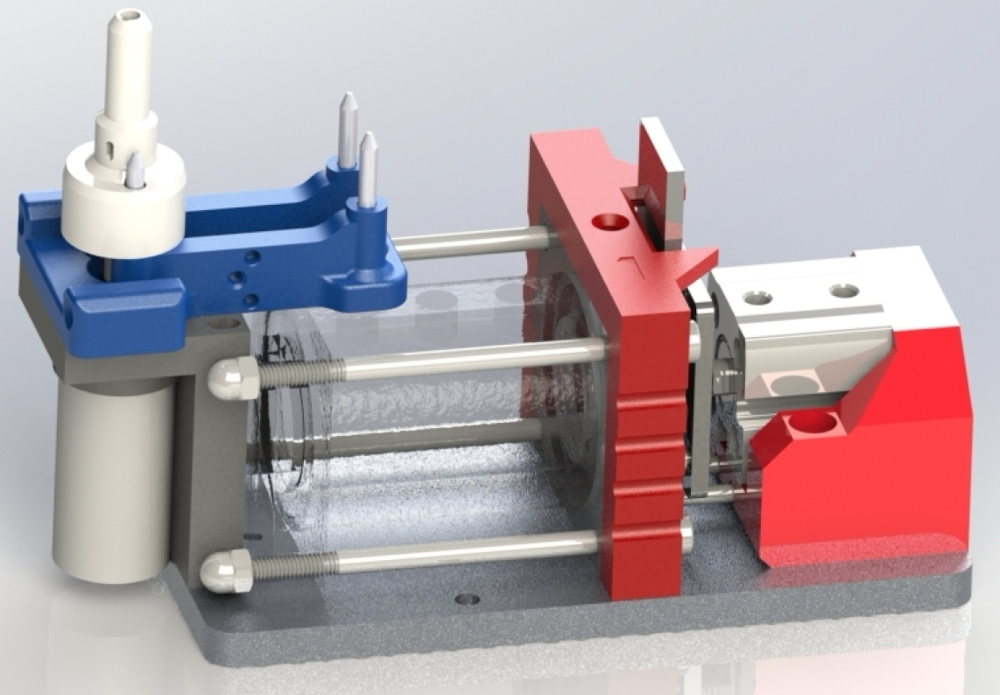
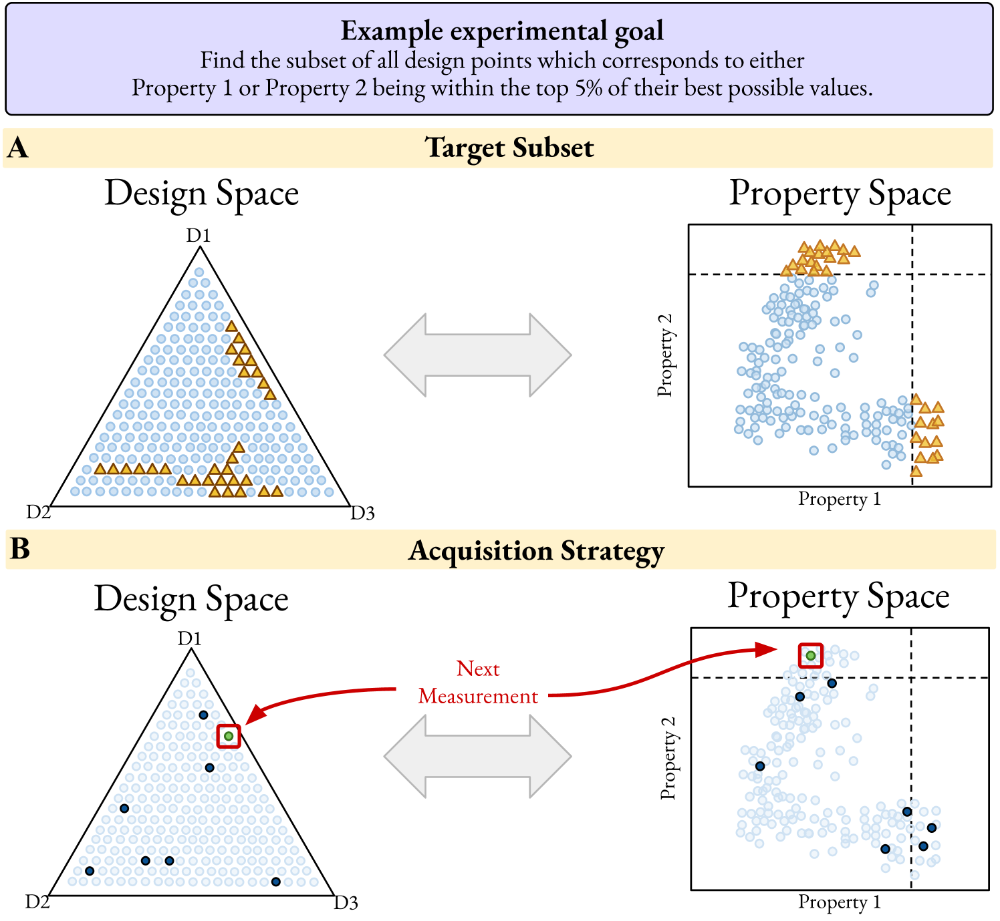
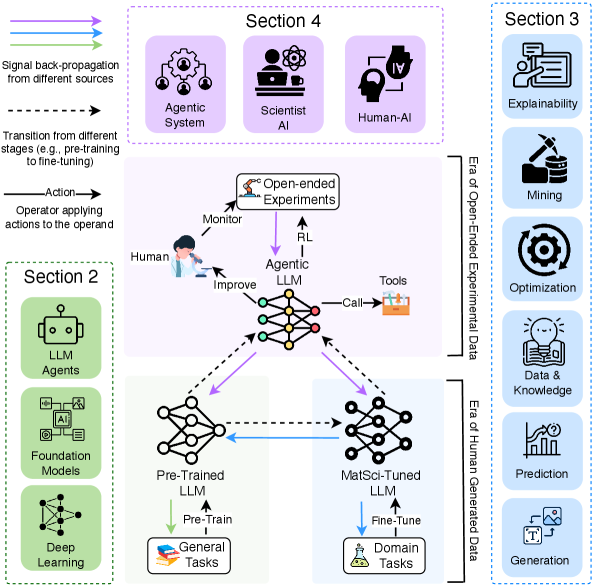

# 自律型実験室の「死の谷」を越えろ：Born-Qualified Materials Development の挑戦

- 執筆日：2026-05-09
- トピック：自律型材料探索（Self-Driving Laboratory）の限界と、製造制約を初期段階から組み込む「Born-Qualified」開発戦略の提案
- タグ：Materials Synthesis and Processing, Inverse Design, Energy-Efficient Functionality, Machine Learning, Surrogate Modeling
- 注目論文：S. R. Spurgeon et al., "Born-Qualified: An Autonomous Framework for Deploying Advanced Energy and Electronic Materials," arXiv:2605.00639 (2026)
- 参照論文数：7

---

## 1. なぜ今この話題か

材料科学は今、かつてない速度の時代を迎えている。ベイズ最適化と自動化ロボットを組み合わせた「自己駆動型実験室（Self-Driving Laboratory; SDL）」は、太陽電池、電池、パワーエレクトロニクスといったエネルギー材料の探索を10〜100倍に加速したとされている。有機ホール輸送材料の移動度最大化、有機光電子材料の10倍速探索、ペロブスカイト組成の自律最適化など、SDLが示した実績は枚挙にいとまがない。

しかし奇妙な事実がある。材料の発見スピードは劇的に向上した一方で、ラボから市場に到達するまでの開発時間はほとんど短縮されていない。有望な新材料が毎週のように学術誌に発表されるにもかかわらず、実際の製品として社会実装されるものはごくわずかである。

この矛盾はなぜ生じるのか。Spurgeon らが2026年5月に発表した論文「Born-Qualified」(arXiv:2605.00639) は、この問いに真正面から向き合い、SDLが本質的に抱える構造的欠陥を指摘するとともに、新たな開発戦略を提唱する。NREL（National Laboratory of the Rockies）、ORNL、LBNL、PNNL、ノースウェスタン大学、ノースカロライナ州立大学など米国の主要国立研究所・大学から31名の著者が結集したこの論文は、自律的材料科学コミュニティの現状認識と処方箋を集約したものとして、大きな注目を集めている。

問題の核心は「プロキシ最適化の罠」にある。大半のSDLは、バンドギャップ、触媒活性、イオン伝導率といった測定しやすい単一の性能指標（KPI; Key Performance Indicator）を最大化するよう設計されている。しかしこれらのKPIは、実際の製品価値とは乖離した「代理変数」に過ぎない。研究コミュニティがKPIの更新を繰り返してきた一方で、スケールアップ時の製造適合性、コスト、耐久性といった本質的な制約は、発見段階では考慮されないまま後回しにされてきた。

---

## 2. 未解決問題は何か

この分野には、互いに絡み合う三つの根本的な問いが横たわっている。

第一の問いは、「KPIと実際の製品価値をどう結びつけるか」である。パワーエレクトロニクス向け半導体材料の評価指標として広く使われるBaliga FOM（$BFOM = \varepsilon_s \mu_n E_{bg}^3$、ここで $\varepsilon_s$ は誘電率、$\mu_n$ は電子移動度、$E_{bg}$ は絶縁破壊電界）は、スイッチング速度や低オン抵抗という観点からは適切な指標だが、熱伝導率や製造プロセスとの整合性は考慮されていない。ダイヤモンドのように理論上は非常に高いBFOMを持つ材料が、製造困難さゆえに実用化されていない例はその典型である。

第二の問いは、「SDLが生成する大量の候補の中で、何が本当に重要なデータポイントか」という問いである。無限に存在しうる化学空間をどう効率的に探索し、得られたデータから実用化に資する構造-プロセス-特性の因果関係をどう抽出するか。相関関係の発見にとどまるか、因果推論まで到達できるかが問われる。

第三の問いは、「ラボスケールとパイロット・量産スケールの断絶をどう埋めるか」である。ミリグラムスケールでは経済的な合成ルートが、グラムスケールに拡大した途端にコスト的に成立しなくなる例は多い。また、単一材料として探索された化合物が、多層デバイス構造に組み込まれた瞬間に露わになるプロセス適合性の問題は、発見段階では完全に不可視である。

---

## 3. 注目論文の核心

### 「死の谷」という構造的問題

Spurgeon ら (2026) の分析によれば、現行のSDLは発見の加速には成功したが、「発見したものを実用化するためのパイプライン」の構築には系統的に失敗している。この乖離を著者らは「死の谷（valley of death）」と呼ぶ。谷が生じる原因は三層構造をなしている：

一層目は、ラボ合成に使われる特殊装置が産業的なアナログを持たないこと。真空チャンバー内でのスパッタリングで作製した薄膜が、産業的なロール・ツー・ロール工程では全く別の材料特性を示すことは珍しくない。

二層目は、コストと資源制約のスケール依存性である。希少元素を微量使用することで成立する実験室レベルの組成が、世界的な元素供給量を圧迫するほどの量産に適用できるかどうかは、別次元の問いである。

三層目は、デバイス統合時に初めて現れるプロセス適合性の問題である。単一材料の特性評価では見えなかった界面反応、熱膨張係数の不整合、他層との化学的相互作用が、実際の積層デバイスとして評価されて初めて顕在化する。

著者らは、PV（光電変換）、電池、パワーエレクトロニクスの主要材料について、理論効率限界・ラボ記録・商用製品の性能を比較し、「ラボ-商用間のギャップが大きい材料ほど市場シェアが小さい」という経験則を示している（論文 Fig.1）。GaAs単接合太陽電池やペロブスカイト太陽電池は効率でシリコンに迫りながら市場浸透が進まない一方、CdTeは効率でリードしていないにも関わらず製造スケーラビリティゆえに市場を確保している、という事実は示唆的である。

### Born-Qualified 戦略の四つの柱

Born-Qualified の中核的アイデアは、「製造可能性、コスト、耐久性の制約を、材料探索の最初から組み込む」ことである。従来のSDLが発見フェーズを加速してから後工程で製造適合性を検証するのに対し、Born-Qualified は「実用化から逆算した制約条件を設計変数の一部として最初から考慮する」。この概念を実装するために、著者らは四つの柱を提唱する。

**柱1：多目的メトリクス（Multi-Objective Metrics）**

単一KPIへの依存を脱し、製造アウトカムと定量的に連結した「価値関数」を設計サイクルの最初から組み込む。例えばマイクロエレクトロニクス材料の設計では、スイッチング速度だけでなく、熱性能、消費電力、既存のFABインフラとのプロセス互換性を同時に考慮する必要がある。技術的には、多目的ベイズ最適化によりPareto frontを不確実性込みで探索し、後工程で新たな制約が加わった際に設計空間の再評価を可能にする。

**柱2：因果モデル（Causal Models）**

機械学習は相関パターンの発見には優れるが、学習分布の外（out-of-distribution）への外挿には弱い。スケールアップや異なる製造条件への適用がまさにこの外挿に相当する。Born-Qualified が要求するのは、物理メカニズムを内包した因果モデルであり、Structural Equation Modeling（SEM）や Directed Acyclic Graph（DAG）を活用したプロセス-構造-特性の因果関係の定量化である。ニューロシンボリック AI や因果推論フレームワークとの統合が鍵となる。

**柱3：モジュラーでスケーラブルなインフラ（Modular, Scalable Infrastructure）**

実験室では異なるメーカーの機器が混在し、プロトコルも統一されていない。LLMを「万能翻訳器」として活用し、機器コントローラーとデータ形式間の自動変換を実現することで、既存の装置群を迅速に自律ワークフローに組み込むことを目指す。

**柱4：製造を発見ループに組み込む（Manufacturing in the Loop）**

ハーフセルの電極評価ではなくフルセルバッテリーの評価、単体デバイスではなく太陽電池モジュールとしての評価、といったように、製造実態に近い評価系を早期から自律ループに組み込む。デジタルツイン（digital twin）による in silico バリデーションを活用して、物理合成の前に製造可能性を検証することも有効とされる。

---

## 4. 背景と研究史

### 自律型実験室（SDL）の誕生

SDL のコンセプトが明確な形で提示されたのは MacLeod ら (2019; arXiv:1906.05398) の論文においてである。彼らはロボットプラットフォームにモデルベース最適化アルゴリズムを組み合わせ、有機ホール輸送材料の薄膜について、光学・電気特性を自律的に最大化した。この実証は、材料探索の全サイクル（合成→評価→次の実験提案）を人間の介在なしに閉ループで回せることを初めて示したものとして、分野の転換点となった。

その後、SDLは有機材料から無機材料、薄膜からナノ粒子・粉末へと急速に拡張した。具体的な実装例として、MAP-E（Materials Acceleration Platform for Electrochemistry；Persaud ら 2026; arXiv:2603.09845）は、自律型電気化学プラットフォームとして特筆に値する。MAP-Eは、ロボティクス液体ハンドリング・サンプル移送・多チャネルポテンシオスタット制御を統合し、人間の介在なしにステンレス鋼（304 SS）の腐食特性を自律的に評価する（Fig.1）。

*Fig. 1. MAP-E の自律電気化学プラットフォーム全体像。ロボティクスアームによる液体ハンドリング、マルチチャネルポテンシオスタット、自動サンプル移送が統合されている。(出典: Persaud et al., arXiv:2603.09845, CC BY 4.0)*

MAP-E の最も注目すべき点は、ガウス過程（Gaussian Process; GP）サロゲートモデルと不確実性駆動サンプリングを組み合わせることで、pH-塩化物濃度空間における腐食安定性ダイアグラムを自律的に構築できることである。32回の自動測定で孔食電位の標準偏差76 mVという再現性を達成した。この実証は、難易度の高い電気化学計測を自律化でき、かつGPサロゲートが材料実験において実用的な精度を持つことを示している。

### SDLの実力と限界の定量的評価

Adesiji ら (2025; arXiv:2508.06642) によるSDLのベンチマーク研究は、分野全体の現状を俯瞰する上で重要な視点を提供する。彼らは加速係数（Acceleration Factor; AF）と強化係数（Enhancement Factor; EF）という二つの指標でSDLの性能を定量化した。

加速係数 $AF$ は「ランダムサンプリングに比べて何倍少ない実験回数で目標を達成できるか」を表し、強化係数 $EF$ は「同じ実験回数でどれだけ高い特性値に到達できるか」を表す。文献横断的な解析の結果、AFの中央値は約6倍であり、探索空間の次元数が増えるほどAFが向上する傾向が見られた。しかし同時に、この解析は重大な問題も浮き彫りにした。多くの研究がコスト、製造適合性、耐久性という実用化に直結する制約を完全に無視しており、「加速した」発見の多くが実験室の文脈でしか意味を持たない可能性があることである。

---

## 5. どの解釈が最も妥当か

### Bayesian Algorithm Execution：目標志向の能動探索

Chitturi ら (2023; arXiv:2312.16078) が提案した Bayesian Algorithm Execution（BAX）は、Born-Qualified の「多目的メトリクス」と「目標志向探索」という課題に対して、有力なアプローチを提供する（Fig.2）。

*Fig. 2. BAX の概念図と適用事例。情報論的獲得関数が「目標を満たす候補の発見」に特化した探索を実現する。(出典: Chitturi et al., arXiv:2312.16078, CC BY 4.0)*

従来のベイズ最適化が「最大値を持つ点を探す」単一目的の手法であるのに対し、BAXは「ユーザーが定義したフィルタリングアルゴリズムを自動翻訳し、そのアルゴリズムが出力する結果を効率的に推定するための実験点を選ぶ」という枠組みをとる。換言すれば、研究者が「どんな材料を探したいか」を自然な形で記述したアルゴリズムを渡すと、BAXがその目標を達成するための実験を情報論的基準で選択する。

TiO₂ナノ粒子合成や磁性材料の多特性探索における実証では、BAXがランダム探索や単純なEI（Expected Improvement）型ベイズ最適化を大幅に上回る効率を示した。この手法は、複数のKPIを同時に満たす材料の発見という Born-Qualified の要求に原理的に対応できる。

ただし BAX にも限界はある。解が存在しない場合や、フィルタリング条件が矛盾する場合への対処が必要であり、また製造制約のような非線形かつ階層的な条件をどのようにフィルタとして記述するか、という問題は未解決のままである。

### アジェンティック AI：発見ループの自律化

Nie ら (2026; arXiv:2602.00169) の「自律型材料科学に向けたアジェンティック AI」は、SDLの次の進化方向として LLM ベースのエージェントシステムを位置づける（Fig.3）。

*Fig. 3. アジェンティック AI が材料科学の発見ループに統合される構造。データ収集・仮説生成・実験実行・解析が自律的なエージェントによって閉ループで運営される。(出典: Nie et al., arXiv:2602.00169, CC BY 4.0)*

著者らは、現行のSDLが「タスク特化型・微調整済みモデル」に依存しており、真の autonomy には程遠いと論じる。真の加速を実現するには、長期目標を設定しながら計画・行動・学習を繰り返す「エージェント」が必要であり、それは合成・キャラクタリゼーション・シミュレーションを横断した多段階の意思決定を含む。

この視点は Born-Qualified の「因果モデル」「モジュラーインフラ」とも整合している。LLMが機器コントローラー間の翻訳を担い、複数の自律エージェントが協調して発見から評価まで全サイクルを管理するというビジョンは、Born-Qualified が目指す Manufacturing in the Loop にも技術的な基盤を提供する。

しかし重要な問題も指摘されている。エージェントの「幻覚（hallucination）」、長期記憶の欠如、複雑な物理制約を扱う推論能力の限界、そして安全性への懸念（自律システムが危険な反応条件を試みるリスク）は、現状の LLM エージェントが実験室に実装されるための大きな障壁である。

### 構造から合成プロトコルへ：パラダイムシフトの必然性

Lambard (2026; arXiv:2605.00313) は、Born-Qualified と軌を一にした問題意識から、より根本的なパラダイムシフトを主張する（Fig.4）。

*Fig. 4. 「構造中心」から「合成プロトコル中心」へのパラダイムシフト。P（合成プロトコル）→ X（構造・形態）→ y（特性）という因果連鎖を設計変数の根幹に置く。(出典: Lambard, arXiv:2605.00313, CC BY 4.0)*

現行のAI駆動型材料設計の多くは、結晶構造や組成を設計変数として候補を生成する「構造中心パラダイム」に立脚している。しかしこのアプローチは、合成可能性（synthesizability）の判断を後回しにする欠点がある。Lambard はこれに対し、「合成プロトコル P → 構造/形態 X → 特性 y」という因果連鎖をそのまま設計変数の根幹に置く「合成プロトコル主導パラダイム」を提唱する。合成プロトコルとは、前駆体・化学量論比・一連の操作（温度・時間・雰囲気・圧力・pH）を機械可読な形式で表現した「レシピ」である。

Born-Qualified と異なるのは、Lambard の提案がより概念的・ロードマップ的であり、具体的な実装よりも「何を設計変数とすべきか」という問いに焦点を当てている点である。しかし二つの論文が同時期に同じ問題を独立して指摘していることは、分野全体がパラダイム転換の臨界点にあることを示唆している。

### 証拠の重みをどう評価するか

三つのアプローチを比較すると、支持する証拠の強さには差がある。MAP-E（2603.09845）は実際の材料（304ステンレス鋼）で自律ループを実証した最も具体的な例であり、確実な実績を持つ。BAX（2312.16078）は2物質系（TiO₂ナノ粒子・磁性材料）での実証があるが、製造制約の統合はまだ試みられていない。

アジェンティック AI の視点（2602.00169）は理論的に説得力があるが、実験室での安全かつ再現可能な実装は現時点では限定的である。Born-Qualified と Lambard の合成プロトコル主導論（2605.00313）は、いずれも実験的検証のない展望論文であり、主張の妥当性は今後の実装にかかっている。

現時点でより確からしいことは、「SDLが単一KPIの最適化に特化していること」が死の谷の主要因の一つであるという診断そのものであり、その処方箋の有効性はまだ検証途上にある。

---

## 6. 何が一般化できるか

Born-Qualified が提起した問題は、エネルギー材料に限定されない。有機EL用発光材料も、バンドギャップや量子収率という単純なKPIでは評価しきれない耐久性、デバイス中での濃度消光、隣接層との界面特性を持つ。触媒材料は、活性評価に使われるモデル反応系と実産業プロセスの反応条件の間に大きなギャップがある。構造材料においても、引張強度や硬さといった基本特性が優れていても、加工性や溶接性が産業要件を満たさなければ実用化されない。

より原理的には、「プロキシ最適化の罠」は任意の複雑システムの設計に共通する問題である。機械学習が最適化の対象とする損失関数が、実際の価値と乖離するとき、最適化は名目上の目標を達成しながら実質的な価値を失う（Goodhart's Law: 測定値が目標になった瞬間に、優れた測定値でなくなる）。Born-Qualified はこの原則を材料開発サイクルに応用したものと解釈できる。

実践的な視点では、Born-Qualified の四つの柱のうち「モジュラーインフラ」と「多目的メトリクス」は比較的近期に実装可能と考えられる。すでに LLM-based 機器制御の実証（例えば自律電気化学系のLLM制御、EIS自動解析）が始まっており、GPサロゲート+多目的ベイズ最適化もハードウェア性能の向上とともに実用域に入りつつある。一方で「因果モデル」と「Manufacturing in the Loop」は、academia と industry の深い連携なしには実現困難であり、研究文化・インセンティブ構造の変革も必要とする。

---

## 7. 基礎から理解する

### ガウス過程回帰：不確実性込みの予測

SDLの知的な核となるのがガウス過程（Gaussian Process; GP）回帰である。GPは、「これまでに行った実験の結果」から「まだ行っていない実験の結果」を予測するための確率的機械学習手法である。重要な特徴は、予測値だけでなく「予測がどのくらい不確かか」という不確実性（分散）も同時に出力できる点にある。

形式的には、GP回帰は関数 $f: \mathcal{X} \to \mathbb{R}$ が確率分布に従うと仮定する：
$$f(\mathbf{x}) \sim \mathcal{GP}(m(\mathbf{x}), k(\mathbf{x}, \mathbf{x}'))$$
ここで $m(\mathbf{x})$ は平均関数（しばしば0と仮定）、$k(\mathbf{x}, \mathbf{x}')$ はカーネル関数（共分散関数）である。カーネル関数は2点間の「似ていさ」を表し、これが予測の形を決定する。よく使われる RBF（Radial Basis Function）カーネルは：
$$k(\mathbf{x}, \mathbf{x}') = \sigma^2 \exp\left(-\frac{\|\mathbf{x} - \mathbf{x}'\|^2}{2l^2}\right)$$
で与えられる。ここで $\sigma^2$ は信号分散、$l$ は長さスケール（length scale）であり、どのくらいの距離まで「似ている」とみなすかを決める超パラメータ（hyperparameter）である。

$n$ 個の観測データ点 $\{(\mathbf{x}_i, y_i)\}_{i=1}^n$ が与えられたとき、新しい点 $\mathbf{x}_*$ における事後予測分布は解析的に計算できる。事後平均 $\mu_*$ と事後分散 $\sigma_*^2$ は：
$$\mu_* = K_{*n} (K_{nn} + \sigma_n^2 I)^{-1} \mathbf{y}$$
$$\sigma_*^2 = k_{**} - K_{*n}(K_{nn} + \sigma_n^2 I)^{-1} K_{n*}$$
で与えられる。ここで $K_{nn}$ は観測点間のカーネル行列、$K_{*n}$ は新しい点と観測点間のカーネルベクトル、$k_{**} = k(\mathbf{x}_*, \mathbf{x}_*)$、$\sigma_n^2$ は観測ノイズの分散、$\mathbf{y}$ は観測値のベクトルである。

直感的に言うと、「観測点の近くでは自信を持って予測でき（低い不確実性）、観測点から遠い領域では広い不確実性バンドを持った予測を行う」という挙動を示す。この不確実性の空間的構造こそが、後述するベイズ最適化の鍵となる。

### ベイズ最適化：不確実性を活かした効率的探索

ベイズ最適化（Bayesian Optimization; BO）は、GPサロゲートモデルを活用して「何回かの実験で目標性能を達成する最良の点を見つける」問題を解く枠組みである。実験は一回ごとにコスト（時間・資源）がかかるため、「どの点を次に実験すべきか」を賢く決めることが重要である。

この「次の実験点の選択」を行うのが獲得関数（acquisition function）である。最もよく使われるものの一つが期待改善量（Expected Improvement; EI）であり、現在の最良値 $y^* = \max_i y_i$ に対して：
$$EI(\mathbf{x}) = \mathbb{E}[\max(f(\mathbf{x}) - y^*, 0)]$$
で定義される。EIは、GPの予測分布を使って解析的に計算でき：
$$EI(\mathbf{x}) = (\mu_* - y^*)\Phi(z) + \sigma_* \phi(z), \quad z = \frac{\mu_* - y^*}{\sigma_*}$$
となる。ここで $\Phi$ は標準正規分布の累積分布関数、$\phi$ は確率密度関数である。$z$ が大きくなる（つまり高い予測平均か大きい不確実性を持つ）ときにEIが大きくなることが分かる。これが「探索と活用のトレードオフ（exploration-exploitation trade-off）」を自動的に実現する仕組みである。

実験サイクルは次のように回る：
1. 現在の観測データでGPを更新する
2. 獲得関数 $EI(\mathbf{x})$ を最大化する次の実験点 $\mathbf{x}_{next}$ を求める
3. 実験を実行して $y_{next}$ を観測する
4. データに追加してGPを再学習する
5. 1に戻る

### 能動学習：どこを「測りに行くか」を自律決定する

能動学習（Active Learning）は、ラベルなしデータ（=まだ実験していない候補）の中から、「次に実験すると最も有益な情報が得られる」候補を自律的に選ぶ手法の総称である。ベイズ最適化が「最大値を探す」目的に特化しているのに対し、能動学習はより汎用的な概念で、「未知の関数の形を効率的に学ぶ」「ある閾値を超える領域の境界を見つける」など、多様な目標設定が可能である。

MAP-E（2603.09845）が採用した不確実性駆動サンプリングは能動学習の一形態であり、GPサロゲートが最も不確かな領域（$\sigma_*$ が最大の領域）を優先的に実験することで、pH-塩化物濃度空間の腐食安定性ダイアグラムを最小回数の実験で構築できた。

### 多目的ベイズ最適化とPareto最適

現実の材料設計では複数の特性を同時に最適化する必要がある。例えば熱電材料であれば、ゼーベック係数 $S$、電気伝導率 $\sigma$、熱伝導率 $\kappa$ を組み合わせた性能指数 $ZT = S^2 \sigma T / \kappa$ を最大化しつつ、製造コストを低く保つという多目的問題を解く必要がある。

多目的最適化の解の概念として「Pareto最適性」が重要である。点 $\mathbf{y}_A$ が点 $\mathbf{y}_B$ を「支配する（dominate）」とは、$\mathbf{y}_A$ の全ての目的関数値が $\mathbf{y}_B$ 以上であり、かつ少なくとも一つが真に大きい場合を指す。どの実現可能解にも支配されない解の集合が Pareto フロントであり、設計者はここから実際のトレードオフ状況に応じた解を選択する。

多目的ベイズ最適化（MOBO）は、GPサロゲートを各目的関数に対して構築し、Pareto 超体積（hypervolume）の期待改善量を獲得関数として最大化することで、Pareto フロントを効率的に探索する。Born-Qualified が提唱する「KPIだけでなく製造制約も含めた多目的最適化」の実装には、このMOBOが中心的な役割を担う。

### 因果推論と介入因果

相関関係と因果関係は異なる。気温とアイスクリームの売上は相関するが、アイスクリームを買うと気温が上がるわけではない。材料科学においても、ある処理条件と特性の間に相関が観測されても、それが因果的な関係を表すとは限らない。他の交絡変数（例えば合成雰囲気、基板の状態）が両者に影響している可能性がある。

因果推論の枠組みでは、介入効果（interventional effect）$P(y | do(x))$ と条件付き分布 $P(y|x)$ を区別する。$do(x)$ 演算子は「$x$ を強制的に特定の値に設定する（介入する）」ことを表し、単なる観測条件付けとは異なる。材料科学においてこの区別が重要なのは、ラボの観測データから学習したモデルが、製造条件という「介入」下でどう振る舞うかを正確に予測できなければ、Born-Qualified が目指すスケールアップ予測ができないためである。

Directed Acyclic Graph（DAG; 有向非循環グラフ）は因果構造のグラフィカルモデルとして、プロセス-構造-特性の因果連鎖を可視化・定式化するのに適している。Born-Qualified の「因果モデル」の具体的な実装候補の一つである。

---

## 8. 専門用語の解説

**自律型実験室（Self-Driving Laboratory; SDL）**
合成・評価・次の実験設計を人間の介在なしに自動的に繰り返す閉ループシステム。「自己駆動型実験室」「自律型プラットフォーム」とも呼ばれる。ロボティクス、センシング、機械学習意思決定を統合する。本論文では、既存のSDLが「発見加速」には成功しているが「実用化への橋渡し」には失敗していると指摘している。

**ガウス過程（Gaussian Process; GP）**
データから「関数の確率分布」を学ぶ機械学習手法。単なる点予測ではなく、予測値とその不確実性を同時に返す点が特徴。カーネル関数の選択によって「どのような関数が先験的にありそうか」という事前知識を表現できる。SDL では少量の実験データからサロゲートモデルを構築するために中心的に用いられる。

**ベイズ最適化（Bayesian Optimization; BO）**
GPサロゲートモデルと獲得関数を組み合わせ、限られた実験回数でブラックボックス関数の最大値（または最小値）を見つける手法。探索（まだ試していない領域への冒険）と活用（既に有望な領域の絞り込み）のトレードオフを自動的に管理する。Born-Qualified の「多目的メトリクス」では多目的ベイズ最適化（MOBO）に拡張される。

**能動学習（Active Learning）**
「どのデータを次に収集すると最も情報が増えるか」を自動的に決定する手法。実験コストが高い状況で、少数の測定で最大の知識を得るための枠組み。不確実性サンプリング、情報利得最大化、クエリバイコミッティなど多様な戦略がある。SDL における「次の実験の選択」に直接対応する。

**Pareto最適（Pareto Optimality）**
複数の目的関数が存在するとき、「ある目的を改善すると他の目的が悪化してしまう、そうした状態にある解の集合」がPareto最適解集合（Pareto フロント）。例えばコストを下げると性能も下がる場合、コスト-性能のトレードオフ上の全解がPareto最適。Born-Qualified における「多目的最適化」の核心概念。

**死の谷（Valley of Death）**
技術開発においてラボでの有望性から商業実用化の間に存在する困難な移行区間。本論文ではこれを「スケールアップ失敗」「製造適合性の見落とし」「プロキシKPIと実用価値の乖離」という三層構造から説明する。エネルギー材料開発において、この谷で多くの有望材料が消えている。

**ニューロシンボリック AI（Neurosymbolic AI）**
ニューラルネットワーク（データ駆動・パターン認識に優れる）と記号推論（論理・因果関係に基づく推論に優れる）を統合したAIアーキテクチャ。Born-Qualified の「因果モデル」の実装技術候補の一つ。物理法則という記号知識をデータ駆動モデルに組み込むことで、分布外への外挿能力を向上させることを目指す。

**デジタルツイン（Digital Twin）**
物理的な材料・プロセス・デバイスのデジタル複製モデル。実験や製造の前にシミュレーションで動作を検証できる。Born-Qualified の「Manufacturing in the Loop」において、実物理合成の前に製造可能性をin silico で評価する手段として機能する。材料科学では、多スケール物理シミュレーションとデータ駆動モデルのハイブリッドとして構築される場合が多い。

**Key Performance Indicator（KPI）**
材料開発において性能を評価するために用いられる指標の総称。バンドギャップ、移動度、イオン伝導率などがその例。単純で測定しやすい反面、実際の製品価値と乖離する「代理変数」に過ぎないことが多い。Born-Qualified はこの「プロキシとしてのKPI」への依存を構造的問題と位置づけ、製造アウトカムと直接連結した価値関数への転換を主張する。

**Bayesian Algorithm Execution（BAX）**
「目標を達成するアルゴリズムの出力」を推定するために必要な情報を、情報論的基準で最も効率的に集める実験点を選ぶ手法。ユーザーが「何を探したいか」をアルゴリズムの形で記述し、BAXがそれを自動翻訳することで多様な目標設定に対応できる。TiO₂ナノ粒子・磁性材料での実証がある（2312.16078）。

**スケールアップ（Scale-up）**
研究室での少量合成・評価から、パイロット規模・産業規模への移行。ミリグラムからグラム・キログラムへの拡大は、単純な線形スケーリングではなく、流体力学・熱移動・コスト・プロセス機器の変化を伴い、全く異なる制約条件が顕在化する。Born-Qualified の問題意識の核心。

---

## 9. 将来展望

今かなり確からしくなったことは、「単一KPIの最適化に特化した自律型実験室では、材料のラボから実用化への橋渡しは実現できない」という診断そのものである。Spurgeon ら (2026) がエネルギー材料の広範な分析から示したように、ラボ-商用間のギャップと市場浸透率の間には明確な負の相関があり、これは偶然ではなく構造的問題の反映である。同時期に Lambard (2026) が独立して同様の問題意識を提起したことも、分野のコンセンサスが形成されつつあることを示している。また、MAp-E（2603.09845）の成功は、GPサロゲートと能動学習を組み合わせた自律ループが、困難な電気化学測定においても実用的な精度と再現性を達成できることを実証した。

まだ未確定な点が多いのは、Born-Qualified が提唱する解決策の実装可能性である。「因果モデル」は原理的に説得力があるが、スケールアップ条件という大きな分布外への外挿を実現するには、観測データと物理先験知識の両方を適切に組み合わせる高度な枠組みが必要であり、既存のニューロシンボリック手法や DAG ベース因果発見アルゴリズムがそのレベルに達しているかは疑問が残る。「Manufacturing in the Loop」については、academia-industry の深い連携を要求するため、研究文化・インセンティブ構造の変革という非技術的な障壁も大きい。BAX（2312.16078）のような目標志向の能動学習手法が製造制約を自然に組み込めるかどうかも、今後の研究が待たれる。

次に重要になる実験・理論・計算の方向性としては、まず「製造関連KPI の早期測定技術」の開発が挙げられる。Born-Qualified が提唱するように、合成中にインラインで製造適合性に関係するプロキシを計測できる非破壊センサー技術の整備が急務である。次に、多目的・多制約ベイズ最適化の大規模実証として、実際のエネルギーデバイス（固体電池、ペロブスカイト太陽電池など）に対して Born-Qualified 的アプローチを適用し、従来のSDLとの定量的な比較を行うことが重要である。さらに、アジェンティック AI が安全かつ再現可能に実験室を運営できるかを検証するベンチマーク（特に化学的・機械的危険を伴うシナリオ）の整備も急がれる。最終的には、Born-Qualified の理念が具体的な製品開発サイクルで何年間の短縮をもたらすかという定量的検証が、このアプローチの実力を判断する試金石となるだろう。

---

## 参考論文一覧

1. **[注目論文]** S. R. Spurgeon et al., "Born-Qualified: An Autonomous Framework for Deploying Advanced Energy and Electronic Materials," arXiv:2605.00639 (2026). [https://arxiv.org/abs/2605.00639](https://arxiv.org/abs/2605.00639)
   自律型材料探索の「死の谷」問題を分析し、製造制約を発見段階から組み込む「Born-Qualified」戦略を提唱した31名共著の展望論文。

2. B. P. MacLeod et al., "Self-driving laboratory for accelerated discovery of thin-film materials," arXiv:1906.05398 (2019). [https://arxiv.org/abs/1906.05398](https://arxiv.org/abs/1906.05398)
   ロボットプラットフォームとモデルベース最適化を組み合わせ、有機薄膜材料の光電特性を自律最適化したSDLの嚆矢的実証論文。

3. A. D. Adesiji et al., "Benchmarking Self-Driving Labs," arXiv:2508.06642 (2025). [https://arxiv.org/abs/2508.06642](https://arxiv.org/abs/2508.06642)
   加速係数（中央値6倍）と強化係数でSDLの性能を定量化し、探索空間次元数との関係を分析したベンチマーク論文。

4. D. Persaud et al., "Materials Acceleration Platform for Electrochemistry (MAP-E): a Platform for Autonomous Electrochemistry," arXiv:2603.09845 (2026). [https://arxiv.org/abs/2603.09845](https://arxiv.org/abs/2603.09845)
   GPサロゲートと不確実性駆動サンプリングにより304ステンレス鋼の腐食安定性ダイアグラムを自律構築した実証論文（CC BY 4.0）。

5. S. Chitturi et al., "Targeted materials discovery using Bayesian algorithm execution," arXiv:2312.16078 (2023). [https://arxiv.org/abs/2312.16078](https://arxiv.org/abs/2312.16078)
   ユーザー定義アルゴリズムを自動翻訳して目標志向の情報論的探索を行うBAX手法をTiO₂・磁性材料に適用した論文（CC BY 4.0）。

6. J. Nie et al., "Towards Agentic Intelligence for Materials Science," arXiv:2602.00169 (2026). [https://arxiv.org/abs/2602.00169](https://arxiv.org/abs/2602.00169)
   LLMベースのエージェントが合成・キャラクタリゼーション・シミュレーションを横断した自律ループを管理するアジェンティック材料科学の展望論文（CC BY 4.0）。

7. G. Lambard, "Beyond Structure: Revolutionising Materials Discovery via AI-Driven Synthesis Protocol-Property Relationships," arXiv:2605.00313 (2026). [https://arxiv.org/abs/2605.00313](https://arxiv.org/abs/2605.00313)
   合成プロトコルを設計変数の根幹に置く「合成プロトコル主導パラダイム」への転換を提唱した展望論文（CC BY 4.0）。
