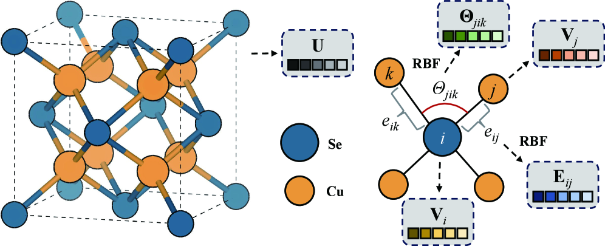
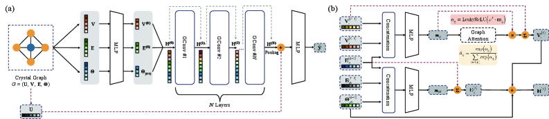
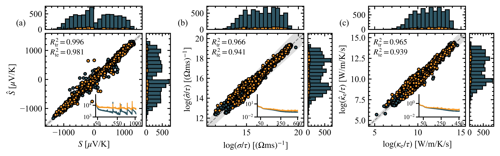
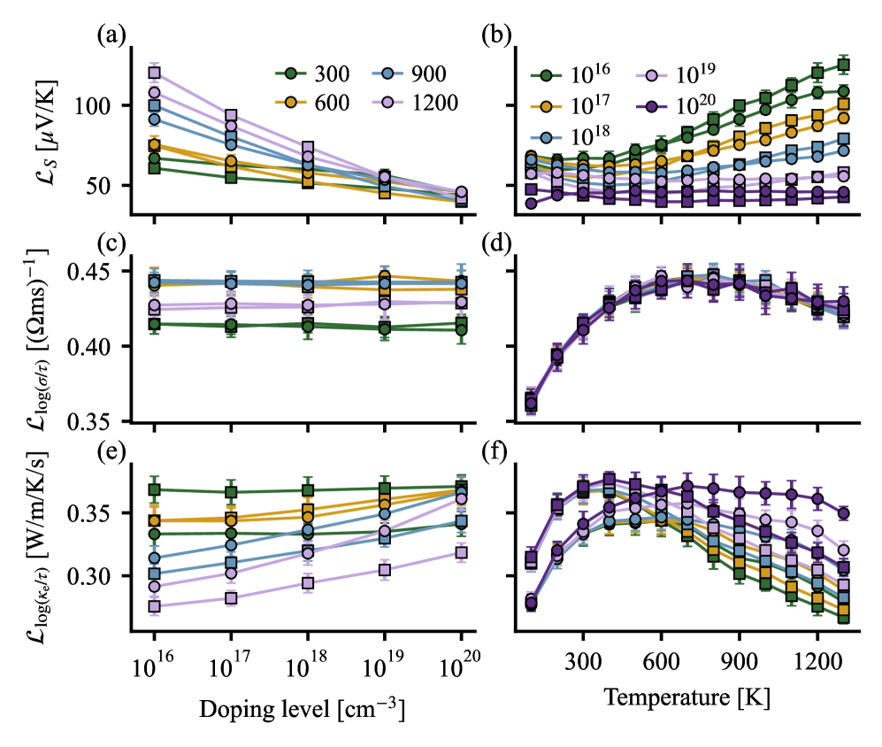
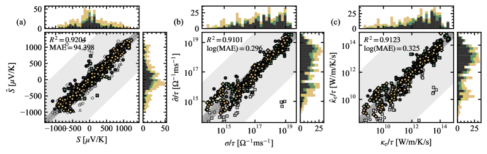
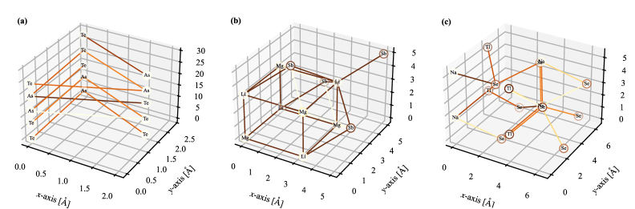
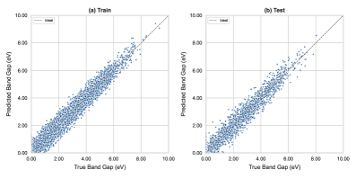

# 熱電材料探索を加速するマルチスケールグラフニューラルネットワーク

- **執筆日**: 2026-05-09
- **トピック**: 結晶構造からのマルチスケールGNNによる熱電輸送係数予測と高スループット材料スクリーニング
- **タグ**: Devices and Functional Materials, Thermoelectric Conversion, Machine Learning
- **注目論文**: [arXiv:2512.06697] Yuxuan Zeng et al., "Learning Thermoelectric Transport from Crystal Structures via Multiscale Graph Neural Network" (Dec 2025, rev. Apr 2026)
- **参照論文数**: 7本

---

## 1. 研究背景

現代社会のエネルギー問題において、廃熱の有効利用は極めて重要な課題となっている。産業プロセス、自動車、電子機器などから排出される廃熱の量は膨大であり、その多くが大気中に捨てられているのが現状だ。熱電変換材料は、この廃熱を直接電気エネルギーに変換できる固体材料であり、可動部品がなく、メンテナンスフリーで動作するという特長をもつ。地球温暖化対策・省エネルギーの文脈において、高性能熱電材料の探索は世界的な研究課題となっている。

熱電材料の性能は、無次元性能指数 ZT によって定量化される。これは、Seebeck 係数 S、電気伝導率 σ、熱伝導率 κ（電子成分 κe と格子成分 κl の和）、絶対温度 T によって

$$ZT = \frac{S^2 \sigma}{\kappa_e + \kappa_l} T$$

と定義される。高い ZT を実現するためには、大きな S（電力生成能力）と高い σ（電気輸送効率）を同時に持ちながら、κ を低く抑えなければならない。ところが、この三つのパラメータは互いに深く絡み合っており、一方を改善しようとすると他方が劣化してしまうという「トレードオフ問題」が存在する。例えば、S と σ はキャリア濃度に対して逆の依存性を示し、最適化が容易ではない。

従来の材料探索において、最も信頼性の高い計算手法は密度汎関数理論（DFT）とボルツマン輸送方程式を組み合わせた手法であった。特に BoltzTraP（Boltzmann Transport Properties）コード（cond-mat/0602203, Madsen & Singh, 2006）は、DFT によって計算したバンド構造をフーリエ補間し、半古典ボルツマン理論の枠組みで Seebeck 係数や電気伝導率テンソルを計算する標準的ツールとして広く使われてきた。しかしながら、DFT 計算自体に相当の計算コストが伴うため、膨大な化学空間を網羅的にスクリーニングするには非効率であった。

機械学習（ML）の台頭はこの状況を大きく変えつつある。データ駆動型の手法を用いれば、既存のデータベース（Materials Project など）に蓄積された DFT 計算結果を訓練データとして、高速に材料特性を予測することが原理的に可能である。しかし、ML モデルが予測精度指標（R² 値 0.90〜0.98 など）では良好な成績を示すにもかかわらず、それが実際に新しい高 ZT 材料の実験的発見につながった例はごく限られている（2601.06571, Athar et al., 2026）。この「予測精度と実験的発見のギャップ」は、今日の熱電材料 ML 研究が直面する本質的な問題の一つである。

---

## 2. 未解決問題

熱電輸送係数の機械学習予測において、現在も解決されていない問題はいくつかある。

第一の問題は、**材料表現の不完全性**である。初期の ML 研究の多くは、結晶構造情報を組成（元素の種類と量）だけで表現していた。しかし同じ元素比を持っていても、結晶構造（例えば NaCl 型か閃亜鉛鉱型か）が異なれば電子構造も輸送特性も大きく異なる。組成ベースのモデルは、この構造情報を根本的に取り込めないという限界がある（2212.06444, Antunes et al., 2022）。

第二の問題は、**ドーピング効果の取り込み**である。熱電材料の実用性を論じるには、特定のキャリア濃度（n または p 型ドーピング）における特性が重要である。BoltzTraP による計算はキャリア濃度の関数として輸送係数を与えるが、ML モデルがこのキャリア濃度依存性を適切にモデル化することは難しい。希薄合金と濃厚合金を区別できないモデルも多い（2509.00299, Ma & Poon, 2025）。

第三の問題は、**化学空間における外挿性能**である。ML モデルは訓練データの分布内では良好な予測精度を示すが、未知の材料系（訓練データから外れた組成や構造）への外挿が困難なことが多い。特に、高性能材料ほど訓練データに含まれる数が少なく、ML が最も苦手とする領域に位置することが多い。

第四の問題は、**緩和時間 τ の問題**である。BoltzTraP で計算できるのは、厳密には σ/τ（電気伝導率を緩和時間で割ったもの）であり、絶対値の σ を直接得るためには τ の見積もりが別途必要である。これは ML モデルが予測する量と実験値の比較を複雑にする。

第五の問題は、**ブラックボックス性と解釈困難性**である。精度の高い ML モデルは一般に複雑であり、「なぜその材料が高 ZT を示すのか」という物理的・化学的理解を直接提供することが難しい。解釈可能な ML は精度と解釈性のトレードオフに直面している（2510.02681, Fronzi et al., 2025）。

注目論文 2512.06697 は、これらの問題のうち特に材料表現と外挿性能の問題に正面から取り組み、結晶構造をマルチスケールで表現するグラフニューラルネットワーク（GNN）を用いることで、従来手法の限界を突破しようとしている。

---

## 3. 注目論文の概要

### 研究目的と対象

Zeng et al.（2512.06697）は、無機結晶の熱電輸送係数を結晶構造から直接予測する GNN モデル「TECSA-GNN（Thermoelectric Crystal Structure-Aware GNN）」を提案した。予測対象は、Seebeck 係数 S、電気伝導率（実際には σ/τ）、電子熱伝導率（κe/τ）の三つである。これらは BoltzTraP コードによって計算された大規模データベースを訓練・評価データとして用いている。

### 結晶グラフのマルチスケール表現

本研究の核心は、結晶構造をどのように数値的に表現するかという「記述子設計」にある。著者らは、結晶構造を四つの階層レベルで特徴ベクトルとして表現する方式を採用した（図1）。

*図1: 結晶グラフ表現の概念図（Zeng et al., 2512.06697、CC BY-NC-ND 4.0）。CuSe₂ を例に、グローバル（組成・空間群）、原子（元素特性）、結合（原子間距離・結合次数）、角度（三体相互作用）の4階層で特徴量が定義される。*

具体的には：
- **グローバルレベル**: 組成式、空間群、結晶系などの大域的な材料情報
- **原子レベル**: 各原子の元素固有の物理化学的特性（原子番号、電気陰性度、原子半径など）
- **結合レベル**: 原子間距離と結合次数による結合の特性
- **角度レベル**: 三つの原子がなす角度による局所的な幾何学的情報

このマルチスケールな記述子は、GNN のメッセージパッシング機構と組み合わせることで、局所的な原子環境から大域的な結晶の性質まで階層的に情報を集約できる。

### アーキテクチャ

TECSA-GNN のネットワーク構成を図2に示す。

*図2: TECSA-GNN のアーキテクチャ（Zeng et al., 2512.06697、CC BY-NC-ND 4.0）。(a) 全体構成：四つのスケールの特徴量が別色で示されている。*

ネットワークはまず各スケールの特徴量を個別に埋め込み（embedding）した後、グラフ畳み込み層によってメッセージパッシングを行い、近傍原子の情報を集約する。最終的な材料全体の表現は、すべての原子の特徴量を平均プーリングで集約することで得られる。この表現から、S、log(σ/τ)、log(κe/τ) を温度とキャリア濃度の関数として予測する。

### 主要な結果

**予測精度（図3、図4）**: 10 折交差検証によるベンチマーク評価において、TECSA-GNN は Seebeck 係数の予測で特に高い精度を達成した。パリティプロット（予測値 vs. 実際の DFT 計算値の散布図）は、訓練データ・テストデータの両方でよい一致を示している。また、キャリア濃度依存性や温度依存性も良好に再現できることが確認された。

*図3: TECSA-GNN の予測精度評価（Zeng et al., 2512.06697、CC BY-NC-ND 4.0）。Seebeck 係数 S、log(σ/τ)、log(κe/τ) の三物性についての予測値と DFT 値のパリティプロット。*

*図4: 10 折交差検証の結果（Zeng et al., 2512.06697、CC BY-NC-ND 4.0）。T = 300, 600, 900, 1200 K の温度において、キャリア濃度依存性も正確に再現されていることが分かる。*

**高スループットスクリーニング（図5）**: TECSA-GNN の予測速度を活かし、大規模な化学空間（Materials Project データベース中の多数の無機結晶）に対してスクリーニングを実施した。その結果、Te₃As₂、NaTlSe₂、LiMgSb の三つの化合物が特に高い電子輸送特性を示すと予測された。

*図5: TECSA-GNN による高スループットスクリーニングの結果（Zeng et al., 2512.06697、CC BY-NC-ND 4.0）。Te₃As₂、NaTlSe₂、LiMgSb のパワーファクター S²σ/τ が GNN 予測と DFT 計算で良く一致することを示している。*

**DFT 検証**: スクリーニングで発見された三化合物について、実際に DFT+BoltzTraP 計算を行って予測を検証した結果、パワーファクター（S²σ/τ）がいずれも良好に再現されることが確認された。

**解釈可能性解析（図6）**: モデルが何を「見て」予測しているかを理解するため、GNNExplainer を使った原子重要度解析、および偏依存性プロット（PDP）による大域的特徴量解析を行った。この解析から、禁制帯幅（Eg）と p 軌道充填率（fp）が Seebeck 係数予測において最も重要な特徴量であることが判明した。

*図6: 解釈可能性解析の結果（Zeng et al., 2512.06697、CC BY-NC-ND 4.0）。GNNExplainer による原子重要度と ELF（電子局在化関数）の対応が示されており、孤立電子対を持つ原子が高い Seebeck 係数に寄与することが分かる。*

---

## 4. 研究史の中での位置づけ

### 古典的計算手法の確立

熱電輸送係数の理論計算は、BoltzTraP（cond-mat/0602203, Madsen & Singh, 2006）の登場によって飛躍的に普及した。BoltzTraP はバンド構造のフーリエ補間と半古典ボルツマン輸送理論を組み合わせることで、DFT 計算から S、σ/τ、κe/τ を効率的に計算できる。このコードは世界中の研究者に使われ、Materials Project などのデータベースに蓄積されている膨大な輸送係数データの多くはこの手法によって生成されたものである。しかし、1 材料の評価に数時間〜数日の計算時間が必要なため、10⁵ 以上の候補をスクリーニングする高スループット探索には根本的な限界があった。

### 組成ベース機械学習の発展

2022 年の Antunes et al.（2212.06444）は、注意機構（attention mechanism）を取り入れたディープラーニングモデルを用いて、元素組成のみから Seebeck 係数・電気伝導率・パワーファクターを温度とキャリア濃度の関数として予測する手法を提案した。入力が「組成」だけという極めてシンプルな記述子でありながら、驚くほど良い精度が得られることを示し、大規模スクリーニングへの機械学習適用の実現可能性を実証した先駆的な研究である。ただし、この組成ベースのアプローチは、同じ組成でも異なる構造をとる多形体（polymorphs）を区別できないという根本的な限界を持つ。

### 物理的概念の導入と機械学習の精緻化

Ma & Poon（2509.00299、2025 年 8 月）は、熱電特性予測 ML の精度を改善するために、短距離秩序（short range order）や結晶構造クラスなどの物理的概念を特徴量として加えた場合の効果を系統的に調べた。結果として一定の精度向上は見られたものの、希薄合金と濃厚合金を区別できないという問題、すなわちドーピング効果の適切な取り込みの困難さは依然として残った。この研究は、組成・構造の単純な記述子では捉えきれない物理的効果が熱電特性に存在することを明確に示した。

### GNN による構造認識の実現

2512.06697 の TECSA-GNN は、上記の先行研究の限界を、結晶構造をグラフとして明示的に表現し、マルチスケールで特徴量を定義することで乗り越えた。グラフ神経網によって原子-結合-角度の情報を階層的に集約し、組成には還元できない構造情報を取り込む点が、2212.06444 の組成ベースモデルとの本質的な違いである。また、ベンチマーク比較（Table 1）において複数の先行モデルに対して優位な性能を示した。特に Seebeck 係数の MAE において最高水準（SOTA）の性能を達成し、さらに外挿性能（訓練時に存在しない材料への汎化性能）でも優れた性能を示した点が重要である。

### 解釈可能性 ML への動き

同じ時期に、Fronzi et al.（2510.02681、2025 年 12 月）は Kolmogorov-Arnold Networks（KAN）を熱電材料設計に適用する研究を発表した。KAN は従来の多層パーセプトロン（MLP）と同等の予測精度を持ちながら、入力-出力の関係を陽的な記号関数（symbolic function）として表現できるという特徴を持つ（図7参照）。これはブラックボックス問題を緩和し、「なぜこの材料の S が大きいのか」を数式として記述できる可能性を開く試みである。

*図7: Kolmogorov-Arnold Network（KAN）のアーキテクチャ（Fronzi et al., 2510.02681、CC BY 4.0）。各入力に作用する関数 φ が学習される点が MLP との根本的な違いであり、学習された関数を記号的に解釈できる。*

### 実験との乖離という構造的課題

Athar et al.（2601.06571、2026 年 1 月）は、現在の ML による熱電材料研究を網羅的にレビューし、「高い R² 値を達成しても実験で高 ZT 材料が見つかるわけではない」という重要な批判を展開した。その主な原因として、（1）データのサンプリングバイアス（化学空間内のクラスター構造を無視した交差検証）、（2）熱力学的安定性評価の欠如、（3）格子熱伝導率 κl の予測困難性を挙げた。この批判は、TECSA-GNN を含む現在の ML アプローチが何を解決し、何を解決していないかを考える上で重要な視点を提供する。

---

## 5. 批判的考察

### TECSA-GNN の強みと根拠

注目論文の最も重要な主張は「マルチスケールな結晶グラフ表現が高精度かつ外挿性能の高い輸送係数予測を可能にする」という点である。この主張は、10 折交差検証によるロバストな評価と、DFT 計算による候補材料の独立した検証によって裏付けられている。特に、t-SNE による化学空間の可視化（論文内 Fig. 5）において、モデルが結晶系（cubic, hexagonal などの 7 分類）を学習データに陽的に含めることなく自発的に識別していることは、マルチスケール表現が結晶学的対称性を自然に学習していることの証左である。

### 緩和時間 τ の問題と限界

BoltzTraP の出力は σ/τ であって σ ではない。これは、BoltzTraP が緩和時間近似（constant τ approximation）を採用しており、実際の τ（電子-フォノン散乱、不純物散乱などによって決まる）を計算しないためである。TECSA-GNN が予測する量も同様に σ/τ と κe/τ であり、絶対値の ZT を直接評価するためには τ の見積もりが別途必要である。実際のところ、熱電性能の絶対値は τ の値に敏感であるため、スクリーニングの段階では相対的ランク付けには有効であるが、定量的な予測には限界がある。この問題は TECSA-GNN に固有のものではなく、BoltzTraP データを訓練に使う限り避けられない構造的制約である。

### ドーピング・化学的不均一性への対応

本研究は理想的な結晶構造を入力としており、ドーピング（不純物添加）による局所的な構造変化や電子状態変化を明示的には取り込んでいない。Half-Heusler 型化合物の zT 予測を対象とした Athar et al.（2602.01149、2026 年 2 月）は、SHAP と SISSO 解析によって A サイトドーパント濃度が zT の最も重要なパラメータであることを示した。これは、ドーピングを陽的に表現しなければ高精度な zT 予測が困難であることを示唆している。TECSA-GNN は、この点について明確な解答を提供していない。

### 解釈可能性解析の信頼性

著者らが GNNExplainer と偏依存性プロットを用いた解釈可能性解析を行った点は評価できる。「禁制帯幅 Eg が Seebeck 係数予測において最重要」という結論は物理的に妥当であり（半導体の Seebeck 係数は概ね S ∝ Eg/kBT と理解できる）、モデルが意味のある物理則を学習していることを示唆する。しかし、GNNExplainer によって得られた「重要な原子」が、本当に輸送特性に物理的寄与をしているのかは、第一原理計算による独立した検証が必要である。ELF（電子局在化関数）との対応は定性的な一致を示してはいるが、因果関係の証明にはなっていない。

### 外挿性能の主張の検証

論文は "remarkable extrapolative capability"（注目すべき外挿性能）を主張しているが、ベンチマーク中のテストセットはあくまで訓練データと同じデータベース内からのホールドアウトであり、真の外挿（全く異なる材料系への適用）を示すものではない。実際の高スループットスクリーニングで同定した三候補材料（Te₃As₂、NaTlSe₂、LiMgSb）に対する DFT 検証は行われているが、その材料数は少なく、外挿性能の一般的評価には不十分である。材料探索の観点からは、訓練データ分布から大きく外れた材料への適用性こそが最重要であり、今後この点の体系的な評価が求められる。

---

## 6. 何が一般化できるか

### 他の電子輸送特性への拡張

TECSA-GNN の枠組みは熱電材料に限らず、電子輸送が重要な役割を果たす他の材料系へも原則的に適用できる。例えば、太陽電池用材料における電荷輸送、有機-無機ハイブリッドペロブスカイト、トポロジカル絶縁体の表面伝導、2 次元材料のデバイス応用など、バンド構造依存の輸送特性が重要な場面は広い。同じ DFT+BoltzTraP パイプラインで生成したデータが利用可能であれば、TECSA-GNN のアーキテクチャをほぼそのまま流用できる。

### マルチスケール表現という設計原理

本研究が示した「グローバル・原子・結合・角度の四階層でグラフ特徴量を定義する」というアーキテクチャの選択は、単に熱電材料に特化したものではなく、固体材料の電子構造一般を学習する際の普遍的な設計原理として活用できる。この考え方は、既存の CGCNN や ALIGNN などの材料 GNN と比較して、より明示的に化学的・物理的な意味のある階層構造をモデルに組み込んでいる点で優れている。他の材料特性（弾性定数、光学特性、磁気特性など）の予測モデル構築にも有用な設計指針となりうる。

### 解釈可能性と物性設計指針

本研究の解釈可能性解析によって「Seebeck 係数は禁制帯幅 Eg と p 軌道充填率 fp によって主に決まる」という知見が得られた。これは材料設計指針として直接活用できる。すなわち、高 Seebeck 係数材料を探索する際には、適切な Eg（大きすぎると σ が下がり、小さすぎると S が下がる）を持ち、かつ p 軌道を持つ重元素を含む材料を優先的にスクリーニングするという指針が立つ。このように ML モデルの物理的解釈から材料設計指針を引き出すアプローチは、AI for Science の一つの模範的な形といえる。

### 一般化にはまだ慎重であるべき点

一方で、τ の問題、ドーピング効果、実験との乖離という課題は依然として残る。特に、TECSA-GNN が同定した候補材料が「実際に実験で合成可能か」「熱力学的に安定か」「κl が本当に低いか」という点は、本研究の範囲外である。高性能熱電材料の発見には、電子輸送特性だけでなく格子熱伝導率の予測と制御も不可欠であり、この点の ML 化は別途解決すべき課題として残っている。

---

## 7. 基礎から理解する

### 熱電効果の基礎物理

熱電変換材料を理解するための出発点は Seebeck 効果である。Seebeck 効果とは、材料に温度差 ΔT を与えたとき、両端に電位差 ΔV が発生する現象であり、比例係数が Seebeck 係数 S（単位: V/K）である。

$$S = -\frac{\Delta V}{\Delta T}$$

S の符号は多数キャリアのタイプによって決まり、n 型（電子が多数キャリア）では負、p 型（正孔が多数キャリア）では正となる。物理的直感としては、高温側でエネルギーの高いキャリアが低温側に流れ、電荷の偏りが生じることで起電力が発生するというイメージである。

Seebeck 係数の微視的な起源を理解するには、エネルギーフィルタリング効果（フェルミ準位近傍のエネルギー-電気伝導率の非対称性）が重要である。半古典論の枠組みでは、S は以下の Mahan-Sofo 式（ボルツマン輸送方程式の解）で表される。

$$S = \frac{k_B}{e} \frac{\int dE \, (-\partial f/\partial E) \, \Sigma(E) \, (E - \mu)/k_B T}{\int dE \, (-\partial f/\partial E) \, \Sigma(E)}$$

ここで、$f$ はフェルミ-ディラック分布関数、$\mu$ は化学ポテンシャル（フェルミ準位）、$\Sigma(E)$ は輸送分布関数（transport distribution function）である。$\Sigma(E)$ はエネルギー E でのバンド構造の「輸送への寄与」を表し、バンドの曲率（有効質量）と状態密度に依存する。S が大きくなるためには、フェルミ準位近傍で $\Sigma(E)$ のエネルギー依存性が急峻であること（非対称性が大きいこと）が必要であり、これは通常バンドギャップの端近傍で実現される。

### ボルツマン輸送理論と BoltzTraP

電気伝導率 σ、Seebeck 係数 S、電子熱伝導率 κe は、すべてボルツマン輸送方程式の緩和時間近似のもとで以下の輸送積分から統一的に導かれる。

$$\sigma_{\alpha\beta}(T,\mu) = e^2 \int dE \, \left(-\frac{\partial f}{\partial E}\right) \Xi_{\alpha\beta}(E)$$

$$S_{\alpha\beta}(T,\mu) = \frac{e k_B T \int dE \, (-\partial f/\partial E) \Xi_{\alpha\beta}(E) (E-\mu)/k_B T}{\sigma_{\alpha\beta}(T,\mu)}$$

ここで輸送分布テンソル $\Xi_{\alpha\beta}(E)$ は

$$\Xi_{\alpha\beta}(E) = \frac{1}{V} \sum_{n,\mathbf{k}} v_{n\mathbf{k},\alpha} \tau_{n\mathbf{k}} v_{n\mathbf{k},\beta} \, \delta(E - E_{n\mathbf{k}})$$

と定義される。ここで $v_{n\mathbf{k},\alpha} = \hbar^{-1} \partial E_{n\mathbf{k}} / \partial k_\alpha$ はバンド $n$、波数 $\mathbf{k}$ における速度の $\alpha$ 成分、$\tau_{n\mathbf{k}}$ は緩和時間である。BoltzTraP では $\tau$ を定数と仮定（constant τ approximation）しており、これが σ/τ のみを計算できる理由である。

この定式化において、バンド構造 $E_{n\mathbf{k}}$ が与えられれば輸送係数が（τ を除いて）計算できることが分かる。BoltzTraP はこのバンド構造を DFT 計算から取得し、高密度 k 点でのフーリエ補間を経て上記の積分を数値的に評価する。

### ZT の全体像

性能指数 ZT は上で述べた電子輸送係数と格子熱伝導率 κl によって

$$ZT = \frac{S^2 \sigma T}{\kappa_e + \kappa_l}$$

と書かれる。$\kappa_e$ は Wiedemann-Franz 則 $\kappa_e = L_0 \sigma T$（$L_0$ はローレンツ定数）で与えられ、σ に比例する。これが S と σ の最適化が困難な理由の一部である。

一般に、高い ZT を達成するには次の材料要件が必要とされる。
- 大きな $S^2 \sigma$（パワーファクター）: 半導体的な電子構造（適切なバンドギャップ）と高い有効質量縮重度
- 低い κl: 重元素、複雑な結晶構造、強い無秩序性
- これらが適切なキャリア濃度域（通常 10¹⁹〜10²¹ cm⁻³）で同時に成り立つこと

ZT ≈ 1 が長年のベンチマークとなってきたが、近年は ZT > 2〜3 を達成する材料（PbTe、SnSe、BiSbTe 合金など）も報告されている。

### グラフニューラルネットワークの基礎

結晶材料をグラフとして表現するアイデアは、原子をノード、原子間の結合をエッジとみなすことから始まる。各ノードには原子の特徴量ベクトル（元素固有の特性）が、各エッジには結合特徴量（距離、角度など）が付与される。

GNN のメッセージパッシング機構（message passing neural network, MPNN）は、各ノードが近傍ノードからの「メッセージ」を受け取り、自分の特徴量を更新する処理を繰り返すことで、ネットワーク全体の情報を集約する。数式では、$l$ 回目のメッセージパッシングステップにおける原子 $i$ の特徴ベクトル $\mathbf{h}_i^{(l)}$ の更新は

$$\mathbf{m}_i^{(l)} = \text{AGGREGATE}\left(\left\{\mathbf{h}_j^{(l)}, \mathbf{e}_{ij} : j \in \mathcal{N}(i)\right\}\right)$$

$$\mathbf{h}_i^{(l+1)} = \text{UPDATE}\left(\mathbf{h}_i^{(l)}, \mathbf{m}_i^{(l)}\right)$$

と表される。ここで $\mathcal{N}(i)$ は原子 $i$ の近傍原子の集合、$\mathbf{e}_{ij}$ は $i$-$j$ 間のエッジ特徴量、AGGREGATE と UPDATE はニューラルネットワークで実現される非線形変換である。

$L$ 回のメッセージパッシング後、すべての原子の特徴量を集約（プーリング）することで材料全体のベクトル表現を得る。

$$\mathbf{h}_{\text{crystal}} = \text{READOUT}\left(\left\{\mathbf{h}_i^{(L)}\right\}\right)$$

この結晶ベクトルから所望の物性値を回帰する全結合層を追加することで、材料特性予測器が完成する。

TECSA-GNN はこの枠組みに「角度特徴量（三体相互作用）」と「グローバル特徴量（組成・空間群）」を加えたマルチスケール版であり、3 体の幾何学情報が重要な輸送特性の予測精度向上に寄与している。

### 電子局在化関数（ELF）

解釈可能性解析で用いられた ELF（Electron Localization Function）は、電子が空間的にどの程度局在しているかを 0〜1 の範囲で表す量である。ELF ≈ 1 の領域は電子対が強く局在していることを示し（孤立電子対、共有結合など）、ELF ≈ 0.5 は電子ガス的な非局在化を示す。TECSA-GNN の解析では、高 Seebeck 係数を持つ材料において孤立電子対（lone pair）を持つ原子が重要な役割を担うことが示された。これは「孤立電子対を持つ重元素（Pb、Sn、Bi、Te など）が低い格子熱伝導率と良好な熱電特性を示す」という材料設計の既知経験則とよく一致しており、モデルの物理的妥当性を支持する結果となっている。

---

## 8. 専門用語の解説

**ZT（無次元性能指数）**  
熱電材料の変換効率を表す最重要指標。$ZT = S^2\sigma T / \kappa$（S: Seebeck 係数、σ: 電気伝導率、κ: 全熱伝導率、T: 絶対温度）で定義される。この値が高いほど廃熱を電気に変換する効率が高い。現状では ZT ≈ 1〜3 程度の材料が知られており、実用化には ZT > 2 以上が望まれる。本論文では直接 ZT を予測するのではなく、ZT の電子成分（$S^2\sigma/\tau$）を予測する立場を取っている。

**Seebeck 係数（熱起電力）**  
材料に温度差を与えたとき生じる電位差の比例係数（単位: V/K または µV/K）。電子が「高温側で熱エネルギーを持って低温側に流れることで生じる電圧」として直感的に理解できる。フェルミ準位近傍の状態密度とバンド曲率に強く依存し、通常半導体では 100〜1000 µV/K 程度の値を示す。正値（p型）か負値（n型）かは多数キャリアのタイプで決まる。

**緩和時間近似（Constant τ Approximation）**  
ボルツマン輸送方程式を解く際に、電子-フォノン散乱などによる緩和時間 τ をエネルギー・温度によらず一定とみなす近似。BoltzTraP がこの近似を使用しているため、計算で得られるのは σ/τ であり、実際の σ を知るには別途 τ を推定する必要がある。この制約が、ML による電気伝導率の絶対値予測を難しくしている主因である。

**ボルツマン輸送理論**  
電子・フォノンなどのキャリアの輸送現象を、運動論的な観点から記述する理論。フェルミ-ディラック分布からのずれを「衝突項」を介してモデル化し、電場・温度勾配に対する応答（電気伝導率、熱伝導率、Seebeck 係数）を定式化する。固体物理における輸送現象の標準的な理論的枠組みであり、BoltzTraP はこの理論の数値実装である。

**グラフニューラルネットワーク（GNN）**  
グラフ構造データを入力として学習するニューラルネットワーク。結晶材料研究では、原子をノード、原子間の結合をエッジとするグラフとして材料を表現し、物性値を予測する。CGCNN（Crystal Graph CNN, 2018）を端緒として、ALIGNN、M3GNet、CHGNet など多くの派生モデルが提案されている。本論文の TECSA-GNN もこの系譜に属するが、マルチスケール表現を組み込んだ点が特徴である。

**メッセージパッシング（Message Passing）**  
GNN において、近傍ノードの情報を反復的に集約・更新することで、局所的な原子環境の情報をネットワーク全体に伝播させる機構。ステップ数（ホップ数）を増やすほどより遠距離の原子の影響が取り込まれる。TECSA-GNN では複数ラウンドのメッセージパッシングを行い、最終的な原子特徴量を集約して材料全体のベクトル表現を得る。

**パワーファクター（Power Factor, PF）**  
熱電性能の電子側の寄与を表す量で、$PF = S^2\sigma$（または $S^2\sigma/\tau$ の形で計算される）と定義される。ZT のうち格子熱伝導率（κl）に依存しない部分であり、電子構造の最適化によって制御できる。TECSA-GNN のスクリーニングで同定した候補材料の評価に用いられた指標でもある。

**GNNExplainer**  
GNN の予測結果を後付けで解釈するための手法。入力グラフのどのサブグラフ（どの原子・エッジ）が予測に最も大きく寄与しているかを、勾配情報やマスク最適化によって特定する。TECSA-GNN の解釈可能性解析に用いられており、高 Seebeck 係数を示す材料において特定の原子（孤立電子対を持つもの）が重要であることが示された。

**偏依存性プロット（Partial Dependence Plot, PDP）**  
特定の入力特徴量を変化させたときの予測値の変化を可視化する解釈可能性ツール。他の特徴量を周辺化（平均化）した上で、着目する特徴量が予測に与える効果を単独で評価できる。TECSA-GNN では禁制帯幅 Eg と p 軌道充填率 fp の PDP が示され、これらが Seebeck 係数予測において最重要特徴量であることが確認された。

**高スループットスクリーニング（High-Throughput Screening）**  
大規模なデータベース（何千〜何万もの材料候補）に対して、機械学習モデルやデータ駆動型フィルタリングを使って候補を絞り込む探索手法。TECSA-GNN では Materials Project データベース中の多数の材料に対して瞬時に電子輸送係数を予測し、その中から高いパワーファクターを持つ有望候補を同定した。従来の DFT+BoltzTraP アプローチでは現実的ではなかった大規模スクリーニングを可能にする。

**電子局在化関数（ELF, Electron Localization Function）**  
ある空間点における電子の局在の程度を 0〜1 の値で表す量。ELF が 1 に近い領域は電子対（孤立電子対または共有結合電子対）が局在していることを示し、0.5 付近は電子ガス的な非局在化、0 に近い領域は電子密度が低い領域に対応する。TECSA-GNN の解析では、Te や As 原子上の孤立電子対（高 ELF 領域）が Seebeck 係数への大きな寄与と相関することが示された。

---

## 9. 将来展望

熱電材料の機械学習研究はここ数年で急速に進歩し、TECSA-GNN のようなマルチスケール GNN が SOTA 性能を達成する段階に達した。BoltzTraP データを学習データとしたモデルが、電子輸送係数のオーダー推定に関しては既に実用的な精度を持つことは、かなり確からしくなっている。また、解釈可能性解析から「禁制帯幅と p 軌道充填率が Seebeck 係数の主要支配因子である」という物理的意味のある知見が得られつつあり、AI が材料設計指針を「再発見」する段階に差し掛かっていると言える。

一方でまだ未確定な点も多い。最大の課題は「実験的発見との乖離」問題であり、ML が予測する電子輸送特性の高い材料が実際に合成可能で安定であり、かつ格子熱伝導率 κl も低く実用的な ZT を持つかどうかは別問題である。緩和時間 τ の精度ある第一原理計算（電子-フォノン相互作用の明示的取り込み）とその ML 化、ドーピング効果の陽的な取り込み、および熱力学的安定性スクリーニング（GNoME などとの統合）がどの程度有効かは、現時点では解釈が分かれる。

今後の研究の方向性として最も重要なのは次の三点である。第一に、緩和時間の第一原理計算（DFPT ベースの電子-フォノン結合）を組み合わせたデータセット構築と、それを訓練データとした σ の絶対値予測モデルの開発。第二に、格子熱伝導率 κl の ML 予測（現在は ML 原子間ポテンシャルが有力だが、GNN によるフォノン特性の直接予測も急速に発展中）との統合による ZT 全体の予測パイプライン構築。第三に、実験と ML を組み合わせた能動学習（active learning）ループの確立であり、Athar et al. が主張するように PCA ベースのサンプリングと高スループット薄膜合成を組み合わせることで、化学空間の未探索領域へのML の適用性を検証することが今後の決定打になりうる。

---

## 参考論文一覧

1. **[arXiv:2512.06697]** Yuxuan Zeng et al., "Learning Thermoelectric Transport from Crystal Structures via Multiscale Graph Neural Network," *cond-mat.mtrl-sci*, Dec 2025 (rev. Apr 2026). [https://arxiv.org/abs/2512.06697](https://arxiv.org/abs/2512.06697)  
   **【注目論文】** 結晶構造のマルチスケール GNN 表現（TECSA-GNN）で熱電輸送係数を SOTA 精度で予測し、高性能候補材料 3 種を同定した主論文。

2. **[arXiv:cond-mat/0602203]** Georg K. H. Madsen & David J. Singh, "BoltzTraP. A code for calculating band-structure dependent quantities," *Comput. Phys. Commun.*, 2006. [https://arxiv.org/abs/cond-mat/0602203](https://arxiv.org/abs/cond-mat/0602203)  
   **【背景】** 半古典ボルツマン輸送理論による熱電輸送係数計算の標準ツール BoltzTraP の原著論文。本論文が訓練データ生成に依拠する計算手法の基礎。

3. **[arXiv:2212.06444]** Luis M. Antunes et al., "Predicting Thermoelectric Transport Properties from Composition with Attention-based Deep Learning," *cond-mat.mtrl-sci*, Dec 2022. [https://arxiv.org/abs/2212.06444](https://arxiv.org/abs/2212.06444)  
   **【比較・先行研究】** 元素組成のみを入力とした注意機構ベースのディープラーニングで熱電輸送係数を予測した先駆的研究。本論文が超えるべき「組成ベース ML」の代表例。

4. **[arXiv:2509.00299]** Chung T. Ma & S. Joseph Poon, "Reexamining Machine Learning Models on Predicting Thermoelectric Properties," *cond-mat.mtrl-sci*, Aug 2025. [https://arxiv.org/abs/2509.00299](https://arxiv.org/abs/2509.00299)  
   **【支持・分析】** 各種 ML モデルに短距離秩序・結晶構造クラスなどの物理概念を組み込むことの効果を検証し、ドーピング効果の取り込みの必要性を示した研究。

5. **[arXiv:2510.02681]** Marco Fronzi et al., "Kolmogorov-Arnold Networks in Thermoelectric Materials Design," *cond-mat.mtrl-sci*, Dec 2025. [https://arxiv.org/abs/2510.02681](https://arxiv.org/abs/2510.02681)  
   **【異手法・解釈可能性】** KAN（Kolmogorov-Arnold Networks）を用いて熱電特性予測と同時に陽的な記号関数としての構造-物性関係式を導出し、解釈可能性を追求した研究。

6. **[arXiv:2601.06571]** Shoeb Athar et al., "Beyond Predicted ZT: Machine Learning Strategies for the Experimental Discovery of Thermoelectric Materials," *cond-mat.mtrl-sci*, Jan 2026. [https://arxiv.org/abs/2601.06571](https://arxiv.org/abs/2601.06571)  
   **【批判・限界指摘】** ML の高い R² 値が実験的発見につながらない原因（サンプリングバイアス、安定性評価の欠如）を分析し、PCA ベースデータ分割と能動学習の重要性を論じた重要なレビュー。

7. **[arXiv:2602.01149]** Shoeb Athar et al., "Robust Machine Learning Framework for Reliable Discovery of High-Performance Half-Heusler Thermoelectrics," *cond-mat.mtrl-sci*, Feb 2026. [https://arxiv.org/abs/2602.01149](https://arxiv.org/abs/2602.01149)  
   **【応用・検証】** Half-Heusler 型化合物に特化した zT 予測 ML ワークフローを構築し、SHAP/SISSO 解析でドーパント濃度が最重要特徴量であることを示した研究。
