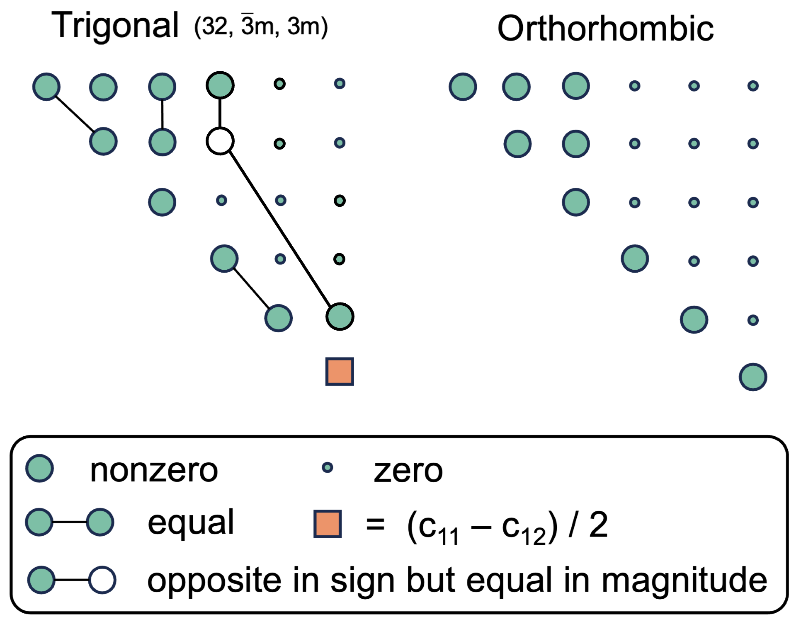
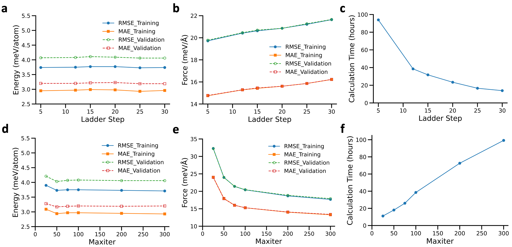

# 固体電解質Li₃YCl₆におけるひずみ依存イオン輸送：機械学習ポテンシャルが解き明かすナノスケールの拡散制御機構

- 執筆日：2026-05-10
- トピック：全固体電池の固体電解質に不可避なひずみ場が、ハライド系超イオン伝導体のLi⁺拡散機構をどのように変調するかを、ACE機械学習ポテンシャルを用いた大規模分子動力学シミュレーションで明らかにした研究
- タグ：Devices and Functional Materials, Energy-Efficient Functionality, Defects and Impurities, Machine Learning, Molecular Dynamics
- 注目論文：[Strain-Dependent Ionic Transport in Li₃YCl₆ Solid Electrolytes](https://arxiv.org/abs/2605.05603)（Huang, Dai, Pan, Wen, 2026）
- 参照論文数：7本

---

## 1. 背景：なぜ今この話題か

全固体リチウムイオン電池（All-Solid-State Battery, SSB）は、液体電解質を固体電解質に置き換えることで、熱暴走を原理的に抑制し、高エネルギー密度を実現できる次世代電池として世界中で開発が加速している。2010年代以降のトヨタ・Samsung・QuantumScapeらの競争的開発、そして2025年ごろから本格化した電気自動車（EV）向け全固体電池の量産試作により、固体電解質材料の性能向上は材料科学の最重要課題の一つとなった。

固体電解質の中でも、ハライド系（ハロゲン化物系）超イオン伝導体は、高いイオン伝導率と酸化物正極との優れた相性を持ち、近年急速に注目を集めている材料クラスである。Li₃YCl₆はその代表格であり、2018年のAsanoらによる報告以来（[2203.00814]）、室温での実測イオン伝導率は最大0.51 mS/cmに達し、電解質の実用要件（>0.1 mS/cm）を十分に超える性能を示している。

しかし、実際の電池セルにおいて固体電解質は決して「自由な状態」で動作するわけではない。外部スタック圧（数十〜数百 MPa）の印加、電極-電解質界面での格子不整合、充放電に伴う温度サイクル、これらがすべて固体電解質に「格子ひずみ（lattice strain）」を誘起する。ひずみはイオンの局所移動経路に直接作用し、Li⁺輸送を促進する場合も抑制する場合もある。だが、ひずみがどのメカニズムを通じてイオン伝導率を変調するのか、その原子スケールの機構はこれまで明確ではなかった。

この問いに対して、機械学習原子間ポテンシャル（Machine Learning Interatomic Potential, MLIP）を用いた大規模分子動力学（Molecular Dynamics, MD）シミュレーションが強力な解析手段として登場した。第一原理計算（AIMD）では数十〜百原子・数百 psが限界であるのに対し、MLIPは数千原子・数十 nsの大規模・長時間シミュレーションを第一原理精度で実現できる。本論文はまさにこの手法を用いて、Li₃YCl₆のひずみ依存イオン輸送の全容を解明しようとした意欲的な研究である。

---

## 2. 未解決問題は何か

### 2-1. ひずみとイオン輸送の関係は制御可能か

実際の電池セルにおいて、固体電解質には不可避のひずみが発生する。問題は、このひずみがイオン伝導率を「どの方向に」「どの程度」変調するのか、そのメカニズムが不明確だったことである。ひずみには引張り（tensile）と圧縮（compressive）の2種類があり、単純に「格子が広がる→経路が広くなる→イオンが動きやすい」という直観は必ずしも正しくない。実際、後述するように圧縮ひずみ下では活性化エネルギーが低下するにもかかわらず拡散係数が減少するという「反直感的」な挙動が観測される。

この問いは設計論的にも重要である。ひずみを「設計変数」として利用できれば、界面でのひずみエンジニアリングや積層構造の最適化によってイオン伝導率を能動的に制御できる可能性がある。解決の糸口は、ひずみが拡散のプリエクスポーネント因子（D₀）と活性化エネルギー（Eₐ）のどちらを主に変調するかを定量的に分離することにある。

### 2-2. Li₃YCl₆の2段階Arrhenius挙動の物理的起源

Li₃YCl₆では、イオン拡散係数Dの温度依存性が単純なArrhenius則に従わず、臨界温度Tcを境に活性化エネルギーが変化する「2段階挙動」が報告されている。この挙動は先行研究でも観測されていたが（文献[29]に相当するQiら2021）、その起源については議論があった。

物理的には、低温ではLi⁺が八面体（Oct）サイト間を直接ホッピングする1次元的な経路（Oct-Oct）が支配的であり、高温では四面体（Tet）中間サイトを経由する3次元的な協同拡散経路（Oct-Tet-Oct）が活性化するという機構が提案されていた。しかし、この遷移の起源を説明するには、陰イオン格子（Cl⁻格子）の温度依存的な剛性変化を正確に捉える必要があり、ファンデルワールス（vdW）力の正確な取り扱いが鍵となる。

実際、多くの先行AIMD研究がvdW非考慮のPBE汎関数を用いており、高温での拡散係数から室温値を線形Arrheniusで外挿するために室温伝導率を大幅に過大評価していた問題がある。この根本原因の解明とその解決が、本論文の中心的な貢献の一つである。

### 2-3. 汎用MLIPの限界とシステム専用ポテンシャルの必要性

近年、Material Project等の大規模データベースを学習した汎用MLIP（CHGNet, M3GNet, SevenNetなど）が登場し、多くの材料系で活躍している。しかし、Li₃YCl₆のような「vdW力が本質的に重要な材料」では、汎用MLIPが正しい物理を再現できない可能性がある。Li₃YCl₆のvdW相互作用は陰イオン格子の剛性を決定し、2段階Arrhenius挙動の根本原因であるため、この問いは実用的かつ基礎的な重要性を持つ。

汎用MLIPのfine-tuningによるアプローチ（[2510.09861]）や、専用ポテンシャルの開発がそれぞれどのような状況で適切かを理解することが、今後のMLIP活用戦略において重要な問いとなっている。

---

## 3. 注目論文の概説

### 研究目的と対象材料

本論文（Huang, Dai, Pan, Wen, arXiv:2605.05603v1, 2026）の目的は、Li₃YCl₆固体電解質の格子ひずみとLi⁺イオン輸送の関係を原子スケールで解明することである。Li₃YCl₆は三方晶（P3̄m1）と斜方晶（Pnma）の2相が知られており、どちらも六方稠密堆積したCl⁻陰イオンサブ格子を持ち、Li⁺とY³⁺がその空隙（八面体・四面体サイト）を占有する構造をとる。

### 研究アプローチ：ACE機械学習ポテンシャルの開発

本研究の中核は、Atomic Cluster Expansion（ACE）フレームワークに基づくMLIPの開発である。ACEは原子環境を対称性保存の基底関数の線形結合で表現するフレームワークであり、以下の形で原子エネルギーを構成する：

$$E = \sum_{i=1}^{N} \epsilon_i, \quad \epsilon_i = F(\phi_i^1, \phi_i^2, \ldots, \phi_i^P)$$

$$\phi_i^p = \sum_\nu c_\nu B_i^\nu$$

ここで $B_i^\nu$ は原子環境の対称性適応基底関数であり、平行移動・回転・鏡映・種の置換に対して不変である。実装上は、EAM（Embedded Atom Method）型の2体・多体表現を系統的に拡張した形をとり：

$$\epsilon_i = \phi_i^1 + \sqrt{\phi_i^2}$$

が基本形として用いられる。この枠組みは系統的改善が可能で、基底関数の数を増やすことで真の多体ポテンシャルエネルギー面に収束させることができる。

訓練データはVASPコードを用いたDFT計算（optB88-vdW汎関数）により生成された。vdWを明示的に扱うoptB88-vdWの選択は本研究の重要な決断であり、後述のようにCl⁻格子の温度依存的剛性を正しく再現するために不可欠であった。初期データセットは弛緩構造・ひずみ印加構造・摂動構造・AIMD軌跡スナップショットからなる2115構造であり、その後能動学習（active learning）ループを8サイクル実施して最終モデルを得た。

能動学習では、D最適性基準に基づく外挿グレード $\gamma$ を各スナップショットで評価し、$\gamma > \gamma_{\rm select} = 2$ となる構造を選択的にDFTで計算して訓練データを拡充するという戦略をとる。最終的なACEモデルのエネルギーMAEは0.52 meV/atom、力のMAEは14.09 meV/Åを達成している。

*図：ACEポテンシャルの能動学習ワークフロー（上）とDFT vs ACEのエネルギー・力の比較（下）。能動学習により、MD軌跡中の全スナップショットで外挿グレード γ < 2 が達成された。 出典: Huang et al., arXiv:2605.05603 (CC BY-NC-ND 4.0)*

### 主要結果 1：2段階Arrhenius挙動の確認とvdWの重要性

大規模MD（1620〜2160原子、20 ns、300〜800 K）を用いてLi⁺自己拡散係数Dを温度の関数として計算した結果、P3̄m1相でTc = 425 K、Pnma相でTc = 380 Kを境に活性化エネルギーが変化する2段階Arrhenius挙動が明確に再現された。

Arrhenius則：

$$D = D_0 \exp\!\left(-\frac{E_a}{k_B T}\right)$$

において、P3̄m1相の低温側（T < Tc）のEa = 0.35 eV、高温側（T > Tc）のEa = 0.25 eVであり、低温側の値は実験値（0.40〜0.51 eV）と良好に一致する。

同様にoptB88-vdWではなくPBEsol汎関数で訓練したACEモデルは、全温度域で単調なArrhenius関係を示し、2段階挙動を再現できなかった。この対比が、Cl⁻陰イオン格子のvdW凝集力が2段階挙動の根本原因であることを直接示している。

### 主要結果 2：拡散機構の温度変化

Li⁺確率密度マップ（MD軌跡から生成したイオン位置の時間平均）を用いて、拡散機構の変化を直接可視化した。

低温（T < Tc）：Cl⁻格子がvdW力により剛性を保ち、Tetサイトの形成エネルギーが高い。Li⁺はOct-Octホッピングのみで1次元的に移動する。拡散係数のxy成分とz成分の比Dxy/Dz ≈ 0.2。

高温（T > Tc）：熱ゆらぎがvdW結合を部分的に克服し、Cl⁻格子が軟化。Tetサイトが一時的に形成され、Oct-Tet-Oct協同拡散経路が開く。Dxy/Dz は0.55付近に上昇し、3次元的な拡散ネットワークが形成される。

プリエクスポーネント因子D₀の物理的意味は：

$$D_0 = \frac{1}{z} a_0^2 \nu \exp\!\left(\frac{\Delta S_m}{k_B}\right)$$

ここで、$z$は最隣接ジャンプサイト数、$a_0$は実効ジャンプ距離、$\nu$は振動試行頻度、$\Delta S_m$は移動エントロピーである。

### 主要結果 3：ひずみ効果の全体像

±1%・±2%の等方ひずみ下でMDを実施した結果：

- 引張りひずみ（正のひずみ）：Dが全温度域で増加し、Tc = 425 K（P3̄m1）が不変。300 Kでの伝導率σは、0%で0.77 mS/cm → +2%で1.13 mS/cmへ上昇
- 圧縮ひずみ（負のひずみ）：Dが全温度域で減少し、Tc不変。300 Kでのσは、0%で0.77 → −2%で0.38 mS/cmへ低下

【低温側（T < Tc）のひずみ効果】
引張りひずみ：Ea が0.35 eV（0%）→ 0.42 eV（+2%）と増加するのに、Dは増える。これはD₀が劇的に増加することによる。格子膨張によりTetサイトの形成エネルギーが低下してTet占有率が約3倍になり、Oct-Tet-Oct経路が低温でも部分的に開くため、ジャンプ距離a₀・エントロピーΔSm・試行頻度νがすべて増加してD₀が支配的に上昇する。

圧縮ひずみ：Eaが0.35 eV → 0.26 eV（−2%）と低下するが、Dは減る。格子収縮がTetサイトを完全に閉鎖し、Oct-Oct経路のみに限定されてD₀が崩壊するためである。

【高温側（T > Tc）のひずみ効果】
引張りひずみ：EaとD₀がともに改善し（相乗効果）、最大の拡散促進が得られる。圧縮ひずみ：EaとD₀がともに悪化し（二重抑制）、拡散が強く抑制される。

*図：Pnma相Li₃YCl₆における各温度・ひずみ条件下でのLi⁺確率密度マップ（上）と四面体・八面体サイト占有率（下）。引張りひずみにより300 Kでも四面体サイトの占有が増加し、3次元拡散ネットワークへの移行が促進される。 出典: Huang et al., arXiv:2605.05603 (CC BY-NC-ND 4.0)*

### 論文の新規性と限界

**新規性：**
1. Li₃YCl₆のひずみ-イオン輸送関係を原子分解能で系統的に解明した初の研究
2. vdW力が2段階Arrhenius挙動を決定することを、DFT汎関数の比較で直接証明
3. Tc不変性により、ひずみが「輸送の枠組み」ではなく「輸送の効率」を調整することを実証
4. D₀とEaの分離という新しい枠組みでひずみ効果を整理

**限界：**
1. 等方ひずみのみを対象とし、実際のセルで生じる非等方ひずみ（界面法線方向）は未検討
2. ±2%の等方ひずみは最大応力1.7 GPaに相当し、現実のスタック圧（数十〜数百 MPa）より高いが、界面の微細構造・応力集中を考慮すれば実機との対応はある
3. P3̄m1とPnmaの2相のみを対象とし、リチウム欠損・積層欠陥・カチオン無秩序などの構造欠陥は未考慮
4. ACEモデルはLi₃YCl₆に特化しており、組成や元素を変えた系への直接適用はできない

---

## 4. 研究史における位置づけ

### ハライド固体電解質の発見と展開

ハライド固体電解質のリチウムイオン伝導に関する本格的な研究は、2018年のAsanoら（Advanced Materials, 2018）によるLi₃YCl₆・Li₃InCl₆などの報告から加速した（[2203.00814]の引用論文）。これらの材料は硫化物系と比べて正極との電気化学的安定性が高く、フッ化物被膜なしで高電圧正極（例：LiCoO₂）と組み合わせられる利点がある。

Li₃YCl₆の構造と伝導性については、Schlemら（Chemistry of Materials, 2021）が中性子回折を用いてLi副格子の詳細を解析し、低温では1次元的なOct-Octホッピングが支配的であることを示した（文献[28]に相当）。

### 積層欠陥・カチオン無秩序の役割

Banikら（arXiv:2203.00814）は、メカノケミカル合成で生じる高密度の積層欠陥がLi₃YCl₆のLi⁺伝導経路を拡充することを明らかにした。積層欠陥によってLiサイトのコネクティビティが向上し、移動障壁が低下することで伝導率が向上する。また、Schlemら（2021）はメカノケミカル合成によってY/ErサイトへのLiのカチオン無秩序が誘起され、活性化エネルギーが低下することを実験的に示している。

これらの研究は「構造欠陥が伝導を制御する」という視点を確立したが、外部から印加するひずみによる動的な制御については未検討であった。本論文はこのギャップを埋める形で位置づけられる。

本論文の引用文献でもあるGengら（arXiv:2403.08237, Li₂ZrCl₆のカチオン無秩序とLiイオン輸送）は、関連ハライド電解質において乱れた構造がLi⁺の拡散を促進するメカニズムをMLIPを用いて解析した先行研究として重要である。Li₂ZrCl₆（LZC）でも1D→3D拡散の転換が見られ、Li₃YCl₆との比較分析が可能である。

### MLIPを用いた固体電解質研究の進展

固体電解質へのMLIP適用は2020年代に急速に広がっている。Qiら（Materials Today Physics, 2021）は、PBE汎関数で訓練したMLIPがLi₃YCl₆の高温伝導率を過大評価することを示し、これが室温への線形Arrhenius外挿の問題点を浮き彫りにした。本論文はこの問題をvdW汎関数の採用で解決した（文献[29]対応）。

近年では汎用MLIPのfine-tuningアプローチも進展している。Wanら（arXiv:2510.09861）は、CHGNetをLi₃YCl₆₋ₓBrₓ系にfine-tuningすることで組成空間の効率的探索を実現した。また、AQVolt26データセット（arXiv:2604.02524）は高温r²SCAN計算からなるハライド特化データセットを公開し、汎用MLIPの精度向上を目指している。これらは本論文のアプローチ（システム専用ACEポテンシャル）とは対照的な戦略であり、精度とスケーラビリティのトレードオフを体現している。

より高速なスクリーニング手法として、Stormら（arXiv:2411.06804）は機械学習されたポテンシャルエネルギーランドスケープの特徴量から、MDシミュレーションなしでイオン伝導率を予測する手法を開発し、MD比50倍・AIMD比3000倍以上の高速化を達成している。この手法は本論文のMLIP + MD戦略の「軽量版」として補完的な位置を占める。

### 本論文の位置づけ

本論文は、Li₃YCl₆というモデル系において以下を同時に達成した点でユニークである：
1. vdW力を含む高精度DFTデータに基づくACEポテンシャルの開発
2. 大規模・長時間MDによる2段階Arrhenius挙動の完全再現
3. ひずみ-伝導率関係の系統的解明とD₀/Eaの分離的解析

「外部ひずみによるイオン輸送制御」という視点では、Li₃PS₄でのひずみ感受性（Žgunsら, PRX Energy, 2022）との比較が興味深い。Li₃PS₄ではひずみがEaを線形的に変調するという比較的単純な関係が見られたのに対し、Li₃YCl₆では温度レジームによってひずみの機構が完全に異なるという複雑な挙動が明らかになった。

---

## 5. どの解釈が最も妥当か

### 5-1. Tc不変性の物理的意味

本論文の最も重要な主張の一つは、等方ひずみのもとでTcが変化しないことである。Tc = 425 K（P3̄m1）はひずみ±2%の範囲で不変であり、これはひずみが2段階挙動の「起源」ではなく「効率」にのみ影響することを示す。

この解釈は、2段階挙動の起源がvdW結合によるCl⁻格子の温度依存的剛性という「材料固有の性質」であり、ひずみはこのランドスケープの形は変えずに「スケール」のみを変えるという描像と整合する。Schlemら（2021）の実験でも、様々な合成条件でTcの大きな変化は観測されておらず、Tc不変性という本論文の主張は信頼性が高い。

一方で、大きな非等方ひずみや界面近傍での局所ひずみ集中においてもTcが不変かどうかは未検証である。界面でのひずみは等方的でなく、一軸方向の応力が大きい場合にはCl⁻格子の剛性が方向依存的に変化し、Tcが変化する可能性も否定できない。

### 5-2. 引張りひずみでの「反直感的」Ea増加

低温での引張りひずみによってEaが増加するにもかかわらずDが増加するという観測は、最初は直感に反するように見える。しかし本論文はD₀の増大という明確な機構でこれを説明している。

確かに、引張りひずみによってTetサイトへのアクセスが容易になり、Oct-Tet-Oct経路が低温でも部分的に活性化されれば、支配的な拡散経路が「内在的に高い活性化エネルギーを持つ」Oct-Tet-Oct経路にシフトするためEaが見かけ上増加することは整合的である。

Unearthing the Lithium-Ion Transport Mechanism in Li₂ZrCl₆（arXiv:2508.05598）でのDeep Learning加速MDでも、ジルコニウムハライドにおける類似の多経路拡散が観測されており、このような「経路切り替えによるEa変化」がハライド電解質に共通した特徴である可能性がある。

### 5-3. 相関フォノン-イオン相互作用の役割

Choetal.（arXiv:2305.01632）が示したように、Li₀.₅La₀.₅TiO₃（LLTO）では特定のフォノンモード（TiO₆ロッキングモード）がLi⁺のホッピングレートを直接増加させる「相関フォノン-イオン相互作用」が機能している。Li₃YCl₆でもCl⁻格子の振動（とくにvdWによって維持される長距離凝集力に関与するモード）がTcを決定しているという本論文の描像は、この相関フォノン-イオン相互作用の描像と整合的である。

本論文ではフォノン分散や特定のフォノンモードとの対応は直接議論されていないが、ひずみによるCl⁻格子の変化をフォノン的に追跡することで、より深い理解が得られる可能性がある。

### 5-4. 汎関数選択の重要性

PBEsolとoptB88-vdWで訓練したACEモデルの比較は、この論文の重要な対照実験である。PBEsol訓練モデルが2段階挙動を再現できないという結果は、単にLi₃YCl₆特有の問題ではなく、vdW相互作用が支配的な材料系（層状材料、ファンデルワールス結晶、ハライドなど）全般に対するMLIP開発の重要な教訓である。汎用MLIPの多くがvdW項を必ずしも正確に扱わない点は、ハライド固体電解質研究での適用に際して注意が必要である。

---

## 6. 何が一般化できるか

### ハライド電解質ファミリーへの拡張

本論文で確立されたACEポテンシャル開発手順（vdW考慮のDFT訓練データ＋能動学習）は、Li₃MCl₆（M = Er, Lu, Tb等）やLi₃YBrₓCl₆₋ₓ系、さらにはLi₃InCl₆・Li₂ZrCl₆などの関連ハライド系に直接適用できる。Wanら（arXiv:2510.09861）がLi₃YCl₆₋ₓBrₓ系でfine-tuningアプローチを取ったように、Brで部分置換した場合のひずみ効果も類似した枠組みで解析できるはずである。

AQVolt26データセット（arXiv:2604.02524）のような高温計算データを活用すれば、より広いハライド組成空間でのひずみ効果のハイスループットスクリーニングが可能になるだろう。

### 固体電解質全般への設計原理

本論文の核心的知見、「引張りひずみはD₀を増大させてイオン輸送を促進し、圧縮ひずみはD₀を崩壊させて抑制する」という設計原理は、ハライド系以外の固体電解質にも示唆を与える。硫化物系（Li₆PS₅Cl, Li₁₀GeP₂S₁₂など）でも格子膨張が伝導率向上に寄与することが知られており、「格子体積をどのように制御するか」という設計問題と直結する。

界面設計への応用としては、正極-電解質界面でのひずみを積極的に「引張り」側に設計するコーティングや中間層の開発が考えられる。たとえば、正極材料との格子不整合を利用して電解質に均一な引張りひずみを印加する「ひずみエンジニアリング」が、全固体電池の性能向上策として検討に値する。

### ML加速計算の一般的教訓

本論文のMLIP開発で明確になった教訓として、「訓練データのDFT汎関数の選択が材料の本質的な物理を決定する」という点がある。これは活性化学習・汎用MLIP・fine-tuning戦略すべてに共通する問題であり、特にvdW力や磁気相互作用など「標準的GGAで再現困難な」物理が重要な系では注意が必要である。

MLラマン計算（arXiv:2511.21404）のように、MLIPを用いて動的特性をスペクトル情報と結びつけることで、実験測定との直接比較が可能になる。Li₃YCl₆のひずみ下でのフォノンスペクトル変化を計算し、ラマン・IRスペクトルとして実験検証することは、本論文の知見の実験的確認につながる有望な方向性である。

---

## 7. 基礎から理解する

### 固体電解質とは何か

固体電解質とは、液体電解質の代わりに全固体電池（All-Solid-State Battery）の電解質として用いられる固体材料のことであり、イオン（ここではLi⁺）を電子を通さずに輸送する機能を持つ。液体電解質が有機溶媒とリチウム塩の混合物であるのに対し、固体電解質は熱安定性が高く、漏液・発火のリスクがない。

固体中でのイオン伝導には、イオンが結晶格子の空隙（interstitial site）やサイト間を「ホッピング（跳躍）」することが必要である。理想的な結晶中では全サイトが満杯になるため伝導できないが、実際にはサイトの一部が空（空孔）であったり、イオンが熱活性化によって通常とは異なるサイトを経由したりすることでLi⁺が移動できる。

### イオン伝導率とは何か

イオン伝導率 $\sigma$（単位：S/cm）は、材料のイオン輸送能力の尺度であり：

$$\sigma = \frac{N q^2}{V k_B T} D$$

で与えられる（ネルンスト-アインシュタイン方程式）。ここで、$N$はLi⁺の数、$q$はLi⁺の電荷、$V$はシミュレーションセルの体積、$k_B$はボルツマン定数、$T$は絶対温度、$D$は自己拡散係数（cm²/s）である。

自己拡散係数$D$はアインシュタイン関係式：

$$D = \lim_{t \to \infty} \frac{1}{2dN} \sum_{i=1}^{N} \langle |r_i(t) - r_i(0)|^2 \rangle \cdot \frac{1}{t}$$

で計算される。ここで $d$ は空間次元数（通常3）、$r_i(t)$ は時刻$t$でのイオン$i$の位置、$\langle \cdot \rangle$ はアンサンブル平均を表す。右辺の $\sum_i \langle |r_i(t) - r_i(0)|^2 \rangle$ が「平均二乗変位（MSD）」であり、MSDが時間に対して線形に増加する拡散領域での傾きが $2dD$ に対応する。

全固体電池の実用化には $\sigma > 0.1$ mS/cm が最低条件とされ、Li₃YCl₆は室温で最大0.51〜0.88 mS/cmを達成している。

### Arrheniusの法則と活性化エネルギー

固体中のイオン拡散は多くの場合、温度の逆数 $1/T$ に対して拡散係数 $D$ が指数関数的に変化する「Arrheniusの法則」に従う：

$$D = D_0 \exp\!\left(-\frac{E_a}{k_B T}\right)$$

ここで $E_a$（eV）は活性化エネルギー（イオンが隣接サイトへジャンプするのに必要な最小エネルギー障壁）、$D_0$ はプリエクスポーネント因子（頻度因子とも）、$k_B$はボルツマン定数である。

Arrheniusプロットとは、$\log D$を$1/T$に対してプロットしたものであり、単一のArrheniusプロセスに従う場合は直線となり、その傾きが $-E_a/k_B$ に対応する。Li₃YCl₆のような複数の拡散経路を持つ材料では、温度によって支配的な経路が切り替わるため、Arrheniusプロットに折れ曲がりが現れる。この臨界温度$T_c$での折れ曲がりが「2段階Arrhenius挙動」として知られている。

$D_0$ の物理的意味は：

$$D_0 = \frac{a_0^2 \nu}{z} \exp\!\left(\frac{\Delta S_m}{k_B}\right)$$

ここで $a_0$ はジャンプ距離、$\nu$ は格子振動の試行頻度（Debye周波数のオーダー、$\sim 10^{12}$ Hz）、$z$ は最隣接ジャンプサイト数、$\Delta S_m$ は活性化移動エントロピーである。$D_0$ はジャンプ試行がどれだけ頻繁かつエントロピー的に有利かを反映する。

### 格子ひずみと弾性定数

固体に外力を加えると、格子が変形する。この変形を表すのが「ひずみテンソル」 $\varepsilon_{ij}$ であり、外力を表すのが「応力テンソル」 $\sigma_{ij}$ である。線形弾性の範囲では：

$$\sigma_i = C_{ij} \varepsilon_j \quad (\text{Voigt記法})$$

で関係づけられる。$C_{ij}$ は弾性定数テンソルであり、材料の「硬さ」の方向依存性を記述する。Li₃YCl₆（P3̄m1相）では6個の独立な弾性定数があり、体積弾性率$B \approx 27$ GPa、せん断弾性率$G \approx 15$ GPa、ヤング率$E \approx 39$ GPaが得られている（本論文のACE計算）。

等方ひずみ $\varepsilon = \varepsilon_0 (1, 1, 1, 0, 0, 0)^T$（格子体積変化）は：

$$\frac{\Delta V}{V} \approx 3\varepsilon_0$$

に対応し、±2%の等方ひずみは体積変化±6%に相当する。この2%ひずみが生み出す内部応力は最大約1.7 GPaであり、これは通常の外部スタック圧（数十〜数百 MPa）より大きいが、界面粗さや微細構造に起因する局所的応力集中を含めた「実効ひずみ」の観点では現実的な範囲と著者らは主張している。

### 分子動力学シミュレーションとは

分子動力学（MD）シミュレーションは、Newton の運動方程式：

$$m_i \ddot{r}_i = -\nabla_{r_i} U(\{r_j\})$$

を時間積分することで、原子の軌跡を数値的に追跡する手法である。ここで $m_i$ は原子$i$の質量、$U(\{r_j\})$ はすべての原子位置に依存するポテンシャルエネルギーである。

最も計算コストが高いのは $U(\{r_j\})$ の評価であり、第一原理（DFT）計算では$O(N^3)$〜$O(N^4)$のスケーリングのため、数十原子・数ピコ秒が実用的な上限となる。一方、MLIPは短距離の原子環境記述子に基づいて$U$を近似するため、$O(N)$のスケーリングで第一原理精度に近い計算が可能になる。

本論文のACEポテンシャルを用いたMDでは、1620〜2160原子・20 ns（20×10⁻⁹秒）の計算が実施されており、これはAIMDの約200倍のシステムサイズ・約20万倍の時間スケールに相当する。

### ACE（Atomic Cluster Expansion）フレームワーク

ACEは原子間ポテンシャルの体系的な構築法であり、Drautzが2019年に提案した。基本的な考え方は、ポテンシャルエネルギーを各原子の「原子エネルギー」の和として表現し：

$$E = \sum_i \epsilon_i$$

各原子エネルギー $\epsilon_i$ を局所原子環境の対称性適応基底関数の完全系で展開することである。基底関数は：

$$B_i^\nu = \sum_{j_1 < j_2 < \cdots} \phi_{n_1 l_1}(r_{ij_1}) Y_{l_1 m_1}(\hat{r}_{ij_1}) \otimes \cdots$$

のように、動径部分と角度部分（球面調和関数$Y_{lm}$）の積のカップリングとして構成される。ここで $n$ は動径チャンネルの指数、$l, m$ は角運動量量子数である。

この展開はGausisan Approximation Potential（GAP/SOAP）やNEP等のMLIPと数学的に等価な部分があるが、体系的改善性と高い計算効率が特徴である。係数 $c_\nu$ が「学習パラメータ」であり、DFT計算したエネルギーと力を教師データとして損失関数の最小化により決定される。

### vdWファンデルワールス力と固体電解質

ファンデルワールス（van der Waals, vdW）力とは、分子・原子間の非共有結合的相互作用の総称であり、分散力（London力）・誘起双極子力・永久双極子力の成分を含む。固体中でも層状材料、ハライド結晶、分子性固体などではvdW力が重要な役割を果たす。

Li₃YCl₆では、隣り合うCl⁻イオン間のvdW分散力がCl⁻陰イオン格子の凝集力（剛性）を決定し、低温でTetサイトの「形成エネルギー」（四面体サイトを形成するためにCl⁻イオンを局所的に押しのけるコスト）を高く保つ役割を担っている。PBE・PBEsolなどの標準的なGGA汎関数はvdW分散力を再現できないため、Li₃YCl₆の伝導機構を正確に記述できない。一方、optB88-vdWはvdW分散力を明示的に取り込む汎関数族（vdW-DF族）の一つであり、層状ハライドや分子性固体で良好な性能を示す。

---

## 8. 専門用語の解説

**Atomic Cluster Expansion（ACE）**
原子間ポテンシャルを原子環境の対称性適応基底関数の完全系で展開する機械学習フレームワーク。Drautz（2019）が提案。平行移動・回転・反転・種の置換に対する不変性を保証しながら、体系的な改善が可能。基底関数の次数を増やすことで真のポテンシャルエネルギー面へ収束する。本論文では Li₃YCl₆専用のACEポテンシャルが開発・検証された。

**能動学習（Active Learning）**
機械学習モデルの訓練においてモデル自身が「どのデータを追加すべきか」を判断するイテレーティブな学習戦略。本論文ではACEモデルをMD中に使用し、外挿グレード $\gamma$（D最適性基準）を各スナップショットで評価して、高不確実な構造を選択的にDFT計算してデータに追加する。これにより少ないDFT計算で高精度なポテンシャルが得られる。8サイクルの能動学習ループを経て最終モデルが完成した。

**2段階Arrhenius挙動（Two-Regime Arrhenius Behavior）**
Arrheniusプロット上でlog Dが1/Tに対して2本の折れ線を描く挙動。臨界温度Tcで活性化エネルギーが変化する。Li₃YCl₆では低温でOct-Octホッピング（Ea ≈ 0.35 eV）、高温でOct-Tet-Oct協同拡散（Ea ≈ 0.25 eV）が支配的となる。本論文は、この挙動がCl⁻格子のvdW結合による温度依存的剛性変化に由来することを初めて明確に示した。

**Oct-Tet-Oct拡散経路**
Li₃YCl₆においてLi⁺が八面体（Octahedral, Oct）サイトから四面体（Tetrahedral, Tet）中間サイトを経由して隣接八面体サイトへジャンプする協同拡散機構。この経路は「Oct-Tet-Oct」と呼ばれ、Tetサイト形成のためにCl⁻格子が局所的に変形する必要がある。高温または引張りひずみ下でTetサイトの形成エネルギーが下がることで、この経路が活性化し3次元的な拡散ネットワークが構築される。

**プリエクスポーネント因子 D₀（Pre-exponential Factor）**
Arrheniusの法則 $D = D_0 \exp(-E_a/k_B T)$ における前因子。ジャンプ距離、試行頻度（格子振動数）、移動エントロピー、利用可能なジャンプサイト数を反映する。本論文では引張りひずみによるD₀の増大が伝導率向上の主要因として同定された。圧縮ひずみ下ではD₀が崩壊することで、Ea低下にもかかわらず拡散係数が減少するという反直感的挙動が現れる。

**ファンデルワールス（vdW）分散力**
原子・分子間の非共有結合性の引力。Li₃YCl₆のCl⁻イオン間vdW分散力が陰イオン格子の低温での剛性を維持し、Tetサイト形成に高いエネルギーコストを課す。PBE/PBEsol汎関数はこれを再現できないが、optB88-vdW汎関数は明示的にvdWを含む。この差がモデルの2段階Arrhenius挙動再現能力の違いを生む。

**等方ひずみ（Isotropic Strain）**
全方向に一様な伸縮であり、格子定数がすべての方向で等倍に変化する。等方ひずみ ε₀ では格子体積が ΔV/V ≈ 3ε₀ 変化する。本論文では±1%・±2%の等方ひずみを印加し、これが内部応力最大約1.7 GPaに相当することを弾性定数から計算している。実際の電池セル内では非等方ひずみが支配的だが、等方ひずみは最も単純なケースとして系統的解析の出発点となる。

**平均二乗変位（MSD; Mean Squared Displacement）**
MD軌跡中の各イオンの初期位置からの変位の二乗平均。拡散的な運動では時間$t$に比例して増加し（$\text{MSD} \propto 2dD \cdot t$）、この比例係数から自己拡散係数Dを抽出できる。統計収束には十分長い軌跡が必要であり、本論文では20 nsという長時間シミュレーションを実施することで室温付近でも信頼性の高いDが得られた。

**ネルンスト-アインシュタイン方程式**
自己拡散係数Dからイオン伝導率σを算出するための関係式：$\sigma = Nq^2 D / (Vk_BT)$。完全な無相関ランダムウォークを仮定するが、実際には近傍ジャンプ間の相関（相関因子 $f < 1$）が存在する。本論文ではこの相関因子の補正は行っていないが、同様のアプローチは先行MLIP研究（Qiら, 2021）でも標準的に用いられており、定性的な傾向の解析には十分である。

**スタック圧（Stack Pressure）**
全固体電池の組み立て時に外部から電池スタックに印加される圧力（典型的に数十〜数百 MPa）。電解質-電極界面の密着性を確保するために必要だが、過度な圧力は電解質に圧縮ひずみを誘起し、本論文の知見によればイオン伝導率を低下させる可能性がある。最適スタック圧の設計は全固体電池工学の重要な課題である。

**Li⁺確率密度マップ（Li⁺ Probability Density Map）**
MD軌跡全体を通じて空間の各点にLi⁺が存在した時間的頻度をマップ化したもの。高密度域が「選好サイト」（OctまたはTetサイト）や「低障壁拡散チャネル」に対応する。本論文では isosurface（5×10⁻⁵ e/Bohr³）として可視化され、温度とひずみによって拡散ネットワークの次元性（1D→3D）が変化する様子が直接視覚化された。

---

## 9. 将来展望

全固体電池実現に向けたハライド固体電解質研究は現在、「高い室温伝導率」という材料特性の最適化から、「実際の電池環境下でどう振る舞うか」というより現実的な問いへと焦点が移りつつある。本論文はその文脈において、ひずみという「見落とされていた変数」が伝導率に対して最大40〜60%のオーダーで影響することを示した。この量は、材料組成の最適化で達成できる改善幅（2〜3倍）に匹敵するオーダーであり、設計論上の重要性は高い。

今かなり確からしくなったこととして、(1) vdW力がLi₃YCl₆の2段階Arrhenius挙動の物理的起源であること、(2) 引張りひずみはD₀を増大させることでイオン輸送を促進し、圧縮ひずみはD₀を崩壊させることで抑制するという機構、(3) Tc（臨界温度）が等方ひずみ±2%の範囲で不変であること、がある。これらは複数の独立な検証（実験値との定量的一致、PBEsol/optB88-vdW比較、Li⁺確率密度マップによる直接可視化）に支えられており、信頼性が高い。

まだ未確定な点として、非等方ひずみ（特に界面に垂直な一軸圧縮）下でのTc不変性、実際の電極-電解質界面での局所ひずみプロファイルとその拡散率への影響、カチオン無秩序・積層欠陥が共存した状態でのひずみ効果、そしてLi₃YCl₆以外のハライド電解質（Li₂ZrCl₆, Li₃InCl₆など）における類似のひずみ依存性などが挙げられる。

次に重要になる実験・理論・計算の方向性として、まず実験面では放射光X線回折や中性子回折を用いた電池セル内その場（operando）ひずみ測定と、その下でのインピーダンス分光による伝導率変化の同時追跡が鍵となる。これにより本論文のMD予測が実際の電池条件下で再現できるかを検証できる。計算・理論面では、有限要素法（FEM）などの連続体シミュレーションとMLIP-MDを連携させたマルチスケール計算により、セルレベルでの応力分布とその伝導率マップを結びつける研究が進むと期待される。また、MLラマン計算（Banerjeら, arXiv:2511.21404）のアプローチをLi₃YCl₆に適用して、ひずみ下でのフォノン・ラマンスペクトルを計算することで、実験的検証と直接比較できる予測が得られる。固体電解質の「ひずみエンジニアリング」が実用的な全固体電池設計の指針として確立されるためには、本論文の知見をより広い材料系・実験条件へと拡張する継続的な研究が求められる。

---

## 参考論文一覧

1. **[arXiv:2605.05603](https://arxiv.org/abs/2605.05603)** Huang, Dai, Pan, Wen (2026) — 本注目論文。ACE MLIPを用いてLi₃YCl₆のひずみ依存イオン輸送を解明し、2段階Arrhenius挙動の起源をvdW力に同定した。

2. **[arXiv:2203.00814](https://arxiv.org/abs/2203.00814)** Banik et al. (2022) — Li₃YCl₆の積層欠陥が高い濃度で存在し、Liサイトコネクティビティを向上させてイオン伝導率を促進することを実験的に示した。ハライド固体電解質における欠陥工学の先駆的研究。

3. **[arXiv:2403.08237](https://arxiv.org/abs/2403.08237)** Geng et al. (2024) — Li₂ZrCl₆においてカチオン無秩序がLiイオン輸送に及ぼす役割をMLIPと熱力学・動力学モデリングで解析した比較研究。Li₃YCl₆との1D→3D拡散転換の共通性を議論できる。

4. **[arXiv:2510.09861](https://arxiv.org/abs/2510.09861)** Wan et al. (2025) — Li₃YCl₆₋ₓBrₓ系においてCHGNetをfine-tuningして結晶構造とイオン伝導率を予測。汎用MLIPのfine-tuningアプローチをハライド電解質に適用した比較事例。

5. **[arXiv:2604.02524](https://arxiv.org/abs/2604.02524)** Anon et al. (2026) — 高温r²SCAN DFT計算からなるAQVolt26ハライドデータセットを公開し、汎用MLIPのハライド電解質への適用精度向上を目指したデータ基盤構築研究。

6. **[arXiv:2411.06804](https://arxiv.org/abs/2411.06804)** Storm et al. (2024) — MLIPが生成するポテンシャルエネルギーランドスケープ特徴量からMDなしでイオン伝導率を予測する手法を開発し、MD比50倍以上の高速化を実現した代替スクリーニング手法。

7. **[arXiv:2508.05598](https://arxiv.org/abs/2508.05598)** Hu et al. (2025) — Deep Learning加速MDを用いてLi₂ZrCl₆固体電解質のLi⁺輸送機構を解明した。異なるハライド系でのMLIP-MD適用例として本論文との比較に有用。

8. **[arXiv:2305.01632](https://arxiv.org/abs/2305.01632)** Cho et al. (2023) — Li₀.₅La₀.₅TiO₃における相関フォノン-イオン相互作用を理論と実験で実証し、TiO₆ロッキングモードの標的励起がLi⁺移動率を増大させることを示した。Li₃YCl₆での陰イオン格子振動との関係を考える上での背景理論を提供。
