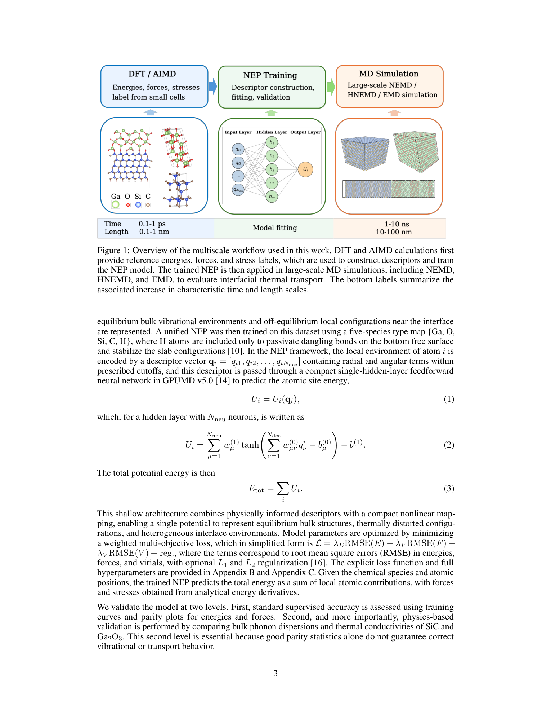
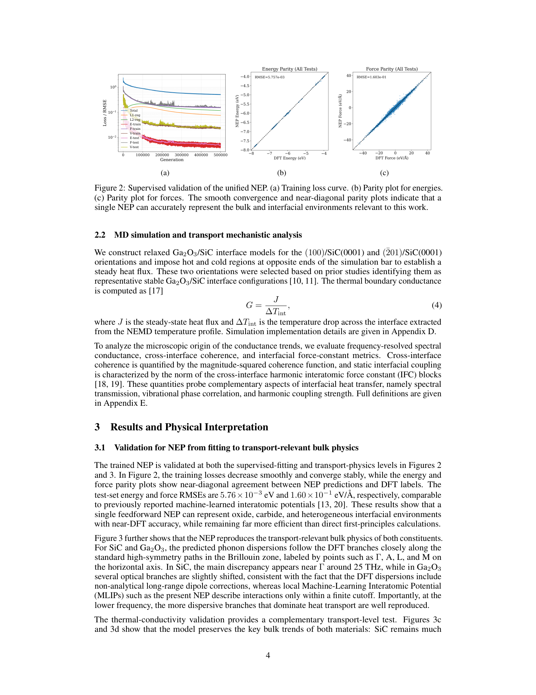
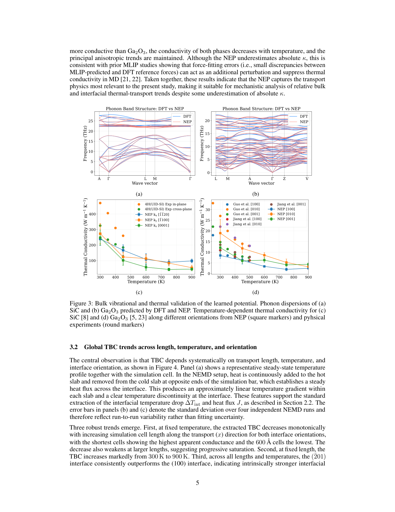
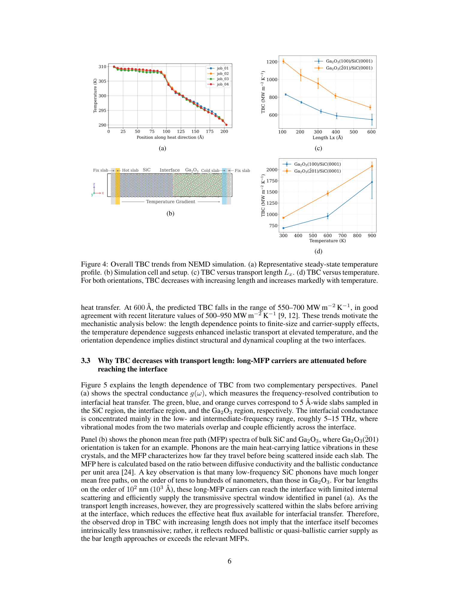
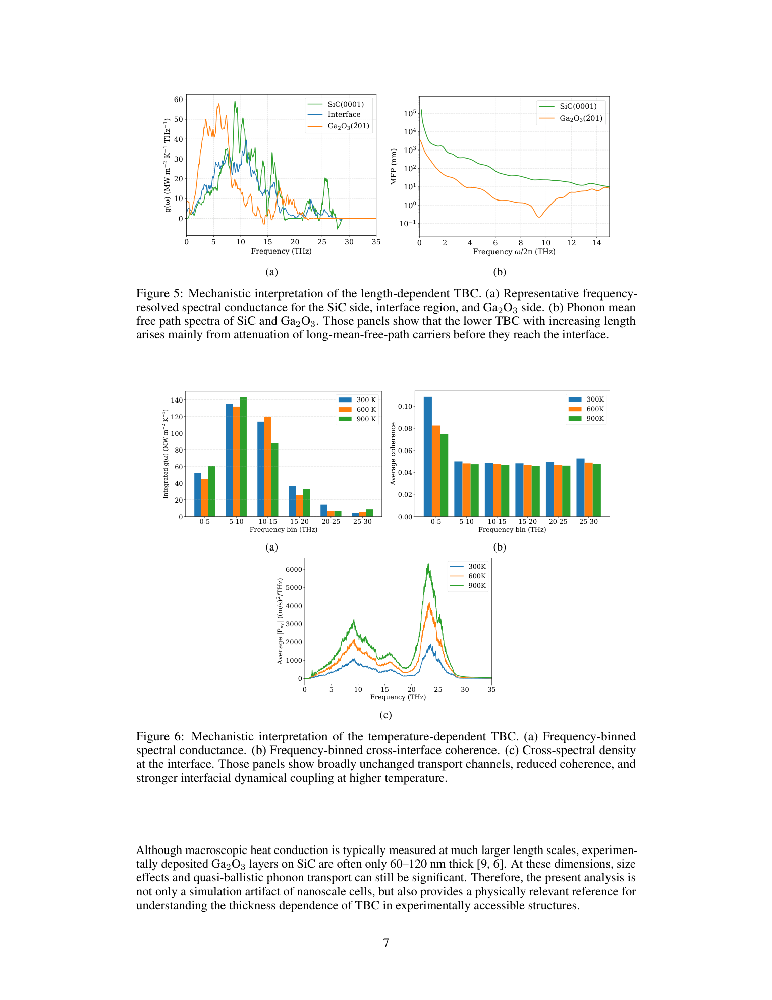

# β-Ga₂O₃/SiC界面の熱境界コンダクタンスをニューラルネットワークポテンシャルで物理的に理解する

- 執筆日：2026-05-10
- トピック：超ワイドバンドギャップ半導体パワーデバイスの熱管理を律速する Ga₂O₃/SiC 界面における熱境界コンダクタンスを，フォノン物理に根ざした機械学習ポテンシャルと非平衡分子動力学により解明する
- タグ：Phonons and Thermal Properties / Thermal Transport / Thin Films and Interfaces / Machine Learning / Molecular Dynamics
- 注目論文：[Physics-Grounded Understanding of Thermal Boundary Conductance between Ga₂O₃ and SiC from a Feedforward Neural Network Potential](https://arxiv.org/abs/2605.05620)（Liu et al., arXiv:2605.05620, 2026）
- 参照論文数：6

---

## 1. 背景：なぜ今この話題か

電力を変換・制御するパワーデバイスは，電気自動車・鉄道・再生可能エネルギーシステムの省エネ化に不可欠である。現在の主力材料であるシリコン（Si）はすでに理論的な限界性能に近づいており，次世代を担う「ワイドバンドギャップ（WBG）半導体」として窒化ガリウム（GaN）や炭化ケイ素（SiC）が急速に実用化されている。さらにその先，より高い絶縁破壊電圧と低いオン抵抗を求めて，「超ワイドバンドギャップ（UWBG）半導体」の研究が世界的に加速している。その筆頭格が β 相の酸化ガリウム（β-Ga₂O₃）であり，バンドギャップは約 4.8 eV，理論的な絶縁破壊電場は SiC の約 2 倍，GaN のさらに 2 倍近い 8 MV/cm に達するという驚異的な特性を持つ。大口径の溶融Ga₂O₃ から単結晶基板を安価に製造できる点も，産業応用の観点から魅力的だ。

しかし β-Ga₂O₃ には致命的な欠点が一つある。熱伝導率が約 10–20 W m⁻¹ K⁻¹ と，SiC（約 350–500 W m⁻¹ K⁻¹）や GaN（約 200 W m⁻¹ K⁻¹）に比べて一桁以上低いのである。パワーデバイスは動作時に大量のジュール熱を発生させるが，この熱が素子内に滞留すると，漏れ電流の増加・移動度の低下・信頼性の劣化を引き起こす。熱がうまく逃げなければ，β-Ga₂O₃ の優れた電気特性も宝の持ち腐れに終わってしまう。

この問題に対する有力な解決策として，β-Ga₂O₃ 薄膜を高熱伝導 SiC 基板に貼り合わせる「ヘテロ集積」が注目されている。Ga₂O₃ デバイス層を SiC の放熱器の上に乗せることで，発生した熱を SiC を通じて素早く外部に逃がす戦略だ。しかしここで新たな問題が浮上する。いかに SiC 側の熱伝導率が高くても，Ga₂O₃/SiC 界面に「熱境界コンダクタンス（Thermal Boundary Conductance; TBC）」と呼ばれる抵抗が存在するからである。この界面抵抗が小さければ熱の流れがせき止められてしまい，SiC 基板の高熱伝導率を活かしきれない。

TBC の実験計測には時間領域熱反射率法（TDTR）が使われてきたが，この手法が捉えるのは界面粗さや欠陥・接着層も含んだ実際の接合の値であり，欠陥のない理想界面のトランスポート特性を直接引き出すことはできない。一方，TBC の第一原理計算は原子数百個の範囲でしか行えず，フォノン平均自由行程が数十〜数百 nm にも及ぶ SiC 系材料ではスケールが全く足りない。経験的分子動力学ポテンシャルは大規模計算を可能にするが，Ga₂O₃（酸化物）と SiC（炭化物）という異質な化学結合環境を一つのポテンシャルで正確に記述することは従来困難だった。

こうした状況を打開しようとするのが今回紹介する注目論文である。2026 年 5 月に arXiv に投稿された Liu et al. の研究は，Ga₂O₃/SiC 界面に特化した「フィードフォワード型ニューラルネットワークポテンシャル（NEP）」を開発し，大規模な非平衡分子動力学（NEMD）シミュレーションにより TBC の長さ依存性・温度依存性・界面方位依存性を系統的に解明した。さらに，スペクトル解析によりどのフォノンモードが界面を通過するか・何が妨げているかを原子スケールで明らかにした点が，従来の研究と一線を画している。

---

## 2. 未解決問題は何か

### TBC の長さ依存性：なぜ「界面」の抵抗が計算する系の大きさに依存するのか

界面熱コンダクタンスは直感的には界面固有の量であり，バルクの長さには依存しないはずに思える。しかし実際の NEMD 計算では，シミュレーション系の長さを増やすと TBC の値が単調に減少するという奇妙な現象が観測される。これは「長い平均自由行程（MFP）を持つフォノンが，界面に到達する前にバルク中で散乱され，熱流束に寄与できなくなる」という準弾道輸送効果によるものである。SiC は低周波フォノンの MFP が数十〜数百 nm に達するため，特にこの効果が顕著に現れる。

では「真の界面 TBC」とは何か？　計算長さをゼロに外挿した値が本来の界面固有値に対応すると解釈されているが，この外挿が正当かどうか，どの長さ依存性モデルを使うべきかは未だ議論がある。実験で測定される TBC は通常 100 nm〜1 µm のスケールの実質的な値であり，「理想界面の本質的な TBC」と「実際のデバイスで機能する実効 TBC」をどう対応させるかという問いは，計算・実験双方にとって重要な未解決問題である。

### 弾性散乱と非弾性散乱：何がフォノンを界面で透過させるのか

AMM（Acoustic Mismatch Model）や DMM（Diffuse Mismatch Model）といった古典的な界面熱輸送モデルは，フォノンがエネルギーを変えずに界面を透過または反射する「弾性過程」のみを扱う。しかし実際には，界面近傍の非調和ポテンシャルが二つのフォノンを一つに合体させたり，一つを二つに分解したりする「非弾性（アンハーモニック）散乱」を引き起こす。非弾性散乱は，片方の材料には伝播できる周波数のフォノンが他方に変換される「チャンネル変換」を可能にするため，振動のミスマッチが大きい異種材料界面ほど重要になりうる。Ga₂O₃ と SiC は格子定数・質量・化学結合ともに異なるため，弾性・非弾性の相対的な寄与を定量化することが界面エンジニアリングの指針を得る上で急務である。

### 界面の結晶方位依存性：原子結合が TBC をどう決めるか

β-Ga₂O₃ は単斜晶系の低対称構造を持ち，(100)，(010)，(001)，(-201) など複数の劈開面が存在する。SiC 基板との接合では異なる方位の Ga₂O₃ 面が接触しうるが，それぞれの界面で原子の接触状況・界面結合の強さ・振動整合性が異なるため，TBC が方位によって系統的に変化することが予想される。しかしこれをポテンシャルの転用でなく，専用に最適化されたポテンシャルで正確に計算した研究は乏しかった。「どの方位を選べば TBC を最大化できるか」という設計指針を計算から導けるかどうかは，ヘテロ集積技術の最適化に直結する実践的な問いである。

### 機械学習ポテンシャルの転用可能性：異種材料界面を一つのモデルで扱えるか

機械学習ポテンシャル（MLIP）は DFT の精度を保ちながら大規模 MD を可能にするとして，近年急速に普及している。しかし既存の多くの研究は，単一材料を記述するためにトレーニングされたポテンシャルをそのまま異種界面に適用するか，界面構造を含む混合トレーニングセットで学習させるかの選択を迫られる。前者は界面近傍の原子環境を適切に表現できない可能性があり，後者は膨大なトレーニングコストを要する。「1 つの統合ポテンシャルで Ga₂O₃ と SiC 両者のバルク特性と界面輸送を正確に記述できるか」という問いに答えることは，MLIP 方法論の観点からも重要な知見をもたらす。

---

## 3. 注目論文の概説

### 研究目的と対象材料

Liu et al. (arXiv:2605.05620, 2026) の目的は，β-Ga₂O₃/SiC ヘテロ集積の熱管理最適化に向けて，理想的な欠陥フリー界面における TBC を原子スケールで理解することである。具体的な研究対象は Ga₂O₃(-201)/SiC(0001) と Ga₂O₃(100)/SiC(0001) の 2 種類の界面であり，前者は Ga₂O₃ の劈開面として特に重要な方位，後者は比較のために選ばれた高対称方位である。

### 研究アプローチ：DFT → NEP → NEMD の多スケールワークフロー

*図 1（注目論文 Fig. 1）：DFT から NEP 学習，大規模 MD 計算へと至る多スケールワークフロー。© 原著者，CC BY-SA 4.0*

本研究の核心は，三段階の多スケールアプローチにある（Fig. 1）。第一段階では DFT および *ab initio* 分子動力学（AIMD）を用いて，Ga，O，Si，C，H からなる様々な原子環境（バルク，表面，界面）のエネルギー・力・応力ラベルを収集した。特に界面近傍の原子環境はバルクと大きく異なるため，表面スラブを熱平衡させた AIMD トラジェクトリから多様な界面構造をサンプリングしている。

第二段階では，GPUMD v3.0 に実装された NEP（Neuroevolution Potential）フレームワークを使って，収集したデータセットでポテンシャルを学習させた。NEP は各原子 $i$ について，動径項と角度項を含む記述子ベクトル $\mathbf{q}_i = (q_1, q_2, \ldots, q_N)$ をまず構築し，これを入力とする単一隠れ層のフィードフォワードニューラルネットワーク

$$U_i = \sum_{n=1}^{N_{\rm neu}} w_n^{(1)} \tanh\!\left(\sum_{m=1}^{N} w_{mn}^{(0)} q_m - b_n^{(0)}\right) - b^{(1)}$$

を通じて原子エネルギー $U_i$ を出力する。全ポテンシャルエネルギーは

$$E_{\rm tot} = \sum_i U_i$$

として得られる。損失関数は

$$\mathcal{L} = \lambda_E \, \text{RMSE}(E) + \lambda_F \, \text{RMSE}(F) + \lambda_V \, \text{RMSE}(V)$$

であり，エネルギー $E$，力 $F$，ビリアル応力 $V$ の RMSE を重み付き和した多目的損失関数で最適化される。このシャローアーキテクチャは，大規模 MD で GPU 上で高効率に評価できることを設計目標としており，DFT に近い精度を保ちながら，DFT の 10⁵〜10⁶ 倍の原子数を扱える。

第三段階では，学習済みポテンシャルを用いた大規模 NEMD と平衡 MD（Green-Kubo 法）を実施した。NEMD では界面を挟んで温度差 $\Delta T_{\rm int}$ を設けた定常状態を実現し，界面を通過する熱流束 $J$ から TBC を

$$G = \frac{J}{\Delta T_{\rm int}}$$

として評価した。系のサイズを 100〜700 Å の範囲で変化させ，長さ依存性を系統的に調べた。

### ポテンシャルの検証

*図 2（注目論文 Fig. 2）：NEP の学習収束とパリティプロット。© 原著者，CC BY-SA 4.0*

*図 3（注目論文 Fig. 3）：バルクのフォノン分散と熱伝導率による二重検証。© 原著者，CC BY-SA 4.0*

論文が特に重視しているのは「二重検証」という概念である（Fig. 2, 3）。第一段階の検証は通常の教師あり検証であり，テストセットに対してエネルギー RMSE が $5.76 \times 10^{-3}$ eV，力の RMSE が $1.60 \times 10^{-1}$ eV Å⁻¹ というスコアを達成した。これは先行する MLIP 研究と同水準である。しかし著者らはここで満足せず，「輸送関連量」での独立検証を徹底した。具体的には，SiC および Ga₂O₃ のフォノン分散曲線が DFT の予測と一致するか，さらに Green-Kubo 法で求めた熱伝導率が既知の実験値・DFT 計算値と整合するかを確認した。この第二段階の検証こそが，界面熱輸送という「力学的統計量」を議論する際の信頼性を担保する。ポテンシャルが教師あり精度では合格しても輸送量で失敗する事例は珍しくなく，本研究がこの点を明示した意義は大きい。

### 主要結果と物理的解釈

*図 4（注目論文 Fig. 4）：TBC の全体的トレンド。© 原著者，CC BY-SA 4.0*

NEMD 計算から得られた主要結果は三つある（Fig. 4）。

**①TBC は輸送長さとともに単調に減少する。** 系の長さを 100 Å から 700 Å に増やすと，TBC は約 550–950 MW m⁻² K⁻¹（300 K, (-201) 界面）から単調に低下する。これは「長い MFP を持つフォノンが，バルク内で散乱される前に界面に到達できなくなる」準弾道効果であり，試料サイズが小さいほど（デバイス薄膜構造ほど）TBC が高くなることを示唆する。

**②TBC は温度とともに増加する。** 300 K から 600 K に温度を上げると TBC は増加する。この挙動は「高温でフォノン占有数が増え，非弾性散乱チャンネルが活性化される」ことで説明される。低温では弾性散乱が支配的だが，高温になるほど非調和な界面相互作用が異なる周波数帯のフォノン間のエネルギー変換を促す。

**③(-201)/SiC(0001) 界面は (100)/SiC(0001) 界面より一貫して高い TBC を示す。** 全ての計算長さ・温度において，(-201) 方位の TBC が (100) 方位を上回る。

*図 5（注目論文 Fig. 5, 6）：TBC の長さ依存性・温度依存性の機構解析。© 原著者，CC BY-SA 4.0*

この方位依存性のメカニズムを解明するため，著者らはスペクトル分析（Fig. 5）を実施した。スペクトルコンダクタンス $G(\omega)$ は，周波数 $\omega$ の各フォノンが界面熱流束にどれだけ寄与するかを表す量であり，

$$G = \int_0^\infty G(\omega) \, d\omega$$

と全 TBC に積分される。この解析から，輸送に寄与する周波数帯は主に 5–15 THz の低〜中周波域に限られることがわかった。SiC の長 MFP フォノンはこの周波数域に集中しており，計算系が短い場合（〜100 Å）はこれらが界面に到達して高い TBC を与えるが，系が長くなるにつれて散乱されて減衰する。この「MFP によるフィルタリング」が長さ依存性の物理的本質である。

(-201) 界面が高い TBC を示す理由は，界面力定数（IFC; Interfacial Force Constants）の大きさと振動整合性にある。著者らは断面力定数ブロックの大きさを定量化し，(-201) 界面において Ga-Si および Ga-C 間の IFC が (100) 界面より強いことを示した。これは(-201)面における原子配置が，SiC の原子と Ga₂O₃ の原子をより近接した位置に配置し，結合を強化するためと解釈される。強い界面結合は，二つの材料のフォノンを振動的に「カップルさせる」効果を持ち，フォノンの透過確率を高める。

### 論文の新規性と限界

この研究の最大の新規性は，単に TBC を数値として予測するだけでなく，「なぜその値になるか」を物理的機構レベルで説明した点にある。スペクトル分解，IFC 分析，MFP フィルタリングという三つのツールを組み合わせて，長さ依存性・温度依存性・方位依存性をすべて一貫したフォノン物理の枠組みで説明した点は，先行研究と比較して明らかな前進である。

一方で限界もある。第一に，本研究が対象とするのはあくまで「欠陥フリーの理想界面」であり，実際のボンディング界面に含まれる空孔・転位・非晶質層の効果は含まれない。第二に，NEP は単一隠れ層の浅いアーキテクチャを採用しており，複雑な多体相互作用の表現力が深いネットワークに比べて制限される可能性がある。第三に，NEMD の温度差を設定する際に量子補正（フォノン占有数の Bose-Einstein 分布）は適用されておらず，低温域では古典的 MD が量子系を正確に模擬できない。

---

## 4. 研究史における位置づけ

### 界面熱抵抗研究の歴史と Kapitza 抵抗の発見

界面熱抵抗の問題は，1941 年に Pyotr Kapitza がヘリウム（超流動体）と固体壁の界面で温度不連続を発見したことに端を発する。彼の名を冠した「Kapitza 抵抗」$R_K = 1/G$ は，界面を挟む温度差 $\Delta T$ と熱流束 $J$ の比として定義される。その後，固体/固体界面における熱境界抵抗が半導体デバイスの熱管理上の課題として認識されると，AMM と DMM という二つの解析モデルが提案された。AMM はフォノンを波として扱い，音響インピーダンス（密度×音速）の差から透過率を計算するが，界面が完全に滑らかな場合にのみ適用できる。DMM は逆に界面での完全拡散散乱を仮定し，フォノンが界面の記憶を持たない極限を記述する。現実の界面の TBC はこの二つの極値の間に位置することが多いが，どちらのモデルも非弾性散乱を無視しており，特に振動ミスマッチの大きな異種材料界面では定量的精度が低い。

### 経験ポテンシャルから MLIP へ：精度と規模の両立

NEMD による TBC 計算は 1990 年代から行われてきたが，長らくその精度は使用するポテンシャルの品質に縛られていた。Lennard-Jones ポテンシャルや Tersoff ポテンシャルといった経験的力場は SiC 単体では機能するものの，Ga₂O₃ のような複雑な酸化物には適用が難しく，ましてや酸化物/炭化物の異種界面を一つのポテンシャルで表現することは困難だった。

転機は 2010 年代後半に訪れた。高次元ニューラルネットワークポテンシャル（HDNNP）や Gaussian Approximation Potential（GAP），Moment Tensor Potential（MTP）などの MLIP が登場し，DFT レベルの精度で大規模 MD を実現できるようになった。Ga₂O₃ のバルク熱伝導率に関しては，Rybin と Shapeev（arXiv:2403.00113, 2024）が MTP を用いた計算を発表し，アクティブラーニングにより少数のトレーニングデータから堅牢なポテンシャルを構築できることを示した。同論文は Ga₂O₃ の熱伝導率の温度依存性を DFT レベルの精度で再現したが，界面ではなくバルク輸送に特化していた。

界面 TBC の MLIP-NEMD 研究としては，Si/diamond 界面の研究が先駆けとなる。Rajabpour et al.（arXiv:2407.15404, 2024）は MLIP-NEMD により Si/diamond の ITC（界面熱コンダクタンス）を評価し，Tersoff や Brenner ポテンシャルが ITC を実験値の約 3 倍に過大評価するのに対し，MLIP では実験値に近い結果が得られることを示した。さらに周波数依存の熱輸送スペクトル解析を行い，どの周波数帯のフォノンが ITC に寄与するかを議論した点で方法論的な先行研究となっている。

Ga₂O₃/SiC 界面の実験・理論の最前線としては，Cao et al.（arXiv:2604.15394, 2026）が本研究のほぼ同時期に重要な成果を発表している。彼らは MLIP＋格子動力学（ラティスダイナミクス）という異なるアプローチを組み合わせ，フォノンの波動・粒子二重性を明示的に考慮した計算フレームワークを開発した。特筆すべきは実験との融合であり，原子レベルで秩序の整った界面でのエピタキシャル成長サンプルの TDTR 計測により，231 MW m⁻² K⁻¹ という過去最高の TBC 値を達成した。一方，乱れた界面では振動インピーダンス整合を促すモードが生じるが，コヒーレンスの破壊が TBC を制限することを示した。

GaN/AlN ヘテロ接合では，Zhou et al.（arXiv:2503.05084, 2025）が NEMD 駆動の MLIP を用いて単独界面と近接二重界面のTBCを計算した。単独界面での TBC は〜600 MW m⁻² K⁻¹ と評価され（室温，量子補正後），弾性寄与が 60%，非弾性寄与が 40% と分解された。また二つの界面が近接すると TBC が 1000 MW m⁻² K⁻¹ まで増大する現象を発見し，コヒーレントなスーパーラティスモードではなく，フォノンの弾道輸送によるものと結論づけている。この研究は本論文と同じ MLIP-NEMD 方法論を用いており，異なる材料系における弾性/非弾性寄与比を比較するための参照点となる。

2D 材料系では，Liang et al.（arXiv:2502.13601, 2025）がグラフェン/h-BN ヘテロ構造において MLP-NEMD シミュレーションを 30 万原子規模で実施し，スタッキング順序に依存する ITC の階層性を明らかにした。この研究は MLP 駆動 MD が 2D 系でも有効な熱輸送解析ツールとなることを示すとともに，界面の原子配置（スタッキング）がフォノン透過に与える影響という，本研究のテーマとも重なる知見を提供する。

ヘテロ集積の実験基盤としては，Cheng et al.（arXiv:2005.13098, 2020）がイオンカッティング法による β-Ga₂O₃/SiC ウェハスケール接合を実現し，TDTR で TBC を計測した。同研究は中間層厚さの減少とともに TBC が増加すること，800°C アニールにより Ga₂O₃ 薄膜の熱伝導率が 2 倍以上に向上することを示し，プロセス最適化の方向性を示す重要な参照点となっている。

注目論文 Liu et al. はこれらの先行研究を踏まえた上で，「単一の転用可能なフィードフォワード NEP を使って，Ga₂O₃/SiC 界面の大規模輸送予測と物理的機構理解の両方を実現した」点に独自性がある。Cao et al. が格子動力学アプローチで実験値と接続した一方，本研究は NEMD によりフォノン輸送の空間的（長さ）・エネルギー的（スペクトル）・熱力学的（温度）依存性を包括的に描き出した。

---

## 5. どの解釈が最も妥当か

### TBC の長さ依存性：準弾道輸送か，それとも熱流の有限蓄積効果か

長さとともに TBC が低下するという観測に対し，二つの解釈が考えられる。第一は「準弾道輸送」解釈：長い MFP を持つフォノンがバルク内で散乱されると，それらは界面に寄与できず，TBC が見かけ上低下する。第二は「有限熱勾配蓄積」解釈：NEMD で設定する温度差が有限であるため，バルクと界面の非線形温度プロファイルに起因した系統誤差が生じる。

本研究では，スペクトルコンダクタンス $G(\omega)$ と MFP スペクトル $\lambda(\omega)$ の周波数別解析を組み合わせることで，前者（準弾道輸送）が支配的であることを示した（Fig. 5）。SiC 側の長 MFP フォノン（MFP ~ 数十〜数百 nm）は系長が短い場合は界面まで弾道的に到達して TBC に寄与するが，系が長くなると途中で散乱されて界面に達しなくなる。Ga₂O₃ 側のフォノン MFP は SiC より短いため，この効果は SiC 側からの寄与に起因する。この解釈は，SiC の音響フォノンが界面の TBC を「律速」するという直感と整合する。

しかし重要な留保もある。NEMD では Bose-Einstein 量子補正が施されていないため，低温（300 K 以下）域では量子統計効果によりフォノン占有数が古典値より低く，TBC を過大評価する可能性がある。GaN/AlN 系（Zhou et al., 2503.05084）では量子補正により TBC が約 20% 低下すると報告されており，本系でも同様の補正が必要と考えられる。

### (-201) と (100) の TBC 差：界面力定数か，それとも振動スペクトルの整合か

(-201) 界面が (100) より高い TBC を示す原因として，著者らは「より強い界面力定数」を主因と主張している。これは断面力定数ブロックの解析で支持されている。しかし，この解釈に対する別の視点もある。(-201) 面の Ga₂O₃ は結晶構造的に (100) 面と異なる原子終端を持ち，SiC(0001) との格子整合性が方位によって異なる。Cao et al.（2604.15394）は，原子レベルの秩序が「コヒーレントなフォノン伝播」を支えることを実験的に示した。これを踏まえると，(-201) 界面での格子整合性の向上がコヒーレント伝播チャンネルを開き，TBC を高めている可能性もある。

この二つの解釈（強い IFC による散乱増大 vs. コヒーレンス保持による透過率向上）は必ずしも矛盾しないが，定量的な寄与の分解は未達である。今後，コヒーレントフォノン伝播を定量化するための手法（例：Cao et al. の使った格子動力学グリーン関数の手法）と NEMD を組み合わせた分析が必要になる。

### 弾性 vs 非弾性散乱の寄与：温度依存性から何がわかるか

TBC が温度とともに増加するという実験的事実は，非弾性散乱チャンネルの重要性を示唆する。AMM/DMM のような弾性モデルでは，温度依存性は Bose-Einstein 分布関数を通じた間接的な効果にとどまるが，実測される増加率はしばしばこのモデル予測を超える。GaN/AlN 系（Zhou et al.）では弾性 60%，非弾性 40% という値が報告されているが，Ga₂O₃/SiC 系での詳細な分解は本研究では未実施である。温度依存性の解析から，高温で活性化される非弾性チャンネルは，SiC 側の光学フォノンモードが Ga₂O₃ 側の音響フォノンに変換されるプロセスであると推測される。この点の定量化が，界面設計の次の段階となる。

### 記録値 231 MW m⁻² K⁻¹ との整合性

Cao et al. が実験で達成した 231 MW m⁻² K⁻¹ という値（原子スケールで秩序の整った界面）と，本研究の NEMD 値（300 K, (-201) 界面, 外挿値）の直接比較は，論文中では詳細に議論されていない。計算値と実験値の差は，量子補正・界面モデリングの差・残留欠陥などの複合効果が反映されている可能性があり，今後の系統的な比較が望まれる。現時点では，計算と実験が同じ「理想界面ほど高い TBC」という方向性を指示していることが最も強く支持される結論であり，具体的な数値の一致については慎重な態度が必要である。

---

## 6. 何が一般化できるか

### MLIP-NEMD アプローチの普遍性

本研究で確立した「DFT データからの MLIP 構築 → バルク物性とフォノン分散で二重検証 → 大規模 NEMD で TBC 評価 → スペクトル解析で機構理解」という方法論は，Ga₂O₃/SiC に限らず，あらゆる異種材料界面に応用できる枠組みである。Si/diamond（2407.15404），GaN/AlN（2503.05084），グラフェン/h-BN（2502.13601）などの先行研究と合わせて考えると，MLIP-NEMD は「経験ポテンシャルでは扱えなかった複雑な界面」を系統的に計算するための標準ツールに成長しつつある。

特に注目すべきは「フィードフォワード型」の NEP を採用したことによる計算効率の高さである。より表現力の高いアーキテクチャ（等変グラフニューラルネットワーク等）は精度面で有利だが，GPU 上での大規模 MD には軽量なアーキテクチャの方が適する場合が多い。本研究は「シャローだが十分」という設計哲学の実証例となっており，他の系への転用において参考となる。

### 設計原理への一般化：界面方位の選択が熱管理を変える

本研究の最も応用価値の高い知見は，「(-201)/SiC(0001) 界面の TBC が (100)/SiC(0001) より系統的に高い」という結論である。これは，Ga₂O₃/SiC デバイスを設計する際に(-201)面を優先的に選択することで，界面熱抵抗を低減できることを示唆する。実際，β-Ga₂O₃ の(-201)面は主要な劈開面であり，ウェハの入手性も良い。計算から得られたこの設計指針は，実験グループが(-201)面のエピタキシャル接合を優先的に評価するための動機付けとなる。

### 他の UWBG 材料系への接続

Ga₂O₃ と同様の UWBG 半導体として，アルミナ（Al₂O₃）や酸化インジウムガリウム（In-Ga-O），さらには六方晶窒化ホウ素（h-BN）なども研究されている。これらの材料が SiC や diamond と接合される際の TBC 問題も同様の課題を持つ。NEP フレームワークは Ga，O，Si，C 以外の元素に対しても拡張可能であり，本研究で確立した訓練・検証・解析のワークフローは他材料系に転用できる。特に，Ga₂O₃ の低熱伝導率を補うために diamond サブストレートへの集積も検討されており（Thermal Conductance across β-Ga₂O₃-diamond Van der Waals Heterogeneous Interfaces, arXiv:1901.02961），そこでの TBC 解析も同様のアプローチで実施できる。

### スペクトル分解の方法論的貢献

本研究が用いたスペクトルコンダクタンス $G(\omega)$ の解析は，GPUMD に実装されたスペクトル熱流束分解（Spectral Decomposition of Heat Current; SDHC）に基づく。この手法は本来バルク熱伝導率の周波数分解に使われていたが，界面を挟んだ「クロス-スペクトルコンダクタンス」への拡張により，界面TBC の周波数依存性が評価できる。この方法論は，AMM/DMM のような解析モデルの限界を超えて，実際の原子間ポテンシャルに基づく「データ駆動型の界面フォノン物理」を可能にするものであり，今後の界面熱輸送研究の標準的な解析ツールとして普及が期待される。

---

## 7. 基礎から理解する

### フォノンとは何か：格子振動の量子として

物質中の原子は絶対零度でも完全には静止せず，格子の平衡位置のまわりで振動し続けている。この集団的な原子振動を量子化したものが「フォノン（phonon）」である。電磁波（光）の量子が光子（photon）であるように，弾性波（音波・振動波）の量子がフォノンと呼ばれる。

フォノンの基本的な性質はいくつかの量で特徴づけられる。波数ベクトル $\mathbf{k}$ は振動波の伝播方向と波長を指定し，ブリルアンゾーンという逆空間の特定領域内に収まる。各 $\mathbf{k}$ に対して複数のフォノンブランチが存在し，それぞれのブランチが分散関係 $\omega(\mathbf{k})$（角周波数 $\omega$ と $\mathbf{k}$ の関係）を持つ。分散関係は材料によって異なり，その形状が熱的・弾性的・光学的性質を根本的に決める。

フォノンブランチは大きく二種類に分類される。「音響モード」は $\mathbf{k} \to \mathbf{0}$ で $\omega \to 0$ となり，格子中の全原子が同位相で動く長波長の振動に対応する。固体の音速はこのモードの分散曲線の勾配 $v = d\omega/dk$ で決まる。「光学モード」は $\mathbf{k} = \mathbf{0}$ で有限の周波数を持ち，単位胞内の異なる原子が逆位相で振動するモードである。フォノン分散曲線に示されるピークや谷の位置は，対応する原子間相互作用の強さを反映しており，分散曲線が DFT 計算と一致するかどうかは，ポテンシャルが格子の動力学を正確に記述しているかの重要な指標となる。

温度 $T$ でのフォノンの占有数は Bose-Einstein 分布

$$n(\omega, T) = \frac{1}{\exp(\hbar\omega/k_B T) - 1}$$

で与えられる。ここで $\hbar$ はディラック定数，$k_B$ はボルツマン定数である。高温極限（$k_B T \gg \hbar\omega$）ではこれは $k_B T / (\hbar\omega)$ に近似でき（古典極限），低温では指数的に減少する。室温程度の温度では，低周波音響フォノンは十分に励起されているが，高周波光学フォノンの占有数は低い。

### 固体の熱伝導：フォノンガスモデル

固体中の熱伝導の支配的なメカニズムは，電子が少ない絶縁体・半導体ではフォノンの拡散輸送である。これを「フォノンガスモデル」で理解しよう。フォノンをガス分子と見立てると，熱伝導率 $\kappa$ は気体分子運動論と同じ形式

$$\kappa = \frac{1}{3} C v \ell$$

で表せる。ここで $C$ は単位体積あたりの熱容量，$v$ はフォノンの群速度，$\ell = v \tau$ は平均自由行程（$\tau$ はフォノン寿命）である。より正確には，分散関係とフォノン散乱を陽に考慮したボルツマン輸送方程式

$$\kappa = \frac{1}{V} \sum_{\mathbf{k},s} C_{\mathbf{k}s} v_{\mathbf{k}s}^2 \tau_{\mathbf{k}s}$$

が使われる（$s$ はブランチ指数，$V$ は体積）。この式からわかるように，フォノンの散乱（$\tau$ の減少）が熱伝導率を下げる主因となる。

散乱機構としては，（1）格子の非調和性によるフォノン-フォノン散乱（アンハーモニック散乱），（2）不純物や欠陥による弾性散乱，（3）結晶粒界・界面での散乱，（4）有限サイズの試料境界での散乱，などがある。高温では (1) が支配的で，$\kappa \propto T^{-1}$ になる（ウムクラップ散乱）。SiC は軽元素（Si，C）からなり原子間結合が強いため，アンハーモニック散乱が小さく，熱伝導率が非常に高い。一方 β-Ga₂O₃ は重い Ga 原子と酸素の複雑な単斜晶構造を持ち，フォノンブランチが多く互いに散乱しやすいため，熱伝導率が低い。

### 界面熱抵抗の起源：AMM と DMM モデル

二種類の固体が接触すると，その界面でフォノンは「透過」か「反射」かの選択を迫られる。直感的には，振動特性（音速，質量，力定数）が似た材料ほど透過しやすいが，異なる材料ほど反射されやすい。この現象が「界面熱抵抗（Kapitza 抵抗）」の物理的起源である。

Acoustic Mismatch Model（AMM）は，フォノンを完全に平滑な界面に入射する長波長弾性波として扱う。角度 $\theta$ で入射したフォノンの透過確率は，音響インピーダンス $Z = \rho v$（$\rho$：密度，$v$：音速）のミスマッチで決まる：

$$t_{12} = \frac{4 Z_1 Z_2}{(Z_1 + Z_2)^2}$$

これは光の Fresnel 係数と全く同じ形式であり，フォノン波動光学のアナロジーである。AMMは低温（フォノン波長が長く界面の原子的不均一を感じない領域）で有効だが，室温以上では誤差が大きい。

Diffuse Mismatch Model（DMM）は逆の極限を扱う。界面で全てのフォノンが完全に拡散反射し，透過確率は両材料の状態密度の比のみで決まると仮定する：

$$t_{12} = \frac{\sum_{j} v_{2j}^{-2}}{\sum_{j} v_{1j}^{-2} + \sum_{j} v_{2j}^{-2}}$$

AMM と DMM はどちらも弾性散乱のみを扱うが，実際の界面では非弾性散乱（アンハーモニック散乱）が重要であり，特に振動スペクトルが大きく異なる材料系では両モデルの予測は実験値から大きく外れる。

### 非平衡分子動力学法（NEMD）

NEMD はフォノン輸送をシミュレーションする強力な手法である。シミュレーション系を一列に並べ，一端（ホット領域）にエネルギーを追加し，もう一端（コールド領域）からエネルギーを除去することで，定常状態の熱流束を作り出す。定常状態での熱流束 $J$ と温度勾配から，バルク熱伝導率または界面 TBC を計算できる。

TBC の計算では，界面を挟んで温度 $T_{\rm hot}$ と $T_{\rm cold}$ の領域を設定し，定常状態での界面温度不連続 $\Delta T_{\rm int}$ と熱流束 $J$ から

$$G_{\rm TBC} = \frac{J}{\Delta T_{\rm int}}$$

を得る。NEMD の精度は使用する原子間ポテンシャルの品質に大きく依存するため，精度の高い MLIP の開発が不可欠である。また NEMD では，系の長さに依存した値が得られる（前述の準弾道効果）ため，複数の長さで計算して外挿する操作が必要になる。

### 機械学習ポテンシャル（MLIP）：DFT 精度を大規模 MD へ

第一原理（DFT）計算はフォノン特性を高精度で予測できるが，扱える原子数は数百個，時間スケールは数ピコ秒に限られる。一方で経験ポテンシャルは数百万原子・マイクロ秒スケールの MD を可能にするが，DFT 精度には遠く及ばない。

MLIP はこの二つの世界の橋渡しをする。基本的なアイデアは，「原子 $i$ のエネルギー $U_i$ は，その近傍の原子配置 $\{\mathbf{r}_j\}$ から決まる汎関数」という局所性近似（Behler-Parrinello の仮定）に基づき，この汎関数をニューラルネットワークや他の機械学習モデルで近似することである：

$$U_i = f_{\rm NN}(\mathbf{G}_i) \approx U_i^{\rm DFT}$$

ここで $\mathbf{G}_i$ は原子 $i$ の近傍原子配置を数値ベクトルとして表現した「記述子（descriptor）」である。記述子は，平行移動・回転・鏡映に対して不変（または等変）になるように設計される。NEP（本研究で使用）は，動径対称関数と角度対称関数を組み合わせた記述子を使い，それを単層フィードフォワードニューラルネットワークに入力する。

MLIP のトレーニングは，DFT で計算したエネルギー・力・応力のデータセットに対して，損失関数を最小化するようにネットワークパラメータを最適化する問題に帰着する。十分な多様性を持つデータセットと適切な正則化を組み合わせることで，訓練データに含まれない新しい原子配置にも外挿できる「汎化性能」が得られる。

### フォノン平均自由行程と準弾道輸送

フォノンの「平均自由行程（MFP）」$\ell = v \tau$ は，フォノンが散乱されるまでに進む平均距離である。これが試料の代表的な長さ $L$ と比較してどちらが大きいかが，輸送のレジームを決める：

- $\ell \ll L$（拡散輸送）：フォノンが多数回散乱され，Fourier の熱伝導則が成立。$J = -\kappa \nabla T$
- $\ell \gg L$（弾道輸送）：フォノンが散乱なしに試料を通過。熱流束は $\kappa$ ではなくフォノンの個別透過確率で決まる
- $\ell \sim L$（準弾道輸送）：中間領域。有効熱伝導率が $\kappa$ より低くなり，系のサイズ依存性が顕著に現れる

SiC の音響フォノンの MFP は数十〜数百 nm に達するため，実際のデバイス（Ga₂O₃ 膜厚〜100 nm〜数 µm）では準弾道輸送が重要になる。NEMD で計算長さを変えて TBC の長さ依存性を調べることは，この準弾道効果を定量化するための基本的な手法である。

---

## 8. 専門用語の解説

**熱境界コンダクタンス（Thermal Boundary Conductance; TBC）**：固体界面を単位面積・単位温度差あたりに通過する熱流束の大きさ。単位は MW m⁻² K⁻¹。TBC の逆数が「界面熱抵抗（Kapitza 抵抗）」であり，界面の「熱の通しやすさ」を表す。大きいほど熱が流れやすい。今回の研究では β-Ga₂O₃/SiC 界面での TBC が主要な評価対象であり，パワーデバイスの放熱性能を直接規定する量として注目されている。

**NEP（Neuroevolution Potential）**：GPUMD ソフトウェアに実装された，GPU 上で高効率に動作するフィードフォワード型ニューラルネットワークポテンシャル。動径・角度記述子を入力とし，単一隠れ層で原子エネルギーを出力するシャローアーキテクチャを採用。「Neuroevolution」という名称は，ネットワークの学習に自然勾配法・確率的最適化を組み合わせた手法を用いることに由来する。本研究では Ga，O，Si，C，H の 5 元素を一つの統合ポテンシャルで表現し，バルクと界面の両方を正確に記述した。

**非平衡分子動力学法（NEMD; Non-Equilibrium Molecular Dynamics）**：シミュレーション系の一端を加熱し他端を冷却して定常的な熱流束を発生させ，熱伝導率や界面 TBC を評価する MD 手法。TBC の計算では，界面を挟む温度不連続 $\Delta T_{\rm int}$ と熱流束 $J$ から $G = J/\Delta T_{\rm int}$ を得る。スペクトル分解（SDHC）と組み合わせることで，周波数別の熱流寄与を評価できる。

**スペクトルコンダクタンス（Spectral Conductance）**：TBC をフォノン周波数の関数として表した量 $G(\omega)$ であり，全 TBC $G = \int_0^\infty G(\omega) d\omega$ に積分される。この分解により，どの周波数のフォノンが界面輸送に支配的な役割を果たすかが明確になる。本研究では 5–15 THz の低〜中周波フォノンが輸送を担い，高周波（>20 THz）の寄与は小さいことが示された。

**フォノン平均自由行程（Phonon MFP; Mean Free Path）**：フォノンが散乱されるまでに進む平均距離 $\ell = v \tau$（$v$：群速度，$\tau$：緩和時間）。SiC では音響フォノン MFP が数十〜数百 nm に達し，これが NEMD の TBC に「長さ依存性」を生む準弾道輸送効果の原因となる。Ga₂O₃ では MFP が SiC より短く，界面 TBC に対する相対的な影響が小さい。

**界面力定数（IFC; Interfacial Force Constants）**：界面をまたいで存在する原子対間の調和ポテンシャルの二次微分から得られる係数行列。IFC が大きいほど界面をまたぐ原子間結合が強く，フォノンの振動エネルギーが界面を超えて伝達されやすくなる。本研究では断面力定数ブロックの大きさを定量化し，(-201)/SiC(0001) 界面が (100)/SiC(0001) より大きい IFC を持つことで高い TBC を説明した。

**準弾道輸送（Quasi-ballistic Transport）**：フォノンの MFP が系のサイズに匹敵するときに現れる輸送レジーム。古典的な Fourier 熱伝導則（$J = -\kappa \nabla T$）が成立せず，有効熱伝導率が系のサイズとともに変化する。NEMD で TBC が計算長さに依存するのはこの効果によるものであり，実際のデバイス（膜厚〜100 nm〜1 µm）では特に重要になる。

**コヒーレントフォノン伝播（Coherent Phonon Transport）**：フォノンが波として界面を透過する際，位相を保ったまま伝播する様式。界面が原子レベルで秩序正しいほどコヒーレンスが維持されやすく，TBC が高まる。Cao et al.（2604.15394）は，原子レベルの秩序の回復によりコヒーレントチャンネルが開かれ，過去最高の TBC 231 MW m⁻² K⁻¹ が達成されたことを実験的に示した。一方，乱れた界面では拡散散乱がコヒーレンスを壊す。

**超ワイドバンドギャップ半導体（UWBG; Ultra-Wide Bandgap Semiconductor）**：バンドギャップが 4 eV 以上の半導体の総称。GaN（3.4 eV）や SiC（3.2 eV）を超える特性を持つ材料群であり，β-Ga₂O₃（4.8 eV），h-BN（6 eV），ダイヤモンド（5.5 eV），AlN（6.2 eV）などが含まれる。絶縁破壊電場が大きく，高電圧パワーデバイスへの応用が期待される一方，熱管理の困難さが共通の課題となっている。

**時間領域熱反射率法（TDTR; Time-Domain Thermoreflectance）**：超短パルスレーザーポンプ・プローブ技術を用いた非接触熱計測手法。ポンプパルスで試料表面を加熱し，プローブパルスで反射率変化（温度変化と相関）を時間分解計測する。1 ns〜µs の時間スケールでの熱拡散を測定でき，表面近傍の熱伝導率・TBC を正確に評価できる。Cheng et al.（2005.13098）や Cao et al.（2604.15394）の実験では TDTR が使われ，β-Ga₂O₃/SiC の TBC が計測された。

**アンハーモニック散乱（Anharmonic Scattering）**：格子ポテンシャルの高次項（非調和項）によって引き起こされるフォノン-フォノン散乱。二つのフォノンが合体して一つになる（合体過程）またはその逆（分裂過程）が代表的であり，これによりフォノンのエネルギーと運動量が分配される。高温でフォノン占有数が増えると散乱頻度が高まり，バルク熱伝導率が $\kappa \propto T^{-1}$ となる（正常・ウムクラップ散乱）。界面では，アンハーモニック散乱が異なる周波数帯のフォノン間のエネルギー変換（非弾性散乱チャンネル）を可能にする重要な機構である。

---

## 9. 将来展望

### かなり確からしくなったこと

本研究と同時期の Cao et al.（2604.15394）の実験・計算を合わせると，「β-Ga₂O₃/SiC 界面における TBC は原子レベルの界面秩序によって大きく変化する」という結論はほぼ確実である。計算では NEP-NEMD がバルク物性の二重検証を経た信頼性を示し，実験では TDTR が記録値 231 MW m⁻² K⁻¹ を達成した。また「(-201)/SiC(0001) 界面は (100)/SiC(0001) より高い TBC を持つ」という方位依存性も，異なる計算手法（本研究と Cao et al.）の間で整合的な方向性が確認できる。MLIP-NEMD が経験ポテンシャルよりも界面 TBC を正確に予測するという点も，Si/diamond 系（2407.15404）や GaN/AlN 系（2503.05084）の先行研究によって裏付けられている。

### まだ未確定なこと

量子補正を適用した低温域での TBC の定量値，弾性散乱と非弾性散乱の寄与比，そして「理想界面の TBC」から実際のデバイス界面（粗さ・欠陥・接着層を含む）への定量的なスケーリング則は，いずれも未確定である。また，本研究が仮定する完全な界面接触と実験で達成できる接合品質の差が TBC にどう反映されるかは，計算と実験の系統的な比較研究が必要である。さらに，長さ依存性の外挿により求める「真の界面固有値」の物理的意味をどう定義するかという方法論的問いも，コンセンサスが形成されていない。

### 次に重要になる実験・理論・計算と注目すべき論点

最優先で行うべき実験は，(-201)/SiC と (100)/SiC の接合を同一プロセスで作製し TDTR で比較する方位依存性の直接検証である。計算の予測が実験で支持されれば，これは Ga₂O₃ パワーデバイス製造において (-201) 面を選択すべきという強い設計指針となる。理論的には，フォノンの弾道・コヒーレント輸送を統一的に扱える非平衡グリーン関数（NEGF）アプローチと NEP の組み合わせが次のステップとして有力であり，NEMD の古典的限界（量子補正の不在）を克服できる。機械学習の視点では，本研究の NEP に代えて，より表現力の高い等変グラフニューラルネットワーク（e3nn，NequIP など）を使用した場合の精度向上を評価することも重要である。さらに，実際のデバイス動作条件（高電場，高キャリア密度）でのフォノン-電子相互作用を含む熱輸送，そして接合欠陥（気泡，非晶質層，転位）が TBC をどう低下させるかの系統的計算は，産業応用に直結する論点として今後の研究の焦点となるだろう。

---

## 参考論文一覧

1. **[注目論文]** Liu, N. et al., "Physics-Grounded Understanding of Thermal Boundary Conductance between Ga₂O₃ and SiC from a Feedforward Neural Network Potential," [arXiv:2605.05620](https://arxiv.org/abs/2605.05620) (2026). 
   → β-Ga₂O₃/SiC 界面に特化した NEP を構築し，NEMD による TBC の長さ・温度・方位依存性を系統的に解明した本記事の注目論文。

2. Yang, H. et al., "Atomic-scale order enables high thermal boundary conductance at β-Ga₂O₃/4H-SiC interfaces," [arXiv:2604.15394](https://arxiv.org/abs/2604.15394) (2026). 
   → MLIP＋格子動力学でフォノン波動・粒子二重性を考慮し，原子レベルで秩序の整った界面の記録 TBC 231 MW m⁻² K⁻¹ を実験で達成。本論文と相補的な視点を提供する。

3. Rybin, N. and Shapeev, A., "A moment tensor potential for lattice thermal conductivity calculations of alpha and beta phases of Ga₂O₃," [arXiv:2403.00113](https://arxiv.org/abs/2403.00113) (2024).
   → MTP（モーメントテンソルポテンシャル）とアクティブラーニングで Ga₂O₃ バルク熱伝導率を DFT 精度で計算し，MLIP の Ga₂O₃ 熱輸送への適用性を示した先行研究。

4. Rajabpour, A. et al., "Accurate estimation of interfacial thermal conductance between silicon and diamond enabled by a machine learning interatomic potential," [arXiv:2407.15404](https://arxiv.org/abs/2407.15404) (2024).
   → Si/diamond 界面の ITC を MLIP-NEMD で計算し，経験ポテンシャルが ITC を 3 倍過大評価することを示すとともに周波数分解スペクトル分析を実施。

5. Zhou, H. et al., "Thermal boundary conductance in standalone and non-standalone GaN/AlN heterostructures predicted using machine learning interatomic potentials," [arXiv:2503.05084](https://arxiv.org/abs/2503.05084) (2025). 
   → GaN/AlN の MLIP-NEMD で単独・二重界面の TBC を評価し，弾性（60%）/非弾性（40%）散乱の定量分解と二重界面近接効果を明らかにした比較研究。

6. Cheng, Z. et al., "Wafer-scale Heterogeneous Integration of Monocrystalline β-Ga₂O₃ Thin Films on SiC for Thermal Management by Ion-Cutting Technique," [arXiv:2005.13098](https://arxiv.org/abs/2005.13098) (2020). 
   → イオンカッティング法によるウェハスケール β-Ga₂O₃/SiC 接合を実現し，TDTR で TBC を計測。中間層厚さとアニール温度の影響を明らかにした実験基盤論文。
