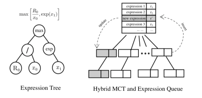
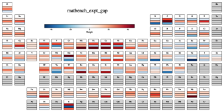
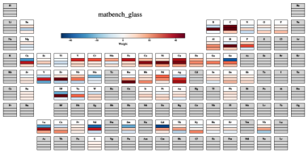

# 化学組成から物性予測式の自動導出

- 執筆日：2026-05-10
- トピック：機械学習による材料物性予測において、予測精度と解釈性を同時に実現するため、組成情報のみから解析的な数式を自動探索する記号回帰フレームワークの最新展開
- タグ：Computation and Theory / Surrogate Modeling / Machine Learning
- 注目論文：Yang Huang, Jingrun Chen, "Composition-Weighted Symbolic Regression for General-Purpose Property Prediction," arXiv:2605.02267 (2026) [https://arxiv.org/abs/2605.02267]
- 参照論文数：7

---

## 1. 背景：なぜ今この話題か

マテリアルズ・インフォマティクスの分野では，グラフニューラルネットワーク（GNN）や大規模言語モデル（LLM）に代表される高精度な「ブラックボックス」モデルが次々と登場し，材料物性の予測精度は劇的に向上してきた。しかしながら，その予測プロセスは人間には理解しにくく，「なぜその値が出たのか」を問うと沈黙する。これはいわゆる解釈性（interpretability）の問題であり，材料科学における根本的な課題の一つとして近年急速に意識されるようになっている。

材料設計の現場では，予測値そのものと同じくらい，あるいはそれ以上に，物性を支配する物理・化学的な法則の理解が重要である。バンドギャップがなぜある組成で大きくなるのか，ガラス形成能がどの元素の組み合わせで高まるのかを，解析的な式として明示できれば，実験家は無数の試作を経ずとも，式を眺めるだけで次の実験を設計できる。第一原理計算による高精度な物性予測は可能だが，何万もの組成を網羅的にスクリーニングするには計算コストが高すぎる。その橋渡しとして，データから数式そのものを学習する「記号回帰」（symbolic regression, SR）が，材料科学との親和性の高い手法として再び注目されている。

特に，化学組成のみを入力とする組成ベースの物性予測は，結晶構造の緩和計算を必要としないため，広大な組成空間を迅速にスクリーニングできるという実用上の大きな利点がある。問題は，組成情報から直接物性を予測する際に，どれだけ解釈可能な形で，かつ高い精度を実現できるかである。従来の組成ベースモデルは，線形結合や手作りの記述子に頼ることが多く，非線形な化学的傾向を自動的に捉える機能が不足していた。今回注目する論文（arXiv:2605.02267）は，この制約を打破する新しい枠組みを提案した。

---

## 2. 未解決問題は何か

### 解釈性と精度のトレードオフはどこにあるか

機械学習による材料物性予測の歴史を振り返ると，解釈性と予測精度はしばしば二律背反の関係にあった。決定木やランダムフォレストのような「白箱」モデルは解釈しやすいが，GNNや深層ニューラルネットワークほどの精度は出にくい。逆に，GNNは精度が高いが，内部で何を学んだかを原子・元素レベルで理解することが難しい。記号回帰はこのギャップを埋める候補として期待されているが，実際に産業的規模のデータセットで黒箱モデルに匹敵する精度を出せるかどうかは，長らく疑問視されてきた。この問いに対する答えが，今まさに実証段階に入りつつある。

### 広大な記号空間をいかに効率的に探索するか

記号回帰の核心的な困難は，探索空間の巨大さにある。数学的演算子（加算，乗算，指数，対数など）と変数を木構造で組み合わせたとき，考えられる式の数は指数的に増大する。従来の遺伝的プログラミング（genetic programming, GP）は，集団進化によってこの空間を探索してきたが，局所解にはまりやすく，収束が遅い傾向がある。近年，強化学習，モンテカルロ木探索（Monte Carlo Tree Search, MCTS），トランスフォーマーによる式生成など，様々なアプローチが試みられており，どの探索戦略が最も効率的かは活発な議論が続いている（arXiv:2509.15929）。特にハイブリッド手法——すなわち局所精緻化と大域探索を組み合わせること——が有望視されており，今回の注目論文もこの方向性を推し進める。

### 元素の周期性を学習できるか，できないか

化学的直感では，元素の性質は周期表に沿って規則的に変化する。電気陰性度，イオン半径，バンドギャップへの寄与は，同族元素間で連続的なトレンドを示す。機械学習モデルがこのような「周期的な元素ルール」を事前情報なしにデータだけから自動的に学べるかどうかは，解釈性の観点から非常に重要な問いである。手作りの元素記述子（電気陰性度や原子半径の組み合わせなど）を使えばこの問題を回避できるが，そうすると何を記述子として選ぶかに先入観が入り込む。記述子なしで周期律を再現できれば，それ自体が新しい物理的洞察を与える可能性がある。

### 多タスク・多物性への一般化

現実の材料開発では，バンドギャップだけでなく，金属か絶縁体か，ガラス形成能はどうか，などの複数の物性を同時に考慮する必要がある。記号回帰が回帰（連続値予測）と分類（二値判別）を統一的に扱えるかどうかは，実用展開の観点で重要な技術的課題である。特に，バンドギャップは非負制約（$E_g \geq 0$）があり，金属性や分類確率は$[0,1]$に制限される必要があるが，一般的な数式探索ではこれらの物理的制約を自然に満たす保証がない。

---

## 3. 注目論文の概説

### 研究の目的と対象

Huang & Chen（arXiv:2605.02267）は，化学組成のみを入力として，材料物性を解析的な数式で直接予測する「組成重み付き記号回帰（composition-weighted symbolic regression）」フレームワークを提案した。対象とする物性は，MatBenchベンチマーク（arXiv:2005.00707）から選んだ3つのタスクである：実験的バンドギャップ（matbench_expt_gap，約4600サンプル），金属性分類（matbench_expt_is_metal，約4900サンプル），ガラス形成能分類（matbench_glass，約308サンプル）。さらに，III-V族半導体合金系（GaAs, InAs, AlN, GaN など12系統）への応用として，組成依存バンドギャップの連続予測も示している。

### 研究のアプローチ

この手法の根幹は，物性 $y$ を化学組成ベクトル $\{c_i\}$ と，タスクごとに学習する元素重み $\{w_i\}$ を用いて解析式で表すという設計思想にある。具体的には，各元素 $i$ に対して重みスカラー $w_i$ を定義し，組成加重平均

$$x = \sum_{i} c_i w_i$$

を基本的な合成特徴量として構成する。ここで $c_i$ は化学式における元素 $i$ のモル分率（例えば GaAs では $c_{\mathrm{Ga}} = c_{\mathrm{As}} = 0.5$），$w_i$ は学習によって決定されるスカラー重みである。この $x$ は一種のスカラー材料記述子だが，その解釈は固定されておらず，データが最適な元素の性質の組み合わせを自動的に決定する点が従来手法と異なる。

実際の式探索では，$\{x\}$ を変数として含む様々な数学的表現を探索する。演算子セットは加算，減算，乗算，除算，$\exp(\cdot)$，$\log(\cdot)$，$\sin(\cdot)$，$\cos(\cdot)$，$\tanh(\cdot)$，$\max(\cdot, \cdot)$，$\min(\cdot, \cdot)$ などを含む。特に物理的制約のエンコードとして $\max$ および $\min$ 演算子が重要な役割を果たす。例えばバンドギャップの非負制約は，式を $\max(0, \hat{f}(\{c_i\}))$ の形にすることで自然に実現できる。同様に，分類確率の $[0,1]$ 制約は $\max(0, \min(1, \hat{f}(\{c_i\})))$ の構造で処理できる。これにより，回帰と分類が同一のフレームワークで統一的に扱える。

*図1：MCTS-GPハイブリッドアルゴリズム。左のMCTS部では木構造のノードを順次展開してスコア（報酬）の高い式を選択し，右のGP部では選ばれた式集団に突然変異・交叉を適用して新たな候補を生成する。根ノードに集約された式キューを共有することで，両者の長所を融合している（CC BY 4.0）。*

### MCTS-GP ハイブリッドアルゴリズム

式探索の効率化のために，モンテカルロ木探索（MCTS）と遺伝的プログラミング（GP）を組み合わせたハイブリッドアルゴリズムが設計されている（図1）。

MCTS段階では，式木のノードをルートから葉方向に順次選択・展開する。ノード $v$ の選択には上界信頼区間（UCB）に準じたスコア

$$\mathrm{UCB}(v) = Q(v) + C \sqrt{\frac{\ln N(v_{\mathrm{parent}})}{N(v)}}$$

が使われる。ここで $Q(v)$ は過去の探索で得られた平均報酬，$N(v)$ はノード $v$ の訪問回数，$C$ は探索と活用のバランスを制御するハイパーパラメータである。展開されたノードからは「ロールアウト」として乱択により式を完成させ，その適合度（fitting error）を報酬として伝播する。ただし従来のMCTS実装とは異なり，各ノードに式候補のキューを持つのではなく，ルートノードのみにグローバルな式キューを保持することでメモリ効率を改善している。

GP段階では，ルートキューから式集団をサンプリングし，突然変異（expression mutation: 部分木の置き換えや演算子の変更）および交叉（crossover: 2つの式の部分木を入れ替え）を適用して新たな候補を生成する。これにより，MCTS単体では困難な「探索空間の大域的ジャンプ」が実現される。この組み合わせは，バンディット戦略による局所的精緻化と，進化的操作による大域的探索の長所を融合したものであり，直近のMCTSベースSR研究（arXiv:2509.15929）と同様の方向性に立ちながら，材料物性予測に特化した構造（元素重みの共学習）を加えている。

連続パラメータ（元素重み $\{w_i\}$ および式内の定数）の最適化には，勾配ベースの精緻化が行われる。与えられた式の構造に対して，損失関数

$$\mathcal{L} = \frac{1}{N}\sum_{j=1}^{N}\ell(f(\{c_i^{(j)}\}; \{w_i\}), y^{(j)})$$

を $\{w_i\}$ について最小化する（$\ell$ は平均絶対誤差や二値交差エントロピーなど）。$\max/\min$ 演算子は微分不可能な部分を含むが，適切な平滑化近似によって安定した勾配が得られる。また，並列化戦略として，MCTSのシミュレーション段階で複数ノードを同時展開し，GPのバッチ処理も並列化されている。

### 主要結果

MatBenchの3タスクにおけるベンチマーク結果（Table 1）では，提案手法は既存の黒箱モデル（CrabNet, MODNet, DARWIN など）と比較して，モデルパラメータ数が大幅に少ないにもかかわらず，競合する精度を達成している。特に金属性分類（matbench_expt_is_metal）では黒箱モデルに迫るROC-AUC値を示している。

*図2：matbench_expt_gap（上），matbench_expt_is_metal（中），matbench_glass（下）の各タスクについて学習された元素重み $w_i$ の周期表可視化。色の濃淡が重みの大小を示す。ハロゲン元素が高バンドギャップ方向に，金属元素が低バンドギャップ方向にクラスタリングするなど，化学的に解釈可能な周期的傾向が自発的に出現している（CC BY 4.0）。*

発見された解析式は，バンドギャップについては次のような構造をもつ（簡略表記）：

$$E_g \approx \max\!\left(0,\; \exp\!\left[-\exp\left(\sum_i w_i c_i\right)\right] + \dots \right)$$

$\max(0, \cdot)$ により非負制約が自然に満たされ，ネストされた指数関数が非線形な組成依存性を捉えている。学習された元素重み $\{w_i\}$ を周期表上に可視化（図2）すると，ハロゲン（F, Cl, Br, I）は正の大きな重みをもち，バンドギャップを高める傾向，遷移金属（Cu, Fe, Ni など）は負または小さな重みをもち，金属性を示す傾向が見られる。これらの傾向は，既知の化学物理的知識と整合しており，「記述子なしでデータから周期律を再現できる」という重要な実証になっている。

*図4：III-V族半導体合金系（AlAs-GaAs-InAs-InSb-GaSb-AlSb，AlP-GaP-InP，InN-GaN-AlN）のバンドギャップ組成依存性。実験値（黒丸）に対して提案手法（赤線）が滑らかな連続曲線を描く一方，他手法（DARWIN, MODNet, CrabNet）は端点の実験値しか再現できない場合がある（CC BY 4.0）。*

III-V族半導体合金への応用（図4）では，提案手法がAlAs-GaAs-InAs系などの連続した組成変化に対して滑らかなバンドギャッププロファイルを生成することが示されている。黒箱モデルの多くは個別の材料データ点からしか予測できないが，解析式は自然に連続な組成関数として機能する。この特性は，合金設計における組成最適化に直接利用できる。

### 論文の新規性と限界

本論文の最大の新規性は，(1) 元素重みの同時学習，(2) MCTS-GPハイブリッドによる効率的探索，(3) max/min演算子による物理的制約の自然なエンコード，という3つの設計要素を組み合わせたことにある。特に，事前定義の記述子なしで化学的に意味のある元素重みを自動学習できる点は，従来の組成ベースSRにはなかった機能である。

限界も明確に述べられている。第一に，記号回帰が解析式を出力しても，その式が必ずしも単純で直観的とは限らない。複数のネストされた指数関数からなる式は，数式として「白箱」であっても物理的直観を与えにくい場合がある。第二に，MCTSは確率的探索であり，大域的最適性を保証しない。同じデータに対して複数回実行すると異なる式が得られる可能性がある。第三に，サンプル数が少ないデータセット（matbench_glass の308サンプルなど）では過学習のリスクが高まる。

---

## 4. 研究史における位置づけ

### 記号回帰の起源と発展

記号回帰の概念自体は1990年代の遺伝的プログラミング（GP）の誕生とほぼ同時期に登場した。数式を木構造で表現し，交叉・突然変異・選択という進化的操作でデータへの適合度を最大化する，という基本的なアイデアはその時代から変わっていない。材料科学への本格的な応用は2010年代後半から始まり，原子間ポテンシャルの関数形の自動発見に記号回帰が活用されるようになった（arXiv:2206.06422）。この段階では，原子座標と第一原理計算エネルギーのデータから，Lennard-Jonesポテンシャルのような簡単な関数形を超えた，より精度の高い解析的ポテンシャルを探索する試みが行われた。

### PySR の登場と普及

記号回帰の普及に大きく貢献したのは，Miles Cranmer らによる PySR ライブラリ（arXiv:2305.01582）の公開である。PySR は複数集団による進化的アルゴリズム（multi-population evolutionary algorithm）を採用し，進化-単純化-最適化のループを繰り返すことで，幅広い科学分野に適用可能な高性能な記号回帰エンジンを提供した。天文学から流体力学，神経科学まで，様々な分野で「データから物理法則を自動発見する」研究に使われており，材料科学でも PySR を用いた物性則の発見が報告されている。今回の注目論文（arXiv:2605.02267）は PySR ではなく独自の MCTS-GP エンジンを実装しているが，その設計思想（人間が理解できる式の発見）は PySR と共鳴する。

### LLM ガイデッド記号回帰の登場

2026年に入ると，大規模言語モデル（LLM）を記号回帰の探索に活用する試みが現れた（arXiv:2602.22967）。このアプローチでは，LLM に材料物性に関する物理的事前知識を埋め込み，その知識を用いて PySR の探索過程を導く。具体的には，LLM が「この物性にはおそらく指数関数的な温度依存性があるはずだ」「この元素はペロブスカイト構造の安定性に寄与する」といった仮説を生成し，それを式探索の優先度に反映させる。ペロブスカイト材料への適用が示されており，純粋なデータ駆動の記号回帰よりも少ないデータで物理的に意味のある式に収束できることが報告されている。今回の注目論文との比較では，LLM ガイドは事前知識が活かせる場面では強力だが，モデルが持つ先入観によって探索が偏るリスクもある。

### 原子間ポテンシャルへの SR 応用（異なる問題設定での比較）

Varughese ら（arXiv:2511.20506）は，強化学習とMCTSを用いた記号回帰によって銅の原子間ポテンシャルの解析式を自動導出した。DFT（密度汎関数理論）計算データから，Sutton-Chen型のEAMポテンシャルを超える精度をもつ解析的ポテンシャルを探索し，格子定数，弾性定数，フォノン分散，欠陥形成エネルギーなどの複数の物性を同時に再現している。この研究は，注目論文（arXiv:2605.02267）と同様に MCTS を活用しているが，入力は化学組成ではなく原子配置（位置座標とその相対距離）であり，対象とするスケールが根本的に異なる。組成ベースの物性予測は「どの元素をどれだけ混ぜるか」という設計変数に着目し，原子間ポテンシャルの SR は「原子が近づいたときどのような相互作用が生じるか」という基礎物理を問う。どちらも解釈可能な式を目指すという方向性は共通しているが，解く問題の構造が異なる。

### GoodRegressor との比較

Jang（arXiv:2510.18325）によって開発された GoodRegressor は，C++ ベースの記号回帰フレームワークで，階層的な記述子構築，非線形変換，統計的なモデル選択，スタッキングアンサンブルを組み合わせる。酸素イオン導体への適用では，「酸素イオン輸送は配位環境と格子柔軟性の関数として表現できる」という解析式を発見している。GoodRegressor は単純な遺伝的プログラミングと比べて，より大きな式空間を効率的に探索できると報告されているが，元素重みの同時学習という機能は持っていない。今回の注目論文が提供する「組成重み付き」という枠組みは，組成ベース予測に特化した独自のアーキテクチャといえる。

### MatBench の位置づけ

材料科学の ML 研究では，モデル間の公平な比較が難しいという課題が長年あった。これを解決するため，Dunn ら（arXiv:2005.00707）が MatBench ベンチマークを整備した。MatBench は，DFT 計算データと実験データから構成される 13 種の ML タスクを標準的なクロスバリデーション手順で評価する体制を提供する。各タスクに対して，CGCNN, ALIGNN, MODNET, CrabNet など様々なモデルのスコアがリーダーボードに掲載されており，新手法の性能を客観的に評価できる。今回の注目論文もこの枠組みを活用しており，記号回帰という白箱モデルが黒箱モデルとどの程度競合できるかを定量的に示せた意義は大きい。

---

## 5. どの解釈が最も妥当か

### 元素重みは「データから自動学習した元素記述子」か

注目論文が学習した元素重み $\{w_i\}$ を周期表上で可視化すると，ハロゲンが大きな正値，遷移金属が小さな値をもつなど，既知の化学的傾向に一致したパターンが現れる（図2）。これは，「記述子なしでデータが周期律を発見した」という解釈を支持する強い根拠である。しかしながら，この解釈には注意が必要な側面もある。

まず，元素重みは固定されたスカラーであり，元素の役割が組成によって変化する（文脈依存性）を表現できない。例えば，InAs 合金中の In の役割と，InN 合金中の In の役割が異なる可能性があるが，モデルは両者に同じ $w_{\mathrm{In}}$ を割り当てる。実際，III-V 合金の応用例（図4）では，InAs-InSb 系と AlP-GaP 系で MatBench データとの系統的なずれが観察されている。これは学習データのバイアスに起因する部分もあるが，元素重みの文脈依存性の欠如も寄与している可能性がある。

第二に，重みは初期化依存性をもつ可能性がある。MCTS は確率的探索であり，探索のランダム性によって最適な重みと式の組み合わせが複数存在しうる。表現のユニークさが保証されないため，「この式が真の物理法則を表している」とはいえず，あくまで「このデータに対してこのように解析式を当てはめた」という立場にとどまる。

### 解析式の物理的意味はどこまで信頼できるか

発見された式がネストされた指数関数を含む複雑な形をもつ場合，それが物理的に意味のある構造なのかという問いが生じる。例えば，$\exp(-\exp(\cdot))$ という形は数値的に滑らかな関数を生成するが，材料科学的に「なぜ二重指数か」という必然性は自明ではない。LLM ガイデッド SR（arXiv:2602.22967）では，LLM が事前知識に基づいて式の物理的な妥当性を判断し，複雑すぎる式を棄却する仕組みを設けている。一方，純粋なデータ駆動型の SR では，精度が高ければ複雑な式も採用される傾向がある。どちらの立場が正しいかは，最終的には解釈性の目的（科学的理解か工学的利用か）によって異なる。

### 黒箱モデルと白箱モデルのどちらが「良い」か

この問いに対する現在の研究コンセンサスは「目的による」というものである。予測精度だけを最大化したいなら黒箱モデルが優位なことが多い。しかし，以下のような場面では白箱モデル（解析式）が明確に有利である：(i) 外挿精度——訓練データにない組成域でも連続的に予測できる（図4），(ii) 設計最適化——解析式は勾配情報が安価に計算でき，組成最適化問題への組み込みが容易，(iii) 物理制約の保証——max/min 演算子による非負制約は，数値最適化でもロバストに満たされる。

精度ギャップについては，Table 1 のベンチマーク結果が示すように，今日の記号回帰は黒箱モデルに「競合する程度」（comparable）には達しているが，最強の黒箱モデルを上回るには至っていない。この差は「本質的なもの」か「探索の不完全さによるもの」かは未解決の問いである。SR の探索アルゴリズムが改善されれば，さらに精度が向上する余地がある一方で，解析式という制約付き関数族の表現力の限界という原理的な制約も存在する。

---

## 6. 何が一般化できるか

### 他の物性・他の材料系への展開

今回示された枠組みは，化学組成を入力として物性を予測するあらゆるタスクに原理的に拡張できる。熱電特性（ゼーベック係数，熱伝導率），磁気特性（飽和磁化，磁気異方性定数），光学特性（屈折率，光吸収係数）など，実験的に組成依存性が知られている物性への適用が自然な次のステップである。特に，多元素合金系（ハイエントロピー合金など）は，第一原理計算でのスクリーニングコストが高く，組成ベースの迅速な物性推定の恩恵が大きい。

一方で，ペロブスカイト（ABO3 型），スピネル（AB2O4 型），ホイスラー合金など，同じ結晶構造プロトタイプ内でのドーピング効果の予測にも本手法は有効と考えられる。これらは構造が固定されているため，組成のみで物性の傾向をある程度記述できる。

### 構造情報との統合に向けて

現状の手法は組成情報のみを入力とするため，同じ組成をもつ多形（polymorphs）を区別できない。例えば，GaN のウルツ鉱型（wurtzite）と閃亜鉛鉱型（zinc blende）は組成が同一でも電子構造が異なる。構造情報（格子定数，空間群，原子位置）を追加入力として取り込む拡張は技術的に可能であり，そのような拡張によって適用範囲が飛躍的に広がる。ただし，記号回帰の探索空間は入力変数が増えると指数的に広がるため，探索効率の大幅な改善が必要になる。

### 逆設計への接続

解析式 $y = f(\{c_i\})$ が得られれば，その式を制約として

$$\max_{\{c_i\}} f(\{c_i\}) \quad \text{s.t.} \quad \sum_i c_i = 1,\; c_i \geq 0$$

という最適化問題を解くことで，目標物性を実現する組成を直接設計できる。この逆設計アプローチは，GNN ベースの生成モデルと比べて，(1) 凸・非凸最適化の既存ツールが使えること，(2) 得られた組成の物性予測が解析式で確認できること，というメリットをもつ。合金設計，触媒組成の最適化，誘電体材料の探索などへの応用が期待される。

### 他分野（分子科学，高分子，触媒）への転用

化学組成ベースの物性予測という枠組みは，小分子の物性（沸点，溶解度，毒性）や高分子の機械特性，触媒活性の予測にも転用できる。これらの分野では，分子記述子や指紋（fingerprint）を使った機械学習がすでに広く行われているが，記号回帰によって解析式を得られれば，「この官能基がなぜ活性を高めるか」という問いに定量的な答えを提供できる可能性がある。

---

## 7. 基礎から理解する

### 機械学習における「予測」の仕組み

機械学習は，データのパターンから予測モデルを構築する技術の総称である。材料科学への適用では，入力（記述子または特徴量）として材料の組成，結晶構造，元素の物理的性質などを用い，出力（ターゲット）としてバンドギャップや電気伝導率などの物性値を予測する。

最も単純なモデルとして線形回帰

$$\hat{y} = \sum_{j=1}^{M} a_j \phi_j(\mathbf{x}) + b$$

を考えると，$\{\phi_j\}$ は手作りの記述子関数（例えば平均原子番号，平均電気陰性度など），$\{a_j\}$ は最小二乗法で決定するパラメータである。このモデルは解釈性が高い（各係数 $a_j$ が記述子 $\phi_j$ の寄与の大きさを示す）が，非線形な物性依存性を捉えられない。

非線形性を取り込む手法として，カーネルリッジ回帰，ランダムフォレスト，勾配ブースティング，ニューラルネットワークなどがある。これらは予測精度が高いが，内部の動作を人間が直接理解しにくい「黒箱」の性格をもつ。

### 記述子の設計と課題

記述子（descriptor）は，材料を数値ベクトルに変換するための特徴量である。元素の電気陰性度，イオン半径，価電子数，電子親和力などを組成加重平均した量が典型的な組成記述子である。例えば，平均電気陰性度 $\overline{\chi} = \sum_i c_i \chi_i$ や原子半径の差 $\Delta r = \max_i r_i - \min_i r_i$ などが使われる。

記述子設計の課題は，「どの物理量を選ぶか」に先入観が入り込むことである。良い記述子は物性と強く相関するべきだが，その相関はそもそも発見したい知識であることが多い。また，多くの記述子を使うと過学習のリスクが高まる（次元の呪い）。記号回帰は，記述子の設計を数式の探索に置き換えることで，この問題を回避しようとする。

### 決定木と遺伝的プログラミング

決定木（decision tree）は，入力空間を再帰的に分割し，各領域での予測値（平均や多数決）を返すモデルである。「もし $x_1 > 0.5$ かつ $x_2 < 0.3$ なら $y = 1.2$」という形で，論理的に理解しやすい。ただし，連続した滑らかな関数は決定木で表現しにくい。

遺伝的プログラミング（genetic programming, GP）は，プログラムや数式を「生物の染色体」に見立て，交叉（crossover）と突然変異（mutation）によって進化させるアルゴリズムである。数式を木構造（演算子がノード，変数・定数が葉）で表現すると，交叉は2つの木の部分木を入れ替える操作，突然変異はある節の演算子や変数をランダムに置き換える操作に対応する。適合度（fitness）として予測誤差（例えば平均二乗誤差）を最小化する方向に集団を進化させる。

1世代の更新では，(1) 現集団から適合度に比例した確率で個体を選択（tournament selection），(2) 選ばれた個体に交叉・突然変異を適用して子世代を生成，(3) 子世代の適合度を評価，(4) 上位個体を次世代に継承，というプロセスを繰り返す。集団の多様性を保ちながら高適合度の解に収束させることが鍵であり，過度に多様性が失われると局所解に収束しやすくなる。

### モンテカルロ木探索（MCTS）の仕組み

モンテカルロ木探索は，もともと囲碁 AI の AlphaGo で有名になった強化学習的な探索アルゴリズムである。ゲームの状態を木のノードで表し，探索と利用（exploration vs. exploitation）のトレードオフを UCB スコアで制御する。

記号回帰への応用では，「状態」を式木の部分的な構築（ルートから途中まで確定した木）とし，各ステップでどの演算子または変数を追加するかをMCTSで選択する。

選択フェーズ：ルートから葉方向に，UCBスコア

$$\mathrm{UCB}(v) = \underbrace{Q(v)}_{\text{過去の平均報酬}} + \underbrace{C \sqrt{\frac{\ln N(\mathrm{parent})}{N(v)}}}_{\text{探索ボーナス}}$$

が最大のノードを選ぶ。訪問回数が少ないノード（$N(v)$ が小さい）には大きな探索ボーナスが付くため，未探索の方向を積極的に試す。

展開フェーズ：選ばれたノードから新たなノードを1つ追加する（演算子や変数を1つ決定）。

シミュレーション（ロールアウト）フェーズ：展開されたノードから，残りの部分をランダムに埋めて完全な式を完成させ，その式の予測誤差を報酬として計算する。

逆伝播フェーズ：得られた報酬を，たどってきたノードのスコア $Q(v)$ の更新として伝播する。

この繰り返しにより，高い報酬（低い予測誤差）をもたらす式木の構造が徐々に明確になる。ただしMCTSは大域的最適性を保証せず，確率的な性質から実行ごとに結果が異なる場合がある。

### 記号回帰と解釈性の関係

記号回帰が生成する「式」は，人間が書く数式と同じ構文をもつ。例えば

$$E_g = \max\!\left(0,\; a\exp\!\left[b \sum_i w_i c_i\right] + d\right)$$

のような形であれば，バンドギャップが組成の指数関数的な「合成変数」の関数であることが一目でわかる。各パラメータ（$a, b, d, \{w_i\}$）の意味を解釈することで，「組成がこのように変化するとバンドギャップはこのように変化する」という設計則を導ける。

ただし，式が複雑になると解釈しにくくなる。これはパレート最適性の問題として定式化される：予測誤差（accuracy）と式の複雑さ（complexity，例えばノード数）の両方が小さいほど良い式とみなされるが，一般にはトレードオフがある。「パレートフロント」と呼ばれるこのトレードオフ曲線上の点を複数示し，研究者が目的に応じてどの複雑さの式を採用するかを選べるようにするのが，実用的な記号回帰ツールの設計として重要である。

### 組成表現と合金系のモデリング

化学合金系において，組成は通常モル分率ベクトル $\mathbf{c} = (c_1, c_2, \ldots, c_N)$ で表現される（$\sum_i c_i = 1, c_i \geq 0$）。この表現はシンプレックス（simplex）と呼ばれる多次元幾何学的な領域上に存在する。

二元合金 $A_{1-x}B_x$（$0 \leq x \leq 1$）の例で考えると，組成加重平均 $\sum_i w_i c_i = w_A (1-x) + w_B x = w_A + (w_B - w_A) x$ は $x$ の1次式になる。つまり，線形モデルは合金の物性が線形的に組成変化すると仮定することに相当する。実際には多くの合金系でバンドギャップや熱伝導率などの物性は「ボウイング」と呼ばれる非線形な組成依存性を示す：

$$E_g(x) = (1-x) E_g^A + x E_g^B - b \cdot x(1-x)$$

ここで $b$ はボウイングパラメータである。記号回帰はこのような非線形な項を自動的に発見できる可能性をもつ。

### MatBench の構造と標準評価手順

MatBench（arXiv:2005.00707）は，材料物性予測の機械学習モデルを公平に比較するために設計された13種のベンチマークタスクの集合である。各タスクには，実験データまたは高精度 DFT 計算データが含まれ，サンプル数は312（鉄鋼強度）から132,000（生成エンタルピー）まで幅広い。

評価は5分割交差検証（nested cross-validation）によって行われる。外側の分割は5分割で，各分割で学習セットとテストセットを定義する。内側の分割はハイパーパラメータチューニングに使われる。報告されるスコアは5分割の平均値（および標準偏差）であり，再現性と公平性を担保している。

---

## 8. 専門用語の解説

記号回帰（symbolic regression）は，与えられたデータ $\{(\mathbf{x}^{(j)}, y^{(j)})\}$ から，数学的演算子と変数の組み合わせで構成される解析的な数式 $f(\mathbf{x})$ を自動的に探索する機械学習手法である。ニューラルネットワークのように内部表現が隠れているブラックボックスモデルとは対照的に，人間が読み書きできる数式（「白箱」）を出力する点が最大の特徴である。本論文では，材料物性予測のために MCTS と GP を組み合わせた独自の記号回帰エンジンが提案されている。

モンテカルロ木探索（Monte Carlo Tree Search, MCTS）は，確率的シミュレーション（モンテカルロ法）を木構造の探索に組み合わせたアルゴリズムである。囲碁 AI や将棋 AI で著名になったが，記号回帰にも応用されている。式木を部分的に構築していく過程を「状態」とみなし，どの演算子・変数を次に追加するかの選択を，UCBスコアによる探索と活用のバランスで制御する。本論文では，GP との組み合わせ（ハイブリッドMCTS-GP）によって，局所的精緻化と大域的探索の両立が図られている。

遺伝的プログラミング（genetic programming, GP）は，数式やプログラムを染色体に見立て，交叉・突然変異・選択という進化的操作によって集団を進化させる最適化アルゴリズムである。記号回帰の文脈では，式木を染色体として扱い，予測誤差を適合度として最小化する方向に進化させる。PySR（arXiv:2305.01582）はマルチ集団GPを採用した代表的なライブラリである。本論文ではGPをMCTSと組み合わせてハイブリッド探索を実現している。

元素重み（elemental weights, $\{w_i\}$）は，本論文で提案された「組成重み付きSR」の中核的な概念であり，各元素の物性への寄与の大きさと符号を表すスカラー量として学習される。事前に電気陰性度や原子半径などの物理的記述子を選ぶ必要なく，データから自動的に決定される点が特徴である。学習された重みを周期表上に可視化すると，周期性を反映した化学的に意味のあるパターンが出現することが確認されている。

MatBench は，無機材料の物性予測 ML モデルを評価するための標準ベンチマークであり（arXiv:2005.00707），実験データやDFTデータから構成される13種のタスクと，再現性を保証する5分割交差検証の評価プロトコルを提供する。本論文では，matbench_expt_gap（実験バンドギャップ），matbench_expt_is_metal（金属性分類），matbench_glass（ガラス形成能分類）の3タスクで性能が評価されている。

バンドギャップ（band gap, $E_g$）は，固体のバンド構造において，価電子帯の上端（価電子帯最大値，VBM）と伝導帯の下端（伝導帯最小値，CBM）のエネルギー差であり，$E_g = E_{\mathrm{CBM}} - E_{\mathrm{VBM}}$ で定義される。$E_g = 0$ の場合が金属，$E_g > 0$ の場合が半導体または絶縁体である。本論文では，III-V族半導体合金（GaAs, InAs, AlN など）のバンドギャップが組成依存的にどのように変化するかを解析式で表現することを目標の一つとしている。

ガラス形成能（glass forming ability）は，溶融した合金や酸化物をどれほど速い冷却速度でガラス（非晶質）状態に凍結できるかを示す指標である。高いガラス形成能をもつ合金は，バルクメタリックガラス（BMG）などの非晶質機能材料として重要である。MatBench の matbench_glass タスクでは，ある組成の合金がガラスを形成するかどうか（二値分類）を予測することが目標であり，サンプル数が308と少ないため，過学習への耐性がモデルに求められる。

III-V族半導体合金（III-V semiconductor alloys）は，周期表の第13族（Al, Ga, In）と第15族（N, P, As, Sb）の元素から構成される半導体材料系の総称である。GaAs（バンドギャップ 1.42 eV），AlN（6.2 eV），InAs（0.36 eV）など，バンドギャップが大きく異なる端点組成を組み合わせることで，連続的にバンドギャップを調整できる。これは LED，レーザー，太陽電池などの光電子デバイスにとって核心的な材料設計の自由度である。本論文では，12種の二元・三元合金系のバンドギャップ組成依存性が解析式で記述できることが示されている。

組成空間（composition space）は，考えうる化学組成の全体を表す数学的空間である。$N$ 元素系の組成は，$c_i \geq 0$，$\sum_i c_i = 1$ を満たす $N$ 次元シンプレックス（$N-1$ 次元多様体）に対応する。3元系（$N=3$）ではギブス三角形として表現される。組成空間の探索は，高次元かつ連続であるため，実験や計算ですべての組成点をカバーすることは不可能であり，スパースなデータから物性マップ全体を推定するために機械学習が有効になる。

解析式（analytical expression / closed-form expression）は，有限個の数学的演算子（加法，乗法，指数，対数など）と定数・変数の組み合わせで表された明示的な数式のことである。ニューラルネットワークの重みパラメータのような暗黙的な表現とは対照的に，解析式は微分，積分，最適化が解析的に（または高精度に数値的に）実行できるという利点がある。記号回帰の目標は，データに適合した解析式を探索することである。

パレートフロント（Pareto front）は，複数の目標（本論文の文脈では予測精度と式の複雑さ）の間で，一方を改善しようとすると必ず他方が悪化するような，最適解の集合（パレート最適解集合）が作るフロンティアである。記号回帰では，より複雑な式はより高い精度を達成できるが解釈しにくくなる。パレートフロントを示すことで，ユーザーが「どの複雑さまでなら解釈できるか」を判断し，適切な式を選択できる。

---

## 9. 将来展望

記号回帰による材料物性予測において，今かなり確からしくなったことは，「解析式によるモデルが黒箱モデルの精度と競合しうる」という事実である。今回の注目論文（arXiv:2605.02267）や GoodRegressor（arXiv:2510.18325）など複数の研究が，MatBench のような標準ベンチマークで競合する性能を実証したことで，「記号回帰は精度が低い」という先入観は過去のものになりつつある。また，学習された元素重みが化学的に意味のある周期的パターンを再現できることも，記号回帰が単なるカーブフィッティングを超えた「物理的理解」を提供しうることを示している。

一方で，まだ未確定なことも多い。最も本質的な問いの一つは，「記号回帰が発見した式は真の物理法則を反映しているのか，それともデータに対する都合の良い近似に過ぎないのか」である。LLM ガイデッド SR（arXiv:2602.22967）が示すように，物理的事前知識をどう組み込むかによって，発見される式の性格が大きく変わりうる。また，構造情報なしの組成ベース予測の精度的な上限がどこにあるのか，元素重みの文脈依存性をどう拡張するか，オープンシェル系や多配位系での適用可能性，といった問いも未解決のままである。

今後重要になる方向性は三つある。第一に，探索アルゴリズムのさらなる改善である。本論文が採用した MCTS-GP ハイブリッドは有力なアプローチだが，式空間の探索効率は依然として課題であり，より高次の組み合わせ最適化（量子最適化，拡散モデルによる式生成など）との組み合わせが注目される。第二に，「解釈可能な AI が発見した式」を実験で検証する閉ループの確立である。SR が提示した式の物理的示唆（「この元素の重みが正であることは，イオン結合性が高いほどバンドギャップが増大することを示唆する」など）を，ターゲット合成実験や第一原理計算で検証するサイクルを作ることで，AI と人間の協働による物理的理解の深化が期待される。第三に，組成だけでなく合成条件（温度，圧力，前駆体の選択など）を入力に加えた「プロセス-構造-物性」の連鎖を記号回帰で表現する試みであり，これが実現すれば材料設計の自動化に向けた大きな一歩となる。

---

## 参考論文一覧

1. Y. Huang, J. Chen, "Composition-Weighted Symbolic Regression for General-Purpose Property Prediction," arXiv:2605.02267 (2026). [https://arxiv.org/abs/2605.02267]  
   化学組成のみを入力とし，MCTS-GP ハイブリッド探索と元素重みの同時学習により，MatBench タスクで黒箱モデルと競合する解析式を自動導出した本記事の注目論文。

2. A. Dunn, Q. Wang, A. Ganose, D. Dopp, A. Jain, "Benchmarking Materials Property Prediction Methods: The Matbench Test Set and Automatminer Reference Algorithm," arXiv:2005.00707, *npj Computational Materials* 6, 138 (2020). [https://arxiv.org/abs/2005.00707]  
   材料物性予測 ML モデルの公平な比較を可能にする 13 タスクからなる標準ベンチマーク MatBench を構築し，基準アルゴリズム Automatminer を提案した論文。

3. B. Varughese et al., "Physically Interpretable Interatomic Potentials via Symbolic Regression and Reinforcement Learning," arXiv:2511.20506, *npj Computational Materials* (2025). [https://arxiv.org/abs/2511.20506]  
   DFT データから MCTS と強化学習を用いた記号回帰によって銅の解釈可能な原子間ポテンシャルを自動導出し，格子定数・弾性定数・フォノン分散などを高精度に再現した論文。

4. Z. Huang et al., "Improving Monte Carlo Tree Search for Symbolic Regression," arXiv:2509.15929 (2025). [https://arxiv.org/abs/2509.15929]  
   記号回帰における MCTS の探索効率を，極端バンディット配分戦略と進化的状態ジャンプ操作によって改善し，既存ライブラリに競合する式回収率を達成した方法論的論文。

5. M. Cranmer, "Interpretable Machine Learning for Science with PySR and SymbolicRegression.jl," arXiv:2305.01582 (2023). [https://arxiv.org/abs/2305.01582]  
   多集団進化アルゴリズムに基づく高性能な記号回帰オープンソースライブラリ PySR を紹介し，科学分野への実用的な適用を推進した論文。

6. B. Burlacu et al., "Symbolic Regression in Materials Science: Discovering Interatomic Potentials from Data," arXiv:2206.06422, *GPTP XIX Workshop* (2022). [https://arxiv.org/abs/2206.06422]  
   材料科学における記号回帰の現状と方法論的課題を包括的にレビューし，遺伝的プログラミングによる原子間ポテンシャルの自動発見を実証した背景論文。

7. [Author], "Discovery of Interpretable Physical Laws in Materials via Language-Model-Guided Symbolic Regression," arXiv:2602.22967 (2026). [https://arxiv.org/abs/2602.22967]  
   大規模言語モデルを記号回帰の探索ガイドとして活用し，ペロブスカイト材料の物性則を LLM の科学的事前知識を活かしながら効率的に発見するフレームワークを提案した論文。

