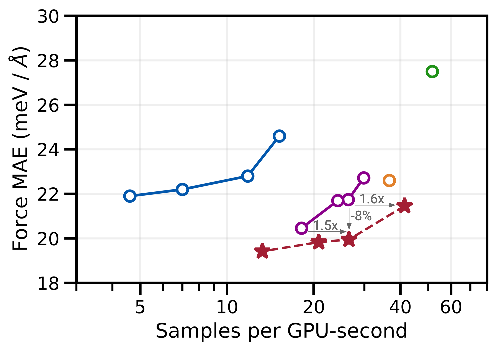
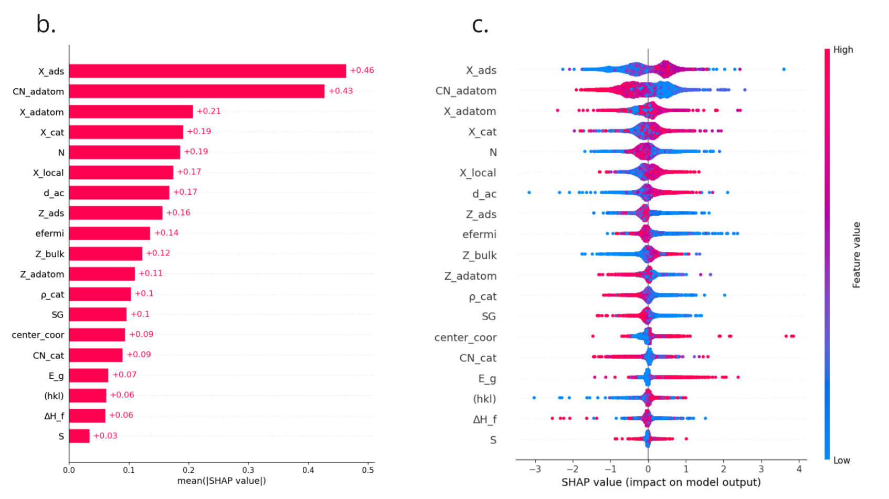
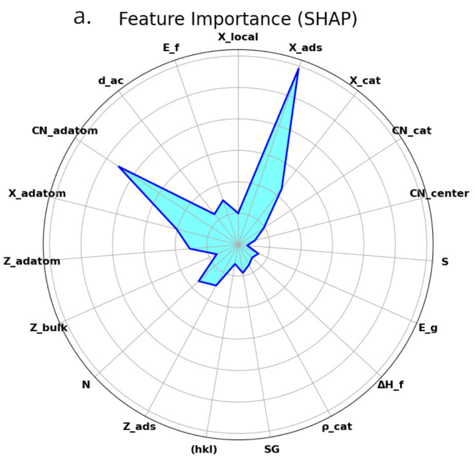

# 解釈可能な機械学習による表面吸着エネルギー予測と触媒設計

- 執筆日：2026-05-10
- トピック：解釈可能な機械学習による表面吸着エネルギー予測と触媒設計加速
- タグ：Computation and Theory / Thin Films and Interfaces; Surrogate Modeling / Machine Learning; First-Principles Calculations
- 注目論文：Meta-LegNet: A Transferable and Interpretable Framework for Surface Adsorption Prediction via Self-Defined Adsorption-Environment Learning (arXiv:2605.04102)
- 参照論文数：7

---

## 1. 背景：なぜ今この話題か

気候変動への対応が急務となった現代において、グリーン水素の製造、二酸化炭素の電気化学的還元（CO2還元反応、CO2RR）、窒素固定反応（NRR）など、持続可能なエネルギー変換を担う電気化学触媒の開発が世界的な焦点となっている。これらのプロセスでは、反応物がどの程度の強さで触媒表面に吸着するか——すなわち吸着エネルギー——が触媒性能を決定する最重要因子の一つである。

伝統的に、吸着エネルギーの計算は密度汎関数理論（DFT）によって行われてきた。DFT計算は高精度だが、一つの吸着配置あたり数十分から数時間の計算時間を要する。触媒材料の候補は金属、合金、酸化物など何万種にも及び、さらに各材料表面に対して多数の吸着サイト（中継ぎサイト、ブリッジサイト、ホローサイトなど）を検討しなければならないため、DFT単独でのハイスループットスクリーニングは現実的でない。

この計算ボトルネックを突破する手段として、グラフニューラルネットワーク（Graph Neural Network, GNN）をはじめとする機械学習手法が急速に普及してきた。特に、Facebook AI Research（現Meta AI）と Carnegie Mellon Universityが中心となって構築した Open Catalyst 2020（OC20）データセット [2] は、約128万件のDFT計算を含む大規模ベンチマークとして、分野全体のモデル開発の基準となっている。これを活用したAdsorbMLアルゴリズム [3] は、MLポテンシャルで候補構造を絞り込むことで従来比2000倍以上の高速化を達成した。

しかし、現状の機械学習モデルには二つの根本的課題が残されている。第一は**汎化性（transferability）**の問題である。あるデータセットで学習したモデルが、組成や構造が大きく異なる未知の触媒表面に適用したとき精度が急落する例は枚挙にいとまがない。第二は**解釈可能性（interpretability）**の問題である。深層学習モデルは多くの場合「ブラックボックス」として機能し、なぜある吸着サイトが安定なのか、どの局所化学環境が予測を駆動しているのかについて、人間が読み解ける説明を提供しない。

後者の問題は、単なる科学的好奇心にとどまらない。解釈不可能なモデルは、予測が物理的に意味のある根拠に基づいているのか、あるいはデータセット固有のバイアスを学習しているのかを区別できない。触媒設計においては、モデルが「なぜ」そのサイトを活性と予測するかを理解することで、初めて合理的な設計指針が得られる。

こうした背景のなかで、2026年5月に公開された Meta-LegNet [1] は、SE(3)等変グラフ学習、ボクセルベースのマルチスケール集約、クロスドメインメタ学習を組み合わせることで、転移可能かつ解釈可能な吸着エネルギー予測フレームワークを提案した。AI for Scienceの観点から見ると、この論文は「より良い予測」だけでなく「より良い理解」を同時に追求している点で、分野の一つの方向性を象徴している。

---

## 2. 未解決問題は何か

### 吸着サイト探索のスケーラビリティ問題

触媒スクリーニングの実務において、最も時間を食うステップの一つが「どこに吸着させるか」を決める吸着サイトの列挙と最適化である。通常、研究者はヒューリスティック（経験則）に基づいて候補サイトを提案し、それぞれについてMLポテンシャルを用いた構造緩和や、さらにはDFT再計算を実施する。しかし複雑な合金表面や欠陥を含む表面では、候補サイト数が爆発的に増加する。たとえばOC20データセットを用いたAdsorbML [3] では、一つの吸着物/表面ペアについて平均で100以上の候補構造を評価する。

より深い物理的問いとして、「吸着エネルギーを決定しているのは何原子スケールの局所環境なのか」という問題がある。d帯モデル（後述）では最近接原子の電子構造が主役だが、現実の複雑系ではより遠くの原子や格子歪み、表面ステップなどが有意な寄与をする。この階層性を機械学習がどこまで自動的に学習できるかは、いまだ明確でない。

解決に向けたアプローチとして、「サイト列挙なしで複数の吸着エネルギーを一度に予測する」方向性と、「吸着環境の局所特徴量を自動抽出して転移可能な表現を学習する」方向性が競合している。Meta-LegNetは後者のアプローチを採用し、局所吸着環境の「テンプレート」を学習することで、未見の表面でもサイト候補を提案できる戦略を取っている。

### 異種表面間でのモデル転移の壁

OC20で学習したモデルがOC22（酸化物系）でそのまま高精度を発揮しないことは、分野ではよく知られた事実である。これは単なる分布シフトの問題ではなく、異種の材料系（金属、合金、酸化物、2D材料、ナノクラスター）では吸着の物理機構そのものが異なることに起因する。金属表面ではd帯–吸着物相互作用が支配的だが、酸化物では表面のルイス酸・塩基サイトが鍵を握り、2D材料ではエッジ効果や歪みが重要になる。

したがって「一つのモデルで全材料系を扱う」万能型アプローチと、「少量のデータで新材料系に素早く適応する」Few-shotメタ学習アプローチのどちらが有効かは、重要な未解決問題となっている。Meta-LegNetはModel-Agnostic Meta-Learning（MAML）に着想を得たクロスドメインメタ学習を採用し、後者の方向性に賭けているが、その汎化の限界はまだ探索途中である。

### 機械学習モデルの解釈可能性と物理との整合

説明可能AI（XAI）の文脈では、SHAPやGrad-CAMなどの手法が事後的（post-hoc）にモデルの予測根拠を可視化するツールとして広く使われている。Vinchurkar らの先行研究 [6] は、OC20データに対してXAI解析を適用し、「吸着物の電気陰性度」「触媒の電気陰性度」「有効配位数」などの特徴量がSHAPで高い重要度を示すことを確認した。これらは物理的に既知のd帯モデルや電気陰性度則と整合しており、「モデルが物理を学習している」という一つの証拠となっている。

しかし事後的な解釈には限界がある。SHAPはモデルの挙動を線形近似するため、非線形な相互作用や高次の吸着物–表面結合の寄与を過小評価する可能性がある。また「原子スケールでどのサイトが重要か」という空間的な情報は、従来のSHAPでは捉えにくい。Meta-LegNetはこの課題に対し、GNN内部の局所–グローバル分解から直接「原子分解アトリビューションマップ」を生成するアーキテクチャ設計という解を提案している。「解釈可能性をモデルに内包する（intrinsic interpretability）」対「事後的に付加する（post-hoc interpretability）」という設計上の哲学的対立は、現在進行形の議論である。

---

## 3. 注目論文の概説

### Meta-LegNetの問い

Meta-LegNetが問うのは以下の点に集約される：「局所吸着環境を自動的に学習・定義する表現を設計することで、(1)異なる触媒–吸着物系をまたぐ転移可能なGNNを構築でき、(2)予測根拠となる吸着サイトを解釈可能な形で可視化でき、かつ(3)未知表面の吸着サイト候補を事前サイト列挙なしに提案できるか？」

### アーキテクチャ設計：三つの核心要素

**SE(3)等変メッセージパッシング**

Meta-LegNetの基幹は、SE(3)等変（3D空間の回転・並進に対して共変または不変な）グラフニューラルネットワークである。各原子ノードは不変なラジアル特徴量（原子間距離に基づく）と等変な方向情報（球面調和関数による角度表現）の両方でエンコードされる。これにより、分子や結晶を任意の向きに置いても予測が変わらない回転不変性と、力ベクトルなど方向性を持つ量の正確な変換が保証される。

数学的には、ノード $i$ の表現 $\mathbf{h}_i^{(l)}$ は次のように更新される：

$$\mathbf{h}_i^{(l+1)} = \text{Agg}\left(\left\{\phi\left(\mathbf{h}_i^{(l)}, \mathbf{h}_j^{(l)}, \mathbf{e}_{ij}\right) \mid j \in \mathcal{N}(i)\right\}\right)$$

ここで $\mathcal{N}(i)$ は原子 $i$ の近傍原子集合、$\mathbf{e}_{ij}$ は辺特徴量（原子間距離と方向の情報を含む）、$\phi$ はメッセージ関数、$\text{Agg}$ は集約関数である。SE(3)等変性の保証のために、球面調和関数展開した特徴量のテンソル積が使われる。

**ボクセルベースマルチスケール集約**

局所的なメッセージパッシングだけでは、吸着物から離れた表面領域（吸着に間接的に寄与する「リモート環境」）の情報を取り込むことが難しい。Meta-LegNetはこの問題を、吸着構造を3D格子（ボクセル）に分割したうえで階層的に集約する「ボクセルプーリング」で解決する。局所グラフ表現をボクセル空間に射影し、アップサンプリングとゲート付き特徴量融合（gated feature fusion）によって局所情報とグローバル構造情報を統合する。結果として生成される特徴量は、吸着結合点の直近（局所）と表面全体のコンテキスト（グローバル）の両方を反映する。

**クロスドメインメタ学習**

転移可能性を高めるため、Meta-LegNetはモデルが異なる材料系（0次元ナノクラスター、2次元材料、3次元バルク表面）にまたがってタスクを受け取り、少数のサンプルで適応できるようにメタ学習で事前学習する。これはModel-Agnostic Meta-Learning（MAML）の思想を継承しており、「初期パラメータを、素早い適応が可能な点に配置する」という原理に基づく。

メタ学習の目標は：

$$\theta^* = \arg\min_\theta \sum_{\mathcal{T}_i \sim p(\mathcal{T})} \mathcal{L}_{\mathcal{T}_i}\left(f_{\theta - \alpha \nabla_\theta \mathcal{L}_{\mathcal{T}_i}(f_\theta)}\right)$$

ここで $\mathcal{T}_i$ は各タスク（材料系）、$\theta$ はモデルパラメータ、$\alpha$ は内側ループの学習率である。各タスクで1〜2ステップの勾配更新を行った後、全タスクでの性能を外側ループで最適化することで、「どの材料系にも素早く適応できる汎用的な表現」が学習される。

### 解釈可能性：原子分解アトリビューションマップとSEAM

上記のアーキテクチャによる局所–グローバル分解は副産物として、各原子の吸着エネルギーへの寄与度を示す「原子分解アトリビューションマップ」を生成する。これにより、「どの表面原子が吸着を安定化しているか」「吸着物のどの原子が表面との相互作用の主役か」を可視化できる。

このアトリビューションシグナルをさらに処理することで、Meta-LegNetは「吸着環境データベース（Adsorption Environment Database）」を構築し、未知表面に対して類似環境をテンプレートマッチングで提案する「SEAM（Surface-Environment Assignment Matching）」戦略を実装する。SEAMにより、未知表面に対して網羅的なサイト列挙を行わずに、有望な吸着候補サイトを直接推薦できる。

### 主要結果

Meta-LegNetは0D（ナノクラスター）、2D（遷移金属ダイカルコゲナイドなど）、3D（OC20の金属/合金表面）の異種ベンチマーク全域において、従来の単一ドメイン学習モデルを上回る精度と汎化性を示した。とりわけ少数サンプル（few-shot）設定での性能改善が顕著で、新規材料系への迅速な適応という実用的価値を実証した。また原子分解アトリビューションマップの検証では、高い寄与として可視化された表面原子が、d帯中心や局所配位数といった物理的に意味のある記述子と高い相関を示すことが確認された。

---

## 4. 研究史における位置づけ

### d帯モデルから大規模データ駆動へ

表面吸着の理論的理解の礎となったのは、Hammer と Nørskov が1990年代に提唱した**d帯モデル**である。このモデルは、遷移金属表面への分子吸着において、表面のd帯中心（d-band center）$\epsilon_d$ が吸着エネルギーの主要な決定因子であることを示した：

$$E_{\text{ads}} \approx -\frac{2V_{ad}^2}{\epsilon_d - \epsilon_a}$$

ここで $V_{ad}$ は吸着物–表面間のカップリング行列要素、$\epsilon_a$ は吸着物の準位エネルギーである。このシンプルな式は、なぜ Pt や Pd が水素吸着に優れているか、あるいは表面張力がd帯中心をどうシフトさせるかを直感的に説明できる。

d帯モデルはさらに**線形スケーリング則（Linear Scaling Relations, LSR）**と**ブレンステッド–エバンス–ポランニー（BEP）関係**に発展し、吸着エネルギー同士や吸着エネルギーと活性化エネルギーの間の線形関係として触媒設計を大幅に単純化した。これらの関係が成り立てば、一つの吸着エネルギーを「触媒活性の記述子」として、それを最適化するだけで多段階反応全体を設計できる。火山型プロット（Volcano plot）はこの考え方の図的表現であり、Sabatier原理（強すぎず弱すぎない吸着が最適）に対応する。

### 機械学習による大規模スクリーニングへの転換

d帯モデルとLSRは強力だが、材料系や反応経路に依存する近似であり、複雑な合金・酸化物・2D材料では精度が低下する。また個々の材料の「例外」を捉えられない。

このギャップを埋めるため、2018年頃からGNNを用いたデータ駆動型の吸着エネルギー予測が急速に発展した。SchNet（2017）、DimeNet（2020）、GemNet（2021）、EquiformerV2（2023）[4] と続くアーキテクチャの進歩は、OC20の力誤差（MAE）を当初の~0.06 eV/Å から 0.009 eV/Å 程度まで大幅に改善した。EquiformerV2 [4] は等変Transformerにおける高次数球面調和関数の活用と注意再規格化などの工夫で、OC20での精度を前世代比9%改善し、速度–精度トレードオフでも優位を示した（図1）。

*図1: EquiformerV2（2306.12059）の速度–精度トレードオフ。横軸は推論時間、縦軸は力予測のMAEを示す。EquiformerV2は等変Transformerとして同等精度の他手法より大幅に高速なことが分かる。(arXiv:2306.12059, CC BY 4.0)*

AdsorbMLアルゴリズム [3] はこれらのGNNを活用した実用的な高速化戦略として2022年に提案され、MLポテンシャルで粗い構造緩和を行いDFT計算を必要な構造のみに絞ることで、同等精度でのDFT計算回数を87%削減することを示した。

### 解釈可能性への転回

一方、「GNNは何を学習しているのか」という問いへの関心も高まっている。Vinchurkar ら [6] はOC20データに対してXGBoostとニューラルネットワークを学習させ、SHAPによる事後解析でどの原子特徴量が予測に寄与しているかを可視化した（図2）。その結果、吸着物の電気陰性度、有効配位数、原子番号の合計などが上位の重要特徴量として現れ、これらは物理的に既知のd帯モデルや電気陰性度則と整合していた。さらに数値的に最もシンプルな有効関係式を Symbolic Regression によって導出しており、「吸着エネルギー ∝ 触媒電気陰性度の2乗」という解析的表現が得られている。

*図2: 吸着エネルギー予測に対するSHAP解析（2405.20397）。各特徴量の貢献度と方向性を示す。電気陰性度や配位数といった物理的に意味のある特徴量が上位に現れており、モデルが物理的な法則を学習していることを示唆する。(arXiv:2405.20397, CC BY 4.0)*

しかしこれらの事後的解釈は、入力特徴量（原子記述子）レベルの解釈にとどまる。「どの吸着サイトの局所的な3D幾何が安定化に寄与しているか」という空間的な解釈には、よりアーキテクチャと解釈可能性が統合されたアプローチが必要だった。この文脈でMeta-LegNet [1] は「アーキテクチャに解釈可能性を内包する」という方向に位置づけられる。

また3D位置情報の重要性という観点では、Lan ら [7] が「吸着物の相対位置情報なしで弛緩後エネルギーを予測しようとすると精度が著しく低下するが、注意機構を使えばある程度補完できる」という実験的事実を示している。これはMeta-LegNetが高次な3D等変情報と多スケール集約を取り入れる根拠の一つとなっている。

---

## 5. どの解釈が最も妥当か

### 局所吸着環境は転移可能か

Meta-LegNetの中心仮説は「局所吸着環境（吸着点周囲の数原子スケールの化学的・幾何学的特徴）は材料系を超えて転移可能なユニバーサルな記述子である」というものだ。この仮説を支える根拠は複数ある。

物理的には、d帯モデルがすでに示すように、吸着エネルギーは近傍原子（主に第1〜2近傍）の電子構造で支配される。化学的には、吸着物（OH、CO、H、NOxなど）の電子構造は材料系が変わっても基本的に同じであり、金属表面とのカップリング様式は「官能基の種類」+「局所環境の幾何」によって大きく類型化できる。Vinchurkarらの研究 [6] で電気陰性度が最重要特徴量として浮上したことも、局所電子環境の普遍性を示唆している。

一方で反論もある。高エントロピー合金（HEA）の表面では最近接原子の組み合わせが指数関数的に多様であり、「典型的な局所環境」が存在しないこともある。また酸化物や2D材料では、表面格子歪みや欠陥状態が「局所的でない」長距離効果をもたらすことがある。Meta-LegNetがボクセルベースのグローバル情報を取り入れているのはこの限界への対処だが、どこまで有効かはさらなる検証が必要だ。

### メタ学習は真に汎化に有効か

クロスドメインメタ学習の有効性については、分子化学の文脈での先行研究に両論がある。一般論として、MAMLは「タスク間に共通した潜在的特徴量が存在する」場合に有効であり、タスクが根本的に異なる物理機構に基づく場合は過学習のリスクがある。0D・2D・3D材料系を「共通した局所環境」という仮定でつなぐMeta-LegNetの戦略は物理的に妥当に見えるが、学習ドメインに含まれないまったく新奇な材料系（例えばMXene、高エントロピー酸化物、ペロブスカイト系）への適用性は未検証部分が多い。

### アトリビューションマップの信頼性

原子分解アトリビューションマップが「物理的に意味のある情報を捉えているか」という問いに対しては、Meta-LegNetは定性的な検証を提供しているが、定量的な独立検証はまだ少ない。比較指標としては、d帯中心の空間分布との相関、アムストロング表面原子置換実験（一原子を変えたときの吸着エネルギー変化）との比較、Bader電荷解析との対比などが今後の重要な検証となろう。

*図3: 複数の吸着エネルギー予測モデルのレーダーチャート比較（2405.20397）。予測精度・解釈可能性・汎化性・計算コストなど複数軸での評価を示す。モデル選択においては単一指標だけでなく多面的な評価が重要であることが分かる。(arXiv:2405.20397, CC BY 4.0)*

Local Environment Residual Network（LERN）[5] は、類似した「局所環境」の概念を用いながらより軽量なアーキテクチャを採用し、転移可能性とデータ効率を実証した。Meta-LegNetとLERNの比較は「アーキテクチャの複雑さと汎化性のトレードオフ」という重要な問いを提起する。現時点では、Meta-LegNetが複雑な材料系や少数サンプル設定でLERNを上回ると示されているが、計算コストの差は大きく、実用的な材料スクリーニングでの選択は目的によって変わる。

---

## 6. 何が一般化できるか

### 他の表面特性・現象への展開

Meta-LegNetのフレームワーク（等変GNN + マルチスケール集約 + メタ学習 + アトリビューションマップ）は、吸着エネルギーという単一の量の予測に特化して設計されているが、その枠組みは他の表面特性にも自然に適用可能である。

表面エネルギー（cleavage energy）の予測、界面結合エネルギー、表面拡散バリア、吸着物のゼロ点エネルギー補正など、局所原子環境が鍵を握る多くの量に適用できる。また多吸着物系（coverage effects）の記述においても、局所環境の表現が吸着物–吸着物相互作用を組み込む形で拡張できる可能性がある。

### 他の材料探索タスクへの接続

触媒スクリーニングから一歩引いて見ると、「局所環境の転移可能な表現を学習する」というアイデアは、固体中の欠陥エネルギー、界面の接着強度、ガラスの局所構造と弛緩動力学など、広く「局所構造が性質を決める」材料問題に適用可能である。

Meta-LegNetのSEAM（Surface-Environment Assignment Matching）はいわば「局所構造の逆引き辞典」の構築であり、これは結晶構造データベースを用いた逆設計や、材料の局所構造から大域特性を推論する研究と連続している。

### 解釈可能AIとしての設計原理

AI for Scienceの観点から最も重要な含意は、「解釈可能性をアーキテクチャに内包した設計」のパラダイムである。これはLLMのアテンション可視化、物理インフォームドニューラルネットワーク（PINN）の支配方程式への準拠、グラフニューラルネットワークの等変性の保証といった「物理的対称性や解釈可能性をアーキテクチャレベルで強制する」トレンドと連続している。

この考え方は「まず高精度を追求し、後から解釈を付加する」従来のブラックボックスアプローチと対照的である。触媒設計のような高リスク・高コストの材料探索では、モデルが物理的に整合した理由で予測を行っているという信頼性（trustworthiness）が、単なる精度指標と同等以上に重要になる。

---

## 7. 基礎から理解する

### 表面と吸着：物理化学の基本

**固体表面とは何か**

固体結晶の表面は、バルク（内部）とは本質的に異なる電子・原子構造を持つ。バルクでは各原子が最大限の近傍原子に囲まれて安定しているが、表面原子は隣接原子の一部が失われた「配位不飽和」状態にある。この不満足な結合状態が表面エネルギーを生み出し、気体分子を吸着しようとする駆動力となる。

固体表面を記述するために、ミラー指数（Miller indices）で結晶面の方位を指定する慣習がある。例えば面心立方（FCC）金属のCu(111)、Cu(110)、Cu(100)は、それぞれ原子密度の高い密充填面、段差状の面、正方格子面を表し、吸着特性が異なる。

**吸着とは何か**

気体分子が固体表面に付着する現象を吸着（adsorption）という。物理吸着（physisorption）は主にファンデルワールス力による弱い相互作用（数十meV〜数百meV）であり、分子の電子構造をほとんど変えない。化学吸着（chemisorption）は共有結合性の電子の再配置を伴う強い相互作用（数百meV〜数eV）であり、触媒反応において重要な役割を担う。

吸着エネルギー $E_{\text{ads}}$ は通常：

$$E_{\text{ads}} = E_{\text{slab+ads}} - E_{\text{slab}} - E_{\text{ads,gas}}$$

と定義される。ここで $E_{\text{slab+ads}}$ は吸着物が結合したスラブ（表面を模した多層の結晶片）の総エネルギー、$E_{\text{slab}}$ はスラブ単体のエネルギー、$E_{\text{ads,gas}}$ は気相中の吸着物単体のエネルギーである。$E_{\text{ads}} < 0$ であれば吸着は発熱的（エネルギー的に有利）である。

**Sabatier原理と火山型プロット**

触媒活性と吸着エネルギーの関係を理解するうえで、**Sabatier原理**は最も重要な概念の一つである：「最適な触媒は、反応物を中程度の強さで吸着しなければならない」。

弱すぎる吸着では反応物が活性化されずに反応が起きない。強すぎる吸着では反応中間体が表面に張り付いて離れず、次のサイクルに進めない。この二つの限界の間に「最適な吸着強度」が存在し、触媒活性（ターンオーバー頻度、TOF）を吸着エネルギーに対してプロットすると火山（Volcano）型の曲線が現れる。

例えば水素発生反応（HER）では、Ptが火山の頂点付近に位置し、最も優れた触媒の一つであることが知られている。Ptより弱く吸着するAuやAgは活性が低く、より強く吸着するNiやFeも活性が低い。

### 密度汎関数理論（DFT）の基礎

触媒計算の理論的基盤は**密度汎関数理論（DFT）**である。DFTは多電子シュレーディンガー方程式を解く代わりに、電子密度 $n(\mathbf{r})$ を基本変数として電子エネルギーを計算する理論的枠組みである。

Hohenberg–Kohnの定理により、系の基底状態エネルギーは電子密度の汎関数として一意に決まる：

$$E = E[n(\mathbf{r})]$$

Kohn–Sham方程式はこれを独立した単電子方程式の形に変換し：

$$\left[-\frac{\hbar^2}{2m}\nabla^2 + V_{\text{eff}}(\mathbf{r})\right]\psi_i(\mathbf{r}) = \varepsilon_i \psi_i(\mathbf{r})$$

ここで $V_{\text{eff}}$ は外部ポテンシャル、ハートリーポテンシャル、交換相関ポテンシャルの和である。交換相関ポテンシャルには厳密な表現がなく、局所密度近似（LDA）や一般化勾配近似（GGA、特にPBE）などの近似汎関数が使われる。

DFTの精度は触媒系の吸着エネルギー計算において通常0.1〜0.3 eV程度の系統誤差があるが、相対的な比較（あるSite vs. 別のSite、ある材料 vs. 別の材料）には十分有用であり、触媒スクリーニングの「標準」手法として確立されている。

### グラフニューラルネットワーク（GNN）の基礎

**グラフとしての分子・結晶表現**

結晶や分子をグラフとして表現するアイデアは直感的である：原子をノード（頂点）、原子間結合または近距離相互作用（カットオフ半径内の原子ペア）を辺（エッジ）としてグラフを構築する。各ノードには原子番号、各辺には原子間距離などの情報が付与される。

GNNはこのグラフを入力とし、メッセージパッシング（message passing）と呼ばれる手続きを繰り返す：

1. 各ノードが隣接ノードの情報を受け取り（aggregation）
2. 受け取った情報と自身の情報を組み合わせてノード表現を更新（update）
3. これを $L$ 層繰り返すことで、$L$ 近傍まで（$L$ ホップ先の原子まで）の情報が伝播する

最終的にすべてのノード表現を集約（readout）して、材料全体の特性（バンドギャップ、吸着エネルギーなど）を予測する。

**SE(3)等変性とは何か**

SE(3)は3次元空間の剛体変換（回転＋並進）を表す数学的群である。「SE(3)等変なGNN」とは、入力構造を任意に回転・並進させたとき、スカラー量（エネルギーなど）の予測は変わらず（不変）、ベクトル量（力など）の予測は同じ変換を受ける（共変）ように設計されたモデルである。

この性質は物理的には自明に必要である：同じ分子を向きを変えて置いてもエネルギーは変わらないはずだ。しかし単純なGNNは距離情報だけを使うため、角度（3体相互作用）や二面角（4体相互作用）の情報が失われる。

SE(3)等変性を保証するために、球面調和関数（Spherical Harmonics）の展開を用いる。原子 $j$ から原子 $i$ へのベクトル $\hat{\mathbf{r}}_{ij}$ を球面調和関数で展開すると：

$$\hat{\mathbf{r}}_{ij} \to \{Y_l^m(\hat{\mathbf{r}}_{ij})\}_{l=0}^{L_{\max}, m=-l}^{l}$$

次数 $l$ は「角度分解能」を表し、$l=0$ はスカラー（不変量）、$l=1$ はベクトル（一次の等変量）、$l=2$ は行列（二次の等変量）に対応する。高次数の展開（大きな $L_{\max}$）を使うほど角度情報を細かく捉えられるが、計算コストは急増する。EquiformerV2はこの高次展開の効率化が主な貢献の一つである。

**メッセージパッシングの直感的理解**

GNNの動作を直感的に理解するために、「原子が互いに手紙を送り合う」というアナロジーが有用だ。各原子（ノード）は初期状態として「自分が何の原子か」という情報（原子番号など）を持つ。各ステップで、各原子は隣接する原子からの「手紙（メッセージ）」を受け取り、自身の表現を更新する。

1ステップ後：各原子は直接の隣人の情報を知っている（1体配位環境）
2ステップ後：各原子は隣人の隣人まで知っている（2近傍）
$L$ ステップ後：$L$ ホップ先の原子まで情報が伝わる

吸着エネルギーのような局所的な性質には比較的少ない層数（3〜5層）で十分なことが多いが、バンドギャップのような長距離相関を伴う性質にはより深いネットワークが必要となる。

### メタ学習の基礎

**メタ学習とはなにか**

「タスクを学習する方法を学習する（learning to learn）」がメタ学習の核心である。通常の機械学習では一つのタスク（例：OC20の吸着エネルギー予測）のみを最適化するのに対し、メタ学習では複数のタスク（0D、2D、3Dの各材料系など）から「初期化パラメータ」を最適化し、新たなタスクへ最小限のデータと勾配更新で素早く適応できるモデルを構築する。

MAML（Model-Agnostic Meta-Learning）では2レベルの最適化（二重ループ最適化）が行われる。**内側ループ**では、各タスクのサポートセット（少数データ）で少数の勾配ステップを実行し、タスク固有のパラメータ $\theta'_i = \theta - \alpha \nabla_\theta \mathcal{L}_i(\theta)$ を求める。**外側ループ**では、全タスクのクエリセットでの損失の和を最小化するように初期パラメータ $\theta$ を更新する。

このプロセスで $\theta$ は「どのタスクに対しても数ステップの勾配で良い解に到達できる場所」に収束する。材料科学の文脈では「この初期化から出発すれば、どの材料系の吸着エネルギーも少数のデータで予測できる」という汎用モデルが得られる。

**属性マップとアテンション機構**

アーキテクチャに解釈可能性を組み込む代表的な手法の一つがアテンション機構（attention mechanism）である。GNNにおいて、原子 $j$ から原子 $i$ へのメッセージパッシングに重み係数（アテンションウェイト）$\alpha_{ij}$ を付与し、これを予測可能にすることで「どの原子ペアの相互作用が重要か」を直接読み取れる。

$$\mathbf{h}_i^{(l+1)} = \sum_{j \in \mathcal{N}(i)} \alpha_{ij} \cdot \phi\left(\mathbf{h}_i^{(l)}, \mathbf{h}_j^{(l)}, \mathbf{e}_{ij}\right)$$

Meta-LegNetは局所–グローバル分解の構造から自然に「各原子の吸着エネルギーへの寄与度」が計算されるよう設計されており、これが原子分解アトリビューションマップとなる。

---

## 8. 専門用語の解説

**1. 吸着エネルギー（Adsorption Energy）**

気体分子が固体表面に結合したときのエネルギー変化。$E_{\text{ads}} = E_{\text{slab+ads}} - E_{\text{slab}} - E_{\text{ads,gas}}$ で定義され、負の値ほど安定な吸着を意味する。触媒活性の最重要記述子の一つであり、Sabatier原理により最適値（強すぎず弱すぎない値）が存在する。Meta-LegNetはこの量を高精度かつ解釈可能に予測することを目的としている。

**2. SE(3)等変性（SE(3)-Equivariance）**

3次元空間の回転・並進変換（Euclidean群）に対する共変性・不変性の性質。等変なGNNは、分子を任意の向きで入力しても物理的に正しい予測を出力する。スカラー量（エネルギー）については「不変」、ベクトル量（力）については「同じ回転を受ける」という形で等変性が定義される。球面調和関数テンソル積を用いたメッセージパッシングにより実現される。

**3. メッセージパッシング（Message Passing）**

GNNにおけるグラフ上の情報伝播メカニズム。各ノード（原子）が隣接ノードから「メッセージ」を受け取り、自身の表現ベクトルを更新することを繰り返す。$L$ 回繰り返せば $L$ 近傍の情報が集約される。この操作は従来の対称関数（Behler-Parrinelloなど）に比べ、端点–端点微分可能であり、GPU並列化にも適している。

**4. メタ学習（Meta-Learning）**

「タスクを学習する方法を学習する」パラダイム。MAMLなどの手法では、複数のタスクから「少数データで素早く適応できる初期パラメータ」を学習する。材料科学では異種材料系を「タスク」とみなし、汎化性の高い吸着エネルギー予測モデルを構築するために活用されている。Meta-LegNetの転移可能性の核心技術。

**5. 局所吸着環境（Local Adsorption Environment）**

吸着物が結合している表面サイトの周囲、数Å以内の原子配置・組成・幾何の情報。吸着エネルギーはこの局所環境によって主に決定されると考えられている（d帯モデルの示唆）。Meta-LegNetはこの概念を機械学習で自動的に定義・学習することで「自己定義型吸着環境表現」を構築している。

**6. 原子分解アトリビューションマップ（Atom-resolved Attribution Map）**

GNNの予測において、各原子が最終的な吸着エネルギー予測にどれだけ寄与しているかを空間的に可視化したもの。Meta-LegNetの局所–グローバル分解から自然に生成されるこのマップは、「どのサイト原子が吸着を安定化しているか」を解釈可能な形で提示する。事後的なSHAPとは異なり、アーキテクチャに内包された「本質的な解釈可能性」の産物である。

**7. SEAM（Surface-Environment Assignment Matching）**

Meta-LegNetが提案する、未知表面への吸着サイト候補提案戦略。アトリビューションマップから抽出した局所吸着環境を「テンプレート」としてデータベース化し、新規表面の局所構造とマッチングさせることで、網羅的なサイト列挙なしに有望な吸着候補を提示する。吸着エネルギー計算の効率化において重要な革新点。

**8. d帯モデル（d-band Model）**

Hammer と Nørskov によって提案された、遷移金属表面への吸着エネルギーを記述する理論モデル。d帯中心 $\epsilon_d$ が表面の主要な記述子であり、吸着エネルギーは $E_{\text{ads}} \approx -2V_{ad}^2/(\epsilon_d - \epsilon_a)$ で近似される。表面格子定数、合金組成、表面方位によってd帯中心がシフトし、吸着強度が変化するというシンプルかつ強力な物理描像を与える。Meta-LegNetの解釈可能性の検証基準としても機能している。

**9. ボクセルプーリング（Voxel Pooling）**

3D空間を規則的な立方体格子（ボクセル）に分割し、各格子に含まれる原子表現を集約する操作。ポイントクラウドの処理に使われる手法（PointNet++など）に着想を得ており、GNNによる局所表現とボクセルによるグローバル表現を橋渡しする。Meta-LegNetでは、原子レベルのメッセージパッシング（局所）とボクセルレベルの集約（グローバル）を組み合わせてマルチスケール表現を実現する。

**10. OC20データセット（Open Catalyst 2020）**

Meta AI（Facebook AI Research）とCMUが公開した、触媒向けMLの標準ベンチマークデータセット。約82種類の吸着物と55種類の触媒材料の組み合わせから生成されたDFT計算結果約128万件を含む。エネルギー・力・弛緩構造の予測タスクが設定されており、GNNモデルの性能比較の共通基準として分野で広く採用されている。EquiformerV2やAdsorbMLもこのデータセットで評価されている。

---

## 9. 将来展望

Meta-LegNetの登場により、触媒計算における機械学習モデルの方向性として「精度の追求」と「解釈可能性の追求」を同時に実現するアーキテクチャ設計の有効性がかなり確からしくなった。局所吸着環境という物理的に意味のある単位を自動的に学習・定義し、それを転移可能な表現として活用するという戦略は、d帯モデル以来の「物理モデルに基づく設計原理」を機械学習の柔軟性と統合する道筋として説得力がある。原子分解アトリビューションマップがd帯中心や配位数などの物理記述子と定性的に整合していることは、モデルが単なるデータ丸暗記ではなく物理的意味を捉えていることの有力な証拠と言えよう。

しかし重要な未確定事項も多い。第一に、Meta-LegNetのメタ学習が0D/2D/3Dという材料次元の違いを超えて汎化できることを示したが、学習ドメインにまったく含まれない新材料系（例：MXene、高エントロピー酸化物、ペロブスカイト型複合酸化物）への適用では予測精度が急落する可能性がある。第二に、多吸着物系（coverage effect）や有限温度・溶媒効果への拡張は未実施であり、実際の電気化学環境の再現という観点ではまだ大きなギャップがある。第三に、原子分解アトリビューションマップの信頼性を独立な実験（同位体置換、単原子置換実験、HAADF-STEM観察と組み合わせた局所電子構造解析など）で検証する研究が不足している。

今後特に重要になる方向として以下が挙げられる。（1）OC25データセット（2025年公開、明示的な溶媒環境を含む）への適用：液体–固体界面の電気化学反応を記述できるかが試される。（2）マルチフィデリティ学習との融合：低精度のGNN-MLIPs、中精度のDFT-GGA、高精度のハイブリッドDFTを組み合わせた能動学習ループへのMeta-LegNetの組み込み。（3）「AIが提案したサイトを実験で検証するクローズドループ」の構築：STM/STSによる吸着配置の実空間観察、XASによる局所電子構造の実験計測と、Meta-LegNetのアトリビューションマップの定量的比較が、機械学習モデルの物理的妥当性を確立するうえで決定的な実験となろう。

---

## 参考論文一覧

1. **[Meta-LegNet: A Transferable and Interpretable Framework for Surface Adsorption Prediction via Self-Defined Adsorption-Environment Learning](https://arxiv.org/abs/2605.04102)**
   (arXiv:2605.04102, cond-mat.mtrl-sci, 2026)
   SE(3)等変GNN・ボクセルマルチスケール集約・クロスドメインメタ学習を統合し、解釈可能な局所吸着環境表現を自動学習するフレームワーク（本記事の注目論文）。

2. **[The Open Catalyst 2020 (OC20) Dataset and Community Challenges](https://arxiv.org/abs/2010.09990)**
   (arXiv:2010.09990, 2020)
   約128万件のDFT計算を含む触媒ML標準ベンチマーク。エネルギー・力・弛緩構造予測タスクが設定され、分野全体のモデル開発の基準となっている。

3. **[AdsorbML: A Leap in Efficiency for Adsorption Energy Calculations using Generalizable Machine Learning Potentials](https://arxiv.org/abs/2211.16486)**
   (arXiv:2211.16486, 2022)
   MLポテンシャルで候補構造を絞りDFT計算を最小化することで吸着エネルギー計算を最大2000倍高速化した実用的アルゴリズム。

4. **[EquiformerV2: Improved Equivariant Transformer for Scaling to Higher-Degree Representations](https://arxiv.org/abs/2306.12059)**
   (arXiv:2306.12059, 2023)
   高次数球面調和関数展開、注意再規格化、分離可能S²活性化などの工夫でOC20精度を前世代比9%改善した等変Transformerアーキテクチャ。

5. **[Local environment-based machine learning for molecular adsorption energy prediction](https://arxiv.org/abs/2311.11364)**
   (arXiv:2311.11364, 2023)
   局所環境ResNetを用いた軽量な吸着エネルギー予測モデル。転移可能性とデータ効率を実証し、Meta-LegNetの比較対象として重要な先行研究。

6. **[Explainable Data-driven Modeling of Adsorption Energy in Heterogeneous Catalysis](https://arxiv.org/abs/2405.20397)**
   (arXiv:2405.20397, 2024)
   OC20データに対してSHAPとSymbolic Regressionを適用し、吸着エネルギーを支配する特徴量（電気陰性度、配位数など）と解析的関係式を導出したXAI研究。

7. **[On the importance of catalyst-adsorbate 3D interactions for relaxed energy predictions](https://arxiv.org/abs/2310.06682)**
   (arXiv:2310.06682, 2023)
   吸着物の3次元位置情報を除いた場合の精度低下を定量化し、注意機構による補完の可能性を探った研究。Meta-LegNetが3D等変情報を重視する根拠を与える。
