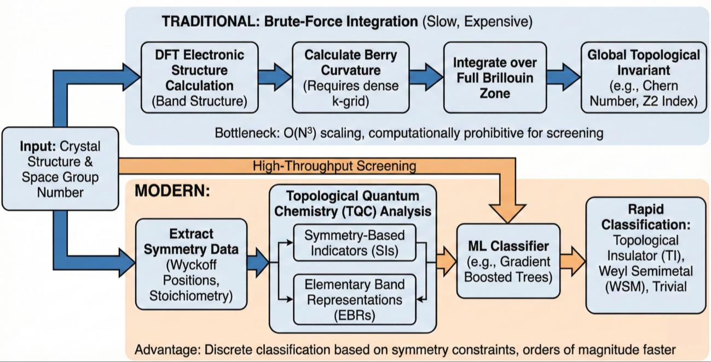
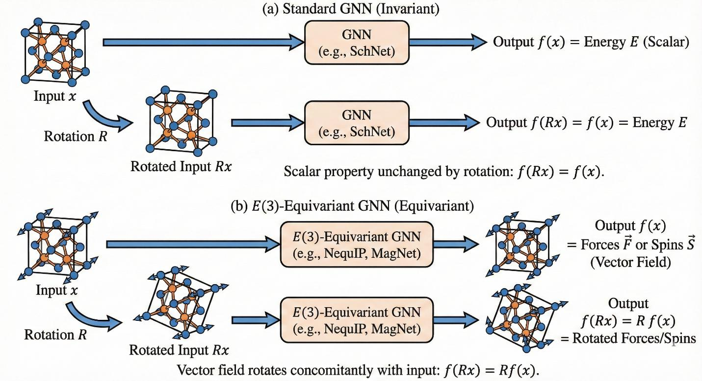
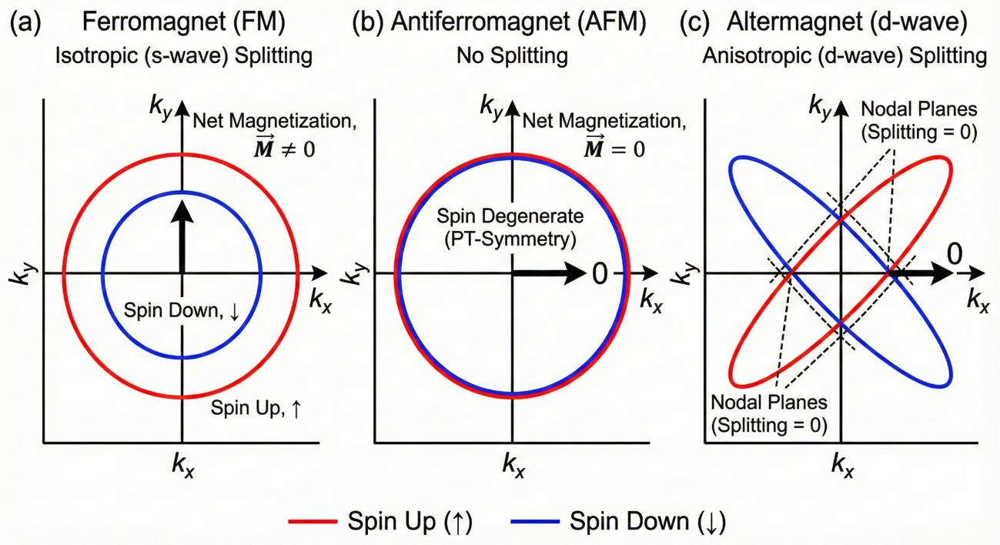
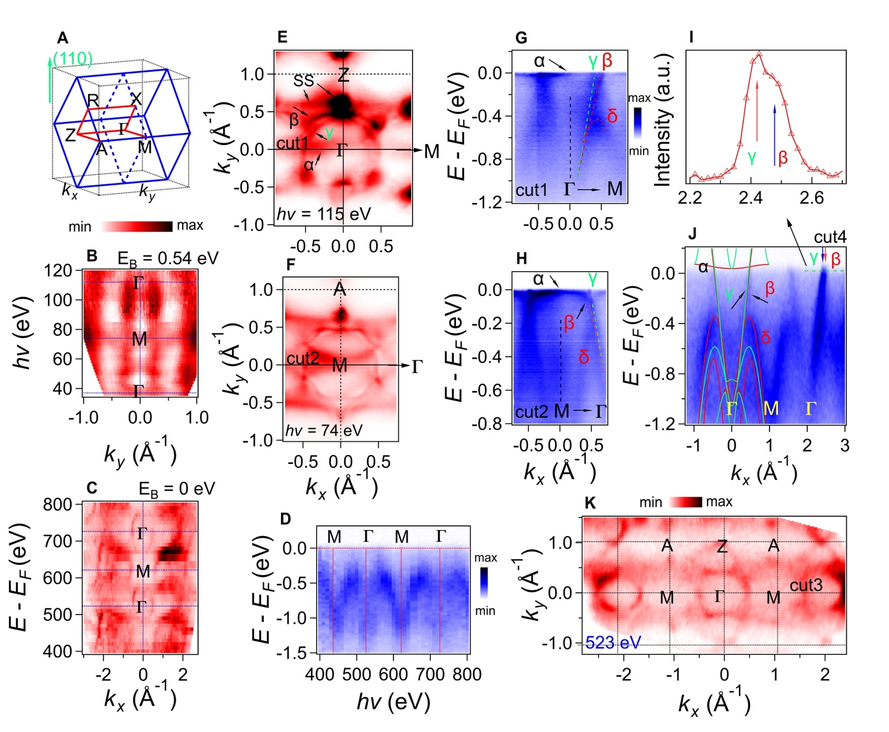
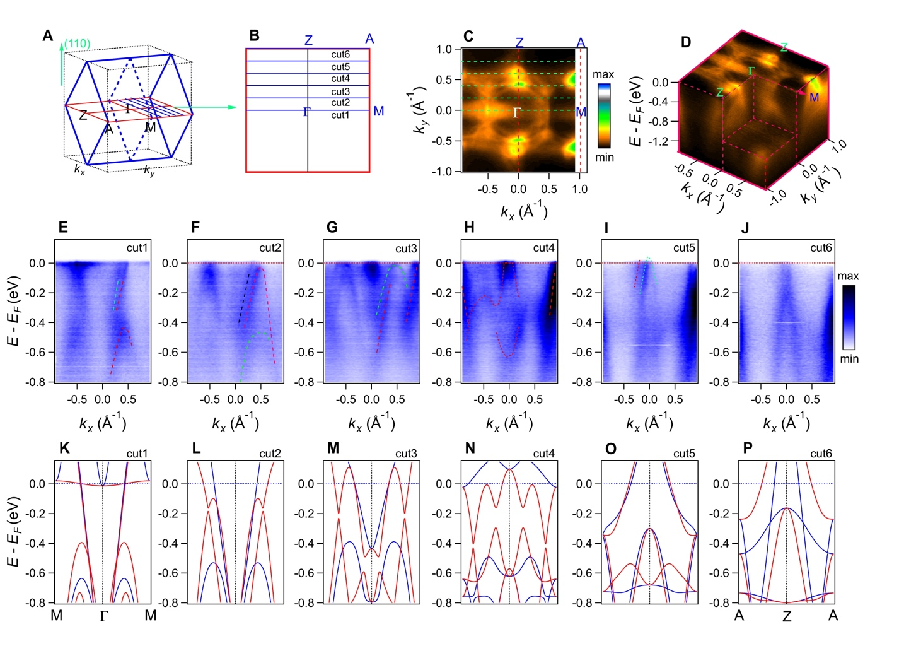

# 等変グラフニューラルネットワークによるトポロジカル相と交替磁性の自動発見

- 執筆日：2026年5月14日
- トピック：対称性に基づく深層学習が量子物質の未開拓相を体系的に探索する
- タグ：Computation and Theory / Topological Properties; Magnetism and Spin / Machine Learning; First-Principles Calculations
- 注目論文：[Machine Learning and Deep Learning in Quantum Materials: Symmetry, Topology, and the Rise of Altermagnets](https://arxiv.org/abs/2604.15985)（Hassani-Vasmejani et al., arXiv:2604.15985, 2026）
- 参照論文数：7

---

## 1. 背景：なぜ今この話題か

量子材料（quantum materials）の研究は、トポロジカル絶縁体・非慣習的超伝導体・スピン液体など、従来の分類を超えたエキゾチックな物質相の探索を中心に急速に展開している。これらの物質が示すロバストなエッジ状態、コヒーレントな量子輸送、非慣習的な磁気秩序などは、次世代の量子デバイスや情報技術への応用として期待されており、新物質の系統的探索に向けた国際的な競争が加速している。

しかしその探索を担ってきた第一原理計算、特に密度汎関数理論（Density Functional Theory, DFT）は、計算コストがシステムサイズ $N$ に対して $\mathcal{O}(N^3)$ でスケールするという根本的な制約を抱えている。数十から数百原子を含む磁性体・界面系における膨大な構造探索はほぼ不可能であり、考えうる化学空間（chemical space）は $10^{23}$ 程度にも上ると推計されている。DFTの計算コストに加えて、磁性系ではスピン分極した基底状態の探索、Hubbard U パラメータの調整、スピン軌道相互作用（SOC）を含む完全相対論的計算など、さらなる計算の壁が立ちはだかる。

こうした背景から、機械学習（Machine Learning, ML）および深層学習（Deep Learning, DL）が、DFTで計算された少量の訓練データから材料の物性を高速に予測するエミュレーターとして台頭した。特に2020年代に入り、タンパク質構造予測における AlphaFold の成功（2021）がML手法の潜在能力を広く示し、材料科学においても同様の革新を目指す動きが活発化した。Materials Project（15万件以上の構造データ）、AFLOWLIB、AFLOW-ML など高スループット計算データベースの急速な拡充も、ML材料探索の現実的な基盤となっている。

ここで特に重要な問題が、「物質の結晶対称性をニューラルネットワークにどう組み込むか」である。従来の記述子ベースのMLモデルは、SOAP（Smooth Overlap of Atomic Positions）・クーロン行列・組成加重記述子など手工芸的な記述子によって材料を表現していたが、これらは原子の幾何学的配置に対して厳密な等変性（equivariance）を保証しない場合が多く、トポロジーや磁性のような対称性に敏感な物性の予測には根本的な限界があった。

このような背景から、E(3)等変グラフニューラルネットワーク（Equivariant Graph Neural Network, EGNN）が近年急速に注目を集めている。2024〜2026年にかけて、EGNNを用いた量子材料のトポロジカル相の自動分類および交替磁性体（altermagnet）の網羅的発見という二つのフロンティアが急速に開拓されつつある。本記事では、この潮流を正面から論じたレビュー論文 arXiv:2604.15985 を軸に、これらの進展が何を意味し、何が残された課題かを考察する。

*図1：量子材料探索におけるML手法の全体像。DFTで計算された大規模データベースを訓練データとし、E(3)等変グラフニューラルネットワークが結晶構造からトポロジカル特性・磁性を予測する（arXiv:2604.15985より、CC BY 4.0）*

---

## 2. 未解決問題は何か

### 対称性の機械学習への組み込み方

結晶材料のML予測において最も根本的な問いのひとつは、「物質の空間群対称性をニューラルネットワークにどう組み込むか」である。材料の物性は、結晶格子の並進対称性・回転対称性・反転対称性などによって本質的に制約されており、対称性を無視したMLモデルは物理的に不正確な予測を行う。たとえばエネルギーは結晶の並進や回転に対して不変（invariant）でなければならないが、力は回転に対して等変（equivariant）でなければならない。記述子ベースの古典的アプローチは不変量を構築することで前者を満たしてきたが、後者の等変性を自然に保証する方法は長らく確立されていなかった。

この問題に対する現在最有力な解答が、SO(3)あるいはE(3)対称性を持つ等変ニューラルネットワークである。これらは不可約表現（irreducible representation, irrep）の理論を利用し、球面調和関数 $Y_l^m(\hat{\mathbf{r}})$ を基底として特徴量を展開することで、回転変換に対して正しく変換する量を扱う。しかしどの次数 $l$ まで展開すれば十分か、計算コストと精度のトレードオフはどこにあるか、という問いはまだ研究途上である。特にトポロジカル物性や磁性のように高次の対称性破れが重要な系では、高次の irrep（$l \geq 2$）が不可欠と考えられているが、その検証は限られている。

また、230種の非磁性空間群に加えて、磁性体では時間反転操作 $T$ を含む1651種の磁気空間群への対応が必要である。現在の等変GNNの多くは非磁性系を想定して設計されており、磁気対称性の等変表現の実装は非自明な課題である。さらにスピンと格子を完全に分離して扱う「スピン空間群」（spin space group）という概念まで考慮すると、必要な対称性の次元は大幅に広がる。

### トポロジカル相の自動分類

第二の根本問題は、「バンド構造の全計算なしにトポロジカル相を同定できるか」である。従来のアプローチでは、各材料に対してDFTでバンド構造を計算し、Z_2トポロジカル不変量やチャーン数を数値積分で求める必要があった。これは膨大な計算コストを要する。

近年、対称指標（symmetry indicator）と初等バンド表現（elementary band representation, EBR）という概念を利用し、バンド構造の全計算を省略して結晶対称性だけからトポロジーを診断する理論的手法が確立された（Topological Quantum Chemistry, TQC）。この枠組みをMLと組み合わせることで、大規模スクリーニングが可能になりつつある。しかし、対称指標では識別できない「fragile topology」や「obstructed atomic limit」など、より微細なトポロジカル相への対応は依然課題である。また、磁気秩序と絡み合った磁気トポロジカル絶縁体の分類は、非磁性系よりも格段に難しく、磁気空間群への対応が求められる。

### 交替磁性体の体系的発見

第三の問いは、「交替磁性という新たな磁気秩序のクラスをどのように網羅的に見つけるか」である。交替磁性（altermagnetism）は2022年にŠmejkálらによって提唱された磁気秩序の第三のカテゴリーであり、強磁性（ferromagnetism）と反強磁性（antiferromagnetism）のどちらとも異なる。交替磁性体は正味の磁化がゼロ（反強磁性的）でありながら、非相対論的な対称性破れによってスピン分裂したバンド構造（強磁性的）を持つという、一見矛盾した性質を示す。

このクラスの材料を伝統的な手作業で探すことは困難であり、結晶対称性とスピン構造を同時に考慮したAI探索エンジンの役割が大きい。しかし、どのような機械学習的表現が交替磁性の本質（磁気点群の特定の不変量）を捉えられるかという問いは、まだ完全には解決されていない。また、実験的に確認された交替磁性体がまだ少なく、訓練データの不足や正解ラベルの曖昧さという問題も残る。RuO2のように理論・実験の間で議論が続く系の存在は、ラベルの信頼性という根本的な問題を提起している。

### 解釈可能性とブラックボックス問題

第四の問題は、MLモデルが何を「学んでいるか」の解釈可能性である。深層ニューラルネットワークはブラックボックスであり、高精度な予測をしても、その根拠となる物理原理を人間が理解できる形で提示しない。これは科学的発見ツールとして致命的な限界でありうる。象徴回帰（symbolic regression）や注意機構（attention mechanism）の可視化によって、モデルの予測を解釈する試みが始まっているが、量子材料の複雑な物理を完全に解釈できるフレームワークはまだない。解釈可能性は「AIによる発見」から「AIとともに理解する」への転換に不可欠な要素である。

---

## 3. 注目論文の概説

### 研究の目的と対象

Hassani-Vasmejani, Alavi-Rad, Tagani（arXiv:2604.15985, 2026）のレビュー論文は、凝縮系物理における機械学習・深層学習の現在地を整理し、特に量子材料の探索に特化したML手法の系統的な批評を行っている。対象は「量子材料」全般であるが、焦点は（1）E(3)等変グラフニューラルネットワークによる構造・物性予測、（2）対称性指標を利用したトポロジカル相の自動同定、（3）AIによる交替磁性体の網羅的発見、の三つに絞られる。

本論文自体は新しい計算結果を報告するものではなく、2021〜2026年の約5年間に発表された主要論文を批判的に整理したレビューである。30ページ・8図という構成で、記述子ベースの古典的アプローチから最新の等変深層学習まで、材料MLの全体像を体系的に捉えた点が特徴である。

### 記述子ベースからE(3)等変GNNへの転換

論文がまず論じるのは、材料MLにおける表現論（representation learning）の進化である。初期の手法は、クーロン行列（Coulomb matrix）やSine行列、SOAP記述子など、化学的・幾何学的情報を固定の形式にエンコードした記述子を用いていた。これらは実装が簡単で、ランダムフォレストや勾配ブースティングとの組み合わせで良好な結果を示したが、対称性の扱いが不完全で、トポロジーや磁気秩序といった精細な量子効果の予測には限界があった。

転換点となったのは、SE(3)対称性（3次元の特殊ユークリッド群）を明示的に組み込んだグラフニューラルネットワークの登場である。NequIP（Natural Equivariant Interatomic Potentials, 2022）、MACE（2022）、Allegro（2023）、SE(3)-Transformer（2021）などがこの流れを代表する。これらのモデルでは、原子間の相互作用を球面調和関数 $Y_l^m(\hat{\mathbf{r}}_{ij})$ の展開で表現し、メッセージパッシングの際に角運動量の結合則

$$
(\mathbf{h}^l \otimes \mathbf{h}^{l'})^L = \sum_{m,m'} C_{lm;l'm'}^{LM}\, h_m^l\, h_{m'}^{l'}
$$

を用いてテンソル積を取ることで、回転に対する等変性を数学的に保証する。ここで $C_{lm;l'm'}^{LM}$ はClebsch–Gordan係数であり、量子力学の角運動量の合成法則と同一の数学的構造を持つ。

この構造の重要な帰結として、等変GNNはスカラー（$l=0$）、ベクトル（$l=1$）、2階テンソル（$l=2$）など様々な次数の量を統一的に学習できる。磁気モーメント（軸性ベクトル）やバンド分裂テンソルのような「方向を持つ量」の予測には、この等変性が物理的に不可欠である。

*図2：E(3)等変グラフニューラルネットワークのアーキテクチャ概念図。原子をノード、結合をエッジとするグラフ上で、球面調和関数展開を用いたメッセージパッシングが回転等変性を保証する（arXiv:2604.15985より、CC BY 4.0）*

### トポロジカル相の自動同定

論文の第二の柱は、MLによるトポロジカル相分類である。ここで鍵となる理論的枠組みが、Bradlynらによって2017年に提唱された「トポロジカル量子化学（Topological Quantum Chemistry, TQC）」である。TQCは、全てのバンド構造を初等バンド表現（elementary band representation, EBR）の観点で分類し、「占有バンドが EBRの正の整数結合で表せない場合、その物質はトポロジカルである」という代数的定理に基づく。

具体的には、結晶構造から高対称点でのバンドの既約表現（irrep）を読み取り、それがEBRの正の整数係数による組み合わせで表せるかを判定する。これは原理的にはバンド構造の全計算なしに、高対称点での少数の固有値情報だけからトポロジーを診断できる代数的手続きである。

MLはこの枠組みをさらに加速する。対称指標をフィーチャーとして、あるいは結晶構造グラフをそのまま入力として、トポロジカル絶縁体（TI）・トポロジカル半金属（TSM）・自明な絶縁体・金属を高速に分類する。Hassani-Vasmejaniらのレビューによれば、勾配ブースティング木がTopological Materials Databaseの35,009件に対して87%の精度を達成しており、EBR理論との組み合わせで多数の材料のトポロジーを高速にスクリーニングできるようになっている。

### 交替磁性体の発見：AIが拓く第三の磁気相

本論文のハイライトは交替磁性体の事例研究である。交替磁性の理論的基盤は、Šmejkálらの2022年の論文（Phys. Rev. X 12, 031042; arXiv:2105.05820, arXiv:2204.10844）で確立されており、正味の磁化がゼロでありながら非相対論的起源のスピン分裂バンドを持つ第三の秩序相の存在を示した。

交替磁性のスピン分裂は、スピン軌道相互作用（SOC）ではなく結晶対称性から来ることが重要な特徴である。典型的なd波交替磁性では、スピン分裂のパターンが

$$
\varepsilon_{\uparrow}(\mathbf{k}) - \varepsilon_{\downarrow}(\mathbf{k}) \propto k_x^2 - k_y^2
$$

のようにd軌道型の角度依存性を示す（d波）。同様にg波（6回対称）やi波（8回対称以上）の交替磁性体も理論的に予想されており、その材料実例の探索がAIの主な役割となる。

Hassani-Vasmejaniらのレビューが紹介するAI探索エンジン（arXiv:2311.04418の成果を中心に論じている）は、グラフ理論と晶系対称性解析を組み合わせたアーキテクチャを持つ。Materials Project（154,718件）を対象に、まず磁気結晶構造のグラフ表現を学習する事前訓練済みGNNを、少量の陽性サンプルでファインチューニングして「交替磁性確率スコア」を算出し、上位候補をDFT検証する。この手法により50種の新しい交替磁性体（金属・半導体・絶縁体を含む）が発見されており、中でも4種のi波交替磁性体は世界初の報告となった。さらに、異常ホール効果、異常カー効果、トポロジカル特性を示す材料が含まれており、スピントロニクスへの潜在的な応用が示唆されている。

*図3：交替磁性体のd波・g波・i波の分類と、AI探索によって発見された代表的な結晶構造。スピン分裂の波数空間パターンが対称性によって決まることを示している（arXiv:2604.15985より、CC BY 4.0）*

### 論文の新規性と限界

本論文の最大の貢献は、散在する文献を「対称性→等変GNN→トポロジー分類→交替磁性」という論理的な流れで統合したことである。特に交替磁性という新概念を、AI探索手法の具体的な成果例として位置づけた視点は新鮮であり、"AI for Science"の具体的な実践例として説得力がある。

一方で限界もある。これがレビュー論文である以上、各手法の再現性・汎用性は個別研究の評価に依存し、著者独自のベンチマーク結果は含まれない。またRuO2のように実験的な論争が続いている系については、過度に楽観的な評価に傾いている可能性も指摘できる。さらに、等変GNNによる磁気物性の予測精度は材料系に大きく依存しており、電子相関が強い系（Mott絶縁体、Kondo格子など）での性能はまだ十分に検証されていない。

---

## 4. 研究史における位置づけ

### 材料MLの黎明期：記述子から学習へ

材料科学におけるMLの歴史は、2010年代初頭のRuppらのクーロン行列（2012）、BartókらのSOAP記述子（2010）に始まる。これらは原子構造を固定次元のフィンガープリントに変換することで、シリコンやアルミニウムなどの単純な系のポテンシャルエネルギー面をMLで近似することに成功した。しかし記述子の設計は手工芸的であり、材料系ごとに専門家の調整が必要だった。

2018〜2020年代にかけて、グラフニューラルネットワーク（GNN）を用いた「エンドツーエンド学習」への移行が進んだ。SchNet（2018）、MEGNet（2019）、CGCNN（2018）などは、原子をノード・化学結合をエッジとするグラフ上で直接学習し、記述子設計なしに材料物性を予測できることを示した。これらはMatbenchなどの標準ベンチマークで比較評価され、形成エネルギーや禁制帯幅の予測でDFTに近い精度を達成した。

### 等変性への転換

2021〜2023年のブレークスルーは、等変性の明示的な組み込みにある。NequIPはSE(3)等変メッセージパッシングにより、従来のGNNより桁違いに高精度なポテンシャル予測を少ないデータで達成した。MACEはClebsch–Gordan縮約を用いた高次特徴量により、さらに精度と効率を改善した。これらの発展は、等変GNNが単なる物性予測ツールを超え、電子密度・Hamiltonianの行列要素など量子力学的な物理量の直接学習にも適用できることを示した。

DeepH-E3のような手法は、等変GNNを用いてKohn–Sham Hamiltonianの行列要素を直接予測し、DFTに匹敵する精度でバンド構造を計算できることを実証した。これは材料のトポロジカル分類に直接応用可能であり、等変GNN + バンド構造計算 + TQC診断という一連のパイプラインが現実のものになりつつある。

### トポロジカル材料の高スループット探索

トポロジカル材料探索の文脈では、2017年のTQC理論の整備と、その後のTopological Materials Database（2017〜2020年）が画期的だった。2019年にはScience誌に三本の同時掲載論文が登場し、既知材料の約30%がトポロジカルな特性を持つ可能性があることが示された。MLはこの膨大なデータベースからパターンを抽出し、まだ計算されていない材料のトポロジー予測に適用されるようになった。2D磁性トポロジカル絶縁体の探索（arXiv:2306.14155）などは、MLが特定のサブクラスに絞った系統的探索に有効であることを示している。

### 交替磁性の理論的定式化

交替磁性の理論的基盤は、Šmejkálらの2022年の論文（arXiv:2204.10844）で明確になった。彼らはスピン空間群の概念を用い、全スピン構造を三つのカテゴリー（強磁性・反強磁性・交替磁性）に分類した。この枠組みでは、交替磁性の本質は「スピン副格子間を結ぶ対称操作が、純粋な格子回転成分 $C_n$ を含む」ことにある。従来の反強磁性では時間反転対称性と格子並進の積 $\{T | \mathbf{t}\}$ がスピン縮退を保つが、交替磁性では $\{C_{nz} | 0\}$ などの回転操作がこの役割を果たし、その角度依存性がd波・g波・i波などのキャラクターを決める。

その後、AI探索による交替磁性体のスクリーニング（arXiv:2311.04418）、金属交替磁性体の高スループットeDMFT計算（arXiv:2412.10356）など、実際の材料発見に向けた多角的なアプローチが展開された。注目論文 arXiv:2604.15985 は、この理論的基盤の上にAI探索手法の全体像を整理した最初期の包括的レビューとして位置づけられる。

---

## 5. どの解釈が最も妥当か

### 等変GNNの優位性：証拠と限界

等変GNNが従来のMLに比べて量子材料物性の予測に優れているという主張は、複数の独立した証拠に支持されている。エネルギー・力のベンチマーク（MD17、OC20、QM9など）では一貫して等変GNNが優位を示し、力の方向の等変性が特に精度向上に効いていることが確認されている。しかし磁性特性（磁気モーメント、スピン分裂幅）やトポロジカル不変量の予測に特化したベンチマークは少なく、等変GNNの優位性が磁気系にも普遍的に成立するかは未確定である。

特に問題となるのは、電子相関が強い系（$U \gg t$ のMott絶縁体など）である。このような系ではDFT自体が基底状態を正確に記述できず、DFTデータで訓練されたMLモデルも同じ誤りを継承する。DFT+U、ハイブリッド汎関数、GW近似、動的平均場理論（DMFT）などの高精度手法のデータで訓練した等変GNNの開発は現在進行中であり、高スループットeDMFTによる交替磁性体探索（arXiv:2412.10356）はその一方向である。

### RuO2の実験的論争

交替磁性の実験的確認において、最も議論を呼んでいる系がRuO2である。理論予測によれば、RuO2はd波交替磁性体であり、最大1.4 eVのスピン分裂が期待される。2024年のspin-ARPES研究（arXiv:2402.04995, CC BY 4.0）は、RuO2においてd波型のスピンテクスチャと巨大なスピン分裂を直接観測したと報告し、交替磁性を初めて直接的に実験で捉えたと主張した。

*図4：RuO2における角度分解光電子分光（ARPES）測定。d波対称性を持つスピン分裂バンドが観測されている（arXiv:2402.04995より、CC BY 4.0）*

しかし、別グループによる薄膜および単結晶の詳細なARPES・SARPES測定では、RuO2のバンド構造が非磁性DFT計算と一致し、交替磁性に期待されるモメンタム依存のスピン分裂が観測されなかったと報告した（arXiv:2409.13504）。さらに光学伝導率・テラヘルツ分光・量子振動・熱スピン注入を組み合わせた実験でも、RuO2は常磁性金属として振る舞うとの結論が示されている。

この矛盾は現在進行形の論争であり、サンプルの品質（化学量論のずれ、表面酸化）、測定条件（光子エネルギー、温度）、理論と実験の比較における仮定の違いが関係している可能性がある。対照的に、MnTe（六方晶系）では複数の実験グループがARPES・SARPESで交替磁性的なスピン分裂を確認しており、MnTe2やCrSbでも同様の証拠が報告されている。これらの系では理論と実験の整合性が高く、交替磁性の実在を支持する根拠として比較的強固と言える。

この論争は、AIで発見した材料候補が実際に交替磁性を示すかを実験で検証する際の難しさを端的に示している。特に磁気秩序の小さな分岐エネルギー、サンプル依存性、表面効果の影響を排除した実験設計の重要性が浮き彫りになっている。

### トポロジカル分類の信頼性

MLによるトポロジカル分類（87%精度）は印象的だが、残る13%の誤分類がどのような材料に生じやすいかが重要である。fragile topologyやobstructed atomic limitなど、EBR理論の通常の枠組みでは識別困難なケースでは、対称指標だけに基づくMLも同じ限界を抱える。また、強い相関電子系では単粒子バンド描像が崩れ、DFTとML双方の予測精度が低下する。MLトポロジー分類の信頼性は「DFTが良い記述を与える系」に限定されると見るのが現実的であり、予測の不確実性を定量化する取り組みがより重要になる。

---

## 6. 何が一般化できるか

### 磁気トポロジカル系への展開

量子材料のML手法の最も自然な一般化は、磁気トポロジカル絶縁体（MTI）・アクシオン絶縁体・チャーン絶縁体など、磁性とトポロジーが交差する系への適用である。これらの材料は、量子異常ホール効果や軸性ホール効果など、デバイス応用に直結する現象を示す。等変GNNを磁気空間群の1651種すべてに対応させるためには、時間反転操作 $T$ を含む磁気対称操作の等変表現を組み込む必要があり、これは現在進行中の技術課題である。磁気等変GNNが実現すれば、MTIと交替磁性体のトポロジカル特性を同時に予測するパイプラインが可能になる。

### 逆問題設計とアクティブラーニング

ML材料探索のさらなる一般化として、「順方向予測（構造→物性）」から「逆問題設計（目標物性→構造探索）」への展開がある。等変生成モデル（equivariant generative model）を用いれば、目標とする磁気秩序やトポロジカル数を指定した上で、それを実現する結晶構造を自律的に提案することが原理的には可能である。DiffCSP、MatterGen、CrystalFormerなど、2024〜2026年に急速に発展した構造生成モデルがこの方向を担っており、"AI for Science" の文脈で最もホットな領域のひとつとなっている。

アクティブラーニング（active learning）は、限られた計算予算でMLモデルと第一原理計算を反復的に組み合わせ、探索空間を効率的に絞り込む戦略であり、不確実性の高い候補を選択的にDFT計算し、それを訓練データに加えることで、少ない計算コストで高品質のMLモデルを構築できる。交替磁性体の大規模スクリーニングにも直接応用可能であり、MLによる候補提示→DFT検証→訓練データ追加→次世代スクリーニング、というフィードバックループが現実的な探索戦略として定着しつつある。

### 実験との接続とML–実験フィードバックループ

AI駆動の材料探索が実際の発見に結びつくためには、ML予測から実験合成・評価へのパイプラインが不可欠である。特に磁気測定（ARPES、中性子散乱、μSR）は交替磁性の直接的な検証手段であり、MLが提示する材料候補に対して優先度を付けた上で実験資源を割り当てる「ML-実験フィードバックループ」の構築が重要である。

また、磁気物性予測の高精度化には、実験で測定された磁気モーメント・スピン分裂エネルギーをMLモデルへフィードバックする「実験データ直接学習」の枠組みも有望である。近年の磁気材料探索論文（arXiv:2507.01913）では、実験的な磁気モーメントデータを含む構造ベースMLモデルが磁気秩序の分類と磁気モーメントの予測を統合的に行うアーキテクチャを提案しており、このアプローチが交替磁性探索に応用されれば大きな前進となるだろう。

---

## 7. 基礎から理解する

### 密度汎関数理論（DFT）の仕組みと限界

量子材料の第一原理計算の基盤は、密度汎関数理論（DFT）である。DFTの根拠は、Hohenberg–Kohnの定理（1964）と Kohn–Shamの自己無撞着場（SCF）法（1965）にある。

Hohenberg–Kohnの第一定理は「系の基底状態エネルギーは電子密度 $n(\mathbf{r})$ の汎関数として一意に決まる」ことを保証する。すなわち

$$
E_0 = \min_{n(\mathbf{r})} E[n(\mathbf{r})]
$$

が成立し、変分原理により真の基底状態密度がエネルギーを最小化する。Kohn–Sham法は、相互作用する多体電子系を、ある有効ポテンシャル $V_\mathrm{eff}(\mathbf{r})$ 中の非相互作用電子系に対応させることで問題を簡略化する。具体的には以下のKohn–Sham方程式を解く：

$$
\left[ -\frac{\hbar^2}{2m}\nabla^2 + V_\mathrm{eff}(\mathbf{r}) \right] \psi_i(\mathbf{r}) = \varepsilon_i \psi_i(\mathbf{r})
$$

ここで有効ポテンシャルは

$$
V_\mathrm{eff}(\mathbf{r}) = V_\mathrm{ext}(\mathbf{r}) + V_\mathrm{Hartree}(\mathbf{r}) + V_\mathrm{xc}(\mathbf{r})
$$

と書かれ、$V_\mathrm{ext}$ は外部（イオン核）ポテンシャル、$V_\mathrm{Hartree}$ は電子間クーロン相互作用のハートリー近似、$V_\mathrm{xc}$ は交換相関ポテンシャルである。$V_\mathrm{xc}$ の近似（局所密度近似LDA、一般化勾配近似GGA、ハイブリッド汎関数など）の精度が、DFT計算の信頼性を大きく左右する。

電子数 $N$ に対して、Kohn–Sham方程式はN個の固有値方程式を自己無撞着に解く必要があり、計算コストは $\mathcal{O}(N^3)$ でスケールする。これがDFTの根本的なボトルネックであり、MLが補完すべき最大の障壁である。磁性体ではさらに、スピン分極（スピンアップ・スピンダウンの二チャンネルの計算）やSOC（相対論的補正）の組み込みが必要となり、計算コストが数倍〜数十倍になる。

### 結晶の対称性と空間群

結晶は空間に周期的に配置された原子集合であり、格子の並進対称性と点群操作（回転・反転・ミラー）の組み合わせによって記述される。これら全ての対称操作の集合が「空間群（space group）」を形成し、非磁性結晶は230種の空間群のいずれかに属する。

空間群の操作は、回転行列 $R$ と並進ベクトル $\mathbf{t}$ の組 $\{R | \mathbf{t}\}$ で表され、位置ベクトルに対して

$$
\{R | \mathbf{t}\}\, \mathbf{r} = R\mathbf{r} + \mathbf{t}
$$

と作用する。バンド構造はブリルアンゾーン（Brillouin zone, BZ）の波数ベクトル $\mathbf{k}$ でラベルされ、各 $\mathbf{k}$ 点での状態は点群の不可約表現に対応する。高対称点ではより高い縮退が成立し、バンドの「不可約表現への帰属」が決まる。

磁性体では、スピン自由度を含む「磁気空間群」が必要であり、時間反転対称性 $T$ の有無と格子操作の組み合わせによって1651種に分類される。交替磁性の理解には、さらにスピンと格子を分離して扱う「スピン空間群」の概念が必要であり、これによってスピン副格子間の「非相対論的な」対称性変換を正確に記述できる。

### バンド理論とトポロジー

バンド理論は、周期ポテンシャル中の電子をブロッホ波

$$
\psi_{n\mathbf{k}}(\mathbf{r}) = e^{i\mathbf{k}\cdot\mathbf{r}} u_{n\mathbf{k}}(\mathbf{r})
$$

で記述する。$u_{n\mathbf{k}}(\mathbf{r})$ はポテンシャルと同じ周期を持つ関数であり、各バンド $n$ と波数 $\mathbf{k}$ に依存する。

トポロジカル絶縁体（TI）は、バルクに有限の禁制帯を持ちながら、表面に金属的な状態を持つ材料である。これは占有バンド全体の量子幾何学的性質（ベリー位相、チャーン数）によって決まる位相不変量によって特徴付けられる。最も基本的な不変量として、2次元系のチャーン数

$$
\mathcal{C} = \frac{1}{2\pi} \int_\mathrm{BZ} \Omega(\mathbf{k})\, dk_x\, dk_y
$$

がある。ここで $\Omega(\mathbf{k}) = \nabla_\mathbf{k} \times \mathbf{A}(\mathbf{k})$ はベリー曲率、$\mathbf{A}(\mathbf{k}) = -i\langle u_{n\mathbf{k}} | \nabla_\mathbf{k} | u_{n\mathbf{k}} \rangle$ はベリー接続である。チャーン数が非自明な値を取る（整数 $\neq 0$）場合、材料は量子ホール状態となりエッジ状態を持つ。

時間反転対称性が保たれた3次元系ではZ_2不変量が鍵となり、これが非自明（1）の場合がトポロジカル絶縁体である。TQC理論は、このトポロジカル分類をバンド全体の計算なしに「バンドの対称表現のみから」行う方法を提供する。バンドが初等バンド表現（EBR）の正の整数結合で書けない場合、そのバンドはトポロジカルであるという代数的判定法である。

### 交替磁性の物理

磁性体は通常、正味の磁化の有無でFM（強磁性）とAFM（反強磁性）に分類される。FMでは時間反転対称性 $T$ が自発的に破れ、スピン自由度が全空間で揃う。AFMでは対称性 $\{T | \mathbf{t}\}$（時間反転×格子並進）が保たれ、スピン縮退したバンドを持つ。

交替磁性はこの二分法を打ち破る第三のカテゴリーである。AFM同様に正味磁化はゼロだが、スピン副格子間を結ぶ対称操作が格子の回転成分 $C_n$ を含むため、バンドはスピン分裂する。たとえば典型的なd波交替磁性における対称操作 $\{C_{4z} | 0\} \cdot T$ は、スピン $\uparrow$ と $\downarrow$ の副格子を交換しつつ波数空間を $90°$ 回転させる。この操作はバンドに

$$
\varepsilon_\uparrow(k_x, k_y) = \varepsilon_\downarrow(k_y, -k_x)
$$

というd波的な交換対称性を課し、一般の波数点でスピン縮退を解除する。ただし特定の高対称点（BZ境界など）ではスピン縮退が保たれる。

スピン軌道相互作用（SOC）を含む通常のAFMでも、SOCによる弱いスピン分裂（数meV程度）は起こりうる。交替磁性の本質はSOCなしの「非相対論的スピン分裂」であり、その大きさがSOCによる分裂より桁違いに大きい（数十〜数百meV以上）点に独自性がある。これにより、大きな異常ホール伝導率・スピン流生成・磁気光学カー効果などが期待される。

*図5：交替磁性候補物質におけるスピン分裂バンド構造の実験的・理論的比較。スピン分裂の大きさと波数依存性が、d波交替磁性の理論予測と比較されている（arXiv:2402.04995より、CC BY 4.0）*

### グラフニューラルネットワークの基礎

グラフニューラルネットワーク（GNN）は、グラフ $G = (V, E)$（ノード集合 $V$ とエッジ集合 $E$）上で動作するニューラルネットワークの総称である。材料科学では、原子 $i$ をノード（原子種・位置 $\mathbf{r}_i$）、原子間相互作用をエッジとしてグラフを構成する。

GNNのコアはメッセージパッシング（message passing）機構である。各原子 $i$ の隠れ特徴量 $\mathbf{h}_i$ は、周囲の原子からのメッセージを集約して繰り返し更新される：

$$
\mathbf{h}_i^{(t+1)} = f_\mathrm{update}\!\left(\mathbf{h}_i^{(t)},\; \sum_{j \in \mathcal{N}(i)} f_\mathrm{msg}\!\left(\mathbf{h}_i^{(t)}, \mathbf{h}_j^{(t)}, \mathbf{e}_{ij}\right)\right)
$$

ここで $\mathcal{N}(i)$ は原子 $i$ の近傍原子集合、$\mathbf{e}_{ij}$ はエッジ特徴量（結合長、方向など）、$f_\mathrm{update}$ と $f_\mathrm{msg}$ は学習可能な関数（多層パーセプトロンなど）である。

等変GNNでは、$\mathbf{h}_i$ がスカラー（$l=0$）・ベクトル（$l=1$）・高次テンソル（$l \geq 2$）の直和として表現され、メッセージパッシングはClebsch–Gordan縮約によってテンソル次数を保ちながら実行される：

$$
m_{ij}^{L} = \sum_{l,l'} W_{ll'}^{L}\, \left(Y_{l}(\hat{\mathbf{r}}_{ij}) \otimes \mathbf{h}_j^{(t),l'}\right)^{L}
$$

ここで $Y_{l}(\hat{\mathbf{r}}_{ij})$ は原子間方向の球面調和関数、$W_{ll'}^{L}$ は学習可能な重み行列、$(\cdot \otimes \cdot)^L$ はClebsch–Gordan縮約によるランク $L$ 出力を示す。これにより、結晶を任意に回転・並進しても特徴量が共変的に変換される等変性が数学的に保証される。

$T$ ステップの更新後、原子ごとあるいは系全体の物性を予測するためのリードアウト層を経て、エネルギー・力・磁気モーメントなどの物理量が出力される。等変GNNは同一の精度を達成するために必要な訓練データ量が従来のGNNの数分の一で済む「データ効率性」も重要な長所であり、DFT計算コストの削減に直結する。

---

## 8. 専門用語の解説

1. 密度汎関数理論（DFT, Density Functional Theory）
電子が相互作用する多体系のエネルギーを、電子密度 $n(\mathbf{r})$ の汎関数として表現し、Kohn–Sham方程式を自己無撞着に解くことで基底状態の電子構造を求める第一原理計算手法。計算コストが $\mathcal{O}(N^3)$ であることがボトルネック。本論文では、MLが代替・加速すべき基準手法として位置づけられる。

2. E(3)等変グラフニューラルネットワーク（E(3)-Equivariant GNN）
3次元ユークリッド群 E(3)（回転・並進・反転）の下で特徴量が数学的に正しく変換するように設計されたGNN。球面調和関数展開とClebsch–Gordan縮約を用いてテンソル積メッセージパッシングを実装する。NequIP、MACE、Allegroが代表例。材料物性の方向性（力、磁気モーメントなど）を正確に予測できる点が最大の強み。

3. 不可約表現（irrep, Irreducible Representation）
群論における基本概念。対称群の作用を行列表現したとき、それ以上小さいブロックに分解できない最小の表現。結晶のバンド理論では、各 $\mathbf{k}$ 点での電子状態のラベルとして使われ、バンド交差や縮退の分類に不可欠。TQCでは占有バンドの irrep 情報からトポロジーを代数的に診断する。

4. 初等バンド表現（EBR, Elementary Band Representation）
原子に局在した軌道から誘導されるバンド全体の既約表現の構成。空間群の全高対称点での既約表現の組み合わせが、EBRの正の整数結合で書ける場合、バンドは「原子的極限」に連続変形可能であり自明（トポロジカルでない）とみなされる。書けない場合、バンドはトポロジカルである。

5. 交替磁性（Altermagnetism）
正味の磁化がゼロでありながら（反強磁性的）、非相対論的な格子対称性（回転・ミラー）によってバンドがスピン分裂する（強磁性的）磁気秩序の第三カテゴリー。スピン分裂の波動関数対称性によってd波・g波・i波に分類される。2022年にŠmejkálらが理論的に定式化し、RuO2・MnTeなどが候補物質として研究されている。

6. スピン空間群（Spin Space Group）
通常の空間群はスピンと格子の対称操作を結合して扱うが、スピン空間群はスピン空間と実空間の回転を独立に扱う概念。スピン軌道相互作用が弱い系（軽元素系）では、スピン回転対称性が格子回転対称性から「分離（decouple）」する。交替磁性の定式化にはこの拡張された対称性概念が不可欠であり、スピン空間群の元での磁気対称性の分類が第三の磁気相の理解の鍵となる。

7. 対称指標（Symmetry Indicator）
高対称 $\mathbf{k}$ 点での既約表現の組み合わせから計算される位相的整数不変量。TQCの文脈では、全ての可能なEBRの組み合わせに対する「余り（remainder）」として定義される。非自明な対称指標はトポロジカル相を示唆するが、fragile topologyなど一部のケースでは対称指標がゼロでもトポロジカルな場合がある。

8. Clebsch–Gordan係数（CG係数）
量子力学における角運動量合成法則を記述する係数。軌道角運動量 $l$ と $l'$ の状態を合成して全角運動量 $L$ の状態を作る際の展開係数 $C_{lm;l'm'}^{LM}$。等変GNNでは、球面調和関数チャンネル間のメッセージパッシングにこの係数を用い、回転等変性を数学的に保証する。量子化学における角運動量合成と全く同一の数学的構造である。

9. 象徴回帰（Symbolic Regression）
機械学習によって得られたデータから、数式の形で表現された解析的な関係式を自動的に探索する手法。遺伝的プログラミングや強化学習ベースの探索が使われる。PySRなどが代表ツール。ブラックボックスMLの予測を人間が解釈可能な数式として「蒸留」するために使われ、量子材料の物理則の自動発見に応用されている。

10. 角度分解光電子分光（ARPES, Angle-Resolved Photoemission Spectroscopy）
紫外線・X線を試料に照射し、放出される光電子の運動量（角度）とエネルギーを測定することで、材料のバンド構造 $E(\mathbf{k})$ を直接可視化する実験手法。スピン分解ARPES（SARPES）では、放出電子のスピン偏極も測定でき、交替磁性のスピン分裂したバンドの直接証拠を得るための最重要ツール。RuO2の論争がこの手法の測定条件依存性に起因することから、実験解釈の難しさが浮き彫りになっている。

---

## 9. 将来展望

E(3)等変グラフニューラルネットワークとトポロジカル量子化学の融合によって、量子材料のML探索は確実に新しい段階に入った。「対称性を知っているAI」が材料探索を加速するという概念実証は十分に得られており、交替磁性体の大規模スクリーニングはその好例である。MnTeをはじめとする候補物質での実験的確認が進む中、MLが提示した材料候補の中から複数の新しい量子相が発見されることはかなり確からしい。また、等変GNNによる磁気Hamiltonianの直接学習（磁気モーメント・交換結合定数の予測）は実用的な精度に近づきつつあり、スピンダイナミクスシミュレーション（LLG方程式の加速）への接続も視野に入っている。EBR理論との連携によるトポロジカル分類の87%精度はまだ向上の余地があるが、fragile topologyなど困難なケースを除けば信頼できる一次スクリーニングとして定着しつつある。

一方で、大きな不確定性が残る領域もある。RuO2の実験的論争が示すように、AI予測から実際の材料確認までの道のりは一筋縄ではない。強相関電子系（Mott絶縁体、Kondo格子）では単粒子描像の破綻によりMLの精度が系統的に低下し、量子スピン液体のような非局所的量子もつれを持つ相は既存のGNNでは原理的に表現しにくい。また、磁気空間群の1651種全てへの等変GNNの拡張やスピン空間群の完全な等変表現の実装は現在進行中の課題であり、その完成が磁気量子材料の大規模AI探索の本格化を可能にするだろう。

今後の決定打となりうる方向として、（1）予測の不確実性を定量化できる等変確率モデルの実装と、それを利用したアクティブラーニングによる交替磁性・磁気トポロジカル材料の体系的スクリーニング、（2）等変生成モデルを用いた「指定された対称性・トポロジーを持つ交替磁性体」の逆設計、（3）象徴回帰やグラフ注意機構の可視化によるML予測の物理的解釈の深化、の三つが最も重要な論点になると考えられる。量子材料の"AI for Science"が実験と完全にフィードバックループを形成したとき、材料探索の加速は本格的に始まるだろう。

---

## 参考論文一覧

1. Hassani-Vasmejani, M., Alavi-Rad, H., Tagani, M. B. "Machine Learning and Deep Learning in Quantum Materials: Symmetry, Topology, and the Rise of Altermagnets." arXiv:2604.15985 (2026). [https://arxiv.org/abs/2604.15985](https://arxiv.org/abs/2604.15985)
   — ML/DLが量子材料探索に与える影響を体系的にレビューした注目論文。E(3)等変GNN・トポロジカル分類・交替磁性の発見を統合的に論じる。

2. Šmejkál, L., Sinova, J., Jungwirth, T. "Altermagnetism: spin-momentum locked phase protected by non-relativistic symmetries." arXiv:2105.05820 (2021). [https://arxiv.org/abs/2105.05820](https://arxiv.org/abs/2105.05820)
   — 交替磁性を「第三の磁気相」として非相対論的対称性の観点から定式化した先駆的論文。Phys. Rev. X 12, 031042 (2022) に掲載。

3. Šmejkál, L., Sinova, J., Jungwirth, T. "Emerging research landscape of altermagnetism." arXiv:2204.10844 (2022). [https://arxiv.org/abs/2204.10844](https://arxiv.org/abs/2204.10844)
   — 交替磁性の理論枠組みをスピン空間群を用いて整備し、材料候補を分類したレビュー論文。

4. Chen, H. et al. "AI-accelerated Discovery of Altermagnetic Materials." arXiv:2311.04418 (2023). [https://arxiv.org/abs/2311.04418](https://arxiv.org/abs/2311.04418)
   — GNNファインチューニングをMaterials Projectに適用し、50種の新しい交替磁性体（i波含む）を発見した実践的研究。

5. Liu, J. et al. "Observation of Giant Spin Splitting and d-wave Spin Texture in Room Temperature Altermagnet RuO2." arXiv:2402.04995 (2024). [https://arxiv.org/abs/2402.04995](https://arxiv.org/abs/2402.04995)
   — スピン分解ARPESによってRuO2のd波スピンテクスチャを直接観測したと報告する実験論文（CC BY 4.0）。

6. Yao, Y. et al. "High-throughput Search for Metallic Altermagnets by Embedded Dynamical Mean Field Theory." arXiv:2412.10356 (2024). [https://arxiv.org/abs/2412.10356](https://arxiv.org/abs/2412.10356)
   — DFT+eDMFTを用いた高スループットスクリーニングで新規金属交替磁性体を同定した計算論文。相関効果を考慮した希少なアプローチ（CC BY-NC-SA 4.0）。

7. Ma, X. et al. "Discovering two-dimensional magnetic topological insulators by machine learning." arXiv:2306.14155 (2023). [https://arxiv.org/abs/2306.14155](https://arxiv.org/abs/2306.14155)
   — 機械学習を用いて2D磁性トポロジカル絶縁体を化学式のみから高精度に同定するニューラルネットワークモデルを提案した論文。
