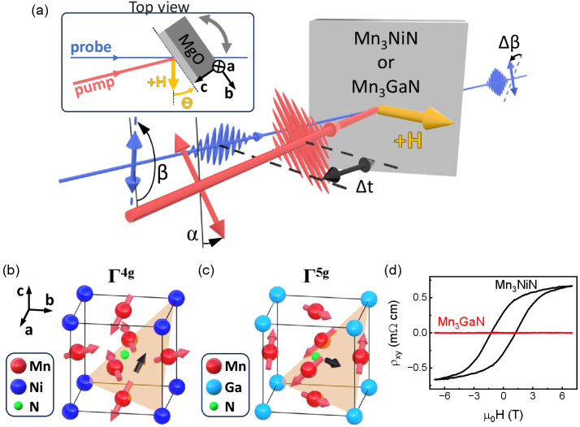
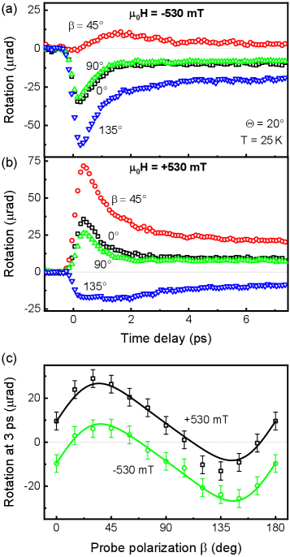

# 非共線反強磁性体の超高速スピンダイナミクス：磁気寄与と光学寄与をどう切り分けるか

- 執筆日：2026-05-14
- トピック：アントペロブスカイト非共線反強磁性体Mn₃NiNおよびMn₃GaN薄膜のポンプ-プローブ実験による磁気秩序の超高速ダイナミクス解析と、磁気光学信号から磁気・非磁気成分を定量分離する方法論の確立
- タグ：Magnetism and Spin / Nonequilibrium and Dynamic Response / Thin Films and Interfaces / Pump-Probe Response / Pump-Probe Measurements
- 注目論文：Kimak et al., "Disentangling magnetic and optical contributions in ultrafast dynamics of antiperovskite non-collinear antiferromagnets," arXiv:2605.06233 [cond-mat.mtrl-sci] (2026). https://arxiv.org/abs/2605.06233
- 参照論文数：7本

---

## 1. 背景：なぜ今この話題か

「強磁性体より速く、より小さく、より省エネで情報を記録できる磁性体はないか」——この問いが、過去十年の磁気デバイス研究を牽引してきた。その有力な候補として急浮上したのが、反強磁性体（antiferromagnet, AF）である。反強磁性体では隣接するスピンが互いに逆向きに配列するため、全体の磁化はゼロになる。この補償された磁気構造は、外部磁場への不感受性や漂遊磁場の抑制といった利点をもたらし、より高密度な集積回路への応用が期待されている。さらに特徴的なのはダイナミクスの速さで、反強磁性体における均一スピン歳差運動の固有周波数はテラヘルツ（THz）領域に達し、強磁性体に比べて数桁も高速な磁化操作の可能性を秘めている。

しかし従来の「共線型」反強磁性体——スピンが単純に↑↓↑↓と並ぶ系——には大きな弱点があった。電子バンド構造にスピン分極がなく、異常ホール効果（anomalous Hall effect, AHE）や磁気光学カー効果（magneto-optical Kerr effect, MOKE）といった電流や光への磁気応答がほぼゼロになるため、磁気状態の読み出しが困難なのだ。この壁を突破したのが、2010年代後半から急速に研究が進んだ「非共線反強磁性体（non-collinear antiferromagnet, nc-AF）」である。

非共線反強磁性体では、3つ（あるいは多数）の副格子スピンが三角形や星形などの非共面・非共線的な配列をとる。この「キラルスピンテクスチャ」が運動量空間でベリー曲率（Berry curvature）を生み出し、正味磁化がゼロにもかかわらず大きなAHEやMOKEを引き起こす。2016年に六方晶Mn₃Sn（Heusler化合物）での室温大AHE発見が報告されたことを皮切りに、同族のMn₃Ge、Mn₃Gaへの展開、そしてキュービック系のアントペロブスカイト（antiperovskite）化合物Mn₃NiN、Mn₃GaN、Mn₃SnNへの研究拡大が続いている。

なかでもアントペロブスカイトMn₃AN（A = Ga, Ni, Sn など）は、格子歪みによって小さな純磁気モーメントが誘起されるピエゾ磁気効果（piezomagnetism）や、磁気構造相転移に伴う大きなバロカロリック効果など、多彩な磁気・構造結合を示す独自の物質群である。スピントロニクス応用に向けては、磁気秩序の超高速光操作が鍵となるが、これらアントペロブスカイト系の「フェムト秒レーザーパルスによって何が起きるか」は、2025年時点ではほとんど調べられていなかった。

超高速磁気光学ポンプ-プローブ実験は、磁気秩序のフェムト秒〜ピコ秒スケールの変化を追う最強のツールである。しかし測定される偏光回転信号には、磁気秩序の変化だけでなく、レーザーパルス誘起の屈折率変化（加熱による純光学的応答）も混入する。両者を定量的に分離しなければ、「どれだけスピンが消磁されたか」は分からない。この「分離問題」は、非共線反強磁性体のような多ドメイン系で特に深刻であり、Mn₃Snでも実験的な困難として認識されてきた。

本稿の中心となる論文（Kimak et al. 2026, arXiv:2605.06233）は、この課題に正面から挑んだ。実験的・理論的に精緻化された手法を用いて、アントペロブスカイト薄膜Mn₃NiNとMn₃GaNにおける磁気・非磁気成分を定量分離し、両材料の磁気相の違いが超高速ダイナミクスに与える影響を明らかにした。同グループが直前に報告したポンプ偏光依存ダイナミクス（arXiv:2601.07753）と対をなす、補完的な研究である。

---

## 2. 未解決問題は何か

### ポンプ-プローブ信号に含まれる「非磁気成分」の問題

非共線反強磁性体の超高速磁気光学実験では、測定される偏光回転量 Δβ に複数の成分が重畳される。第一は磁気秩序パラメータ（副格子磁化の大きさ）の変化に由来する磁気光学成分であり、第二はフェムト秒レーザーパルスによる電子加熱に伴う複素屈折率（誘電率テンソルの非磁気対角成分 ε(0)）の変化に由来する純光学成分である。

一般の金属薄膜では、この2成分の時間発展が異なる場合もあり、片方だけを測定しているつもりが実際には混在した信号を見ている可能性がある。さらに非共線反強磁性体には8種類の磁気ドメイン（Γ4g相の場合）が存在し、各ドメインの磁気光学応答が入射角・偏光方向に対して異なる対称性を持つため、測定配置によっては個別のドメイン寄与が相殺したり強め合ったりする。この「ドメイン平均の問題」は、Mn₃Snのような六方晶系でも認識されていたが、キュービック対称性を持つアントペロブスカイト系では8ドメインの対称な配置がいっそう問題を複雑にする。

この問題に対する解決策は何か。有力なアプローチの一つは、プローブの偏光方向 β を系統的に変化させながら測定し、応答の β 依存性から磁気・非磁気成分の寄与比を分離することである。さらに重要なのは、多層光学系の完全なモデル化（Yeh の伝達行列形式論）と、磁気ドメイン分布の理論的取り扱いを組み合わせることで、測定されたすべての信号を定量的に再現できるかどうかを検証することである。

### 反強磁性体の消磁メカニズムは強磁性体と同じか

強磁性体における超高速消磁（ultrafast demagnetization）の機構は、1996年にBeaurepaire らがニッケル薄膜で200 fs以下の消磁を報告して以来、30年にわたって活発に研究されてきた。現在の主流解釈は、フェムト秒レーザーパルスによってまず電子系が加熱され（電子温度 Te の急上昇）、電子-スピン間の相互作用（主にスピン軌道結合経由の角運動量散乱）を通じてスピン系が脱磁化されるというものである。この過程は3温度モデル（electron, spin, lattice）で定性的に説明できる。

強磁性金属には「タイプI」と「タイプII」の2種類の消磁ダイナミクスが知られている。タイプIは単純な単段階クエンチ：レーザー照射後 ~200 fs で磁化が急減し、その後ピコ秒スケールで回復する。タイプIIは2段階クエンチ：初期の高速クエンチに続いて、100 ps程度のスケールで2次的な磁化の減少が起こる。タイプIからタイプIIへのクロスオーバーは、励起温度（言い換えれば励起フルエンス）を上げていくにつれて起きることが報告されており、Koopmans らの解析（2010年）ではスピン-格子結合の強さと電子-スピン散乱の比により説明できるとされている。

問題は、非共線反強磁性体においてこのような消磁クロスオーバーが存在するかどうかである。Mn₃Snでは超高速ポンプ-プローブ実験が行われ（Matsuda et al. 2022）、AHEの超高速変化が報告されているが、消磁のダイナミクス自体はほぼ温度（基底温度）非依存であると報告されている。これは強磁性体のタイプI/II切り替えとは対照的な挙動であり、ハイゼンベルグ型Mnスピンと遍歴電子系の相互作用が強磁性体とは本質的に異なることを示唆する可能性がある。ではアントペロブスカイト系はMn₃Snと同じか、それとも強磁性体的な振る舞いをするのか？

### ピエゾ磁気効果によるドメイン制御：磁気光学測定への影響

アントペロブスカイトMn₃NiNのΓ4g磁気相では、格子歪み（c/a ≠ 1 のテトラゴナル歪み）によってピエゾ磁気効果を通じた小さな純磁気モーメント M_P が誘起される。この M_P は各ドメインで異なる向きを持ち、外部磁場 H との結合エネルギー −M_P · H によってドメイン間のエネルギー縮退が解け、磁場印加によってドメイン分布が変化する。これが磁気光学測定に与える影響は、単なる「バックグラウンド」ではなく、試料傾斜と磁場の組み合わせ依存性として複雑に現れる。

一方、Γ5g相を持つMn₃GaNではどうか。この相は磁気空間群の対称性が異なり、M_P のベクトルが磁場と結合する方向がΓ4gとは異なるため、同じ測定条件でもドメイン分布は磁場に応答しない。この「磁場依存性の有無」が、2つの材料を比較する実験の核心的な対照点となっている。

---

## 3. 注目論文の概説

### 研究目的と対象材料

Kimak et al. (2026) の目的は二つである。第一に、アントペロブスカイト非共線反強磁性体薄膜（Mn₃NiNとMn₃GaN）において、フェムト秒レーザー誘起のポンプ偏光非依存（pump-polarization-independent, PPI）ダイナミクスの起源を明らかにすること。第二に、磁気光学信号から磁気成分と非磁気成分を定量分離し、消磁の大きさと温度依存性を抽出することである。この研究は同グループによるポンプ偏光依存（pump-polarization-dependent, PPD）ダイナミクスの研究（arXiv:2601.07753）と対をなし、熱的（PPI）と非熱的（PPD）の2つの光誘起ダイナミクスを統合的に理解するための補完的研究として位置づけられる。

対象薄膜は（001）配向MgO基板上にパルスレーザー堆積（PLD）法で成長された13 nm厚のMn₃NiNと、ガラス基板上の~20 nm厚のMn₃GaNである。Mn₃NiNのネール温度 T_N ≈ 246 K は SQUID 磁力計で決定され、格子定数 c = 3.908 Å, a = 3.940 Å（c/a = 0.992）の微小テトラゴナル歪みが X 線回折で確認された。この歪みがΓ4g相でのピエゾ磁気モーメント M_P の起源となる。Mn₃GaN薄膜はΓ5g磁気相にあることを、AHE測定の非存在で確認している（図1(d)参照）。

### 実験手法：ポンプ-プローブ分光法

ポンプ-プローブ実験はTi:サファイアオシレータ（~150 fs パルス、繰り返し80 MHz）を使用した。ポンプ光（820 nm、フルエンス ~6 mJ/cm²、スポット径 ~15 μm）で試料を励起し、プローブ光（532 nm、フルエンス ~0.2 mJ/cm²、スポット径 ~4 μm）で透過型ポンプ-プローブ設定で偏光回転変化 Δβ を時間遅延 Δt の関数として測定する。光学ブリッジ検出（2つのフォトディテクターの差信号）により μrad 感度を達成している。ポンプ波長800 nm・プローブ400 nmの組み合わせも用い、この場合は繰り返し8 MHzに落とした。

最も重要な工夫は「試料傾斜角 Θ」と「プローブ偏光方向 β」を系統的に変化させながら測定する点である。試料は磁場 H（最大 ±530 mT）に垂直なプローブ伝播方向に対して、磁場方向と平行な結晶 a 軸周りに傾斜角 Θ だけ傾けられる。

この配置の重要性は次のとおりである。Θ = 0°（正面入射）では、8つのドメインからのMOKE様信号とフォークト効果が互いに相殺し、ほぼゼロになる。Θ ≠ 0°（斜め入射）にすると、（i）斜め入射によって各ドメインの光学応答の対称性が崩れること、（ii）磁場の面外成分が現れてドメインエネルギー縮退を解くこと、の2効果が組み合わさり、磁場依存の磁気光学信号が現れる。

### 主要結果 I：磁場依存性の対称性とΓ4g/Γ5gの違い

両材料とも、ポンプ-プローブ信号に顕著な試料傾斜角 Θ 依存性が観測された。正面入射（Θ = 0°）では信号がほぼゼロになるのに対し、Θ = 20° や Θ = 35° では大きな偏光回転変化が現れる。この傾斜依存性はどちらの材料でも同様である。

しかし磁場依存性は全く異なる。Mn₃NiN（Γ4g相）では、傾斜試料にプローブを斜め入射すると、測定される回転に磁場 H の奇関数成分（H の符号反転で符号が変わる成分）が現れ、AHEの存在と符合するKerr様の磁気光学効果が確認される。一方、Mn₃GaN（Γ5g相）では、同じ実験条件でも測定信号は磁場に無依存で、Γ5g相が持つ対称性（M について一次の磁気光学効果が禁止される）と整合する。

この対比は、2つの材料で磁場によるドメイン分布の制御可能性が根本的に異なることを示している。Γ4g相では M_P と外部磁場が結合してドメインを選択的に整列させ、それがKerr様MOKE信号として可視化される。Γ5g相では M_P の向きが磁場と非効果的な角度関係にあるため、ドメイン縮退が解けない。

### 主要結果 II：Yeh形式論による磁気・非磁気成分の定量分離

信号の起源を明らかにするため、著者らはYehの光学多層伝達行列形式論（Yeh's formalism）を用いた完全光学モデルを構築した。誘電率テンソルは以下のように分解される：

$$\varepsilon = \varepsilon^{(0)} \mathbf{I} + \varepsilon^{(1)}_{MOK} + \varepsilon^{(2)}_{Voigt}$$

ここで ε(0) は複素屈折率に関わる等方的スカラー（非磁気項）、ε(1)_MOK は磁気秩序パラメータについて一次の MOKE 項（Q と K パラメータで記述）、ε(2)_Voigt は二次のフォークト項である。8種類のΓ4gドメインに対し、c軸周りの90°回転と M_P の符号反転によって誘電率テンソルを生成し、各ドメインの重み（磁場によって変化する分布関数）で平均した合計応答を計算する。

ポンプ誘起の磁気クエンチングは Q と K の減少として、屈折率変化（熱的非磁気成分）は ε(0) の変化としてモデル化される。このモデルをさまざまな β、Θ、H の組み合わせの実験データに対して一括フィッティングすることで、磁気クエンチング量を (50 ± 20)% と定量抽出することに成功した。さらにΘ = 20° での β 依存性の解析から（図3参照）、MOKE様成分と純光学成分（β への依存性の波形形状で区別可能）の両者が、先述のモデルと定量的に一致することを確認している。

### 主要結果 III：消磁ダイナミクスの温度依存性

温度依存測定では、Mn₃NiNで興味深いクロスオーバーが発見された。低温（25 K 付近）では単段階クエンチ（タイプI様：急速なスピン消磁、その後の回復）であるのに対し、高温（T_N = 246 K 付近）に近づくにつれ、2段階クエンチ（タイプII様：初期急速クエンチ + 2次的な遅い消磁）へと変化する。これは金属強磁性体（Ni やFe など）で観測されているタイプI→タイプII クロスオーバーと類似した挙動であり、アントペロブスカイトAFM においても電子-スピン-格子の3系統間結合が温度依存性を示すことを示唆している。

対照的に、Mn₃Snではほぼ温度非依存の消磁ダイナミクスが報告されており、この点でMn₃NiNとは本質的に異なる。

### 論文の新規性と限界

新規性の第一は「磁気・非磁気成分の定量分離」の方法論的確立である。Yehの形式論と多ドメイン平均を組み合わせたモデリングによって、過去の非共線AFM研究では困難だった磁気クエンチング量の定量化を実現した。第二は、Γ4gとΓ5gという対称性の異なる2相を同一の実験枠組みで比較し、磁気相の対称性がどのように超高速応答に影響するかを示した点である。第三は、アントペロブスカイトAFMにおける温度依存型消磁クロスオーバーの発見である。

限界としては次の点が挙げられる。まず薄膜試料のΓ4g/Γ5g相の安定性はエピタキシャル歪みや基板-薄膜界面に敏感であり、バルク単結晶との直接比較が不足している。また消磁量の不確かさ（(50 ± 20)%）が大きく、これは磁気ドメイン分布の事前知識への依存性に起因している。さらに今回の実験では、スピン角運動量の行き先（格子系か、または熱電子系か）を直接測定しておらず、消磁のミクロメカニズムについては推論の域を出ない。

---

## 4. 研究史における位置づけ

### Mn₃Sn型六方晶系非共線AFMの物理

非共線反強磁性体の先駆けはMn₃Sn（六方晶系、カゴメスピン配置）である。Nakatsuji らによる2016年のNature論文で室温での大きなAHEが報告されて以来、AHEの起源がベリー曲率によるバンドトポロジーにあることが理論・実験の両面で確立された（Chen & MacDonald 2014, Kübler & Felser 2014）。その後、磁気光学カー効果（MOKE）、異常ネルンスト効果（ANE）、磁気トンネル接合（MTJ）における大きなトンネル磁気抵抗（TMR）と、驚くべきスピントロニクス特性が次々と実証されている。

超高速ダイナミクスの面では、Matsuda et al. (2022, arXiv:2206.06627) がTHzプローブを用いたポンプ-プローブ実験でMn₃SnのAHEの超高速応答（sub-100 fs での変化）を報告した。電子温度が格子温度よりも先にAHEを変化させること、ベリー曲率の内因性メカニズム（intrinsic Berry-curvature mechanism）がよく再現することを明らかにしている。しかしこの研究では、消磁の温度依存性についての系統的な調査は限定的であり、Mn₃Snの消磁ダイナミクスはほぼ温度非依存であるという印象的な結果が示された。

### アントペロブスカイトMn₃AN系への展開

アントペロブスカイトMn₃AN（A = Ga, Ni, Sn, Cu）は、カゴメ系（Mn₃Sn族）とは異なる立方晶対称性を持ち、(111)面内で三角形スピン配置をとる。磁気相はΓ4g とΓ5g の2種類が競合し、材料（Aサイト元素）の選択によって安定相が変わる。

Mn₃NiNとMn₃GaNにおける静的なAHEおよびMOKEの実験的観測は、2019〜2022年頃から報告が増え始めた。特に近年（2024年）、Yao et al.（arXiv:2410.02990）はMn₃NiN単結晶エピタキシャル薄膜の成長を達成し、Sagnac顕微鏡によってΓ4gドメインのベリー曲率を直接実空間イメージングすることに成功した。この研究はドメインがネール転移温度付近では磁場で反転可能だが低温では凍結することを示し、AHEとMOKEの応答のチューナビリティを実証した。本研究の超高速実験と比較すると、静的なドメイン物理（Γ4gドメインの存在とその磁場制御性）は静的測定と超高速測定で整合している。

アントペロブスカイトの超高速研究はほぼ未踏の領域だった。Kimak et al. の同グループによる先行研究（arXiv:2601.07753）が、まずポンプ偏光依存（PPD）成分——すなわち非熱的光制御——を報告した。線形偏光フェムト秒パルスの偏光方向のみによって磁気秩序が制御されること、その線形偏光依存度が金属磁性体では前例のない最大95%に達することを示し、スピンスパイラル状態の過渡的生成というメカニズムを提唱した。本研究（2605.06233）はその補完研究として、偏光非依存（PPI）成分——熱的消磁——に焦点を当てている。

### 強磁性体の超高速消磁クロスオーバー研究との対応

金属強磁性体のタイプI/IIクロスオーバーに関する最も影響力ある研究の一つは、Koopmans et al. (2010, Nature Materials) である。この研究では、スピン-軌道結合の強さを表すパラメータと電子-スピン散乱率の比が、タイプIかタイプIIかを決定することを示した。一般に、スピン-軌道結合が強く電子-スピン散乱が速い系ではタイプIになりやすく、スピン-軌道結合が弱い（あるいは交換相互作用の強いハーフメタル的系）ではタイプIIになりやすい傾向がある。最近では酸化物薄膜NiCo₂O₄でもタイプII様の消磁挙動が報告されており（arXiv:2604.17916）、タイプII的ダイナミクスが金属強磁性体にとどまらず、多様な磁性材料で起きうることが示唆されている。

本研究のMn₃NiNにおける温度依存的クロスオーバー（低温：タイプI、高温：タイプII）は、この文脈で初めて非共線反強磁性体でも同様の切り替えが起きることを示した歴史的な発見と言えよう。

---

## 5. どの解釈が最も妥当か

### Mn₃NiN の消磁クロスオーバーの解釈

本研究が示した「低温：単段階、高温：2段階クエンチ」という温度依存性を、どう解釈するべきか。最も直接的な解釈は、3温度モデル（電子温度 T_e、スピン温度 T_s、格子温度 T_l）の枠組みで考えることである。レーザー照射直後 Δt < 1 ps では T_e が急上昇し（T_e ~ 数千 K）、電子-スピン結合を通じてスピン系に角運動量が移動する。低温では T_e の上昇幅が相対的に大きい（格子やスピン系の熱容量が低温で小さい）ため、スピン-格子緩和が電子-スピン緩和に追いつく前に磁気秩序が急速に崩壊し、単段階クエンチになりやすい。一方、高温（T_N 付近）では磁気熱容量が発散的に増大し、スピン揺らぎが増加する。この領域では電子系から注入された熱エネルギーが「スピンの再分配」に費やされ、遅い2次的クエンチが現れやすくなると考えられる。

この解釈は強磁性体でのKoopmansモデルと定性的に整合する。しかし重要な疑問が残る：Mn₃Snはなぜ温度非依存なのか？一つの仮説は、Mn₃Snのような kagome 磁性体ではトポロジカルバンド構造（Weyl点近傍の電子構造）がスピン角運動量散乱経路を特別な形で変えており、温度依存性を抑制しているというものである。別の仮説は、Mn₃Sn の交換相互作用の大きさ（スピン剛性）がMn₃NiNと異なり、高温での磁気揺らぎの増大の仕方が異なるというものである。現時点ではどちらの仮説も証拠が不足しており、未確定な点として残る。

### 磁気・非磁気分離の定量的信頼性

磁気クエンチング量 (50 ± 20)% という不確かさ20%はかなり大きい。この誤差の主因は、磁場による8ドメインの分布変化量（つまり M_P の大きさ）の不確かさと、誘電率テンソルの各パラメータのフィッティング精度にある。ドメイン分布を独立した手段（例：走査型MOKE顕微鏡）で実測できれば制約が増し、より精確な磁気クエンチング量が得られるはずである。

一方で、磁気成分と非磁気成分の分離方法論そのものの妥当性は、実験で確認できる範囲では強く支持されている。モデルが Mn₃NiN（β 依存性の有無、H 奇関数成分の有無）と Mn₃GaN（磁場非依存性）の測定配置の違いを一つのパラメータセットで再現していることは、解析枠組みの内部整合性を示す強い証拠である。

### タイプIとタイプII：AFMでの普遍性

本研究が示した温度依存クロスオーバーは、非共線AFMにおける「スピン角運動量散乱チャンネル」の材料依存性を示唆する。Mn₃Snと Mn₃NiN の違いは単に結晶構造や格子対称性だけでなく、スピン-軌道結合の強さ（Mn₃NiNはMn₃Snに比べてスピン軌道相互作用が弱い可能性）、またはスピン揺らぎのモード密度の違いが効いている可能性がある。

今後必要な検証実験として最も重要なのは、(i) 異なる基底温度・異なるフルエンス（励起強度）で系統的に消磁ダイナミクスを測定し、クロスオーバーの「位相図」を描くこと、(ii) THzプローブを使ってAHEの超高速変化とスピン角運動量変化を独立に追跡すること、(iii) 第一原理計算によってスピン-格子結合定数と電子-スピン散乱行列要素の温度依存性を求めることである。

---

## 6. 何が一般化できるか

### 多ドメイン系の光学信号分離：普遍的方法論

本研究が提案した「Yehの多層モデル + 多ドメイン平均」という解析枠組みは、非共線反強磁性体一般に適用可能な方法論として意義が大きい。非共線AFMは原理的に複数の縮退したドメインを持ち、それぞれが異なる磁気光学応答を示す。従来の磁気光学ポンプ-プローブ実験では、「測定された偏光回転 = 磁気クエンチング」という単純な対応関係を仮定して解析することが多かった。本研究はこの近似の問題点を明示し、試料傾斜 + プローブ偏光系統変化 + 完全光学モデルによる分離という新しいプロトコルを実証した。

この枠組みは、Mn₃Sn（カゴメ系）、Mn₃Ir（立方晶系）、その他の非共線AFM薄膜にも適用可能なはずである。ただし各材料の磁気空間群対称性（ドメインの種類と数）および磁気光学テンソルの対称性（MOKE、フォークト効果それぞれの選択則）を事前に把握する必要がある。

### ピエゾ磁気効果によるドメイン光制御への示唆

本研究は、ピエゾ磁気モーメント M_P が磁場によるドメイン分布変化に本質的な役割を果たすことを明示した。この知見は「外部磁場ではなく歪みを用いたドメイン操作」への応用に接続される。アントペロブスカイトMn₃NiNはピエゾスピントロニクス（piezospintronics）の候補材料として注目されており、機械的ストレスや圧電基板との組み合わせによって M_P 方向を電場で制御できれば、無磁場でのドメインスイッチングが可能になる。これはより省エネルギーなスピントロニクスデバイスへの道を開く。

### 非共線AFMの超高速デバイス応用

超高速磁気ダイナミクスの観点では、今回示されたタイプI/II クロスオーバーは、アントペロブスカイトAFMが「書き込み速度」と「書き込み量」のトレードオフを持つことを示唆する。低温・低フルエンス（タイプI領域）では高速だが比較的浅い消磁しか得られない可能性があり、高温・高フルエンス（タイプII領域）では深い消磁が得られるが過程が遅い。スピントロニクスデバイスの設計においては、この動作点の最適化が重要になる。

また、Mn₃NiNのΓ4g相は（同グループの別研究で示された）非熱的偏光制御ダイナミクスと熱的消磁ダイナミクスの両方を持つ。両者を組み合わせることで、偏光で磁気ドメインを「書き」、熱的パルスで「消す」という非対称な超高速操作サイクルが設計できるかもしれない。これはオプトマグネティックメモリへの一歩となりうる。

---

## 7. 基礎から理解する

### 反強磁性体とは何か

磁性体を理解するには、まず原子の磁気モーメントに起因する「スピン」から出発しよう。原子の電子は自身の自転（スピン）に由来する磁気モーメント μ = g μ_B S を持つ（μ_B はボーア磁子、g ≈ 2はスピンg因子）。隣接する原子のスピン間には「交換相互作用」と呼ばれる量子力学的な結合があり、そのエネルギーは ε = −J S_i · S_j（J は交換積分）で表される。J > 0 なら平行配列（強磁性）が安定で、J < 0 なら反平行配列（反強磁性）が安定となる。

反強磁性体（antiferromagnet, AFM）では隣接するスピンが互いに反平行に配列し、全体の磁化（すべての局所磁気モーメントの和）がゼロになる。これが「補償された」磁性体と呼ばれる所以である。代表例としてはNiO（酸化ニッケル）、MnF₂（フッ化マンガン）、Cr（クロム）などが知られている。AFMの特性温度はネール温度 T_N と呼ばれ、T > T_N では常磁性（paramagnetism）に転移する。

### 非共線反強磁性体とベリー曲率

「共線型」AFMではスピンが一直線に↑↓↑↓と並ぶが、「非共線型（non-collinear）AFM」では3つ以上の副格子（sublattice）のスピンが互いに角度を持って並ぶ。典型的な例がカゴメ格子上のMn₃Sn：三角形の各頂点に1つずつMnスピンがあり、それらが120°ずつ異なる方向を向いた「三角形スピン配置」をとる。全体の磁化はゼロになる（3本のベクトルが120°間隔なので和がゼロ）にもかかわらず、この非共線スピンテクスチャはトポロジカルな性質を持つ。

ここで「ベリー曲率（Berry curvature）」という概念が登場する。電子のブロッホ状態 |n, k⟩（n はバンドインデックス、k は波数ベクトル）を断熱的に k 空間で移動させると、その量子状態の位相が変化する。この位相変化の幾何学的部分を Berry phase と呼び、k 空間における「曲率場」がベリー曲率 Ω_n(k) である：

$$\Omega_n(\mathbf{k}) = -2 \text{Im} \sum_{m \neq n} \frac{\langle n\mathbf{k} | \partial_{k_x} H | m\mathbf{k} \rangle \langle m\mathbf{k} | \partial_{k_y} H | n\mathbf{k} \rangle}{(E_m - E_n)^2}$$

ここで H はブロッホ方程式のハミルトニアン、E_n は第nバンドのエネルギーである。この式はバンド間結合（「仮想遷移」）によってk空間の各点がどれだけ「捩れているか」を表す。

異常ホール伝導率 σ_xy は、フェルミ面以下の全バンドのベリー曲率をk空間全体で積分したもので与えられる：

$$\sigma_{xy} = -\frac{e^2}{\hbar} \int_{\text{BZ}} \frac{d^3k}{(2\pi)^3} \sum_{n, E_n < E_F} \Omega_n^z(\mathbf{k})$$

これが「内因性AHE（intrinsic AHE）」の式である。非共線スピンテクスチャはスピン-軌道相互作用を通じてバンドのスピン混合を引き起こし、ベリー曲率の積分値が有限になる。Mn₃Snではこのσ_xy が室温で ~100 Ω⁻¹cm⁻¹ に達し、強磁性体と同程度の大きなAHEを示す。

### アントペロブスカイト構造とΓ4g/Γ5g磁気相

アントペロブスカイト（antiperovskite）は、通常のペロブスカイト（ABX₃、例：BaTiO₃）の陰イオンと陽イオンが入れ替わった構造体である。Mn₃NiN の組成式は Mn₃NiN であり、Ni がBサイト（体心位置）、Mn がAサイト（面心位置）、N が頂点位置を占める。Mn のスピンが面心正方格子上に配置され、4つの (111) 面が三角形スピン配置の平面となる。

磁気相の分類は、群論的な磁気空間群の対称性解析によって行われる。Mn₃NiN の2つの主要な磁気相は：

- Γ4g相（またはΓ4+g）：Mn スピンが (111) 面内で T1 型の三角形配置をとる。この相は時間反転対称性 T の破れと、特定の反転を含む対称操作の組み合わせによって、磁化ゼロのままでAHEを許容する。外部歪みによってピエゾ磁気モーメント M_P が誘起される。Mn₃NiN の薄膜ではエピタキシャル歪みによってΓ4g が安定化される。

- Γ5g相（またはΓ5+g）：Mn スピンが (111) 面内で異なる T2 型配置をとる。磁気空間群の対称性上、M について一次の MOKE（Kerr 効果）が禁止される。M_P の方向がΓ4gとは異なるため磁場応答が変わる。Mn₃GaN ではこちらの相が安定。

両相の大きな違いは「磁気対称性とオクトポール秩序パラメータの変換性」であり、それが AHE、MOKE の有無を決定する。

### ピエゾ磁気効果（Piezomagnetism）

ピエゾ電気効果が「歪み → 電気分極」であるのに対し、ピエゾ磁気効果（piezomagnetism）は「歪み → 磁気モーメント」という対応関係である。磁気的ピエゾ磁気テンソル Q_αβγ を用いて：

$$M_\alpha = \sum_{\beta, \gamma} Q_{\alpha\beta\gamma} \sigma_{\beta\gamma}$$

ここで σ_βγ は応力テンソル、M_α は誘起される磁気モーメントである。非共線反強磁性体では磁気空間群の対称性がこのテンソルの非ゼロ成分を決め、Γ4g 相のMn₃NiN では (001) 歪みによって [001] 方向に M_P が誘起される。

実際の薄膜では、基板との格子不整合に由来する二軸歪みが常に存在し、c/a ≠ 1 のテトラゴナル歪みが自動的に M_P を生成する。この M_P は各ドメインの向きに結びついており（各ドメインのΓ4g三角形の向きが M_P の向きを決める）、外部磁場との結合 −M_P · H がドメインのゼーマンエネルギーとなり、磁場によるドメイン選択的安定化を可能にする。

### 超高速消磁（Ultrafast Demagnetization）の基礎

「フェムト秒レーザーで磁化がなぜ変わるか」を理解するには、電子系、スピン系、格子系の3つの熱浴と、それらの間のエネルギー・角運動量移動を考えなければならない。

（1）電子加熱：フェムト秒レーザーパルス（~100 fs）はまず電子系にエネルギーを注入し、電子温度 T_e を数千 K まで急上昇させる。この過程は ~100 fs 以下で完了する。

（2）電子-スピン結合：高温電子がスピン-軌道結合経由で角運動量をスピン系へ移す。電子-スピン緩和時間は多くの磁性金属で 100 fs〜1 ps のオーダーである。この過程が「超高速消磁」の主な担い手である。

（3）電子-格子結合：電子系から格子（フォノン）へのエネルギー移動（エネルギー平衡）は電子-フォノン結合定数 G_ep によって決まり、典型的には 1〜10 ps のスケールである。

3温度モデルの方程式系：

$$C_e \frac{dT_e}{dt} = -G_{ep}(T_e - T_l) - G_{es}(T_e - T_s) + P(t)$$

$$C_s \frac{dT_s}{dt} = -G_{es}(T_s - T_e) - G_{sl}(T_s - T_l)$$

$$C_l \frac{dT_l}{dt} = -G_{ep}(T_l - T_e) - G_{sl}(T_l - T_s)$$

ここで C_e, C_s, C_l はそれぞれ電子・スピン・格子の熱容量、G_ep はelectron-phonon結合係数、G_es はelectron-spin結合係数、G_sl はspin-lattice緩和係数、P(t) はレーザーパワー密度である。スピン温度 T_s の上昇が磁化 M = M_s(T_s) の減少に対応する（ここで M_s は自発磁化の温度依存性）。

タイプI消磁では G_es が大きく（電子-スピン散乱が速い）、単段階でスピンが加熱されて急速に磁化が消失する。タイプIIでは G_sl（スピン-格子結合）も有効で、初期の電子-スピン散乱による急速クエンチの後に、スピン-格子緩和による「熱的非平衡」の解消に伴う2次クエンチが起きる。

### 磁気光学カー効果とフォークト効果

磁気光学効果は、物質の磁気秩序によって光の偏光状態が変化する現象の総称である。

磁気光学カー効果（MOKE）：反射光の偏光面が磁化 M に比例した角度だけ回転する現象である。誘電率テンソルの反対称成分（M に一次の項）から生じる：

$$\varepsilon_{ij} = \varepsilon_0 \delta_{ij} + i Q \epsilon_{ijk} M_k$$

ここで Q は磁気光学感受率（Voigt定数）、ε_ijk はレビ・チビタ記号である。M が面外方向を向いている場合（極カーMOKE）に感度が最大となる。非共線AFMでは、各ドメインの等価な「磁化」に対応するオクトポール秩序パラメータがMOKEを引き起こす。

フォークト効果（Voigt effect）：磁化 M の2乗に比例した偏光回転（複屈折）効果で、M が面内を向く場合に生じる。誘電率テンソルの対称成分（M に二次の項）から生じる：

$$\Delta \varepsilon_{ij} \propto K (M_i M_j - \frac{1}{3}\delta_{ij}M^2)$$

ここで K はフォークト係数である。Γ5g相のMn₃GaN ではMOKEが対称性から禁止されるため、フォークト効果が主要な磁気光学信号になる。

Yehの伝達行列形式論では、薄膜/基板の多層系において各層の誘電率テンソルを使って電磁場を伝播させ、反射・透過スペクトルと偏光状態を数値的に計算する。この手法の強みは、薄膜の厚さ、入射角、偏光状態を正確に取り込めることにある。

---

## 8. 専門用語の解説

以下に本論文を理解するうえで重要なキーワード10語を解説する。

**非共線反強磁性体（non-collinear antiferromagnet）**　磁気副格子が互いに角度を持って配列するAFMの総称。通常の「共線型（collinear）」AFMと異なり、3サブラティスが120°や特定角度で配置する。Mn₃Sn、Mn₃Ge、Mn₃IrなどのMn系化合物が代表例で、正味磁化がゼロにもかかわらず大きなAHEを示す「スピン偏極反強磁性体」とも呼ばれる。本論文の対象材料Mn₃NiNやMn₃GaNはこのクラスに属し、(111)面内の三角形スピン配置が特徴的である。

**アントペロブスカイト（antiperovskite）**　通常のペロブスカイト（ABX₃型）と陰陽イオンが入れ替わった構造。Mn₃NiN はNi が体心、Mn が面心、N が頂点を占め、立方晶系の対称性を持つ。スピン構造の対称性がMn₃Snの六方晶カゴメ型とは異なり、磁気相（Γ4g, Γ5g）の競合や特有の磁気構造相転移を示す。本論文での2材料Mn₃NiN（Γ4g相）とMn₃GaN（Γ5g相）の比較はこの構造の「相多形性」を活かしたものである。

**ベリー曲率（Berry curvature）**　電子のブロッホ状態のk空間における幾何学的位相（Berry phase）から導かれる「曲率場」。バンド理論では、スピン-軌道結合と磁気秩序によってバンド間混合が起きる領域でベリー曲率が集中し、その積分が異常ホール伝導率を与える。Weyl点（バンドの縮退点）はベリー曲率のモノポールとして振る舞い、特に強い寄与をもたらす。非共線AFMのスピンテクスチャはベリー曲率を生み出す本質的な要因で、正味磁化なしにAHEをもたらす。

**異常ホール効果（anomalous Hall effect, AHE）**　外部磁場がなくても、または外部磁場に比例した以上の大きさで横方向（ホール）電圧が発生する現象。内因性AHEはベリー曲率の積分（σ_xy）によって表され、材料のトポロジカルバンド構造を反映する。Mn₃Snで室温において大きなAHEが実証されたこと（2016年）が、非共線AFMスピントロニクス研究のブレイクスルーとなった。本論文でMn₃NiN（Γ4g）がAHEを示しMn₃GaN（Γ5g）が示さない事実が、2つの磁気相の対称性の違いを実験的に確認する根拠として使われている。

**ピエゾ磁気効果（piezomagnetism）**　力学的応力（歪み）によって磁気モーメントが誘起される現象。ピエゾ電気の磁気版。Mn₃NiNのΓ4g相では、(001)方向の二軸歪みによって各ドメインに小さな純磁気モーメント M_P が生じる。この M_P は外部磁場と結合するため、磁場によってドメインの熱力学的安定性を調節できる。本論文では、M_P の方向がΓ4gドメイン（8種類）に依存することを利用し、傾斜した外部磁場によってドメイン分布を変化させ、磁気光学信号の制御に活用している。

**磁気光学カー効果（magneto-optical Kerr effect, MOKE）**　磁化した媒質に光を反射させると、反射光の偏光面が回転する現象。磁化 M に比例する（線形MOKE）か M² に比例する（二次MOKE、フォークト効果）。AFMでは正味磁化がゼロでもオクトポール秩序パラメータがMOKEを引き起こすことができる（対称性が許す場合）。Γ4g相ではMOKE（M一次）が許容され、Γ5g相では対称性の制約で禁止されるため、本論文でMn₃NiNとMn₃GaNの磁場応答の違いを理解する鍵概念となる。

**Yehの形式論（Yeh's formalism）**　多層薄膜系における偏光依存の光伝播を扱う伝達行列法の一種（Yeh 1979）。各層の誘電率テンソル（磁気光学効果を含む）と厚さ・入射角から、反射・透過の電場振幅行列を計算する。磁性薄膜の磁気光学スペクトル解析の標準手法であり、複数の磁気ドメインからの寄与を重みつきで合算できる点が本研究での活用に直結している。本論文では薄膜/基板の透過型測定に適用し、プローブ偏光方向 β と試料傾斜角 Θ 依存性を定量的に再現した。

**ポンプ-プローブ分光法（pump-probe spectroscopy）**　強い「ポンプ」パルスで試料を励起し、弱い「プローブ」パルスでその後の状態変化をτだけ遅らせて測定する超高速時間分解分光法。時間遅延τを変えることで、励起後の動力学を〜10 fs の時間分解能で追跡できる。磁性体では偏光回転（MOKE/フォークト）や透過強度変化（ΔT/T）を測定し、スピン・格子・電子系の時間発展を観測する。本論文では透過型配置（ポンプとプローブがほぼ同方向）を採用し、ポンプ偏光非依存（PPI）成分に焦点を当てている。

**タイプI/タイプII消磁（type-I/type-II demagnetization）**　フェムト秒レーザー照射後の消磁ダイナミクスの2分類。タイプIは単段階クエンチ（〜200 fs での急速な磁化消失と、その後のピコ秒回復）。タイプIIは2段階クエンチ（初期の高速クエンチ + 100 ps スケールの2次的磁化減少）。典型的に低フルエンス・低基底温度ではタイプI的、高フルエンス・高温（T_N付近）ではタイプII的な挙動を示す。本論文でMn₃NiNが温度上昇とともにタイプI→タイプIIへ切り替わることを示したことは、アントペロブスカイトAFMにおける消磁の系統的研究への重要な出発点となる。

**Γ4g相とΓ5g相**　Mn₃AN系アントペロブスカイトにおける2種類の非共線AFM秩序相の対称性ラベル。群論では不可約表現の記号で表され、(001)面内での Mn スピンの配列パターンの違いを表す。Γ4g（Mn₃NiN）ではスピンが (111) 面内 T1 型に配置し、AHE・MOKE・ピエゾ磁気モーメントが許容される。Γ5g（Mn₃GaN）ではスピンが T2 型に配置し、AHEとMOKE（M一次）が禁止される。この対称性の違いが「磁場依存性の有無」として超高速測定に顕著に現れ、本研究の対照実験の根幹をなす。

---

## 9. 将来展望

### かなり確からしくなったこと

本研究によって最も強固に確立されたのは、「非共線反強磁性体の超高速磁気光学信号には、磁気成分と非磁気（光学的）成分が重畳しており、測定配置（傾斜角・偏光方向・磁場）を系統的に変えること＋完全光学モデリングによって両者を定量分離できる」という方法論的知見である。これは今後の非共線AFM超高速研究のプロトコル標準として受け入れられていく可能性が高い。また、Mn₃NiN（Γ4g）とMn₃GaN（Γ5g）の磁場応答の対称性の違い——Γ4g ではドメイン分布が磁場で変化するためMOKE様信号が現れ、Γ5g では現れない——も確かな実験事実として確立された。さらに磁気クエンチング量が~50%（ただし不確かさ±20%）という定量値が得られたことも、今後の比較研究の基準値になりうる。

### まだ未確定なこと

Mn₃NiNの消磁クロスオーバーのミクロメカニズムは未確定である。3温度モデルで現象論的には説明できるが、スピン角運動量が格子に移る経路（スピン-フォノン散乱のどのモードが関与するか）、電子-スピン散乱の具体的なチャンネル（スピン-軌道結合か超交換か）、そしてMn₃Snと振る舞いが異なる物理的根拠は理解されていない。またベリー曲率そのものの超高速変化——電子系が加熱されたとき、k空間でのベリー曲率の分布がどのように変化するか——はMn₃NiNでは未測定であり、THzホール測定が必要である。さらに、同グループが別報（arXiv:2601.07753）で提唱した「過渡的スピンスパイラル」形成メカニズムと、熱的（PPI）消磁ダイナミクスの相互作用は完全には解明されていない。

### 次に重要になる実験・理論・計算

最も重要な次のステップは3つある。第一に、ミリテスラ精度の制御磁場 + 斜入射プローブ + 温度系統変化によって消磁ダイナミクスの「温度-フルエンス 位相図」を描くことである。これにより、タイプI/IIクロスオーバーがどのパラメータで支配されるかが明確になる。第二に、THzプローブを用いたポンプ-プローブ実験でMn₃NiN/Mn₃GaNのAHEの超高速変化を直接測定することである。AHEはベリー曲率に直結するため、スピン消磁とベリー曲率変化の時間スケールの違い（もしあれば）が、Mn₃Snとの本質的相違を明らかにするだろう。第三に、第一原理計算（第一原理スピン-格子ダイナミクス計算や時間依存密度汎関数理論）によって Mn₃NiN と Mn₃Sn のスピン-軌道結合強度、スピン-格子結合定数、電子-スピン散乱行列要素を計算・比較することである。この計算的裏付けがあって初めて、材料間のダイナミクスの相違を原子スケールで理解できる。

---

## 参考論文一覧

1. **arXiv:2605.06233** (2026) — J. Kimak et al., "Disentangling magnetic and optical contributions in ultrafast dynamics of antiperovskite non-collinear antiferromagnets." https://arxiv.org/abs/2605.06233  
   本稿の注目論文。Mn₃NiNとMn₃GaN薄膜のポンプ-プローブ実験により、磁気・非磁気信号の定量分離とタイプI/II消磁クロスオーバーを初めて示した。

2. **arXiv:2601.07753** (2026) — J. Kimak et al., "Ultrafast control of spin order by linearly polarized light in noncollinear antiferromagnetic metals." https://arxiv.org/abs/2601.07753  
   同グループによる先行研究。同じ系でポンプ偏光依存（非熱的）ダイナミクスを報告し、過渡的スピンスパイラル生成を提唱した。本論文のPPI成分研究と対をなす。

3. **arXiv:2410.02990** (2024) — Y. Yao et al., "Direct imaging and control of Berry curvature in noncollinear antiferromagnetic single-crystal thin films." https://arxiv.org/abs/2410.02990  
   Mn₃NiN単結晶エピタキシャル薄膜のSagnac顕微鏡によるΓ4gドメインのベリー曲率実空間イメージング。静的なドメイン物理を確立した重要な参照研究。

4. **arXiv:2206.06627** (2022) — T. Matsuda et al., "Ultrafast Dynamics of Intrinsic Anomalous Hall Effect in the Topological Antiferromagnet Mn3Sn." https://arxiv.org/abs/2206.06627  
   Mn₃SnのAHEの超高速変化をTHzプローブで観測。内因性ベリー曲率機構を実証し、温度非依存の消磁ダイナミクスを報告。本論文との比較対照論文。

5. **arXiv:2412.12557** (2024) — Review, "Ultrafast demagnetization in ferromagnetic materials: Origins and progress." https://arxiv.org/abs/2412.12557  
   強磁性体の超高速消磁の7つのモデルを体系的にレビュー。タイプI/IIダイナミクスの物理的起源を概説する背景文献。

6. **arXiv:2604.17916** (2026) — "Type-II-like ultrafast demagnetization behavior in NiCo2O4 thin films." https://arxiv.org/abs/2604.17916  
   酸化物薄膜でのタイプII様消磁を報告。非金属系でもタイプIIが起こりうることを示し、AFMの本研究と文脈的に対応する比較論文。

7. **arXiv:1901.05040** (2019) — "Anomalous Hall Conductivity of a Non-Collinear Magnetic Antiperovskite." https://arxiv.org/abs/1901.05040  
   アントペロブスカイト非共線AFMにおけるAHE伝導率の理論研究。Γ4g/Γ5g相の磁気対称性と異常ホール効果のベリー曲率起源を理論的に定式化した基礎文献。
