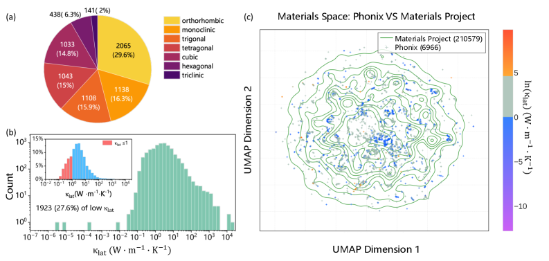
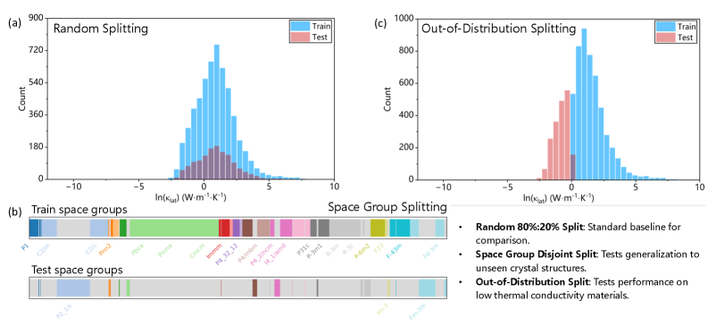
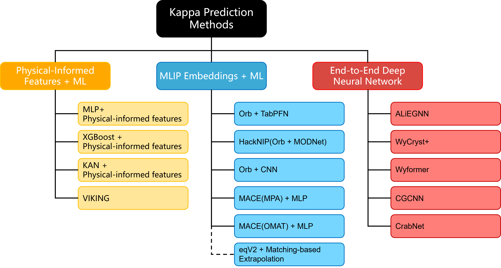
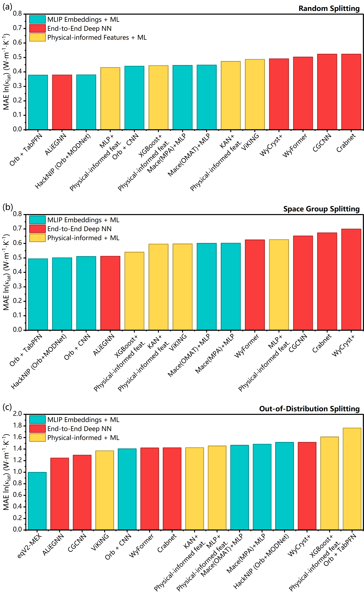

# 格子熱伝導率の機械学習代理モデルベンチマーク：未探索材料への汎化

- 執筆日：2026-05-15
- トピック：熱電材料探索を駆動する生成モデル時代における格子熱伝導率予測の代理モデル評価と汎化限界の体系的解析
- タグ：Phonons and Thermal Properties / Thermal Transport; Thermoelectric Conversion / Machine Learning; Surrogate Modeling
- 注目論文：[Fast and Accurate Prediction of Lattice Thermal Conductivity via Machine Learning Surrogates](https://arxiv.org/abs/2605.11610)（Zeyu Wang, Shuya Yamazaki et al., 2026）
- 参照論文数：6本

---

## 1. 背景：なぜ今この話題か

材料科学における生成モデルの台頭は、新しい物質探索のパラダイムを根本から変えつつある。拡散モデルや変分オートエンコーダといった深層生成モデルは、既存データから学習した確率分布から新規の結晶構造を直接サンプリングできるようになり、従来の組合せ的な探索アプローチが到達できなかった広大な化学空間を対象にできるようになってきた。しかし、こうして大量に生成された候補構造の「物性評価」という後処理段階がいまや深刻なボトルネックになっている。特に熱電材料の文脈では、この問題が顕著である。

熱電材料の性能指標である無次元性能指数 $ZT$ は次式で定義される。

$$ZT = \frac{S^2 \sigma T}{\kappa_{\rm lat} + \kappa_{\rm el}}$$

ここで $S$ はゼーベック係数、$\sigma$ は電気伝導度、$\kappa_{\rm lat}$ は格子熱伝導率、$\kappa_{\rm el}$ は電子熱伝導率、$T$ は絶対温度である。高性能熱電材料の設計では、パワーファクター $S^2 \sigma$ を最大化しつつ熱伝導率を最小化することが求められる。多くの優れた熱電材料は重くドープされた半導体であり、電子の寄与 $\kappa_{\rm el}$ は相対的に小さい。したがって $\kappa_{\rm lat}$ の正確な予測が、熱電材料のスクリーニングにおける決定的な鍵となる。

問題は計算コストにある。第一原理計算に基づいて $\kappa_{\rm lat}$ を求めるには、フォノン散乱過程を記述する調和・非調和の原子間力定数（IFC: interatomic force constants）を大規模超格子計算で抽出し、フォノンのボルツマン輸送方程式（BTE: Boltzmann transport equation）を解くか、長時間の非平衡分子動力学シミュレーションを実施する必要がある。前者でも後者でも、1材料あたり数日から数週間の計算時間を要することは珍しくない。機械学習ポテンシャル（MLIP: machine learning interatomic potential）による加速が進んだとはいえ、生成モデルが一度に提案する数千・数万の候補構造を全て評価することは依然として非現実的である。

この状況を打開するために近年急速に発展しているのが、結晶構造を入力として $\kappa_{\rm lat}$ を直接予測する「機械学習代理モデル（surrogate model）」の活用である。代理モデルであれば、訓練済みのモデルは数ミリ秒から数秒で予測を返せる。本稿が焦点を当てる注目論文（Wang, Yamazaki et al., 2026）は、まさにこの代理モデルアプローチの体系的ベンチマークを行い、「どのような代理モデルが、どのような場面で有効か」という実践的な問いに正面から答えようとしている。そして注目すべきことに、この論文は単なる性能比較にとどまらず、生成モデルが提案する「未知の材料」への汎化能力というより本質的な問題に踏み込んでいる点で、新しい時代の材料探索研究を象徴するものとなっている。

---

## 2. 未解決問題は何か

### 非調和格子振動の第一原理計算コスト問題

格子熱伝導率の計算における最大の難関は、三次以上の非調和 IFC の抽出にある。調和 IFC（二次）はフォノン分散関係を規定し、比較的少ない計算で求められる。しかし phonon-phonon 散乱を記述する三次以上の非調和 IFC は、より大きな変位を課したより多くのスーパーセル計算を必要とし、計算コストは急激に増大する。VASP や Quantum ESPRESSO などの第一原理コードと、Phono3py や ALAMODE などの非調和フォノン計算コードを組み合わせた現代的なワークフローでも、1材料あたりの計算時間は数百 CPU 時間に及ぶ。生成モデルが数千候補を提案する時代に、この計算コストはスクリーニングを根本的に妨げる。

2024 年の研究（Shankar et al., 2409.00360）は、DFT ではなく機械学習で非調和 IFC を抽出するアプローチにより、計算コストを約 1 桁（480,000 CPU 時間 → 12,000 CPU 時間以下）削減できることを示した。しかしこれでも BTE 計算の手間は残り、かつ新材料に対するMLIPs の精度が保証されるかという問題は解決されていない。

### 機械学習ポテンシャルの非調和性再現問題

近年、MACE-MP や SevenNet などの普遍的 MLIP（universal MLIP）が広く普及し、多様な元素組成の材料に対して近似的な原子間ポテンシャルを提供できるようになった。しかし 2402.18891（Knoop et al., 2024）の体系的評価が明らかにしたように、MLIP は調和 IFC の再現においては比較的優れているものの、三次・四次の非調和 IFC の精度は構造や元素によって大きくばらつく。特に強い非調和性を持つ系（ペロブスカイト型材料、ハーフホイスラー合金など）では、MLIP ベースの $\kappa_{\rm lat}$ 計算が第一原理値から数倍ずれることがある。つまり「MLIP を使えば万事解決」とはならない。

この問題は、MLIP の埋め込み表現を代理モデルの入力として使う手法（MLIP-embedded surrogate）の限界とも直結する。MLIP 埋め込みは調和的な構造情報を豊富に含む一方、非調和性を捉えた表現ではない。したがって、非調和性が支配的な低 $\kappa_{\rm lat}$ 材料の予測において、MLIP 埋め込みベースのモデルがどの程度有効かは本質的な問いである。

### 分布外（OOD）汎化問題

材料探索において最も重要なのは、既知材料の補間精度よりも「未知・未探索領域への外挿（OOD 汎化）」の信頼性である。しかし機械学習モデルの OOD 汎化は一般に保証されない。特に注目すべきは、MLIP のような大規模事前訓練モデルを材料特性予測タスクにファインチューニングする場合の問題である。2026 年の研究（Omee et al., 2601.08486）は、標準的なファインチューニングが「表現崩壊（representation collapse）」を引き起こすことを示した。大規模事前訓練で獲得した化学的・幾何学的に豊かな表現が、特定タスクへのファインチューニングで失われてしまい、訓練分布外の予測精度が著しく低下する現象である。では OOD 汎化に最も強いアーキテクチャとはどのようなものか——これが注目論文の中心的な問いのひとつである。

### 表現の粒度と予測精度のトレードオフ問題

もうひとつの未解決問題は、「どの程度の構造情報が $\kappa_{\rm lat}$ 予測に必要か」という問いである。完全な結晶構造（原子位置・元素種・周期境界条件すべて）を使うのか、ウィコフサイト情報（対称性を持つ格子位置）で十分なのか、あるいは組成式だけで予測できるのか。この問いは計算コストと予測精度のトレードオフと直結するが、体系的な比較研究は少なかった。格子熱伝導率は単純に組成だけでは決まらない——$\kappa_{\rm lat}$ は同じ組成でも結晶構造によって大きく異なる多形体間で変わり得るからである。どの粒度の情報を使うべきかを定量的に比較することは、計算リソースの適切な配分という観点から重要な問いである。

---

## 3. 注目論文の概説

### 研究の目的と対象

本論文（Wang, Yamazaki et al., arXiv:2605.11610, 2026）の目的は、格子熱伝導率予測のための機械学習代理モデルを体系的にベンチマークし、それぞれのモデルが「補間」と「外挿（OOD）」のどちらに優れているかを明確にすることである。研究の動機として明示されているのは、生成モデルによって提案される広大な構造空間における高速スクリーニングの必要性であり、特に熱電材料における低 $\kappa_{\rm lat}$ 候補の探索への応用が念頭に置かれている。

### 使用データセット：Phonix データベース

ベンチマークの基盤として用いられたのは Phonix データベースである。このデータベースは 6,966 件の無機結晶材料について、第一原理計算（VASP と ALAMODE を組み合わせた自動化ワークフロー）から導出した非調和フォノン特性を収録している。フォノン輸送はペアレ-ボルツマン輸送方程式（粒子的フォノン輸送）とウィグナー輸送方程式（波動的フォノンコヒーレンスを捉える）の両方を考慮した統一的アプローチで計算されている。

データベースの化学組成と構造多様性は図1に示すとおりで、立方晶・六方晶・三方晶・直交晶・単斜晶・三斜晶・正方晶の全 7 種の結晶系が含まれる。300 K での $\kappa_{\rm lat}$ の分布は対数正規分布に近く、約 95% の材料が 0.14〜39 W m$^{-1}$ K$^{-1}$ の範囲に収まる。特に重要なのは、低 $\kappa_{\rm lat}$ 材料（$\kappa_{\rm lat} \leq 1$ W m$^{-1}$ K$^{-1}$）が 1,923 件含まれていることである。この閾値は代表的な高性能熱電材料 Bi$_2$Te$_3$ の $\kappa_{\rm lat}$（約 1 W m$^{-1}$ K$^{-1}$）に基づいており、熱電探索に実用的な意味を持つ。

*図1：Phonix データベースの材料分布（Wang et al., arXiv:2605.11610, CC BY 4.0）*

### データ分割の設計：3 種類の評価シナリオ

本研究の独創的な点のひとつは、3 種類の異なるデータ分割戦略によって代理モデルの「汎化の種類」を区別して評価している点にある（図2）。

(i) ランダム分割（80:20）：標準的なベースライン。訓練データとテストデータが同一の全体分布から抽出されるため、補間精度を測る。

(ii) 空間群不整合分割：テストセットに含まれる全結晶対称性（空間群）が訓練セットに一切存在しない設定。構造的に新しい材料への外挿能力を測る。

(iii) OOD 分割（κ_lat 基準）：訓練セットを高 $\kappa_{\rm lat}$ 材料（$\kappa_{\rm lat} > 1$ W m$^{-1}$ K$^{-1}$）のみで構成し、低 $\kappa_{\rm lat}$ 材料（$\kappa_{\rm lat} \leq 1$ W m$^{-1}$ K$^{-1}$）のみでテスト。現実の熱電材料探索では、既知の高熱伝導材料のデータから低熱伝導の稀少材料を予測する場面が多く、この分割が最も実用的なシナリオを模している。

*図2：ベンチマークのデータ分割設計（Wang et al., arXiv:2605.11610, CC BY 4.0）*

### 15 種の代理モデルの 3 カテゴリ

評価された 15 種の代理モデルは 3 つのカテゴリに分類される（図3）。

カテゴリ 1「物理情報特徴量 + ML モデル」：化学組成や結晶構造から手動設計した物理的・化学的記述子（Matminer を利用した組成・構造特徴量）を XGBoost、MLP（多層パーセプトロン）、KAN（コルモゴロフ-アーノルドネットワーク）などの ML 回帰モデルに入力する手法。

カテゴリ 2「構造表現に基づくエンドツーエンド深層ニューラルネット（DNN）」：結晶構造をグラフや記号表現として直接 DNN に入力し、タスク特化表現を学習する手法。CGCNN（Crystal Graph Convolutional Neural Network）、ALiEGNN（Atomistic Line graph Interaction Equivariant Graph Neural Network）、WyFormer（ウィコフサイトベースの Transformer）、CrabNet（組成ベースの Transformer）、HackNIP、ViKING が含まれる。

カテゴリ 3「MLIP 埋め込み + ML モデル」：事前訓練済みの普遍的 MLIP（MACE-MP、Orb）から抽出した原子・構造埋め込み表現を、下流の CNN や MLP、TabPFN などの回帰モデルに接続する手法。

*図3：15 種の代理モデルの概要（Wang et al., arXiv:2605.11610, CC BY 4.0）*

### 主要結果

評価指標は自然対数スケールでの平均絶対誤差（MAE on ln $\kappa_{\rm lat}$）である。$\kappa_{\rm lat}$ の分布は対数正規分布に近いため、対数スケールでの評価が適切である。

全体的な最高性能モデルは ALiEGNN（平均 MAE = 0.712）であった。ランダム分割（0.379）・空間群不整合分割（0.512）・OOD 分割（1.245）の 3 つ全てにわたってバランスの取れた性能を示した。Orb+CNN（平均 0.784）と HackNIP（平均 0.799）が続くが、これらは特に OOD 分割でより大きな誤差を示す。

カテゴリ間の比較からより深い洞察が得られる。ランダム分割では MLIP 埋め込みモデル（Orb+CNN, MACE+MLP）が最高水準の補間精度を達成する。ところが OOD 分割では状況が逆転し、エンドツーエンド DNN（特に ALiEGNN と CGCNN）が最も強い外挿能力を示す一方、MLIP 埋め込みモデルは最も低いパフォーマンスに転落する。空間群不整合分割でも MLIP 埋め込みが優位であり、構造的外挿には強いが物性値の分布外外挿には脆弱というパターンが見えてくる。

ALiEGNN が他の DNN を大きく上回る理由として、論文は球面調和関数を使った結合角情報の明示的なエンコーディングに注目している。$\kappa_{\rm lat}$ は結合角から定まるフォノン分散と非調和散乱に鋭敏に依存するため、距離情報だけの GNN では捉えられない幾何学的特徴を取得できる ALiEGNN が有利となる。このことは MACE などの等変 MLIP が高い補間精度を持つ理由とも符合する。

計算コストの比較も重要な知見である。DFT+BTE が1材料あたり数日〜週を要するのに対し、ALiEGNN の学習は 2,750 秒（約 46 分）で完了し、テストセット全体の推論は 5 秒以内である。代理モデルは DFT と比較して数桁の計算コスト削減を可能にする。

さらに、MLIP 埋め込みモデルとエンドツーエンド DNN のアンサンブルが、全データ分割にわたってより安定・高精度な予測を提供することも示されている。

*図4：各代理モデルのデータ分割別性能比較（Wang et al., arXiv:2605.11610, CC BY 4.0）*

### 論文の新規性と限界

本論文の新規性は 3 点に要約される。第一に、$\kappa_{\rm lat}$ 代理モデルのアーキテクチャカテゴリ間の比較を、複数の異なる汎化シナリオの下で体系的に実施した点。第二に、生成モデル時代の実用的課題である OOD 分割（高 $\kappa$ 訓練・低 $\kappa$ テスト）を明示的に設計した点。第三に、アンサンブル戦略が補間と外挿の双方を改善することを実証した点。

限界として論文自身が認めているのは、代理モデルの精度が DFT に達しないことである。特に OOD 領域では最良モデルでも MAE が約 1.25（対数スケール）、すなわち実際の $\kappa_{\rm lat}$ の予測値が正解の約 3.5 倍ずれる可能性があることを意味する。また、予測はあくまで 300 K 単一温度での値であり、温度依存性の予測は対象外である。

---

## 4. 研究史における位置づけ

格子熱伝導率の理解は、20 世紀の固体物理学の発展と共に歩んできた。1929 年にペアレスが提唱したフォノンの概念と、その散乱を記述するボルツマン輸送理論が基礎を形成した。1950〜60 年代には、フォノン-フォノン散乱（Umklapp 過程）が低温での $\kappa_{\rm lat}$ の主要な制限要因であることが確立され、Slack（1973）は結晶構造パラメータと $\kappa_{\rm lat}$ を結ぶ経験式を提案した。この Slack モデルは単純ながら今日でも一次評価に使われる。

2000 年代以降、第一原理計算の発展が転機をもたらした。Phono3py（2015）や ShengBTE（2014）などのコードが整備され、超格子 DFT 計算から三次 IFC を系統的に抽出し BTE を解く自動化ワークフローが普及した。これにより、Si・Ge などの標準的な半導体から GeTe や SnSe などの複雑な熱電材料まで、第一原理による $\kappa_{\rm lat}$ 計算が可能になった。しかし計算コストが高いため、広範囲のスクリーニングは依然として困難であった。

機械学習を $\kappa_{\rm lat}$ 予測に応用する試みは 2018 年頃から本格化した。初期のアプローチは、Slack モデルに基づく物理量（デバイ温度、グリュナイゼン定数、格子定数など）を組み合わせた特徴量エンジニアリング＋ランダムフォレストや XGBoost という形式が主流であった。2020 年代に入ると、CGCNN（Xie & Grossman, 2018）などの結晶グラフニューラルネットワークを $\kappa_{\rm lat}$ に適用する研究が増加した。

KappaFormer（2604.03547, 2026）はこの流れの最前線にある。KappaFormer は Transformer アーキテクチャに調和-非調和の物理的分解を明示的に組み込み、さらに豊富な調和フォノンデータベースからのクロスドメイン転移学習によってデータ不足問題に対処した。同様の方針は 2411.18259（Choudhary et al., 2024）の転移学習アプローチにも見られ、事前訓練で得た汎用的な結晶表現を $\kappa_{\rm lat}$ 予測タスクにファインチューニングする手法が探索されてきた。

こうした背景のなか、今回の注目論文が担った役割は、個々のモデルの性能改善よりも「何がなぜ機能するのかを体系的に理解する」ことにある。15 種類のモデルを同一データ・同一プロトコルで比較し、かつ補間・構造外挿・物性外挿の 3 種類の汎化シナリオを同時に評価した研究はこれまでなく、フィールドとしての知識基盤を大きく整理したといえる。

---

## 5. どの解釈が最も妥当か

### MLIP 埋め込みが OOD に弱い理由：表現崩壊仮説

注目論文の最も驚くべき発見のひとつは、MACE や Orb などの高精度 MLIP を埋め込みとして使うモデルが、ランダム分割では最高精度を達成するにもかかわらず OOD 分割では最下位グループに転落するという逆転現象である。

この現象の説明として最も支持されているのは「表現崩壊」仮説である。2601.08486（Omee et al., 2026）は、大規模事前訓練済みモデルの標準的なファインチューニングが、原子環境の化学的・幾何学的に豊かな表現を特定タスクに特化した狭い表現に縮退させることを示した。MLIP はポテンシャルエネルギー曲面を精密に学習するよう最適化されており、その埋め込みは力と力定数の局所的な情報に対して鋭く調整されている。低 $\kappa_{\rm lat}$ 材料が多くの場合、複雑な化学組成・大きな単位胞・強い非調和性という MLIP の訓練分布とは異なる特性を持つことを考えると、埋め込みが低 $\kappa_{\rm lat}$ 領域を区別する十分な情報を含まない可能性が高い。

### なぜ ALiEGNN が OOD に強いのか：角度情報の重要性

ALiEGNN の OOD 汎化の優位性は、球面調和関数を用いた結合角（bond angle）の明示的なエンコーディングにある。$\kappa_{\rm lat}$ の大きさは、フォノン分散の勾配（群速度）と phonon-phonon scattering 率の積で決まる。群速度は原子間の相互作用の剛性（結合の強さと方向性）を反映し、散乱率は三次 IFC の大きさ——すなわち非調和性の強さ——に直接依存する。いずれも結合角に鋭敏に依存する量であり、この情報を明示的に取り込む ALiEGNN は、物理的に重要な特徴量を確実に学習できる。同様の理由で、等変 MLIP（MACE）が補間精度で優れるのも理解できる——等変表現は本質的に回転・反射対称性を保った幾何学的情報を保持するからである。

### 構造情報の階層性：「構造 > 空間群 > 組成」

論文が示したもう一つの重要な結果は、表現の詳細度と予測精度の系統的な相関である。完全な結晶構造情報（CGCNN）を用いるモデルは、ウィコフサイトベース（WyFormer）よりも優れ、組成のみ（CrabNet）よりもさらに優れる。この階層性は物理的に自明であるが、定量的に確認された意義は大きい。$\kappa_{\rm lat}$ は多形体間で大きく異なる（例：sp$^2$ 炭素のグラフェンと sp$^3$ 炭素のダイヤモンドは組成が同じでも $\kappa_{\rm lat}$ は桁違い）ため、組成情報だけでは根本的に予測が困難である。これは代理モデルの設計において、計算コストと引き換えに構造情報をどこまで簡略化できるかの上限を示す知見である。

### アンサンブル戦略の妥当性

MLIP 埋め込みモデルとエンドツーエンド DNN の相補的な長所（前者は補間、後者は OOD）を利用したアンサンブルが実用的解決策として機能することは、理論的にも支持される。統計的観点からは、バイアスと分散のトレードオフにおいて、異なるバイアス構造を持つ複数のモデルを組み合わせることで双方の弱点を補完できる。ただし、アンサンブルはモデル推論コストを単純に乗算するため、大規模スクリーニングへの適用時にはこのオーバーヘッドも考慮が必要である。

---

## 6. 何が一般化できるか

### 計算コストの高い物性予測全般への応用

本論文のベンチマーク設計（補間 vs. 構造外挿 vs. 物性値外挿）は、$\kappa_{\rm lat}$ に限らず「第一原理計算コストが高く、データ量が限られた物性全般」に適用できる枠組みである。フォノン状態密度、誘電テンソル、弾性定数、ナチュラル NMR シフトなど、多くの重要な物性がこのカテゴリに属する。特に KappaFormer（2604.03547）のようなアプローチ——調和フォノンデータ（数万件規模）を事前訓練に使い、非調和 $\kappa_{\rm lat}$ データ（数千件規模）でファインチューニングする——は、「豊富なデータが存在する近接タスク」から「データが少ない目標タスク」への転移という一般的な設計原理を示している。

### 生成モデルとの統合：発見ループの構築

注目論文が明示的に動機として述べているように、代理モデルの最も重要な活用先は生成モデルとの統合である。「生成モデルが大量の候補構造を提案 → 代理モデルが $\kappa_{\rm lat}$ などの物性を高速予測 → 優れた候補を第一原理計算で詳細検証 → 検証結果を訓練データに加えて代理モデルを更新（能動学習ループ）」という workflow は、次世代の材料発見プラットフォームの標準的な設計となりつつある。OOD 汎化に優れたモデルは特にこのループの初期フィルタとして重要であり、「まだ実験されていない材料」を評価する能力が本質的に求められる。

### 熱電材料設計への具体的示唆

$\kappa_{\rm lat} \leq 1$ W m$^{-1}$ K$^{-1}$ という低熱伝導率の条件は、高性能熱電材料の必要条件である。現在 $ZT > 2$ を達成している最先端材料（GeTe 系、SnSe 系、ハーフホイスラー系など）はいずれもこの条件を満たしている。代理モデルによるスクリーニングが最も有効なのは、まさに生成モデルが提案した数万件の候補から低 $\kappa_{\rm lat}$ 候補に絞り込む段階である。ただし、$ZT$ の最大化には $\kappa_{\rm lat}$ だけでなく $S^2\sigma$ の同時最適化も必要であり、現在のフレームワークを複数物性の同時予測に拡張することが次の自然な方向性である。

---

## 7. 基礎から理解する

### 格子振動と比熱

固体の格子を構成する原子は、絶対零度でも量子力学的ゼロ点運動として、有限温度では熱的揺らぎとして、平衡位置のまわりで振動している。最も基本的な扱いは調和近似（harmonic approximation）であり、隣接原子間のポテンシャルを釣り合い位置からの変位の二次式で展開する。この近似では格子振動は独立な正規モードの集合として記述でき、各モードが量子力学的な「フォノン」として扱われる。

フォノンは固体中を伝播するエネルギー量子であり、光子に類比すれば理解しやすい。各フォノンモードは波数ベクトル $\mathbf{q}$ と偏極（分枝）インデックス $s$ で特徴づけられ、角振動数 $\omega_{\mathbf{q}s}$ を持つ。フォノン分散関係 $\omega(\mathbf{q})$ は横波と縦波に分かれる音響枝（acoustic branch）と光学枝（optical branch）から構成される。音響枝は $\mathbf{q} \to 0$ で $\omega \to 0$ となり、長波長の音波に対応する。光学枝は有限の $\omega$ を持ち、赤外・ラマン活性を示す。

### 調和近似の限界と非調和性

純粋な調和近似では、フォノン同士は相互作用しない独立な粒子として扱われる。この近似が成り立つ限り、フォノンは無限に長い寿命を持ち、熱伝導率は無限大になってしまう——これは当然、現実とは異なる。現実の格子では、ポテンシャルに変位の三次・四次の項（非調和項）が存在し、これがフォノン同士の散乱（phonon-phonon scattering、または anharmonic scattering）を引き起こす。三次の非調和項は「3 つのフォノンが合体または分裂するプロセス（3-phonon process）」を可能にし、有限のフォノン寿命を与える。

格子ポテンシャルを原子変位 $u_i$ で展開すると、

$$V = V_0 + \frac{1}{2} \sum_{ij} \Phi_{ij} u_i u_j + \frac{1}{6} \sum_{ijk} \Psi_{ijk} u_i u_j u_k + \cdots$$

ここで $\Phi_{ij}$ が二次の調和 IFC、$\Psi_{ijk}$ が三次の非調和 IFC である。IFC が大きいほど原子間結合が強く、フォノン散乱が激しいほど熱伝導率は低い。非調和性の強さを表す指標としてグリュナイゼン定数 $\gamma$（圧力変化に対するフォノン周波数の変化率）が使われることが多く、$|\gamma|$ が大きいほど強い非調和性を示し、低い $\kappa_{\rm lat}$ と関連する。

### フォノン-ボルツマン輸送方程式

熱エネルギーの輸送はフォノンの集合的な流れで記述される。各フォノンモード $(\mathbf{q}, s)$ のフォノン占有数 $n_{\mathbf{q}s}$ が、外部温度勾配 $\nabla T$ によって平衡分布（ボーズ-アインシュタイン分布 $n^0$）からずれると、このずれを緩和しようとする散乱過程が起きる。定常状態でのフォノン分布を支配する方程式がフォノン BTE である。

$$v_{\mathbf{q}s} \cdot \nabla T \frac{\partial n_{\mathbf{q}s}^0}{\partial T} = -\frac{n_{\mathbf{q}s} - n_{\mathbf{q}s}^0}{\tau_{\mathbf{q}s}}$$

ここで $v_{\mathbf{q}s}$ はフォノンの群速度、$\tau_{\mathbf{q}s}$ はフォノンの緩和時間（寿命）である。右辺は緩和時間近似（RTA: relaxation time approximation）を使った形式で、より精密には完全 BTE 解法（iterative BTE）も使われる。

格子熱伝導率テンソルの $\alpha\beta$ 成分は次式で与えられる。

$$\kappa_{\rm lat}^{\alpha\beta} = \frac{1}{N \Omega} \sum_{\mathbf{q}s} C_{\mathbf{q}s} v_{\mathbf{q}s}^\alpha v_{\mathbf{q}s}^\beta \tau_{\mathbf{q}s}$$

ここで $N$ は $\mathbf{q}$ 点のサンプリング数、$\Omega$ は単位胞の体積、$C_{\mathbf{q}s} = \hbar\omega_{\mathbf{q}s} \partial n_{\mathbf{q}s}^0 / \partial T$ は各モードの比熱容量である。この式は「速い（$v$ が大きい）、寿命が長い（$\tau$ が大きい）フォノンが熱伝導に貢献する」というシンプルな物理像を示している。

$\tau_{\mathbf{q}s}$ の逆数（散乱率）は三次 IFC から計算される摂動論的な 3-phonon 散乱率に支配される（高温ではさらに 4-phonon 散乱も寄与する）。この散乱率の計算が計算コストのボトルネックであり、三次 IFC 自体の抽出（100〜1000 個の DFT 計算）と散乱率の数値積分（$\mathbf{q}$ 空間の細かいサンプリング）が必要となる。

### 機械学習代理モデルの役割

上述の計算ワークフローを「代理モデル」に置き換えるとはどういうことか。代理モデルは「結晶構造を入力し、$\kappa_{\rm lat}$ を直接出力する関数」を機械学習で近似するものである。BTE や IFC の計算は経由しない。その代わり、第一原理で計算された（入力: 結晶構造、出力: $\kappa_{\rm lat}$）というペアのデータから、この入出力関係をブラックボックス的に学習する。

グラフニューラルネットワーク（GNN）では、結晶をグラフとして表現する。原子を頂点（node）とし、原子間の結合をエッジとして、メッセージパッシング操作で局所環境の情報を集約し、最終的に材料全体の物性値を出力する。等変 GNN（equivariant GNN）は、回転・反射という空間群操作に対して不変または等変な表現を使うことで、配向に依存しない物理的に正しい予測を保証する。

### MLIP 埋め込みとは何か

MACE-MP や SevenNet などの普遍的 MLIP は、元素の周期表全体をカバーする数千万件以上の第一原理データで事前訓練された大規模な GNN モデルである。これらのモデルは、主にエネルギー・力・応力を出力するよう訓練されているが、その隠れ層の中間表現（埋め込み）は、原子環境の豊富な幾何学・化学的特徴を捉えている。この埋め込みを $\kappa_{\rm lat}$ 予測の特徴量として利用するのが「MLIP 埋め込み戦略」である。MLIP 埋め込みは本来の目的（力の予測）に対しては優れた表現を持つが、$\kappa_{\rm lat}$ に特化的な非調和性の情報が豊富かどうかは別問題である。

---

## 8. 専門用語の解説

**格子熱伝導率（lattice thermal conductivity, $\kappa_{\rm lat}$）**：フォノン（格子振動の量子）によって運ばれる熱流の伝わりやすさ。電子による熱伝導（$\kappa_{\rm el}$）と区別される。単位は W m$^{-1}$ K$^{-1}$。ダイヤモンドは約 2,000 W m$^{-1}$ K$^{-1}$ と極めて高く、SnSe は約 0.35 W m$^{-1}$ K$^{-1}$ と極めて低い。本論文では 300 K での $\kappa_{\rm lat}$ を対象に 15 種の代理モデルが評価された。

**フォノン（phonon）**：固体結晶の格子振動の量子化された準粒子。光子に類比できる。波数ベクトル $\mathbf{q}$ と偏極（分枝）によって特徴づけられ、フォノン-フォノン散乱が有限の熱抵抗を生む。音響フォノンが主に熱輸送を担う担い手である。

**ボルツマン輸送方程式（BTE, Boltzmann transport equation）**：温度勾配下でのフォノン分布関数の時間発展を記述する基礎方程式。群速度・緩和時間を通じて $\kappa_{\rm lat}$ テンソルを導出する。Phono3py や ShengBTE はこの方程式を第一原理的に解くための代表的なコードである。

**非調和原子間力定数（anharmonic IFC, interatomic force constants）**：原子変位の三次・四次項に対応するポテンシャルの微分係数。phonon-phonon 散乱のマトリクス要素を決定し、$\tau_{\mathbf{q}s}$（フォノン寿命）の計算に不可欠。DFT での抽出には多数の超格子計算が必要で計算コストが高い。

**熱電材料（thermoelectric material）**：熱エネルギーと電気エネルギーを直接相互変換できる材料。廃熱発電や固体ペルチェ冷却に応用される。性能指数 $ZT = S^2\sigma T / (\kappa_{\rm lat} + \kappa_{\rm el})$ を最大化するため、低 $\kappa_{\rm lat}$ が重要な条件。Bi$_2$Te$_3$、PbTe、SnSe が代表材料。

**機械学習代理モデル（ML surrogate model）**：第一原理計算や実験の出力を教師データとして、入力（結晶構造など）から直接物性を予測するよう訓練された機械学習モデル。訓練後の推論は数ミリ秒〜秒で完了し、高スループットスクリーニングを可能にする。精度は教師データと入力表現の質に依存する。

**分布外（OOD）汎化（out-of-distribution generalization）**：機械学習モデルが訓練データの分布から外れたテストデータに対しても精度を保てる能力。材料探索では、既知材料で訓練し未知材料を予測する場面が常にあるため OOD 汎化は本質的に重要。本論文の OOD 分割は、高 $\kappa_{\rm lat}$ 材料（訓練）から低 $\kappa_{\rm lat}$ 材料（テスト）への汎化を評価した。

**普遍的機械学習ポテンシャル（universal MLIP）**：周期表全体の元素をカバーする大規模 GNN ベースの原子間ポテンシャル。MACE-MP（DeepMind/Cambridge）、SevenNet（POSTECH）、Orb などが代表例。数千万件の第一原理データで事前訓練されており、新規材料の構造緩和や分子動力学シミュレーションに広く使われる。

**等変グラフニューラルネットワーク（equivariant GNN）**：回転・反射・並進といった空間群操作に対して不変または等変な数学的構造を持つ GNN。球面調和関数（spherical harmonics）などを用いた等変表現を使うことで、配向に依存しない物理的に正しい原子環境の記述を実現する。ALiEGNN、MACE、NequIP などが代表例。$\kappa_{\rm lat}$ のように結合角に鋭敏な物性の予測に有利。

**空間群不整合分割（space-group disjoint split）**：テストセットに含まれる空間群が訓練セットに一切含まれないよう設計したデータ分割。未見の結晶対称性への構造外挿能力を測定するためのベンチマーク手法。本論文では 3 つの評価シナリオのひとつとして採用され、MLIP 埋め込みモデルが比較的優位を示した分割である。

---

## 9. 将来展望

今回の研究によって比較的確かになったことは、「汎化シナリオの違いによって最適な代理モデルのアーキテクチャが異なる」という事実である。補間（既知材料空間内の予測）では MLIP 埋め込み＋軽量回帰モデルが計算効率の面で優れており、構造外挿（未見の空間群）でも MLIP 埋め込みは有効である。しかし物性値に基づく OOD（低 $\kappa_{\rm lat}$ 領域への外挿）では、球面調和関数を明示的に使った等変エンドツーエンド DNN が最も信頼できることが示された。アンサンブル手法がこのトレードオフを緩和する実用的解決策として機能することも示された。これらの知見は $\kappa_{\rm lat}$ に限らず、計算コストの高い物性全般のスクリーニングパイプライン設計において指針となる。

一方で、まだ未解決の問題も多い。最大の不確定性は、OOD 分割でも最良モデルの MAE が約 1.25（対数スケール）に留まる点である——実際の $\kappa_{\rm lat}$ の予測誤差が 3〜4 倍に達することを意味し、生成モデルとの統合フィルタとして使うには精度の改善が必要である。また、代理モデルは単一温度（300 K）での予測を行うに留まっており、熱電動作温度での $\kappa_{\rm lat}(T)$ の温度依存性を予測できるモデルへの拡張は重要な課題である。さらに、$\kappa_{\rm lat}$ は構造の純度・欠陥・ナノ構造化によっても大きく変化するが、現在のモデルは完全結晶を仮定しており、実際の材料との乖離がある。

今後注目すべき方向性は 3 つある。第一に、MLIP 埋め込みの OOD 汎化を改善するためのマルチタスク事前訓練の精緻化——2601.08486 が示した「表現崩壊」を抑制するマルチタスク学習設計や、$\kappa_{\rm lat}$ に関連する物理量（非調和 IFC、グリュナイゼン定数など）を補助タスクとして同時予測するアプローチが有望である。第二に、代理モデルと能動学習を組み合わせた自律的材料探索ループの構築——不確かさ推定（uncertainty quantification）を持つ代理モデルがクエリ戦略を決定し、最小限の DFT 計算で最大の情報利得を得るような設計が、実用的な材料発見を加速する。第三に、$\kappa_{\rm lat}$ 代理モデルをパワーファクター ($S^2\sigma$) 予測モデルと組み合わせた $ZT$ の統合的予測——これにより生成モデル → 代理モデルスクリーニング → 第一原理詳細計算 → 実験合成という完全な発見ループの実現が現実的な目標として射程に入る。

---

## 参考論文一覧

1. **[arXiv:2605.11610](https://arxiv.org/abs/2605.11610)** Zeyu Wang, Shuya Yamazaki et al. "Fast and Accurate Prediction of Lattice Thermal Conductivity via Machine Learning Surrogates" (2026) — Phonix データベース上で 15 種の代理モデルを 3 つのデータ分割シナリオ（補間・空間群外挿・OOD）で体系的にベンチマークし、ALiEGNN の全体最高性能と MLIP 埋め込みの OOD 脆弱性を示した注目論文。

2. **[arXiv:2604.03547](https://arxiv.org/abs/2604.03547)** "KappaFormer: Physics-aware Transformer for lattice thermal conductivity via cross-domain transfer learning" (2026) — 調和-非調和の物理的分解を Transformer アーキテクチャに組み込み、豊富な調和フォノンデータからの転移学習でデータ不足問題に対処した $\kappa_{\rm lat}$ 予測モデル。

3. **[arXiv:2409.00360](https://arxiv.org/abs/2409.00360)** "Accelerating Phonon Thermal Conductivity Prediction by an Order of Magnitude Through Machine Learning-Assisted Extraction of Anharmonic Force Constants" (2024) — 非調和 IFC の抽出を ML で支援することで、BTE ベースの $\kappa_{\rm lat}$ 計算コストを 1 桁削減する ML ハイブリッドアプローチ。

4. **[arXiv:2411.18259](https://arxiv.org/abs/2411.18259)** "Transfer Learning for Deep Learning-based Prediction of Lattice Thermal Conductivity" (2024) — 限られたデータでの $\kappa_{\rm lat}$ 予測精度向上のための転移学習手法を探索し、汎用結晶表現の微調整が有効であることを示した研究。

5. **[arXiv:2402.18891](https://arxiv.org/abs/2402.18891)** "Benchmarking phonon anharmonicity in machine learning interatomic potentials" (2024) — 各種 MLIP アーキテクチャが調和・非調和 IFC を再現する精度を体系的に評価し、非調和性の再現には MLIP ごとに大きなばらつきがあることを示した基盤的研究。

6. **[arXiv:2601.08486](https://arxiv.org/abs/2601.08486)** "Multi-Task Fine-Tuning Enables Robust Out-of-Distribution Generalization in Atomistic Models" (2026) — 標準的なファインチューニングが原子モデルの OOD 汎化を著しく損なう「表現崩壊」を同定し、マルチタスク微調整がこれを緩和することを示した論文。

7. **[arXiv:2504.21245](https://arxiv.org/abs/2504.21245)** "Database and deep-learning scalability of anharmonic phonon properties by automated brute-force first-principles calculations" (2025) — 本論文のベンチマークで使用された Phonix データベースの基盤となる、6,000 件超の無機材料に対する自動化第一原理フォノン計算データベース。
