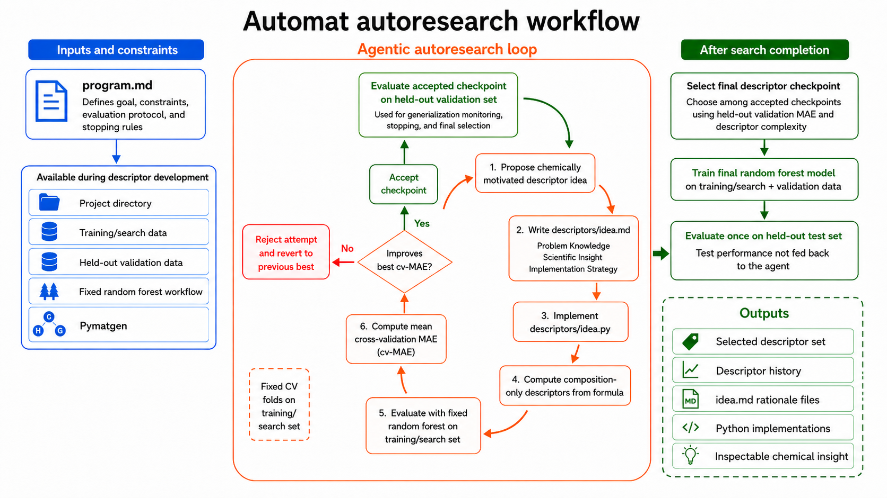
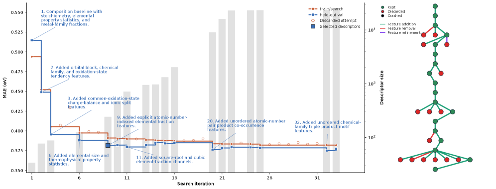
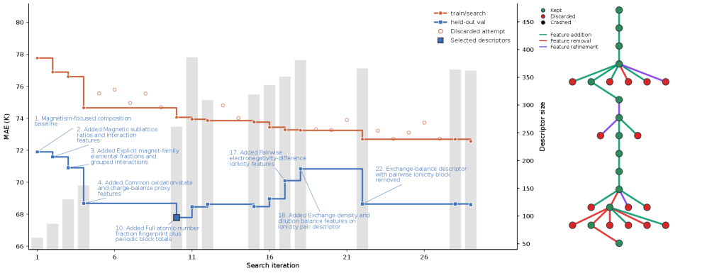
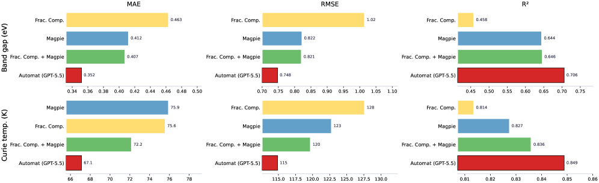

# 自律AIエージェントが設計する材料記述子：Autoresearchパラダイムの材料インフォマティクスへの展開

- 執筆日：2026-05-16
- トピック：大規模言語モデルを中核とする自律型コーディングエージェントが、組成式のみから材料物性予測のための入力特徴量（記述子）を自動設計するという新しいアプローチ
- タグ：Computation and Theory / Surrogate Modeling; Inverse Design / Machine Learning
- 注目論文：Cobelli & Sanvito, "Agentic Design of Compositional Descriptors via Autoresearch for Materials Science Applications," arXiv:2605.14671 (2026) [https://arxiv.org/abs/2605.14671](https://arxiv.org/abs/2605.14671)
- 参照論文数：7本

---

## 1. 背景：なぜ今この話題か

材料科学における機械学習の普及は、ここ十年で目覚ましい進展を遂げた。バンドギャップ、キュリー温度、弾性定数、超伝導転移温度といった物性を実験や第一原理計算に依存せず予測できるモデルが次々と登場し、材料探索のサイクルを大幅に加速した。しかしこうしたモデルの性能は、材料をどのように数値ベクトルへ変換するか、すなわち「記述子（descriptor）」の設計に大きく依存してきた。

記述子設計はある意味で材料インフォマティクスの核心的な職人技であった。研究者は材料化学の直感を駆使して元素の性質を統計処理し、イオン結合性や電気陰性度差、原子サイズのミスマッチといった化学的に意味のある量を手作業で選び出してきた。2016年にWardらが提案したMagpie記述子セット（arXiv:1606.09551）はその代表例であり、元素組成式から原子番号、融点、電気陰性度、原子半径などを元素加重平均・最大・最小・分散などの統計量に変換する132次元のベクトルとして、以来多くの研究のベースラインとして使われてきた。

一方で、深層学習の台頭とともに「記述子を手で設計しなくてもよいのではないか」という発想も生まれた。RoostやElemNetのように、組成式をグラフや分数ベクトルとして入力し、表現を自動学習するモデルが登場した（arXiv:1910.00617）。これらのアプローチは構造情報なしでも強力な予測を可能にしたが、データが少ない実験系では依然として手工芸的な記述子設計と比べて不安定な場合があることも知られている。

こうした状況に新たな地平を開きつつあるのが、大規模言語モデル（LLM）を用いた自律科学研究（autoresearch）パラダイムである。2024年にSakana AIが公開した「The AI Scientist」（arXiv:2408.06292）は、LLMが機械学習の分野で研究アイデアを自動生成し、コードを書き、実験を実行し、論文を書き上げるという「AIによる科学」の最初の包括的なフレームワークとして広く注目を集めた。2025年にはAI Scientist-v2（arXiv:2504.08066）が登場し、専門的なコードテンプレートなしに動作し、独自に執筆した論文がICLRのワークショップで査読合格を果たすという画期的な成果を示した。

材料科学においても、LLMを活用したアプローチが急速に展開されている。Yang, Chen, Evansらによるレビュー（arXiv:2511.10673）は、文献マイニング、物性予測、マルチエージェント実験システムという三つの軸でLLMの役割を整理しており、2025年のLLMハッカソン（arXiv:2605.03205）では材料科学と化学における多様なLLMアプリケーションが報告され、単一目的ツールから統合型マルチエージェントワークフローへの移行が明確に見て取れる。

このような潮流の中で登場したのが、2026年5月14日にarXivに投稿されたCobelli & Sanvito（Trinity College Dublin）による注目論文「Automat」（arXiv:2605.14671）である。この論文が問いかける核心は「AIエージェントは、モデル選択やハイパーパラメータ最適化を超えて、入力記述子そのものを設計できるか」という点にある。以下ではこの論文を軸に、autoresearchパラダイムが材料インフォマティクスにもたらす意味と限界を、関連研究との対話の中で読み解いていく。

---

## 2. 未解決問題は何か

### 記述子の設計はどこまで自動化できるか

組成式ベースの材料物性予測において、記述子の質は予測精度を左右する最大の要因の一つである。Magpieのような手工芸的な記述子は化学的直感に基づいており、汎用性は高いが、特定の物性やデータセットに対して最適化されているわけではない。一方、RoostやCoRENetのような「端点から端点まで（end-to-end）」学習するアプローチは記述子設計を内在化するが、それにはデータ量と計算資源が必要であり、小規模な実験データセットでは不安定になりやすい。

記述子の自動発見という問いは以前から存在した。SISSOのような圧縮センシング的アプローチは、あらかじめ人間が定義した特徴量の組み合わせ空間を探索して、コンパクトで解釈可能な物理的記述子を見つけ出す（Ouyang et al. 2018）。しかしこのアプローチは人間が指定した演算子や変換の枠の中でしか探索できない。LLMエージェントが化学的知識を持ちながら自律的にコードを書き、新しい記述子族を発想できるとしたら、その探索空間は質的に異なる。

ここに問いの本質がある。LLMは事前学習によって材料化学に関する膨大な知識を内在化しているはずである。その知識を活用して、特定の材料物性に対して化学的に意味のある記述子を提案・実装・評価し、フィードバックを受けながら改善できるかどうか。これが解けるなら、記述子設計という人間の専門知識に依存した作業を少なくとも部分的に自動化する道が開ける。

### グリーディな特徴空間拡張をどう制御するか

自律エージェントが記述子を設計する際に生じる根本的な問題の一つが、グリーディな特徴量拡張である。局所的な受け入れ/棄却の判断基準（例えばクロスバリデーションのMAE改善）に従うエージェントは、より多くの特徴量を追加することで短期的に目標関数を改善し続ける。しかし記述子の次元数が20,000を超えるような爆発的な拡張は、一般化性能を損ない、解釈可能性も失わせる。

この問題は機械学習全般における過学習の問題と本質的に同じだが、エージェントによる自動設計という文脈では特有の難しさがある。人間の研究者であれば「これ以上特徴を追加しても意味がない」という感覚的なストップがかかるが、エージェントには明示的な停止基準が必要だ。どのような複雑性ペナルティや検証プロトコルを設ければ、エージェントが「適切な複雑さ」で止まるように誘導できるかは、まだ十分に解かれていない問いである。

### 自律研究エージェントの出力はどこまで科学的な記録として信頼できるか

autoresearchパラダイムには、もう一つの深い問いが潜む。LLMの内部推論過程（chain-of-thought）はモデルプロバイダーによって必ずしも外部に公開されない。エージェントが「なぜこの記述子を選んだか」の根拠が不透明であれば、科学的記録としての価値が失われる。Cobelli & Sanvitoが設計したAutomatでは、各イテレーションでエージェントが `idea.md` ファイルに化学的・物理的根拠を明文化することを義務付けている。これにより、エージェントの設計軌跡が後から監査可能な形で残る。この「外在化された推論（externalized reasoning）」のアイデアは、AIによる科学における再現性と説明責任の問題に対する一つの実践的解答である。ただしLLMの提案した「化学的根拠」が本当に正しい因果関係を反映しているのか、それとも表面的な相関にとどまるのかを人間が検証する必要は残る。

---

## 3. 注目論文の概説

### 研究の目的と対象

Cobelli & Sanvito（2026）の論文「Agentic Design of Compositional Descriptors via Autoresearch for Materials Science Applications」の核心的な問いは「LLMベースのコーディングエージェントが、組成式から材料物性予測用の入力特徴量（記述子）を自律的に設計できるか」である。対象は二つの実験データセット：無機材料の実験的バンドギャップ（Zhuo et al. 2018の4,604組成）と、永久磁石強磁性体の実験的キュリー温度（約500組成）である。

この選択は意図的である。両タスクとも実験データであり、「データが少ない現実の材料科学」という文脈でのベンチマークになっている。また、組成式のみを入力とし、結晶構造は一切使わない設定とすることで、記述子設計の効果を孤立させて評価できる。

### Automatのアーキテクチャと方法論

Automatは、Karpathy（2026）が提唱したautoresearchパラダイムを材料記述子設計に適用したフレームワークである（Figure 1）。ワークフローの中心は以下のサイクルである：

1. エージェントは `program.md`（実験全体の指示書）を読み、タスクの目標・制約・評価プロトコルを把握する。
2. 各イテレーションで、エージェントはまず `descriptors/idea.md` に「問題の知識（Problem Knowledge）」「科学的洞察（Scientific Insight）」「実装戦略（Implementation Strategy）」を記述する。
3. 次に `descriptors/idea.py` として記述子生成コードを実装する。コードはPymatgenを使って組成式を解析し、化学式から導ける数値ベクトルを返す。
4. ランダムフォレストモデルでクロスバリデーション平均絶対誤差（cv-MAE）を評価し、改善すれば採用、悪化すれば棄却してチェックポイントに戻る。
5. 採用されるたびに、ホールドアウト検証セットでの汎化性能も確認し、停止基準の判断に用いる。

このヒルクライミング型探索の特徴は、学習アルゴリズム（ランダムフォレスト）とハイパーパラメータを固定し、変化するのは記述子のみという「制御された実験」設計にある。これにより予測性能の変化を記述子の質に直接帰属させることができる。

*Figure 1（arXiv:2605.14671 Fig.1, CC BY 4.0）: Automatのautoresearchワークフロー。エージェントはprogram.mdの指示に従い、各イテレーションで化学的根拠を持つ記述子戦略を提案・実装・評価し、採用/棄却を判定する。テストセットのラベルは記述子設計中は一切参照されない。*

*Figure 2（arXiv:2605.14671 Fig.2, CC BY 4.0）: バンドギャップタスクにおける記述子設計の軌跡。左：各イテレーションでのcv-MAE（橙）とホールドアウト検証MAE（青）および記述子次元数（灰色棒）。右：設計軌跡グラフ（緑:採用、赤:棄却）。最大の改善は酸化状態・電荷均衡記述子の導入（初期段階）で起きており、後半の次元爆発は汎化改善を伴わない。*

*Figure 3（arXiv:2605.14671 Fig.3, CC BY 4.0）: キュリー温度タスクにおける記述子設計の軌跡。バンドギャップと同様の構成だが、Automatは磁性d電子金属・希土類元素に特化した記述子を自律的に発見した。選択チェックポイントはイテレーション10付近（ホールドアウトMAEが最小）で停止している。*

*Figure 4（arXiv:2605.14671 Fig.4, CC BY 4.0）: 各記述子セットによる最終ホールドアウトテスト性能の比較。縦軸はMAE・RMSE・R²。Automatは全ベースライン（分数組成、Magpie、その結合）に対してバンドギャップ・キュリー温度の両タスクで優れた性能を示す。*

### 二層バリデーション戦略

過学習防止のため、Automatは以下の二層のバリデーションを設けている。

内側のループでは、訓練/探索セットをn分割のクロスバリデーション（分割は固定）し、各イテレーションのcv-MAEを採用/棄却の基準に用いる。これにより確率的なゆらぎによる誤採用を防ぐ。外側では、採用された記述子セットをホールドアウト検証セットで評価し、汎化性能の推移を監視する。最終的に選択される記述子セットは最小cv-MAEではなく、検証セットのMAEが最小でかつ記述子の複雑さが適切なものが選ばれる。

最終評価は、選択された記述子セットで訓練/検証データ全体を使って再訓練したランダムフォレストを、一度だけテストセットで評価することで行う。テストラベルはエージェントには一切露出されない。

### 主要結果

バンドギャップ予測（Figure 2）では、Automatは最良ベースライン（分数組成ベクトル + Magpieの結合）と比較して、テストMAEを0.407 eVから0.352 eVに低減し（約13%改善）、決定係数R²を0.646から0.706へ向上させた。

キュリー温度予測（Figure 3）では、同ベースラインと比較してMAEを72.16 Kから67.13 K（約7%改善）、R²を0.836から0.849へ向上させた。これらの値は手動設計された記述子セットを用いた既報のstate-of-the-artモデル（Nelson & Sanvito 2019）の範囲内にある。

バンドギャップタスクでAutomatが選択した最終記述子（243次元）の構成は以下の通りである：

| 記述子の種類 | 次元数 | 例 |
|---|---|---|
| 化学量論的記述子 | 6 | $N, x_{\max}, x_{\min}, -\sum_i x_i \log x_i$ |
| 元素性質加重統計 | 25 | $\bar{p}, \max_i p_i, \min_i p_i, \sigma(p)$ |
| 元素族分率 | 16 | $\sum_{i \in d} x_i$, ハロゲン分率など |
| 酸化状態記述子 | 30 | $\min_i q_i, \max_i q_i, \sigma(q)$ |
| イオン電荷均衡記述子 | 11 | $\lvert\sum_i n_i q_i\rvert / \sum_i n_i$ |
| サイズ・熱力学記述子 | 35 | $\sum_i x_i r_i, \max_i T_i - \min_i T_i$ |
| 半径コントラスト | 2 | $\exp(\sum_i x_i \log r_i), r_{\max}/r_{\min}$ |
| 分率組成アレイ | 118 | $x_H, x_O, x_{Fe}, \ldots$ |

特筆すべきはバンドギャップタスクにおける「酸化状態・電荷均衡記述子」の発見である。エージェントは化学式から可能な酸化状態の範囲、中性溶液の頻度、イオン強度、カチオン・アニオン分割といった量を提案し、これがホールドアウト検証MAEに対して最大の改善をもたらした。バンドギャップが電気陽性元素と電気陰性元素のコントラスト、イオン結合性・共有結合性の程度、電荷移動に強く依存するという化学的事実と符合している。

一方、キュリー温度タスクでは、エージェントは磁性に関連するd電子金属（Fe、Co）の分率、希土類元素の分率、3d電子族比率など、永久磁石の磁気物理に直接関連する記述子群を自律的に発見した（261次元）。これは、LLMが事前学習で吸収した磁性材料に関する化学的知識を、具体的な記述子の形で外在化できることを示唆している。

### 論文の新規性と限界

この論文の新規性は「記述子設計」というタスクに特化したautoresearchフレームワークを構築し、LLMエージェントが手工芸的記述子ベースラインを超えることを示した点にある。特に、グリーディ探索の限界（特徴次元の際限ない拡張）を検証セットで制御する二層バリデーション設計は実践的に有効であることが示された。

一方で明確な限界も存在する。第一に、単一のautoresearchランは50イテレーション・1回のみであり、再現性の検証が不十分である。第二に、今回用いたGPT-5.5の推論コスト・API費用についての詳細な議論がなく、実用的なコストパフォーマンスは不明である。第三に、グリーディな特徴拡張傾向は本質的には解決されておらず、より洗練された探索戦略（木探索、ベイズ最適化など）が必要である。第四に、バンドギャップとキュリー温度という二タスクに限定しており、他の材料物性への汎用性は未検証である。

---

## 4. 研究史における位置づけ

組成式ベースの材料物性予測の歴史は、記述子設計の歴史でもある。

最初期のアプローチは、化学者の直感から導いた元素性質の統計量を記述子として使うものであった。Ward et al.（2016、arXiv:1606.09551）のMagpieはその体系的完成形であり、原子番号、メンデレエフ数、原子量、融点、共有結合半径、電気陰性度、各軌道の価電子数、基底状態の体積、バンドギャップ、磁気モーメントなど22種類の元素属性を、最小・最大・平均・平均絶対偏差・最頻値の5統計量に変換した132次元のベクトルを構成する。Magpieはmatminerを通じて広く普及し、多くの研究のベースラインとして機能してきた。

次の転換点は、end-to-end深層学習の台頭であった。Goodall & Lee（2020、arXiv:1910.00617）のRoostは、組成式を元素間の重み付きグラフとして表現し、アテンション機構を使って記述子を自動学習する。固定的な手工芸記述子に依存せず、大量のデータから関係性を学習できるため、データが十分にある物性では強力だが、実験データのみが利用可能な小規模タスクでは不安定なことがある。

Automatはこの系譜において第三のアプローチを提示する。深層学習モデルのように記述子を完全に自動学習するのではなく、ランダムフォレストという解釈可能なモデルを固定したまま、記述子の設計プロセスだけをLLMエージェントに委ねる。この「化学的直感を持つエージェントによる半自動記述子設計」は、手工芸と全自動の中間を占める新しい位置づけである。

autoresearchパラダイム全体の文脈では、AI Scientist（Lu et al. 2024）とその後継が重要な背景となる。Lu et al.（arXiv:2408.06292）は機械学習の三分野（拡散モデル、言語モデリング、学習ダイナミクス）でLLMが論文を自律的に生成する枠組みを示した。AI Scientist-v2（Yamada et al. 2025、arXiv:2504.08066）はICLRワークショップで査読合格論文を完全自律的に生成した初の事例として記録されている。これらはAIによる科学的発見の可能性を示す象徴的成果だが、材料科学への適用は限定的であった。Automatはautoresearchパラダイムを材料特有の問題（組成式からの記述子設計）へ専門化した最初の体系的試みとして位置づけられる。

また並行して、Lang2MLIP（Li et al. 2026、arXiv:2605.14527）は機械学習原子間ポテンシャル（MLIP）の開発全体（データ収集・モデル訓練・評価・改善）をLLMエージェントのマルチエージェントワークフローで自動化している。同様のautoresearchパラダイムながら、Automatが記述子設計という特定の小タスクに集中するのに対し、Lang2MLIPはMLIP開発という大規模パイプライン全体を対象とするという違いがある。

2025年のLLMハッカソン（arXiv:2605.03205）の報告は、材料科学・化学分野でのLLMアプリケーションが単一目的ツールから統合型マルチエージェントシステムへ急速に進化していることを示し、Automatが登場した社会的・技術的文脈を鮮明に映している。

---

## 5. どの解釈が最も妥当か

### 「LLMが化学知識を有効活用できた」仮説

バンドギャップタスクでAutomat最大の改善をもたらしたのが「酸化状態・電荷均衡記述子」であったことは、LLMが「バンドギャップはイオン性・酸化状態に強く依存する」という化学知識を事前学習で内在化しており、それを記述子として具現化できたことを示唆する。この解釈は化学的に妥当であり、Walsh et al.（2018）が電荷移動とバンドギャップの関係を詳細に論じていることとも一致する。

キュリー温度タスクでd電子磁性金属の分率・希土類分率などが優先的に発見されたことも同様の解釈を支持する。Fe-CoベースのハードマグネットにおいてNd、Sm等の希土類元素と3d金属の比が磁気異方性とキュリー温度を規定するという既知の物理を、エージェントが言語知識から再発見したと見ることができる。

ただしこの解釈には慎重さも必要である。LLMの「化学的根拠」が真に因果関係を捉えているのか、あるいはバンドギャップが大きい材料系に酸化物が多く（イオン結合的）、その特徴が相関として現れているに過ぎないのかは、一連の実験だけでは判断できない。より厳密には、データが少ない異なる物性タスクや未知の材料系での汎化性能を検証することが必要だ。

### 「ランダムフォレスト固定」戦略の妥当性

Automatが一貫してランダムフォレストを使い、モデル選択や深層学習への移行を行わない設計選択は重要である。ランダムフォレストはタブラー型組成記述子に対して頑健であり、小規模実験データセットでは深層モデルに劣らないことが多い（Breiman 2001）。学習アルゴリズムを固定することで、性能変化を記述子の質のみに帰属させるという評価の純度が保たれる。

一方で、Automatが生成した記述子が深層学習モデルの入力として使われれば、さらに大きな性能向上が得られる可能性もある。この点は本論文では未検証であり、今後の研究が必要な部分である。

### グリーディ拡張の限界とその意味

バンドギャップタスクにおいて後半の反復で記述子次元が20,000を超えたことは、明示的な複雑さ制約なしでは「特徴を増やすほど短期的にcv-MAEが改善する」というヒルクライミングの罠に陥ることを実証した。これはRFに限らず、記述子空間の探索一般に当てはまる問題である。著者らはこの観察を受けて、その後のAutomatの `program.md` に最大許容次元数の制約を追加しているが、最適な複雑さがそもそもタスク依存であることも示している。

この問題に対してより根本的な解決策としては、情報利得に基づく特徴選択、L1正則化による自動スパース化、ベイズ最適化による効率的な探索などが考えられる。これらのアプローチがautoresearchループに組み込まれれば、より効率的な収束が期待できる。

---

## 6. 何が一般化できるか

Automatが示した「LLMコーディングエージェントによる記述子設計」というアプローチは、いくつかの点で材料科学を越えた一般化の可能性を持つ。

第一に、組成式ベースの記述子設計という問題設定は、材料の構造が未知または取得困難な状況、例えば高エントロピー合金の探索、新規多成分系の高スループットスクリーニング、実験データベースからの物性予測において特に価値がある。これらの応用では計算コストの低さと化学式のみから物性を予測できる能力が実用上の強みになる。

第二に、autoresearchループに化学的制約（組成式から導ける量のみを使う）を設けることで、LLMの提案が化学的に意味のある範囲に留まるよう誘導できる。この「ドメイン制約付きコード生成」の戦略は、他の材料モデリングタスク（ポテンシャル関数の設計、フォース場のパラメータ化など）にも応用できる可能性がある。

第三に、Lang2MLIP（arXiv:2605.14527）との比較から見えてくる設計思想の違いは重要である。Lang2MLIPは複数エージェントがMLIP開発の全ステージを協調的に管理するアーキテクチャを採用し、より複雑な系（固体電解質界面 SEI など）への適用を目指す。AutomatはSingle agentを使って記述子設計という単一の問題に集中する。どちらが優れているかは応用文脈によるが、単一エージェント・単一タスクの方が解釈性と制御性が高く、複雑な多成分系や全ワークフロー自動化にはマルチエージェントが向くという棲み分けが見えてくる。

第四に、記述子の解釈可能性という側面も重要である。Automatが生成する記述子は明示的なPythonコードとして実装されており、`idea.md` の科学的根拠と合わせて研究者が検査できる。これは深層学習の潜在表現が不透明であることとは対照的であり、材料科学者が記述子の物理的意味を確認しながら機械学習モデルを活用するというヒューマン・イン・ザ・ループな作業スタイルと親和性が高い。

限界の側面として、現在のAutomatはOpenAI CodexのGPT-5.5を使用しており、APIコストが高く、再現性の確保のために同一設定での複数ランが必要だが費用的に困難という問題がある。オープンソースLLMを使ったコスト効率の高い実装が求められる（Yang et al. 2025、arXiv:2511.10673が指摘するオープンソース化の必要性と一致する）。

---

## 7. 基礎から理解する

### 組成式とは何か、なぜそれだけで予測できるのか

材料科学では、物質を記述する方法が大きく分けて三段階ある。化学組成（何の元素が何対何の比で含まれるか）、結晶構造（原子が空間にどう配置されているか）、そして欠陥・界面・微細組織（巨視的な組織情報）である。

組成式ベースの機械学習は、最も少ない情報量である「組成式のみ」を入力として物性を予測することを目指す。例えばTiO₂は「Ti:O = 1:2」という情報だけを使う。なぜこれで予測が可能かというと、同じ組成の材料はおおむね同じ電子的・熱的・磁的特性を持つという化学の経験則があるためだ（ただし多形性、すなわち同じ組成でも異なる結晶構造が存在する場合は例外となる）。

実際、バンドギャップについては元素の電気陰性度差とイオン結合性から組成式のみで概算できることが古くから知られており（Pauling規則）、キュリー温度も磁性元素の種類と比率から相当程度予測できる（ハイゼンベルク交換相互作用の強さが元素依存するため）。組成式ベースモデルはこうした化学則をデータから学習することで成立する。

### 記述子とは何か

記述子（descriptor）とは、材料（この場合は化学式）を機械学習アルゴリズムが処理できる固定長の数値ベクトルに変換するための変換規則である。直感的に言えば「材料の特徴を数値の列で表現したもの」である。

なぜ記述子が必要かというと、機械学習モデル（特に線形回帰やランダムフォレスト、サポートベクターマシン）は固定長の数値ベクトルを入力として要求するからだ。「TiO₂」という文字列をそのままモデルに渡すことはできない。これを「Tiの電気陰性度は1.54、Oのそれは3.44、差は1.90、平均は...」というように数値に変換する操作が記述子設計である。

Magpie記述子を例に具体的に見ると、元素属性 $p_i$（例えば電気陰性度）と原子分率 $x_i$ に対して以下のような統計量を計算する：

$$\bar{p} = \sum_i x_i p_i \quad \text{（組成加重平均）}$$

$$\Delta p = \max_i p_i - \min_i p_i \quad \text{（範囲）}$$

$$\sigma(p) = \sqrt{\sum_i x_i (p_i - \bar{p})^2} \quad \text{（組成加重標準偏差）}$$

これらを全22種類の元素属性に対して計算し、4〜5種類の統計量をとると、合計で約100次元の数値ベクトルが得られる（Magpieでは132次元）。この固定長ベクトルをモデルに入力して物性を予測する。

記述子の良し悪しは「同じ物性を持つ材料は記述子空間で近くに、異なる物性を持つ材料は遠くに配置されるか」によって決まる。つまり記述子は材料間の「化学的距離」を適切に表現できる座標系でなければならない。

### ランダムフォレストとは何か

ランダムフォレスト（Random Forest）は、複数の決定木（decision tree）を組み合わせたアンサンブル学習手法である。一つの決定木は「TiOₓのような酸化物か？」「電気陰性度差は1.5以上か？」といった二分岐の連鎖で入力空間を分割し、各領域に落ちたデータの平均値を予測値とするモデルである。

ランダムフォレストでは、訓練データのランダムなサブサンプリング（ブートストラップサンプリング）と各分岐点でのランダムな特徴量部分集合の使用という2種類のランダム性を導入することで、多様な決定木を構築する。最終的な予測は全ての木の予測値の平均を取ることで決定する。この「ランダムな多様性」により単一の木より汎化性能が高く、過学習に強い。

材料インフォマティクスでランダムフォレストが好まれる理由は、（1）特徴量の重要度（feature importance）を計算できる、（2）少ないデータでも安定的に動作する、（3）ハイパーパラメータ調整が少ない、（4）外れ値に対して頑健、という特性による。これはAutomatがランダムフォレストを「制御された評価環境」として選んだ理由でもある。

### 大規模言語モデル（LLM）とコードエージェント

大規模言語モデル（Large Language Model, LLM）は、数百億〜数千億のパラメータを持つ深層ニューラルネットワークであり、大規模なテキストデータから次のトークン（単語や文字の断片）を予測する課題で事前学習される。事前学習の過程で、言語の文法・意味・論理だけでなく、科学・数学・プログラミングに関する膨大な知識を内在化する。

GPT-4以降のLLMはコードの理解・生成能力が高く、「コードエージェント」として使うことができる。コードエージェントとは、LLMがコードを生成し、それを実際に実行し、エラーや出力結果をフィードバックとして受け取り、次のコードを改善するというサイクルを自律的に繰り返すシステムである。

ReActフレームワーク（Yao et al. 2023）に代表されるように、LLMの「思考（Reasoning）」と「行動（Acting）」を交互に繰り返すアーキテクチャが、コードエージェントの基盤として機能する。Automatでは、エージェントの行動空間は「Pymatgenを使った組成式解析に基づくPythonコードの記述」に限定されており、これがランダムな数値変換への逸脱を防ぐ上で重要な役割を果たしている。

### クロスバリデーションと過学習

機械学習モデルを評価する際の根本的な問題は、「訓練データでうまくいったモデルが、未知のデータでもうまくいくか」という汎化性能の不確実性である。過学習（overfitting）とは、モデルが訓練データのノイズや偶然の相関まで学習してしまい、未知データへの予測が悪化する現象を指す。

クロスバリデーションは、利用可能なデータをn個の部分集合（フォールド）に分割し、n-1個で訓練して残り1個で評価するという操作をn回繰り返し、評価スコアの平均を算出する手法である。フォールドを固定してランダム性を排除することで、イテレーション間でのスコア比較の信頼性が高まる。これはAutomatが採用する設計でもある。

Automatの二層バリデーションは、内側のクロスバリデーションで記述子の採用/棄却を決め、外側のホールドアウト検証セットで汎化性能の劣化を監視するという、重ねた過学習防止策である。このような多段階の防壁は、記述子設計という探索問題においてテストセットへの情報漏洩（data leakage）を防ぐために本質的に重要である。

### 酸化状態とイオン電荷均衡

酸化状態（oxidation state）とは、化合物中の原子が完全にイオン化したと仮定したときの形式電荷である。例えばNaCl中のNaは+1、Clは-1の酸化状態を持つ。酸化状態は電子授受の度合いを反映し、化合物のイオン結合性・バンドギャップ・磁性など多くの物性と密接に関連する。

イオン電荷均衡記述子は、化合物中の陽イオン側と陰イオン側の電荷の釣り合いを定量化したものである：

$$\text{電荷均衡残差} = \frac{\left|\sum_i n_i q_i\right|}{\sum_i n_i}$$

ここで $n_i$ は元素 $i$ の化学量論係数、$q_i$ は候補酸化状態である。この値がゼロに近いほど電気的中性条件を満たしやすく、安定なイオン化合物であることを意味する。Automatがバンドギャップタスクでこの種の記述子を自律的に発見したことは、LLMが「イオン性化合物のバンドギャップは電荷移動のギャップに規定される」という材料化学の基本知識を保持し、それを数値的に表現する方法を自動設計できたことを意味する。

### キュリー温度と磁性記述子

キュリー温度 $T_C$ は強磁性体が磁性を失って常磁性へ転移する温度であり、永久磁石材料の基本的な性能指標の一つである。ハイゼンベルク交換相互作用モデルによれば：

$$k_B T_C \propto J S(S+1)$$

ここで $J$ は交換相互作用定数、$S$ はスピン量子数である。この式が示すように、$T_C$ は磁性元素のスピンの大きさと磁性イオン間の交換相互作用の強さに依存する。

材料組成の観点からは、3d電子金属（Fe、Co、Ni）や希土類元素（Nd、Sm、Dy）の種類と比率が $T_C$ を大きく左右する。Fe₂O₃は高い $T_C$（948 K）を持ち、Nd₂Fe₁₄BはNd-Fe-B系の代表的な高性能磁石で約585 Kの $T_C$ を持つ。Automatがキュリー温度タスクで $x_{\mathrm{FeCo}}$（Fe+Coの分率）、$x_{\mathrm{RE}}$（希土類の分率）、$x_{\mathrm{FeCo}} \cdot x_{\mathrm{REAct}}$（Fe/Coと希土類の積）といった記述子を発見したことは、これらの物理的関係を数値的に反映している。

---

## 8. 専門用語の解説

**記述子（Descriptor）**
材料（化学式、結晶構造など）を機械学習モデルが入力できる固定長の数値ベクトルに変換するための写像関数、またはそれによって生成されたベクトル自体。記述子の質が予測性能に決定的な影響を与える。本論文では組成式のみを入力とする「組成式ベース記述子」を対象としており、Automatはその設計をLLMエージェントに委ねる。

**Magpie記述子**
Ward et al.（2016）が提案した組成式ベース記述子の標準的な実装。元素の22種類の属性（原子番号、電気陰性度、原子半径、融点など）を、最小・最大・平均・平均絶対偏差・最頻値の5統計量で集約し、合計132次元のベクトルを形成する。matminerライブラリを通じて広く利用可能であり、本論文のベースラインとして使われている。

**Autoresearch（自律研究）パラダイム**
Karpathy（2026）が提唱した概念で、LLMベースのエージェントが研究アイデアの提案・実装・評価・改善を自律的に繰り返すサイクルを指す。The AI ScientistやAutomatはこのパラダイムの具体的実装例。単なる自動化（automation）と異なり、エージェントが定量的フィードバックを基に改善戦略を自己選択する点が特徴的である。

**ランダムフォレスト（Random Forest）**
複数の決定木をアンサンブルした機械学習手法。訓練データのランダムサブサンプリングと特徴量のランダム部分集合選択によって多様な決定木を構築し、その平均予測値を使う。過学習に強く、特徴重要度の解釈が可能で、材料インフォマティクスのベンチマークとして広く使われる。Automatはランダムフォレストを評価環境として固定し、記述子の質の変化のみを測定するという制御された実験設計を採用している。

**クロスバリデーション（Cross-Validation）**
データをn個に分割し、n-1個で訓練・残り1個で評価をn回繰り返して汎化性能の不偏推定量を得る手法。Automatでは分割を固定することで、イテレーション間でのスコア変動がランダム性に起因しないように設計されている。

**酸化状態（Oxidation State）**
化合物中の原子が完全にイオン化したと仮定したときの形式電荷。NaCl中のNa:+1, Cl:-1が典型例。バンドギャップはイオン結合性と強く相関し、酸化状態の範囲や電荷均衡はその代理指標となる。AutomatがバンドギャップタスクでこれらをMagpieより有効な記述子として発見した事実は、化学的に意義深い。

**グリーディ探索（Greedy Search）**
各ステップで局所的に最良の選択をし続ける探索戦略。ヒルクライミングとも呼ぶ。Automatは各イテレーションでcv-MAEを下げる記述子変更のみを採用するが、これは長期的な複雑さの増大を防げないという限界を持つ。より高度な探索（木探索、ベイズ最適化）との組み合わせが今後の課題とされている。

**二層バリデーション（Two-Level Validation）**
過学習を多段階で防ぐ評価プロトコル。Automatでは内側（クロスバリデーションでの記述子採用/棄却）と外側（ホールドアウト検証セットでの汎化性能監視）の二段階を設けることで、記述子設計プロセスへのテストラベル漏洩を防いでいる。

**Pymatgen（Python Materials Genomics）**
材料科学向けの包括的なPythonライブラリ。元素情報（原子量、電気陰性度、イオン半径など）、結晶構造解析、組成式の解析などの機能を提供する。AutomatではエージェントがPymatgen経由で化学組成情報にアクセスし、記述子を計算することが許可されている。

**マルチエージェントシステム（Multi-Agent System）**
複数の自律エージェントが協調して問題を解くシステム。Lang2MLIPのように、データ収集エージェント・モデル訓練エージェント・評価エージェントが分担して機械学習ポテンシャル開発全体を自動化するアーキテクチャが材料科学でも登場している。Automatはシングルエージェントで単一タスクに集中するアプローチであり、この対比は設計思想の違いとして重要である。

**組成式エントロピー（Compositional Entropy）**
化学組成の多様性を定量化する量。Automatが自律的に発見した記述子の一つで：

$$H = -\sum_i x_i \log x_i$$

ここで $x_i$ は元素 $i$ の原子分率。この量が大きいほど多成分系（高エントロピー系）であることを示す。材料系の多成分性が構造的・磁気的・電子的性質に影響することを間接的に表現する記述子として機能する。

---

## 9. 将来展望

今この瞬間に確からしくなってきたことは、LLMベースのコーディングエージェントが材料物性予測における記述子設計という具体的なタスクで、専門家が手で設計したベースライン（Magpie）を超えられるという事実である。Automatが示したのはその「原理証明」であり、規模は小さいながらもランダムフォレストという公平な評価環境のもとで再現可能な改善を示した。これは「AIが材料科学の問題の一部を実際に解けるようになった」という技術的転換点として位置づけられる。また、autoresearchループが生成する `idea.md` と `idea.py` の組み合わせが、エージェントの推論を外在化・監査可能にするという設計原則は、AIによる科学研究の説明責任をどう担保するかという議論に対する実践的な一答を提示した。

一方でまだ未確定の問いは多い。まず、GPT-5.5を使った今回の結果が他のLLM（オープンソースモデルを含む）でも再現されるかどうかは不明である。LLMの材料化学に関する「知識の深さ」は事前学習コーパスの内容に依存しており、同じautoresearchループを異なるモデルで走らせた場合に同じ種類の化学的に意味のある記述子が発見されるかは検証が必要だ。次に、バンドギャップとキュリー温度という二つのタスクへの限定という問題がある。熱電性能（ZT値）、イオン伝導率、弾性定数、電池の容量など、他の材料物性でAutomatが同様の改善をもたらすかは未知である。特に、対象物性の関連する物理化学的因子をLLMが十分に「知っている」かどうかが重要な変数となる。さらに、単一ランでの評価という再現性の問題も残る。統計的に有意な比較のためには、同一設定での複数ランが必要だが、LLMのAPIコストを考えると現実的な制約がある。

次に重要になる実験・理論・計算の方向性としては、第一に複数物性・複数データセットへのAutomatの体系的な適用が挙げられる。MaterialsBenchmarkのような標準ベンチマークでの比較評価が、この手法の信頼性を確立する上で不可欠である。第二に、オープンソースLLMを用いた低コスト実装の開発が急務である（Yang et al. 2025の指摘と合致）。第三に、グリーディ拡張の問題を根本的に解決するためのベイズ最適化的な記述子探索や情報理論的な特徴選択の組み込みが技術的な次のステップとなる。第四に、Automatが発見した記述子の物理的意味の系統的解析、すなわち「エージェントが何を発見したか」を材料科学の観点から解釈する研究が重要になる。これはAIによる科学的発見の真の価値を人間が評価する上で欠かせない作業である。最終的に、Autoresearchパラダイムが材料科学の研究サイクルに統合されるかどうかは、その信頼性・コスト・解釈可能性・再現性という四つの課題がどこまで解決されるかにかかっている。

---

## 参考論文一覧

1. **Cobelli & Sanvito (2026)** [arXiv:2605.14671](https://arxiv.org/abs/2605.14671)
   LLMベースのコーディングエージェント（GPT-5.5）が組成式から材料物性予測用記述子を自律的に設計するAutomatフレームワークを提案・評価した注目論文。

2. **Ward et al. (2016)** [arXiv:1606.09551](https://arxiv.org/abs/1606.09551)
   元素性質の統計量から構成される132次元の組成ベース記述子セット「Magpie」を提案し、材料インフォマティクスの標準ベースラインを確立した論文。

3. **Goodall & Lee (2020)** [arXiv:1910.00617](https://arxiv.org/abs/1910.00617)
   組成式を元素間のグラフとして表現しアテンション機構で記述子を自動学習するRoostモデルを提案した論文。深層学習による組成ベース物性予測の重要な比較対象。

4. **Lu et al. (2024)** [arXiv:2408.06292](https://arxiv.org/abs/2408.06292)
   LLMが研究アイデアの提案からコード実装・実験・論文執筆まで全自動で行う「The AI Scientist」を提案した画期的論文で、autoresearchパラダイムの起源となった。

5. **Yamada et al. (2025)** [arXiv:2504.08066](https://arxiv.org/abs/2504.08066)
   AI Scientistの後継版で、人間が書いたコードテンプレートなしに動作し、完全自律生成した論文がICLRワークショップの査読を通過した初事例を報告した論文。

6. **Li, Orimo & Charoenphakdee (2026)** [arXiv:2605.14527](https://arxiv.org/abs/2605.14527)
   マルチエージェントLLMワークフローで機械学習原子間ポテンシャル（MLIP）の開発全体（データ収集・訓練・評価）を自動化するLang2MLIPを提案した論文。

7. **Yang, Chen & Evans (2025)** [arXiv:2511.10673](https://arxiv.org/abs/2511.10673)
   材料科学における大規模言語モデルの応用を文献マイニング・物性予測・マルチエージェント実験システムの三軸で包括的にレビューし、オープンソース化の必要性を訴えたレビュー論文。

8. **Roy, Blaiszik et al. (2026)** [arXiv:2605.03205](https://arxiv.org/abs/2605.03205)
   2025年のLLMハッカソンで材料科学・化学向けに開発されたアプリケーション群を分析し、単一目的ツールから統合型マルチエージェントシステムへの移行という潮流を示した論文。
