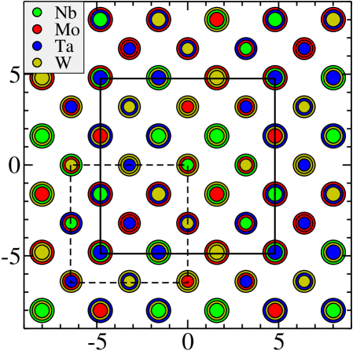
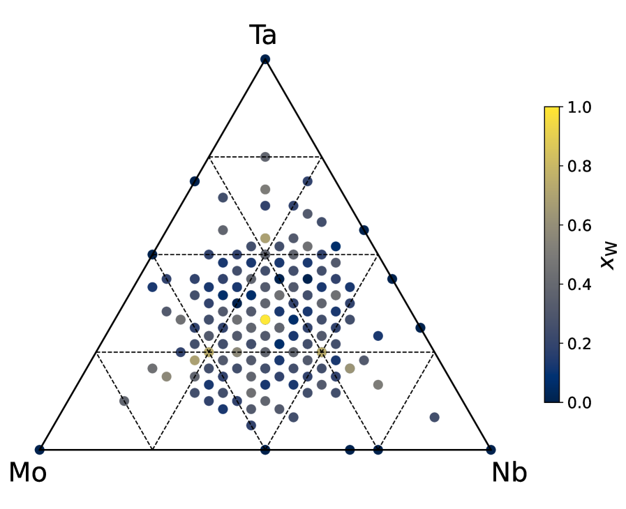
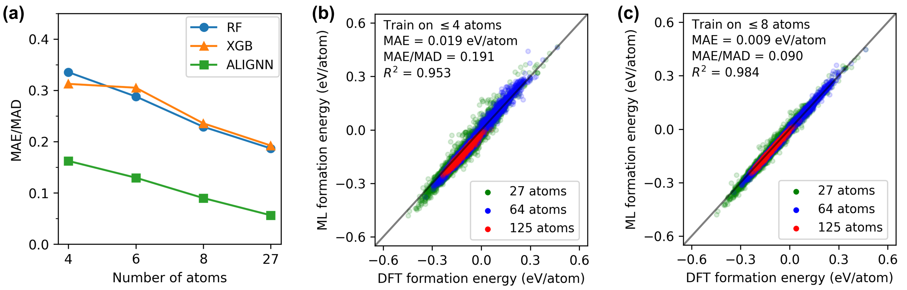
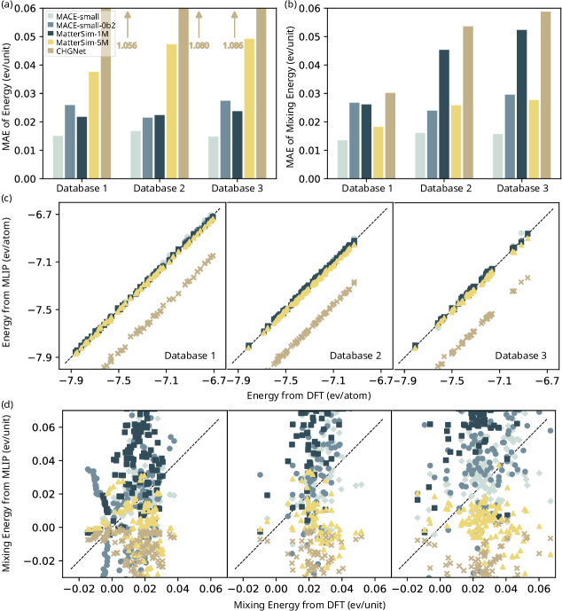

# 高エントロピー合金のエネルギー予測におけるグラフ学習

- 執筆日：2026-05-17
- トピック：局所・大域情報を同時に扱う新しいGNNアーキテクチャ（CrysFracGNN）が、Mo-Nb-Ta-W系高エントロピー合金のエネルギー予測でDFT精度に匹敵する性能を示し、AIによる合金設計加速の可能性を示した。
- タグ：Computation and Theory / Bulk Alloys / Machine Learning; First-Principles Calculations
- 注目論文：Kotama & Huang, "Crystal Fractional Graph Neural Network for Energy Prediction of High-Entropy Alloys," arXiv:2605.08103 (2026) [https://arxiv.org/abs/2605.08103](https://arxiv.org/abs/2605.08103)
- 参照論文数：7本

---

## 1. 背景：なぜ今この話題か

高エントロピー合金（High-Entropy Alloys, HEA）は、2004年に独立した二つのグループによって初めて体系的に報告されて以来、材料科学の中心的なフロンティアのひとつとなっている。従来の金属材料が1〜2種類の主元素を基本とする設計思想だったのに対し、HEAは4〜6種類以上の主元素を近等モル比で混合することで、「高い配置エントロピー」という熱力学的安定化機構を利用して単相固溶体を形成する。その結果として生じる例外的な特性の組み合わせ、すなわち高い硬度と延性の両立、優れた耐熱性・耐食性・耐放射線性は、宇宙・原子炉・極限環境など次世代技術への応用を強く意識させるものである。

しかし、HEAの可能性は同時に巨大な課題でもある。5元系HEAを考えた場合、各元素のモル分率を離散的に変化させるだけで数千から数万の異なる組成が存在し、さらに各組成において原子の配置（デコレーション）パターンが多数存在する。つまりHEAの組成・構造空間は天文学的に広大であり、実験的なトライアル＆エラーで網羅することは原理的に不可能である。第一原理計算（DFT）は電子構造を量子力学的に扱い高精度な結果を与えるが、1回の計算に数時間から数日を要するため、広大な組成空間の探索には不向きである。

こうした状況を変えつつあるのが機械学習（ML）による材料科学の革命である。グラフニューラルネットワーク（GNN）は、結晶構造を原子を節点、原子間結合を辺とするグラフとして自然に表現できるため、結晶材料の物性予測に特に適している。2018年にXie & GrossmanによってCGCNN（Crystal Graph Convolutional Neural Network）が提案されて以来、GNNは材料物性予測の標準的な手法となった。その後のALIGNN、MEGNet、DimeNet、CHGNetなどの発展により、DFTデータを学習基盤とした高精度な物性予測が急速に広まった。

ところが、HEAへのGNN適用はこの文脈において特別な困難を伴う。通常の結晶ではGNNが利用する「長距離化学秩序」が存在するが、HEAは本質的に化学的な無秩序系であり、原子種が格子点上でランダムに分布する。この特性が、既存のGNNフレームワークをそのまま適用する際の根本的な障壁となってきた。局所的な原子環境だけを記述すれば大域的な組成効果を見逃し、組成情報だけを取り込めば局所的なアレンジメントの効果が失われる。この二つの情報をどう統合するかが、HEA向けGNN研究の中心的な問いである。

2026年に提案されたCrysFracGNN（Crystal Fractional Graph Neural Network）は、まさにこの問いに正面から向き合った研究である。局所原子環境を扱うグラフ注意ネットワーク（GAT）と、全体の元素組成を扱う全結合ニューラルネットワークを並列に配置し、両者の出力を融合することで、DFTに匹敵するエネルギー予測精度（RMSE 0.00139 eV/atom）を達成している。本記事ではこの論文を主軸に、HEA機械学習研究の流れを俯瞰しつつ、現在の主要な論点と今後の展開を論じる。

---

## 2. 未解決問題は何か

### 化学的無秩序のグラフ表現問題

GNNが結晶材料で成功を収めた理由は、周期格子構造を「単位セルのグラフ」として明確に定義できる点にある。しかしHEAでは、複数の元素がランダムに格子点を占有するため、「どの構造が代表的か」を定めることができない。同じ組成でも原子のデコレーションが異なれば構造が異なるため、単一のグラフ表現では HEA全体を代表できないのだ。

この問題への一つのアプローチは、HEAを局所環境グラフの集合（set of local environment graphs）として表現することである。Zhang et al.（2024, arXiv:2408.16337）のLESetsモデルはまさにこのアイデアを実装した。HEAの各原子とその近傍から独立したグラフを生成し、全グラフのアンサンブルを合金の表現とする。これにより、化学的無秩序を「グラフの分布」として扱うことができる。しかし、このアプローチは局所情報の集約には優れる一方、元素の全体的な割合（大域的組成情報）を直接には扱いにくい。

CrysFracGNNは異なる方向を選んだ。16原子のBCC超格子を一つのグラフとして扱い、その局所情報をGATで学習しながら、別途FractionFNNという全結合ネットワークで元素分率（組成ベクトル）を独立してエンコードする。両者を最後に結合することで、「局所構造」と「大域組成」の両情報を明示的に統合する。この設計の有効性は結果から支持されるが、根本的な問いは残る：どちらの情報がエネルギー予測においてより支配的か？また、両者の統合に最適なアーキテクチャはどのようなものか？

### 小データで大きな組成空間を一般化できるか

DFT計算は高精度だが高コストであり、HEAのように無限に広い組成空間に対して包括的なデータセットを構築することは現実的ではない。Li et al.（2024, arXiv:2403.15579）は8万4千構造という大規模DFTデータセットを構築し、MLモデルの汎化能力（2元系から7元系への外挿）を系統的に検証した。この研究は、GNNが2元系データから3元系以上の合金へある程度汎化できることを示している一方、組成外挿の精度は構造の弛緩状態や学習データの構造的多様性に強く依存することも明らかにしている。

CrysFracGNNはわずか1247個のDFT構造を学習に使用している。これはLi et al.の84k構造と比べると2桁も少ない。少数データで高精度を達成できた背景には、対象をMo-Nb-Ta-W系BCC構造という特定の系に絞り込んだことがある。しかしこれは翻ってみると、より広い組成空間への転移可能性という問いを残す。少ないデータで学習した局所モデルが、未見の組成や元素系へ外挿できるかどうかは未解決の問題である。能動学習（Active Learning）を使って学習効率を高める戦略（例：2511.12514）も検討されているが、最適なサンプリング戦略の設計は依然として研究課題である。

### 大規模スーパーセルへのスケーラビリティ

機械学習モデルを実際の材料設計に使う場面では、実験で観察されるナノ構造や析出物、組成ゆらぎを再現するために、数百〜数千原子のスーパーセルが必要になる。CrysFracGNNは16原子の BCC超格子で訓練されており、54原子セルではRMSEが0.00301 eV/atom（訓練時の約2倍悪化）、1024原子セルでは0.0162 eV/atom（約15倍悪化）まで精度が落ちる。この劣化の物理的な理由は明快で、16原子の局所環境から学習した特徴量が、より大きなセルでの長距離相関や累積的な原子間相互作用を表現できないことにある。

この問題は、GNNがローカルなメッセージパッシング機構に依拠する限り、原理的に避けにくい制約である。対照的に、機械学習原子間ポテンシャル（MLIP）は原子ごとのエネルギー和としてシステム全体のエネルギーを計算するため、スーパーセルサイズの変化に対して自然に拡張できる。MLIPを用いた百万原子スケールの分子動力学シミュレーション（arXiv:2604.01642）やMC計算（arXiv:2503.12591）がすでに実現されているのに対し、GNNベースのエネルギー予測モデルがどこまでスケールアップできるかは今後の重要課題である。

---

## 3. 注目論文の概説

### 研究の目的と対象材料

注目論文（arXiv:2605.08103, Kotama & Huang, 2026）は、Mo（モリブデン）-Nb（ニオブ）-Ta（タンタル）-W（タングステン）4元系HEAのエネルギーを、DFT精度に匹敵するスピードで予測することを目的としている。この系は全元素がBCC（体心立方）構造を持つ難融点金属であり、航空宇宙・核融合炉向けの構造材料として注目される現実的な系である。計算対象は16原子のBCC B2型超格子（$2\times 2\times 2$の単位セル）であり、原子種の組み合わせとデコレーションパターンを変えながらDFT計算を実施してデータセットを構築した。

### 研究アプローチ

**データセット生成**：Quantum ESPRESSOによる第一原理計算（PBE-GGA汎関数、プレーンウェーブ基底、カットオフエネルギー80 Ry）で、598個の4元系、16個の3元系、24個の2元系、4個の純金属構造を計算した。エネルギーの収束は0.1 meV以内、力の収束は1 meV/Å以内に設定した。低エネルギー構造を追加した合計1247構造で訓練し、198個の4元系構造で検証した。

**CrysFracGNNアーキテクチャ**：モデルは3つのサブモジュールから構成される（図3参照）。

1. CrystalGNN：グラフ注意ネットワーク（GAT）を用いた局所環境モジュール。16原子を節点とし、BCC格子での最近傍接続を辺として定義する。各原子は元素種と周囲8個の原子との距離を特徴量として持つ。5層のGATを経て、チャンネルごとの平均プーリングで16節点の特徴量を固定サイズのベクトルに集約する。

2. FractionFNN：元素分率エンコーダ。$(x_{\rm Mo}, x_{\rm Nb}, x_{\rm Ta}, x_{\rm W})$という4次元の組成ベクトルを入力として受け取り、全結合層でより高次元の組成埋め込み（compositional embedding）に変換する。各元素の分率は0から1の範囲にあり、全元素の和が1になるという拘束が自然に成立する。

3. ConcatFNN：融合モジュール。CrystalGNNの出力とFractionFNNの出力を連結（concatenation）して、最終的な全エネルギーを出力する。ReLU活性化関数を持つ全結合層が積み重なった構造をとる。

ハイパーパラメータの最適化にはOtuna（ベイズ最適化フレームワーク）を用いて100試行を実施した。最適構成では、CrystalGNNは5層（チャンネル数: 128, 2, 256, 64, 256）、FractionFNNは3層（16, 4, 128ノード）、ConcatFNNは5層（64, 2, 4, 16, 1ノード）となった。

$$\hat{E}_{\rm total} = f_{\rm ConcatFNN}\left(f_{\rm CrystalGNN}(\mathcal{G}),\ f_{\rm FractionFNN}(\mathbf{x})\right)$$

ここで $\mathcal{G}$ は16原子グラフ、$\mathbf{x} = (x_{\rm Mo}, x_{\rm Nb}, x_{\rm Ta}, x_{\rm W})$ は組成ベクトル、$f_{*}$ は各サブモジュールの写像を表す。

### 主要結果

*図1: CrysFracGNNの全体アーキテクチャ。CrystalGNNが16原子グラフから局所情報を、FractionFNNが元素分率から大域的組成情報を抽出し、ConcatFNNが両者を融合してエネルギーを予測する（arXiv:2605.08103, CC BY 4.0）。*

1247点のDFT構造で訓練した結果、検証データのRMSEは0.00133 eV/atom、テストデータ（対称操作で水増しした435,456点のデータ）でのRMSEは0.00139 eV/atomeまで下がり、DFT計算の達成可能な精度目標（0.001 eV/atom）に肉薄する結果となった。特に低エネルギー構造（安定相に近い構造）に限定した評価ではRMSEが0.00054 eV/atomとなり、安定構造のスクリーニングにとって重要な低エネルギー領域での識別能力が高いことが示された。

また、対称操作（回転・鏡映）に対して予測値がほぼ変化しないことが確認された。これはGATの等変性（equivariance）に直接起因するわけではなく、データ拡張（対称操作を適用した水増しデータ）と適切なグラフ表現（距離ベースの辺重み）の組み合わせによるものと考えられる。

一方で、スケーラビリティの問題は明確に示された。54原子のスーパーセルに対してはRMSE 0.00301 eV/atom（2.2倍悪化）、1024原子セルでは0.0162 eV/atom（15倍悪化）となった。1024原子の場合、エネルギーが系統的に過小評価される傾向があることも指摘されており、これは訓練データの16原子セルに最適化された特徴量が、より大きなセルでの遠距離相関を適切に表現できていないことを示唆している。

### 論文の新規性と限界

新規性は、GNNによる局所構造学習と全結合ネットワークによる大域組成情報のエンコードを「並列かつ明示的に統合した」アーキテクチャにある。この設計思想は、既存の多くのGNNが局所環境のみを扱ってきたこと、あるいは組成情報を節点特徴量として暗黙的に取り込む方式とは一線を画す。また、ハイパーパラメータ最適化にOtunaを組み込んだことで、アーキテクチャ設計の客観性を担保している。

限界は明確である。(1) 対象が Mo-Nb-Ta-W の4元系BCC一系に限定されており、他の元素系や結晶構造への転移可能性が未検証である。(2) 学習データが1247点という小規模であり、より広い組成空間での汎化性能は不明である。(3) スーパーセルへのスケーラビリティに問題があり、実際のモンテカルロ計算や有限温度シミュレーションへの直接適用は困難である。(4) 元素の化学ポテンシャルや弾性定数など、エネルギー以外の物性への拡張が今後の課題として残る。

---

## 4. 研究史における位置づけ

### GNNによる結晶材料物性予測の系譜

GNNが結晶物性予測に本格的に導入されたのは、2018年のXie & Grossman によるCGCNN（arXiv:1710.10324）が嚆矢である。CGCNNは、原子を節点・最近傍原子間の結合を辺とするグラフに対してグラフ畳み込みを適用し、8種類の物性（形成エネルギー、バンドギャップ等）を単一の学習フレームワークで予測した。$10^4$点の学習データで高精度を達成したこの論文は、「記述子を手設計する必要なく、構造から直接物性が学習できる」という新しいパラダイムを切り開いた。

その後、ALIGNN（Choudhary & DeCost, 2021）は原子間結合の角度情報を辺から辺へのグラフとして取り込み、精度を大きく改善した。DimeNet, SchNet, PaiNN等は原子間距離の連続的な表現を採用し、等変性（物理的に正しい変換則）を強制することで更なる精度向上を実現した。CHGNet（2023）はさらに電荷と磁気モーメントを取り込んだ汎用的なモデルとなり、今や「Foundation Model（基盤モデル）」と呼ばれる段階に達している。これらのモデルは多様な結晶材料に適用可能だが、本質的に「化学的に秩序のある結晶」を前提としている点で共通している。

### HEAの計算モデリング手法の変遷

HEA研究における原子スケール計算の主流は、長い間「クラスター展開（Cluster Expansion, CE）」と「有効対相互作用（Effective Pair Interaction, EPI）」モデルであった。CEは結晶の全エネルギーを、各格子点の占有確率と相関関数（クラスター関数）の積の和として展開する。

$$E = J_0 + \sum_i J_i \sigma_i + \sum_{i<j} J_{ij} \sigma_i \sigma_j + \cdots$$

ここで $\sigma_i$ は格子点 $i$ の占有変数、$J$ はクラスター相互作用パラメータである。CEは少数のDFT計算からパラメータを確定できる効率的な手法だが、対象とする元素系・組成範囲が固定されるという根本的な制約がある。

2020年代に入り、機械学習原子間ポテンシャル（MLIP）がHEA研究に急速に浸透してきた。MLIPは原子ごとのエネルギーが局所化学環境の関数であるという「局所性近似」のもとで、エネルギー面を機械学習で近似する。neuroevolution potential（NEP）やGRACEなどの手法は、多元素合金向けの百万原子シミュレーション（arXiv:2604.01642）を現実のものとした。しかし、MLIPをHEAに適用する際にも普遍的なモデルが混合エネルギーを正確に再現できないという問題が明らかになっており、対象系特化のファインチューニングが必要なことが多い（arXiv:2603.23029）。

### CrysFracGNNの位置づけ

CrysFracGNNは、MLIPとは異なる設計哲学をとっている。MLIPが「原子ポテンシャル」、すなわち各原子が局所環境から受ける原子エネルギーを学習して系全体のエネルギーを積算するのに対し、CrysFracGNNは「スーパーセル全体のエネルギー」を一挙に予測する。この「per-cell prediction」の方式は、小スーパーセル（16原子）に特化することで少ないデータで高精度を実現できるという利点を持つが、スケーラビリティを犠牲にする。

また、同じくHEAへのGNN適用を試みたLESets（arXiv:2408.16337）と比較すると、LESetsが「局所環境グラフの集合」として分布を扱う統計的なアプローチをとるのに対し、CrysFracGNNは一つの固定サイズスーパーセルを入力として扱う決定論的アプローチをとっている。LeSetsは機械的特性（弾性定数など）の予測を主なターゲットとし、CrysFracGNNはエネルギー予測に特化している点でも、両者は相補的な関係にある。

*図2: Mo-Nb-Ta-W 4元系HEAの学習データ中の組成分布。各点が一つのDFT計算構造に対応する（arXiv:2605.08103, CC BY 4.0）。*

---

## 5. どの解釈が最も妥当か

### 局所-大域統合の有効性：支持と限界

CrysFracGNNの中心的な主張は、「局所原子環境（GATで学習）と大域的組成情報（FractionFNNで学習）を明示的に統合することで、両方を暗黙的に扱う手法より優れたエネルギー予測が可能である」というものだ。この主張を支持する証拠として、0.00139 eV/atomというRMSEがDFTのベンチマーク精度（0.001 eV/atom）に匹敵することが挙げられる。また、低エネルギー構造での高精度（0.00054 eV/atom）は、安定相の識別という材料設計上の核心課題に対して特に有望なシグナルである。

ただし、この解釈を裏付けるアブレーション実験（CrystalGNNのみ、FractionFNNのみ、両者の融合）の結果が論文中に示されていないことは重要な留保点である。本当に「統合」が性能向上をもたらしているのか、それとも一方のサブモジュールのみが支配的なのかは、現時点では評価できない。今後のフォローアップ研究で、各モジュールの寄与を分解した解析が必要である。

比較として、Li et al.（arXiv:2403.15579）のデータ収集した84k構造を用いた研究では、最良モデルの形成エネルギーMAEが0.007 eV/atomという結果を報告している。これはCrysFracGNNのRMSEより高い誤差だが、こちらははるかに広い組成・元素空間を対象としている点で直接比較はできない。むしろ対象系の複雑度と必要なデータ量のトレードオフとして理解すべきである。

*図3: Li et al. による84kアロイDFTデータセットで訓練したMLモデルの汎化性能。2元系から7元素系へのGNNの汎化能力が示されている（arXiv:2403.15579, CC BY 4.0）。*

### ユニバーサルMLIPのファインチューニングとの比較

近年の重要なアプローチとして、大規模データで訓練された「ユニバーサルMLIP」（MACE-MP0、CHGNet、M3GNetなど）をHEA向けにファインチューニングする戦略がある。Zhou & Komsa（arXiv:2603.23029）は、5元素2D-HEA（Mo,Ta,Nb,W,V）S$_2$系に対し、ユニバーサルMLIPがファインチューニングなしでは混合エネルギーを正確に再現できないことを示した。一方、系に特化した訓練データでファインチューニングすれば、DFT精度に近い混合エネルギー予測と、DFTでは到達不可能な規模のモンテカルロシミュレーションが可能になる。

この結果はCrysFracGNNの設計思想、すなわち「対象系を絞り込んで専用モデルを作る」という考え方を別の角度から支持している。ユニバーサルな精度と特化モデルの高精度は依然としてトレードオフの関係にあり、「Foundation Modelを特化モデルの初期値として使う」というファインチューニング戦略が現時点で最も実際的な解決策の一つと見なされる。

*図4: Zhou & Komsa による2D-HEA（MoTaNbWV系）に対するユニバーサルMLIPのファインチューニング結果。ファインチューニングなしではDFTと大きく乖離する混合エネルギーが、ファインチューニング後に大幅に改善される（arXiv:2603.23029, CC BY 4.0）。*

### モンテカルロへの接続と限界

実際の合金設計では、エネルギー予測モデルをモンテカルロ（MC）計算に組み込み、有限温度での秩序無秩序転移、析出相形成、ナノ構造の発展を調べることが重要になる。Liu et al.（arXiv:2503.12591）は、MLIPを用いたMoNbTaWおよびFeCoNiAlTi系でのGPU加速スケーラブルMCを実現し、ナノ粒子・3D連結ナノ粒子・無秩序相などの多様なナノ構造形成を明らかにした。

この研究で使用されたエネルギーモデルは「有効対相互作用（EPI）モデル」であり、GNNベースのモデルではない。CrysFracGNNのようなGNNモデルをMCに組み込むには、各MC ステップでグラフを再構築してGNNの推論を行う必要があり、計算コストがMLIPのforward passよりも一般に高くなる。スケーラブルなMCと高精度なGNNエネルギーモデルをどう統合するかは、次世代のHEA計算研究の重要課題である。

### LLMとGNNの融合による合金設計加速

Ghafarollahi & Buehler（arXiv:2410.13768）は、GNNによる物性高速予測をLLM（大規模言語モデル）駆動のマルチエージェントシステムと組み合わせて、NbMoTa系BCC合金の自動設計を実現した。GNNが各組成でのPeierlsバリア（転位運動の活性化エネルギー）を数ミリ秒で予測し、LLMエージェントが推論・計画・実験提案を担うことで、広大な合金空間を自律的に探索する。この研究が示すのは、CrysFracGNNのようなGNNエネルギーモデルが今後LLMベースの合金設計プラットフォームの部品として組み込まれていく将来像である。

---

## 6. 何が一般化できるか

### BCC系難融点HEAを超えた展開

CrysFracGNNは現時点でMo-Nb-Ta-W系BCC構造に特化しているが、そのアーキテクチャの設計原理は他の系へも自然に拡張できる。BCC高エントロピー合金の中でも、CrMoNbTaVW系など難融点HEAの探索においては、エネルギー予測モデルが組成最適化の中核ツールになりうる。FCC系HEA（例：CoCrFeMnNi系、CantoroのCantor合金）への拡張も検討できるが、その場合は16原子の FCC超格子を入力とする必要があり、BCC B2構造のグラフとは辺の定義が異なる。アーキテクチャ自体の変更は軽微だが、グラフ構造の再設計と新たなDFTデータセットの収集が必要になる。

また、「Fractional」（分率）というアイデアは、高エントロピー酸化物（HEO）、高エントロピーホウ化物（HEB）、高エントロピーセラミックスなど、HEAの概念を無機材料全般に拡張した「高エントロピー材料（HEM）」にも適用可能である。Li et al.（2403.15579）が示したように、DFT計算コストが高い多元素系でML汎化の効果は特に大きく、CrysFracGNNの大域組成エンコーダは非金属HEMでも有効である可能性がある。

### 2D-HEAへの適用可能性

2次元高エントロピー合金（2D-HEA）は、グラフェンやMoS$_2$に代表される2D材料の化学的多様性とHEAのエントロピー安定化を組み合わせた新しい物質クラスである。Zhou & Komsaの研究（arXiv:2603.23029）が扱った（Mo,Ta,Nb,W,V）S$_2$系がその典型であり、触媒・潤滑・電子デバイスへの応用が期待される。2D構造ではグラフの辺の定義（2次元格子内の最近傍）がBCCとは異なるが、CrysFracGNNの「グラフ（局所環境）＋分率（大域組成）」という二本立ての設計思想はそのまま適用できる。実際、2D-HEAでもユニバーサルMLIPがファインチューニングなしでは不正確であることが示されており、系特化の軽量モデルへの需要は存在する。

### 下流タスクへの統合：マルチエージェント材料設計

今後最も重要な一般化の方向は、CrysFracGNNのようなGNNエネルギー予測モデルを、より大きな材料設計ワークフローの部品として統合することである。Ghafarollahi & Buehlerが示したように、GNNは「LLMエージェントが材料特性を問い合わせるためのオラクル（物性計算エンジン）」として機能する。エネルギー予測精度が高ければ高いほど、エージェントがより信頼できる情報に基づいて意思決定できる。将来的には、GNNによるエネルギー計算→MC計算による安定構造探索→LLMエージェントによる組成最適化→合成条件提案、という一貫したサイエンスロードマップがAIによって自律的に推進される未来が見えてくる。

### 設計原理としての「ローカル+グローバル情報統合」

最も広い意味での一般化として、「局所環境情報（グラフ）と大域的情報（スカラー・ベクトル）を別々にエンコードして融合する」というCrysFracGNNの設計原理は、材料以外の分野にも示唆を与える。例えば、分子-溶媒系の自由エネルギー予測（分子の局所構造＋溶媒の巨視的性質）、複合材料の機械特性予測（微細組織グラフ＋配合比ベクトル）などへの応用が考えられる。「グラフ的な構造情報」と「スカラー/ベクトル的な大域情報」を統合するフレームワークは、材料科学における汎用的な設計パターンとなる可能性がある。

---

## 7. 基礎から理解する

### グラフとは何か、なぜ材料に使えるか

グラフ（graph）とは、「節点（node）の集合」と「辺（edge）の集合」からなる数学的構造である。節点はある実体（例：原子）を表し、辺はその実体間の関係（例：原子間の結合・近傍関係）を表す。グラフは柔軟な表現であり、分子・結晶・タンパク質・交通網・ソーシャルネットワークなど多様な対象に適用できる。

特に材料科学においてグラフ表現が有用なのは、「どの原子が近傍にあるか」という情報が結晶構造の本質であり、これが自然にグラフの隣接行列として表現できるからである。例えば、FCC金属の単位セルでは中心原子が12個の最近傍原子を持ち、これら12本の辺がグラフに記録される。

ニューラルネットワークがこのグラフを入力として受け取るために「グラフニューラルネットワーク（GNN）」が開発された。GNNの中核は「メッセージパッシング（message passing）」という操作である。各節点は、隣接する節点から「メッセージ」を受け取り、それを集約（aggregation）して自身の特徴量を更新する。この操作を繰り返すことで、ある原子の表現が徐々に遠方の原子情報を取り込んでいく。

$$\mathbf{h}_i^{(l+1)} = \phi\left(\mathbf{h}_i^{(l)},\ \bigoplus_{j \in \mathcal{N}(i)} \psi\left(\mathbf{h}_i^{(l)}, \mathbf{h}_j^{(l)}, \mathbf{e}_{ij}\right)\right)$$

ここで $\mathbf{h}_i^{(l)}$ は $l$ 番目の層における節点 $i$ の特徴ベクトル、$\mathcal{N}(i)$ は節点 $i$ の隣接節点集合、$\mathbf{e}_{ij}$ は辺特徴（例：原子間距離）、$\psi$ はメッセージ関数、$\oplus$ は集約操作（合計・平均・最大値など）、$\phi$ は更新関数である。$\psi$ と $\phi$ はいずれもニューラルネットワークで表現できる。

### グラフ注意ネットワーク（GAT）の直感的理解

CrysFracGNNで使用されるGATは、GNNの一種であり「アテンション（注意）機構」を導入したものである。通常のGNNがすべての隣接原子からのメッセージを等しく重みづけして集約するのに対し、GATは各隣接原子の重要度を自動的に学習する。

$$\mathbf{h}_i^{(l+1)} = \sigma\left(\sum_{j \in \mathcal{N}(i)} \alpha_{ij}^{(l)} \mathbf{W}^{(l)} \mathbf{h}_j^{(l)}\right)$$

ここで $\alpha_{ij}$ はアテンション係数であり、節点 $i$ に対して節点 $j$ がどれだけ重要かを表す重みである。$\mathbf{W}^{(l)}$ は学習可能な重み行列、$\sigma$ は活性化関数（例：ReLU）である。アテンション係数は

$$\alpha_{ij} = \frac{\exp\left({\rm LeakyReLU}\left(\mathbf{a}^T [\mathbf{W}\mathbf{h}_i \| \mathbf{W}\mathbf{h}_j]\right)\right)}{\sum_{k \in \mathcal{N}(i)} \exp\left({\rm LeakyReLU}\left(\mathbf{a}^T [\mathbf{W}\mathbf{h}_i \| \mathbf{W}\mathbf{h}_k]\right)\right)}$$

の形で計算される（$\|$ は連結操作）。GATにより、例えば「ある原子の周囲にある特定の元素の原子からのシグナルを重視する」ということを、明示的に設計せずとも訓練データから自動的に学習できる。

### 高エントロピー合金（HEA）の基礎

HEAは5種類以上の主元素を「ほぼ等モル」（各5〜35 at%程度）の比率で混合した合金である。「高エントロピー」という名前は、混合の配置エントロピー

$$\Delta S_{\rm mix} = -R \sum_{i=1}^{n} x_i \ln x_i$$

が大きくなることに由来する（$R$: 気体定数、$x_i$: 元素 $i$ のモル分率、$n$: 元素数）。等モル5元系では $\Delta S_{\rm mix} = R\ln 5 \approx 13.4$ J/(mol·K) となる。この高いエントロピー項が自由エネルギー $\Delta G_{\rm mix} = \Delta H_{\rm mix} - T\Delta S_{\rm mix}$ を下げ、金属間化合物への相分解を抑制して単相固溶体を安定化させる、というのがHEA設計の基本思想である（ただし実際には必ずしも単相を保証するわけではなく、相図の詳細な解析が必要）。

なぜHEAが注目されるのかというと、複数元素の組み合わせにより「格子歪み効果」「遅拡散効果」「カクテル効果」などと呼ばれる4つの核心効果が生じ、通常の合金では同時に達成し難い特性の組み合わせ（例：高強度と高延性の両立）が実現できるからである。

BCC型HEAの典型であるMo-Nb-Ta-W系では、いずれも難融点金属であり融点は2600〜3400 K程度、BCC格子定数は3.1〜3.3 Å程度とよく一致する。この格子定数の近似性（原子半径のミスマッチが小さい）が固溶体の安定性を高めており、計算モデリングの対象としても扱いやすい系である。

### 密度汎関数理論（DFT）の概要

DFTは、量子力学的な多体電子系を一体問題に帰着させる枠組みである。基本定理であるKohn-Sham DFTでは、相互作用する多電子系の基底状態エネルギーが電子密度 $n(\mathbf{r})$ の汎関数として一意に決まる（Hohenberg-Kohnの定理）。実際の計算では、一体のKohn-Sham方程式

$$\left[-\frac{\hbar^2}{2m}\nabla^2 + v_{\rm ext}(\mathbf{r}) + v_{\rm Hartree}[n] + v_{\rm xc}[n]\right] \phi_i(\mathbf{r}) = \varepsilon_i \phi_i(\mathbf{r})$$

を自己無撞着に解く。ここで $v_{\rm ext}$ は原子核ポテンシャル、$v_{\rm Hartree}$ はクーロン斥力の古典的項、$v_{\rm xc}$ は交換相関汎関数（電子の量子多体効果を近似する項）であり、これにPBE-GGAなどの近似が使われる。

DFTの計算コストは系の大きさ $N$ に対して $O(N^3)$（厳密解）から $O(N)$（線形スケール近似）のオーダーであり、数十〜数百原子の系に対して数時間〜数日の計算時間を要する。機械学習によるサロゲートモデルはこのDFTの計算を、訓練後は数ミリ秒で代替することを目標とする。

### エネルギー・形成エネルギー・混合エネルギーの関係

材料計算において頻繁に登場するエネルギー量を整理しておこう。

全エネルギー $E_{\rm total}$ は系の基底状態における全ポテンシャルエネルギーと運動エネルギーの和で、DFT計算が直接与える量である。ただし絶対値には意味がなく、参照系からの差として解釈する。

形成エネルギー $\Delta H_{\rm f}$ は、合金（または化合物）が各純元素から形成される際のエネルギー変化である。

$$\Delta H_{\rm f} = E_{\rm alloy} - \sum_i x_i E_i^{\rm pure}$$

ここで $E_i^{\rm pure}$ は元素 $i$ の単体の1原子あたりのエネルギーである。$\Delta H_{\rm f} < 0$ であれば合金形成が熱力学的に有利であることを示す。

混合エネルギー $\Delta E_{\rm mix}$ はしばしば形成エネルギーと同義に使われるが、特に多元素系では「ランダム固溶体からの偏差」を指すこともある。安定な析出相や化学秩序の有無を判断するために、混合エネルギーの符号と大きさが重要な指標となる。

CrysFracGNNが予測対象としているのは「全エネルギー $E_{\rm total}$」であり、組成依存性を除いた場合のエネルギー（形成エネルギーに相当）を実質的に学習していると考えられる。

### 機械学習における超平面探索と材料スクリーニング

材料設計においてMLの最も重要な応用の一つは、「多数の候補の中から安定な相を素早くスクリーニングする」ことである。DFT計算で計算された全構造のエネルギーから「凸包（convex hull）」を構成することで、熱力学的に安定な相の組成を特定できる。

凸包とは、全組成-エネルギー空間における最安定構造の集合であり、凸包上にある構造が熱力学的に安定（他の相への分解に対して有利）である。凸包からのエネルギー距離（$\Delta E_{\rm hull}$）が小さいほど相が安定に近く、合成可能性が高いと判断される。

機械学習エネルギーモデルは、この凸包構築に要するDFT計算を数桁高速化する。例えばCrysFracGNNのような1247点の学習で0.001 eV/atom精度のモデルができれば、BCC Mo-Nb-Ta-W系全体の組成空間（数万〜数十万点の候補）のエネルギーを数分でスクリーニングし、低エネルギー（安定）構造の候補を絞り込むことができる。

---

## 8. 専門用語の解説

**高エントロピー合金（High-Entropy Alloy, HEA）**：4〜6種類以上の主元素を各5〜35 at%程度の近等モル比で混合した合金。高い混合配置エントロピーにより単相固溶体が安定化される。例外的な強度・耐熱性・耐食性・耐放射線性を持つ材料として注目される。CrysFracGNN論文ではMo-Nb-Ta-W 4元系を対象としている。

**グラフニューラルネットワーク（Graph Neural Network, GNN）**：グラフ構造データを入力として受け取り、節点や辺・グラフ全体の特徴量を学習するニューラルネットワークの一種。結晶材料では原子を節点・最近傍原子間を辺として結晶グラフを構築し、物性予測に使用される。メッセージパッシング機構により隣接原子の情報を逐次的に集約する。

**グラフ注意ネットワーク（Graph Attention Network, GAT）**：GNNにアテンション機構を導入したもの。各隣接原子からのメッセージに動的な重み（アテンション係数 $\alpha_{ij}$）を付与し、より重要な近傍原子からの情報を選択的に取り込む。CrysFracGNNのCrystalGNNサブモジュールに採用されており、BCC格子の8配位原子間での相互作用を学習する。

**組成ベクトル（Composition Vector）**：多元素系材料の全体的な元素比率を表すベクトル。Mo-Nb-Ta-W系では $(x_{\rm Mo}, x_{\rm Nb}, x_{\rm Ta}, x_{\rm W})$ の4次元ベクトルであり、各成分は0〜1の範囲で総和が1となる。CrysFracGNNのFractionFNNはこのベクトルを「大域的組成情報」として独立してエンコードする。

**機械学習原子間ポテンシャル（Machine Learning Interatomic Potential, MLIP）**：原子間の相互作用ポテンシャルエネルギー面を機械学習で近似したモデル。各原子が局所化学環境から受けるエネルギーを記述し、系全体のエネルギーはその和として計算される（局所性近似）。GNNベースのCrysFracGNNとは異なり、MLIPは大規模スーパーセルへのスケーラビリティに優れ、分子動力学・モンテカルロシミュレーションに直接使用できる。

**クラスター展開（Cluster Expansion, CE）**：合金のエネルギーを格子点の占有変数（$\sigma_i = \pm 1$など）の多体相関関数の線形結合として展開する手法。$E = J_0 + \sum_i J_i\sigma_i + \sum_{i<j} J_{ij}\sigma_i\sigma_j + \cdots$。少数のDFT計算からパラメータを決定できるが、対象元素系・組成範囲が固定される制約がある。HEA研究の伝統的な基盤手法である。

**ハイパーパラメータ最適化（Hyperparameter Optimization）**：モデルの構造（層数・チャンネル数・学習率など）を定める「ハイパーパラメータ」の最適値を系統的に探索する手法。CrysFracGNNではOptuna（Tree-structured Parzen Estimator, TPEを用いたベイズ最適化）で100試行の探索を実施した。手動チューニングに比べて客観的かつ効率的にアーキテクチャを決定できる。

**RMSE（Root Mean Square Error, 二乗平均平方根誤差）**：予測値と真値の差の二乗の平均の平方根。${\rm RMSE} = \sqrt{\frac{1}{N}\sum_{i=1}^N (\hat{y}_i - y_i)^2}$。エネルギー予測モデルの精度評価の標準的指標。CrysFracGNNの達成値0.00139 eV/atomはDFT計算の達成可能精度（0.001 eV/atom）に匹敵する。

**アテンション係数（Attention Coefficient）**：GATにおいて各隣接原子からのメッセージに付与される動的な重み $\alpha_{ij}$。ソフトマックス関数により0〜1の範囲に正規化され、全隣接原子についての和が1となる。アテンション係数の分析は、どの原子間相互作用がエネルギー予測において重要かを解釈する際の手掛かりとなる。

**凸包（Convex Hull）**：多元素系の組成-エネルギー空間において、熱力学的に安定な相の集合を結んだ曲面。凸包上またはその下にある構造が相分解に対して安定であり、合成可能性が高い。混合エネルギーが凸包からどれだけ離れているか（$\Delta E_{\rm hull}$）が、材料スクリーニングの重要な指標となる。MLエネルギーモデルは凸包構築を大幅に加速する。

---

## 9. 将来展望

CrysFracGNN が示した最も確かな前進は、「局所原子環境（GNN）と大域的組成情報（全結合ネットワーク）を明示的に統合した軽量なサロゲートモデルが、ターゲットを絞った小規模DFTデータセット（〜1000点）でDFT精度に迫れる」という事実である。RMSE 0.00139 eV/atom という数値は、特に低エネルギー構造の識別において、最安定相の探索を自動化するのに十分な精度を与えうる。また、Optuna によるハイパーパラメータ最適化のパイプライン化は再現性のあるモデル構築という点で実用上重要であり、他の HEA 系を対象にした後継研究での採用が見込まれる。

まだ未確定な点として最も重要なのは、スケーラビリティの問題と汎化性能の問題の二つである。16 原子セルに特化した学習が 54〜1024 原子のスーパーセルで急激に精度を失う現象は、GNN ベースの「per-cell prediction」アーキテクチャが持つ構造的な限界を示している。この問題への解決策として、(1) 原子ごとのエネルギーを積算する MLIP 的アーキテクチャとの融合、(2) グラフサイズの違いを吸収するスケール不変な表現の開発、(3) 大規模セルを小セルの階層的組み合わせとして扱うマルチスケール手法、などが検討に値する。汎化性能については、Mo-Nb-Ta-W 以外の元素系での検証、および転移学習・ファインチューニングによる汎用モデルへの拡張が急務である。

今後最も注目されるべき展開は、GNN エネルギーモデルをモンテカルロシミュレーションや LLM ベースのマルチエージェント設計システムに統合する試みである。Liu et al.（arXiv:2503.12591）が示した GPU 加速モンテカルロと、Ghafarollahi & Buehler（arXiv:2410.13768）が実証した GNN-LLM 協調設計は、その方向性を示している。これらを一体化したプラットフォームが実現すれば、「GNN でエネルギー計算→MC で有限温度安定性評価→LLM エージェントで次の実験組成を提案」という AI 駆動型の HEA 探索サイクルが自律的に回転する時代が到来しうる。その時代において、CrysFracGNN が提示した局所-大域情報統合の設計思想は、次世代 HEA 向け GNN の基礎として参照され続けるだろう。

---

## 参考論文一覧

1. **[arXiv:2605.08103]** Kotama T., Huang Y., "Crystal Fractional Graph Neural Network for Energy Prediction of High-Entropy Alloys," arXiv:2605.08103 (2026). [https://arxiv.org/abs/2605.08103](https://arxiv.org/abs/2605.08103)
   — 本記事の主軸論文。CrystalGNN（GAT）とFractionFNN（全結合）を並列配置してMo-Nb-Ta-W系BCC高エントロピー合金の全エネルギーをDFT精度で予測したCrysFracGNNを提案。

2. **[arXiv:2408.16337]** Zhang H. et al., "Do Graph Neural Networks Work for High Entropy Alloys?" arXiv:2408.16337 (2024). [https://arxiv.org/abs/2408.16337](https://arxiv.org/abs/2408.16337)
   — HEAを局所環境グラフの集合（LESets）として表現するGNNモデルを提案し、4元系HEAの機械的特性予測に適用した比較研究。

3. **[arXiv:2403.15579]** Li K. et al., "Efficient first principles based modeling via machine learning: from simple representations to high entropy materials," arXiv:2403.15579 (2024). [https://arxiv.org/abs/2403.15579](https://arxiv.org/abs/2403.15579)
   — 最大7元素系・8万4千構造のオープンDFTデータセットを構築し、GNNと記述子ベースMLモデルの汎化性能（2元系→7元系）を系統的に評価した基盤研究。

4. **[arXiv:2603.23029]** Zhou C., Komsa H.-P., "Fine-tuning of universal machine-learning interatomic potentials for 2D high-entropy alloys," arXiv:2603.23029 (2026). [https://arxiv.org/abs/2603.23029](https://arxiv.org/abs/2603.23029)
   — (Mo,Ta,Nb,W,V)S₂系2D-HEAに対し、ユニバーサルMLIPのファインチューニング戦略を体系的に検討し、DFT精度の混合エネルギー予測とモンテカルロ計算を実現した研究。

5. **[arXiv:2604.01642]** "Machine Learning Interatomic Potentials for Million-Atom Simulations of Multicomponent Alloys," arXiv:2604.01642 (2026). [https://arxiv.org/abs/2604.01642](https://arxiv.org/abs/2604.01642)
   — NEPとGRACEという2種のMLIPフレームワークを多元素合金（16元素）に適用し、百万原子スケールの分子動力学シミュレーションを実現した大規模計算研究。

6. **[arXiv:2410.13768]** Ghafarollahi A., Buehler M.J., "Rapid and Automated Alloy Design with Graph Neural Network-Powered LLM-Driven Multi-Agent Systems," arXiv:2410.13768 (2024). [https://arxiv.org/abs/2410.13768](https://arxiv.org/abs/2410.13768)
   — GNNによるNbMoTa系BCC合金の物性高速予測と、LLM駆動マルチエージェントシステムを統合して合金設計を自動化したAI for Scienceの先駆的研究。

7. **[arXiv:2503.12591]** Liu X. et al., "Revealing Nanostructures in High-Entropy Alloys via Machine-Learning Accelerated Scalable Monte Carlo Simulation," arXiv:2503.12591 (2025). [https://arxiv.org/abs/2503.12591](https://arxiv.org/abs/2503.12591)
   — GPU並列化スケーラブルモンテカルロ（SMC-X）とML有効対相互作用を組み合わせて、FeCoNiAlTiおよびMoNbTaW系のナノ構造形成を十億原子スケールで解明した応用研究。

8. **[arXiv:1710.10324]** Xie T., Grossman J.C., "Crystal Graph Convolutional Neural Networks for an Accurate and Interpretable Prediction of Material Properties," Phys. Rev. Lett. 120, 145301 (2018). [https://arxiv.org/abs/1710.10324](https://arxiv.org/abs/1710.10324)
   — 結晶材料にGNNを適用したCGCNNの先駆的論文。原子を節点・最近傍関係を辺としたグラフ畳み込みで8種類の物性を高精度予測し、現代の材料GNN研究の礎を築いた。
