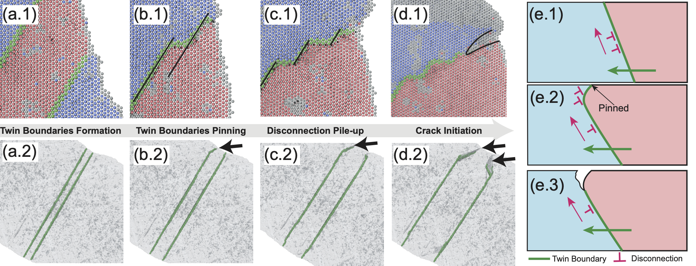
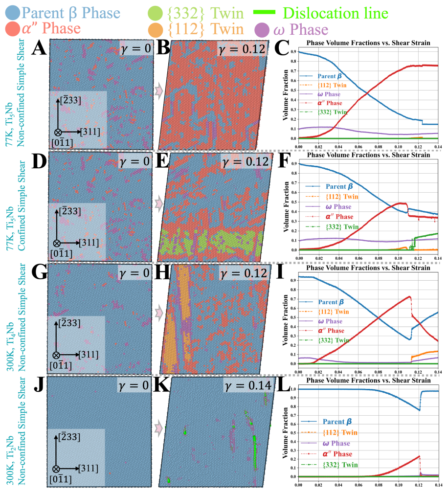
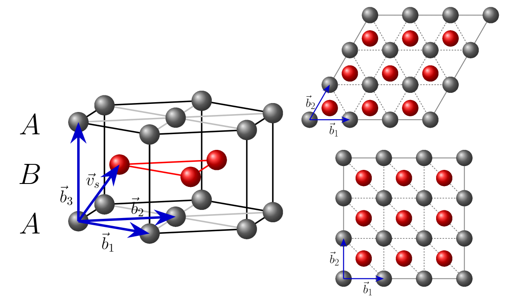
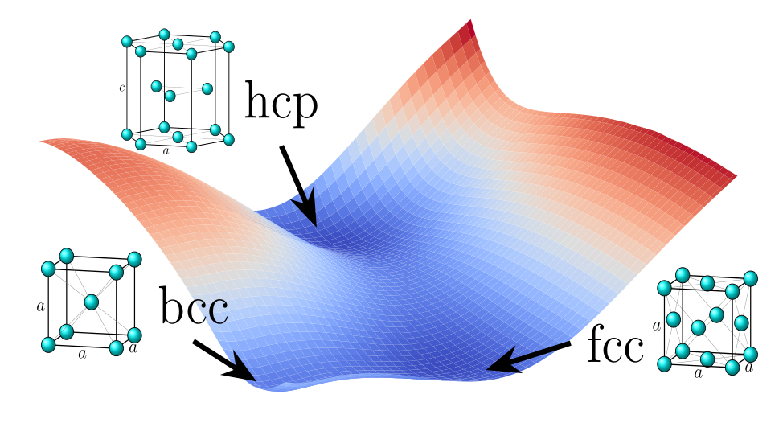

# BCCナノ結晶の塑性を支配する変態媒介双晶

- 執筆日：2026-05-17
- トピック：体心立方格子ナノ結晶が極限圧縮荷重を受けるとき、古典的なせん断駆動双晶に代わり、HCPまたはFCC過渡相を経由する変態媒介双晶が塑性を支配するという新たなメカニズムの解明
- タグ：Nonequilibrium and Dynamic Response / Nanostructures; Phase Transitions / Molecular Dynamics; Machine Learning
- 注目論文：[Transformation-mediated twinning governs plasticity in body-centered cubic nanocrystals under extreme loading (arXiv:2605.06114)](https://arxiv.org/abs/2605.06114)
- 参照論文数：7

---

## 1. 背景：なぜ今この話題か

鉄（Fe）、タングステン（W）、モリブデン（Mo）、タンタル（Ta）、ニオブ（Nb）に代表される体心立方格子（BCC）金属は、核融合炉の第一壁材料、宇宙・航空構造部材、衝撃防護材料として現代技術の根幹を担っている。これらの材料が実際に使われる環境では、爆発や衝撃、あるいは高速加工といった極限的な荷重条件が不可避であり、そこでの変形挙動を正確に理解することが安全設計の前提となる。

BCC金属の塑性変形については、長年にわたって転位すべり（dislocation slip）が主役とされてきた。常温・常圧では、1/2⟨111⟩方向のバーガースベクトルをもつらせん転位が支配的に動き、その運動を阻害するペアルス障壁（Peierls barrier）の大きさが強度を決める、というのが教科書的な理解である。しかし高圧力・低温度・高ひずみ速度の条件下では、もう一つの塑性機構である変形双晶（deformation twinning）が活性化することが古くから知られている。特に衝撃波（shock wave）の通過直後のミリ秒以下のタイムスケールでは、転位が動く暇もなく双晶形成が塑性を担うと考えられてきた。

ところがナノスケール（～10〜100 nm）の結晶では、話がさらに複雑になる。表面積・体積比が巨大であるため、転位源が欠乏する「転位飢餓（dislocation starvation）」が起こりやすく、代わりに表面核生成や双晶形成が前面に出てくる。さらに、BCCナノ結晶に高い圧力をかけると、その結晶構造自体が変化する可能性もある。鉄の場合、圧力 13 GPa 付近でBCC（α相）から HCP（ε相）への相転移が起こることは実験的によく確立されており、衝撃下でもこの転移が起こりえる。タングステンやモリブデンでも極高圧・高温条件では別の結晶構造に転移する可能性が議論されている。

しかし、このような相転移と双晶形成のダイナミクスが**ナノスケールの極限荷重下でどのように連携して塑性を支配するか**については、これまで体系的に解明されていなかった。実験では時間・空間分解能が追いつかず、また古典的な経験的ポテンシャルを使った分子動力学（MD）シミュレーションでは、相転移と双晶形成の双方を正確に記述することが難しかったためである。

この問題に正面から取り組んだのが、本稿で注目する論文（Očenášek et al., 2026, arXiv:2605.06114）である。機械学習原子間ポテンシャル（machine-learned interatomic potential; MLIP）による大規模MD計算とエネルギー地形解析を組み合わせ、BCC Fe・Ta・Nb・Mo・W の5元素にわたる統一的な変態媒介双晶（transformation-mediated twinning）のメカニズムを明らかにした。その結論は、従来の金属塑性の概念的枠組みに根本的な問いを投げかけるものである。

---

## 2. 未解決問題は何か

### 2-1. 古典的な{112}せん断双晶モデルはナノスケールで成立するか

BCC金属の変形双晶に関する従来の理解は、Christian と Mahajan（1995年のレビュー）以来、{112}面をせん断することで双晶が生まれるというモデルを基盤としている。このモデルでは、{112}⟨111⟩すべり系に臨界分解せん断応力（CRSS: critical resolved shear stress）が達したとき、双晶部分転位（twinning partial dislocation）が連続して走ることで双晶が形成される。シュミット則（Schmid's law）に従い、この分解せん断応力が最大になる結晶方位で最も容易に双晶形成が起こる、という予測が成り立つ。

しかしナノ結晶の実験では、この古典的なせん断双晶モデルとは相容れない現象が報告されるようになっている。例えば Wang et al.（2018年、Science Advances）が示したBCCニオブナノワイヤーでの「連続結晶方位変化と超塑性」は、転位すべりとも通常の双晶形成とも異なる、複数の結晶方位変化を経由した特異な変形として報告されており、単純なシュミット則では説明できない。また、Zhong et al.（Nature Communications, 2024年）は BCCタンタルナノ結晶で、直径によって双晶核生成支配から双晶成長支配へと機構が切り替わることを実証しており、サイズスケールが変形機構の本質的な決定因子であることを示した。

こうした知見は、**ナノスケールのBCC金属における塑性メカニズムは、バルク多結晶で培われた古典的なモデルとは本質的に異なる**可能性を示唆しており、新しい理論的枠組みが必要であることを問題提起している。

### 2-2. 相転移と双晶形成のどちらが先か、あるいは連動するか

鉄のショック実験では、α→ε相転移と変形双晶の両者が観察されることが多い。Wang et al.（Scientific Reports, 2013年）は衝撃を受けた鉄の後方散乱電子回折（EBSD）観察から、相転移と双晶形成が空間的に近接して起こることを示した。同様に Li et al.（Acta Materialia, 2023年）は、BCCナノ結晶で相転移が双晶境界（twin boundary）の形成を誘起するという現象を報告している。

しかし因果関係の方向性は依然として不明確だ。「相転移が起きることで双晶が形成される」のか、「双晶境界が相転移の核生成サイトになる」のか、あるいは「両者はほぼ同時に、同じ弾性不安定性から独立して発生する」のか。この問いに答えるには、原子スケールのダイナミクスを時間分解で追跡する手段が必要である。実験的にはフェムト秒X線回折や動的圧縮実験でのその場観察が試みられているが、ナノ結晶サイズでの時間分解かつ原子分解能の観察は技術的に困難であり、シミュレーションに頼るところが大きい。

解決の糸口は、高精度なMLIPを用いたMDシミュレーションにある。古典的な埋め込み原子法（EAM）ポテンシャルでは、相転移と双晶形成の両方を十分な精度で記述することが難しかった。一方、密度汎関数理論（DFT）計算データで訓練された最新のMLIPは、多体相互作用を含む複雑なエネルギー地形を高精度で再現できる。これにより、相転移と双晶形成の連動メカニズムを原子レベルで追跡することが初めて現実的になった。

### 2-3. 弾性スティフネス（剛性）が変形経路を決定するか

BCC金属の間には、弾性スティフネスに大きな違いがある。タンタルやニオブは比較的柔らかい（弾性定数 C11 ≈ 260〜250 GPa）のに対し、モリブデンやタングステンは非常に硬い（C11 ≈ 440〜525 GPa）。鉄はその中間（C11 ≈ 230 GPa）に位置する。

このスティフネスの違いが、高圧下での変形経路の違いを生むかどうかは、未解決の重要な問いである。仮にそうであれば、**弾性特性から変形機構を予測できる**という設計原理の可能性が開ける。異なるBCC金属を同じ高圧条件下で系統的に比較することで、弾性スティフネスと変形経路の関係を解明できるはずだが、このような多元素比較を統一的な枠組みで行った研究はこれまでなかった。

さらに、「弾性不安定性（elastic instability）」という概念が鍵を握る可能性がある。ある特定の応力状態に達したとき、完全結晶の均一変形が不安定になり、突発的に相転移や転位・双晶の核生成が起こる現象が弾性不安定性である。Bornの安定性条件と呼ばれる弾性定数行列の正定値性が崩れる点がこれに対応する。高圧縮下では、BCCの弾性不安定性を引き金として何が起こるかが、材料ごとに異なると考えられるが、その体系的な理解は欠けていた。

---

## 3. 注目論文の概説

### 研究目的と対象材料

Očenášek et al.（2026年）の目的は、BCC金属のナノ結晶に対して極限圧縮荷重（extreme compressive loading）を加えたときの塑性メカニズムを原子スケールで解明し、異なるBCC金属間で統一的な理解を与えることである。対象材料は Fe・Ta・Nb（弾性スティフネス中程度）と Mo・W（高弾性スティフネス）の5元素である。これらは核融合炉材料（W）、防衛・宇宙材料（Ta、Mo）、超伝導材料の被膜（Nb）など、いずれも実用上の重要性が高い元素である。

### 研究アプローチ

シミュレーションには、Byggmästar et al.（Phys. Rev. Mater., 2022年）が開発した **tabGAP（tabulated Gaussian Approximation Potential）** 系列のMLIPを使用している。このポテンシャルはDFT計算データを基盤として、多体の相互作用エネルギーを高精度にフィッティングしており、相転移・格子欠陥・表面を含む広い構造空間で信頼性が高い。BCC金属を対象とした MLIPとしては現状最高水準の精度を持つ。

ナノ結晶のモデルは、[100]方向に沿った単結晶ナノ柱（nanopillar）として構築されている。サイズは数ナノメートル程度で、周期境界条件を[100]方向に適用し、自由表面を横方向に設ける構成が基本となっている。圧縮ひずみを一定速度で印加しながら、原子位置と原子局所構造の時間発展を追跡した。

構造同定には PTM（Polyhedral Template Matching）法を用いており、BCC・FCC・HCP の局所構造を原子ごとに識別できる。これにより、どの時点でどこに HCP 原子や FCC 原子が現れるかを逐次追跡でき、双晶形成と相転移のダイナミクスを可視化した。

エネルギー地形解析では、VASP（Vienna Ab initio Simulation Package）を用いたDFT計算により、双晶形成に関わるさまざまな経路のエネルギー障壁を計算している。これにより、どの経路がエネルギー的に有利かを定量的に比較した。

### 主要結果

**Fe, Ta, Nb（弾性スティフネス中程度）のグループ：**

これら3元素では、圧縮が増大するにつれ古典的な{112}面でのせん断型双晶が抑制される。代わりに、**弾性不安定性を引き金とした「デュアルシャッフル（dual-shuffle）機構」** が活性化する。このシャッフル機構は、HCP 過渡相（Fe では安定な ε-Fe、Ta や Nb では準安定な HCP 相）を経由して最終的に BCC 双晶構造を形成する。注目すべきは、この経路が {112} 双晶境界面とは独立に形成されることだ。古典的には双晶は必ず {112} 面を境界として核生成するとされていたが、この HCP 媒介経路はその常識を覆す。また、この変態は純粋な**圧縮応力（hydrostatic-like compression）** によって駆動されており、シュミット則で想定するような特定面へのせん断応力への依存性を持たない。これは「塑性変形はせん断応力がなければ起こらない」という金属塑性の伝統的なパラダイムへの挑戦である。

**Mo, W（高弾性スティフネス）のグループ：**

Mo と W では、全く異なる二つの変態媒介経路が確認された。いずれも**FCC 過渡相（高度に歪んだ FCC 構造）** を経由するが、その到達方法が異なる。一つは {112}⟨111⟩ せん断型の弾性不安定性から FCC 相を経由して双晶を形成する経路、もう一つは別方向の弾性不安定性から FCC 相を経由する経路である。この違いは、Mo と W の高い弾性スティフネスが、HCP 媒介経路よりも FCC 媒介経路をエネルギー的に有利にすることから説明される。

さらにエネルギー地形の計算から、Fe・Ta・Nb における HCP 媒介経路と、Mo・W における FCC 媒介経路が、それぞれの元素の弾性特性と整合した最小エネルギー経路に対応することが示されている。これが **BCC ナノ結晶における変態媒介双晶の統一的枠組み** の提案に至る根拠である。

### 論文の新規性と限界

**新規性：** これまで個別の元素・現象として断片的に報告されていた BCC 金属の高圧変形機構を、弾性スティフネスという統一指標で分類し、変態媒介双晶という新しい概念の下に統合したことが最大の貢献である。特に「圧縮だけで双晶形成が起きる」という発見は、金属塑性の古典的理解を根底から問い直す。

**限界：** 本論文は主にナノ柱という理想的な単結晶・均一荷重条件でのシミュレーションである。実際の材料は多結晶体であり、粒界や転位などの欠陥が相互作用する。また、使用したMLIPはDFT精度を目指しているが、相転移温度・圧力の正確な値については実験との定量的な比較が不十分である。高ひずみ速度（10⁸〜10⁹ s⁻¹程度）はMDシミュレーションの必然であるが、実際の衝撃実験のひずみ速度と一致させるには、さらなる検証が必要である。

---

## 4. 研究史における位置づけ

BCC 金属の相転移と塑性変形の関係を研究する歴史は、実は1世紀近くに及ぶ。その系譜を辿ることで、注目論文の位置づけが明確になる。

最古の重要な発見の一つは、Burgers（1934年）による BCC-HCP 変態の幾何学的な記述である。彼は BCC 格子を連続的に変形させて HCP 格子に変換するための変位場を詳細に記述した（バーガース変態；Burgers transformation）。これは現在でも BCC 金属の高圧相転移を論じるときの基本的な幾何学的枠組みとなっている。その本質は、{110}_BCC 面を HCP の基底面（0001 面）へと変換するせん断変位と、隣接する {110}_BCC 面を互いに交互にシャッフルさせる変位の組み合わせである。

衝撃物理学の観点からは、Mao et al.（1967年）が鉄の圧力誘起 BCC→HCP 転移（α-ε 転移）を実験的に確立したことが重要なマイルストーンである。この転移は約 13 GPa で起こり、衝撃波が通過した後の鉄試料に ε-Fe 相の「フィンガープリント」が残る。Wang et al.（Scientific Reports, 2013年）は、このショック鉄の EBSD 解析から、α-ε 転移と双晶形成が空間的に共存することを直接観察した。これは本論文（注目論文）の前史として重要な位置を占める。

計算科学の側では、Kadau et al.（2002年、Science 誌掲載）が古典 EAM ポテンシャルによる大規模 MD シミュレーションで、衝撃波通過時の鉄における BCC→HCP 転移過程を原子スケールで可視化した。これは当時のコンピュータ性能の限界に挑む先駆的研究であり、「衝撃誘起相転移を原子スケールで追跡する」というアプローチの出発点となった。ただし当時の古典ポテンシャルでは、HCP 相の安定性や双晶形成との連動を精度よく記述することは難しかった。

BCC Mo のナノスケール変形については、Wang et al.（Nature Communications, 2014年）が Mo ナノ結晶のせん断変形中に BCC→FCC 様構造への転移を in situ TEM で観察したことが画期的であった。この発見は「BCC-FCC 型の変態が Mo の独特な変形挙動の原因である」という仮説を生み、後続研究を刺激した。本注目論文の Mo・W グループにおける FCC 媒介経路という結論は、この観察と整合している。

同様に Wang et al.（Science Advances, 2018年）は、BCC Nb ナノワイヤーを引張変形させたとき、連続的な結晶方位変化と超塑性伸びが観察されたことを報告した。このプロセスには BCC→HCP→BCC または BCC→FCC→BCC といった相転移が関与していると解釈されており、Nb における変態媒介的な変形機構の最初の直接的証拠とも言える。

ナノスケールでの BCC タンタル双晶に焦点を当てた Zhong et al.（Nature Communications, 2024年）は、Ta ナノ結晶の直径に応じて「核生成律速」と「成長律速」の双晶メカニズムが切り替わることを原子スケールで観察した。15 nm 以上の直径では双晶の成長が律速段階となり、微小なサイズでは核生成が支配的であるという。本注目論文はこの系統（BCCナノ結晶の原子スケール変形機構研究）の直接の延長として位置づけられ、しかしながら「高圧下では全く別の変態媒介経路が主役になる」という新たな視点を付け加えるものである。

一方、Hussein et al.（arXiv:2603.14883, 2026年）は、BCC W の双晶境界上に生じるディスコネクション（disconnection）と呼ばれる格子欠陥の積み重なりが、低温での脆性破壊（brittle fracture）の引き金となることを大規模シミュレーションで明らかにした。これは変態媒介双晶とは別の文脈ながら、「BCC 金属の双晶境界は単なる幾何学的界面ではなく、欠陥の集積・解放の場として機能する」という共通の認識を与えており、注目論文のメカニズム解釈を補強する文脈を提供する。

*図3：BCC タングステンにおける双晶境界でのディスコネクション積み重なりと亀裂核生成（2603.14883 より）。(a) 双晶境界の構造と双晶成長時に現れるディスコネクション、(a.1)-(a.2) 異なる視点からのディスコネクション積み重なりの原子スケール観察。注目論文が示す変態媒介双晶によって形成された {112} 以外の双晶境界では、このようなディスコネクション動力学が異なる可能性があり、W の脆性との関係が今後の課題となる。*

Chen et al.（arXiv:2510.13113, 2025年）は、準安定 β-Ti 合金（BCC 構造）における相転移・双晶形成・転位すべりの競合をエネルギー的観点から体系化した。下図はその代表的な結果であり、BCC Ti 合金のエネルギー地形が組成・温度によって変化し、変形モードが切り替わる様子を示している。

*図2：メタ安定 BCC Ti-Nb 合金の分子動力学シミュレーションによる変形モード競合の様子（2510.13113 より）。組成・温度・応力によって {332} 双晶形成・α マルテンサイト変態・{112} 双晶が切り替わる様子が示されており、BCC 系での変形モード競合の普遍性を示す。注目論文との比較では、Ti-Nb では変態が相転移を直接担うのに対し、Fe・Ta・Nb では変態が「双晶形成の仲介役」として機能する点が異なる。*Ti 合金では、溶質組成によって BCC→HCP マルテンサイト変態型の変形（TRIP効果）や双晶形成（TWIP効果）が競合する。この計算論的アプローチは、注目論文の「弾性スティフネスによる変形経路の分類」と相補的な知見を提供し、「エネルギー地形が変形機構の多様性を決定する」という共通の論旨を支持している。

MLIPという方法論の観点では、Byggmästar et al.（Phys. Rev. Mater., 2022年）が開発した tabGAP ポテンシャルが注目論文の計算基盤として採用されている。このポテンシャルは BCC refractory 金属に特化した訓練データセットを持ち、DFT 計算と遜色ない精度で相転移エネルギー・弾性定数・欠陥エネルギーを再現できる。また、同グループの Dominguez-Gutierrez et al.（arXiv:2601.06846, 2026年）は同様の ML-MD 手法を MoTaW 合金のナノインデンテーション解析に適用しており、注目論文と直接的に相補的な研究となっている。

以上の流れから、注目論文はBCC金属ナノ結晶の変形機構研究における**方法論的転換点**（EAM→MLIP の移行）と**概念的革新**（せん断型双晶パラダイムから変態媒介双晶への転換）が交差する位置に立つ、と評価できる。

*図1：HCP・BCC・FCC 格子を連続的に接続するエネルギー面（2502.09828 より）。バーガース型の変態において HCP 中間状態のエネルギー的な役割が明示されており、注目論文の HCP 媒介双晶経路の理論的背景をなす。*

---

## 5. どの解釈が最も妥当か

### HCP 媒介経路の蓋然性

Fe・Ta・Nb において HCP 相が双晶形成の「踏み台」になるという解釈は、複数の根拠によって強く支持される。第一に、DFT エネルギー地形計算が、圧縮下での古典的なせん断経路よりも HCP 経由シャッフル経路の方がエネルギー的に有利であることを定量的に示している。第二に、Fe の場合 HCP 相（ε-Fe）は実験的に確認された安定相であり、13 GPa 以上では確かに存在するため、「過渡的に HCP 相を経由する」という描像に現実的な根拠がある。Ta や Nb では HCP 相は準安定であるが、ナノスケールの過渡的な変形過程では十分に短い時間・空間スケールで実現しうる。

第三に、Robles-Navarro et al.（arXiv:2502.09828, 2025年）の BCC-HCP-FCC の変態メカニズム解析は、HCP がバーガース型変態の中間状態として機能することを理論的・計算的に示しており、注目論文の描像と整合する。彼らは HCP→FCC の経路の方が FCC→BCC より直接的であることを示しており、「HCP が変態の特別なハブである」という考えと一致する。

### FCC 媒介経路の証拠

Mo・W で観察される FCC 媒介双晶については、Wang et al.（Nature Communications, 2014年）の Mo ナノ結晶 in situ TEM 実験との対応が注目される。彼らはせん断変形中に BCC→FCC 様の局所構造変化を観察しており、注目論文の ML-MD シミュレーション結果と定性的に一致する。一方、BCC-FCC 変態の詳細な経路については複数の解釈（Bain 経路、Nishiyama-Wassermann 経路、Kurdjumov-Sachs 方位関係など）が競合しており、注目論文の示す「高度に歪んだ FCC」がどの方位関係に対応するかは、さらなる構造解析が必要である。

Zahiri et al.（arXiv:2401.01223, 2024年）は FCC 金属における弾性異方性に起因する双晶形成モデルを提案しており、弾性特性が変形機構を決定するという注目論文の主張と概念的に一致する。ただしこれは FCC に対する議論であり、BCC への直接の類推には注意が要る。

### 圧縮駆動という主張の難しさ

注目論文の最も革新的な主張は「圧縮だけで塑性（双晶形成）が起きる」というものだが、これは実は微妙な主張である。純粋な等水圧圧縮（isotropic compression）ではどの方向にもせん断成分がないため、シュミット則的な意味での塑性は起きないはずである。注目論文が意味するのは、ナノ柱の[100]方向への一軸圧縮（uniaxial compression）において、従来のシュミット則が意味するせん断応力への選択的依存性が消える、ということである。

つまり、「どの面のせん断応力が最大か」に依存しない変形経路が実現されるという主張であり、それは「弾性不安定性というスカラー量（圧力に比例）がトリガーになる」と解釈するのが適切だろう。この主張はエネルギー地形計算によって支持されているが、実験的な検証はまだない。in situ 高圧 TEM や X 線回折による直接的な確認が今後求められる。

### まだ弱い結論

注目論文が提示した HCP・FCC 媒介経路は、単結晶ナノ柱という理想化された条件での結果である。粒界・欠陥・熱ゆらぎの影響を受ける実際の多結晶体でこのメカニズムがどこまで支配的かは未知である。また、本研究の主要な計算は 0 K あるいは室温付近に限られており、高温（例えば核融合炉の動作温度）での挙動はさらなる検討が必要である。Dominguez-Gutierrez et al.（arXiv:2601.06846, 2026年）が MoTaW 合金のナノインデンテーションで示したように、多元素合金でのメカニズムはさらに複雑な競合を含む可能性があり、単元素 BCC の統一的枠組みが合金に拡張できるかどうかは、今後の重要な検証課題である。

---

## 6. 何が一般化できるか

### 衝撃・爆発科学への接続

注目論文の最も直接的な応用は、金属材料の衝撃応答（shock response）の理解と予測である。Fe・Ta は爆発装甲や衝撃遮蔽材料として使われ、その変形機構は防衛・安全工学において重要である。これまでショック実験後に観察される BCC 金属の微細組織（双晶、変態相、転位密度）は、その形成過程を直接追跡できなかったために、解釈が困難だった。注目論文の変態媒介双晶の枠組みは、「なぜ衝撃後の鉄は特定の方位の双晶を多く含むのか」「なぜ W のショック後微細組織は Fe と異なるのか」といった問いへの定量的な回答を与える可能性を持つ。

### 核融合炉材料としてのタングステン

タングステンは ITER（国際熱核融合実験炉）など次世代核融合炉のプラズマ対向材（divertor）の有力候補材料であり、プラズマからの高熱流束・粒子照射・電磁力の組み合わせという極限環境に曝される。この環境下での W の変形機構を理解することは材料設計に直結する。Hussein et al.（arXiv:2603.14883, 2026年）が示した W 双晶境界でのディスコネクション積み重なりと脆化、そして注目論文の W ナノ結晶での FCC 媒介双晶という知見を組み合わせると、「W の低温脆性は双晶境界でのディスコネクション挙動と変態媒介塑性の競合によって支配される」という仮説が浮かび上がる。

### 耐火高エントロピー合金（RHEA）への拡張

MoTaW・NbMoTaW などの耐火高エントロピー合金（refractory high-entropy alloy; RHEA）は、BCC 単一相あるいは多相構造を持ち、超高温強度と耐熱性を兼ね備える次世代材料として注目されている。これらの合金中では、各元素の弾性スティフネスが混在し、局所組成ゆらぎが変形機構の空間的不均一を生む。注目論文の「弾性スティフネスが変形経路を決定する」という原理は、RHEA の各局所領域における変形機構の多様性を予測するための第一近似的枠組みとして機能しうる。また、Dominguez-Gutierrez et al.（arXiv:2601.06846, 2026年）の MoTaW 合金ナノインデンテーション研究は、まさにこの方向の探索を行っている。

### 設計原理としての弾性異方性指標

より広い観点からは、注目論文の示す「弾性スティフネス（C11 などの弾性定数）→ 安定な過渡相の種類（HCP or FCC）→ 変形経路」という因果連鎖は、材料の弾性特性から変形機構を予測するという設計原理（design principle）の可能性を示唆する。Zahiri et al.（arXiv:2401.01223, 2024年）が FCC 金属で弾性異方性と双晶 CRSS を結びつけたことと並べると、「弾性特性→変形機構予測」という枠組みが BCC・FCC を越えて普遍化できるかもしれない。ただし実際の材料は単結晶でも均一でもなく、局所的な組成・温度・ひずみ速度の影響を組み込む必要があり、現段階ではあくまで仮説的な展望である。

---

## 7. 基礎から理解する

### 7-1. 結晶構造の基礎

金属の結晶構造とは、多数の原子が三次元空間に規則正しく配列した状態を指す。この配列の繰り返し単位を「単位格子（unit cell）」と呼び、その幾何学的形状によっていくつかの基本的な格子型に分類される。

体心立方格子（BCC: Body-Centered Cubic）は、立方体の8頂点と体心に1つずつ原子が位置する構造である。1単位格子あたりの原子数は 1/8×8 + 1 = 2 個である。充填率（原子が占める空間の割合）は約 68%であり、後述の FCC より低い。BCC 構造の特徴は、すべり系の数が FCC より少ないこと、低温で脆くなりやすいこと（延性-脆性転移温度）、そしてペアルス障壁が大きいためにらせん転位の運動が制限されることである。常温常圧での鉄（α-Fe）、タングステン（W）、モリブデン（Mo）、タンタル（Ta）、ニオブ（Nb）がこの構造をとる。

面心立方格子（FCC: Face-Centered Cubic）は、立方体の8頂点と6面の面心に原子が位置する構造で、1単位格子あたり 1/8×8 + 1/2×6 = 4 個の原子を含む。充填率は約 74%で、最密充填の一つである。FCC 金属はすべり系が多く（12系統）、常温で延性に富む。銅（Cu）、アルミニウム（Al）、金（Au）などが代表例であり、高圧下の鉄（γ-Fe）もこの構造をとることがある。

六方最密格子（HCP: Hexagonal Close-Packed）は、正六角形の2次元シートが ABABAB...と積み重なった構造で、充填率は FCC と同じく約 74%である。亜鉛（Zn）、チタン（Ti）、コバルト（Co）などが常温でこの構造をとる。鉄は高圧（13 GPa 以上）でこの構造（ε-Fe）に転移することが実験的に確認されている。

*図4：BCC・FCC・HCP の格子幾何学的接続（2502.09828 より）。左図は ABABAB 積層を持つ HCP と立方格子の関係、右図は格子パラメータ変化による変換の概念図。この幾何学的連続性が、バーガース変態や注目論文の変態媒介双晶メカニズムを理解する基礎となる。*

結晶構造の違いは、原子間の結合様式や充填の仕方から生じる。BCC から HCP への転移（Burgers 転移）は、{110}_BCC 面を基底面（0001_HCP 面）として機能させ、それに直交する [001]_BCC 方向を収縮させ [0001]_HCP に対応させる変位と、隣接する {110}_BCC 面を互いに1/6⟨1̄1̄2⟩ _BCC 方向にシャッフルさせる変位の組み合わせで表現される。この変換は原子を大きく移動させるのではなく、比較的小さな変位で構造を組み替えるため、マルテンサイト変態（無拡散変態）として実現できる。

### 7-2. 転位とすべり

理想結晶を均一にせん断させるには、すべての原子を一斉に隣の位置まで移動させる力が必要で、理論的なせん断強度は剛性率の 1/10〜1/30 程度になると計算される。しかし実際の金属が降伏する（塑性変形が始まる）応力は、その理論値の 1/100〜1/1000 以下である。この大きな差を説明するのが「転位（dislocation）」という線状の結晶欠陥である。

転位は、完全に原子が正規の位置からずれている「すべった領域」と、まだずれていない「すべっていない領域」の境界に存在する。エッジ転位（edge dislocation）は余分な半原子面が挿入されたような欠陥であり、らせん転位（screw dislocation）はらせん状に積み重なった格子面の食い違いである。転位の特性は**バーガースベクトル（Burgers vector）** $\vec{b}$ で表され、これは転位の周囲を1周したときの原子位置のずれ量に対応する。

転位は外部せん断応力を受けると、比較的低い応力でも動くことができる（転位の滑走）。この運動は「完全な原子面のずれ」ではなく、転位線が少しずつ移動していく局所的なプロセスであるため、必要なエネルギーが大幅に小さくなる。材料が降伏する時の応力（降伏応力）は、この転位が運動し始めるときの臨界応力（ペアルス応力）に依存する。

BCCでは主要な転位のバーガースベクトルは $\vec{b} = \frac{1}{2}\langle 111\rangle$ である。すべり面は {110}、{112}、{123} と多数あるが、ペアルス障壁が大きいため特にらせん転位の運動が制限され、これが BCC 金属の低温脆性の一因となる。

### 7-3. 変形双晶

双晶（twin）とは、ある対称面（双晶境界）を境に一方の領域が他方のミラー像となっている結晶構造のことである。双晶形成による変形を「変形双晶（deformation twinning）」と呼ぶ。

BCC 金属の変形双晶では、{112}⟨111⟩ 系が典型的である。{112} 面を双晶境界とし、その両側で結晶が鏡像関係になる。双晶形成は、原子が部分転位（partial dislocation）によって「1層ずつ少しずつずれる」プロセスとして微視的に記述できる。BCC における1/6⟨111⟩ 双晶部分転位が各 {112} 面上を次々に走ることで、双晶域が厚くなっていく。

変形双晶が転位すべりと比べて有利になる条件は一般的に、「低温、高ひずみ速度、高圧力」のいずれかである。低温では転位のペアルス障壁が大きくなり転位は動きにくいが、双晶形成のエネルギー障壁は温度依存性が相対的に小さいため、低温では双晶が優位になる。高ひずみ速度（衝撃など）では、転位増殖が間に合わないために双晶が主役になる。高圧力では積層欠陥エネルギーや変態エネルギーが変化し、双晶が有利になる場合がある。

注目論文では、この古典的な {112}⟨111⟩ 双晶が、高圧縮下では抑制され、代わりに変態媒介双晶が台頭するという。変態媒介双晶とは、中間的な相（HCP や FCC）を経由することで、最終的に BCC の双晶組織に至る経路である。これは「マルテンサイト変態を経由した双晶形成」と言い換えることもできる。

### 7-4. 弾性不安定性とエネルギー地形

固体の弾性論では、均一変形した結晶が力学的に安定であるためには、弾性定数テンソルが正定値（positive-definite）でなければならない（Born の安定条件）。圧力が上昇すると弾性定数が変化し、ある臨界点でこの正定値性が崩れる。この点が「弾性不安定性（elastic instability）」であり、ここで均一変形は不安定化し、相転移や転位核生成、双晶形成などの不均一変形が突発的に始まる。

エネルギー地形（energy landscape）とは、結晶の状態を多次元の原子変位空間で表現したとき、エネルギーが変位の関数としてどのような地形を描くかを指す。山頂（鞍点；saddle point）が遷移状態に、谷底（極小点；local minimum）が安定・準安定状態に対応する。相転移の経路はこの地形上の最小エネルギー経路（minimum energy path; MEP）として記述できる。一般化積層欠陥エネルギー（generalized stacking fault energy; GSFE、または γ サーフェス）は、特定のすべり面上での相対変位に対するエネルギー変化を地形として表したものであり、転位・双晶のエネルギー障壁を評価するための標準的な手法である。

注目論文ではこのエネルギー地形解析を、圧縮下の BCC 結晶に対して複数の変形経路について系統的に行い、どの経路がどの圧力域で最小エネルギー経路となるかを決定している。これにより「変態媒介経路が古典的せん断経路よりエネルギー的に有利である」という定量的根拠を示した。

### 7-5. 機械学習原子間ポテンシャル（MLIP）

古典的な分子動力学シミュレーションでは、原子間の相互作用エネルギーを解析的な関数（ポテンシャル）で記述する。埋め込み原子法（EAM）などの古典ポテンシャルは計算速度に優れるが、電子構造に由来する複雑な多体相互作用を十分に再現できないことがある。特に相転移の精度は、古典ポテンシャルの最大の弱点の一つである。

一方、密度汎関数理論（DFT）に基づく第一原理計算は高精度だが、計算コストが系サイズの3乗に比例するため、数百原子規模が限界である。

機械学習原子間ポテンシャル（MLIP）はこの間を埋めるために開発された。DFT で計算した多数の原子構造のエネルギー・力・応力データを訓練データとして使い、機械学習モデル（ガウス過程回帰、ニューラルネットワーク、線形回帰など）で原子間相互作用をフィッティングする。得られたポテンシャルは古典ポテンシャルに近い計算速度を持ちながら、DFT に近い精度で原子間エネルギー地形を再現できる。

本注目論文が使用する tabGAP（tabulated Gaussian Approximation Potential）は、ガウス過程回帰に基づく高精度 MLIP の一種で、テーブル参照形式で計算を高速化している。BCC 金属の相転移・欠陥エネルギー・表面エネルギーを幅広くカバーする訓練データセットで学習されており、単元素 BCC 金属の変形シミュレーションに最適化されている。

### 7-6. マルテンサイト変態

金属における固体-固体相転移で、拡散を伴わず「変位型」で起こるものをマルテンサイト変態（martensitic transformation）と呼ぶ。原子は集団として協調的に、かつ最隣接原子の入れ替えなしに変位する。その結果、親相と子相（マルテンサイト相）の間には格子点の対応関係（格子対応）が存在する。鉄の BCC→HCP 変態も、タンタルの高圧相転移も、マルテンサイト型と分類されることが多い。

マルテンサイト変態の本質的な特徴は、(1) 無拡散であるため超高速（ミリ秒以下）で進行できる、(2) 形状変化（変態ひずみ）を伴う、(3) 温度-圧力-応力によって制御できる、の3点である。衝撃や高速変形では、この「超高速の固体-固体変態」が双晶形成と競合しながら塑性を担う。注目論文が提示する変態媒介双晶は、その変態（マルテンサイト型）を経由することで最終的に双晶組織に至るという、二段階のプロセスを含んでいる。

---

## 8. 専門用語の解説

**BCC（体心立方格子）**  
Body-Centered Cubic の略。立方体の8頂点と体心に原子が配置された結晶格子。Fe・W・Mo・Ta・Nb など多くの遷移金属が常温常圧でとる構造で、すべり系が FCC より少なく、低温で脆くなりやすい。本論文では、この構造をもつナノ結晶の塑性変形を5元素にわたって系統的に研究した。

**変形双晶（deformation twin）**  
外部応力によって形成される双晶。鏡像関係にある2つの結晶領域が存在し、その境界を双晶境界（twin boundary）と呼ぶ。BCC 金属では典型的に {112}⟨111⟩ 系で発生する。低温・高ひずみ速度・高圧縮下で転位すべりより優位になることが多い。本論文では、この「古典的」双晶形成とは異なる変態媒介経路の存在を明らかにした。

**変態媒介双晶（transformation-mediated twinning）**  
本論文が提案する新概念。HCP や FCC の中間的な結晶構造（過渡相）を経由することで最終的に BCC 双晶を形成する経路。古典的なせん断双晶とは異なり、{112} 境界面への依存性をもたず、圧縮応力によって駆動される。Fe・Ta・Nb では HCP 相媒介、Mo・W では FCC 相媒介の経路が確認された。

**シャッフル機構（shuffle mechanism）**  
相転移において原子が格子定数以下の変位を繰り返して積み重なることで構造変化を実現するプロセス。Burgers 変態（BCC→HCP）では、隣接する {110}_BCC 面が交互に1/6⟨1̄1̄2⟩方向にシャッフルすることが本質的な変位である。本論文では「デュアルシャッフル」という2段階のシャッフル機構が HCP 媒介経路の核心として同定された。

**弾性不安定性（elastic instability）**  
外部圧力や応力の増大に伴い、完全結晶の均一変形が力学的に不安定になる状態。Born の安定条件（弾性定数行列の正定値性）が破れた時点として定義される。この不安定点でエネルギー地形が局所的な鞍点を失い、相転移・転位核生成・双晶形成などの不均一変形が誘発される。本論文では、弾性不安定性が変態媒介双晶の引き金（trigger）として機能することを示した。

**一般化積層欠陥エネルギー（GSFE; Generalized Stacking Fault Energy）**  
特定の格子面（例えば {112} 面）に沿って上半部の結晶を下半部に対して連続的にずらしたときのエネルギーの変化曲線（γ サーフェス）。最大値（不安定積層欠陥エネルギー）が転位核生成のエネルギー障壁に対応し、局所極小値（安定積層欠陥エネルギー）が部分転位や双晶形成のエネルギー地形を特徴づける。DFT 計算で決定され、変形機構の比較に広く使われる。

**機械学習原子間ポテンシャル（MLIP; Machine-Learned Interatomic Potential）**  
DFT 計算データを訓練データとして機械学習モデルで原子間相互作用エネルギーをフィッティングしたポテンシャル関数。古典的経験ポテンシャルに近い計算速度（数百万原子規模）を持ちながら、DFT に近い精度で複雑な多体相互作用（相転移エネルギー・欠陥エネルギー等）を再現できる。本論文では tabGAP（tabulated Gaussian Approximation Potential）を使用し、この手法なしには実現困難だった高精度な相転移・双晶形成ダイナミクスのシミュレーションを達成した。

**バーガース変態（Burgers transformation）**  
BCC から HCP への結晶構造変換の幾何学的記述。Burgers（1934年）が提案した。{110}_BCC 面を HCP の基底面（0001）に対応させ、[1̄11]_BCC を [11̄20]_HCP（a軸）に整合させる変位と、隣接する {110}_BCC 面の交互シャッフルの組み合わせで記述される。Fe の α-ε 相転移やナノ結晶の HCP 媒介双晶を理解するための基本的な幾何学的枠組みとなっている。

**双晶境界（twin boundary）**  
双晶組織において、鏡像関係にある2つの結晶ドメインの界面。BCC 金属では典型的に {112} 面が双晶境界となる。双晶境界は積層欠陥エネルギーに関連したエネルギーを持ち、転位・ディスコネクションなどの欠陥の蓄積場所となりうる。Hussein et al.（arXiv:2603.14883, 2026年）は BCC W の双晶境界にディスコネクションが積み重なることで脆化が進むことを示した。

**弾性スティフネス（elastic stiffness）**  
弾性変形に対する材料の剛性を表す弾性定数テンソルの成分。立方対称をもつ BCC 金属では独立な弾性定数は C11、C12、C44 の3つに絞られる。C11 はそれぞれの軸方向の圧縮・引張に対する剛性を表す。本論文では、C11 で特徴づけられる弾性スティフネスの違いが、変態媒介双晶の経路選択（HCP 媒介 vs FCC 媒介）を決定する主要因として同定された。Fe・Ta・Nb（C11 = 230〜250 GPa）では HCP 媒介が、Mo・W（C11 = 440〜525 GPa）では FCC 媒介が優位になる。

---

## 9. 将来展望

注目論文が最も確かに示したのは、「BCC ナノ結晶の高圧塑性はせん断駆動双晶だけで説明できない」という点である。エネルギー地形解析と MLIP-MD の組み合わせによって、Fe・Ta・Nb では HCP 媒介、Mo・W では FCC 媒介の変態経路がそれぞれ古典的なせん断双晶よりも低エネルギー障壁で実現することが示された。また弾性スティフネスが変形経路の分岐を決める統一的指標として機能することも、5元素にわたる比較によって強く示唆されている。これらは「変態媒介双晶」という新概念に対するかなり確かな理論的根拠と言える。

一方、未確定な問題も多い。最大の問いは、実験的な直接検証である。ナノ結晶の高圧圧縮中に「HCP または FCC の過渡相が瞬間的に出現してから BCC 双晶に変換する」という過程を実験で観察することは、現状の in situ TEM では困難である。高圧・高ひずみ速度下でのフェムト秒X線回折（動的圧縮ポンプ-プローブ実験）や、次世代の自由電子レーザー（XFEL）を使ったナノスケール構造ダイナミクス計測がこの検証に有力な手段となりうる。特に Fe の場合は 13 GPa 付近で確実に HCP 相が安定化するため、まず Fe ナノ結晶での実験的検証から始めることが現実的なアプローチである。

今後特に注目すべき論点は二つある。第一は、本メカニズムの多結晶体・合金への拡張可能性である。粒界が存在する多結晶体では、粒界でのストレス集中や結晶方位の多様性が加わり、単結晶ナノ柱とは全く異なる変形様式が現れる可能性がある。耐火高エントロピー合金（RHEA）では各元素の弾性スティフネスが混在するため、局所的な組成ゆらぎによって HCP 媒介と FCC 媒介の経路が空間的に共存するという予測も立つ。この方向の探索は、高性能 RHEA の設計に向けた理論的基盤として重要である。第二は、温度・ひずみ速度パラメータ空間の系統的なマッピングである。本論文は主に 0 K あるいは室温付近の MD を基盤としているが、核融合炉の動作温度（1000 K 以上）や実際のショック実験のひずみ速度（10⁵〜10⁷ s⁻¹）との対応づけには、より広いパラメータ範囲でのシミュレーションと実験の比較が不可欠である。これらの問いに答えることで、「弾性スティフネスによる変形経路分類」という本論文の枠組みが、実際の材料設計に使える普遍的な原理として確立されるかどうかが判明するだろう。

---

## 参考論文一覧

1. **[Očenášek J. et al. (2026) arXiv:2605.06114](https://arxiv.org/abs/2605.06114)**  
   本記事の注目論文。BCC Fe・Ta・Nb・Mo・W ナノ結晶の MLIP-MD 計算により、変態媒介双晶（HCP または FCC 過渡相経由）が極限荷重下で古典的せん断双晶に代わって塑性を支配することを示した。

2. **[Hussein O. et al. (2026) arXiv:2603.14883](https://arxiv.org/abs/2603.14883)**  
   BCC W 双晶境界上のディスコネクション積み重なりが低温脆性破壊を引き起こすメカニズムを大規模シミュレーションで明らかにした論文。

3. **[Chen G. (2025) arXiv:2510.13113](https://arxiv.org/abs/2510.13113)**  
   メタ安定 β 型 Ti 合金（BCC 構造）における相転移・双晶形成・転位すべりの競合をエネルギー的観点から体系化し、変形モード選択のエネルギー起源を論じた論文。

4. **[Robles-Navarro A. et al. (2025) arXiv:2502.09828](https://arxiv.org/abs/2502.09828)**  
   HCP・BCC・FCC 構造を連続的に接続する格子パラメータを導入し、バーガース型変態の最小エネルギー経路を複数のモデルで解析した論文。

5. **[Zahiri A.H. et al. (2024) arXiv:2401.01223](https://arxiv.org/abs/2401.01223)**  
   FCC 金属における弾性異方性が双晶形成の臨界分解せん断応力を決定するというモデルを提案した論文。弾性特性と変形機構の関係を議論する上での比較対象。

6. **[Maitra A., Gururajan M.P. (2024) arXiv:2402.08372](https://arxiv.org/abs/2402.08372)**  
   NiTi 単結晶の NEMD シミュレーションにおけるマルテンサイト変態の臨界力の統計的解析から、変態の速度論的パラメータ（内在的速度定数・活性化自由エネルギー）を抽出した論文。

7. **[Dominguez-Gutierrez F.J. et al. (2026) arXiv:2601.06846](https://arxiv.org/abs/2601.06846)**  
   耐火高エントロピー合金 MoTaW のナノインデンテーション変形を実験と ML-MD シミュレーションの組み合わせで解析し、転位・双晶・相変態が競合する複雑な塑性挙動を明らかにした論文。

---
