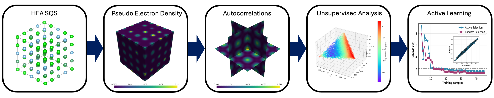
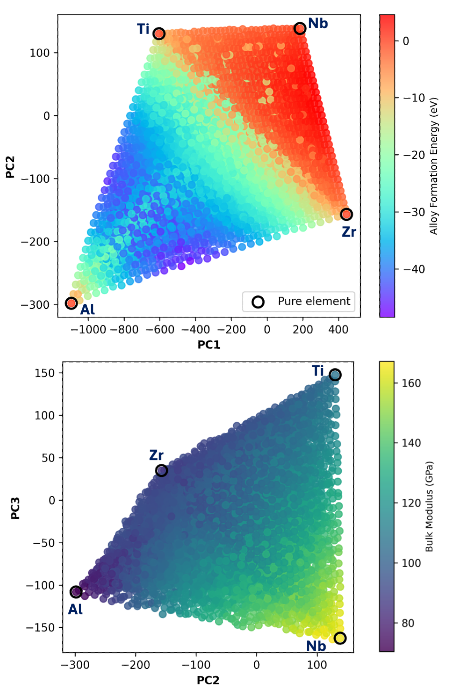
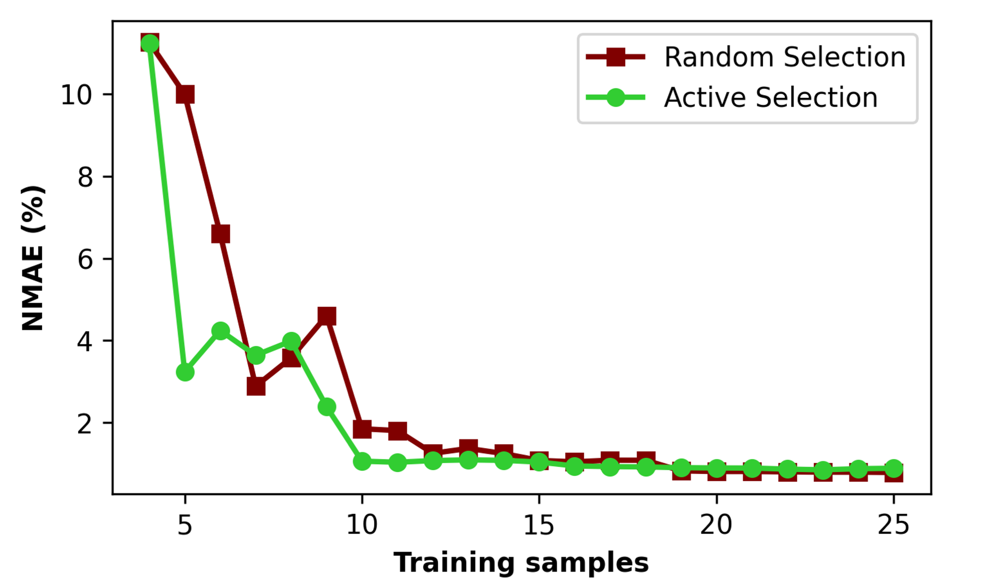
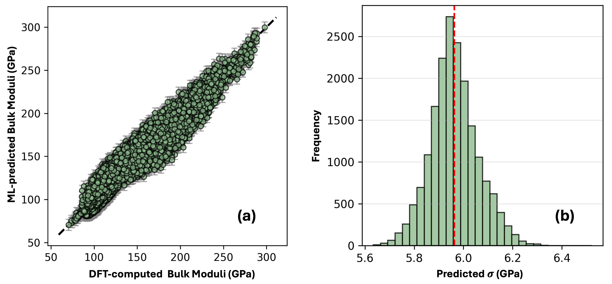

# 高エントロピー合金における電子密度多様体

- 執筆日：2026-05-17
- トピック：高エントロピー合金（HEA）における物理根拠型機械学習記述子の設計と、ゼロショット外挿による組成空間探索の加速
- タグ：Electronic Structure, Bulk Alloys, First-Principles Calculations, Machine Learning, Surrogate Modeling
- 注目論文：[Universal electronic manifolds for extrapolative alloy discovery (arXiv:2603.06953)](https://arxiv.org/abs/2603.06953)
- 参照論文数：6

---

## 1. 背景：なぜ今この話題か

材料科学における最大の難問の一つは、いかにして無限大に広がる組成空間から有用な材料を効率よく見つけるか、という問いである。高エントロピー合金（high-entropy alloys, HEA）は5種類以上の主要元素を等モル近傍で混合した多主元素合金の総称であり、2004年頃から急速に注目を集めてきた。従来の合金設計が「主元素1種＋少量添加元素」という考え方に基づいていたのに対し、HEAはその逆転の発想から生まれた。これにより、従来の合金では実現困難だった特性の組み合わせ—高強度・高靭性・耐熱性・耐食性—を同時に達成できる可能性が拓かれた。

問題はスケールの壁である。5種元素系で組成を5%刻みで探索するだけでも候補数は数万に上り、元素の種類や刻み幅を広げれば膨大な数になる。なかでも耐熱合金（refractory HEA, RHEA）は、タービンブレードや核融合炉の構造材として2000℃超の動作環境を狙うため、モリブデン（Mo）・タングステン（W）・タンタル（Ta）・ニオブ（Nb）・バナジウム（V）などの高融点金属を組み合わせた7〜10成分系が主な探索対象となる。7成分で10%刻みであっても候補数は数十万を超え、密度汎関数理論（DFT）を全候補に適用することは現実的ではない。

この文脈で機械学習（ML）サロゲートモデルが注目を集めているのは自然な流れである。しかし既存のML手法が抱える大きな課題が二つある。第一に、良い「記述子（descriptor）」の設計である。組成比だけを使うと物性の微妙な変化を捉えきれず、原子位置情報や電子構造を取り込もうとすると計算コストが跳ね上がる。第二に「外挿問題」である。4成分系で訓練したモデルが7成分系を予測できるか？ 既存の手法は多くの場合、訓練分布の外では信頼性を失う。

2026年3月にGeorgia Institute of Technology（ジョージア工科大学）の研究グループが提出したプレプリント（arXiv:2603.06953）は、この2つの壁を同時に突破する新しい枠組みを提案した。「非相互作用電子密度（pseudo-density）」を物理的に根拠のある記述子として用い、わずか10の訓練サンプルで誤差2%未満、かつ4成分系から7成分系への零ショット外挿を実証した。これは材料探索の文脈でのAI for Scienceの新しいマイルストーンといえる。

*図1: 非相互作用電子密度を記述子として用いた高エントロピー合金設計フレームワークの概念図 (arXiv:2603.06953, CC BY 4.0)*

---

## 2. 未解決問題は何か

### 2.1 組成空間の組み合わせ爆発と記述子設計のトレードオフ

HEAの組成空間は文字通り天文学的である。7成分系で各元素の原子分率を離散的に変えた場合、候補数は組み合わせ論的に爆発する。密度汎関数理論（DFT）を全候補に適用することは現実的でないため、機械学習（ML）サロゲートモデルが必要になる。しかしここに本質的なトレードオフが存在する。組成（元素種と原子分率）だけを記述子として使う手法は計算コストが低いが、同じ組成でも局所的な原子配置の違いによって物性が変わる情報を捨ててしまう。一方、DFTで収束させた電荷密度や電子状態密度（DOS）を使えば物理的に豊富な情報が得られるが、自己無撞着場（SCF）計算—繰り返し計算で電子の分布を決める工程—が必要で、これ自体がDFT計算の大部分の計算量を占める。つまり「精度を上げようとするほどコストも上がる」という構造的矛盾がある。

さらに、多様な元素系に対して汎用的に使える記述子を設計することは非自明である。元素の原子番号や電気陰性度・原子半径といった物理量の組み合わせはよく使われるが、これらは元素ごとの「ラベル」情報に過ぎず、原子がどのように空間配置されているかの幾何学的・電子的情報を捉えきれない。この問題への物理的に根拠のある解答が「電子密度を記述子とする」アプローチであり、本論文の出発点である。

### 2.2 内挿から外挿へ：機械学習の本質的限界

一般に機械学習モデルは「内挿（interpolation）」は得意だが「外挿（extrapolation）」は苦手である。これは訓練データの分布に含まれない入力に対して、モデルの予測が急激に信頼性を失う現象と言い換えられる。HEA設計では「ある元素系で訓練し、別の元素系を予測する」という外挿が本質的に必要とされるにもかかわらず、従来のグラフニューラルネットワーク（GNN）や組成ベースのMLモデルは元素の埋め込みベクトルに依存するため、訓練時に未登場の元素を扱う方法が不明確である。

では物理量を記述子の基盤とすることで外挿可能性は向上するか？ これが本論文の中核的な仮説である。電子密度は元素のアイデンティティではなく、「各原子が持つ価電子の空間分布のパターン」に注目する。BCC（体心立方構造）耐熱合金系であれば、異なる元素を含む系であっても、その価電子密度パターンには共通する「幾何学的言語」—電子のパッキングの仕方—が存在するのではないかというのが核心的アイデアである。同じBCC構造族に属する元素は、結晶場のトポロジーが類似しており、そこに価電子がどう詰め込まれるかというパターンが元素を跨いで転移可能（transferable）かもしれない。

### 2.3 データ効率と自律的実験設計

材料研究においてDFT計算の実行にかかるコスト（計算機時間と人的労力）は依然として大きい。ML手法を現場で使えるものにするためには、少ない訓練データで高精度のモデルを構築する「データ効率（sample efficiency）」が重要な指標になる。ベイズ能動学習（Bayesian active learning）は不確実性を定量化し、次に測定すべき最も情報量の多いサンプルを自動的に選ぶことで訓練データ数を最小化する。しかし能動学習を電子密度記述子と組み合わせる場合、「特徴量生成→モデル更新→次候補選択」のサイクルにかかる時間全体を最小化しなければならない。SCF計算が特徴量生成に必要なら、そのコストが能動学習のボトルネックになってしまう。本論文はこのボトルネックをpseudo-densityで根本から回避しようとしている。

---

## 3. 注目論文の概説

### 研究目的と対象

本論文（arXiv:2603.06953）の研究目的は、耐熱高エントロピー合金（RHEA）の体積弾性率と合金形成エネルギーを、DFTによる電子構造の自己無撞着計算なしに、かつ極めて少ない訓練サンプルで高精度に予測するフレームワークの構築である。対象は4成分系 $\mathcal{D}_4$（Al-Nb-Ti-Zr）と7成分系 $\mathcal{D}_7$（Mo-Nb-Ta-Ti-V-W-Zr）であり、後者では前者に含まれない4元素（Mo, Ta, V, W）が加わっている。$\mathcal{D}_4$ は離散的組成刻みで6,545構造、$\mathcal{D}_7$ はさらに大きな組成空間を持つ。

### 非相互作用電子密度（pseudo-density）の着想

本論文のコアアイデアは「非相互作用電子密度（pseudo-density）」を記述子として用いることである。通常のDFT計算では、電子の相互作用（電子間反発、交換相関効果）を含めた自己無撞着な電荷密度を繰り返し計算によって収束させる。本論文では、この収束計算を一切省き、個々の孤立原子の価電子密度を特殊擬似ランダム構造（SQS）の格子点に単純に重ね合わせただけの密度を使う。格子定数はVegard則（各元素格子定数の組成比加重平均）で決め、幾何最適化もしない：

$$\rho_{\text{pseudo}}(\mathbf{r}) = \sum_{i \in \text{atoms}} \rho_{\text{atom},i}(\mathbf{r} - \mathbf{R}_i)$$

ここで $\rho_{\text{atom},i}$ は孤立原子 $i$ の価電子密度、$\mathbf{R}_i$ はSQS格子点上の原子位置である。これは独立粒子近似（non-interacting）の範囲での電子密度であり、自己無撞着計算を必要としない。著者らが主張するのは、HEAの固溶体内では物性の主たる変動が電子的自己無撞着補正ではなく「化学種の組み合わせ」に起因するという仮説であり、この簡略化が実用的精度の記述力を保持するかどうかが論文全体の核心的問いである。

### 特徴抽出：2点空間相関とPCA

この3次元密度場からどうやって機械学習の入力となる数値ベクトルを作るかが次の問題になる。本論文では「方向分解2点空間自己相関（directionally resolved two-point spatial autocorrelation）」を用いる。2点相関関数は密度場の「パターン」を記述する統計量であり、FFT（高速フーリエ変換）を使って効率的に計算できる：

$$f_r = \frac{1}{|S|} \mathcal{F}^{-1}\left[\mathcal{F}(\sqrt{\rho_{\text{pseudo}}}) \ast \mathcal{F}(\sqrt{\rho_{\text{pseudo}}})\right]$$

ここで $\mathcal{F}$ は離散フーリエ変換、$\ast$ は自己相関演算を表す。この高次元の相関ベクトルを、次に主成分分析（PCA）によって低次元に圧縮する。4成分系・7成分系合わせた特徴空間では、第1主成分が全分散の約40%、第1〜3主成分で約50%の分散を説明する。

重要な発見として、構造緩和（ionic relaxation, volume relaxation）した構造から計算した擬似密度を使うと、PCA空間が「枝分かれした非連結多様体」になってしまうことが示されている。その原因は、Zr濃度が高い構造で格子定数が最大10%以上異なるため、絶対座標系の2点相関ベクトルが格子膨張の影響を強く受けることにある。一方、均一な格子定数（Vegard則）でのSQS構造は、純元素が四頂点に位置し全合金組成がその内部を連続的に占める「台形型」の滑らかな多様体を形成する（図2参照）。この連続性が精度の高い内挿と外挿の両方を可能にするという主張は、論文中でPCAの幾何学的解析と数値実験の両面から支持されている。

*図2: AlNbTiZr系($\mathcal{D}_4$)の擬似電子密度を用いた第1〜3主成分の可視化。純元素が四頂点に位置し、合金組成がその内部に連続的に分布する台形型多様体が形成されている。左が体積弾性率、右が合金形成エネルギーのカラーマップ。 (arXiv:2603.06953, CC BY 4.0)*

### ガウス過程回帰とベイズ能動学習

回帰モデルにはガウス過程回帰（GPR）を用いる。GPRは予測値の平均と不確かさ（分散）を同時に出力する確率的なフレームワークであり、能動学習と親和性が高い。カーネル関数には自動関連性決定付き二乗指数核（ARDSE）を用い、各主成分の重要度をモデルが自動的に学習する：

$$k(\mathbf{x}, \mathbf{x}') = \sigma_s^2 \exp\left[-\frac{1}{2}\sum_{d=1}^{D}\frac{(x_d - x_d')^2}{l_d^2}\right] + \sigma_n^2 \delta_{\mathbf{x}\mathbf{x}'}$$

ここで $\sigma_s^2$ は出力分散のスケール、$l_d$ は特徴次元 $d$ の特性長さスケール、$\sigma_n^2$ は観測ノイズの分散、$\delta_{\mathbf{x}\mathbf{x}'}$ はクロネッカーのデルタである。能動学習では各候補構造に対する獲得関数として相対的不確かさを用いる：

$$I(\mathbf{x}) = \left|\frac{\sigma(\mathbf{x})}{\mu(\mathbf{x})}\right|$$

この関数が最大の候補を次のDFT計算対象として選ぶことで、予測の不確かさが最も高い（情報量が最大の）領域を優先的にサンプリングし、少ない計算で急速に精度を向上させる。

### 主要結果

体積弾性率の予測（$\mathcal{D}_4$系）では、4サンプルのシードからスタートし、能動学習を6回繰り返すだけで（計10サンプル）、NMAE <2%、$R^2 = 0.98$を達成した（図3）。これは同様の電子密度ベース手法で収束密度を用いたものより約2.6倍少ない訓練サンプル数である。最終モデルは$\mathcal{D}_4$の全6,545構造に対してもMAE = 1.50 GPa（弾性率範囲80〜160 GPa）を維持している。合金形成エネルギー予測では、同じ3主成分の記述子を転用するだけでMAE = 1.19 eV、$R^2 = 0.99$を達成した。記述子を再計算する必要がないこの汎用性がpseudo-densityアプローチの大きな強みである。

最も重要な結果は零ショット外挿である。$\mathcal{D}_4$で訓練したモデルを、4元素が完全に未見の$\mathcal{D}_7$（Mo-Nb-Ta-Ti-V-W-Zr）に適用した。再訓練なし（zero-shot）でも相関が成立し、さらに$\mathcal{D}_7$からわずか20サンプルを追加した少量学習（few-shot）でMAPE <3%を達成した（図4）。

*図3: 体積弾性率のNMAEと訓練サンプル数の関係。能動学習（active）はランダム選択（random）より高い収束効率を示し、10サンプルで<2%に到達する。横軸が訓練サンプル数、縦軸がNMAE(%)。 (arXiv:2603.06953, CC BY 4.0)*

*図4: 4成分系（Al-Nb-Ti-Zr）で訓練したモデルによる7成分系（Mo-Nb-Ta-Ti-V-W-Zr）の体積弾性率の外挿予測パリティプロット。縦軸が予測値、横軸がDFT計算値（GPa単位）。 (arXiv:2603.06953, CC BY 4.0)*

### 論文の新規性と限界

新規性の核心は、SCF計算を省いた「非相互作用」電子密度が収束密度に匹敵するかそれ以上の記述力を持つことを実証した点、および4成分系訓練モデルが7成分系を零ショット外挿できることを示した点である。現在の限界としては、今回検証されたのが体積弾性率と合金形成エネルギーの2物性のみであること、全系がBCC構造固溶体であることが前提であること、そしてVegard則による格子定数近似がZr濃度の高い系では精度を落とす可能性があることが挙げられる。また、強相関電子系や強い磁気秩序を持つ系への適用は別途検証が必要である。

---

## 4. 研究史における位置づけ

### 電子密度ベース記述子の系譜

物質の基底状態は電子密度 $n(\mathbf{r})$ で一意に決まるというホーエンベルク・コーン定理（1964年）以来、電子密度は材料科学における根本的な情報担体として認識されてきた。しかし高次元の電子密度場を機械学習の入力として扱う実践的な試みが本格化したのは2010年代後半からである。

Barry et al.の研究（本論文が参照する先行研究）で開発されたVoxelized Atomic Structure（VASt）法は、収束したDFT電荷密度を2点空間相関で特徴化し、HEAの物性予測に成功した先駆的手法である。Bhowmikら（arXiv:2410.08294、npj Computational Materials 2025）はこの流れを受け、SiGeSn三成分系とCrFeCoNi四成分系を対象に、収束DFT電子密度フィールドをMLの入力とし、ベイズニューラルネットワークを使った能動学習で訓練サンプル数を2.5倍削減することに成功した。これはVAStとほぼ同系の方法論である。

本論文（2603.06953）はこのVAStアプローチに対して、「収束密度ではなく非相互作用密度でも同等以上の精度が出る」という逆説的な主張を行い、それを実証した点が研究史上の画期的な意味を持つ。

### 電子状態密度（DOS）から力学特性への道

電子密度フィールドではなく積分量としてのDOSを記述子とする別の潮流も存在する。Samantaら（arXiv:2411.05179、2026年）は、BCC耐熱合金のフェルミ準位における電子占有数 $N(E_F)$ が弾性定数・延性・局所格子歪みと強い相関を持つことをDFT計算で示した。具体的には、$N(E_F)$が小さいほどd軌道の結合が強く（硬い）、かつPugh比（$G/B$: 剛性率と体積弾性率の比）が大きくなる（脆性傾向）という普遍的な傾向が示された。この研究は「電子構造の積分量だけでも主要な機械的特性を予測できる」という方向性を支持しており、本論文の仮説と方向性は一致している。ただしDOS計算はSCF計算の後に実行するため、コストの問題は解決されない点が本論文との重要な違いである。

### HEA向けML：組成ベース手法との対比

一方、電子構造情報を使わず組成と元素特性値（原子半径、電気陰性度など）だけを記述子とするアプローチも広く研究されている。Iyengarら（arXiv:2503.21146、2025年）では、アルミニウム含有耐熱HEAの相と降伏強度をCatBoostで$R^2 = 0.98$という高精度で予測した。Raoら（arXiv:2202.13753、Science 2022）では組成ベース記述子とベイズ能動学習を組み合わせ、超低熱膨張InvarタイプHEAを17回の実験で発見した歴史的成功例を示した。これらは計算コストが非常に低いが、異なる元素系への外挿は系統的な精度低下が避けられない。本論文はこれらの限界を電子密度の「物理的普遍性」によって克服しようとしている。

### 外挿問題への別解：分離転移学習

外挿問題への異なるアプローチとして、Sugiura & Mizoguchi（arXiv:2602.18054、2026年）は「分離型転移学習」を提案している。事前訓練したGNNを凍結した特徴抽出器として使い、その出力をシンプルな回帰モデルに入力することで外挿誤差を68%削減した。物理根拠の明示性という点では本論文の方が解釈可能性が高く、また本論文のアプローチはSCFコストを省略できるという追加の利点を持つ。両者は補完的な関係にあり、GNNの事前訓練表現とpseudo-density記述子を組み合わせるハイブリッドアプローチも今後の研究方向として考えられる。

---

## 5. どの解釈が最も妥当か

### 「非相互作用密度が十分な記述力を持つ」仮説の根拠と反論

論文著者の中心的仮説は「BCC耐熱HEAでは物性変動の主因が化学組成であり、電子的自己無撞着補正は従属的な摂動に過ぎない」というものである。これを支持する証拠として、(1) ランダム選択のみで（能動学習なしで）$R^2 = 0.98$が得られること（記述子自体が良質な多様体を張っていることを意味する）、(2) 収束密度を使ったVAStより少ない訓練サンプルで同等精度が出ること、(3) 力学量と熱力学量に対して同じ記述子が有効なこと、が挙げられる。

批判的な観点からは、今回の系（BCC固溶体）は比較的単純であり、元素が特定のサブラティスに偏って占有するような規則構造、あるいは局所化した磁気モーメントが支配的な系（例：CrFeCo系の反強磁性揺らぎ）では、自己無撞着補正が主要な役割を果たす可能性がある。強相関系や磁性HEAへのナイーブな適用は慎重であるべきだろう。また今回の検証対象が2物性（弾性率・形成エネルギー）に限られているため、より複雑な物性（スタッキングフォールトエネルギー、格子フォノン、電子比熱係数など）での検証が今後求められる。

### PCA低次元性と情報圧縮の妥当性

第1〜3主成分で分散の50%しか説明できないにもかかわらず、3次元記述子で$R^2 > 0.97$が達成されていることは一見矛盾するが、「残りの50%の分散は物性と相関しないノイズ的変動を多く含む」と解釈できる。つまり電子密度の2点相関がうまくシグナル（組成・物性の変動）とノイズ（ランダムな局所的密度揺らぎ）を分離しているわけである。これは主成分が物理的な意味（第1主成分：平均電荷密度、第2〜3主成分：局所秩序の変動）を持つことと整合する。この解釈が正しければ、4〜5主成分まで拡張しても精度への寄与は限定的だろうという予測が立つ。論文ではこれを補足図で示している。

### 能動学習のサンプリング効率と記述子の品質

能動学習とランダムサンプリングの差異が10サンプル程度の低データ領域でのみ顕著であり、最終精度には差がないことは重要な知見である。これは記述子の質が高いため（多様体が滑らかで予測可能）、どの点を選んでも最終的には同等精度に収束することを意味する。実用面では「ランダムでも十分だが、特に初期データが少ない状況では能動学習が保険として機能する」という解釈が妥当である。将来的に、より複雑な物性（非滑らかな多様体を持つ）を予測する場合には、能動学習の優位性がより顕著になるだろう。

---

## 6. 何が一般化できるか

### BCC耐熱合金族全体への拡張

本論文のアプローチが最も自然に一般化される領域は、同一の結晶構造（BCC）を持ち、固溶体的な挙動を示す耐熱合金族（Mo-W-Ta-Nb-V-Ti-Zr-Hf体系）全体である。この族では元素を変えても「電子密度の空間パターン」が共通の多様体を形成するという仮説が成立しやすく、実際に4→7成分の外挿で実証された。元素数を8〜10成分に拡張した場合も、同じ族内であれば類似の結果が期待できる。一方、FCC合金（CrMnFeCoNi系など）やHCP合金、あるいは多相組織を持つ系への適用には追加の検証が必要である。

### 他物性への横展開

同じ3主成分記述子が体積弾性率（弾性特性）と合金形成エネルギー（熱力学的安定性）の両方に有効であることは、この記述子の汎用性を示唆する。次に試みるべき物性としては、格子熱伝導率（フォノン分散に関係）、Pugh比（延性・脆性指標）、電子状態密度のフェルミ準位値 $N(E_F)$、さらにはスタッキングフォールトエネルギーなどが候補として挙げられる。特に降伏強度の予測は工学的に最も重要であるが、塑性変形は転位の動力学と強く関連するため静的電子密度だけでは不足する可能性もある。機械学習力場（MLIP）と組み合わせることで、分子動力学計算を介した強度予測への応用が期待される。

### 自律実験・計算ループへの統合

本アプローチが特に強みを発揮するのは、自律的な材料探索ループ（autonomous materials discovery loop）への統合である。候補構造の特徴量生成がSCFなしに行えるため、「大規模候補プール→特徴量計算→GPR予測→不確かさ最大候補の選択→DFT計算→モデル更新」というサイクルのスループットが大幅に向上する。これを実験ロボット・ハイスループット計算プラットフォームと組み合わせれば、全く新しい組成の耐熱HEAを月単位で発見する「AI-driven materials laboratory」の中核モジュールになりうる。

---

## 7. 基礎から理解する

### 7.1 高エントロピー合金とは何か

「合金」とは複数の金属（あるいは金属と非金属）を混ぜた材料であり、純金属にはない特性の組み合わせを得るために人類は古代から使い続けてきた（青銅器、鉄鋼など）。古典的な合金設計の原則は「主元素1種＋少量の添加元素」であった。例えば鋼は鉄（主元素）にわずかな炭素を加えたもの、ステンレス鋼は鉄にクロム・ニッケルを加えたものである。

この常識を覆したのが2004年のHEAの提唱である。「等モル近傍で5種類以上の金属を混ぜたら何が起きるか？」という問いへの答えとして、単一の固溶体相（複数の元素が結晶格子に無秩序に混在した均一な合金）が安定に形成されることが見出された。高エントロピーという名称は、混合エントロピー

$$\Delta S_{\text{mix}} = -R\sum_i x_i \ln x_i$$

（$x_i$は各元素の原子分率、$R = 8.314$ J/(mol·K)は気体定数）が多成分等モルで最大化され、これが固溶体相の安定化に寄与するという熱力学的議論に由来する。5成分等モルでは $\Delta S_{\text{mix}} \approx 1.61R \approx 13.4$ J/(mol·K) であり、一般的な二元合金（最大 $R\ln 2 \approx 5.8$ J/(mol·K)）より大きい。

HEAが材料科学で注目されるのは、「高エントロピー効果」により単一相固溶体が安定化し、(1) 4種以上の元素が織りなす複雑な局所応力場による固溶強化、(2) ナノスケールの格子歪みによる熱電導率の低下、(3) 多種元素の共存による酸化・腐食速度の低下、といった多彩な特性が発現するためである。

### 7.2 BCC耐熱高エントロピー合金とその工業的意義

結晶構造は材料物性を決める基本的な要素である。体心立方構造（BCC, body-centered cubic）は、立方体の中心と8頂点に原子が配置された構造であり、タングステン（W）・クロム（Cr）・モリブデン（Mo）・鉄（Fe）・バナジウム（V）などが採用する。BCC金属は一般にFCC（面心立方構造）金属よりも高融点で硬いが、低温での延性が低い（脆性）という課題も持つ。

耐熱HEA（RHEA）は、W・Ta・Mo・Nb・Vなどの高融点BCC金属を主体として設計される。これらは2000℃超の高温環境での強度維持が期待され、次世代航空機エンジン、宇宙往還機の熱シールド、核融合炉のプラズマ対向材への応用研究が進む。現行ニッケル基超合金の動作限界が約1100℃であるのに対し、RHEAは1500〜2000℃での利用を目指しており、材料工学上の最重要課題の一つである。

### 7.3 密度汎関数理論（DFT）の基礎

材料の電子構造を第一原理（経験的パラメータなし）で計算する最も広く使われる手法が密度汎関数理論（DFT）である。その基礎は二つの定理にある。

ホーエンベルク・コーン定理（1964年）は「外部ポテンシャルが与えられれば、基底状態の全エネルギーは電子密度 $n(\mathbf{r})$ の汎関数として一意に決まる」と主張する。つまり電子密度を知れば、すべての基底状態物性が原理的に決まる。全エネルギーは

$$E[n] = T_s[n] + E_{ext}[n] + E_{Hartree}[n] + E_{xc}[n]$$

と書ける。ここで $T_s[n]$ は非相互作用運動エネルギー汎関数、$E_{ext}$ は外部ポテンシャルエネルギー、$E_{Hartree}$ は古典的電子間クーロン相互作用エネルギー、$E_{xc}[n]$ は交換相関エネルギー（電子間の量子多体効果を包含した補正項）である。

コーン・シャム方程式（1965年）は相互作用する多電子系を、有効ポテンシャル中を動く非相互作用電子の問題に置き換える手続きを与える。有効ポテンシャル $V_{KS}(\mathbf{r}) = V_{ext}(\mathbf{r}) + V_{Hartree}(\mathbf{r}) + V_{xc}(\mathbf{r})$ 中の一電子シュレーディンガー方程式

$$\left[-\frac{\hbar^2}{2m}\nabla^2 + V_{KS}(\mathbf{r})\right]\psi_i(\mathbf{r}) = \varepsilon_i \psi_i(\mathbf{r})$$

を解くことで電子密度 $n(\mathbf{r}) = \sum_{i=1}^{N_{\text{occ}}} |\psi_i(\mathbf{r})|^2$ を構成する。ただし $V_{KS}$ 自体が $n(\mathbf{r})$ に依存するため、$n(\mathbf{r}) \to V_{KS} \to \{\psi_i\} \to n'(\mathbf{r}) \to \cdots$ という自己無撞着場（SCF）反復が必要になる。収束した電子密度から弾性定数・バンド構造・フォノン分散など多くの物性が計算できる。この収束計算の計算量は系サイズ $N$ に対して $O(N^3)$ スケールし、多成分・大規模系では非常に高コストになる。

### 7.4 非相互作用密度と収束密度の違い

本論文のコア概念を理解するためには「収束した電子密度」と「非相互作用電子密度（pseudo-density）」の違いを押さえる必要がある。

収束密度は上記のSCF反復で得られる最終的な電子密度であり、電子間相互作用（交換相関効果）が自己無撞着に取り込まれた真の基底状態電子密度への最良近似である。

一方、pseudo-densityは孤立した各原子の電子密度を単純に足し合わせたものであり、原子間相互作用（化学結合形成、電荷移動）を一切考慮しない。原子を格子点に「置いて重ねただけ」の密度である。電荷移動もなく、d軌道のハイブリダイゼーションも反映されない。

なぜこれが機能するのか？ BCC耐熱合金のような固溶体では、合金化による電子密度の変化は主として「どの原子種がどの格子点にあるか」によって決まり、原子間の詳細な電子相互作用（SCF補正）は相対的に小さい変動として扱える、というのが著者らの仮説である。同族の高融点遷移金属（d電子が主に局在化せず比較的遍歴的な性質を持つ）では、この近似が成立しやすい物理的背景がある。一方で、強いd電子局在性やモット絶縁体的挙動を示す系（例：V₂O₃近傍の組成や、Mnを含む反強磁性HEA）ではこの近似が破綻する可能性がある。

### 7.5 2点空間相関関数とは何か

空間的な「パターン」を定量化する統計的な道具が相関関数である。2点自己相関関数は、空間内のある点 $\mathbf{r}_1$ での物理量 $f(\mathbf{r}_1)$ と、そこからベクトル $\mathbf{r}$ だけ離れた点 $\mathbf{r}_1 + \mathbf{r}$ での値 $f(\mathbf{r}_1 + \mathbf{r})$ の積の空間平均として定義される：

$$C(\mathbf{r}) = \frac{1}{V}\int f(\mathbf{r}_1) f(\mathbf{r}_1 + \mathbf{r}) \, d\mathbf{r}_1$$

ここで電子密度 $\rho(\mathbf{r})$ を $f$ とすれば、この相関関数は「距離 $|\mathbf{r}|$、方向 $\hat{\mathbf{r}}$ 離れた2点での電子密度の共変動」を記述する。BCC格子では方向（$\langle 100\rangle$、$\langle 110\rangle$、$\langle 111\rangle$）によって電子密度分布のパターンが異なるため、方向ごとに相関を計算することが重要（これを「方向分解」という）。

FFTを用いれば

$$C(\mathbf{r}) = \mathcal{F}^{-1}[|\mathcal{F}[f]|^2]$$

という関係から全方向の自己相関を $O(N\log N)$ （$N$はグリッド数）で効率的に計算できる（Wiener-Khinchin定理）。この高次元ベクトルをPCAで3次元に圧縮することで、MLモデルへの入力として実用的な記述子が完成する。

### 7.6 主成分分析（PCA）とデータ多様体

PCAは高次元データの「本質的な変動方向」を見つけ出す線形変換である。データ行列 $\mathbf{X} \in \mathbb{R}^{N \times D}$（$N$ サンプル、$D$ 次元）に対し、共分散行列 $\mathbf{C} = \mathbf{X}^T\mathbf{X}/N$ の固有値分解

$$\mathbf{C} = \mathbf{V}\Lambda\mathbf{V}^T, \quad \Lambda = \text{diag}(\lambda_1, \lambda_2, \ldots, \lambda_D), \quad \lambda_1 \geq \lambda_2 \geq \cdots$$

から固有値の大きい順に対応する固有ベクトル $\mathbf{v}_1, \mathbf{v}_2, \ldots$ を主成分方向として選ぶ。データを最初の $k$ 主成分に射影することで $k$ 次元の低次元表現 $\mathbf{z} = \mathbf{V}_k^T \mathbf{x}$ を得る。

本論文では3次元PCA空間において、4成分HEAの組成空間が「台形型多様体」（simplex様の連続構造）を形成することが核心的な発見である。純元素4種が四頂点に位置し、全合金組成がその内部を連続的に埋めることは、電子密度記述子が組成空間の幾何学的構造を忠実に反映していることを意味する。この多様体の滑らかさが、GPRによる内挿精度と、7成分系への外挿可能性の物理的根拠となっている。

### 7.7 ガウス過程回帰（GPR）とベイズ能動学習

ガウス過程（GP）は関数の確率分布として定義される。$n$ 個の観測データ $\{(\mathbf{x}_i, y_i)\}_{i=1}^n$ が与えられたとき、新しい入力点 $\mathbf{x}^*$ での予測分布は解析的に得られる：

$$\mu(\mathbf{x}^*) = \mathbf{k}_*^T(\mathbf{K} + \sigma_n^2 \mathbf{I})^{-1}\mathbf{y}$$
$$\sigma^2(\mathbf{x}^*) = k(\mathbf{x}^*, \mathbf{x}^*) - \mathbf{k}_*^T(\mathbf{K} + \sigma_n^2 \mathbf{I})^{-1}\mathbf{k}_*$$

ここで $\mathbf{k}_* = [k(\mathbf{x}^*, \mathbf{x}_1), \ldots, k(\mathbf{x}^*, \mathbf{x}_n)]^T$ はカーネルベクトル、$\mathbf{K}_{ij} = k(\mathbf{x}_i, \mathbf{x}_j)$ はカーネル行列である。$\mu(\mathbf{x}^*)$ が予測平均、$\sigma^2(\mathbf{x}^*)$ が予測不確かさである。

この不確かさを能動学習の獲得関数として使う。本論文の獲得関数 $I(\mathbf{x}) = |\sigma(\mathbf{x})/\mu(\mathbf{x})|$ は「現在の予測値に対して不確かさが相対的に大きいサンプル」を優先する。これは物性の絶対値が大きい領域（高弾性率合金）でも小さい領域でも公平に不確かさを評価するための工夫である。GPRの計算量は訓練データ数 $n$ に対して $O(n^3)$（カーネル行列の逆行列計算）であるが、本論文では能動学習によって $n < 50$ に抑えられるため、この制約は実用上問題にならない。

### 7.8 特殊擬似ランダム構造（SQS）とVegard則

実際のHEAでは原子配置はランダムである。これをDFT計算で扱うためには有限の計算セル（スーパーセル）を用いる必要があり、原子配置を「いかにランダムに近いか」で最適化した構造がSQS（Special Quasirandom Structures）である。SQSは多点相関関数（原子種の空間的相関パラメータ）が理想的なランダム合金のものに最も近くなるように原子配置を選ぶ。例えば32原子スーパーセルで4成分等モル合金を表現する場合、各元素が8原子ずつランダムに近い配置で並ぶようにする。これにより有限スーパーセルでも乱固溶体の電子構造を比較的忠実に再現できる。

Vegard則は合金の格子定数が成分元素の格子定数の組成比線形平均で近似できるという経験則である：

$$a_{\text{alloy}} = \sum_i x_i a_i$$

厳密には非線形性（Vegard偏差）が存在するが、初期近似として広く使われる。本論文ではこれを格子定数の計算に採用し、構造緩和（体積最適化・イオン配置最適化）を省略することで、pseudo-densityアプローチの一貫性（全構造を同一の空間スケールで比較できる）を保つ重要な要素となっている。

---

## 8. 専門用語の解説

高エントロピー合金（HEA, High-Entropy Alloy）は、5種類以上の元素を等モル近傍（各5〜35 at.%）で混合した多主元素合金である。混合エントロピーの大きさが複数相析出を抑え、単一固溶体相を安定化させることが多い。ただし実際にはエンタルピー・原子サイズ差・電子結合なども相形成に影響し、単純にエントロピーだけで相安定性を論じることへの批判もある。本論文の対象はBCC耐熱HEA（RHEA）であり、特にMo-W-Ta-Nb-V系の高融点族が中心となる。

非相互作用電子密度（pseudo-density）は、孤立原子の価電子密度を格子点上に単純に重ね合わせただけの電子密度であり、自己無撞着場（SCF）計算を必要としない。本論文ではこれを記述子として用い、DFTで収束させた完全な電子密度と同等以上の物性予測精度を実証した。計算コストを数オーダー削減できる点が最大の実用的利点である。

2点空間自己相関（two-point spatial autocorrelation）は、電子密度場のある点とそこから距離 $r$ 離れた点での密度値の積の空間平均であり、密度場の空間的「テクスチャ（模様）」を定量化する。平行移動不変な記述子として使えるため、異なるスーパーセルや組成の比較が容易である。FFTによる効率的な計算が可能（計算量 $O(N\log N)$）で、Kalidindi群が開発したMaterials Knowledge System（MKS）の中核概念でもある。

主成分分析（PCA, Principal Component Analysis）は、高次元データの分散が最大となる直交方向（主成分）を逐次求めて次元削減する手法である。教師なし学習であり、ターゲット物性に依存せず構造情報だけから特徴空間を構築できる。本論文では3次元PCA空間が台形型多様体を形成し、これが滑らかな物性景観と高精度予測・外挿を可能にすることが示された。

ガウス過程回帰（GPR, Gaussian Process Regression）は、関数の確率分布として予測を行うベイズ的回帰手法であり、予測値の平均と分散（不確かさ）を同時に出力する。この不確かさが能動学習の獲得関数として機能する。訓練データ数 $n$ に対して計算量が $O(n^3)$ スケールするため大規模データセットには不向きだが、能動学習で $n < 50$ に抑えれば実用的である。カーネル関数の選択が精度に重要で、本論文ではARDSE（自動関連性決定付き二乗指数）カーネルを採用している。

ベイズ能動学習（Bayesian active learning）は、機械学習モデルの予測不確かさを使って次に測定・計算すべき最も情報量の多い候補を選ぶ半自律的な実験設計手法である。これにより通常の網羅的探索（ランダムサンプリングや格子探索）と比べてはるかに少ない訓練データでモデルが収束する。本論文では10サンプルでNMAE <2%を達成した。

零ショット外挿（zero-shot extrapolation）は、訓練時に未見の元素種・系・条件に対して、再訓練なしに予測を行うことである。本論文では4成分系（Al-Nb-Ti-Zr）で訓練したモデルを、4元素が完全に異なる7成分系（Mo-Nb-Ta-Ti-V-W-Zr）に適用することで実証された。この成功の鍵は、電子密度記述子が元素の「ラベル」ではなく「電子のパッキングパターン」を捉えるため、同族（BCC耐熱合金族）では共通の多様体上に投影されることにある。

体積弾性率（bulk modulus, $B$ または $K$）は等方的な圧縮応力に対する体積変化抵抗であり、$B = -V(\partial P/\partial V)_T$（$V$: 体積、$P$: 圧力）で定義される（単位: GPa）。高い体積弾性率は硬い材料を意味し、耐熱合金では通常100〜200 GPa程度である。DFT計算ではBirch-Murnaghan状態方程式を体積-エネルギー曲線にフィットして得る。本論文の予測範囲は80〜160 GPaで、MAE = 1.50 GPa（< 1.5%）という高精度が達成されている。

合金形成エネルギー（alloy formation energy, $\Delta E_{\text{form}}$）は合金生成に伴うエネルギー変化であり、$\Delta E_{\text{form}} = E_{\text{alloy}} - \sum_i x_i E_{\text{element},i}$（$E_{\text{element},i}$は純元素 $i$ の基準エネルギー）で定義される。負値ほど熱力学的に安定（合金形成が有利）であることを示す。固溶体相の安定性評価に直接関連し、規則相の析出が起きるかどうかの予測にも使われる。

特殊擬似ランダム構造（SQS, Special Quasirandom Structures）は、有限スーパーセルで乱固溶体を近似的に表現するために、多点相関関数が理想ランダム合金のものに一致するよう原子配置を最適化した構造である。HEAのDFT計算における標準的な手法であり、32〜64原子程度のセルが一般的に用いられる。

Vegard則（Vegard's law）は合金の格子定数が各純元素の格子定数の組成比線形平均で近似できるという経験則（$a_{\text{alloy}} = \sum_i x_i a_i$）である。本論文ではこれを用いてSQSの格子定数を決定し、構造緩和を省略することがpseudo-densityアプローチの一貫性を保つ重要な要素となっている。

---

## 9. 将来展望

本論文が材料科学のAI研究に与えるインパクトの核心は、「物理に根拠を持つ量（電子密度）を記述子として使えば、SCFというボトルネックを省略しても十分な精度が出る」という実証にある。これにより、BCC耐熱合金族における機械学習サロゲートモデルの特徴量生成コストは劇的に下がり、数十万規模の候補プールを数時間でスクリーニングする計算スケールが実現可能になる。また零ショット外挿という結果は、機械学習が「外挿できない」という常識に一定の修正を迫るものであり、同族材料系での転移学習の有効性を物理的根拠をもって示した先駆的事例として記録に残るだろう。

一方で未確定な点は多い。最も重要な問いは「降伏強度・クリープ強度・破壊靭性といった工学的物性への拡張」である。これらは転位の動的挙動・粒界・析出物の分布と強く関連し、静的な電子密度だけでは情報が不足する可能性が高い。また強磁性・反強磁性元素（Fe, Mn, Cr）を含む系や、規則相が競合するような組成域での検証は今後の重要課題である。BCC以外の結晶構造（FCC, HCP）への拡張、さらには複相組織を持つ合金（例：α+β二相チタン合金）への適用可能性も未検証のままである。

次に重要になる研究方向として、まず物理根拠型記述子とMLIPを組み合わせたハイブリッドワークフローの構築が挙げられる。pseudo-densityで初期の大規模スクリーニングを行い、有望候補に対してMLIPベースの分子動力学計算（強度・熱伝導計算）を適用するという階層的アプローチは、現実的な合金設計パイプラインとして2〜3年以内に整備される可能性がある。また、本手法で予測した最適組成を高スループット実験（弧溶解法・スパッタリングライブラリ・ナノインデンテーションアレイ）と組み合わせた実験的検証が、理論と実験の閉ループを完成させる上で不可欠な次のステップである。電子密度多様体という物理的に意味ある低次元表現が、材料設計のための「共通言語」として異なる系・異なる手法を橋渡しする可能性を、本論文は示唆している。

---

## 参考論文一覧

1. **[注目論文]** P. Ray, S. Bhowmik, P. Suryanarayana, S. R. Kalidindi, A. J. Medford, "Universal electronic manifolds for extrapolative alloy discovery," arXiv:2603.06953 (2026). [https://arxiv.org/abs/2603.06953](https://arxiv.org/abs/2603.06953)
   非相互作用電子密度（pseudo-density）を記述子とし、2点空間相関+PCA+GPRベイズ能動学習により、10サンプルでBCC耐熱HEAの弾性率NMAE<2%および4成分→7成分の零ショット外挿を実証した本総説の核心論文。

2. S. Bhowmik et al., "Electronic structure prediction of medium and high entropy alloys across composition space," npj Computational Materials (2025); arXiv:2410.08294. [https://arxiv.org/abs/2410.08294](https://arxiv.org/abs/2410.08294)
   収束DFT電子密度フィールドとベイズニューラルネットワークによる能動学習を組み合わせてHEA電子密度予測の訓練データ数を大幅削減した、本論文の直接的な先行・比較研究。

3. A. Samanta et al., "Electronic density of states as the descriptor of elastic bond strength, ductility, and local lattice distortion in BCC refractory alloys," Materials Science and Engineering: A (2026); arXiv:2411.05179. [https://arxiv.org/abs/2411.05179](https://arxiv.org/abs/2411.05179)
   フェルミ準位における電子状態密度 $N(E_F)$ がBCC耐熱合金の弾性定数・延性・局所格子歪みと強相関を持つことをDFT計算で系統的に示し、電子構造が材料設計記述子として機能する物理的根拠を与えた論文。

4. T. Sugiura and T. Mizoguchi, "Achieving Robust Extrapolation in Materials Property Prediction via Decoupled Transfer Learning," arXiv:2602.18054 (2026). [https://arxiv.org/abs/2602.18054](https://arxiv.org/abs/2602.18054)
   事前訓練GNNを凍結した特徴抽出器として用いる「分離型転移学習」で材料物性の外挿予測誤差を68%削減した手法を提案し、外挿問題への別解を示した論文。

5. M. S. Iyengar et al., "Composition based machine learning to predict phases & strength of refractory high entropy alloys," arXiv:2503.21146 (2025). [https://arxiv.org/abs/2503.21146](https://arxiv.org/abs/2503.21146)
   アルミニウム含有耐熱HEAの相と降伏強度をCatBoostと組成ベース記述子で$R^2 = 0.98$の精度で予測した研究で、電子構造情報を使わない手法との対比となる背景論文。

6. Z. Rao et al., "Machine learning-enabled high-entropy alloy discovery," Science 378, 78–85 (2022); arXiv:2202.13753. [https://arxiv.org/abs/2202.13753](https://arxiv.org/abs/2202.13753)
   組成ベース記述子とベイズ能動学習の組み合わせで超低熱膨張InvarタイプHEAをわずか17回の実験で発見したScience論文で、HEA向けML能動学習の先駆的成功例として本論文の背景を形成する。
