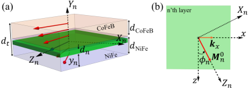
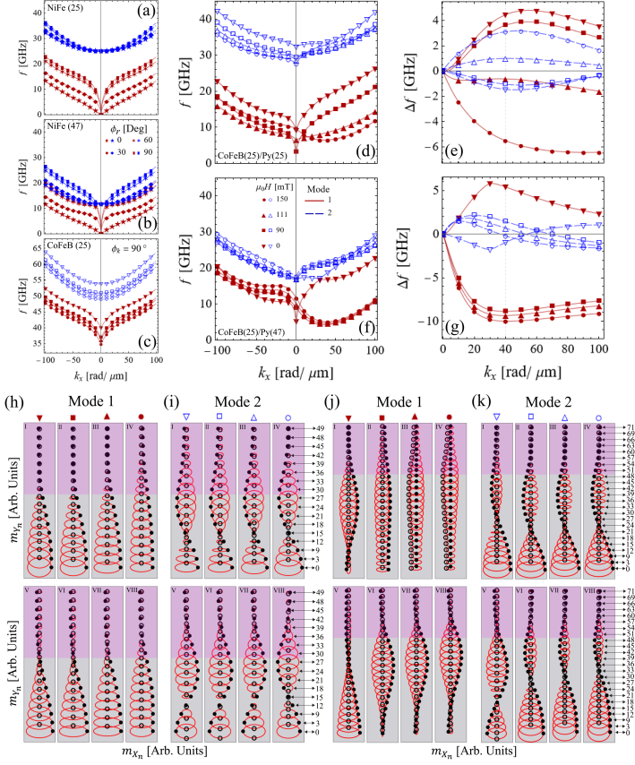
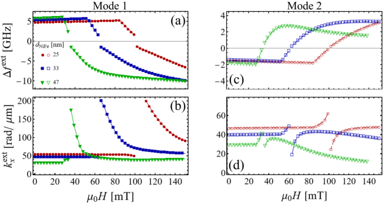
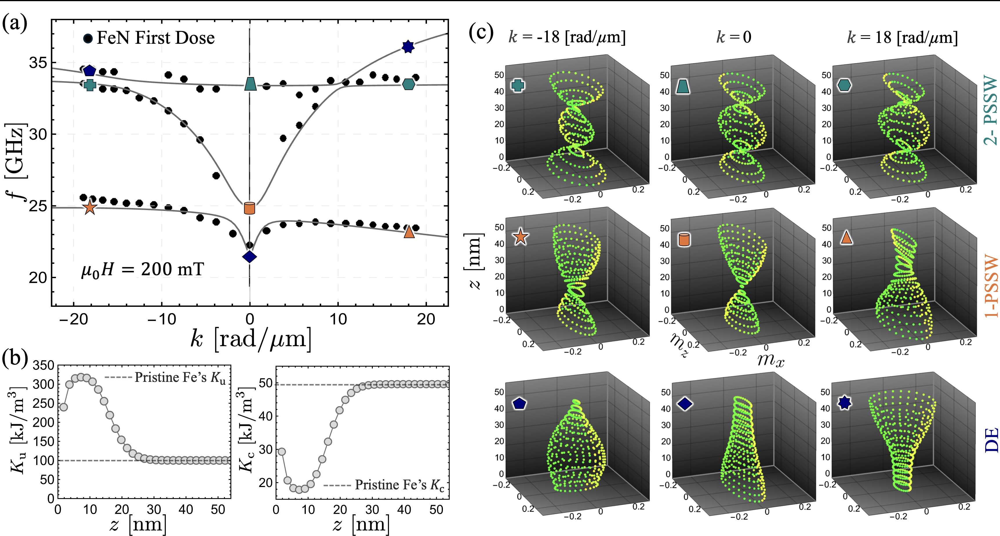
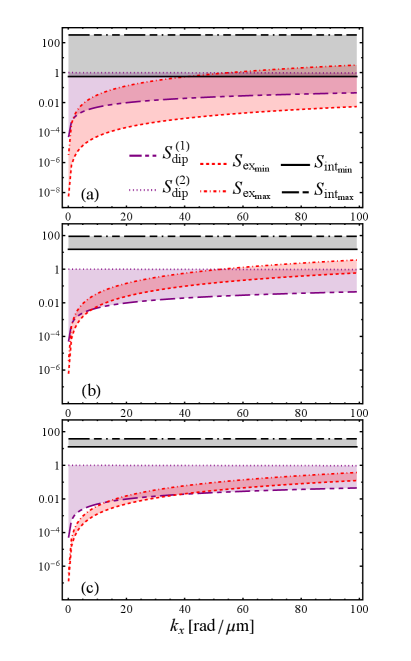
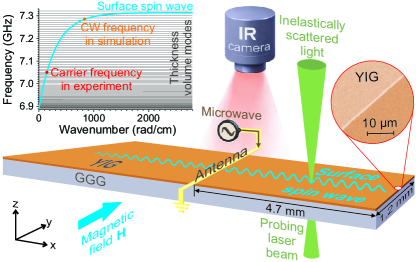

# 軟磁性金属二層膜における非相反スピン波と周波数非対称性の解明

- 執筆日：2026-05-17
- トピック：CoFeB/NiFe 二層膜のらせん磁化状態が生み出す非相反スピン波伝搬と，その周波数シフトを支配する層間交換相互作用の物理的起源
- タグ：Magnetism and Spin / Thin Films and Interfaces / Magnons and Spin Dynamics / Transport Measurements
- 注目論文：Negrete et al., "Nonreciprocal spin waves of helical magnetization states in CoFeB/NiFe bilayers," arXiv:2604.00922 (2026) [https://arxiv.org/abs/2604.00922](https://arxiv.org/abs/2604.00922)
- 参照論文数：7

---

## 1. 背景：なぜ今この話題か

現代の情報処理技術は，エネルギー消費の増大という深刻な壁に直面している。電子（電荷）を駆動電流として利用する従来のエレクトロニクスは，ジュール発熱を伴い，デバイスの微細化とともに電力密度が指数関数的に増加する。こうした状況を打破する有望な代替手段として，スピン波（スピンの集団励起，量子としてはマグノン）を情報キャリアとして活用するマグノニクスが注目されている。スピン波は磁性体中を電荷の移動なしに伝搬できるため，原理的にはジュール発熱フリーの信号処理が可能である。

スピン波を用いたデバイス実現の鍵を握るのが「非相反性（nonreciprocity）」である。通常の弾性波や光波は，ある方向に伝搬する波とその逆方向の波が同じ分散関係をもつ（相反的）。しかしスピン波では，外部磁場の印加や磁性体の内部非対称性によって，正方向の波と負方向の波でエネルギー（周波数）が異なるという非相反分散が生じうる。この非対称性を積極的に利用すると，特定方向にしか信号を通さないマグノニックダイオードや，一方向増幅器，組み換え可能な論理素子などの機能デバイスが構成できる。

磁性薄膜・多層膜における非相反スピン波の研究は，過去十年で急速に進展した。ダモン–エシュバック（Damon–Eshbach）配置における磁気双極子相互作用に起因する非相反性は古くから知られていたが，近年はフェロ磁性体/重金属界面のダジャロシンスキー–守谷相互作用（DMI: Dzyaloshinskii–Moriya interaction）や，異なる磁気材料を積層した多層膜における層間交換結合が新たな非相反性の源として認識されてきた。とくに，磁化プロファイルが膜厚方向に空間的に変化する「傾斜磁化系」では，対向伝搬するスピン波のモードプロファイルが異なることが非相反性を引き起こすことが理論的に予測されている。

CoFeB と NiFe（パーマロイ）はスピントロニクスデバイスで広く使われる代表的な軟磁性金属材料である。CoFeB は大きな垂直磁気異方性（PMA）を持ち，NiFe は等方的な軟磁性体として知られる。この二材料を積層した CoFeB/NiFe 二層膜では，両層の磁化方向が互いに競合しながら外部磁場に応答し，らせん状の非一様磁化構造（ヘリカル状態）が形成される。このらせん磁化状態の下でのスピン波非相反性は，従来の均質磁化系とは本質的に異なるメカニズムが働くと考えられるが，その微視的起源は長らく議論の的であった。注目論文（arXiv:2604.00922）はまさにこの問いに正面から取り組み，ダイナミックマトリクス形式論を非一様磁化配置へ拡張することで，周波数シフトの起源を定量的に解明した。

## 2. 未解決問題は何か

### 2.1 非相反周波数シフトの支配的起源はどこにあるのか

スピン波の非相反分散は，周波数シフト $\Delta f[k_x] = f[k_x] - f[-k_x]$ として定量化される。均質な薄膜のダモン–エシュバック配置では，膜の上下表面に局在する双極子磁場の非対称性が $\Delta f$ を生むことが古典的な磁気学の枠組みで理解されている。しかし多層膜では，双極子相互作用だけでなく，DMI，層間交換相互作用（両隣の層間を結ぶ通常の等方的交換結合），層内交換相互作用，一軸異方性，ゼーマン相互作用が複雑に絡み合う。どの相互作用が $\Delta f$ に支配的に寄与するのかは，系の磁化構造やスピン波モードプロファイルに依存するため，容易には答えられない。とくに，CoFeB/NiFe のような実用的な軟磁性金属系において，らせん状の非一様磁化状態が存在する場合のメカニズムは，これまで理論的枠組みが整備されていなかった。

この問いを解決するためには，膜厚方向に沿って層ごとに磁化方向が変化するという非一様配置を扱えるダイナミックマトリクス法の一般化が必要であった。従来のダイナミックマトリクス法は均質（コリニア）な磁化状態を仮定していたため，ヘリカル状態のような非コリニア配置には適用できなかった。この課題を乗り越えることが，注目論文の技術的出発点となっている。

解決のアプローチとしては，各サブレイヤーの局所座標系でLL方程式を線形化し，層間結合項を一般化された形で表現することが鍵であった。こうすることで，$2N \times 2N$ のダイナミックマトリクスに各相互作用テンソルを個別に組み込め，相互作用分解（interaction decomposition）による寄与分析が可能となる。

### 2.2 双極子相互作用だけで周波数シフトを説明できるか

近年の文献の一部では，多層膜の非相反周波数シフトは双極子相互作用のみで説明できると主張されていた。これに対し，2601.20636 の Suarez らは平面多層膜系において交換相互作用が支配的役割を担いうることを指摘した。注目論文もまた，ヘリカル磁化状態を持つ CoFeB/NiFe 系で同様の結論に達している。この対立はどのような物理条件のもとで生じるのか，またどのような実験・計算が決定打になりうるか，は依然として重要な問いである。

双極子相互作用と交換相互作用の寄与を分離するには，各相互作用を「切った」モデル計算が有効だが，実際の薄膜では両者が不可分に混在している。表面電荷比（surface charge ratio）と呼ばれる量は双極子寄与の指標になるが，それだけでは説明できない場合に交換相互作用の寄与が顕在化する。このような相互作用分解解析をどう定式化し，実験で検証するかが具体的な課題である。

### 2.3 ヘリカル磁化状態の制御と非相反性のチューナビリティ

ヘリカル磁化状態は，磁場の大きさや方向，CoFeB と NiFe それぞれの膜厚，および CoFeB の PMA の強さによって変化する。このパラメータ空間の中で，大きな $\Delta f$ と短いスピン波波長（100 nm 以下）を同時に達成できる領域はどこにあるのか，それを材料設計にどう活かすかは，実用的な観点からの重要問題である。波長が短いほど情報密度は高まるが，減衰も大きくなる（ギルバート減衰）。チューナビリティと低損失の両立という工学的トレードオフをどう克服するかも未解決である。

一つの仮説としては，異方性定数 $K_u^{\rm CoFeB}$ を界面膜厚や下地層種類で精密に調整することで，所望の外部磁場強度でヘリカル状態に移行させ，かつスピン波の減衰長を材料の選択（例えば CoFeB に代わる低ダンピング PMA 材料を使用）で延ばすアプローチが考えられる。

### 2.4 非相反性の「方向性」はどこまで一般化できるか

非相反スピン波は特定の伝搬方向（例えばダモン–エシュバック配置）でのみ顕著に現れると思われがちだが，実際にはキャナライジング（特定の溝状構造に沿って誘導）した際に任意方向への伝搬と非相反性がどう干渉するかは未解明な点が残る。2505.07401 の研究は，合成反強磁性体（SAF）製の導波路において，「非相反材料の中を相反方向に誘導しようとしても，系が非相反性の強い影響を受け続ける」ことを示した。導波路の形状，材料の非相反性の強さ，伝搬方向の組み合わせが実際のデバイス性能にどう影響するかを理解することは，マグノニクス回路設計の根本問題である。

## 3. 注目論文の概説

### 3.1 研究目的と対象系

Negrete らの論文（arXiv:2604.00922）は，CoFeB/NiFe 二層膜のらせん（ヘリカル）磁化状態においてスピン波がどのような非相反性を示すか，そしてその周波数シフトの微視的起源は何かを理論的に解明することを目的としている。対象材料はスピントロニクスデバイスで広く使われる CoFeB（飽和磁化 $M_s^{\rm CoFeB} = 1270$ kA/m，一軸異方性定数 $K_{\rm CoFeB} = 500$ kJ/m³）と NiFe（パーマロイ，$M_s^{\rm NiFe} = 860$ kA/m，等方的軟磁性体）の積層薄膜であり，両層の膜厚はそれぞれ 25〜47 nm の範囲で変化させて計算している。

*図1：CoFeB/NiFe 二層膜のヘリカル磁化状態の模式図。全膜厚 $d_t$，NiFe 膜厚 $d_{\rm Py}$，CoFeB 膜厚 $d_{\rm CoFeB}$ を示す。系を N 個のサブレイヤーに分割し，n 番目のサブレイヤーの磁化方向 $\phi_n$ が層ごとに連続的にねじれるヘリカル構造を形成している。(arXiv:2604.00922, CC BY 4.0)*

### 3.2 研究アプローチ

この研究の核心はダイナミックマトリクス法（DMM: Dynamic Matrix Method）の拡張にある。従来の DMM では磁化が全層にわたって同じ方向（コリニア配置）を向いていることを仮定していたが，著者らはこれを膜厚方向に磁化方向が層ごとに任意の角度 $\phi_n$ をとる非コリニア配置へと一般化した。

計算の流れは以下の通りである。まず，CoFeB/NiFe 二層膜全体を N 個のサブレイヤー（各サブレイヤー厚さ 1 nm）に分割する。各層の磁化方向 $\phi_n$ はブラウン方程式（エネルギー最小化条件）を解くことで決定する。ブラウン方程式の n 番目の層に対する明示的な表現は：

$$H \cos(\phi_H - \phi_n) - A_{n,n-1} \sin(\phi_n - \phi_{n-1}) - A_{n,n+1} \sin(\phi_n - \phi_{n+1}) + \frac{K_n^u}{\mu_0 M_{s_n}} \sin 2\phi_n = 0$$

ここで第1項はゼーマン相互作用（印加磁場 $H$，印加方向 $\phi_H$），第2・3項は隣接層との層間交換相互作用（$A_{n,\beta}$ は積分層間交換定数），第4項は一軸異方性（$K_n^u$）の寄与を表す。

均衡磁化状態 $\{\phi_1,\ldots,\phi_N\}$ が定まった後，Landau–Lifshitz (LL) 方程式をその周りで線形化すると，$2N \times 2N$ のダイナミックマトリクス $\mathbb{N}$ を用いた固有値方程式が得られる：

$$i\omega \tilde{\mathbf{m}}[\mathbf{k}] = \mathbb{N}[\mathbf{k}] \cdot \tilde{\mathbf{m}}[\mathbf{k}]$$

ここで $\omega$ は角周波数，$\tilde{\mathbf{m}}[\mathbf{k}]$ は各層の動的磁化ベクトルを並べた固有ベクトルである。ダイナミックマトリクス $\mathbb{N}$ は双極子，層間交換，層内交換，一軸異方性，ゼーマン各相互作用のテンソル寄与の和として書け：

$$\mathbb{N} = \mathbb{N}^{\rm dip} + \mathbb{N}^{\rm inter} + \mathbb{N}^{\rm intra} + \mathbb{N}^u + \mathbb{N}^Z$$

この行列を数値対角化することで，波数 $k_x$ の関数としての分散関係 $\omega[k_x]$ と，各モードのスピン波軌道分布（モードプロファイル） $\tilde{\mathbf{m}}[k_x]$ が同時に得られる。特に，相互作用ごとの寄与を個別に計算することで，周波数シフトの起源を相互作用分解解析によって定量評価できる点が，本研究手法の最大の強みである。

### 3.3 主要結果

**ヘリカル平衡状態の形成**：CoFeB(25 nm)/NiFe(25 nm) 系では，コーシブ力 $H_C$（ヘリカル状態が形成される臨界磁場）は NiFe 層の膜厚に依存し，NiFe が薄いほど $H_C$ が大きくなる。印加磁場 $H > H_C$ において，CoFeB は PMA により磁場方向に抵抗しつつ，NiFe は速やかに磁場方向に従い，結果として両層の間で磁化方向のねじれ（ヘリカル構造）が生じる（図1参照）。

**分散関係と周波数シフト**：下図に示す分散関係では，CoFeB/NiFe 二層膜の周波数範囲が個別の CoFeB，NiFe の各単層の分散と比較されている。NiFe 膜厚が 25 nm の場合はモードの混成（ハイブリダイゼーション）が見られないが，47 nm の場合にはモードが交差しハイブリダイゼーションが生じる。非相反周波数シフト $\Delta f[k_x] = f[k_x] - f[-k_x]$ は，後者の厚い NiFe 系でより複雑な振る舞いを示す。

*図2：CoFeB/NiFe 二層膜の分散関係と非相反周波数シフト。(a,b) 均質 NiFe 単層の比較；(d,f) CoFeB/NiFe 二層膜の分散関係；(e,g) 対応する周波数シフト $\Delta f$；(h,i,j,k) 対向伝搬モード（$k_x = \pm 40$ rad/μm）のスピン波軌道分布（モードプロファイル）。(arXiv:2604.00922, CC BY 4.0)*

**層間交換相互作用の支配性**：CoFeB(25)/NiFe(47) 系のモード1では，対向伝搬するスピン波（$k_x = +40$ rad/μm と $k_x = -40$ rad/μm）のモードプロファイルが膜厚方向に大きく異なる。このとき，双極子相互作用の代理指標である表面電荷比だけでは $\Delta f$ を説明できず，層間交換相互作用のダイナミックテンソル $\mathbb{N}^{\rm inter}$ を考慮して初めて $\Delta f$ が説明される。定量評価によると，モードプロファイルが非対称な条件下では，**層間交換相互作用は双極子，層内交換，異方性，ゼーマンなどすべての他の相互作用の合計より 2〜3 桁大きい寄与**をもたらす。

**波長 100 nm 以下の高周波数シフト**：NiFe 膜厚と外部磁場を適切に調整することで，$|\Delta f^{\rm ext}|$ が数 GHz に達しつつ，対応するスピン波波長 $\lambda = 2\pi/k_x^{\rm ext}$ が 100 nm 以下という組み合わせが実現できることを示した（図3）。これは大きな情報密度が必要なマグノニクスデバイスにとって魅力的な性能指標である。

*図3：CoFeB(25)/NiFe 二層膜における周波数シフト極値 $\Delta f^{\rm ext}$ とそれに対応する波数 $k_x^{\rm ext}$ の外部磁場依存性。NiFe 膜厚を 25, 37, 47 nm と変化させた場合の比較。波長 100 nm 以下で GHz オーダーの周波数シフトが実現可能であることを示す。(arXiv:2604.00922, CC BY 4.0)*

### 3.4 論文の新規性と限界

本論文の核心的新規性は，非コリニア（ヘリカル）磁化配置に対応したダイナミックマトリクス法の拡張と，それを用いた相互作用分解による周波数シフト起源の定量的解明である。従来文献の多くが双極子相互作用のみに帰因していた非相反周波数シフトが，実は層間交換相互作用に支配されているというのは，コミュニティへの重要なメッセージとなっている。また，外部磁場と NiFe 膜厚というアクセスしやすいパラメータで非相反性を広範にチューニングできるという実用的設計指針も示している。

限界としては，本研究が純粋に理論・計算に基づいており，自身の実験データをもたないことが挙げられる。著者らは過去の文献の実験・シミュレーション結果と自身のモデルを比較して検証しているが，CoFeB/NiFe ヘリカル系に特化した直接のブリルアン光散乱（BLS）実験や，マイクロマグネティクスシミュレーションとの詳細比較は今後の課題として残されている。

## 4. 研究史における位置づけ

### 4.1 スピン波非相反性研究の系譜

スピン波の非相反伝搬に関する研究の起点は，1960 年代のダモン（Damon）とエシュバック（Eshbach）による磁化一様薄膜の解析的研究にある。彼らは，面内磁化された薄膜において，スピン波ベクトルが磁化と直交する配置（DE 配置）では，上面と下面に局在する対向する磁気静力学的表面波が出現し，これが非相反性を示すことを示した。この「表面電荷の非対称性」に起因する非相反性はその後の多くの実験・理論研究の基礎となった。

2010 年代に入ると，強磁性体/重金属（例えば Py/Pt, CoFeB/Ta）界面の非対称交換相互作用（界面 DMI）が強力な非相反性の源として認識されるようになった。界面 DMI は $\mathbf{D}_{ij} \cdot (\mathbf{S}_i \times \mathbf{S}_j)$ の形の相互作用で，隣接スピンを 90° ねじれさせようとする力学を持ち，非相反周波数シフトへの寄与が BLS によって定量的に測定されるようになった。

合成反強磁性体（SAF: CoFeB/Ru/CoFeB など）では，Ru スペーサー層を介した RKKY 型層間交換結合によって両層の磁化が反平行に固定され，その状態での非相反スピン波伝搬が研究された。2505.07401（Naletov ら）はこのような SAF 系をストライプ状の導波路に加工し，BLS 顕微鏡と理論モデルを組み合わせることで，「非相反方向に導波しようとしても強い非相反残影が残る」ことを実証している。

2504.11145（Castel ら）は，鉄エピタキシャル薄膜に低ドーズの窒素イオン注入を施すことで，膜厚方向に磁気異方性の傾斜プロファイルを作り込み，その BLS スペクトルの非相反周波数シフトを測定した。この系では DMI を介さず，純粋に傾斜した一軸異方性が非相反性を引き起こすという実験的証拠が得られており，2601.20636 と注目論文の理論的予測を独立に支持する結果となっている。

*図4：傾斜異方性を持つ窒素注入 FeN 薄膜において測定された BLS スペクトルと理論計算との比較。正負の波数で異なるピーク位置が非相反周波数シフトを示しており，理論計算との良好な一致が傾斜磁気パラメータによる非相反性の実験的証拠となっている（arXiv:2504.11145, CC BY 4.0）。*

### 4.2 非コリニア磁化系の理論的記述

二層膜における非相反スピン波の理論的記述では，2504.00631（Tupitsyn ら）が薄い二層膜の双極子–交換スピン波スペクトルを解析的に扱い，層間交換結合と層内・層間双極子相互作用の共存効果を整理した。この研究では，磁化の向きが両層で異なる場合（反平行配置など）の分散関係を連続体近似で扱い，非相反伝搬磁気漏れ場の非対称性を分析している。これは注目論文の定式化に対して補完的・背景的位置付けにある。

2601.20636（Otálora, Suarez ら）は，CoFeB/NiFe の均質磁化（コリニア）配置で同じ種類の相互作用分解解析を行い，**コリニア系においても NiFe 膜厚が増加してモードの幾何学的構造が対向伝搬モード間で差異を生じる場合には，層間交換相互作用が双極子相互作用を大幅に上回る**ことを先駆的に示した。注目論文はその著者グループの自然な拡張として位置付けられ，「コリニア」から「ヘリカル（非コリニア）」への一般化を成し遂げている。

*図5：均質（コリニア）磁化状態を持つ CoFeB/NiFe 二層膜における周波数シフトの相互作用別寄与分解（arXiv:2601.20636, CC BY 4.0）。NiFe 膜厚が増加してモードプロファイルが非対称になると，層間交換相互作用（inter）が他の寄与を圧倒することが示されている。*

### 4.3 注目論文の位置づけ

以上の流れを踏まえると，注目論文 2604.00922 は「コリニアから非コリニア（ヘリカル）磁化配置への DMM 拡張」という技術的貢献と，「非相反周波数シフトの支配因子は層間交換相互作用である」という物理的主張の両面で，スピン波非相反研究の最前線に位置する。ヘリカル状態は，CoFeB の PMA と NiFe の軟磁性という対照的な磁気異方性を組み合わせることで自然に実現される「交換バネ（exchange-spring）」的な構造であり，この系は材料設計の柔軟性（膜厚，異方性定数，印加磁場）を通じて非相反性を幅広くチューニングできるという点でユニークな位置にある。

## 5. どの解釈が最も妥当か

### 5.1 「双極子相互作用のみ」説の限界

従来，薄膜の非相反周波数シフトは双極子相互作用（磁気表面電荷の非対称性）のみで説明できるという見方が広く共有されていた。この解釈は，単層薄膜のダモン–エシュバック波では確かに成り立つ。しかし多層膜でモードのプロファイルが対向伝搬で異なる場合，双極子相互作用テンソル $\mathbb{N}^{\rm dip}$ の対向伝搬間の差分だけでは $\Delta f$ を再現できない。注目論文と 2601.20636 は，この「説明の残差」が層間交換相互作用テンソル $\mathbb{N}^{\rm inter}$ に起因することを，相互作用分解計算によって明示的に示した。

定量的には，CoFeB(25)/NiFe(47) 系のモード1において，双極子寄与と層間交換寄与を比較すると後者が 2〜3 桁大きい。この比は理論計算で明確に分離できるため，「双極子のみ」説を棄却する根拠は強固である。ただし，コリニア配置で対向伝搬モードプロファイルが対称的な場合（例えば CoFeB(25)/NiFe(25) の薄い系）には，双極子寄与が相対的に重要になる。つまり，支配的相互作用は「系の条件依存」であり，膜厚と磁化状態によって連続的に変化する。

### 5.2 モードプロファイル非対称性が鍵となる統一的理解

注目論文と 2601.20636 が提示する統一的解釈は，「周波数シフトの支配的相互作用は，対向伝搬モードのモードプロファイルの幾何学的差異によって決まる」という命題に集約される。具体的には：

- モードプロファイルが対称（$k_x$ と $-k_x$ で軌道分布が似ている）→ 双極子相互作用が主要因
- モードプロファイルが非対称（$k_x$ と $-k_x$ で軌道分布が大きく異なる）→ 層間交換相互作用が主要因

この判断基準は，膜厚が大きくなるにつれてモードのハイブリダイゼーションが促進され，対向伝搬モードのプロファイルが乖離することに起因する。ヘリカル磁化状態ではらせんのねじれ度合いがさらにモード構造を変化させるため，コリニア系と比べてより多様な非対称性が現れる。

2504.11145 の窒素注入 FeN 薄膜では，膜厚方向の異方性勾配がモードプロファイルに直接作用する。BLS で測定された非相反周波数シフトは理論計算とよく一致しており，「傾斜磁気特性 → モードプロファイル非対称 → 非相反周波数シフト」という因果連鎖の実験的支持となっている。

### 5.3 ダモン–エシュバック波の「カイラル保護」は厚さで破れる

2605.07875（Khodko ら）は，YIG 厚膜（16 μm）においてカイラル性に起因する表面スピン波（Damon-Eshbach 波）の反射が，予想外に「バルクモードを介した非弾性散乱」によって媒介されることを示した。薄膜では表面スピン波は「カイラル保護」によりバックスキャタリングが抑制されると予測されていたが，厚膜になるとバルクモードが豊富に存在し，これが表面波反射の「クロスチャネル」となる。

*図6：厚膜 YIG 導波路における実験配置とスピン波スペクトル。MSSW（Damon–Eshbach 型表面波）と BVMSW（後退体積波）の伝搬・反射特性が比較される。MSSW はバルクモードを介して非弾性的に反射されるため，反射波形が歪む。(arXiv:2605.07875, CC BY 4.0)*

この結果は，表面電荷の非対称性（双極子起源の非相反性）がバルクとの結合によって複雑化するという新たな側面を提示しており，注目論文の層間交換支配という解釈が薄膜の基礎に立つものであることを示唆する。また，厚膜になるほど「純粋な双極子起源」の描像から逸脱し，多体的なモード混合が重要になるという，より広い文脈での共通テーマが浮かび上がる。

### 5.4 どの結論が強く，どこに不確定性が残るか

比較的強く支持される結論としては，(i) ヘリカル磁化状態下の CoFeB/NiFe 二層膜で非相反スピン波が現れること，(ii) モードプロファイルが非対称な条件では層間交換相互作用が周波数シフトを支配すること，(iii) NiFe 膜厚と印加磁場による非相反性のチューナビリティが挙げられる。これらはいずれも複数のグループの計算で一致する結果が出ており，理論的には強固な基盤がある。

不確定な点としては，実際の CoFeB/NiFe ヘリカル系で BLS 実験によって直接検証された例がまだ少ないこと，ヘリカル状態の精密な磁化構造を他の手法（偏極中性子反射率法など）で観測した事例との対応，およびマイクロマグネティクス数値計算との体系的比較が残されていることが挙げられる。今後必要な検証として，同じパラメータでの DMM と MuMax3 等の時間発展計算の系統的比較，BLS によるヘリカル状態下の非相反スピン波の直接測定，ならびに波長 100 nm 以下での測定精度の向上が鍵を握る。

## 6. 何が一般化できるか

### 6.1 「傾斜磁気特性」の設計原理

注目論文が示した「ヘリカル磁化状態でモードプロファイルが非対称になると層間交換相互作用が支配する」という原理は，CoFeB/NiFe に限定されるものではない。**膜厚方向に磁化方向や磁気パラメータが空間変化する任意の磁性多層膜系に適用できる普遍的な設計原理**である。

2504.11145 の FeN 系は，その別の具体例である。窒素イオン注入により膜厚方向に異方性の傾斜プロファイルを作り込むことで，DMI なしに非相反スピン波を実現している。さらに，窒素ドーズ量の調整で傾斜の度合いを制御できるため，材料的自由度が高い。より広く見れば，「傾斜（graded）」設計は，垂直磁気異方性の傾斜（FeN, FePt, CoFeB の厚さ変調など），飽和磁化の傾斜（合金組成の連続変化），交換定数の傾斜（非磁性スペーサー厚の変調），などのバリエーションで実現でき，非相反マグノニクスデバイスの材料設計原理として普遍化できる。

### 6.2 他の材料系・測定手法への接続

YIG（イットリウム鉄ガーネット）系は低ダンピングであることで知られ，マグノニクス研究の主流材料である。2605.07875 の結果は YIG 厚膜でのダモン–エシュバック波の反射がバルクモードを経由することを示しており，YIG ベースのデバイスでも厚さと非相反性の関係を再考する必要性を示唆している。金属多層膜と酸化物薄膜の非相反スピン波物理を統一的に理解するには，モードプロファイルの幾何学的対称性という共通言語が有効である。

vdW 強磁性体（例えば CrI₃, Fe₅GeTe₂ 系）では，原子層レベルで組成・厚さを制御できるため，傾斜磁気特性の極限的実装が可能である。金属薄膜・酸化物・vdW 材料という三つの材料クラスを横断して，モードプロファイル非対称性という単一の物理量で非相反性を理解・設計する枠組みは，材料科学とマグノニクスの接続点として重要性を増している。

### 6.3 マグノニクスデバイスへの波及

2505.10654（Odintsov ら）は，面外磁化した Bi 置換 YIG 導波路において非相反スピン波デバイスを実証した。ドメイン壁の位置を変化させることでスピン波の伝搬方向選択性を「非揮発的」に切り替えられるという，記憶機能と信号方向制御の融合を示している。これは，スピン波の非相反性とドメイン壁ダイナミクスを組み合わせたニューロモルフィックコンピューティングへの応用可能性を示す。

注目論文の CoFeB/NiFe 系は，外部磁場で連続的にヘリカル角を変化させることが，非相反周波数シフトの大きさをリアルタイムで制御することと等価であり，可変減衰器（アッテネータ）や可変位相器などのアナログマグノニックデバイスの設計思想と共鳴する。さらに，CoFeB は MRAM デバイスにも使われる材料であるため，スピントロニクスの既存基盤との親和性が高く，製造技術の観点でも実装への道筋が描きやすい。

### 6.4 理論枠組みの一般化とAI for Science との接続

ダイナミックマトリクス法を非コリニア磁化配置に拡張したことは，方法論的な貢献としても重要である。本手法は，任意の平衡磁化プロファイルを持つ多層膜（SAF，交換バネ系，強磁性多層膜，フラストレート磁性体など）のスピン波分散計算に適用できる。今後，第一原理計算や機械学習ポテンシャルから得たパラメータ（$M_s, A, K_u, J_{\rm int}$ など）と非コリニア DMM を組み合わせることで，マテリアルズ・インフォマティクス的なスピン波材料設計への橋渡しが可能になる。たとえば，ベイズ最適化や強化学習と組み合わせた多層膜パラメータの逆設計——目標とする $\Delta f$ と $k_x$ を指定して最適な膜厚・異方性・磁場を自動探索——というアプローチは，AI for Science の観点から今後の重要な応用展開として期待される。

## 7. 基礎から理解する

### 7.1 磁気モーメントとスピン

物質の磁性は，電子が持つ固有の角運動量（スピン）と，原子核の周りを回る軌道運動に由来する。電子1個のスピン角運動量の大きさは $\hbar/2$（$\hbar$ はディラック定数）で，スピン磁気モーメントは：

$$\boldsymbol{\mu} = -g \mu_B \mathbf{S}/\hbar$$

ここで $g \approx 2$ は g 因子，$\mu_B = e\hbar/(2m_e) \approx 9.27 \times 10^{-24}$ J/T はボーア磁子，$\mathbf{S}$ はスピン角運動量ベクトルである。固体中では多数の電子スピンが量子力学的な交換相互作用（$J \mathbf{S}_i \cdot \mathbf{S}_j$ の形のハイゼンベルク模型）を介して結びつき，強磁性体では同じ向きに整列する（$J > 0$）。マクロな磁化 $\mathbf{M}$（単位体積あたりのスピン磁気モーメントの総和）はこの整列を表す秩序パラメータである。飽和磁化 $M_s$ は，全スピンが完全に整列したときの磁化の大きさで，NiFe では $M_s \approx 860$ kA/m，CoFeB では $\approx 1270$ kA/m である。

強磁性体において，異なる原子間の隣接スピンの交換積分 $J_{ij}$ の大きさと符号は材料の電子構造（d 軌道の占有状態，バンド構造）によって決まる。Bethe–Slater 曲線と呼ばれる経験則では，原子間距離が適切な範囲にある遷移金属（Fe, Co, Ni など）では $J > 0$ の強磁性交換が実現することが示されている。

### 7.2 磁気異方性

実際の強磁性体では，結晶構造や形状のために磁化が特定の方向（易軸）を向きやすい「磁気異方性」が存在する。一軸磁気異方性エネルギーは，磁化が易軸から角度 $\theta$ だけ傾いたとき：

$$E_u = K_u V \sin^2\theta$$

のように書ける（$K_u$ は異方性定数，単位 J/m³，$V$ は体積）。$K_u > 0$ の場合は $\theta = 0$ が安定で易軸に沿う方向が好まれ，$K_u < 0$ の場合は $\theta = 90°$ が安定で易面（easy plane）配置となる。

CoFeB（特に界面効果で強化された系）では $K_u^{\rm eff} > 0$ で易軸が膜面に垂直な方向（垂直磁気異方性, PMA）を指す。界面 PMA の物理的起源は，CoFeB と接する MgO などの酸化物界面での Co の $3d$ 軌道と O の $2p$ 軌道のハイブリダイゼーションによる界面磁気異方性エネルギーにある。CoFeB 膜厚が厚くなると，体積寄与（面内異方性，$K_{\rm bulk} < 0$）が界面寄与（PMA）を上回り，実効異方性 $K_u^{\rm eff} = K_{\rm interface}/t - |K_{\rm bulk}|$（$t$ は膜厚）が正から負に変化する。NiFe（パーマロイ）は $K_u \approx 0$ の等方的な軟磁性体であり，形状異方性のみが磁化方向を決める。

### 7.3 交換相互作用と連続体微磁気学

原子スケールの交換相互作用は，連続体近似（微磁気学: micromagnetics）では勾配エネルギー密度として表現される：

$$e_{\rm ex} = A \left[ \left(\frac{\partial \hat{m}_x}{\partial x}\right)^2 + \left(\frac{\partial \hat{m}_x}{\partial y}\right)^2 + \ldots \right] = A |\nabla \hat{\mathbf{m}}|^2$$

ここで $A$（単位 J/m）は交換スティフネス定数，$\hat{\mathbf{m}} = \mathbf{M}/M_s$ は単位磁化ベクトルである。この項は磁化が空間的に均一（$\nabla \hat{\mathbf{m}} = 0$）のときにゼロになり，磁化の空間変化（ドメイン壁，スピン波など）があるとエネルギーコストが生じる。

交換長（exchange length）$\lambda_{\rm ex}$ は，交換エネルギーと磁気静的エネルギー（双極子エネルギー）が釣り合うスケールであり：

$$\lambda_{\rm ex} = \sqrt{\frac{2A}{\mu_0 M_s^2}}$$

と定義される。NiFe では $\lambda_{\rm ex} \approx 5$ nm，CoFeB では $\approx 7$ nm 程度である。膜厚がこのスケールより薄い場合（$d \lesssim \lambda_{\rm ex}$），膜厚方向の磁化変化は抑制され，均質な膜厚方向分布を仮定できる。

二層膜では，界面を介して隣接する磁性層間の交換相互作用を「層間交換結合」として別途扱う。界面 1 m² あたりの面積交換エネルギーは $J_{\rm int}$ (J/m²) で特徴付けられ，$J_{\rm int} > 0$ は強磁性的結合（隣接層が同じ向きを好む），$J_{\rm int} < 0$ は反強磁性的結合（反平行を好む）を意味する。注目論文では CoFeB と NiFe の直接接触による層間等方的交換を $J_{\rm int}$ でモデル化している（RKKY 型の間接交換とは異なる）。

### 7.4 Landau–Lifshitz 方程式

磁化ベクトルの時間発展は Landau–Lifshitz–Gilbert (LLG) 方程式で記述される：

$$\frac{d\mathbf{M}}{dt} = -\gamma \mathbf{M} \times \mathbf{H}_{\rm eff} + \frac{\alpha}{M_s} \mathbf{M} \times \frac{d\mathbf{M}}{dt}$$

ここで $\gamma = g \mu_B / \hbar$（$\gamma/2\pi \approx 28$ GHz/T for $g=2$）は磁気回転比，$\alpha$ はギルバート減衰定数（NiFe で $\alpha \approx 0.006$，CoFeB で $\alpha \approx 0.004$〜0.01），$\mathbf{H}_{\rm eff}$ は有効磁場である。第1項は磁化が有効磁場の周りを歳差運動する（首振り運動する）ことを表し，第2項（ダンピング項）は磁化を有効磁場方向に緩和させる。

有効磁場 $\mathbf{H}_{\rm eff}$ はゼーマン場（外部磁場），交換場，異方性場，双極子場の寄与の和：

$$\mu_0 \mathbf{H}_{\rm eff} = \mu_0 \mathbf{H}_{\rm ext} + \frac{2A}{M_s^2} \nabla^2 \mathbf{M} + \frac{2K_u}{M_s^2}(\mathbf{M} \cdot \hat{\mathbf{u}})\hat{\mathbf{u}} + \mu_0 \mathbf{H}_{\rm dip}$$

$\mathbf{H}_{\rm dip}$ は磁化分布が作る磁気双極子場（静磁場）であり，薄膜の形状・境界に強く依存する。これはマクスウェル方程式の磁気的境界値問題を解くことで得られ，特に薄膜では反磁場係数 $N$ を用いて $\mathbf{H}_{\rm dip} \approx -N \mathbf{M}$ と近似されることもある。

### 7.5 スピン波とその分散関係

LLG 方程式を均衡磁化状態 $\mathbf{M}_0$ のまわりで微小振動（線形化）近似すると，磁化の小振幅振動の解として平面波（スピン波）が得られる：

$$\delta\mathbf{m}(\mathbf{r}, t) = \mathbf{m}_k e^{i(\mathbf{k}\cdot\mathbf{r} - \omega t)}$$

ここで $\mathbf{k}$ は波数ベクトル，$\omega$ は角周波数，$\mathbf{m}_k$ は（複素）振幅ベクトルである。スピン波が取りうる $\omega$ と $\mathbf{k}$ の関係が分散関係 $\omega(\mathbf{k})$ であり，これは均衡磁化状態，材料パラメータ（$M_s, A, K_u$），外部磁場の関数として決まる。

強磁性共鳴（FMR）は $k = 0$ の均一モードで，面内磁化された薄膜では Kittel 式で記述される：

$$f_{\rm FMR} = \frac{\gamma}{2\pi} \sqrt{(\mu_0 H_0 + \frac{2K_u}{M_s} - \mu_0 M_s N_z)(\mu_0 H_0 + \frac{2K_u}{M_s} + \mu_0 M_s(N_y - N_z))}$$

（$N_y, N_z$ は面内・面外方向の反磁場係数）

有限波数のスピン波では，交換相互作用（$\propto Ak^2$ の寄与）が分散に加わり，高周波側へシフトする：

$$f(k) \approx f_{\rm FMR} + \frac{\gamma A k^2}{\pi M_s} \quad (k \to \infty \text{ の極限})$$

このため，スピン波の分散曲線は低 $k$ でほぼ平坦（双極子支配），高 $k$ で $k^2$ に比例して上昇（交換支配）という二段階構造を示すことが多い。

### 7.6 非相反分散：f(k) ≠ f(-k)

通常の等方的強磁性体では，時間反転対称性と空間反転対称性が共に保たれているため，$f(k) = f(-k)$（相反的分散）が成立する。スピン波の非相反分散が現れるには，この対称性のいずれかが破れる必要がある。

薄膜面内で磁化が一定方向を向いた場合（$\mathbf{M}_0 \parallel \hat{z}$），ダモン–エシュバック配置（$\mathbf{k} \perp \mathbf{M}_0$，すなわち $\mathbf{k} \parallel \hat{x}$）では，膜の上面と下面で磁気「表面電荷」（磁化の法線成分 $\mathbf{M} \cdot \hat{n}$）の分布が $k_x$ の符号によって互い違いになる。これが $f(k_x) \neq f(-k_x)$ を生む双極子起源の非相反性である。周波数シフトの大きさは近似的に：

$$|\Delta f_{\rm DE}| \approx \frac{\gamma \mu_0 M_s}{2} (1 - e^{-2|k_x|d})$$

の形で与えられ（$d$ は膜厚），$k_x d \gg 1$ の極限では $|\Delta f_{\rm DE}| \rightarrow \gamma \mu_0 M_s / 2$ に飽和する。

DMI（界面 DMI の場合）が存在すると，$\mathbf{k}$ に平行な方向のスピン波に追加の周波数差が生じ：

$$\Delta f_{\rm DMI} = \frac{2\gamma D_s k_x}{\pi M_s d}$$

となる（$D_s$ は面積 DMI 定数，単位 J/m²）。この項は $k_x$ に比例するため，大きな $k_x$ では DMI 起源の非相反性が双極子起源を超える可能性がある。

多層膜では，ここに層間交換相互作用項 $\mathbb{N}^{\rm inter}$ が加わり，対向伝搬モードのプロファイルが異なる場合に非相反周波数シフトを大幅に増強する。これが注目論文の本質的メッセージである。

### 7.7 ダイナミックマトリクス法

ダイナミックマトリクス法（DMM）は，多層膜を離散的な $N$ サブレイヤーに分割し，LLG 方程式の線形化によって $2N \times 2N$ のダイナミックマトリクス $\mathbb{N}$ の固有値問題に帰着させる手法である。

行列の各要素 $N_{np}^{q,\sigma}$（$n, p$ がサブレイヤーインデックス，$q \in \{XX, XY, YX, YY\}$ が空間成分，$\sigma$ が相互作用の種類）は解析的に与えられ，数値的に構成される。行列の非対角成分が層間結合を記述する。

$\mathbb{N}$ は波数 $\mathbf{k}$ に依存する行列であるため，$k_x$ を変化させながら固有値 $\omega[k_x]$ と固有ベクトル $\tilde{\mathbf{m}}[k_x]$ を追跡することで，分散関係とモードプロファイルが同時に得られる。特定の相互作用テンソル（例えば $\mathbb{N}^{\rm inter}$）のみを残して他をゼロにした「部分ダイナミックマトリクス」による計算が，相互作用分解解析の実装である。

非コリニア磁化配置（ヘリカル状態）では，各サブレイヤーの局所座標系が異なるため，座標変換行列を用いたテンソルの回転変換を伴った一般化が必要であり，これが注目論文の技術的貢献の中核である。均衡状態での磁化方向 $\phi_n$ はブラウン方程式を数値的に解くことで事前に求め，その後 DMM を適用する，という二段階の計算手順をとる。

### 7.8 軟磁性材料：CoFeB と NiFe の特性

CoFeB は Co, Fe, B の非晶質合金で，スピン移行トルク MRAM（STT-MRAM）や磁気トンネル接合（MTJ）の自由層・固定層として広く使われる。薄膜（通常 1〜5 nm）では Ta や MgO などの下地層との界面効果によって大きな PMA が発現し，$K_u^{\rm eff} \approx 200$〜$500$ kJ/m³ に達する。膜厚が増えると実効異方性が減少し，やがて面内配向に転じる（PMA の界面起源の特徴）。本論文では 25 nm という比較的厚い CoFeB を使用しているため，異方性定数を $500$ kJ/m³ と設定している。

NiFe（Ni$_{80}$Fe$_{20}$，パーマロイ）は磁歪がほぼゼロで，保磁力が極めて小さい（< 0.1 mT）典型的な軟磁性体である。飽和磁化は $M_s \approx 860$ kA/m，交換スティフネスは $A \approx 13$ pJ/m，ダンピング定数 $\alpha \approx 0.006$ と比較的小さく，マグノニクス実験のモデル材料として長年使われてきた。BLS 実験での測定が容易な周波数範囲（1〜20 GHz）のスピン波が典型的なサイズと磁場で観測できる。

この二材料の組み合わせでは，高い PMA を持つ CoFeB が「固い磁気バネ」，軟磁性の NiFe が「柔らかいバネ」として機能し，外部磁場に対して段階的・漸進的な応答を示す交換バネ構造が実現する。$J_{\rm int} > 0$（強磁性的層間結合）の場合，CoFeB の磁化ねじれに対して NiFe が追従しようとする一方，PMA が NiFe の追従を妨げ，この競合からヘリカル状態が生まれる。

### 7.9 ブリルアン光散乱（BLS）

ブリルアン光散乱（BLS: Brillouin Light Scattering）は，レーザー光が磁性体中のスピン波（マグノン）と非弾性散乱を起こすことを利用して，スピン波の周波数と波数を同時に測定する手法である。入射光子がマグノンを生成（ストークス散乱，周波数 $f_{\rm laser} - f_{\rm SW}$ の散乱光が観測される）または吸収（アンチストークス散乱，周波数 $f_{\rm laser} + f_{\rm SW}$）する。

散乱角度 $\theta_{\rm sc}$ と入射光の波長 $\lambda_{\rm laser}$ を用いると，交換されるスピン波の面内波数は：

$$k_x = \frac{4\pi}{\lambda_{\rm laser}} \sin\left(\frac{\theta_{\rm sc}}{2}\right)$$

と表される。散乱角を変えることで異なる $k_x$ での周波数 $f(k_x)$ を測定でき，分散関係をプロットできる。

非相反周波数シフト $\Delta f[k_x] = f[k_x] - f[-k_x]$ の測定では，磁場方向を固定して $+k_x$（特定の散乱角）と $-k_x$（その逆方向，または磁場を反転）での周波数を比較する。実際には，ストークスとアンチストークスのピーク位置の差の非対称成分として $\Delta f$ を抽出する。近年の BLS 顕微鏡（μ-BLS）では空間分解能が 250 nm 程度まで向上し，局所的なスピン波の振幅・位相分布を直接可視化できる。2504.11145 や 2505.07401 ではこの顕微 BLS を用いてスピン波の二次元強度分布を観測している。

### 7.10 ヘリカル磁化状態と交換バネ構造

「交換バネ（exchange-spring）」構造とは，硬磁性層と軟磁性層を直接接触させた積層膜で，外部磁場に対して段階的に磁化が変化する現象を指す。外部磁場が比較的弱い場合，硬磁性層の磁化はほぼ固定され，軟磁性層のみが磁場方向に引き寄せられて磁化がねじれる。このとき，界面からの距離に応じて磁化方向が連続的に回転するプロファイル（らせん構造 = ヘリカル状態）が形成される。数学的には，各サブレイヤーの平衡角 $\phi_n$ が $n$ の増加とともに単調に変化するプロファイルとして表される。

注目論文では CoFeB の高い PMA が「硬磁性」の役割を担い，NiFe が「軟磁性」の役割を担う。コーシブ力 $H_C$ 以上の磁場を印加すると，NiFe が磁場に従い CoFeB との間でねじれが生じ，膜厚方向に磁化方向が連続的に変化するヘリカル状態が安定する。ヘリカル状態でのねじれ角の大きさ（全回転角）は，印加磁場 $H$，NiFe 膜厚 $d_{\rm NiFe}$，異方性定数 $K_u^{\rm CoFeB}$，層間交換定数 $J_{\rm int}$ の関数として決まる。この状態での連続的なスピン波計算には，各サブレイヤーの磁化方向 $\phi_n$ が異なる非コリニア配置を扱える理論的枠組みが必要不可欠であった。

## 8. 専門用語の解説

**非相反性（nonreciprocity）**：波の伝搬において，順方向（$+k$）と逆方向（$-k$）で分散関係が異なる性質。相反的な系では時間反転対称性から $f(k) = f(-k)$ が保証されるが，外部磁場や磁気秩序により時間反転対称性が破れた系では $f(k) \neq f(-k)$ となりえる。磁性体中のスピン波の非相反性は双極子相互作用，DMI，層間交換相互作用などによって生じ，マグノニックダイオードや一方向信号素子の物理的基礎である。本論文ではCoFeB/NiFe二層膜のヘリカル磁化状態において，対向伝搬スピン波の周波数差（$\Delta f = f[k_x] - f[-k_x]$）として定量化される。

**ダイナミックマトリクス法（DMM: Dynamic Matrix Method）**：多層磁性体のスピン波分散関係を，各サブレイヤーのLL方程式を線形化して構成した $2N \times 2N$ のダイナミックマトリクス $\mathbb{N}$ の固有値問題として解く数値計算手法。固有値がスピン波周波数，固有ベクトルが各層の動的磁化振幅（モードプロファイル）を与える。注目論文ではこの方法を任意の非コリニア平衡磁化配置に拡張したことが核心的な技術的貢献となっている。相互作用テンソルを個別に評価できるため，周波数シフトの相互作用分解解析に適している。

**周波数シフト（$\Delta f$）**：スピン波の非相反分散を定量化する指標で，$\Delta f[k_x] = f[k_x] - f[-k_x]$ と定義される。$\Delta f = 0$ なら相反，$|\Delta f|$ が大きいほど強い非相反性を示す。大きな $|\Delta f|$ はマグノニックダイオードの機能的指標となる。注目論文では $|\Delta f|$ が GHz オーダーに達し，100 nm 以下の波長と両立できることを外部磁場と NiFe 膜厚の調整で実現できることを示している。

**層間交換相互作用（interlayer exchange interaction）**：隣接磁性層の間で膜面に垂直な方向に働く等方的な交換相互作用。本論文では RKKY 型の間接交換（スペーサー厚さに応じて強磁性/反強磁性が振動）とは区別される，CoFeB と NiFe の直接接触による短距離等方的交換結合を指す。ダイナミックマトリクスの非対角成分に現れ，隣接サブレイヤー間の磁化振動を結合させる。対向伝搬モードのプロファイルが非対称なとき，この項が $\Delta f$ に支配的に寄与し，他の相互作用寄与を 2〜3 桁上回りうる。

**モードプロファイル（mode profile）**：スピン波の膜厚方向（$y$ 方向）に沿った空間的振動分布で，固有ベクトル $\tilde{\mathbf{m}}[k_x]$ の各成分として与えられる。均質薄膜では均一（基底モード）または余弦関数的変化（高次モード）を持つが，多層膜ではハイブリダイゼーションによって複雑な形状となる。注目論文の核心は「$k_x$ と $-k_x$ でのモードプロファイルの差異が $\Delta f$ の支配因子を決める」という認識である。プロファイルが対称なら双極子支配，非対称なら層間交換支配となる。

**ヘリカル磁化状態（helical magnetization state）**：多層磁性体の膜厚方向に沿って，磁化方向が連続的にねじれて回転する磁化構造。交換バネ（exchange-spring）系に典型的で，硬磁性層と軟磁性層の磁化方向の競合から生じる。注目論文の CoFeB/NiFe 系では，PMA を持つ CoFeB と軟磁性の NiFe が外部磁場下でねじれ，各サブレイヤーの平衡磁化方向 $\phi_n$ が連続的に変化するプロファイルを形成する。ヘリカル角の大きさは外部磁場と NiFe 膜厚で制御でき，これが非相反周波数シフトのチューナビリティにつながる。

**ダモン–エシュバック（Damon-Eshbach）波**：面内磁化薄膜において波数ベクトルが磁化方向に垂直な配置で現れる，膜表面近傍に局在した磁気静力学的スピン波（別名：磁気静的表面波 MSSW）。$k_x > 0$ のモードは膜の一方の表面に，$k_x < 0$ のモードは反対の表面に局在するという「カイラル」な性質を持ち，本質的に非相反である。双極子起源の非相反性の典型例。2605.07875 が示すように，厚膜ではバルクモードとの結合で「カイラル保護」が破れる。

**垂直磁気異方性（PMA）**：薄膜面に垂直な方向が磁化しやすい方向（易軸）となる磁気異方性。CoFeB/MgO 界面での軌道混成により生じる界面 PMA が代表例。PMA が大きいほど磁化が外部面内磁場に抵抗する傾向が強くなり，CoFeB/NiFe 二層膜でのヘリカル状態形成の駆動力となる。CoFeB 膜厚が増えると界面/体積の比が変化し，実効 PMA は減少する。

**ブリルアン光散乱（BLS）**：レーザー光がスピン波と非弾性散乱を起こすことを利用して，スピン波の周波数と波数を同時に測定する光学的手法。散乱光の周波数シフトがスピン波周波数に対応し，散乱角変化で異なる波数をプローブできる。非相反周波数シフトの直接測定法として標準的に用いられ，顕微 BLS（μ-BLS）では空間分解能 250 nm 程度でスピン波強度分布の二次元マッピングが可能。2504.11145，2505.07401，2605.07875 で主要な実験手法として使用されている。

**マグノニクス（magnonics）**：スピン波（マグノン）を情報キャリアとして用い，信号処理，メモリ，演算などを行う学術・技術分野。電荷移動を伴わないため低エネルギー動作が原理的に可能であり，マグノニックダイオード，フィルタ，ロジックゲートなどのデバイス実現を目指す。スピン波の周波数は GHz から THz，波長は μm から nm 以下まで幅広く，ニューロモルフィックコンピューティングやテラヘルツ通信への応用が期待される。非相反スピン波はこの分野の中心的デバイス原理の一つ。

**コーシブ力（$H_C$）**：外部磁場を掃引したとき，磁化の方向が反転（または急激に変化）する臨界磁場。CoFeB/NiFe 二層膜では，NiFe が磁場に従い CoFeB との間に強い競合が生じてヘリカル状態へ移行するときの磁場強度を指す。NiFe 膜厚が薄いほど $H_C$ は大きくなる（NiFe の磁場応答性が強まるため）。印加磁場 $H > H_C$ においてヘリカル磁化状態が安定化し，スピン波の非相反性が顕著になる。

## 9. 将来展望

注目論文が明らかにした最も確かな知見は，多層磁性膜における非相反スピン波の周波数シフトが「双極子相互作用のみ」では説明できず，対向伝搬モードのプロファイルが膜厚方向に非対称な場合には層間交換相互作用が支配的になるという原理である。この知見は 2601.20636 の先行計算と合わせて，複数の独立した計算アプローチが同じ結論に至ったという意味で信頼性が高い。また，ヘリカル磁化状態のねじれ度合いや NiFe 膜厚を変化させることで，大きな $\Delta f$（GHz オーダー）と短波長（100 nm 以下）の組み合わせを幅広くチューニングできるという設計指針も，計算上は十分な根拠を持つ。さらに，2504.11145 の窒素注入 FeN 薄膜という独立した実験系でも，傾斜磁気異方性が非相反性を引き起こすという実験的証拠が得られており，「傾斜磁気特性 → モードプロファイル非対称 → 非相反周波数シフト（層間交換支配）」という因果連鎖の普遍性が少しずつ固まりつつある。

一方，いまだ未確定な問題として最も重要な空白は，CoFeB/NiFe ヘリカル系で直接実験的に非相反スピン波を BLS 測定した例の欠如と，マイクロマグネティクスシミュレーションとの系統的比較の不足がある。理論計算が示す sub-100 nm 波長での GHz 規模の $\Delta f$ が，実際のサンプルで再現されるかどうかは，実験による検証を経て初めて確定できる。ヘリカル状態の精密な磁化構造を偏極中性子反射率（PNR）や走査 X 線顕微鏡などで観察し，それと BLS の非相反スペクトルを同一サンプルで比較することが，今後の決定的な実験として期待される。また，CoFeB の PMA 定数のばらつきや界面荒れなどの実サンプル効果が非相反性に与える影響の理論的評価も必要である。

今後の重要な研究方向は，理論の一般化と実用化の両面から展望できる。理論面では，DMM の非コリニア拡張をスキルミオン格子，ブロッホ壁，有限幅ナノワイヤなどの複雑な磁気テクスチャへ適用することで，実デバイス形状での非相反スピン波解析が可能になる。2505.10654 が示した「ドメイン壁変位による非揮発的デバイス切り替え」，2505.07401 が示した「非相反波のカナライジングの限界」，そして 2605.07875 が示した「カイラル保護とバルクモード結合の競合」という三つの知見を統合することで，より現実的なマグノニクス回路設計の物理が整備されつつある。そしてマテリアルズ・インフォマティクスとの融合——第一原理計算で磁気パラメータを予測し，DMM で非相反特性を評価し，逆設計で目標特性を実現する材料を探索する——という AI for Science 的アプローチが，非相反マグノニクス材料の合理的設計において次の十年の主要なテーマになるだろう。

## 参考論文一覧

1. **[arXiv:2604.00922]** Negrete C., Suarez O.J., Kákay A., Otálora J.A., "Nonreciprocal spin waves of helical magnetization states in CoFeB/NiFe bilayers," (2026). [https://arxiv.org/abs/2604.00922](https://arxiv.org/abs/2604.00922) ―― CoFeB/NiFe 二層膜のヘリカル磁化状態におけるスピン波非相反性を解析し，層間交換相互作用が周波数シフトを支配することを非コリニア DMM 拡張により初めて示した論文。

2. **[arXiv:2601.20636]** Otálora J.A., Suarez O.J. et al., "Exchange-dominated frequency shift of spin-wave nonreciprocal dispersion relation in planar magnetic multilayers," (2026). [https://arxiv.org/abs/2601.20636](https://arxiv.org/abs/2601.20636) ―― コリニア磁化配置の CoFeB/NiFe 系で相互作用分解解析を行い，モードプロファイル非対称時に層間交換相互作用が双極子を大幅に上回ることを先駆的に示した，注目論文と同グループの先行研究。

3. **[arXiv:2504.11145]** Castel V. et al., "Nonreciprocal Spin-Wave Propagation in Anisotropy-Graded Iron Films Prepared by Nitrogen Implantation," (2025). [https://arxiv.org/abs/2504.11145](https://arxiv.org/abs/2504.11145) ―― 窒素イオン注入による傾斜磁気異方性を持つ FeN 薄膜で BLS 測定と理論計算を組み合わせ，DMI なしに傾斜磁気パラメータのみで非相反スピン波が実現できることを実験的に示した論文。

4. **[arXiv:2504.00631]** Tupitsyn I.S. et al., "Dipolar-exchange spin waves in thin bilayers," (2025). [https://arxiv.org/abs/2504.00631](https://arxiv.org/abs/2504.00631) ―― 薄い強磁性二層膜の双極子–交換スピン波スペクトルを解析的に扱い，層間交換結合と双極子相互作用の非相反伝搬への寄与を整理した理論的背景論文。

5. **[arXiv:2605.07875]** Khodko D. et al., "Bulk-mediated reflection of chirality-protected surface spin waves," (2026). [https://arxiv.org/abs/2605.07875](https://arxiv.org/abs/2605.07875) ―― YIG 厚膜導波路において，カイラル保護されたダモン–エシュバック表面波の反射がバルクモードを介して非弾性的に起こることを BLS・マイクロマグネティクス・赤外サーモグラフィで実証した論文。

6. **[arXiv:2505.10654]** Odintsov S.A. et al., "Nonreciprocal spin waves in out-of-plane magnetized waveguides reconfigured by domain wall displacements," (2025). [https://arxiv.org/abs/2505.10654](https://arxiv.org/abs/2505.10654) ―― 面外磁化 YIG 導波路においてドメイン壁の位置移動で非相反スピン波デバイスを非揮発的に切り替えることを実証し，ニューロモルフィックコンピューティングへの応用可能性を示した論文。

7. **[arXiv:2505.07401]** Naletov V.V. et al., "Role of non-reciprocity in spin-wave channeling," (2025). [https://arxiv.org/abs/2505.07401](https://arxiv.org/abs/2505.07401) ―― 合成反強磁性体（CoFeB/Ru/CoFeB）ストライプ導波路において，BLS 顕微鏡と理論モデルにより非相反スピン波を任意方向へ誘導する際の複雑な干渉効果を示し，非相反性が導波と不可分に絡み合うことを実証した論文。
