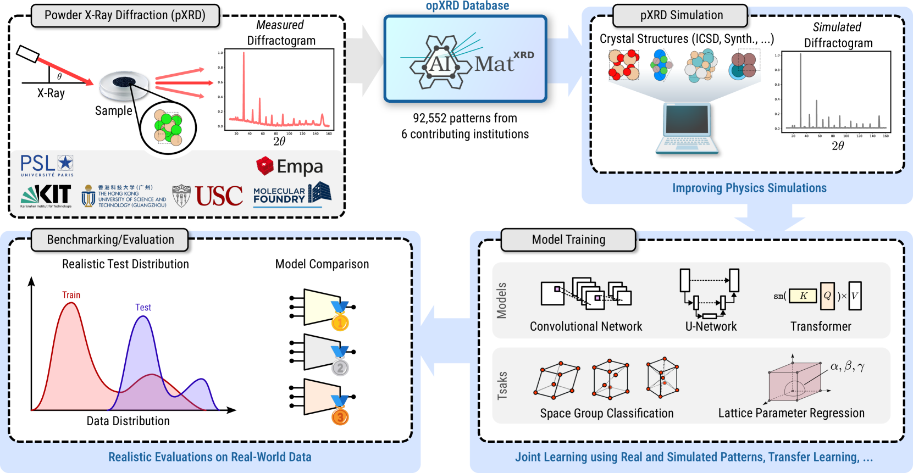
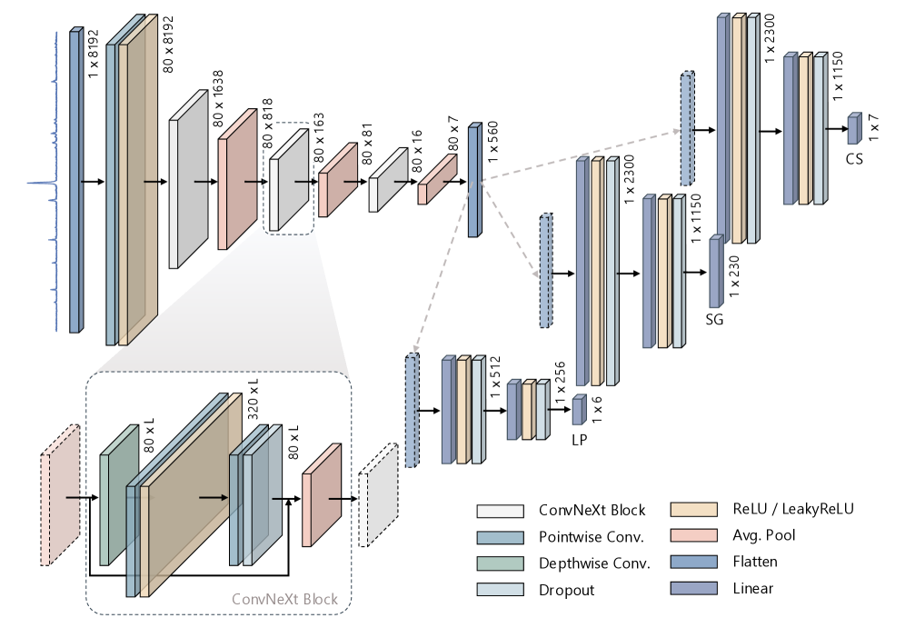
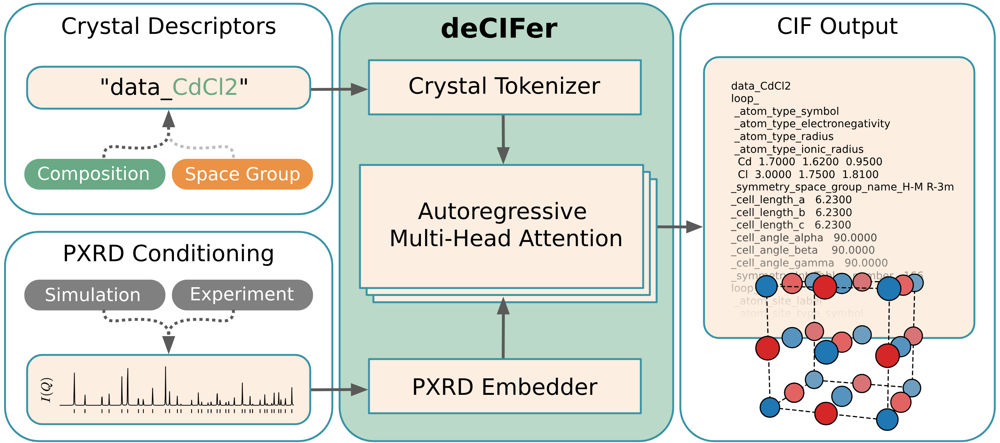
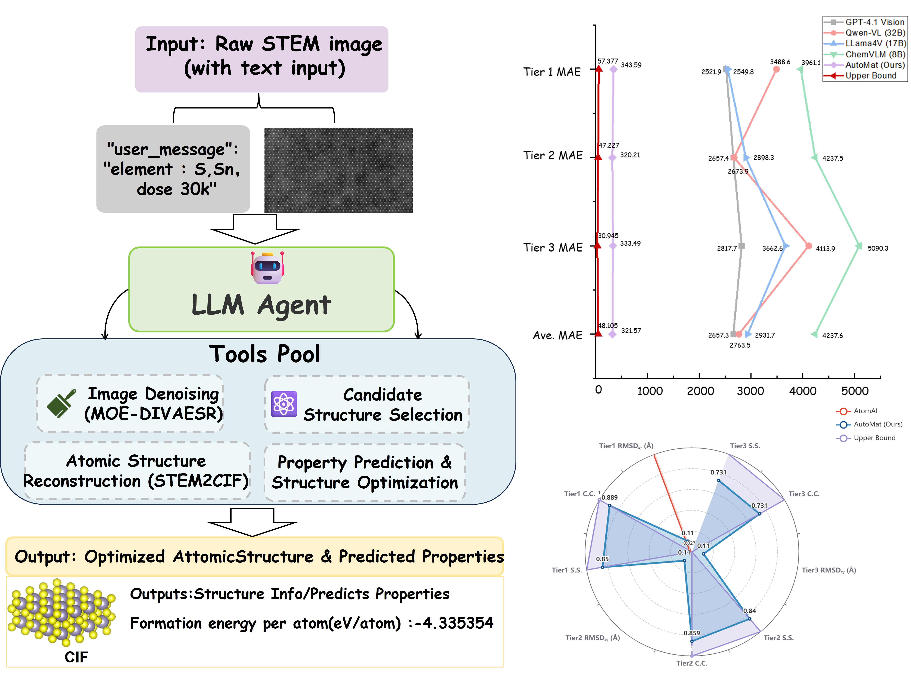

# 中性子回折データのリートベルト精密化をLLMエージェントで自動化する

- 執筆日: 2026-05-17
- トピック: 大規模言語モデルと専門知識ベースを組み合わせた中性子回折解析エージェントの設計と中性子散乱施設への実装
- タグ: Measurement and Spectroscopy / Neutron Scattering / Machine Learning
- 注目論文: Rongzai agent: A Large Language Model-Based Autonomous Assistant for Rietveld Refinement of Neutron Diffraction Data ([arXiv:2605.13911](https://arxiv.org/abs/2605.13911))
- 参照論文数: 7本

---

## 1. 背景：なぜ今この話題か

中性子回折（neutron diffraction）は、材料の内部構造を非破壊で調べる最も強力な手法の一つである。X線回折がX線と電子雲の相互作用を利用するのに対して、中性子は原子核と直接相互作用するため、X線では観測が難しい軽元素（水素・リチウム・酸素など）の位置を高精度で決定できる。また中性子は磁気モーメントを持つため、磁気構造の決定にも不可欠な探針である。こうした特性から、中性子回折はエネルギー材料（リチウム電池・水素貯蔵材料）、量子磁性体、機能性酸化物など、現代の材料研究における中核的な測定技術として世界中の中性子散乱施設で日々活用されている。

しかし、中性子回折実験で得られた粉末回折データから結晶構造を精密に決定するためには、「リートベルト精密化（Rietveld refinement）」と呼ばれる複雑な数値解析手順を踏む必要がある。この手順は材料の種類・相の数・測定条件などに応じて試行錯誤を繰り返す必要があり、専門的な訓練を積んだ研究者が多くの時間を費やす作業である。現在、世界各地の中性子施設では大型加速器の整備が進み、測定データの取得速度は飛躍的に高まっているが、それに反して解析のボトルネックはますます深刻化している。中国散裂中性子源（CSNS）、欧州中性子散乱施設（ILL）、J-PARC物質・生命科学実験施設（MLF）などの大型施設では、日々大量のデータが生成されており、その解析を人手に依存し続けることは持続不可能な状況になりつつある。

こうした背景のもと、機械学習（ML）や人工知能（AI）を用いて回折データ解析を自動化・高速化しようとする研究が急速に増加している。とりわけ2022年ごろから大規模言語モデル（Large Language Model, LLM）の性能が劇的に向上し、専門的なテキスト理解と推論を組み合わせることで、これまで人間の専門家だけが担えると思われていた意思決定タスクをAIに移譲する試みが現実的になってきた。材料科学の分野では結晶構造生成・物性予測・逆設計など多くのタスクでAIの活用が進んでいるが、実際の実験計測装置における「解析」そのものにLLMエージェントを適用する試みはまだ黎明期にある。2026年5月にプレプリントとして公開されたRongzai agent（arXiv:2605.13911）は、こうした流れの中で世界で初めて中性子回折のリートベルト精密化に実際に展開・運用されたLLMエージェントとして注目される。

## 2. 未解決問題は何か

### リートベルト精密化の自動化はなぜ難しいのか

リートベルト精密化は、測定された回折パターン全体を理論モデルで再現するという考え方に基づく手法であり、測定された強度プロファイル $y_i^{\rm obs}$ と計算プロファイル $y_i^{\rm calc}$ の差の二乗和を最小化することで構造パラメータを求める。その品質指標として最も広く使われる重み付き残差因子（weighted R-factor, Rwp）は、

$$R_{\rm wp} = \sqrt{\frac{\sum_i w_i (y_i^{\rm obs} - y_i^{\rm calc})^2}{\sum_i w_i (y_i^{\rm obs})^2}}$$

（ここで $w_i$ は各データ点の重みで、通常は $w_i = 1/y_i^{\rm obs}$）

で定義され、この値が小さいほど精密化の質が高いことを意味する。しかしこの最適化問題は、パラメータ空間が複雑で局所最小値が多数存在するため、初期モデルの設定（格子定数・空間群・原子座標・占有率・温度因子など）や精密化の順序（どのパラメータからどの順番で解放するか）が最終解の品質に大きく影響する。専門家は長年の経験から「まず格子定数と全体的な強度スケールを調整し、次にピーク形状パラメータ、最後に原子位置」といった暗黙の精密化戦略を持っているが、この知識は教科書には体系的に書かれておらず、師弟関係や試行錯誤を通じて習得されるノウハウとして蓄積されてきた。この暗黙知を計算機に移譲することが、自動化の核心的な課題である。

特定のパラメータを誤った順序で解放すると精密化は発散し、得られたRwpが小さくても物理的に不合理な構造解が得られることもある。例えば、温度因子（Debye-Waller因子）が負の値を取るような解は数値的には収束しても物理的意味を持たない。こうした「数値的収束」と「物理的妥当性」を同時に保証するための判断能力は、LLMが再現すべき専門家知識の核心部分である。

### シミュレーションと実験データの乖離（Sim-to-Real Gap）

機械学習を回折データ解析に適用する際に繰り返し表れる根本的な問題が、シミュレーションデータと実験データの乖離、いわゆる「Sim-to-Real Gap」である。理論的に計算された回折パターンは理想化された条件を仮定しているが、実験パターンには測定機器由来のピーク形状（プロファイル関数）、バックグラウンド（入射線の散漫散乱や空気散乱など）、試料の微構造（結晶子サイズや格子歪みによるピーク幅の変化）、選択配向（粉末粒子が特定の方向に揃う効果）、吸収効果、さらには実験中に生じるノイズなどが重畳している。

opXRD（Hollarek et al., 2025）が構築した公開実験回折データベースには9万枚を超える実験回折図が収録されているが、うちラベル付きのものはわずか2,179枚に過ぎない（図1）。このデータ不足と多様性の乏しさが、シミュレーションデータで学習したモデルの実験データへの汎化性能を制限する主因となっている。特に背景が大きく傾斜している・ピーク重なりが激しい・S/N比が低いといった低品質な実験パターンに対するモデルの頑健性は依然として大きな課題として残っている。

*図1. opXRDデータベースの概要。9万件を超える実験粉末回折データを収録し、機械学習モデルの実験汎化評価を可能にする。ラベル付きデータ2,179件のみで構造情報が利用可能であり、Sim-to-Real Gapの克服が課題である。（出典: arXiv:2503.05577、CC BY 4.0）*

### 多相試料と複雑な系への対応

実際の材料研究では、単相の試料を測定できるとは限らない。複数の結晶相が混在する多相試料、固溶体、アモルファス相を含む系、超構造相、さらには磁気構造が重畳した系など、現実の試料は多種多様な複雑さを持つ。多相試料のリートベルト精密化では、各相の構造モデルを同時に精密化しながら重量分率（weight fraction）も求める必要があり、パラメータ数は一段と増大する。また中性子回折特有の課題として、非干渉性散乱（incoherent scattering）によるフラットな背景の増大（特に水素を含む試料で顕著）や、低い散乱断面積による統計精度の制約もある。こうした複雑な系に対してAIが本当に専門家水準の判断を再現できるかどうかは、現時点では検証が不十分であり、今後の体系的評価が求められる。

## 3. 注目論文の概説

### 研究目的とシステムアーキテクチャ

Qingmeng Li らが提案するRongzai agent（arXiv:2605.13911）は、LLM・専門家知識ベース（expert knowledge base）・結晶学的精密化ソフトウェアGSAS-IIの三者を有機的に組み合わせた自律的な精密化エージェントである。論文タイトルの「融材（Rongzai）」とは中国語で「融合」を意味し、LLMによる推論と専門家経験の融合を意図した命名である。本エージェントは中国散裂中性子源（CSNS）に実際に展開・運用されており、外部ユーザーが登録して利用できる状態になっている点は特筆に値する。

エージェントの中核コンポーネントは以下の三つである。第一に、GPT-4oやDeepSeek-V3などの汎用LLMが「判断エンジン」として機能する。第二に、GSAS-IIが二次開発（secondary development）によりコマンドライン制御可能な「精密化実行ツール」として組み込まれている。第三に、ベテラン研究者の精密化ノウハウを自然言語で記述した専門家知識ベースがLLMのシステムプロンプトとして注入される。この知識ベースには「どのパラメータをどの順番で動かすべきか」「Rwpが特定の閾値を超えた場合に次に試みるべき対処法」といった判断規則が収録されており、汎用LLMに結晶学的な専門性を付与する役割を担う。

### フィードバック駆動型自律ループ

Rongzai agentのアーキテクチャの核心は「フィードバック駆動型自律ループ（Feedback-Driven Self-Loop）」と呼ばれる仕組みである。精密化の各ステップで、GSAS-IIが計算した現在のRwp値・フィッティング残差プロット（観測パターン・計算パターン・差分の三者を示す図）・精密化ログなどのマルチモーダルな情報がLLMにフィードバックされる。LLMはこれらの情報を解釈し、次に実行すべきGSAS-IIコマンドを選択して出力する。この判断と実行のループが収束条件を満たすまで繰り返され、最終的に精密化レポート（精密化結果の数値・品質指標・構造パラメータのサマリー）が自動生成される。

このエンドツーエンドの自律ワークフローは、ユーザーが自然言語で「この試料を精密化してください」と指示するだけで起動し、試料モデルの読み込みから精密化実行・レポート出力までを人間の介入なしに完結する設計となっている。この「人間のような反復判断」をループで実現する点が、単純な最適化スクリプトとの根本的な差異である。

### 主要結果と新規性の評価

論文では5つの代表的な試料（異なる材料系・測定条件）に対してRongzai agentと人間の専門家（ベテランユーザー）の精密化結果をRwpで比較している。結果として3つの試料でRongzai agentが専門家を上回った。具体的なRwp（%）の比較を見ると、第1試料でエージェント2.88% 対 人間4.42%、第2試料で5.06% 対 5.40%、第3試料で7.60% 対 9.00%と、いずれもエージェントが低いRwpを達成した。残り2試料では専門家との差がわずかにとどまった。これは単に「精密化を自動化した」のではなく、専門家よりも高品質な精密化を自律的に達成したことを意味する点が最大の新規性である。

一方で本論文の重要な限界も認識する必要がある。評価試料数が5件と少なく、統計的な有意性の確立には不十分である。また、多相試料・磁気構造・アモルファス相混在系といったより複雑な系への対応能力は未検証のままである。さらに精密化に失敗した場合のエラーリカバリー戦略の詳細が論文中では明確でなく、LLMが誤った判断を自信を持って下すいわゆる「ハルシネーション」リスクへの具体的な対策も示されていない。

## 4. 研究史における位置づけ

### リートベルト精密化の歴史と計算機支援の系譜

リートベルト法は1969年にHugo Rietveldが中性子粉末回折データを完全なプロファイルフィッティングで精密化する手法として発表したことに始まる。その後X線粉末回折への拡張・パーソナルコンピュータの普及とともに広く普及し、現在ではGSAS-II（Toby & Von Dreele, 2013）・FullProf・MAUDなど複数の精密化パッケージが世界中で使われている。GSAS-IIはPythonで実装されたオープンソースのソフトウェアであり、中性子・X線・電子回折への対応・複数相の同時精密化・強力なGUIなどを備えた事実上の世界標準ツールである。Rongzai agentはGSAS-IIをコマンドラインから自動制御できるよう二次開発（secondary development）を加え、LLMからの指令を受けて精密化を実行できる「自動化ツール」として組み込んでいる。

### AIによる回折データ解析の発展

機械学習を回折データ解析に適用する試みは2010年代後半から本格化した。当初の主なターゲットは「相同定」と「空間群・結晶系の分類」であり、畳み込みニューラルネットワーク（CNN）を1次元の回折パターンに適用するアプローチが主流だった。AlphaDiffract（Zhou et al., 2026）はこの系譜の最近の到達点であり、3,120万枚のシミュレーション回折パターンで学習した1D ConvNeXtモデルを用いて、RRUFF実験データベースに対して結晶系81.7%・空間群66.2%という精度を達成した（図2）。またすべての格子パラメータ（a, b, c, α, β, γ）を同時予測する能力も備えており、精密化の最初の段階でどの空間群に属するかを自動決定するための前処理ツールとして有望である。

*図2. AlphaDiffractのアーキテクチャ概要。3,120万枚のシミュレーション回折パターンで学習した1D ConvNeXtが、結晶系・空間群・格子定数を同時予測する。精密化の前処理として空間群の候補を絞り込む用途に有効である。（出典: arXiv:2603.23367、CC BY-NC-SA 4.0）*

2020年代前半から、回折パターンから結晶構造を「直接」予測する、より野心的なアプローチが登場した。PXRDGen（Riebesell et al., 2024）は、XRDパターンのエンコーダ・拡散モデルに基づく構造生成器・リートベルト精密化モジュールを一体化したエンドツーエンドのニューラルネットワークであり、MP-20データセットに対して1サンプル推論で82%・20サンプル推論で96%という構造マッチング率を達成した。このアプローチはリートベルト精密化をニューラルネットワークの「後処理モジュール」として組み込んでいる点でRongzai agentとは対照的な位置づけである。

さらに大規模言語モデルの登場により、回折パターンを「テキスト」として扱い、CIFファイル（結晶構造情報ファイル）を直接生成するアプローチも現れた。deCIFer（Riebesell et al., 2025）は230万もの結晶構造でファインチューニングされた自己回帰言語モデルであり、PXRDパターンを条件として与えることでCIFを直接生成する（図3）。評価では94%のマッチング率を達成しており、従来の段階的な精密化手順をスキップする点で革新的である。しかし「生成したCIFが本当に正しい構造か」の物理的検証プロセスが欠如するという点で、透明性と信頼性の問題を抱えている。

*図3. deCIFerのシステム概要。PXRDパターンを条件入力として与えると、自己回帰LMが直接CIFファイルを生成する。リートベルト精密化という段階的プロセスを不要にする点が特徴だが、物理的検証が欠如する課題もある。（出典: arXiv:2502.02189、CC BY 4.0）*

Rongzai agentはこの流れの中で、「LLMを使った知識駆動型の精密化制御」という独自のポジションを占める。構造を直接予測するのではなく、あくまで従来のGSAS-IIをベースとした精密化パイプラインを維持しながら、精密化の「判断」と「意思決定」の部分のみをLLMに担わせる設計思想は、信頼性・解釈可能性の観点から重要な価値を持つ。

## 5. どの解釈が最も妥当か

### LLMエージェントの強みはどこにあるか

Rongzai agentが専門家を上回るRwpを達成できた理由として最も自然な解釈は、LLMが知識ベースを通じて「最適な精密化シーケンス」を系統的に試す能力を持ち、人間専門家が疲労や見落としで見逃すような微調整を確実に実行できる点にある。人間の専門家は「ある程度良い解に到達したら満足して次に進む」という傾向があるのに対し、LLMエージェントはフィードバックループを収束条件まで繰り返し続けることができる。これはある種の「完璧主義的な最適化」であり、少なくとも良く定義された手順が存在する問題に対しては有効である。

しかし、この解釈を支持する一方で、重大な限界も指摘できる。評価された5試料のみでは統計的な信頼性が低く、「専門家を超えた」という主張を一般化するには根拠が弱い。特に構造解析が困難な系（ピーク重なりが激しい低対称系・超構造・磁気構造・多相系など）ではLLMのパフォーマンスが著しく低下する可能性があり、体系的な検証が必要である。

### 異なるAIアプローチの比較

Rongzai agentのようなLLMベースのアプローチとAlphaDiffractのような専門特化型深層学習アプローチを比較すると、両者は異なる問題を解いていることがわかる。AlphaDiffractは「パターン→空間群・格子定数」という識別タスクに特化しており、高い精度で高速に分類できるが、構造モデルの細かい調整（温度因子・占有率・原子位置の最適化）には対応していない。一方でRongzai agentは精密化の全プロセスを扱えるが、より複雑な判断を必要とする。現実的な最適解は、AlphaDiffractで初期構造モデルの空間群を絞り込み、Rongzai agentで最終精密化を行うという協調的なパイプラインであろう。

deCIFerのような「パターン→CIF直接生成」アプローチは、構造既知の試料に対しては高速かつ高精度で機能するが、「本当に正しい構造か」の物理的な検証が欠如している点が課題である。リートベルト精密化は観測パターンと計算パターンの差異を可視化することで研究者が結果を検証できるという透明性を持つが、deCIFerのような黒箱型のアプローチではこの検証プロセスが失われる。信頼性・透明性の観点からは、Rongzai agentのようにGSAS-IIを明示的に使うアプローチの方が科学コミュニティへの受容性は高い。

### 他の計測手法への展開との比較

同じLLMエージェントの発想が走査透過電子顕微鏡（STEM）に適用された事例がAutoMat（Cao et al., 2026）である（図4）。AutoMatはDeepSeekV3をベースとしたLLMエージェントが、STEM実像→CIF生成→物性予測（形成エネルギーなど）という複数のAIモジュールを動的に協調制御するパイプラインである。専用のベンチマーク（STEM2Mat-Bench）で評価されており、LLMがオーケストレーター（指揮者）として機能することで単体の視覚言語モデルを超える性能を達成した。Rongzai agentとAutoMatを並べると、「専門的な測定・解析パイプラインの制御をLLMに委ねる」という共通のパラダイムが、異なる計測手法で独立に検証されつつあることが見えてくる。

*図4. AutoMatのシステム概要。LLMエージェント（DeepSeekV3）がオーケストレーターとしてSTEM画像の処理・構造再構築・物性予測の各AIモジュールを協調制御する。Rongzai agentと同じ「LLMが解析パイプラインを制御する」というパラダイムが異なる計測手法で実現されている。（出典: arXiv:2505.12650、CC BY-NC-SA 4.0）*

一方で、走査プローブ顕微鏡（SPM）の自律制御を研究したAutonomous Lab Agent（Funamoto et al., 2026）は重要な対比を提供する。この研究では汎用LLMよりもドメイン固有データでファインチューニングされた小型言語モデル（SLM、Phi-4ベース）の方が計測制御の精度で勝ることを示し、コマンド推論精度99.3%を達成した。これはRongzai agentが採用する「汎用LLM + 知識ベース」戦略に対して「ドメイン特化ファインチューニング」という対立する設計哲学を提示しており、どちらのアプローチが長期的に優れるかは未決着の重要な問いである。

## 6. 何が一般化できるか

### 知識駆動型LLMエージェントの汎用性

Rongzai agentが示した「LLM + 専門知識ベース + 既存の科学ソフトウェア」というアーキテクチャは、中性子回折だけに留まらず広く材料計測・解析の自動化に転用できる汎用性の高いフレームワークである。粉末X線回折（PXRD）への適用は最も自然な拡張であり、GSAS-IIはX線データも扱えるため原理的には同じエージェントを使い回せる可能性がある。さらに、走査電子顕微鏡（SEM/EDX）の自動測定、ラマン分光法の自動帰属、X線光電子分光法（XPS）の定量分析、さらには中性子小角散乱（SANS）のモデルフィッティングなど、専門家の暗黙知が重要な役割を果たす他の分析手法への拡張も期待される。

### 設計原理として一般化できること

現時点で一般化できる設計原理をまとめると以下のようになる。第一に、専門家の暗黙知を「知識ベース」として外部化しLLMのコンテキストに注入することで、汎用LLMに特定ドメインの判断能力を付与できる。ファインチューニングなしに新しいドメインへの適応が可能なため、開発コストを抑えながら多様な解析タスクに展開できる。第二に、科学ソフトウェアは「ツール」として維持しAIはその「使い方を決める意思決定者」として機能させることで、既存インフラとの互換性と計算結果の解釈可能性を保てる。第三に、フィードバックループによる反復最適化はLLMの強みであり、1回で完全な解を求めるアプローチよりも段階的な反復アプローチの方が複雑な最適化問題に適している。

### 自律型研究室への接続

自律型実験室（Autonomous or Self-Driving Laboratory）の概念が材料研究の分野で急速に注目を集めている。これは実験の提案・実行・測定・解析・次の実験の設計までをAIがループする形で実施する仕組みであり、Rongzai agentはその「解析」フェーズの重要なコンポーネントとなりうる。中性子施設での自律解析が実現すれば、測定完了後にほぼリアルタイムで構造精密化が完了し、実験計画の修正を即座に行うことが可能になる。また実験参加者の専門レベルに依存しない再現性の高い解析品質の確保という観点でも、施設ユーザーコミュニティへの大きな貢献が期待される。

## 7. 基礎から理解する

### 中性子回折の物理

中性子回折の基礎は「波としての中性子が結晶格子で回折する」という現象にある。中性子は量子力学的な波として振る舞い、その波長 $\lambda$ はド・ブロイの関係式

$$\lambda = \frac{h}{mv}$$

（$h$ はプランク定数 $6.626 \times 10^{-34}$ J·s、$m$ は中性子の質量 $m \approx 1.675 \times 10^{-27}$ kg、$v$ は速度）

から決まる。熱中性子の場合 $\lambda \approx 1$〜3 Å となり、これは結晶格子の面間隔と同程度であるため回折が起こる条件を満たす。散乱中性子源（SNS）ではパルス状の広帯域中性子を利用し、中性子の飛行時間（Time-of-Flight, TOF）を測定することで波長を決定する方法も広く使われている。

結晶格子で生じる回折はブラッグの法則

$$2d_{hkl} \sin\theta = n\lambda$$

によって記述される。ここで $d_{hkl}$ は格子面（hkl）の面間隔、$\theta$ はブラッグ角、$n$ は整数の回折次数である。この式は「格子面で反射した中性子波が、隣接する格子面からの波と強め合う（建設的干渉する）条件」を表している。粉末試料では多数の微結晶がランダムに配向しているため、ある $d_{hkl}$ を持つ格子面はあらゆる方向を向いており、特定の角度 $\theta$ でブラッグ条件を満たす格子面が常に存在する。その結果、回折パターンは角度（または面間隔 $d$）のスペクトル上に多数のピークとして現れる。

中性子回折がX線回折と大きく異なる点は「散乱体が電子雲ではなく原子核である」ことである。X線の散乱因子は原子番号 $Z$ に比例するため、原子番号の小さい軽元素（H, Li, O など）のX線散乱は弱い。一方、中性子の散乱長（scattering length）$b$ は原子番号に依存しない独自の値を持ち、各元素・同位体に固有の定数である。例えば水素の散乱長は $b_H = -3.74$ fm（フェムトメートル、ここで負符号は波の位相が反転することを意味する）であり、重水素では $b_D = +6.67$ fm となる。鉄・コバルト・ニッケルなどの磁気モーメントを持つ原子は、核散乱に加えて電子スピンによる「磁気散乱」も示すため、中性子回折は磁気構造の決定に不可欠な手法となっている。

### 粉末回折パターンの構造と強度

粉末回折パターンの各ピークの位置はブラッグの法則から結晶の格子定数（a, b, c, α, β, γ）で決まり、ピークの強度は「構造因子（structure factor） $F_{hkl}$」の絶対値の二乗で決まる。構造因子は

$$F_{hkl} = \sum_j b_j \exp\left[2\pi i (hx_j + ky_j + lz_j)\right] \exp\left(-B_j \frac{\sin^2\theta}{\lambda^2}\right)$$

と表される。$b_j$ はサイト $j$ の原子の中性子散乱長、$(x_j, y_j, z_j)$ はその原子の結晶内座標（分率座標）、$B_j$ は熱振動の大きさを表す温度因子（Debye-Waller因子）である。指数関数の虚数部は「各原子からの散乱波が位置によって異なる位相を持つ」ことを、実数部の指数は「熱振動が高角のピーク強度を減衰させる」ことを表している。この式は「各原子からの散乱波が、その位置と散乱長に応じた位相と振幅で重ね合わさる」という物理的描像を数式化したものである。

観測されるピーク強度 $I_{hkl}$ はさらに多くの因子の積となる：

$$I_{hkl} \propto S \cdot m_{hkl} \cdot L_\phi \cdot p_{hkl} \cdot A \cdot |F_{hkl}|^2$$

ここで $S$ はスケールファクター（試料量・照射量などを反映）、$m_{hkl}$ は多重度（等価な格子面の数）、$L_\phi$ はローレンツ・偏光因子（測定ジオメトリの補正）、$p_{hkl}$ は選択配向パラメータ、$A$ は吸収補正である。観測される連続したプロファイルは、各回折ピークをプロファイル関数 $\Phi(2\theta - 2\theta_{hkl})$（Gaussian、Lorentzian、またはその混合）で広げた後、バックグラウンド $y_i^{\rm bkg}$ を加えた

$$y_i^{\rm calc} = \sum_{hkl} I_{hkl} \cdot \Phi(2\theta_i - 2\theta_{hkl}) + y_i^{\rm bkg}$$

によって計算される。

### リートベルト精密化の手順

リートベルト精密化において、精密化すべきパラメータは大きく「構造パラメータ」と「迷惑パラメータ（nuisance parameters）」に分けられる。構造パラメータは格子定数 $(a, b, c, \alpha, \beta, \gamma)$・原子座標 $(x_j, y_j, z_j)$・温度因子 $B_j$・占有率 $g_j$ などであり、試料の結晶構造を直接表す。迷惑パラメータは試料の物理情報ではなく測定条件に依存するスケールファクター・バックグラウンド係数・ピーク形状パラメータなどであり、フィッティングの精度を高めるために必要だが主目的ではない。

精密化は通常「最小二乗法」によって、観測強度と計算強度の差の二乗和 $\chi^2 = \sum_i w_i(y_i^{\rm obs} - y_i^{\rm calc})^2$ を最小化するパラメータを逐次的に求める。各反復では全パラメータについての偏微分から補正量 $\Delta p$ を求め、

$$\Delta p = (A^\top W A)^{-1} A^\top W (y^{\rm obs} - y^{\rm calc})$$

（$A$ はヤコビアン行列、$W$ は重み行列）

によってパラメータを更新する。この計算は非線形であるため初期値への依存性が高く、局所最小値に陥るリスクがある。専門家が「安全な精密化の手順」を知っているのはこのリスクを回避するためであり、Rongzai agentの知識ベースはまさにこの「落とし穴を避ける経験則」を体系化したものである。

### 大規模言語モデルとReActフレームワーク

大規模言語モデル（LLM）はトランスフォーマー（Transformer）アーキテクチャに基づく深層学習モデルであり、大規模なテキストデータを「次のトークンを予測する」タスクで事前学習することで、テキストの統計的なパターンを内在化する。トランスフォーマーの核心はセルフアテンション（self-attention）機構であり、入力シーケンスの各要素が他のすべての要素との関連性（アテンションスコア）を計算することで、長距離の依存関係を捉えられる：

$$\text{Attention}(Q,K,V) = \text{softmax}\left(\frac{QK^\top}{\sqrt{d_k}}\right)V$$

ここで $Q$・$K$・$V$ はそれぞれQuery・Key・Value行列であり、$d_k$ はKey空間の次元数である。$\sqrt{d_k}$ によるスケーリングは、内積の値が大きすぎてsoftmaxが飽和するのを防ぐためのものである。

Rongzai agentにおけるLLMの役割は、「精密化の現状（Rwpの数値・残差プロット）を読み取り、専門家知識ベースを参照し、次に実行すべきGSAS-IIコマンドを出力する」という推論タスクである。これは典型的なReAct（Reasoning + Acting）フレームワークに相当し、LLMが「思考（Reason）」と「行動（Act）」と「観察（Observe）」を交互に繰り返すことで複雑なタスクを達成するパラダイムである。具体的には「現在のRwpは7.60%であり収束が不十分。バックグラウンド係数が大きくずれているため、まずバックグラウンドの次数を増やして再精密化する（思考）→ GSAS-IIでバックグラウンドパラメータを更新して精密化実行（行動）→ 新しいRwp 6.20%を観察（観察）」というサイクルを繰り返す。

## 8. 専門用語の解説

リートベルト精密化（Rietveld refinement）は、粉末回折パターン全体を構造モデルから計算されたプロファイルでフィッティングする手法である。単一ピークの強度だけを使うのではなく、ピーク間の弱い強度も含めたパターン全体を使うため情報量が多く、現在は粉末試料から結晶構造を決定する標準的な手法となっている。Rongzai agentでは精密化エンジンとしてGSAS-IIを使用し、LLMがその実行を制御する。

重み付き残差因子（Rwp, weighted R-factor）は、観測強度と計算強度の乖離を定量化する品質指標であり、一般に5%以下が良好な精密化とみなされる。しかしRwpだけでなく、ゴーフ関数（goodness of fit, χ²）や化学的妥当性も合わせて評価する必要があり、Rwpが低くても物理的に不合理な解が得られることがある。

GSAS-II（General Structure Analysis System-II）は現代の中性子・X線粉末回折解析の事実上の標準ソフトウェアであり、Pythonで書かれたオープンソースのプラットフォームである。GUI操作と並んでPythonスクリプトによる自動化が可能であり、Rongzai agentはこの機能を拡張してLLMからのAPIコール経由で精密化を実行できるよう改良している。

専門家知識ベース（Expert Knowledge Base）は、ベテラン研究者が持つ精密化の経験則・判断規則を自然言語で記述したドキュメントであり、LLMのシステムプロンプトとして注入される。「どのパラメータをどの順番で解放するか」「Rwpが特定閾値を超えない場合にどう対処するか」といった暗黙知を外部化したものであり、汎用LLMに専門家的判断力を付与するための核心的な仕組みである。

散乱長（Scattering Length, $b$）は中性子が原子核から散乱される際の実効的な散乱能を表す物理定数であり、単位はfm（フェムトメートル, $10^{-15}$ m）。原子番号に単調には依存せず同位体によっても異なるため、X線散乱因子とは全く異なる元素配置を示す。水素（$b=-3.74$ fm, 負は位相反転）と重水素（$b=+6.67$ fm）の符号の違いはコントラスト変調に利用され、水素含有材料研究で重水素置換が有効な理由もここにある。

フィードバック駆動型自律ループ（Feedback-Driven Self-Loop）はRongzai agentのアーキテクチャの中核であり、LLMが精密化結果を受け取り→判断→コマンド出力→GSAS-II実行→結果取得→LLMが評価、というサイクルを収束するまで繰り返す仕組みである。人間が精密化中に行う「結果を見て次の手を考える」という思考過程をLLMで再現している。

Sim-to-Real Gap（シミュレーション・実験データ乖離）は、シミュレーションで生成されたデータと実験で得られるデータの間に存在する系統的な乖離を指す。理論パターンはノイズ・バックグラウンド・測定器関数などを理想化しているため、実験パターンと異なる統計的分布を持つ。opXRDはこのギャップを定量評価するための実験データベースとして構築されている。

構造因子（Structure Factor, $F_{hkl}$）は格子面（hkl）から散乱される中性子波の振幅と位相を記述する複素数であり、その絶対値の二乗が回折ピークの強度に比例する。原子の種類（散乱長）・位置（座標）・熱振動（温度因子）の情報をすべて包含する結晶学の中心的な量であり、リートベルト精密化によって決定されるパラメータの多くは最終的にこの量を通じて回折パターンに影響する。

選択配向（Preferred Orientation）は、粉末試料中の微結晶が特定の方向に揃ってしまう現象である。理想的な粉末ではすべての方向が等しく存在すると仮定するが、薄片状や針状の結晶は試料調製時に配向しやすく、特定のピーク強度が系統的にずれる。精密化の際にMarch-Dollase関数などを用いてこの効果をモデル化するが、補正の適用タイミングと係数の解放順序は専門家判断を要する。

非干渉性散乱（Incoherent Scattering）は中性子が特定の同位体から波の干渉なしに等方的に散乱される現象であり、特に水素（$^1$H）で顕著（非干渉性散乱断面積 $\sigma_{\rm inc} = 80.26$ barn、干渉性のそれは 1.76 barn）。これがバックグラウンドとして現れるため水素含有試料（有機材料・水和物など）の中性子回折では信号対雑音比が低下する。Rongzai agentの知識ベースにはこのような材料依存の課題への対処法も含まれているとみられる。

ReAct（Reasoning + Acting）フレームワークはLLMが「思考」と「行動」と「観察」を交互に繰り返すことで複雑な多段階タスクを達成するパラダイムである。Rongzai agentはこのフレームワークの具体的な実例であり、思考（精密化状況の解釈）→行動（GSAS-IIコマンドの発行）→観察（新しいRwpと残差プロットの読み取り）というサイクルが精密化収束まで続く。

## 9. 将来展望

Rongzai agentが示した成果は、LLMが単なる文章生成ツールを超えて実際の科学的分析の質を担保する「頼れる解析パートナー」として機能できることを示す有力な証拠の一つとなった。3/5の試料でベテラン専門家を上回ったという結果は印象的だが、これが統計的に信頼できる主張であるかはまだ評価中であり、より多様な試料系（多相・磁気構造・アモルファス相混在系）での検証と、ハルシネーションリスクへの系統的な対策が今後の最優先課題である。また汎用LLMとドメイン特化ファインチューニングモデルのどちらが実運用で優れるか、という問いも重要な未決問題として残っている。Autonomous Lab Agent（2602.20669）の結果はファインチューニングの有効性を示唆するが、汎用LLMの急速な性能向上がこの優位性を相殺する可能性もある。

まだ未確定な点として、マルチモーダルLLM（テキスト+画像を同時に処理できるモデル）が残差プロットや回折パターンを直接「見る」ことで精密化判断の質がさらに向上するかどうかがある。現状のRongzai agentは残差プロットの情報をテキスト的に読み取っているが、GPT-4oやGemini 2.0のような視覚対応モデルがプロットを直接解釈することで、人間の専門家がグラフから読み取る微妙なパターン（例えば特定の角度域でのみ系統的な残差が残るという現象がピーク形状パラメータの問題を示唆する）をより的確に認識できる可能性がある。

次に重要になる展開として、複数の計測手法を統合したマルチモーダル解析エージェントの開発が期待される。中性子回折・X線回折・電子顕微鏡・ラマン分光・中性子小角散乱などの複数のデータストリームを同時に扱い、互いに補完的な情報を統合して構造・物性を推定するシステムである。Rongzai agentのようなシングルモーダルなエージェントがその第一歩であり、これらが自律実験室のデータ解析コアとして有機的に連携することで、「測定から物性理解まで」の完全自動化が現実に近づいていくだろう。中性子散乱施設における大規模なデータを真に活用するためにも、このような自律解析エージェントの発展は材料科学にとって不可欠な基盤技術となっていく。

## 参考論文一覧

1. Q. Li et al., "Rongzai agent: A Large Language Model-Based Autonomous Assistant for Rietveld Refinement of Neutron Diffraction Data," [arXiv:2605.13911](https://arxiv.org/abs/2605.13911) (2026). — 本記事の注目論文。LLMと専門知識ベース、GSAS-IIを組み合わせた中性子回折用自律精密化エージェント。CSNSに実装・運用済み。

2. D. Hollarek et al., "opXRD: Open Experimental Powder X-ray Diffraction Database," [arXiv:2503.05577](https://arxiv.org/abs/2503.05577) (2025). — 機械学習モデルの実験データへの汎化を評価するために整備された9万件超の実験回折データベース。Sim-to-Real Gapの定量評価基盤。

3. X. Zhou et al., "AlphaDiffract: Automated Crystallographic Analysis of Powder X-ray Diffraction Data," [arXiv:2603.23367](https://arxiv.org/abs/2603.23367) (2026). — 1D ConvNeXtを用い3千万枚のシミュレーションパターンで学習した、空間群・格子定数の自動予測モデル。リートベルト精密化の前処理段階として活用できる。

4. J. Riebesell et al., "deCIFer: Crystal Structure Prediction from Powder Diffraction Data using Autoregressive Language Models," [arXiv:2502.02189](https://arxiv.org/abs/2502.02189) (2025). — 230万結晶構造で学習した自己回帰LMがPXRDパターンからCIFを直接生成する、リートベルト精密化を不要にする革新的アプローチ。94%のマッチング率を達成。

5. J. Riebesell et al., "Powder Diffraction Crystal Structure Determination Using Generative Models," [arXiv:2409.04727](https://arxiv.org/abs/2409.04727) (2024). — XRDエンコーダ・拡散モデル・リートベルト精密化モジュールを一体化したエンドツーエンドの構造決定パイプライン。

6. Z. Cao et al., "AutoMat: Enabling Automated Crystal Structure Reconstruction from Microscopy via Agentic Tool Use," [arXiv:2505.12650](https://arxiv.org/abs/2505.12650) (2026). — DeepSeekV3をオーケストレーターとしてSTEM画像から結晶構造・物性を自動予測するLLMエージェントパイプライン。Rongzai agentと同じ設計パラダイムを別の計測手法で実現。

7. S. Funamoto et al., "Integrating Domain-Specialized Language Models with AI Measurement Tools for Deterministic Atomic-Resolution Experimentation," [arXiv:2602.20669](https://arxiv.org/abs/2602.20669) (2026). — 走査プローブ顕微鏡の自律制御に特化型SLM（Phi-4ベース）を用い、99.3%のコマンド推論精度を達成。汎用LLMとドメイン特化SLMの性能比較の観点から重要。
