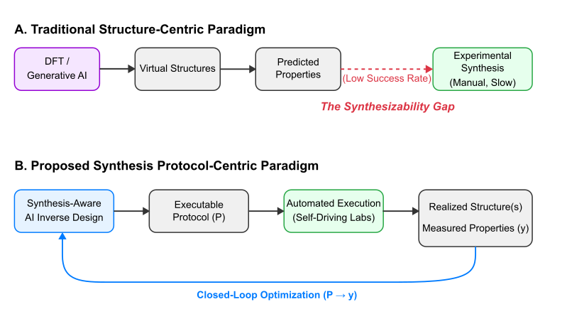
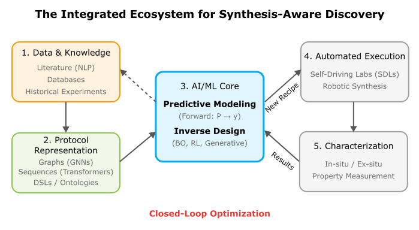

# 合成プロトコルを主要設計変数としたAI材料探索

- 執筆日：2026-05-18
- トピック：AI駆動型材料探索における「合成可能性ギャップ」の克服と、合成プロトコルを主要設計変数とする新パラダイムの提案
- タグ：Computation and Theory / Inverse Design; Machine Learning / Machine Learning; Surrogate Modeling
- 注目論文：Guillaume Lambard, "Beyond Structure: Revolutionising Materials Discovery via AI-Driven Synthesis Protocol-Property Relationships", arXiv:2605.00313 (2026) [https://arxiv.org/abs/2605.00313]
- 参照論文数：5本

---

## 1. 背景：なぜ今この話題か

過去10年間、材料科学における計算的アプローチは飛躍的な進歩を遂げた。密度汎関数理論（DFT）計算の大規模並列化と、機械学習を組み合わせた高スループットスクリーニングにより、数十万から数百万もの仮想化合物が一度にスクリーニングできる時代になっている。GoogleのDeepMindが開発したGNoMEは、グラフニューラルネットワークを用いて220万を超える安定な結晶構造を予測し、実験で実証された構造の数を10倍以上に増やすと主張した（Merchant et al., Nature 2023）。MatterGen（arXiv:2312.03687）はさらに進んで、拡散モデルを使って特定の物性を持つ材料の結晶構造を直接生成できることを示した。

しかし、これらの輝かしい成果の裏側には、深刻な問題が潜んでいる。

計算で予測された低エンタルピー相のうち、実験的に実際に合成されたものは2%以下に過ぎないという事実が明らかになりつつある。計算上は熱力学的に安定であっても、実際の実験室で作れるかどうかはまったく別の問題なのだ。この「合成可能性ギャップ（synthesizability gap）」こそが、AI材料探索における最大のボトルネックの一つとして認識されるようになってきた。

問題の核心は、現在のAI材料探索の主流パラダイムが「構造中心（structure-centric）」である点にある。すなわち、まず安定な結晶構造を探し（あるいは生成し）、次にその構造から物性を予測するという流れ（X→y の枠組み）が主流を占めている。しかし、現実の材料合成プロセスでは、どのような出発物質を、どのような温度・圧力・雰囲気・時間条件で、どのような順序で処理するかという「合成プロトコル（synthesis protocol）」が、最終的に得られる材料の構造と特性を決定的に支配している。同じ組成でも、合成条件が異なればまったく異なる相やミクロ組織が得られることは、材料科学の実践において常識である。

この問題意識を背景に、国立研究開発法人物質・材料研究機構（NIMS）のGuillaume Lambardは、2026年5月に「合成プロトコルを主要設計変数とすべき」という大胆な提言を行った（arXiv:2605.00313）。本稿では、この提言を核に、AI材料探索における合成可能性の問題を多角的に論じる。

---

## 2. 未解決問題は何か

### 合成可能性ギャップはなぜ生まれるのか

AI材料探索が直面する最大の難問の一つは、「計算で安定と予測された構造が、なぜ実験室で作れないのか」という問題である。熱力学的安定性の計算では、T=0 K における生成エンタルピー ΔH_f が負であれば安定と判定されるが、実際の合成は有限温度・有限時間のプロセスである。反応経路上に高い活性化障壁が存在すれば、熱力学的に安定な相であっても動力学的に到達できない。また、合成中に生成される中間相や準安定相が不純物として混入する問題もある。

さらに深刻なのは、現在の材料データベース（Materials Project、AFLOW、AFLOWLIBなど）が主として計算上の平衡構造を収集しており、「どのプロトコルでその構造が実際に得られたか」という情報が系統的に記録されていない点である。これは後述するプロトコル表現の問題と密接に絡み合う。

### プロトコルの表現と標準化の欠如

材料合成プロトコルは本来、自然言語で記述された実験手順書として文献に記載されている。「800°Cで12時間、アルゴン雰囲気下で焼成する」「前駆体を1:2のモル比で混合し、ボールミリング後に圧粉成形する」といった記述は、人間の実験者には理解できるが、機械が直接処理できる形式ではない。AIがプロトコルを学習・生成・最適化するためには、これを機械可読な構造化表現に変換する必要がある。

XDL（Chemical Descriptive Language）やPAML（Protocol Automation Markup Language）、あるいはSMILES的な合成操作の逐次記述など、いくつかの表現形式が提案されているが、材料科学全体で統一された標準はまだ存在しない。有機合成化学の分野ではRetrosynthesisやSelf-driving laboratoryの文脈でこうした議論が進んでいるが、無機材料・金属材料への展開はまだ緒についたばかりである。

### 逆設計経路の困難さ

目標物性 y から合成プロトコル P を逆設計する問題は、数学的に見ても極めて難しい。順方向の写像 P → X → y（プロトコルから構造が決まり、構造から物性が決まる）は一応定義できても、逆写像 y → X → P は一般に多対一の非自明な写像となる。同じ物性を実現する構造は複数存在し、同じ構造を実現するプロトコルも複数存在する。さらに、各ステップが確率的・非線形的であるため、単純な逆転は不可能に近い。

この問題に対するアプローチとしては、（1）条件付き生成モデルによるサンプリング、（2）ベイズ最適化による反復探索、（3）大規模言語モデル（LLM）による推論的提案、などが考えられる。これらをいかに組み合わせるかが、今後の重要な研究課題となっている。

### 持続可能性と現実的制約の組み込み

計算で予測された最適材料が、希少元素を大量に必要としたり、エネルギー集約的なプロセスを要求したりする場合、社会実装への壁は高い。AI材料探索が真に有用であるためには、物性最適化だけでなく、原材料の入手可能性、エネルギーコスト、環境負荷、コスト、スケールアップ可能性といった現実的制約を設計段階から組み込む必要がある。これは多目的最適化問題として定式化できるが、目的関数の設定や制約条件の数値化には依然として主観的・経験的判断が介在する。

---

## 3. 注目論文の概説

### 研究目的と問題設定

arXiv:2605.00313「Beyond Structure: Revolutionising Materials Discovery via AI-Driven Synthesis Protocol-Property Relationships」は、Guillaume Lambard（NIMS Center for Basic Research on Materials）によるパースペクティブ論文である。20ページの比較的短い論文であるが、その主張は明快かつ挑発的だ。著者は、現在のAI材料探索が「構造（原子配置）を介した間接的な最適化」にとどまっている限り、合成可能性ギャップを根本的に解決できないと論じる。

論文の中心的提案は、AI材料探索のパラダイムを、現行の「X→y（構造→物性）」から「P→X→y（プロトコル→構造→物性）」へと転換すべきだ、というものである。ここでPは合成プロトコル（synthesis protocol）を、Xは得られる材料の構造・ミクロ組織を、yは目標物性をそれぞれ表す。

*図1：現行の構造中心パラダイム（X→y）と提案する合成プロトコル中心パラダイム（P→X→y）の比較。左：DFT計算や生成モデルで安定構造を探し、そこから物性を予測する従来の流れ。右：合成プロトコルを一次設計変数として、実際に合成可能な経路から物性最適化を行う新しい流れ。（出典: arXiv:2605.00313, CC BY 4.0）*

### 三本柱によるロードマップ

論文はP→X→yパラダイムを実現するためのロードマップを三つの柱として整理する。

**第一の柱：合成プロトコルの機械可読表現（Machine-Readable Protocols）**

合成手順書を自然言語からコンピュータが処理可能な構造化形式に変換する取り組みである。著者は、XDL（Chemical Descriptive Language）やPAML（Protocol Automation Markup Language）のような形式的言語、あるいは「アクション列（action sequences）」として合成ステップを記述するアプローチを具体的に提案する。材料合成のアクションとしては、「混合（mix）」「加熱（heat）」「粉砕（grind）」「焼成（calcine）」「急冷（quench）」「成膜（deposit）」などが挙げられ、それぞれのアクションに対してパラメータ（温度、時間、雰囲気、圧力、流量など）が付与される。このような形式化により、大規模言語モデルや生成モデルがプロトコルを直接扱えるようになる。

**第二の柱：プロトコル生成・逆設計モデル（Generative and Inverse-Design Models）**

機械可読プロトコルのデータセットが整備されれば、それを学習データとして生成モデルや逆設計モデルを訓練できる。具体的には、（a）条件付き変分オートエンコーダ（CVAE）や拡散モデルによるプロトコルの確率的生成、（b）反応経路推論モデルによる前駆体・反応順序の提案、（c）LLMによる文献プロトコルの解析・変換・新規プロトコルの生成、などが考えられる。著者は特に、MSP-LLM（arXiv:2602.07543）のような統合LLMフレームワークを有望なアプローチとして位置づけている。

**第三の柱：閉ループ最適化（Closed-Loop Optimisation）**

提案されたプロトコルを実際に実行し、得られた実験結果を即座にフィードバックして次の探索を導くクローズドループシステムである。ベイズ最適化（Bayesian Optimisation）や強化学習がその中核に位置づけられる。著者はさらに、持続可能性制約（SDGsとの整合性、環境負荷最小化）や経済的制約（原材料コスト、スケールアップ可能性）を目的関数・制約関数として閉ループ内に統合することを強く推奨している。この持続可能性への言及は、本論文の重要な独自性の一つである。

*図2：P→X→yパラダイムを実現するための統合エコシステム。機械可読プロトコルデータベース、生成・逆設計モデル、閉ループ最適化、自律実験プラットフォームが相互連携する。持続可能性制約・経済的制約が明示的に組み込まれている点が特徴的である。（出典: arXiv:2605.00313, CC BY 4.0）*

### 論文の新規性と限界

本論文の最大の新規性は、「合成プロトコルを主要設計変数として明示的に定式化した」点である。従来研究では、合成可能性を「後から評価するスコア」として扱うことが多かった（例えば、生成された構造に事後的に合成可能性スコアを付与するアプローチ）。これに対し、本論文はプロトコルを出発点に据え、構造・物性はその結果として得られるものと位置づける根本的な視点の転換を提唱する。

また、持続可能性をAI材料探索の中心的目標の一つとして明確に位置づけた点も注目される。物性性能の最大化だけでなく、「作れる・安い・環境に優しい」という複合目標を設計段階から組み込む発想は、実際の材料開発サイクルとの親和性が高い。

一方で、限界も明確に存在する。本論文はパースペクティブ（提言・展望）論文であり、新しいアルゴリズムやデータセットを提供するわけではない。P→X→yフレームワークの実証は今後の課題として残されており、機械可読プロトコルのデータ不足という根本的問題への具体的解決策も示されてはいない。提案はビジョンとして力強いが、その実装には膨大な共同作業が必要となる。

---

## 4. 研究史における位置づけ

### 構造中心パラダイムの台頭と限界

AI材料探索の歴史を振り返ると、その重心は一貫して「構造から物性へ」という方向に向いてきた。Materials ProjectやAFLOWLIBといったDFTデータベースの整備（2010年代前半〜中頃）、グラフニューラルネットワークによる物性予測の高精度化（2018年頃〜）、そしてGNoMEによる大規模構造探索（2023年）と、「安定な構造をいかに効率よく見つけ、その物性を予測するか」が主要な関心事であった。

MatterGen（arXiv:2312.03687, Zeni et al., 2023, Microsoft Research）はこの流れの中でも特に影響力のある研究である。拡散モデルを用いた条件付き結晶構造生成を実現し、「化学組成」「対称性」「バンドギャップ」「電子密度」などの制約を満たす新規構造を直接サンプリングできることを示した。これは従来の「全構造空間を探索してスクリーニング」というアプローチから、「条件を満たす構造を直接生成する」という逆設計への大きな転換を意味した。

しかし、MatterGenが生成する構造は依然として「計算上の理想構造」である。実際の合成においてどのようなプロセスを経ればその構造が得られるかという情報は含まれておらず、合成可能性ギャップ問題は未解決のままである。本論文（2605.00313）はまさにこの点を鋭く突いており、MatterGenが示したアプローチを「X中心の生成」として批判的に位置づけ、P→X→yへの転換を迫る。

### 合成可能性への関心の高まり

2024〜2025年頃から、AI材料探索コミュニティで「合成可能性」への関心が急速に高まった。Prein et al.（arXiv:2511.01790, 2025）による「合成可能性ガイド付きパイプライン」は、その代表例である。この研究では、Materials Project、GNoME、Alexandriaなどのデータベースに登録された構造に対し、組成的・構造的合成可能性スコアを計算して高スコア候補を抽出し、合成経路を予測した上で実際の実験を行った。16の候補材料のうち7つの合成に成功し、全実験プロセスをわずか3日で完了した。これは合成可能性スコアが実際の合成成功を予測する上で有効であることを示した重要な実証である。

この研究は本論文の「支持」となる位置づけにあるが、Preinらのアプローチは依然として「まず構造ありき」の流れを採用している。合成可能性スコアはフィルタとして使われており、プロトコルそのものを設計変数とするLambardの提案とは根本的に異なる。Preinらのアプローチを「合成可能性フィルタを組み込んだ構造中心パラダイム」と捉えれば、Lambardの提案は「プロトコルを出発点とする根本的な発想の転換」として対置される。

### LLMによる合成計画の自動化

MSP-LLM（arXiv:2602.07543, 2026）は、材料合成計画（Material Synthesis Planning, MSP）をLLMで統合的に解こうとする試みである。前駆体の予測（Precursor Prediction, PP）と合成操作の予測（Synthesis Operation Prediction, SOP）を一体的に解く枠組みを提案し、材料クラスを中間変数として両タスクを化学的に整合した決定チェーンとして統合する。LLMによるMSPへのアプローチは、自然言語で記述された膨大な文献データを学習データとして活用できるという利点がある一方、LLMが生成する合成手順の「もっともらしさ」と「実際の成功率」の間には依然として大きなギャップがある。

### 金属・合金分野での自律探索

Khatamsazら（arXiv:2502.05735, 2025）によるMo-Nb-Ti-V-W合金系でのベイズ最適化研究は、金属材料への自律探索適用の先進例である。問題定式化空間（problem formulation space）上でのベイズ最適化という斬新な発想により、延性・降伏強度・密度・凝固範囲といった競合する目標を、ユーザーが最初から厳密に問題を定式化しなくても動的にバランスさせながら合金組成を探索できる。これはガスタービンブレード材料の開発を念頭に置いたin silico研究であるが、プロトコル（熱処理条件・組成）の最適化という観点からはLambardの提案に対応する具体的な実装例とも見なせる。

Lambardの論文はこの種の金属・合金自律探索をより広いP→X→yフレームワークの中に位置づけ、合成プロセスパラメータの最適化として体系化する視点を提供している。

### エージェントAIによる材料探索

Zhengら（arXiv:2601.09027, 2026, CC BY 4.0）のレビューは、高分子材料・バッテリー・バイオセンサー・フロー化学といった分野でのエージェントAIの応用を包括的にまとめたものである。AIエージェントが実験装置を自律制御し、オンラインデータ解析に基づいてリアルタイムで実験条件を修正するSelf-Driving Laboratory（SDL）の概念は、Lambardが提案する閉ループ最適化システムと深く共鳴する。SDL研究の多くは有機化学・高分子合成の文脈で進んでいるが、無機材料・金属材料へのSDLの展開が今後の重要課題として浮かび上がっている。

以上を俯瞰すると、Lambardの2605.00313は、(1) 合成可能性ギャップへの関心（2511.01790等）、(2) LLMによる合成計画（2602.07543）、(3) 閉ループ・自律最適化（2502.05735、2601.09027）、(4) 生成モデルによる逆設計（2312.03687）という四つの潮流を統合・体系化し、「プロトコル優先」という明確なビジョンとして提示した論文として位置づけられる。

---

## 5. どの解釈が最も妥当か

### 「構造中心パラダイムの限界」はどこまで本当か

Lambardが主張する「構造中心パラダイムは合成可能性ギャップを解決できない」という命題は、実証的にはどの程度支持されるのだろうか。Preinら（2511.01790）が合成可能性スコアを用いて16候補中7件（44%）の合成成功を達成したことは、構造中心パラダイムの内部に合成可能性フィルタを組み込むことで、ある程度のギャップ縮小が可能であることを示している。44%という成功率は従来の無スコアリング手法より大幅に高く、「構造中心パラダイムでも工夫次第で大きく改善できる」という解釈も成立する。

一方、Lambardの主張の核心は「合成可能性スコアは後付けのフィルタに過ぎず、合成プロセスの動的・経路依存的な性格を本質的に捉えられない」という点にある。これは理論的には説得力があるが、実証データが乏しい現段階では、P→X→yフレームワーク自体の優位性は仮説の域を出ない。

### LLMベースの合成計画は信頼できるか

MSP-LLM（2602.07543）のようなLLMによる合成計画は、大規模文献データを活用できる点で強力だが、「LLMが生成した合成手順が実際に機能するか」という問いへの答えは未解決である。LLMは統計的に「それらしい」テキストを生成するが、材料合成の文脈では「もっともらしさ」と「成功率」は一致しない。この問題は、LLMの出力を出発点として使い、実験フィードバックで継続的に更新する閉ループシステムによって克服される可能性がある。LLM単体ではなく、LLM＋実験フィードバック＋ベイズ最適化という組み合わせが、当面の最有力アプローチと考えられる。

### ベイズ最適化は金属合金で本当に有効か

Khatamsazら（2502.05735）のMo-Nb-Ti-V-W系でのベイズ最適化は、in silico実証に留まっている。実際の実験ループに組み込んだ場合、（1）各実験の時間・コスト、（2）測定誤差とノイズ、（3）物性評価の非自明さ（例えばクリープ特性は長時間試験が必要）といった現実的な制約が加わる。高エントロピー合金系のような高次元組成空間では、ベイズ最適化の「次元の呪い」も深刻になる。ガウス過程カーネルの選択やAcquisition functionの設計が結果に大きく影響するため、金属合金への汎化は慎重な検証が必要である。

### 比較的確からしい結論

現時点で比較的強い支持を受けているのは、以下の点である。
- 合成可能性スコアを設計ループに組み込むことで、実験成功率は有意に向上する（2511.01790による実証）
- LLMは合成文献の解析・要約・プロトコルの初期提案において有用なツールである（2602.07543ほか）
- ベイズ最適化は少数の実験点から効率的に最適条件を見つける上で、従来のグリッドサーチより優れている（2502.05735ほか多数の実績）

これに対し、まだ弱い結論として残るのは、
- P→X→yフレームワーク全体を実装したシステムが、実際の実験室で従来手法より優れた成果を出すかどうか
- LLMが生成したプロトコルの成功率が、ランダムな試行より有意に高いかどうか
- 持続可能性制約を組み込んだ多目的最適化が、実用的な計算コストで収束するかどうか

---

## 6. 何が一般化できるか

### 他の材料系への展開可能性

P→X→yフレームワークが最も自然に適用できるのは、プロセスパラメータが物性を強く支配する材料系、すなわち金属・合金（熱処理・加工履歴依存性）、セラミックス（焼成条件依存性）、薄膜材料（成膜条件依存性）、高分子（重合・架橋条件依存性）などである。特に金属材料では、同じ組成でも熱処理によってアニール材・析出硬化材・マルテンサイト変態材など全く異なる特性が得られることが日常的であり、プロトコルの重要性は非常に高い。

有機材料・創薬分野では、すでにSelf-Driving Laboratoryの実装例が積み重なっており（たとえばUniversity of TorontoのAccelerator for Chemical Creativity and Efficiency: ACCE）、Lambardのビジョンはそれを無機・金属材料へ展開する文脈として読める。SDL技術自体は有機合成で磨かれたものを無機材料に適用するという転用戦略も有効である。

### 測定手法・解析への接続

閉ループ最適化が有効に機能するためには、合成後の物性評価を迅速かつ自動的に行う必要がある。現在、X線回折（XRD）による相同定・格子定数測定はほぼ全自動化されており、硬度試験や電気抵抗測定も自動化可能である。一方、クリープ特性・疲労特性・腐食特性など長時間試験を要する評価は自動化が難しく、高スループット評価への組み込みにはイノベーションが必要である。インライン・リアルタイム計測（例：高速XRD、電子顕微鏡の自動取得、機械試験の小型化）との統合が、閉ループ材料探索を実用化する上での重要な工学的課題となる。

### 設計原理としての一般化

P→X→yフレームワークが最も一般化できるのは「設計原理（design principle）」のレベルである。すなわち、「何を作るか（X, y）を先に考えるのではなく、どうやって作るか（P）から考える」という発想の転換は、材料設計全体の哲学を変える可能性がある。これは製造業全体においてProcess-Aware Designと呼ばれる考え方に通じており、製造プロセスと材料設計を分離せずに統合設計するという潮流と一致する。

---

## 7. 基礎から理解する

### 材料の構造と物性の関係

材料科学の根幹にある考え方は、「材料の性質は、その原子配置（構造）によって決まる」というものである。鉄（Fe）と鋼（iron alloy）では同じFe原子が主成分であっても、炭素原子の量・分布・格子への溶け込み方が異なるだけで、硬さ・強度・延性が劇的に変化する。固体材料の構造は、原子の種類と配置（結晶構造）、粒の大きさと形（ミクロ組織）、原子スケールの欠陥（転位・空孔・不純物）という複数のスケールにわたって記述される。

結晶構造は、単位格子（unit cell）の形状と、その中の原子位置によって完全に記述される。多くの金属は、体心立方格子（BCC）、面心立方格子（FCC）、六方最密充填構造（HCP）のいずれかを取る。この結晶構造が、弾性率・硬さ・電気伝導率・磁性といったマクロ物性の基礎を決める。

### 密度汎関数理論（DFT）の基礎

現在の計算材料科学の基盤となっているのが密度汎関数理論（DFT, Density Functional Theory）である。DFTは量子力学の多体問題を、電子密度 n(r) を基本変数として扱うことで大幅に単純化する手法であり、Walter KohnとLu Jeu Shamによって1960年代に確立された（KohnはこれによりNobel化学賞1998年を受賞）。

DFTの基本原理はHohenberg-Kohn定理に基づく。この定理は、「系の基底状態の全エネルギーは電子密度の汎関数として一意に決まる」ことを保証する。これにより、N個の電子の3N次元波動関数の代わりに、3次元の電子密度分布を扱えばよいことになり、計算コストが飛躍的に下がる。

実際の計算では、Kohn-Sham方程式

$$\left[ -\frac{\hbar^2}{2m}\nabla^2 + V_{ext}(\mathbf{r}) + V_H(\mathbf{r}) + V_{xc}(\mathbf{r}) \right] \psi_i(\mathbf{r}) = \varepsilon_i \psi_i(\mathbf{r})$$

を自己無撞着に解く。ここで、$V_{ext}$ は原子核からの外部ポテンシャル、$V_H$ はHartreeポテンシャル（電子間のCoulomb反発）、$V_{xc}$ は交換相関ポテンシャルである。$V_{xc}$ は厳密には未知であり、LDA（局所密度近似）やGGA（一般化勾配近似）などの近似を用いる。

DFTによって、結晶の生成エンタルピー、格子定数、弾性定数、バンド構造、磁気モーメントなどを原子スケールから第一原理的に計算できる。ただし、DFTはあくまでT=0 Kにおける基底状態の計算であり、有限温度効果・動力学・フォノン・強相関効果などには追加の理論的枠組みが必要となる。

### 機械学習による物性予測

DFT計算は精度が高い反面、計算コストが原子数Nのおよそ3乗に比例して増大するため、大規模系や高スループットスクリーニングへの適用には限界がある。そこで登場したのが、DFT計算結果を訓練データとして機械学習モデルを訓練し、DFTを「代理モデル（surrogate model）」で近似するアプローチである。

入力特徴量として、組成・結晶構造から抽出される記述子（descriptors）が使われる。初期には人が手作りした記述子（元素の周期表的性質、Voronoi体積、配位数など）が使われたが、近年はグラフニューラルネットワーク（GNN）が主流となっている。結晶構造を原子をノード、化学結合をエッジとするグラフとして表現し、メッセージパッシングによって局所的な原子環境情報を集約して物性を予測する。代表的なGNNモデルとして、MEGNet、CGCNN、DimeNet++、PaiNNなどが挙げられる。

GNNによる物性予測の精度は目覚ましく向上しており、例えばバンドギャップや生成エンタルピーの予測ではDFTに迫る精度が達成されている。機械学習ポテンシャル（MLIP, Machine Learning Interatomic Potential）は、DFTレベルの精度で分子動力学シミュレーションを行える可能性を開き、温度・時間スケールでの材料挙動のシミュレーションを可能にしつつある。

### 逆設計とベイズ最適化

物性予測（順問題: 構造→物性）の逆、すなわち「目標物性を与えたとき、どのような構造・組成が最適か」を求める問題が逆設計（inverse design）である。これは最適化問題として定式化される。

ブラックボックス最適化の代表的手法がベイズ最適化（Bayesian Optimisation, BO）である。BOは、目的関数 f(x) を確率過程（典型的にはガウス過程 GP）でモデル化し、観測データから事後分布を更新しながら次に評価すべき点を選ぶ。

ガウス過程の予測分布は、

$$f(\mathbf{x}) \sim \mathcal{GP}(m(\mathbf{x}), k(\mathbf{x}, \mathbf{x}'))$$

で与えられ、カーネル関数 $k(\mathbf{x}, \mathbf{x}')$ が2点間の相関を記述する。次の評価点の選択には、探索（exploration: 不確かさの大きい領域を調べる）と活用（exploitation: 現在の予測が良い領域を掘り下げる）のトレードオフを適切にバランスさせる獲得関数（acquisition function）が使われる。代表的なものとして、Expected Improvement (EI)、Upper Confidence Bound (UCB)、Probability of Improvement (PI)などがある。

多目的最適化では、複数の目的関数を同時に最適化するPareto最適解集合を求める必要がある。例えばKhatamsazら（2502.05735）のMo-Nb-Ti-V-W系では、延性・降伏強度・密度・凝固範囲という4つの相互に競合する目標を同時に扱っている。

### 生成モデルと条件付き材料生成

MatterGen（arXiv:2312.03687）に代表される生成モデルアプローチでは、結晶構造の空間全体にわたる確率分布を学習し、そこからサンプリングすることで新規構造を生成する。拡散モデル（Diffusion Model）は、データにノイズを加える過程（forward process）とノイズを除去する過程（reverse process）を学習する枠組みであり、画像生成分野で成功した手法を結晶構造に適用したものである。

結晶構造に対する拡散モデルでは、原子座標・格子定数・元素種類をそれぞれ適切な空間上でノイズ付加・除去する。条件付き生成では、バンドギャップ・磁気モーメント・対称群などの制約を条件として指定し、それを満たす構造を生成する。

大規模言語モデル（LLM）は、自然言語で記述された膨大な材料科学文献を学習することで、材料合成に関する「常識的知識」を暗黙的に保持している。これを活用して合成プロトコルを提案したり（MSP-LLM, 2602.07543）、実験計画を立案したりするアプローチが急速に発展している。

---

## 8. 専門用語の解説

**合成可能性ギャップ（Synthesizability Gap）**
計算で予測された熱力学的に安定な構造のうち、実際に実験室で合成できるものの割合が極めて小さい（2%以下とも言われる）という問題を指す。熱力学的安定性は合成の必要条件だが十分条件ではなく、反応動力学・前駆体の選択・プロセス条件が現実の合成可能性を決める。本論文ではこのギャップを解消するためにP→X→yパラダイムを提唱している。

**P→X→y フレームワーク**
本論文（2605.00313）の中核概念。P（Protocol: 合成プロトコル）→X（Structure: 結晶構造・ミクロ組織）→y（Property: 目標物性）という因果の流れを明示した枠組み。従来のX→yパラダイム（構造から物性を予測）に対し、プロトコルを最上流の設計変数として扱う点が革新的である。

**合成プロトコル（Synthesis Protocol）**
材料を作るための手順・条件の集合。前駆体の選択、混合比率、加熱温度・時間・速度、雰囲気（酸化・還元・不活性ガス）、圧力、冷却条件、後処理（研磨・蒸着・アニール）などを含む。従来は自然言語で記述されてきたが、機械可読形式（XDL、PAML、アクション列など）への変換が課題となっている。

**Self-Driving Laboratory（SDL）**
AI・ロボティクスを組み合わせて、実験の計画・実行・解析・次の実験条件決定をループとして自動化した実験プラットフォーム。ヒトの介入を最小化し、連続的な探索・最適化を可能にする。有機合成・高分子合成分野での先行例（ACCE、Emerald Cloud Lab等）を踏まえ、無機・金属材料への展開が期待されている。本論文の閉ループ最適化は、SDLとの統合を念頭に置いている。

**ベイズ最適化（Bayesian Optimisation, BO）**
ガウス過程などの確率モデルを使って目的関数の事後分布を推定し、探索と活用のバランスをとりながら評価点を選ぶ最適化手法。実験1回のコスト（時間・費用）が高い場合に特に有効。材料組成・プロセスパラメータ・構造的特徴の最適化に広く応用されている。多目的BOでは、Pareto最適解集合を効率的に探索できる。

**機械可読プロトコル（Machine-Readable Protocol）**
自然言語で記述された合成手順書を、コンピュータが直接処理できる構造化形式に変換したもの。XDL（Chemical Descriptive Language）、PAML（Protocol Automation Markup Language）、アクション列（action sequence: mix / heat / grind / calcine / quench など）といった形式が提案されている。LLMや生成モデルが直接扱えるようになることで、プロトコルの学習・生成・最適化が可能になる。

**閉ループ最適化（Closed-Loop Optimisation）**
提案→実験→評価→フィードバック→次の提案、というサイクルを自動・反復的に回す仕組み。AIが実験結果を即座に学習し、次の実験条件を更新することで、少ない試行回数で最適解に近づける。SDL・BOと組み合わせて使われることが多い。本論文では持続可能性・経済的制約を目的関数に含める形の閉ループを提案している。

**高エントロピー合金（High Entropy Alloy, HEA）**
5種類以上の主要元素を等モル比または等モル比近傍で含む合金の総称。従来の合金が1〜2種類の主要元素を持つのとは対照的に、HEAは多数の元素が高エントロピーを形成することで単相固溶体を安定化させる。組成空間が広大（5元素では連続的な組成空間）であり、ベイズ最適化などAIによる探索が特に威力を発揮する。本論文の金属材料応用の文脈では代表的な対象系の一つ。

**CALPHAD法（CALculation of PHAse Diagrams）**
熱力学的モデルを用いて多成分系の相状態図を計算する手法。実験データと熱力学パラメータを組み合わせ、温度・組成の関数として安定相・相分率・液相線温度などを予測できる。金属合金の材料設計において標準的に使われる。AI材料探索においては、DFTや機械学習ポテンシャルと連携して有限温度での相安定性を評価するために使われる。

**多目的最適化とPareto最適（Multi-objective Optimisation / Pareto Optimality）**
複数の相互に競合する目的関数を同時に最適化する枠組み。例えば「強度最大化」と「密度最小化」は一般にトレードオフの関係にある。Pareto最適解集合（Paretoフロント）とは、どの目的関数を改善しようとしても別の目的関数を犠牲にせざるを得ないような解の集合である。Khatamsazら（2502.05735）のHEA設計や、Lambardが提案する持続可能性制約の組み込みは、この枠組みで定式化される。

---

## 9. 将来展望

今かなり確からしくなったことは、次の3点である。第一に、合成可能性スコア（compositional/structural synthesizability）を従来のAI材料探索パイプラインに組み込むことで、実験成功率が有意に向上するという事実である（Preinら2511.01790による3日間・16候補・7成功という実証がその強い根拠となる）。第二に、LLMが材料合成計画の初期提案を生成する上で実用的なツールとなりつつあるという点であり（MSP-LLM 2602.07543）、特に文献プロトコルの解析・構造化における有用性は広く認められている。第三に、ベイズ最適化がin silicoの多目的材料探索において従来のグリッドサーチや人手による試行錯誤より効率的であることは、多くの研究で繰り返し示されている（Khatamsazら2502.05735ほか）。

まだ未確定な重要事項として、P→X→yフレームワーク全体の実証が挙げられる。合成プロトコルを主要設計変数とし、LLMまたは生成モデルでプロトコルを提案し、SDLで自動実験を行い、ベイズ最適化でループを回すという統合システムが、実際の無機材料・金属材料の探索において従来手法を凌駕するかどうかは、まだ実証されていない。機械可読プロトコルの標準化と大規模データベース化も、コミュニティとしての合意形成という意味で数年単位の課題として残っている。また、LLMによる合成提案の「もっともらしさ」と「実際の成功率」のギャップが定量的にどの程度あるかも未解明である。

次に重要になる実験・理論・計算として、以下が注目される。まず、機械可読プロトコルの大規模データベース構築が急務であり、NLP（自然言語処理）による既存文献からの自動抽出技術の開発が鍵を握る。次に、SDL（Self-Driving Laboratory）の無機材料・金属材料への展開として、高温焼成・溶融・急冷といった特殊プロセスをロボットで制御する工学的イノベーションが必要である。理論・計算の面では、P→X写像（プロトコルが構造・ミクロ組織を決める因果メカニズム）の機械学習による定量的モデル化が重要課題となる。これは単なる「入力→出力」の相関関係の学習を超えて、反応動力学・相変態・析出過程をプロセス条件の関数として予測するという挑戦的な問題である。最後に、持続可能性制約（カーボンフットプリント、希少元素回避、リサイクル可能性）を材料設計の多目的最適化に系統的に統合する方法論の確立も、社会実装への道筋として重要性を増している。

---

## 参考論文一覧

1. **[arXiv:2605.00313]** Guillaume Lambard, "Beyond Structure: Revolutionising Materials Discovery via AI-Driven Synthesis Protocol-Property Relationships," arXiv:2605.00313 (2026). [https://arxiv.org/abs/2605.00313]
   合成プロトコルを主要設計変数とするP→X→yパラダイムを提唱したパースペクティブ論文（本稿の注目論文）。

2. **[arXiv:2312.03687]** Claudio Zeni et al. (Microsoft Research), "MatterGen: a generative model for inorganic materials design," arXiv:2312.03687 (2023). [https://arxiv.org/abs/2312.03687]
   拡散モデルを用いた条件付き無機材料構造生成を実現した、構造中心パラダイムの代表的研究。

3. **[arXiv:2511.01790]** Thorben Prein et al., "A Synthesizability-Guided Pipeline for Materials Discovery," arXiv:2511.01790 (2025). [https://arxiv.org/abs/2511.01790]
   合成可能性スコアを用いて16候補中7件の合成に3日間で成功した、合成指導型パイプラインの実証研究。

4. **[arXiv:2502.05735]** Danial Khatamsaz et al., "Towards Autonomous Experimentation: Bayesian Optimization over Problem Formulation Space for Accelerated Alloy Development," arXiv:2502.05735 (2025). [https://arxiv.org/abs/2502.05735]
   Mo-Nb-Ti-V-W系合金の問題定式化空間上のベイズ最適化による自律合金開発フレームワーク。

5. **[arXiv:2601.09027]** Zheng et al., "Agentic AI and Machine Learning for Accelerated Materials Discovery and Applications," arXiv:2601.09027 (2026). [https://arxiv.org/abs/2601.09027]
   高分子・バッテリー・バイオセンサー等でのエージェントAI・SDL応用を包括的にレビューした論文。

6. **[arXiv:2602.07543]** "MSP-LLM: A Unified Large Language Model Framework for Complete Material Synthesis Planning," arXiv:2602.07543 (2026). [https://arxiv.org/abs/2602.07543]
   前駆体予測と合成操作予測を統合したLLMフレームワークで材料合成計画を一括処理する手法。
