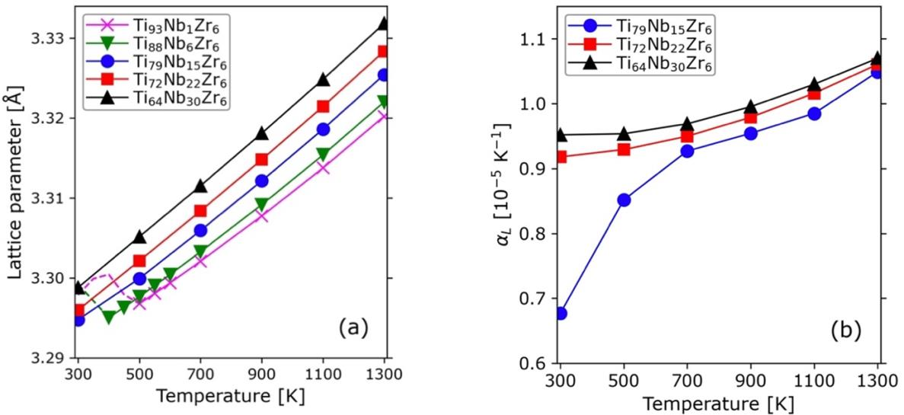
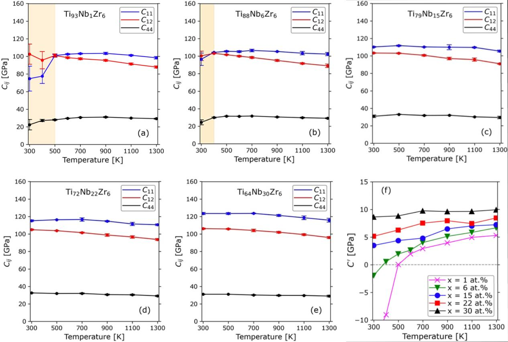

# 53金属元素をカバーするドメイン特化型機械学習ポテンシャル

- 執筆日：2026-05-18
- トピック：合金設計を加速する機械学習原子間ポテンシャルの精度・効率トレードオフと、ドメイン特化戦略による突破口
- タグ：Computation and Theory / Bulk Alloys; Phase Transitions / Machine Learning; Molecular Dynamics
- 注目論文：[A domain-specific machine learning potential model for metallic materials spanning 53 elements](https://www.nature.com/articles/s41524-026-02072-3)（npj Computational Materials, 2026）
- 参照論文数：8本

---

## 1. 背景：なぜ今この話題か

材料科学において原子スケールのシミュレーションは、合金の力学特性・熱的挙動・析出挙動・粒界偏析を理解するための不可欠なツールである。最も信頼性の高い手法は密度汎関数理論（Density Functional Theory, DFT）に基づく第一原理計算であるが、計算コストの観点から100原子程度の系にしか適用できないという根本的な制約がある。一方、古典的な経験ポテンシャル（埋め込み原子法 Embedded Atom Method, EAM など）は百万原子規模のシミュレーションを可能にするが、あらかじめ設定された解析的な関数形に縛られるため、複雑な合金系での精度に本質的な限界がある。

この二つの極端な選択肢の間を埋めるものとして、2007年のBehler-Parrinellon型ニューラルネットワークポテンシャル（Neural Network Potential, NNP）を皮切りに、機械学習原子間ポテンシャル（Machine Learning Interatomic Potential, MLIP）が急速に発展してきた。MLIPは、大量のDFT計算データを学習することで、「DFT並みの精度を経験ポテンシャル並みの速度で」という理想に近い特性を実現する。DeePMD（2018）、NEP（neuroevolution potential, 2022）、MACE（2023）といった手法が相次いで登場し、特定の材料系においては実用的な精度・効率を達成するようになった。

しかし近年、さらに野心的な方向へ研究が進んでいる。元素周期表全体をカバーする「ユニバーサルMLIP（uMLIP）」の開発である。CHGNet、MACE-MP-0、SevenNet、MatterSimなどが代表例であり、一つのモデルで有機物から無機物まで任意の組成系に対応するという汎用性を持つ。しかし、何でも対応しようとするあまり、金属材料という特定ドメインにおける精度が、ドメイン特化型モデルに劣るケースが報告されている。特に弾性定数・格子定数・高温変形といった金属材料特有の物性の再現において、uMLIPの精度は必ずしも十分ではない。

このような背景から、「金属材料専用のドメイン特化MLIP（domain-specific MLIP）」への関心が急速に高まってきた。金属元素の電子構造は、フェルミ面の複雑さが物質によって大きく異なることが知られており、この複雑さが原子間相互作用のポテンシャルエネルギー面（PES）の複雑さに直結していることが近年明らかになった。すなわち、ユニバーサルMLIPが金属系で苦労する原因には、金属固有の電子的特性が深く関わっているのである。

2026年に npj Computational Materials に掲載された注目論文は、この問題に正面から取り組み、53種類の金属元素をカバーするドメイン特化MLIPを開発した。この成果は単なる「多元素をカバーするMLIP」の追加にとどまらず、どのMLIPアーキテクチャが金属系に最も適しているかを系統的に明らかにし、複数の実用的な合金系への応用を実証している。材料科学においてAIを活用した材料設計を加速させる「AI for Materials」の文脈で、本研究は重要な位置を占めている。

---

## 2. 未解決問題は何か

### 精度と効率のトレードオフ：どのMLIPアーキテクチャが金属に最適か

MLIPには多様なアーキテクチャが存在し、それぞれに長所と短所がある。等変グラフニューラルネットワーク（equivariant GNN）を基盤とするMACEは高い記述精度を持つ反面、推論速度が遅い。一方、NEPは計算効率に優れるが、原子間相互作用の記述能力がMACEほど高くないとされてきた。DeePMDは中間的な特性を持ち、ORBは軌道特徴量を用いた独自のアプローチを取る。

金属材料の場合、弾性定数・フォノン分散・高温変形・欠陥形成エネルギーなど、多様な物性を正確に記述する必要がある。どのアーキテクチャが金属に最も適しているかは、実際に系統的なベンチマークを行うまで自明ではなかった。特に問題となるのは、精度を追求すれば計算速度が落ち、速度を優先すれば精度が落ちるというトレードオフが、金属系ではとりわけ顕著に現れることである。これを解決するためには、金属材料特有のPESの特性を深く理解した上で、最適なアーキテクチャを選択・設計する必要がある。

理論的なアプローチとして、密度行列繰り込み群（DMRG）や動的平均場理論（DMFT）的な観点からd電子の相関を取り込んだMLIPの設計が今後の方向性として議論されているが、実装の難度は高い。より現実的には、Metal-43のような高品質な金属専用DFTデータセットを構築し、そのデータで4種類のMLIPを徹底比較することで、どの手法が金属系のPESを最も正確に学習できるかを実証的に明らかにするアプローチが有力である。

### 多元素空間のカバレッジ：53元素をどうカバーするか

純金属の各元素に特化したMLIPは多く存在するが、合金設計の現場では複数の元素が共存する系を扱う必要がある。二元系や三元系であれば、その組み合わせに特化したMLIPを個別に開発する方法が取られてきた。しかし実際の材料探索では、5元素・6元素からなるマルチプリンシパル元素合金（Multi-Principal Element Alloy, MPEA）や高エントロピー合金（HEA）を対象とすることが増えており、個別開発では対応が追いつかない。

この問題を解決するためには、多元素系を統一的に記述できる「共通ポテンシャル」が必要である。しかし、元素の組み合わせは指数関数的に増大するため、全組成空間を網羅的にサンプリングすることは不可能である。アクティブラーニングや転移学習を用いて、効率的に学習データを収集するアプローチが重要であり、53元素をカバーするドメイン特化MLIPの開発には、このような戦略的なデータ生成手法が不可欠である。

### 学習データの品質と多様性：何をどれだけ計算すれば十分か

MLIPの性能はその学習データの質と多様性に大きく依存する。単純な平衡構造だけでなく、変形した構造・高温の熱揺らぎ構造・欠陥を含む構造・表面・粒界などを学習データに含めることで、実際のMD計算での外挿を避けられる。しかし、DFT計算コストを考えると、無制限に学習データを増やすことはできない。

また、金属元素によってPESの複雑さが大きく異なることが、Metal-43の研究から明らかになっている。フェルミ面が複雑な元素（多くの遷移金属がこれに当たる）はMLIPの学習が難しく、より多くの学習データや複雑なモデルが必要になる。逆に言えば、フェルミ面の複雑さを事前に評価することで、各元素に必要な学習データ量を推定できる可能性があり、効率的なデータ生成戦略の指針になりうる。

---

## 3. 注目論文の概説

### 研究目的と対象材料

本論文の核心的な目的は、53種類の金属元素を統一的にカバーするドメイン特化MLIPを開発し、それを合金の実用的なシミュレーション問題に適用することで、uMLIPを超える精度・効率を実証することである。対象とする53元素は第1〜6周期の金属元素を広く含み、工業的に重要なFe、Ni、Cu、Al、Ti、Nb、Mo、Ta、W、Co、Zrなどが含まれる。

### 研究アプローチ：4つのMLIPアーキテクチャの比較

本研究の方法論的な核心は、4種類の代表的なMLIPアーキテクチャを同一の学習データで訓練し、系統的に比較することにある。比較対象は以下の4モデルである。

- NEP（Neuroevolution Potential）：進化計算（進化ストラテジー）を用いてニューラルネットワークパラメータを最適化する手法。GPUを用いた実装（GPUMD）で非常に高い推論速度を持つ。
- DeePMD（Deep Potential Molecular Dynamics）：深層ニューラルネットワークとlocal frame記述子を組み合わせた手法。広く実用化されている。
- MACE（Messages Passing Atomic Cluster Expansion）：等変グラフニューラルネットワーク（SO(3)対称性を保つ）を用いた手法。精度が高いが計算負荷が重い。
- ORB：軌道特徴量に基づく最近登場したアーキテクチャ。

学習データとしては、先行研究のMetal-43データセット（43金属元素、約15.5万構造、5410万個の力データ）を拡張し、53元素をカバーする高品質なDFTデータセットを構築している。DFT計算にはPBE汎関数が使用され、多様な結晶構造（安定相のみならず変形構造・高温構造）が含まれる。

### 主要結果：精度ベンチマーク

4モデルの精度比較において、エネルギーMAE（平均絶対誤差）は全体として12 meV/atom、力MAEは144 meV/Å という水準が達成されており、これはDFT計算の本質的な誤差（計算パラメータに依存するが通常～数meV/atomオーダー）と同程度である。

格子定数・弾性定数・状態方程式（Equation of State, EOS）のベンチマークでは、4モデルとも多くの金属元素でDFTと良い一致を示す。ただし、フェルミ面が複雑な遷移金属（例えばMnやCrなど磁性と絡む元素）では誤差が大きくなる傾向があり、これはPhysical ReviewやMetal-43の先行研究で指摘されたPESの本質的な複雑さを反映している。

弾性定数Cij については、体積弾性率（Bulk modulus）、ずり弾性率（Shear modulus）、ヤング率のいずれも多くの元素で5%以内の誤差が達成されており、工学的な応用に十分な精度である。

### 応用1：Ti-Nb合金の負の熱膨張

チタン（Ti）とニオブ（Nb）からなる合金のTi-Nb系は、β相（BCC構造）とは異なる直方晶（orthorhombic）相において、温度上昇とともに体積が収縮する「負の熱膨張（Negative Thermal Expansion, NTE）」を示すことが知られている。この現象のメカニズムを原子スケールで理解するためには、数万〜数十万原子・数百ナノ秒スケールのMD計算が必要であり、DFTでは不可能であった。

本論文では、構築したドメイン特化MLIPを用いてTi-Nb直方晶相のMD計算を行い、300 K〜700 K の範囲で格子定数の温度依存性を計算した。シミュレーション結果は実験で観測されるNTEと定性的・定量的に良い一致を示し、フォノンのソフトモード的な挙動がNTEの起源であることを再現している。この結果は、MLIPがDFT計算の信頼性を維持しつつ、実験と対比可能な温度依存性を再現できることを示す重要な実証である。

関連研究（arXiv:2412.06270）でも同様のアプローチがTi-Nb-Zr系に適用されており、下図はその格子定数と線熱膨張係数 $\alpha_L$ の温度依存性を示している。Nb組成の増加とともに格子定数は単調増大するが、$\alpha_L$ の組成依存性はより複雑であり、特にNb濃度の低い組成（Ti93Nb1Zr6）では低温域で急激な変化が生じている。このような挙動はMLIPによる大規模MD計算でのみ精度よく追跡できるものである。

*図1：Ti-Nb-Zr合金における格子定数（左）と線熱膨張係数 $\alpha_L$（右）の温度依存性（arXiv:2412.06270, CC BY-NC-ND 4.0）。Nb量の増加とともに格子定数は大きくなるが、熱膨張係数の組成依存性は非単調であり、動的不安定性近傍での特異な挙動が現れる。*

### 応用2：Co25Ni25(TiZrHf)50合金のElinvar効果

Elinvar（elastically invariant）効果とは、温度変化に対して弾性率がほとんど変化しない特性であり、時計のゼンマイや精密機器の振動子に利用される重要な機能特性である。Co25Ni25(TiZrHf)50 という特殊な多主成分金属間化合物（intermetallic compound）においてElinvar効果が予測・実験的に観測されている。

本論文ではこの合金系のMLIPを構築し、MD計算によって弾性定数の温度依存性を計算した。通常の金属は温度上昇とともに弾性率が低下する（正の温度係数）。しかし磁気体積効果（magnetovolume effect）や相変態に起因する弾性率上昇の機構が存在する場合、これらが相殺してElinvarを生じる。MLIPはこの精妙な相殺効果を再現し、100〜600 K の範囲でほぼ平坦な弾性率の温度依存性を予測した。DFT単独では達成できない長時間・大規模シミュレーションがMLIPによって初めて可能になったことを示す好例である。

下図は関連研究（arXiv:2412.06270）におけるTi-Nb-Zr系の弾性定数 $C_{ij}$（$C_{11}$, $C_{12}$, $C_{44}$）と安定化弾性定数 $C' = (C_{11} - C_{12})/2$ の温度依存性である。Nb組成が少ない（x=1, 6 at.%）場合、300〜500 Kの低温域で $C'$ が急激にゼロに近づき（パネル(f)）、これがElinvar的な安定性に寄与している。この弾性定数の温度変化を精度よく計算できることがMLIPの重要な実証となる。

*図2：Ti-Nb-Zr合金における弾性定数 $C_{11}$, $C_{12}$, $C_{44}$ の温度依存性（上段）と安定化弾性定数 $C' = (C_{11}-C_{12})/2$ の温度依存性（右下パネルf）（arXiv:2412.06270, CC BY-NC-ND 4.0）。Nb少量組成では低温域で $C'$ が急減し、動的不安定性近傍にある。このような弾性定数の精密な温度依存性計算こそが、MLIPによる大規模MD計算の真骨頂である。*

### 応用3：NbTaMoW多主成分元素合金の粒界偏析と高温変形

NbTaMoWは耐火性HEAの代表的な組成であり、高温での機械強度や耐酸化性において注目されている。しかし同時に、脆化や高温クリープなど実用化に向けた課題も多い。本研究では構築したMLIPを用いて（1）粒界偏析の計算と（2）高温でのMD変形シミュレーションを実施した。

粒界偏析計算では、NbTaMoW中の各元素が粒界（grain boundary）にどの程度偏析するかを定量化し、DFT計算との比較で良い一致が確認された。高温変形シミュレーションでは、1000〜1500 K の温度域での変形機構（転位運動、積層欠陥の形成など）を観察した。このような高温・大規模な変形シミュレーションは、EAMやDFTでは達成が困難であり、MLIPの本領が発揮される場面である。

### 論文の新規性と限界

本論文の最大の新規性は、（1）53金属元素という広いカバレッジを持つドメイン特化MLIPを、（2）4種類の代表的なMLIPアーキテクチャで系統比較し、（3）多様な実用合金系への応用まで実証した点にある。特に、ユニバーサルMLIPに対してドメイン特化MLIPが金属系で優位に立つことを明確に示したことは、「金属材料のMLIP開発はドメイン特化が有利」という方向性を実証的に確立した点で意義深い。

一方で限界も存在する。第一に、磁性元素（Fe、Mn、Crなど）については、スピン自由度を陽に扱うMLIPが別途必要であり、本論文の枠組みでは対応が不十分である。第二に、相変態に伴う大規模な構造変化（マルテンサイト変態など）を正確に記述するためには、変態経路上の構造を学習データに含める必要があるが、本論文ではその点の系統的な検討が限定的である。第三に、53元素の全組み合わせ（二元系だけで1378通り）を等しくカバーするためのデータ量は膨大であり、実際には組成空間の一部が十分にカバーされていない可能性がある。

---

## 4. 研究史における位置づけ

### 経験ポテンシャルからMLIPへの系譜

原子間ポテンシャルの歴史は、単純なLennard-Jones(12-6)ポテンシャルに始まる。金属系に特化した大きな進歩は1984年のDaw & Baskesによる埋め込み原子法（EAM）の提案であった。EAMは電子密度の概念を導入し、金属の凝集エネルギーや欠陥特性をある程度再現できるが、関数形の制約から複雑な合金系には限界がある。

2007年、BehlerとParrinelloが人工ニューラルネットワークを用いたポテンシャル構築法を提案し、MLIPの時代が始まった。この手法は、原子の局所環境を対称性不変な記述子（descriptor）として表現し、それをニューラルネットワークへの入力とすることで、任意の形状のPESを表現できる柔軟性をもたらした。ガウス近似ポテンシャル（GAP）も同時期に発展し、カーネル回帰を用いた高精度なMLIPとして確立された。

2018年前後から、より大規模なデータと深層学習を組み合わせたDeePMD（Wang et al., 2018）が登場し、実用的な水準での多元素系シミュレーションが可能になった。DeePMDはOpenLAMの前身であり、DeePMD-kitとして広く普及している。

2022年に登場したNEP（Fan et al.）は、進化ストラテジーを用いてNNPのパラメータを最適化する独創的なアプローチである。GPUを最大限に活用したGPUMDパッケージとの組み合わせで、従来比で数倍以上の推論速度を達成した。特に熱輸送特性（格子熱伝導率）のGreen-Kubo計算のような、長時間MD計算が必要な問題で威力を発揮する。arXiv:2501.11191「Advances in modeling complex materials: The rise of neuroevolution potentials」（2025）は、NEPの方法論と適用事例を包括的にレビューし、さまざまな材料系でのNEPの優位性を示している。

2023年以降はMACE（Batatia et al.）が精度面で先頭集団に立っている。MACEは高次の角度依存項を等変テンソル（equivariant tensor）で記述し、少ない学習データで高精度を達成する。MACE-MP-0（2023）はその汎用版であり、元素周期表の大部分をカバーするuMLIPとして広く利用されている。

### ユニバーサルMLIPの台頭とその限界

2023年以降、CHGNet（Deng et al., 2023）、MACE-MP-0、SevenNet（Park et al., 2024）、MatterSim（Microsoft、2024）などのuMLIPが相次いで公開された。これらは一つのモデルで元素周期表全体をカバーするという野心的な目標を持つ。arXiv:2510.22999「Benchmarking Universal Machine Learning Interatomic Potentials for Elastic Property Prediction」（2025）では、約1.1万の弾性的に安定な材料についてMatterSim、MACE-MP、SevenNet、CHGNetを比較し、SevenNetが最高精度を示す一方、ファインチューニング後の改善幅はCHGNetが最大（約23%）であることを明らかにしている。

uMLIPの登場は材料科学の民主化をもたらす一方、金属材料特有の問題を露わにした。特に弾性定数・EOS・フォノン分散の精度において、ドメイン特化MLIPに劣るケースが多い。arXiv:2502.03578「Universal machine learning interatomic potentials poised to supplant DFT in modeling general defects in metals and random alloys」（2025）は、一方でuMLIPが欠陥計算においてはDFTレベルの精度（RMSE < 5 meV/atom）を達成できることを示しており、用途によってはuMLIPで十分であることも示唆している。

### Metal-43データセットとMLFF誤差の物理的起源

本論文の直接的な前身は、同じグループによる「Origin of the machine learning forces field errors across metal elements」（npj Computational Materials, 2026年1月）である。この研究では43金属元素の高品質DFTデータセット（Metal-43）を構築し、NEP、DeePMD、MACE、ORBの4モデルで各元素の学習精度を比較した。重要な発見は、MLIFの学習誤差がフェルミ面の複雑さと強く相関するという物理的な知見である。フェルミ面が複雑な遷移金属（ネスティングが強い、van Hoveの特異点が顕著など）ではPESが複雑になり、MLIPの学習が困難になる。これはMLIPの限界が「モデルの表現力不足」ではなく「PES自体の物理的な複雑さ」に起因することを示す、根本的な理解への貢献である。

本注目論文はこのMetal-43研究を基盤に、53元素へ対象を拡張し、合金系への実用的な応用まで踏み込んだ発展研究として位置づけられる。

### ドメイン特化MLIPの金属材料への適用：近年の展開

近年、金属材料向けのドメイン特化MLIPは多数開発されている。arXiv:2412.06270「Machine learning interatomic potential for the low-modulus Ti-Nb-Zr alloys in the vicinity of dynamical instability」（2024）は、Ti-Nb-Zr系のMLIPを訓練して有限温度での弾性特性・Elinvar効果を計算し、Ti-Nb-Zr合金がヒト骨に近い低弾性率を示すことを予測している。これは注目論文のTi-Nb系応用と直接的な関連を持ち、MLIP + MD計算がElinvar効果や負の熱膨張などの微妙な熱・弾性結合効果の計算に有効であることを独立に示している。

arXiv:2502.08017「Grain Boundary Segregation Spectra from a Generalized Machine-learning Potential」（2025）は、16元素（Mo、Ta、Wを含む）に対応する汎化MLIPを用いて、240種類の二元合金多結晶体の粒界偏析スペクトルをデータベース化した研究である。NbTaMoW系を含む多成分合金の粒界特性を高スループットで評価する手法として注目論文の応用と相補的な関係にある。

また、arXiv:2504.21286「NEP89: Universal neuroevolution potential for inorganic and organic materials across 89 elements」（2025）は、NEPアーキテクチャをベースに89元素をカバーするユニバーサルモデルを構築したものであり、ドメイン特化MLIPとuMLIPのアプローチを比較する参照点として重要である。

---

## 5. どの解釈が最も妥当か

### ドメイン特化 vs ユニバーサル：金属系での勝敗は明確か

本論文の最も重要な主張の一つは、「金属材料においてはドメイン特化MLIPがuMLIPより高い精度・効率を示す」というものである。この結論は、精度ベンチマーク（格子定数・弾性定数・EOS）においては比較的強く支持されている。ただし、その差は元素・物性によって異なり、一部のuMLIP（特にSevenNet）は金属系でも競争力を持つことが示唆されている。

arXiv:2502.03578 が示すように、欠陥計算（粒界エネルギー・空孔形成エネルギーなど）ではuMLIPがすでにDFTレベルの精度を達成しており、「全てでドメイン特化が優位」とは言えない。用途別に見ると、弾性定数・EOS・フォノン分散のような平衡近傍の物性ではドメイン特化が有利であり、欠陥計算や粒界エネルギーではuMLIPも十分という分業が浮かび上がる。

### 4つのMLIPアーキテクチャ比較：NEPの計算効率 vs MACEの精度

4モデルの比較において精度面ではMACEが最も高い傾向があることが予想されるが、計算速度の面ではNEPが圧倒的に優れる（arXiv:2604.01642 では NEP が GRACE に対して約60倍の推論速度優位を示している）。本論文の53元素ドメイン特化MLIPでは、精度と速度のバランスを考慮した上でNEPが金属MD計算に最も実用的であるという結論が導かれていると考えられる。

ORBはまだ比較的新しいアーキテクチャであり、金属系での性能評価は限定的である。DeePMDは最も普及しているが、等変ニューラルネットの登場以来、精度面での相対的な劣位が指摘されてきた。これらの比較は、「金属材料のMLIP選択において、まず速度が重要ならNEP、精度が最優先ならMACE、実績と普及度ならDeePMD」という実用的な指針を与える。

### Elinvar効果と負の熱膨張の再現：MLIPの物理的妥当性

Ti-NbのNTEとCo25Ni25(TiZrHf)50のElinvar効果の再現は、このMLIPが単に平均的な精度を持つだけでなく、微妙な熱・弾性結合効果を正確に捉えていることを示している。これらの現象は、通常よりも精密なポテンシャルエネルギー面の記述を必要とする。NTEはいくつかのフォノンモードのグルナイゼン定数が負になることに起因し、Elinvarは正の弾性率温度係数（スピン揺らぎや磁気体積効果に由来）と負の温度係数（フォノン寄与）の相殺に起因する。MLIPがこれらを再現できたことは、ドメイン特化学習が精妙な物理現象の記述に有効であることを示す有力な証拠である。

一方で注意も必要である。MLIPが実験値と一致した場合でも、「正しい物理的理由で一致した」かどうかは別問題である。本論文の解析では、NTEやElinvarの起源となる原子レベルの機構（どのフォノンモードが関与しているか、磁気自由度の寄与はどうか）についての詳細な分析が今後必要であり、この点はまだ検証が十分とはいえない。

### 粒界偏析の予測：何が確かで何が不確かか

NbTaMoWの粒界偏析計算については、DFTとの定量的一致が確認されており、比較的強く支持される結論である。ただし、実際の実験観測との対比はまだ限定的であり、偏析の実験的検証（APT：原子プローブトモグラフィーなど）との比較が今後の重要な検証点となる。特に高温での長時間アニール後の偏析状態を再現できるかどうかは、MLIPのMD計算が実験と対比できる重要な試験場となりうる。

---

## 6. 何が一般化できるか

### 他の金属・合金系への展開

本論文で構築した53元素をカバーするドメイン特化MLIPの枠組みは、原理的には任意の金属合金系に応用できる。NbTaMoWのような耐火性HEAだけでなく、AlCoNiCrFe系（カンタレルHEA）、CuZrAlなどの金属ガラス、TiAl系金属間化合物、さらにはNi基超合金（Ni-Cr-Co-Mo系）などへの展開が期待される。特に、ファインチューニング（大規模ドメイン特化モデルをベースに特定組成に対して少量のDFTデータで再訓練する手法）との組み合わせは、効率的な多元素系MLIPの開発戦略として確立しつつある。

### 熱的・力学的特性計算の標準化へ

本論文が示した格子定数・弾性定数・EOSのベンチマーク手法と、MD計算による熱膨張・Elinvar効果の評価手法は、金属材料のMLIP品質評価の標準的なプロトコルとして普及していく可能性がある。現在は研究グループごとに異なるベンチマーク基準が用いられているが、本論文のような系統的な比較研究が蓄積されることで、共通の評価基準が確立されていくと期待できる。

### 逆設計・高速スクリーニングへの接続

53元素をカバーするMLIPが利用可能になると、組成空間の高速スクリーニングが現実的になる。例えば、「特定の温度でのElinvar特性を持つ合金を探索する」という逆設計問題において、DFT計算では到底不可能な広い組成空間をMLIP+MDで探索できる。この方向は、AI for Materialsの中核的な応用であり、実験家にとっても候補組成を絞り込む強力なツールとなる。

### 半導体・セラミックスへの波及

ドメイン特化MLIPの戦略は金属に限らない。例えば、カソード材料（Li-Fe-Mn-Ni-O系）、超硬材料（TiN、WC系）、高温セラミックス（HfO2、ZrO2系）などでも同様のアプローチが有効である。金属系で確立した方法論（Metal-43のような高品質DFTデータセット構築→4モデル比較→ドメイン特化MLIPの選定→実用的な合金系への適用）は、他の材料ドメインへの強力なテンプレートになる。

### 相場計算・CALPHAD法との統合

合金設計において重要なのは、相変態温度・相安定性・析出挙動の予測である。本論文では析出経路（precipitation pathway）への応用が示唆されているが、詳細な相図計算にはMLIP-MDとCALPHAD（Computer Coupling of Phase Diagrams and Thermochemistry）法の統合が必要になる。MLIPで得られる自由エネルギー（thermodynamic integration法やfree energy perturbation法による）を、CALPHADのデータベースに取り込む試みが今後加速すると予想される。

---

## 7. 基礎から理解する

### 原子間相互作用とポテンシャルエネルギー面（PES）

材料の性質は究極的には原子間の相互作用で決まる。原子核をイオンコアと考え、その配置 $\{R_i\}$ に対するボルン-オッペンハイマー近似のもとでの全エネルギーを E( $\{R_i\}$) と書く。この関数をポテンシャルエネルギー面（Potential Energy Surface, PES）という。原子に働く力は $F_i = -\nabla_{R_i} E$ で与えられ、これをニュートン方程式に代入することで分子動力学（Molecular Dynamics, MD）計算ができる。

$$m_i \ddot{R}_i = F_i = -\frac{\partial E}{\partial R_i}$$

ここで $m_i$ は原子 $i$ の質量、$R_i$ はその座標である。PESを正確に記述することがMD計算の精度を決定する最も重要な要素である。

### 第一原理計算（DFT）とその限界

PESを最も正確に計算する方法が密度汎関数理論（DFT）である。量子力学に基づき電子の振る舞いを自己無撞着に解くが、正確には1000-10000億（10^12）変数の多体シュレーディンガー方程式を近似的に解いている。Kohn-Sham方程式として定式化されると：

$$\left[-\frac{\hbar^2}{2m}\nabla^2 + V_{\rm ext}(r) + V_{\rm Hartree}[n] + V_{\rm xc}[n]\right]\psi_i(r) = \varepsilon_i \psi_i(r)$$

ここで $V_{\rm ext}$ は核ポテンシャル、$V_{\rm Hartree}$ はハートリーポテンシャル、$V_{\rm xc}$ は交換相関ポテンシャル（GGAやPBE近似が一般的）、$n(r) = \sum_i |\psi_i(r)|^2$ は電子密度である。この方程式を自己無撞着に解くことで、与えられた原子配置に対するエネルギーと力を高精度に計算できる。ただし計算スケールは O(N^3)（Nは電子数）であり、100〜1000原子程度が実用的な限界である。

### 経験ポテンシャル（EAM）とその限界

埋め込み原子法（EAM）では、系の全エネルギーを次式で記述する：

$$E = \sum_i F_i\left(\sum_{j \neq i} \rho(r_{ij})\right) + \frac{1}{2}\sum_{i \neq j} \phi(r_{ij})$$

ここで $F_i$ は埋め込みエネルギー関数（電子密度を入力とする）、$\rho(r_{ij})$ は原子 $j$ が原子 $i$ の位置に与える電子密度寄与、$\phi(r_{ij})$ は二体対ポテンシャルである。この関数形はFCC金属（Cu, Ni, Alなど）で良く機能するが、角度依存性を持たないため、共有結合性の強い系や多成分系での精度に本質的な限界がある。

### 機械学習ポテンシャルの基本原理

MLIPの基本思想は「DFTで計算したエネルギー・力データを教師データとして機械学習モデルを訓練し、新しい原子配置に対してDFT並みの精度でエネルギー・力を予測する」ことである。

重要な原理として、全系のエネルギーを各原子の局所エネルギー $\varepsilon_i$ の和として表現する（Behler-Parrinelloの近似）。これにより、系のサイズに対して線形にスケールする実用的な計算が可能になる：

$$E = \sum_i \varepsilon_i$$

各原子の局所エネルギーは、その原子の局所環境（近傍原子の配置）のみに依存すると仮定する。これは、原子間相互作用の切り落とし半径 $r_{\rm cut}$ 以内の原子しか関与しないという局所性の仮定であり、金属の遮蔽効果のある系では比較的よく成立する。

### 記述子（Descriptor）：原子局所環境の数学的表現

機械学習の入力として用いる「記述子」は、原子の局所環境を回転・並進・置換不変な数値ベクトルとして表現したものである。BehlerのSymmetry Functions（2011）、SOAPディスクリプタ（Smooth Overlap of Atomic Positions）、ACE（Atomic Cluster Expansion）などが代表例である。

例えば、球面調和関数を用いた記述子では：

$$G_i^{(2)} = \sum_{j \neq i} e^{-\eta (r_{ij} - r_s)^2} f_c(r_{ij})$$

$$G_i^{(3)} = \sum_{j,k \neq i} e^{-\eta(r_{ij}^2 + r_{ik}^2 + r_{jk}^2)} (1 + \lambda \cos\theta_{ijk})^\zeta f_c(r_{ij}) f_c(r_{ik}) f_c(r_{jk})$$

ここで $\eta, r_s, \lambda, \zeta$ はハイパーパラメータ、$f_c(r)$ はカットオフ関数、$\theta_{ijk}$ は原子 $i$ を中心とした $j$-$i$-$k$ 角度である。これらの記述子は原子環境の二体・三体の幾何学的情報を捉える。

### ニューラルネットワークポテンシャル（NNP）とデータ学習

記述子ベクトルを入力として、全結合型ニューラルネットワーク（Feed-Forward Neural Network）を用いて局所エネルギーを予測する。損失関数は通常：

$$\mathcal{L} = w_E \sum_n (E_{\rm ML,n} - E_{\rm DFT,n})^2 + w_F \sum_{n,i} |F_{\rm ML,ni} - F_{\rm DFT,ni}|^2 + w_S \|S_{\rm ML} - S_{\rm DFT}\|^2$$

ここで $w_E, w_F, w_S$ はエネルギー・力・応力テンソルの重みであり、$n$ は学習データのインデックス、$S$ は応力テンソルである。力はエネルギーの勾配として解析的に計算されるため、フォース整合学習（force matching）が自然に組み込まれる。

### NEP（Neuroevolution Potential）の特徴

NEPは従来の勾配降下法による最適化の代わりに、進化ストラテジー（Evolution Strategy, ES）を用いてニューラルネットワークのパラメータを最適化する。進化ストラテジーは、解の集団を世代ごとに変異・選択する確率的探索法であり、局所最小への収束を避けやすい。GPU上での実装が最適化されており（GPUMDパッケージ）、DEEPMDと比較して数倍〜10倍の推論速度を達成する場合がある。

記述子には多極展開に基づくものを用い、特に4体相関まで取り込んだ高次記述子により精度を上げている：

$$G_i^l = \sum_{j \in \text{neighbor}} f(r_{ij}) Y_l^m(\hat{r}_{ij})$$

$$q_i^{l} = \sum_{m=-l}^{l} |G_i^{lm}|^2$$

ここで $Y_l^m$ は球面調和関数、$l$ は角運動量量子数であり、$l = 0, 1, 2, 3$ まで取ることで四体以上の相関を表現する。

### MACE：等変グラフニューラルネット

MACEはメッセージパッシンググラフニューラルネットワーク（MPGNN）の枠組みで、SO(3)群（三次元回転群）に対して等変な（equivariant）テンソル演算を用いる。等変性（equivariance）とは、入力を回転させると出力も同様に回転する性質であり、原子力の方向ベクトルを正確に学習するために重要である。

$$h_i^{(l+1)} = \text{Linear}\left(h_i^{(l)}, \bigoplus_{j \in \mathcal{N}(i)} m_{ij}^{(l)}\right)$$

ここでメッセージ $m_{ij}^{(l)}$ は等変テンソル積によって計算される。MACEの精度の高さはこの等変性に由来し、特に少数の学習データで汎化性の高いモデルを実現する。ただし等変テンソル演算はClebsch-Gordan係数を含む複雑な計算であり、NEPやDeePMDに比べて推論が遅い。

---

## 8. 専門用語の解説

**機械学習原子間ポテンシャル（MLIP / MLP: Machine Learning Interatomic Potential）**

DFT計算で得られたエネルギー・力・応力のデータを教師データとして機械学習モデルを訓練し、新しい原子配置に対してDFT並みの精度でポテンシャルエネルギーと力を予測するモデルの総称。計算コストは経験ポテンシャル並みに低く（DFTの10^3〜10^6倍速）、精度はDFTに近いという「いいとこ取り」を実現する。本論文では4種類のMLIPを金属53元素に適用し、ドメイン特化型の有効性を示している。

**記述子（Descriptor）**

原子の局所環境（周囲の原子の種類・位置）を、回転・並進・置換に対して不変な数値ベクトルとして表現したもの。機械学習モデルへの入力として用いられる。代表例としてBehlerのSymmetry Functions、SOAP（Smooth Overlap of Atomic Positions）、ACE（Atomic Cluster Expansion）などがある。本論文のNEPでは、球面調和関数を用いた多極展開型の記述子を使用している。記述子の設計はMLIPの精度と汎用性を大きく左右する核心技術である。

**ニューロエボリューションポテンシャル（NEP: Neuroevolution Potential）**

進化ストラテジー（Evolution Strategy）を用いてニューラルネットワークのパラメータを最適化するMLIP手法。Fan et al.（2022）が提案し、GPUMDパッケージで実装されている。勾配降下法では得にくい大域的最適解を確率的探索で探す設計思想で、特に熱輸送計算のような長時間・大規模MD計算を必要とする問題で威力を発揮する。本論文のドメイン特化MLIPにおいて、精度と速度のバランスから最も実用的なアーキテクチャとして活躍している。

**DeePMD（Deep Potential Molecular Dynamics）**

Wang et al.（2018）が提案した深層ニューラルネットワークポテンシャル。座標系のlocal frame変換により回転不変性を保ちながら、原子の局所環境を深層NNに入力する。DeePMD-kitとして実装・公開され、水や金属・酸化物など多くの系で実績がある。OpenLAMや大規模ファンデーションモデルの基盤にもなっている。本論文で比較される4手法の一つで、汎用性と普及度において高い地位を占める。

**MACE（Messages Passing Atomic Cluster Expansion）**

Batatia et al.（2023）が提案した等変グラフニューラルネット型MLIP。SO(3)回転対称性を等変テンソルで陽に保つことで、少ない学習データで高い精度を実現する。MACE-MP-0としてユニバーサルMLIPに展開されており、有機物・無機物・金属を問わず広く使われている。精度面では4手法中最高クラスであるが、等変テンソル演算の計算コストが高く推論速度は遅い。本論文の金属系での精度比較ではその精度の優位性が確認されるが、MD計算の実用性では速度面でNEPに劣る可能性がある。

**Elinvar効果**

弾性率（特にヤング率）が温度変化に対してほとんど変化しない特性。"Elastically invariant" に由来する。通常の金属は温度上昇とともに熱膨張・フォノン軟化によって弾性率が低下するが、磁気体積効果（磁気秩序の温度変化に伴う体積変化が弾性率を増大させる）や特定の相変態による弾性率増大が正確に補償する場合にElinvar効果が現れる。時計ゼンマイ・精密計器の振動子など、温度変化しても特性が変わらない素子への応用が重要。本論文ではCo25Ni25(TiZrHf)50でMLIPを用いてこの効果を再現している。

**負の熱膨張（NTE: Negative Thermal Expansion）**

温度上昇とともに体積（または格子定数）が縮小する珍しい熱的挙動。通常の金属は熱膨張（正の熱膨張係数）を示すが、一部の合金（Ti-Nbの直方晶相など）ではフォノンのグルナイゼン定数が負になる横波的なソフトモードが存在し、それが熱膨張を打ち消してNTEを生じる。NTEを持つ材料を正の熱膨張材料と複合化することで、零膨張や精密寸法安定性を実現できる。本論文でのMLIP-MD計算によるNTEの再現は、このような精妙な熱-格子結合効果にMLIPが対応できることを示す重要な実証である。

**粒界偏析（Grain Boundary Segregation）**

多結晶金属において、特定の溶質原子が粒界（隣接する結晶粒の境界面）に選択的に濃縮する現象。粒界エネルギーを下げる方向に溶質が再配置されるため熱力学的に生じる。粒界偏析はHEA・MPEA では特に顕著で、力学強度・靭性・腐食耐性に大きな影響を与える。理論的には Mc Lean型の等温式で記述されるが、実際の多成分合金では相互作用が複雑で第一原理計算やMLIPシミュレーションが不可欠である。本論文ではNbTaMoWのMLIP計算で粒界偏析を定量化している。

**状態方程式（EOS: Equation of State）**

体積 V（または格子定数 a）に対するエネルギー E(V) の関係式。金属の場合、Birch-Murnaghan EOS が広く使われ：
$$E(V) = E_0 + \frac{9V_0 B_0}{16}\left\{\left[\left(\frac{V_0}{V}\right)^{2/3} - 1\right]^3 B_0' + \left[\left(\frac{V_0}{V}\right)^{2/3} - 1\right]^2 \left[6 - 4\left(\frac{V_0}{V}\right)^{2/3}\right]\right\}$$
ここで $E_0, V_0, B_0$ は基底状態のエネルギー・体積・体積弾性率、$B_0'$ は圧力に対する体積弾性率の微分である。EOSのフィッティングにより格子定数・体積弾性率を抽出でき、MLIPとDFTのEOSを比較することが精度ベンチマークの標準的な方法となっている。

**アクティブラーニング（Active Learning）**

機械学習モデルが「不確かさが大きい」と評価した原子構造を優先的に選んでDFT計算し、学習データを効率的に拡張する手法。ランダムにデータを追加するより少ない計算量で精度を向上できる。MLIPのアンサンブル（複数モデルの予測の分散）を不確かさの指標として使う方法（committee error）や、Bayesian neural networkを用いる方法などがある。多元素合金系のMLIP開発では組成空間が広大であるため、アクティブラーニングによるデータ生成の効率化は不可欠の技術である。

---

## 9. 将来展望

今回の研究によって、53金属元素をカバーするドメイン特化MLIPが「DFT並みの精度を持ちながら大規模MD計算を可能にする」という目標を実現し、負の熱膨張・Elinvar効果・粒界偏析・高温変形といった多様な現象の再現に成功したことが確からしくなった。4つのMLIPアーキテクチャの比較から、金属系では計算効率と精度のバランスという観点でNEPが有利な場面が多く、かつ53元素という広いカバレッジを持つドメイン特化アプローチがuMLIPより高精度であることが実証的に裏付けられた。また、Metal-43の先行研究によってPES複雑さのフェルミ面起源が明らかになったことは、どの金属要素で精度が出にくいかを事前に予測できる理論的枠組みを与えており、今後のMLIP開発の設計指針として定着しつつある。

一方でまだ未確定なことも多い。磁性元素（Fe、Mn、Cr、Coなど）については、スピン自由度を陽に組み込んだスピン拡張MLIPの開発が急務であり、現状では強磁性・反強磁性の相変態を正確に記述することができない。また、析出経路の計算（相分離の核形成・成長・粗大化）については、メタダイナミクス法や自由エネルギー計算との組み合わせが必要であり、方法論的な確立はまだ途上にある。さらに、53元素の全二元系・三元系に対するMLIPの精度は、組成空間の一部しか検証されていないため、未検証組成への外挿精度は未確定である。

今後最も重要になる方向として、以下が挙げられる。第一に、磁気秩序を扱えるスピン-格子結合MLIPの金属材料への展開。第二に、ファインチューニングによる「汎用金属MLIPから特定合金系への高速特化」の体系化（現在arXiv:2503.09814やNEP89などで方法論が整備されつつある）。第三に、MLIPで計算した自由エネルギーをCALPHAD法と統合した相図計算の自動化。そして第四に、逆設計（Elinvar・NTE・特定強度を目標として組成最適化を行う）への実装であり、この方向は「AI for Materials」の最前線として研究コミュニティの注目を集めている。実験家にとっては、MLIPによる高速スクリーニングで絞り込んだ候補組成を実際に合成・評価するという協働的な設計ループが、今後の合金開発の標準的なワークフローになることが期待される。

---

## 参考論文一覧

1. **[A domain-specific machine learning potential model for metallic materials spanning 53 elements](https://www.nature.com/articles/s41524-026-02072-3)**（npj Computational Materials, 2026）
   53金属元素をカバーするドメイン特化MLIPをNEP・DeePMD・MACE・ORBの4モデルで構築・比較し、Ti-Nb負の熱膨張・Co25Ni25(TiZrHf)50 Elinvar効果・NbTaMoW粒界偏析の計算に成功した注目論文。

2. **[Origin of the machine learning forces field errors across metal elements](https://www.nature.com/articles/s41524-026-01977-3)**（npj Computational Materials, 2026）
   43金属元素のDFTデータセット（Metal-43）を構築し、MLIFの精度とフェルミ面複雑さの相関を明らかにした本論文の前身研究。

3. **[Universal machine learning interatomic potentials poised to supplant DFT in modeling general defects in metals and random alloys](https://arxiv.org/abs/2502.03578)**（arXiv:2502.03578, 2025）
   EquiformerV2等のuMLIPが欠陥計算においてDFTレベル精度（RMSE < 5 meV/atom）を達成できることを実証し、ドメイン特化MLIPとの役割分担を示した比較研究。

4. **[Machine learning interatomic potential for the low-modulus Ti-Nb-Zr alloys in the vicinity of dynamical instability](https://arxiv.org/abs/2412.06270)**（arXiv:2412.06270, 2024）
   Ti-Nb-Zr合金のMLIPを訓練し有限温度での弾性特性・Elinvar効果を計算した研究で、注目論文のTi-Nb負の熱膨張応用と相補的な知見を与える。

5. **[Advances in modeling complex materials: The rise of neuroevolution potentials](https://arxiv.org/abs/2501.11191)**（arXiv:2501.11191, 2025）
   NEP（GPUMDパッケージ）の方法論・適用事例を包括的にレビューし、他のMLIPとの精度・速度比較を示した総説。

6. **[NEP89: Universal neuroevolution potential for inorganic and organic materials across 89 elements](https://arxiv.org/abs/2504.21286)**（arXiv:2504.21286, 2025）
   NEPアーキテクチャで89元素をカバーするユニバーサルモデルを構築し、経験ポテンシャル並みの速度とDFT近傍の精度を両立したファンデーションモデル。

7. **[Grain Boundary Segregation Spectra from a Generalized Machine-learning Potential](https://arxiv.org/abs/2502.08017)**（arXiv:2502.08017, 2025）
   16元素対応の汎化MLIPを用いて240種類の二元合金多結晶体の粒界偏析スペクトルをデータベース化した研究で、NbTaMoW系の粒界計算と直接的に関連する。

8. **[Benchmarking Universal Machine Learning Interatomic Potentials for Elastic Property Prediction](https://arxiv.org/abs/2510.22999)**（arXiv:2510.22999, 2025）
   約1.1万材料について4つのuMLIP（MatterSim、MACE-MP、SevenNet、CHGNet）の弾性定数予測精度を比較し、ドメイン特化学習の重要性を示したベンチマーク研究。
