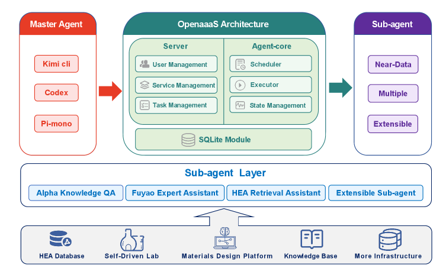
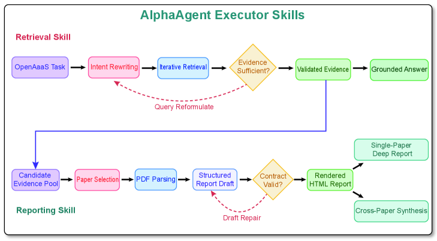
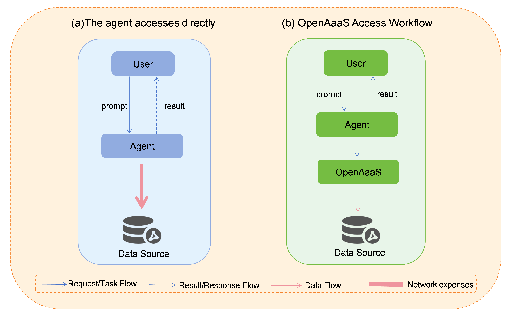
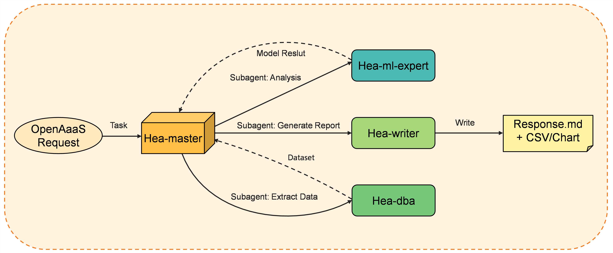

# 分散階層型 Agent-as-a-Service フレームワーク（OpenAaaS）の設計・実装・評価

- 執筆日：2026-05-18
- トピック：複数機関にまたがる高エントロピー合金研究・材料文献解析を対象に、データを各拠点に置いたまま AIエージェントのコードのみを流通させる「near-data execution」原則にもとづく分散階層型 Agent-as-a-Service フレームワーク（OpenAaaS）の設計・実装・評価
- タグ：Computation and Theory / Bulk Alloys; Devices and Functional Materials / Machine Learning; Inverse Design
- 注目論文：[OpenAaaS: An Open Agent-as-a-Service Framework for Distributed Materials-Informatics Research (arXiv:2605.13618)](https://arxiv.org/abs/2605.13618)
- 参照論文数：6本

---

## 1. 背景：なぜ今この話題か

材料研究のデジタル化は、2011年の米国マテリアルズゲノムイニシアティブ（MGI）以降、急速に進んだ。Materials Project・AFLOW・OQMD・NOMAD Laboratory などが次々と構築され、DFT計算による結晶構造・物性データ数十万件がウェブAPIで公開された。これらのプラットフォームは、データへのアクセスを民主化し、「直感主導の材料開発」から「データ駆動の材料設計」へという転換を後押しした。

しかし、このエコシステムは根本的にある設計思想に縛られてきた——「データを一か所に集めて計算する」という集中型アーキテクチャだ。これは公開データには有効だが、産業界・国立研究所・大学がそれぞれ保有する独自の合金組成データ、未公開の実験結果、軍事や核エネルギーに関わる放射線損傷データなどには適用できない。データを外部サーバーに送ることが、守秘義務・輸出規制・機関ポリシーによって禁じられているためだ。

2023〜2024年に LLM（大規模言語モデル）ベースのエージェントが材料科学に本格参入し始めると、この問題はより深刻になった。ChemCrow・Coscientist（arXiv:2304.05332）・SciAgents（arXiv:2409.05556）など、LLM エージェントが多段階科学ワークフローを自律実行できることが次々に実証された。AI Scientist（arXiv:2408.06292）は仮説生成から論文執筆・査読シミュレーションまでをわずか15ドルで実行し、「AI が科学者になれるか？」という問いを現実のものとした。

だがこれらのシステムはすべて、エージェントが必要な時に必要なデータに直接アクセスできることを前提とする。産業材料研究の現実——長期的な開発サイクル、複数機関にまたがる専門知識、秘密性の高いデータ——は、この前提を満たさない。「世界最高のモデルと膨大な材料データが別々の場所に存在するが、それらを組み合わせるインフラがない」というこの「ラストマイル問題」こそが、注目論文 OpenAaaS（arXiv:2605.13618）が解決しようとする中心的課題だ。

2025年の LLM ハッカソンの成果報告（arXiv:2605.03205）は、材料科学コミュニティが LLM の利用を単一ツール的な活用から「複数エージェントが協調する統合ワークフロー」へと急速に移行しつつあることを示した。この潮流の中で、OpenAaaS は「組織化された材料研究」のインフラを提供する、今まさに必要とされているフレームワークとして登場した。

---

## 2. 未解決問題は何か

### データの孤立と機関横断統合の困難

現在の材料インフォマティクスが抱える最大の構造的問題は「データサイロ」だ。各機関が高品質なデータを保有していても、それを外部と共有できない。原因は技術的なものではなく、制度的・法的なものが大半を占める。独自合金組成は営業秘密、放射線照射実験データは核管理法の対象、製薬企業との共同研究データは NDA（秘密保持契約）により外部公開不可——こうした制約のもとでは、「データを一か所に集めて機械学習する」という従来のアプローチは根本的に機能しない。

連合学習（Federated Learning）はこの問題への一つの回答だが、材料インフォマティクスへの適用には独自の困難がある。連合学習は各拠点でモデルを更新し勾配のみを集約するが、材料研究ではデータ規模が小さく、勾配更新での情報漏洩リスクが無視できない場合がある。また、ランダムフォレストや専門的な解析スクリプトなど、勾配ベースでない計算ワークフローには適用できない。データを移動させずに任意の計算ワークフローを実行できる、より汎用的なアーキテクチャが求められている。

### 高エントロピー合金の超大規模設計空間の探索

6 元素系高エントロピー合金（HEA）の設計空間は天文学的な大きさを持つ。15 元素パレット（Al・Co・Cr・Cu・Fe・Mn・Mo・Nb・Ni・Ti・V・W・Zr・Ta・Hf）から 6 元素を選んで各組成比を変化させると、候補組成数は $5.4 \times 10^{10}$ 件を超える。各候補が 194 次元の記述子ベクトルを持つとすると、データ総量は約 17.4 TB にのぼる。これを標準的な機関間ネットワーク（100 Mbps）で転送しようとすると 17 日以上を要する。実用的な高スループット材料設計には、このデータを動かさず、計算をデータの近くで実行する「near-data computing」パラダイムへの移行が不可欠だ。

どの合金系に着目し、どの物性（圧縮塑性・硬さ・腐食耐性）を最適化ターゲットとするか、という問いを定式化する段階から、専門知識を持つエージェントが必要だ。しかし汎用 LLM はこの規模・複雑さのデータベースを直接照会する能力を持たない。データベース管理・機械学習推論・報告書生成を統合した、ドメイン特化型エージェントの設計が問われている。

### 材料文献からの証拠に基づく推論

材料科学の論文は、同じ「alloy strengthening（合金強化）」という語を使っていても、組成・熱処理履歴・試験方法・測定条件によって主張の適用範囲が全く異なる。単純な RAG（Retrieval-Augmented Generation）パイプラインは意味的に類似した文章を取得するが、「組成・加工条件・測定手法が問いと一致しているか」という材料科学固有の文脈整合性を保証しない。これを解決するには、取得した証拠の材料科学的妥当性を検証し、根拠連鎖を維持したまま回答を生成できる証拠根拠型（evidence-grounded）ワークフローが必要だ。

---

## 3. 注目論文の概説

### 研究目的と基本思想

OpenAaaS（arXiv:2605.13618）は、上記の課題群を一つのアーキテクチャ原則で解決しようとする。その原則は「コードは流れ、データは動かない（code flows, data stays still）」だ。従来の集中型プラットフォームでは「データをモデルのある場所へ送る」。OpenAaaS はこれを逆転させ、「実行コードをデータのある場所へ送る」。各機関は自分のデータを外部に出すことなく、他機関のエージェントから計算サービスとして呼び出してもらえる。

### 三層階層アーキテクチャ

OpenAaaS は三層で構成される（図1参照）。

*図1：OpenAaaS のアーキテクチャ概要（arXiv:2605.13618, CC BY 4.0）。マスターエージェント（LLMクライアント）がネットワークハブを経由してサブエージェントノードにタスクを委譲する。生データは各ノードから出ない。*

**第1層：マスターエージェント層**
ユーザーが直接対話する汎用 LLM エージェント（Kimi CLI・Claude Code・Codex・カスタムシステムなど）。自然言語の研究目標を理解し、複雑な問題を下位タスクに分解し、ネットワーク上の利用可能サービスを発見・選択・オーケストレーションする。重要なのは、マスターエージェントは各ノードが管理するデータや計算リソースに直接アクセスしない点だ。タスク記述・中間推論成果物・最終結果のみを扱う。

**第2層：ネットワークハブ（OpenAaaS サーバー）**
Rust で実装された軽量 HTTP サーバー（SQLite データベース内蔵）。機能は四つ：(i) ノードのサービス登録・管理、(ii) タスクの適切なノードへのルーティング（負荷分散含む）、(iii) ノードのハートビート監視（障害時の自動タスク移行）、(iv) ファイルリレー（最大 50 MB、デフォルト7日保持）。ハブ自体は生の科学データに一切アクセスしない。ノードはファイアウォール設定と互換性を確保するため、インバウンドポートを開放せず「逆ポーリング」でタスクを取得する。

**第3層：エージェントコア（ネットワークノード）**
各機関・各データ拠点に展開されるドメイン特化型実行エンジン。Rust の単一バイナリとして動作し、Docker コンテナ内でタスクを実行する。各タスクは独立したコンテナで動作し、ローカルデータセット・解析スクリプト・専用ハードウェア（GPU・計測器）に完全アクセスできる。コンテナ外にはタスクの結果のみが返される。このアーキテクチャにより、10 TB の HEA データベースを持つノードでも、データが外部に出ることなく高度な解析を提供できる。

### プログレッシブ・ケイパビリティ・ディスカバリー

コンテキスト爆発を防ぐため、OpenAaaS は三段階の段階的開示を採用する。Stage 1：サーバーが軽量サービスサマリー（名称・ドメインタグ・一行説明・現在容量）を返す。Stage 2：マスターエージェントが候補サービスの詳細ドキュメントをオンデマンドで取得する。Stage 3：複雑タスクでは事前プロンプトを送って明確化の質問を受け取る。この設計はマスターエージェントのコンテキストウィンドウを保護しながら、必要な情報へのアクセスを保証する。

### セキュリティモデル

多層防御（defense-in-depth）を採用：HTTPS 通信・HMAC-SHA256 署名の API キー認証・ノード独立認証・Docker コンテナサンドボックス（ホスト内部システムへのネットワークアクセスなし）・全タスクの監査ログ。ノードは自分の API キーで認証されるため、侵害されたノードが他ノードを詐称できない。

### ケーススタディ I：AlphaAgent による材料文献解析

*図2：AlphaAgent executor のワークフロー（arXiv:2605.13618, CC BY 4.0）。検索スキル（retrieval skill）が検証済み証拠を生成し、報告スキル（reporting skill）がそれをもとに構造化レポートを作成する。*

AlphaAgent は OpenAaaS 内で動作する材料文献解析 executor だ。30万件超の冶金材料工学ジャーナル論文インデックスに対して、証拠根拠型の問答と深い文献レポートを生成する。単純な RAG と異なり、AlphaAgent は検索意図の再定式化・証拠の材料系整合性検証・査読付き証拠選択を経て回答する。

40問の冶金材料質問（深い分析問題 20 問 + 一般問題 20 問）によるベンチマークで、AlphaAgent は平均 4.66/5.0 を達成した（一般モデル GPT-5.5・Kimi-K2.6 および単純 RAG ベースライン比較）。特に深い分析問題での優位が顕著で、単純 RAG が苦手とする「検索ドリフト」（表面的に類似するが材料的文脈が異なる証拠の誤選択）を、材料固有のエンティティ（合金名称・相名・熱処理条件）保持と証拠検証ループで防いでいる。

### ケーススタディ II：超大規模 HEA 記述子データベースサービス

*図3：17.4 TB の HEA データベースへのアクセス方式の比較（arXiv:2605.13618, CC BY 4.0）。(a) 直接転送：17日超が必要で非現実的。(b) OpenAaaS の near-data execution：コンピュータをデータに送り、結果のみを返す。*

15 元素系 6 元素 HEA の $5.4 \times 10^{10}$ 件の候補組成を対象に、各 194 次元記述子ベクトルを保有するデータベース（17.4 TB）をノードとして登録する。5 つのプロトコルルール（リモート実行優先・最小データ返却・データベース分離・記述子露出制限・多ユーザー共有計算）のもとで、マスターエージェントからの自然言語クエリ（「室温塑性を最適化した MoNbTaW 系 HEA を探せ」など）を DuckDB 最適化 SQL クエリに変換し、機械学習推論と組み合わせて構造化報告書を返す。

*図4：HEA-Executor の内部ワークフロー（arXiv:2605.13618, CC BY 4.0）。hea-master エージェントが hea-dba（データベース照会）・hea-ml（機械学習推論）・hea-reporter（報告書生成）の三サブエージェントを協調させる。*

---

## 4. 研究史における位置づけ

### 材料データ基盤の三世代

材料インフォマティクスのデータ基盤は三世代に分けられる。

第一世代は個別データベースの時代（〜2015年）だ。Materials Project・AFLOW・OQMD がそれぞれ独立した集中型プラットフォームとして立ち上がった。ユーザーはウェブインターフェースやAPIで結果を取得するが、プラットフォーム間の相互運用性は低く、独自データを持ち込める余地も限られた。

第二世代は統合インフォマティクス基盤の時代（2015〜2023年）だ。SaaS（ウェブ予測ツール）・PaaS（機械学習ワークフロー実行環境）・IaaS（第一原理計算インフラ）が積み重なり、公開データを活用した材料探索ループが効率化された。しかし「集中型データウェアハウス」の構造は変わらず、プロプライエタリデータへの対応は置き去りにされた。

第三世代はエージェント型分散基盤の時代（2024年〜現在）だ。LLM エージェントが単一ツールから多段階ワークフロー実行者へと進化し、「分散した専門知識を組み合わせる」アーキテクチャの必要性が顕在化した。Towards Agentic Intelligence for Materials Science（arXiv:2602.00169）はこの転換を体系的に論じており、材料探索の全ループ——仮説生成・実験設計・データ解析——にエージェントが能動的に関与する未来図を描いている。

OpenAaaS はこの第三世代の最前線に位置し、「データを移動させずに能力を共有する」という具体的なアーキテクチャ解を提示した最初のオープンソースフレームワークだ。

### AI エージェントの科学への参入

AI Scientist（arXiv:2408.06292）は、LLM が研究アイデアの生成・コードの作成・実行・図の生成・論文執筆・査読シミュレーションを一気通貫で行える可能性を示した。これは「AI が科学研究を自律的に遂行する」というパラダイムの証明実験であり、その後継 AI Scientist-v2 は ICLR ワークショップで初の AI 生成論文の採択を達成した。OpenAaaS が目指す「組織化された研究（organized research）」は、このような完全自律型 AI 科学と補完的な関係にある——前者がドメイン専門知識と機関横断協調を担い、後者が単一研究タスクの自動化を担う。

SciAgents（arXiv:2409.05556）は材料科学のオントロジーグラフを使って複数エージェントが協調し、新しい科学的接続を発見するシステムを提案した。グラフ推論による構造化知識の活用は OpenAaaS の AlphaAgent が目指すドメイン知識の明示的組み込みと方向性を共有するが、SciAgents はデータ主権・機関横断という制約に対応していない点で OpenAaaS とは異なるユースケースに対応している。

### Agent-as-a-Service（AaaS）の概念的位置づけ

AaaS-AN（arXiv:2505.08446）は MCP（Model Context Protocol）を拡張し、エージェントをサービスとして公開・発見・実行する Role-Goal-Process-Service（RGPS）標準を提案した。OpenAaaS は MCP 互換性を保ちながら、AaaS 概念を「材料科学のデータ主権制約」という具体的要件に特化させた点でユニークだ。AaaS-AN が主に企業環境での汎用エージェントサービスを対象とするのに対し、OpenAaaS は「TB スケールのデータを持つ材料研究機関が、データを外に出さずに機関横断サービスを提供する」という厳しい制約下での実用性を重視する。

LitLLM（arXiv:2402.01788）は LLM による文献レビュー自動化の汎用ツールキットを提供し、埋め込みベースの検索と要約を組み合わせる。OpenAaaS の AlphaAgent がこのような汎用 RAG ツールと異なる点は、「材料固有の証拠検証ループ」を組み込んでいることだ。LitLLM は入力されたキーワードに関連する文献をまとめるが、「この論文の実験条件が私の質問の合金組成・熱処理条件と一致しているか」という検証は行わない。

2025年 LLM ハッカソン（arXiv:2605.03205）の分析は、材料科学コミュニティ全体で LLM の使い方が「単一モデルの利用」から「マルチエージェントワークフロー」へとシフトしていることを定量的に示した。構造化されていない実験データの処理・知識抽出・仮説生成・実験プランニングの自動化が主要なユースケースとして浮上しており、これらを安全かつ機関横断で実行できるインフラへの需要が高まっていることを裏付けている。

---

## 5. どの解釈が最も妥当か

### 「コードは流れ、データは動かない」原則の有効性

OpenAaaS の二つのケーススタディは、この設計原則が材料科学の現実課題に対して機能することを示している。しかし、その有効性の範囲と限界について慎重な検討が必要だ。

HEA データベースケースで返される結果（クエリ結果・統計サマリー・機械学習推論）がKB〜MB スケールに抑えられているのに対し、元のデータは 17.4 TB という非対称性は、near-data execution の基本的有効性を示している。実際、17日超の転送時間が必要だった処理が、ノード側での実行により秒〜分単位で結果を得られる点は実用的な優位性として明確だ。ただし、「クエリ結果だけを繰り返し取得することによる段階的なデータベース再構築リスク」という新たなプライバシー問題（最小データ返却プロトコルで緩和）が生じる点も認識する必要がある。

AlphaAgent の 4.66/5.0 という評価スコアは、単純 RAG と汎用 LLM に対する優位を示しているが、この評価には注意が要る。40 問という限られた問題セット、評価者の主観が入る可能性のある採点、「深い分析問題」の定義の明確さ——これらの要素がスコアの解釈を複雑にする。また、比較対象の GPT-5.5・Kimi-K2.6 は汎用モデルであり、材料科学に特化した Fine-tune やシステムプロンプトを持たない設定での比較だ。材料特化 LLM との比較が今後必要だ。

### 分散アーキテクチャの採用障壁

OpenAaaS が解決しようとする問題の重要性は疑いがないが、採用障壁も現実的だ。各機関がノードを構築・維持するには Docker の設定・Rust バイナリの管理・API キーの発行など、ある程度の技術的負担がかかる。また、現状では「ノードが誠実に設計通りに動作する」という信頼が前提されており、悪意のあるノードが意図的に誤った結果を返す場合への対策が明示されていない。真に競合する機関間（競合企業同士など）での採用には、追加的な法的・技術的ガバナンスが必要となるだろう。

比較として、連合学習（Federated Learning）はデータを外に出さない点で同様の原則を持つが、勾配ベースでない計算ワークフロー（SQL クエリ・統計解析・専用解析スクリプト）への対応が難しい。OpenAaaS は任意の Docker コンテナ内の計算を実行できる汎用性において優位にあるが、連合学習が持つ数学的プライバシー保証（差分プライバシーなど）は現状では持たない。

### エージェント AI と材料設計の結合点

HEA-Executor の最も興味深い側面は、「自然言語クエリから DuckDB 最適化 SQL への変換」と「機械学習モデルの推論」を統合している点だ。従来、データベース照会は SQL の専門知識を持つエンジニアが担当し、ML モデルの推論は別の専門家が担当していた。OpenAaaS フレームワーク内では、非専門家の研究者が自然言語でクエリを投げるだけで、この二段階の処理が透過的に実行される。これは「AI が材料研究者の操作を抽象化する」という方向性の実証であり、今後の材料研究の民主化につながる可能性を持つ。

---

## 6. 何が一般化できるか

OpenAaaS のアーキテクチャが材料科学を超えて一般化できる範囲は広い。「データを動かせない」という制約は材料科学固有のものではなく、医療（患者データ）・金融（取引データ）・航空宇宙（設計データ）など、あらゆる高価値・高規制データを扱う分野に共通する。Model Context Protocol（MCP）への対応により、OpenAaaS ノードは Claude Desktop・Cursor など既存の MCP クライアントから透過的に呼び出せる。これは特定の材料インフォマティクスコミュニティに限定されない、より広い AI エコシステムへの統合可能性を示している。

材料系・物性の観点では、本論文のケーススタディは六元素系 HEA と冶金文献分析だが、同じ near-data execution 原則は構造材料（耐熱合金・放射線耐性鋼）・機能材料（永久磁石・圧電材料）・電池材料など、どの材料系にも適用できる。特に、複数機関が異なる製造条件・組成・特性測定データを持つ産業用合金（航空機エンジン用 Ni 基超合金・核融合炉用 W 合金など）では、データ主権制約が特に厳しく、OpenAaaS 型のアーキテクチャが最も力を発揮できる領域だ。

また、材料研究の「次の10年」において、自己駆動型ラボ（self-driving laboratory）と OpenAaaS 型フレームワークの統合が重要になると考えられる。自己駆動型ラボは実験の自動計画・実行・解析をローカルで行えるが、それ単体では「他機関の知見を活かす」ことができない。OpenAaaS ノードとして自己駆動型ラボを登録すれば、他機関のマスターエージェントが「○○大学の電気化学測定ラボに腐食試験を依頼する」という形で、機関横断の実験委託が可能になる。これは「AI が調整する分散研究コンソーシアム」という、これまで存在しなかった研究形態を実現する可能性を示している。

---

## 7. 基礎から理解する

### 材料データベースとFAIR原則

現代の材料インフォマティクスを支える基盤は、公開材料データベースだ。Materials Project は 15 万件超の無機化合物の DFT 計算結果（バンド構造・状態密度・弾性定数・電子構造など）を API で提供する。AFLOW は DFT ワークフローの自動管理に特化し、熱力学的安定性の高精度計算を強みとする。OQMD（Open Quantum Materials Database）は生成エネルギーの精度に注力し、機械学習ポテンシャルの学習データとして広く使われる。

これらのデータベースの構築・運用指針となる概念が FAIR 原則だ。FAIR は Findable（発見可能）・Accessible（アクセス可能）・Interoperable（相互運用可能）・Reusable（再利用可能）の頭文字だ。しかし現実には、多くの高価値な実験データ——特に産業界や軍事研究から生まれるもの——は FAIR に公開することができない。OpenAaaS は「FAIR を守りながら Accessible を限定する」という新しい均衡点を、near-data execution によって実現しようとする。

### RAG（Retrieval-Augmented Generation）の基礎

LLM は学習時点より後の情報を知らず、また訓練データに含まれない専門データベースにはアクセスできない。RAG はこの問題を解決するアーキテクチャだ。ユーザーの質問に対して、まず大規模な文書コーパス（論文・教科書・特許など）から関連性の高い文書片（チャンク）を埋め込みベクトル類似度で検索し、それを LLM のプロンプトに含めることで、最新・専門的な情報を活用した回答を生成する。

数式で書けば、クエリ $q$ に対して検索結果 $\{d_1, d_2, \ldots, d_k\}$ を取得し、LLM がこれらを参照して回答 $a$ を生成する：

$$a = \mathrm{LLM}(q, d_1, d_2, \ldots, d_k)$$

RAG の問題点は、「類似度が高い ≠ 材料的文脈が一致する」という材料科学特有のギャップだ。たとえば「Fe-Cr 合金の腐食耐性」というクエリに対して、「Fe-Cr 触媒」や「Cr めっき鋼板」に関する論文が高い類似度で取得される場合がある。AlphaAgent はこのギャップを「材料固有エンティティの保持・証拠の文脈整合性チェック・反復的クエリ再定式化」の三段階で埋める。

### LLM エージェントとツール呼び出し

現代の LLM エージェントは「テキストを生成する」だけでなく、外部ツール（関数・API）を呼び出す能力を持つ。OpenAI の Function Calling・Anthropic の Tool Use など、主要な LLM プロバイダーはこの機能を標準提供する。エージェントはツール仕様（名前・入力スキーマ・説明）を受け取り、必要なタイミングで JSON 形式のツール呼び出しを生成し、結果を受け取って次のアクションを決定する。

Model Context Protocol（MCP）は、このツール呼び出しの標準化を進める Anthropic 発のプロトコルだ。JSON-RPC メッセージングによるクライアント-サーバー型のアーキテクチャで、どの MCP 準拠クライアント（Claude Desktop・Cursor・Cline など）からも、どの MCP 準拠サーバー（ツール提供者）へも、共通のインターフェースで接続できる。「AI の USB-C」とも呼ばれるこの標準化が、OpenAaaS のオープンエコシステム戦略を支える技術的基盤となっている。

### マルチエージェントシステムの基礎概念

マルチエージェントシステム（MAS）は、複数の自律エージェントが協調・競争して問題を解くシステムだ。各エージェントは局所的な情報と能力しか持たないが、適切な通信と役割分担により、単一エージェントでは解けない複雑な問題を解決できる。

材料科学への MAS 適用では、役割分担が重要だ。OpenAaaS の HEA-Executor では：
- hea-dba（データベースエージェント）：SQL クエリの生成と DuckDB 経由での大規模データベース照会を担当
- hea-ml（機械学習エージェント）：取得した組成データに機械学習モデル（圧縮塑性予測器など）を適用
- hea-reporter（報告書エージェント）：推論結果を研究者が利用しやすい構造化報告書に変換

これら三つのサブエージェントを「hea-master エージェント」が調整する。各サブエージェントは自分の専門領域に集中し、横断的な協調は上位エージェントが担う——この階層的役割分担が複雑なワークフローの信頼性を高める。

### 高エントロピー合金（HEA）とは何か

高エントロピー合金（High-Entropy Alloy, HEA）は、通常 5 種以上の主要元素をほぼ等原子比で混合した多主元素合金だ。2004年に提案された比較的新しい材料概念で、従来の合金（1〜2 種の主要元素 + 少量の添加元素）とは本質的に異なる設計思想を持つ。

HEA の特徴は「高エントロピー効果」だ。多元素が混合すると、混合のエントロピー

$$\Delta S_\mathrm{mix} = -R \sum_i x_i \ln x_i$$

（$x_i$：元素 $i$ の分率、$R$：気体定数）が大きくなり、自由エネルギー $\Delta G = \Delta H - T\Delta S$ の $-T\Delta S$ 項が強まることで、金属間化合物の析出を抑制し単純な固溶体相（BCC・FCC・HCP）を安定化させる。この結果、高温強度・耐腐食性・耐放射線性など複数の優れた特性を同時に実現する組成が多数存在する可能性がある。

一方、6 元素系 HEA では 15 元素パレットから 6 元素を選ぶ組み合わせ $\binom{15}{6} = 5005$ 通りに、各元素の組成比を離散化した設定を加えると、候補空間は $5.4 \times 10^{10}$ 件に達する。この広大な設計空間を実験だけで探索することは不可能であり、AI によるスクリーニングと near-data execution による効率的なデータベース照会が不可欠となる。

### Docker コンテナとサンドボックス実行の基礎

OpenAaaS の各ノードはタスクを Docker コンテナ内で実行する。Docker とは「コンテナ」と呼ばれる軽量な仮想実行環境を提供する技術だ。仮想マシン（VM）が OS 全体を仮想化するのと異なり、コンテナはホスト OS のカーネルを共有しながら、ファイルシステム・プロセス空間・ネットワークを分離する。

この分離（サンドボックス化）により、悪意のあるコードや誤ったコードがホストシステムや他のコンテナを侵害するリスクが大幅に低下する。OpenAaaS では各タスクが独立したコンテナで実行され、コンテナ終了後に破棄される。これにより、世界中の機関からのコードを受け取って実行するという OpenAaaS ノードの本質的に高リスクな操作を、安全に行えるようにしている。

---

## 8. 専門用語の解説

**Agent-as-a-Service（AaaS）**
ソフトウェア機能（SaaS）の代わりに、自律的に推論・計画・行動できる AI エージェントをネットワークサービスとして提供するパラダイム。クライアントはエージェントの内部実装を知らずに、自然言語や構造化リクエストでタスクを依頼できる。OpenAaaS はこの概念を材料科学の機関横断ユースケースに特化させたフレームワークだ。

**near-data computing（ニアデータコンピューティング）**
データを中央サーバーに転送して計算するのではなく、データが存在する場所（「データの近く」）で計算を実行するパラダイム。OpenAaaS ではコード・タスク記述をデータ拠点のノードに送り、生データは一切外に出さない。17.4 TB の HEA データベースのような超大規模データセットでは、転送コストを事実上ゼロにできる。

**データ主権（Data Sovereignty）**
データが生成された組織・管轄・国家がそのデータをコントロールする権利。材料研究では独自合金組成・未公開実験結果・輸出規制対象データが該当する。OpenAaaS はデータ主権を「第一級設計制約」として、アーキテクチャの根幹に組み込んでいる。

**Model Context Protocol（MCP）**
Anthropic が 2024 年に提案した AI ツール呼び出しの標準プロトコル。JSON-RPC メッセージングにより、任意の MCP クライアント（Claude Desktop・Cursor など）が任意の MCP サーバー（データベース・計算ツールなど）に標準インターフェースで接続できる。OpenAaaS は MCP 互換 adapter を提供し、既存の MCP クライアントから OpenAaaS ネットワーク全体を利用可能にしている。

**RAG（Retrieval-Augmented Generation）**
LLM の生成に先立って外部文書コーパスから関連情報を検索し、それをコンテキストとして組み込むことで、LLM の知識限界と幻覚（hallucination）を補完するアーキテクチャ。単純な RAG では埋め込みベクトルの類似度のみで検索するが、AlphaAgent は材料固有の文脈整合性検証を追加している。

**高エントロピー合金（High-Entropy Alloy, HEA）**
5 種以上の主要元素をほぼ等原子比で混合した多主元素合金。2004 年に提案。高混合エントロピーが金属間化合物の析出を抑制し、単純固溶体を安定化させることで、高温強度・耐腐食・耐放射線など複数の優れた特性を同時に実現する可能性がある。OpenAaaS のケーススタディでは 6 元素系 HEA の $5.4 \times 10^{10}$ 候補組成を扱う。

**プログレッシブ・ケイパビリティ・ディスカバリー**
エージェントが利用可能なサービスの情報を、軽量サマリー → 詳細ドキュメント → インタラクティブ確認の三段階で段階的に取得する設計手法。LLM のコンテキストウィンドウへの負荷を最小化しながら、必要な情報への確実なアクセスを保証する。OpenAaaS がネットワークスケーラビリティを維持するための中核的設計原則だ。

**FAIR 原則**
科学データの管理・共有に関する指針。Findable（発見可能）・Accessible（アクセス可能）・Interoperable（相互運用可能）・Reusable（再利用可能）の頭文字。材料データベース（Materials Project・AFLOW など）が実践する公開データに適した原則だが、産業界のプロプライエタリデータとの緊張関係がある。OpenAaaS は「Accessible を選択的に許可しながら Reusable を機関内に限定する」という、FAIR を拡張した位置づけを持つ。

**DuckDB**
インメモリ分析型データベースエンジン。PostgreSQL 互換の SQL を使いながら、列指向ストレージにより大規模データの集計・フィルタリングを高速に処理できる。Python から直接呼び出せる埋め込み型のため、Docker コンテナ内のエージェントコードに組み込むのに適しており、OpenAaaS の HEA-Executor が 17.4 TB のデータベースを高速照会するために使用している。

**証拠根拠型推論（Evidence-Grounded Reasoning）**
回答を証拠の連鎖（evidence chain）によって支持する推論スタイル。LLM が持つ汎用的な知識ではなく、特定のデータソースから取得・検証された証拠のみに基づいて結論を導く。AlphaAgent が採用する手法で、材料科学では実験条件・組成・測定方法の一致が証拠の有効性の基準となる。

**混合エントロピー（Mixing Entropy）**
複数の異なる成分を混合した際に増加するエントロピー。統計力学的に $\Delta S_\mathrm{mix} = -R \sum_i x_i \ln x_i$ で与えられる（$x_i$：成分 $i$ の分率）。等原子比の 5 元素系では $\Delta S_\mathrm{mix} \approx 1.61R$ となり、従来の 2 元合金（最大 $0.69R$）の 2 倍以上になる。HEA でこの高い混合エントロピーが相安定性に与える影響が、「高エントロピー効果」の本質だ。

---

## 9. 将来展望

今かなり確からしくなったこととして、まず「データを動かさずに AI エージェントを動かす」というアーキテクチャ原則が、材料科学における機関横断インフォマティクスの現実的な解になり得ることが実証された。17.4 TB の HEA データベースを near-data execution で照会したケーススタディは、計算材料科学のコミュニティに「大規模データを集中管理しなくても AI ベースの高スループット材料設計が可能だ」という重要な概念実証を提供している。AlphaAgent の文献解析性能は、材料固有の文脈整合性検証を組み込んだ証拠根拠型 RAG が、汎用 LLM・単純 RAG を実用レベルで上回ることを示しており、専門化されたエグゼキュータ設計の価値が確認された。

まだ未確定な課題も多い。現在のシステムはノードが誠実に動作することを前提とした信頼モデルに依存しており、競合機関間での運用には追加的なガバナンスが必要だ。プライバシーの数学的保証（差分プライバシーなど）は提供されておらず、繰り返しクエリによるデータ再構築リスクの定量化が今後の研究課題だ。また、OpenAaaS 自体はフレームワークであり、その上で動く各 executor の品質（科学的正確性・計算効率・セキュリティ）は各ノード提供者に依存する。エコシステムが成熟するにつれ、「信頼できるノードの認証・評価メカニズム」が材料科学コミュニティ主導で整備される必要がある。

次に重要になる展開は三方向だ。第一に、OpenAaaS ノードと自己駆動型ラボの統合——実験の自動計画・実行をローカルで行う自己駆動型ラボが OpenAaaS ノードとして登録されれば、「マスターエージェントが他機関の実験インフラに計測タスクを委託する」という機関横断の実験委託が実現する。第二に、構造材料（耐熱 Ni 基超合金・核融合用 W 合金・航空機用 Ti 合金）への応用——これらは産業界・国家研究機関が独自の実験データを持ち、データ主権制約が最も厳しい領域であり、OpenAaaS 型のアーキテクチャが最も力を発揮できる。第三に、エージェントが生成した計算コードの自動検証（物理的整合性チェック・結果の再現性確認）——AI エージェントが増殖するほど「エージェントの生成物を信頼できるか」が問われるようになり、証拠連鎖の透明性を担保する仕組みの重要性が増す。

---

## 参考論文一覧

1. [OpenAaaS: An Open Agent-as-a-Service Framework for Distributed Materials-Informatics Research (arXiv:2605.13618)](https://arxiv.org/abs/2605.13618) ― 本記事の注目論文。「コードは流れ、データは動かない」原則にもとづく三層階層型分散マルチエージェントフレームワークを提案し、HEA データベースサービスと材料文献解析 AlphaAgent の二つのケーススタディで有効性を示した。

2. [Towards Agentic Intelligence for Materials Science (arXiv:2602.00169)](https://arxiv.org/abs/2602.00169) ― 材料科学における AI エージェントの現状と展望を包括的にレビューし、単一タスク Fine-tuning モデルからマルチエージェント材料探索ループへの移行を論じたサーベイ論文。

3. [The AI Scientist: Towards Fully Automated Open-Ended Scientific Discovery (arXiv:2408.06292)](https://arxiv.org/abs/2408.06292) ― LLM が研究アイデア生成・実装・図作成・論文執筆・査読シミュレーションを一気通貫で行う「AI 科学者」の実現可能性を示し、完全自律型科学研究パラダイムを打ち立てた。

4. [LitLLM: A Toolkit for Scientific Literature Review (arXiv:2402.01788)](https://arxiv.org/abs/2402.01788) ― LLM を用いた文献レビュー自動化の汎用ツールキット。埋め込みベースの検索と要約を組み合わせた汎用 RAG アプローチの代表例であり、AlphaAgent の証拠根拠型手法との比較基準となる。

5. [SciAgents: Automating scientific discovery through multi-agent intelligent graph reasoning (arXiv:2409.05556)](https://arxiv.org/abs/2409.05556) ― 材料科学オントロジーグラフを用いた複数エージェントの協調による科学的発見自動化フレームワーク。グラフ推論による構造化知識の活用という異なるアプローチから、OpenAaaS と相補的な視点を提供する。

6. [Agent-as-a-Service based on Agent Network (arXiv:2505.08446)](https://arxiv.org/abs/2505.08446) ― MCP を拡張した Role-Goal-Process-Service 標準にもとづく汎用 AaaS フレームワーク。OpenAaaS が材料科学の「データ主権制約」という具体的要件に特化している点で差別化される比較対象。

7. [From Knowledge to Action: Outcomes of the 2025 LLM Hackathon for Applications in Materials Science and Chemistry (arXiv:2605.03205)](https://arxiv.org/abs/2605.03205) ― 材料科学・化学コミュニティの LLM 活用状況を分析し、単一モデル利用からマルチエージェントワークフローへのシフトと、それを支えるインフラへの需要増加を定量的に示した。
