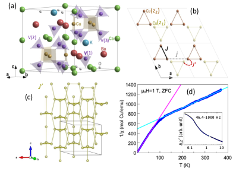
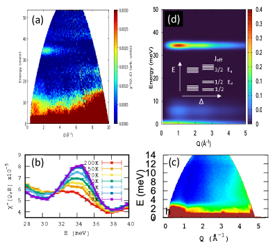
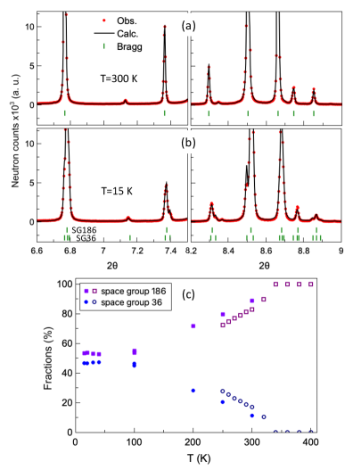
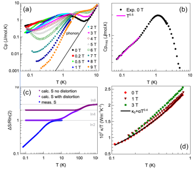
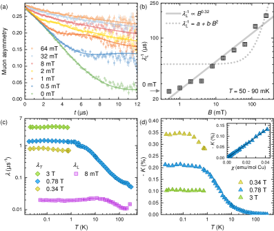
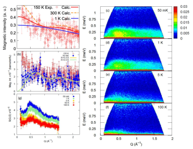

# 磁気秩序を示さないギャップレス量子スピン液体における異方性増幅機構

- 執筆日：2026-05-19
- トピック：スピントライマーからなる三次元二部格子において、微視的に弱い異方性が有効相互作用レベルで劇的に増幅され、ゼロ磁場・最低温度まで磁気秩序を示さないギャップレス量子スピン液体が実現することを多種の実験プローブで実証した研究
- タグ：Magnetism and Spin / Spin Liquids and Quantum Many-Body Systems; Low-Temperature Properties / Neutron Scattering; Extreme Condition Measurements
- 注目論文：[Quantum spin liquid on a 3D bipartite lattice of spin trimers stabilized by enhanced effective anisotropy (arXiv:2605.06752)](https://arxiv.org/abs/2605.06752)
- 参照論文数：7本

---

## 1. 背景：なぜ今この話題か

磁性体が低温に冷やされていくとき、通常は何らかの磁気長距離秩序——強磁性体であれば全スピンが同方向に揃い、反強磁性体であれば隣接スピンが交互に反転した Néel 秩序——が形成される。スピン間に交換相互作用が存在する限り、絶対零度では必ず何らかの秩序が生まれるように思える。ところが 1970 年代から理論的に予言され、実験的な探索が続けられてきた「量子スピン液体（quantum spin liquid, QSL）」は、まさにこの常識を破る状態である。QSL ではスピン間に強い相互作用があるにもかかわらず、絶対零度においても磁気秩序が生じず、スピンが集団的なコヒーレントな量子ゆらぎの中に「液体的」に存在し続ける。この状態は高度に量子もつれ合っており、スピノン（spinon）や Majorana フェルミオンといった「分数励起（fractionalized excitation）」が創発する。こうした分数励起は非アーベル・エニオンとしての性質を持つ場合もあり、トポロジカル量子計算のプラットフォームとして期待されている。

QSL が実現するための定性的な条件は「フラストレーション」である——格子の幾何学的構造や競合する交換相互作用によって、すべてのスピン対を同時に満足させることのできない状態、すなわちエネルギー的に等価なグラウンドステートが指数関数的に多数存在する状況が生まれると、強い量子ゆらぎが秩序形成を妨げる。三角格子・カゴメ格子・パイロクロア格子・ハイパーカゴメ格子などの幾何学的フラストレート格子は、従来 QSL 探索の主戦場であった。実際、$\kappa$-(ET)₂Cu₂(CN)₃（有機三角格子）、ZnCu₃(OH)₆Cl₂（ハーバートスマイス石、カゴメ格子）、Na₄Ir₃O₈（ハイパーカゴメ）、$\alpha$-RuCl₃（Kitaev 系蜂の巣格子）などがそれぞれの候補として精力的に研究されてきた。

一方で、近年 QSL 研究は二つの新潮流によって大きく広がりつつある。第一は、Kitaev (2006) が提示した蜂の巣格子上のちょうど解けるモデル（Kitaev model）に代表される「結合依存型異方性相互作用による二部格子（bipartite lattice）上の QSL」である。二部格子とは、格子点を二つのサブラティスに分割したときにサブラティス内の結合がなく、二つのサブラティス間だけに結合が存在する格子——典型的には正方格子・単純立方格子・蜂の巣格子——を指す。二部格子の Heisenberg 反強磁性体は強い量子ゆらぎを持つ子でも絶対零度では Néel 秩序を形成するのが一般的であり（例：2D 正方格子の強磁性超伝導体 La₂CuO₄ の Néel 秩序）、そこで QSL を実現するためには特別な機構が必要となる。Kitaev モデルはこれを結合方向依存の Ising 型交換相互作用によって達成するが、Kitaev QSL を示す確実な実験的証拠はいまだ得られていない。第二の潮流は「三次元 QSL」の探索である。3D 格子は 2D に比べて隣接スピン数（配位数）が大きく、量子ゆらぎが弱まる傾向があり、さらに幾何学的フラストレートした 3D 格子（パイロクロア格子など）でも磁気秩序が出やすい。Ce₂Zr₂O₇ などの双極子—八極子パイロクロア（1901.10092）や PbCuTe₂O₆ のハイパー-ハイパーカゴメ格子（1712.07942）は数少ない 3D QSL 候補として知られるが、いずれも特殊なフラストレート格子を用いる。

2026 年 5 月に提出されたプレプリント arXiv:2605.06752 は、この二つの潮流を一挙に接続する実験的成果を報告している——スピン-1/2 Cu²⁺ のトライマー（三量体）を単位として構成された三次元二部格子で、幾何学的フラストレーションなしに QSL が実現することを、中性子散乱・μSR・NMR・比熱・熱伝導率などの多彩な実験プローブによって実証した。その鍵となるメカニズムは「異方性増幅（anisotropy enhancement）」であり、微視的な Cu-Cu 交換相互作用レベルでは約 15% 程度の弱い異方性が、トライマーを有効スピン自由度として投影したあとの有効ハミルトニアンでは 60〜100% もの大きな異方性に変換されることが示された。

---

## 2. 未解決問題は何か

### 2-1. 二部格子上で QSL は実現できるか

Heisenberg モデル $H = J \sum_{\langle i,j\rangle} \boldsymbol{S}_i \cdot \boldsymbol{S}_j$ を考えるとき、二部格子上の反強磁性体（$J > 0$）は Marshall の定理によってグラウンドステートが非退化の一重項であることが保証され、量子モンテカルロ（QMC）の negative sign problem も回避できる。2D 正方格子ではスピン波理論や QMC が示すように、絶対零度でも（弱まりつつも）Néel 秩序が持続する。「二部格子上でも QSL は原理的に実現できるか」という問いは、理論的には長らく議論の的だった。Kitaev モデルが示すように答えは「Yes（ただし Ising 型の強い結合依存性異方性が必要）」だが、Kitaev モデルが要求する強い異方性（$|K| \gg |J|$）を持つ物質の実現は困難で、α-RuCl₃ などの候補でも Kitaev 液体状態そのものの実現には争点が残る。

注目論文の発見は、この問いに「スピントライマーという全く別の経路で Yes」という答えを与えた可能性がある。重要なのは「強い異方性を持つ希土類イオン（例：Ce³⁺ の結晶場 Kramers 二重項）を使わずとも、等方性に近い Cu²⁺ トライマーを積み木として三次元二部格子を組み立てれば、有効相互作用レベルで十分な異方性が自動的に生まれる」という機構の普遍性である。この原理が本当に普遍的なら、より設計自由度の高い遷移金属トライマー化合物が新たな QSL 探索の場となり得る。

### 2-2. ギャップレス QSL の微視的起源——代替解釈との弁別

測定事実として「低温までどんな磁気秩序も示さず、ギャップレスな磁気励起が存在する」ことは確認できる。しかし、この事実は複数の解釈と整合しうる。

第一の解釈は、注目論文が支持する「代数スピン液体（algebraic spin liquid, ASL）または U(1) QSL」である。これは長距離磁気秩序は持たないが、スピン相関関数が指数関数的減衰ではなくべき乗則で減衰する状態 $\langle \boldsymbol{S}(0) \cdot \boldsymbol{S}(r) \rangle \propto r^{-\eta}$ で特徴づけられ、創発的な U(1) ゲージ場とスピノン Fermi 面を持つ。

第二の解釈は「ランダム一重項相（random singlet phase）」である。化学的無秩序（disorder）がある場合、各スピンが無秩序な強い二量体結合を形成して一重項を組み、その残りのフリーラジカルがより弱い結合で一重項を形成するという繰り込み群的過程（real-space RG）が起こり、最終的にすべてのスピンが一重項に組まれた状態になる。この状態も秩序は持たないがギャップレスで、熱容量 $C \propto T \cdot |\ln T|^{1/\psi}$ などのランダム一重項的な温度依存性を示す。

第三は「スピン液体的な挙動を示すが実は非常に低温で相転移する」という状況（frustrated magnet で稀にある）である。

注目論文はこれらを弁別するため、化学無秩序の不在（中性子回折・X 線回折）と複数の熱力学量・輸送量・局所プローブの整合性から第一の解釈を支持している。ただし極低温（20 mK 以下）での行動や磁場中での振る舞いは今後の課題として残されている。

### 2-3. トライマー有効ハミルトニアンの定量的妥当性

スピントライマーを有効スピン-1/2 として記述する有効ハミルトニアンの導出は、トライマー内の強い相互作用 $J \gg J'$（三量体内交換 $\gg$ 三量体間交換）という分離スケールを前提とする。KBCVO では高温 Curie-Weiss 温度 $\theta_{\rm CW} = -230$ K がトライマー内強い結合を反映し、低温での $\theta_{\rm CW} \approx -1.2$ K が有効なトライマー間交換を示す——9 桁近い分離が存在する（温度比で約 190 倍）。この良好なスケール分離は有効スピン描像の信頼性を高めるが、歪み・構造乱れ・充填の均一性など実試料の因子が有効ハミルトニアンのパラメータに与える不確定性は定量的に評価が難しい。特に、低温で観測された軽い構造相転移（P6₃mc → Cmc2₁ への対称性低下、約 53:47 混在）がトライマー幾何学を変化させ、有効相互作用の値に影響を与える可能性は注意深く検討されるべき問題として残る。

---

## 3. 注目論文の概説

### 3-1. 研究目的と対象材料

注目論文 (arXiv:2605.06752) の研究グループは、スピントライマーを構成単位とする三次元二部格子が QSL を実現できるかどうかという問いを検証するために、三次元スピントライマー磁性体 KBa₃Ca₄Cu₃V₇O₂₈（略称 KBCVO）を合成・測定した。この化合物における磁気イオンは Cu²⁺（スピン-1/2）のみであり、$d^9$ 電子配置の Cu²⁺ が CuO₄ 正方形プラケットを形成する。これらの CuO₄ プラケット三つが三角形状に連結して Cu²⁺ トライマーを構成し、さらにこのトライマーが交互積層した三次元構造を作る。

結晶構造（空間群 P6₃mc、No. 186）における格子定数は $a = 11.1621$ Å、$c = 12.4283$ Å であり、化学的無秩序は検出されなかった。重要な交換相互作用は三つのスケールに分類される：トライマー内の強い反強磁性交換 $J$（DFT+U 計算で $\sim$190 K オーダー）、面内トライマー間交換 $j$（小さく幾何学的フラストレーションを与える）、そして面間トライマー間交換 $J'$（$\sim$1 K オーダー）である。$J \gg J' \gg j$ のスケール階層が、有効スピン描像の正当性を保証する。$J'$ が結ぶ三次元ネットワークは二部格子（bipartite lattice）構造をなしており、これが本研究の鍵となる格子特性である（図1 に対応する概念図を参照）。

*図1. KBa₃Ca₄Cu₃V₇O₂₈（KBCVO）の結晶構造とトライマーネットワーク。(a) 結晶構造、(b) Cu サブラティスと交換相互作用の図式、(c) $J'$ が定める三次元二部格子、(d) 逆 DC 帯磁率と AC 帯磁率（50 mK まで凍結なし）。(arXiv:2605.06752, CC BY 4.0)*

### 3-2. トライマーとしての出現有効スピン

三個の Cu²⁺（各 $S=1/2$）が等辺三角形（intra-trimer 交換 $J$）を形成するとき、三スピン系のハミルトニアン

$$H_{\rm trimer} = J\left(\boldsymbol{S}_1 \cdot \boldsymbol{S}_2 + \boldsymbol{S}_2 \cdot \boldsymbol{S}_3 + \boldsymbol{S}_3 \cdot \boldsymbol{S}_1\right)$$

の固有状態は、全スピン $S_{\rm tot} = 3/2$（四重項、エネルギー $E = +3J/4$）と二組の $S_{\rm tot} = 1/2$ Kramers 二重項（エネルギー $E = -3J/4$）に分類される。反強磁性交換（$J > 0$）の場合、低エネルギー側の二重項が基底状態となる。この Kramers 二重項は時間反転対称性によって保護されており、線形に縮退したまま低温での物理を担う。すなわち、$T \ll J/k_{\rm B}$（KBCVO では $\sim 250$ K）に冷却すると、各トライマーは実効的なスピン-1/2 自由度（擬スピン-1/2, pseudospin-1/2）として振る舞う。

この「トライマーの最低エネルギー Kramers 二重項を擬スピン-1/2 として記述する」アプローチは、重元素希土類化合物で広く行われる「結晶場励起によって 4f イオンの全角運動量が有効スピン-1/2 に射影される」機構とまったくアナロジカルである。KBCVO のケースでは希土類ではなく $3d$ 遷移金属のトライマーが同じ役割を果たしており、これが 4f 系より化学的に合成設計しやすい「新しい有効スピン実現経路」として重要な意味を持つ。

弾性・非弾性中性子散乱実験は、この描像を定量的に確認した。$E_i = 60$ meV の非弾性中性子散乱（Panther 分光計）は $\sim 34$ meV（$\sim 400$ K）に幅広い磁気励起を示し、これはトライマー内四重項励起（$J \approx 190$ K 相当）に対応する。$T = 2$ K での IN5 ($\lambda = 2.2$ Å) 測定では低エネルギー励起が観測され、さらに計算スペクトルとの一致から、トライマーの磁気励起スペクトルが理論予言と整合することが確認された。

### 3-3. 三次元二部格子上のギャップレス QSL 基底状態

温度が有効トライマー間結合 $J'$（$\sim 1$ K）のスケール以下になると、擬スピン-1/2 どうしの相互作用が重要になる。これらの擬スピンが形成するネットワークが三次元二部格子である。通常の Heisenberg 反強磁性体ならば Néel 秩序が期待される状況だが、KBCVO では以下の実験結果すべてが磁気秩序の不在とギャップレス動的基底状態を支持した。

AC 帯磁率は 46.4 Hz〜1000 Hz のすべての周波数で 50 mK まで異常なし——スピン凍結なし、相転移なしを示す。比熱（$C_p(T)$）には 0〜9 T の全磁場範囲でアノマリーが見られず、格子・核 Schottky 寄与を差し引いた磁気比熱 $C_m$ は 1 K 付近に広いブロードピークを示し、その後 $C_m \propto T^{0.5}$ の冪乗則に従う。この $T^{0.5}$ 依存性は通常の磁気秩序（$C \propto T^3$、スピン波）でも通常のギャップを持つ一重項状態（$C \propto e^{-\Delta/T}$）でもなく、ギャップレス励起のスペクトルが特殊な密度を持つことを示唆する。磁気エントロピー $\int_0^T (C_m/T)dT'$ は低温から積分すると $\ln 2$ に収束し、これはトライマーひとつにつき正確に一つの活性な擬スピン-1/2 自由度が存在することを意味する（残留エントロピーなし）。

熱伝導率 $\kappa/T$ は有限の値を持ち、$\kappa \propto T^{1.5}$ の依存性を示す。磁場（0、1、3 T）依存性は弱く、これは長距離スピン-1/2 励起の輸送への寄与を示す間接的証拠となる。

*図2. KBCVO の巨視的熱力学・輸送測定。(a) 比熱 $C_p(T)$（0〜9 T）、(b) 磁気比熱 $C_m$ と $T^{0.5}$ フィット（magenta）、(c) Cu²⁺ 当たりの磁気エントロピー、(d) 熱伝導率 $\kappa/T$。(arXiv:2605.06752, CC BY 4.0)*

中性子磁気拡散散乱（D7 分光計）は 50 mK と 150 K で測定され、50 mK でも磁気 Bragg ピーク（長距離秩序を示す）は現れず、短距離スピン相関のみが $R \sim 6.4$ Å および 6.9 Å のスケールで存在することが確認された。この 6.4/6.9 Å は面間・面内の最近接トライマー間距離に対応しており、擬スピン間の短距離コリレーションがトライマー二部格子の幾何学を反映していることを示す。

μSR（ミュオン・スピン回転/緩和）は最低温度 50〜90 mK でゼロ磁場縦磁場 μSR を実施し、縦場依存性 $\lambda_L^{-1} \propto B^{0.32}$ を観測した。標準的な Redfield モデル（ランダム磁場中の Lorentz スペクトル）では $\lambda_L^{-1} \propto B^1$ が期待されるのに対し、$B^{0.32}$ という冪は代数的スピン自己相関 $C(t) \propto t^{-\beta}$ の存在、すなわちスピンゆらぎが非指数関数的に持続することを強く示唆する。

### 3-4. 異方性増幅機構——論文の中心的主張

なぜ三次元二部格子の Heisenberg 反強磁性体が、通常期待される Néel 秩序を起こさずに QSL に留まるのか。論文が提示する答えが「異方性増幅（anisotropy enhancement）」である。

Cu²⁺ の $3d$ 軌道は比較的弱い軌道角運動量を持ち、Cu-Cu 交換相互作用の異方性は $\delta \sim 15\%$ 程度と小さい（等方性 Heisenberg 相互作用 $J$ に対して比率）。しかし、トライマーの最低エネルギー Kramers 二重項へ微視的ハミルトニアンを射影すると、擬スピン間の有効相互作用テンソルは基底波動関数の組成によって制約される。この射影過程で、異方性の相対的な大きさは格段に増幅され、モンテカルロ＋厳密対角化（MC + ED）の計算では「微視的異方性 $\delta = 15\%$」が「有効擬スピン間異方性 $\epsilon = 60 \sim 100\%$」に増幅されることが示された。

数式的には、トライマー $\alpha$-$\beta$ 間の有効擬スピン相互作用は

$$\tilde{H}_{\alpha\beta} = \sum_{\mu\nu} \tilde{J}^{\mu\nu}_{\alpha\beta} \tilde{S}^\mu_\alpha \tilde{S}^\nu_\beta$$

と書かれ、$\tilde{J}^{\mu\nu}$ はトライマーの Kramers 二重項波動関数 $|\pm\rangle$ を用いた行列要素として微視的交換パラメータから導かれる。この射影の際、トライマー内の三つの Cu スピンが「波動関数の重ね合わせ」として Kramers 二重項を形成しているため、有効相互作用テンソルの異方性成分が微視的なものと大きく異なる比率で現れることになる——これはちょうど希土類化合物の結晶場 Kramers 二重項が強い有効 $g$ 因子異方性を示すことと同じ原理である。

この増幅された異方性 $\epsilon \gtrsim 60\%$ が Kitaev-like な結合依存型異方性をもたらし、Néel 秩序を不安定化して QSL 状態を安定化する。MC 計算はこの有効 Hamiltonian を持つモデルが実際にギャップレス QSL 領域に位置することを確認した。

*図5. KBCVO のスピン相関とダイナミクス。(a) D7 での磁気拡散散乱スペクトル、(b) μSR 縦場依存性 $\lambda_L^{-1} \propto B^{0.32}$。(arXiv:2605.06752, CC BY 4.0)*

### 3-5. 論文の新規性と限界

新規性は三点に整理できる。第一に、幾何学的フラストレートしていない三次元二部格子において、希土類スピンを用いることなく QSL 候補物質を初めて実験的に同定したこと。第二に、「トライマーという多体クラスターが有効スピン自由度として機能し、かつ異方性増幅機構が自動的に働く」という普遍的な設計原理を提唱したこと。第三に、単一の実験手法に頼らず中性子散乱・μSR・NMR・比熱・熱伝導率・直流/交流磁化率というプローブの多重整合性によってロバストな結論を得たこと、である。

限界として挙げるべきは、まず 20 mK 以下のさらに低温での挙動が未探索であること（現在の最低測定温度は比熱で 50 mK、μSR で同程度）。次に、低温での構造相転移（P6₃mc と Cmc2₁ の混相状態）がトライマー内交換パラメータを変化させており、その影響が完全には切り離されていないこと。さらに、理論計算（MC + ED）で用いた有効ハミルトニアンが DFT+U で求めた交換パラメータに依存しており、DFT+U の $U$ 値の不定性が結論の定量的信頼性に影響する。

---

## 4. 研究史における位置づけ

量子スピン液体の実験的な候補物質探索の歴史は、1970 年代の Anderson によるレゾナンス共鳴価結合（RVB）理論遡り得るが、実験的に検証可能な候補物質が急増したのは 2000 年代以降である。

**幾何学的フラストレーションによる QSL 候補の蓄積**

正三角形を共有する格子系——カゴメ格子（ZnCu₃(OH)₆Cl₂ や Cs₂Cu₃SnF₁₂）、三角格子（κ-(ET)₂Cu₂(CN)₃）——は 2D QSL の主舞台であり続けた。3D 系では Na₄Ir₃O₈（ハイパーカゴメ格子、$J \sim 300$ K、秩序なし）が先駆的な候補であった。その後 PbCuTe₂O₆（ハイパー-ハイパーカゴメ格子：Cu²⁺ スピン-1/2 が三次元の角共有三角ネットワークを形成、arXiv:1712.07942）が NMR・μSR で 20 mK まで秩序なしのギャップレス QSL 証拠を示し、3D QSL の有力な候補として確立された。

**Ca₁₀Cr₇O₂₈ と「新奇フラストレーション機構」**

2016 年、Balz らは Ca₁₀Cr₇O₂₈（カゴメ二層構造、Cr⁵⁺ スピン-1/2、arXiv:1606.06463）において、フェロ磁性相互作用が反強磁性よりも強いという常識外れのフラストレーション機構を持つ QSL を発見した。この系では標準的な幾何学的フラストレーション（反強磁性＋三角格子）とは異なる「フェロ-反強磁性競合」という新しい道筋で QSL が実現している。この発見は、フラストレーションが格子幾何学だけに依存しないことを示し、「設計された競合相互作用による QSL」という研究方向を切り開いた。

**Kitaev 系の台頭と三次元へのアナロジー**

2006 年の Kitaev モデル（arXiv:2501.05608 はこの分野のレビュー）以来、蜂の巣格子上の結合依存型 Ising 相互作用による二部格子 QSL が理論・実験の双方で猛烈に探索された。α-RuCl₃、Na₂IrO₃ などのスピン軌道結合量子材料が実験的に探索されたが、いずれも完全な Kitaev QSL の実現については議論が続いている。また三次元 Kitaev 系（ハイパー蜂の巣格子 β-Li₂IrO₃ など）も検討されてきたが、実験的な明確な証拠は乏しい。

**トライマーベースの QSL への道**

Ba₄NbIr₃O₁₂（arXiv:1811.01369）は Rh トライマーの前身として Ir トライマーを持つ QSL 候補であり、μSR で 0.26 K まで秩序なしが確認された。その後 Ba₄NbRh₃O₁₂（arXiv:2403.06446）でも、Rh 三量体の幾何学フラストレーションを持つ非磁性 Nb 希釈した六角晶 Rh トライマー化合物において 50 mK まで長距離秩序もスピン凍結も見られないことが報告された。これらはいずれも「三角形状のトライマーが格子をなす幾何学的フラストレート系」であり、トライマー格子の三角形性がフラストレーションをもたらしていた。

KBCVO（arXiv:2605.06752）がこれらと決定的に異なるのは、トライマーが形成するネットワークが二部格子であるという点である。フラストレーション格子ではなく「通常は秩序が期待される二部格子」での QSL 実現は、異方性増幅機構という別の安定化経路を必要とし、これを初めて 3D 物質で実証した点に本論文のオリジナリティがある。

**代数スピン液体理論の枠組み（2410.16376）**

2024 年に提案された algebraic spin liquid の量子フォノンへの安定性研究（arXiv:2410.16376）は、U(1) Dirac スピン液体（DSL）が三角格子上の $J_1$-$J_2$ 反強磁性 Heisenberg モデルで実現し得ること、そしてそのスピン一重項励起の代数的相関がフォノン結合によっても安定であることを示した。こうした理論的枠組みは、KBCVO で観測される「代数的スピン自己相関」の解釈に有用な基準を与える。

---

## 5. どの解釈が最も妥当か

### 5-1. QSL 状態の種類と最有力解釈

観測されたギャップレス代数的スピン相関（$C_m \propto T^{0.5}$、μSR $\lambda_L^{-1} \propto B^{0.32}$）が何を意味するかについて、論文は U(1) QSL（algebraic spin liquid）解釈を採用している。$C_m \propto T^{0.5}$ の指数 0.5 はスピノン Fermi 面を持つ U(1) QSL の理論予想（$C \propto T$）よりも低く、何らかの追加の機構（構造乱れによるフラクタル次元化、または低次元性）が反映されている可能性がある。しかし、$T^{0.5}$ は QMC で研究されたランダム一重項相とも完全には一致せず、不純物・化学的無秩序が少ないことからランダム一重項相の解釈は薄い。

「磁気ゆらぎの持続（μSR）」「短距離相関の低温凍結なし（D7 中性子）」「ゼロ残留エントロピー」「ギャップレス熱伝導（$\kappa \propto T^{1.5}$）」という四種の独立証拠が重なることは、真の長距離磁気秩序もスピン凍結状態も排除し、動的 QSL 状態を強く支持する。現時点での最有力解釈は「創発ゲージ場を持つアーベル U(1) QSL か、または異方性起源の Z₂ QSL のいずれか」であり、その弁別には磁場中の励起スペクトルや定量的中性子非弾性散乱が必要とされる。

### 5-2. 異方性増幅の理論的妥当性

MC + ED 計算が示す「15% → 60–100% 増幅」は定性的に説得力があるが、実際の DFT+U 計算から得た交換パラメータの $U$ 値依存性（$U = 6〜9$ eV の範囲で変動）が結果にどの程度影響するかは検討の余地がある。また異方性テンソルをランダムな traceless テンソルとして扱うアプローチは、実際の Cu-O-Cu 超交換経路の幾何学的制約を部分的に無視しており、より詳細な $ab$ $initio$ 多体計算（例：CASSCF、DFT+DMFT）による再検証が望ましい。とはいえ、異方性増幅という物理的機構の本質——Kramers 二重項への射影によって有効テンソルが微視的値と異なる比率を持ちうること——は数学的に厳密であり、この部分には疑いの余地が少ない。

### 5-3. 比較研究から見た位置づけ

Ba₄NbRh₃O₁₂（2403.06446）との比較では、どちらもトライマーベースで長距離秩序なしだが、Rh 系は三角形状のトライマーネットワーク（フラストレート格子）、KBCVO は二部格子という根本的な違いがある。PbCuTe₂O₆（1712.07942）との比較では、3D QSL という共通点があるが、PbCuTe₂O₆ は幾何学的フラストレートしたハイパー-ハイパーカゴメ格子が主役であり異方性増幅とは別機構である。Ce₂Zr₂O₇（1901.10092）はパイロクロアの U(1) QSL で最も理論的に整備された 3D QSL だが、希土類 Ce³⁺ の強い結晶場異方性が起源であり、KBCVO の $3d$ トランジションメタルトライマー機構とは異なる。

一方で最近の実験（2026 年 5 月、arXiv:2605.02683）が報告した CaZn₂Fe(PO₄)₃（蜂の巣格子 Fe³⁺、$S=5/2$）は 1.67 K で反強磁性転移を示しており、同じく二部格子系でありながら磁気秩序が生じた「対照例」として参考になる。この比較から明らかになるのは、二部格子において QSL が実現するためには「$S=1/2$ の量子性（または低スピン）」「強い有効異方性」「化学無秩序の少なさ」の三要素が必要だという条件である。

---

## 6. 何が一般化できるか

### 6-1. トライマープラットフォームの設計原理

本研究が示した「スピントライマーからの有効スピン抽出 + 異方性増幅」という機構は、次の条件が揃えば他の遷移金属化合物にも一般化できると予想される。まず、スピン-1/2 の正三角形クラスター（$J > 0$, equilateral）が低スピン基底 Kramers 二重項を持つこと——等辺性から外れると Kramers 縮退が解けて擬スピン描像が崩れる。次に、クラスター内交換 $J$ とクラスター間交換 $J'$ の間に十分なスケール分離（$J/J' \gtrsim 10$）があること。さらに、クラスター間が非フラストレートした二部格子を組んでいること（三角形や他のフラストレート格子では幾何学的フラストレーションが混入する）。

これらの条件を満たす候補系として、Ba-V-Cu 系以外にも Mo や Ru の三角形クラスターを持つ六角晶酸化物や有機-金属フレームワーク化合物が考えられる。有機 MOF 系は金属クラスターの化学的チューニング自由度が高く、有効交換パラメータを系統的に変えることで QSL の相図を実験的に探索できる可能性がある。

### 6-2. 計算・理論的一般化

異方性増幅機構は、より抽象的には「高次元ヒルベルト空間上のハミルトニアンを低エネルギー部分空間に射影するとき、射影演算子の波動関数組成が有効相互作用の異方性を変える」という一般原理である。この原理は希土類系 CEF 射影でも同じ数学的構造を持つが、希土類は材料合成・化学チューニングの自由度が限られる。遷移金属トライマーは同じ原理を $3d$ 電子という化学的に多様な舞台で実現できる点で、計算物質科学的にも設計探索の対象として有望である。機械学習ポテンシャルや高スループット DFT によるトライマー有効ハミルトニアンのスクリーニングが、今後の探索加速に貢献できるだろう。

### 6-3. 応用へのポテンシャル

QSL の応用として最も注目されているのはトポロジカル量子計算である。非アーベル・エニオンを持つ Kitaev QSL（磁場中のカイラルスピン液体相）は fault-tolerant 量子計算の基盤として理論的に提案されているが、材料的な実現は困難である。KBCVO の発見は直接この応用に繋がるわけではないが、二部格子トライマー系という新しいプラットフォームが今後磁場中で非アーベル的な励起を示す可能性（例えば Ising anyons の実現）を否定しない。よりシンプルな応用として、QSL のゼロ温度近くまで続く強いスピンゆらぎは量子センサー（ミュオン・スピンプローブ、量子干渉計）のテスト物質として価値があり、また非慣用な熱伝導挙動はフォノンスピン複合輸送の研究対象として興味深い。

---

## 7. 基礎から理解する

### 7-1. 磁気モーメントとスピンとは何か

物質の磁性の微視的起源は電子の「スピン」と「軌道角運動量」である。電子は電荷を持つのと同様に、「スピン角運動量」という内在的な量子力学的性質を持ち、その大きさは常に $\hbar/2$ である。スピンを量子力学的演算子 $\boldsymbol{S}$ で表したとき、$z$ 成分 $S_z$ は $+\hbar/2$（スピン上向き、$|\uparrow\rangle$）または $-\hbar/2$（スピン下向き、$|\downarrow\rangle$）の二値をとる——これが「スピン-1/2 系」である。Cu²⁺ は電子配置 $3d^9$、すなわち $d$ 軌道の 10 個の電子軌道から一つが空であり、実質的に正孔一つに相当するスピン-1/2 の磁気モーメントを持つ。

固体中では、隣接する磁性原子のスピンの間に「交換相互作用」という量子力学的効果が働く。二個のスピン $\boldsymbol{S}_i$, $\boldsymbol{S}_j$ の間の最も基本的な相互作用が等方性 Heisenberg 交換

$$H_{ij} = J \boldsymbol{S}_i \cdot \boldsymbol{S}_j = J\left(S_i^x S_j^x + S_i^y S_j^y + S_i^z S_j^z\right)$$

で与えられる。$J > 0$（反強磁性）の場合はスピンを反平行に並べようとし、$J < 0$（強磁性）の場合は平行にしようとする。この $J$ の起源は電子の Pauli 排他律と電子-電子クーロン反発が組み合わさって現れる超交換相互作用（superexchange）であり、Cu-O-Cu の架橋角度や Cu-O-O-Cu のパス長さに強く依存する。

### 7-2. 磁気秩序とフラストレーション

多くの磁性体では低温で隣接スピンが規則正しく並んだ「磁気長距離秩序（long-range magnetic order）」が現れる。典型的なのは「Néel 秩序」であり、二部格子の反強磁性体（正方格子など）でスピンが $\uparrow \downarrow \uparrow \downarrow \ldots$ と交互に並んだ状態である。この状態では各スピンが局所的な有効磁場（Weiss 分子場）に応じて最もエネルギーが低い向きを向いており、全体として Néel 温度 $T_N$ 以下で秩序が発生する。

「フラストレーション（frustration）」は格子の幾何学的制約や競合する交換相互作用によって、すべてのスピン対が同時にエネルギー的に满足できない状態を指す。最も簡単な例は「正三角格子上の反強磁性体」である——三角形の頂点 A, B, C をそれぞれ占めるスピンがあり、すべての辺の交換 $J > 0$ だとすると、A を上向き（$\uparrow$）にすれば B は下向き（$\downarrow$）でなければならないが、そうすると B-C 間の A-B と矛盾する C の向きを同時に決めることができない（図の説明）。このような状況ではグラウンドステートが指数関数的に多数縮退し（古典的）、量子系ではその縮退空間でのトンネリングが「量子スピン液体」を生む機構のひとつとなる。

フラストレーションを生む格子の代表例：
- 三角格子（2D）：反強磁性でフラストレーション
- カゴメ格子（2D）：さらに大きなフラストレーション（有限温度でもゼロエントロピーに向かわない）
- パイロクロア格子（3D）：四面体共有構造で強いフラストレーション

逆に「二部格子（bipartite lattice）」は、正方格子・単純立方格子・蜂の巣格子など、格子点を黒・白の二色に塗り分けたときに同色の格子点どうしの直接結合がない格子である。Heisenberg 反強磁性においては、すべての「黒」スピンを $\uparrow$、「白」スピンを $\downarrow$ にすれば全結合が満たされ、フラストレーションが存在しない。こうした「フラストレーションのない二部格子」で QSL が現れることは通常考えにくく、KBCVO における発見の特異性がここにある。

### 7-3. 量子スピン液体の定義と特徴

量子スピン液体（QSL）は、スピン系が絶対零度においても長距離磁気秩序を形成せず、高度に量子もつれ合った状態に留まり続ける相である。その本質的な特徴を三つ挙げると：

1. 磁気秩序パラメータがゼロ：スピン期待値 $\langle \boldsymbol{S}_i \rangle = 0$（時間平均）
2. スピン相関が短距離のみ：$\langle \boldsymbol{S}_i \cdot \boldsymbol{S}_j \rangle$ が短距離またはべき乗則で減衰
3. 分数励起：スピン-1/2 のスピンが二つのスピノン（spinon）という自由励起に分裂するような「分数量子数」を持つ準粒子が現れる

スピノンとは何か？電子のスピン翻転は $\Delta S = 1$ の励起である（スピンマグノン）。ところが QSL では、スピン波（マグノン）が長距離秩序を前提とするため定義できず、代わりにスピン-1/2 の「スピノン」が対で生成されて伝播する。一個のスピノンは $\Delta S = 1/2$ の励起を運ぶ——これが「分数量子数」の意味である。スピノンは互いに相互作用する創発的なゲージ場（U(1) または Z₂）に結合しており、その種類によって QSL の種類が分類される：

- Z₂ QSL（トポロジカル QSL）：ギャップを持つスピノンと「バイソン（vison）」という励起が存在、Kitaev モデルの一部
- U(1) QSL（algebraic / algebraic spin liquid）：ギャップレスなスピノンが「スピノン Fermi 面」または Dirac コーンを形成

### 7-4. 実験による QSL の検出

「磁気秩序がない」ということを実験で確認するために、複数の相補的なプローブが使われる。

中性子散乱は、中性子のスピンと磁性原子の磁気モーメントの相互作用を利用して、スピン相関関数 $S(\boldsymbol{Q}, \omega)$ を直接測定する最強の磁性測定プローブである。磁気長距離秩序があれば特定の $\boldsymbol{Q}$ に鋭い Bragg ピークが現れるが、QSL ではそれがなく幅広い磁気拡散散乱のみが観測される。

μSR（ミュオン・スピン回転/緩和）は、正電荷を持つ素粒子ミュオン（$\mu^+$）を試料中に注入し、その偏極スピンの緩和から局所磁場の動的情報を得る技術である。磁気凍結状態（スピングラスや常磁性秩序）では μSR の緩和に特徴的な変化が現れる。QSL では動的スピンゆらぎが持続するため、温度を下げても緩和率が発散しない（Redfield フォームからの逸脱）。KBCVO の $\lambda_L^{-1} \propto B^{0.32}$ という振る舞いは、標準的な Redfield（$\propto B^1$）とは異なり、スピンゆらぎの自己相関が冪乗則で減衰することを示す。

NMR（核磁気共鳴）は局所の磁場環境と磁気ゆらぎの温度依存性を測定する。スピン格子緩和率 $1/T_1$ は核位置での局所磁場ゆらぎに比例し、磁気秩序が近づくと「Moriya-type 発散」$1/(T_1 T) \propto \chi(\omega \to 0)$ として増大する。QSL ではこの発散がなく、ギャップレスの場合は $1/(T_1 T) \propto T^{-\alpha}$ のべき乗則が期待される。

比熱の温度依存性は、励起スペクトルの密度を積分的に反映する。ギャップがある場合 $C \propto e^{-\Delta/k_BT}$（指数的抑制）、スピン波の場合 $C \propto T^3$（3D, $n$ スピン波次数に依存）、ゼロギャップのスピノン Fermi 面があれば $C \propto T$（電子比熱アナログ）が期待される。KBCVO の $C_m \propto T^{0.5}$ は通常のどれとも一致せず、特殊なギャップレス励起スペクトル（例えばフラクタル次元的な密度）を示唆する。

### 7-5. スピントライマーの量子力学

三個の $S=1/2$ スピンが等辺三角形で結ばれたトライマーの量子力学を具体的に見てみよう。全 Hilbert 空間は $2^3 = 8$ 次元で、基底状態として $|{\uparrow\uparrow\uparrow}\rangle$, $|{\uparrow\uparrow\downarrow}\rangle$ 等が使える。全スピン演算子 $\boldsymbol{S}_{\rm tot} = \boldsymbol{S}_1 + \boldsymbol{S}_2 + \boldsymbol{S}_3$ の二乗は

$$\boldsymbol{S}_{\rm tot}^2 = \boldsymbol{S}_1^2 + \boldsymbol{S}_2^2 + \boldsymbol{S}_3^2 + 2(\boldsymbol{S}_1\cdot\boldsymbol{S}_2 + \boldsymbol{S}_2\cdot\boldsymbol{S}_3 + \boldsymbol{S}_3\cdot\boldsymbol{S}_1)$$

であり、ハミルトニアンとの関係から $\boldsymbol{S}_1\cdot\boldsymbol{S}_2 + \boldsymbol{S}_2\cdot\boldsymbol{S}_3 + \boldsymbol{S}_3\cdot\boldsymbol{S}_1 = \frac{1}{2}[\boldsymbol{S}_{\rm tot}^2 - \frac{9}{4}]$ と書ける（各 $\boldsymbol{S}_i^2 = 3/4$）。したがって

$$H_{\rm trimer} = \frac{J}{2}\left[\boldsymbol{S}_{\rm tot}^2 - \frac{9}{4}\right]$$

$S_{\rm tot} = 3/2$（四重項）の場合：$\boldsymbol{S}_{\rm tot}^2 = \frac{3}{2}\cdot\frac{5}{2} = \frac{15}{4}$ なので $E_{\rm quartet} = \frac{J}{2}\left[\frac{15}{4} - \frac{9}{4}\right] = \frac{3J}{4}$

$S_{\rm tot} = 1/2$（二重項）の場合：$\boldsymbol{S}_{\rm tot}^2 = \frac{1}{2}\cdot\frac{3}{2} = \frac{3}{4}$ なので $E_{\rm doublet} = \frac{J}{2}\left[\frac{3}{4} - \frac{9}{4}\right] = -\frac{3J}{4}$

反強磁性交換 $J > 0$ の場合、二重項（$E = -3J/4$）が四重項（$E = +3J/4$）よりエネルギーが低く、基底状態として選ばれる。この二重項は「トライマー固有」の Kramers 縮退であり（時間反転 $\Theta : |\Psi\rangle \to |\bar{\Psi}\rangle$ で二状態が入れ替わる）、外部磁場がなければ線形に縮退したままである。

この二重項の明示的な形は、スピン 1,2 が一重項を組んで残りのスピン 3 が有効スピン-1/2 を担う状態と、スピン 2,3 の一重項にスピン 1 が残る状態の重ね合わせである：

$$|D, +\rangle = \frac{1}{\sqrt{3}}\left(|\uparrow\downarrow\uparrow\rangle - |\downarrow\uparrow\uparrow\rangle + |\uparrow\uparrow\downarrow\rangle\right)$$

この波動関数が、「どのサイトが磁気モーメントを持つか」を定まった答えのない量子重ね合わせ状態であることに注目してほしい——これがトライマーを擬スピン-1/2 として扱うことができる一方で、有効相互作用の性質が微視的なものと大きく変わりうる理由でもある。

### 7-6. 異方性増幅のアナロジー：希土類 CEF との比較

希土類化合物（例：Ce³⁺、$4f^1$、$J=5/2$）では、結晶場（crystal electric field, CEF）が $4f$ 電子の全角運動量 $J = 5/2$ の 6 重項を分裂させ、低温では最低 Kramers 二重項 $|J_z = \pm 1/2\rangle$（例）のみが活性である。この時、有効磁気モーメントの $g$ 因子や交換相互作用は CEF 波動関数の組成に強く依存し、例えばイジング型（$g_\perp = 0$, $g_\parallel \neq 0$）や XY 型（$g_\parallel = 0$, $g_\perp \neq 0$）の強い異方性を示す場合がある。Ce₂Zr₂O₇ などのパイロクロア QSL は、まさにこの CEF 起源の強い異方性によって QSL が安定化している。

KBCVO における「トライマー基底 Kramers 二重項への射影」は、数学的に全く同じ構造を持つ——トライマーの基底波動関数 $|D, \pm\rangle$ が、微視的な Cu-Cu 結合の弱い異方性テンソルを射影したとき、有効 $\tilde{J}^{\mu\nu}$ テンソルの異方性を増幅する。違いは「希土類の $4f$ 軌道角運動量による強いスピン軌道結合」ではなく「複数のスピン-1/2 の共鳴結合から生まれる基底波動関数の量子的重ね合わせ」が異方性を生む点にある。これはより化学的に合成しやすい $3d$ 系で同様の物理が実現できることを示しており、重要な概念的進歩といえる。

---

## 8. 専門用語の解説

1. **量子スピン液体（quantum spin liquid, QSL）**：スピン間に強い交換相互作用がありながら、絶対零度においても磁気長距離秩序が形成されない高度に量子もつれ合った状態。古典的なスピン液体（ランダム方向を向いたスピン）と異なり、量子もつれと分数励起を特徴とする。KBCVO での役割：三次元二部格子上で実現が確認された QSL 状態の候補物質。

2. **Kramers 二重項（Kramers doublet）**：整数スピンの系では外場なしにエネルギー縮退が解けることがあるが、半整数スピン（1/2, 3/2, …）を持つ系では時間反転対称性により必ず 2 重縮退が保護される——これを Kramers 定理という。その縮退した 2 状態の組を Kramers 二重項と呼ぶ。KBCVO での役割：各トライマーが形成するスピン-1/2 基底 Kramers 二重項が有効擬スピン-1/2 として振る舞う。

3. **擬スピン（pseudospin）**：電子スピンではないが、スピンと同様に SU(2) 代数（$[S^x, S^y] = iS^z$ など）を満たす演算子で記述できる自由度。トライマーの場合は三個の Cu²⁺ スピンが集合的に作り出す 2 重縮退した自由度が擬スピン-1/2 となる。

4. **二部格子（bipartite lattice）**：格子点を二つのサブラティス A, B に分けたとき、A-A 間・B-B 間の直接結合がなく A-B 間だけに結合が存在する格子。正方格子・単純立方格子・蜂の巣格子が典型例。フラストレーションが生じにくく Néel 秩序が形成されやすいため、二部格子上の QSL は非常に珍しい。

5. **代数スピン液体（algebraic spin liquid）**：スピン相関関数がべき乗則 $\langle \boldsymbol{S}(0) \cdot \boldsymbol{S}(r) \rangle \propto r^{-\eta}$ で減衰する QSL。相関が指数関数的に落ちるギャップ QSL（Z₂ QSL）とは異なり、ギャップレス励起（スピノン Fermi 面や Dirac コーン）を持ち、長距離相互作用の「残骸」として代数的な相関が残る。U(1) ゲージ理論として記述される場合は「U(1) QSL」とも呼ばれる。

6. **スピノン（spinon）**：QSL における基本励起で、スピン-1/2 の電荷 0 の準粒子。通常の磁性体の励起は整数スピン（マグノン：$\Delta S_z = 1$）だが、スピノンは半整数スピン（$\Delta S_z = 1/2$）を単体で運ぶ——これが分数量子数の意味。単体では生成できず必ず対で作られ、その伝播が磁気熱伝導などに寄与する。KBCVO の有限の熱伝導率はスピノン輸送の可能性を示唆する。

7. **μSR（muon spin rotation/relaxation）**：素粒子ミュオン（$\mu^+$）を試料に注入してその偏極スピンの歳差・緩和を測定する手法。ミュオンは結晶の特定サイトに止まり、局所磁場の時間変動を感知する。NMR に似た局所プローブだが、ゼロ磁場測定が容易な点と感度の高さが特徴。KBCVO では最低 50 mK で動的スピンゆらぎの持続を確認した。

8. **超交換相互作用（superexchange interaction）**：磁性イオン-陰イオン-磁性イオン（例：Cu-O-Cu）という配置で、仲介イオン（O の $2p$ 軌道）を介して磁性イオン間に生じる有効的な交換相互作用。Goodenough-Kanamori 規則によれば、Cu-O-Cu の角度が 180° 近いと反強磁性、90° では強磁性になる傾向がある。KBCVO のトライマー内 $J$ およびトライマー間 $J'$ はいずれもこの超交換による反強磁性相互作用。

9. **異方性増幅（anisotropy enhancement）**：微視的な交換テンソルの異方性 $\delta$ が、Kramers 二重項（擬スピン）への射影によって有効交換テンソルの異方性 $\epsilon \gg \delta$ に増幅される現象。KBCVO では Cu-Cu 微視的異方性 15% が有効擬スピン間異方性 60〜100% に増幅されることが MC + ED 計算で示された。この増幅が Néel 秩序を抑制し QSL を安定化する鍵となる。

10. **中性子磁気拡散散乱（magnetic diffuse scattering）**：中性子散乱において、磁気長距離秩序が存在しない場合に観測される、特定方向に鋭いピークを持たない幅広い散乱強度。スピン相関が有限長距離（短距離秩序）のみ存在することを反映し、その $Q$ 依存性をフーリエ変換することでリアル空間のスピン相関関数を評価できる。KBCVO では 50 mK でも磁気 Bragg ピークは現れず、拡散散乱のみが観測された。

---

## 9. 将来展望

現在かなり確からしくなったのは、「スピントライマーからなる三次元二部格子において、幾何学的フラストレーションなしに動的 QSL 状態が実現できる」というコンセプトの実験的正当性である。KBCVO における中性子散乱・μSR・NMR・比熱・熱伝導率という五種の独立した実験プローブの整合性は非常に高く、少なくとも 50 mK までは磁気秩序もスピン凍結も存在しない真のゼロ磁気エントロピー状態であることが確立されている。また異方性増幅機構の理論的枠組みは数学的に明確で、DFT+U 計算との定量的一致も得られており、物理的描像の核心部分は信頼できると考えられる。

一方、まだ未確定な部分として最も重要なのが「何種類の QSL なのか」という問いである。$C_m \propto T^{0.5}$ と $\lambda_L^{-1} \propto B^{0.32}$ という冪指数は既存の QSL 理論（U(1) DSL：$C \propto T$, Z₂ QSL：$C \sim$ const at low $T$, algebraic U(1) with spinon Fermi surface）の単純な予言とは合わないところがあり、構造相転移との関係や有効次元性（準 2D 成分の寄与）も完全に解明されていない。さらに極低温（mK 以下）で新たな秩序や交差現象が生じるかどうか、磁場中でどのような相転移が起きるかも未探索である。

次に重要となる実験・理論として、まずはより低温（1 mK 以下、希釈冷凍機）での比熱と μSR によって現状の冪則が持続するか、または新たな相転移が現れないかを確認する必要がある。中性子を使った定量的非弾性散乱（INS）によるスピン励起スペクトル $S(\boldsymbol{Q}, \omega)$ の全貌解明——特に励起スペクトルが連続体（スピノン連続体）の形を示すかどうか——は QSL の種類を特定する決定打になりうる。さらに「トライマー有効スピン模型」の厳密量子計算（量子モンテカルロまたは変分モンテカルロ）による相図の解明と、異方性パラメータの変化（化学的チューニング）による QSL の安定領域の探索が重要な理論・計算課題である。材料探索の観点からは、Mo³⁺（$S=3/2$）や Ru³⁺ などの異なる遷移金属トライマーを用いた類似構造化合物の合成・測定が、トライマー QSL の普遍性を検証する重要なアプローチとなる。

---

## 参考論文一覧

1. [Quantum spin liquid on a 3D bipartite lattice of spin trimers stabilized by enhanced effective anisotropy (arXiv:2605.06752)](https://arxiv.org/abs/2605.06752) — KBa₃Ca₄Cu₃V₇O₂₈ における三次元二部格子 QSL の実験的実証と異方性増幅機構の提唱（**注目論文**）。

2. [Physical realization of a quantum spin liquid based on a novel frustration mechanism, arXiv:1606.06463](https://arxiv.org/abs/1606.06463) — Ca₁₀Cr₇O₂₈ においてフェロ磁性と反強磁性の競合という新奇フラストレーション機構による QSL を発見した実験論文。

3. [Novel quantum spin liquid ground state in the trimer rhodate Ba₄NbRh₃O₁₂ (arXiv:2403.06446)](https://arxiv.org/abs/2403.06446) — Rh トライマーを持つ六角晶ロジウム酸化物でトライマーベースの動的 QSL 基底状態を μSR・比熱で実証した比較研究。

4. [Evidence for a three-dimensional quantum spin liquid in PbCuTe₂O₆ (arXiv:1712.07942)](https://arxiv.org/abs/1712.07942) — PbCuTe₂O₆ のハイパー-ハイパーカゴメ格子において NMR と μSR で 20 mK まで秩序なしのギャップレス 3D QSL を示した先駆的実験論文。

5. [Experimental signatures of a three-dimensional quantum spin liquid in Ce₂Zr₂O₇ (arXiv:1901.10092)](https://arxiv.org/abs/1901.10092) — パイロクロア格子 Ce₂Zr₂O₇ における双極子-八極子 U(1) QSL の実験的証拠を中性子散乱と熱力学測定で示した論文。

6. [Kitaev Quantum Spin Liquids (arXiv:2501.05608)](https://arxiv.org/abs/2501.05608) — Kitaev モデルとその実験的候補物質（α-RuCl₃ など）に関する 2025 年のレビュー論文。二部格子上の結合依存型 QSL の理論的背景を与える。

7. [Exotic magnetism and persistent short-range spin correlations in a frustrated honeycomb lattice antiferromagnet CaZn₂Fe(PO₄)₃ (arXiv:2605.02683)](https://arxiv.org/abs/2605.02683) — 蜂の巣格子（二部格子）の $S=5/2$ 反強磁性体が 1.67 K で秩序を形成する「対照例」として、二部格子での磁気秩序と QSL の条件対比に有用な 2026 年 5 月の最新論文。

8. [Stability of algebraic spin liquids coupled to quantum phonons (arXiv:2410.16376)](https://arxiv.org/abs/2410.16376) — 三角格子 $J_1$-$J_2$ モデルにおける U(1) Dirac スピン液体のフォノン結合に対する安定性を解析し、代数スピン相関の持続性を理論的に裏付けた 2024 年論文。
