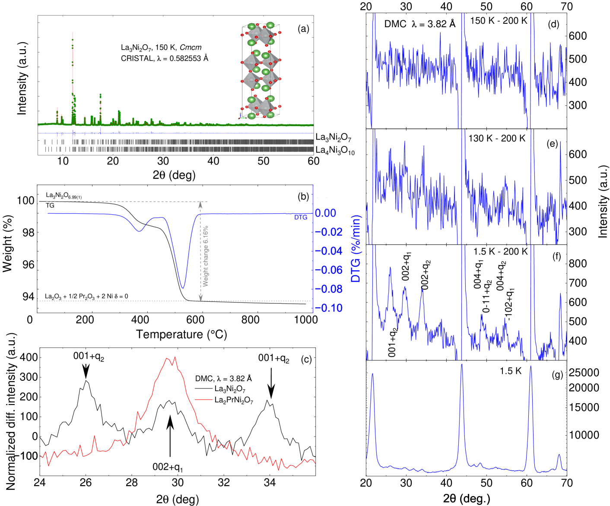
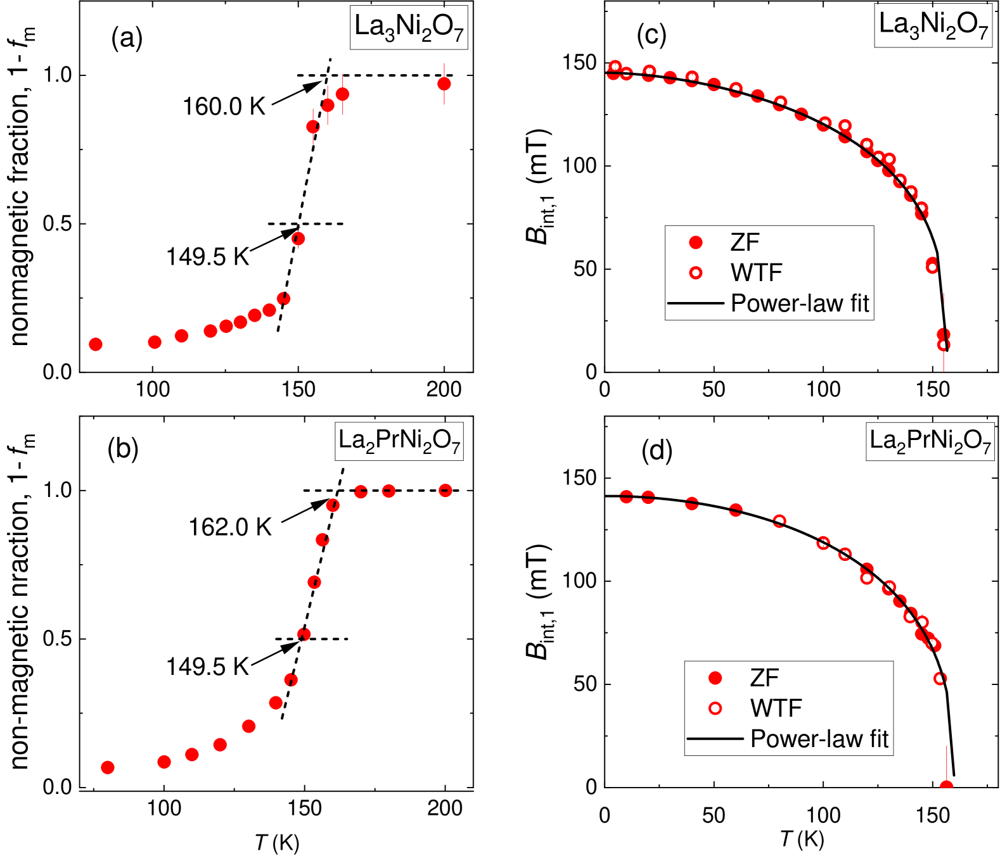
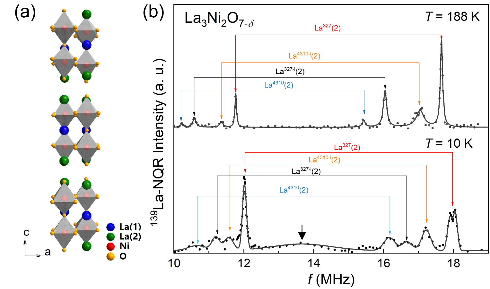
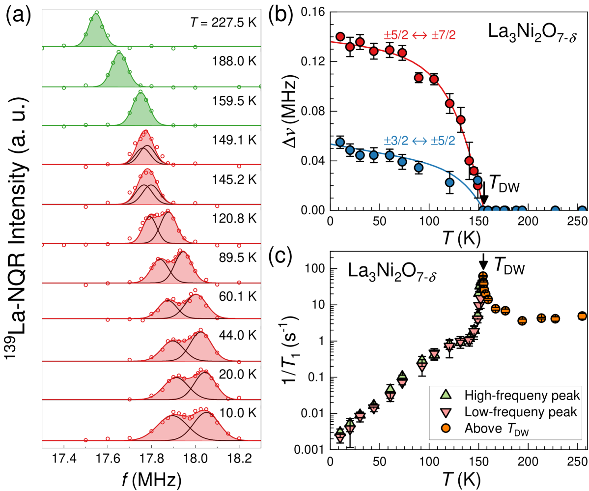

# 二層ニッケル酸塩 La₃Ni₂O₇ の磁性と超伝導機構—中性子散乱が照らす層間スピン秩序の全貌

- 執筆日：2026-05-19
- トピック：高圧超伝導体 La₃Ni₂O₇ の常圧磁性、スピン密度波の起源、ビルトバーガー磁気励起から探るペアリング機構
- タグ：Superconductivity and Strongly Correlated Systems / Spin Liquids and Quantum Many-Body Systems; Charge, Orbital, and Spin Order / Neutron Scattering
- 注目論文：[Nature of magnetism in bilayer nickelate La₃Ni₂O₇ single crystals (arXiv:2605.03448)](https://arxiv.org/abs/2605.03448)
- 参照論文数：8本

---

## 1. 背景：なぜ今この話題か

2023年5月、Sun らは La₃Ni₂O₇ 単結晶に 14 GPa 以上の高圧を印加することで転移温度 Tc ≈ 80 K の超伝導を発見し、世界に衝撃を与えた ([arXiv:2305.09586](https://arxiv.org/abs/2305.09586))。80 K という値は液体窒素温度（77 K）をわずかに上回り、ニッケル酸塩系が銅酸化物超伝導体に匹敵する高温超伝導の舞台になり得ることを初めて示した。ニッケル（Ni）は周期表上で銅（Cu）の隣に位置し、3d 電子を 1 つ少ない $d^8$ 配置に持つ。銅酸化物 CuO₂ 面に類似した NiO₂ 面を持つ無限層ニッケル酸塩では、2019 年から Tc ≈ 9–80 K の超伝導が断続的に報告されてきたが、La₃Ni₂O₇ は「二層 Ruddlesden–Popper 構造」という独自の結晶構造を持ち、より高い Tc を実現した点で際立っている。

さらに 2024–2025 年にかけて、基板の圧縮エピタキシャル歪みを利用した La₃Ni₂O₇ 薄膜において、常圧でも Tc ≈ 40 K 超の超伝導が観測されるという驚くべき知見が相次いで報告された。高圧実験と薄膜実験の両面から注目を集める La₃Ni₂O₇ だが、その超伝導発現機構—特にどのような磁気揺らぎがクーパー対を媒介するのか—は謎のままであった。その鍵を握るのが「常圧における磁気秩序の本質」であり、ここに中性子散乱実験が重要な役割を果たす。2026 年 5 月に公開された arXiv:2605.03448 は、La₃Ni₂O₇ 単結晶を用いた初めて本格的な弾性・非弾性中性子散乱実験の成果として、スピン秩序のベクトル・スピンギャップ・磁気励起の分散関係を明らかにし、磁気交換定数の全貌を示した点で分水嶺となる論文である。

*図1：La₃Ni₂O₇ の温度-圧力相図（[arXiv:2503.05287](https://arxiv.org/abs/2503.05287)、CC BY 4.0）。DW：密度波秩序、SC：超伝導相。常圧での SDW と高圧超伝導の位置関係が理解の核心である。*

---

## 2. 未解決問題は何か

### 2-1. スピン密度波の波数構造と磁気モーメント配置

La₃Ni₂O₇ は常圧で約 150 K 以下においてスピン密度波（SDW）秩序が生じることが複数の実験で示されてきた。しかしその磁気波数ベクトルは、試料依存性・酸素欠損 δ の違い・測定手法の違いから論文によって異なる報告が存在する。中性子回折研究 ([arXiv:2503.05287](https://arxiv.org/abs/2503.05287)) では La₃Ni₂O₇ において (qx, 1/2, 0)（qx = 0 および 1/2）の二成分的な SDW が見出され、同一層内で大きなモーメント（~0.66 μB）と小さなモーメント（~0.05–0.075 μB）が交互に並ぶストライプ構造が提案された。一方、第一原理計算 ([arXiv:2407.19213](https://arxiv.org/abs/2407.19213)) は酸素空孔量 δ によって磁気基底状態が変化し、δ = 0 では「二重スピンストライプ（DSS）」相が有利であるが、適度な δ では「スピン–電荷ストライプ（SCS）」混在状態になることを示した。一体となった SDW/CDW（電荷密度波）構造は ¹³⁹La-NQR 測定 ([arXiv:2501.11248](https://arxiv.org/abs/2501.11248)) においても、T_DW ≈ 153 K 以下で NQR 共鳴ピークの分裂として確認されており、銅酸化物の電荷秩序と類似した共鳴構造を示す（図3参照）。このように SDW の正確な波数・構造はいまだに一致した見解が得られていない。

本質的な問いは、磁気秩序の安定化が単純なネスティング（バンド構造の幾何学的特徴）によるものか、強い電子相関（Mott 物理）に起因するものか、という点である。後者の場合、局在的スピン描像で良い記述が得られ、前者では遍歴性の効果が本質的になる。弾性・非弾性中性子散乱は両方の描像を区別する上で最も直接的な情報を与える実験手法であり、今回の注目論文が重要な役割を果たす。

### 2-2. ペアリング対称性—s± 波か d 波か

電子相関と磁気揺らぎをどのように理論モデルに組み込むかによって、予測されるペアリング対称性が大きく変わる。多軌道 Hubbard モデルに基づいたランダム位相近似（RPA）計算 ([arXiv:2501.05254](https://arxiv.org/abs/2501.05254)) は非整合スピン揺らぎが相互作用し、相互作用パラメータの選択次第で dx²−y² 波と s± 波が僅差で競合することを示した。s± 波とは符号変化する s 波であり、フェルミ面の異なる部分でギャップが正負に反転する特殊な超伝導状態である。これは鉄系超伝導体でよく議論されるペアリングと同じ機構に類似する。一方、STM 実験では V 字形のクワジパーティクル特徴が観測され、d 波的なノードの存在を示唆するという見解も報告されている。ペアリング対称性が一義的に決まらない背景には、Ni の二つの 3d 軌道（dz² と dx²-y²）が超伝導に関与する多軌道効果がある。

この問いに答えるためには、磁気励起のスペクトルウェイトと波数ベクトルを精密に決定し、スピン揺らぎの「ボーススペクトル」と Cooper 対の結合定数の関係を定量的に評価する必要がある。注目論文が決定した交換積分の値は、この評価の出発点となる。

### 2-3. 軌道選択的物理と γ バンドの位置

DFT 計算では La₃Ni₂O₇ のフェルミ面に α、β、γ の三つのシートが存在する。しかし ARPES 実験 ([arXiv:2309.01148](https://arxiv.org/abs/2309.01148)) では、dz² 起源の γ バンドがフェルミ準位より約 50 meV 低い位置に沈んでいることが明らかになり、強相関効果による軌道選択的なスペクトル重みの再分配が示唆された。最近の理論研究 ([arXiv:2605.10101](https://arxiv.org/abs/2605.10101)) では、TDVP-CPT 法と大規模 DMRG 計算を用いて、電子相関が増大するにつれ dz² のスペクトル重みが系統的に減少し、γ バンドがフェルミ面下に沈み込み、残る α・β バンドに擬ギャップが開くことを示した。この軌道選択的なフェルミ面再構成が磁気秩序・超伝導とどう絡み合うのかは、未解決の核心問題である。

---

## 3. 注目論文の概説

### 研究目的・対象材料

arXiv:2605.03448（"Nature of magnetism in bilayer nickelate La₃Ni₂O₇ single crystals"）は、La₃Ni₂O₇ 単結晶を対象とした非弾性・弾性中性子散乱実験の報告である。従来の中性子研究の多くは粉末試料を使用していたため、磁気励起の異方性や k 空間内の詳細な分散を追跡することが困難であった。単結晶試料を用いることで三次元的なスピン励起の分散関係を初めて精密に決定することが、この研究の主目的である。

### 研究アプローチ

実験は高品質の La₃Ni₂O₇ 単結晶を用いた中性子非弾性散乱（INS, Inelastic Neutron Scattering）測定として行われた。中性子は電気的に中性であるため試料を深く透過でき、かつ磁気モーメントと直接相互作用する。エネルギー移行と運動量移行を同時に測定することで、スピン励起の分散関係 ω(q) を直接追跡できる。実験は基底 Q = (0, 0.5, 2.5) 付近を中心に、面内・面外方向に系統的にスキャンすることで行われた。

### 主要結果

中性子非弾性散乱スペクトルには、Q = (0, 0.5, 2.5) を中心としたよく定義されたスピン励起が観測された。このピークの最も重要な特徴は以下の通りである。

まず、**スピンギャップ**として約 5 meV のエネルギーギャップが存在することが確認された。これは絶対ゼロ度においても最低エネルギーの磁気励起が 5 meV 以上のエネルギーを持つことを意味し、系の磁気秩序が単純な等方的ハイゼンベルク磁性ではなく、単一軸磁気異方性あるいは層間結合に起因するギャップを持つことを示す。

次に、面内方向の**異方的な分散**が見出された。長手方向（qx 方向）と横断方向（qy 方向）で励起の硬さが異なり、特に横断方向のゾーン境界付近での**ソフトニング（軟化）** が観測された。これは横断方向の交換相互作用が何らかの競合（フラストレーション）を受けていることを示す。SDW の波数が隣接する Ni サイト間の次近接相互作用（J2）によって競合的に決まる描像と整合する。

さらに、面外方向（c 軸方向）においてスピン励起の強度変調が二層の周期で観測された。これは層間（二層内の上下 NiO₂ 面間）の反強磁性的な交換相互作用 J_perp が存在することの直接証拠であり、La₃Ni₂O₇ の二層構造が磁性において本質的な役割を果たすことを示す。

*図2：La₃Ni₂O₇ の中性子粉末回折差分スペクトルと磁気構造モデルのリートフェルトフィッティング（[arXiv:2503.05287](https://arxiv.org/abs/2503.05287)、CC BY 4.0）。低温（1.5 K）と高温（200 K）のスペクトル差から磁気ピークが抽出される。*

### データ解析と磁気モデル

実験で得られた分散曲線は、「二層ハイゼンベルクモデル」で記述された。このモデルは層内第一近接交換 J1、層内第二近接交換 J2、そして層間交換 J_perp の三つのパラメータを持つ。フィッティングにより、J_perp が J1 に比べて有意に大きい（J_perp > J1）ことが定量的に示された。これは、Ni 原子のアピカル酸素（頂点酸素）を介した二層間の超交換相互作用が系の磁性を強く支配していることを意味する。La₃Ni₂O₇ の構造上、二層内の二つの NiO₂ 面の間には共有するアピカル酸素が存在し、この経路を介した Ni–O–Ni の超交換相互作用が強い層間結合を生む。

### 論文の新規性と限界

新規性は、単結晶試料の INS による磁気励起分散の初めての定量決定にある。ゾーン境界でのソフトニングという微細な特徴は、粉末 INS では埋もれてしまう。また、二層内の面外変調から J_perp を直接抽出できた点は、磁気モデルの定量評価に重要である。一方で、限界として磁気モーメントの絶対値や秩序化の体積分率については議論が残る。また、SDW/CDW 競合の微視的起源（軌道選択的 Mott 物理 vs バンドネスティング）についての決定打は、この実験のみでは出し難い。

---

## 4. 研究史における位置づけ

La₃Ni₂O₇ 超伝導の研究は 2023 年 5 月の Sun らの発見論文 ([arXiv:2305.09586](https://arxiv.org/abs/2305.09586)) を原点とする。この論文は高圧下 14 GPa 超で電気抵抗のゼロ化と磁気応答の反磁性化を同時に確認し、Tc ≈ 80 K という高温超伝導の実証として世界の耳目を集めた。DFT 計算によれば、高圧下では Amam から Fmmm へ結晶構造が転移し、Ni の dz² 軌道とアピカル酸素の 2p 軌道が強く混成するシグマ結合バンドがフェルミ準位近傍に現れる。この σ バンドの金属化が超伝導の発現と同期するとされ、層間結合の役割が早期から注目された。

常圧での電子構造については ARPES 実験 ([arXiv:2309.01148](https://arxiv.org/abs/2309.01148)) が最初の詳細な情報を提供した。この実験では 18 K での高分解能測定により、フェルミ面に二枚のシート（α 面・β 面）が明確に観測され、dz² 起源の平坦バンドがゾーンコーナー付近のフェルミ面より約 50 meV 下に位置することが判明した。dz² バンドの電子相関は dx²−y² バンドより格段に強く、軌道依存の有効質量増大（大きな繰り込み因子）が示された。この実験結果は、単純な DFT バンド計算（三枚のフェルミ面シートを予言）との乖離として認識され、電子相関の重要性を示す先駆的な証拠となった。

磁性の側面では 2024 年以降に複数の観測が相次いだ。中性子回折・muSR 研究 ([arXiv:2503.05287](https://arxiv.org/abs/2503.05287)) は粉末試料で SDW の磁気構造を解析し、(qx, 1/2, 0) に SDW のブラッグピークを見出した。 ¹³⁹La-NQR 実験 ([arXiv:2501.11248](https://arxiv.org/abs/2501.11248)) は T_DW ≈ 153 K での密度波転移を微視的に捉え、NQR ライン分裂が電荷変調に対応することを示した。これらの実験は 2605.03448 が示す INS データの解釈基盤となる。

一方、理論の側では多軌道ハバードモデルを使った RPA 計算 ([arXiv:2501.05254](https://arxiv.org/abs/2501.05254)) が、La₃Ni₂O₇ の磁気揺らぎに非整合成分が混在し、相互作用パラメータに応じて d 波と s± 波が競合することを明らかにした。さらに TDVP-CPT + DMRG 手法 ([arXiv:2605.10101](https://arxiv.org/abs/2605.10101)) は、強相関極限での軌道選択的なフェルミ面再構成を理論的に再現し、2309.01148 の ARPES 結果を強相関物理の文脈で解釈する枠組みを与えた。注目論文 2605.03448 は、これらの実験・理論が出揃った上で、単結晶 INS という最も直接的な手法で磁気励起の全体像を与え、磁気交換積分を決定することで理論比較の定量的な基準点を提供するものである。

---

## 5. どの解釈が最も妥当か

### 磁気秩序の起源—局在スピンか遍歴電子か

スピンギャップ約 5 meV と二層ハイゼンベルクモデルへの良いフィッティングは、少なくとも秩序相では局在的なスピン描像がある程度有効であることを示す。J_perp が J1 を上回る値を持つという結果は、Ni–O–Ni 超交換経路の理論評価と定性的に一致する。しかし SDW の小さな磁気モーメント（~0.05–0.66 μB という広い分布）と電荷変調の同時存在は、純粋な局在スピン描像では説明しにくい。SDW が遍歴電子のフェルミ面ネスティングに起源を持つ場合、磁気モーメントはバンド構造の性質（ネスティングの程度）で決まり、強い軌道依存性が生じる可能性がある。DFT 計算 ([arXiv:2407.19213](https://arxiv.org/abs/2407.19213)) が示したように、酸素欠損 δ が SDW の安定性に大きく影響することも、単純な局在スピン描像を越えた複雑な電子構造の関与を示唆する。

### ペアリング機構の候補

注目論文 2605.03448 が決定した磁気交換積分は、超伝導ペアリングのボーススペクトルを見積もる上で重要な入力となる。J_perp が大きいという事実は、層間を介したスピン揺らぎ—すなわち、高圧下で強調されるアピカル酸素経由の σ 結合的なスピン揺らぎ—が Cooper 対形成に寄与する可能性を示唆する。これは s± 波ペアリングと整合的であり、二層内の異なる NiO₂ 面が反強磁性的に結合している構造が、ギャップ関数の符号反転を自然に生み出す。一方で横断方向のゾーン境界ソフトニングは、面内のフラストレーションを示唆し、これは非整合スピン揺らぎ ([arXiv:2501.05254](https://arxiv.org/abs/2501.05254)) の起源となりうる。非整合揺らぎは d 波的なペアリングとより整合しやすい傾向があるため、この観測は d 波支持の証拠とも解釈できる。

現時点で最も整合的な解釈の一つは次のようなものである。常圧では J_perp 主導の層間 AF 相関が SDW を安定化させる。高圧下では dz² バンドが圧力により広がり（帯域幅増大）、SDW が抑制されるとともに、J_perp に対応する層間スピン揺らぎが Cooper 対形成の媒介子として機能し、s± 型超伝導が発現する。この描像は RPA 計算 ([arXiv:2501.05254](https://arxiv.org/abs/2501.05254)) および DFT 原点の解析 ([arXiv:2305.09586](https://arxiv.org/abs/2305.09586)) とも整合的であり、現状で最も支持を集めているシナリオに近い。

### まだ弱い結論と今後必要な検証

ただし、以下の点は現状では不確定である。(1) 磁気秩序が超伝導と共存するのか、それとも相互抑制し合うのか（相図が未確定）。(2) 薄膜での常圧超伝導において磁気揺らぎが同様に機能するかどうか。(3) 軌道選択的フェルミ面再構成 ([arXiv:2605.10101](https://arxiv.org/abs/2605.10101)) が磁気交換積分に与える定量的影響。これらを解決するには、高圧下での INS 実験、薄膜試料での磁気測定（ミュオンスピン回転等）、そして超伝導状態での共鳴非弾性 X 線散乱（RIXS）や非弾性中性子散乱が必要である。

---

## 6. 何が一般化できるか

### 銅酸化物との比較

La₃Ni₂O₇ は銅酸化物（CuO₂ 面を持つ強相関超伝導体）との類似性でしばしば議論される。銅酸化物では親物質の AF 絶縁体をキャリアドーピングで超伝導へ持ち込む描像が確立しているが、La₃Ni₂O₇ は圧力で超伝導が誘起され、ドーピングによる化学的制御はまだ限定的である。また Ni の $d^8$ 配置（Cu は $d^9$）によって二軌道（dz² と dx²-y²）が両方がフェルミ準位近傍に現れる点が本質的に異なる。銅酸化物の一軌道的 Hubbard モデルと異なり、二軌道効果・層間結合・軌道選択的 Mott 物理が絡み合う複雑さが、ニッケル酸塩の特徴であり、かつ難しさでもある。

### 高次 Ruddlesden–Popper 相への接続

La₄Ni₃O₁₀（三層 RP 相）も高圧下で Tc ≈ 30 K の超伝導を示すことが報告されており、SDW・CDW 秩序が La₃Ni₂O₇ と類似した温度スケールで観測されている。層数の増加に伴う超伝導の発展・磁気秩序との競合は、RP 系全体の普遍的な設計原理を探る上で重要な比較軸となる。本注目論文が決定した二層系の磁気交換定数は、三層・一層系との体系的比較の基準点となりうる。

### 薄膜・デバイス応用への示唆

常圧薄膜超伝導の発現において、La₃Ni₂O₇/SrLaAlO₄ 界面の圧縮歪みが Tc を向上させるという観測は、エピタキシャル歪みによる層間結合の調整（格子定数 c 軸の変化による J_perp の変化）が超伝導の制御に有効であることを示唆する。注目論文 2605.03448 が示した J_perp の大きさは、歪み変調がどの程度 J_perp を変化させうるかを見積もる設計指針となりうる。将来的には電界効果による電子数チューニングと磁性制御の組み合わせが、ニッケル酸塩デバイスの可能性を広げると期待される。

---

## 7. 基礎から理解する

### 7-1. Ruddlesden–Popper 構造とは

La₃Ni₂O₇ の名称に含まれる「2」と「7」のそれぞれの意味から始めよう。この化合物は「二層 Ruddlesden–Popper（RP）構造」を持つペロブスカイト関連酸化物である。一般式 A_{n+1}B_nO_{3n+1} で表されるこの構造族では、n 枚の BO₂ 面が積み重なった「ペロブスカイトブロック」が、AO 岩塩層で分離されて c 軸方向に周期的に繰り返す。La₃Ni₂O₇ は n = 2 の場合であり、二枚の NiO₂ 面（Ni–O 正方格子）が二層ブロックをなし、その間に La₂O₂ 岩塩層が挿入された構造をとる（二層が一つのユニットセルを構成）。

特に注意すべきは「アピカル酸素」と呼ばれる酸素原子の存在である。NiO₂ 面内の酸素（面内酸素）と区別して、Ni–O 正八面体の頂点に位置する酸素をアピカル酸素と呼ぶ。二層 RP 構造では、二枚の NiO₂ 面の間に位置するアピカル酸素が二枚の面を橋渡しする形で共有される。これが Ni–O–Ni の超交換経路を通じた層間磁気結合（J_perp）の主な担い手であり、本論文の中心的な物理に直結している。

*図3：(左) La₃Ni₂O₇ の二層 Ruddlesden–Popper 結晶構造。二枚の NiO₂ 面を層間アピカル酸素が橋渡しする。(右) ¹³⁹La-NQR スペクトル：188 K（高温）では単一ピーク、10 K（低温）ではピーク分裂が観測され、CDW 秩序の発生を示す。（[arXiv:2501.11248](https://arxiv.org/abs/2501.11248)、CC BY 4.0）*

ペロブスカイト構造の単位格子は一般に立方体に近いが、RP 構造ではブロック間に岩塩層が入ることで c 軸が長くなり、正方対称性（または斜方対称性）になる。常圧の La₃Ni₂O₇ では Amam 空間群の斜方晶が安定であるが、14 GPa 以上の高圧下では Fmmm 空間群への構造転移が起こり、これと同時に超伝導が出現する。この構造転移でアピカル酸素の位置が変化し、層間 Ni–O–Ni の角度が変化することが、電子構造と磁気結合に劇的な影響を与えると考えられている。

### 7-2. Ni 3d 軌道の役割

La₃Ni₂O₇ では Ni は+2 価（希に+3 価と混合）の状態をとり、$3d^{7.5}$ 程度の平均 d 電子数に対応する。正八面体配位の結晶場により、Ni 3d 軌道は 2 重縮退の eg 軌道（dz² と dx²-y²）と 3 重縮退の t2g 軌道（dxy、dxz、dyz）に分裂する。t2g 軌道は 6 個の電子を収容するが（ほぼ充満）、eg 軌道に残る電子がフェルミ準位近傍の物理を支配する。

NiO₂ 面内で Ni の dx²-y² 軌道は隣接酸素の 2p 軌道と強く重複（pdσ 混成）し、面内のバンド幅が大きい（遍歴的）。一方、dz² 軌道はアピカル酸素の 2p 軌道と混成する。二層 RP 構造の場合、層内のアピカル酸素は「外側」（岩塩層側）と「内側」（二層間）の二種類があり、内側のアピカル酸素が dz² 軌道の層間ホッピング（t_perp）を可能にする。このホッピングによって上下の dz² バンドがボンディング・アンチボンディングに分裂し、ボンディングバンドがフェルミ準位近傍に現れる。

ARPES ([arXiv:2309.01148](https://arxiv.org/abs/2309.01148)) が示したように、常圧では dz² 起源のバンドはフェルミ準位より約 50 meV 低い位置に沈み込んでいる。これは電子相関（Hubbard U）が dz² バンドの有効質量を大きく増大させ、バンド幅を圧縮した結果である。高圧では格子が押しつぶされ、t_perp が増大してバンド幅が広がり、dz² バンドがフェルミ準位を再び横切る。この「圧力誘起の軌道選択的金属化」が超伝導の発現と密接に関連しているという理解が、現在の標準的なシナリオである。

### 7-3. 中性子散乱の基礎

中性子は電荷を持たず、核力で原子核と相互作用するとともに、磁気モーメント（中性子スピン）によって磁気的に物質の磁気モーメント（電子スピン）と相互作用する。この磁気的な中性子-電子相互作用が、固体中のスピン構造とスピン励起を直接観測する手段となる。

弾性中性子散乱では、スピン密度波の超格子ピーク位置から磁気ブラッグベクトル Q を決定できる。非弾性中性子散乱（INS）では、入射中性子と散乱中性子のエネルギー差 ΔE と運動量差 Δk から、エネルギー ω および波数ベクトル q での動的磁化率 S(q, ω) を測定できる。

$$S(\mathbf{q}, \omega) = \frac{1}{2\pi} \int_{-\infty}^{\infty} dt \, e^{i\omega t} \sum_{ij} e^{i\mathbf{q}\cdot(\mathbf{R}_i - \mathbf{R}_j)} \langle S_i(t) S_j(0) \rangle$$

ここで $S_i(t)$ は格子点 i でのスピン演算子、$\mathbf{R}_i$ は格子点の位置ベクトルである。スピン励起のエネルギー-波数関係（分散曲線）を追跡することで、磁気交換相互作用の強さとその異方性を定量的に決定できる。

ハイゼンベルクモデル $H = \sum_{ij} J_{ij} \mathbf{S}_i \cdot \mathbf{S}_j$ の場合、スピン波（マグノン）の分散は

$$\omega(\mathbf{q}) = 2S \sqrt{[J(\mathbf{q}=0) - J(\mathbf{q})] [J(\mathbf{q}=0) - J(\mathbf{q} + \mathbf{Q}_{AF})]}$$

のような形で与えられる（単純化した表式）。ここで $J(\mathbf{q}) = \sum_j J_{ij} e^{i\mathbf{q}\cdot(\mathbf{R}_i-\mathbf{R}_j)}$ はフーリエ変換された交換積分であり、その q 依存性の形から各経路の J を抽出できる。

単結晶試料での INS は k 空間を系統的にスキャンできるため、粉末 INS に比べて分散関係の異方性を精密に決定できる。特に本論文でいう「面内異方性」（qx 方向と qy 方向で励起の硬さが異なる）は、単結晶でなければ区別できない情報である。

*図4：¹³⁹La-NQR スペクトルの温度依存性（[arXiv:2501.11248](https://arxiv.org/abs/2501.11248)、CC BY 4.0）。T_DW ≈ 153 K 以下で明確なピーク分裂が観測される。*

### 7-4. スピン密度波の基礎

スピン密度波（SDW）は固体中のスピン（磁気モーメント）が波数ベクトル Q で変調した状態であり、位置 r でのスピン密度が $m(\mathbf{r}) = m_0 \cos(\mathbf{Q} \cdot \mathbf{r} + \phi)$ のように振動する。この状態は反強磁性秩序の一形態であるが、整合 SDW（Q が逆格子の有理数倍）と非整合 SDW（Q が無理数倍）に分類され、後者では磁気構造が格子と公約数を持たない不整合な周期を示す。

SDW の形成機構には二つの主要な描像がある。一つは遍歴電子系でのフェルミ面ネスティングであり、フェルミ面の二枚のシートがベクトル Q の平行移動で良く重なる（ネスティングが良い）場合に、Q で変調したスピン感受率が発散し SDW が不安定化される。もう一つは局在スピン系でのスーパーエクスチェンジであり、局在的なスピンが隣接原子軌道を介した交換相互作用でフラストレーションを持って整列する場合に SDW が生じる。La₃Ni₂O₇ では両方の寄与が混在していると考えられており、その分離が未解決問題の一つである。

SDW は電荷密度波（CDW, Charge Density Wave）と同時に発生することが多い。これは軌道充填の変調が格子ひずみ（フォノンの結合）を誘起し、スピン・電荷・格子が連立して秩序化するためであり、La₃Ni₂O₇ での ¹³⁹La-NQR 実験 ([arXiv:2501.11248](https://arxiv.org/abs/2501.11248)) はこの CDW 共存を支持する証拠を示している。

---

## 8. 専門用語の解説

**Ruddlesden–Popper (RP) 構造**：ペロブスカイト ABO₃ のブロックを岩塩 AO 層で仕切った積層構造体。一般式 A_{n+1}B_nO_{3n+1} で表され、n = 1 が Sr₂RuO₄ など、n = 2 が La₃Ni₂O₇ に相当する。n が大きいほどペロブスカイトに近い二次元性の弱い構造となる。本論文では二層（n = 2）の RP 構造が材料の磁性と超伝導の根拠となる。

**超交換相互作用（Superexchange）**：局在した d 電子（スピン）どうしが、中間の酸素の 2p 軌道を仮想的な移動経路（バーチャルホッピング）として利用することで生じる磁気交換相互作用。Ni–O–Ni の結合角が 180° に近いほど強い反強磁性的超交換が生じる（Goodenough–Kanamori 則）。La₃Ni₂O₇ では層間アピカル酸素を介した Ni–O–Ni 経路が J_perp の起源であり、この値が大きいことが本論文の主要発見の一つ。

**スピン密度波（SDW）**：固体中のスピン密度が実空間で正弦波的に変調した状態。波数ベクトル Q で特徴づけられる反強磁性的な秩序の一形態。電荷密度波（CDW）と同時に出現することも多い。La₃Ni₂O₇ では T_DW ≈ 150 K 以下でこの SDW が観測され、高圧超伝導との競合・共存が議論されている。

**磁気励起分散（Magnon dispersion）**：磁気秩序体のスピン波（マグノン）が持つエネルギーと波数の関係 ω(q)。非弾性中性子散乱で直接測定できる。分散の形から磁気交換定数（J の値と異方性）が決定でき、磁気モデルを定量的に検証できる。本論文では面内方向の異方的分散と横断方向のゾーン境界ソフトニングが新たに明らかにされた。

**スピンギャップ**：磁気励起のエネルギースペクトルにおける最低エネルギーギャップ。等方的ハイゼンベルク磁性体ではゴールドストーンモードが k=0 で ω→0 となるが、単軸磁気異方性・層間結合・量子効果などによってギャップが開く。La₃Ni₂O₇ では約 5 meV のギャップが観測され、強い層間反強磁性結合に起因すると解釈される。

**軌道選択的Mott絶縁体（Orbital-selective Mott state）**：多軌道系において、電子相関によって一部の軌道が局在化（Mott 絶縁体的）し、他の軌道が遍歴的な金属状態を保つ状態。La₃Ni₂O₇ では ARPES で dz² バンドがフェルミ面下に沈み込む現象が観測され、軌道選択的な有効質量増大と解釈される。理論研究 ([arXiv:2605.10101](https://arxiv.org/abs/2605.10101)) は強相関効果でこの現象を再現した。

**s± 波超伝導**：超伝導ギャップが符号を変える（多バンドの異なるフェルミ面シートで符号が反転する）s 波型超伝導。鉄系超伝導体で標準的な描像であり、スピン揺らぎが Cooper 対の媒介子となる機構で自然に現れる。La₃Ni₂O₇ では二枚の NiO₂ 面間の反強磁性結合が s± 型ギャップ関数の符号反転を支持する物理的起源となる候補。

**ネスティング（Fermi surface nesting）**：フェルミ面の一部が波数ベクトル Q の平行移動によって別のフェルミ面と良く重なる幾何学的特徴。電子感受率（susceptibility）を χ(q) とすると、ネスティング波数 Q 付近で χ(Q) が増大し、SDW や CDW などの密度波不安定性の駆動力となる。La₃Ni₂O₇ の SDW の波数との対応については、第一原理計算と中性子散乱の整合性が検証中である。

**動的磁化率（Dynamic susceptibility） S(q, ω)**：スピン-スピン相関関数のフーリエ変換であり、固体のスピン励起スペクトルを記述する。非弾性中性子散乱強度は S(q, ω) に比例する。超伝導体のペアリングがスピン揺らぎで媒介される場合、S(q, ω) のスペクトル重みが Cooper 対の引力の強さを決める「ボーススペクトル」として機能する。

**¹³⁹La-NQR（核四重極共鳴）**：核四重極モーメントを持つ核（ここでは ¹³⁹La）が、電場勾配（EFG）と相互作用して分裂した核エネルギー準位間の共鳴を測定する技術。局所的な電荷対称性の変化（電場勾配の変調）に敏感であり、電荷密度波の形成を粉末試料でも微視的に検出できる。本トピックでは T_DW ≈ 153 K での NQR ラインの分裂が SDW/CDW の電荷変調を示す直接証拠として用いられた。

---

## 9. 将来展望

本研究が明らかにした「J_perp > J1」という磁気交換定数の大小関係は、La₃Ni₂O₇ の超伝導機構を理解する上でかなり確からしいテーゼを提供した。層間結合の強さが磁性・超伝導の両方において中心的な役割を果たすというシナリオは、高圧での dz² バンドの金属化（σ 結合の活性化）という構造変化と整合し、現在最も支持される「層間結合主導の超伝導」像に定量的な根拠を与えるものである。また横断方向のゾーン境界ソフトニングから示唆される面内のスピンフラストレーションも、非整合 SDW の波数選択において重要な役割を果たすと考えられ、今後の高精度中性子散乱・X線磁気散乱での検証が期待される。

一方、まだ未確定な問いも多い。超伝導相の「内部」でスピン励起がどのように変化するか—特に共鳴磁気励起（スピン共鳴ピーク）が超伝導ギャップ以下のエネルギーで現れるかどうか—は、ペアリング対称性の決定的な証拠となりうるが、高圧 INS 実験は技術的に非常に難しい。薄膜試料での磁気揺らぎが高圧単結晶と同様であるかどうかも、常圧超伝導の機構理解において未解決のままである。また CDW との共存・競合の詳細な相図—温度・圧力・キャリア濃度の三次元空間でのマッピング—は今後の大きな課題として残っている。

今後最も重要になる実験は三方面からのアプローチである。一つ目は、高圧 INS または共鳴非弾性 X 線散乱（RIXS）による超伝導ギャップ以下のスピン共鳴ピーク探索であり、s± 波と d 波の区別に決定的な情報を提供する可能性がある。二つ目は、異なる歪みをかけた薄膜 La₃Ni₂O₇ でのミュオンスピン回転（μSR）実験であり、歪み−J_perp−Tc の定量的な相関を明らかにする。三つ目は、DMFT など強相関第一原理計算と本論文の磁気交換定数を入力として用いた定量的ペアリング計算であり、理論・実験の定量的な橋渡しを実現することで、高温超伝導体の設計指針を明確化することが期待される。

---

## 参考論文一覧

1. [arXiv:2605.03448](https://arxiv.org/abs/2605.03448) — **【注目論文】** Nature of magnetism in bilayer nickelate La₃Ni₂O₇ single crystals（2026）：単結晶 La₃Ni₂O₇ に対する非弾性中性子散乱により、~5 meV のスピンギャップと異方的分散・層間反強磁性結合を明らかにし、二層ハイゼンベルクモデルの交換定数を定量決定した実験論文。

2. [arXiv:2305.09586](https://arxiv.org/abs/2305.09586) — Superconductivity near 80 Kelvin in single crystals of La₃Ni₂O₇ under pressure（2023）：高圧下 14 GPa 超での Tc ≈ 80 K 超伝導を La₃Ni₂O₇ 単結晶で初めて実証した分野の発端論文。

3. [arXiv:2503.05287](https://arxiv.org/abs/2503.05287) — Unraveling Spin Density Wave Order in Layered Nickelates La₃Ni₂O₇ and La₂PrNi₂O₇ via Neutron Diffraction（2025）：中性子粉末回折と muSR により La₃Ni₂O₇ の SDW 磁気構造（波数・モーメント配置）を解明した実験論文。

4. [arXiv:2407.19213](https://arxiv.org/abs/2407.19213) — Spin density wave in the bilayered nickelate La₃Ni₂O₇₋δ at ambient pressure（2024）：第一原理 DFT 計算により、酸素空孔 δ 依存の磁気基底状態（DSS から SCS・スピングラスまで）の相図を示した理論論文。

5. [arXiv:2501.11248](https://arxiv.org/abs/2501.11248) — Microscopic evidence of charge- and spin-density waves in La₃Ni₂O₇₋δ revealed by ¹³⁹La-NQR（2025）：¹³⁹La-NQR 測定により T_DW ≈ 153 K での電荷変調（CDW）と SDW の共存を微視的に捉えた実験論文。

6. [arXiv:2605.10101](https://arxiv.org/abs/2605.10101) — Correlation-Driven Orbital-Selective Fermiology and Superconductivity in the Bilayer Nickelate La₃Ni₂O₇（2026）：TDVP-CPT および DMRG 計算で強相関による軌道選択的フェルミ面再構成（dz² の枯渇・γ バンドの沈み込み）を理論的に示した論文。

7. [arXiv:2309.01148](https://arxiv.org/abs/2309.01148) — Orbital-Dependent Electron Correlation in Double-Layer Nickelate La₃Ni₂O₇（2023）：高分解能 ARPES により Ni dz² 起源の平坦バンドとその強い電子相関を初めて実験的に示し、常圧でのフェルミ面の軌道依存性を解明した論文。

8. [arXiv:2501.05254](https://arxiv.org/abs/2501.05254) — Incommensurate spin fluctuations and competing pairing symmetries in La₃Ni₂O₇（2025）：多軌道 Hubbard モデル＋RPA で非整合スピン揺らぎを解析し、d 波と s± 波が僅差で競合することを示した理論論文。
