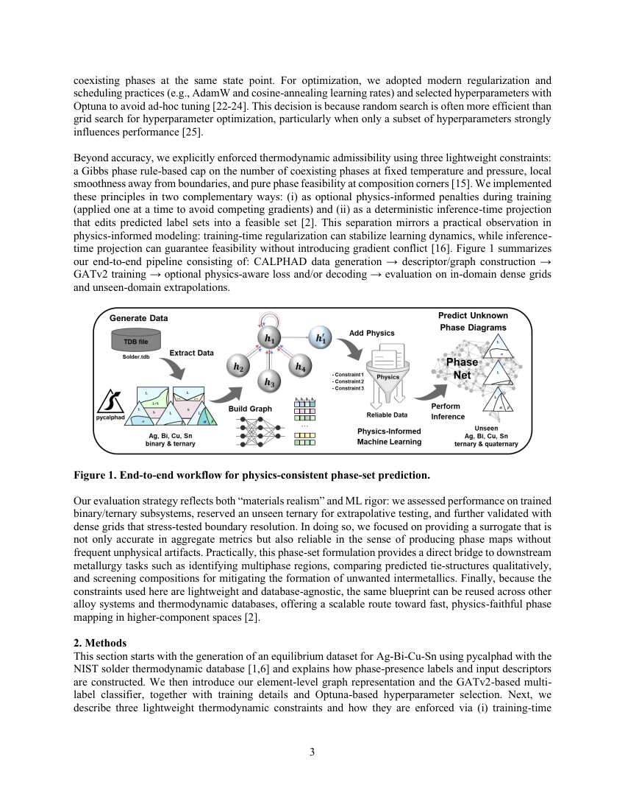
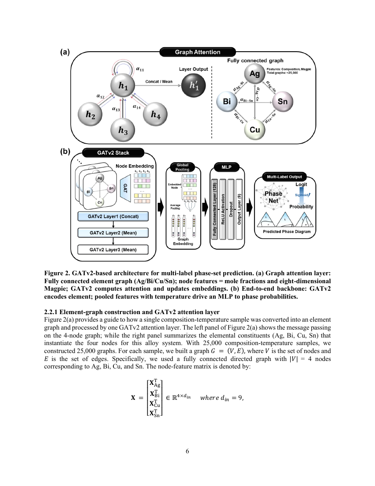
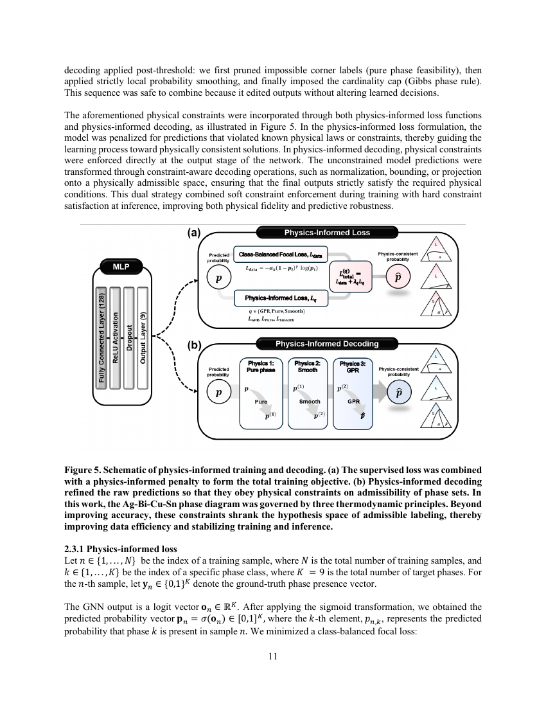
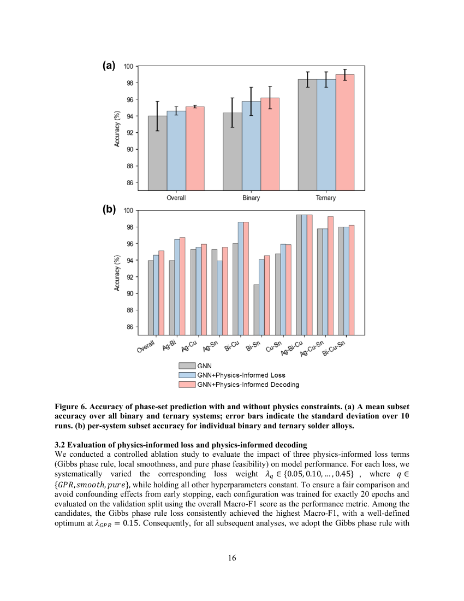
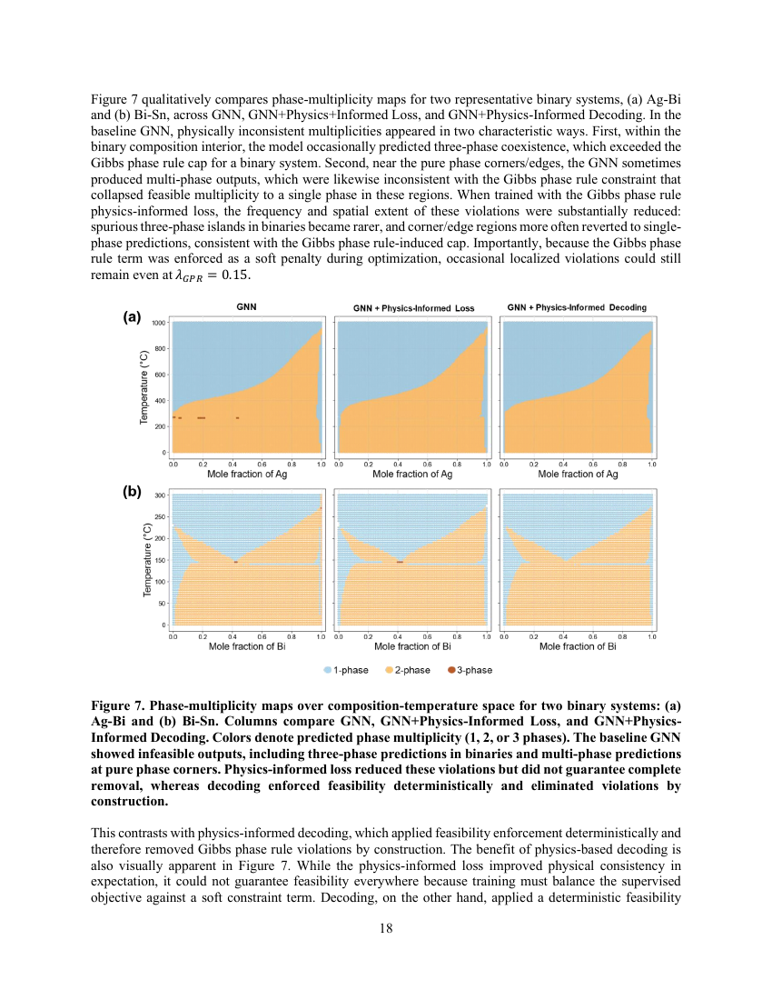
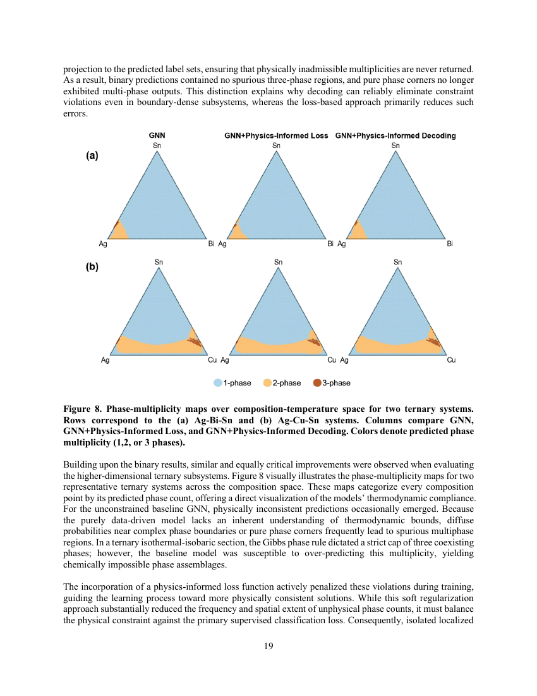
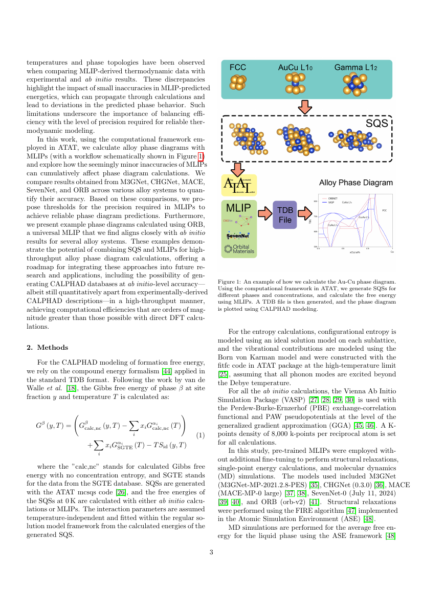

# 多成分合金の相図予測に物理制約付きグラフアテンションネットワークを適用する

- 執筆日: 2026-05-19
- トピック: 組成・温度空間における合金相平衡の機械学習代理モデル構築と物理的整合性の確保
- タグ: Computation and Theory / Phase Transitions; Bulk Alloys / Machine Learning
- 注目論文: [Multi-Label Phase Diagram Prediction in Complex Alloys via Physics-Informed Graph Attention Networks](https://arxiv.org/abs/2604.16468) (arXiv:2604.16468, 2026年4月)
- 参照論文数: 7

---

## 1. 背景：なぜ今この話題か

合金材料の設計において、どの温度・組成条件でどの結晶相が安定に共存するかを示す「相図（phase diagram）」は、製造プロセスの設計から材料特性の予測まで、あらゆる判断の基盤となる情報である。合金を熱処理すると何が起こるか、どの組成を選べば単相固溶体になるか、どこに有害な金属間化合物が現れるか——これらすべては相図を読むことで初めて議論できる。

相図を計算する標準的なアプローチとして、1970年代から発展してきた CALPHAD 法（CALculation of PHAse Diagrams）がある。CALPHAD は各相のギブス自由エネルギーを半経験的な解析関数で表し、異なる相のギブスエネルギーが交差する条件から平衡相の組み合わせを決定する。現代の CALPHAD データベースは数十元素系をカバーし、商用ソフトウェア（Thermo-Calc, Pandat など）として合金設計の現場に欠かせないツールとなっている。

ところが、この CALPHAD 計算には本質的な計算コスト上の問題がある。4元素系合金（四元系）の相図を高分解能でマッピングするには、組成（4次元の組成空間）と温度を組み合わせた膨大なグリッド点のそれぞれについて、Gibbs 自由エネルギーの最小化問題（平衡計算）を繰り返し解く必要がある。計算1点あたりの時間は短くても、完全なマッピングには数百万点以上の計算が必要になり、特にスクリーニングや逆設計への応用では実用上の大きなボトルネックとなる。

一方、近年の機械学習の進展は材料科学に大きな変革をもたらしている。グラフニューラルネットワーク（GNN）を用いた結晶構造の性質予測は急速に成熟し、機械学習原子間ポテンシャル（MLIP）は第一原理計算に匹敵する精度を桁違いの速度で実現しつつある。こうした流れの中で、「CALPHAD 計算そのものを機械学習の代理モデルに置き換えることはできないか」という発想が自然に生まれてきた。

しかし、単純にデータを学習させるだけでは、熱力学が要求する物理的整合性——ギブスの相律に基づく相数の制限や、隣接組成での相集合の連続性——が保証されない。機械学習モデルが自由に予測を行うと、物理的にあり得ない相の組み合わせを出力してしまうことがある。この問題に正面から向き合い、物理則を制約として組み込んだグラフアテンションネットワーク（Graph Attention Network, GAT）による相図予測を提案した論文が、本記事の核となる arXiv:2604.16468 である。

この研究は、はんだ合金として広く用いられる Ag-Bi-Cu-Sn 四元系を対象に、約2万5千点の CALPHAD 計算データから GNN を訓練し、従来では計算コストの壁に阻まれていた高分解能・全域相図マッピングを高速に実現する代理モデルを構築した。さらに、ギブスの相律を含む複数の物理的制約を損失関数または推論後処理として導入することで、物理的に意味のある予測を保証している。

---

## 2. 未解決問題は何か

### 多成分組成空間の次元の呪い

CALPHAD の計算コスト問題は、次元数とともに指数的に悪化する。2元系（A-B）なら組成軸は1次元、3元系は2次元の三角図で表せるが、4元系では組成空間が3次元の超四面体になる。そこに温度軸が加わると4次元以上の空間を探索することになる。高エントロピー合金（HEA）のような5〜7元素系では事態はさらに深刻で、全域マッピングは事実上不可能だった。この「次元の呪い（curse of dimensionality）」は、合金設計における計算スクリーニングの根本的な障壁となっている。

解決の方向性としては、サロゲートモデル（代理モデル）を構築し、少数の CALPHAD 計算点から組成-温度空間全体を内挿・外挿する手法が有望視されている。ただし代理モデルの精度と汎化性能をどう保証するかは依然として未解決である。特に、訓練データのない領域（例えば四元系）への外挿は困難で、単純なニューラルネットワークでは物理的に不合理な予測をしばしば出力する。

### 多ラベル分類としての相予測問題の固有の難しさ

合金の相平衡を機械学習で予測するとき、問題設定そのものに構造的な困難がある。1点の組成・温度条件に対して共存する相は1つとは限らず、ギブスの相律が許す範囲で複数相が共存する。これは「多ラベル分類（multi-label classification）」問題として定式化されるが、ラベル間に強い相関（共存条件）があり、単純な独立多ラベル分類が成り立たない。たとえばギブスの相律 $F = C - P + 2$（$F$: 自由度、$C$: 成分数、$P$: 相数）は、4成分系1気圧下では最大5相が共存できることを示すが、任意の数の相が共存できるわけではない。この相律を満たさない予測（例えば6相共存）は物理的に無意味であり、モデルはこの制約を内在化する必要がある。

アプローチとしては、(1) 物理則を損失関数にペナルティ項として加える「ソフト制約」、(2) 推論後に制約を強制投影する「ハード制約」、(3) 問題設計段階で制約を構造に埋め込む「アーキテクチャ制約」の三つが考えられる。どの方法が最も効果的かは、問題の複雑さや制約の種類によって異なり、依然として活発な研究対象である。

### 汎化性能：訓練外の元素系への適用

機械学習代理モデルの実用性を決定するのは、訓練データが存在しない組成域や元素系への汎化能力である。CALPHAD データベースは実験データと第一原理計算を組み合わせて構築されているが、全ての元素系を等しくカバーしているわけではない。訓練した代理モデルが「訓練に使った二元系・三元系」から「未知の三元系」や「四元系」へどれだけ正しく外挿できるかは、合金設計ツールとしての価値を左右する核心的な問いである。

この問題への有望なアプローチは、元素の物理化学的特性（電気陰性度、原子半径、融点、価電子数など）をノード特徴量として活用した「元素グラフ」表現である。元素間の関係をグラフとして明示的にエンコードすれば、訓練データにない元素系でも、元素の特性が近ければ合理的な予測が期待できる。ただし、これが実際に有効であるかは訓練設計と評価実験によって検証される必要がある。

---

## 3. 注目論文の概説

### 研究目的と対象系

本論文（arXiv:2604.16468、Eunjeong Park・Amrita Basak、2026年4月）の目的は、CALPHAD 法の計算コストを機械学習代理モデルで劇的に削減することである。対象として選ばれた Ag-Bi-Cu-Sn 四元系は、鉛フリーはんだ合金（RoHS指令に対応した無鉛半田）として電子部品の接合に使われる重要な実用材料であり、その相図は既に CALPHAD でよく整備されている。9種の関連相（FCC\_A1、HCP\_A3、BCT\_A5、BiSn、AgBi相、液相など）が温度と組成に応じて複雑に共存し、相予測が容易でない多成分系の好例である。

### 研究アプローチ

研究は大きく3つのステップで構成される（Figure 1 参照）。第一に、pycalphad（Python版 CALPHAD ライブラリ）を用いて Ag-Bi-Cu-Sn 系の約2万5千点の平衡状態を計算し、訓練データセットを生成した。この計算は CALPHAD データベースを用いた厳密な熱力学計算であり、各点について equilibrium phase set（共存相の組み合わせ）がラベルとして付与される。

*Figure 1: 相図予測のエンドツーエンドワークフロー（arXiv:2604.16468、CC BY-NC-ND 4.0）。*

第二に、各組成・温度点を「元素グラフ」として表現する。Ag-Bi-Cu-Sn 系は4元素なので、4つのノードを持つ完全連結グラフを構成する。各ノードの特徴量（ノード特徴）は、原子分率（組成）と元素の物理化学的記述子（融点、電気陰性度、原子半径、価電子数、イオン化エネルギー、自由原子の電子親和力）で構成され、温度はグローバル特徴量として全ノードに共有される。

第三に、グラフアテンションネットワーク（Graph Attention Network, GAT）を用いてグラフから相集合（phase set）を多ラベル分類する。アーキテクチャは、2層の GAT → グローバル平均プーリング → MLP（多層パーセプトロン）からなる。

*Figure 2: グラフアテンションネットワークのアーキテクチャ（arXiv:2604.16468、CC BY-NC-ND 4.0）。*

### GAT のアテンション機構と多ラベル分類

GAT の中核は「アテンション係数（attention coefficient）」$\alpha_{ij}$ であり、ノード $i$ が隣接ノード $j$ の情報をどれだけ重視するかを動的に学習する。具体的には、

$$e_{ij} = \text{LeakyReLU}\!\left(\mathbf{a}^\top [\mathbf{W}\mathbf{h}_i \| \mathbf{W}\mathbf{h}_j]\right)$$

$$\alpha_{ij} = \frac{\exp(e_{ij})}{\sum_{k \in \mathcal{N}(i)} \exp(e_{ik})}$$

$$\mathbf{h}'_i = \sigma\!\left(\sum_{j \in \mathcal{N}(i)} \alpha_{ij} \mathbf{W}\mathbf{h}_j\right)$$

ここで $\mathbf{h}_i$ はノード $i$ の特徴ベクトル、$\mathbf{W}$ は学習可能な重み行列、$\mathbf{a}$ はアテンションベクトル、$\mathcal{N}(i)$ はノード $i$ の隣接集合（完全連結なので全ノード）、$\|$ は連結（concatenation）、$\sigma$ は活性化関数を表す。元素グラフが完全連結である（全元素ペアがエッジで繋がる）ことで、すべての元素間相互作用をアテンション機構が学習できる。2層の GAT を経て得られたノード表現を平均プーリングして固定長のグラフ表現を生成し、MLP がそれを9相の多ラベル予測にマッピングする。損失関数には二値クロスエントロピー（Binary Cross Entropy, BCE）を用いた。

### 物理制約の導入

単純な BCE 学習では物理的整合性が保証されない。論文は3種類の物理制約を導入した。

**（1）ギブスの相律制約（Gibbs Phase Rule, GPR）**
Ag-Bi-Cu-Sn の4成分1気圧系では、ギブスの相律 $F = C - P + 2$ から $F = 4 - P + 1 = 5 - P \geq 0$ なので、共存可能な相数の上限は $P \leq 5$ となる。損失項

$$\mathcal{L}_\text{GPR} = \left(\max(0, \hat{P} - P_\text{max})\right)^2$$

を追加することで、予測相数 $\hat{P}$ が上限を超えないようにペナルティを与える。

**（2）局所平滑性制約（Local Smoothness）**
組成空間で近い点同士は似た相集合を持つ傾向がある。隣接サンプル間の予測差にペナルティを与え、相境界近傍での急激な変動を抑制する。

**（3）純成分フィージビリティ制約（Pure Phase Feasibility）**
純元素端点では、その元素の安定相のみが現れるべきという制約を課す。

*Figure 5: 物理制約の実装概念図（arXiv:2604.16468、CC BY-NC-ND 4.0）。*

さらに、推論時には予測された相集合を制約の実行可能領域に「投影（projection）」するハード制約デコーディングも実装した。これにより、訓練ロスとして組み込む「ソフト制約」と、推論後に強制する「ハード制約」の両方の効果を比較評価している。

### 主要結果

ハイパーパラメータ最適化には Optuna を用い、GAT の隠れ次元数・ドロップアウト率・学習率・損失重み係数などを最適化した。最適パラメータ下での評価結果は次の通りである。

6つの二元系（Ag-Bi, Ag-Cu, Ag-Sn, Bi-Cu, Bi-Sn, Cu-Sn）と3つの三元系（Ag-Bi-Cu, Ag-Cu-Sn, Bi-Cu-Sn）の計9サブシステム全体で、ベースライン GNN はマクロ F1 スコア 0.951、完全相集合一致率（exact-set match accuracy）93.98% を達成した。物理インフォームドデコーディング（ハード制約）を適用すると、全体の完全一致率は約 96% まで向上した。

*Figure 6: 物理制約あり・なしでの予測精度の比較（arXiv:2604.16468、CC BY-NC-ND 4.0）。*

さらに重要なのは汎化性能である。訓練データに含まれない三元系セクションへの外挿では99.32%、訓練時に見たことのない四元系（700°C 断面）への外挿では91.78% の完全一致率を達成した。これは、元素グラフ表現とアテンション機構の組み合わせが、訓練時に見ていない組成空間への外挿を可能にすることを示している。

*Figure 7: 二元系サブシステムの相多重度マップ（arXiv:2604.16468、CC BY-NC-ND 4.0）。*

*Figure 8: 三元系サブシステムの相多重度マップ（arXiv:2604.16468、CC BY-NC-ND 4.0）。*

### 論文の新規性と限界

本論文の主な新規性は3点に整理できる。第一に、CALPHAD の出力（相集合）を直接ターゲットとした多ラベル分類問題として相図予測を定式化したこと。第二に、元素グラフという表現を用いて組成空間と元素間相互作用を統一的に扱ったこと。第三に、ギブスの相律など熱力学的制約を訓練ペナルティと推論時投影の両面から組み込み、物理的整合性を定量的に評価したことである。

一方、限界も明確に認識されている。本研究は訓練・検証データを同一の CALPHAD データベース（pycalphad）から生成しており、CALPHAD 自体の誤差や未整備な相の問題は引き継がれる。また、Ag-Bi-Cu-Sn 系という特定の4元系に限定されており、他の元素系への転移には追加の訓練データと再検証が必要となる。

---

## 4. 研究史における位置づけ

### CALPHAD 法の発展と計算的課題

CALPHAD 法は1970年代にラーソンらが提唱し、各相のギブスエネルギーを Redlich-Kister 多項式などで表したパラメータをフィッティングする手法として発展してきた。現代では SGTE（Scientific Group Thermodata Europe）データベースをはじめ、多元系の熱力学パラメータが蓄積されており、Thermo-Calc や FactSage などの商用ソフトウェアが合金産業で広く使われている。

一方、第一原理計算（DFT）との統合も進んでおり、実験データが乏しい系では DFT による生成エンタルピーを補完データとして CALPHAD フィッティングに利用する研究が盛んになっている。arXiv:2411.15351（Dietz ら、2024）はその延長線上に位置し、DFT の代わりに普遍的機械学習ポテンシャル（MACE-MP, CHGNet, M3GNet, SevenNet, ORB）を用いて CALPHAD に必要なエネルギーと自由エネルギーを計算するアプローチを提案した。Cr-Mo, Cu-Au, Pt-W 系での検証で、ORB ポテンシャルは DFT 比3桁以上の高速化を達成しながら相安定性の予測精度を保った。

*Figure: MLIP+ATAT による CALPHAD 加速ワークフロー（arXiv:2411.15351）。*

### 機械学習を用いた相予測の系譜

より直接的に相を機械学習で予測する試みも多数ある。初期の研究は原子サイズ差・混合エンタルピー・価電子濃度（VEC）などの経験的パラメータを特徴量としてランダムフォレストや SVM で BCC/FCC/HCP 相を予測するものが主流だった（2019〜2022年頃）。これらは10〜20種類の特徴量で高エントロピー合金の単相/多相を70〜85% 程度の精度で識別するが、詳細な相図（温度依存や多相共存）は予測できなかった。

arXiv:2601.03801（Hasnain、2026年1月）は、XGBoost を用いて耐熱高エントロピー合金（RHEA）の融点を予測した研究であり、温度依存特性を ML で扱う物理整合性の問題に取り組んでいる。訓練時に温度依存する記述子（ギブス自由エネルギーなど）を意図的に除外することでデータリークを防ぎ、R² = 0.948 を達成した。VEC ルールに基づく BCC/FCC 安定性遷移も物理制約なしに学習から自然に再現された。

GNN を用いた相予測としては、arXiv:2605.08103（Kotama and Huang、2026年5月）が注目される。これは「Crystal Fractional GNN（CrysFracGNN）」と呼ぶアーキテクチャで、高エントロピー合金のエネルギー予測を行うものである。局所的な原子環境を GAT で学習するクリスタルGNN と、大域的な組成情報（各元素の原子分率）をエンコードするフラクショナルニューラルネットワークを組み合わせ、局所・大域の情報を融合して全エネルギーを予測する。1,049構造の訓練データで四元系198構造の検証精度を報告しており、HEA のエネルギーランドスケープの特性化に貢献する。

クラスター展開（Cluster Expansion, CE）法も重要な背景手法である。arXiv:2311.06179（Dana ら、2023）は、ベイズ推論によりMLIPや物理ポテンシャルからの事前知識をクラスター展開フィッティングに組み込む転移学習アプローチを提案した。Pt-Ni 系での検討で、少数の第一原理計算データからの収束が大幅に改善された。これは第一原理計算コストを削減しながら CE の物理的解釈可能性を保つ方向性を示している。

### PhaseForge：MLIP から相図へのエンドツーエンドワークフロー

arXiv:2506.16771（Türk ら、2025年6月）は PhaseForge というオープンソースツールを開発し、MLIP（M3GNet, CHGNet, MACE, SevenNet, ORB）から CALPHAD 互換の相図計算までを一貫して実行できるパイプラインを提供した。ATAT（Alloy Theoretic Automated Toolkit）を基盤とし、液相の自由エネルギーは MLIP による分子動力学（MD）シミュレーション、固相の自由エネルギーはクラスター展開でそれぞれ計算する。Ni-Re 二元系、Cr-Ni 二元系、Co-Cr-Fe-Ni-V 五元系での検証で、MLIP ベースの相図は DFT ベースのものと良い一致を示した。

本論文（arXiv:2604.16468）は、これらの潮流の中で明確に固有のポジションを占める。MLIP によるエネルギー計算から CALPHAD パラメータを求めるアプローチ（2411.15351, 2506.16771）とは異なり、CALPHAD そのものの出力（平衡相集合）を直接予測する代理モデルを構築した点が独自性である。これにより、MLIP の誤差要因を完全に切り離し、純粋に「CALPHAD の計算コスト問題」に集中したアプローチを実現している。

---

## 5. どの解釈が最も妥当か

### 物理制約のソフトかハードかの有効性

本論文の結果で最も示唆的な発見のひとつは、訓練時のペナルティとして導入するソフト制約（GNN + Physics-Informed Loss）よりも、推論後の投影として実施するハード制約（GNN + Physics-Informed Decoding）の方が全体的に高い精度を示したことである（Figure 6）。特に、ソフト制約のみでは二元系・三元系の一部で改善が不安定で、場合によっては制約なしのベースラインを下回った。ハード制約は精度の一貫した向上をもたらし、特に三元系で顕著な効果を示した。

この観察は、確率的な訓練ペナルティが損失ランドスケープを複雑にし、必ずしも最適解に誘導しないのに対し、推論後の決定論的投影は予測の物理的整合性を確実に担保できるという解釈と整合する。ハード制約は学習は従来のBCEで行い、予測段階のみで物理則を強制するため、訓練の最適化に干渉しない。この2段階アプローチ（学習の最適化と物理制約の強制を分離する）は、今後の物理インフォームド ML 設計の指針となる可能性が高い。

一方で、制約の「強さ」のチューニングは依然として課題である。相律ペナルティの重み $\lambda_\text{GPR}$ の最適値は 0.15 と報告されており、これよりも重みを大きくするとモデルが制約に過適応して本来の相パターンの学習を妨げ、精度が低下する。この制約重みの最適化自体がハイパーパラメータになるという問題は、より多くの物理制約を組み込む場合に複雑になる。

### 汎化性能の根拠と限界

本論文の最も重要な主張のひとつは、訓練データに含まれない組成空間（未見三元系・四元系）への汎化である。未見三元系（Bi-Cu-Sn）での99.32% という高精度は、元素グラフ表現が元素の物理化学的特性を通じて新しい組成への外挿を可能にすることを示唆する。しかし四元系では91.78% に低下し、組成空間の複雑さが増すにつれて精度が落ちることも確認された。

比較のために、arXiv:2605.08103（CrysFracGNN）や arXiv:2601.03801（XGBoost for melting T）のアプローチと対比すると、本論文が「CALPHAD の出力を直接学習する」のに対して、前者は「DFT/MLIP エネルギーを学習する」という根本的な違いがある。CALPHAD 出力の学習は計算精度（CALPHAD の精度）に依存する一方で、CALPHAD データベースが整備された系では非常に信頼性が高い。未整備の系では MLIP ベースの手法（2411.15351, 2506.16771）が相補的な選択肢となる。

### 不確かさが残る部分

現時点で確証が得られていない問いとして、以下の3点が挙げられる。第一に、全く異なる元素系（例えば Fe-Ni-Cr-Co や Ti-Al 系）への転移が、追加訓練なしにどの程度可能かが不明である。第二に、本モデルは相の有無（二値予測）を出力するが、各相の体積分率や組成（tie-lineの傾き）は予測できず、定量的な相平衡解析には不十分である。第三に、不確かさの定量化（uncertainty quantification, UQ）が実装されていないため、モデルがどの予測を信頼できるかをユーザーが判断する手段が乏しい。

---

## 6. 何が一般化できるか

### 他の合金系・材料系への展開

Ag-Bi-Cu-Sn 系ではんだ合金として構築された本アプローチは、CALPHAD データベースが整備された任意の多成分系に原理的に適用可能である。Fe-Mn-Al-C 系（高マンガン鋼）、Ni-Al-Cr 系（超合金）、Mg-Al-Zn 系（軽量合金）などは、CALPHAD データが豊富であり、かつ相図の高分解能マッピングが実用上重要な系である。ただし、元素数や関与する相の種類が異なれば、グラフ構造や出力次元の調整が必要になる。

高エントロピー合金（5元素以上）への適用は、次元の呪いとの戦いという意味で最も意義深い応用先である。arXiv:2603.08855（PAIPAI）が示すように、HEA の組成空間探索は MLIP と組み合わせても計算コストが大きく、相図予測代理モデルの価値が最大化される領域である。PAIPAI が粒界や表面での元素偏析を MLIP + Monte Carlo で探索するのに対し、本論文の GAT は平衡相集合の高速予測に特化しており、両手法の組み合わせ（MLIP でエネルギーを、GAT で相集合を並列に予測する）は将来的に有望なアーキテクチャである。

### 測定・実験との接続

機械学習による相図代理モデルの最終的な価値は、実験と連携したアクティブ学習にある。合金を実際に作製して相同定する実験（X線回折、電子回折、DSC など）はコストが高く、全組成空間をカバーすることは不可能である。代理モデルが高分解能の相図予測を提供することで、実験測定点を最も情報価値の高い組成・温度条件（相境界付近や不確かさが大きい領域）に集中させるアクティブラーニングループが構成できる。

### 逆設計・プロセス最適化への応用

相図が高速に予測できれば、「目的の相構成を得るための組成と熱処理条件を逆算する」逆設計が現実的になる。例えば「はんだ合金として特定の温度範囲でのみ液相になる組成を探す」「特定の金属間化合物相の生成を避ける組成ウィンドウを同定する」といった問いに、代理モデルを最適化の目的関数として使うことができる。これは本研究が明示的に述べている将来展望であり、材料インフォマティクスにおける生成モデルとの統合（生成→評価ループ）への道を開く。

---

## 7. 基礎から理解する

### 相図とは何か

金属材料を理解する上で最も基本的なツールのひとつが「相図（phase diagram）」である。相図とは、温度・組成（あるいは圧力）などの状態変数を座標軸として、ある条件で熱力学的に安定な相（固相・液相・気相、あるいは結晶構造）の分布を示した地図である。

最も単純な例として Cu-Ni 二元系を考えてみよう。Cu と Ni は原子半径・結晶構造（ともに FCC）が似ており、全組成域で完全混合固溶体を形成する。この系の相図は「液相（L）」「固溶体（FCC α）」「液相＋固溶体の二相共存域」の三つの領域からなる単純なレンズ形を描く。一方、Ag-Cu 系では常温で Ag リッチの FCC と Cu リッチの FCC の二相分離が起こり、相図には Ag(FCC) + Cu(FCC) の二相共存域が広く存在する。このような二相共存の有無・温度・組成依存性は、合金の熱処理・時効・析出硬化などのプロセスを設計する際に決定的な情報を与える。

3元系になると相図は組成の2次元（三角ダイアグラム）＋温度の3次元空間になり、視覚的に表現するには等温断面（等温線）や単変量断面（特定組成比を固定した断面）を使う。4元系以上では直接の可視化は不可能となり、代理モデルによる高速計算の必要性が一層高まる。

### ギブスの相律

相図の全体像を支配する基本法則が「ギブスの相律（Gibbs' phase rule）」である。

$$F = C - P + 2$$

ここで $F$ は自由度（独立に変えられる状態変数の数）、$C$ は成分数、$P$ は共存する相の数、定数 2 は温度と圧力を独立変数として数えた場合の項である。圧力を一定（1気圧）とすれば、

$$F = C - P + 1$$

となる。例えば Ag-Bi-Cu-Sn 系（$C = 4$）において、もし 5 相が共存するなら $F = 4 - 5 + 1 = 0$ で、これは特定の温度・組成の「不変点（invariant point）」にのみ現れ得る。4 相共存なら $F = 1$（温度のみ変えられる）、3 相共存なら $F = 2$（温度と 1 つの組成自由度）という具合に、共存相数が増えるほど自由度が減る。この相律は、機械学習モデルが任意の組成・温度で「相数が 6 以上」などという物理的にあり得ない予測をすることを禁じるハード制約として機能する。

### ギブス自由エネルギーと平衡計算

相がどこで安定かを決めるのは「ギブス自由エネルギー $G$」である。

$$G = H - TS$$

ここで $H$ はエンタルピー（結合エネルギーなどの内部エネルギーと体積-圧力項の和）、$T$ は絶対温度、$S$ はエントロピー（熱力学的な乱雑さ）である。系の全体は、すべての相にわたる $G$ の合計が最小になる相の組み合わせ（平衡状態）に達する。これを数学的に求める操作が「ギブスエネルギー最小化（Gibbs energy minimization）」であり、CALPHAD ソフトウェアが各組成・温度点で繰り返し解く問題の本質である。

多成分系では各相のギブスエネルギーを

$$G_\phi = \sum_i x_i G_i^0 + RT \sum_i x_i \ln x_i + G^\text{excess}_\phi$$

と書く。第1項は純成分の参照エネルギー、第2項は理想混合エントロピー項、第3項は実際の合金での成分間相互作用を記述する過剰ギブスエネルギーである。CALPHAD では $G^\text{excess}$ を Redlich-Kister 多項式で表し、実験データや第一原理計算に合わせてパラメータを最適化する。pycalphad はこれらの計算を Python から呼び出せるオープンソースライブラリであり、本論文の訓練データ生成に使われた。

### グラフニューラルネットワーク（GNN）の基礎

グラフニューラルネットワーク（GNN）は、グラフ構造データ（ノードとエッジの集合）を入力とするニューラルネットワークである。原子系を対象にした場合、原子をノード、原子間の結合（あるいはカットオフ距離内の原子ペア）をエッジとするグラフを作り、各原子の特性を特徴ベクトルとしてノードに付与する。

GNN の核心は「メッセージパッシング（message passing）」である。各ノードは隣接ノードから「メッセージ」を受け取り、自分の表現を更新する操作を $L$ 層繰り返す。

$$\mathbf{h}_i^{(l+1)} = \text{UPDATE}\!\left(\mathbf{h}_i^{(l)},\ \text{AGGREGATE}\!\left(\{\mathbf{h}_j^{(l)} : j \in \mathcal{N}(i)\}\right)\right)$$

$L$ 層後のノード表現 $\mathbf{h}_i^{(L)}$ は、ノード $i$ の「$L$ ホップ近傍の情報」を集約したものになる。このフレームワークは、構造を変えずにグラフ全体に対して同じ操作を適用するため、原子の種類や接続関係が変わっても同じモデルが使える（等変性・置換不変性）。

### グラフアテンションネットワーク（GAT）

標準的な GNN では隣接ノードからのメッセージを単純に平均や和で集約するが、グラフアテンションネットワーク（Graph Attention Network, GAT）はアテンション機構（attention mechanism）により各隣接ノードへの「重み（重要度）」を学習する。これにより、相互作用が強い元素ペア（例えば Ag-Sn は金属間化合物を作りやすい）に対して大きなアテンション重みを動的に割り当て、系の物理を反映した表現学習が可能になる。

本論文ではさらに「完全連結元素グラフ」を採用した。Ag-Bi-Cu-Sn の4元素は、すべてのペアでエッジを持つ完全連結グラフとして表現される。この設計により、任意の元素ペア間の長距離相互作用を GAT が直接学習できる。また、元素の物理化学的記述子（融点・電気陰性度など）をノード特徴量に含めることで、訓練時にない元素系への外挿を元素の「類似性」を通じて実現する基盤が整えられている。

### 多ラベル分類とその課題

機械学習の分類問題では、入力に対して1つのクラスを予測する「単一ラベル分類」が最も基本的である。一方、「多ラベル分類（multi-label classification）」は入力に対して複数のクラスラベルが同時に活性化し得る問題設定である。相図予測は典型的な多ラベル問題であり、ある組成・温度で FCC と Liquid の2相が共存する場合、FCC と Liquid の両方のラベルが「1（present）」になる。

多ラベル分類の標準的な学習方法は「二値クロスエントロピー（Binary Cross Entropy, BCE）」損失を各ラベルに独立に適用することである。

$$\mathcal{L}_\text{BCE} = -\sum_{k=1}^{K} \left[y_k \log \hat{p}_k + (1 - y_k) \log(1 - \hat{p}_k)\right]$$

ここで $K$ は相の総数、$y_k \in \{0,1\}$ は正解ラベル、$\hat{p}_k \in [0,1]$ はモデルの予測確率である。推論時は $\hat{p}_k > 0.5$ の相を「共存あり」と判定する。この定式化の問題点は、各ラベルを独立に扱うためラベル間の相関（ギブスの相律など）が考慮されないことであり、本論文が解決しようとした課題の核心がここにある。

### 評価指標：マクロ F1 と完全一致率

多ラベル分類の評価には複数の指標が使われる。本論文では主に以下の2指標を用いた。

マクロ F1 スコア（macro-F1）は、各相ラベルごとに精度（Precision）と再現率（Recall）の調和平均 F1 を計算し、全ラベルの平均を取ったものである。

$$\text{macro-F1} = \frac{1}{K} \sum_{k=1}^{K} \frac{2 \cdot P_k \cdot R_k}{P_k + R_k}$$

ここで $P_k = \text{TP}_k / (\text{TP}_k + \text{FP}_k)$、$R_k = \text{TP}_k / (\text{TP}_k + \text{FN}_k)$ である。マクロ F1 はレアな相に対しても等しい重みを与えるため、不均衡なラベル分布でも適切な評価ができる。

完全一致率（exact-set match accuracy）は、予測された相集合がすべて正解ラベルと完全に一致したサンプルの割合である。相図予測の実用上は、共存する全相を正しく同定することが重要であるため、この指標が最も厳格で意味のある評価になる。

---

## 8. 専門用語の解説

**CALPHAD（CALculation of PHAse Diagrams）**
合金の熱力学計算手法の標準的枠組み。各相のギブスエネルギーを半経験的な解析関数（Redlich-Kister 多項式など）で表し、実験データや第一原理計算結果にフィッティングすることで熱力学データベースを構築する。得られたデータベースを使ってギブスエネルギー最小化を行い、平衡相と組成を計算する。本論文では pycalphad を用いて訓練データを生成する際の計算エンジンとして使われる。

**ギブスの相律（Gibbs' phase rule）**
熱力学的平衡状態における自由度 $F$、成分数 $C$、共存相数 $P$ の間の関係式 $F = C - P + 2$（圧力一定の場合は $+1$）。多成分合金で共存できる最大相数を制限する基本法則であり、本論文では機械学習予測に課す物理的制約の根拠として用いられる。

**グラフアテンションネットワーク（Graph Attention Network, GAT）**
メッセージパッシングの集約ステップにアテンション機構を導入したグラフニューラルネットワーク。各隣接ノードからのメッセージに動的に重み（アテンション係数）を割り当てることで、相互作用の重要性を学習する。本論文では元素グラフの各元素ノード間の重みを学習し、元素間の化学的相互作用を反映した表現を獲得する。

**多ラベル分類（multi-label classification）**
1つの入力サンプルに対して複数のクラスラベルが同時に活性化し得る分類問題。合金の相図予測は複数の相が共存するため本質的に多ラベル問題であり、相互に依存関係のあるラベルを同時に予測する必要がある。単純な独立二値予測では熱力学的制約が考慮されない点が課題となる。

**物理インフォームド機械学習（Physics-Informed Machine Learning, PIML）**
物理法則・保存則・対称性などの物理的制約を機械学習モデルの訓練（損失関数へのペナルティ）や推論（事後的な制約投影）に組み込む手法群の総称。本論文ではギブスの相律・局所平滑性・純成分フィージビリティの3種類の制約をソフト（訓練ペナルティ）またはハード（推論時投影）として実装している。

**pycalphad**
CALPHAD 計算を Python から実行するオープンソースライブラリ。熱力学データベース（TDB 形式）を読み込み、指定した組成・温度での平衡相と各相の組成・自由エネルギーを計算できる。本論文では Ag-Bi-Cu-Sn 系の約 2.5 万点の訓練データ生成に用いられた。

**相集合（phase set）**
ある組成・温度条件で熱力学的に安定に共存する相の組み合わせ（例：FCC + Liquid、BCT + BiSn + FCC など）。本論文の予測ターゲットはこの相集合であり、多ラベル分類問題として定式化される。完全一致率（exact-set match accuracy）は予測相集合が正解相集合と完全に一致した割合を測る厳格な評価指標。

**機械学習原子間ポテンシャル（Machine Learning Interatomic Potential, MLIP）**
第一原理計算（DFT）の精度に近い原子間ポテンシャルエネルギー面を、ニューラルネットワークや Gaussian process などで表現したもの。MACE-MP-0、CHGNet、M3GNet、SevenNet、ORB などが普遍的 MLIP（universal MLIP, UMLIP）として多くの元素系をカバーする。arXiv:2411.15351 では UMLIP を DFT の代替として CALPHAD 用エネルギー計算に活用した。

**クラスター展開（Cluster Expansion, CE）**
置換型合金のエネルギーを、格子点上の「クラスター（原子の部分集合）」の有効相互作用エネルギーの線形結合で表す手法。配置の組み合わせ爆発を扱うための有力な理論的枠組みで、モンテカルロシミュレーションと組み合わせて有限温度の相平衡を計算できる。arXiv:2311.06179 では転移学習により CE フィッティングのサンプル効率を向上させた。

**マクロ F1 スコア（macro-F1 score）**
多ラベル分類の評価指標のひとつ。各ラベルの F1 スコアを計算して算術平均したもので、出現頻度が少ない（レアな）相のラベルにも平等に重みを与える。本論文のベースライン GNN は macro-F1 = 0.951 を達成し、物理制約の導入によりさらに改善した。実用上はより厳格な完全一致率（exact-set accuracy）が最終的な性能基準として用いられた。

---

## 9. 将来展望

本研究が確からしくしたことは、CALPHAD 計算の出力を元素グラフ + GAT の枠組みで高精度に模倣できるという事実である。約 2.5 万点という比較的少量の訓練データで 93〜96% の完全一致率を達成し、未見の三元系・四元系への外挿も実用的な精度を示した。これは、CALPHAD ベースの高分解能相図マッピングを「数時間以内」から「数秒以内」に短縮する代理モデルの実現可能性を強く支持する。物理制約のハードデコーディングが一貫して性能を改善したことも、物理インフォームド ML の有効性を示す堅実な証拠と言える。

まだ未確定なことは、元素系の汎化性能の範囲と限界である。Ag-Bi-Cu-Sn 系という単一の4元系での実証であり、はんだ合金族以外の元素系（鉄鋼、超合金、軽量合金など）でも同様の精度が得られるかは未検証である。特に、全く異なる結合性質（共有結合性が強い系、磁性体を含む系など）への転移は自明ではない。また、共存相の「相分率」や「tie-line 組成」などの定量情報が予測できないことは、実際の熱処理設計への応用に向けて解決すべき重要な課題として残る。さらに、不確かさの定量化（UQ）の欠如は、モデルの信頼性評価と実験との効率的な連携を妨げる要因となっている。

今後最も重要になる展開として3点を挙げる。第一に、複数の合金系を統合した大規模訓練と元素埋め込みの汎化を通じ、「汎用相図予測モデル」への道を探ることである。これは Foundation Model の考え方を相図予測に適用するもので、大規模な CALPHAD データベース（数十元素系）を訓練データとして利用すれば、未知の多成分系への外挿能力が飛躍的に向上する可能性がある。第二に、能動学習（active learning）との統合である。代理モデルの予測不確かさが大きい領域を優先してCALPHAD 計算や実験で補完し、少ない追加データで精度を改善するループを構築することで、実際の合金開発への組み込みが現実的になる。第三に、相体積分率・タイライン組成などの定量情報を同時に予測する拡張である。これには多タスク学習や物理ベースの損失関数の工夫が求められ、CALPHAD の「完全な代替」ではなく「高速な初期フィルタ＋選択的精密計算」という実用的な位置づけが最も実現可能性が高い。

---

## 参考論文一覧

1. [**arXiv:2604.16468**](https://arxiv.org/abs/2604.16468) Eunjeong Park, Amrita Basak, "Multi-Label Phase Diagram Prediction in Complex Alloys via Physics-Informed Graph Attention Networks," 2026. — 本記事の注目論文。物理制約付きGATでAg-Bi-Cu-Sn四元系の相集合を多ラベル分類する代理モデルを構築し、高い精度と汎化性能を示した。

2. [**arXiv:2411.15351**](https://arxiv.org/abs/2411.15351) Dietz et al., "Accelerating CALPHAD-based Phase Diagram Predictions in Complex Alloys Using Universal Machine Learning Potentials: Opportunities and Challenges," 2024. — 普遍的MLIP（MACE, CHGNet, ORBなど）とATATを組み合わせ、DFT比3桁以上の高速化でCALPHAD互換の相図計算を実現した。

3. [**arXiv:2506.16771**](https://arxiv.org/abs/2506.16771) Türk et al., "Machine Learning Potentials for Alloys: A Detailed Workflow to Predict Phase Diagrams and Benchmark Accuracy," 2025. — PhaseForge ツールを開発し、MLIPからCALPHAD互換相図計算までのエンドツーエンドワークフローを複数の二元・多元系で検証した。

4. [**arXiv:2605.08103**](https://arxiv.org/abs/2605.08103) Takanori Kotama, Yang Huang, "Crystal Fractional Graph Neural Network for Energy Prediction of High-Entropy Alloys," 2026. — 局所結晶グラフと大域組成情報を融合するCrysFracGNNにより、HEAのDFTエネルギーを効率的に予測するアーキテクチャを提案した。

5. [**arXiv:2603.08855**](https://arxiv.org/abs/2603.08855) Siya Zhu, Raymundo Arróyave, "Ground-State Structure Search of Defective High-Entropy Alloys Using Machine-Learning Potentials and Monte Carlo Sampling," 2026. — PAIPAI フレームワークにより、HEA中の欠陥・不純物の基底状態原子配置をMLIP+モンテカルロで高効率に探索した。

6. [**arXiv:2601.03801**](https://arxiv.org/abs/2601.03801) Mohd Hasnain, "Physically Consistent Machine Learning for Melting Temperature Prediction of Refractory High-Entropy Alloys," 2026. — 物理的整合性を確保したXGBoostで耐熱HEAの融点を高精度予測し、訓練なしにBCC/FCC相安定遷移則を再現した。

7. [**arXiv:2311.06179**](https://arxiv.org/abs/2311.06179) Dana et al., "Cluster expansion by transfer learning for phase stability predictions," 2023. — ベイズ推論によりMLIPの事前知識をクラスター展開フィッティングに転移し、第一原理計算コストを削減しながら相安定性の予測精度を向上させた。
