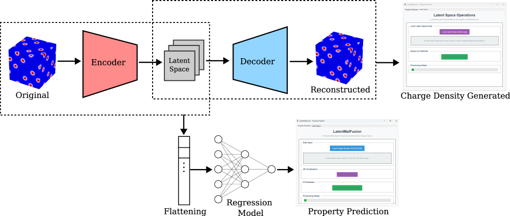
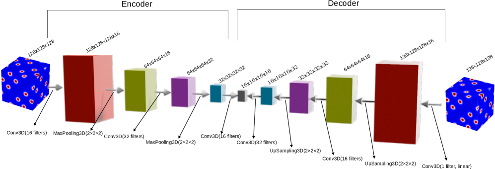
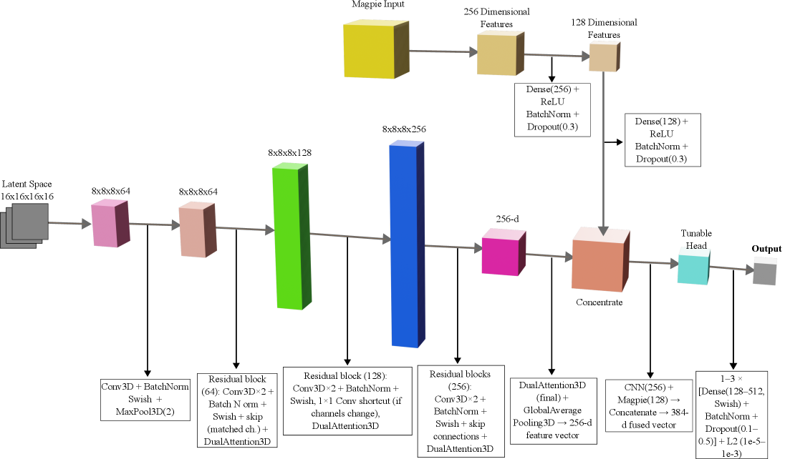
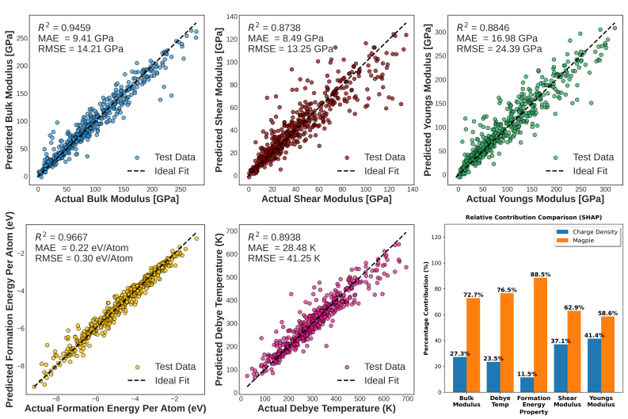
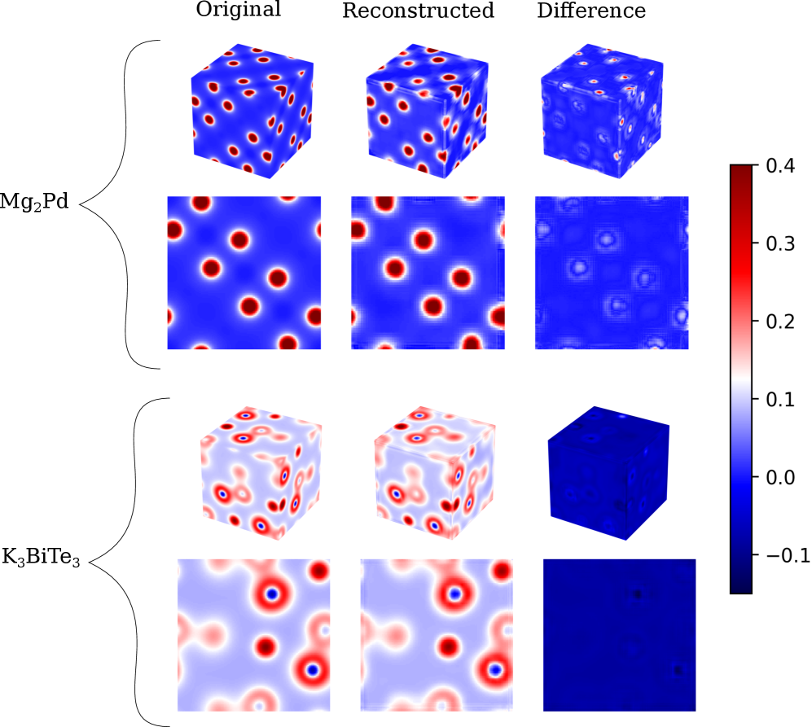

# 電子密度を機械学習の入力とする材料物性予測

- 執筆日：2026-05-19
- トピック：DFT が与える三次元電子密度スカラー場を、結晶グラフではなく量子力学的情報を担う高次元入力として直接用い、弾性率・形成エネルギー・Debye 温度を予測する物理認識型表現学習の方法論と意義
- タグ：Computation and Theory / Electronic Structure / Machine Learning / Surrogate Modeling / First-Principles Calculations
- 注目論文：[Physics Aware Representation Learning on Electronic Charge Density for Materials Property Prediction](https://arxiv.org/abs/2605.07227)（Kammampati Sai Kumar, Albert Linda, Shubham Kumar Maurya, Somnath Bhowmick, arXiv:2605.07227, 2026）
- 参照論文数：7

---

## 1. 背景：なぜ今この話題か

材料科学における機械学習は、ここ十年で急速に成熟した。Materials Project・AFLOW・OQMDといった大規模第一原理データベースが数十万件規模のデータを公開し、そのデータを学習する結晶グラフニューラルネットワーク（GNN）が多数開発された。CGCNN（Crystal Graph Convolutional Neural Network）が 2018 年に登場して以来、MEGNet・ALIGNN・DimeNet++・EquiformerV2 と世代を重ね、形成エネルギーや弾性率・バンドギャップを数ミリ電子ボルトの精度で予測できるようになった。

しかしこれらのモデルが入力として使うのは、基本的に「結晶グラフ」——原子種とその結合トポロジーを頂点・辺で表現した構造——である。原子間の距離や角度は埋め込まれるものの、電子の空間分布そのものは捨象されている。これは情報損失を伴う。金属の延性・もろさを決める局所的な電子の偏り、遷移金属の d 軌道が作る異方的な結合、水素結合の方向依存性——こうした特徴はすべて電子密度に刻まれているが、結晶グラフではグローバルなトポロジーとして近似的に表現されるにすぎない。

量子力学の立場から見れば、電子密度 $\rho(\mathbf{r})$ はきわめて根源的な量である。Hohenberg と Kohn は 1964 年に、基底状態の全エネルギーは電子密度の汎関数として一意に決定されることを証明した。つまり $\rho(\mathbf{r})$ さえ分かれば、原理的にはあらゆる基底状態物性が導出できる。形成エネルギー・弾性率・フォノン・光学スペクトル、いずれも電子密度が始点である。逆に言えば、電子密度は材料物性予測に必要な「すべての情報」を含む表現である。

問題は次元数にある。実空間で分解能 $128 \times 128 \times 128$ のグリッドに離散化すれば、一材料あたり約 200 万個の実数値となる。これをそのまま全結合型ニューラルネットワークや GNN に入力しようとすると、メモリ・計算量ともに非現実的になる。高次元データを扱う有力なアプローチとして三次元畳み込みニューラルネットワーク（3D CNN）や自己符号化器（autoencoder）がある。しかしどのように次元を圧縮すれば、物性予測に本質的な物理情報が保たれるのか——これが電子密度 ML の核心課題であり、2025 年から 2026 年にかけて活発に研究が進んでいる。

## 2. 未解決問題は何か

### 高次元グリッドの圧縮戦略：何を保存すべきか

$128^3$ の実数グリッドを圧縮する際、単純な pooling や平均値への折りたたみでは位置情報が失われる。電子密度の「空間的なパターン」——ボンド領域の電子の集中、格子点近傍の核電荷の遮蔽、空洞領域での電子の希薄化——こそが物性を決める要因であるため、圧縮アルゴリズムは空間的な構造を保持しなければならない。

3D CNN 型オートエンコーダはこの点で有力な候補だが、学習された潜在空間が本当に物理的に意味のある特徴に対応しているかどうかは自明ではない。たとえば弾性率の予測には結合方向の異方性が重要であり、形成エネルギーには局所的な化学環境が重要である。こうした異なる物性が「同一の潜在表現」から予測できるのかは、汎用性の観点から大きな問いである。equivariant ネットワーク（ChargE3Net、ELECTRA 等）は回転・反転対称性を陽に組み込むことでこの問題の一部を解決しようとしているが、入力として電子密度全体を扱うコストはまだ大きい。

### 結晶対称性と周期境界条件

実際の材料は三次元周期境界条件下にある結晶であり、電子密度は格子の並進対称性に従って $\rho(\mathbf{r} + \mathbf{R}) = \rho(\mathbf{r})$（$\mathbf{R}$ は格子ベクトル）を満たす。さらに空間群の点群対称性も存在する。しかし直方格子以外の格子定数・格子ベクトルが持つ対称性を 3D CNN が自動的に学習することは難しく、一般に入力グリッドの形状が材料ごとに異なるため、統一的なバッチ処理が困難になる。多くの手法は直方体のスーパーセルに変換するか、格子方向に特別な前処理を行う。この前処理のどの部分で物理情報が損なわれるかは、明示的に検討されることが少ない。

また、空間群の点群操作による電子密度の変換を明示的にモデルに組み込む equivariant アーキテクチャ（e.g., E(3)同変 GNN）は計算的に複雑になり、大規模グリッドへの適用は依然として課題である。

### データ取得コストと電荷密度の入手経路

結晶グラフ表現は DFT 計算結果（エネルギー、力）の副産物として得られるが、電子密度グリッドは別途保存が必要である。通常の高スループット DFT スクリーニングでは電子密度は出力されず、再計算が必要なケースも多い。また、ファイルサイズも大きく（一材料あたり数十 MB~数百 MB）、大規模データセット構築のストレージ・転送コストが問題になる。

高精度な電子密度自体を機械学習で予測する研究（後述の ChargE3Net、ELECTRA）が進んでいるが、その予測精度が下流の物性予測に十分かどうかはまだ系統的に検証されていない。「DFT 電荷密度を ML で予測し、その ML 電荷密度から物性を予測する」という二段階パイプラインの誤差伝搬の問題は重要な未解決点である。

### グラフ表現との優劣：どの局面で電荷密度が「勝つ」か

形成エネルギーや格子定数の予測では、高精度 GNN（ALIGNN、EquiformerV2）がすでに meV/atom レベルの精度を達成しており、電荷密度ベースの手法がこれを大幅に上回ることは難しい。一方で、電荷密度が有利になる局面——たとえば骨格が同じで電荷分布が大きく異なる酸化数の異なる材料の区別、あるいは配位が同じでも方向依存性のある結合による弾性異方性——を系統的に特定することが今後の重要課題である。「電荷密度を使えば何でも良くなる」わけではなく、どの物性・どの材料クラスに対して情報のアドバンテージがあるのかを明確にする必要がある。

## 3. 注目論文の概説

### 研究目的と対象

本論文（Kammampati Sai Kumar ら, 2026）は、DFT 計算から得られる電子密度を三次元グリッドとして直接入力に使い、5 つの材料物性——体積弾性率（bulk modulus $K$）、ヤング率（Young's modulus $E$）、剛性率（shear modulus $G$）、形成エネルギー（formation energy $E_\mathrm{f}$）、Debye 温度（$\Theta_D$）——を機械学習で予測するフレームワークを構築した。対象データは Materials Project データベースの結晶材料であり、DFT（VASP コード）で計算した電子密度グリッドを入力とする。

材料選択の偏りを排除するため、多様な結晶系・組成系を含むデータセットを使用しており、先行研究（2003.13425）がほぼ FCC 材料（2,170 件）のみを対象にしていたのに対して、より広い化学空間をカバーしている点が特徴である。

### 研究アプローチ：三段階の処理

本研究のパイプラインは主に三つの部分から成る（図1）。

*図1：提案フレームワークの全体像。左：DFT で計算した電荷密度グリッドをオートエンコーダで圧縮し潜在表現を得る。右：潜在表現を（a）電荷密度の再構成、（b）物性予測の入力として利用する（出典：arXiv:2605.07227, CC BY 4.0）*

第一段階は、**三次元畳み込みオートエンコーダ（3D Convolutional Autoencoder）による教師なし次元削減**である。入力は $128 \times 128 \times 128$ のボクセルグリッド（約 200 万次元）であり、エンコーダ部の畳み込み・プーリング層を通じて $16 \times 16 \times 16 \times 16$ の潜在表現（約 65,000 次元）に圧縮する。オートエンコーダはデコーダ部で元の電荷密度を再構成するよう学習されるため、教師ラベル（物性値）なしに電荷密度の「本質的な空間的構造」を学習する。

第二段階は、**デュアル・アテンション機構（Dual-Attention Modules）** による物理的に意味のある空間領域の強調である。アテンション機構は空間的アテンション（チャンネル間の関係）とチャンネルアテンション（ボクセル空間内の重要領域）の二種類を組み合わせ、電荷密度のうち物性予測に特に関連する部分——たとえばボンド領域や対称性の高い格子点周辺——を優先的に注目する。これが論文名にある「物理認識（Physics Aware）」の主な根拠である。

*図2：オートエンコーダのアーキテクチャ概要。入力128³を2段階の畳み込み+MaxPoolingで圧縮し、16×16×16×16の潜在テンソルを生成する（出典：arXiv:2605.07227, CC BY 4.0）*

第三段階は、**下流物性予測**であり、得られた潜在表現を入力として LightGBM（勾配ブースティング決定木）または Attention ベース 3D CNN による回帰モデルで各物性を予測する。また、MAGPIE（Material Agnostic Platform for Informatics and Exploration）と呼ばれる組成ベースの記述子——元素の電気陰性度・原子半径・価電子数などの統計量から計算される特徴ベクトル——を電荷密度潜在表現と組み合わせることで、さらなる精度向上を検討している。

*図3：Attention 3D CNN モデルのアーキテクチャ。デュアル・アテンション機構が電荷密度中の物理的に重要な空間領域とチャンネルを選択的に強調する（出典：arXiv:2605.07227, CC BY 4.0）*

### 主要結果

5 物性の予測において、提案手法は先行手法と比較して競合する精度を示した。
*図4：LightGBM（潜在電荷密度＋MAGPIE）モデルの予測結果。K: R²=0.94、E: R²=0.88、G: R²=0.87、E_form: R²=0.96、θ_D: R²=0.89。右下：SHAP 分析でMAGPIE の寄与が電荷密度より大きいが、両者は相補的（出典：arXiv:2605.07227, CC BY 4.0）*

詳細な $R^2$ 値を挙げると、形成エネルギー $E_\mathrm{f}$（$R^2 = 0.96$）が最高精度となり、体積弾性率 $K$（$R^2 = 0.94$）、Debye 温度 $\Theta_D$（$R^2 = 0.89$）、ヤング率 $E$（$R^2 = 0.88$）、剛性率 $G$（$R^2 = 0.87$）の順であった。弾性率の中では体積弾性率が最も高精度で予測できた。形成エネルギーはスカラー量として等方的な電荷分布に強く依存するため電荷密度との相性がよく、高い精度が得られたと解釈できる。一方、既存の GNN（CGCNN、ALIGNN 等）と比較した絶対的な誤差水準については慎重な解釈が必要である。

興味深いことに、MAGPIE 特徴量と電荷密度潜在表現を組み合わせたハイブリッドモデルが単独使用より優れており、MAGPIE 単体でも多くの物性において電荷密度単体より高い精度を示した。この結果は、電荷密度が既存の組成記述子を「完全に置き換える」わけではなく、相補的な情報を提供することを示唆している。

外挿性能の評価——学習材料と化学的に異なる材料系への予測——では、電荷密度ベースのモデルが組成記述子だけのモデルより有意に優れる傾向が確認された。先行研究（2003.13425）と整合するこの知見は、電荷密度が局所的な電子構造の情報を持つため、遠い化学空間に対してより転移しやすい表現であることを示唆する。

### 新規性と限界

本論文の新規性は、単に電荷密度を入力にした点ではなく、（1）教師なしオートエンコーダによる大規模電荷密度グリッドの汎用潜在表現の構築、（2）デュアル・アテンションによる物理的局所性の明示的な組み込み、（3）5種類の多様な物性を統一的に扱う評価、にある。

一方で限界もある。まずデータセットの化学的多様性に依然として制限があり、全材料空間の網羅性は保証されない。次に、入力電荷密度の取得には DFT 計算が必要であり、実験材料への適用は現状困難である。また、アテンション機構が「本当に物理的に意味のある領域を見ているか」を解釈性の観点から体系的に検証した結果が限られており、「物理認識型」という主張の定量的根拠の強化が今後の課題として残る。

## 4. 研究史における位置づけ

### 先駆的研究：電荷密度→弾性率の 3D CNN（2003.13425）

電荷密度を直接 ML の入力にするというアイデアは、本論文よりも先に 2020 年に提案されていた。Zuo ら（arXiv:2003.13425）は、FCC 構造（空間群 Fm3m）の 2,170 材料を対象に、DFT 電荷密度を 3D CNN に入力して弾性率を予測した。この研究は、電荷密度が「汎用の統一記述子」として機能しうることを示した点で先駆的であった。ただし対象が FCC のみに限定され、オートエンコーダや attention 機構は使われておらず、より単純な CNN アーキテクチャによる直接回帰であった。

2026 年の注目論文（2605.07227）は、この先駆的研究を以下の点で拡張した。対象材料を FCC だけでなく多様な結晶系に広げ、オートエンコーダによる汎用潜在表現の学習を導入し、アテンション機構を加えた。また予測対象物性も弾性率（体積弾性率・ヤング率・剛性率）に加えて形成エネルギー・Debye 温度を含め、より包括的な評価を行った。

### 電荷密度予測の研究系譜

一方、電荷密度そのものを機械学習で予測する（構造→電荷密度）研究も活発に進んでいる。これは注目論文（構造→電荷密度→物性）の「入力生成」段階に対応する重要な補完的研究である。

*図5：代表的な化合物の電荷密度再構成精度。左列：元の DFT 電荷密度、中列：オートエンコーダ再構成結果、右列：差分マップ。MSE = 2.1×10⁻⁴（出典：arXiv:2605.07227, CC BY 4.0）*

ChargE3Net（arXiv:2312.05388、MIT Lincoln Lab・LBNL、2023）は、E(3) 等変グラフニューラルネットワークを用いて電荷密度を実空間任意点で予測し、Materials Project の 10 万件以上の材料に適用した。ChargE3Net が予測した電荷密度を DFT の初期推定として使うと、自己無撞着計算の反復回数が 26.7% 削減できると報告した。この知見は、ML 予測電荷密度が DFT 加速ツールとして機能することを示すものである。

A Recipe for Charge Density Prediction（arXiv:2405.19276、2024）は、精度の高い電荷密度予測のための「材料・設計要素」として、（1）原子中心軌道による表現、（2）学習可能な軌道基底、（3）高容量等変ネットワーク、の三つを特定した。同論文の手法は既存手法より一桁以上高速で高精度であるとされており、ML による電荷密度生成の実用化を大きく前進させた。

さらに 2025 年 3 月には ELECTRA（arXiv:2503.08305、NeurIPS 2025 採録）が発表された。浮動軌道（Floating Orbitals）——原子位置ではなく空間内の任意点に軌道を配置——をデータ駆動的に決定する Cartesian テンソルネットワークであり、より コンパクトかつ高精度な電荷密度表現を実現している。

### 同時期の類似アプローチ（2510.13207）

2025 年 10 月、Chen ら（arXiv:2510.13207）は「単一記述子としての電子密度」を用いた普遍的物性予測フレームワークを発表した。この論文は注目論文（2605.07227）の直接的な比較対象となりうる先行研究であり、電荷密度を用いることの汎用性（一つの記述子から多くの物性を予測できる）という主張において目標が一致する。ただし技術的手法の詳細——どのように次元を削減するか、何を「物理認識」とするか——は異なっており、両者を系統的に比較した研究はまだない。

### マルチモーダル基盤モデルへの接続（2312.00111）

電荷密度を複数モダリティの一つとして扱う研究もある。MultiMat（arXiv:2312.00111、2023）は CLIP を材料科学に適用したマルチモーダル基盤モデルであり、結晶構造・状態密度（DOS）・電荷密度・テキスト記述の 4 つのモダリティを共通潜在空間に埋め込む。電荷密度だけを使う 2605.07227 とは異なり、電荷密度を「複数の情報源の一つ」として使うことで、より豊かな表現を学習するアプローチである。

## 5. どの解釈が最も妥当か

### 電荷密度は GNN を「置き換える」のか、「補完する」のか

注目論文（2605.07227）の結果において最も重要な示唆の一つは、MAGPIE（組成記述子）と電荷密度潜在表現のハイブリッドが最高精度を達成するという点である。これは、電荷密度が GNN や組成記述子を完全に置き換えるのではなく、補完的情報を提供するという解釈を支持する。MAGPIE の組成情報は元素周期表的な「大域的な化学傾向」を捉え、電荷密度は「この特定の結晶構造における局所的な電子分布」を捉える。両者は異なる情報層にアクセスしており、組み合わせることで相乗効果が生まれると考えられる。

一方、2510.13207 は電荷密度「単一記述子」の汎用性を主張しており、これは電荷密度が様々な物性の予測に足る情報を内包するという Hohenberg-Kohn 定理の論理に沿う。どちらが正しいかというよりも、精度・計算コスト・汎用性のトレードオフをどう評価するかの問題でもある。

### オートエンコーダの潜在空間：何が学ばれているか

3D オートエンコーダが学ぶ潜在表現が物性予測に有効である理由として、いくつかの仮説が考えられる。一つの解釈は、潜在空間がボンド電子密度・アンチボンディング軌道・孤立電子対といった化学的に意味のある特徴に対応するように自己組織化するというものである。もう一つは、単純に「形状の主成分」を学習しているに過ぎず、物性との相関は結晶構造の対称性を反映しているという解釈である。デュアル・アテンションが実際にどの空間領域に注目しているかを可視化した研究は限られており、「物理認識」の主張の解釈的根拠を強化することが今後の課題となっている。活性化最大化法や Grad-CAM のような説明可能 AI（XAI）技術を 3D 電荷密度マップに適用することで、潜在表現の物理的意味を探索することが期待される。

### 弾性率予測の優位性：なぜ体積弾性率が最も良いか

体積弾性率（$K$）は等方的圧縮に対する抵抗であり、格子全体の等方的電荷密度分布と強く相関する。電荷密度の空間的な「詰まり方」を 3D CNN が捉えやすいため、$K$ の予測精度が高くなるという解釈は直感的に理解できる。一方、剛性率（$G$）やヤング率（$E$）は結晶方向依存性（異方性）が強く、3D グリッドの向き・格子ベクトルの情報も重要になる。このため単純な畳み込み操作では捉えにくく、精度が落ちやすいと考えられる。

### 外挿性能の強み：なぜ電荷密度は汎化しやすいか

電荷密度ベースのモデルが外挿性能で組成記述子ベースのモデルに優ることは、2003.13425 と 2605.07227 の双方が示す一貫した傾向である。これは次のように解釈できる。組成記述子は化学空間における「大域的な傾向」を学習するため、学習データと化学的に異なる材料（e.g., 異なる組成系・異なる配位数）では精度が落ちやすい。一方、電荷密度は「この原子配列が作る電子の実際の空間分布」を直接反映するため、見たことのない組成でも局所的な電子構造の特徴（e.g., ボンドの電子密度の形状）を通じた予測が可能になる。これは実材料設計において重要な性質であり、未知材料系へのスクリーニングに電荷密度ベースの手法が有効である根拠となりうる。

### 今後必要な検証

現時点でまだ弱い点として、以下が挙げられる。第一に、より大規模かつ化学的に多様なデータセット（全結晶系・多元素系）での評価。第二に、最新 GNN（ALIGNN、EquiformerV2、MatFormer 等）との厳密な比較。第三に、ML 予測電荷密度（DFT ではなく）を入力にした場合の精度評価。第四に、非等温・非平衡状態や欠陥含有系への適用。これらの検証が揃って初めて「電荷密度ベース ML が GNN に比肩する、あるいは凌駕する」という主張が確固とした科学的根拠を持つ。

## 6. 何が一般化できるか

### 弾性率・形成エネルギーを超えた物性への拡張

電荷密度は弾性率や形成エネルギーだけでなく、磁気モーメント（局所磁化はスピン分極電荷密度に直結）、誘電率（外部電場に対する電荷分布の変化）、フォノン（原子間力定数は電荷密度の二次微分に関連）など多様な物性と原理的に結びついている。本論文では 5 物性を扱ったが、同じパイプラインをこれらの物性に拡張することは概念的に自然なステップである。ただし物性によってどの空間領域の電荷密度が重要かは異なるため、アテンション機構の設計をタスク依存にする必要があるかもしれない。

### 実験的電荷密度との接続

DFT 電荷密度ではなく実験的電荷密度——X 線・中性子回折データから精密化（Rietveld 法や Maximum Entropy Method）した電荷密度——を入力にできれば、純粋に実験データ駆動のパイプラインが実現する。X 線回折による電荷密度測定の精度は近年飛躍的に向上しており、こうした実験データを ML の入力として使う試みは今後有望な研究方向となりうる。ただし実験電荷密度は分解能・ノイズ・格子歪み等の影響を受けるため、DFT グリッドとは性質が異なる。

### マルチモーダル基盤モデルへの統合

電荷密度・状態密度（DOS）・結晶グラフ・テキスト記述を統合した MultiMat（arXiv:2312.00111）の方向性は、本論文の知見——電荷密度は補完的情報を持つ——と整合する。電荷密度の潜在表現を大規模基盤モデルの入力の一つとして組み込むことで、単一表現の限界を超えた汎用的な材料 AI が実現する可能性がある。計算コストが高い電荷密度の代わりに、高精度 ML 予測電荷密度（ChargE3Net や ELECTRA 等による）を使う二段階パイプラインが実用的な経路として期待される。

### 設計原理としての一般化

局所的な電子分布が物性を決めるという設計原理は、材料設計において重要な指針を与える。たとえば「特定のボンド領域に電荷を集中させる組成・構造を探索する」という逆設計（inverse design）タスクに電荷密度 ML を組み込むことができる。電荷密度→物性の順方向モデルを学習し、その勾配情報を用いて電荷密度を最適化し、その電荷密度を実現する結晶構造を探索するという枠組みは、理論的には一貫したアプローチである。ただし「所望の電荷密度を実現する結晶構造」の逆問題は一般に非凸であり、解探索には工夫が必要である。

## 7. 基礎から理解する

### 電子密度とは何か

固体材料を構成する原子には、陽子・中性子からなる原子核と、それを取り囲む電子がある。量子力学の枠組みでは、$N$ 個の電子の状態は $N$ 電子波動関数 $\Psi(\mathbf{r}_1, \sigma_1, \mathbf{r}_2, \sigma_2, \ldots, \mathbf{r}_N, \sigma_N)$ で記述される。ただし $\mathbf{r}_i$ は $i$ 番目の電子の位置、$\sigma_i$ はスピン量子数である。この $N$ 電子波動関数は $3N$ 次元の複素関数であり、典型的な固体（$N \sim 10^{23}$）については直接扱うことは原理的に不可能である。

電子密度（electron density または charge density）$\rho(\mathbf{r})$ は、三次元実空間の各点 $\mathbf{r}$ において電子が存在する確率密度に電子数を掛けたものであり、

$$\rho(\mathbf{r}) = N \int |\Psi(\mathbf{r}, \mathbf{r}_2, \ldots, \mathbf{r}_N)|^2 \, d\mathbf{r}_2 \cdots d\mathbf{r}_N$$

で定義される（スピン自由度は積分で消去した場合）。この量は三次元の実関数であり、波動関数の $3N$ 次元的な複雑さを大幅に削減している。$\rho(\mathbf{r})$ の体積積分は系の全電子数に等しく、$\int \rho(\mathbf{r}) \, d\mathbf{r} = N$ が成り立つ。電子密度は原則として全空間で正であり（$\rho(\mathbf{r}) \geq 0$）、原子核の周辺で大きく、原子間の空隙で小さくなる。

### Hohenberg-Kohn 定理：電子密度は「すべてを知っている」

1964 年、Pierre Hohenberg と Walter Kohn は、多電子系の基底状態エネルギー $E_0$ が基底状態電子密度 $\rho_0(\mathbf{r})$ の汎関数として一意に決まることを証明した（第一 Hohenberg-Kohn 定理）。さらに、真の基底状態電子密度 $\rho_0(\mathbf{r})$ において全エネルギー汎関数 $E[\rho]$ が最小値をとることも示した（第二定理、DFT のバリエーション原理）。

$$E_0 = E[\rho_0] = \min_{\rho} E[\rho]$$

この定理の意味は深い。電子密度 $\rho(\mathbf{r})$ という三次元の関数さえ分かれば、原理的には系のあらゆる基底状態物理量——全エネルギー、格子定数、弾性率、磁気モーメント、誘電率——が決定できる。「電子密度はすべての基底状態物性を決定する」という主張の根拠がここにある。これが本論文の核心的な動機付けである。もし電子密度から直接物性を予測できるならば、それは「基礎物理学的に完備な表現」を使っていることになる。

### 密度汎関数理論（DFT）の計算の流れ

Hohenberg-Kohn 定理は存在証明であり、エネルギー汎関数 $E[\rho]$ の具体的な形を与えない。実用的な計算のために Kohn と Sham（1965）は、相互作用する電子系を、有効ポテンシャル $V_\mathrm{eff}(\mathbf{r})$ 中の非相互作用電子系で置き換えるアプローチを提案した。これが Kohn-Sham DFT である。

Kohn-Sham 方程式は次の形をとる。

$$\left[ -\frac{\hbar^2}{2m} \nabla^2 + V_\mathrm{eff}(\mathbf{r}) \right] \phi_i(\mathbf{r}) = \varepsilon_i \phi_i(\mathbf{r})$$

ここで $\phi_i(\mathbf{r})$ は Kohn-Sham 軌道（擬一電子波動関数）、$\varepsilon_i$ はその固有値、$V_\mathrm{eff}(\mathbf{r})$ は外部ポテンシャル（原子核からのクーロン相互作用）＋Hartree ポテンシャル（電子間のクーロン反発）＋交換相関ポテンシャル $V_\mathrm{xc}(\mathbf{r})$ の和である。電子密度は

$$\rho(\mathbf{r}) = \sum_{i=1}^{N} |\phi_i(\mathbf{r})|^2$$

で得られる。$V_\mathrm{eff}$ は $\rho(\mathbf{r})$ に依存するため、方程式は自己無撞着（self-consistent）に解く必要がある。初期推定の電荷密度から $V_\mathrm{eff}$ を計算し、Kohn-Sham 方程式を解いて新しい $\rho(\mathbf{r})$ を得、収束するまでこれを繰り返す。VASP・Quantum ESPRESSO・ABINIT といったコードが広く使われており、典型的な固体材料では 10～数百 self-consistent iterations で収束する。

出力として得られる電子密度グリッド（VASP の場合 CHGCAR ファイル）は、基本単位胞を $128 \times 128 \times 128$ 程度のボクセルに分割した三次元配列であり、各ボクセルにおける電荷密度値を持つ。これが本論文の直接の入力データである。

### 三次元畳み込みニューラルネットワーク（3D CNN）

画像認識で広く使われる 2D CNN の自然な三次元拡張が 3D CNN である。2D CNN が高さ×幅×チャンネルの特徴マップを畳み込みフィルタで処理するのに対し、3D CNN は高さ×幅×奥行き×チャンネルの四次元テンソルを三次元フィルタで処理する。畳み込み演算は

$$(\mathbf{W} * \mathbf{X})_{i,j,k} = \sum_{a,b,c} W_{a,b,c} \cdot X_{i+a,\, j+b,\, k+c}$$

と表される（バイアス・チャンネルを省略）。局所的なパターンを階層的に捉えるため、浅い層では点対称な電荷の盛り上がり（原子核周辺）を、深い層ではより大きなスケールのボンド構造を捉えることが期待される。MaxPooling 層を組み合わせることで、空間的にサブサンプリングしながら特徴マップのサイズを縮小する。

電子密度の $128^3$ 入力を 3D CNN に通す場合、まず $128^3$ をひとつのチャンネルとして扱い、畳み込み→プーリングを繰り返すことで特徴マップを縮小する。注目論文では最終的に $16 \times 16 \times 16 \times 16$（空間 $16^3$ ×チャンネル 16）の潜在表現に圧縮している。

### オートエンコーダ（Autoencoder）

オートエンコーダは、入力を低次元の潜在表現に圧縮する「エンコーダ」と、潜在表現から元の入力を再構成する「デコーダ」からなる自己符号化型ニューラルネットワークである。学習の目標は入力と再構成の差（再構成誤差）を最小化することであり、ラベルデータ（物性値）を使わない教師なし学習である。

$$\mathcal{L} = \| \mathbf{x} - \hat{\mathbf{x}} \|^2 = \| \mathbf{x} - f_\mathrm{dec}(f_\mathrm{enc}(\mathbf{x})) \|^2$$

ここで $\mathbf{x}$ は入力電荷密度グリッド、$\hat{\mathbf{x}}$ は再構成グリッド、$f_\mathrm{enc}$ はエンコーダ関数、$f_\mathrm{dec}$ はデコーダ関数である。学習が成功すると、潜在空間 $\mathbf{z} = f_\mathrm{enc}(\mathbf{x})$ は入力の本質的な変動を最小次元で表現する「圧縮された情報」となる。電荷密度の場合、類似した化学環境の材料は潜在空間で近くに位置し、異なる結晶構造は遠く位置することが期待される。

### 弾性率の物理的意味

体積弾性率 $K$（bulk modulus）は、材料を等方的に圧縮したとき体積変化に対する圧力の比であり、

$$K = -V \frac{dP}{dV} = \rho \frac{dP}{d\rho}$$

で定義される（$V$：体積、$P$：圧力）。単位は GPa（ギガパスカル）であり、金属では数十〜数百 GPa、共有結合性材料（ダイヤモンド：$K \approx 442$ GPa）では特に大きい。$K$ は主に最近接原子間距離と電子密度の空間分布によって決まり、3D CNN で学習しやすい等方的特徴量である。剛性率 $G$（shear modulus）は形状変化（剪断変形）に対する抵抗であり、方向依存性を持つため、$K$ より予測が難しいとされる。形成エネルギー $E_\mathrm{f}$ は、構成元素の単体に対して化合物が安定化するエネルギーであり、材料の熱力学的安定性の指標となる。Debye 温度 $\Theta_D$ はフォノンスペクトルの特徴的温度を表し、弾性率・音速と密接に関連する。

## 8. 専門用語の解説

**電子密度（electronic charge density, $\rho(\mathbf{r})$）**　実空間の各点 $\mathbf{r}$ における電子の存在確率密度に電子数を掛けた三次元スカラー場。単位は $e/\text{Å}^3$（$e$：素電荷）。固体では原子核周辺（$\sim 10^3 \; e/\text{Å}^3$）から空洞領域（$< 10^{-3} \; e/\text{Å}^3$）まで広い範囲に分布する。本論文ではこの量を $128^3$ ボクセルグリッドに離散化したものが ML の入力として使われる。量子力学の基本量であり、Hohenberg-Kohn 定理によって全物性を決定する完備な情報を持つ。

**Hohenberg-Kohn（HK）定理**　1964 年に証明された密度汎関数理論の基礎定理。外部ポテンシャル（≒結晶構造）は基底状態電子密度によって一意に決まり（第一定理）、真の基底状態電子密度でエネルギー汎関数は最小値をとる（第二定理）。これにより「電子密度さえあれば全物性が原理的に決まる」という主張が正当化される。本論文の電荷密度を ML 入力とする動機の根本にある定理。

**密度汎関数理論（DFT, Density Functional Theory）**　Kohn-Sham 方程式を自己無撞着に解くことで、多体電子系の基底状態電子密度・エネルギー・原子間力を計算する第一原理計算法。交換相関汎関数（LDA・GGA・hybrid 汎関数等）に近似が含まれるため「厳密」ではないが、大半の材料で十分な精度を与える。計算コストは $O(N^3)$（$N$：電子数）程度であり、数十〜数百原子の単位胞まで適用可能。本論文の電子密度グリッドは DFT（VASP）で計算されたものが使われる。

**3D 畳み込みニューラルネットワーク（3D CNN）**　三次元ボクセルグリッドを入力とする畳み込みニューラルネットワーク。医療画像（CT・MRI）や動画解析で広く使われる。電子密度の三次元パターンを局所的・階層的に学習するのに適しており、本論文のオートエンコーダの骨格を成す。畳み込みフィルタのサイズ・ストライド・パディングなどのハイパーパラメータが性能に影響する。周期境界条件を反映するには Circular padding（循環パディング）の使用が推奨される。

**オートエンコーダ（Autoencoder）**　入力を低次元の潜在表現（latent representation）に圧縮するエンコーダと、潜在表現から入力を再構成するデコーダからなる教師なし学習モデル。ラベルなしで特徴を抽出できる点が利点。本論文では $128^3 \approx 2\times10^6$ 次元の電子密度グリッドを $16^4 \approx 65\times10^3$ 次元に圧縮し、学習された潜在表現を下流の物性予測モデルに渡す。

**潜在表現（latent representation）**　オートエンコーダや変分オートエンコーダ（VAE）などのエンコーダが入力から抽出した低次元のベクトルまたはテンソル。入力の本質的な変動を少ない次元で表現しており、類似した入力は潜在空間で近い点に対応することが期待される。本論文では電子密度の $16 \times 16 \times 16 \times 16$ テンソルがこれに対応し、各材料の電子構造の「エッセンス」を担うとして物性予測の入力に使われる。

**アテンション機構（attention mechanism）**　ニューラルネットワークが入力の特定の部分に選択的に注目することを可能にする仕組み。Transformer の自己注意（self-attention）が有名だが、CNN に組み込む空間アテンション・チャンネルアテンションも広く使われる。本論文のデュアル・アテンション（Dual-Attention Module）は空間次元とチャンネル次元の両方でアテンションを計算し、物理的に重要な空間領域（結合電子密度の集中した場所など）を強調するよう設計されている。

**弾性率（elastic modulus）**　材料が応力（力）に対してどれだけ変形するかを表す物質定数の総称。体積弾性率 $K$（等方圧縮に対する抵抗）、剛性率 $G$（剪断変形への抵抗）、ヤング率 $E$（一軸引張に対する抵抗）、ポアソン比 $\nu$ などが代表的。Voigt-Reuss-Hill 平均により多結晶体の等方的弾性率が定義される。弾性率は電子密度の二次微分（原子間力定数の空間変化）と密接に関連しており、電荷密度から予測しやすい物性のひとつである。

**形成エネルギー（formation energy, $E_\mathrm{f}$）**　ある化合物が構成元素の純物質から形成される際のエネルギー変化。$E_\mathrm{f} = E_\mathrm{compound} - \sum_i n_i E_i^{(\mathrm{ref})}$（$n_i$：元素 $i$ の原子数、$E_i^{(\mathrm{ref})}$：元素 $i$ の標準参照状態エネルギー）。負の値は化合物が安定であることを示し、材料の熱力学的安定性・合成可能性の指標として広く使われる。Materials Project では数十万件の形成エネルギーが公開されており、ML のベンチマーク物性として最もよく使われる。

**MAGPIE 特徴量**　Material Agnostic Platform for Informatics and Exploration の略。結晶構造情報を使わずに組成（化学式）だけから計算できる記述子セット。元素の周期表的特徴（原子番号・原子半径・電気陰性度・イオン化エネルギー・d 軌道電子数など）の統計量（平均・標準偏差・最大・最小・差など）として定義される。Crystal Structure Agnostic（構造非依存）なため計算コストが低く、電子密度のような高コスト入力との組み合わせ性能の比較対象として本論文で使われている。

## 9. 将来展望

DFT 電荷密度をそのまま機械学習の入力として使うアプローチの有効性は、注目論文（2605.07227）と 2510.13207 の両方が独立に確認しており、電荷密度ベースの材料物性 ML が有効な選択肢であることは今後かなり確からしくなりつつある。特に外挿性能——学習データと化学的に離れた材料への予測——での優位性は、Materials Genome Initiative が目指す広い化学空間の探索において実用的な意味を持つ。オートエンコーダが学んだ潜在表現の解釈可能性についても、Grad-CAM 等の手法を適用した研究が今後増えると予想される。

しかし多くの重要な点がまだ未確定である。最大の問題は DFT 電荷密度の取得コストであり、高精度 ML による電荷密度予測（ChargE3Net、Recipe for Charge Density、ELECTRA）との組み合わせがどこまで実用的かは、精度・計算コスト・データ要求量の三点から評価が必要である。また本論文が対象とした物性（弾性率・形成エネルギー・Debye 温度）は比較的「格子全体の統計的性質」を反映する量であり、欠陥・表面・界面・ドーピングが絡む局所的な物性（表面吸着エネルギー、欠陥形成エネルギー、イオン伝導経路など）への拡張が鍵となる。さらに、現在の手法が前提とする「周期的単位胞の完全格子」という設定を超えて、乱れた系・非晶質・局所構造の不均一性を持つ材料へどう対応するかも大きな課題である。

今後注目すべき方向性として三点を挙げる。第一は「ML 電荷密度→ML 物性」の二段階パイプラインの誤差評価と最適化であり、ELECTRA・ChargE3Net のような高精度電荷密度モデルを上流に置いた end-to-end な学習の可能性を探ることが重要である。第二は電荷密度とグラフ構造・DOS・テキストを統合したマルチモーダル基盤モデル（MultiMat 方向）への組み込みであり、各モダリティの相補性を体系的に利用することで汎用材料 AI に近づける。第三は逆設計への応用であり、「所望の物性を実現する電荷密度を探索し、その電荷密度を実現する結晶構造を生成する」という因果的な設計フローは、電荷密度が Hohenberg-Kohn 定理により物性の「根源的決定因」であることを最大限に活かす方向性である。

## 参考論文一覧

1. **[Physics Aware Representation Learning on Electronic Charge Density for Materials Property Prediction](https://arxiv.org/abs/2605.07227)**（arXiv:2605.07227, 2026）
   三次元 DFT 電荷密度グリッドを 3D 畳み込みオートエンコーダで圧縮し、デュアル・アテンション機構を組み合わせることで弾性率・形成エネルギー・Debye 温度を予測するフレームワークを提案した注目論文。

2. **[Predicting Elastic Properties of Materials from Electronic Charge Density Using 3D Deep Convolutional Neural Networks](https://arxiv.org/abs/2003.13425)**（arXiv:2003.13425, 2020）
   FCC 材料 2,170 件を対象に電子密度を 3D CNN へ直接入力する先駆的研究であり、電荷密度を汎用記述子として弾性率を予測できることを初めて示した背景論文。

3. **[Higher-Order Equivariant Neural Networks for Charge Density Prediction in Materials](https://arxiv.org/abs/2312.05388)**（arXiv:2312.05388, 2023）
   E(3) 等変グラフニューラルネットワーク ChargE3Net により結晶構造から電荷密度を予測し、DFT の自己無撞着計算を 26.7% 削減できることを示した論文。電荷密度の高精度予測技術の重要な進展。

4. **[A Recipe for Charge Density Prediction](https://arxiv.org/abs/2405.19276)**（arXiv:2405.19276, 2024）
   電荷密度の高精度 ML 予測に必要な三要素（原子・仮想軌道表現・学習可能軌道基底・高容量等変ネットワーク）を特定し、既存手法より一桁以上高速かつ高精度な予測を実現した方法論論文。

5. **[Towards Universal Material Property Prediction with Deep Learning and Single-Descriptor electronic Density](https://arxiv.org/abs/2510.13207)**（arXiv:2510.13207, 2025）
   電子密度「単一記述子」のみを入力として多様な物性を予測できる普遍的フレームワークを提案し、注目論文と同じパラダイムを独立に追求した直接の比較論文。

6. **[ELECTRA: A Cartesian Network for 3D Charge Density Prediction with Floating Orbitals](https://arxiv.org/abs/2503.08305)**（arXiv:2503.08305, 2025, NeurIPS 2025）
   空間内の任意点に軌道を配置する「浮動軌道」をデータ駆動的に決定する Cartesian テンソルネットワークにより、コンパクトかつ高精度な電荷密度予測を実現した NeurIPS 採録論文。

7. **[Multimodal Foundation Models for Material Property Prediction and Discovery](https://arxiv.org/abs/2312.00111)**（arXiv:2312.00111, 2023）
   CLIP を材料に適用した MultiMat フレームワークにより、結晶構造・状態密度・電荷密度・テキストの 4 モダリティを共通潜在空間に埋め込み、材料物性予測と探索における電荷密度のマルチモーダル統合の可能性を示した論文。
