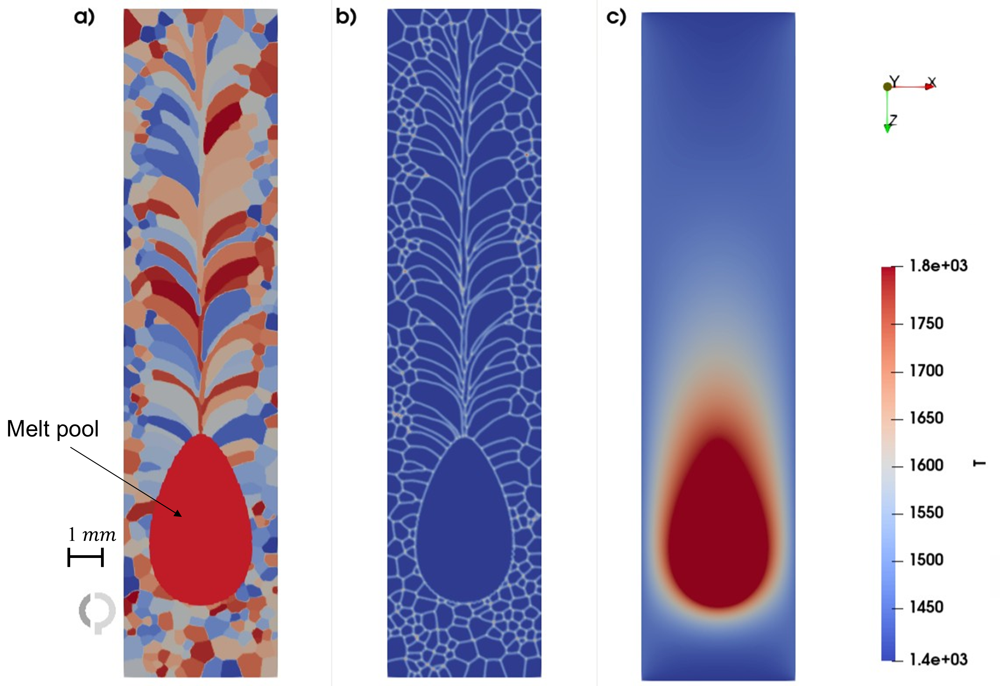
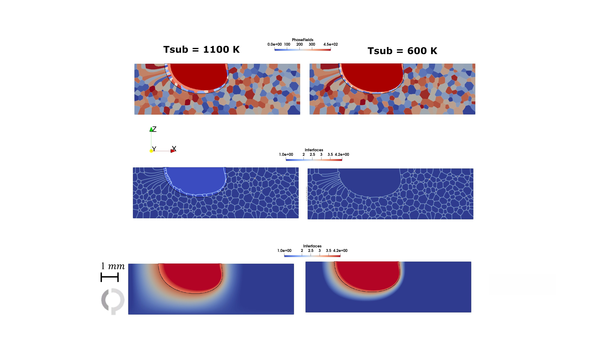
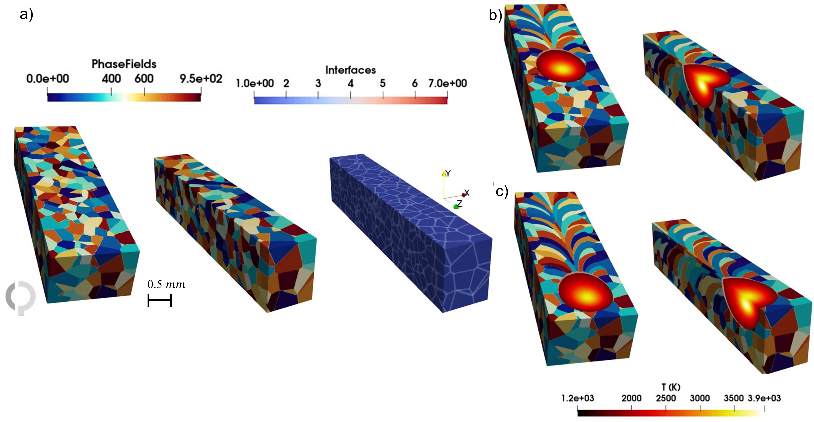
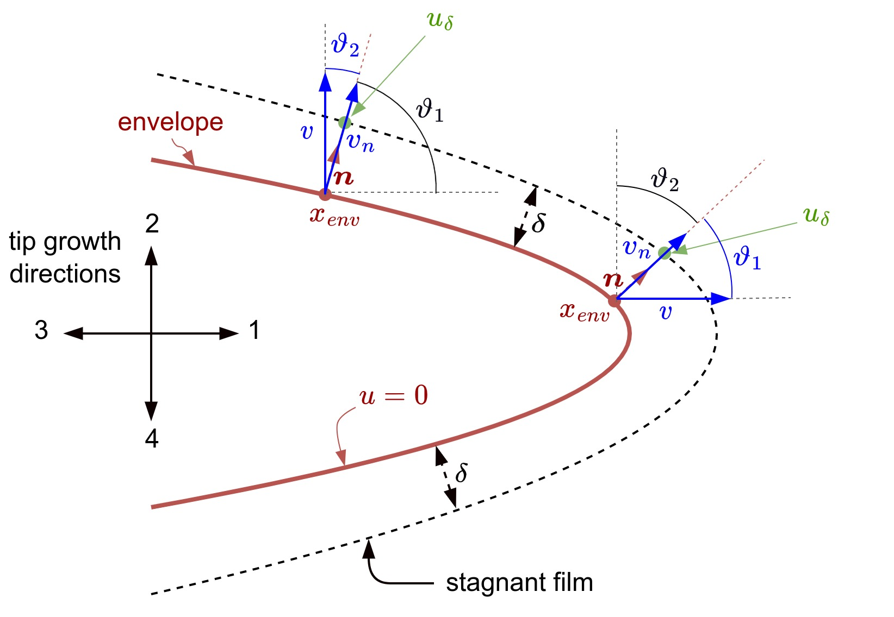
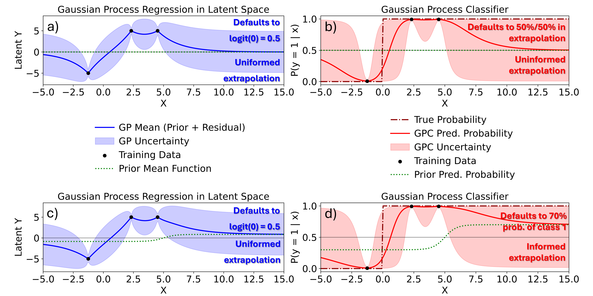

# 積層造形における粒状エンベロープモデルとフェーズフィールド法の融合

- 執筆日：2026-05-19
- トピック：粉末床溶融結合型積層造形（PBF-AM）における多結晶凝固の中スケールシミュレーション——粒状エンベロープモデルとフェーズフィールド前面伝播法の統合
- タグ：Computation and Theory / Phase Transitions; Nonequilibrium and Dynamic Response; Thin Films and Interfaces / Phase-Field Method; Multiscale Computation; Molecular Dynamics
- 注目論文：M. Uddagiri, P. Antala, I. Steinbach, "Phase field as a front propagation method for modeling grain growth in additive manufacturing," arXiv:2603.06627 (2026). [https://arxiv.org/abs/2603.06627](https://arxiv.org/abs/2603.06627)
- 参照論文数：7本

---

## 1. 背景：なぜ今この話題か

粉末床溶融結合型積層造形（Powder Bed Fusion Additive Manufacturing, PBF-AM）、とりわけレーザー積層造形（LPBF, Laser Powder Bed Fusion）は、複雑形状の金属部品を設計の自由度高く製造できる技術として、航空宇宙・医療・エネルギー分野で急速に普及しつつある。しかしその最大の問題の一つが、微細組織——とくに結晶粒形態や結晶方位（テクスチャ）——を予測・制御することの難しさである。

PBF-AM では金属粉末がレーザービームによって急速に溶融・凝固を繰り返す。この過程における熱勾配は 10^6 K/m を超え、凝固速度も数十 mm/s 以上に達する。このような極端な非平衡条件のもとでは、通常の鋳造や溶接で得られる等軸晶（equiaxed grain）ではなく、凝固方向に長く伸びた柱状晶（columnar grain）が優先的に形成され、強い〈001〉繊維テクスチャが生まれやすい。このテクスチャは機械特性の異方性を引き起こし、製品の信頼性を損なう。一方で、適切なプロセス条件を選べば等軸晶も得られ、柱状晶から等軸晶への転移（Columnar-to-Equiaxed Transition, CET）が鍵となる現象として注目されている。

結晶粒形態とテクスチャを制御するためには、積層造形プロセスにおける熱履歴と凝固挙動の定量的理解が不可欠である。しかし実験だけでこれを把握するのは困難であり、高精度な数値シミュレーションが強く求められている。ここで立ちはだかるのが「スケール問題」である。樹枝状凝固（dendritic solidification）の精細な物理——デンドライト先端半径は数マイクロメートル——を完全に解像しながら、ミリメートルスケールの溶融池全体を計算しようとすると、計算コストが膨大になり非現実的になる。この問題を解決する中スケール（メソスケール）モデルの開発が、近年材料計算科学における最重要課題のひとつとなっている。

こうした背景のもと、フェーズフィールド法（Phase-Field Method, PFM）と粒状エンベロープ（Grain Envelope）モデルの融合が注目されている。本記事が焦点を当てる注目論文（arXiv:2603.06627）は、粒状エンベロープの界面追跡にフェーズフィールドを前面伝播法として適用し、積層造形での多層多トラック積層中の結晶粒成長とテクスチャ発展をシミュレートした成果である。これは「粒子法的な考え方」（各デンドライトグレインをエンベロープという粒子として追跡する）とフェーズフィールド法の拡散界面表現を組み合わせた新しい中スケールアプローチであり、材料シミュレーションにおけるAI for Scienceの文脈でも重要な位置を占める。

---

## 2. 未解決問題は何か

### デンドライトスケールとマクロスケールの橋渡し問題

積層造形における凝固シミュレーションの核心的課題は、物理的に重要な長さスケールが少なくとも5桁以上離れていることにある。デンドライト先端の曲率半径は 10^{-7} ~ 10^{-6} m のオーダーであり、凝固に関与する溶質拡散場の広がりは 10^{-5} m 程度、一方で溶融池（melt pool）は 10^{-4} ~ 10^{-3} m、さらに部品全体は 10^{-2} m 以上に及ぶ。これらすべてを単一のシミュレーションで直接解像することは、現在の計算資源では不可能である。

従来のフェーズフィールド法は熱力学的に整合した拡散界面を用いて樹枝状成長を定量的に記述できるが、そのためには界面幅（典型的に数 nm から μm）程度のメッシュ解像度が必要であり、mm スケールの溶融池全体を対象とした計算は実用的でない。一方、セルオートマトン（Cellular Automaton, CA）法はマクロなスケールでの粒成長を効率よく計算できるが、界面曲率の効果や溶質再分配の熱力学的な整合性に問題がある。このギャップをいかに埋めるかが、中スケールモデリングの中心的未解決問題である。

### 凝固界面速度の記述問題

フェーズフィールドモデルでは、固液界面は滑らかな場で表現される。界面速度は局所的な自由エネルギー差（駆動力）と移動度によって決まるが、積層造形のような高速・高熱勾配条件では、古典的な熱力学モデルが成立しない「非平衡効果」——溶質トラッピング（solute trapping）や運動論的過冷却——が重要になる。これらをどう定量的に組み込むかは、現在も論争のある問いである。

Manciasら（arXiv:2505.07752）はFe-Cr 系を対象に、広範囲の成長速度と熱勾配にわたって相場計算とベイズ最適化を組み合わせることで、デンドライト・セル・平面前面のモルフォロジー転移マップを効率的に探索し、従来の KGT モデルとの比較を行った。この研究は、高速凝固における相図と組織選択則の定量的マッピングという、長年にわたる未解決問題に計算的にアプローチしたものであり、積層造形のプロセス設計に直結する。

またJiらの研究（arXiv:2411.07953）は、急速凝固条件における合金固液界面の溶質トラッピングを、拡散界面内での溶質拡散率増強という手法で定量的に記述するモデルを発展させた。これは拡散界面幅を実験スケールに合わせて拡張したまま定量精度を保てるという利点をもち、積層造形関連の計算をより実現可能なものにしている。

### 計算効率と物理的精度の両立

メソスケールモデルが目指すのは、デンドライクスケールの物理を何らかのかたちで取り込みながら、より粗いメッシュで計算できることである。しかし「物理を取り込む」方法が曖昧であれば、結果の予測精度に対する信頼性が保証されない。注目論文（2603.06627）が採用する粒状エンベロープ＋フェーズフィールド前面伝播の組み合わせは、微視的整合性理論（microscopic solvability theory）に基づく先端速度モデルを採用することで、この難問に対処しようとしている。しかし、どの程度の定量精度が保証されるかはまだ完全には検証されていない。

---

## 3. 注目論文の概説

### 研究の目的と対象

Uddagiriら（Ruhr University Bochum の ICAMS グループ、共著者はルーヴェン大学の Antala とボーフム大の Steinbach）は、PBF-AM 条件下での多結晶凝固を効率よくかつ物理的に意味のある形でシミュレートすることを目的として、フェーズフィールド前面伝播法（Phase-Field Front-Propagation Method）を粒状エンベロープモデルに適用するフレームワークを構築した。対象合金はNi-Al系（Ni 79.5 mol%、Al 20.5 mol%）であり、Ni 基超合金の AM 加工をモデル系として想定している。

### モデルの核心的アイデア

本研究の核心は、**デンドライク樹枝全体を単一の「エンベロープ」という滑らかな包絡面で代表させる**という粒状エンベロープモデル（Grain Envelope Model, GEM）の考え方をフェーズフィールド法で実装した点にある。

通常のフェーズフィールド法は固液界面そのものを追跡するが、積層造形スケールでは計算コストが非現実的になる。GEM では、デンドライト内部の複雑な枝状構造（デンドライトアーム）を解像せず、すべての活発な先端を繋ぐ包絡面だけを計算する。包絡面の内部は全固体または糊状（mushy）領域として扱われ、包絡面の進行速度は先端の成長速度から決まる。

フェーズフィールド変数 $\phi(\mathbf{x},t)$ を用いてこの包絡面を拡散界面として表現することで、フェーズフィールドが持つ界面追跡の利点（トポロジー変化を自動処理、等値面の陽的な追跡が不要）を活かすことができる。フェーズフィールド変数は 0（液相）から 1（固相）へと連続的に変化し、その進化方程式は次のように書かれる：

$$\dot{\phi} = M^{\phi}\sigma^{*}\left[\nabla^{2}\phi + \frac{\pi^{2}}{\eta^{2}}\left(\phi - \frac{1}{2}\right)\right] + \frac{\pi}{\eta}\sqrt{\phi(1-\phi)}\, v_{\mathrm{env}}$$

ここで、第一項は標準的なフェーズフィールド方程式の毛管（capillarity）項——界面の安定化に寄与——であり、第二項が GEM の本質的な部分である「外部速度項」である。$M^{\phi}$ は界面移動度、$\sigma^{*}$ は界面剛性、$\eta$ は拡散界面幅、$v_{\mathrm{env}}$ はエンベロープ速度（後述）である。

通常のフェーズフィールドでは毛管項が界面速度を支配するが、エンベロープモデルでは界面の意味が異なるため、毛管項の係数（$M^{\phi}\sigma^{*}$ の積）を意図的に小さく設定し、実質的に第二項の $v_{\mathrm{env}}$ によって界面が進行するよう設計されている。

また、フェーズフィールドのスカラー「速度場」に界面の法線方向速度情報を埋め込む形で、ベクトル方程式の自由境界問題を以下のスカラー等式に置換できる：

$$\dot{\phi}(\mathbf{x},t) = \nabla\phi(\mathbf{x},t)\cdot\vec{v}_{\mathrm{env}} \approx \frac{\pi}{\eta}\sqrt{\phi(1-\phi)}\, v_{\mathrm{env}}$$

これが「フェーズフィールドを前面伝播法として使う」ことの数学的意味である。

### エンベロープ速度の決定

エンベロープ速度 $v_{\mathrm{env}}$ は、局所過冷却度 $\Delta T_{\mathrm{total}} = T_m - T$ から出発する微視的整合性理論（dendrite tip solvability theory）によって決定される：

$$v_{\mathrm{tip}} = a\, \Delta T_{\mathrm{total}}^{n}$$

ここで $a$ は毛管長 $d_0$ や界面エネルギー $\sigma^*$ の関数として決まる材料定数、$n$ は指数（典型的に 2〜4 程度）、$v_{\mathrm{tip}}$ はデンドライク先端の成長速度である。エンベロープ速度は先端速度と界面法線方向の関係から：

$$\vec{v}_{\mathrm{env}} = \hat{\mathbf{n}}\, v_{\mathrm{tip}}\cos\theta$$

として計算される。ここで $\hat{\mathbf{n}}$ はエンベロープ面の法線方向、$\theta$ は先端成長方向（結晶学的優先成長方向、例えば fcc 合金では〈100〉）と法線方向のなす角である。こうすることで、結晶の異方性成長が自然に組み込まれる。

### 熱場モデルとの結合

エンベロープモデルに入力する温度場は、移動熱源（Gaussian heat source）と潜熱を組み込んだ非定常熱伝導方程式で計算される：

$$\rho C_p^{*}\dot{T} = \nabla(\lambda\nabla T) + \dot{Q}_{\mathrm{local}}$$

ここで $\rho$ は密度、$C_p^{*}$ は潜熱の寄与を含む有効熱容量（$C_p^{*} = C_p + L/\Delta T_0$、$L$ は凝固潜熱、$\Delta T_0$ は凝固区間）、$\lambda$ は熱伝導率である。熱源は AM プロセスにおけるレーザービームをモデル化しており、ビーム速度・パワーが制御可能な入力パラメータである。この熱場が局所過冷却度を通じてエンベロープ速度に作用し、凝固微細組織を決定する。

### 主要結果

**2D・3D 単一トラック凝固シミュレーション**では、溶融池境界から発した多数の粒がエピタキシャルに（既存の結晶粒方位を引き継いで）液相中に成長し、熱勾配方向（層積方向）に沿った柱状晶が形成されることが再現された（図1参照）。2D シミュレーションでは 3 mm × 8.5 mm の計算領域を解像でき、3D では 1.5 mm × 1.2 mm × 5 mm の領域でトポロジー変化を含む結晶粒成長競争が計算できた。

**パラメトリックスタディ**では、基板温度（$T_{\mathrm{sub}}$）と材料動力学係数（$a$）が過冷却領域の幅と強度に与える影響を調べた。基板温度が低いと熱勾配が急峻になり、過冷却領域が狭く強度が高い状態になる（図2・3参照）。これは絶対安定限界（absolute stability）への接近を意味し、形態学的乱れが抑制されてデンドライトエンベロープがより一様に進行することを示している。この過冷却ゾーンの大きさが等軸晶核生成の確率と CET 転移に直接関係する。

**多層積層シミュレーション**では、3 層の連続堆積をシミュレートし、層ごとにエピタキシャル成長が強化されて〈001〉繊維テクスチャが形成・強化されていく様子が再現された（図6参照）。最終的に限られた結晶粒方位のみが生存し続ける「競争成長」の物理が、計算によって明確に可視化されている。

### 論文の新規性と限界

新規性は、(1) 相場前面伝播の数学的枠組みを GEM に適用し、ベクトル界面追跡問題をスカラー相場方程式で置換した点、(2) Open-Phase ライブラリ上で多結晶対応の実装を行い、2D・3D および多層積層まで適用した点、(3) AM 条件（移動熱源＋潜熱）との統合熱場計算を行った点にある。

一方の限界としては、(1) 溶質拡散を対流・マクロスケールの浸透圧効果を無視した単純化で扱っている点（実際の AM では Marangoni 対流などが微細組織に影響する）、(2) 等軸晶への転移は核生成モデルを介さず過冷却ゾーンの解析から間接的に示されるのみで、核生成そのものは現状の実装には含まれない点、(3) モデルの定量的検証（実験値との比較）がまだ限定的である点、がある。

*Fig. 1: Uddagiri et al., arXiv:2603.06627 (2026). CC BY 4.0.*

*Fig. 2: Uddagiri et al., arXiv:2603.06627 (2026). CC BY 4.0.*

*Fig. 3: Uddagiri et al., arXiv:2603.06627 (2026). CC BY 4.0.*

---

## 4. 研究史における位置づけ

### 粒状エンベロープモデルの誕生

GEM の概念自体は、Steinbach ら（1999, 2005）に遡る。デンドライトの先端だけを包絡する「エンベロープ」という代表面を導入し、溶融池全体のスケールでの計算を可能にしようという発想は20年以上前から存在した。注目論文の第一著者 Uddagiri と共著者 Steinbach は、この伝統的な GEM をフェーズフィールド界面追跡に乗せることで現代的な実装を実現している。

### メッシュレス手法との比較

同じ GEM の考え方を全く異なる数値解法——メッシュレスな移動最小二乗法（meshless approach）——で実装したのが Faden ら（arXiv:2309.16378, CC0）である。この研究ではエンベロープ面をメッシュ上のフェーズフィールドではなく、点群（粒子）ベースで追跡する。具体的には、エンベロープ上の点を等値面として明示的に表現し、各点で曲率・法線・速度を計算する「粒子法的な」アプローチを採用している（図4参照）。この手法はフェーズフィールド固有の数値拡散を避けられる利点があるが、一方でトポロジー変化（粒の合体・消滅）の扱いが複雑になる。

Faden らの研究との比較は、注目論文の立場を際立たせる。注目論文はフェーズフィールドを使うことで、スカラー方程式の数値安定性と多結晶（多フェーズ）への自然な拡張性を確保した。一方でメッシュレス法は計算点の配置を柔軟に変えられるため、界面近傍に集中させれば計算効率が上がる。どちらが優れているかは問題規模と要求する精度に依存する。

*Fig. 4: Faden et al., arXiv:2309.16378 (2023). CC0.*

### 粒子法的アプローチとの比較

Perdomoら（arXiv:2504.12858, CC BY 4.0）は、グレインエンベロープを追跡する真の粒子法的アプローチを提案した。この手法では、エンベロープ上の活性先端を「粒子」として離散的に追跡し、各粒子の前進速度を先端成長モデルから計算する。注目論文との最大の違いは、フェーズフィールドの拡散界面を使わず、先端を点で扱うことである。この手法は固定メッシュに依存しないため、CET（柱状晶-等軸晶転移）のような新たな結晶核が出現する状況を自然に扱いやすいとされる。しかし界面の全体形状（曲率効果）を正確に計算するには、粒子分布の数値的な問題に注意が必要である。

### ベクトル秩序変数を使った多結晶フェーズフィールド

Plappら（arXiv:2102.11015, CC BY 4.0）はベクトル秩序変数を使った多結晶凝固の相場モデルを開発した。複数の結晶粒方位を一つのベクトル場として表現することで、多数の粒が競合成長する状況を効率よく計算できる。このアプローチは注目論文とは異なり、デンドライク内部の溶質場も扱える完全なフェーズフィールドモデルだが、メッシュ分解能が制約になる。注目論文の GEM アプローチはこうした多結晶PFモデルの「粗視化版」と見ることができ、物理の精密さを一部犠牲にして計算コストを大幅に削減したものである。

### ベイズ最適化との結合

Manciasら（arXiv:2505.07752, CC BY 4.0）は、フェーズフィールドシミュレーションをベイズ活性学習（Gaussian Process + 獲得関数）と組み合わせ、Fe-Cr 系の急速凝固における組織転移マップを効率よくマッピングした（図5参照）。これは「どのプロセス条件で何の組織が得られるか」をシミュレーションと機械学習で自動的にサンプリングする手法であり、高次元パラメータ空間の探索問題を解く新しいパラダイムを示している。注目論文の GEM は単一の計算を効率化するアプローチであるのに対し、こちらはシミュレーション群を効率的に設計するアプローチという意味で補完的な関係にある。

*Fig. 5: Mancias et al., arXiv:2505.07752 (2025). CC BY 4.0.*

---

## 5. どの解釈が最も妥当か

### エンベロープモデルの「物理的正当性」はどの程度か

GEM の基本仮定は、「デンドライトの成長を先端速度 $v_{\mathrm{tip}}$ で近似できる」という点にある。しかし実際のデンドライクは複数の先端が競合しており、側枝（secondary arm）も形成される。エンベロープはこれらの複雑な挙動をひとつの等値面で圧縮しているため、デンドライク内部の溶質場は原理的に計算できない。従って、GEM が有効なのは、溶質拡散の詳細よりも「どの結晶粒が生き残るか」という競争的成長のパターンが重要な場合に限られる。

Tourret ら（2020, [2003.05250], ただし non-exclusive ライセンス）によるベンチマーク比較では、GEM・デンドライクニードルネットワーク（DNN）・フェーズフィールドの3者を3次元等温過飽和下での等軸晶成長で比較した。いずれも定性的には一致するが、定量的な成長速度や粒形状には差があり、GEM の精度はデンドライク先端速度モデルの選択に敏感であることが示された。注目論文の手法もこの問題から自由ではなく、材料係数 $a$ や指数 $n$ の選択が結果を大きく左右する。

### 温度場のモデル化の限界

注目論文では溶融池内の流体対流（Marangoni 対流、浮力対流）を無視し、熱伝導のみで温度場を計算している。実際の AM では溶融池内の対流が熱勾配の方向と大きさに影響を与え、等軸晶の形成確率を変える。Körner ら（2020）のような格子ボルツマン法を使った流体-熱結合モデルと比較すれば、流体効果を省略したことによる誤差がどの程度かを評価できる。現時点では、高過冷却・高熱勾配領域（柱状晶優先）では流体効果が相対的に小さく GEM の結果は実験に近いと思われるが、等軸晶が現れる低勾配・低速度領域では不確定性が大きい。

### フェーズフィールド前面伝播法の数値的問題点

注目論文が用いる PF 前面伝播法では、毛管項の係数 $M^{\phi}\sigma^{*}$ を小さく設定して外部速度項を支配的にしているが、このとき界面の数値的安定性が問題になりうる。特に多相接合部（triple junction）の近傍や急激な速度変化の場面では、数値拡散や界面ピニングが生じる可能性がある。Uddagiri ら自身の別の論文（2024年、本論文では Uddagiri2024 として引用）でこの点について厳密な扱いが検討されているとされており、今後の精緻化が必要である。

### 比較的強い結論と弱い結論

現時点で比較的強く支持される結論は、「GEM + PF 前面伝播は、柱状晶成長・テクスチャ形成・多層積層の組織遺伝を MM スケールで定性的に再現できる」という点である。これは他の GEM 実装（メッシュレス法や CA ベース）と整合的な結果であり、方法論の妥当性の証左といえる。一方で「定量的にどの程度 AM 実験を再現するか」「核生成を組み込んだ CET の再現性」「流体対流を省略したことの影響の定量化」といった問いに対しては、現段階では根拠が不足しており、今後の実験検証が不可欠である。

---

## 6. 何が一般化できるか

### 他の材料系・合金系への適用

本論文は Ni-Al 合金をモデル系に選んでいるが、粒状エンベロープ＋PF 前面伝播のフレームワーク自体は、先端速度モデル $v_{\mathrm{tip}} = a\,\Delta T^n$ の係数 $a$, $n$ と熱物性値を変えるだけで他の合金系にも原理的に適用できる。Ti-6Al-4V、316L ステンレス鋼、Al 合金など、実際の AM で使われる合金系への展開が自然に見込まれる。ただし多成分合金では溶質トラッピングや偏析が重要になるため、先端速度モデルの精緻化が不可欠である。

### 計算フレームワークとしての一般性

Open-Phase という公開ライブラリ上で実装された点は、再現性・拡張性の観点で重要である。フェーズフィールドモジュール、温度場モジュール、結晶方位モジュールが独立したコンポーネントとして設計されており、例えば熱伝導の代わりに格子ボルツマン法を接続したり、先端速度モデルを CALPHAD と連携させたりすることが将来的に可能である。この拡張性は、「AI for Science」の文脈でデータ生成エンジンとしてシミュレーターを使う際にも有利に働く。

### 機械学習サロゲートとの接続

Zhangら（arXiv:2505.05354, CC BY 4.0）は Convolutional LSTM + Autoencoder を用いて粒成長の時空間ダイナミクスを学習し、フェーズフィールドシミュレーションの代理モデル（サロゲート）を構築した。GEM のような中スケールシミュレーションは、完全 PF モデルより1〜2桁速い計算ができる一方で、サロゲートモデルを学習するための高品質トレーニングデータの生成にも適している。GEM でデータを大量生成し、それをニューラルネットワークが学習して超高速予測を実現するというパイプラインが、近い将来に実用化される可能性は高い。

### プロセス設計原理への一般化

本論文の parametric study は、温度勾配 $G$・凝固速度 $V$・材料係数 $a$ が過冷却ゾーンの形状に与える影響を整理している。過冷却ゾーンが CET 条件の指標になることが示されており、これは「プロセス条件 → 組織」の設計原理として一般化できる。具体的には、$G$ を下げ（低レーザーパワー・高基板温度）かつ $V$ を適切に選ぶことで等軸晶が得られやすくなるという指針が得られる。Mancias ら（2505.07752）のベイズ探索と組み合わせれば、この設計空間を系統的に探索する強力なツールが実現する。

---

## 7. 基礎から理解する

### 7.1 フェーズフィールド法とは何か

フェーズフィールド法（Phase-Field Method）は、固液界面や相境界を「拡散した（diffuse）」連続場で表現することで、界面の明示的な追跡（free-boundary tracking）を回避する数値手法である。ここでは基本から丁寧に説明する。

固液界面を従来法（front tracking や level-set）で追跡するには、界面位置を毎時刻更新し、境界条件を界面上に課す必要がある。これは計算上複雑であり、とくに界面がトポロジー変化（2つの結晶粒が合体するなど）を起こすときに破綻しやすい。

フェーズフィールド法では、相を区別するための「秩序変数」$\phi$ を空間全体に定義する。例えば $\phi = 0$ を液相、$\phi = 1$ を固相とし、界面近傍では $\phi$ が 0 から 1 へ滑らかに変化する。この滑らかな遷移領域の幅 $\eta$（インターフェース幅）は実際の界面よりも広く取られる（典型的に数 nm の実界面を μm オーダーで表現）。この拡大は計算コストを下げるためであり、定量的フェーズフィールドモデルでは「拡大した $\eta$ でも正しい界面速度が再現される」ように注意深く設計されている。

フェーズフィールド変数の時間発展は、系の自由エネルギー汎関数 $\mathcal{F}[\phi, c, T]$ を変分的に最小化する「時間依存ギンツブルク・ランダウ方程式」（Allen-Cahn 型）として与えられる：

$$\tau\dot{\phi} = -\frac{\delta \mathcal{F}}{\delta \phi}$$

自由エネルギー汎関数は典型的に次の形をとる：

$$\mathcal{F} = \int\left[\frac{\sigma\eta^2}{2}|\nabla\phi|^2 + W(\phi) - \Delta G(\phi, c, T)\right]d\mathbf{x}$$

ここで第一項は界面勾配エネルギー（界面を形成するコスト）、$W(\phi)$ は二重障壁ポテンシャル（$\phi = 0$ と $\phi = 1$ に极値をもつ）、$\Delta G(\phi, c, T)$ は化学的自由エネルギー差（固液間の駆動力）である。固液系では $\Delta G$ が温度 $T$ と溶質濃度 $c$ に依存し、これが凝固の熱力学的駆動力を与える。

変分をとると次のような PDE が得られる（二重障壁ポテンシャルの場合）：

$$\frac{\tau}{M}\dot{\phi} = \sigma\eta^2\nabla^2\phi - W'(\phi) + \frac{\partial \Delta G}{\partial \phi}$$

この方程式を溶質拡散方程式および熱伝導方程式と連立させることで、界面速度・溶質分布・温度場が同時に決定される。

### 7.2 樹枝状凝固（dendritic solidification）の物理

金属合金が液体から凝固するとき、多くの場合「デンドライト（dendrite）」と呼ばれる樹枝状の固体が成長する。これは界面不安定性の結果として現れる。

純金属の凝固では、固液界面は全体的に安定した平面またはなだらかな曲面で進行することが多い。しかし合金では「溶質排出」が界面前方に過冷却領域（constitutional supercooling, 組成的過冷却）を作り出す。この前方過冷却領域では凝固する「余地」がある（温度が平衡凝固点より低い）ため、界面が突き出た部分（perturbation）が加速して伸びていく。これが不安定性の起源であり、結果として木の枝のような樹枝状構造が形成される（Mullins-Sekerka 不安定性）。

デンドライクが成長する速度は、先端の局所過冷却度 $\Delta T$ によって決まる。先端過冷却は熱的過冷却（$\Delta T_T$）と溶質過冷却（$\Delta T_C$）の和から毛管過冷却（$\Delta T_R$）を引いたものである：

$$\Delta T = \Delta T_T + \Delta T_C - \Delta T_R$$

毛管過冷却 $\Delta T_R = \frac{2\Gamma\kappa}{\rho_s}$（$\Gamma$ はギブス-トムソン係数、$\kappa$ は先端曲率）が先端を安定化するため、実際の先端成長速度は先端半径と局所過冷却の組み合わせで決まる「極値条件」によって選択される。これが微視的整合性理論（marginal stability theory あるいは solvability theory）であり、デンドライク先端速度 $v_{\mathrm{tip}}$ を局所過冷却度 $\Delta T$ の関数として $v_{\mathrm{tip}} = a\Delta T^n$ のように近似する根拠となる。

### 7.3 粒状エンベロープモデル（GEM）の考え方

実際のデンドライクは一本の先端ではなく、一次アーム・二次アーム・三次アームが分岐した複雑な木状構造をもつ。GEM はこの複雑な形状を「外側の包絡面（エンベロープ）」だけで表現しようという考え方である。

エンベロープ内部は固体あるいは糊状（固液混合）として扱い、溶質拡散の詳細は解かない。エンベロープの進行速度は、アームの先端がデンドライク先端速度で成長しているという仮定から導かれる。この際、エンベロープの法線方向 $\hat{\mathbf{n}}$ と先端成長方向（結晶優先軸）のなす角 $\theta$ の余弦を掛けることで、エンベロープ速度が計算できる：

$$v_{\mathrm{env}} = v_{\mathrm{tip}}\cos\theta$$

こうすることで結晶の異方性（fcc 合金では〈100〉方向が速く成長）が自然に組み込まれ、エンベロープが角張った形状に収束する。これが積層造形での柱状晶再現の鍵である。

GEM の計算コスト上の利点は大きい。完全フェーズフィールドではメッシュサイズを界面幅 $\eta$（～数 μm）以下にする必要があるのに対して、GEM ではエンベロープの空間変化が滑らかである限り、メッシュを 1 桁以上粗くできる。注目論文では 1 μm グリッドを使用しており、これは完全 PF に必要なサブマイクロメートルグリッドよりはるかに粗く、mm スケール計算を現実的にしている。

### 7.4 フェーズフィールドを「前面伝播法」として使う

通常のフェーズフィールドでは、界面は熱力学的駆動力（自由エネルギー差）と毛管効果によって自律的に動く。しかし GEM では、界面（エンベロープ）の速度を外部から指定したい（$v_{\mathrm{env}}$ は先端速度から事前に計算する）。このときフェーズフィールド方程式を「外部速度による界面移動を数値的に実現する手段」として使う、というのが「前面伝播法（front propagation method）」の考え方である。

フェーズフィールド変数の勾配 $\nabla\phi$ は界面の法線方向を指しており、その大きさは界面幅 $\eta$ に依存する。したがって次の恒等式が成り立つ：

$$\dot{\phi} = \nabla\phi\cdot\vec{v}_{\mathrm{env}}$$

これを近似すると（double obstacle potential の場合）：

$$\dot{\phi} \approx \frac{\pi}{\eta}\sqrt{\phi(1-\phi)}\,v_{\mathrm{env}}$$

この項が式 (2) の第二項であり、外部速度 $v_{\mathrm{env}}$ に従って $\phi$ が時間変化することを示している。物理的には「界面が $v_{\mathrm{env}}$ の速さで法線方向に移動する」ことをスカラー場の時間発展として書き直したものである。この数学的変換により、ベクトル場（界面位置の移動）をスカラー場（$\phi$ の値）の発展問題に帰着させることができ、数値実装が格段に容易になる。

### 7.5 多結晶と結晶テクスチャの形成

単一の結晶粒が成長するだけでなく、実際の AM では多数の結晶粒（異なる方位をもつデンドライク群）が同時に成長し競争する。これが多結晶（polycrystalline）構造を生む。

注目論文ではボロノイ分割で初期粒構造を生成し、各粒に異なる結晶方位（クォータニオンで表現）を割り当てる。先端優先成長方向（fcc 合金の場合〈001〉方向）は結晶方位によって異なるため、エンベロープ速度の法線方向依存性が結晶方位依存性になる。熱勾配方向（AM の場合、凝固時に基板に向かう方向）と優先成長軸が近い結晶粒ほど速く成長し、隣の粒を圧迫して消滅させる。これが「競争成長（competitive growth）」であり、最終的に熱勾配方向に近い〈001〉軸をもつ粒のみが生き残って強いテクスチャが形成される。

この過程の物理的理解は、AM で観察される「建設方向に平行な〈001〉繊維テクスチャ」という実験事実と一致しており、GEM シミュレーションがこれを再現できることが注目論文で示されている。

---

## 8. 専門用語の解説

**粒状エンベロープモデル（Grain Envelope Model, GEM）**：デンドライク結晶の先端群を包む包絡面だけを追跡し、内部の複雑な枝状構造を陽には解像しない中スケールモデル。通常の高解像度フェーズフィールドより1〜2桁粗いメッシュで計算でき、mm スケールの溶融池全体を現実的な計算時間で扱える。本論文では、このエンベロープをフェーズフィールドの拡散界面として表現している。

**フェーズフィールド変数（Phase-Field Variable）** $\phi$：固相（=1）と液相（=0）を区別するための秩序変数で、界面領域では 0 から 1 に連続的に変化する。時間発展方程式（Allen-Cahn 型または Cahn-Hilliard 型）に従い、自由エネルギーを下げる方向に変化する。本論文では外部速度項を加えることでエンベロープ追跡に転用している。

**前面伝播法（Front Propagation Method）**：界面速度を外部から指定し、フェーズフィールド方程式を純粋に界面追跡の数値ツールとして使う手法。通常の相場モデルが熱力学的駆動力で自律的に界面を動かすのに対し、前面伝播法では「どの速度で界面を動かすか」を先立って計算（先端速度モデルから）し、それを場に課す。

**微視的整合性理論（Solvability Theory）**：デンドライク先端の定常成長状態を決定する理論。先端先端の過冷却度 $\Delta T$ と先端半径 $\rho$ の間には、界面エネルギー（毛管効果）と溶質・熱拡散が競合してただひとつの安定な先端解を選択する。これが $v_{\mathrm{tip}} = a\Delta T^n$ という経験則の理論的根拠となる。

**柱状晶-等軸晶転移（Columnar-to-Equiaxed Transition, CET）**：凝固が進む中で、柱状晶（熱勾配に沿って伸びた晶粒）から等軸晶（等方的に成長した晶粒）への転移が起こる現象。AM では原則として柱状晶が優先されるが、核生成促進（アイノキュラント添加など）や特定の熱条件によって等軸晶が生まれ、機械特性の等方性が改善される。過冷却ゾーンの形状が CET 条件を左右する。

**組成的過冷却（Constitutional Supercooling）**：合金固液界面前方に溶質が濃縮し、見かけの平衡凝固点が液体温度より高くなる状態。この局所的な「過冷却」が Mullins-Sekerka 不安定性を通じてデンドライク成長を引き起こす。AM の高速凝固では溶質トラッピングが起こると組成的過冷却が弱まり、平面前面や微細セル状組織が形成される。

**溶質トラッピング（Solute Trapping）**：凝固速度が拡散速度よりも速くなると、界面の溶質再分配が追いつかず、平衡分配係数より多くの溶質が固相に取り込まれる現象。極端な場合には分配係数が 1 に近づき、平衡相図から大きく逸脱した組成の固体が形成される。Ji らのモデル（arXiv:2411.07953）は AM 条件での溶質トラッピングを拡散界面モデルで定量的に再現することに成功した。

**Open-Phase ライブラリ**：Ruhr University Bochum の ICAMS グループが開発・公開するフェーズフィールドシミュレーション用オープンソースフレームワーク。多相・多成分系、結晶方位、温度場など複数の物理モジュールをモジュール的に組み合わせて使える。注目論文はこのライブラリ上で実装されており、再現性と拡張性に優れる。

**ボロノイ分割（Voronoi Tessellation）**：空間内の点群（核生成点）に対して、最も近い核生成点の領域をタイリングする分割法。多結晶初期構造を生成するために広く使われる。各ボロノイ領域が一つの結晶粒に対応し、境界がランダムな粒界となる。注目論文では基板の初期多結晶構造をボロノイ分割で生成している。

**エピタキシャル成長（Epitaxial Growth）**：溶融池が再凝固するとき、溶融池境界に接した既存の固体結晶粒がその結晶方位を引き継ぎながら成長する現象。種結晶の方位が新たな固体へと「遺伝」するため、多層積層を繰り返すたびに特定の結晶方位が強化され、強いテクスチャが累積していく。AM で観察される繊維テクスチャの主な起源である。

**ベイズ活性学習（Bayesian Active Learning）**：ガウス過程回帰などの確率的モデルを使って、探索パラメータ空間のどこを次にサンプリングするかを不確実性に基づいて決定するアルゴリズム。予測の不確実性が大きい領域を優先的に探索することで、シミュレーション回数を最小限に抑えながら複雑な相境界や組織転移点のマッピングができる。Mancias ら（arXiv:2505.07752）はこの手法をフェーズフィールドシミュレーションと組み合わせて凝固組織マップを自動作成した。

---

## 9. 将来展望

**ほぼ確からしくなったこと**：粒状エンベロープモデルをフェーズフィールドで実装するアプローチは、mm スケールの AM 溶融池における多結晶競争成長・テクスチャ形成・多層積層組織遺伝を定性的に再現できることが確認されつつある。注目論文はこれを Open-Phase という公開フレームワーク上で示し、2D・3D 両方でのシミュレーション能力を実証した。また、基板温度や材料係数といったプロセス・材料パラメータが過冷却ゾーンを通じて CET 条件に直結するという物理的洞察も説得力をもつ。この「GEM + PF 前面伝播 + 熱場」の統合フレームワークは、今後の AM 微細組織シミュレーションの標準的なベースラインになっていく可能性が高い。

**まだ未確定なこと**：定量的な実験検証が圧倒的に不足している。溶融池対流（Marangoni 流、浮力対流）を無視した近似がどの程度の誤差をもたらすか、複雑な多成分合金系（Ti-6Al-4V や IN718 など）への一般化が可能か、核生成モデルを組み込んで CET を定量的に予測できるか——これらはいずれも現時点では答えが出ていない。また、粒子法的アプローチ（arXiv:2504.12858）やメッシュレス法（arXiv:2309.16378）と比較した際のフェーズフィールドの優劣も、問題規模と要求精度によって変わるため一般論としては確定していない。

**次に重要になる実験・理論・計算**：計算面では、溶融池内対流と GEM の連成（流体-凝固結合モデル）、核生成の確率的記述の組み込み、さらには機械学習サロゲートとの接続が最重要課題である。特に、GEM シミュレーションで大量のラベル付き微細組織データを生成し、ニューラルネットワークが時空間発展を学習する pipeline は、AM プロセス設計の自動最適化に向けた現実的なロードマップを提供する（arXiv:2505.05354 参照）。実験面では、in situ X 線観察による溶融池凝固の直接観測と GEM 計算の定量比較、EBSD による 3D テクスチャ測定との対比が急務である。理論面では、エンベロープ内部の溶質場を「平均場」として取り扱う拡張 GEM の定式化が、定量精度の向上につながる見込みである。

---

## 参考論文一覧

1. M. Uddagiri, P. Antala, I. Steinbach, "Phase field as a front propagation method for modeling grain growth in additive manufacturing," arXiv:2603.06627 (2026). [https://arxiv.org/abs/2603.06627](https://arxiv.org/abs/2603.06627)
   — 粒状エンベロープとフェーズフィールド前面伝播法を組み合わせた AM 用中スケール凝固モデルを提案し、2D・3D・多層積層の多結晶成長シミュレーションを実演した注目論文。

2. M. Perdomo et al., "A particle-based approach for the prediction of grain microstructures in solidification processes," arXiv:2504.12858 (2025). [https://arxiv.org/abs/2504.12858](https://arxiv.org/abs/2504.12858)
   — デンドライクエンベロープを点群（粒子）で追跡する純粒子法的アプローチを提案し、柱状晶-等軸晶転移の予測能力を示した比較論文。

3. M. Faden et al., "Meshless interface tracking for the simulation of dendrite envelope growth," arXiv:2309.16378 (2023). [https://arxiv.org/abs/2309.16378](https://arxiv.org/abs/2309.16378)
   — 固定メッシュでなくメッシュレス点群でエンベロープを追跡する手法を提案し、PFIC（フェーズフィールド界面捕捉法）の数値拡散問題を回避した。

4. M. Plapp et al., "Efficient and quantitative phase field simulations of polycrystalline solidification using a vector order parameter," arXiv:2102.11015 (2021). [https://arxiv.org/abs/2102.11015](https://arxiv.org/abs/2102.11015)
   — ベクトル秩序変数を用いた多結晶凝固のフェーズフィールドモデルを提案し、多数の粒を単一のベクトル場で効率的に計算する手法を示した背景論文。

5. J. Mancias et al., "Mapping of Microstructure Transitions during Rapid Alloy Solidification Using Bayesian-Guided Phase-Field Simulations," arXiv:2505.07752 (2025). [https://arxiv.org/abs/2505.07752](https://arxiv.org/abs/2505.07752)
   — フェーズフィールドとベイズ能動学習を統合し、Fe-Cr 系の急速凝固における微細組織選択マップを効率的に構築した、AM 微細組織設計への計算的アプローチ。

6. Y. Ji et al., "Phase-field model of alloy solidification far from chemical equilibrium at the solid-liquid interface," arXiv:2411.07953 (2024). [https://arxiv.org/abs/2411.07953](https://arxiv.org/abs/2411.07953)
   — 拡散界面内の溶質拡散率を増強する手法で溶質トラッピングを定量的に再現するフェーズフィールドモデルを発展させ、AM 条件の高速凝固への適用を可能にした。

7. X. Zhang et al., "High-fidelity Grain Growth Modeling: Leveraging Deep Learning for Fast Computations," arXiv:2505.05354 (2025). [https://arxiv.org/abs/2505.05354](https://arxiv.org/abs/2505.05354)
   — ConvLSTM＋Autoencoder による粒成長サロゲートモデルを構築し、フェーズフィールドシミュレーションを大幅に高速化する機械学習ベースのアプローチを示した将来展望論文。
