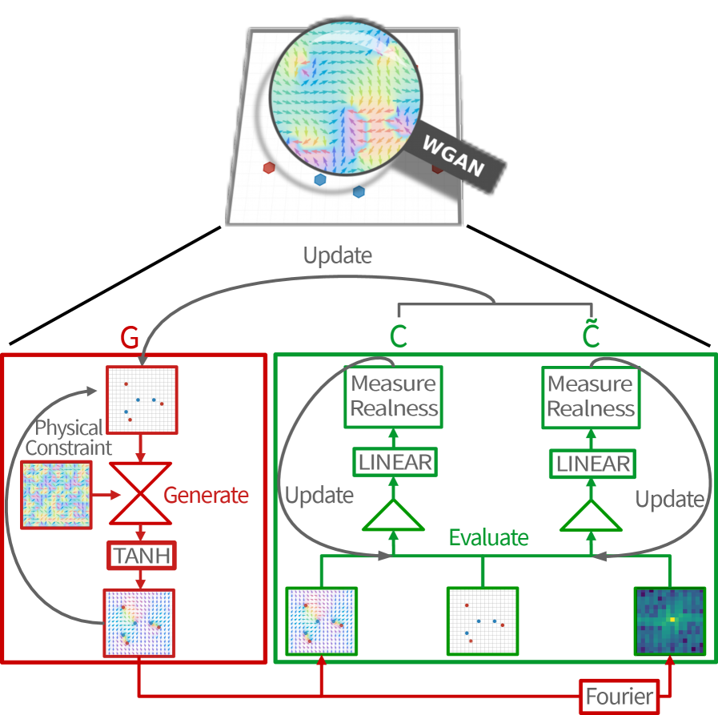
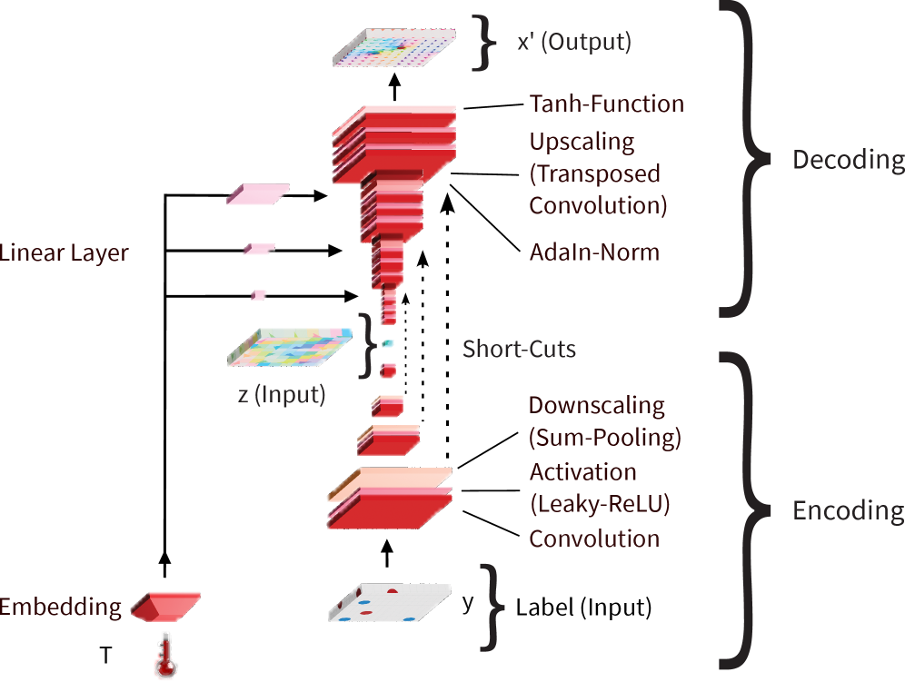
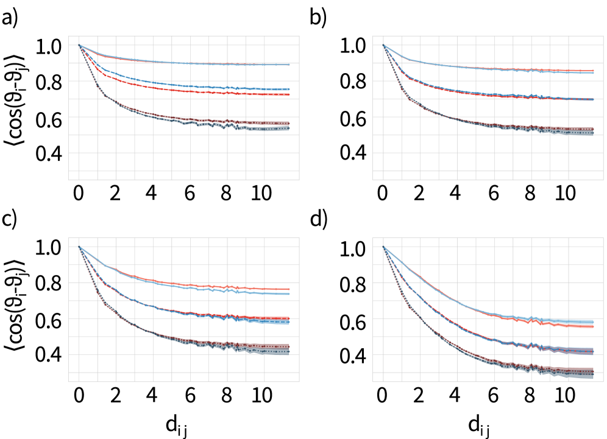
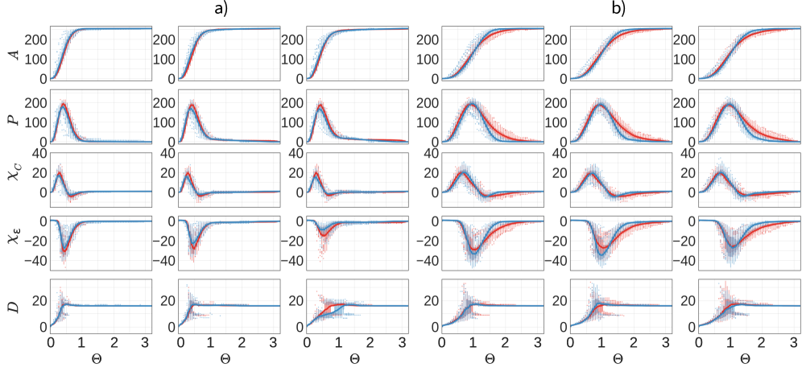
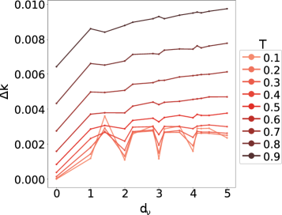
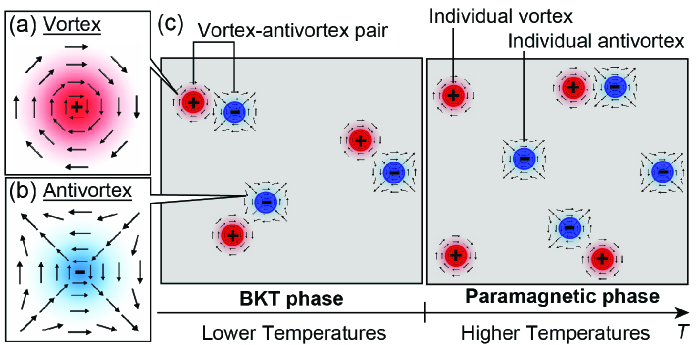
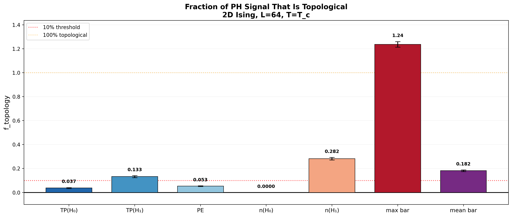

# 2次元XYモデルのスピン場再構成：生成AIで挑む位相的欠陥のマルチスケール逆問題

- 執筆日：2026-05-19
- トピック：渦-反渦対の巨視的配置から顕微的スピン配置を生成的ニューラルネットワークで再構成し、BKT転移近傍の熱力学量と位相的構造を定量検証する
- タグ：Magnetism and Spin / Topological Properties; Spin Liquids and Quantum Many-Body Systems / Machine Learning; Monte Carlo
- 注目論文：[Reconstruction of spin structures from topological charge distributions via generative neural network systems (arXiv:2605.00732)](https://arxiv.org/abs/2605.00732)
- 参照論文数：6本

---

## 1. 背景：なぜ今この話題か

物質中に現れる位相的欠陥（topological defect）は、材料物理学・磁性物理学・超流動体研究において長年にわたり中心的な研究対象であり続けてきた。磁性薄膜におけるスカイミオン、超流動ヘリウムにおける量子渦、液晶中の転位といった位相的欠陥は、それぞれが「巻き数」という整数値で特徴づけられるトポロジカルな安定性を持ち、単純な熱ゆらぎでは消滅しない頑健な構造体である。こうした欠陥の挙動はマクロな物性（熱伝導率、超流動密度、磁気応答など）を大きく左右するため、その定量的理解は基礎物理から機能材料設計まで幅広く重要となる。

位相的欠陥が材料研究者に突きつける本質的な困難は、「マルチスケール性」にある。欠陥は微視的なスピン場（あるいは秩序変数場）の局所的乱れとして定義されるが、欠陥どうしの相互作用や集団的挙動は巨視的（粗視化）スケールで初めて記述できる。たとえば2次元XYモデルにおける渦（vortex）と反渦（antivortex）のペアは、各格子点のスピン角度 $\vartheta_i \in [0, 2\pi)$ という顕微的な自由度を持つ一方で、実効的には対数ポテンシャルで相互作用する荷電粒子（クーロンガス）として巨視的に記述される。このような粗視化描像は理論的に非常に有用だが、問題が生じるのは逆方向への変換、すなわち「欠陥配置（巨視的情報）からスピン場（顕微的情報）を復元したい」場面である。

実験的な観点からも、この逆問題は喫緊の課題となっている。ローレンツ透過型電子顕微鏡（Lorentz-TEM）や小角中性子散乱（SANS）などの実験手法は、スカイミオン格子や磁気渦の実空間・逆空間分布を観測できるものの、原子スケールのスピン配置全体を直接取得することは極めて困難である。観測されるのはしばしば位相的欠陥の位置情報のみであり、その背後に潜む顕微的なスピン構造から物性を予測するには逆問題を解く必要がある。

このような背景の下、機械学習、とりわけ深層生成モデルを活用したアプローチが急速に注目を集めている。2010年代後半に機械学習が相転移の検出に応用されて以来、統計力学と人工知能の融合は活発な研究フロンティアとなってきた。制限ボルツマンマシン（RBM）、変分オートエンコーダ（VAE）、生成的敵対ネットワーク（GAN）、拡散モデルなど多様なアーキテクチャが逐次的に導入され、スピン配置の生成・分類・異常検知などに応用されてきた。2026年に入り、Klosら（Johannes Gutenberg大学マインツ）が発表したプレプリント（arXiv:2605.00732）は、この流れの中で一つの重要な節点をなす。彼らは条件付きWasserstein GAN（cWGAN）に物理的制約と位相的データ解析（TDA）を組み合わせ、2次元XYモデルにおいて欠陥配置からスピン場を精度よく再構成することを初めて示した。

---

## 2. 未解決問題は何か

### 2-1. 顕微的スピン場の逆問題：なぜ自明でないか

巨視的な欠陥配置（各格子プラケットにおける巻き数 $k_r \in \mathbb{Z}$）からスピン配置を「一意に」決定することは原理的に不可能である。なぜなら、巻き数は位相的情報のみを規定し、スピン波（spin wave）や熱ゆらぎが生み出す無数のミクロ状態が同一の欠陥配置と整合しうるからだ。つまり逆問題の答えは確率分布であり、単一の解ではない。この不定性を適切に扱いながら、温度・欠陥間距離に依存した物理的に正しい確率分布を学習することが求められる。

深層生成モデルがこの課題に有望とされる理由は、高次元の確率分布を端末から端末まで（end-to-end）に学習できる能力にある。しかし、一般的な生成モデルは「物理的整合性」を自動的に保証しない。特に巻き数保存（トポロジカル制約）をニューラルネットワークの出力に課す工夫が不可欠であり、これは標準的なGANには組み込まれていない難題である。解決の方向性としては、損失関数に物理制約項を付加する「物理情報ネットワーク（physics-informed NN）」的な手法が有望で、Klosらはまさにこのアプローチを採用している。

### 2-2. BKT転移と秩序パラメータの不在

2次元XYモデルが示すBerezinskii–Kosterlitz–Thouless（BKT）転移は、「秩序パラメータが消失せずに相転移が起きる」という奇妙な現象として、1970年代以来統計力学の難問であり続けてきた。低温相では渦-反渦対が束縛されており、擬長距離秩序（quasi-long-range order）が存在する。一方、高温相では渦が解放（unbinding）されて真の無秩序相となる。この転移は自由エネルギーの発散をともなわず、比熱にも顕著な特異点を示さないため、「通常の意味での秩序パラメータ」が存在しない。

機械学習によるBKT転移の検出がなぜ困難かというと、学習アルゴリズムが識別根拠とすべき明確な特徴量（Feature）がスピン配置の単純統計量には現れないからだ。渦の有無・密度という位相的情報こそが本質であり、その検出には位相的データ解析や特別に設計されたネットワーク構造が必要になる。生成モデルにとっても同様で、転移近傍では相関長が発散して多スケールのゆらぎが共存するため、その確率分布を学習することは特に困難である。どの生成モデルが転移点近傍の物理をどこまで再現できるかは現在も活発な議論の的であり、注目論文はこの点を定量的に検証した先駆的試みと位置づけられる。

### 2-3. 比熱という「エネルギーゆらぎ」の壁

生成モデルが熱力学量を再現するうえで、特に難しいのが「エネルギーゆらぎに関係する量」、すなわち比熱 $C = \frac{1}{k_B T^2}(\langle E^2 \rangle - \langle E \rangle^2)$ である。磁化や帯磁率は一体・二体相関で決まるが、比熱はエネルギーの分散、すなわちスピン波モード・一時的局所ゆらぎ・安定した渦励起という三つの成分が複雑に組み合わさった量である。生成モデルがこれら全ての寄与を同時かつ正確に学習できるかどうかは本質的な問いであり、現状ではほぼすべての手法でここに困難が集中している。この問題を克服するためには、スピン波という長距離モードとトポロジカル欠陥という局所的構造を同時に捉えるマルチスケール表現が不可欠だと考えられる。

---

## 3. 注目論文の概説

### 3-1. 研究目的と対象系

Klosら（2026年5月、arXiv:2605.00732）は、2次元XYモデルを舞台に「巻き数分布（winding number distribution）からスピン配置を確率的に再構成する」逆問題を解くことを目的とした。対象とした系は、$N = 16 \times 16$ 格子上の正方格子ハミルトニアン

$$
H = -J \sum_{\langle i,j \rangle} \cos(\vartheta_i - \vartheta_j)
$$

で記述される古典2次元XYモデルである。ここで $J$ は交換結合定数、$\vartheta_i \in [0, 2\pi)$ は格子点 $i$ のスピンの向きを表す角度である。BKT転移温度は $k_B T_{KT}/J = 0.8929(1)$ として知られており、本研究はこの転移温度以下の温度域 $T \in [0.2, 0.8]\, J/k_B$ を主に対象とした。

欠陥配置はプラケット $\Box_r$ ごとの巻き数

$$
k_r = \frac{1}{2\pi} \sum_{\{i,j\} \in \Box_r} \text{saw}(\vartheta_j - \vartheta_i), \quad \text{saw}(\Delta\varphi) = \text{Arg}(e^{i\Delta\varphi}) \in [-\pi, \pi]
$$

で定義される整数値として与えられる。渦（$k_r = +1$）と反渦（$k_r = -1$）が各1個ずつ配置された「1対ペア」設定を中心に、ペア間距離 $d_\nu = 0 \sim 5$ および欠陥なし配置を包括した315,000枚のスピン配置がモンテカルロ法で生成され、訓練データとして用いられた。

### 3-2. 研究アプローチ：物理制約付き条件付きWGAN

*図1：注目論文 Fig.4 より。巻き数分布（マクロ情報）を入力として受け取り、生成器（Generator）が対応するスピン配置（ミクロ情報）を出力するcWGANの概念図。批判器（Critic）がリアルスコアを返し、フィードバックループで生成器を更新する。 (Klos et al., arXiv:2605.00732, CC BY 4.0)*

モデルの核心は条件付きWasserstein GAN（cWGAN）である。標準的なGANと異なり、WGANは識別器（discriminator）の代わりに「批判器（critic）」を用い、生成分布と実データ分布の間のWasserstein距離（最適輸送距離）を最小化するように訓練される。これにより、モード崩壊（mode collapse）が起こりにくく、学習が安定するという利点がある。

生成器（Generator）はU-netアーキテクチャに基づいており、エンコーダ・ボトルネック・デコーダの三段構造と、各解像度でのスキップ接続（shortcut connection）から成る。入力は巻き数分布マップ $y$（巻き数を画像エンコードしたもの）と温度ラベル $T$ であり、ボトルネック部でガウスノイズ $z$ を注入することで確率的変動を実現する。温度情報は適応インスタンス正規化（AdaIN）を通じてデコーダ各層に注入される。

*図2：注目論文 Fig.5 より。生成器のネットワーク構造。エンコーダが多スケールで欠陥構造を捉え、ボトルネックでノイズが注入され、デコーダがスピン配置を出力する。 (Klos et al., arXiv:2605.00732, CC BY 4.0)*

損失関数に物理制約を組み込む点が本手法の最も重要な独自性である。生成器の損失関数は

$$
\mathcal{L}_G := -\frac{1}{2}\bigl(\mathbb{E}[f_C(x'|y,T)] + \mathbb{E}[f_{\tilde{C}}(x'|y,T)]\bigr) + \beta\, \mathbb{E}\!\left[\sum_{r=1}^N \alpha_r |\tilde{k}_r - k_r^{\text{target}}|^2\right]
$$

と定義される。第一・第二項は標準的なWGAN損失（批判器のスコアを最大化する方向）であり、第三項が物理制約項：生成されたスピン場の巻き数 $\tilde{k}_r$ が入力目標値 $k_r^{\text{target}}$ からずれると損失が増大する。巻き数の定義（Eq.9）は微分不可能であるため、微分可能な近似

$$
k_r \approx \tilde{k}_r = \frac{1}{4} \sum_{\{i,j\} \in \Box_r} (S_{i_x} S_{j_y} - S_{j_x} S_{i_y})
$$

（スピンの外積の和）が採用されている。

批判器は2つ設けられており、実空間批判器 $C$ とフーリエ空間批判器 $\tilde{C}$ が独立して機能する。フーリエ空間批判器は、長波長のスピン波モードを強化し局所的な偽ゆらぎを抑制することで、エネルギー再現性の改善に貢献する。両批判器はそれぞれ Inception レイヤーと残差モジュールを含む共通アーキテクチャを持ち、実数値のリアルスコアを出力する。

### 3-3. 主要結果

*図3：注目論文 Fig.8 より。欠陥なし（左）・近接欠陥（中）・遠方欠陥（右）に対して、$T = 0.2, 0.5, 0.8\, J/k_B$（上から下）で生成されたスピン配置の例。矢印がスピンの向きを、背景色がスピン角度を示す。 (Klos et al., arXiv:2605.00732, CC BY 4.0)*

訓練後の生成器は、以下の熱力学量について高い再現性を示した：

- **巻き数誤差** $\Delta\nu \sim \mathcal{O}(10^{-5})$：位相的制約が精度よく満たされている
- **磁化** $\langle|M|/N\rangle$：一致スコア 0.785–0.994
- **帯磁率** $\chi$：一致スコア 0.42–0.99
- **Binderキュムラント** $U$：0.849–0.957
- **エネルギー分布** $P(E)$：0.778–0.984
- **ヘリシティ率** $\Upsilon$：0.668–0.999（不安定領域の負値も含む）
- **スピン-スピン相関** $\langle\hat{S}_i \cdot \hat{S}_j\rangle$：温度・欠陥距離全域で高精度

一方、**比熱** $C$ の再現性は著しく劣っており、生成されたエネルギー分布は温度依存的なファットテールを示した。これは磁化ゆらぎ（スピン間対相関で決まる）と比べ、エネルギーゆらぎはスピン波・一時ゆらぎ・渦励起の三成分が複合するためと解釈されている。

*図4：注目論文 Fig.10 より。スピン間距離の関数としてのスピン-スピン相関 $\langle\cos(\vartheta_i - \vartheta_j)\rangle$。生成データ（青）と真のシミュレーションデータ（赤）の比較。欠陥なし・近接欠陥・遠方欠陥の各場合で良い一致を示す。 (Klos et al., arXiv:2605.00732, CC BY 4.0)*

### 3-4. 位相的データ解析（TDA）による補完分析

物理量による評価に加え、**永続ホモロジー（persistent homology）** に基づくTDA解析が行われた。スピン格子を立方体複体（cubical complex）へと変換し、隣接スピン間の角度差 $\Delta\vartheta_{ij}$ をフィルトレーション関数として用いることで、0次・1次ホモロジー群の永続性を追跡した。この手法は、一体・二体相関関数では捉えられない高次のn体相関および大域的接続構造を反映する。

*図5：注目論文 Fig.11 より。$\mathcal{H}_1$ の平均永続イメージの比較（シミュレーションデータ：左、生成データ：中、L1差分：右）。BKT転移近傍の高温域（$T = 0.8\, J/k_B$）で差分が拡大することが見て取れる。 (Klos et al., arXiv:2605.00732, CC BY 4.0)*

結果として、通常の相関関数では検知されない微細な差異がBKT転移近傍で現れることが示された。Minkowski汎関数（面積・周長・Euler標数）やグラフ径など幾何学的指標でも同様の傾向が観測されており、TDAが生成モデルの限界を検出する「高感度センサー」として機能することが示された。これは今後の生成モデル評価において、TDAを標準ツールとして導入すべきことを示唆する重要な知見である。

---

## 4. 研究史における位置づけ

### 4-1. 機械学習と統計力学の出会い（2017年～）

機械学習が相転移や位相的秩序の検出に応用された嚆矢は2017年頃にさかのぼる。Carrasquilla & Melkoが教師あり学習でIsingモデルの相転移を識別したことに始まり、WangはRBMを用いてXYモデルのBKT転移を研究した（1710.09842）。この時点での問題意識は「機械学習で相転移を検出できるか」という識別問題であり、生成問題（スピン場の再構成）はまだ射程外であった。

転換点の一つとなったのは、RBMを用いた生成的アプローチである。Zhang（2409.20377）は、通常の実数値RBM（RBM-xy）とcos/sin活性化を持つ新規RBM（RBM-CosSin）を比較し、RBM-CosSinがXYモデルのボルツマン分布を有効に学習し、熱力学量と位相的秩序（渦密度）を再現することを示した（2024年9月）。これは「生成モデルがBKT転移の両相を表現できる」ことを初めて定量的に示した重要な成果であった。

*図6：Zhang (arXiv:2409.20377) より。通常のRBMを拡張したRBM-CosSinのアーキテクチャ。可視ユニットがvon Mises分布に従うことで、XYスピン系の周期的な角度変数を自然に扱える。 (CC BY 4.0)*

Willnecker & Moodley（2406.13296）はオートエンコーダの潜在空間サンプリングを用いてXYモデルの臨界温度を同定した（2024年6月）。この手法は教師なし学習でBKT転移を検出する新しいルートを示し、特に転移点近傍での潜在表現の変化がBKT転移を捉えることを示した。

Jha（2602.07548）は2026年2月、「多様体対応スコアベース生成モデリング」という手法で64×64格子のXYモデルのBKT転移と熱力学を再現した。スピン系が周期角度空間（トーラス多様体）上に存在することを陽に考慮し、標準的な拡散モデルよりも精度高く比熱などの二次モーメントを再現したとされる。またゼロショットで異なるサイズへ汎化できる点も特筆に値する。

### 4-2. BKT転移のML検出という比較軸

Mochizuki & Miyajima（2502.09214）は2025年2月、q状態クロックモデルおよびXXZモデルにおけるBKT転移の検出を、新しく開発した「温度識別法」と「相分類法」の2手法で実現した。

*図7：Mochizuki & Miyajima (arXiv:2502.09214) より。機械学習によるBKT転移の検出法の模式図。直接の秩序パラメータがないBKT転移をMLが識別できることを示す。 (CC BY 4.0)*

BKT転移に秩序パラメータがないという困難に対し、MLアルゴリズムは温度ラベルとスピン配置の統計的な特徴量を対応づけることで転移を識別する。これは「MLが秩序パラメータを自動的に発見する」という側面も持ち、TDAとの組み合わせが特に強力であることが多くの研究で示されている。

### 4-3. 位相的データ解析の台頭

TDAの中核をなす永続ホモロジーのスピン系への応用は2020年代に加速している。Loftus（2603.29072、2026年3月）は「永続ホモロジーのどの部分がトポロジー的か？」という根本的問いに答えるべく、2DイジングおよびPottsモデルで永続ホモロジーシグナルを「密度駆動成分」と「位相的成分」に定量分離した。

*図8：Loftus (arXiv:2603.29072) より。永続ホモロジーシグナルのトポロジー的寄与割合（$f_\text{topo}$）の分解結果。$H_0$成分はほぼ密度駆動（94–100%）だが、$H_1$成分は部分的にトポロジー的で系サイズとともに増大する。 (CC BY 4.0)*

この結果は、注目論文でTDA補完解析が行われた意義を深化させる。すなわち、生成スピン場の評価において、$H_0$永続性のみでは「密度的特徴」しか評価できず、$H_1$永続性（1次元ループ・サイクル構造）の比較こそがトポロジー的リアリティを評価する鍵となる。

### 4-4. 注目論文の位置づけ

以上の研究史を踏まえると、Klosら（2605.00732）の位置づけが明確になる。従来の研究の多くは「スピン配置からの情報抽出（識別・相分類・物性予測）」という順方向の問題に取り組んでいた。これに対し本論文は「欠陥配置からスピン配置への逆方向生成」という逆問題を正面から設定し、（1）物理的整合性（巻き数制約）の明示的組み込み、（2）二重批判器（実空間＋フーリエ空間）による多スケール評価、（3）TDA補完評価という三つの独自性を持つ。また多くの先行研究が10×10程度の小系か、あるいは制約なし生成に留まっていたのに対し、本研究は温度・欠陥距離の2パラメータ空間を系統的に網羅している点でも前進している。

---

## 5. どの解釈が最も妥当か

### 5-1. 物理制約の有効性と限界

巻き数保存を損失関数に組み込むアプローチは成功しており、生成スピン配置の巻き数誤差は $\sim 10^{-5}$ という極めて小さな値に収まっている。これは「位相的なハードウェア」をソフトウェア的に実装するという課題が原理的に実現可能であることを示す。ただし、これは「正しい欠陥位置に渦が現れる」ことを保証するだけで、その周囲のスピン波的なソフトモードが正確に学習されるかどうかとは独立している。実際、比熱の再現性が低いことから、これらのソフトモードの統計量（分散）が不正確であることが示唆される。

一つの有力な解釈は、**GANが確率分布の「典型的なサンプル」の再現は得意だが「分布の幅（ゆらぎ）」の再現は苦手**というものである。エネルギー期待値 $\langle E \rangle$ は高精度で再現されるが、比熱に対応する $\langle E^2 \rangle - \langle E \rangle^2$ は過大評価される傾向がある。これはモード崩壊の残渣ではなく、エネルギーランドスケープの多成分性（スピン波・渦・一時ゆらぎ）に起因すると考えられる。

### 5-2. フーリエ批判器の役割と残る課題

二重批判器の設計においてフーリエ空間批判器は比熱再現の改善に貢献したとされるが、完全な解決には至っていない。これは「周波数空間での正確な分布再現」と「実空間での局所的なゆらぎ構造の再現」を両立させることの困難さを反映している。フーリエ批判器は長波長モードを強化するが、短波長の熱ゆらぎ（高エネルギー励起）の分布までは制御し切れていない可能性がある。今後は比熱に直接対応する量（エネルギー分散）を損失関数に明示的に組み込む「熱力学制約付き生成モデル」の開発が一つの方向性となろう。

### 5-3. TDAが明かす「見えない限界」

比熱問題と並んで重要な知見が、TDA解析による転移近傍での差異検出である。標準的な相関関数ではほぼ再現できているにもかかわらず、永続イメージ（特に $H_1$）には系統的なズレが生じており、それはBKT転移温度 $T_{KT}$ に近いほど拡大する。この結果は、「物理量一致スコアが高い≠物理的に完全に正しい」という重要な教訓を与えており、高次の多体相関が正確に捉えられていないことを示唆する。

一方、Loftusの研究（2603.29072）が示すように、$H_0$永続性シグナルは大部分が密度的情報であり位相的内容は少ない。これに対し本論文の $H_1$ 解析は、スピン場の1次元的ループ構造（スピン波のコヒーレンス構造）のトポロジー的欠落を検出していると解釈できる。現時点で比較的強く支持される解釈は「GAN が低次相関は正確に学習するが、BKT転移近傍の高次相関（多体的なスピン波・渦の協同ゆらぎ）は不完全にしか学習できない」というものであり、これはまだ仮説の段階だが実験的証拠（TDAの差分パターン）によって支持されている。

### 5-4. 他モデルとの比較

RBM-CosSin（2409.20377）との比較では、RBMはより単純な確率モデルながらも熱力学量・渦密度の再現性で良好な結果を示しており、学習コストと精度のトレードオフが異なる。拡散モデル（2602.07548）はゼロショット汎化という強みを持つが、1サンプル生成に多数の逆拡散ステップを要するため、大規模なサンプル生成（例えば数万枚の配置が必要な統計解析）ではWGANの方が時間効率的に優位となる可能性がある。これらの手法間の比較系統研究は今後の重要な課題である。

---

## 6. 何が一般化できるか

### 6-1. スカイミオン系・磁気渦への展開

本論文の手法が2次元XYモデルで機能することは、磁気薄膜中のスカイミオンや磁気渦系への応用可能性を直接示唆する。スカイミオンは2次元ベクトルスピン場における $S^2 \to S^2$ 型のホモトピー群で分類されるトポロジカル数（skyrmion number）で特徴づけられており、渦の巻き数と概念的に類似している。実験的にはLorentz-TEMでスカイミオン格子の粗視化像が観測されており、その背後に潜む原子スケールのスピン構造をcWGANで再構成するという応用は直接的かつ高インパクトである。Taniwakiら（2504.14688）の永続ホモロジーをスカイミオン格子に適用した研究はこの接続の萌芽を示しており、生成モデルとTDAを組み合わせた評価枠組みの有効性が期待される。

### 6-2. 液晶・超流動体への転用

転位（dislocation）や絡み合い（entanglement）といったトポロジカル欠陥を持つ液晶系や超流動ヘリウム系でも、同様のマルチスケール逆問題が存在する。ネマティック液晶の +1/2, −1/2 型欠陥は巻き数が半整数であるなど、対称性群に応じた欠陥トポロジーの種類が変わるが、「巻き数分布→順序場の再構成」というフレームワーク自体は転用可能である。ただし、連続対称性から離散対称性へ、あるいはベクトル場からテンソル場への拡張では、巻き数の定義・物理制約項の構築・生成器アーキテクチャの設計をそれぞれ見直す必要があり、自明ではない。

### 6-3. 粗視化−再構成の一般原理

Zhangら（2305.01243）が提案した「可逆粗視化（Invertible Coarse Graining: CCG）」の枠組みは、本論文の研究と深いところで共鳴している。CCGは分子シミュレーションにおいて、粗視化描像（CG配置）から全原子描像（all-atom配置）を深層生成モデルで再構成する技術であり、CG→all-atomの変換が今回のKlosらの「巻き数分布→スピン場」変換に構造的に対応する。異なる物理スケール間の「バックマッピング（back-mapping）」という概念は、物質シミュレーション全般における普遍的課題であり、生成モデルが有効な一般的ツールとなりうることを示唆する。

### 6-4. AI for Scienceとしての位置づけ

本研究はAI for Scienceの典型例として重要な示唆を持つ。ニューラルネットワークが物理的な制約（巻き数保存）を損失関数レベルで明示的に取り込み、実空間とフーリエ空間の両方で評価する二重批判器を採用している設計は、「物理に無知なブラックボックス生成」を超えた「物理準拠生成」の方向性を示す。また、TDAを用いてモデルの失敗モードを定量評価するアプローチは、AIシステムの信頼性を物理的基準で評価するベンチマーク手法の雛形ともなりうる。

---

## 7. 基礎から理解する

### 7-1. 2次元XYモデルとは何か

XYモデルは、格子の各格子点に「向き」だけを持つ古典的なスピン（2次元単位ベクトル $\hat{S}_i = (\cos\vartheta_i, \sin\vartheta_i)$）を配置し、隣接スピン間の交換相互作用を記述するモデルである。ハミルトニアンは

$$
H = -J \sum_{\langle i,j \rangle} \hat{S}_i \cdot \hat{S}_j = -J \sum_{\langle i,j \rangle} \cos(\vartheta_i - \vartheta_j)
$$

であり、$J > 0$ なら強磁性的（隣接スピンが平行を好む）、$J < 0$ なら反強磁性的になる。Isingモデルがスピン方向を上向き・下向きの2値に制限するのに対し、XYモデルはスピンが連続的に回転できる。この違いが相転移の性質を根本的に変える。

Mermin–Wagnerの定理によれば、2次元連続対称性を持つ系では有限温度での長距離秩序（自発磁化）は熱ゆらぎによって壊れてしまう。したがって2次元XYモデルでは、任意の有限温度で $\langle\hat{S}\rangle = 0$ となり、「通常の意味での強磁性相転移」は起きない。それにもかかわらず、系は低温で擬長距離秩序（スピン-スピン相関がべき乗則 $\langle\hat{S}_i \cdot \hat{S}_j\rangle \sim r_{ij}^{-\eta(T)}$ で減衰）を持ち、高温で指数関数的な相関の乱れが生じるという、きわめて特殊な相転移を示す。

### 7-2. BKT転移：位相的相転移の本質

Berezinskii（1972年）とKosterlitz–Thouless（1973年）によって提唱されたBKT転移は、「位相的欠陥である渦の束縛－解放を駆動力とする無限次相転移」である。この転移の物理的シナリオは以下のように描かれる。

低温相では、渦（$k = +1$）と反渦（$k = -1$）が「束縛対（bound pair）」を形成し、互いに近傍に拘束されている。この状態では対全体として位相的に中性（合計巻き数ゼロ）であり、マクロな位相的秩序を乱さない。対数的なエネルギーコスト

$$
E_{\text{pair}} = \pi J \ln(d_\nu / a) + 2E_c
$$

（$d_\nu$：渦-反渦間距離、$a$：格子定数、$E_c$：コアエネルギー）を、束縛エントロピー $S = 2k_B \ln(d_\nu / a)$ が補償できるかどうかが温度で決まる。自由エネルギー $F = E - TS \sim (\pi J - 2k_B T)\ln(d_\nu/a)$ がゼロになる温度、すなわち $T_{KT} = \pi J / (2k_B)$ で渦対が解放し始め、フリー渦が増殖する。

高温相ではフリー渦の存在がスピン-スピン相関を指数関数的に乱すため、擬長距離秩序が失われ、ヘリシティ率 $\Upsilon$ がゼロになる。BKT転移ではヘリシティ率が

$$
\Upsilon(T_{KT}^-) = \frac{2k_B T_{KT}}{\pi} \quad (\text{universal jump})
$$

という普遍的なジャンプを示すことが理論的に証明されており、これが転移の確実な証拠となる。

2次元XYモデルの転移温度は格子系でわずかに補正されて $k_B T_{KT}/J \approx 0.8929$ となる。

### 7-3. 渦（ボルテックス）の位相的性質

渦は「位相的欠陥」の代表例であり、欠陥コアを一周するスピン角度の積分が $2\pi$ の整数倍になる点として定義される。

$$
\oint d\vartheta = 2\pi k, \quad k \in \mathbb{Z}
$$

$k = +1$ が渦（反時計回りにスピンが一周する）、$k = -1$ が反渦（時計回り）である。離散格子ではこのコンタール積分をプラケットに沿った有限差分で離散近似する（Eq.9）。

渦は「位相的に保護されている」。すなわち、滑らかなスピン場の変形（連続変形）では渦は生成も消滅もできない。渦と反渴はペアとしてのみ生成・消滅が可能である。この性質がBKT転移の「束縛→解放」シナリオを支えている。渦コアのエネルギーは局所的だが、渦周囲のスピン場の歪みは遠距離まで広がり（$|\nabla\vartheta| \sim 1/r$）、孤立した渦のエネルギーはシステムサイズと対数的にスケールする。

### 7-4. 生成的敵対ネットワーク（GAN）

GAN（Goodfellow et al., 2014）は生成器（Generator, G）と識別器（Discriminator, D）が競争的に訓練されることで、学習データと統計的に区別できないサンプルを生成できるようになるアーキテクチャである。生成器は乱数ノイズ $z$ を入力として偽サンプル $x' = G(z)$ を生成し、識別器は真のデータ $x$ と偽データ $x'$ を区別するように訓練される。この枠組みは以下のminimax問題として定式化される：

$$
\min_G \max_D \mathbb{E}_{x \sim p_{\text{data}}}[\log D(x)] + \mathbb{E}_{z \sim p_z}[\log(1 - D(G(z)))]
$$

標準的なGANには学習の不安定性（モード崩壊・勾配消失）という問題があるため、Wasserstein GAN（WGAN）はWasserstein距離（最適輸送距離）を目的関数とすることで安定性を改善した：

$$
W(p_{\text{data}}, p_G) = \sup_{\|f\|_L \leq 1} \bigl[\mathbb{E}_{x \sim p_{\text{data}}}[f(x)] - \mathbb{E}_{x' \sim p_G}[f(x')]\bigr]
$$

ここで最適化は1-Lipschitz関数 $f$ の全体で行われる（批判器 $f$ が担う）。条件付きWGAN（cWGAN）はさらに生成器に条件情報（本研究では欠陥配置 $y$ と温度 $T$）を入力し、条件付き確率分布 $p(x|y, T)$ を学習する。

### 7-5. U-netアーキテクチャ

U-netは医用画像セグメンテーションのために提案されたエンコーダ–デコーダ型ネットワークで、各解像度レベルにスキップ接続が設けられている。エンコーダは入力を段階的に低解像度化しながら高次の特徴を抽出し、デコーダはそれを段階的に元の解像度まで復元する。スキップ接続によりエンコーダの局所的な情報がデコーダへ直接転送されるため、細部の再現性が高い。XYモデルへの応用では、エンコーダが欠陥周囲のスピン構造を多スケールで捉え、デコーダが温度依存的なスピン配置を再構成する。

### 7-6. 永続ホモロジー（Persistent Homology）

位相的データ解析（TDA）の中核をなす永続ホモロジーは、データの「穴の構造」がどのスケールで生まれ、どのスケールで消えるかを系統的に追跡する手法である。

まずデータ（ここでは格子上のスピン場）を「単体複体（simplicial complex）」または「立方体複体（cubical complex）」として表現する。次に、あるパラメータ（フィルトレーション関数 $f$）に従って複体を段階的に構築するフィルトレーションを定義する。本研究では $f(\sigma_{\{ij\}}) = \frac{1}{2\pi}\Delta\vartheta_{ij}$（隣接スピン間角度差）が用いられた。

フィルトレーションパラメータ $\Theta$ を増加させながら、0次ホモロジー群 $\mathcal{H}_0$（連結成分）と1次ホモロジー群 $\mathcal{H}_1$（ループ・サイクル）の誕生（birth $\Theta_\alpha$）と消滅（death $\Theta_\beta$）を追跡する。この誕生–消滅対 $(\Theta_\alpha, \Theta_\beta)$ の集合が永続ダイアグラム（persistence diagram: PD）であり、フィーチャの「寿命」$\tau = \Theta_\beta - \Theta_\alpha$ が長いほど物理的に意味のある構造を反映する。

永続イメージ（persistence image: PI）はPDをGaussianカーネルで平滑化したもので、比較・機械学習の特徴量として用いやすい形式となる。本研究ではこのPIを用いて、生成スピン場と真のスピン場の位相的構造を定量比較した。

---

## 8. 専門用語の解説

**巻き数（winding number）**：スピン場における位相的欠陥を特徴づける整数量。欠陥コアを一周する経路に沿った位相の変化量を $2\pi$ で割った値で定義され、$k = \pm 1$ が最も基本的な渦・反渦に対応する。自由エネルギーは $k^2$ に比例するため、高次の欠陥（$|k| \geq 2$）は複数の基本欠陥に分裂する傾向がある。本論文では、各格子プラケットの巻き数分布がWGANの入力条件として用いられ、かつ物理制約損失の基準量となっている。

**BKT転移（Berezinskii–Kosterlitz–Thouless transition）**：2次元連続対称性系において渦対の束縛・解放により引き起こされる無限次相転移。通常の意味での秩序パラメータや自発対称性の破れを伴わず、ヘリシティ率の普遍的ジャンプ（$\Delta\Upsilon = 2k_BT_{KT}/\pi$）を唯一のシグナルとする。本論文では $T_{KT} = 0.8929(1)\, J/k_B$ 以下の温度域が対象で、擬長距離秩序（スピン-スピン相関のべき乗則減衰）が保たれる低温相のスピン場再構成が主課題となっている。

**ヘリシティ率（helicity modulus / spin-wave stiffness）**：スピン系が外部から与えた巨視的なスピン捻り（グラジエント）に対してどれだけ抵抗するかを表す量。平衡シミュレーションではゆらぎの公式 $\Upsilon = \frac{1}{L^2}\langle J\sum\cos(\vartheta_i-\vartheta_j)(\hat{e}\cdot\hat{\epsilon}_{ij})^2\rangle - \frac{1}{k_BT L^2}\langle(J\sum\sin(\vartheta_i-\vartheta_j)(\hat{e}\cdot\hat{\epsilon}_{ij}))^2\rangle$ で計算される。低温束縛相で正の値（スピン剛性がある）、高温解放相でゼロとなり、BKT転移の最も鋭敏な指標となる。本論文の生成スピン場はヘリシティ率を高精度で再現（一致スコア 0.668–0.999）した。

**Wasserstein距離**：二つの確率分布間の距離を「最適輸送コスト」で測る指標。一方の分布の確率質量を他方の分布へ「移動」するコストの最小値として定義され、分布が重なっていない場合も有限の距離を与えるKullback–Leibler発散とは異なり、勾配消失問題を防ぐことでGAN学習の安定性に貢献する。本論文ではWGANの損失関数構成に直接用いられており、また生成配置と真の配置のエネルギー分布・磁化分布の比較（一致スコア）においても正規化Wasserstein-1距離が採用されている。

**永続ホモロジー（persistent homology）**：フィルトレーションに沿って位相的特徴（連結成分・ループなど）の誕生と消滅を追跡するTDAの手法。長寿命のフィーチャが物理的に意味のある構造を反映するとの考えのもと、スピン場の多スケール相関構造を通常の相関関数を超えて定量化できる。本論文ではスピン格子から立方体複体を構築し、隣接スピン間角度差をフィルトレーション関数として $\mathcal{H}_0, \mathcal{H}_1$ の永続ダイアグラムを計算。生成スピン場の評価において、BKT転移近傍で通常の熱力学量評価では見えない差異を検出することに成功した。

**条件付きWGAN（cWGAN）**：条件情報（クラスラベル・構造情報など）を入力として与えることで、特定の条件に対応する確率分布からのサンプル生成を可能にしたWGANの拡張。本論文では欠陥配置マップ $y$（巻き数分布）と温度 $T$ が条件として生成器へ入力される。このため、「欠陥位置Aに渦、位置Bに反渦があり、温度は $0.5\, J/k_B$ のとき、どのようなスピン場が生成されるか？」という問いに確率論的に答えることができる。

**AdaIN（適応インスタンス正規化）**：スタイル転送ニューラルネットワークで提案された正規化手法。特徴マップの平均・分散を外部から与えるパラメータで動的に制御することで、スタイル情報（本論文では温度ラベル）を生成プロセスへ効率的に注入できる。本論文ではStyleGANの手法に倣い、デコーダ各層でAdaINを適用することで温度依存的なスピン場のテクスチャを生成している。

**比熱（specific heat）**：エネルギーのゆらぎ $C = \frac{1}{k_BT^2}(\langle E^2\rangle - \langle E\rangle^2)$ で与えられる熱力学量。BKT転移近傍でも比熱に顕著な特異点は現れないことがBKT転移の特徴の一つである。一方、本論文では生成スピン場の比熱が真の値から大きく外れており、エネルギー分布のファットテール（過広分布）として現れる。この困難はスピン波モード・一時ゆらぎ・渦励起という複数成分のエネルギーゆらぎを生成モデルが同時に学習できていないことを示唆し、現状の生成モデルの根本的限界の一つとなっている。

**U-netアーキテクチャ**：エンコーダとデコーダをスキップ接続で繋いだ階層的ネットワーク構造。元々は医用画像セグメンテーション向けに提案されたが、スピン配置生成においてもその利点（多解像度での特徴抽出と局所情報の保存）が有効に機能する。本論文では、エンコーダが欠陥の大局的配置を捉えつつ、スキップ接続が格子点レベルのスピン向き情報をデコーダへ伝達するという多スケール設計が採用されており、欠陥周囲のスピン構造の精度向上に貢献している。

**粗視化（coarse-graining）とバックマッピング**：粗視化は微視的自由度を積分出して有効な巨視的記述を導く手続きであり、分子動力学・量子多体・統計力学の広範な分野で用いられる。バックマッピング（逆粗視化・back-mapping）はその逆過程で、粗視化配置から微視的配置を確率論的に復元する。本論文の「巻き数分布→スピン場」変換は磁性系でのバックマッピングと解釈でき、分子シミュレーションでのCG→全原子変換（2305.01243）と本質的に同じ数学的構造を持つ。

---

## 9. 将来展望

生成モデルによるスピン場の逆問題研究は、今後数年で急速に発展すると予想される。まず、今かなり確からしくなったこととして、「物理制約を損失関数に陽に組み込んだWGANは、磁化・帯磁率・ヘリシティ率・スピン-スピン相関など一体・二体相関で決まる量を高精度で再現できる」ということが本論文で実証された。また、永続ホモロジーを用いたTDA評価が生成スピン場の「見えない失敗モード」を検出できる強力なツールであることも示された。こうした物理情報・位相情報を組み込んだ生成モデル評価の枠組みは、他の生成モデル研究にも波及すると予想される。

一方、まだ未確定のことも多い。最も根本的な未解決問題は「エネルギーゆらぎ（比熱）の精確な再現」であり、現状のWGAN・RBM・拡散モデルのいずれも完全な解決を示していない。この問題を克服するためには、比熱を直接の学習目標に組み込む熱力学制約付き損失関数の設計、あるいは多体エネルギーゆらぎを明示的にモデル化する物理インフォームドアーキテクチャの開発が必要と思われる。また、16×16という比較的小さな格子での結果が大系・複雑な欠陥配置（多渦系・ランダム欠陥）にどこまでスケールするかも未検証であり、系サイズ依存性の系統的研究が急務である。

次に重要になる実験・理論・計算として、三点が注目される。第一に、拡散モデルとWGANの直接比較研究である。Jha（2602.07548）の拡散モデルとの定量比較（特に比熱再現性、計算コスト、ゼロショット汎化性能）は、どのアーキテクチャがどの問題設定で優れているかを明確にする上で不可欠となろう。第二に、スカイミオン系への展開である。実験で観測された粗視化スカイミオン像から原子スケールのスピン構造を再構成するという実用的応用は、数年以内に実証されることが期待される。第三に、TDAと機械学習の深い融合である。生成スピン場の評価に永続ホモロジーを使うだけでなく、TDA特徴量を損失関数や訓練指標に直接組み込んだ「位相的に制約された生成モデル」の開発は、位相的秩序を持つ系全般のシミュレーション高速化に革命的影響をもたらす可能性がある。

---

## 参考論文一覧

1. [Klos et al., "Reconstruction of spin structures from topological charge distributions via generative neural network systems," arXiv:2605.00732 (2026)](https://arxiv.org/abs/2605.00732) — 本記事のアンカー論文。2次元XYモデルにおいて巻き数分布からスピン配置を再構成する条件付きWGAN（物理制約・TDA評価付き）を提案した。

2. [Zhang, "Learning thermodynamics and topological order of the 2D XY model with generative real-valued restricted Boltzmann machines," arXiv:2409.20377 (2024)](https://arxiv.org/abs/2409.20377) — cos/sin活性化を持つ実数値RBM（RBM-CosSin）がXYモデルのボルツマン分布を学習し、KT転移を含む熱力学と位相的秩序を再現することを示した生成モデル比較の基準となる研究。

3. [Jha, "Capturing the Topological Phase Transition and Thermodynamics of the 2D XY Model via Manifold-Aware Score-Based Generative Modeling," arXiv:2602.07548 (2026)](https://arxiv.org/abs/2602.07548) — トーラス多様体上のスコアベース拡散モデルでXYモデルのBKT転移と熱力学（比熱含む）を再現し、ゼロショット汎化性能を示した2026年の対比論文。

4. [Mochizuki & Miyajima, "Machine-Learning Detection of the Berezinskii-Kosterlitz-Thouless Transitions," arXiv:2502.09214 (2025)](https://arxiv.org/abs/2502.09214) — 温度識別法・相分類法の2手法でq状態クロックモデルとXXZモデルのBKT転移を機械学習で検出することに成功した。BKT転移検出における機械学習の現状を示す。

5. [Loftus, "How much of persistent homology is topology? A quantitative decomposition for spin model phase transitions," arXiv:2603.29072 (2026)](https://arxiv.org/abs/2603.29072) — 永続ホモロジーシグナルの密度駆動成分とトポロジー的成分を定量分離し、$H_1$統計量のトポロジー的寄与が系サイズとともに増大することを示した。TDA評価の理論的根拠を提供する。

6. [Zhang et al., "Invertible Coarse Graining with Physics-Informed Generative Artificial Intelligence," arXiv:2305.01243 (2023/2024)](https://arxiv.org/abs/2305.01243) — 分子シミュレーションにおける粗視化–全原子バックマッピングを深層生成モデルで実現するCCG（Cycle Coarse Graining）法を提案。スピン系の逆問題と数学的に同型の枠組みを提供する。
