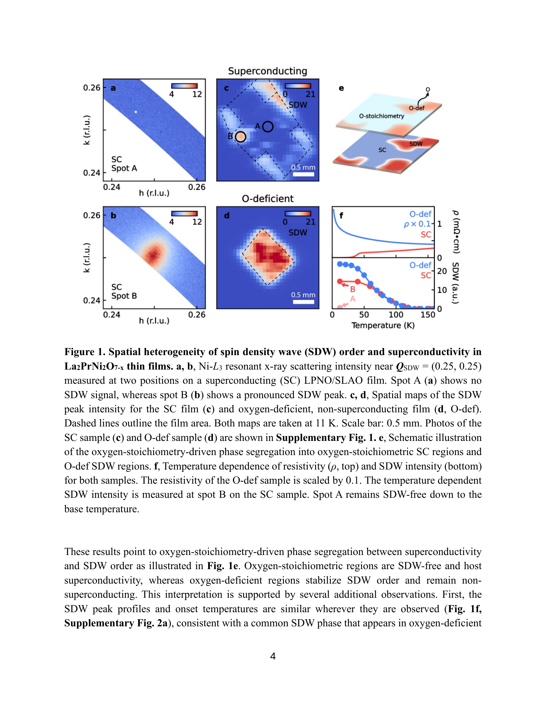
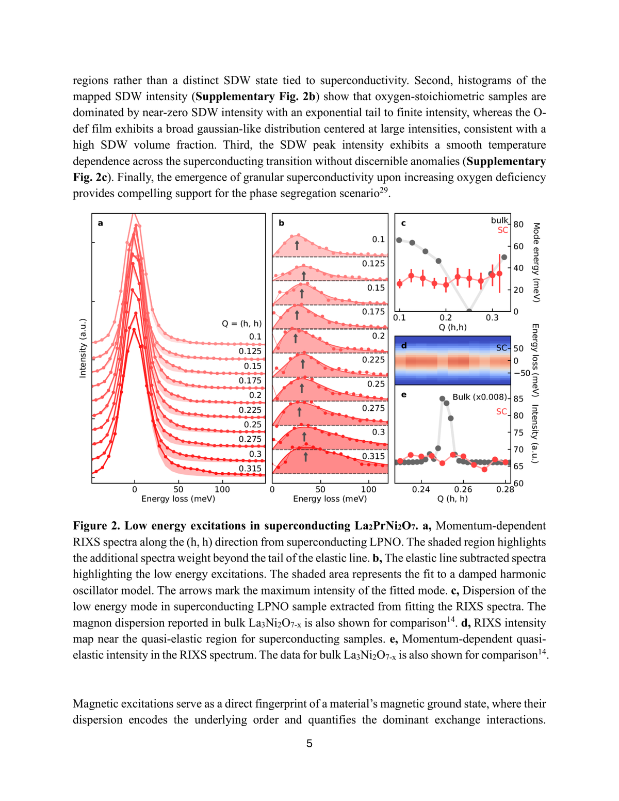
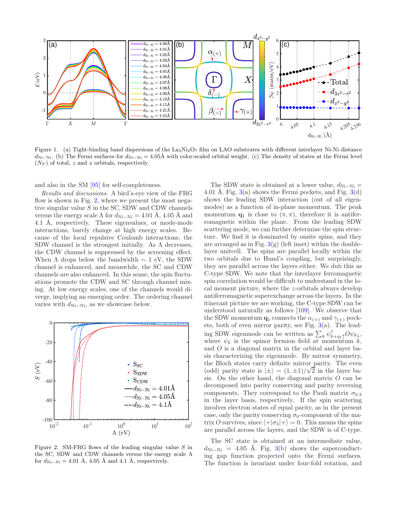
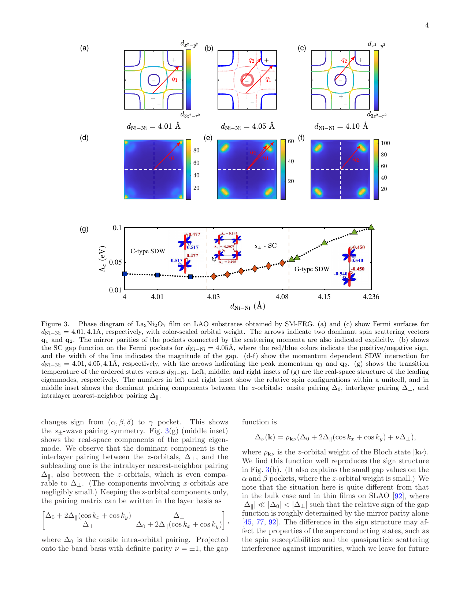

# 二層ニッケル酸化物La₃Ni₂O₇薄膜の常圧超伝導：酸素化学量論・スピン密度波・層間電子構造が解き明かすペアリング機構

- 執筆日：2026-05-20
- トピック：エピタキシャル歪みと酸素化学量論によって制御される二層ニッケル酸化物の薄膜超伝導と、スピン密度波との競合機構
- タグ：Superconductivity and Strongly Correlated Systems / Thin Films and Interfaces; Charge, Orbital, and Spin Order / Transport Measurements; Synchrotron Measurements; Neutron Scattering
- 注目論文：[Meng Zhang, Xi Yan "Experimental Progress in Ambient-Pressure Superconducting Bilayer Nickelate Films" arXiv:2605.11584 (2026)](https://arxiv.org/abs/2605.11584)
- 参照論文数：7本

---

## 1. 背景：なぜ今この話題か

2023年5月、中国科学院の Sun らが圧力下の La₃Ni₂O₇ 単結晶において転移温度 Tc ≈ 80 K の超伝導を発見した（Nature 621, 493 (2023)）。この衝撃は二つの意味で際立っていた。一つは、銅酸化物（cuprate）以外の酸化物で初めて液体窒素沸点（77 K）を超える高温超伝導が観測されたこと、もう一つは、ニッケルという銅に隣接する元素の酸化物が舞台であったことだ。ニッケル酸化物は銅酸化物との類似性と相違点を兼ね備えており、高温超伝導の機構を普遍的に理解するための新しい試金石として学界の期待を一身に集めた。

しかし発見直後から大きな壁が存在した。La₃Ni₂O₇ は圧力下でしか超伝導を示さない。14〜43.5 GPa という極端な高圧環境では輸送測定や分光測定の手段が著しく制限され、超伝導の詳細な電子構造や対称性を調べる実験が困難であった。この制約を突き破ったのが薄膜エピタキシー技術である。2025年初頭、Stanford 大の Hwang グループが SrLaAlO₄（SLAO）基板上に成長させた La₃Ni₂O₇ エピタキシャル薄膜で常圧超伝導（Tc ≈ 40〜80 K）を達成し（Ko et al., Nature 638, 935 (2025)）、超伝導ニッケル酸化物の研究は新局面を迎えた。基板が誘起するエピタキシャル歪みが、高圧と同等の構造変化を常圧のまま薄膜に再現できることが判明したのである。

こうして常圧薄膜超伝導の報告が相次ぐ一方で、重大な未解決問題が浮上している。まず薄膜の質——酸素化学量論や構造均一性——が超伝導の鍵を握ることが示唆されており、酸素欠損が局所的にスピン密度波（SDW）秩序を引き起こして超伝導を抑制するという描像が提唱されている。さらに、超伝導のペアリング機構（s± 波か d 波か）、二段的な超伝導転移の起源、Ni 3dz² に由来する γ バンドの位置、そして銅酸化物との本質的な相違点など、基礎的な問いが山積したままである。

2026年5月に arXiv に投稿された Meng Zhang と Xi Yan によるレビュー論文「Experimental Progress in Ambient-Pressure Superconducting Bilayer Nickelate Films」（arXiv:2605.11584）は、この急速に発展するフロンティアを包括的に整理した注目すべき論文である。同時期に投稿された複数の実験・理論論文を横断することで、薄膜常圧超伝導の全体像が初めて明確な輪郭を持ち始めている。

---

## 2. 未解決問題は何か

### エピタキシャル歪みはなぜ高圧効果を再現できるのか

常圧バルク La₃Ni₂O₇ は超伝導を示さない。14 GPa 以上の高圧で Fmmm 空間群の構造に転移した後に初めて超伝導が現れる。一方、SLAO 基板上の薄膜は常圧でも超伝導を示す。この差異の本質的な原因はまだ完全には解明されていない。有力な解釈は「層間 Ni–Ni 距離 $d_{\rm Ni-Ni}$（c 軸方向の Ni–O–Ni ボンド長）の圧縮が決定的」というものだ。高圧でも SLAO 基板による面内圧縮歪みでも、結果としてこの距離が短縮されることで Ni 3dz² 軌道の層間ハイブリダイゼーションが増大し、超伝導に必要な電子構造が形成されるという描像である。しかし SLAO 上の薄膜は、同じ面内格子定数を持つ高圧バルクとは c 軸長が微妙に異なり、単純な圧力模倣ではないことも指摘されている。格子歪みの三次元的な制御と超伝導 Tc の系統的な関係を明らかにすることが、メカニズム解明の第一歩として求められている。具体的には、異なる基板（SLAO、LaAlO₃（LAO）、SrTiO₃ など）を用いて $d_{\rm Ni-Ni}$ を連続的に変化させ、Tc の変化を精密に追う実験が重要な検証手段となる。

### 超伝導とスピン密度波の競合と共存の問題

La₃Ni₂O₇ のバルク試料では常圧で波数 $\mathbf{Q} = (0.5, 0, 0)$ 付近のストライプ型 SDW 秩序が観測されている。薄膜でも SDW が現れるが、その分布は空間的に不均一である。酸素化学量論が正確な超伝導薄膜では SDW は観測されない一方、酸素欠損した非超伝導領域では SDW が顕著に現れるという相分離の実験的証拠が報告されている。これは、SDW と超伝導が同一試料中に共存しているのではなく、酸素化学量論を通じて競合していることを示唆する。しかしこの相分離の微視的な起源——酸素欠損が局所的な電子構造をどう変えて SDW を安定化するのか——はまだ定性的な議論の域を出ていない。より根本的には、SDW ゆらぎが超伝導ペアリングを媒介する（引力を生む）のか、それとも SDW 秩序が超伝導を破壊する（競合する）のかという問いが理論的に未解決であり、多くの理論グループが異なる立場をとっている。

### ペアリング対称性：s± 波か d 波か

高温超伝導の中核的問いである「ペアリング対称性」についても議論が続いている。銅酸化物では d 波（$d_{x^2-y^2}$ 対称性）が確立しており、単一の Cu 3dx²-y² バンドにおける超交換相互作用と整合する。一方 La₃Ni₂O₇ では Ni 3dx²-y² に由来する β バンドと Ni 3dz² に由来する γ バンドの二つが フェルミ面を形成する多軌道系であり、ペアリングの競争相手が増える。多くの理論計算は、スピンゆらぎに媒介される s± 波超伝導（β-β 間と γ-γ 間でギャップの符号が反転する）を示唆しているが、γ バンドのフェルミ準位との交点の位置（ARPES では測定グループによって解釈が異なる）が s± 波の安定性に大きく影響する。d 波の可能性を否定できないという立場もあり、実験的に位相感度を持つ測定（磁束量子化、ジョセフソン接合等）が決定的証拠を与えることが期待されている。

### 二段的超伝導転移の起源

いくつかの薄膜実験では抵抗率 ρ(T) に二つの転移特徴（二段ドロップ）が観測されている。これは「二種類の超伝導相の共存」「構造相転移と超伝導転移の混在」「局所的な不均一性に起因する裾引き」など、複数の解釈が可能であり、その微視的起源は未解決のままである。単結晶薄膜の品質向上と、局所プローブ（STM/STS 等）を用いた空間分解測定が解決の糸口になると期待される。

---

## 3. 注目論文の概説

### 研究目的と対象

Zhang と Yan によるレビュー（arXiv:2605.11584）は、2024〜2026 年にかけて急速に蓄積された常圧超伝導ニッケル酸化物薄膜の実験的進展を体系的に整理した論文である。対象は Ruddlesden-Popper 型二層ニッケル酸化物 R$_A$₃Ni₂O₇（$R_A$ = La, Nd, Pr などの希土類またはアルカリ土類）の薄膜であり、特に合成経路・酸素化学量論・基板起因の歪み・常態輸送・超伝導特性・ドーピング相図・運動量分解電子構造という七つの観点から現状をまとめている。

### 主要結果：合成の多様性と超伝導の再現性

薄膜合成には主に MBE（分子線エピタキシー）、PLD（パルスレーザー堆積）、スパッタリングの三手法が用いられており、各グループが独立に Tc = 30〜80 K 程度の超伝導を報告している。基板としては SLAO（面内格子定数 a ≈ 3.75 Å）が最も多く使われており、La₃Ni₂O₇ の格子（a ≈ 3.87 Å）に対して約 3% の圧縮面内歪みを印加する。この歪みが「高圧相に似た構造」を常圧で実現する核心であり、SrTiO₃ 基板（a ≈ 3.90 Å）上では超伝導が得られないことと対照的である。

### 主要結果：酸素化学量論の決定的役割

レビューが特に強調するのは酸素化学量論の重要性である。La₃Ni₂O₇ は大量の酸素を含む複雑酸化物であり、Ni の価数は酸素含有量に敏感に依存する。完全な酸素化学量論では Ni の平均価数は +2.5（d^7.5 配置）となるが、酸素欠損が生じると Ni が還元され電子構造が大きく変化する。複数の実験グループが、酸素雰囲気を最適化した試料でのみ高い Tc と大きな超伝導体積率が得られることを報告しており、「酸素欠損 → SDW 促進 → 超伝導抑制」という連鎖が浮かび上がっている。

### 主要結果：電子構造と γ バンドの論争

ARPES（角度分解光電子分光）実験は、フェルミ準位付近に β バンド（Ni 3dx²-y² 由来、二次元的 Fermi 面）と α バンドを同定している。理論的に重要な γ バンド（Ni 3dz² 由来、c 軸方向に準一次元的）の位置については、フェルミ準位よりわずかに上にあるという報告と、フェルミ準位を交差するという報告が混在している。この曖昧さはペアリング機構の理解に直結する——γ バンドがフェルミ準位近傍にあれば層間 dz²-dz² ペアリングが主役になるが、なければ β バンドの面内 dx²-y² ペアリングが主役になる可能性がある。

### 論文の新規性と限界

このレビューの新規性は、急増する実験データを「何が決着したか」「何がまだ論争中か」という形で整理し、次のステップを明確に示した点にある。著者らは「単相超薄膜の再現性」「二段転移の微視的起源」「基板誘起ドーピングと酸素欠損の分離」「γ バンドの位置」「ペアリング対称性」を未解決の五大問題として挙げており、それぞれに対して具体的な実験的アプローチを提案している。限界としては、このレビュー自体が原著実験データを持たないため、各グループの結果の不一致の解決策を提示するより、現状の地図を描くことに主眼があることが挙げられる。

---

## 4. 研究史における位置づけ

### Sun 2023：高圧発見から始まった興奮

Sun らの発見（arXiv:2305.09586、Nature 2023）以前、ニッケル酸化物超伝導体は無限層 NdNiO₂ 薄膜の 15 K 超伝導（Li et al., Nature 2019）が唯一知られていた。一方 La₃Ni₂O₇ は Ruddlesden-Popper 構造の n=2 メンバー（二層系）であり、常圧では金属的な電気伝導を示しながら SDW 転移を示す「非超伝導金属」として知られていた。加圧によって NiO₆ 八面体の tilt（傾き）が抑制され、Ni–O–Ni の面直ボンド角が 180° に近づくことで dz² 軌道の層間ハイブリダイゼーションが増大し、超伝導が発現するという描像が提案された。Tc ≈ 80 K は、YBa₂Cu₃O₇（YBCO）の Tc（≈ 93 K）と同じオーダーであり、ニッケル酸化物超伝導体として前例のない温度スケールであった。

### Ko 2025：薄膜常圧超伝導の突破口

Hwang グループ（Ko et al., Nature 638, 935 (2025)）は、SLAO 基板上の La₃Ni₂O₇ MBE 薄膜が常圧で Tc ≈ 40〜80 K の超伝導を示すことを報告した。この発見は「高圧実験室でしか研究できない」という制約を一挙に解消し、ARPES・輸送測定・STM/STS・X 線分光など多彩な手段での研究を可能にした。しかし同論文でも既に、試料によって超伝導の発現に差異があり、酸素雰囲気管理が決定的に重要であることが示唆されていた。

### 2025〜2026 年：相次ぐ報告と論争の深化

2025〜2026 年にかけて世界中の複数グループが常圧超伝導を再現し、以下の知見が蓄積された。

まず磁性の解明として、Chen et al. の中性子散乱実験（arXiv:2605.03448）が La₃Ni₂O₇ 単結晶の磁気励起を詳細に明らかにした。波数 $\mathbf{Q} = (0, 0.5, 2.5)$ における明確なスピン波励起（約 5 meV のギャップ）が観測され、強い層間反強磁性結合とストライプ型の磁気秩序が確認された。スピン波帯域幅は銅酸化物の約 25% にとどまるが、局所動的帯磁率は銅酸化物に匹敵する大きさを持ち、強い電子相関の存在を示している。

![中性子散乱が明らかにした La₃Ni₂O₇ 単結晶の磁気励起（arXiv:2605.03448 より、nonexclusive ライセンスのため図省略）]

次に SDW と超伝導の競合については、Li et al.（arXiv:2605.02891、Stanford/SLAC グループ）が共鳴 X 線散乱（RIXS）を用いて超伝導薄膜 La₂PrNi₂O₇（LPNO）の空間不均一性を直接観察した（後の第 5 節で詳述）。

理論面では、Cao、Wang ら（arXiv:2604.05590）が第一原理計算と special-mode 汎関数繰り込み群（SM-fRG）を組み合わせ、La₃Ni₂O₇/LAO 薄膜における相図を体系的に計算した（後述）。

これらの研究史を踏まえると、Zhang & Yan のレビュー（anchor 論文）は、「単発の実験報告」から「共通の理解の枠組み構築」への過渡期に現れた、俯瞰的な総括論文として位置づけられる。

---

## 5. どの解釈が最も妥当か

### 酸素化学量論が SDW/SC 競合を制御する——最も強固な結論

現時点で最も実験的証拠が強いのは「酸素化学量論が SDW と超伝導の競合を制御する」という描像である。Li et al.（arXiv:2605.02891）は La₂PrNi₂O₇ 薄膜の SDW 波数 $\mathbf{Q}_{\rm SDW} = (0.25, 0.25)$ における共鳴 X 線散乱強度を空間マッピングした。超伝導薄膜（O-stoichiometric）では SDW 信号が観測されないが、酸素欠損薄膜（O-deficient）では膜全体に強い SDW 信号が現れる。この結果を示すのが以下の図 1 である。

さらに同グループは、RIXS 分光により O-stoichiometric 薄膜では分散性のスピン励起（SDW の集団モード）が存在しないことを確認し、SC 薄膜は SDW 親相から生まれた状態ではないことを示した（図 2）。

### 五スピンポーラロン状態という新描像

Li et al. が提案する「層間五スピンポーラロン」は、酸素化学量論の役割を微視的に説明する野心的なモデルである。酸素が正確に入った 理想的な La₃Ni₂O₇ では、二層間の頂点酸素（apical oxygen）にリガンドホールが局在し、Ni₁(d⁸)–O(L)–Ni₂(d⁸) という配置（L はリガンドホール）が形成される。この三体系において Ni1 と Ni2 の各スピン（各 S=1）と O のリガンドホールスピン（S=1/2）が合計五スピンを形成し、強い量子もつれを通じて一種の「層間スピンシングレット」を形成するというモデルである。このポーラロン状態が超伝導の基底状態を形成し、3d₂₋₂/₃₂ 軌道を持つ in-plane の Ni⁺ (d^7.5) が半充填以下の状態になることで、銅酸化物の単バンド Mott 絶縁体描像とは本質的に異なる多軌道・多スピン基底状態が実現するという理解である。

この描像は定性的に魅力的だが、まだ仮説的な段階にある。特に頂点酸素のリガンドホール占有率を実験的に定量する（O-K 端 XAS の精密解析）ことが検証の鍵となる。

### s± 波理論の支持証拠——dNi-Ni が制御するペアリング

理論面では Cao et al.（arXiv:2604.05590）の SM-fRG 計算が系統的な支持証拠を提供している。La₃Ni₂O₇/LAO 薄膜について層間 Ni-Ni 距離 $d_{\rm Ni-Ni}$ を変えて計算すると（図 3）、小さい $d_{\rm Ni-Ni}$（約 4.0 Å）では C 型 SDW（層間強磁性結合）、大きい $d_{\rm Ni-Ni}$（約 4.1 Å 以上）では G 型 SDW（層間反強磁性結合）、その中間では s± 波超伝導が安定化する。

この計算が特に重要なのは、「LAO 基板上の薄膜が常圧で超伝導を示すが、同じ面内格子定数の高圧バルクは超伝導を示さない」という実験的パズルに対し、$d_{\rm Ni-Ni}$ の違いで説明できることを示した点である。高圧バルクでは面内と c 軸が一斉に圧縮されるため $d_{\rm Ni-Ni}$ が過小になる領域に入り得る一方、薄膜では基板が面内を固定して c 軸のみを弛緩させるため、$d_{\rm Ni-Ni}$ が SC 安定領域に収まる可能性があるとする。

また、支配的なペアリングは Ni dz²–dz² の層間対形成であり、この項を表すギャップ関数は

$$\Delta_{12}(\mathbf{k}) \propto \sum_{\delta} J_\delta \langle d_{z^2, i\uparrow} d_{z^2, j\downarrow} - d_{z^2, i\downarrow} d_{z^2, j\uparrow} \rangle$$

（i, j は二層の上下の Ni 格子点、$J_\delta$ は交換相互作用、$\delta$ はボンドベクトル）という形で書け、この interlayer singlet が s± 波の主要成分を形成する。

### 中性子散乱が示す「非銅酸化物的な磁性」

Chen et al.（arXiv:2605.03448）の中性子散乱結果は、磁性の観点から重要な境界線を引いた。La₃Ni₂O₇ の磁気励起は銅酸化物とは明確に異なる。スピン波帯域幅はわずか約 25 meV（銅酸化物の 25% 程度）であるが、局所動的帯磁率の大きさ——つまり「揺らぎの強さ」——は銅酸化物に匹敵する。また横方向のゾーン境界でのソフトニング（内部エネルギーの鞍点）は、競合する交換相互作用（欲求不満、フラストレーション）の存在を示している。この「弱いスピン波剛性 + 大きなゆらぎ」という特性は、局在スピン描像でも遍歴電子描像でも単純には記述しにくい中間的な状況を示しており、強相関のマルチバンド金属という本質を反映している。

---

## 6. 何が一般化できるか

### Ruddlesden-Popper ニッケル酸化物ファミリーへの展開

La₃Ni₂O₇ は n=2 Ruddlesden-Popper 構造だが、同族の n=1（La₂NiO₄ 型）や n=3（La₄Ni₃O₁₀ 型）でも圧力下超伝導が報告されている（La₄Ni₃O₁₀ では Tc ≈ 30 K）。これらの系で薄膜常圧超伝導が実現できるかどうか、あるいはなぜ n=2 が最も高い Tc を持つのかは、層間 Ni-Ni 距離と軌道ハイブリダイゼーションの観点から一般化できる問いである。

また、La サイトを Nd、Pr、Ba などで置換した系（Nd₃Ni₂O₇、Ba 置換体など）でも薄膜超伝導が試みられている。希土類置換は Ni の平均価数（ドーピング量）を制御する手段となり、La₃Ni₂O₇ の過少ドープ・最適ドープ・過剰ドープ相図（銅酸化物に類似した相図）を描くことを可能にする。ただし各置換体での基板適合性の問題が生じる。

### 銅酸化物との普遍性と相違点

「銅酸化物との比較」は La₃Ni₂O₇ 研究の最大の動機の一つである。両者の共通点として、(a) 遷移金属酸化物で高温超伝導が発現、(b) 磁気的に活性な遷移金属（Cu, Ni）が二次元正方格子を形成、(c) スピンゆらぎが超伝導を媒介すると推定されることが挙げられる。一方、重要な相違点として、(a) La₃Ni₂O₇ は多軌道（dx²-y² + dz²）であるのに対し銅酸化物は実質的に単一軌道（dx²-y²）、(b) La₃Ni₂O₇ は Mott 絶縁体的な親物質を持たず金属的な正常状態から超伝導が現れる、(c) 層間結合が銅酸化物よりはるかに強い（dz² 由来の層間ハイブリダイゼーション）、(d) スピン波剛性が弱くゆらぎが相対的に支配的である点が挙げられる。これらの違いは、「高温超伝導に不可欠な最低条件」を逆算するための貴重な比較対象を提供する。

### デバイス応用への展望

常圧薄膜超伝導が確立されれば、ジョセフソン接合・量子ビット・超伝導単光子検出器（SNSPD）など超伝導デバイスへの応用が視野に入る。ただし現時点では「再現性の高い高品質薄膜」の合成自体が大きな課題であり、工学的応用にはまず材料科学的な基盤の確立が先決となる。

---

## 7. 基礎から理解する

### BCS 理論と「高温」超伝導の問い

超伝導とは「電気抵抗がゼロになり、かつ内部磁場を完全に排除する（マイスナー効果）」状態である。古典的な BCS 理論（1957 年）はこれを「フォノン（格子振動の量子）を媒介した電子間の間接的な引力によるクーパー対の凝縮」として説明した。二つの電子が逆向きのスピンと運動量を持ちながら対を形成し（s 波対称性、スピンシングレット）、そのボーズ凝縮により超伝導が実現する。BCS 理論の予言する転移温度 Tc はおおよそ

$$k_B T_c \approx 1.13 \hbar \omega_D \exp\!\left(-\frac{1}{N(E_F) V}\right)$$

と書ける。ここで $\omega_D$ はデバイ周波数（フォノンの特性振動数）、$N(E_F)$ はフェルミ準位での状態密度、$V$ は電子間の実効的な引力の強さを表すパラメータである。この式から BCS 理論が予言する Tc の上限は高々 30〜40 K 程度と考えられていた（いわゆる「McMillan 限界」）。

1986 年に Bednorz と Müller が La-Ba-Cu-O 系で 30 K 超の超伝導を発見し、翌 1987 年には YBa₂Cu₃O₇ で Tc = 93 K が実現した。これが「高温超伝導」と呼ばれる現象であり、BCS の通常フォノン機構では説明できない高い Tc を示す。銅酸化物高温超伝導体では、ペアリングが d 波対称性（$\Delta(\mathbf{k}) \propto \cos k_x a - \cos k_y a$、k 空間で四回対称の符号変化）を持つことが実験で確立されており、スピンゆらぎ（反強磁性ゆらぎ）が媒介するペアリングとして説明される。

### 強相関電子系と Mott 絶縁体

銅酸化物やニッケル酸化物が高温超伝導を示す背景には「強相関電子系」という特殊な電子状態がある。通常の金属では電子–電子の静電相互作用（クーロン斥力）は相対的に弱く、バンド理論で十分に記述できる。しかし遷移金属酸化物では、3d 軌道の局在性が強いため電子–電子相互作用エネルギー $U$（ハバード U）がバンド幅 $W$ に匹敵するかそれを超える場合がある。このとき「同一サイトに電子が 2 個入るとエネルギー的にとても不利」という状況が生じ、通常のバンド理論では金属と予言される系がモット絶縁体になることがある（$U \gg W$ の極限）。ハバードモデルで書けば

$$H = -t \sum_{\langle i,j \rangle, \sigma} c_{i\sigma}^\dagger c_{j\sigma} + U \sum_i n_{i\uparrow} n_{i\downarrow} - \mu \sum_{i,\sigma} n_{i\sigma}$$

ここで $t$ は最近接サイト間の電子ホッピング積分（$W \propto t$）、$U$ はオンサイトクーロン斥力、$\mu$ は化学ポテンシャル、$c_{i\sigma}^\dagger, c_{i\sigma}$ は生成・消滅演算子、$n_{i\sigma} = c_{i\sigma}^\dagger c_{i\sigma}$ は数演算子である。$U/t \gg 1$ の極限（強相関）では、電子が特定のサイトに局在した反強磁性モット絶縁体が基底状態となりやすい。ここにホールをドープすると（正孔を注入すると）、スピンゆらぎに媒介された超伝導が現れる——これが銅酸化物高温超伝導の基本的な描像である。

### Ruddlesden-Popper 構造と La₃Ni₂O₇

La₃Ni₂O₇ の結晶構造を理解するには「Ruddlesden-Popper 構造」という概念が鍵になる。これは ABO₃ ペロブスカイト構造（A は希土類、B は遷移金属）の B-O 層が n 枚積層した後に A-O 岩塩型層で区切られる層状ペロブスカイトである。一般式は A$_{n+1}$B$_n$O$_{3n+1}$ と書き、n=1 では La₂NiO₄（単層型）、n=2 では La₃Ni₂O₇（二層型）、n=3 では La₄Ni₃O₁₀（三層型）が対応する。

n=2 の La₃Ni₂O₇ では、NiO₂ 層が二枚が NiO₆ 八面体の頂点酸素（apical oxygen）を共有しながら積層したビライヤー（bilayer）を形成し、そのビライヤーが LaO-LaO 岩塩層によって隔てられた構造を持つ。Ni の形式価数は 2.5+（d⁷·⁵ 配置）であり、Ni²⁺ と Ni³⁺ が等量混在していると考えることもできる。重要なのは、ビライヤー内の二枚の NiO₂ 層が上下の Ni を連結する頂点酸素によって強く結合されているため、層間の電子的結合が強いことである。

常圧では Ni–O–Ni の結合角が 180° から歪んでいて、dz² 軌道の層間ハイブリダイゼーションが弱い。しかし高圧（または面内圧縮歪み）によって NiO₆ 八面体の tilt が抑制されると、apical 酸素を通じた Ni dz² 軌道の層間ホッピング $t_\perp$ が大幅に増大する。この $t_\perp$ の増大が超伝導発現の構造的トリガーであると広く理解されている。

### 二軌道モデルと電子バンド構造

La₃Ni₂O₇ の電子構造は本質的に多軌道物理を含む。フェルミ準位付近に重要な役割を果たすのは二種類の Ni 3d 軌道である。

Ni 3dx²-y² 軌道（β バンド）は xy 面内に広がり、Cu 3dx²-y² と類似した二次元的フェルミ面を形成する。銅酸化物と類似したストライプ型磁気秩序の担い手でもある。

Ni 3dz² 軌道（γ バンド）は c 軸方向に延びており、上下の Ni を結ぶ apical 酸素を介した強い層間ホッピングを生じさせる。このバンドは準一次元的な性格を持ち、フェルミ面上で c 軸方向のネスティングと関連した SDW を引き起こす可能性がある。またペアリング理論では dz²–dz² の「層間シングレット対」が s± 波超伝導を安定化する主役として注目されている。

最も簡単な二軌道 Hamiltonian は次のように書ける。

$$H_0 = \sum_{\mathbf{k}\sigma} \Bigl[ \varepsilon_\alpha(\mathbf{k}) c_{\mathbf{k}\sigma,\alpha}^\dagger c_{\mathbf{k}\sigma,\alpha} + \varepsilon_\beta(\mathbf{k}) c_{\mathbf{k}\sigma,\beta}^\dagger c_{\mathbf{k}\sigma,\beta} + t_\perp(\mathbf{k}) (c_{\mathbf{k}\sigma,\alpha}^\dagger c_{\mathbf{k}\sigma,\beta} + \text{h.c.}) \Bigr]$$

ここで $\alpha, \beta$ は二層内の上下の Ni サイト（または軌道）に対応するインデックス、$\varepsilon_\alpha(\mathbf{k}), \varepsilon_\beta(\mathbf{k})$ はそれぞれのバンド分散、$t_\perp(\mathbf{k})$ は層間ホッピングである。この Hamiltonian を対角化すると結合バンド（bonding band：$\beta$ に近い）と反結合バンド（antibonding band：$\gamma$ に近い）が現れ、フェルミ面の形状と超伝導ギャップの対称性が決まる。

スピンゆらぎに媒介されるペアリングを考えると、s± 波における超伝導ギャップ $\Delta(\mathbf{k})$ は

$$\Delta(\mathbf{k}) = \Delta_\beta \quad (\text{β フェルミ面上})、\quad \Delta(\mathbf{k}) = -\Delta_\gamma \quad (\text{γ フェルミ面上})$$

という形を取り（β と γ で符号が反転）、これが「s± 波（extended s-wave with sign change）」である。この符号反転は点状不純物散乱に対して脆弱であり、不純物量（酸素欠損等）が増えると Tc が低下するという予測と整合する。

### SDW とフェルミ面ネスティング

スピン密度波（SDW）は、特定の波数 $\mathbf{Q}$ においてフェルミ面が「ネスティング」（波数 $\mathbf{k}$ と $\mathbf{k}+\mathbf{Q}$ の電子の性質が対称的）している場合に不安定性として現れる集団的磁気状態である。磁気感受率

$$\chi(\mathbf{Q}, \omega=0) = -\frac{1}{N} \sum_\mathbf{k} \frac{f(\varepsilon_\mathbf{k}) - f(\varepsilon_{\mathbf{k}+\mathbf{Q}})}{\varepsilon_\mathbf{k} - \varepsilon_{\mathbf{k}+\mathbf{Q}}}$$

が特定の $\mathbf{Q}$ で発散（Stoner 不安定性）すると SDW が出現する。$f(\varepsilon)$ はフェルミ-ディラック分布関数、$\varepsilon_\mathbf{k}$ はバンド分散である。La₃Ni₂O₇ では Ni dz² バンドの準一次元的なフェルミ面が $(0.5, 0)$ や $(0.25, 0.25)$ 方向のネスティングを生じやすく、これが SDW を引き起こすと理解されている。

超伝導とSDW はしばしば競合する——電子が超伝導秩序に参加するとフェルミ面が「消える」ことでネスティング不安定性が弱まり、SDW が抑制されるからである。このような競合関係は Fe 系超伝導体（BaFe₂As₂ ファミリー）でも観察されており、La₃Ni₂O₇ とのアナロジーが議論されることが多い。

### エピタキシャル成長と歪み工学

薄膜を基板上に成長させる際、薄膜の格子定数が基板と一致するように変形する（エピタキシャル歪み）。面内格子定数 $a_{\rm film}$ が基板の $a_{\rm sub}$ に強制される場合、双軸歪み $\epsilon_{xx} = \epsilon_{yy} = (a_{\rm sub} - a_{\rm film}) / a_{\rm film}$ が薄膜に印加される。面内の圧縮歪み（$\epsilon_{xx} < 0$）は弾性応答を通じて c 軸を伸長させるかまたは圧縮させる（ポアソン効果）。La₃Ni₂O₇ の場合、SLAO 基板（$a_{\rm sub} \approx 3.754$ Å）による約 3% の面内圧縮は、NiO₆ 八面体の tilt を抑制し、Ni–O–Ni の apical ボンド角を 180° に近づける効果を持つ。この構造変化が dz² 軌道の層間ホッピング $t_\perp$ を増大させ、超伝導発現のトリガーになるというのが現在の基本描像である。

---

## 8. 専門用語の解説

**Ruddlesden-Popper 型ニッケル酸化物（ルドルスデン-ポッパー型ニッケル酸化物）**
A$_{n+1}$B$_n$O$_{3n+1}$ という一般式を持つ層状ペロブスカイト系列。La₃Ni₂O₇ は n=2 の二層メンバーであり、NiO₂ 二層が LaO-LaO 岩塩層で挟まれた構造を持つ。ニッケルの 3d 電子と酸素の 2p 電子の混成（hybridization）が超伝導に重要な役割を果たす。本論文では「なぜ n=2 が最も高い Tc を示すのか」を理解するための構造的基盤を提供する。

**エピタキシャル歪み（epitaxial strain）**
薄膜を基板上に成長させる際に生じる格子変形。面内格子定数が基板に固定されることで薄膜に双軸応力が生じる。La₃Ni₂O₇ の場合、SLAO 基板の面内圧縮歪みが NiO₆ 八面体の傾きを抑制し、層間 Ni–Ni 距離 $d_{\rm Ni-Ni}$ を変化させることで超伝導が誘起される。この「歪み工学」が常圧薄膜超伝導を可能にした核心技術である。

**スピン密度波（SDW: Spin Density Wave）**
金属中にフェルミ面ネスティングによって生じる周期的なスピン密度の変調。波数 $\mathbf{Q}$ で変調したスピン密度 $\langle S_z(\mathbf{r}) \rangle \propto \cos(\mathbf{Q} \cdot \mathbf{r})$ が自発的に形成された状態。La₃Ni₂O₇ では $\mathbf{Q} \approx (0.5, 0, 0)$ 付近の SDW が観測されている。酸素欠損薄膜では SDW が安定化し超伝導と競合することが本研究で示された。

**s± 波超伝導（s-plus-minus wave superconductivity）**
多バンド系（複数のフェルミポケット）における超伝導秩序パラメータがあるポケットでは正、別のポケットでは負（符号反転）の s 波（全方位的に等方的）超伝導状態。Fe 系超伝導体で提案され、La₃Ni₂O₇ でも支持証拠がある。スピンゆらぎによる斥力的媒介に対して引力的ペアリングが実現するためには、ギャップ関数の符号反転が必要であり、それが反強磁性ゆらぎの波数 $\mathbf{Q}$ とフェルミ面間距離の整合から生じる。

**層間五スピンポーラロン（interlayer five-spin polaron）**
Li et al.（2605.02891）が提案した超伝導ニッケル酸化物の基底状態モデル。酸素化学量論が正確な La₃Ni₂O₇ において、ビライヤー間の頂点酸素にリガンドホールが局在し、Ni₁(d⁸)–O(L)–Ni₂(d⁸) の三体系が計五つのスピンを持ちながら量子もつれ状態を形成する。この状態が超伝導の電子構造的基盤であると主張されているが、まだ仮説の段階にある。

**γ バンド（gamma band）**
La₃Ni₂O₇ のフェルミ面付近において Ni 3dz² 軌道から主として構成されるバンド。ビライヤー構造において上下の NiO₂ 層を繋ぐ apical 酸素を介した強い層間ホッピングによって形成される反結合バンドと結合バンドの組として現れる。γ バンドがフェルミ準位を横切るかどうかが超伝導機構の鍵であり、ARPES で測定グループによって解釈が分かれている（本論文の未解決問題の一つ）。

**共鳴 X 線散乱 / RIXS（Resonant Inelastic X-ray Scattering）**
X 線エネルギーを内殻準位の共鳴吸収端付近に同調させて行う非弾性 X 線散乱。散乱スペクトルから軌道・スピン・電荷励起の情報を運動量分解で得られる。本研究では Ni-L₃ 端と O-K 端の RIXS を用いて SDW の局所秩序と電子構造を空間分解して調べ、SC 薄膜と O-欠損薄膜の違いを明確にした。

**酸素化学量論（oxygen stoichiometry）**
酸化物薄膜中の酸素組成比。La₃Ni₂O₇ では正確な組成（酸素化学量論量）において Ni の平均価数が +2.5（d^7.5）となり超伝導が実現する。酸素が欠損すると Ni が還元（価数低下）し、電子構造が変化して SDW が安定化する。薄膜合成時の成膜酸素分圧・後退火処理が化学量論制御の重要パラメータである。

**フォノン媒介ペアリングと非フォノン媒介ペアリング（phonon-mediated vs. non-phonon-mediated pairing）**
BCS 超伝導ではフォノン（格子振動の量子）が電子間の実効的な引力を媒介する。しかし高温超伝導体では転移温度が高すぎてフォノン機構では説明困難であり、スピンゆらぎや軌道ゆらぎなどの電子的励起がペアリングを媒介すると考えられている。La₃Ni₂O₇ では反強磁性スピンゆらぎが s± 波ペアリングを媒介するという描像が主流だが、フォノンの寄与が完全にゼロかどうかはまだ不明である。

**fRG（functional renormalization group、汎関数繰り込み群）**
多体量子系の有効相互作用を低エネルギーに向かって逐次的に繰り込む理論計算手法。「singular-mode fRG（SM-fRG）」は超伝導・磁気・電荷密度波など複数の秩序チャネルを同時に競合させながら計算できる利点を持ち、どの秩序が最終的に勝つかを非摂動的に判定できる。La₃Ni₂O₇/LAO 薄膜の相図計算（2604.05590）ではこの SM-fRG と第一原理計算を組み合わせて s± 波 SC の優位性が示された。

---

## 9. 将来展望

### 確からしくなったこと

「酸素化学量論の精密制御が常圧薄膜超伝導実現の必要条件」であることは、複数の独立した実験グループの結果が整合し、かなり確からしくなってきた。酸素欠損が SDW を安定化し超伝導を抑制するという競合関係も、RIXS と輸送測定の両面から支持されている。また理論計算においては、層間 Ni–Ni 距離 $d_{\rm Ni-Ni}$ が超伝導と SDW の分岐点を決定するという描像が fRG 計算と定性的に整合しており、エピタキシャル歪みを通じた $d_{\rm Ni-Ni}$ 制御という設計指針は一定の信頼性を持つようになった。

### まだ未確定なこと

ペアリング対称性（s± 波 vs d 波）は依然として未解決の最重要問題である。γ バンドのフェルミ準位との交点が明確でないことが、計算と実験の対応を困難にしている。また「五スピンポーラロン」モデルは定性的に魅力的だが、このモデルが予測する具体的な観測量（NMR スペクトル、中性子散乱の絶対値、XAS 特徴）を定量的に検証した実験はまだ十分でない。さらに、二段的 Tc の起源と「膜全体が超伝導になっているのかどうか」（マクロな相純度の問題）も解決を待っている。

### 次に重要になる実験・理論

最も決定的になり得る実験はペアリング対称性に感度を持つ測定である。具体的には、La₃Ni₂O₇ を用いたジョセフソン接合の方位依存性実験（d 波なら特定方向でゼロの臨界電流が現れる）や、磁束量子化実験（s± 波なら半整数磁束量子）が候補として挙げられる。また、Sr₂RuO₄ や鉄系超伝導体で確立された核磁気共鳴（NMR）によるナイトシフトの温度依存性測定も、スピン一重項・三重項の識別に有効である。

理論的には、γ バンドの正確な位置と Fermi 面トポロジーを実験に整合させた上での第一原理計算に基づく完全な相図の構築が急務である。また、La₃Ni₂O₇ では「電子ドープ」と「ホールドープ」の両方の相図を描く実験が進んでおり、銅酸化物で知られる非対称なドーピング依存性（特にホールドープ側に超伝導ドームを持つ）が La₃Ni₂O₇ でも現れるかどうかが注目される。もし現れるならば、超伝導と反強磁性の競合という「普遍的なシナリオ」が遷移金属酸化物全般に適用できる可能性が高まる。

---

## 参考論文一覧

1. [Meng Zhang, Xi Yan, "Experimental Progress in Ambient-Pressure Superconducting Bilayer Nickelate Films," arXiv:2605.11584 (2026)](https://arxiv.org/abs/2605.11584)
   本記事の注目論文。常圧超伝導ニッケル酸化物薄膜の合成・電子構造・相図・未解決問題を包括的にレビューした論文。

2. [H. Sun et al., "Superconductivity near 80 Kelvin in single crystals of La₃Ni₂O₇ under pressure," Nature 621, 493 (2023), arXiv:2305.09586](https://arxiv.org/abs/2305.09586)
   La₃Ni₂O₇ の高圧超伝導（Tc ≈ 80 K）を初めて報告した発見論文。この研究が薄膜常圧超伝導研究の出発点となった。

3. [E. K. Ko et al., "Signatures of ambient pressure superconductivity in thin film La₃Ni₂O₇," Nature 638, 935 (2025)](https://doi.org/10.1038/s41586-024-08525-3)
   Hwang グループによる La₃Ni₂O₇ 薄膜の常圧超伝導初報告。SLAO 基板上のエピタキシャル薄膜で Tc ≈ 40〜80 K を達成した画期的論文。

4. [Jiarui Li et al., "Interlayer Five-Spin Polaron in Superconducting Bilayer Nickelates," arXiv:2605.02891 (2026)](https://arxiv.org/abs/2605.02891)
   Stanford/SLAC グループによる RIXS 実験。SDW と超伝導の空間的相分離を直接観察し、酸素化学量論の決定的役割と「層間五スピンポーラロン」モデルを提案した重要実験論文。

5. [Lixing Chen et al., "Nature of magnetism in bilayer nickelate La₃Ni₂O₇ single crystals," arXiv:2605.03448 (2026)](https://arxiv.org/abs/2605.03448)
   中性子散乱によって La₃Ni₂O₇ 単結晶のストライプ型磁気秩序と強い層間反強磁性結合を明らかにした実験論文。銅酸化物とは異なる磁気フレームワークを確立した。

6. [Yu-Han Cao et al., "Tunable superconductivity and spin density wave in La₃Ni₂O₇/LaAlO₃ thin films," arXiv:2604.05590 (2026)](https://arxiv.org/abs/2604.05590)
   第一原理計算と SM-fRG を組み合わせて La₃Ni₂O₇/LAO 薄膜の相図を計算した理論論文。層間 Ni-Ni 距離に依存した s± 波 SC と SDW の競合相図を提示し、常圧薄膜超伝導の理論的枠組みを確立した。

7. [Y.-H. Cao et al. (2605.03448: see also arXiv:2501.10409)](https://arxiv.org/html/2501.10409)
   La₃Ni₂O₇ 薄膜の常圧でのバンド構造とペアリング本質について理論的に議論した論文。γ バンドの位置とペアリング対称性の関係を系統的に解析している。
