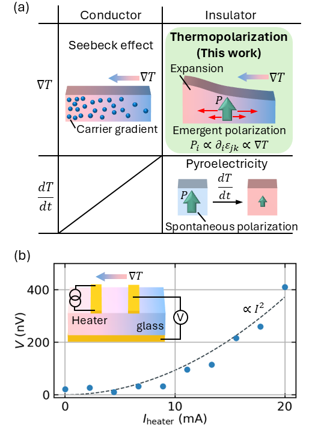
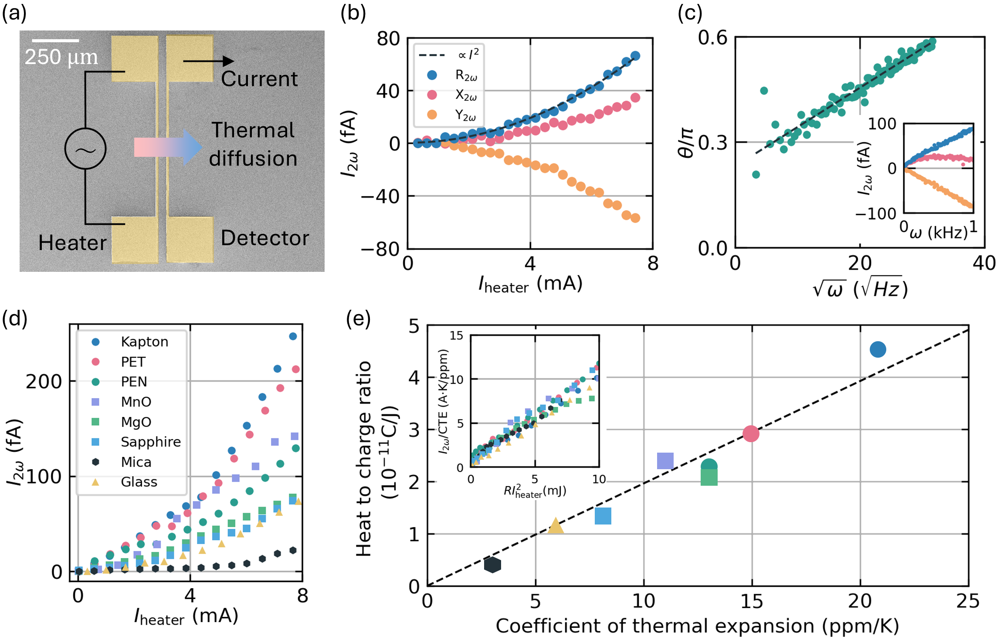
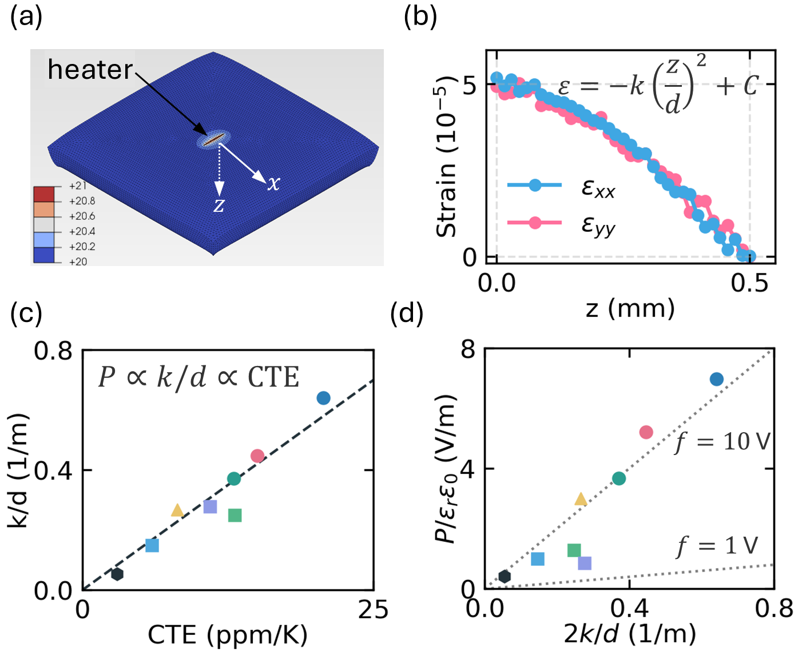
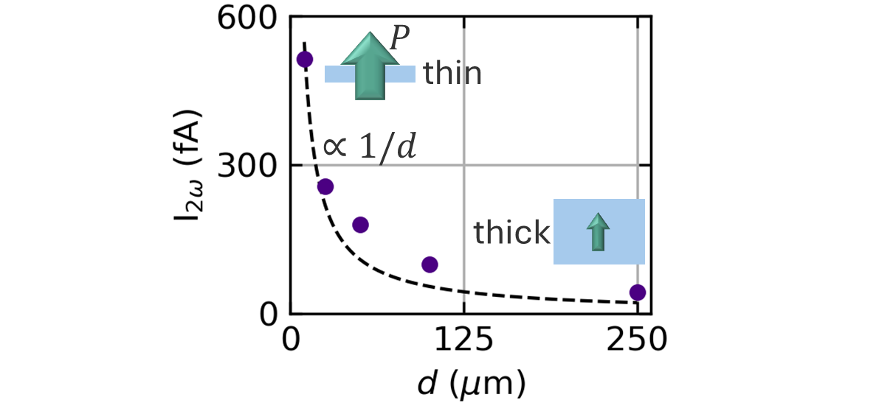
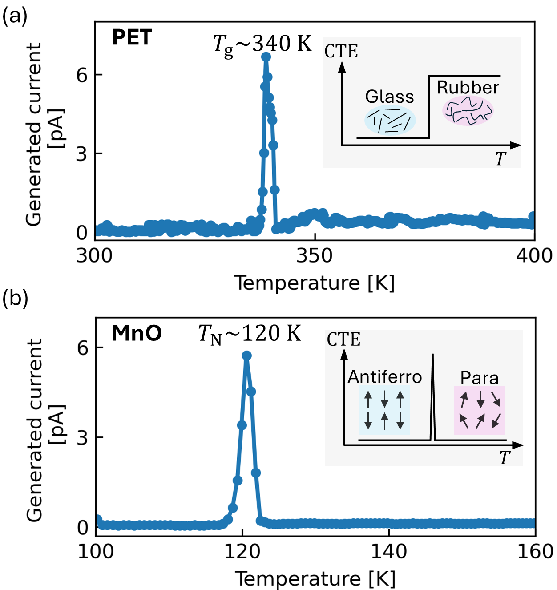

# 絶縁体における普遍的熱分極効果：フレクソ電気を介した対称性によらない熱電変換

- 執筆日：2026-05-22
- トピック：温度勾配が絶縁体中に電気分極を生み出す「熱分極効果」の普遍性を実証し、フレクソ電気効果を介した熱力学的経路を明らかにする
- タグ：Multiphysics and Coupled Phenomena / Coupled-Field Response; Phonons and Thermal Properties / Finite Element Method; Transport Measurements
- 注目論文：[Observation of universal thermopolarization effect in insulators (arXiv:2605.17224)](https://arxiv.org/abs/2605.17224)
- 参照論文数：7本

---

## 1. 背景：なぜ今この話題か

熱を電気に変換する技術は、廃熱利用や環境センシングの観点からエネルギー研究の中心課題の一つであり続けている。現在の主流はゼーベック効果（Seebeck effect）を用いた熱電変換であり、温度勾配のある導体中で電子が拡散してキャリアの偏りが生じ、起電力が生まれる現象である。この効果は金属や半導体という電荷キャリアが豊富な材料で機能し、熱電発電素子として実用化が進んでいる。

しかし自由な電荷キャリアをもたない絶縁体は、従来の熱電変換の枠組みでは「電気的に不活性な材料」とみなされてきた。絶縁体で熱から電荷を取り出す手段として知られているのは、主に焦電効果（pyroelectricity）である。焦電体は温度変化によって自発分極が変化し、電流が流れる材料であるが、この効果は結晶が非中心対称な構造をもつ特定の材料クラスに限定される。すなわち、中心対称や等方性（非晶質）の絶縁体では焦電効果は許容されず、同様の仕組みは機能しない。

ここで一つの根本的な問いが浮かぶ。温度勾配そのものが—その大きさや向きの空間分布を通じて—絶縁体に電気分極を誘起することはないのか。この問いは「熱分極効果（thermopolarization effect）」として1960〜70年代のソビエト連邦の研究者たちが初めて理論的に取り上げたが、実験的な検証はごく限られた材料系にとどまり、かつ現象の大きさも「無視できる程度」と判断されることが多かった。

この状況が近年大きく変わりつつある背景には、二つの潮流がある。一つは、二次元材料や薄膜デバイスの発展である。材料の厚みがナノメートルスケールに到達すると、ひずみ勾配（strain gradient）が飛躍的に大きくなるため、フレクソ電気効果（flexoelectric effect）—ひずみ勾配によって電気分極が誘起される現象—が著しく増強される。もう一つは、量子多体系における熱・電気・弾性の複合自由度の設計という新しい視点である。磁気的相転移、ガラス転移、トポロジカル相転移などの臨界点近傍では、熱膨張率や誘電率が異常な振る舞いを示すことが知られており、これらを熱分極増強に積極的に活用する発想が生まれている。

2026年5月、国立研究開発法人物質・材料研究機構（NIMS）の岩切修一、宮田耶須迅、森孝雄のグループは、arXiv:2605.17224「絶縁体における普遍的熱分極効果の観測」を発表した。この論文は、熱分極効果が従来想定されてきた特定材料だけでなく、結晶・高分子・非晶質ガラスを含む広範な絶縁体に普遍的に存在することを実証した。さらにその起源がフレクソ電気効果を介した熱力学的経路にあることを定量的に示し、信号増強の手法として薄膜化と構造相転移の活用を提案した。本論文は、絶縁体を舞台とする熱電変換の可能性を根本的に見直す一歩として注目を集めている。

---

## 2. 未解決問題は何か

### 「対称性の壁」を越える熱電変換

古典的な熱電変換理論の大きな制約の一つは、材料の対称性である。ゼーベック効果はキャリアがある導体に限定され、焦電効果は極性（非中心対称）材料に限定される。中心対称の絶縁体—たとえばMgO、Al₂O₃、サファイア—では自発分極がなく、外部電場を加えても一次の圧電効果も存在しない。ならば、このような「対称性の壁」を越えて電荷を取り出す機構は存在するのか。フレクソ電気効果はひずみ勾配に応じた分極応答であり、テンソルの対称性上は任意の材料で許容されるため（点群を問わない）、この壁を越える候補として理論的には長年認識されてきた。しかし実験的検証が乏しいまま「無視できる」と扱われてきた背景には、「どうやって信号を取り出すか」という測定技術上の困難がある。

この問題が解決策を求めているのは、絶縁体を用いたデバイスが増えているという実用的事情もある。現代の集積回路においては、誘電体膜・ゲート絶縁膜・基板など多くの絶縁体が熱環境にさらされており、そこで発生する熱分極は意図しないオフセット電圧やノイズの原因になりうる。このような「寄生効果」としての側面を理解し制御するためにも、熱分極の普遍的な理解が求められている。

### フレクソ電気係数の理論値と実験値の乖離

フレクソ電気効果の基礎については、コーガン（Kogan）の推算が広く引用されている。その主張はフレクソ電気テンソル μ（単位：C/m）が相対誘電率 ε_r と真空の誘電率 ε_0 を用いて

μ = f ε_r ε_0

と書けるというものであり、フレクソ結合係数 f は典型的に 1〜10 V のオーダーと見積もられる。しかし実験値はしばしばこの推算から数桁ずれることがあり（特に半導体系では見かけ上巨大なフレクソ電気係数が観測されることがある）、その原因として表面効果、キャリア媒介メカニズム、量子補正などが議論されてきた。この乖離の本質的な原因が何か、材料ごとにどの機構が支配的かはいまだ結論が出ておらず、熱分極実験はこの問いに実験的な制約を与える新しい手段として機能しうる。

### ナノスケールでの飛躍的増強の実現可能性

P ≃ 2μk/d という関係式（後述）は、サンプル厚 d が薄いほど熱分極が増強されることを示す。1/d に比例するという予言は実験的に検証されているが、d → 0 の極限で何が起こるのかはまだ未解決である。特に原子数層の二次元材料では、「古典的なひずみ勾配」の描像が破綻し量子力学的な効果が登場する可能性があり、グラフェンでのナノ曲率による量子フレクソ電気（arXiv:2503.21996）が2025年に初めて実験的に示されたことは、この方向性に重要な示唆を与えている。二次元磁性絶縁体（CrCl₃、RuCl₃、FePS₃）においては、薄膜化と磁気転移の組み合わせによって極めて巨大な熱分極が期待されるが、その測定は技術的にまだ実現されていない。

### 熱分極の電子的起源と格子的起源の分離

今回の研究で実験的に実証された経路は「熱膨張→ひずみ勾配→フレクソ電気分極」という格子（フォノン）的経路である。これとは別に、電子系が温度勾配に応じて四重極モーメントなどを変化させる「電子的熱分極」も理論的に提案されている（arXiv:2105.08228）。これら二つの経路の信号をどう分離し、どちらが支配的かを判定するかは、今後の重要な実験的課題である。特に相関電子系やモット絶縁体においては、電子的寄与が無視できないと考えられる。

---

## 3. 注目論文の概説

### 研究目的と測定対象

Iwakiriらの目的は、「熱分極効果が絶縁体全般に普遍的に存在するか、またその大きさと符号は何によって決まるのか」を実験的に明らかにすることである。測定対象に選ばれたのは、ファンデルワールス結晶（雲母マイカ）、イオン性酸化物（MgO、サファイアAl₂O₃、MnO）、高分子フィルム（PET、PEN、ポリイミド）、非晶質ガラス（ソーダライムガラス）という、結合様式・結晶構造・熱的性質の大きく異なる8種類の絶縁体である。これらはすべて「非極性」かつ商業的に入手可能な材料であり、特殊な合成条件を要しない点が設計上の特徴となっている。

### 測定アプローチ：オンチップヒーターと第二高調波検出

*Fig.1: (a) 各種熱-電荷変換機構の比較。左：ゼーベック効果。右上：熱分極（本研究）。右下：焦電効果。(b) ソーダライムガラスでの電圧発生デモ（arXiv:2605.17224, CC BY 4.0）*

実験の核心は、マイクロ加工によって作製した「オンチップヒーター」をサンプル基板上に搭載した小型デバイスである（Fig. 2(a)）。ヒーターと同形状の細線状金属電極（検出器）を40 μm離れた位置に配置し、その間で発生する電流を測定する。

ヒーターには角振動数 ω/2π = 1 kHz の交流電流 I = I_heater sin(ωt) を流す。ジュール加熱の出力は I² ∝ sin²(ωt) ∝ 1 − cos(2ωt) であるから、試料内の温度変動は 2ω の周波数で振動する。その結果、熱膨張→ひずみ勾配→フレクソ電気分極という連鎖で誘起される分極の時間微分 dP/dt が 2ω で振動し、検出器に「第二高調波電流 I_2ω」として現れる。

このロックイン技術による第二高調波検出は、信号と背景ノイズを周波数で分離できるため感度が高い。さらにロックイン位相の周波数依存性が θ(ω) ∝ √ω となることを確認しており—これは熱拡散方程式の解が示す特徴的なシグネチャである—信号が確かに熱的起源であることを独立に検証している。ガラスの熱拡散率として D ≈ (6 ± 1) × 10⁻⁷ m²/s が得られており、文献値と一致した。

### 主要結果その1：普遍性と熱膨張係数によるスケーリング

*Fig.2: (a) デバイス構造。(b) ヒーター電流依存性。(c) 位相の周波数依存性（√ω スケーリング）。(d) 各種絶縁体での第二高調波電流。(e) CTE に対するスケーリング（arXiv:2605.17224, CC BY 4.0）*

Fig. 2(d) に示すように、8種類すべての絶縁体で明確な第二高調波電流が観測された。これらの材料は、ガラス（非晶質）、ポリイミド（非晶質高分子）、MgO（岩塩型イオン結晶）など、互いに全く異なる構造と化学結合をもつ。この結果は、熱分極効果が特定の材料クラスに限定されない「普遍的現象」であることを実証している。

さらに重要なのが、Fig. 2(e) に示すスケーリング則である。熱-電荷変換比 I_2ω/(R I²_heater) を縦軸に、熱膨張係数（CTE）α (ppm K⁻¹) を横軸にプロットすると、異なる材料のデータ点がほぼ一本の直線上に乗る。これが示す物理は明快である。フレクソ電気分極を決める主要なパラメータは、材料の熱膨張率 α と試料厚 d であり、フレクソ電気テンソル μ は材料依存性が小さいため、スケーリングの主役は α となる。

### 主要結果その2：FEM解析による定量検証

*Fig.3: (a) FEMモデルの概略（温度分布）。(b) 面内ひずみの深さプロファイル。(c) CTEに対するk/d の線形スケーリング。(d) 実験値 P/(ε_r ε_0) と FEM値 k/d の比較（コーガン推算の範囲内）（arXiv:2605.17224, CC BY 4.0）*

論文では有限要素法（FEM）を用いた熱弾性シミュレーションが行われ、実験を定量的に再現している（Fig. 3）。ヒーターのスラブを絶縁体基板上に置き、底面を機械的に固定した境界条件で、熱・弾性連成方程式を定常状態で解くことで温度分布と面内ひずみ（ε_xx, ε_yy）の z 方向プロファイルを算出する。

シミュレーションから、検出器位置のひずみプロファイルが ε(z) = −k(z/d)² + C という放物線で近似されることがわかった。ここで k は無次元のひずみ勾配の大きさを表し、d は基板厚である。このプロファイルを積分すると

P ≃ 2μk/d　　（式3）

という結果が得られる。FEM計算ではα に線形比例して k/d が増大することが示され（Fig. 3(c)）、実験スケーリングと整合している。さらに実験データと FEM から得た k/d を用いて P/(ε_r ε_0) を 2k/d に対してプロットすると（Fig. 3(d)）、コーガン推算の上下界（f = 1〜10 V）の範囲内に収まることが確認された。これは観測された信号がフレクソ電気起源であることの定量的証拠となっている。

### 主要結果その3：薄膜化による1/d 増強

*Fig.4: PETの厚さ d に対する発生電流。1/d に比例する依存性（破線）が確認される（arXiv:2605.17224, CC BY 4.0）*

式3の P ∝ 1/d という予言を検証するため、厚さ 10〜250 μm の PET フィルムで測定を行った（Fig. 4）。1/d 曲線の予言に従って、厚さを 250 μm から 10 μm に減らすと電流が約25倍増強されることが確認された。これは薄膜化・ナノ化が熱分極増強の直接的な手段であることを示している。

### 主要結果その4：臨界点での一桁以上の増強

*Fig.5: (a) PET のガラス転移温度（340 K）付近での電流増強（約80倍）。(b) MnO のネール温度（120 K）付近での電流増強（約70倍）。挿入図は各転移でのCTE模式図（arXiv:2605.17224, CC BY 4.0）*

最も印象的な結果は、構造不安定性を利用した増強である（Fig. 5）。

高分子PETのガラス転移温度 T_g ≈ 340 K 付近では、熱膨張係数がステップ状に大きく変化する。これにより dα/dT が発散的に大きくなり、I ∝ dP/dt ∝ α, dα/dT の関係から電流がT_g で急激にピークをもつ。実験では室温の値に対して約80倍の増強が観測された。

MnO（反強磁性酸化マンガン、岩塩型構造）は Néel 温度 T_N ≈ 120 K で反強磁性転移を起こし、このとき磁気弾性相互作用によって格子が歪み、熱膨張率に発散的な異常が現れる。この T_N において約70倍の信号増強が観測された。

この結果は特に重要である。磁気転移は通常「電気的輸送とは無関係」な現象とみなされるが、熱分極効果を通じて電気信号として検出できることが初めて示された。これは「非電気的相転移を電気的に探索するプラットフォーム」として熱分極計測を位置づける可能性を開くものである。

### 論文の新規性と限界

新規性は以下の3点に整理される。第一に、結晶・高分子・非晶質にわたる多様な絶縁体での普遍性の実験的実証。第二に、熱膨張係数によるスケーリング則という定量的な予測原理の提示。第三に、薄膜化と構造相転移の2つの増強経路の明確な実証である。

限界としては、対応する補論文（arXiv:2605.17226）で扱われている「電子的熱分極」との分離が今回の論文では明示されていない点、また測定されたフレクソ電気係数の絶対値精度が FEM の境界条件設定に依存している点が挙げられる。また、2D材料での実証は「将来展望」として言及されるにとどまり、実験データはまだ存在しない。

---

## 4. 研究史における位置づけ

### フレクソ電気効果の理論的基盤

フレクソ電気効果の概念は、1950〜60年代のMasonやTagantsevらのイオン結晶の研究に遡る。Tagantsev（1985）は「イオン結晶の焦電・圧電・フレクソ電気・熱分極効果」と題した先駆的論文で、温度勾配が格子の不均一熱膨張を通じてひずみ勾配を生み出し、フレクソ電気効果によって分極を誘起するという経路を理論的に定式化した。この予言が本論文で約40年越しに広範な絶縁体で実験検証されたことになる。

Kogan推算（1964）は前節で述べたとおりフレクソ電気係数の大きさのスケールを与えるものであり、μ ≈ f ε_r ε_0（f ≈ 1〜10 V）という見積もりは多くの材料での実験結果と矛盾しない。ただし、後述するように「見かけ上の巨大フレクソ電気」が観測される場合があり、このKogan推算の有効性についての議論は継続中である。

### 熱分極の電子的理論（2105.08228, Onishi et al.）

arXiv:2105.08228（2021年提出、2025年v5改定）はYugo OnishiらによるQテンソル理論である。この論文は、電気分極の温度勾配応答を「電場勾配に対する自由エネルギー応答関数であるQテンソル」で記述するという形式的枠組みを提案し、ゼーベック効果との一般化されたモット関係（generalized Mott relation）を導いた。電子系における熱分極の起源として「エッジ描像」が示されており、温度勾配によって試料両端での分極が異なり、ネットの分極が生まれるという物理描像が直感的に説明されている。また本理論は異常ホール効果・ネルンスト効果との類比を示しており、モット絶縁体や量子多体系での熱分極の理解に向けた基礎を与えている。Iwakiriらの研究が実証した「格子的経路」とは相補的な関係にあり、電子的経路と格子的経路の競合・共存という問いが今後の焦点となる。

### 反対称熱分極と電気トロイダル秩序（2112.06387, Nasu & Hayami, PRB 2022）

NasuとHayami（2021年提出、PRB 2022掲載）は熱分極テンソルの反対称成分（つまり、温度勾配と垂直な方向の分極応答）に注目した。電気トロイダル双極子（electric-toroidal dipole）の強磁性的秩序がある系では、局所分極がボルテックス型の配置をとり、反対称熱分極テンソルが非ゼロになることを二次元三軌道モデルで示した。これは熱分極テンソルが持つ豊かな構造を理論的に示したものであり、今回実証された「対角成分（温度勾配方向の分極）」の先を見た研究と位置づけられる。実験的検証には、強相関電子系における非従来型の秩序相が必要になる。

### ナノスケールと量子フレクソ電気（2503.21996, 2025）

arXiv:2503.21996「Sub-nm曲率がグラフェンの量子フレクソ電気を解放する」（2025年）は、グラフェンナノしわ（nanowrinkle）において曲率半径 ~5 Å の極端な屈曲が量子力学的フレクソ電気分極を引き起こすことを初めて実験的に実証した論文である。局所的な分極密度は中空スケール系よりも5〜7桁大きく、サブ μm ラマン分光でひずみ場をマッピングしてその起源を確認した。古典的なフレクソ電気理論を超える「量子フレクソ電気」の概念がここで明確に打ち出されており、Iwakiriらが提案する「2D材料での巨大熱分極」の基礎的根拠を与えている。

### シリコンにおけるフレクソ電気の温度依存性（2506.20379, 2025）

arXiv:2506.20379（Lvら、2025年6月）はシリコンのフレクソ電気係数を −50〜200 ℃の温度範囲で測定した研究である。ドープシリコンでは係数が温度にほとんど依存しない（~2.6 μC/m）のに対して、真性シリコンでは温度上昇に伴って 15.2 nC/m から 1.8 μC/m へと約2桁変化する。この差異はドーパントの電離が温度によらないのに対し、真性励起が温度に強く依存するためであり、キャリア密度がフレクソ電気係数を規定するという新たな知見を与えた。Iwakiriらの研究では「μ は材料依存が小さい」と近似したが、この近似が成立する条件と失敗する条件の理解に、Lvらの研究は直接的に関連する。

### 半導体での「見かけ上の巨大フレクソ電気」（2309.03474, Wang et al.）

arXiv:2309.03474（2023年、Wangら）は、Si・Geの曲げ薄膜において絶縁体–金属転移（IMT）に起因した巨大な「見かけ上のフレクソ電気係数」を報告した。屈曲によって生じる圧縮側と伸長側でバンドアラインメントがType-IIとなり、电子が伸長側へ移動することで分極が生じる。このIMT媒介メカニズムは試料厚の二乗に比例するという異常なスケーリングを示し、Kogan推算から大幅に外れる。この結果は、Iwakiriらが対象とした「純粋な絶縁体（キャリアなし）」での古典的フレクソ電気とは本質的に異なるメカニズムを示しており、実験的なフレクソ電気係数の解釈に注意が必要であることを示す「比較」として重要な位置を占める。

### 総合的な位置づけ

Iwakiriらの論文は、40年以上前の理論予言に対する最初の体系的な実験的検証として研究史上に位置づけられる。「特定の材料に限った現象」という先入観を破り、「絶縁体一般に存在する」という普遍性を示したことは大きな一歩である。同時に、電子的経路、量子フレクソ電気、キャリア媒介効果など多くの競合する物理機構の中で、今回実証したのは「格子的経路（熱膨張→ひずみ勾配）」の普遍的存在であり、他の経路は今後の課題として残されている。

---

## 5. どの解釈が最も妥当か

### 格子的経路の圧倒的な証拠

今回の論文が実証した機構—「熱膨張係数 α によるスケーリング」「1/d 依存性」「FEM による定量再現」「コーガン推算との整合」—は、いずれも「熱膨張→ひずみ勾配→フレクソ電気分極」という格子的経路を強く支持する。特に CTE スケーリングは材料を問わず成立しており、「電子系の詳細によらない普遍的な格子現象」という解釈に反する証拠は現時点ではない。

ただし、MnO の Néel 転移での増強は「磁気弾性相互作用による熱膨張異常」というやや複合的な機構を経由しており、純粋な格子的経路を超えた磁気自由度との結合を示している。この意味で、今回実証した「格子的経路」は熱分極効果のすべてを尽くしているわけではなく、スピン・軌道・格子の多自由度が結合した系ではより複雑な寄与がありうる。

### 電子的経路との競合

OnishiらのQテンソル理論が予測する電子的熱分極（arXiv:2105.08228）は、格子的経路とは独立なメカニズムである。電子的経路は強い電子相関をもつモット絶縁体やトポロジカル絶縁体において支配的になりうると考えられる。今回の実験対象は「強相関でない標準的な絶縁体」であり、電子的寄与は小さかったと考えられるが、明示的な分離実験は行われていない。例えばゼーベック係数が異常に大きい強相関絶縁体系（バナジウム酸化物など）での比較測定が、この分離を行う一つの手段となりうる。

### ガラス転移・Néel転移での増強の解釈

PETガラス転移（×80）とMnOのNéel転移（×70）での大幅な信号増強は、CTE の不連続・発散的変化によるものと説明される。これは理論的予測と整合し、増強が「フレクソ電気係数μ の異常」ではなく「CTEの異常」に起因することを示している。この解釈は、熱分極を材料の格子動力学（特に熱膨張率の温度依存性）を電気信号で「読む」手段として活用できるという応用展開を示唆する。

### スケーリングの精度と限界

実験データは CTE に線形スケールするという趨勢を示すが、各材料の CTE 値は「サプライヤー提供の室温値」であり、測定温度での精密な値ではない。またフレクソ電気係数 μ も材料によって若干異なる可能性があり、厳密には「CTEのみで決まる」とは言えない。Kogan推算の上下界（f = 1〜10 V）を考えると、μ の材料依存性（一桁程度）が CTE のスケーリング（ほぼ一桁以上の範囲）に隠れているとも解釈できる。より精密な比較のためには、独立した手法でμ を決定することが必要である。

---

## 6. 何が一般化できるか

### 二次元材料：最も有望な次のフロンティア

式 P ≃ 2μk/d が示す 1/d スケーリングは、サンプルを原子層スケールまで薄くすれば理論上は極めて大きな熱分極が生まれることを意味する。グラフェンやMoS₂などの二次元材料は曲げ剛性が低く、熱膨張率が比較的大きく（特に面外方向）、非常に大きなひずみ勾配が熱的に生成されうる。arXiv:2503.21996が示した量子フレクソ電気の存在は、このスケールでの物理が古典理論を超えることを示唆しており、熱分極の 1/d スケーリングがどこまで成立するかは今後の重要な問いとなる。

著者らは特に二次元反強磁性絶縁体として CrCl₃、RuCl₃、FePS₃ を挙げている。これらは近年盛んに研究されている原子層磁性体であり、磁気転移温度付近での CTE 異常と薄膜化の相乗効果が期待される。RuCl₃ は北村量子スピン液体の候補であり（arXiv:2501.05608）、熱分極を用いた新しい磁気秩序の電気的検出手段として注目される。

### デバイス応用：廃熱収集センサーと相転移検出

熱分極効果を応用した「熱-電荷変換デバイス」の概念は、絶縁体薄膜を用いたエネルギーハーベスタとして実現できる可能性がある。現時点での信号レベルはゼーベック熱電素子よりも小さいが、2D材料・ナノ膜での飛躍的な増強が見込まれるため、小型・フレキシブルデバイスへの応用に向けた基礎研究として価値がある。

また「構造転移の電気的プロービング」という応用も新しい。アモルファスの相転移や磁気転移などを電気信号で非破壊検出する手法として、デバイス中の絶縁体膜の劣化診断や温度センサーへの応用が考えられる。

### 他材料系・他物理への接続

今回の機構（熱膨張→ひずみ勾配→フレクソ電気）は本質的に「熱弾性と電気の結合」であり、この考え方は圧電センサー（逆方向の結合）や超音波デバイス、MEMS（微小電気機械システム）の設計に既に用いられている概念の拡張として理解できる。特に厚膜・薄膜のマルチフィジクス設計において、意図しない熱分極効果（寄生効果）の予測・制御は工学的に重要な課題となる。

一方、量子材料や強相関系への接続を考えると、電子的経路（Qテンソル）と格子的経路の競合は「熱電効果の新しいパラダイム」を示唆している。従来の熱電研究がゼーベック係数の最適化を通じた「電子エントロピーの読み出し」に注力してきたのに対し、熱分極は「格子エントロピーと電子系の結合」という別の窓口を提供する。

### 圧電・焦電との統一的枠組み

フレクソ電気は圧電効果の「勾配版」と理解できる。圧電効果が均一ひずみに対する応答であるのに対し、フレクソ電気はひずみの空間勾配に対する応答である。焦電効果が均一な温度変化への応答であるのに対し、熱分極はその「勾配版」である。この類比を表にすると：

| 変数 | 均一変化 → 電場/分極 | 勾配 → 電場/分極 |
|------|-------------------|----------------|
| ひずみ | 圧電効果 (P ∝ ε) | フレクソ電気効果 (P ∝ ∂ε/∂x) |
| 温度 | 焦電効果 (P ∝ ΔT) | 熱分極効果 (P ∝ ∇T) |

この統一的な枠組みによれば、熱分極は「焦電効果の勾配版」であり、「フレクソ電気の熱的励起版」でもある。今後、これらの効果を包含する完全な熱弾性・電気弾性の結合自由エネルギー形式論の構築が期待される。

---

## 7. 基礎から理解する

### 7.1 電気分極とは何か

物質を構成する原子・分子の中で、正の電荷（原子核）と負の電荷（電子雲）の重心が一致していない場合、その「ずれ」が電気双極子モーメントを生む。単位体積あたりの双極子モーメントの和を電気分極（electric polarization）P と呼ぶ（単位：C/m²）。

絶縁体に外部電場 E を加えると、原子核と電子雲がわずかにずれ、誘電分極が生じる（ P = ε₀ χ_e E、χ_e は電気感受率）。一方、構造的に正負の電荷重心がもともとずれている材料では、外場なしに自発分極 P_s が存在し、これが強誘電体（ferroelectric）や焦電体（pyroelectric）の基礎となる。

実験で「分極を測定する」とは多くの場合「分極の変化 dP/dt を電流として測定する」ことを意味する。分極 P を面積 A の平行板電極で挟んだ場合、電極に誘起される電荷は Q = P × A であり、その時間変化が電流 I = dQ/dt = A dP/dt として観測される。本論文の測定もこの原理に基づいている。

### 7.2 圧電効果とフレクソ電気効果

**圧電効果（piezoelectric effect）** は、材料を機械的に変形させると（均一ひずみ ε を加えると）電気分極が生じる現象である。逆に電場を加えると歪む（逆圧電効果）。圧電応答は

P_i = d_ijk σ_jk

と書かれ（d は圧電テンソル、σ は応力テンソル）、非中心対称な結晶構造をもつ材料のみで許容される。これは「均一な変形でも分極が生まれるためには、正と負が非対称な向きに結合している必要がある」という対称性の要請から来ている。水晶（石英）、チタン酸バリウム（BaTiO₃）、ポリフッ化ビニリデン（PVDF）などが代表的な圧電材料である。

**フレクソ電気効果（flexoelectric effect）** は、圧電効果の「高次版」であり、均一ひずみではなくひずみの空間勾配（strain gradient）∂ε_jk/∂x_l に対して分極が応答する現象である：

P_i = μ_ijkl ∂ε_jk/∂x_l

ここで μ_ijkl はフレクソ電気テンソル（単位：C/m）である。圧電効果と本質的に異なるのは、**任意の対称性をもつ材料で許容される**という点である。中心対称の結晶（例：MgO（岩塩型）、Al₂O₃（コランダム型））でも非晶質ガラスでも、ひずみ勾配が存在すれば分極が生じる。

なぜ対称性を問わないのか。直感的に言えば、「ひずみ勾配」という量は本来非対称な分布であり、その非対称性が局所的な電荷の偏りを生む。例えば上面が伸び、下面が縮んでいる（曲げ変形）梁を考えると、結晶学的に中心対称であっても上下で局所的な原子間距離が異なり、その分極の非対称な分布の平均がゼロにならない。これがフレクソ電気の本質である。

フレクソ電気係数 μ のスケールとして Kogan 推算が重要である：

μ ≈ f ε_r ε_0

ここで ε_r は相対誘電率、ε_0 = 8.85 × 10⁻¹² F/m は真空の誘電率、f ≈ 1〜10 V はフレクソ結合係数である。例えば ε_r = 10 の材料では μ ≈ 10〜100 × 10⁻¹² C/m ≈ 10〜100 pC/m と見積もられる。

### 7.3 熱膨張と熱ひずみ

物質は温度が上がると膨張する。単純には、温度が ΔT だけ上昇したとき、長さ l の試料は

Δl = α l ΔT

だけ伸びる。ここで α（単位：K⁻¹ または ppm K⁻¹）は線熱膨張係数（coefficient of thermal expansion, CTE）である。三次元では等方的な場合

ε_ij = α ΔT δ_ij

となり、均一な温度変化は等方的なひずみを生む。この均一なひずみは圧電効果には寄与するが（圧電材料では）、フレクソ電気効果には寄与しない—なぜなら分極を生むのはひずみの勾配 ∂ε/∂x だからである。

では、どのようにしてひずみ勾配が生まれるのか。答えは「不均一な温度分布」である。温度 T(x, y, z) が空間的に変化している（温度勾配がある）とき、各点での熱膨張量が異なるため、内部に機械的な応力が生じ、その応力のバランスとして空間的に不均一なひずみが生まれる。この「温度勾配 → 不均一ひずみ → ひずみ勾配 → フレクソ電気分極」という因果の連鎖が熱分極効果の格子的経路である。

具体的には、試料の上面近くだけが加熱された場合を考えよう。上面は大きく膨張しようとし、下面は温度変化が小さいため膨張が小さい。しかし試料は一枚の固体であるため、上面は下面に引っ張られ内部応力が生じる。この結果、面内ひずみ ε_xx(z), ε_yy(z) は深さ z によって変化し、∂ε_xx/∂z ≠ 0 というひずみ勾配が生まれる。これがフレクソ電気分極 P_z = μ ∂ε_xx/∂z を生む。

定量的には P_z ≃ μ α ∇T（式1）と書けており、熱膨張係数 α と温度勾配 ∇T の積に比例する。これが「CTEスケーリング」の物理的根拠である。

### 7.4 ゼーベック効果・焦電効果との比較

これまでに知られていた「熱→電荷変換」の二つの主要な機構と本論文の熱分極効果を比較しておこう。

**ゼーベック効果**：導体中で温度勾配があると、熱い側のキャリアが速く動き（エントロピーが高い）、冷たい側に比べてキャリア密度に偏りが生じ、起電力が発生する。これは本質的にキャリアの拡散現象であり、「自由電荷キャリア」の存在が必須である。ゼーベック係数 S（単位：V/K）は電場と温度勾配の比 S = −E/∇T で定義される。

**焦電効果**：温度が（空間的に均一に）時間変化 dT/dt するとき、材料の自発分極が変化して電流が流れる。分極変化 dP/dt = π dT/dt（π は焦電係数）が電流として観測される。この効果には自発分極 P_s が必要であり、結晶の点群で許容された極性（非中心対称）構造が必要である。

**熱分極効果（本論文）**：温度が空間的に不均一（温度勾配 ∇T が存在する）とき、熱膨張のひずみ勾配を通じて電気分極が誘起される。格子の対称性を問わず—中心対称でも非晶質でも—働く。電荷キャリアが不要で、温度変化（dT/dt）ではなく温度勾配（∇T）が駆動力である。

この比較から分かるように、熱分極効果は「焦電体でもなく導体でもない絶縁体全般」に働く新しい変換機構として位置づけられ、従来手の届かなかった材料領域への応用可能性を開く。

### 7.5 ロックイン法と第二高調波検出

実験手法の理解にはロックイン増幅器（lock-in amplifier）の原理が重要である。ロックイン増幅器は参照周波数 ω_ref に同期した成分だけを選択的に抽出する装置であり、参照周波数と異なる周波数の信号やノイズを大幅に抑制できる。SN比（信号対雑音比）が飛躍的に向上するため、極微弱な信号の検出に広く使われる。

本実験では：
- ヒーターに周波数 ω/2π = 1 kHz の電流 I ∝ sin(ωt) を供給
- ジュール加熱は I² ∝ sin²(ωt) = (1/2)(1 − cos(2ωt)) → **2ω = 2 kHz** の温度振動
- 熱分極は ΔT に比例し、2ω で振動
- 検出電流 I_2ω は dP/dt ∝ dT/dt ∝ cos(2ωt) → **2ω 成分**

ロックイン増幅器を 2ω で参照することで、バックグラウンドを除いた熱分極信号だけを抽出できる。このように「入力（ヒーター電流）の整数倍の周波数で応答する」ことを高調波応答（harmonic response）と呼び、非線形効果や熱的効果の研究に広く用いられる技法である。

### 7.6 有限要素法（FEM）による熱弾性解析

有限要素法（finite element method, FEM）は、偏微分方程式を小さな要素（有限要素）に分割して数値的に解く汎用的な計算手法である。本研究では「熱・弾性連成方程式」をFEMで解き、試料内の温度分布とひずみ分布を計算した。

連成方程式は次の形をもつ：

**熱方程式**（定常状態）：
∇ · (κ ∇T) + Q_heat = 0

**弾性方程式**（力の釣り合い）：
∇ · σ = 0、ただし σ_ij = C_ijkl (ε_kl − α ΔT δ_kl)

ここで κ は熱伝導率、Q_heat はジュール加熱源項、C_ijkl は弾性テンソル、α は熱膨張係数、ΔT は基準温度からの偏差である。第二式の右辺にある α ΔT δ_kl が「熱ひずみ」であり、これが弾性方程式を熱方程式に結合させる。境界条件として底面の温度固定・変位固定を与えることで、ヒーター直下から離れた位置での面内ひずみのプロファイル ε(z) が得られる。

結果として ε(z) が放物線形 ε(z) = −k(z/d)² + C となることは、「底面が固定されているため上面だけが自由に膨張できる」という境界条件の反映である。この放物線の勾配 ∂ε/∂z = −2kz/d² が分極を生み、積分によって P ≃ 2μk/d が導かれる。

---

## 8. 専門用語の解説

### 1. フレクソ電気効果（flexoelectric effect）

圧電効果が「均一ひずみ → 分極」であるのに対し、フレクソ電気効果は「ひずみの空間勾配 → 分極」という高次の電気弾性結合である。フレクソ（flexo-）はラテン語 flexus（曲がった）に由来し、曲げ変形のように位置によってひずみが異なる状況に特徴的に現れる。P_i = μ_ijkl ∂ε_jk/∂x_l というテンソル関係で記述され、任意の材料対称性で許容されることが最大の特徴である。薄膜・ナノ構造では大きなひずみ勾配が生じやすいため、ナノスケールでの電気弾性効果として近年急速に注目が高まっている。本論文では、熱膨張に起因するひずみ勾配がこの効果を通じて電気分極を生むことが実証された。

### 2. 熱膨張係数（coefficient of thermal expansion, CTE）

温度が 1 K 上昇したときの線形ひずみの割合（α = (1/l)(dl/dT)）。単位は K⁻¹ または ppm K⁻¹（1 ppm K⁻¹ = 10⁻⁶ K⁻¹）。一般に金属では 5〜25 ppm K⁻¹、ガラスでは 1〜10 ppm K⁻¹、高分子では 50〜100 ppm K⁻¹ のオーダーである。本論文では、異なる材料の熱分極信号が CTE に線形比例してスケールすることが実験的に示された。これは「熱分極の大小は主に材料の熱膨張しやすさで決まる」という直観的な理解に対応する。ガラス転移や磁気転移でCTEが大きく変化する物質では、転移温度付近で熱分極が激増する。

### 3. 第二高調波検出（second-harmonic detection）

正弦波 sin(ωt) で駆動されたシステムの、2ω 成分の応答を選択的に検出する手法。二乗応答（ジュール加熱など）は 2ω で振動するため、熱的な応答の検出に適している。ロックイン増幅器を 2ω に同期させることで、同じ周波数の雑音やその他の成分から分離できる。本論文では、ヒーター電流（ω）→ ジュール加熱（2ω）→ 温度振動（2ω）→ 熱膨張（2ω）→ ひずみ勾配（2ω）→ フレクソ電気分極（2ω）→ 誘起電流（2ω）という連鎖の最後を測定している。

### 4. 焦電効果（pyroelectric effect）

極性（非中心対称）の絶縁体において、均一な温度変化 dT/dt が自発分極を変化させ、電流 I = A π (dT/dt) を生む現象（π は焦電係数、A は電極面積）。応用として焦電型赤外線センサー（体温センサー、人感センサー）が広く普及している。熱分極（thermopolarization）が「空間的な温度勾配 ∇T」によって生じるのとは本質的に異なり、「時間的な温度変化 dT/dt」が駆動力である。また焦電効果は極性結晶のみに許容されるが、熱分極はすべての絶縁体で許容される。

### 5. ゼーベック効果（Seebeck effect）

導体・半導体に温度勾配 ∇T があるとき、キャリアの熱拡散によって起電力 V = S ΔT が生じる現象（S はゼーベック係数またはサーモパワー）。エントロピーと電子の相関を反映するため、強相関電子系の研究でも重要な探針として使われる。本論文の熱分極は「絶縁体版ゼーベック効果」と著者が述べており、絶縁体でも同等の「熱→電荷変換」が（異なる機構で）実現されることを意味する。

### 6. コーガン推算（Kogan's estimate）

S. Kogan（1964年、ソビエト連邦）が提案したフレクソ電気係数の大きさのスケール則：μ = f ε_r ε_0（f ≈ 1〜10 V）。相対誘電率 ε_r が大きい材料ほどフレクソ電気係数が大きくなる傾向があることを示している。例えば ε_r = 100 の材料では μ ≈ 1〜10 nC/m となる。この推算は現在でも「オーダー推算」として広く参照されており、本論文の FEM 解析との比較においても Kogan 推算の範囲内に実験結果が収まることが確認された。

### 7. 熱分極（thermopolarization）

温度勾配 ∇T に応答して固体に電気分極 P が誘起される現象の総称。格子的経路（熱膨張→ひずみ勾配→フレクソ電気）と電子的経路（Qテンソル）の二種類が理論的に提案されており、本論文は格子的経路の普遍性を実証した。歴史的には1960〜70年代のソビエトの研究者（GurevichとTagantsev）が理論的な枠組みを整備したが、実験的検証は長らく不十分であった。なお液体（水）の熱分極も研究されており（分子の熱配向）、固体の熱分極と液体のそれでは機構が全く異なる。

### 8. ガラス転移温度（glass transition temperature, T_g）

アモルファス（非晶質）固体（ガラス）が、温度上昇とともに「固体的なガラス状態」から「ゴム状態→液体状態」へと移行する温度域。明確な一次相転移とは異なり、比熱・熱膨張係数が不連続に変化するというより高次の転移として現れる。本論文では PET（ポリエチレンテレフタレート）の T_g ≈ 340 K で CTE が大きく変化し、熱分極電流が室温比80倍に増強された。T_g での CTE 異常は構造緩和と自由体積変化に起因しており、本実験によって「電気信号で T_g を検出する」新しい方法が実証された。

### 9. ネール温度（Néel temperature, T_N）

反強磁性体において、スピン秩序（反強磁性秩序）が熱的に乱されて磁気秩序が消失する温度（常磁性体では何も残らない）。T_N 以下では隣接スピンが反平行に整列する（反強磁性秩序）が、T_N 以上では熱揺らぎで秩序が壊れ常磁性になる。多くの反強磁性体ではネール転移に伴って格子が対称性の変化（磁気弾性効果）を起こし、熱膨張係数が急激に変化する。本論文の MnO（T_N ≈ 120 K）では、この CTE 異常が熱分極を室温比70倍に増強した。

### 10. 有限要素法（finite element method, FEM）

複雑な形状や境界条件をもつ連続体の問題を、多数の小要素（三角形・四面体など）に分割して数値的に解く計算手法。弾性解析・熱解析・電磁解析・流体解析など幅広い工学問題に応用される。本論文では「熱弾性連成問題」—温度分布と弾性変形を連立して解く—に用いられており、ヒーターと絶縁体基板の形状・境界条件・材料定数を入力として、温度場・応力場・ひずみ場を三次元で求めている。FEM が予測した「ひずみの z 方向プロファイルが α に線形比例する」という結果は、実験スケーリング則と定量的に一致した。

---

## 9. 将来展望

### 確からしくなったこと

本研究によって、「絶縁体における熱分極効果の格子的経路（熱膨張→ひずみ勾配→フレクソ電気）は、材料クラスを問わず普遍的に存在する」という命題は相当に確からしくなった。結晶・高分子・非晶質ガラスという全く異なる材料クラスでの観測、CTE スケーリングという定量的な予測原理、FEM との定量的整合性は、この結論を強固に支持している。また、薄膜化（1/d スケーリング）と構造相転移利用という二つの増強経路も実験的に明確に実証された。これにより、原理的には任意の絶縁体材料でオンチップデバイスを用いた熱分極測定が可能であるという基盤が整った。

### 未確定・未解決な点

電子的経路（Qテンソル）と格子的経路（フレクソ電気）の分離は、今回の実験では直接的には行われておらず未解決のままである。特に強相関電子系（モット絶縁体、量子スピン液体など）での熱分極がどちらの経路で支配されるかは理論的にも実験的にも未決定であり、これら二つの経路が干渉・競合する系での信号の符号や大きさの予測は困難である。またフレクソ電気係数 μ の材料依存性を精密に決定することも課題であり、今回の「μ は材料によらず同程度」という近似がどの材料系まで有効かは検証されていない。二次元材料での実証はまだなく、量子フレクソ電気領域での 1/d スケーリングが本当に成立するかは開いた問いである。

### 次に重要になる実験・理論・今後の論点

最も直近の重要な実験は、二次元磁性絶縁体（CrCl₃、RuCl₃、FePS₃）での熱分極測定である。これらは数層〜単層での磁気転移温度付近での測定が課題となるが、成功すれば1/d スケーリングと CTE 異常の相乗効果による「巨大熱分極」が実現しうる。また、強相関絶縁体での電子的経路との分離実験として、相関が強い材料と弱い材料での比較や、磁場印加による磁気ネルンスト効果との比較なども重要になる。理論的には、量子フレクソ電気の第一原理計算（二次元材料でのひずみ勾配→分極の ab initio 計算）や、Qテンソルと格子的フレクソ電気を統一する自由エネルギー形式論の整備が期待される。工学的には、本手法を応用した「絶縁体薄膜の非破壊転移検出センサー」や「フレキシブル熱電ハーベスタ」への展開が注目すべき方向性となる。

---

## 参考論文一覧

1. **[arXiv:2605.17224](https://arxiv.org/abs/2605.17224)** — Iwakiri, Miyata, Mori（NIMS, 2026）: 本稿のアンカー論文。結晶・高分子・非晶質を含む広範な絶縁体で熱分極効果の普遍性を実証し、CTE スケーリングと薄膜化・相転移による増強を示した。

2. **[arXiv:2605.17226](https://arxiv.org/abs/2605.17226)** — Iwakiri, Miyata, Mori（NIMS, 2026）: アンカー論文の姉妹論文。圧電体の水晶（X切・Z切）における熱分極の異方性をオンチップデバイスで検出し、圧電テンソルの対称性（2回・3回対称）を熱的に読み出した。

3. **[arXiv:2105.08228](https://arxiv.org/abs/2105.08228)** — Onishi et al.（2021, v5: 2025）: Qテンソルを用いた絶縁体における熱分極の電子的理論を提案し、ゼーベック効果との一般化されたモット関係および異常ホール/ネルンスト効果との類比を導いた。

4. **[arXiv:2112.06387](https://arxiv.org/abs/2112.06387)** — Nasu & Hayami（PRB 2022）: 電気トロイダル双極子秩序をもつ系での反対称熱分極テンソルの理論的予測。熱分極テンソルの非対角成分が非中心対称な秩序に鋭敏に応答することを示した。

5. **[arXiv:2503.21996](https://arxiv.org/abs/2503.21996)** — Sub-nm 曲率によるグラフェンの量子フレクソ電気（2025）: グラフェンナノしわの曲率半径 ~5 Å での量子フレクソ電気を初めて実験的に実証。古典理論を5〜7桁超える分極密度を観測し、2D材料での巨大熱分極の基礎を与えた。

6. **[arXiv:2506.20379](https://arxiv.org/abs/2506.20379)** — Lv et al.（PRB, 2025）: シリコン（ドープ・真性）のフレクソ電気係数の温度依存性を測定。真性 Si では2桁の温度変化、ドープ Si では温度非依存という対比を示し、キャリア密度がフレクソ電気係数に与える影響を明らかにした。

7. **[arXiv:2309.03474](https://arxiv.org/abs/2309.03474)** — Wang et al.（2023）: Si/Ge 薄膜の曲げによる絶縁体-金属転移（IMT）に起因する「見かけ上の巨大フレクソ電気」を報告。キャリア媒介メカニズムが Kogan 推算を大幅に超える係数をもたらすことを示し、純粋な格子的フレクソ電気との比較として本論文の理解を深める。
