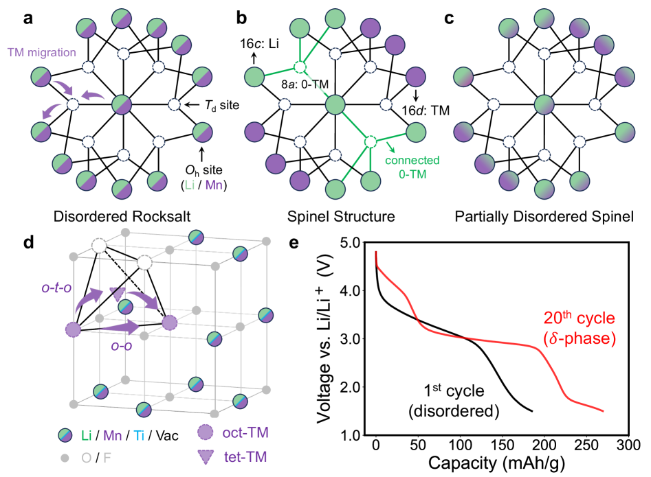
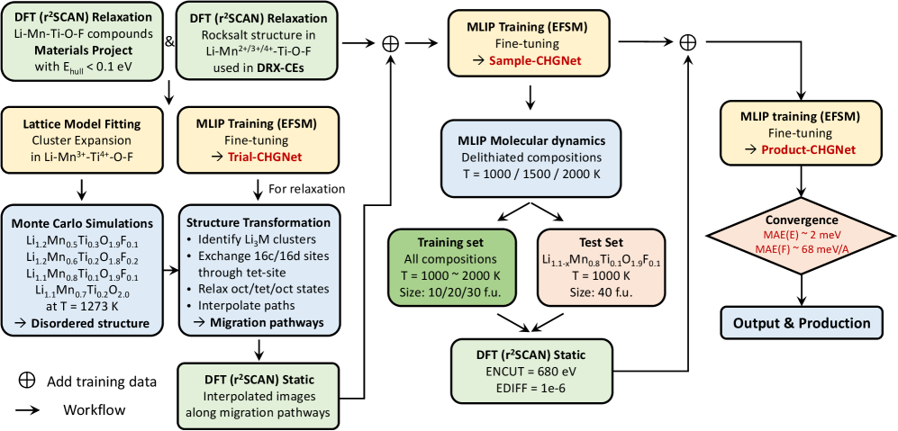
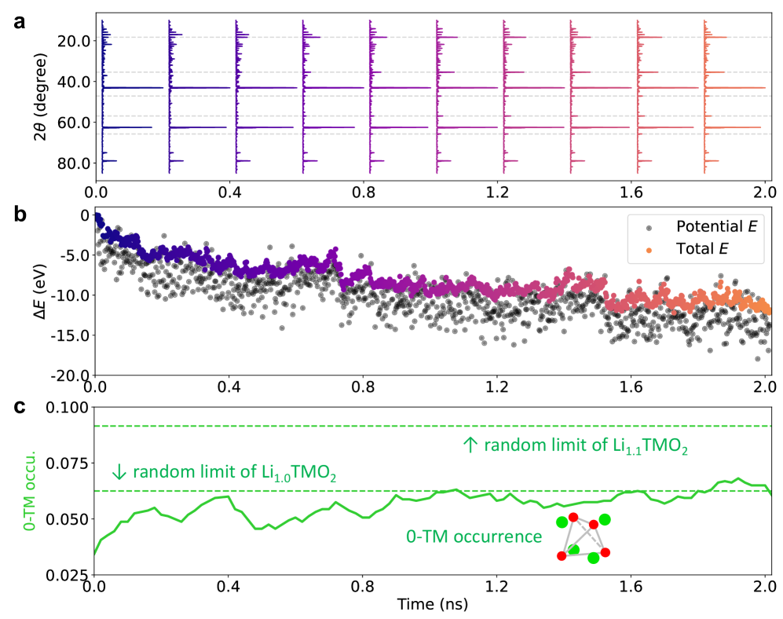
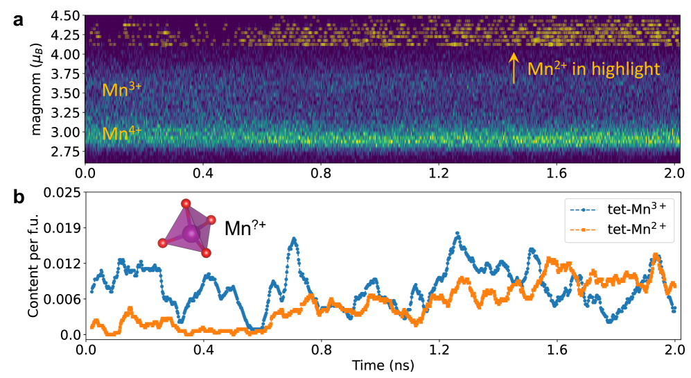
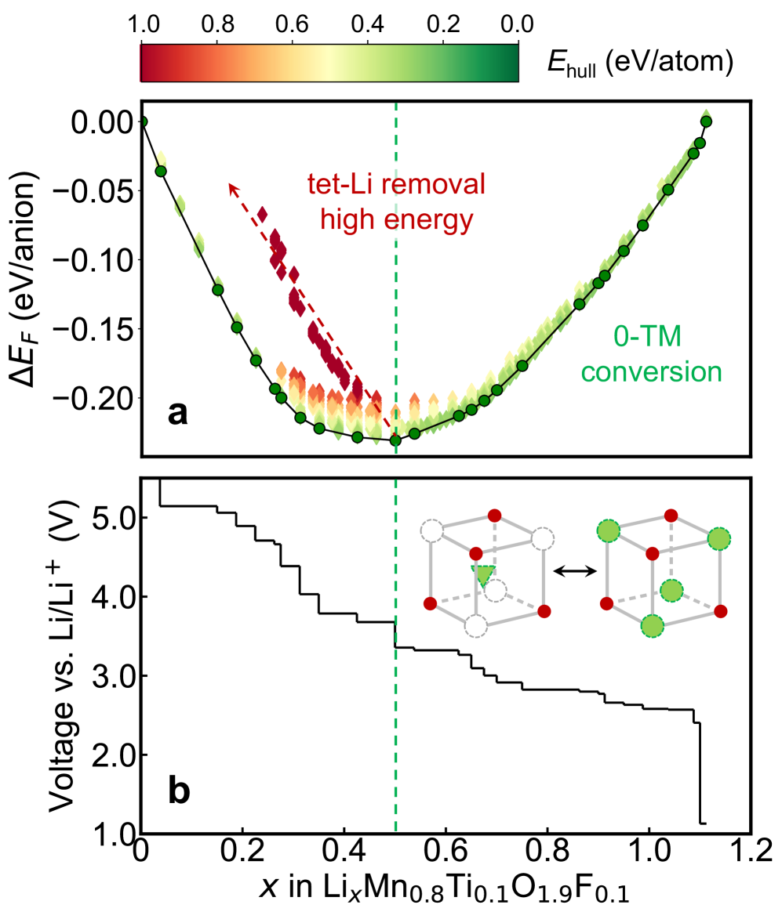
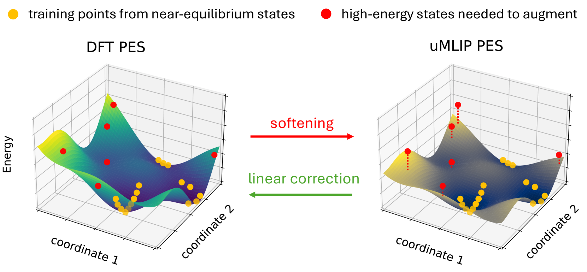

# Mnリッチ無秩序岩塩正極の相変態を磁気モーメント対応機械学習ポテンシャルで解析する

- 執筆日: 2026-05-24
- トピック: 充放電サイクルで誘起されるDRX→δ相変態のMn価数変化をCHGNetの電荷情報付き分子動力学シミュレーションで追跡する
- タグ: Devices and Functional Materials / Phase Transitions; Charge Orbital and Spin Order / Machine Learning; Molecular Dynamics
- 注目論文: [Modeling phase transformations in Mn-rich disordered rocksalt cathodes with machine learning interatomic potentials (arXiv:2506.20605)](https://arxiv.org/abs/2506.20605)
- 参照論文数: 6

---

## 1. 背景：なぜ今この話題か

リチウムイオン電池の正極材料における次世代候補として、カチオン無秩序岩塩（cation-disordered rocksalt, DRX）型酸化物が近年注目されている。従来の層状酸化物正極（LiCoO₂, LiNi₀.₈Co₀.₁Mn₀.₁O₂など）は，遷移金属（TM）と Liイオンが規則的に交互配列するが、DRX材料ではカチオンがランダムに分布し、Li含有量を高く設計できるため理論容量が大幅に増大する。特にMnリッチな組成は安価・無毒・豊富な資源であるMnを主体とし、持続可能な電池材料という観点からも魅力的である。

しかしDRX正極は充放電サイクルを繰り返すうちに結晶構造が変化し、無秩序岩塩相から部分的なスピネル様秩序をもつ δ相へと変態することが実験的に確認されている。この相変態は単純な劣化ではなく、容量や速度特性を向上させることが報告されており、電池性能にとって複雑な意味をもつ。いったい何がこの変態を駆動するのか——特にMnの価数変化（Mn³⁺からMn²⁺への還元）と遷移金属の移動（cation migration）はどちらが先か——という問いは長らく未解決であった。

ここで鍵を握るのが、CHGNet（Crystal Hamiltonian Graph Neural Network）という機械学習原子間ポテンシャル（MLIP）の「磁気モーメント対応」という特異な能力である。従来の第一原理分子動力学（AIMD）はナノ秒スケールの相変態を計算コストの壁から追跡できず、一方で古典的力場はMnの価数変化を原理的に表現できない。CHGNetは磁気モーメントをラベルとして学習することで、シミュレーション中にMn²⁺、Mn³⁺、Mn⁴⁺を区別して動的に追跡できる唯一の汎用MLIPである。この強みを活かした研究がいよいよ精度・規模ともに本格化し、DRX正極の相変態メカニズムを原子レベルで解明できる段階に達した。

*Figure 1（arXiv:2506.20605, CC BY 4.0）：LiMnO₂系の局所カチオン秩序の模式図。(a) 無秩序岩塩（DRX）、(b) スピネル、(c) 部分無秩序スピネル（δ相）。0-TM四面体サイト（遷移金属隣接なし）の分布がLi輸送ネットワークと電気化学特性を決める。*

---

## 2. 未解決問題は何か

### Mn²⁺形成はcation migrationのトリガーか、それとも帰結か

DRX→スピネル型変態における最大の論争点は、四面体サイトへのMn²⁺出現のタイミングである。2001年のReedらの先駆的DFT計算では、「Mn³⁺が電荷不均化（charge disproportionation）によってMn²⁺とMn⁴⁺に分裂し、Mn²⁺の低いマイグレーション障壁が四面体サイトへの移動を促進する、これが相変態のトリガー」という仮説が提唱された。この解釈は長年支持されてきた。ところが実験的な磁気測定（Jangら）では、変態後スピネル中の四面体サイトには高い価数（高スピン）のMnが観測されており、仮説と矛盾する。MLIPを用いたナノ秒スケールのシミュレーションがこの問いに決定的な答えを与えられるか、が本研究の中心的な問いである。

この問いをさらに深く掘り下げると、「電荷とイオン運動の時間スケールの違い」という物理的問いにたどり着く。AIMD研究によれば、個々のイオンホップはピコ秒オーダーで起きる一方、長距離的な電荷秩序（charge disproportionation）が発達するにはナノ秒以上の時間が必要だと予測される。もしMn²⁺形成（〜ns）が、スピネル様秩序形成（〜100ps〜ns）よりも遅いとすれば、Mn²⁺は相変態のトリガーではなく後から発達する二次的現象ということになる。これはMLIPが初めて直接観察できる現象であり、解析には時間分解の電荷情報が不可欠である。

### 0-TM四面体チャネルとLi輸送の連動

DRX正極において、Li₊イオンが透過できる経路は「0-TM四面体サイト」（四面体に遷移金属が隣接しない）を通る必要があることが知られており、この0-TMチャネルの渗透（percolation）ネットワークが材料のレート特性を決定づける。DRX→δ相変態の際に0-TMチャネルがどのように変化するのか——増えるのか、減るのか、あるいは構造が変わるのか——は直接的な電池設計原理に関わる問いである。計算的にこれを追跡するには、スピネル様秩序形成のプロセスをリアルタイムで監視できる大規模・長時間シミュレーションが必要であり、ここでもMLIPの強みが発揮される。

### ファインチューニングが必要な理由：汎用MLIPの系統的誤差

CHGNetをはじめとする汎用MLIPには「PES（ポテンシャルエネルギー面）ソフトニング」という系統的誤差が存在することが明らかになっている（Dengら 2024、arXiv:2405.07105）。これは、汎用MLIPの事前学習データセット（Materials ProjectのDFT緩和軌跡）が平衡近傍の構造に偏っているため、高エネルギー状態（表面、欠陥、イオン移動経路）でエネルギーと力を過小評価する傾向である。DRX正極の相変態シミュレーションでは、カチオン移動の遷移状態が含まれる高エネルギー構造を正確に記述する必要があり、システム固有のDFTデータによるファインチューニングが不可欠となる。この「事前学習済みモデル + ターゲット系固有データによる転移学習」という戦略が、近年のMLIP研究の主流パラダイムとなっている。

---

## 3. 注目論文の概説

### 研究目的と対象系

注目論文（arXiv:2506.20605）は、Li_x Mn₀.₈Ti₀.₁O₁.₉F₀.₁（LMTOF）というMnリッチDRX正極材料の相変態を、電荷情報付きMLIPを用いた分子動力学（MD）シミュレーションで原子スケールから解明することを目的としている。LMTOFはTiとFで修飾されたMn系DRX正極の代表例であり、実験的に充放電サイクル後にδ相（部分無秩序スピネル）への変態と性能向上が確認されている系である。

### 研究アプローチ：ファインチューニングされたCHGNetとクラスター展開

シミュレーションの核となるのは、CHGNetをLMTOFシステム固有のデータでファインチューニングした機械学習原子間ポテンシャルである。ファインチューニングデータは、材料系をサンプリングしてr2SCAN汎関数で計算したエネルギー・力・応力・**磁気モーメント**のセットからなる。ここで磁気モーメントを含めることが決定的に重要である——これによりシミュレーション中、各Mn原子の磁気モーメントから価数状態（Mn²⁺/Mn³⁺/Mn⁴⁺）をリアルタイムで読み取ることができる。

ファインチューニングにはCHGNetが標準的に提供するワークフローを用い、Materials Project事前学習済みモデルを出発点として、LMTOF系の高エネルギー構造・欠陥・移動経路データを追加学習させた。このアプローチは転移学習の典型例であり、スクラッチからのMLIP構築に比べてはるかに少ないDFT計算で高精度ポテンシャルを得られる。

MDシミュレーションは1100〜1500Kの高温で（変態を実用的な時間スケールで誘起するため）、〜1ns規模で実行された。これはAIMDではほぼ不可能な規模であり、ナノ秒スケールで生じる構造変態を捉えることができる。

さらに相変態後のδ相の熱力学的安定性と電圧プロファイルを評価するため、クラスター展開（cluster expansion, CE）モデルをCHGNetエネルギーを用いて構築し、モンテカルロ法で相図を計算した。

*Figure 2（arXiv:2506.20605, CC BY 4.0）：ファインチューニングCHGNet機械学習ポテンシャルおよびクラスター展開モデルの開発プロセス。*

### 主要結果

**構造変態のリアルタイム観察（Figure 4）：** MDシミュレーションの過程で、シミュレートX線回折（XRD）パターンにスピネル特性ピーク（18°、35°など）が発達し、初期のDRX型ピークが減衰する様子が観察された。エネルギーの単調な低下と0-TMチャネル数の増加も同時に追跡でき、DRX→δ相変態が約100psから数nsの時間スケールで進行することが明らかになった。特筆すべきは、変態後の構造では0-TM四面体サイトの密度が大幅に増加し、Li輸送ネットワークの拡充が定量化された点である。

*Figure 4（arXiv:2506.20605, CC BY 4.0）：MDシミュレーションの構造・エネルギー解析。(a) 模擬XRD：スピネルピーク（18°、35°）の成長。(b) エネルギー進化。(c) 0-TM四面体チャネル数の増加。*

**Mn価数の時間発展（Figure 5）：** CHGNetの磁気モーメント予測を活用し、全Mn原子の価数状態のヒストグラムをMDシミュレーションの時間軸に沿って追跡した。この解析から以下の重要な事実が明らかになった：

- スピネル様秩序の形成は約0.3〜0.6nsで始まる
- 四面体サイトへのMn²⁺の出現は、スピネル様秩序が発達した**後**（約0.6ns以降）に顕著になる
- つまり、**Mn²⁺の四面体占有はcation migrationのトリガーではなく、スピネル様秩序形成の帰結**である

*Figure 5（arXiv:2506.20605, CC BY 4.0）：Mn原子の磁気モーメントと価数の時間発展。(a) Mn磁気モーメントのヒストグラム（Mn²⁺: 4.1〜5.0 μ_B、Mn³⁺: 3.25〜4.1 μ_B、Mn⁴⁺: 2.5〜3.25 μ_B）。四面体Mn²⁺はスピネル秩序形成（〜0.6ns）の後に出現。CHGNetの磁気モーメント対応能力が初めてこの時系列を可視化した。*

磁気モーメントの定量的な閾値設定（Mn²⁺: 4.1〜5.0 μ_B、Mn³⁺: 3.25〜4.1 μ_B、Mn⁴⁺: 2.5〜3.25 μ_B）によって、CHGNetがスピン偏極DFT（r2SCAN）の磁気モーメントを忠実に再現していることが確認されており、価数の追跡精度に高い信頼性が与えられている。

**δ相の熱力学と電圧プロファイル（Figure 6, 7）：** クラスター展開を用いて計算されたδ相の相図と電圧プロファイルは、実験観測と定性的に一致する特徴を示した。δ相では低電圧域（3V付近）で固溶体的な挙動が見られ、これは実験の20サイクル目の電圧プロファイルで観察される連続的な傾斜と対応する。また、δ相はDRX相に比べてより高いLi容量を示し、0-TMチャネルを通じた追加Li₊の挿入が可能であることも示唆された。

*Figure 6（arXiv:2506.20605, CC BY 4.0）：δ相LMTOF の相図と電圧プロファイル。(a) 形成エネルギーの凸包。(b) 電圧プロファイル：低Li濃度での固溶体挙動（実験と一致）。*

### 論文の新規性と限界

本論文の新規性は三点に整理できる。第一に、CHGNetの磁気モーメント対応をDRX正極という多価遷移金属系に応用し、nsスケールのMn価数追跡を実現した点。第二に、Mn²⁺出現がcation migrationのトリガーではなく帰結であることを計算的に初めて実証した点。第三に、クラスター展開との組み合わせでδ相の熱力学・電気化学特性まで一貫して予測した点である。

限界としては、高温（1500K）でのシミュレーションから室温へのスケールダウンに伴う不確かさ、r2SCAN汎関数に基づくファインチューニングデータの量・質、そしてTi/Fドーパントの効果が明示的に分離されていない点が挙げられる。また、クラスター展開は秩序化合物のエネルギーを有限数のクラスターで近似するため、局所的な無秩序効果の捉え方に限界がある。

---

## 4. 研究史における位置づけ

### CHGNet の誕生と磁気モーメント統合

機械学習原子間ポテンシャルの歴史は、2007年のBehlerらによるニューラルネットワークポテンシャル（NNP）に始まり、その後グラフニューラルネットワーク（GNN）ベースのモデル（DimeNet、NequIP、MACEなど）が台頭した。2023年にDengら（arXiv:2302.14231）が発表したCHGNetは、この系譜において画期的な位置を占める。その最大の特徴は、Materials Project Trajectory Dataset（MPtrj）——約150万の無機構造の第一原理緩和軌跡——でエネルギー・力・応力と**磁気モーメント**を同時に学習した点である。

CHGNetのアーキテクチャは、原子グラフ $G^a$（原子をノード、結合をエッジ）と結合グラフ $G^b$（結合をノード、角度をエッジ）の二層グラフを用いる。各インタラクションブロックでは原子・結合・角度特徴量が相互に更新され、出力層でエネルギー・力・応力・磁気モーメントが予測される。特に磁気モーメント予測層が前段の特徴量を正則化（charge constraints）として機能し、遷移金属の価数状態を空間的環境から推定することを可能にする。

$$E, \vec{F}, \sigma, \{\mu_i\} = \mathrm{CHGNet}(\{Z_i\}, \{\vec{r}_i\})$$

ここで$Z_i$は原子番号、$\vec{r}_i$は原子座標、$\mu_i$は各サイトの磁気モーメントである。CHGNetは磁気モーメントを出力するだけでなく、学習時にそれを潜在空間の正則化として用いるため、電子状態の情報がエネルギー・力の予測精度にも貢献する。

*Figure 1（arXiv:2302.14231, CC BY 4.0）：CHGNetのモデルアーキテクチャ。原子グラフと結合グラフを組み合わせ、磁気モーメント正則化で価数状態を潜在空間に符号化する。*

### FastCHGNetとトレーニング効率問題

CHGNetの卓越した表現力は同時に、訓練時間という課題をもたらした。Jiaら（arXiv:2412.20796）の報告では、元のCHGNetをA100 GPU 1基で訓練すると8.3日を要した。これはファインチューニングの反復開発を著しく阻害する。FastCHGNetはこれを三つの革新によって解決した：

1. **Force/Stress読み出しモジュールの分解**：力と応力の計算を独立モジュール化し、二次微分（ヘッセ）の計算コストを低減した。回転等変条件を厳密に満たすことが数学的に証明されている
2. **GPUカーネル融合と冗長計算の排除**：カーネルフュージョンや計算グラフの冗長バイパス除去などのGPU最適化
3. **マルチGPU分散訓練**：負荷分散技術を実装し、32基のA100で1.53時間まで訓練時間を短縮した（メモリフットプリントも3.59倍削減）

この高速化により、ファインチューニングの試行錯誤が現実的になり、LMTOF系のような固有データを加えた改良版モデルの開発が加速された。

### PESソフトニング問題と転移学習の必然性

汎用MLIPには「PES softening（ポテンシャルエネルギー面ソフトニング）」という本質的な問題がある（Dengら 2024、arXiv:2405.07105）。この問題は、汎用MLIPの事前学習データが平衡近傍の構造に偏っているため、高エネルギー状態でエネルギーと力を系統的に過小評価することを指す。具体的には：

- **表面・界面エネルギー**の過小評価（低配位原子を十分学習していない）
- **欠陥形成エネルギー**の過小評価
- **フォノン周波数**の系統的低下（軟化）
- **イオン移動障壁**の過小評価（カチオン移動を研究するDRX正極では致命的）

Dengらはこのソフトニングを「PES曲率の系統的過小評価」として定式化し、ソフトニングスケール $c$ による線形補正モデルを提案した：

$$\hat{F}_\mathrm{corrected}(\vec{r}) = c \cdot F_\mathrm{MLIP}(\vec{r}), \quad c > 1$$

興味深いのは、この補正が**単一の高エネルギー構造のDFTデータ1点**で実現できることである。より現実的なファインチューニング（10〜数百構造）では、モデルの全パラメータを更新することでさらに大幅な精度向上が得られる。

*Figure 1（arXiv:2405.07105, CC BY 4.0）：汎用MLIPにおけるPESソフトニングの概念。DFT（左）と比較してMLIP（右）は平衡付近以外でエネルギー・力を過小評価する（赤領域）。この系統誤差は少数のデータによるファインチューニングで効率的に補正できる。*

### DRX正極研究の文脈

Mnリッチ DRX 正極の研究は2010年代後半から急加速した。Cederグループをはじめとする複数の研究グループが、組成設計（Li過剰・F修飾・Ti置換など）と電気化学特性の系統的最適化を行ってきた。特にTi含有LMTOF（Li₁.₂Mn₀.₆Ti₀.₂O₂型など）は、サイクル安定性と容量を両立する組成として広く研究されている。δ相（部分無秩序スピネル）への変態が性能向上をもたらすという知見は実験的に確立されてきたが、その原子論的メカニズムは計算コストの壁から長らく未解明であった。注目論文は、CHGNetのファインチューニングという転移学習戦略によって初めてこの壁を突破した。

---

## 5. どの解釈が最も妥当か

### 「Mn²⁺がcation migrationをトリガーする」仮説の検証

Reed（2001）の仮説は、Mn²⁺の低いマイグレーション障壁（$\Delta E < 0.3$ eV）がcation migrationを促進するとしていた。この考え方は化学的直感とも合致し、長年支持されてきた。しかし注目論文のMDシミュレーションはこれを否定する証拠を提供する。Figure 5が示すように、四面体Mn²⁺の出現（〜0.6ns）はスピネル様XRDピークの発達（〜0.3〜0.5ns）より遅い。すなわち、スピネル様秩序が形成された後にMn²⁺が四面体サイトに出現するという逆向きの因果関係が示唆される。

この解釈を支持する独立した証拠は多い。まずJangら（2003年の実験）が示した「変態後スピネルの四面体サイトに高スピン（高価数）Mnが存在する」という磁気測定結果は、Mn²⁺が四面体移動を駆動するという仮説と矛盾していた。注目論文はこの実験観察を計算的に支持する形となっている。

一方で異論もある。高温（1500K）でのシミュレーションが室温での変態を正確に再現しているかは不確かである。また、特定の組成（Li濃度、Tiドープ量）での結果が一般化できるかどうかも問われる。注目論文はこの問いに対して、変態後の構造のDFT検証（磁気モーメントの比較）を行い、CHGNetの価数予測精度を担保している。

### ファインチューニング戦略の選択

注目論文ではr2SCAN汎関数によるファインチューニングデータを用いた。r2SCANは磁気的に活性な遷移金属酸化物の記述に適した汎関数として知られており、標準的なGGA/GGA+Uより一貫性が高い。ただし、ファインチューニングデータとして何をサンプリングするか（構造の多様性、温度、Li組成など）が精度に大きく影響する。注目論文では相変態の経路をカバーするよう設計されたサンプリング戦略（active learning的アプローチ）が用いられており、このデータ設計の質がMLIPの性能を規定している。

2025年に提案されたFIREフレームワーク（arXiv:2601.17847）やreEWC法（arXiv:2506.15223）などのファインチューニング手法は、壊滅的忘却（catastrophic forgetting）を防ぎながら特定系の精度を上げる技術を提供している。注目論文が用いたシンプルなファインチューニングとこれらの高度な手法の比較は今後の課題である。

### 多価電子系への適用範囲

今回のLMTOF系の成功から、CHGNetの磁気モーメント対応が特に有効な材料系として以下が挙げられる：

- **Mn系カソード全般**（LiMnO₂、Li₂MnO₃、Li-Mn-Rich NMCなど）：Mn²⁺/Mn³⁺/Mn⁴⁺の価数変化が電気化学を支配
- **Fe系材料**（LiFePO₄：Fe²⁺/Fe³⁺、LiFeO₂など）：CHGNetはLiFePO₄の相図再現でも実証済み
- **Co/Ni系**：非磁性でも部分的な磁気モーメント（スピン偏極）がある
- **高エントロピー酸化物（HEO）正極**：複数遷移金属が共存し価数分布がランダムに変動

多価電子系でCHGNetが他の汎用MLIP（MACE-MP-0、SevenNetなど）に対して優位性をもつのはまさにこの磁気モーメント対応機能によるものであり、これが今後の応用拡大の核心となる。

---

## 6. 何が一般化できるか

### 設計原理としての0-TM チャネル最大化

注目論文が示した「DRX→δ相変態によって0-TMチャネルが増加しLi輸送が向上する」という知見は、材料設計原理として広く応用できる。DRX正極の組成設計（Li含有量、TM種、F/O比）を最適化する際に、δ相変態後の0-TMチャネル密度を予測する計算スクリーニングが有効なツールとなる。CHGNetファインチューニング + クラスター展開の組み合わせワークフローは、他のDRX組成（Li-Fe-Ti-O-F、Li-Mn-Nb-O-Fなど）にも展開できる。

### マルチフィデリティアプローチへの発展

大規模な第一原理計算データが利用可能な系では、マルチフィデリティアプローチがさらなる精度向上をもたらす。2511.11361（Hu ら 2025）では、磁性あり（高精度）と磁性なし（低精度）の両DFTデータセットを組み合わせたCHGNetベースのMLIPが提案されている。磁性計算は収束が難しく（異なるスピン状態への局所解への収束）コストが高いが、非磁性計算は安価に大量生成できる。このマルチフィデリティ戦略はLMFP（LiMn_x Fe_{1-x}PO₄）カソード系でも有効性が示されており、DRX系への展開も期待される。

### 汎用MLIPの「充電情報」活用という新パラダイム

CHGNetが開いた「磁気モーメントを介した電荷情報の統合」というアプローチは、電池材料に限らず広い応用をもつ。相転移を伴う遷移金属酸化物（マンガン酸化物、バナジウム酸化物、鉄酸化物など）の触媒・磁性・熱電材料としての研究にも、この電荷情報付きMLIPのパラダイムが有効である。特に、スピン状態変化が反応性・磁気秩序・電気伝導率に直結するコバルト酸化物や鉄ペロブスカイトなど、価数ダイナミクスが物性を支配する系での応用が有望視されている。

---

## 7. 基礎から理解する

### 第一原理計算（DFT）と計算スケールの壁

材料のミクロな振る舞いを計算で理解するための出発点は、密度汎関数理論（DFT：Density Functional Theory）である。DFTは、量子力学の基礎方程式（シュレーディンガー方程式）を電子密度 $n(\vec{r})$ を基本変数として近似的に解く手法で、1964年のHohenberg-Kohnの定理と1965年のKohn-Sham方程式の提唱に端を発する。

Kohn-Sham方程式：
$$\left[ -\frac{\hbar^2}{2m}\nabla^2 + V_\mathrm{ext}(\vec{r}) + V_\mathrm{Hartree}(\vec{r}) + V_\mathrm{xc}(\vec{r}) \right] \psi_i(\vec{r}) = \epsilon_i \psi_i(\vec{r})$$

ここで $V_\mathrm{xc}$ は交換相関ポテンシャル（電子間の多体効果を近似的に取り込む）、$\epsilon_i$ は一電子エネルギー固有値である。DFTの計算量は系の電子数 $N$ に対して $\mathcal{O}(N^3)$ でスケールするため、現実的な計算は数百原子が限界となる。また1ステップの電子構造計算に数分〜数十分かかるため、ピコ秒程度の短時間・数百原子の小規模な分子動力学（Ab-initio MD：AIMD）が実用的な上限となっていた。

### 機械学習原子間ポテンシャル（MLIP）とは

AIMDの限界を突破するのがMLIPである。基本的なアイデアは単純だ：大量のDFT計算を教師データとして、ニューラルネットワークなどの機械学習モデルに「原子配置→エネルギー・力」のマッピングを学習させる。一度学習が完了すれば、新しい配置に対する予測はDFTの数百万〜数億分の一の計算コストで済む。

MLIPが成立するための数学的基礎は「ポテンシャルエネルギー面（PES）の局所近似」にある。全系のエネルギーは各原子の局所的寄与の和として近似できる：

$$E_\mathrm{total} = \sum_i \epsilon_i(\{Z_j, \vec{r}_j\}_{j \in \mathcal{N}(i)})$$

ここで $\mathcal{N}(i)$ は原子 $i$ のカットオフ半径内の近傍原子集合である。物理的には、電子は局所化しており、遠方の原子の影響は距離とともに急速に減衰するという仮定に対応する。この近似の正当性はB. Kleinman and D. Bylander による局所近似DFT計算の成功によって経験的にも支持されている。

力は自動微分（automatic differentiation）によってエネルギーから一貫的に計算される：

$$\vec{F}_i = -\frac{\partial E_\mathrm{total}}{\partial \vec{r}_i}$$

この「エネルギーの負勾配として力を計算する」アプローチにより、Newton の第三法則（作用・反作用）が自動的に保証される。

### グラフニューラルネットワーク（GNN）による構造表現

現代のMLIPの主流はGNNベースのアーキテクチャである。結晶構造をグラフとして表現する理由は、結晶の基本的な対称性（並進・回転・反転）をグラフ構造に自然に埋め込めるからだ。

CHGNetの場合、以下の2種類のグラフを用いる：

**原子グラフ $G^a$（Atom Graph）：**
- ノード：各原子 $v_i$（特徴量：原子種のembedding）
- エッジ：カットオフ半径 $r_\mathrm{cut}$ 内の原子ペア $e_{ij}$（特徴量：原子間距離のradial basis expansion）

**結合グラフ $G^b$（Bond Graph）：**
- ノード：各結合 $e_{ij}$（原子グラフのエッジが結合グラフのノードになる）
- エッジ：共有原子をもつ結合ペア（特徴量：結合角 $a_{ijk}$ の angular basis expansion）

この二層グラフ構造により、原子間距離だけでなく三体相互作用（結合角）の情報も捉えられる。各インタラクションブロックでは：

$$v_i^{(n+1)} = v_i^{(n)} + \sum_{j \in \mathcal{N}(i)} W_a \cdot [v_j^{(n)}, e_{ij}^{(n)}, a_{ijk}^{(n)}]$$

のような重み付きメッセージパッシングで特徴量が更新される。$n$ はインタラクションブロックの番号であり、複数ブロックを経ることで遠方の原子情報が徐々に伝播する。

### CHGNetの磁気モーメントによる電荷推定：なぜ有効か

遷移金属酸化物における多価状態（例：Mn²⁺、Mn³⁺、Mn⁴⁺）を直接的に区別することは、DFT計算でも容易ではない。電荷密度そのものは価数状態とほぼ無関係に見えることがある（ligandとの混成による）。ところが、**スピン偏極DFT計算で得られる局在スピン磁気モーメント（site-projected magmom）は価数状態と高い相関を示す**。

その物理的理由は、$d$ 軌道の電子数と高スピン配置が磁気モーメントを決めるからである。Mnの場合：

$$\mu = n_{d,\uparrow} - n_{d,\downarrow} \quad [\mu_B]$$

- Mn²⁺（3d⁵、高スピン）: $\mu \approx 4.5\,\mu_B$
- Mn³⁺（3d⁴、高スピン）: $\mu \approx 3.7\,\mu_B$
- Mn⁴⁺（3d³、高スピン）: $\mu \approx 3.0\,\mu_B$

CHGNetはこの価数状態の代理変数としての磁気モーメントを出力層の一つとして学習し、さらにそれを中間層の正則化に用いる。つまり、モデルが「このMnはどの価数状態か」を学習することで、エネルギー・力の予測精度も同時に向上するという相乗効果がある。

### ファインチューニング（転移学習）の基礎

深層学習における転移学習（transfer learning）とは、大規模データで事前学習したモデルの重みを初期値として、小規模ターゲットデータで追加学習（ファインチューニング）する戦略である。このアプローチが有効なのは、事前学習でモデルが汎用的な表現（原子間相互作用の普遍的なパターン）を獲得しており、それをターゲット系に適応させるだけで少数のデータで高精度が得られるからだ。

MLIPのファインチューニングでは、事前学習済みCHGNetのパラメータ（原子embedding、インタラクションブロックの重みなど）を初期値として：

$$\theta^* = \arg\min_\theta \mathcal{L}_\mathrm{target}(\theta) \quad \text{from init } \theta_\mathrm{pretrained}$$

ここで $\mathcal{L}_\mathrm{target}$ はターゲット系のDFT計算データ（エネルギー、力、応力、磁気モーメント）に対する損失関数。スクラッチからの訓練に比べて：

1. **必要データ量が大幅に減少**（数百〜数千構造で十分）
2. **訓練収束が速い**（良い初期値があるため）
3. **汎化性能が高い**（事前学習の知識を活用）

というメリットがある。ただし「破滅的忘却（catastrophic forgetting）」——ファインチューニングで事前学習した知識が失われる問題——には注意が必要である。

### 無秩序岩塩（DRX）正極の電気化学の基礎

DRX正極の設計原理を理解するために、Li₊イオンの挿入・脱離反応の基礎を整理する。正極材料での反応は：

$$\mathrm{Li}_{x_1}MO_2 \rightleftharpoons \mathrm{Li}_{x_2}MO_2 + (x_1-x_2)\mathrm{Li}^+ + (x_1-x_2)e^-$$

電圧は：$V = -\frac{\mu_\mathrm{Li}^\mathrm{cathode} - \mu_\mathrm{Li}^\mathrm{anode}}{F}$ で与えられ、正極中のLi化学ポテンシャルに支配される。

層状酸化物ではLiは層間の2次元チャネルを拡散するが、DRX正極ではカチオンがランダム分布しているため、Li₊の拡散チャネルが三次元的に複雑である。ここで「0-TMチャネル」が重要となる：Li₊は四面体中間状態を経由して拡散するが、四面体に遷移金属が隣接していると強いLi-TM静電反発によって遷移状態エネルギーが高くなり移動が阻害される。**四面体サイトの4つの隣接八面体サイトを全てLiまたは空孔が占める「0-TM四面体」がパーコレーションネットワークを形成するとき、はじめてLi₊が高速に拡散できる。**

DRX→δ相変態によってこの0-TMチャネル密度が増加するという注目論文の知見は、なぜδ相変態が性能向上をもたらすのかの原子論的説明を与えている。

---

## 8. 専門用語の解説

**無秩序岩塩（DRX: Disordered Rocksalt）**
岩塩型構造（NaCl型のFCCアニオン格子）においてカチオンがランダムに配置した酸化物。Li₁₊ₓMO₂（M = Mn, Fe, Ti, Nb, etc.）型の組成で、LiとMが無秩序に分布する。通常の正極より高いLi含有量が可能で、理論容量が大きい。充放電過程での相変態や不均一な局所構造が課題。

**δ相（δ-phase, partially disordered spinel）**
DRX正極がサイクルを経て変態する部分的な無秩序スピネル構造。スピネルの特徴的な局所秩序（16c/16dサイト）をナノスケールドメインとして含みながら、全体としては無秩序状態を保つ。通常のスピネルよりも0-TMチャネル密度が高く、LiFePO₄的な平坦電圧プロファイルではなく固溶体的な傾斜プロファイルを示す。

**0-TMチャネル（0-TM tetrahedra）**
正極中でLi₊が拡散する際に通過する四面体中間サイトのうち、周囲4つの八面体サイトを全て遷移金属なし（LiまたはVacancy）が占めるもの。このサイトでは遷移金属との静電反発がないため活性化エネルギーが低く、Li₊拡散のボトルネックを解消する。0-TMチャネルのパーコレーション（三次元連結ネットワーク形成）がDRX正極のレート特性を決定する。

**磁気モーメント（magnetic moment, magmom）**
各原子サイトに局在したスピン磁気モーメント $\mu$ で、スピンアップ電子数とスピンダウン電子数の差に由来する（$\mu = n_\uparrow - n_\downarrow$）。Bohr磁子 $\mu_B$ を単位とする。DFTのスピン偏極計算で得られ、遷移金属の $d$ 電子占有数（=価数状態）と高い相関をもつ。CHGNetはこれを出力・正則化ラベルとして学習することで価数状態の追跡を可能にした。

**charge disproportionation（電荷不均化）**
同一元素の原子が異なる価数状態に分かれる現象。例：2Mn³⁺ → Mn²⁺ + Mn⁴⁺。局所的な格子歪みや配位環境の違いにより、エネルギー的に有利になる場合がある。LiMnO₂のスピネル変態の文脈では、Mn²⁺の四面体サイト占有との関連が長年議論されてきた。

**ファインチューニング（fine-tuning）**
大規模データで事前学習した深層学習モデルの重みを初期値として、少量のターゲット系データで追加学習する転移学習手法。MLIPの文脈では、汎用MLIP（CHGNet, MACE-MP-0など）を出発点として特定材料系のDFTデータで精度を向上させる。少データでの高精度と、事前学習による普遍的知識の活用を両立する。

**PESソフトニング（potential energy surface softening）**
汎用MLIPが示す系統的誤差のひとつ。事前学習データが平衡近傍の構造に偏っているため、高エネルギー状態（遷移状態、表面、欠陥）でエネルギー・力を過小評価する傾向。ソフトニングスケール $c$（DFT力に対するMLIP力の比）が1より小さくなることで定量化される。ファインチューニングで補正可能。

**r2SCAN汎関数**
DFTにおける交換相関汎関数の一種。Sunら（2015）のSCAN（Strongly Constrained and Appropriately Normed）を数値安定性のために改良したもの（Jamesら、2020）。GGAよりも精度が高く、特に遷移金属酸化物の磁気的性質・格子パラメータ・反応エネルギーの記述に優れる。ただし計算コストはGGA+Uより高い。CHGNetのMPtrjデータはGGA/GGA+Uに基づくが、ファインチューニングにr2SCANを用いることで磁気酸化物への精度を向上できる。

**クラスター展開（cluster expansion, CE）**
固溶体・秩序不規則転移を扱うための統計力学的手法。格子上の構成（例：どのサイトにLiがいてどこにVacancyがいるか）をクラスター関数の線形結合で展開し：$E = \sum_\alpha m_\alpha J_\alpha \hat{O}_\alpha$（$J_\alpha$：有効クラスター相互作用、$\hat{O}_\alpha$：クラスター関数）。少数の代表的な構造のDFT（またはMLIP）計算から多数の構成のエネルギーを安価に予測でき、モンテカルロシミュレーションと組み合わせて相図・電圧プロファイルを計算する。

**catastrophic forgetting（破滅的忘却）**
深層学習モデルをファインチューニングする際に、ターゲット系への適応が進むにつれて事前学習で獲得した広範な知識（汎化能力）が失われる現象。MLIPの場合、特定の電池材料にファインチューニングすると他の材料系での予測精度が劣化することを指す。Elastic Weight Consolidation（EWC）やExperience Replayなどの手法で軽減できるが、完全な解決は未達成の研究課題。

---

## 9. 将来展望

CHGNetによるDRX正極の相変態解析は、今後急速に発展する研究分野の先駆けとなる成果と位置づけられる。最も確からしくなったことは、「Mn²⁺の四面体出現はcation migrationの帰結であり、トリガーではない」という点である。これはReedらの2001年仮説を約20年ぶりに計算的に再検討したものであり、DRX正極の設計指針を根本から見直す必要性を示す。0-TMチャネルの増加が性能向上の主要因であるという知見は既にある程度確立されており、組成設計においてδ相変態後の0-TMチャネル密度を最大化する戦略が有効であることがより確かとなった。

まだ未確定な問いとして、DRX正極の最適サイクル条件（温度、電圧範囲、電流密度）がδ相変態に与える影響の原子論的理解がある。また本研究が扱ったLMTOF（LiMn₀.₈Ti₀.₁O₁.₉F₀.₁）以外の広範なDRX組成空間でのδ相変態の普遍性も未解明である。ナノドメイン界面の構造・エネルギーがLi輸送に与える影響も重要な課題で、2502.19140（Anandら）の解析が示すように、界面のLiパーコレーション評価がδ相の多ドメイン性能を理解するカギとなる。

次に重要になる実験・理論・計算として、まずr2SCAN以上の精度をもつ汎関数（SCAN@HSE、RPA補正など）でのファインチューニングデータ生成が挙げられる。現状のr2SCANでも格段の進歩だが、特に低エネルギーMn価数状態の相対安定性には汎関数依存性が残る。また、実験側ではin-situ/operando中性子回折とXANES（X線吸収端近傍構造）の組み合わせによりMn価数の時間発展を実空間・実時間で観測することが重要で、計算との直接比較が可能になる。理論的には、CHGNetとFastCHGNetを活用した大規模（数千原子・マイクロ秒規模）シミュレーションにより、δ相のナノドメイン形成・成長・合体のダイナミクスを捉えることが次の飛躍となるだろう。マルチフィデリティアプローチ（2511.11361）とFIREやreEWCなどの先進的ファインチューニング手法の組み合わせが、このスケールを現実的にする鍵となる。

---

## 参考論文一覧

1. **[arXiv:2506.20605](https://arxiv.org/abs/2506.20605)** Anand, S. et al., "Modeling phase transformations in Mn-rich disordered rocksalt cathodes with machine learning interatomic potentials," (2025). *電荷情報付きCHGNetファインチューニングによりLMTOF系DRX→δ相変態を解析し、Mn²⁺四面体出現がcation migrationの帰結であることを示した注目論文。*

2. **[arXiv:2302.14231](https://arxiv.org/abs/2302.14231)** Deng, B. et al., "CHGNet: Pretrained universal neural network potential for charge-informed atomistic modeling," Nature Machine Intelligence (2023). *磁気モーメントを学習・出力する汎用MLIP CHGNetを提案し、LiMnO₂相変態やLiFePO₄相図などの電荷結合ダイナミクスを実証したCHGNetの原著論文。*

3. **[arXiv:2412.20796](https://arxiv.org/abs/2412.20796)** Zhou, Y. et al., "FastCHGNet: Training one Universal Interatomic Potential to 1.5 Hours with 32 GPUs," IPDPS (2025). *Force/Stress読み出しモジュールの分解、GPUカーネル融合、マルチGPU分散訓練によってCHGNetの訓練を8.3日から1.53時間（32 GPU）に高速化したCHGNet最適化論文。*

4. **[arXiv:2405.07105](https://arxiv.org/abs/2405.07105)** Deng, B. et al., "Overcoming systematic softening in universal machine learning interatomic potentials by fine-tuning," npj Computational Materials (2024). *M3GNet・CHGNet・MACE-MP-0に共通するPESソフトニング（高エネルギー状態での系統的過小評価）を発見し、1点DFTデータによる線形補正でも効果的に補正できることを示した論文。*

5. **[arXiv:2511.11361](https://arxiv.org/abs/2511.11361)** Hu, T. et al., "Toward Multi-Fidelity Machine Learning Force Field for Cathode Materials," (2025). *磁気ありの高精度データと非磁性の低精度データを組み合わせたマルチフィデリティCHGNetフレームワークを提案し、LMFP正極材料への適用を示した論文。*

6. **[arXiv:2502.19140](https://arxiv.org/abs/2502.19140)** Anand, S. et al., "Origin of Enhanced Performance when Mn-Rich Rocksalt Cathodes transform to δ-DRX," (2025). *ファインチューニングCHGNetを用いてδ相変態後のナノスケール結晶粒界エネルギーとLiパーコレーションを解析し、多ドメインδ相の性能向上機構を解明した姉妹論文。*
