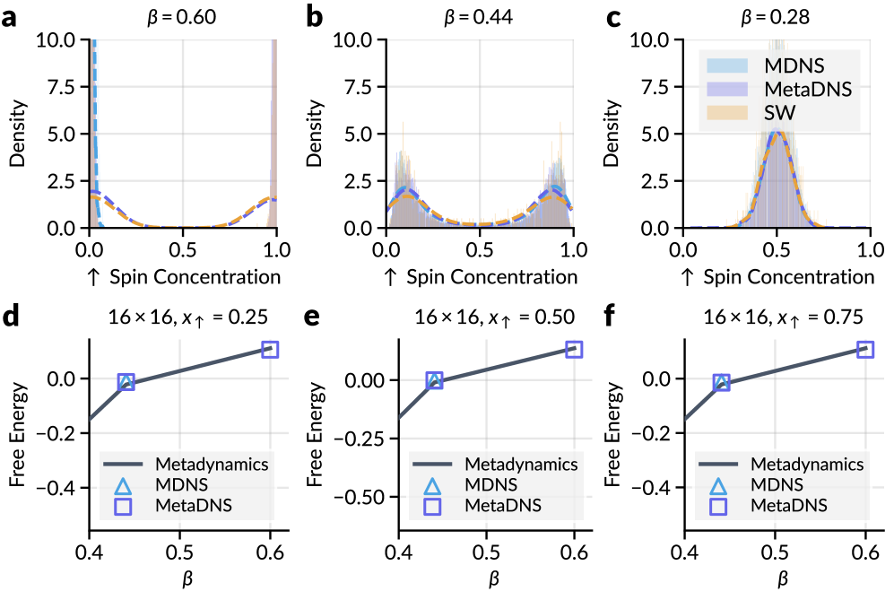
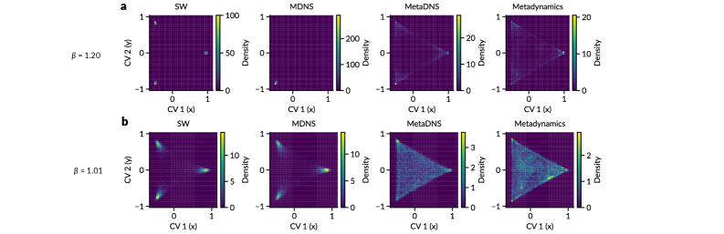
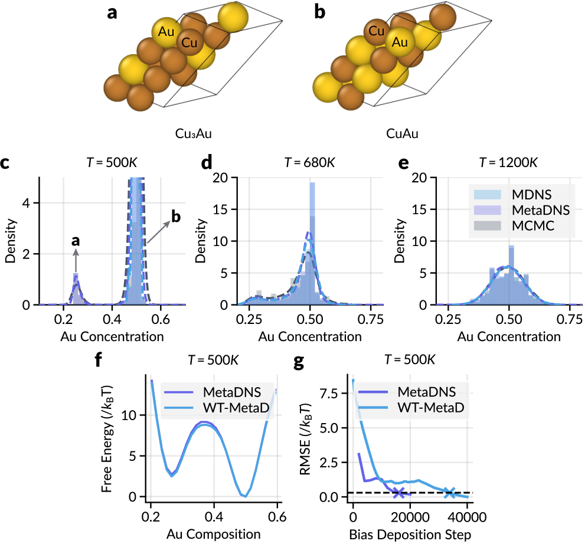

# 離散ニューラルサンプラーのモード探索とメタダイナミクス統合

- **執筆日**: 2026-05-24
- **要旨**: 近年急速に発展した離散ニューラルサンプラー（変分自己回帰ネットワーク・離散拡散モデルなど）は、イジングモデルや合金系の統計力学計算において有望な結果を示しているが、低温で多峰性自由エネルギー地形の一部のモードしか学習できない「モードコラプス」が深刻な障壁となっている。本論文 MetaDNS（ICML 2026）は、分子動力学で実績のある「ウェルテンパードメタダイナミクス」の適応的バイアスポテンシャル機構を離散ニューラルサンプラーに統合することでこの問題を解決し、イジング・ポッツモデルおよびCu-Au二元合金において低温での正確な熱力学分布の再現と自由エネルギー面の再構築を実現した。
- **タグ**: Computation and Theory / Phase Transitions; Spin Liquids and Quantum Many-Body Systems / Machine Learning; Monte Carlo
- **注目論文**: MetaDNS: Enhancing Exploration in Discrete Neural Samplers via Well-Tempered Metadynamics ([arxiv:2605.21722](https://arxiv.org/abs/2605.21722))
- **参照論文数**: 7

---

*図1: MetaDNSの動作原理。（左）従来の離散ニューラルサンプラーはモードコラプスを起こし、低エネルギー領域の一方にしか収束しない。（中）MetaDNSはウェルテンパードメタダイナミクスによる適応的バイアスを加え、探索済み領域からサンプラーを押し出す。（右）バイアス除去後に真の多峰性分布が正確に復元される。出典: Du et al. (2026), CC BY 4.0*

---

## 1. 背景：なぜ今この話題か

統計力学・材料科学における計算科学の中心的課題の一つは、多体系の熱力学量を精密に評価することである。ある系のハミルトニアン $H(x)$ と温度 $T$（以下 $k_B = 1$ として $\beta = 1/T$）が与えられたとき、分配関数

$$Z = \sum_x e^{-H(x)/T}$$

を計算することが出発点となる。この総和は離散系では状態空間 $\mathcal{X}$ 上の全配置 $x$ にわたって走る。分配関数から自由エネルギー $F = -T \ln Z$ が導かれ、これは相転移の判定や安定相の予測に直結する最重要な熱力学量である。しかし、系のサイズ $N$ に対して状態数が指数的に増加する（例えばイジング模型では $2^N$）ため、直接的な計算は $N \sim 10^2$ を超えると不可能である。

この困難を克服する古典的な手法がマルコフ連鎖モンテカルロ法（MCMC）であり、メトロポリス法をはじめとする数多くのアルゴリズムが材料科学・物理学で広く用いられてきた。MCMCは理論的には任意精度で分配関数に収束するが、実用上は相転移点付近や低温でのサンプリング効率が著しく低下する。これは自由エネルギー地形に高いエネルギー障壁が生じ、マルコフ連鎖が特定のモード（局所最安定状態）に「閉じ込められる」スロー・ダイナミクス問題として現れる。

この状況を打破しようとしたのが、深層学習を活用した「ニューラルサンプラー」の研究潮流である。2019年の変分自己回帰ネットワーク（VAN, arXiv:1809.10606）の登場以降、ニューラルネットワークを用いてBoltzmann分布 $p(x) \propto e^{-H(x)/T}$ からの直接サンプリングを学習する試みが急速に展開してきた。VANは、自己回帰モデルの厳密な確率的因子分解 $q_\theta(x) = \prod_{i=1}^N q_\theta(x_i \mid x_1, \ldots, x_{i-1})$ を利用して変分自由エネルギーを最小化し、MCMCを必要とせずに高速サンプリングを実現することを示した。

さらに2024〜2025年にかけて、連続時間マルコフ連鎖（CTMC）を用いた離散拡散モデルベースのサンプラーが相次いで提案された。マスク拡散ニューラルサンプラー（MDNS, NeurIPS 2025, arXiv:2508.10684）は確率最適制御の観点から離散拡散を定式化し、離散ニューラルフローサンプラー（DNFS, NeurIPS 2025, arXiv:2505.17741）は速度行列学習の枠組みと局所等変Transformerを組み合わせた。これらはいずれも高次元スピン系での自由エネルギー計算に適用され、MCMCを超える効率を示した。

しかし、これらのニューラルサンプラーにはいずれも解決されていない深刻な問題が残存していた。低温域（$T \ll T_c$、相転移温度以下）において、サンプラーが自由エネルギー地形の複数のモードを正確に探索できず、片方のモードに偏った「モードコラプス（mode collapse）」を起こすことである。

この問題に正面から取り組んだのが、2026年に発表されたMetaDNS（arXiv:2605.21722, ICML 2026採択）である。MetaDNSは、分子動力学シミュレーションの分野で長年実績を積んできた「ウェルテンパードメタダイナミクス（Well-Tempered Metadynamics, WT-MTD）」の思想を、離散ニューラルサンプラーへと接続するという全く新しいアプローチを採用した。本稿は、このMetaDNSを核として、離散ニューラルサンプラーとモード探索問題の現状を整理する。

---

## 2. 未解決問題は何か

### モードコラプス：低温多峰性系での探索失敗

ニューラルサンプラーの訓練は、変分自由エネルギーあるいはKLダイバージェンスの最適化として定式化される。たとえばVANでは

$$F_{\rm var}[\theta] = \sum_x q_\theta(x) \left[ H(x) + T \ln q_\theta(x) \right] \geq F$$

という変分上界を最小化する。この不等式の等号条件は $q_\theta = p$（真のBoltzmann分布）であり、最小化によって $q_\theta$ が $p$ に近づくことが期待される。しかし、勾配降下ベースの最適化は局所最小に陥りやすく、特に低温では多数の離れたモードが存在するため、最適化の初期条件に近いモードにしか収束しない。

この問題の物理的な根拠は明確である。2次元イジングモデルを例に取ると、$T < T_c \approx 2.27$ では自発磁化が生じ、自由エネルギー地形に「ほぼ全スピンアップ」の状態 ($m \approx +m_0$) と「ほぼ全スピンダウン」の状態 ($m \approx -m_0$) という二つの等価なモードが、高いエネルギー障壁を挟んで存在する（$m = \frac{1}{N} \sum_i \sigma_i$ は磁化）。標準的なニューラルサンプラーは、この両モードに等重みを配分するべきところを、一方のモードにほぼ全確率質量を集中させてしまう。

モードコラプスの解決策として、いくつかのアプローチが考えられる。（1）MCMCを補助的に使ったリジェクション修正：ニューラルサンプラーの出力をMCMCで修正する方法だが、低温では修正の受理率が低下し実用的でない。（2）レプリカ交換法との組み合わせ：複数温度で並列サンプリングし、温度間で状態を交換することで高温からのモード情報を低温に転送する方法だが、多くのモデルのコピーが必要となる。（3）探索促進のためのバイアスポテンシャル付与：これがメタダイナミクスのアプローチであり、MetaDNSが採用した方向性である。

### 集団変数の選択問題

メタダイナミクスを適用するためには、系の本質的な自由度を低次元に圧縮した「集団変数（Collective Variable, CV）」を選択する必要がある。CVの選択は性能に直結する：適切なCVが選ばれれば、バイアスポテンシャルが効果的に「エネルギー谷を埋め」、障壁を越えた探索が促進される。しかし不適切なCVでは、バイアスが系の重要な自由度を無視し、探索が改善されない。

イジングモデルでは磁化 $s(x) = m = \frac{1}{N}\sum_i \sigma_i$ が自然なCVとなる。ポッツモデルでは各状態の占有分率ベクトルが、Cu-Au合金ではAuの組成モル分率が適切なCVとして機能する。しかし、一般の複雑な離散系（タンパク質配列設計や複雑な結晶相など）では、何をCVとして選ぶべきかは自明でない。データ駆動的なCVの自動設計は活発な研究課題であり、MetaDNSでは現時点では物理的知識に基づく手動選択に頼っている。

### 離散系特有の技術的障壁

連続系の分子動力学では、ラングバン方程式 $\dot{x} = -\nabla V(x) + \sqrt{2T}\xi(t)$ に従った連続的な軌跡が存在し、バイアスポテンシャルをハミルトニアンに加えるだけで自然にメタダイナミクスが実装できる。離散系（スピン格子、合金配置、整数変数等）では、系の状態空間が離散的であるため（i）連続的な軌跡が存在しない、（ii）勾配情報が直接使えない、という根本的な制約がある。

このため、「訓練中の各イテレーションでどのようにバイアスポテンシャルを更新し、その情報をニューラルサンプラーの訓練目標に組み込むか」という設計は自明でなく、MetaDNSが本質的な技術的寄与として解決した問題である。

### 自由エネルギー再構築の精度検証

ニューラルサンプラーが多峰性分布を正しく学習できているかを検証するためには、重要度サンプリングや熱力学的積分などの方法で自由エネルギー面を参照値と比較する必要がある。しかし低温では参照値の精密計算自体が難しく、また重要度サンプリングの分散は不均等なモード重みによって爆発的に増大する。適切なバイアス除去（重要度再重み付け）の設計は、方法論の信頼性を担保するために不可欠な要素である。

---

## 3. 注目論文の概説

### 研究目的と対象系

MetaDNS（Xiaochen Du, Juno Nam, Jaemoo Choi, Wei Guo, Sathya Edamadaka, Junyi Sha, Elton Pan, Yongxin Chen, Molei Tao, Rafael Gómez-Bombarelli; ICML 2026, arXiv:2605.21722）の目的は、低温において多峰性分布に悩む離散ニューラルサンプラーのモードコラプス問題を、ウェルテンパードメタダイナミクスの統合によって解決することである。対象とするベンチマーク系は次の三つである。

（i）**2次元イジングモデル**：格子上のスピン $\sigma_i \in \{+1, -1\}$ が $H(\sigma) = -J \sum_{\langle i,j \rangle} \sigma_i \sigma_j$ で記述される系。$T < T_c$ では $\pm$ 対称な二つのモードが高い障壁で隔てられる。

（ii）**ポッツモデル**：$q$ 状態（$q > 2$）に一般化されたスピン系 $H(s) = -J \sum_{\langle i,j \rangle} \delta_{s_i, s_j}$。多状態間の複雑な相関構造を持ち、イジングより困難な多峰性問題を示す。

（iii）**Cu-Au二元合金**：FCC格子上の Cu/Au 配置問題。各格子点が Cu または Au を取り、合金のエネルギーが化学ポテンシャル差と格子間相互作用で記述される。異なる秩序相（無秩序相、L1$_2$-Au$_3$Cu、L1$_0$-AuCu 等）間の遷移を扱う。

### 研究アプローチ：MetaDNSの定式化

MetaDNSの核心は、離散ニューラルサンプラーの訓練ターゲットをバイアスポテンシャルで変調することで、探索困難な領域へサンプラーを誘導することにある。

**ステップ1: バイアスされた目標分布の定義**

通常の目標分布 $p(x) \propto e^{-H(x)/T}$ の代わりに、バイアスされた目標分布

$$p_{\rm bias}(x; t) \propto \exp\!\left[-\frac{H(x) + V_{\rm bias}(s(x), t)}{T}\right]$$

を訓練ターゲットとする。ここで $s(x)$ はCV（例：イジングでは磁化 $m$）、$V_{\rm bias}(s, t)$ は時刻 $t$（訓練イテレーション）に依存する適応的バイアスポテンシャルである。

**ステップ2: ウェルテンパードメタダイナミクスによるバイアス更新**

各訓練イテレーション $k$ で、離散ニューラルサンプラー（MDNS または自己回帰モデル）が $p_{\rm bias}(\cdot; t_k)$ からサンプル集合 $\{x_i\}$ を生成し、CV値 $\{s(x_i)\}$ の分布が観測される。この観測に基づいてバイアスポテンシャルを更新する：

$$V_{\rm bias}(s, t_{k+1}) = V_{\rm bias}(s, t_k) + w_k \cdot \exp\!\left[-\frac{(s - \bar{s}_k)^2}{2\delta^2}\right]$$

ここで $\bar{s}_k$ は現在のイテレーションでのCV値の代表値（例：バッチ平均や最頻値付近）、$\delta$ はGaussianカーネルの幅パラメータである。重み $w_k$ はウェルテンパードの特徴である適応的な減衰により

$$w_k = w_0 \cdot \exp\!\left[-\frac{V_{\rm bias}(\bar{s}_k, t_k)}{T \cdot (\gamma - 1)}\right]$$

と設定される。$\gamma > 1$ はバイアスファクターであり、$\gamma \to \infty$ で標準的なメタダイナミクス（無制限にバイアスが積み上がる）、$\gamma \to 1$ で平坦ヒストグラム（カバリングアルゴリズム）に相当する。ウェルテンパードの本質は、既にバイアスが大きく積み上がった領域（頻繁に訪問された領域）へのバイアス追加を指数的に抑制する点にある。これにより、長時間後にバイアスポテンシャルが発散せず、なめらかに収束する。

*図2: 2次元イジングモデル（L=16格子）での結果。(a–c) β=0.60, 0.44, 0.28 における上向きスピン濃度分布。低温（β=0.60, 0.44）でMDNSは一方のモードにコラプスするが、MetaDNSはBoltzmann参照（SW）と一致した双峰型分布を再現する。(d–f) 異なるスピン濃度での自由エネルギープロファイル：MetaDNSはWTメタダイナミクス参照と良好に一致する。出典: Du et al. (2026), CC BY 4.0*

**ステップ3: ニューラルサンプラーの再訓練**

バイアス $V_{\rm bias}$ が更新されるたびに、離散ニューラルサンプラーのパラメータ $\theta$ を更新して $p_{\rm bias}(\cdot; t_{k+1})$ を近似するように再訓練する。骨格となるサンプラーとしてMDNS（Masked Diffusion Neural Sampler）や自己回帰ネットワークが利用可能であり、MetaDNSはこれらを「プラグイン」として活用できる汎用フレームワークとして設計されている。

**ステップ4: 真の自由エネルギーの再構築**

訓練後、収束したバイアス $V_{\rm bias}(s)$ とサンプル $\{x_i\}$ から、真のCV-自由エネルギー面（ポテンシャル・オブ・ミーンフォース、PMF）を重要度再重み付け（importance reweighting）で再構築する：

$$\hat{F}(s) = -T \ln \left[\frac{\sum_{i : s(x_i) \approx s} e^{V_{\rm bias}(s(x_i))/T}}{\sum_i e^{V_{\rm bias}(s(x_i))/T}}\right] + {\rm const}$$

ウェルテンパードメタダイナミクスの理論的保証として、バイアスが収束したとき

$$V_{\rm bias}(s, t \to \infty) = -\frac{\gamma - 1}{\gamma} F(s) + {\rm const}$$

が成立するため、収束バイアスから直接 $F(s)$ を推定することも可能である。

### 主要結果

**イジングモデル**: $L \times L$ 格子（$L = 10$〜$16$）の2次元イジングモデルにおいて、$T < T_c = 2.269$ の低温でMetaDNSは磁化 $m$ の分布を正確に再現した。CVを磁化 $m$ に設定したMetaDNSは、図（論文Fig. 4）で示されるように、$m = \pm m_0$ の二つのモードを等重みで探索し、自由エネルギー面 $F(m)$ を参照値（対称性から等価な両モードを持つはずのCTMCシミュレーション）と良好な一致で再現した。一方、MDNSや自己回帰VANは $m > 0$ または $m < 0$ の一方にのみ収束するモードコラプスを示した。

*図3: ポッツモデル（q=3, L=16）における2次元CV空間のサンプリング範囲。(a) β=1.20（臨界温度付近）ではSWもMDNSもMetaDNSも均等な三角形の領域を探索する。(b) β=1.01（低温）ではMDNSが三角形の一角のみに集中（モードコラプス）するのに対し、MetaDNSとMetadynamicsは三角形全体を網羅する。出典: Du et al. (2026), CC BY 4.0*

**ポッツモデル**: $q$ 状態ポッツモデル（$q = 4, 8$）での実験でも、MetaDNSは各状態の占有分率ベクトルをCVとして、複数の等価な相（各スピン状態が多数を占める相）間の正確な自由エネルギー差を推定できた。これは熱力学的相安定性の評価に直結する能力である。

*図5: Cu-Au二元合金（4×4×4スーパーセル）結果。(a-b) Cu₃Au（L1₂型）とCuAu（L1₀型）の結晶構造。(c-e) 各温度でのAu濃度分布：T=500K（低温）でMDNSはモードコラプスするが、MetaDNSはMCMCと一致。(f) T=500KでのAu組成に対する自由エネルギー：MetaDNSはWT-MetaDと整合。(g) 自由エネルギー推定のRMSE収束：MetaDNSがWT-MetaDと同等の速度で収束する。出典: Du et al. (2026), CC BY 4.0*

**Cu-Au二元合金**: Au組成モル分率 $c_{\rm Au}$ をCVとして、異なる化学量論比での相の自由エネルギー面を再構築した。特に順序-無秩序転移温度付近での自由エネルギー差の推定において、MCMCベースの参照計算との良好な一致が確認された。これは、合金の第一原理に基づく熱力学計算における実用的な応用可能性を示す。

### 論文の新規性と限界

最大の新規性は、連続系向けに開発されたウェルテンパードメタダイナミクスを、「生成過程として定式化された離散ニューラルサンプラー」に接続する方法論を確立したことである。自己回帰モデルや離散拡散モデルはトークンを逐次的に生成するため、MD軌跡のような「連続的なCV軌跡」が存在しない。MetaDNSはこれを「バッチサンプリングに基づくバイアス更新」の枠組みで解決した。また、骨格のニューラルサンプラーを選ばないプラグインフレームワークとしての設計は汎用性が高い。

限界としては、CVの選択が依然として物理的直感や事前知識に依存していること、バイアスの離散化（格子状CVビニング）がCV次元の増加とともにメモリコストを増大させること、大規模系（$N \gg 10^3$）での計算スケーリングが未検証であること、そしてガラス系や液晶など複雑な相関を持つ系でのCV設計指針が不明であることが挙げられる。

---

## 4. 研究史における位置づけ

### 変分ニューラルサンプラーの夜明け

統計力学へのニューラルネットワーク応用の出発点として、Wu et al.（2019, arXiv:1809.10606）による変分自己回帰ネットワーク（VAN）が挙げられる。VANは自己回帰モデルの確率的因子分解の厳密性

$$q_\theta(x) = \prod_{i=1}^N q_\theta(x_i \mid x_1, \ldots, x_{i-1})$$

を利用し、変分自由エネルギー $F_{\rm var} = \langle H \rangle_{q_\theta} + T\,{\rm KL}(q_\theta \| {\rm uniform}) \geq F$ の直接最小化を実現した。VANはイジング模型・ハイゼンベルク模型・スピングラスなどに適用され、臨界点付近での高速サンプリングと自由エネルギー推定に成功した。

その後、階層的自己回帰ネットワーク（arXiv:2203.10989）や、メッセージパッシング機構を取り入れた変分自己回帰ネットワーク（arXiv:2404.06225）など、より高精度・大規模化に対応したVANの拡張版が多数提案された。テンソルネットワークとニューラルネットワークを統合した手法（TNVAN, arXiv:2504.12037）はスピングラスの自由エネルギー推定においてさらなる精度改善を示している。しかし、これらの手法はいずれも低温でのモードコラプスを根本的に解決しておらず、単に「高温から低温への移行」の精度を改善するにとどまっていた。

### 離散拡散モデルによるサンプラーの台頭

2024〜2025年にかけて、連続時間マルコフ連鎖（CTMC）に基づく離散拡散モデルがサンプリングに応用されるようになった。これらの手法では、ノイズ状態 $x_T$（例えば均一マスク）から始まり、CTMC の逆過程を学習することで徐々に真の分布 $p(x)$ に近づいていく生成過程を定義する。

MDNSは確率最適制御（SOC）の枠組みでCTMCの最適逆過程を学習し、スピン系の自由エネルギー計算に成功した。DNFSは速度行列の直接学習に局所等変Transformerを組み合わせ、大規模系での効率的な訓練を実現した。また、オフポリシーアルゴリズムを離散拡散サンプラーに適用した研究（arXiv:2602.05961）は、標準ベンチマークでの性能向上を報告している。

これらの方法はいずれも低温でのモードコラプスに直面した。特にMDNS（MetaDNSの骨格）は、低温でサンプリングが一方のモードに固定してしまい、自由エネルギーの対称性を回復できないことが示されている。

### 連続系でのメタダイナミクスとGFlowNet

メタダイナミクスは、Parrinello らのグループが2002年頃に提案し、2008年にウェルテンパード版（arXiv:0803.3861）が発表された増強サンプリング法である。分子動力学の文脈では、CVに沿ってGaussianカーネルを順次積み上げてバイアスポテンシャルを形成し、探索済み領域から徐々に排除することで多峰性エネルギー地形の全体を網羅する。WT-MTDはバイアス高さを適応的に制御することでバイアスの発散を防ぎ、収束した自由エネルギー面を理論的に保証する形で得ることができる。

生成フローネットワーク（GFlowNet）という全く異なる枠組みの連続版に対してメタダイナミクスを適用したMetaGFN（arXiv:2408.15905, ICML/TMLR 2025）が提案された。MetaGFNは連続空間での多峰性報酬関数において標準GFlowNetよりも遠いモードへの探索が改善されることを示したが、本質的に連続空間専用であり、スピン格子や合金配置のような純粋な離散系には適用できなかった。

一方、2025年のFlowMatching for Discrete Systems（arXiv:2503.08063）は、イジング模型に対する離散フローマッチングを提案し、多温度での自由エネルギーサンプリングを可能にした。ただし、この手法は主として温度スケーリングの効率化に焦点を当てており、モードコラプスに対する明示的な解決策は提供していない。

MetaDNSはこれらの研究系譜の交差点に位置する。VANやMDNSなどの離散ニューラルサンプラーの基盤の上に、WT-MTDの探索促進機構を離散系向けに再定式化して組み合わせた点が独自の貢献である。研究史の中では「ニューラルサンプラーの増強サンプリング化」という方向性の先駆的論文として位置づけられ、连続系での类似手法（MetaGFN）の離散系版の実現を達成したとも言える。

---

## 5. どの解釈が最も妥当か

### バイアスポテンシャルによる探索の確かな根拠

MetaDNSの中核仮説は「WT-MTDのバイアスポテンシャル機構が離散ニューラルサンプラーの訓練に直接適用可能である」というものである。これを支持する根拠は複数ある。

第一に、WT-MTDの収束理論は離散・連続に関わらず、CV空間上の1次元（または低次元）のマルコフ連鎖として普遍的に成立する（Barducci et al., 2008）。MetaDNSでは、ニューラルサンプラーが生成した「サンプル集合」からCV値の分布を測定し、これを擬似的な「軌跡」としてWT-MTDに渡す。この操作によって離散的な生成過程とWT-MTDの連続的な更新則の橋渡しが可能となる。

第二に、イジングモデルという理論的に厳密な自由エネルギーが知られている系でMetaDNSが正確な結果を与えることは、方法論の理論的整合性を強く支持する。対称性から $F(+m_0) = F(-m_0)$ が保証されている系で等重みのモードサンプリングを実現できることは、バイアス付与と除去のメカニズムが正しく機能していることの直接的証拠となる。

### 既存手法との整合と相違

MDNSとの比較では、MetaDNSはMDNSの変分目標を変更し、バイアス付き分布 $p_{\rm bias}$ を新しい訓練ターゲットとすることでシームレスに統合できる。これは構造的な変更というよりも「目標分布の変調」であり、MDNSの理論的保証（確率最適制御の意味でのBoltzmann分布への収束）をバイアス付き分布に対して維持できる。

MetaGFN（連続GFlowNet版）との比較では、MetaDNSは離散空間固有の課題（非微分可能性、軌跡の非連続性）を「バッチサンプリングに基づく離散的CV更新」で解決した点が独自性を持つ。MetaGFNが連続CVへの勾配情報を利用するのに対し、MetaDNSはCV値の「ヒストグラム的な集積」のみを利用するため、設計がよりシンプルである。

### まだ弱い部分：スケーラビリティと一般性

MetaDNSの実証はすべて中規模系（$N \leq \mathcal{O}(10^2)$）に限定されており、より大規模な系（例えば結晶合金の$10^3$原子以上のスーパーセル）でのCV空間ビニングとメモリコストの増大は未解決である。特に、多次元CV（2次元以上）を必要とする複雑な相転移（例：熱力学的量が複数の秩序パラメータで特徴づけられる系）への拡張は技術的に困難であり、実用化に向けた重要な課題となっている。

また、現在の実装では訓練の各イテレーションでサンプラーのパラメータを再更新する必要があるため、バイアス更新に伴う計算コストが標準的な離散ニューラルサンプラーより増加する。このオーバーヘッドが大規模系で問題となるかどうかの系統的な検討が必要である。

---

## 6. 何が一般化できるか

### 他の離散系への応用：タンパク質配列設計と組み合わせ最適化

MetaDNSのフレームワークはスピン系や合金に限らず、任意の離散変数からなるエネルギー関数を持つ系に原理的に適用可能である。特に注目される応用先が**タンパク質配列設計**である。アミノ酸配列（20種類のアルファベットから成る長さ$L$の離散系）のエネルギー（溶解自由エネルギーや機能スコア）は多峰性を持ち、異なる機能クラスが高いエネルギー障壁で隔てられている。MetaDNSの枠組みで、例えば二次構造含量や疎水性コアのサイズをCVとして採用すれば、異なる機能を持つ配列空間を系統的に探索できる可能性がある。

**組み合わせ最適化問題**（最大カット、巡回セールスマン問題など）へのニューラルサンプラーの応用でも、MetaDNSは「局所最適解間の探索」を促進するためのバイアス機構として利用できる。目的関数の値をCVとして設定し、既に探索した局所最適解の近傍への回帰を抑制するメタダイナミクス的なバイアスを導入することで、大域最適解の発見確率が向上すると期待される。

### 材料設計への接続：合金相図の高精度化

Cu-Au系での結果は、MetaDNSが第一原理に基づく合金の熱力学的計算に直接応用できることを示唆する。特に、**クラスター展開法**（Cluster Expansion, CE）と組み合わせた際の可能性が高い。CEは合金エネルギーを多体相互作用の線形結合として表現する手法であり、DFT計算からフィットされたCEポテンシャルは離散系のハミルトニアンそのものである。MetaDNSをCEに基づくMCMCの代替として利用することで、秩序-無秩序転移温度の精密推定や複数の相が競合するAgPd等の多成分合金相図の計算が加速される可能性がある。

### 理論的な枠組みの拡張可能性

MetaDNSの数理的骨格は「バイアスされた目標分布の変調」と「重要度再重み付けによる真の分布の回復」という二つの要素から成る。この構造は、WT-MTDの特定の実装にとどまらず、より一般的な「探索促進バイアス」の族に拡張可能である。たとえば、非局所CVやニューラルネットワーク自体でパラメタライズされたCVを採用したり、バイアス更新規則を強化学習的に最適化したりすることで、CV設計の自動化と探索効率のさらなる向上が考えられる。

---

## 7. 基礎から理解する

### 統計力学の基礎：分配関数と自由エネルギー

物質の熱力学的性質を微視的なレベルから理解するのが統計力学の目標である。物質を構成する粒子（原子、スピン、分子など）の状態 $x$（例えばスピン配置 $\sigma = (\sigma_1, \sigma_2, \ldots, \sigma_N)$）それぞれに対してエネルギー $H(x)$（ハミルトニアン）が定まるとする。

熱平衡状態では、系が状態 $x$ を取る確率（ボルツマン分布）は

$$p(x) = \frac{1}{Z} e^{-H(x)/T}$$

と与えられる。ここで $T$ は温度（エネルギー単位）であり、$Z = \sum_x e^{-H(x)/T}$ は**分配関数**（partition function）と呼ばれる正規化定数である。

ボルツマン分布は「低エネルギー状態ほど高確率で実現される」という直感と一致している。温度が高いほど（$T \to \infty$）エネルギーの差が相対的に小さくなり、すべての状態がほぼ等確率になる（乱雑な高温相）。温度が低いほど（$T \to 0$）最低エネルギー状態のみに確率が集中する（秩序低温相）。

分配関数 $Z$ が計算できれば、熱力学量のほぼすべてが導出できる。特に重要なのが**自由エネルギー**（ヘルムホルツ自由エネルギー）

$$F = -T \ln Z$$

である。自由エネルギーは系の熱力学的安定性を決める最重要の量であり、二つの相 $\alpha$ と $\beta$ の自由エネルギー差 $\Delta F = F_\alpha - F_\beta < 0$ であれば相 $\alpha$ が安定である。また、相転移は $\Delta F = 0$ となる点（転移温度）で生じる。

物理量 $A(x)$ の熱力学的期待値は

$$\langle A \rangle = \sum_x A(x) \, p(x) = \frac{\sum_x A(x) \, e^{-H(x)/T}}{Z}$$

で与えられ、比熱 $C = T^2 \partial^2 F / \partial T^2$、磁化率 $\chi = \partial^2 F / \partial h^2$ などの応答関数もすべて $F$ から導かれる。

しかし困難が一つある。$Z = \sum_x e^{-H(x)/T}$ の総和は状態数が指数的に多く（$N$ スピン系では $2^N$ 項以上）、厳密計算が不可能である。この困難を克服するのがモンテカルロ法とニューラルサンプラーである。

### イジングモデル：最も単純な格子スピン系

理解の出発点として、最も基本的な格子スピン模型であるイジングモデルを説明する。$N$ 個のスピン $\sigma_i \in \{+1, -1\}$（$i = 1, \ldots, N$）が格子点に配置され、隣接スピン間にのみ相互作用が働くとする。ハミルトニアンは

$$H(\sigma) = -J \sum_{\langle i,j \rangle} \sigma_i \sigma_j - h \sum_i \sigma_i$$

ここで $J > 0$ は強磁性的な相互作用定数（隣接スピンが揃う方が低エネルギー）、$h$ は外部磁場、$\langle i, j \rangle$ は格子上の隣接ペアを表す。

2次元正方格子では、オンサーガーが1944年に厳密解を求め、臨界温度 $T_c = 2J / \ln(1 + \sqrt{2}) \approx 2.269J$ で相転移（強磁性-常磁性転移）が生じることが知られている。$T < T_c$ では自発磁化 $m_0 = \langle \frac{1}{N}\sum_i \sigma_i \rangle \neq 0$ が発生し、すべてのスピンが揃いやすい「秩序相」となる。

低温の自由エネルギー地形（磁化 $m$ を横軸とした $F(m)$ のプロファイル）は、$m = +m_0$ と $m = -m_0$ に二つの谷（モード）を持つ「二重井戸型」となる。これら二つのモードは対称性（ハミルトニアンの $\sigma \to -\sigma$ 対称性）から全く等価であり、正確な分布には等重みが割り当てられるべきである。この二重井戸型ポテンシャルでの探索こそが、ニューラルサンプラーのモードコラプス問題の最も典型的なテストケースとなる。

### マルコフ連鎖モンテカルロ法（MCMC）

MCMCの基本アイデアは、ボルツマン分布 $p(x)$ を不変分布として持つマルコフ連鎖を構築し、長時間動かすことで平衡分布からのサンプルを得ることである。

**メトロポリス法**では、現在の状態 $x$ から候補状態 $x'$（例：ランダムに一つのスピンを反転した状態）を提案し、受理確率

$$A(x \to x') = \min\!\left(1, \frac{p(x')}{p(x)}\right) = \min\!\left(1, e^{-[H(x')-H(x)]/T}\right)$$

で受理または棄却する。これを繰り返すことで、系は次第にボルツマン分布に収束する。MCMCは理論的に正しい分布を保証するが、低温ではエネルギー増加（$H(x') > H(x)$）を伴う提案が高確率で棄却されるため、異なるモード間の移動が起こらず、サンプルが一つのモードに長期間閉じ込められる。

### 変分自己回帰ネットワーク（VAN）

VANの出発点は変分原理である。任意の確率分布 $q(x)$ に対して

$$F_{\rm var}[q] = \langle H \rangle_q + T\,{\rm KL}(q \| Z^{-1}e^0) = \sum_x q(x) H(x) + T \sum_x q(x) \ln q(x)$$

が成立し、$F_{\rm var}[q] \geq F$ が保証される（等号は $q = p$ のとき）。これは **変分自由エネルギー** または **変分上界** と呼ばれ、$q$ を自由に最適化することで $F$ を近似できる。

$q$ を自己回帰モデルでパラメータ化する。$N$ スピン系（各スピン $x_i \in \{1, \ldots, q\}$）では、条件付き確率の積

$$q_\theta(x) = q_\theta(x_1) \cdot q_\theta(x_2 \mid x_1) \cdot q_\theta(x_3 \mid x_1, x_2) \cdots q_\theta(x_N \mid x_1, \ldots, x_{N-1})$$

として $q_\theta$ を定義する。各条件付き確率はニューラルネットワーク（RNN、LSTM、Transformer等）で計算される。この因子化は確率の公理（和が1、非負性）を自動的に保証し、$\sum_x q_\theta(x) = 1$ が厳密に成立する。

勾配降下法で $\partial F_{\rm var} / \partial \theta$ を計算してパラメータを更新するが、低温では $q_\theta$ が複数のモードをカバーできずにモードコラプスが生じる。

### 連続時間マルコフ連鎖（CTMC）と離散拡散モデル

離散拡散モデルを理解するためには、連続時間マルコフ連鎖（CTMC）の概念が必要である。CTMCは時刻 $t \in [0, T]$ に連続的に変化しながら、ある時刻には離散的な状態 $x \in \mathcal{X}$ を取る確率過程である。状態 $x$ から $x'$ への推移は速度行列 $R(x' \mid x) \geq 0$（$x' \neq x$）によって記述され、確率分布の時間発展は

$$\frac{d p_t(x)}{dt} = \sum_{x'} \left[ R(x \mid x') p_t(x') - R(x' \mid x) p_t(x) \right]$$

というコルモゴロフ前進方程式（マスター方程式）に従う。

マスク拡散では、前進過程として各スピン $x_i$ を確率的にマスクトークン $[M]$ に置き換え（$x \to x_T = [M \ldots M]$）、逆過程でマスクを実際のスピン値に復元する（$x_T \to x_0$）ことで生成を実現する。逆過程の速度行列の最適な選択は確率最適制御の問題として定式化され、MDNSはこの最適制御問題を訓練によって解く。

### メタダイナミクスの原理

メタダイナミクス（Laio & Parrinello, 2002）は、MD シミュレーションに用いる増強サンプリング法であり、系の軌跡が通過した集団変数（CV）の位置に順次Gaussianポテンシャルを積み上げることで、探索済み領域からの排除を促進する手法である。

$s$ をCVとし、時刻 $t$ までに積み上がったバイアスを $V_{\rm bias}(s, t)$ とすると、系が動くのは修正されたポテンシャル $H(x) + V_{\rm bias}(s(x), t)$ の上となる。探索頻度の高い領域には多くのGaussianが積み上がって高いバイアスが生じ、系はその領域を「避けて」新たな領域を探索するようになる。これは丘（hill）を積み上げるという意味でhill-surfing法とも呼ばれる。

時間が経つにつれ、最終的にはCV空間の全体が均等に探索された「フラット」なバイアス付きポテンシャルが形成され、そのとき $V_{\rm bias}(s) \approx -F(s) + {\rm const}$ が成立する。これを利用して自由エネルギー面が再構築できる。

### ウェルテンパードメタダイナミクス（WT-MTD）

標準的なメタダイナミクスはバイアスが発散する問題があった（Gaussian を無限に積み上げるため）。これを解決したのが Barducci et al.（2008, PRL）によるウェルテンパードメタダイナミクスである。

WT-MTDでは、バイアスの追加速度を既存バイアスの大きさに応じて指数的に減衰させる：

$$\dot{V}_{\rm bias}(s, t) = w_0 \cdot e^{-V_{\rm bias}(s, t) / [T(\gamma - 1)]} \cdot \delta(s - s(t))$$

ここで $\gamma > 1$ はバイアスファクター（テンパリングパラメータ）、$s(t)$ は時刻 $t$ でのCV値である。$\gamma \to \infty$ で標準メタダイナミクス（発散）、$\gamma \to 1$ で完全な熱力学的サンプリング（バイアスなし）に相当する。実用では $\gamma \sim 10$〜$30$ が多用される。

収束した後のバイアス $V_{\rm bias}^\infty(s)$ と真の自由エネルギー $F(s)$ の関係は

$$V_{\rm bias}^\infty(s) = -\frac{\gamma - 1}{\gamma} F(s) + {\rm const}$$

であり、これから $F(s) = -\frac{\gamma}{\gamma-1} V_{\rm bias}^\infty(s) + {\rm const}$ が得られる。または、重要度再重み付け

$$\langle A \rangle_p = \frac{\langle A(x) \, e^{V_{\rm bias}(s(x))/T} \rangle_{p_{\rm bias}}}{\langle e^{V_{\rm bias}(s(x))/T} \rangle_{p_{\rm bias}}}$$

を使って真の分布での期待値を推定することも可能である。このWT-MTDの数理がMetaDNSの理論的根拠となっている。

### 集団変数（CV）とポテンシャル・オブ・ミーンフォース（PMF）

集団変数（Collective Variable, CV） $s(x)$ は、系の $N$ 個の微視的自由度（例：$N$ スピン）から少数の巨視的指標（例：磁化 $m = \frac{1}{N}\sum_i \sigma_i$）へのマッピングである。CV空間上の自由エネルギー面、すなわちポテンシャル・オブ・ミーンフォース（PMF）は

$$F(s) = -T \ln \left[ \sum_x \delta(s(x) - s) \, e^{-H(x)/T} \right] + {\rm const}$$

と定義される。PMFはCV $= s$ という制約のもとでの自由エネルギーであり、相転移の秩序パラメータの変化や反応座標に沿った障壁の高さを定量化する。

イジングモデルでは $s = m$（磁化）をCVとすると、$F(m)$ は低温で双峰型（$m = \pm m_0$ に谷を持つ）となり、このPMFを正確に再構築できるかどうかがMetaDNSの核心的な性能評価となる。

---

## 8. 専門用語の解説

**自由エネルギー（Free Energy）**
熱力学における最重要量の一つ。ヘルムホルツ自由エネルギーは $F = -T \ln Z$ で定義される（$Z$ は分配関数）。相の安定性（どの相が熱力学的に安定か）は自由エネルギーの大小で決まる。常に「$F$ が小さい方が安定な相」となる。統計力学の観点では、$F = \langle H \rangle - TS$ であり、エネルギー（$\langle H \rangle$）とエントロピー（$S$）のトレードオフを表す。MetaDNSの文脈では、CV空間上の自由エネルギー面（PMF）の再構築が主目的となる。

**分配関数（Partition Function）**
分配関数 $Z = \sum_x e^{-H(x)/T}$ は、全ての可能な微視的状態にわたるBoltzmannウェイトの総和であり、熱力学量をすべて生成する「母関数」に相当する。$Z$ そのものは直接測定できないが、自由エネルギー差 $\Delta F = F_2 - F_1 = -T \ln(Z_2/Z_1)$ は熱力学的に意味を持ち、相安定性の判定に用いられる。$Z$ の計算が指数的困難なため、MCMCやニューラルサンプラーが必要とされる。

**モードコラプス（Mode Collapse）**
多峰性確率分布（複数の孤立した高確率領域＝モードを持つ分布）からサンプリングすべきところ、モデルが一部のモードしか学習しない現象。生成モデル（GAN、拡散モデル等）で古くから知られる問題であり、ニューラルサンプラーでは特に低温での多峰性Boltzmann分布に対して深刻に現れる。MetaDNSが解決を目指す中心的問題であり、バイアスポテンシャルによって「探索済みモードからの排除」を促すことで克服を目指す。

**変分自己回帰ネットワーク（VAN）**
自己回帰モデル（各変数の条件付き確率を逐次的に定義するモデル）を用いて変分自由エネルギーを最小化する手法（Wu et al., 2019, arXiv:1809.10606）。自己回帰因子分解 $q_\theta(x) = \prod_i q_\theta(x_i \mid x_{<i})$ の厳密な確率的解釈を利用し、MCMCなしでBoltzmann分布のサンプリングを学習する。MetaDNSでは、VANを骨格サンプラーの一つとして採用できるが、典型的にはより精度の高いMDNSを利用する。

**マスク拡散ニューラルサンプラー（MDNS）**
Masked Diffusion Neural Sampler（Zhu et al., NeurIPS 2025, arXiv:2508.10684）。確率最適制御の枠組みで、マスクトークンから始まりBoltzmann分布を生成するCTMCの最適逆過程を学習する。MetaDNSの「骨格（backbone）」として機能し、バイアスされた目標分布 $p_{\rm bias}$ に対してMDNSの訓練目標が適用される。

**ウェルテンパードメタダイナミクス（Well-Tempered Metadynamics, WT-MTD）**
Barducci et al.（2008, PRL, arXiv:0803.3861）が提案した増強サンプリング法。CVに沿ってGaussianバイアスを逐次的に積み上げるが、バイアス高さをテンパリング（tempering）することで発散を防ぎ、収束した自由エネルギー面を保証する。バイアスファクター $\gamma$ で探索の「激しさ」を制御できる。分子動力学では標準的な手法として広く使われており、MetaDNSは離散ニューラルサンプラーの文脈でその機構を初めて系統的に適用した。

**集団変数（Collective Variable, CV）**
高次元の微視的自由度（$N$ スピンなど）から少数の巨視的指標（磁化、組成モル分率等）へのマッピング関数 $s: \mathcal{X} \to \mathbb{R}^d$（$d \ll N$）。メタダイナミクスの性能はCVの選択に強く依存する。CVが系の重要な遅い緩和モードを捉えていれば、バイアスポテンシャルが効果的に障壁を「埋め」て探索が促進される。MetaDNSでは、イジングでは磁化、ポッツでは占有分率、合金ではAu組成モル分率が用いられた。

**ポテンシャル・オブ・ミーンフォース（PMF, Potential of Mean Force）**
CV空間上の自由エネルギー面 $F(s) = -T \ln \int \delta(s(x)-s) e^{-H(x)/T} dx + {\rm const}$ のこと。「CVを $s$ に固定した条件下での平均的な力（$-dF/ds$）のポテンシャル」という意味の名称。相転移の検出（PMFの双峰型からの単峰型への変化が転移を示す）、反応経路の同定、安定相間の自由エネルギー差推定に使われる。MetaDNSの最終的な出力がこのPMFである。

**重要度再重み付け（Importance Reweighting）**
バイアス付き分布 $p_{\rm bias}(x)$ からサンプリングしたサンプル $\{x_i\}$ を使って、真の分布 $p(x)$ での期待値を推定する統計的技法。重要度重み $w_i = e^{V_{\rm bias}(s(x_i))/T}$ を各サンプルに付与し、$\langle A \rangle_p \approx \sum_i w_i A(x_i) / \sum_i w_i$ と推定する。WT-MTDとの組み合わせで、バイアスポテンシャルの偏りを除いた真の熱力学量が得られる。

**連続時間マルコフ連鎖（CTMC）**
状態が連続時間で変化するが、各時刻では離散的な状態を取るランダム過程。速度行列（rate matrix） $R$ によって記述され、状態遷移の「瞬間的な確率流」を表す。離散拡散モデルの基礎概念であり、MDNSやDNFSはCTMCとして離散サンプリング過程を定式化する。MetaDNSがバイアス付き分布を訓練ターゲットとするとき、MDNSのCTMC定式化が維持されるため、理論的整合性が保たれる。

---

## 9. 将来展望

MetaDNSが示した「離散ニューラルサンプラー × 増強サンプリング」の組み合わせは、統計力学計算の新しいパラダイムを切り拓く可能性を持つ。現時点でほぼ確からしくなっていることとして、イジングモデルやポッツモデルのような「物理的に意味のある単純なCVが自明に定まる系」では、MetaDNSがモードコラプスを効果的に克服し、低温での自由エネルギー面の精密な再構築を可能にするという事実がある。また、骨格サンプラーとしてMDNSや自己回帰モデルが利用できるというプラグイン設計の汎用性も実証された。これらの基盤が確立されたことで、合金系の相図計算やスピン系の相転移解析への実用化は視野に入ってきた。

一方、まだ未確定な重要課題が残る。特に「集団変数の自動選択」は最大の未解決問題である。現状では物理的直感に頼ったCV設計が必要であり、これを機械学習的に自動化することが次の大きな課題となる。深層学習によるCVの学習（エンコーダを使って低次元CVを自動抽出し、メタダイナミクスと共同で学習する）という方向性は分子動力学の世界で研究が進んでいるが（"learning CVs from biased data"等）、離散系への移植は未着手である。また、大規模系（$N \sim 10^4$ 以上）でのスケーラビリティ検証、多次元CVへの拡張、そして複雑な多体相関を持つ量子スピン液体やガラス系への適用可能性は不確定のままである。

今後注目すべき展開として三点を挙げる。第一に、MetaDNSをGFlowNetやFLOW matchingなどの他の離散生成モデルに適用した場合の比較研究が進むことで、「どの骨格サンプラーと組み合わせるのが最適か」という設計指針が得られるであろう。第二に、タンパク質や核酸などの生体高分子配列設計への応用が試みられると予想される。配列空間の自由エネルギー地形には多峰性があり、MetaDNSが異なる機能クラス間の探索を可能にすれば、計算創薬・合理的タンパク質設計に大きなインパクトを与える。第三に、MetaDNSの枠組みをさらに発展させ、CV設計と増強サンプリングを単一の強化学習ループとして共同最適化する手法が提案されることで、完全自律的な離散系の自由エネルギー計算プラットフォームが実現する可能性がある。

---

## 参考論文一覧

1. **[MetaDNS: Enhancing Exploration in Discrete Neural Samplers via Well-Tempered Metadynamics](https://arxiv.org/abs/2605.21722)** (Du et al., ICML 2026) — 本稿の注目論文。ウェルテンパードメタダイナミクスを離散ニューラルサンプラーに統合し、低温多峰性系でのモードコラプスを解決したフレームワーク。

2. **[Well-Tempered Metadynamics: A Smoothly Converging and Tunable Free-Energy Method](https://arxiv.org/abs/0803.3861)** (Barducci, Bussi & Parrinello, PRL 2008) — ウェルテンパードメタダイナミクスの原著論文。バイアスファクター $\gamma$ によるスムーズな収束と自由エネルギー再構築の理論的保証を確立した。

3. **[Solving Statistical Mechanics Using Variational Autoregressive Networks](https://arxiv.org/abs/1809.10606)** (Wu et al., PRL 2019) — 変分自己回帰ネットワーク（VAN）の原著論文。自己回帰モデルによる変分自由エネルギーの直接最小化を初めて実現し、ニューラルサンプラー研究の出発点となった。

4. **[MDNS: Masked Diffusion Neural Sampler via Stochastic Optimal Control](https://arxiv.org/abs/2508.10684)** (Zhu et al., NeurIPS 2025) — MetaDNSの骨格サンプラー。確率最適制御でマスク拡散のCTMCを定式化し、離散系の自由エネルギー計算への応用を示した。

5. **[Discrete Neural Flow Samplers with Locally Equivariant Transformer](https://arxiv.org/abs/2505.17741)** (DNFS, NeurIPS 2025) — 速度行列学習に基づく離散ニューラルフローサンプラー。局所等変Transformerで訓練効率を改善し、スピン系に適用した。MetaDNSと同時期に提案された競合・相補的な手法。

6. **[Scalable Multitemperature Free Energy Sampling of Classical Ising Spin States](https://arxiv.org/abs/2503.08063)** (Tuo et al., 2025) — 離散フローマッチングによるイジングモデルの自由エネルギーサンプリング。多温度対応と大規模格子へのスケーリングを実現したが、低温モードコラプス問題には取り組んでいない。

7. **[MetaGFN: Exploring Distant Modes with Adapted Metadynamics for Continuous GFlowNets](https://arxiv.org/abs/2408.15905)** (Phillips & Cipcigan, ICML 2024/TMLR 2025) — 連続GFlowNetにメタダイナミクスを適用した先行研究。MetaDNSの連続系版として位置づけられるが、離散系には適用不可。MetaDNSの動機付けを与えた重要な先行手法。
