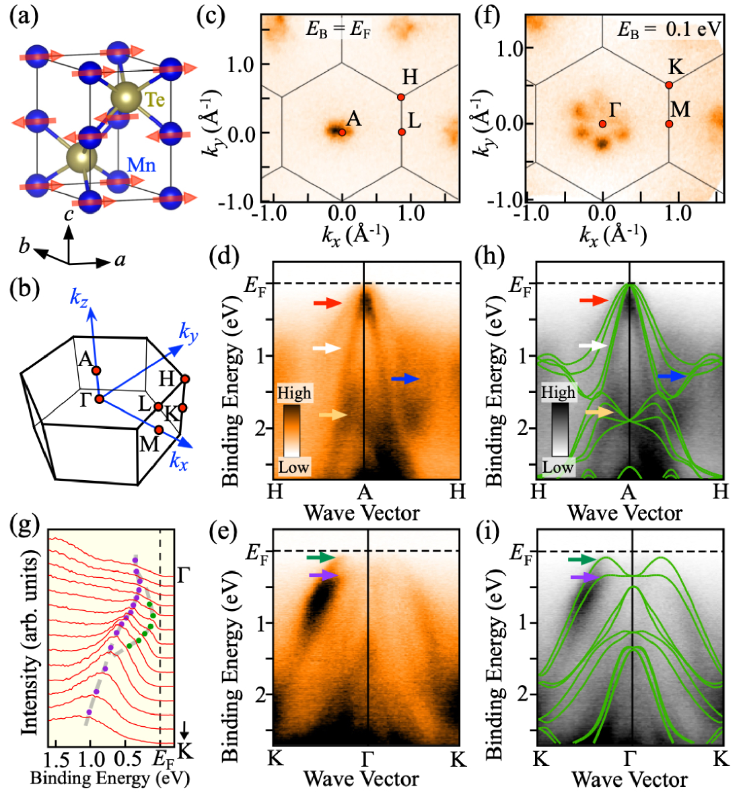
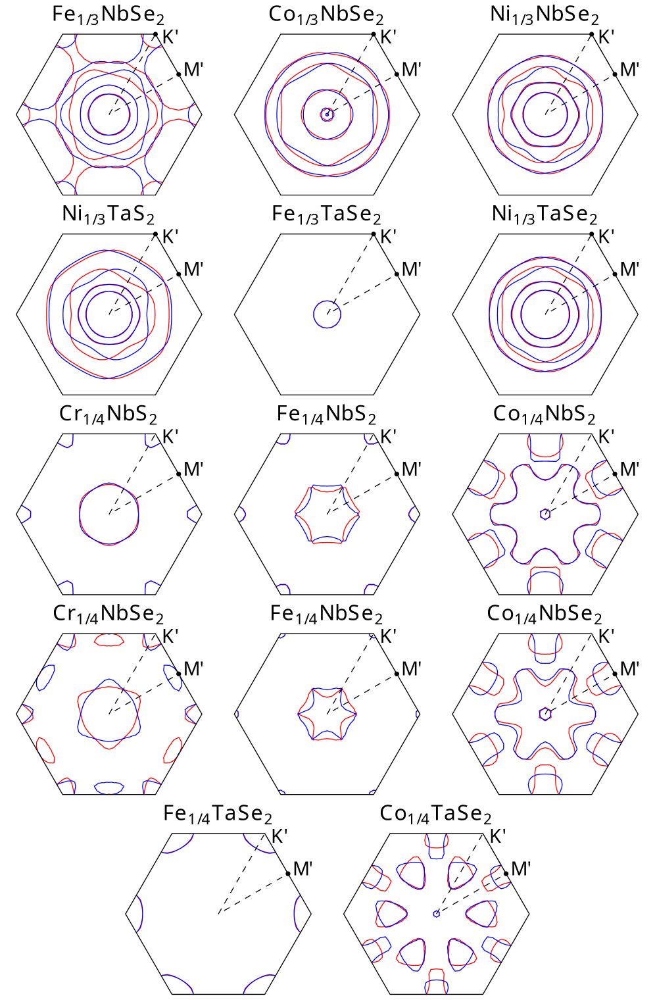
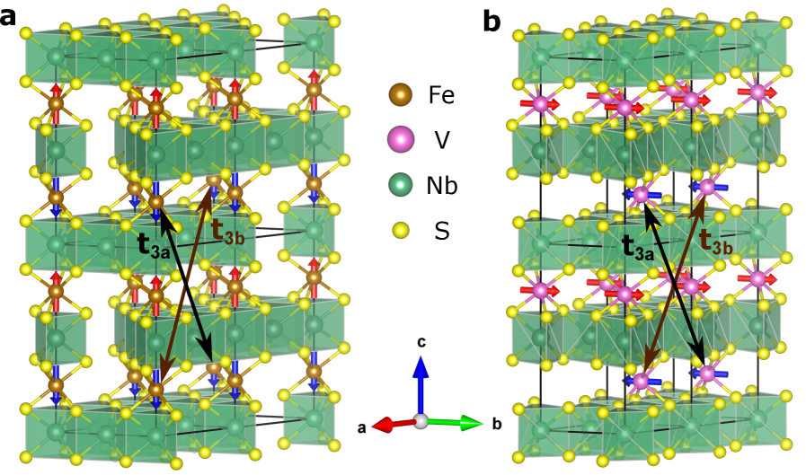
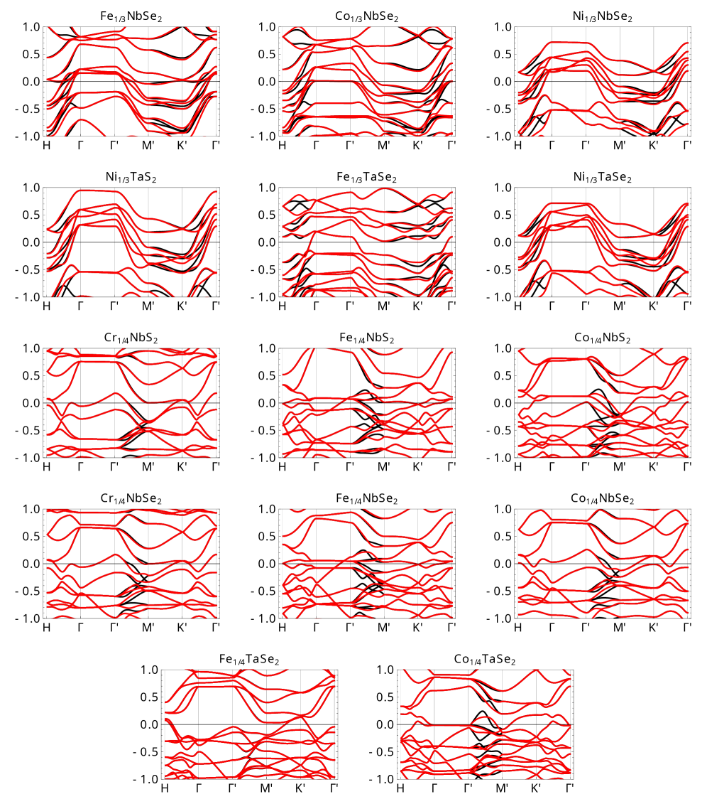

# アルターマグネット：第三の磁気相とスピン分裂のリガンド媒介機構

- 執筆日：2026-05-24
- トピック：ゼロ正味磁化でスピン分裂を示す「アルターマグネット」の微視的起源を、インターカレート型遷移金属ダイカルコゲナイドCo₁/₄NbSe₂を舞台に第一原理計算とWannierモデルで解明する
- タグ：Magnetism and Spin / Orbital Physics; Low-Dimensional Materials / First-Principles Calculations
- 注目論文：Camerano, Bisti, Profeta, "Ligand-mediated Origin of Altermagnetic Spin-Splitting" [arXiv:2605.21284](https://arxiv.org/abs/2605.21284) (2026-05-20)
- 参照論文数：6

---

## 1. 背景：なぜ今この話題か

磁性材料の歴史は長いが、その基本的な相は長らく「強磁性体（ferromagnet）」と「反強磁性体（antiferromagnet）」の二つとされてきた。強磁性体は隣り合うスピンが同じ向きに揃い、正味の磁化が残る。一方、反強磁性体は隣り合うスピンが反平行に並び、正味の磁化はゼロになる。この二分法は20世紀を通じて物性物理学の教科書的常識として定着してきた。

しかし2020年代初頭、Šmejkalらのグループが対称性理論を駆使して「この二分法では捉えられない第三の磁気秩序相が存在する」ことを示し、「アルターマグネティズム（altermagnetism）」と名付けた（[arXiv:2204.10844](https://arxiv.org/abs/2204.10844)）。アルターマグネットは反強磁性体と同様に正味の磁化がゼロであるにもかかわらず、強磁性体に特有のスピン依存的なバンド分裂（スピン分裂）を示す。この一見矛盾した特性が、基礎物理から応用スピントロニクスまで幅広い研究コミュニティの注目を集めている。

スピントロニクスの観点からこの問題を見ると、その重要性はさらに明確になる。従来のスピントロニクスは強磁性体を中心に発展してきたが、強磁性体には漂遊磁場という問題がある。反強磁性体はその問題を避けられるが、スピン偏極した輸送特性が乏しいという欠点があった。アルターマグネットはこの両方の問題を克服する可能性を持つ：正味磁化はゼロなので漂遊磁場がなく、かつスピン分裂を持つためスピン偏極した電流を生み出せる。異常ホール効果や結晶ネルンスト効果、スピン流生成といった現象がアルターマグネットで予測・観測されており、次世代スピントロニクス素子の材料として急速に研究が進んでいる。

2023〜2024年には、MnTeやRuO₂、CrSbなどの材料でARPES（角度分解光電子分光）によるスピン分裂の直接観測が報告された。Tohoku大学グループによるMnTeの研究（[arXiv:2308.10117](https://arxiv.org/abs/2308.10117)）は初めてアルターマグネティックなバンド分裂を実験的に直接示した例として高く評価されている。しかし、「なぜスピン軌道相互作用なしにスピン分裂が生じるのか」という微視的機構の理解は、対称性の議論（どんな分裂が対称性的に許されるか）に留まっており、化学結合の観点からの定量的理解は不十分であった。

2026年5月、イタリア・L'Aquila大学のCameranoら（Profeta研究室）は、g波アルターマグネットCo₁/₄NbSe₂を舞台として、第一原理計算とWannierハミルトニアン工学を組み合わせることで、アルターマグネティックなスピン分裂の微視的機構を初めて定量的に解明した論文を発表した（[arXiv:2605.21284](https://arxiv.org/abs/2605.21284)）。その答えは「Co-Co直接ホッピングではなく、Seリガンドを介した間接的なホッピングが支配的」というものであり、この発見は今後のアルターマグネット材料設計に重要な指針を与えるものである。

---

## 2. 未解決問題は何か

### スピン分裂の微視的起源は何か？

アルターマグネティズムの対称性理論は、回転対称操作（spin-rotation symmetry）とスピン反転の組み合わせがバンドを分裂させることを示す。しかし、「どの化学結合のどのホッピング経路が実際にどれだけスピン分裂に寄与しているのか」という定量的・実空間的な理解は全く別の問題である。特に遷移金属インターカレート型TMD（遷移金属ダイカルコゲナイド）では、磁性イオン（Co、Fe、Vなど）がTMD格子に挿入された構造をとるため、磁性イオン間の直接的な交換（direct exchange）と、カルコゲン原子（S、Se）を介したリガンド媒介交換（ligand-mediated exchange）の両方が存在しうる。どちらが支配的かは材料設計の上で決定的に重要な情報だが、これまで正面から論じた研究はなかった。

この問いは単に学術的な興味にとどまらない。もしリガンドが支配的ならば、リガンド原子の選択（SかSeかTeか）、結合角や結合長の変化（歪みや界面）、リガンドの電子状態のチューニング（ドープや置換）によってスピン分裂の大きさや方向性を制御できる可能性がある。逆に、磁性イオン間直接ホッピングが支配的ならば、磁性イオンの種類や配置が決定的であり、別の設計原理が必要になる。

より深い物理的問いに言い換えれば：「アルターマグネティックなスピン分裂は局所的な化学結合の性質から理解できるのか？それともバンド全体の非局所的な特性から理解する必要があるのか？」という問題である。この問いへの答えは、アルターマグネット材料のハイスループット探索戦略にも直結する。

### インターカレートTMDはなぜg波か？

対称性分類によれば、アルターマグネットのスピン分裂は運動量kに対してd波、g波、i波などの異なる対称性（波形）を持ちうる。2H型TMDにA型反強磁性で磁性元素がインターカレートした場合、g波のスピン分裂が生じることが対称性から導かれる。しかし「対称性的に許される」ことと「実際に大きな分裂が生じる」ことは別の話であり、どの材料でどの程度の分裂が得られるかを予測するためには定量的な理論が必要である。

さらに、g波分裂はその節（splittingがゼロになるk点）の構造が複雑で、d波（MnTeやRuO₂）と比べてフェルミ面上の偏極の空間変化が激しい。これはスピン輸送特性や異常ホール応答を計算する上で難しさをもたらす一方、特定の輸送特性を設計する上での自由度でもある。g波分裂の実空間的起源を理解することは、この分裂の制御に向けた重要なステップである。

### アルターマグネットとTMDの特殊な物性との相互作用は？

NbSe₂自身は超伝導体（Tc ≈ 7 K）であり、インターカレートされる磁性元素は超伝導と磁性という二つの秩序を近接させる。Co₁/₄NbSe₂においては、Coによる磁性秩序とNbSe₂由来の超伝導ゆらぎが共存している可能性がある。同様の材料系（Fe₁/₄NbS₂など）ではトポロジカルな性質が理論的に議論されており、アルターマグネティックな分裂がトポロジカル表面状態や超伝導ギャップ構造にどう影響するかは、未解決の重要な問題である。

実験的には、Co₁/₄TaSe₂を用いたARPES研究（[arXiv:2508.12985](https://arxiv.org/abs/2508.12985)）でNeel温度（178 K）以下でのバンド再構成が観測されており、計算との比較が重要な検証手段となる。この材料系でスピン分裂の実空間起源が理解されれば、超伝導との界面設計（トポロジカル超伝導、スピン偏極Andreev反射など）への応用も視野に入る。

---

## 3. 注目論文の概説

**論文情報：** L. Camerano, F. Bisti, G. Profeta, "Ligand-mediated Origin of Altermagnetic Spin-Splitting," arXiv:2605.21284 (2026年5月20日提出、8ページ)

### 研究目的と対象材料

本論文の目的は、g波アルターマグネットCo₁/₄NbSe₂における非相対論的スピン分裂の微視的結合論的起源を解明することである。Co₁/₄NbSe₂は2H型NbSe₂のvan der Waals層間にCo原子が1/4充填でインターカレートした構造を持つ。Coは層間サイトに三角格子状に並び、A型反強磁性秩序（層内強磁性、層間反強磁性）を形成する。2H型TMDホストとA型反強磁性の組み合わせはg波アルターマグネットの対称性を持つことが知られており（Day-Roberts et al., [arXiv:2601.02481](https://arxiv.org/abs/2601.02481)）、Co₁/₄NbSe₂はそのプロトタイプ材料の一つである。

### 研究アプローチ

研究は大きく二段階のアプローチをとっている。

第一段階は第一原理DFT計算による電子構造の決定である。軸の磁性状態（A型反強磁性）でのバンド構造とスピン密度を計算し、スピン分裂の大きさと運動量空間での分布を確認する。この段階でg波の特徴的なノード構造を持つスピン分裂が再現されることを示す。

第二段階はWannierハミルトニアン工学（Wannier Hamiltonian engineering）を用いた寄与の分解である。DFTバンド構造から最局在Wannier関数（maximally localized Wannier function, MLWF）を構築し、Wannierタイトバインディングモデルを得る。その後、さまざまなホッピング経路（Co-Co直接ホッピング、Co-Se-Co間接ホッピング、Se-Nb-Se型ホッピングなど）を選択的にゼロに置いたり修正したりすることで、どのホッピング経路がスピン分裂に対して支配的な寄与をしているかを定量的に評価する。この「選択的ホッピング制御」のアプローチは、実空間でスピン分裂の起源を分解するための強力なツールである。

### 主要結果と新規性

最も重要な発見は「スピン分裂の支配的寄与はCo-Co直接ホッピングではなく、SeリガンドとNbを介した間接ホッピング（リガンド媒介ホッピング）から生じる」という点である。具体的には：

- Co-Co間の直接ホッピングのみを残してSe媒介ホッピングをゼロにすると、スピン分裂が著しく減少する。
- 逆に、Co-Se-Coおよびより長距離のリガンド経由ホッピングを含めると、フルDFTで得られるスピン分裂をほぼ再現できる。
- 短距離（数Å程度）のタイトバインディングモデルで分裂を十分に記述できることから、スピン分裂の起源は本質的に局所的（local）な化学結合にある。

この発見の新規性は以下の点にある。第一に、アルターマグネティックなスピン分裂の起源を対称性の議論を超えて、実空間での化学結合の観点から初めて定量的に分解した点。第二に、「リガンドが磁性イオン間の異方性を伝達する」という機構を確立した点。Seリガンドは単なる格子の充填剤ではなく、隣接するCoサイト間の非等価な交換経路を作り出す能動的な役割を果たしている。第三に、この実空間描像は材料設計の指針となる：リガンド原子の種類（S/Se/Te）や結合幾何の違いでスピン分裂の強さを原理的に制御できることを示唆している。

限界としては、本研究が計算のみに基づいており、Co₁/₄NbSe₂でのARPESによる直接観測との直接比較がない点が挙げられる。またスピン軌道相互作用（SOI）の効果は小さいと仮定されているが、NbのSOIが無視できない場合の影響は今後の検討課題である。

---

## 4. 研究史における位置づけ

アルターマグネティズムの概念は2020年代初頭に登場したが、その背景には反強磁性スピントロニクスへの関心の高まりと、非相対論的なスピン分裂を示す材料についての散発的な報告の積み重ねがある。

**概念の確立（2022年）：** Šmejkal, Sinova, Jungwirth（[arXiv:2204.10844](https://arxiv.org/abs/2204.10844)）は、スピン回転対称性（spin-space group）の理論的枠組みを用いて、従来の強磁性・反強磁性の二分法では捉えられない「第三の磁気相」を定式化し、アルターマグネティズムと命名した。この論文は単に新しい材料を予測するだけでなく、「g波」「d波」などの多極子的な対称性分類を導入し、異常ホール効果、スピン流、結晶ネルンスト効果など多数の輸送現象への接続を体系化した。これ以降、アルターマグネットの研究は急増した。

**実験的検証の始まり（2023〜2024年）：** 理論予測に続いて、実験的検証の試みが急速に進んだ。MnTeに対するARPES研究（Osumi, Souma, Sato et al., [arXiv:2308.10117](https://arxiv.org/abs/2308.10117)）は最初の直接的証拠を提供した。MnTeはNéel温度が307 Kと高く、室温近くでスピン分裂を持つ点で注目される。この研究では六方晶MnTeの反強磁性相においてΓK方向に沿ったM字型のバンド分散が観測され、最大約0.8 eVという巨大なスピン分裂が確認された。同時期にRuO₂でも異常ホール効果の観測やARPESによるd波分裂の観測が相次ぎ、アルターマグネットが実在する物理相であることが広く認識された。

*図1：MnTeのアルターマグネティックバンド分裂（Osumi et al., [arXiv:2308.10117](https://arxiv.org/abs/2308.10117), CC0ライセンス）。六方晶系で反強磁性秩序を持つMnTeのARPES測定結果。反強磁性相ではΓK方向にM字型分散が現れ、最大0.8 eVの巨大スピン分裂が観測された。*

**TMD系への展開（2025〜2026年）：** アルターマグネットの材料探索はTMD系へと広がった。Day-Robertsら（[arXiv:2601.02481](https://arxiv.org/abs/2601.02481)）は2H型TMDへの磁性元素インターカレートという材料ファミリー（T_y MX₂型）を系統的に調査し、A型反強磁性を持つものがg波アルターマグネットになることを示した。フェルミ準位でのスピン分裂が最大100 meVにも達する候補材料を複数同定し、TMD系のアルターマグネット材料ライブラリを構築した。

*図2：インターカレートTMDの結晶構造（Day-Roberts et al., [arXiv:2601.02481](https://arxiv.org/abs/2601.02481), CC BY-NC-SA 4.0ライセンス）。2H型TMDホスト格子に磁性元素Tがy=1/3または1/4の充填で挿入された構造。A型反強磁性配置により、対称性からg波アルターマグネットが実現する。*

2025年8月には、Co₁/₄TaSe₂（TaはNbの同族元素）において実験的なARPES観測が行われた（[arXiv:2508.12985](https://arxiv.org/abs/2508.12985)）。磁化率測定からNéel温度（178 K）を確認し、その温度以下でバンド再構成が起きることをARPESで直接観測した。この材料はvan der Waals積層型であり、ヘテロ構造への組み込みが可能であることも示唆された。

**g波スピン分裂の理論的深化（2026年）：** Liら（[arXiv:2605.19162](https://arxiv.org/abs/2605.19162)）はFe₁/₄NbS₂とV₁/₃NbS₂という別のインターカレートTMD材料について、タイトバインディングモデルとスピンモデルを第一原理と組み合わせて解析した。彼らの重要な知見は「g波電子スピン分裂は結合依存的なホッピング異方性に起因する」というものであり、これは注目論文（2605.21284）が見出したリガンド媒介機構と整合的である。さらに、この研究はマグノン分散にも目を向け、一軸磁気異方性がある場合にはマグノンにもアルターマグネティックなキラル分裂が生じることを示した。

*図3：g波アルターマグネットFe₁/₄NbS₂の電子構造（Li et al., [arXiv:2605.19162](https://arxiv.org/abs/2605.19162), CC BY 4.0ライセンス）。g波対称性に特有の複雑なノード構造を持つスピン分裂が計算で示されている。結合依存的なホッピング異方性がこの分裂の起源として同定された。*

注目論文（2605.21284）はこの流れの中に位置づけられる。Co₁/₄NbSe₂という具体材料を選び、Wannierハミルトニアン工学によって「どのホッピングがスピン分裂に効いているのか」をこれまでにない精度で解析した。対称性論から一歩踏み込み、化学結合論（リガンド）の言葉でスピン分裂を語った点が本論文の独自の貢献である。

---

## 5. どの解釈が最も妥当か

### スピン分裂の起源：リガンド媒介 vs. 直接交換

注目論文は「スピン分裂はリガンドSeを介した間接ホッピングが支配的」と主張する。この解釈を支持する根拠は、Wannierハミルトニアン工学によるホッピング経路の選択的制御という明快な数値実験にある。Co直接ホッピングのみでは再現されず、Seを含む経路を加えることで実空間モデルがフルDFTに近づくという系統的な一致がこの主張を裏付けている。

類似の物理はLi et al.（2605.19162）によるFe₁/₄NbS₂の研究でも見られる。彼らは「結合依存的なホッピング異方性」と表現し、スピン分裂が単純なCo-Co等の磁性イオン間の直接相互作用より、TMDホスト格子との結合に由来する異方性から生じることを示唆している。この一致は、インターカレートTMD系全般にリガンド媒介機構が普遍的に働いている可能性を示唆する。

一方、MnTeやRuO₂などの全く異なる構造のアルターマグネットでは、リガンド媒介の概念がそのまま適用できるわけではない。MnTeでは六方晶の対称性によってMn副格子が回転対称で結ばれており、直接交換とリガンド媒介の両方が重要である。RuO₂は全く異なる結合形態を持つ。したがって、「リガンド媒介が支配的」という結論はTMD系に固有の特徴であり、普遍的な結論ではないことに注意が必要である。

### 分裂の大きさと実験との整合性

Co₁/₄TaSe₂のARPES観測（2508.12985）はNéel温度以下でのバンド変化を示したが、スピン分裂の大きさの詳細な定量的比較はまだ十分ではない。一般に、第一原理計算は格子定数や磁気モーメントを完全には再現しない場合があり、ハバードU補正（DFT+U法）の選択がスピン分裂の大きさに影響する。また、2H-NbSe₂の電子構造は自体複雑なフェルミ面を持ち、Coインターカレートによってさらに複雑になるため、実験との細かい対応付けは難しい。

Li et al.は「g波分裂の節構造は単一イオン異方性の向きに依存して変化する」ことを示しており、実験では磁化の向きに依存した測定が重要になる。この点は現在の実験ではまだ十分に検証されておらず、スピン偏極ARPESや磁場依存測定が今後必要になるだろう。

### 比較的強く支持される結論

以下の点は複数の研究が一致して支持しており、比較的確実と考えられる：
- 2H型TMDへのA型反強磁性インターカレートはg波アルターマグネットを実現する（対称性論と第一原理計算が一致）
- スピン分裂の大きさはフェルミ準位で数十〜百meV程度（複数の材料で計算一致）
- リガンドホッピングがスピン分裂の重要な担い手である（注目論文と2605.19162が整合）

一方、まだ弱い・不確かな点：
- 実験（ARPES）との定量的比較はCo₁/₄TaSe₂で始まったばかりで、Co₁/₄NbSe₂では未実施
- SOIが大きいNb/TaホストでのSOIとアルターマグネティック分裂の相対的寄与
- 有限温度でのスピン揺らぎがスピン分裂に与える影響

---

## 6. 何が一般化できるか

### 材料設計原理としてのリガンド媒介機構

注目論文が確立したリガンド媒介機構は、インターカレートTMD系の材料設計に対して次のような指針を与える。

まず、カルコゲン原子の選択がスピン分裂の強さを左右する。SよりSeよりTeの順でイオン半径が大きく、より拡がった3p/4p/5p軌道がリガンド媒介ホッピングを強める可能性がある。次に、TMDホスト格子の電子状態（Nb vs. Ta vs. Mo など）がリガンド-磁性イオン間のハイブリダイゼーションを決め、スピン分裂の大きさに影響する。さらに、インターカレートする磁性元素（Co, Fe, V, Cr等）によってd軌道の充填と交換相互作用の強さが変わり、磁気秩序温度とスピン分裂の大きさが変化する。

Day-Robertsら（2601.02481）が構築した材料ライブラリはまさにこの観点から系統的に調査されており、Co₁/₄NbSe₂以外にも多数の候補材料が存在することが示されている。注目論文の機構的理解はこのライブラリのスクリーニング結果を解釈するための「物語」を提供する。

*図4：インターカレートTMD各種のスピン分裂バンド構造（Day-Roberts et al., [arXiv:2601.02481](https://arxiv.org/abs/2601.02481), CC BY-NC-SA 4.0ライセンス）。磁性元素とホストTMDの選択によってスピン分裂の大きさが変化することが計算で示されている。*

### マグノン・スピン波への接続

Li et al.（2605.19162）は電子スピン分裂にとどまらず、マグノン（スピン波）分散にもアルターマグネティックなキラル分裂が生じることを示した。この「マグノンアルターマグネティズム」は電子系のそれと対応関係があり、スピン流の媒介子としてフォノンやマグノンを利用する熱スピントロニクスへの接続を与える。Co₁/₄NbSe₂のようなインターカレートTMD系では、超伝導（NbSe₂由来）・磁性（Co由来）・van der Waals積層という多重の物性を同一材料内で利用できることから、マルチフィジクス界面としての可能性がある。

### 他分野・他材料系への接続

アルターマグネティックなスピン分裂の概念は、より広いトポロジカル磁性の文脈とも繋がる。Chern絶縁体やWeylフェルミオンとの組み合わせが2025〜2026年の複数の理論論文で議論されており（例えば2605.14361）、アルターマグネットをトポロジカル相に組み込むことで異常ホール伝導率の定量化や量子計算への応用が視野に入る。TMDというvan der Waals材料は積層・ツイスト・近接効果などによる制御手段が豊富であり、アルターマグネット-超伝導体ヘテロ構造やトポロジカル絶縁体とのカップリングによる新機能発現が期待される。

---

## 7. 基礎から理解する

### 磁性の基礎：スピンと交換相互作用

物質中の磁性の起源は電子のスピン角運動量にある。電子はスピン量子数s=1/2を持ち、ある磁性材料の中の電子スピンが特定の方向に整列することで巨視的な磁化が生まれる。

スピンの向きを揃えるまたは反転させる力のことを交換相互作用（exchange interaction）という。量子力学の観点からは、これは電子の波動関数の重なりによる純粋に量子的な効果であり、古典的なスピン間の電磁相互作用（双極子-双極子相互作用）とは本質的に異なる。交換相互作用を表す最も単純なモデルがハイゼンベルクモデルである：

$$\hat{H} = -J \sum_{\langle i,j \rangle} \hat{\boldsymbol{S}}_i \cdot \hat{\boldsymbol{S}}_j$$

ここで $J$ は交換定数、$\hat{\boldsymbol{S}}_i$ はサイト $i$ のスピン演算子であり、$\langle i,j \rangle$ は最近接サイトのペアを表す。$J > 0$ ならば隣り合うスピンが同じ向きに揃う強磁性秩序、$J < 0$ ならば反平行に並ぶ反強磁性秩序が実現する。

### 強磁性体と反強磁性体の電子構造

強磁性体では、交換相互作用の結果、スピンアップの電子とスピンダウンの電子が異なるエネルギーバンドを占有する。つまりバンド構造がスピンによって分裂する。この「スピン分裂（spin splitting）」の大きさはStoner分裂とも呼ばれ、磁化の大きさと交換結合定数によって決まる。強磁性体の持つ漂遊磁場（stray field）は、高密度記録媒体では読み書きヘッドに、集積回路では隣接素子に悪影響を及ぼしうる。

反強磁性体では、スピンアップとスピンダウンの副格子が交互に並び、正味の磁化がゼロになる。バンド計算では、ゼロ磁化という条件から時間反転対称性（Time Reversal Symmetry, TRS）が単独ではバンドを縮退させないが、平行移動操作と組み合わせたTRSが全バンドを縮退させる。結果として通常の反強磁性体ではスピンアップとスピンダウンのバンドは完全に縮退し（クラマース縮退の一般化）、スピン分裂は生じない。これが「反強磁性体はスピン輸送に使えない」という従来の認識の根拠であった。

### 対称性とスピン縮退：クラマース定理の応用

電子バンドのスピン縮退は対称性によって決まる。時間反転対称性 $\mathcal{T}$ はスピンを反転させる（$\mathcal{T}|\mathbf{k}, \uparrow\rangle \propto |-\mathbf{k}, \downarrow\rangle$）。空間反転対称性 $\mathcal{P}$ は波数を反転させる（$\mathcal{P}|\mathbf{k}, \sigma\rangle \propto |-\mathbf{k}, \sigma\rangle$）。この二つが両方成立するとき、$\mathcal{P}\mathcal{T}$ の組み合わせ操作によって $|\mathbf{k}, \uparrow\rangle$ と $|\mathbf{k}, \downarrow\rangle$ が縮退する。これがバンドのスピン縮退の根拠である。

通常の反強磁性体では、ある副格子を時間反転させてもう一方の副格子に移すような対称操作（$\mathcal{T}$ と格子平行移動の組み合わせ）が成立し、これによってスピン縮退が保たれる。しかしアルターマグネットでは状況が異なる：対して副格子の間を結ぶ対称操作は、時間反転ではなく「回転」操作になっている。つまり、スピンアップ副格子をスピンダウン副格子に変換する操作は「スピン反転を伴う結晶回転」であり、これは $\mathbf{k}$ の特定の方向にだけ縮退をもたらし、一般的な $\mathbf{k}$ 点ではスピン分裂を生じさせる。

数学的には、スピン空間群（spin-space group）という概念を使って整理される。通常の結晶の空間群はスピンの変換を陽に扱わないが、スピン空間群ではスピン操作と軌道操作を独立に扱う。アルターマグネットはこのスピン空間群のある特定のクラスに属し、非相対論的（SOIなし）でもスピン分裂を持つことが対称性から保証される。

### なぜ「非相対論的」スピン分裂が重要か

通常、スピン分裂には何らかの対称性破れが必要で、その原因として「磁化（強磁性）」か「スピン軌道相互作用（SOI）+空間反転対称性破れ（ラシュバ効果、ドレッセルハウス効果）」が知られていた。SOI由来の分裂（ラシュバ分裂など）は軽元素系では小さく（数meV〜数十meV程度）、また分裂の大きさはSOIの強さに比例するため材料選択の自由度が制限される。

アルターマグネティックなスピン分裂はこれらとは根本的に異なり、交換相互作用という本質的に強い相互作用に由来する。MnTeで観測された0.8 eVという分裂はSOI由来のラシュバ分裂の10〜100倍であり、強磁性体のStoner分裂にも匹敵する大きさである。しかも、これがゼロ磁化の材料で実現することで、漂遊磁場なしにスピン偏極を利用できるという応用上の大きな利点がある。

### Wannier関数とタイトバインディングモデル

最局在Wannier関数（Maximally Localized Wannier Functions, MLWFs）は、ブロッホ電子の波動関数（$\psi_{n\mathbf{k}}(\mathbf{r})$）をフーリエ変換して実空間表示にしたもので、特定の格子サイトに局在した原子軌道的な関数として表現できる。

$$|\mathbf{R}, n\rangle = \frac{V}{(2\pi)^3} \int_{\text{BZ}} e^{-i\mathbf{k}\cdot\mathbf{R}} U_{mn}(\mathbf{k}) |\psi_{m\mathbf{k}}\rangle d\mathbf{k}$$

ここで $\mathbf{R}$ はBravais格子ベクトル、$U_{mn}(\mathbf{k})$ はユニタリー変換行列（ゲージ自由度）であり、MLWFでは分散（spread）$\Omega = \sum_n [\langle \mathbf{0}, n | r^2 | \mathbf{0}, n\rangle - |\langle \mathbf{0}, n | \mathbf{r} | \mathbf{0}, n\rangle|^2]$ を最小化するように $U_{mn}(\mathbf{k})$ を選ぶ。

Wannier関数を基底とすると、バンドハミルトニアンをタイトバインディングの形 $H_{mn}(\mathbf{k}) = \sum_{\mathbf{R}} e^{i\mathbf{k}\cdot\mathbf{R}} t_{mn}(\mathbf{R})$ で書ける。ここで $t_{mn}(\mathbf{R})$ はサイト間のホッピング積分（transfer integral）であり、実空間での電子の「飛び移り」の強さを表す。注目論文ではこのホッピング行列 $t_{mn}(\mathbf{R})$ を選択的にゼロにすることで、どのホッピング経路がスピン分裂に寄与しているかを分離した。

### リガンド媒介交換とスーパーエクスチェンジ

磁性絶縁体でよく知られる「超交換相互作用（superexchange）」は、磁性イオン間に介在する非磁性イオン（リガンド）を通じて磁性イオン間に有効的な交換相互作用をもたらす機構である。これはAntersonの理論で定式化されており、KambeやGoodenough、Kanamoriらによって詳細化されてきた（Goodenough-Kanamori則）。

アルターマグネット研究における「リガンド媒介ホッピング」は、超交換相互作用と密接に関連しているが、スピン分裂という電子構造的な性質を直接議論する点が異なる。Co-Se-Co経路において、Seの$p$軌道とCoの$d$軌道の混成（ハイブリダイゼーション）が、二つのCoサイトの非等価な局所環境を伝達することで、スピン依存的な有効ホッピングが生じる。この異方的なリガンド媒介ホッピングこそが、タイトバインディングモデルにおけるg波スピン分裂の実体である。

---

## 8. 専門用語の解説

**アルターマグネティズム（altermagnetism）：** 強磁性と反強磁性のどちらにも属さない第三の磁気相。正味磁化はゼロ（反強磁性的）だが、電子バンド構造はスピン依存的に分裂（強磁性的）している。この分裂は非相対論的（スピン軌道相互作用なし）であり、スピン空間群の特定クラスに属する材料で実現する。本論文では、アルターマグネットCo₁/₄NbSe₂のスピン分裂の微視的起源を解明することが目的である。

**g波スピン分裂（g-wave spin splitting）：** 球面調和関数の対称性分類に由来する用語で、スピン分裂のk空間における対称性を表す。d波（MnTeやRuO₂に対応）は $k_x^2 - k_y^2$ 型、g波は $k_x(k_x^2 - 3k_y^2)(k_y^2 - 3k_x^2)$ 型など六回対称性の節構造を持つ。2H型TMDインターカレート系ではg波が対称性から課されており、節の構造が複雑なため実験的な同定は難しい。

**リガンド（ligand）：** 化学において、中心金属イオンに配位結合した非金属原子または分子のこと。Co₁/₄NbSe₂では、Coを取り囲むSe原子がリガンドに相当する。リガンド場理論では、リガンドの幾何配置が中心金属のd軌道の分裂（結晶場分裂）を決める。本論文では、Seリガンドが二つのCo磁性サイト間のスピン依存的な電子移動（ホッピング）を媒介することが示された。

**Wannierハミルトニアン工学（Wannier Hamiltonian engineering）：** DFTで得られたブロッホ波動関数からWannier関数を構築し、実空間タイトバインディングモデルのホッピング積分を選択的に変更する手法。特定のホッピング経路をゼロにしたり変化させたりすることで、そのホッピングが物理量（スピン分裂など）に与える寄与を定量評価できる。本論文ではこの手法でリガンド媒介ホッピングの支配的役割を示した。

**ARPES（角度分解光電子分光, Angle-Resolved PhotoEmission Spectroscopy）：** 光子（特に紫外線やX線）を固体表面に照射し、放出された光電子の運動エネルギーと角度（つまり波数k）を同時に測定することで電子バンド構造を直接可視化する手法。アルターマグネット研究では、反強磁性相での温度依存測定によってスピン分裂の出現を観察する。スピン分解ARPES（SARPES）では各スピン成分を分別測定でき、より直接的な証拠を得られる。

**時間反転対称性（Time Reversal Symmetry, TRS）：** 物理法則が時間反転 $t \to -t$ に対して不変であるという対称性。量子力学的には反ユニタリー演算子 $\mathcal{T}$ で表される。スピンを持つ電子に作用するとスピンが反転し、波数は $\mathbf{k} \to -\mathbf{k}$ に変わる。TRS下では $E(\mathbf{k}, \uparrow) = E(-\mathbf{k}, \downarrow)$ が成立し、磁性材料ではTRSが破れるためこの縮退が解ける。アルターマグネットでは特定のk点でのみスピン縮退が破れ、それ以外では縮退が保たれるというk依存の縮退解消が起きる。

**スピン空間群（spin-space group）：** 通常の空間群は結晶格子の並進・回転・反転操作を含むが、スピン空間群はさらにスピン空間での操作を独立に含む。アルターマグネットはスピン空間群のうち、スピン回転と結晶回転が独立に組み合わされたクラスに属する。この枠組みでは、「スピン反転を伴う$n$回回転」という操作がスピン分裂を許容しながら磁化をゼロに保つことを理解できる。

**超交換相互作用（superexchange）：** 磁性イオン間に介在するリガンド（非磁性イオン）を通じて働く有効的な磁気交換相互作用。中心金属のd軌道とリガンドのp軌道との混成（ハイブリダイゼーション）を介して磁性イオン間に強磁性または反強磁性的な結合が生じる。Goodenough-Kanamori則はその符号と強さを経験則として整理している。注目論文のリガンド媒介スピン分裂はこの超交換の概念をバンド計算の文脈に拡張したものと解釈できる。

**異常ホール効果（Anomalous Hall Effect, AHE）：** 通常のホール効果は外部磁場によって生じるが、異常ホール効果は外部磁場なしに磁性材料のバンドのBerry曲率から生じる横電圧を指す。ホール伝導率 $\sigma_{xy}$ はBerry曲率 $\Omega_{n}(\mathbf{k})$ を全バンドについてフェルミ面以下で積分したもの（$\sigma_{xy} = -\frac{e^2}{\hbar}\int_{\text{occ}}\frac{d^3k}{(2\pi)^3}\Omega_{n}(\mathbf{k})$）に比例する。アルターマグネットでは正味磁化がゼロでもスピン分裂したバンドが非自明なBerry曲率を持ちうるため、AHEが実現しうる。

**第一原理計算（first-principles/ab initio calculations）：** 実験パラメータを使わず、電子の波動関数を量子力学（シュレーディンガー方程式またはコーン-シャム方程式）から直接解いて材料の電子構造を予測する計算手法。密度汎関数理論（DFT）が標準的な枠組みであり、交換相関汎関数（LDA、GGA、ハイブリッド汎関数、DFT+U等）の選択が重要な入力パラメータとなる。本研究ではDFTでバンド構造を計算し、Wannier関数変換でタイトバインディングモデルを構築した。

**スピントロニクス（spintronics）：** 電子のスピン自由度を情報担体として利用する電子工学の分野。磁気抵抗センサ（HDD読み取りヘッドなど）、スピン移送トルク磁気メモリ（STT-MRAM）などが実用化されている。アルターマグネットは漂遊磁場なしにスピン流を生成・制御できるため、高速・低消費電力のスピントロニクス素子への応用が期待される。

---

## 9. 将来展望

**確実性が高まっていること：** 2H型TMDへのA型反強磁性インターカレートがg波アルターマグネットを実現するという対称性論的な予測は、計算（2601.02481, 2605.19162）と実験（2508.12985）の両面から強く支持されている。注目論文が明らかにした「リガンド媒介ホッピングの支配性」も、同族材料系での計算（2605.19162の「結合依存的ホッピング異方性」）と定性的に整合しており、この機構がTMDインターカレート系における普遍的な物理描像として定着しつつある。また、ARPESによるスピン分裂の直接観測技術も成熟してきており、今後2〜3年でより多くの材料での実験的検証が得られるだろう。

**まだ不確定なこと：** リガンド媒介機構の定量的な材料依存性（SとSeとTeで分裂がどう変わるか）は計算による予測はあるが実験的な系統的検証はまだない。また、Co₁/₄NbSe₂のような超伝導NbSe₂ホスト系でのアルターマグネティック秩序と超伝導の相互作用は全く未解明であり、磁性がNbSe₂の超伝導を抑制するのか、共存するのか、あるいはトポロジカル超伝導を誘起するのかが問われる。SOI（Nbは比較的SOIが強い）がスピン分裂にどの程度の修正を加えるかも定量的な評価が必要である。さらにマグノンキラル分裂（2605.19162）は理論予測であり、中性子散乱や放射光を用いた磁気励起の直接観測による検証が今後の重要な課題である。

**次に重要になる実験・理論・計算：** 第一に、スピン分解ARPES（SARPES）によるスピン偏極の直接測定が最重要である。既存のARPESデータはバンド分裂を示すが、各バンドのスピン偏極を直接計測するSARPESによってアルターマグネティックな起源を決定的に証明できる。第二に、磁場依存ARPES実験によって磁気秩序のネール温度以下での温度依存性を精密測定し、バンド分裂の出現と磁気秩序の確立の対応を確認することが必要である。第三に、ヘテロ構造実験として、NbSe₂超伝導体とインターカレートTMDアルターマグネットの積層によって超伝導近接効果やアンドレーエフ反射のスピン選択性を調べることは、トポロジカル超伝導への道を開く可能性がある。理論面では、スピン揺らぎを含む有限温度のダイナミクス（DFT+DMFT、確率的スピンダイナミクスなど）がネール温度以上でのスピン分裂の残存や揺らぎによるサイン・クロスオーバーを予測することが求められる。

---

## 参考論文一覧

1. L. Camerano, F. Bisti, G. Profeta, **"Ligand-mediated Origin of Altermagnetic Spin-Splitting"** [arXiv:2605.21284](https://arxiv.org/abs/2605.21284) (2026)
   — Co₁/₄NbSe₂のg波アルターマグネティックスピン分裂が、Co-Co直接ホッピングではなくSeリガンドを介した間接ホッピングに支配されることをWannierハミルトニアン工学で示した注目論文。

2. L. Šmejkal, J. Sinova, T. Jungwirth, **"Emerging research landscape of altermagnetism"** [arXiv:2204.10844](https://arxiv.org/abs/2204.10844) (2022, Phys. Rev. X)
   — 強磁性・反強磁性に次ぐ第三の磁気相「アルターマグネット」を対称性論的に定式化し、多様な輸送現象への接続を示した分野の基礎論文。

3. E. Day-Roberts, H. Wu, O. Erten, A. S. Botana, **"An altermagnetic materials library in intercalated transition-metal dichalcogenides"** [arXiv:2601.02481](https://arxiv.org/abs/2601.02481) (2026)
   — T_y MX₂型インターカレートTMDを系統的にDFTで計算し、A型反強磁性を持つものがg波アルターマグネットとなることを示した材料ライブラリ論文。

4. **"Observation of Altermagnetic Spin Splitting in an Intercalated Transition Metal Dichalcogenide"** [arXiv:2508.12985](https://arxiv.org/abs/2508.12985) (2025)
   — Co₁/₄TaSe₂でARPESとDFTを組み合わせ、van der Waals型インターカレートTMDにおいてアルターマグネティックスピン分裂を初めて実験的に観測した論文。

5. S. Li, A. Bahri, C. Jia, **"Electronic and Magnonic Properties of g-Wave Altermagnetism in Intercalated Transition Metal Dichalcogenides"** [arXiv:2605.19162](https://arxiv.org/abs/2605.19162) (2026)
   — Fe₁/₄NbS₂とV₁/₃NbS₂についてタイトバインディングモデルと第一原理計算で解析し、g波スピン分裂が結合依存的なホッピング異方性から生じることを示し、マグノンキラル分裂まで議論した論文。

6. T. Osumi, S. Souma, T. Aoyama, K. Yamauchi, A. Honma, K. Nakayama, T. Takahashi, K. Ohgushi, T. Sato, **"Observation of Giant Band Splitting in Altermagnetic MnTe"** [arXiv:2308.10117](https://arxiv.org/abs/2308.10117) (2023, Phys. Rev. B 109, 115102)
   — 六方晶MnTeを用い、ARPESによってアルターマグネティックなバンド分裂（最大0.8 eV）を世界で初めて直接実験観測した先駆的論文。
