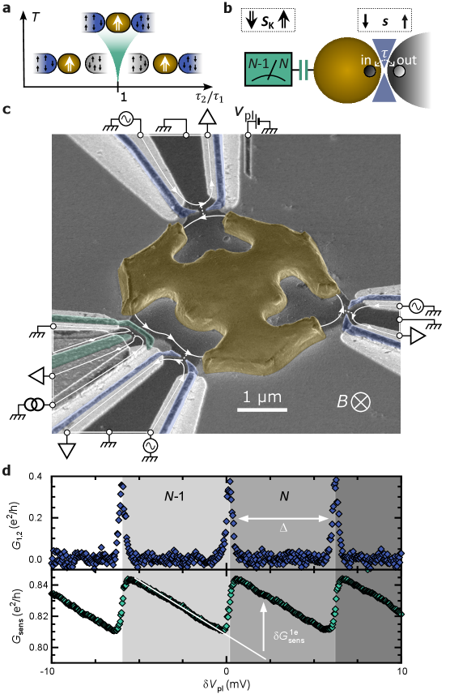
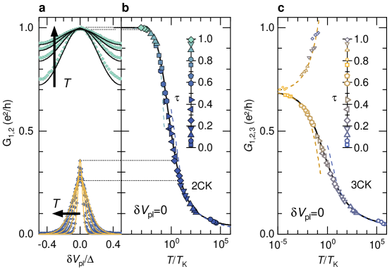
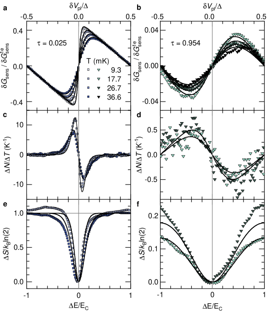
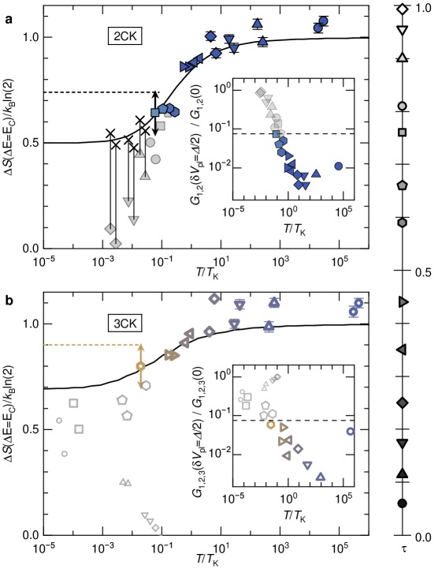

# 非アーベルエニオンの熱力学的同定

- 執筆日：2026-05-24
- トピック：量子臨界近藤系に現れる非アーベルエニオンを熱力学的エントロピー測定によって直接同定する実験的試み
- タグ：Superconductivity and Strongly Correlated Systems / Spin Liquids and Quantum Many-Body Systems, Low-Temperature Properties / Transport Measurements
- 注目論文：[Experimental Evidence of Fractional Entropy in Critical 近藤 Systems (arXiv:2605.00669)](https://arxiv.org/abs/2605.00669)
- 参照論文数：7本

---

## 1. 背景：なぜ今この話題か

量子コンピュータの実現に向けた競争が激化する中、「トポロジカル量子計算」という方式が再び脚光を浴びている。この方式の核心にあるのが「非アーベルエニオン（non-Abelian anyon）」と呼ばれる奇妙な準粒子だ。通常の量子ビットは環境ノイズによるデコヒーレンスに対して極めて脆弱だが、非アーベルエニオンを使うと量子情報を非局所的に符号化でき、局所的な擾乱に対して本質的に保護されることが理論的に知られている。この性質を活かしたトポロジカル量子ビットの実現は、量子計算の安定性という根本問題を解決しうる。

しかし現実には、非アーベルエニオンの存在を実験的に「証明する」ことが極めて困難であった。分数量子ホール系（ν=5/2状態など）やトポロジカル超伝導体中のマヨラナゼロモードなど、多くの候補系が提案されてきたが、いずれも輸送測定による証拠は間接的なものにとどまっていた。

ここで重要な洞察として浮かび上がったのが、「熱力学的量」としての「エントロピー」を使うアプローチである。非アーベルエニオンは d > 1 という非整数の「量子次元」を持つが、これはエニオンを1個加えたときのエントロピー増加として直接 ΔS = kB ln d という形で現れる。この「分数エントロピー」は非アーベル統計の最もダイレクトな熱力学的シグネチャであり、しかも使用する理論モデルを事前に仮定する必要がない。つまり実験的バイアスのない測定が原理的に可能である。

多チャネル近藤効果（multi-channel 近藤 effect）は、この分数エントロピーが凝縮系デバイスとして制御可能な形で現れる典型的な舞台として知られている。複数の電子「チャネル（浴）」が単一の磁気的不純物（または等価なスピン自由度）を同時にスクリーニングしようとする「フラストレーション」が量子臨界点をもたらし、そこでマヨラナゼロモードやフィボナッチエニオンといった非アーベルエニオンが束縛されると予言されている。

2026年5月、パリ第11大学（CNRS）のグループは、金属島と半導体2次元電子ガス（2DEG）を組み合わせた「チャージ近藤回路」において、2チャネル近藤（2CK）および3チャネル近藤（3CK）臨界点での分数エントロピーを直接測定したと報告した（arXiv:2605.00669）。2CKではマヨラナゼロモードに対応する ΔS = kB ln(√2) ≈ 0.347 kB、3CKではフィボナッチエニオンに対応する ΔS = kB ln(φ) ≈ 0.481 kB（φ = 黄金比）が実験精度の範囲内で確認されており、非アーベルエニオンの熱力学的証拠として注目されている。

---

## 2. 未解決問題は何か

### 非アーベルエニオンの「証明」はなぜ難しいか

非アーベルエニオンを同定する際の本質的困難は、その存在が多体系の「基底状態縮退の位相的性質」として現れることに由来する。古典的な測定手法である輸送測定（電気伝導度、量子ホール効果など）は、エニオンの位相的ブレーディング性質よりも「系を通る電流」に感応するため、エニオン特有の非アーベル交換統計を直接捉えることが難しい。

例えば分数量子ホール系のν=5/2状態は長年非アーベルエニオン（Moore-Read状態）の候補とされてきたが、2点接触干渉実験の結果解釈は依然として論争がある。同様に、半導体ナノワイヤーのトポロジカル超伝導中のマヨラナゼロモードも、「零バイアスコンダクタンスピーク」として観測されたが、これはトリビアルな物理からも生じうるため、明確な同定には至っていない。

より深い物理的問いとして、エニオンの「量子次元 d」とは何を意味するのかを考える必要がある。d > 1 であることは N 個の非アーベルエニオンからなる系の基底状態縮退が d^N で与えられることを意味し、この縮退はエニオンの空間的配置（ブレーディング）によってのみ変換される。これが局所的擾乱に対する保護の源となる。量子次元 d は「情報の非局所符号化能力」の指標と見なせる。

解決策として有望なのが「エントロピー測定」である。エニオン1個を系に追加したときのエントロピー変化 ΔS = kB ln d は、d が整数か非整数かにかかわらず成立する熱力学的関係である。さらに「不純物エントロピー」S_imp（不純物の有無によるトータルエントロピーの変化量）は、マクスウェル関係式

$$\frac{\partial \langle N \rangle}{\partial T}\bigg|_{\mu} = \frac{1}{e} \frac{\partial S}{\partial \mu}\bigg|_{T}$$

を用いることで、電荷検出という比較的シンプルな手法で測定できる。ここで ⟨N⟩ は島の平均電子数、μ はプランジャーゲート電圧で制御される電気化学ポテンシャルである。

### 多チャネル近藤効果の「チャネル対称性」問題

多チャネル近藤効果が量子臨界点として実現するには、すべてのチャネルの結合定数が等しい（J_1 = J_2 = ... = J_M）という対称条件が必要である。この条件からの微妙なずれが系をトリビアルなFermi液体へ引き込んでしまう。実験的に「完全な対称性」を保ちながらデバイスを操作することは、ゲート電圧のクロストーク、不純物による散乱、熱的ノイズなどの影響から非常に困難である。

この問題へのアプローチは、チャージ近藤回路の実現にある。金属島の2つの連続電荷状態 |N-1⟩ と |N⟩ を擬スピン自由度として用いることで、各量子点コンタクト（QPC）の透過確率 τ_i が近藤結合 J_i を直接制御する。これにより対称条件の精密な調整とリアルタイムの微調整が可能となった。

### Fermi液体からの逸脱：スケーリングの普遍性

通常の近藤効果（1チャネル近藤）では、低温で系は完全にスクリーニングされたFermi液体の固定点へ流れる。これに対して多チャネル近藤臨界点は「非Fermi液体固定点」であり、熱容量の温度依存性 C ∝ T log(T) や抵抗率の T^(1/2)（2CK）あるいは T^(2/3)（3CK）依存など、Fermi液体の予測から大きく外れた振る舞いを示す。この普遍的なスケーリングは、固定点の種類を同定するための重要な指標であるが、実験的にすべての普遍スケーリングを確認するには幅広い温度・パラメータ領域での測定が必要で、長年の課題であった。

---

## 3. 注目論文の概説

### 研究目的と対象系

本論文（arXiv:2605.00669、Piquard et al., 2026）の目的は、量子臨界近藤系において非アーベルエニオンの存在を示す「分数不純物エントロピー」を直接・定量的に測定することである。従来の間接的アプローチ（輸送測定によるコンダクタンス-電荷関係からの自己無撞着推定）とは異なり、電荷センサーを装備した実験系でマクスウェル関係式を直接適用することで、仮定するモデルに依らない「不偏測定」を達成している。

対象材料系は、(Al)GaAs半導体ヘテロ構造中の埋め込み2DEGに接触させたミクロンスケール金属島（チャージ近藤回路）である。磁場 B ≈ 5.3 T（Landauレベル充填因子 ν = 2 に対応）を印加することで、電流は整数量子ホール効果のキラルエッジチャンネルを伝搬し、実スピン自由度のみが分極している（pseudospinとしての電荷自由度を孤立させるため）。

*図1：チャージ近藤回路。(a) 2チャネル近藤系の量子相転移の模式図。(b) チャージ近藤マッピングと電荷センサーの配置模式図。(c) 測定デバイスのSEM像。金色が金属島、青がQPCスプリットゲート、緑が電荷センサーQPC。(d) 電荷センサーのキャリブレーション。(出典：arXiv:2605.00669、CC BY-NC-ND 4.0)*

### チャージ近藤回路のモデル

金属島の2連続電荷状態 |N-1⟩ と |N⟩ が擬スピンの ↓ と ↑ に対応する。プランジャーゲート電圧 V_pl によってこの2状態の縮退を精密に制御できる（detuning δV_pl = 0 が電荷縮退点 = 近藤スクリーニングが最も活発な点）。

M個のQPCを通じてM個の電子浴（チャネル）に接続され、QPCの透過確率 τ_i が近藤結合 J_i を制御する。系のハミルトニアンはMチャネル近藤模型：

$$H_{\mathrm{MCK}} = \sum_{i=1}^{M} J_i \left( \hat{S}_K^+ \hat{s}_i^- + \hat{S}_K^- \hat{s}_i^+ + \delta \hat{S}_K^z \hat{s}_i^z \right) + H_{\mathrm{baths}}$$

ここで $\hat{S}_K^\pm$ は島の擬スピン演算子、$\hat{s}_i^\pm$ はチャネル i の電子スピン演算子、$H_{\rm baths}$ は M 個の独立な伝導電子浴のハミルトニアンである。スピン異方性 δ は低温物理には無関係である。

### エントロピー測定の原理

エントロピーの直接測定には熱力学的マクスウェル関係式を使う。グランドカノニカル自由エネルギー Ω を通じて、

$$\frac{\partial S}{\partial \mu}\bigg|_T = \frac{\partial \langle N \rangle}{\partial T}\bigg|_\mu$$

が成立する（ここで μ はゲート電圧で制御される電気化学ポテンシャル）。したがって、島の平均電子数 ⟨N⟩ の温度依存性を測定し、それをゲート電圧 δV_pl（≡ μ に対応）について積分すると、不純物エントロピーの変化 S_imp(T) を直接得ることができる：

$$S_{\mathrm{imp}}(T) = \int_{-\infty}^{\delta V_{\mathrm{pl}}^{\rm ref}} \frac{\partial \langle N \rangle}{\partial T}\bigg|_{\delta V_{\mathrm{pl}}'} \frac{d(\delta V_{\mathrm{pl}}')}{\Delta/e}$$

ここで Δ は単電子のゲート電圧換算であり、∫ の下限は電荷縮退点から遠く離れた参照点（S_imp → 0 の極限）に対応する。

島の電荷は、容量結合された隣接QPCの伝導度 G_sens の変化として非侵襲的に読み出される：

$$\langle \delta N \rangle = \frac{\delta G_{\mathrm{sens}}}{\delta G_{\mathrm{sens}}^{1e}} + \frac{\delta V_{\mathrm{pl}}}{\Delta}$$

ここで $\delta G_{\mathrm{sens}}^{1e}$ は電子1個追加時のセンサーコンダクタンス変化（キャリブレーション係数）である。実験は10 mK以下の希釈冷凍機で行われ、電子温度 T ≈ 9.3 mK から 36.7 mK の範囲で測定された。

### 主要結果：輸送特性による近藤臨界点の確認

まず輸送測定によりデバイスが近藤臨界点として機能していることを確認した（図2）。

*図2：コンダクタンスのベンチマークと近藤臨界性。(b,c) T/TK に対する近藤コンダクタンスの普遍スケーリング。実験値（記号）はNRG計算（黒実線）と無調整パラメータで一致する。(出典：arXiv:2605.00669、CC BY-NC-ND 4.0)*

近藤温度 T_K（量子臨界性の発達スケール）を唯一のフィットパラメータとして用いると、2CKおよび3CK配置の両方でコンダクタンスの温度スケーリングが数値繰り込み群（NRG）計算と定量的に一致した。これは系が確かにMチャネル近藤臨界点として機能していることの強い証拠である。

### 主要結果：分数エントロピーの直接観測

次にエントロピー測定を行った。図3に示すように、2CK配置では臨界点付近（τ_1 = τ_2、δV_pl = 0）での不純物エントロピーが kB ln(√2) ≈ 0.347 kB に収束した。この値はマヨラナゼロモードの量子次元 d = √2 から予言される値と完全に一致する。

3CK配置（τ_1 = τ_2 = τ_3、δV_pl = 0）でも同様に、フィボナッチエニオンに対応する kB ln(φ) ≈ 0.481 kB（φ = (1+√5)/2 = 黄金比 ≈ 1.618）が観測された（図4）。

*図3：2チャネルおよび3チャネル近藤臨界系での不純物エントロピー測定。黒点線が理論予測値 kB ln(√2)（2CK）および kB ln(φ)（3CK）。実験値が理論予測と実験精度の範囲で一致することが示されている。(出典：arXiv:2605.00669、CC BY-NC-ND 4.0)*

*図4：エントロピー値のまとめ。異なる結合強度での測定を T/TK スケーリングで整理。熱力学的クロスオーバーが上側・下側の両方から同じ中間値に収束していることが示されている。(出典：arXiv:2605.00669、CC BY-NC-ND 4.0)*

### 論文の新規性と限界

本論文の最大の新規性は「モデル不依存の直接エントロピー測定」にある。従来の間接的手法（Mitchell & Sela 2021）では、コンダクタンス-電荷関係を使ってエントロピーを自己無撞着に推定していたが、これは近藤臨界状態にあることを事前に仮定していた。これに対し本研究は、電荷センサーから直接 ⟨N⟩ を読み出してマクスウェル関係式を適用することで、仮定なしに分数エントロピーを確立した。

またエントロピーの「クロスオーバー」を上下両側から挟み込む手法を用いており、測定値が臨界点に対応する分数値に確かに収束していることを示せた点も重要である。

限界としては、(1)実験温度が有限（最低 ~9 mK）であり「真の T → 0」極限ではないこと、(2)磁場 B ≈ 5.3 T という強磁場環境が必要で一般化に制約があること、(3)エントロピーの絶対値の精度（~kB の数 % 以内）は高いが、ブレーディング（anyonを実際に動かして量子情報を操作すること）の実証には至っていないこと、が挙げられる。

---

## 4. 研究史における位置づけ

### チャージ近藤回路の発展

チャージ近藤回路の歴史は2015年に始まる。Iftikhar et al.（Nature 2015, arXiv:1602.02056）は、金属島を2つのQPCで2DEGに接続した回路において、2チャネル近藤効果の輸送シグネチャを初めて観測した。近藤温度を制御可能な「量子シミュレーター」として機能することが示され、この分野の基盤となった。

続くIftikhar et al.（Science 2018, arXiv:1708.02542）は、3チャネルまで拡張し、超弾道輸送や多段階クロスオーバーを含む豊富な量子臨界現象を系統的に調べた。2CKと3CKの普遍スケーリング関数をNRGと比較し、チャージ近藤回路がMCKモデルの精密量子シミュレーターとして機能することを確立した。

### エントロピー測定手法の発展

量子ドットのエントロピーをマクスウェル関係式で測定する手法はHartman et al.（2021, arXiv:2110.14158）によって初めて実験的に実現された。強結合量子ドットで近藤効果が発達する領域を含めた幅広い温度域で不純物エントロピーを測定し、理論と比較した。kB ln(2) という1スピン自由度のエントロピーを精度良く測定できることを示し、分解能が kB ln(2) より十分良いことを証明した。

これに続くPiquard et al.（2024, arXiv:2412.18000）は二層グラフェン量子ドットのエントロピー分光法を実現した。これは同グループ（C2N / CNRS）が本測定手法を独立した系に応用した研究で、量子ドットの基底状態縮退の同定に有効であることを示した。

### 理論的背景

多チャネル近藤効果の理論的基礎はNozieres & Blandin（1980）のオーバースクリーニング理論に遡る。M個のチャネルが1/2スピンをスクリーニングしようとするとき、M > 1 では過剰スクリーニング（overscreening）となり、完全なスクリーニング固定点ではなく非Fermi液体固定点に流れることが示された。Emery & Kivelson（1992）は2CKモデルを共鳴レベルモデルに写像し、臨界点でのマヨラナフェルミオンの出現を理論的に示した。

Affleck & Ludwig（1991, Nucl. Phys. B）は境界共形場理論（BCFT）を使って多チャネル近藤固定点での「非整数の基底状態縮退」（g因子）を予言した。これが分数エントロピーの理論的根拠 S_imp = kB ln(d) の起源であり、現在の論文の理論的背後にある。

Mitchellら（2021, arXiv:2108.12878）はチャージ近藤系において「コンダクタンス-電荷関係」を使えばマクスウェル関係式からエントロピーが間接的に測定できることを示し、2CK（マヨラナ）と3CK（フィボナッチ）の分数エントロピーが既存デバイスで測定可能であると予言した。本論文はこの予言を直接検証した実験である。

### 研究史における本論文の位置

チャージ近藤回路の歴史的発展を整理すると、2015年の2CK輸送観測 → 2018年の3CK量子臨界輸送の精密測定 → 2021年の間接エントロピー推定（理論） → 2026年の直接エントロピー測定（本論文）という流れである。各ステップが前のステップを技術的に超越しており、本論文は「非アーベルエニオンの熱力学的証拠」という新たなマイルストーンに到達した最先端の研究である。

---

## 5. どの解釈が最も妥当か

### 分数エントロピーの解釈

観測された ΔS ≈ kB ln(√2)（2CK）の解釈については、大きく2つの立場がある。

第一の解釈（本論文の立場）は、これがMajorana zero modeの量子次元 d = √2 を反映した真の分数エントロピーであり、臨界点に束縛された非アーベルエニオンの熱力学的フィンガープリントだという見方である。Emery-Kivelson理論がこれを支持しており、有限温度でのクロスオーバー関数（NRGによる数値計算）との定量的一致も非常に良好である。

第二の解釈は、より慎重な立場から「これは近藤スクリーニングの途中段階（crossover regime）に対応する有限温度効果であり、真の d = √2 の不純物エントロピーを測定したとは限らない」というものである。実際、実験温度 T ≳ 9 mK は 近藤温度 T_K より高いか同程度であり、「T/T_K → 0 の真の近藤基底状態に達していない」という批判が可能だ。

本論文はこの点を「クロスオーバーの挟み込み」で対処している。高温側（自由スピン固定点からのクロスオーバー）と低温側（近藤固定点へのクロスオーバー）の両方で測定を行い、それぞれから推定したエントロピーが同じ中間値 kB ln(√2) に収束することを示した。これにより「有限温度効果ではない」という議論を補強している。

3CK（フィボナッチエニオン）の場合は δS ≈ kB ln(φ)（φ は黄金比）という非常に特徴的な値の確認であり、この値は d = (1+√5)/2 というフィボナッチエニオンの理論予測に対応する。偶然この値になる可能性は低く、フィボナッチエニオンの熱力学的証拠として比較的強力な根拠となっている。

### 実験・理論・計算の対応

理論的には境界共形場理論（BCFT）と数値繰り込み群（NRG）が合わさって精密な予測を与えている。輸送測定（コンダクタンス）については既に2018年の研究でNRGとの無調整パラメータでの定量的一致が示されており、本論文のエントロピー測定でも同様のNRG計算と整合している。これは「系がMCKモデルの精密量子シミュレーターとして機能している」ことを強く示唆する。

一方で「ブレーディング演算」—非アーベルエニオンの量子情報処理に必須な操作—はまだ実現されていない。エントロピー値がブレーディング前後で変化するか、Fidel行列（F行列）などの位相的不変量が計算通りに実現されているか、の確認が今後の課題である。

### 競合する解釈の強弱

比較的強く支持される結論：
- 2CK臨界点での残余エントロピーが kB ln(√2) であること（NRG、BCFTと整合）
- 3CK臨界点での残余エントロピーが kB ln(φ) であること
- 電荷センサー + マクスウェル関係式という測定手法の有効性

まだ検証が不十分な点：
- 観測されたエントロピーが「真の T → 0 極限」に対応するかどうか
- これが「非アーベルブレーディング」という位相的操作として使えるかどうか
- 同系でMajorana zero modeのリアルスペース的な局在性が確認されているかどうか

---

## 6. 何が一般化できるか

### 他の物質系・デバイスへの応用

本研究で確立されたエントロピー測定手法（電荷センサー + マクスウェル関係式）は、チャージ近藤回路に限らず広く適用できる。実際に2024年には二層グラフェン量子ドット（arXiv:2412.18000）でも適用されており、スピン-谷縮退の同定に成功している。今後はトポロジカル絶縁体表面状態、磁性不純物を持つ1次元系、量子スピン液体材料（RuCl₃, α-RuCl₃など）などへの応用が期待される。

特に注目されるのが、分数量子ホール状態（ν = 5/2 や ν = 12/5 など）でのエントロピー測定への応用可能性である。これらの状態は非アーベルエニオンの最有力候補とされてきたが、トポロジカル寄与のエントロピーを直接測定できれば、議論に決着をつける可能性がある。

また本論文は近藤臨界点での研究だが、同様のエントロピー測定の枠組みは「量子臨界点一般」に適用できる。量子相転移点での entanglement entropy や「g 因子」（Affleck-Ludwig soliton）を熱力学的に測定する新しいパラダイムとして、臨界現象研究に広く波及しうる。

### 設計原理の一般化

チャージ近藤アーキテクチャが示した最も重要な設計原理は、「スピン自由度を電荷自由度に写像する」という戦略である。実際のスピン1/2不純物の多チャネル接続は技術的に難しいが、金属島の2連続電荷状態を擬スピンとして使うことで、QPCの透過確率という制御しやすいパラメータで近藤結合を精密調整できる。この「有効スピン写像」の考え方は、トポロジカル量子コンピュータのハードウェア設計にも応用できる可能性がある。

ただし現実のトポロジカル量子ゲート操作（Fibonacciエニオンの場合はFibonacci anyon braidingでuniversal quantum computationが可能）を実現するには、エニオンを空間的に移動させる「braiding」操作が必要であり、本研究の静的エントロピー測定とは別の課題である。

---

## 7. 基礎から理解する

### 近藤効果とは何か

金属中に磁性不純物（例えば鉄原子）が1個存在すると、何が起きるだろうか。この問いに答えるのが「近藤効果」である。1964年、Jun 近藤は金属の電気抵抗が低温で増大する謎の現象（「抵抗極小」）を理論的に説明することに成功した。

金属中の磁性不純物は、1個の局在スピンを持つ。このスピンは伝導電子と「反強磁性的交換相互作用」 J > 0 をする。すなわち、伝導電子のスピンが不純物スピンと逆向きを好む相互作用である。この相互作用は近藤問題の中心にある：

$$H_{\rm 近藤} = J \hat{\boldsymbol{S}}_K \cdot \hat{\boldsymbol{s}}(0) + H_{\rm bath}$$

ここで $\hat{\boldsymbol{S}}_K$ は不純物スピン演算子、$\hat{\boldsymbol{s}}(0)$ は不純物位置での伝導電子のスピン密度演算子、$H_{\rm bath}$ は自由伝導電子のハミルトニアンである。

低温（T → 0）では、多数の伝導電子が協同して不純物スピンを「スクリーニング」する。具体的には、不純物スピンと「一重項（スピン0の結合状態）」を形成しようとする傾向が支配的になる。この多体現象が「近藤スクリーニング」であり、その特徴的エネルギースケールが「近藤温度」 T_K である。

T_K は J とバンド幅 D を使って次のように書ける：

$$k_B T_K \sim D \exp\left(-\frac{1}{J \rho_0}\right)$$

ここで ρ_0 はFermiエネルギーでの状態密度である。指数関数の中に 1/(Jρ_0) が入っているため、T_K は J が小さいときに非常に小さくなり（例えば数ケルビン以下）、実験的に超低温での測定が必要になる。

T ≫ T_K では不純物スピンは自由（エントロピー = kB ln 2）、T ≪ T_K では完全にスクリーニングされてエントロピーが0になる。このクロスオーバーが「近藤スクリーニングの進行」を表す。

### 繰り込み群と近藤固定点

近藤問題を理解する上で欠かせないのが「繰り込み群（Renormalization Group, RG）」の考え方である。物理系を徐々に粗視化していったとき（高エネルギー自由度を積分消去）、ハミルトニアンのパラメータがどのように変化するかを追跡するのが繰り込み群である。

近藤問題では、低エネルギーへのRGフローは必ず「強結合固定点」（J → ∞ に対応する完全スクリーニング状態）へ向かう。これが1チャネル近藤のRGフローの全体像であり、「どんなに小さな J でも低温で必ず近藤スクリーニングが発達する」という非常に強い結論を与える。

このRGフローは K. G. Wilsonの「数値繰り込み群（NRG）」によって1975年に初めて定量的に解明された。NRGは近藤問題を厳密に解くための数値的枠組みであり、現在でも多チャネル近藤の精密計算に使われている。

### 多チャネル近藤効果：フラストレーションが生む量子臨界性

通常の近藤効果ではチャネルが1本（M = 1）だが、M本の独立なチャネルが同じ不純物スピンをスクリーニングしようとするとどうなるか。これが「多チャネル近藤（MCK）効果」である。

M = 1（1チャネル）：伝導電子がスピンを完全にスクリーニングし、低温でFermi液体固定点へ到達。基底状態はスピン一重項（縮退なし）。

M = 2（2チャネル）：2本のチャネルが「どちらが不純物スピンをスクリーニングするか」を巡って「フラストレート」する。M = 1 ではスピンを完全スクリーニングできるが、M = 2 では2つのチャネルが競合して互いに妨げ合い、完全スクリーニングができない「量子臨界点（QCP）」が現れる。

M = 3（3チャネル）：さらに強い「過剰スクリーニング」となり、別の種類の量子臨界点が現れる。

量子臨界点では系はRGの固定点（流れが止まるところ）に正確に乗る。この固定点は「非Fermi液体固定点」であり、通常の金属とは全く異なる物理が実現する。最も顕著な違いは「残余エントロピー」の存在：T → 0 でもエントロピーが0にならず、kB ln d という有限値が残る。

### 非アーベルエニオンとは何か

エニオン（anyon）は2次元系での準粒子で、ボソン（整数スピン）やフェルミオン（半整数スピン）とは異なる統計を持つ。2個のエニオンの位置を交換する（空間的に回転させる）と、波動関数に位相 e^{iθ} が掛かるが、アーベルエニオンでは θ は0（ボソン）や π（フェルミオン）ではない任意の値をとる。

しかし非アーベルエニオン（non-Abelian anyon）はさらに特殊で、複数の非アーベルエニオンの交換は単なる位相変化ではなく、縮退した基底状態間での「ユニタリー行列（ブレーディング行列）」によって表される。この行列の乗算は一般に非可換（行列のかけ算は AB ≠ BA）だから「非アーベル」と呼ばれる。

量子次元 d は「非アーベルエニオン1個の持つ縮退の量」の指標であり、N 個のエニオンからなる系の基底状態縮退は d^N で与えられる。ボソンやフェルミオンでは d = 1 だが、非アーベルエニオンでは d > 1 となり、非整数の値をとりうる。マヨラナゼロモードでは d = √2、フィボナッチエニオンでは d = (1+√5)/2（黄金比 φ）である。

この非整数縮退は「量子情報の非局所符号化」を意味する。N 個のフィボナッチエニオンの位置にある論理量子ビットは、任意の1個のエニオンを測定しても情報が漏れず（d^N の縮退空間全体に非局所的に分散しているため）、局所的デコヒーレンスに対して本質的に保護される。これがトポロジカル量子計算のアイデアの核心だ。

### 「分数エントロピー」という概念

通常の熱力学では、T → 0 で系のエントロピーは第三法則により 0 に近づく（非縮退基底状態の場合）。縮退がある場合は S = kB ln(縮退度) というゼロ点エントロピーが残るが、これは整数の縮退度なので S = kB ln(1), kB ln(2), kB ln(3), ... といった離散的な値のみ許される。

ところが多チャネル近藤臨界点では、「量子次元 d」が非整数になる。d = √2 ならば残余エントロピーは kB ln(√2) = (1/2) kB ln 2 ≈ 0.347 kB という「半分の値」になる。これが「分数エントロピー」であり、一見すると第三法則に矛盾するように見えるが、実際には「孤立した不純物1個分のエントロピー」であり、マクロな系全体では T → 0 で S → 0 に近づく（バルクの寄与が常に主要）。

不純物エントロピー S_imp は、不純物がある場合の全エントロピーと不純物がない場合の全エントロピーの差として定義される：

$$S_{\rm imp}(T) = S_{\rm total}(T; \text{impurity}) - S_{\rm total}(T; \text{no impurity})$$

この量は大きな系でも不純物由来の有限の寄与として分離できる。Affleck & Ludwigの研究（1991）は境界共形場理論によって、多チャネル近藤固定点での S_imp = kB ln d（d は量子次元）という精密な結果を導出した。

### 量子点コンタクト（QPC）と電荷センサー

量子点コンタクト（Quantum Point Contact, QPC）は、2次元電子ガス（2DEG）中に静電ゲートで作られた「絞り」であり、ナノスケールの量子的チャンネルとして機能する。QPCの透過確率 τ はゲート電圧で 0 から 1 まで連続的に制御できる。

τ = 0（完全に閉じた状態）ではチャンネルは遮断される。τ = 1（完全に開いた状態）ではコンダクタンスが量子化された値 e²/h に達する（量子コンダクタンス）。中間の τ では、量子力学的なトンネルが起きており、これが近藤結合 J の強さを制御するパラメータとなる。

電荷センサーは、測定したい量子ドット（または本実験では金属島）と容量結合した別のQPCで構成される。センサーQPCのコンダクタンス G_sens は、島の電荷状態に感応するため（容量結合による電気的シフトのため）、G_sens の変化から島の平均電子数 ⟨N⟩ を非侵襲的に読み出せる。

マクスウェル関係式でエントロピーを得るには、G_sens の温度変化 ∂G_sens/∂T をゲート電圧の関数として精密に測定し、積分する操作が必要である。これには高い安定性（数時間にわたるドリフトが数 mK 以下）と感度（⟨N⟩ の変化を 0.01 電子程度の精度で読み出す能力）が求められる。

### 整数量子ホール効果とエッジチャンネル

本実験では強磁場（B ≈ 5.3 T）を印加しており、系は「整数量子ホール（IQH）状態」にある。充填因子 ν = 2 のIQH状態では、電流はサンプルの「エッジ（端）」を伝搬するキラルエッジチャンネルを通じて流れる。このエッジチャンネルは後方散乱がなく、1次元的な伝搬をする。

実験においてこの設定を使う理由は2つある。第一に、実スピン自由度（↑ と ↓）をZeemanスプリットで凍結（1方向に分極）し、擬スピンとしての「電荷自由度（N と N-1）」のみを残すためである。第二に、QPCを通じての近藤散乱が明確なチャンネルとして分離できるためである。

---

## 8. 専門用語の解説

**近藤効果（近藤 effect）**：金属中の磁性不純物（局在スピン）と伝導電子の間の反強磁性的交換相互作用 J により、低温（T < T_K）で不純物スピンが伝導電子によってスクリーニングされる現象。電気抵抗の「抵抗極小」として観測され、低温物理の基礎問題として発展した。本論文では「チャージ近藤」として電荷自由度に写像して実現している。

**多チャネル近藤効果（multi-channel 近藤 effect, MCK）**：M個の独立な電子浴（チャンネル）が競合して単一の不純物スピンをスクリーニングしようとする系。M > 1 では「過剰スクリーニング（overscreening）」または「フラストレーション」により、完全Fermi液体固定点に至らず量子臨界点が現れる。本論文では M = 2（2チャネル）と M = 3（3チャネル）を実現した。

**量子次元（quantum dimension, d）**：エニオンの統計的「縮退の大きさ」を表す量。通常の粒子（ボソン・フェルミオン）では d = 1 だが、非アーベルエニオンでは d > 1 の非整数値をとる。マヨラナゼロモードでは d = √2 ≈ 1.414、フィボナッチエニオンでは d = φ = (1+√5)/2 ≈ 1.618（黄金比）。N 個の非アーベルエニオンの基底状態縮退は d^N で与えられる。

**不純物エントロピー（impurity entropy, S_imp）**：不純物を系に導入した（または不純物のパラメータを変えた）ときに変化する全エントロピーの量。近藤スクリーニングの進行とともに変化し、量子臨界点での残余値 S_imp = kB ln(d) が非アーベルエニオンのシグネチャとなる。本論文で直接測定された中心的物理量。

**マクスウェル関係式（Maxwell relation）**：熱力学のポテンシャルの2階微分の交換可能性から導かれる関係式。本論文では ∂⟨N⟩/∂T = ∂S/∂μ を使い、電荷 ⟨N⟩ の温度依存性の積分からエントロピーを得る。これにより「エントロピーを直接量熱計で測定する必要がなく、電荷測定という精密な手法でエントロピーを引き出す」ことが可能になる。

**チャージ近藤回路（charge-近藤 circuit）**：金属島の2連続電荷状態を擬スピン自由度として使い、量子点コンタクト（QPC）を「近藤チャンネル」として機能させる回路。実スピンを使うよりも多チャンネルへの拡張が容易であり、QPCの透過確率で近藤結合を精密制御できる。2015年以降パリのグループが開発してきた。

**マヨラナゼロモード（Majorana zero mode）**：「自身の反粒子と同一」というマヨラナ条件を満たすフェルミオンが、ゼロエネルギーの状態に局在したもの。量子次元 d = √2 を持つ非アーベルエニオンの一種であり、2チャネル近藤臨界点に出現する。本論文で kB ln(√2) のエントロピー測定によってその熱力学的証拠が得られた。

**フィボナッチエニオン（Fibonacci anyon）**：量子次元 d = φ（黄金比）を持つ非アーベルエニオン。3チャネル近藤臨界点に出現する。注目すべき性質として、2個のフィボナッチエニオンのブレーディングを組み合わせるだけで「任意のユニタリー演算（= 普遍量子計算）」を実現できる。本論文の3CK実験で kB ln(φ) のエントロピーが確認された。

**数値繰り込み群（Numerical Renormalization Group, NRG）**：K.G.Wilsonが1975年に開発した近藤問題を厳密に解くための数値的方法。エネルギーシェルを対数的に離散化し、低エネルギーから順次対角化していくことで、任意温度での近藤系の熱力学量・輸送係数を高精度に計算できる。本論文でもコンダクタンスとエントロピーのNRG計算が実験との比較に使われた。

**量子点コンタクト（QPC: Quantum Point Contact）**：半導体ヘテロ構造中の2DEGに静電ゲートで作られたナノスケールの1次元チャンネル。ゲート電圧で透過確率 τ を 0 から 1 まで連続的に制御できる。本論文では τ が近藤結合 J を制御するパラメータとして機能し、またチャージセンサーとしても使用された。

**境界共形場理論（BCFT: Boundary Conformal Field Theory）**：境界を持つ2次元系の共形対称な場の理論。近藤モデルは1+1次元の境界問題として定式化でき、BCFTの枠組みで固定点でのエントロピー（g因子）や相関関数が解析的に計算される。Affleck & Ludwig（1991）がこの方法を多チャネル近藤に適用し、分数エントロピーを初めて予言した。

---

## 9. 将来展望

### 確かになりつつあること

本研究によって、「量子臨界近藤系に非アーベルエニオンに対応する分数エントロピーが存在すること」という理論予測は、かなり確からしくなった。2CKでの kB ln(√2) と3CKでの kB ln(φ) が実験精度（~5%）の範囲内で確認され、NRGによる無調整パラメータの理論計算とも整合している。さらに、熱力学的マクスウェル関係式による直接エントロピー測定という手法の有効性も示されており、今後さまざまな量子臨界系・トポロジカル系への応用が加速するだろう。エントロピー分光は「量子状態の縮退を定量的に同定する新しいスタンダードな手法」として定着しつつある。

### まだ未確定なこと

しかし「分数エントロピーを示すこと」と「非アーベルエニオンを操作してトポロジカル量子計算を実行できること」の間には大きなギャップがある。エントロピーはエニオンの「存在証拠」にはなるが、ブレーディング演算（エニオンを空間的に動かして量子ゲートを実行すること）の実証には至っていない。チャージ近藤回路は「静的なエニオン」を作るには適しているが、ブレーディングには空間的なエニオンの制御が必要であり、現在のデバイスアーキテクチャでは実現されていない。また実験に必要な強磁場（B ≈ 5.3 T）・超低温（T ≲ 10 mK）という厳しい条件を、より実用的なデバイスに向けて緩和する材料・回路工学の課題も残る。

### 次に重要になる研究

今後の焦点は3つある。第一に、「動的エントロピー測定」あるいはエニオンのブレーディングが実現するかどうかである。非平衡下でのエントロピーフロー測定、あるいは2個のエニオンを空間的に操作してFidel行列（ブレーディング行列）を測定する実験が「次のマイルストーン」となる。第二に、他の物質系・デバイスへの展開として、分数量子ホール系（ν=5/2, 12/5）・トポロジカル超伝導ナノワイヤー・量子スピン液体材料（RuCl₃, Kitaev磁性体）でのエントロピー分光実験が挙げられる。特にα-RuCl₃は最近マグノン観測（2605.00202）でも注目されており、同材料でのコンダクタンス-エントロピー相関測定は強く動機付けられている。第三に、近藤ラティス（近藤格子：不純物が周期的に並ぶ系）への拡張である。単一不純物系での実証から格子系への展開は、重電子化合物における非Fermi液体状態や量子相転移の研究と直結しており、工学的応用への橋渡しになる。

---

## 参考論文一覧

1. **[arXiv:2605.00669](https://arxiv.org/abs/2605.00669)** — C. Piquard et al., "Experimental Evidence of Fractional Entropy in Critical 近藤 Systems" (2026). チャージ近藤回路でマクスウェル関係式を使い、2CK（マヨラナ）と3CK（フィボナッチ）臨界点での分数不純物エントロピーを直接観測した注目論文。

2. **[arXiv:1708.02542](https://arxiv.org/abs/1708.02542)** — Z. Iftikhar et al., "Tunable Quantum Criticality and Super-ballistic Transport in a 'Charge' 近藤 Circuit", *Science* 360, 1315 (2018). 同グループによる先行研究で、チャージ近藤回路における2CKおよび3CK量子臨界点の輸送特性をNRGと定量比較した。超弾道輸送の発見も含む。

3. **[arXiv:1602.02056](https://arxiv.org/abs/1602.02056)** — Z. Iftikhar et al., "Two-channel 近藤 effect and renormalization flow with macroscopic quantum charge states", *Nature* 526, 233 (2015). チャージ近藤回路での2チャネル近藤効果の初観測。繰り込み群のフローを実験的に追跡した先駆的研究。

4. **[arXiv:2108.12878](https://arxiv.org/abs/2108.12878)** — A. K. Mitchell & E. Sela, "Fractional entropy of multichannel 近藤 systems from conductance-charge relations" (2021). 多チャネル近藤回路においてコンダクタンス-電荷関係からエントロピーが間接的に推定できることを示した理論論文。マヨラナおよびフィボナッチエニオンの分数エントロピーが既存デバイスで測定可能であると予言した。

5. **[arXiv:2110.14158](https://arxiv.org/abs/2110.14158)** — N. Hartman et al., "Entropy measurement of a strongly coupled quantum dot" (2021/2022). 量子ドットの近藤効果領域での不純物エントロピーをマクスウェル関係式で測定した初の実験的実証。分解能が kB ln(2) を十分超えることを示し、本手法の基礎を確立した。

6. **[arXiv:2412.18000](https://arxiv.org/abs/2412.18000)** — C. Piquard et al., "Entropy spectroscopy of a bilayer graphene quantum dot" (2024). 同グループが二層グラフェン量子ドットへエントロピー分光を適用した研究。スピン-谷縮退の同定に成功し、手法の汎用性を示した。

7. **[arXiv:2205.04418](https://arxiv.org/abs/2205.04418)** — A. K. Mitchell et al., "Manipulating Non-Abelian Anyons in a Chiral Multichannel 近藤 Model" (2022). カイラル多チャネル近藤モデルにおける非アーベルエニオンの操作可能性をNRGと解析的手法で議論した理論論文。F行列などのトポロジカル不変量の計算も行った。
