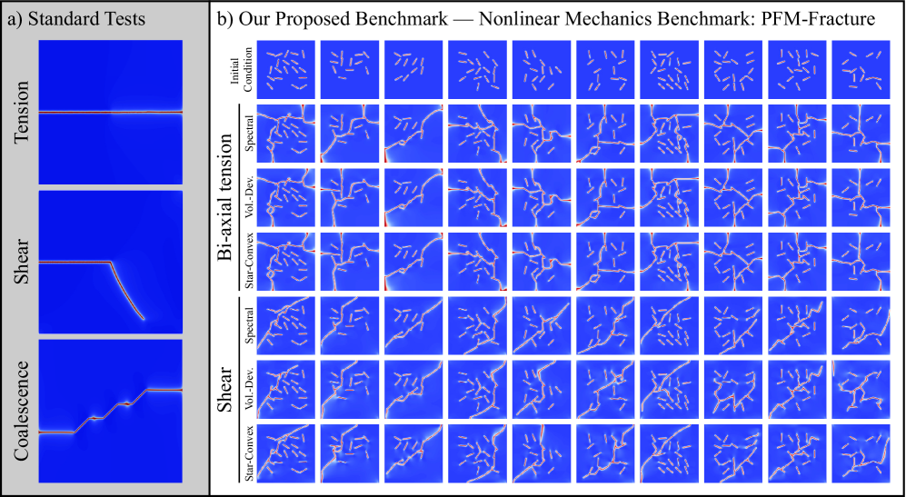
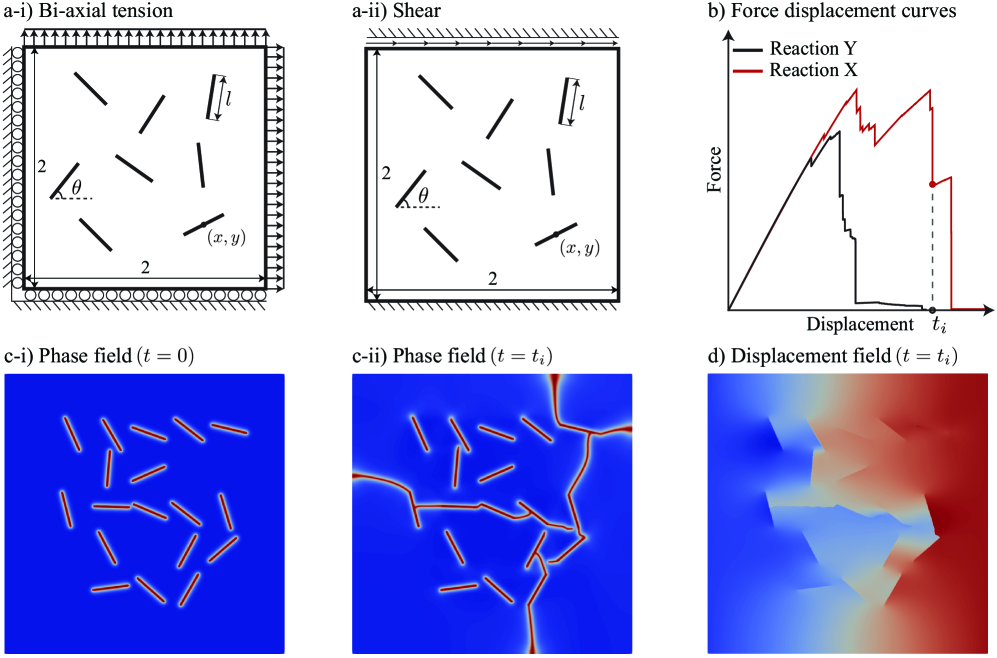
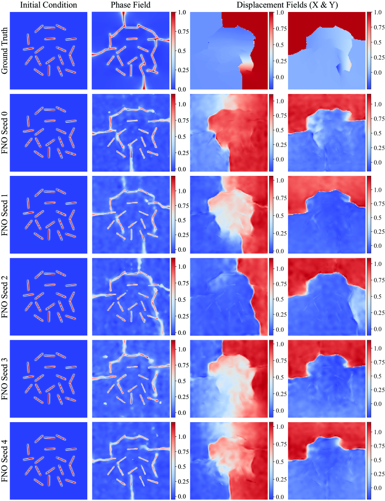
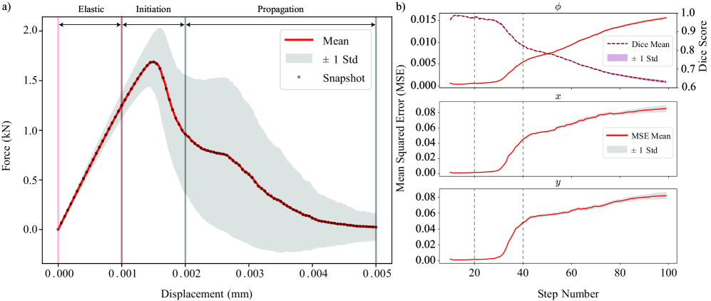
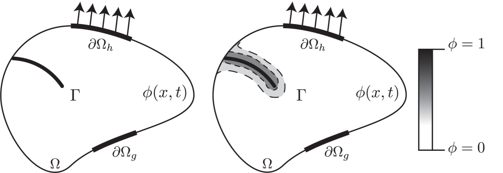

# フェーズフィールド破壊シミュレーションを加速する機械学習サロゲートモデル

- 執筆日: 2026-05-24
- トピック: 脆性破壊のフェーズフィールドシミュレーションを模倣する機械学習サロゲートの性能を体系的にベンチマーク評価した研究
- タグ: Computation and Theory, Defects and Impurities, Nonlinear Response, Phase-Field Method, Surrogate Modeling, Machine Learning
- 注目論文: Towards Robust Surrogate Models: Benchmarking Machine Learning Approaches to Expediting Phase Field Simulations of Brittle Fracture [[arXiv:2507.07237](https://arxiv.org/abs/2507.07237)]
- 参照論文数: 8

---

## 1. 背景：なぜ今この話題か

材料の破壊は、航空機の翼から橋梁の桁、原子炉容器に至るまで、ほぼすべての構造部材の寿命を最終的に規定する現象である。亀裂がいつ、どこで始まり、どのような経路を辿って進展し、最終的に破断に至るかを定量的に予測することは、工学的安全設計の根幹をなす問いである。

古典的な線形弾性破壊力学（LEFM：Linear Elastic Fracture Mechanics）は、すでに存在する亀裂先端周りの特異応力場を解析的に扱い、応力拡大係数 $K$ や エネルギー解放率 $G$ といった量を用いて亀裂進展の条件を与えてきた。しかし LEFMは、亀裂が単純に伸長する場合を主に想定しており、亀裂の核生成、分岐、複数亀裂の合体、異方性材料や複雑な微細構造中での進展といった現実的な破壊現象を自然に扱うことが難しい。有限要素法（FEM）を用いた亀裂進展シミュレーションでは、亀裂先端を陽に追跡する必要があり、メッシュの再分割や特殊な要素（拡張有限要素法 X-FEM など）を必要とする。

この課題を根本的に解決したのが、フェーズフィールドモデル（Phase-Field Model: PFM）による破壊解析の枠組みである。PFMでは、亀裂の存在を陽に追跡するのではなく、連続場の変数（フェーズフィールド変数 $\phi$）を導入して亀裂領域を正則化（スメアリング）する。$\phi = 0$ が健全な材料、$\phi = 1$ が完全に破壊した領域に対応し、その間を滑らかに遷移する拡散的な亀裂表現が得られる。このアプローチは Francfort と Marigo（1998年）が提唱した破壊の変分原理を起源とし、Bourdin、Francfort、Marigo（2000年）が数値的実装の基礎を確立した。さらに Miehe ら（2010年）が熱力学的に整合した形式と効率的な算法を提示し、現在広く使われるフェーズフィールド破壊モデルの事実上の標準が生まれた。

フェーズフィールドモデルが強力なのは、追加のアドホックな仮定なしに亀裂の核生成・進展・分岐・合体を統一的に扱えるからである。複雑な微細構造や界面を持つ材料への適用も容易であり、延性破壊・疲労破壊への拡張も精力的に研究されている。一方で、決定的な問題がある。それは計算コストの高さである。フェーズフィールドモデルは時間発展型の偏微分方程式系であり、亀裂進展の物理的時間スケールに追随するために極めて小さな時間刻みが必要になる（場合によっては $\Delta t \sim 10^{-10}$ 〜 $10^{-12}$ 秒程度）。高解像度の空間メッシュと組み合わせると、一回のシミュレーションに数時間から数日の計算時間を要することは珍しくない。

これがボトルネックになる重要な応用がある。マルチスケールモデリングでは、コンポーネント全体の変形挙動の中にサブグレインスケールの破壊シミュレーションを繰り込む必要があるが、それには数千から数百万回のPFMシミュレーションが要求されることがある。また不確かさ定量化（UQ: Uncertainty Quantification）や確率論的破壊力学では、材料パラメータや初期欠陥分布の不確かさを伝播させるため、やはり多数回のシミュレーションが必要になる。さらに材料の逆設計（破壊靱性を最大化するような微細構造を探索するなど）においても、コスト関数の評価として大量のシミュレーションが前提となる。

こうした状況から、PFMシミュレーションを精度良く模倣しながら計算コストを大幅に削減できる機械学習サロゲートモデルへの需要が急速に高まっている。近年では、Fourier Neural Operator（FNO）、U-Net、Physics-Informed Neural Network（PINN）といった深層学習アーキテクチャがPFMのサロゲートとして試みられてきた。しかし従来の研究の多くは、単純化された設定（均質等方性材料、単一亀裂、特定の境界条件）での評価にとどまっており、実際のPFMが真価を発揮する複雑な破壊シナリオでの性能評価は不足していた。そのため、どのモデルが実用的に有望なのかを判断するための公正なベンチマーク基盤が欠如していた。

この空白を埋めようとするのが今回取り上げる注目論文であり、フェーズフィールド脆性破壊のサロゲートモデルに特化した大規模ベンチマークデータセットの構築と、複数のベースラインモデルの体系的評価を行った研究である。

---

## 2. 未解決問題は何か

### 亀裂経路のカオス的性質とサロゲートの限界

フェーズフィールド破壊の本質的な難しさは、亀裂経路が初期欠陥配置・材料パラメータ・境界条件の微細な差異に対して高い感受性を示すことにある。亀裂の先端が分岐するかどうか、どちらの方向に進展するかは、非線形かつ経路依存的なプロセスである。これはカオス系に近い性質を持ち、短期的な予測は可能でも長期的な経路の正確な再現が極めて困難になる。

統計力学でいう「カオス的アトラクター」のような構造がここにも現れ、サロゲートモデルが時間発展とともに数値誤差を蓄積していくと、予測した亀裂経路が真の解から大きく外れてしまう可能性がある。自己回帰的（autoregressive）に時間発展を予測するモデルでは、各ステップの誤差が次のステップの入力となって伝播するため、誤差の雪だるま的な増幅が問題になる。このエラー蓄積問題をどう抑えるかは、PFMサロゲートの最重要課題の一つである。

解決の方向性としては、物理的拘束（PDE残差の損失関数への組み込みなど）による解の安定化、アンサンブル予測による不確かさ表現、あるいは定期的な「修正ステップ」を挿入するハイブリッド計算が考えられる。

### 公正なベンチマーク基盤の欠如

PFM破壊のサロゲートを提案する論文が増えているにもかかわらず、各論文が異なる材料設定・異なるデータ生成プロトコル・異なる評価指標を用いているため、結果の比較が著しく困難だった。例えばある論文は単一直線亀裂の単純拡張を評価対象とし、別の論文は粒界を含む多相材料での亀裂進展を扱うといった状況では、両者のサロゲートを「どちらが優れているか」の観点で比較することができない。

こうした評価の不統一性は、分野全体の進歩を遅らせる。何が本当に「難しい」問題であり、どのモデルアーキテクチャが実際に優れているのかを判断する客観的な基準が存在しないためである。標準化されたベンチマーク（学術コミュニティが共通して参照できるデータセットとプロトコル）の整備は、分野の成熟に不可欠な基盤整備である。

アプローチとしては、複数のエネルギー分解法・複数の境界条件・ランダムな初期亀裂配置を組み合わせた多様なシナリオを網羅したデータセットを、再現可能な形でオープンに公開することが有効である。

### 物理的拘束とデータ効率のトレードオフ

純粋にデータ駆動型のサロゲート（FNO、U-Netなど）は大量の教師データを必要とするが、PFMシミュレーション自体が計算コストの高さゆえにデータが希少である。一方、物理法則を損失関数に組み込んだPINN（Physics-Informed Neural Network）系のアプローチは、少ないデータでも物理的に整合した解を学習できる可能性があるが、複雑な非線形PDE残差の計算が難しく、亀裂進展問題への適用は特に困難である。

最適解は両者の中間にある「弱い物理的拘束」のアーキテクチャかもしれない。例えば PF-PINO（Physics-Informed Neural Operator、2603.09693）はFNOにPDE残差項を追加した損失関数を採用し、データ効率と物理整合性の両立を試みている。どのレベルの物理的拘束がコストとベネフィットのバランスとして最適かは、まだ開かれた問いである。

### 時空間外挿性能：学習分布の外への一般化

サロゲートモデルが実際に有用であるためには、学習時のシミュレーション条件（材料パラメータ、亀裂サイズ、システムサイズ）を超えた状況でも正確な予測ができる必要がある。学習データの範囲内での補間は比較的容易だが、未見のパラメータ条件（外挿）への一般化ははるかに難しい。

液体金属脱合金（Liquid Metal Dealloying: LMD）のPFMを対象にした研究（2601.04510）では、畳み込みのみのU-Netサロゲートが空間的・時間的に学習時の36,000倍の規模への外挿に成功したと報告されているが、脆性破壊のような強い非線形・非平衡性を持つ系での同様の外挿能力は、まだ検証が不十分である。

---

## 3. 注目論文の概説

*図1: 従来のサロゲートモデル評価（a：単純な引張・せん断・亀裂合体）と本論文が提案するベンチマークデータセット（b：複数の初期条件・荷重条件・エネルギー分解法を組み合わせた複雑なシナリオ）の比較。© Hamdi & Lejeune 2025, CC BY-SA 4.0 ([arXiv:2507.07237](https://arxiv.org/abs/2507.07237))*

### 研究の目的と位置づけ

Hamdi と Lejeune（arXiv:2507.07237、最終改訂2025年9月）は、機械学習がフェーズフィールド脆性破壊シミュレーションを加速するために実際にどれほど有効かを厳密に評価した。既存研究の問題点として、（1）単純過ぎるベンチマーク条件を使っており真の性能が不明、（2）モデル間の比較が難しい、（3）現実的な破壊プロセスをどこまで再現できるかが不明、の三点を指摘し、これらを解決するためのデータセット構築とベースラインモデルの実装・評価を実施した。

### データセットの設計

論文の核心的な貢献の一つは、6000件のPFMシミュレーションからなるオープンベンチマークデータセットの構築である。構成は以下の通りである。

- エネルギー分解法（3種）: フェーズフィールド破壊モデルでは、弾性変形エネルギーを駆動力として扱う際に引張・圧縮の非対称性を正確に扱う必要があるため、いくつかの分解法が提案されている。Spectral分解法（Miehe ら）、Volumetric-Deviatoric分解法（Amor ら）、Strain分解法（He-Shao ら）の3種を含む。
- 境界条件（2種）: 一軸引張と純せん断の2条件を含む。
- 初期亀裂配置（1000通り）: ランダムに配置した初期切り欠きを起点とする1000種類の初期条件を設定した。
- 合計: $3 \times 2 \times 1000 = 6000$ シミュレーション。各シミュレーションは100タイムステップの時間発展を含む。

出力変数は時刻 $t$ における変位場 $\mathbf{u}(\mathbf{x}, t)$、フェーズフィールド場 $\phi(\mathbf{x}, t)$（亀裂場）、応力場 $\boldsymbol{\sigma}(\mathbf{x}, t)$ であり、空間的には正規格子上のグリッドデータとして格納されている。これによりニューラルネットワークへの入出力データとしてそのまま使えるよう設計されている。

*図5: データセットの概要。(a) 境界条件と幾何学的設定：ランダムに配置された初期亀裂（位置・角度をランダムサンプリング）。(b) 各シミュレーションの保存データ：フェーズフィールド場・変位場の時間発展、および荷重-変位曲線。© Hamdi & Lejeune 2025, CC BY-SA 4.0 ([arXiv:2507.07237](https://arxiv.org/abs/2507.07237))*

この設計の重要な点は、「複雑さ」を意図的に取り込んでいることである。ランダムな初期亀裂は複数本・様々な長さ・様々な角度で配置されており、亀裂の分岐・合体・迂回が自然に発生するような設定になっている。これは現実の材料が持つ微細構造中の亀裂進展に対応した複雑さに近い。

### 評価したモデルアーキテクチャ

論文では以下の3種のベースラインモデルを実装・評価している。

**Physics-Informed Neural Networks (PINN):** 空間座標 $(x, y)$ と時刻 $t$ を入力とし、$\phi$ と変位を直接出力するネットワーク。損失関数にPDE残差（フェーズフィールド方程式の残差）を組み込み、物理的整合性を学習させる。PINNの利点は少ないデータで物理的に意味のある解を学べる可能性だが、複雑な亀裂進展では収束が遅く精度が低い傾向がある。

**Fourier Neural Operator (FNO):** Li ら（2020年）が提案したニューラル演算子の一種。入力を高速Fourier変換（FFT）により周波数空間に変換し、周波数領域で積分演算子を学習した後に逆変換するアーキテクチャを持つ。入力の物理場（現在の $\phi$ 場など）から次のタイムステップの物理場を予測する形式で使われる。演算子学習の立場では、FNOは関数空間から関数空間への写像（演算子）を学習するため、解像度に依存しない（resolution-invariant）という理論的な利点がある。

**U-Net:** エンコーダ・デコーダ構造にスキップコネクションを加えた畳み込みニューラルネットワーク。元々は医療画像のセマンティックセグメンテーションのために開発されたが、物理場のフィールド予測に広く応用されている。スキップコネクションにより、異なるスケールの空間的特徴を並行して捉えることができる。

さらに、これら3モデルについて3種類のアンサンブル戦略（ハードボーティング、ソフトボーティング、スタッキング）の効果も評価した。アンサンブルとは複数の独立したモデルの予測を統合する手法であり、個々のモデルの予測誤差を相殺して精度向上を図る。

### 主要な実験結果

評価指標としては、フェーズフィールド場（亀裂場）$\phi$ の予測精度を主とし、Mean Absolute Error（MAE）や構造類似度（SSIM）などを用いた。

*図8: FNOによるフェーズフィールド場・変位場の予測例（50パーセンタイル性能のサンプル、Dice score = 0.687）。上段が有限要素法によるグラウンドトゥルース、以降の行が異なるシードで学習したFNOモデルの予測。© Hamdi & Lejeune 2025, CC BY-SA 4.0 ([arXiv:2507.07237](https://arxiv.org/abs/2507.07237))*

主な結果は以下の通りである。FNOがU-Net・PINNを総じて上回る性能を示した。特に初期タイムステップでの亀裂核生成と初期伝播の段階では、FNOが比較的正確な $\phi$ 場を予測できた。しかし時間が経過して亀裂が複雑に分岐・合体するフェーズに入ると、いずれのモデルも精度が大きく低下した。この「後期破壊挙動の再現困難性」は、単純なベンチマークでは見えてこなかったが、本論文の設計した複雑なベンチマークで初めて定量的に示された重要な発見である。

PINNについては、境界条件が複雑な場合や複数の亀裂が同時に進展する場合に収束が遅く、実用上の問題があることが示された。PDE残差の損失が安定的に減少しない場合があり、亀裂の不連続性をPINNの滑らかな近似関数で表現する本質的な困難が改めて示された形である。

アンサンブルについては、いずれの戦略も単一モデルより一貫して良い予測精度をもたらした。特にスタッキング（一次モデルの予測を特徴量として用いてメタモデルで最終予測する）が最も効果的であった。ただし改善幅は限定的であり、アンサンブルが根本的な「複雑な亀裂挙動の予測困難性」を解決するわけではないことも示された。

### 論文の新規性と限界

新規性は主に二点である。第一に、現実的な複雑さを持つPF破壊ベンチマークデータセットを系統的に構築しオープンソースで公開した点。第二に、複数のMLモデルを同一条件で公平に評価し、それぞれの強みと限界を定量的に明らかにした点である。

限界としては、評価対象が2次元の均質等方性弾性体に限定されている点、エネルギー分解法の差異が予測精度に与える影響の詳細な解析が不十分な点、3次元への拡張や延性破壊・疲労破壊への一般化が今後の課題として残されている点が挙げられる。

---

## 4. 研究史における位置づけ

フェーズフィールド法を物理シミュレーションとして使う試みの歴史は比較的長いが、それ自体をMLで加速するサロゲートの研究は2020年代に本格化した。

### フェーズフィールド破壊モデルの確立

Francfort-Marigo（1998年）の変分破壊理論と、それを数値実装した Bourdin ら（2000年）の枠組みがすべての出発点である。これらは亀裂進展を自由エネルギーの最小化として定式化し、経路の予め存在しない設定でも亀裂が自然に発生・伝播するモデルを与えた。Miehe ら（2010年）はこの枠組みを熱力学的整合性の観点から再定式化し、有限要素法による高効率な数値実装（交互最小化スキーム）を提示した。これが現代のPF破壊計算の主流であり、商用ソフトウェアにも実装が進んでいる。

### FNOの登場とPF加速への適用

Li ら（2020年）のFourierニューラル演算子の登場は、PFM加速の研究に大きなインパクトをもたらした。FNOは関数から関数への写像を解像度非依存に学習できるという特性を持ち、時間発展するPDE解のサロゲートとして理論的に自然な枠組みを与える。

液体金属脱合金（LMD）のPFモデルに最初に本格的にFNOを適用したのが、Bonneville らの U-AFNO（2406.17119）である。液体金属脱合金では、金属合金がコロシブルな液体金属と接触することで特定成分が選択的に溶出し、複雑なナノ多孔体構造が形成される。このプロセスのPFシミュレーションは時間刻みが $10^{-12}$ 秒程度と極めて小さく、長時間挙動の計算に非現実的なコストがかかっていた。U-AFNOはU-NetバックボーンにAdaptive FNO（AFNO）を組み合わせ、学習データの36,000倍のスケールへの外挿に成功したと報告されている。この成果は、サロゲートが「大規模化」の方向で実用的になりうることを示した先駆的な事例である。

### 亀裂問題への深層演算子ネットワークの適用

Kiyani ら（2501.00016）は DeepONet（Deep Operator Network）を脆性破壊の亀裂核生成・伝播問題に適用した。DeepONetはBranchネットワークとTrunkネットワークに分かれた演算子学習のアーキテクチャであり、初期条件や境界条件の関数を入力として、解の関数を出力する。彼らはTrunkネットワークの構成を変えた複数の変種（物理情報組み込み型を含む）を評価し、物理制約がDeepONetの精度・汎化を改善することを示した。破壊問題では亀裂先端での鋭い不連続性を滑らかな関数で近似する困難があり、これが深層演算子ネットワーク全般の課題として残っている。

### 物理情報を組み込んだニューラル演算子 (PF-PINO)

Chen ら（2603.09693）はFNOにフェーズフィールドPDEの残差項を損失関数に加えた PF-PINO（Physics-Informed Neural Operator）を提案した。電気化学腐食・樹枝状結晶成長・スピノーダル分解という3つの典型的なPF問題での検証を行い、物理制約の組み込みが特にデータ希少な状況での汎化を改善することを示した。ライセンスはCC BY-NC-ND 4.0であり、アーキテクチャ自体はGitHubで公開されている（PF-PINO）。

### 空間外挿・時間外挿への挑戦

Bonneville ら（2601.04510）は「畳み込みのみ（Convolution-Only）」U-Netによって、LMDのPFシミュレーションを学習サイズの大幅に超えた空間・時間スケールに外挿することに成功した。畳み込み演算は空間的局所性を仮定しており、Transformerのような全体的な注意機構は持たないが、物理的に情報伝播速度に上限がある（有限速度）系では、局所的な演算が本質的に適している可能性がある。このアーキテクチャ選択の根拠は、PFシミュレーションの因果的な情報伝播構造と整合している。

### 注目論文の位置づけ

こうした研究の流れの中で、注目論文（2507.07237）はユニークなポジションを占める。これは特定の新しいアーキテクチャを提案するのではなく、既存の主要アーキテクチャ（PINN、FNO、UNet）を、より現実的で困難なベンチマークの上で公正に比較評価することに徹した「ベンチマーク論文」である。こうした役割は、分野の健全な発展に不可欠でありながら、新奇性を重視する学術文化の中でしばしば過小評価される。本論文は、「シンプルすぎる問題での成功談」が積み重なることで歪んだ楽観論が生まれるリスクを指摘し、より厳密な評価基準の設定を訴えている点で重要な意義を持つ。

---

## 5. どの解釈が最も妥当か

*図9: FNOのロールアウト誤差の時間変化。上段：フェーズフィールド場 $\phi$ のMSE（左軸）とDice score（右軸）。中段・下段：変位場 $x$・$y$ 成分のMSE。弾性域では誤差が小さいが、亀裂発生（Crack Initiation）・進展（Crack Propagation）フェーズで急増することが明瞭に見える。© Hamdi & Lejeune 2025, CC BY-SA 4.0 ([arXiv:2507.07237](https://arxiv.org/abs/2507.07237))*

### FNOが現状のベストプラクティスか

注目論文の結果から、PFM破壊のサロゲートとして現時点で最も安定した性能を示すのは FNO であるといえる。FNOの利点は、周波数空間での全域的な積分演算子の学習により、空間的な長距離相関（亀裂先端から遠方への応力場の伝播など）を効率的に捉えられることにある。破壊問題では、亀裂先端周囲の応力場がマクロ的な変形場と強く結合しているため、この全域性は物理的にも合理的である。

しかしFNOも、亀裂が複雑な分岐・合体挙動を示すフェーズには対処できない。一つの解釈は、現在のFNOアーキテクチャには「特異点に近い」亀裂先端の局所的な場を正確に分解する能力が不足しているというものである。フーリエ変換はグローバルな基底を用いるため、局所的な不連続性（亀裂）の表現には原理的に高い周波数成分が多数必要になり、帯域制限があると誤差が大きくなる。局所表現と大域表現を組み合わせたウェーブレットベースの演算子や、マルチスケール構造を明示的に持つアーキテクチャが解決策として有望だろう。

### PINNの亀裂問題への適用限界

PINNは亀裂場の不連続性という根本的な困難に直面する。フェーズフィールドモデルは亀裂を正則化してあるが、それでも $\phi$ は亀裂内外で急激に変化する。PINNのネットワークは $\mathbb{R}^d \to \mathbb{R}$ の滑らかな関数を近似するため、このような関数を正確に表現するには非常に深いまたは広いネットワークが必要になる。加えてPDE残差の計算で生じる自動微分のコストが高く、大規模問題へのスケールアップが困難である。現状ではPINNは、亀裂を含まない連続的な弾性場の問題には適しているが、破壊問題への直接的な適用には限界がある。

### 物理制約の効果とその限界

PF-PINO（2603.09693）の結果は、物理制約がデータ効率向上に寄与することを示した。しかし破壊問題への適用では、亀裂の不連続性に起因するPDE残差の急勾配が最適化を不安定にする可能性がある。物理制約の「強さ」（損失関数での重み）を適切に調整しないと、かえって収束が遅くなるまたは不安定になる懸念がある。現時点での最善手は、純粋なデータ駆動モデルのファインチューニング段階で物理制約を追加するような「ソフトな」組み込み方かもしれない。

### アンサンブルの有効性と限界

アンサンブルが単一モデルを上回るのは、個々のモデルが異なるタイプの誤差を犯すためであり（誤差の多様性）、統合することで打ち消し合う効果がある。注目論文での改善幅が限定的だったことは、各ベースラインモデルが類似した誤差パターン（複雑な亀裂分岐の予測失敗）を示していることを示唆する。つまりアンサンブルの効果が低い場合、それはモデルの多様性が不足しているシグナルである。異なるアーキテクチャや異なる物理的前提を持つモデルを組み合わせるより積極的な多様性の確保が有効だろう。

### 今後の検証に必要なこと

上記の解釈を実証するためには、以下の実験が特に重要となる。(1) 亀裂先端の局所表現を改善したアーキテクチャ（ウェーブレット演算子など）でのベンチマーク評価、(2) 物理制約の強さを段階的に変えた系統的なアブレーション実験、(3) 2次元から3次元への拡張と、延性破壊・疲労破壊への適用、(4) サロゲートの予測不確かさを定量化したUQとのカップリング評価。

---

## 6. 何が一般化できるか

### 他の材料系・破壊モードへの展開

注目論文が対象とした脆性破壊は、フェーズフィールド破壊研究の出発点に過ぎない。延性破壊（クラックが塑性変形を伴いながら進展する）や疲労破壊（繰り返し荷重による亀裂の漸進的進展）へのPFM拡張は活発に研究されており、サロゲートモデルのニーズも同様に大きい。特に疲労破壊は数百万〜数十億サイクルに及ぶ寿命計算が必要なため、PFMサロゲートのアプローチは経済的に最も強く求められる領域の一つである。

また、セラミックスや複合材料では弾性異方性や多相組織が破壊挙動を支配する。Plungė ら（2603.20120）は等方性、立方対称、直交異方性の各ケースに対して、変分ディープラーニング枠組みをPF破壊に適用したが、このようなアプローチをサロゲートモデルに組み込む道筋も考えられる。異方性材料でのサロゲートには、材料対称性をアーキテクチャ段階で埋め込む（等変ネットワーク）アプローチが有効である可能性がある。

### 連成物理への拡張

Taştan ら（2508.07469）は、誘電体ナノコンポジットにおける電気力学的連成フェーズフィールド破壊の深層学習フレームワークを提案した。圧電材料や磁気弾性材料、あるいは電気化学腐食が亀裂進展を促進するシステムでは、複数の物理場が互いに結合しているため、個別の物理場を別々にサロゲートで学習するだけでは不十分であり、連成した全体系を統合的に学習する枠組みが必要になる。ニューラル演算子のマルチフィジクス拡張は、今後の重要な研究方向である。

### 逆問題・材料設計への接続

サロゲートモデルが十分な精度と速度で動作するなら、それを「目的関数の評価器」として利用し、ベイズ最適化や強化学習と組み合わせた材料設計の逆問題への応用が開ける。例えば「破壊靱性を最大化する繊維強化複合材料の層構成」や「亀裂が特定の経路を回避するようなフィルタ形状の設計」などへの適用が考えられる。こうした最適化ループでは多数の順問題評価が必要なため、高速サロゲートの恩恵が最も大きい領域となる。

### 不確かさ定量化（UQ）への架け橋

材料の初期欠陥分布や材料パラメータには避けがたい不確かさがある。これをモンテカルロ法で伝播させて破壊確率や寿命の信頼区間を求めるためには、数千〜数十万回のシミュレーションが必要になる。PFMのサロゲートが精度良く動作すれば、これがはじめて現実的な計算量で実行できるようになる。ただし UQの文脈では、サロゲートの予測誤差自体も不確かさの一部として定量化しなければならない（サロゲート誤差の UQ）。不確かさを考慮したサロゲートモデル（確率的 FNO、ベイズ最適化に基づいたアーキテクチャ選択など）の開発は、実用化への重要なステップである。

---

## 7. 基礎から理解する

### Griffithの破壊力学：エネルギーの観点から亀裂を見る

固体の中に亀裂が存在するとき、亀裂が少しだけ伸長することはいつでも起きうるのだろうか。この問いに対して、A.A. Griffith（1921年）は熱力学的なエネルギー収支を用いて答えを与えた。亀裂が面積 $dA$ だけ拡大するとき、弾性ひずみエネルギーが解放される（エネルギー解放率 $G$）一方、新たな表面が生じることで表面エネルギーが増加する（表面エネルギー密度 $\gamma_s$）。亀裂が進展する条件は、解放される弾性エネルギーが新たな表面エネルギーの生成コストを上回ることである：

$$G \geq G_c = 2\gamma_s$$

ここで $G$ は単位面積あたりのエネルギー解放率（$\mathrm{J/m^2}$ の次元を持つ）、$G_c$ は臨界エネルギー解放率（破壊靱性）である。この不等式が等号になるとき（$G = G_c$）が Griffith の臨界条件である。

例えば板に中央亀裂があり、遠方引張応力 $\sigma$ が作用する場合、エネルギー解放率は

$$G = \frac{\pi a \sigma^2}{E}$$

と表せる（ $a$ は亀裂半長、$E$ はヤング率、平面応力の場合）。$G = G_c$ を解くと、破壊応力は $\sigma_c = \sqrt{E G_c / (\pi a)}$ となり、亀裂が長いほど低い応力で破壊が生じることがわかる。このことは、目視できないような微小な亀裂でも、材料の破断強度を大幅に低下させうることを意味する。Griffithの枠組みは、なぜ「欠陥のない完全な材料」の理論強度に比べて実際の破断応力が100〜1000分の1程度にしかならないのかを説明するものでもある。

### 線形弾性破壊力学（LEFM）：応力拡大係数とその限界

Griffithのエネルギー的アプローチと等価であるが、工学的により使いやすい表現として応力拡大係数 $K$ の概念がある（Irwin、1957年）。亀裂先端近傍の応力場は、材料が線形弾性であれば：

$$\sigma_{ij}(r, \theta) \approx \frac{K}{\sqrt{2\pi r}} f_{ij}(\theta)$$

という特異解（$r \to 0$ で $1/\sqrt{r}$ の特異性を持つ）で記述される。ここで $r$ は亀裂先端からの距離、$K$ は応力拡大係数（単位: $\mathrm{MPa\cdot\sqrt{m}}$）、$f_{ij}(\theta)$ は極座標の角度依存の無次元関数である。モード I（引張開口型）、モード II（面内せん断型）、モード III（反面外せん断型）の3モードが定義される。

LEFMでの破壊条件は $K_I \geq K_{Ic}$（$K_{Ic}$はモードIの破壊靱性）であり、多くの工学的設計規準に採用されている。しかし LEFMには根本的な限界がある：亀裂が一直線に進展することと、亀裂核生成は扱えないという点である。核生成のためには最初から亀裂が存在することが前提となっており、どこで亀裂が生まれるかを予測する能力はない。また、変形が大きくなると亀裂先端でプラスチック変形が生じ、特異解の仮定が崩れる。

*図2: (a) 連続体領域 $\Omega$ 内の真の鋭い亀裂表面 $\Gamma$。(b) フェーズフィールド変数 $\phi$ による拡散的亀裂表現：$\phi=1$（亀裂内部）から $\phi=0$（健全材料）へと滑らかに変化する。内部長さ $l_0$ が遷移域の幅を規定する。© Hamdi & Lejeune 2025, CC BY-SA 4.0 ([arXiv:2507.07237](https://arxiv.org/abs/2507.07237))*

### フェーズフィールドモデルの基礎：変分原理による定式化

これらの限界を克服するために提案されたのがフェーズフィールドモデルである。アイデアはシンプルで強力だ：亀裂の「有無」を0と1の二値で表すのではなく、$\phi(\mathbf{x}) \in [0, 1]$ という連続場で表す。$\phi = 0$ が健全な材料、$\phi = 1$ が完全破壊（亀裂内部）に対応し、両者の間を幅 $l_0$（内部長さスケール）で滑らかに遷移する拡散的な亀裂表現を得る。

この正則化の鍵となるのが、Ambrosio-Tortorelli汎関数による亀裂面積 $\Gamma$ の近似表現である：

$$\Gamma_l(\phi) = \int_\Omega \frac{1}{2l_0}\phi^2 + \frac{l_0}{2}|\nabla\phi|^2 \, d\Omega$$

$l_0 \to 0$ の極限でこの汎関数は真の亀裂面積に収束する（$\Gamma$-収束の意味で）。次に、破壊の全ポテンシャルエネルギーを：

$$\mathcal{E}(\mathbf{u}, \phi) = \int_\Omega g(\phi)\,\psi_e^+(\mathbf{u}) + \psi_e^-(\mathbf{u}) \, d\Omega + G_c \Gamma_l(\phi)$$

と定義する。ここで $\mathbf{u}$ は変位場、$\psi_e^+$ と $\psi_e^-$ はそれぞれ引張（亀裂進展を駆動）と圧縮（亀裂が圧縮では閉じる）のひずみエネルギー密度の分解を表し、$g(\phi) = (1-\phi)^2$ は劣化関数（degradation function）で、$\phi = 1$（亀裂）の位置では弾性スティフネスをゼロに落とすように働く。

変分原理（この汎関数の $\mathbf{u}$ と $\phi$ に対する停留条件）から、以下の連成偏微分方程式系が導かれる。変位の平衡方程式：

$$\nabla \cdot \boldsymbol{\sigma}(\mathbf{u}, \phi) = \mathbf{0}, \quad \boldsymbol{\sigma} = g(\phi)\frac{\partial\psi_e^+}{\partial\boldsymbol{\varepsilon}} + \frac{\partial\psi_e^-}{\partial\boldsymbol{\varepsilon}}$$

フェーズフィールドの発展方程式（局所的な不可逆性条件 $\dot\phi \geq 0$ を強制する場合）：

$$\frac{G_c}{l_0}\left(\phi - l_0^2\Delta\phi\right) = 2(1-\phi)\mathcal{H}(\mathbf{x}, t)$$

ここで $\mathcal{H} = \max_\tau \psi_e^+(\mathbf{x}, \tau)$ は歴史変数（history variable）であり、ひずみエネルギーの最大値を記録することで亀裂の不可逆性（一度生じた亀裂は治癒しない）を保証する。この二方程式系を交互最小化（staggered scheme）で解くことで、亀裂の核生成・進展・分岐を追加の仮定なしにシミュレートできる。

内部長さ $l_0$ はモデルパラメータであり、現実の破壊挙動と整合させるには $l_0$ を物質の特性長（材料の内部微細構造のスケールに関連）と解釈する。$l_0$ が小さいほど現実の鋭い亀裂に近づくが、数値的にはより細かいメッシュが必要になる。これがPFMの計算コストが高い主な理由の一つである。

### エネルギー分解法：なぜ複数の流派があるのか

フェーズフィールドモデルで重要なのが、弾性ひずみエネルギーを引張成分（亀裂を進展させる）と圧縮成分（亀裂を閉じさせる）に分解する方法（エネルギー分解法）である。単純に全エネルギーを劣化させると、圧縮状態でも亀裂が生じるという非物理的な結果が出るからである。

Miehe ら（Spectral分解）では、応力テンソルの主値に着目して正（引張）と負（圧縮）を分離する：

$$\boldsymbol{\sigma} = g(\phi)\sum_i \langle\varepsilon_i\rangle_+ \mathbf{n}_i\otimes\mathbf{n}_i + \sum_i\langle\varepsilon_i\rangle_- \mathbf{n}_i\otimes\mathbf{n}_i$$

Amor ら（Volumetric-Deviatoric分解）は体積変化と形状変化（偏差成分）に分けて、引張体積変化のみを劣化させる。He-Shao の Strain分解法はさらに異なる分割を採用する。これらの分解法の違いは、計算コスト・せん断亀裂の再現精度・数値安定性に影響するため、ベンチマークでどの分解法を使うかは重要な設定変数である。注目論文がこの3種を全て含めたデータセットを構築したことには、この多様性を網羅するという明確な意図がある。

### Fourier Neural Operator (FNO)の基礎

FNO（Fourier Neural Operator, Li ら 2020年）は関数空間上の演算子 $\mathcal{G}^\dagger: \mathcal{A} \to \mathcal{U}$ を学習するアーキテクチャであり、特に偏微分方程式のパラメトリック解法として登場した。例えば入力関数 $a(\mathbf{x})$（初期条件やパラメータ場）から解関数 $u(\mathbf{x})$ への写像を学習する。

各 FNO 層の演算は以下の形を持つ：

$$v_{l+1}(\mathbf{x}) = \sigma\left(W_l v_l(\mathbf{x}) + \left(\mathcal{K}_l(a; \theta_l)\right)(\mathbf{x})\right)$$

ここで積分演算子 $\mathcal{K}_l$ が FNO の核心で、畳み込みカーネル $\kappa(\mathbf{x} - \mathbf{y})$ との畳み込みを FFT で効率的に計算する：

$$(\mathcal{K}_l v_l)(\mathbf{x}) = \mathcal{F}^{-1}\left(\hat{R}_l \cdot \mathcal{F}(v_l)\right)(\mathbf{x})$$

ここで $\mathcal{F}$ はフーリエ変換、$\hat{R}_l$ は周波数空間で学習される複素数行列である。最低周波数成分（上位 $k$ モード）のみを学習対象にすることでパラメータ数を制御している。重要な性質は、この演算が離散化の粗さに依存しない（resolution-invariant）ことであり、粗いグリッドで学習したモデルを細かいグリッドに適用できる。

### U-Net の構造と物理シミュレーションへの適用

U-Net は Ronneberger ら（2015年）が医療画像セグメンテーションのために提案したが、物理場の空間的予測に広く使われるようになった。縮小パス（エンコーダ）でスケールダウンしながら特徴を抽出し、拡大パス（デコーダ）でスケールアップしながら空間解像度を回復する。エンコーダとデコーダの同じ解像度レベルをスキップコネクションで直結することで、細かいスケールの情報を失わずに伝達できる。

フェーズフィールドシミュレーションへの適用では、現在の時刻の物理場（$\phi$、変位場）を入力として次のタイムステップの物理場を出力する「時間発展サロゲート」として構成されることが多い。U-Netの強みは実装の容易さと多くのパブリックな実装が存在することだが、FNOと異なり解像度固定（学習時の解像度でしか動かない）であることが多く、解像度の汎化性という点ではFNOに劣る。

---

## 8. 専門用語の解説

**フェーズフィールドモデル（Phase-Field Model）:** 物質の状態や構造を空間的に連続な秩序変数（フェーズフィールド変数 $\phi$）で記述し、界面や亀裂を拡散的（スメアリングされた）境界として扱う計算手法の総称。元来は固体の凝固・相転移の研究で発展し、その後材料のマルテンサイト変態、粒成長、破壊などに広く応用された。フェーズフィールド破壊モデルでは $\phi = 0$（健全材料）〜 $\phi = 1$（完全破壊）の連続場で亀裂を表現し、亀裂の追跡や再メッシュを必要とせず、核生成・分岐・合体を自然に記述できる点が最大の強みである。本論文ではこのPFMが「高コストな正解シミュレータ」の役割を担い、機械学習がそのサロゲートとして機能する。

**脆性破壊（Brittle Fracture）:** 塑性変形（永久変形）をほとんど伴わずに亀裂が急速に伝播する破壊形式。ガラス・セラミックス・一部の金属（低温時の鋼など）が代表例。Griffithのエネルギー理論が最もよく適用できる破壊形式であり、フェーズフィールド破壊モデルの研究も脆性破壊から出発した。一方、延性破壊では亀裂先端近傍の大きな塑性変形域（Process Zone）が重要で、異なる定式化が必要になる。

**エネルギー解放率（Energy Release Rate, $G$）:** 亀裂面積が単位面積増加するときに解放される弾性ひずみエネルギーの量（単位: $\mathrm{J/m^2}$）。Griffith条件によれば、$G$ が臨界値 $G_c$（= 破壊靱性）に達すると亀裂が進展する。フェーズフィールドモデルでは $G_c$ がモデルパラメータとして明示的に現れ、PFMが正則化されたエネルギー汎関数の最小化問題として書かれることで、$G_c$ と Griffith 条件が自然に取り込まれる。

**エネルギー分解法（Energy Decomposition Scheme）:** フェーズフィールド破壊モデルで弾性ひずみエネルギーを「亀裂を進展させる成分（主に引張）」と「進展させない成分（圧縮）」に分割する手法。この分解を行わないと、圧縮状態でも亀裂が生じるという非物理的な結果になる。主要な手法として Spectral分解（主ひずみで分解）、Volumetric-Deviatoric分解（体積変化と形状変化で分解）、Strain分解がある。注目論文は3種全てを含むデータセットを提供し、分解法の違いがサロゲートの予測精度に与える影響の研究を可能にした。

**Fourier Neural Operator (FNO):** 関数空間から関数空間への写像（演算子）を学習するニューラルネットワークアーキテクチャの一種。入力関数を離散フーリエ変換（FFT）で周波数空間に変換し、周波数領域で線形変換を学習した後に逆変換する「Fourier層」を積み重ねる。理論的には入力の空間離散化の粗さに依存しない（resolution-invariant）という優れた性質を持つ。PDEの解法や物理シミュレーションのサロゲートとして広く用いられており、注目論文ではPF破壊サロゲートのベースラインとして最も良好な性能を示した。

**U-Net:** エンコーダ・デコーダ構造とスキップコネクションを組み合わせた畳み込みニューラルネットワーク。エンコーダで空間解像度を段階的に下げながら特徴を抽出し、デコーダで解像度を回復する。スキップコネクションにより細かいスケールの空間情報も保持できる。もともと生物医学画像のセグメンテーション用に開発されたが、物理場の時空間予測にも広く転用されている。FNOに比べると解像度の汎化性に劣るが、実装が容易で大量の事前訓練済みモデルが存在する。

**Physics-Informed Neural Network (PINN):** 損失関数に物理法則（偏微分方程式の残差）を組み込んだニューラルネットワーク。ネットワーク出力のPDE残差がゼロに近くなるよう学習させることで、少ない観測データから物理的に整合した解を推定できる。自動微分（Automatic Differentiation）でPDE残差を計算し、データ損失と物理損失の重み付き和を最小化する。亀裂問題では、不連続な亀裂場の滑らかな近似が本質的な困難となり、純粋なPINNの適用には限界がある。

**ニューラル演算子（Neural Operator）:** 通常のニューラルネットワークが有限次元ベクトルから有限次元ベクトルへの写像を学習するのに対し、ニューラル演算子は無限次元の関数空間（例えば $L^2$ 空間）から関数空間への写像を学習する枠組みの総称。FNOはその代表的な実装であり、他にDeepONet、グラフニューラル演算子なども含まれる。物理シミュレーション（PDEの解法）のサロゲートとして、解像度非依存性や少ない学習データで汎化するという理論的メリットがある。

**アンサンブル学習（Ensemble Learning）:** 複数の異なるモデル（あるいは同じアーキテクチャを異なる初期値や学習データで訓練したモデル群）の予測を統合することで、個々のモデルより高い精度・安定性を得る手法。ハードボーティング（多数決）、ソフトボーティング（確率の平均）、スタッキング（一次モデルの予測を新たな特徴量として二次モデルで学習）などの戦略がある。注目論文では3種類のアンサンブル戦略をPF破壊サロゲートに適用し、単一モデルより一貫して良い予測精度を示したが、複雑な破壊挙動の根本的な困難を解消するには至らなかった。

**不確かさ定量化（Uncertainty Quantification, UQ）:** 計算モデルや実験データに含まれる不確かさ（入力パラメータの変動、モデル誤差など）を系統的に定量化し、出力の信頼区間や確率分布を求めること。材料破壊の文脈では、初期欠陥のサイズ・位置・形状の不確かさや材料特性のばらつきが、破壊寿命や破断応力の予測を不確かにする。PFMサロゲートが高速であれば、モンテカルロ法などのUQ手法と組み合わせて確率論的破壊評価が初めて実用的になる。ただし、サロゲート自身の予測誤差もUQの枠組みに含めて扱わなければならない（メタ不確かさ）。

**内部長さスケール（Regularization Length, $l_0$）:** フェーズフィールドモデルで亀裂をスメアリングする領域の幅を決めるパラメータ。$l_0$ が小さいほど鋭い亀裂（Griffith的）の表現に近いが、数値的にはより細かいメッシュを必要とし計算コストが増大する。物理的には材料の固有の破壊プロセスゾーンのサイズ（例えば金属では数十nm〜数μm、コンクリートでは数mm）と関連付けられることが多い。$l_0$ の選択はPFMの予測精度と計算コストのトレードオフを支配し、サロゲートの汎化性にも影響する（異なる $l_0$ に対応したサロゲートを別々に訓練するか、$l_0$ をパラメータとして入力するかなど）。

---

## 9. 将来展望

今かなり確からしくなったことがある。現時点でのML手法の中では、Fourier Neural Operator（FNO）がフェーズフィールド脆性破壊のサロゲートとして最も有望なアーキテクチャであることが、注目論文の系統的ベンチマークによって示された。FNOは U-Net や PINNに比べて一貫して良好な予測精度を示し、特に初期的な亀裂核生成と初期伝播の再現において強みを発揮する。また、物理制約を組み込んだ PF-PINO（2603.09693）の成果から、少ないシミュレーションデータしか得られない状況では物理情報の組み込みが汎化改善に寄与することも示されつつある。さらに、液体金属脱合金など複雑な相転移モルフォロジー進化のPFシミュレーションに対して、畳み込みのみの U-Net が36,000倍規模への時空間外挿に成功した事実（2601.04510）は、適切に設計されたサロゲートが実際の工学的問題規模に到達できることを示す重要な先例である。

他方、まだ確定していない重要な問いが多く残る。最大の未解決問題は、亀裂の分岐・合体・迂回という複雑な後期破壊挙動を、サロゲートが正確に予測できるかどうかである。注目論文の最も重要な発見は、既存のベースラインモデルが「単純な問題では動くが、現実に近い複雑な問題では皆失敗する」ことを示したことでもある。この根本的な問題の解決策はいまだ不明で、亀裂先端の局所的特異性を正確に捉えるアーキテクチャ革新が必要かもしれない。また、2次元・均質等方性材料から3次元・異方性・多相材料への一般化性能は未評価であり、延性破壊・疲労破壊・連成物理への拡張も理論的な魅力はあるものの実証はこれからである。

次に特に重要になる実験・理論の方向性を挙げる。第一に、局所的な亀裂先端の特異性とグローバルな応力場の伝播を同時に捉えられるマルチスケールアーキテクチャの開発が急務である。ウェーブレット演算子やグラフニューラルネットワークとFNOのハイブリッドが候補になりうる。第二に、サロゲートの予測不確かさを定量化するベイズ的ニューラル演算子や、アンサンブルの多様性を積極的に高める手法（異なるアーキテクチャ・異なる物理的前提のモデルの混合）が有効だろう。第三に、疲労破壊への拡張は工学的インパクトが最も大きい領域であり、数百万サイクルの亀裂進展を高速にサロゲートで計算できるなら、航空機・圧力容器・風車ブレードなどの寿命予測の実用化が大きく前進する。今後数年のうちに、ベンチマーク論文が触媒となって、PFM破壊サロゲートの研究が急速に発展することが期待される。

---

## 参考論文一覧

1. **[注目論文]** Hamdi, E. & Lejeune, E. (2025). *Towards Robust Surrogate Models: Benchmarking Machine Learning Approaches to Expediting Phase Field Simulations of Brittle Fracture.* arXiv:2507.07237 [[link](https://arxiv.org/abs/2507.07237)]
   脆性破壊のフェーズフィールドシミュレーションを加速するための機械学習サロゲート（PINN、FNO、U-Net）を複雑なオープンベンチマークデータセット（6000シミュレーション）上で系統的に評価した論文。CC BY-SA 4.0ライセンス。

2. Bonneville, C. et al. (2026). *Towards Spatio-Temporal Extrapolation of Phase-Field Simulations with Convolution-Only Neural Networks.* arXiv:2601.04510 [[link](https://arxiv.org/abs/2601.04510)]
   液体金属脱合金のフェーズフィールドシミュレーションに対して、畳み込みのみのU-Netサロゲートが学習スケールの36,000倍への時空間外挿に成功したことを示した論文。

3. Chen, N., Chen, A. & Ma, R. (2026). *Physics-informed neural operator for predictive parametric phase-field modelling.* arXiv:2603.09693 [[link](https://arxiv.org/abs/2603.09693)]
   FNOに位相場PDEの残差を損失関数に組み込んだPF-PINOを提案し、腐食・凝固・スピノーダル分解の3つの位相場問題での検証を行った論文。CC BY-NC-ND 4.0。

4. Bonneville, C. et al. (2024). *Accelerating Phase Field Simulations Through a Hybrid Adaptive Fourier Neural Operator with U-Net Backbone.* arXiv:2406.17119 [[link](https://arxiv.org/abs/2406.17119)]
   液体金属脱合金のPFMに対してU-AFNOを適用し、位相場シミュレーション加速の初期的なFNO適用例を示した先駆的な論文。npj Computational Materialsに掲載。

5. Kiyani, E. et al. (2025). *Predicting Crack Nucleation and Propagation in Brittle Materials Using Deep Operator Networks with Diverse Trunk Architectures.* arXiv:2501.00016 [[link](https://arxiv.org/abs/2501.00016)]
   DeepONetを脆性破壊の亀裂核生成・伝播問題に適用し、物理情報を組み込んだTrunkネットワーク構成の効果を評価した論文。

6. Plungė, N. et al. (2026). *Deep learning-based phase-field modelling of brittle fracture in anisotropic media.* arXiv:2603.20120 [[link](https://arxiv.org/abs/2603.20120)]
   等方性・立方対称・直交異方性の各ケースに対する変分ディープラーニングフレームワークを用いたPF破壊モデルを提案し、異方的な亀裂進展方向を再現した論文。

7. Taştan, H.Y. et al. (2025). *A hybrid electromechanical phase-field and deep learning framework for predicting fracture in dielectric nanocomposites.* arXiv:2508.07469 [[link](https://arxiv.org/abs/2508.07469)]
   誘電体ナノコンポジットにおける電気力学的連成フェーズフィールド破壊モデルとディープラーニングサロゲートを組み合わせたハイブリッドフレームワークを提案した論文。

8. Li, Z. et al. (2020). *Fourier Neural Operator for Parametric Partial Differential Equations.* arXiv:2010.08895 [[link](https://arxiv.org/abs/2010.08895)]
   FNO（Fourier Neural Operator）を提案し、Navier-Stokes方程式などのPDEに対して解像度非依存の高速サロゲートを構築できることを示した基礎論文。
