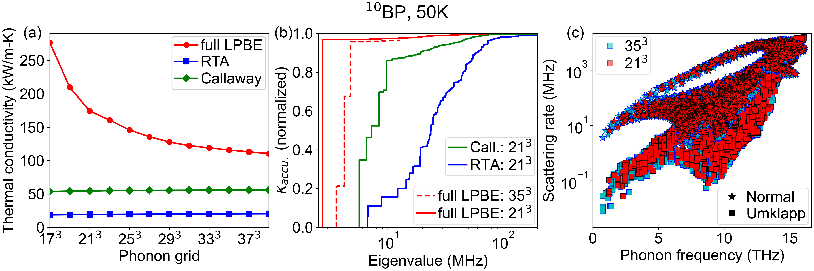
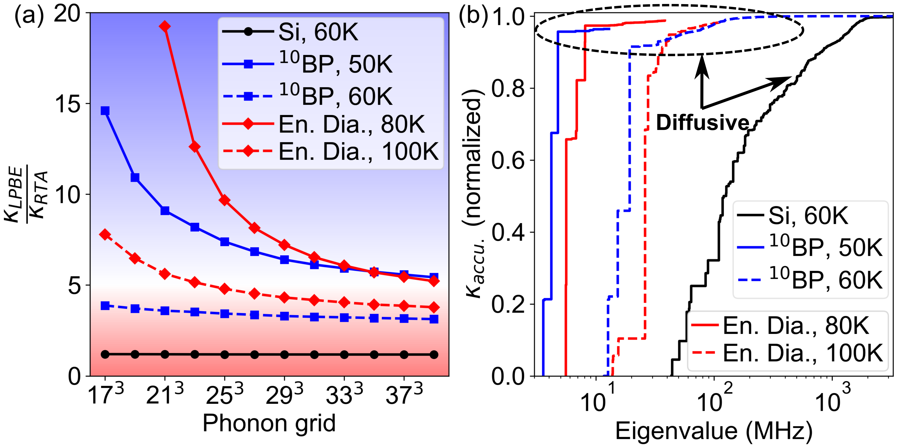
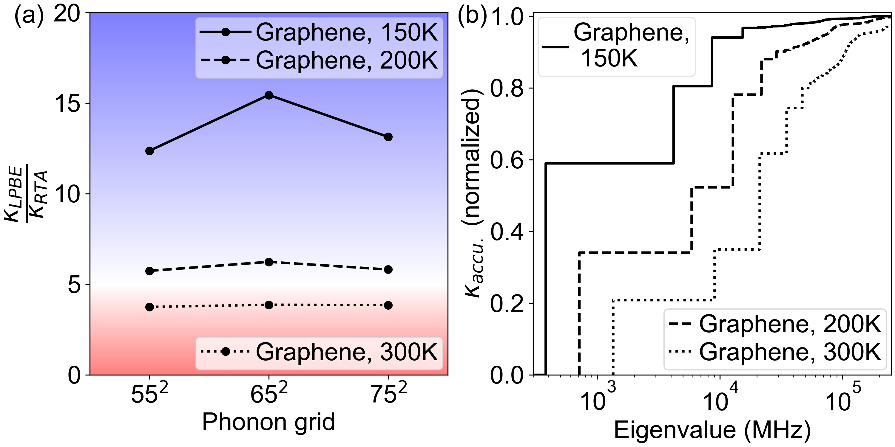
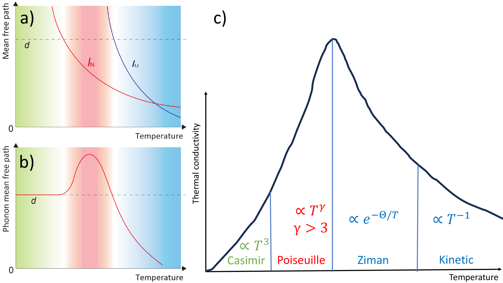
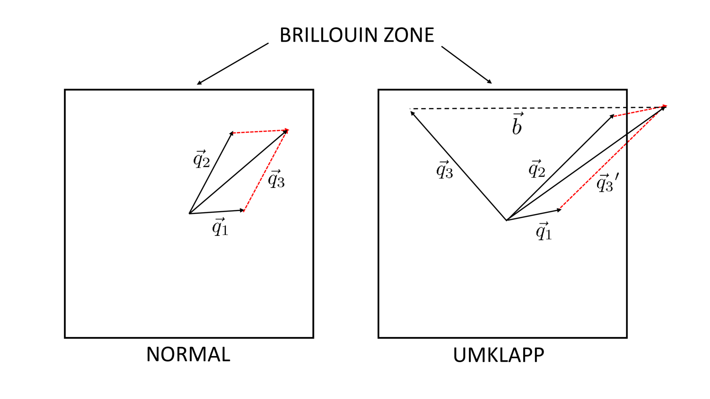

# フォノン水力学的熱流の指標：Fourier則を超える熱輸送

- 執筆日：2026-05-24
- 要旨：固体中の熱を担うフォノンが粘性流体のように集団ドリフトする「フォノン水力学」は、グラファイトでの室温第二音速観測を機に急速に注目を集めている。本稿では、第一原理計算から得られる熱伝導率比 $\kappa_\mathrm{LPBE}/\kappa_\mathrm{RTA}$ がフォノン水力学の低コスト指標として機能することを示したMalviya & Ravichandran (arXiv:2605.17947, 2026) を核に、関連する実験・理論・計算の研究を統合的に読み解く。従来のRTAおよびCallaway近似がフォノン水力学を系統的に過小評価すること、BZサンプリング収束が指標の定量的信頼性に直結することを整理し、新材料探索・デバイス応用・2D系への展開という観点から今後の課題を論じる。
- タグ：Phonons and Thermal Properties, Thermal Transport, First-Principles Calculations
- 注目論文：Malviya & Ravichandran, "Indicators for phonon hydrodynamics from first principles predictions of thermal conductivity," [arXiv:2605.17947](https://arxiv.org/abs/2605.17947) (2026)
- 参照論文数：8本

---

## 1. 背景：なぜ今この話題か

固体結晶中の熱は、格子振動の量子化された準粒子であるフォノン（phonon）によって運ばれる。半導体や絶縁体における熱伝導の基本記述は、Henri Fourierが19世紀初頭に定式化した熱拡散方程式（Fourier則）である：

$$\mathbf{J} = -\kappa \nabla T$$

ここで $\mathbf{J}$ は熱流束（単位面積・単位時間あたりの熱エネルギー）、$\kappa$ は熱伝導率、$\nabla T$ は温度勾配である。Fourier則はマクロスケールでは非常に有用であるが、フォノンの平均自由行程に匹敵するナノ〜マイクロメートルスケールでは、この「拡散モデル」が根本的に崩れることが知られてきた。

その中で特に注目されているのが「フォノン水力学」（phonon hydrodynamics）と呼ばれる現象である。これは、フォノン同士の散乱が運動量を保存するNormal散乱（N散乱）によって支配される状況で、フォノンが集団的にドリフトし、熱が粘性流体のように流れるという輸送モードである。この状況では熱が「波」として伝播でき、「第二音速」（second sound）と呼ばれる温度波の伝播が実現する。

フォノン水力学は1960〜70年代にヘリウム液体、弗化ナトリウム（NaF）、ビスマスなどの極低温（数K〜十数K程度）で実験的に観測されたが、長らく「低温・特殊材料に限られる珍現象」と見なされてきた。この状況を一変させたのが2019年のHubermanら（arXiv:1901.09160）によるグラファイトでの100K以上での第二音速の直接観測である。彼らは過渡的熱格子（transient thermal grating, TTG）法を用いた時間分解光学測定により、マイクロメートルスケールで熱波伝播を直接捉えた。さらにDingら（2022, Nature Communications）は200K以上での観測を達成し、Xieら（2026, Nature Communications）はついに同位体精製グラファイトを用いて室温（300 K）での第二音速観測に成功した。

この急速な進展の背後には二つの強いドライビングフォースがある。第一は、低消費電力・高集積電子デバイスにおける熱管理問題の深刻化であり、ナノスケールでは従来のFourier則に基づく熱設計が限界を迎えている。第二は、高性能計算機の発展による第一原理フォノン輸送計算の実用化であり、材料をゼロから計算で設計する「熱伝導設計」が現実的な選択肢となった。

グラファイトでの発見は、同種の現象を示す新材料の探索を強く動機付けた。しかし「この材料はフォノン水力学を示すか？」を第一原理計算から事前判定するための計算指標が未整備であったことが、大規模スクリーニングの障壁となっていた。この問題に正面から取り組んだのが今回の注目論文（arXiv:2605.17947）であり、第一原理計算から得られる低コストの水力学指標を提案している。

---

## 2. 未解決問題は何か

### フォノン水力学の出現条件の定量化

フォノン水力学が現れるためには、大まかに以下の条件が成立する必要がある：N散乱の平均自由行程 $l_N$ がUmklapp散乱（U散乱）の平均自由行程 $l_U$ よりも十分短く（$l_N \ll l_U$）、かつ試料サイズ $d$ に対して $l_N \ll d < l_U$ であること。しかし「十分短い」「大きい」という定性的な表現を、いかにして計算から定量的に判定するかは自明ではない。

従来は N/U 散乱率の比（$\tau_N^{-1}$ と $\tau_U^{-1}$）を指標として用いてきたが、この量はフォノン波数・分枝ごとに異なり、さらに衝突行列（collision matrix）の非対角要素が本質的な役割を果たすことが徐々に明らかになってきた。散乱率だけを見ても、集団ドリフト効果の強さを正確に捉えられないという根本的な問題がある。Machida et al.（arXiv:2402.14870, 2024）が実験的に整理した「水力学的窓」（hydrodynamic window）の概念—$l_N \ll d < l_U$ が成立する温度範囲—は材料・寸法依存性を示し、普遍的な計算指標の必要性を強調している。

### RTAとCallaway近似の限界

熱伝導率の標準的な計算手法である緩和時間近似（Relaxation Time Approximation, RTA）は、衝突行列 $\Omega$ の対角成分のみを用いる：

$$\kappa_\mathrm{RTA} = \frac{1}{V}\sum_\lambda C_{0\lambda} v_\lambda^2 \tau_\lambda$$

ここで $V$ は結晶体積、$C_{0\lambda}$ は体積比熱、$v_\lambda$ は群速度、$\tau_\lambda$ は緩和時間である。N散乱は準運動量を保存するため本来は熱抵抗に直接貢献しないが、RTAではN散乱をU散乱と同様に「抵抗的」として扱う。その結果、N散乱が支配的な超高熱伝導材料（ダイヤモンド、cBN、グラファイト等）での $\kappa$ を大幅に過小評価する。

Callaway近似は N散乱とU散乱の散乱行列を分離し、ドリフト項を修正した半近似的手法である。しかし Callaway 近似もやはり衝突行列の対角成分のみに依存する構造を持つため、off-diagonal 要素が生み出す集団ドリフトモードを正確に捉えられない。Malviya & Ravichandran（PRB 2023）はボロンヒ素（BAs）・ボロンアンチモナイド（BSb）での計算で Callaway 近似が質的に誤った予測を与えることを示しており、arXiv:2605.17947 はこの認識をさらに広い文脈で深化させた。

### 材料スクリーニングのための計算指標の欠如

次世代の熱輸送材料を探索するためには、「この材料でフォノン水力学が期待できるか？」を大規模に事前評価できる計算指標が必要である。しかし、フォノン水力学を最も精確に記述する complete LPBE の衝突行列 $\Omega$ の固有値スペクトル解析は計算コストが高く大規模スクリーニングに不向きである。安価な計算量で水力学的特性を判定するプロキシ指標の確立が実際的な要請である。

### BZサンプリング収束の問題

超高熱伝導材料の第一原理フォノン輸送計算では、Brillouinゾーン（BZ）のサンプリング密度を増やすほど計算精度が向上するはずである。しかし、フォノン水力学を特徴づける量（$\kappa_\mathrm{LPBE}/\kappa_\mathrm{RTA}$ 比など）がBZサンプリング密度に強く依存し、粗いグリッドでは水力学的特性が過大評価されるという問題が今回の研究以前には系統的に調べられていなかった。これは計算上のアーティファクトであり、収束確認なしに得られた結果を使うと誤った結論を引き出す危険がある。

---

## 3. 注目論文の概説

**論文情報：** Malviya, N. & Ravichandran, N.K., "Indicators for phonon hydrodynamics from first principles predictions of thermal conductivity," arXiv:2605.17947, cond-mat.mtrl-sci (2026). ライセンス：CC BY 4.0。

### 研究目的と対象材料

本論文の目的は、第一原理計算から計算効率よくフォノン水力学の強さを判定する「指標」を確立することである。対象材料として、三次元超高熱伝導材料（同位体精製ボロンリン $^{10}$BP、同位体富化ダイヤモンド、Si）と二次元材料（懸架単層グラフェン）を選定している。$^{10}$BP は $^{10}$B のみで構成した同位体精製版ボロンリンで、同位体散乱を排除することで超高熱伝導率が期待される物質である。Siは比較材料として使用され、熱流が主に拡散的であることが知られている。

### 研究アプローチ

計算の核心は、線形化Peierls-Boltzmann方程式（LPBE）の三種類の解法の体系的比較である。定常状態のLPBEの基本形は：

$$\frac{v_\lambda \cdot \nabla f^0_\lambda}{f^0_\lambda(f^0_\lambda+1)} = -\sum_{\lambda'} \Omega_{\lambda\lambda'} f_{\lambda'}$$

ここで $v_\lambda$ はフォノンモード $\lambda \equiv (\mathbf{q}, j)$ の群速度、$f^0_\lambda = [\exp(\hbar\omega_\lambda/k_BT_0)-1]^{-1}$ は平衡ボース-アインシュタイン分布、$\Omega_{\lambda\lambda'}$ は衝突行列である。この方程式の解 $f_{\lambda'}$ から熱流束 $\mathbf{J} = V^{-1}\sum_\lambda \hbar\omega_\lambda \mathbf{v}_\lambda f_\lambda$ を計算し、$\mathbf{J} = -\kappa_\mathrm{LPBE}\nabla T$ として $\kappa_\mathrm{LPBE}$ を得る。

三種の解法は：

1. **Full LPBE（厳密解）**：衝突行列 $\Omega$ の全成分（対角＋非対角）を含んだ iterative solver による完全解。3フォノン・4フォノン散乱・同位体散乱を含む。$\kappa_\mathrm{LPBE}$ を与える。
2. **Relaxation Time Approximation (RTA)**：衝突行列の対角成分のみを用いた近似解。$\kappa_\mathrm{RTA}$ を与える。
3. **Callaway近似**：N散乱とU散乱の散乱行列をそれぞれ対角近似し、N散乱によるドリフト項を修正した半近似解。

これらを複数のBZサンプリング密度（$q$-グリッドサイズ：$17^3$〜$35^3$）で系統的に計算し、衝突行列 $\Omega$ の固有値スペクトルを解析することで、どのフォノン固有モードが $\kappa_\mathrm{LPBE}$ に主に寄与しているかを追跡している。

### 主要結果

**Fig. 1：Callaway近似とRTAの失敗**

*図1（arXiv:2605.17947 Fig. 1、CC BY 4.0）：(a) $^{10}$BP at 50 K での熱伝導率 $\kappa$ vs. BZグリッドサイズ。Full LPBEは粗いグリッドで収束せず、値もRTA・Callawayを大幅に上回る。(b) 衝突行列固有モードの $\kappa$ への累積寄与。粗いグリッドの full LPBE ではドリフト的固有モード（小さい固有値）への集中が著しい。*

Fig. 1(a) は $^{10}$BP at 50 K において、BZグリッドサイズに対する三種解法の $\kappa$ の変化を示す。RTA と Callaway 近似は $17^3$ という粗いグリッドですでに収束しているのに対し、full LPBE は $35^3$ でもなお収束途上であり、かつその値はRTA・Callaway の2〜3倍以上に達する。この差は、非対角要素が生み出す集団ドリフトモードをRTA・Callawayが見落としていることによる。

Fig. 1(b) では、衝突行列 $\Omega$ の固有値に対する $\kappa_\mathrm{LPBE}$ の累積寄与を示す。粗い $21^3$ グリッドでの full LPBE では、ごく少数の「ドリフト的固有モード」（小さい固有値をもつ固有ベクトル）にほぼ全ての $\kappa$ の寄与が集中している—これが水力学的輸送の直接的な証拠である。$35^3$ という細かいグリッドでは寄与がより分散し水力学的特性が「弱まった」ように見えるが、これは数値収束挙動であって材料の物理が変わるわけではない。Callaway近似はドリフト的固有モードへの集中を大幅に過小評価する。

**主要結論：$\kappa_\mathrm{LPBE}/\kappa_\mathrm{RTA}$ 指標の提案**

*図2（arXiv:2605.17947 Fig. 2、CC BY 4.0）：(a) Si at 60 K、$^{10}$BP at 50・60 K、同位体富化ダイヤモンド at 80・100 K について、BZグリッドサイズ vs. $\kappa_\mathrm{LPBE}/\kappa_\mathrm{RTA}$。収束値が大きいほど水力学的輸送が強い。(b) BZグリッド収束後の固有スペクトル解析。*

Fig. 2(a) が本論文の最重要図である。Siでは $\kappa_\mathrm{LPBE}/\kappa_\mathrm{RTA} \approx 1$（拡散的輸送）であるのに対し、$^{10}$BP (60 K) と富化ダイヤモンド (100 K) ではこの比が $\sim 4$ に達する。BZグリッドを細かくするとこの比は収束値に向けて減少する。収束値が大きいほど、その材料・温度での水力学的輸送が強いことを示す。

Fig. 2(b) では固有スペクトルとの対応を示す。$\kappa_\mathrm{LPBE}/\kappa_\mathrm{RTA}$ が大きい材料ほど、固有スペクトルでのドリフト的固有モードへの集中が強い。この相関が複数の材料・温度で再現的に確認されたことが、$\kappa_\mathrm{LPBE}/\kappa_\mathrm{RTA}$ を指標として採用する根拠である。特に「拡散的固有モードの寄与が全体の10%未満のとき、$\kappa_\mathrm{LPBE}/\kappa_\mathrm{RTA} > 5$」という経験則が示されており、高コストな固有値計算なしに指標値だけで水力学的特性の強さを推定できる。

**2D材料（グラフェン）への展開**

*図3（arXiv:2605.17947 Fig. 3、CC BY 4.0）：懸架単層グラフェン at 150 K・200 K での $\kappa_\mathrm{LPBE}/\kappa_\mathrm{RTA}$ と固有スペクトル。フレキシュラルフォノンの anharmonic renormalization を含めると比率が大幅に増大する。*

Fig. 3 は懸架単層グラフェンでの結果を示す。フレキシュラル（面外）フォノン（ZAモード）の anharmonic renormalization を含めると、150 K・200 K のいずれでも $\kappa_\mathrm{LPBE}/\kappa_\mathrm{RTA}$ が大きく、強い水力学的特性を示す。繰り込みを含まない場合には大幅に異なる結果が得られており、2D材料では flexural phonon の特殊な分散関係と繰り込み効果の正確な取り扱いが不可欠である。

### 論文の新規性と限界

本論文の新規性は三点に集約される。第一に、$\kappa_\mathrm{LPBE}/\kappa_\mathrm{RTA}$ という計算コストの低い指標の提案（完全固有値分解不要）。第二に、Callaway近似がフォノン水力学の定量的予測に不十分であることの複数材料・温度にわたる厳密な実証。第三に、BZサンプリング収束がフォノン水力学指標の定量的信頼性に直結するという初めての系統的提示。

限界としては、対象材料が $^{10}$BP・ダイヤモンド・Si・グラフェンと限られ、境界散乱・欠陥散乱・電子-フォノン結合の効果が含まれていない。

---

## 4. 研究史における位置づけ

### 第二音速理論の起源から実験観測へ

フォノン水力学の理論的起源は、1966年のGuyer & Krumhansl（Phys. Rev. 148, 778）によるBoltzmann方程式の解析的研究に遡る。彼らは N散乱とU散乱の競合によって「第二音速」と「Poiseuille流れ」という二種類の水力学的フォノン輸送モードが現れることを理論的に予測した。実験的には1970年代に NaF（Jackson et al.）やビスマス（Narayanamurti & Dynes）などで観測されたが、いずれも数K〜十数Kという極低温に限られた。

この状況を一変させたのが、2019年の Huberman et al.（arXiv:1901.09160）によるグラファイトでの第二音速観測である。過渡的熱格子法という光学的実験技術を用いて5〜20 μmスケールでの時空間分解熱測定を行い、100 K以上での熱波伝播を直接実証した。この結果は実用的な温度域での非Fourier熱輸送の可能性を示し、分野全体に大きな影響を与えた。続いて Ding et al.（2022, Nat. Comm.）は200 K以上での第二音速を観測し、Xie et al.（2026, Nat. Comm.）は同位体精製グラファイトで室温（300 K）での第二音速観測に成功した。これは「同位体散乱が室温でのフォノン水力学抑制の主要因であった」という解釈を強く支持する。

### 理論的枠組みの精密化

Cepellotti et al.（2015, Nat. Comm.）は密度汎関数摂動理論とBoltzmann方程式の変分解法を用いて、グラフェン・hBN・MoS$_2$ などの2D材料でのフォノン水力学を第一原理から計算し、グラフェンでは50〜150 K の広い温度域で Poiseuille フローが実現することを示した。

Simoncelli et al.（arXiv:1906.09743, 2020, PRX）はBoltzmann方程式の粗視化から「粘性熱方程式」（viscous heat equations）を導出し、Fourier から水力学的輸送までを統一的に記述する理論枠組みを構築した。この枠組みでは熱伝導は「フォノン流体の粘性」によって記述され、フォノン水力学は「粘性が主要な抵抗機構」という状況に対応する。

*図4（arXiv:2402.14870 Fig. 2、CC BY 4.0、Machida et al. 2024）：熱輸送の四状態（弾道的・Poiseuille・Ziman拡散・通常拡散）と水力学的窓。$l_N$（N散乱平均自由行程）と $l_U$（U散乱平均自由行程）の温度依存性から各輸送状態が支配する温度・サイズ領域が決まる。*

Machida et al.（arXiv:2402.14870, 2024）は、黒リン（BP）・アンチモン（Sb）・サファイア（Al$_2$O$_3$）などのバルク絶縁体・半金属での実験的フォノン水力学の特徴を体系的に整理した。上図（Fig. 2 of 2402.14870）に示す「水力学的窓」の概念は、$l_N \ll d < l_U$ が成立する温度範囲を材料・試料寸法の関数として示しており、フォノン水力学が出現する条件を実験家にとって分かりやすい形で整理している。

*図5（arXiv:2402.14870 Fig. 1、CC BY 4.0）：Normal散乱（左）とUmklapp散乱（右）の模式図。Normal散乱では合成フォノン波数がBrillouinゾーン内に収まる（準運動量保存）が、Umklapp散乱では逆格子ベクトル $\mathbf{G}$ 分だけ準運動量が失われ熱抵抗が生じる。*

### 異種実験手法の登場

Kremeyer et al.（arXiv:2310.18793, 2024）は超高速電子散漫散乱（Ultrafast Electron Diffuse Scattering, UEDS）を用いたフォノン輸送の新プローブ手法を提案した。UEDSは時間・運動量・フォノン分枝の分解能をもち、グラファイトでのBTE計算と組み合わせることで弾道的・拡散的・水力学的輸送の各状態でのフォノン占有数の時間変化を計算できる。この手法は collision matrix の固有スペクトルと実験を直接対応付ける新たな診断ツールとして期待される。

### arXiv:2605.17947 の位置づけ

この研究史の中で arXiv:2605.17947 は以下のように位置づけられる。グラファイト実験（Huberman 2019, Ding 2022, Xie 2026）が提起した「次の候補材料は何か？」という問いに計算的に応答しようとする。Callaway近似の限界（Malviya & Ravichandran, PRB 2023）という先行知見を出発点に、より広い材料・温度への一般化を試みる。固有スペクトル解析という高コスト手法を、計算コストの低い $\kappa_\mathrm{LPBE}/\kappa_\mathrm{RTA}$ 比に対応付けるという概念的進歩を達成する。

---

## 5. どの解釈が最も妥当か

### $\kappa_\mathrm{LPBE}/\kappa_\mathrm{RTA}$ 比の物理的根拠

今回提案された $\kappa_\mathrm{LPBE}/\kappa_\mathrm{RTA}$ 比は、衝突行列 $\Omega$ における非対角要素（主にN散乱由来）の相対的な重要性を反映している。RTA では各フォノンモードが独立に減衰するが、full LPBE では異なるモード間のカップリング（非対角項）が集団ドリフトモードを生成する。この集団ドリフトが強いほど $\kappa_\mathrm{LPBE}$ が $\kappa_\mathrm{RTA}$ を超え、比率が大きくなる。

この解釈を直接支持する根拠として、Fig. 1(b) と Fig. 2(b) の固有スペクトル解析がある。$^{10}$BP や富化ダイヤモンドでは、$\kappa_\mathrm{LPBE}$ の大部分が少数の「ドリフト固有モード」（小さい固有値をもつ固有ベクトル）に集中しており、Siではスペクトルが分散している（拡散的輸送に対応）。この固有スペクトル構造と $\kappa_\mathrm{LPBE}/\kappa_\mathrm{RTA}$ 比の相関が複数の材料・温度で再現可能であることが、指標の物理的妥当性を保証している。Si（at 60K）で $\kappa_\mathrm{LPBE}/\kappa_\mathrm{RTA} \approx 1$ が確認されていることが「ネガティブコントロール」として機能しており、指標の信頼性をさらに高めている。

### Callaway近似が失敗する理由：物理的理解

Callaway近似の核心的問題は、N散乱の collision matrix $\Omega^{(N)}$ のうち散乱率（対角成分）のみを用い、モード間カップリング（非対角成分）を無視することにある。Callawayの枠組みでは、N散乱はフォノン分布を「ドリフト分布」$f^*_\lambda = [\exp((\hbar\omega_\lambda - \mathbf{q}\cdot\boldsymbol{\Lambda})/k_BT_0) - 1]^{-1}$ へと緩和させると仮定する。しかしこのドリフト分布を決める閉包条件が、実際の N散乱 collision matrix の非対角要素を正しく再現していない。この「モデル化されたドリフト」と「実際のドリフト」のずれが、フォノン水力学の定量的予測における系統的誤差の原因である。

### BZサンプリング依存性の正確な解釈

粗いBZグリッドで $\kappa_\mathrm{LPBE}/\kappa_\mathrm{RTA}$ が過大評価されるという結果は一見直感に反する。この「見かけ上の水力学特性の弱化」は以下のように理解できる：粗いBZグリッドではサンプリングされるフォノンモードの数が少なく、collision matrix の固有ベクトルが少数のモードに集中するという数値的アーティファクトが生じ、「ドリフト的固有モード」への寄与集中が人為的に強調される。したがって $\kappa_\mathrm{LPBE}/\kappa_\mathrm{RTA}$ を水力学指標として用いる際には、必ずBZ収束を確認してから最終値を採用しなければならない。

### グラフェンでの結果：flexural phonon の重要性

グラフェンでは ZA フォノンの分散が $\omega \propto q^2$ という二次的なものであり、このため anharmonic scattering 断面積が異常に大きくなる。しかし実際の懸架グラフェンでは熱的な面内-面外の結合が flexural phonon の分散を繰り込み、この過剰散乱を抑制する。Ravichandran（arXiv:2604.03910, 2026）が示したように、この弾性率の繰り込みが U散乱を弱め、$\kappa_\mathrm{LPBE}/\kappa_\mathrm{RTA}$ が増大し水力学的輸送が強化される。今回の Fig. 3 の結果はこの物理機構と整合的である。

Schelling et al.（arXiv:2502.10649, 2025）は分子動力学シミュレーションで単層 h-BN の熱応答関数と第二音速を計算し、T = 100 K・空間スケール約110 nm での第二音速観測可能性を予測している。h-BN でも $\kappa_\mathrm{LPBE}/\kappa_\mathrm{RTA}$ 指標が大きい値をもつかどうかを第一原理で検証することが今後の重要な課題である。

---

## 6. 何が一般化できるか

### 超高熱伝導材料探索への適用

今回の指標は、BAs（ボロンヒ素）、cBN（立方晶窒化ホウ素）、AlN、$\beta$-Ga$_2$O$_3$ といった電力デバイス用超高熱伝導候補材料への適用が直接期待される。これらは次世代パワーエレクトロニクスのヒートスプレッダ材料として実用上の重要性が高く、フォノン水力学的輸送が実現するかどうかの予測が熱管理設計に直接影響する。

Huang et al.（2024, Nature）がグラファイトの同位体富化単結晶を用いて実現した「熱的テスラバルブ」（thermal Tesla valve）は、フォノン水力学的輸送の方向非対称性を利用した熱整流素子であり、具体的なデバイス応用例を示している。今回の指標により、グラファイト以外の材料でも同様の整流効果が期待できるかどうかを事前評価できる。

### データ駆動型スクリーニングとの親和性

$\kappa_\mathrm{LPBE}/\kappa_\mathrm{RTA}$ は iterative solver で計算可能な量であり、$\Omega$ の完全固有値分解を必要としない。さらに Malviya & Ravichandran（arXiv:2502.00337, 2025）が開発した Boltzmann方程式の低ランク解法と組み合わせれば、計算コストをさらに削減できる。これは結晶構造・化学組成から $\kappa_\mathrm{LPBE}/\kappa_\mathrm{RTA}$ を予測する機械学習モデルの訓練データセット生成を可能にし、マテリアルズ・インフォマティクスによる大規模スクリーニングへの道を開く。

### 非定常・非局所的輸送への拡張の可能性と限界

本指標は定常状態の熱伝導率比として定義されており、非定常な「パルス熱」の伝播（TTG実験に対応）を直接記述するものではない。Qian et al.（PRB 2025）は Boltzmann方程式の解析的Green's function を導出し、多次元的な水力学的第二音速を記述する枠組みを提示している。この非定常・非局所的理論と今回の定常的指標の整合性を検証することが、指標の適用範囲を明確にする上で重要である。Kremeyer et al.（arXiv:2310.18793）が示したように、弾道・拡散・水力学的の各状態は時間・空間スケールで動的に変化し、一つのスカラー指標がこの多様な輸送状態をどこまで捉えられるかの限界を明確にすることが今後の理論的課題である。

---

## 7. 基礎から理解する

### フォノンとは何か

固体結晶は周期的に並んだ原子（イオン）から構成されており、各原子は格子の平衡位置の周りで熱的に揺らいでいる。これらの振動は互いに結合し、結晶全体を伝播する「波」を形成する。この格子振動の集合的な波を量子力学的に取り扱うと、「フォノン」と呼ばれる量子化された準粒子の概念が得られる。フォノンはエネルギーと運動量をもつ粒子として振る舞い、固体中の熱伝導・熱膨張・音の伝播などに中心的な役割を果たす。

フォノンは波数ベクトル $\mathbf{q}$（振動の伝播方向と波長を規定）と分枝インデックス $j$（振動のモードを規定）で特徴付けられる。1つの単位格子に $N$ 個の原子がある場合、$3N$ 個のフォノン分枝が存在する。そのうち3本が「音響フォノン」（acoustic phonon）であり、結晶全体が同位相で振動する長波長モードで低温での熱輸送の主要担体である。残りの $3N-3$ 本は「光学フォノン」（optical phonon）で、隣接原子が逆位相で振動する。

フォノンのエネルギーは $\hbar\omega_\lambda$（$\omega_\lambda$ は角周波数、$\hbar = h/2\pi$ は換算プランク定数）であり、量子統計においてボース-アインシュタイン分布に従って熱的に励起される：

$$f^0_\lambda = \frac{1}{\exp\!\left(\dfrac{\hbar\omega_\lambda}{k_B T}\right) - 1}$$

$k_B$ はBoltzmann定数、$T$ は絶対温度である。低温（$k_BT \ll \hbar\omega_\lambda$）では $f^0_\lambda \approx \exp(-\hbar\omega_\lambda/k_BT)$ となり、高温（$k_BT \gg \hbar\omega_\lambda$）では $f^0_\lambda \approx k_BT/\hbar\omega_\lambda$ に近づく（古典極限での等分配則）。

### Fourier則と熱拡散方程式

Fourier則は熱流束 $\mathbf{J}$（単位面積・単位時間あたりに流れる熱エネルギー、単位 W/m$^2$）が温度勾配 $\nabla T$ に比例するという経験則である：

$$\mathbf{J} = -\kappa \nabla T$$

熱伝導率 $\kappa$ の単位は W/(m·K) である。エネルギー保存則 $\partial u/\partial t = -\nabla\cdot\mathbf{J}$（$u$ はエネルギー密度）と組み合わせると、熱拡散方程式：

$$\frac{\partial T}{\partial t} = \alpha \nabla^2 T, \quad \alpha = \frac{\kappa}{\rho c_p}$$

が得られる（$\alpha$ は熱拡散率、$\rho$ は密度、$c_p$ は定圧比熱）。この方程式は温度擾乱が指数的に減衰することを予測し、熱は「拡散」するのであって「伝播」しない。フォノン水力学的状態ではこれとまったく異なる「波として伝播する」温度変化が起きる。

### Boltzmann輸送方程式と非平衡フォノン分布

フォノンの輸送を微視的に記述する基礎方程式は、Boltzmann輸送方程式（BTE）である：

$$\frac{\partial f_\lambda}{\partial t} + \mathbf{v}_\lambda \cdot \nabla f_\lambda = \left.\frac{\partial f_\lambda}{\partial t}\right|_{\rm coll}$$

左辺第一項は時間変化、第二項は群速度 $\mathbf{v}_\lambda = \partial\omega_\lambda/\partial\mathbf{q}$ による空間移流を表す。右辺の衝突項はフォノン同士の散乱・欠陥散乱・境界散乱などを記述する。

定常状態で弱い温度勾配が印加されている場合、$f_\lambda = f^0_\lambda + \delta f_\lambda$ と線形展開し（$\delta f_\lambda \ll f^0_\lambda$）、3フォノン・4フォノン散乱を含む線形化衝突項を用いると、線形化Peierls-Boltzmann方程式（LPBE）が得られる：

$$\frac{v_\lambda \cdot \nabla f^0_\lambda}{f^0_\lambda(f^0_\lambda+1)} = -\sum_{\lambda'} \Omega_{\lambda\lambda'} f_{\lambda'}$$

衝突行列 $\Omega_{\lambda\lambda'}$ の対角成分 $\Omega_{\lambda\lambda}$ は各モードの総散乱率 $\tau_\lambda^{-1}$（逆緩和時間）に対応する。非対角成分 $\Omega_{\lambda\lambda'}$（$\lambda \neq \lambda'$）は異なるモード間のカップリングを記述し、この論文の主題であるフォノン水力学において本質的な役割を果たす。

熱流束は解 $f_\lambda$ を用いて：

$$\mathbf{J} = \frac{1}{V}\sum_\lambda \hbar\omega_\lambda \mathbf{v}_\lambda f_\lambda$$

と計算され、$\mathbf{J} = -\kappa_\mathrm{LPBE}\nabla T$ として $\kappa_\mathrm{LPBE}$ が得られる。この $\kappa_\mathrm{LPBE}$ が実験と比較される理論的熱伝導率である。

### Normal散乱とUmklapp散乱の違い

フォノン-フォノン散乱は結晶の非調和ポテンシャルに起因する。3フォノン過程ではエネルギー保存則と準運動量の選択則：

$$\mathbf{q}_1 + \mathbf{q}_2 = \mathbf{q}_3 + \mathbf{G}$$

が成立する（$\mathbf{G}$ は逆格子ベクトル）。

$\mathbf{G} = \mathbf{0}$ の場合が Normal（N）散乱である。フォノン系全体の準運動量 $\sum_\lambda \hbar\mathbf{q}_\lambda$ が保存される。液体中の粒子間衝突と同様に、運動量を保ちながらエネルギーを再分配する。単独では熱流に対する抵抗を生まない。

$\mathbf{G} \neq \mathbf{0}$ の場合が Umklapp（U）散乱である（"Umklapp" はドイツ語で「ひっくり返る」の意）。合成波数がBrillouinゾーン境界を越え、逆格子ベクトル $\mathbf{G}$ 分だけ準運動量が失われる。これが熱抵抗の本質的な起源であり、有限の熱伝導率をもたらす。

温度が下がるにつれて高周波フォノン数が減少し、U散乱は指数的に抑制される（大まかに $\tau_U^{-1} \propto T^n \exp(-\Theta_D/\alpha T)$、$\Theta_D$ はDebye温度）。N散乱は比較的緩やかに温度依存する。その結果、低温では $l_N \ll l_U$ となる温度範囲が現れ、フォノン系は「準運動量を長く保ちながら流れる」水力学的状態に近づく。

### 第二音速（Second Sound）の物理

通常の「第一音速」は圧力（密度）の揺らぎが弾性波として伝播する現象である。これに対し「第二音速」は、フォノン密度（エネルギー・温度）の揺らぎが波として伝播する現象であり、フォノン集団の集団運動モードが媒体となる。

第二音速が伝播するためには：
1. N散乱が十分頻繁（$l_N \ll$ 系のサイズ $d$ と温度波の波長 $\lambda_T$）：フォノン間での局所的熱平衡が素早く確立し、フォノン系が「流体的」集団運動をする。
2. U散乱が十分希少（$l_U \gg d$ および $\lambda_T$）：ドリフト分布が散逸せずに伝播できる。

この2条件が同時に満たされる温度・寸法の範囲が「水力学的窓」である。第二音速の速度は大まかに $v^{(2)}_s \approx v_{ph}/\sqrt{3}$（$v_{ph}$ は平均フォノン速度）と推定でき、通常の音速（$\sim v_{ph}$）よりも小さい。グラファイトで第二音速が特に観測しやすい理由は、(1) 強い sp$^2$ 結合による高いDebye温度（U散乱の高温活性化）、(2) 六方晶の格子対称性による高いN散乱確率、(3) 薄片形状による試料サイズ依存性の制御のしやすさ、が挙げられる。

---

## 8. 専門用語の解説

1. **フォノン水力学（Phonon Hydrodynamics）**：固体中でフォノンが粘性流体のように集団的に流れる非Fourier熱輸送モード。N散乱が U散乱より頻繁に起きるとき、フォノン系は集団ドリフト分布を形成し、Fourier則から外れた輸送を示す。この論文では $\kappa_\mathrm{LPBE}/\kappa_\mathrm{RTA}$ 比がこの強さの計算指標として提案されている。

2. **第二音速（Second Sound）**：固体中をフォノン集団が温度波として伝播する現象。通常の弾性音波（第一音速）と対比される。グラファイトで2019年に100 K以上で観測され、2026年には同位体精製試料で室温(300 K)での観測が達成された。フォノン水力学的輸送の直接的な実験的証拠。

3. **線形化Peierls-Boltzmann方程式（LPBE）**：定常状態における非平衡フォノン分布関数を決める基礎方程式。衝突行列 $\Omega$ の全成分を含む完全解法（full LPBE）は、RTA や Callaway 近似よりも高精度で $\kappa$ とフォノン水力学的特性を正確に予測できる。

4. **衝突行列（Collision Matrix, $\Omega$）**：LPBE における散乱項を行列表示したもの。対角成分は各フォノンモードの総散乱率、非対角成分は異なるモード間のカップリング（主にN散乱由来）を表す。フォノン水力学において本質的な非対角成分をRTAやCallaway近似は無視する。

5. **Normal散乱（N-scattering）**：フォノン同士の散乱で準運動量が保存されるプロセス（$\mathbf{q}_1+\mathbf{q}_2=\mathbf{q}_3$）。単体では熱抵抗を生まないが、フォノン分布を集団ドリフト分布に向けて緩和させることで水力学的輸送を実現する。低温でU散乱より支配的になるとフォノン水力学が発現する。

6. **Umklapp散乱（U-scattering）**：フォノン同士の散乱で逆格子ベクトル $\mathbf{G}$ だけ準運動量が失われるプロセス（$\mathbf{q}_1+\mathbf{q}_2=\mathbf{q}_3+\mathbf{G}$）。これが有限の熱伝導率をもたらす本質的な抵抗機構。低温では高周波フォノンが熱的に減少し指数的に抑制される。

7. **緩和時間近似（Relaxation Time Approximation, RTA）**：LPBEの近似解法で衝突行列の対角成分のみを用いる（$\kappa_\mathrm{RTA} = V^{-1}\sum_\lambda C_{0\lambda} v_\lambda^2 \tau_\lambda$）。Si等の通常半導体では十分な精度を与えるが、N散乱が支配的な系では集団ドリフトを見落とし $\kappa$ を大幅に過小評価する。

8. **Callaway近似（Callaway Approximation）**：N散乱とU散乱の散乱率を分離したBTEの半近似解法（Callaway, 1959）。RTAの欠点を補うとされてきたが、N散乱の collision matrix の非対角要素を正確に扱えないため、フォノン水力学の定量的予測に不十分であることが本論文で実証された。

9. **Brillouinゾーンサンプリング（Brillouin Zone Sampling）**：第一原理フォノン計算において逆格子空間を離散化する $\mathbf{q}$-点メッシュ。粗いメッシュでは水力学的特性（$\kappa_\mathrm{LPBE}/\kappa_\mathrm{RTA}$）を過大評価するアーティファクトが生じるため、本論文では収束確認の徹底が強調されている。

10. **過渡的熱格子法（Transient Thermal Grating, TTG）**：2本の交差レーザーパルスで試料に周期的な温度格子を生成し、プローブレーザーで時間分解的に回折強度を測定して熱の空間・時間的拡散・伝播を追跡する光学的実験手法。Huberman et al. (2019) がグラファイトでの第二音速観測に採用した。

---

## 9. 将来展望

フォノン水力学の研究において、$\kappa_\mathrm{LPBE}/\kappa_\mathrm{RTA}$ 指標の提案は材料スクリーニングという実践的な問いへの重要な足がかりを与えた。最も即座に求められるのは、この指標の広範な材料系への系統的検証である。BAs・cBN・AlN・$\beta$-Ga$_2$O$_3$ といった超高熱伝導候補材料から、h-BN・MoS$_2$・黒リン単層などの2D材料まで、$\kappa_\mathrm{LPBE}/\kappa_\mathrm{RTA}$ と実際の水力学的特性（第二音速の観測可能温度範囲・Knudsen最小値）の相関を系統的に確認する必要がある。今回の計算では3フォノン・4フォノン散乱のみを考慮しているが、電子-フォノン散乱・欠陥散乱・境界散乱が指標にどのような補正をもたらすかの研究も重要な次のステップである。同位体工学（同位体富化・精製）が水力学的窓をどう変化させるかの予測も、Xie et al. (2026) の実験的成功を踏まえれば喫緊の理論的課題である。

室温でのフォノン水力学という実験的フロンティアは、今後さらなる拡張が期待される。Huang et al. (2024) が示した「熱的テスラバルブ」はフォノン水力学的輸送の方向非対称性を利用した熱整流素子であるが、応答速度・整流比・動作温度範囲などのデバイス性能をさらに向上させるには理論的予測能力の向上が不可欠である。今後は同位体制御・試料形状の微細加工・異種材料界面の最適化を組み合わせた「水力学熱工学」ともいうべき設計論の構築が期待される。Machida et al. (2402.14870) が整理した水力学的窓の材料・寸法依存性は、そのような設計論の概念枠組みを与える。また、Kremeyer et al. (2310.18793) が提案した UEDS 手法による、フォノン分枝・波数分解での非平衡フォノン分布の実時間測定が進めば、衝突行列の固有スペクトルを実験的に直接検証できるようになり、指標の実験的妥当性評価にも貢献する。

長期的には、フォノン水力学の理論的枠組み自体のさらなる発展が見込まれる。Simoncelli et al. (2020) の「粘性熱方程式」はFourier則と水力学的輸送を統一的に記述する重要な一歩であったが、時間依存・空間非局所・多モード効果を完全に取り込んだ汎用理論の構築はいまだ進行中である。また、$\kappa_\mathrm{LPBE}/\kappa_\mathrm{RTA}$ 指標をマテリアルズ・インフォマティクスと組み合わせることで、大規模な材料データベースからフォノン水力学候補材料を自動的にスクリーニングするワークフローの構築が視野に入る。理論・計算・実験が相互に補完しながら、Fourier則の彼方にある熱輸送の全体像を明らかにする研究は、今後10年の凝縮系物理・材料科学の重要なフロンティアであり続けるだろう。

---

## 参考論文一覧

1. Malviya, N. & Ravichandran, N.K., "Indicators for phonon hydrodynamics from first principles predictions of thermal conductivity," cond-mat.mtrl-sci (2026). [arXiv:2605.17947](https://arxiv.org/abs/2605.17947) **【注目論文】** 第一原理計算から $\kappa_\mathrm{LPBE}/\kappa_\mathrm{RTA}$ をフォノン水力学の低コスト指標として提案した論文。

2. Huberman, S. et al., "Observation of second sound in graphite at temperatures above 100 K," Science 364, 375 (2019). [arXiv:1901.09160](https://arxiv.org/abs/1901.09160) グラファイトで100 K以上での第二音速を直接観測した実験的ランドマーク論文。

3. Ding, Z. et al., "Observation of second sound in graphite over 200 K," Nature Communications 13, 285 (2022). グラファイトでの第二音速観測温度範囲を200 K以上に拡大した実験論文。

4. Xie, Z. et al., "Room-temperature second sound in isotopically pure graphite," Nature Communications, doi:10.1038/s41467-026-70807-3 (2026). 同位体精製グラファイトで室温（300 K）での第二音速を世界で初めて実現した2026年の最新実験論文。

5. Simoncelli, M., Marzari, N. & Cepellotti, A., "Generalization of Fourier's law into viscous heat equations," Physical Review X 10, 011019 (2020). [arXiv:1906.09743](https://arxiv.org/abs/1906.09743) Boltzmann方程式の粗視化から「粘性熱方程式」を導出し、FourierからHydrodynamicまでを統一的に記述する理論論文。

6. Machida, Y. et al., "Phonon hydrodynamics in bulk insulators and semi-metals," Low Temperature Physics 50, 574 (2024). [arXiv:2402.14870](https://arxiv.org/abs/2402.14870) 黒リン・アンチモン・サファイア等の実験的フォノン水力学を体系整理し「水力学的窓」を視覚化した論文。

7. Kremeyer, L. et al., "Ultrafast Electron Diffuse Scattering as a Tool for Studying Phonon Transport: Phonon Hydrodynamics and Second Sound Oscillations," Structural Dynamics 11, 024101 (2024). [arXiv:2310.18793](https://arxiv.org/abs/2310.18793) 超高速電子散漫散乱（UEDS）をフォノン水力学の新実験プローブとして提案し、BTE計算と組み合わせた診断手法を示した論文。

8. Schelling, P.K. et al., "Thermal response functions and second sound in single-layer hexagonal boron nitride," Physical Review B (2025). [arXiv:2502.10649](https://arxiv.org/abs/2502.10649) 分子動力学で単層h-BNの熱応答関数と第二音速を計算し T = 100 K・スケール約110 nm での実験観測可能性を予測した論文。
