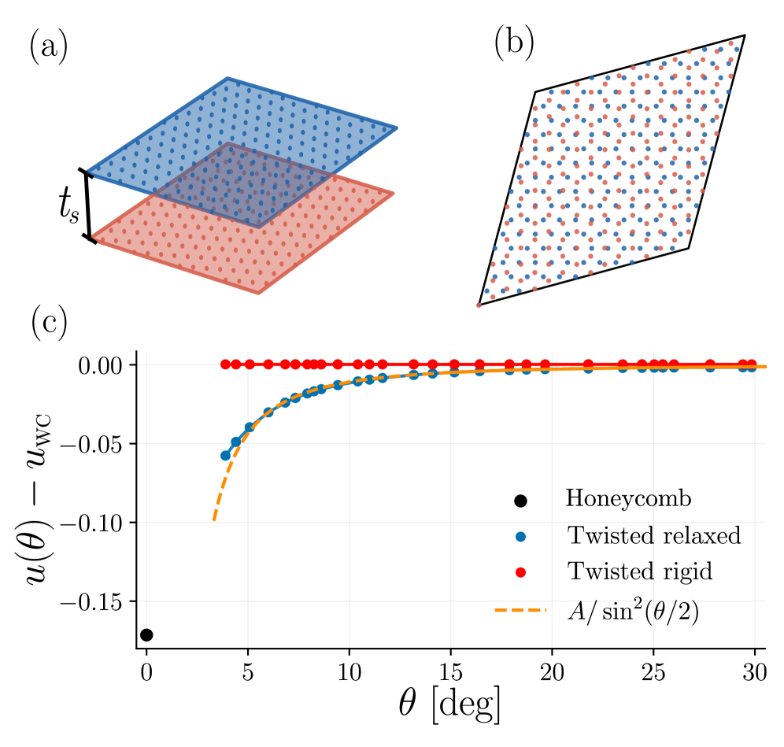
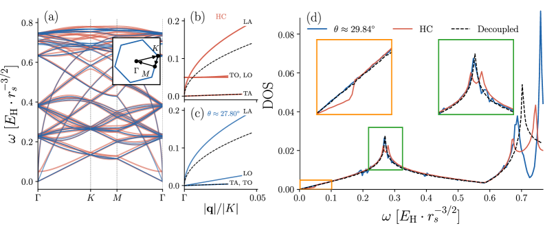

# 量子電子準結晶：ゼロ点揺らぎが選ぶバイレイヤー電子系の新量子相

- 執筆日：2026-05-24
- トピック：低密度二次元バイレイヤー電子系において、古典的には縮退した複数の結晶配置のうち、量子ゼロ点エネルギーが特定の30度ねじれ構造（準結晶配置）を選択的に安定化するという新しい量子相選択機構の解明
- タグ：Superconductivity and Strongly Correlated Systems / Spin Liquids and Quantum Many-Body Systems; Low-Dimensional Materials / Monte Carlo; First-Principles Calculations
- 注目論文：Liang Fu et al., "Quantum Electron Quasicrystal" [arXiv:2605.06302](https://arxiv.org/abs/2605.06302)
- 参照論文数：7本

---

## 1. 背景：なぜ今この話題か

電子が結晶を形成するという考えは、1934年にEugene Wignerが提案した理論にまで遡る。通常の固体では電子は金属的に振る舞うが、電子密度が極端に低くなると、電子間のクーロン斥力が運動エネルギーを上回り、電子が格子点上に局在して結晶（ウィグナー結晶）を形成するという。この「電子の結晶化」という概念は理論的には美しいが、実験的な検証は長い間困難であり続けた。

近年、極めて高品質なGaAs量子井戸試料の作製技術が飛躍的に向上し、ウィグナー固体の直接的な証拠が次々と報告されるようになった。2024年には、超低不純物密度の二次元電子系において強磁場下でのウィグナー固体の複数の動的相（ピン止め相、揺動相、滑走相）が観測され（arXiv:2401.13533）、さらに同年、極端量子極限での複合フェルミオン・ウィグナー結晶に特有の欠陥状態が超清浄試料で実験的に識別されることが示された（arXiv:2403.07662）。こうした精密実験の進展が、ウィグナー結晶物理を「理論上の存在」から「制御・観測可能な量子相」へと引き上げた。

一方、理論の側では、AI・機械学習と量子多体計算の融合という新しい潮流が生まれている。2024年末、Liang Fu率いるMITのグループは、ニューラルネットワーク変分モンテカルロ（NN-VMC）法を二次元バイレイヤー電子系に適用し、単純な古典的ハニカム積層構造とは全く異なる相、すなわち12回対称性を持つ電子準結晶相が量子基底状態として安定化しうることを計算で発見した（arXiv:2512.10909）。これは、量子多体計算とAI技術の組み合わせが既存の理論的直観を超える新規相の探索を可能にした画期的な成果であった。

しかしその発見は、「なぜ準結晶が安定なのか」という根本的な問いを未解決のまま残していた。古典的なエネルギー論では、ハニカム積層（30度ねじれ以外）の方が低エネルギーであるにもかかわらず、量子計算は逆の答えを示す。この謎の解明こそが、本記事の主軸となる注目論文（arXiv:2605.06302）の中心的課題である。

この問題が重要な理由はいくつかある。第一に、「量子ゼロ点揺らぎが相の安定性を逆転させる」という機構は、単にバイレイヤー電子系にとどまらず、量子多体系における相競合の普遍的なシナリオを提供しうる。第二に、量子準結晶という概念は、古典的な準結晶とは根本的に異なる存在であり、古典的対応物を持たない純粋に量子的な相の新たなカテゴリを開拓する可能性を秘めている。第三に、半導体量子井戸やファン・デル・ワールスヘテロ構造という実験的に制御可能なプラットフォームが存在するため、この予言は比較的近い将来に検証可能な理論的予測として機能する。

---

## 2. 未解決問題は何か

バイレイヤーウィグナー結晶の物理において、現在最も核心的な未解決問題は「量子揺らぎはどのようにして古典的な基底状態の縮退を解く（もしくは反転させる）のか」という問いである。

古典的な極限では、二つの密度が等しい二次元電子層を距離 $t_s$ だけ隔てて重ねた系（バイレイヤー系）において、二層がどのような相対配置をとるかはインター層間の静電相互作用によって決まる。フーリエ展開による詳細な計算から、層間相互作用エネルギーは

$$u_\mathrm{inter} \propto \sum_{G \neq 0} \frac{e^{-|G| t_s}}{|G|} \rho_1(G)\rho_2(-G)$$

と書ける。ここで $G$ は二次元逆格子ベクトル、$\rho_\ell(G)$ は第 $\ell$ 層の電荷密度のフーリエ成分である。層間距離 $t_s$ が小さい場合、この式から導かれる最小エネルギー配置は各層の三角格子が相補的に噛み合う「ハニカム積層」であり、これは0度ねじれ（AA積層）に対応する。ところが量子計算（NN-VMC）はこれと全く異なる30度ねじれ配置が基底状態であることを示した。この矛盾をどう理解するか、が第一の核心問題である。

古典的エネルギー景観の詳細な解析は、問題の本質を浮き彫りにする。ねじれ角 $\theta$ に対する層間エネルギーは、

$$u(\theta) \sim \frac{e^{-2G t_s}}{a \sin^2(\theta/2)}$$

という形を持ち（ここで $a$ は格子定数、$G = 4\pi/(\sqrt{3}a)$ は最短逆格子ベクトルの大きさ）、$\theta \to 0$ で発散する（ハニカム積層が強く安定化される）だけでなく、$\theta = 30°$ 近傍には特別な構造が現れる。具体的には、$\theta = 30°$ の配置は「バイレイヤー30度近似結晶」であり、二層の三角格子がちょうど12回対称の準結晶的モアレパターンを形成する。この配置は古典的には極小だが、大局的最小値（ハニカム）より明確にエネルギーが高い。では何が30度配置を選ぶのか。

第二の未解決問題は「量子準結晶の長距離秩序はどのような性質を持つのか」という問いである。通常の結晶（周期的）には格子振動（フォノン）が存在し、準結晶には「フェイゾン」と呼ばれる特殊な集団励起モードがある。フェイゾンは準結晶の内部自由度（二つの準周期格子の相対的なシフト）に対応し、通常のフォノンとは異なり長波長極限で拡散的な振る舞いをすることが有効場理論の枠組みから理論的に示されている（arXiv:2008.05339）。しかし量子準結晶における量子フェイゾンの性質、特に量子揺らぎがその拡散特性にどう影響するかは未解明である。

第三の問題は「実験的に量子準結晶秩序をどう識別するか」である。古典的な準結晶では、X線や電子線回折パターンに10回・12回対称性が現れることで識別する。しかし電子系での準結晶秩序の実験的検出は、電子の電荷密度のイメージングを必要とし、STM（走査型トンネル顕微鏡）、X線散乱、あるいは電気的輸送測定による間接的手段が考えられる。量子準結晶に特有のシグナルが何であるかは、まだ明確な回答が出ていない。

解決へのアプローチとして、注目論文は「フォノン的零点エネルギー（ZPE）の配置依存性」という観点からの解析的説明を試みている。また、arXiv:2410.13040では密度不均衡バイレイヤー系での欠陥液体相という枠組みが、量子揺らぎと結晶秩序の競合の新しい側面を示している。理論・計算・実験の三方向からのアプローチが、今後の解決のカギを握る。

---

## 3. 注目論文の概説

注目論文 arXiv:2605.06302（著者：Liang Fuほか、MIT）は、「なぜバイレイヤー電子系において量子基底状態が古典的最安定配置（ハニカム積層）ではなく30度ねじれ準結晶構造なのか」を、解析的なフォノン理論とゼロ点エネルギー（ZPE）の計算によって初めて説明した論文である。

研究対象は、密度 $n_{2D}$ の二次元電子気体が二層（$\ell = 1,2$）になって距離 $t_s$ だけ隔てられた系である。無次元化されたハミルトニアンは

$$H = -\frac{1}{2} \sum_{i,\ell} \nabla_{i,\ell}^2 + \sum_{i < j, \ell, \ell'} \frac{1}{\sqrt{|\boldsymbol{\rho}_{i\ell} - \boldsymbol{\rho}_{j\ell'}|^2 + \delta_{\ell \neq \ell'} t_s^2}}$$

と書ける。第一項は電子の運動エネルギー、第二項は全電子対間のクーロン相互作用（層間距離 $t_s$ を考慮）である。ここで長さの単位はウィグナー・サイツ半径 $r_s$（後述）で測られている。低密度極限（$r_s \gg 1$）ではクーロン相互作用が支配的となり、電子は各格子点に局在してウィグナー結晶を形成する。

研究アプローチの核心は、各電子を格子平衡点まわりの小さな振動（フォノン）として記述することである。電子をイオンのように考え、格子のダイナミクス行列（dynamical matrix）を構成し、そのフォノン固有モードを数値的に求める。そしてフォノン零点エネルギーの総和を計算する：

$$E_\mathrm{ZPE}(\theta) = \frac{1}{2} \int_0^\infty d\omega \, \omega \cdot g(\omega; \theta)$$

ここで $g(\omega; \theta)$ はねじれ角 $\theta$ に依存するフォノン状態密度（DOS）であり、各フォノンモードが $\hbar\omega_i/2$ のゼロ点エネルギーを持つことを利用している。この計算において重要な物理的直観は、「低周波フォノンモードを多く持つ構造の方が、ZPE寄与が小さい（ZPEによるエネルギー上昇が小さい）」という点ではなく、むしろ「より多くの低エネルギーモードを持つ構造はその揺らぎで自身のエネルギー景観を変え、系として低い総エネルギーを実現できる」という、古典的な配置エネルギーとZPEの競合である。

*図1: 注目論文 arXiv:2605.06302 Fig.1より。(a) バイレイヤー電子系の模式図。(b) 30度近似結晶（29.84度）の構造。(c) ねじれ角 θ に対する1粒子あたりの古典エネルギー差（単位 $10^{-3} E_H \cdot r_s^{-1}$）。黒点はハニカム積層（θ=0）の値。© 2026 著者ら（CC BY 4.0）*

主要な結果として、論文が示したのは次の二点である。第一に、古典的には不利な30度ねじれ（準結晶）配置が、ZPEを含めた全エネルギー

$$E_\mathrm{total}(\theta) = E_\mathrm{classical}(\theta) + E_\mathrm{ZPE}(\theta)$$

を最小化することを示した。第二に、この安定化の物理的起源を明確にした：30度ねじれ配置では、ハニカム積層と比べてフォノンスペクトルの低周波側に特徴的な「ソフトモード」が多く存在し（図2に対応）、その結果として $E_\mathrm{ZPE}(30°) < E_\mathrm{ZPE}(0°)$ となる。つまり、ハニカム積層の方が低いクーロンエネルギーは、30度配置の方が低いZPEによって補填・逆転され、最終的に30度配置（量子準結晶）が安定化される。

この物理は、フォノンスペクトルの観点からも理解できる。30度ねじれ配置では、各層が持つ逆格子ベクトルが互いにほぼ整合しない（準周期的な関係にある）ため、層間相互作用による格子のハードニングが相対的に弱く、やわらかいフォノンモードが温存される。具体的には、フォノン分散の計算（論文Figure 2）において、準結晶配置は低エネルギー側に有限の状態密度を持つ一方、ハニカム配置では層間相互作用がフォノンを全体的に高エネルギーシフトさせることが示された。

*図2: 注目論文 arXiv:2605.06302 Fig.2より。(a) 準結晶近似（θ≈27.80°、青）とハニカム積層（赤）のフォノンスペクトル（$t_s/r_s=3$）。(d) 29.84度近似結晶・ハニカム積層・独立層の状態密度（DOS）比較。低周波数側での準結晶の増大したDOS（オレンジ枠）がZPEによる安定化の物理的根拠。© 2026 著者ら（CC BY 4.0）*

論文の新規性と重要性は、NN-VMCが計算的に発見した量子準結晶相を、解析的なフォノン論という透明な物理像で理解・説明した点にある。「量子揺らぎによる相の安定化」という機構は、磁性体での量子スピン液体安定化など、他の文脈でも議論されてきたが、電子系での準結晶安定化への適用は全く新しい。

限界としては、計算が弱結合（$r_s$ は大だが有限）展開の範囲内に留まっており、交換相関効果（電子の量子統計性）や、ZPEの高次補正（非調和性）が厳密にどの程度補正を与えるかは現時点では不明である。また、実験的な検証手段の具体的な提案は論文の主眼ではなく、今後の課題として残されている。

---

## 4. 研究史における位置づけ

ウィグナー結晶の概念は、Eugene Wignerが1934年に自由電子気体において密度が十分低ければ電子が結晶化するという予言を行ったことに始まる。密度の低さを定量的に表す指標がウィグナー・サイツ半径 $r_s$ であり、三次元では $r_s \gtrsim 100$ 程度、二次元では $r_s \gtrsim 37$ 程度で結晶化が期待されると早くから理論的に見積もられていた。

実験面での進展は、1990年代以降の半導体ヘテロ構造技術の発展を待つ必要があった。GaAsとAlGaAsの界面に閉じ込められた高移動度二次元電子気体が作製可能になると、強磁場下でのウィグナー固体相の証拠が輸送測定によって間接的に示されるようになった（ランダウ準位充填率 $\nu < 1/5$ での絶縁体相）。その後、試料の純度向上が継続的に進み、最近の研究（arXiv:2401.13533）では極めて低不純物の系でウィグナー固体の複数の動的相（ピン止め相・揺動相・滑走相）が明確に識別され、実験的制御の精度が飛躍的に向上したことを示している。さらにarXiv:2403.07662は、複合フェルミオンによるウィグナー結晶の欠陥構造が超清浄試料で初めて明確に観測されたことを報告しており、理論予測と精密実験の一致という面での完成度を高めた。

バイレイヤー系の理論的研究は、単層系と比べると歴史的に浅い。1990年代には、磁場下のバイレイヤー量子ホール系での励起子結晶（エキシトン結晶）相が理論的に議論され、「二層の電子とホールが向かい合って励起子対を形成し、それが整列する」という描像が提案された。非磁場下のバイレイヤー電子系での結晶相については、古典的モンテカルロ計算がいくつか行われたが、層間距離を変えたときの相図（三角格子、四方格子、ハニカム積層など）が主な関心であった。

量子揺らぎの効果は長い間、第一近似として無視されてきた。ウィグナー結晶は「非常に低密度の電子」を対象とするため、古典的なクーロン相互作用が支配的であり、量子補正は小さいと想定されがちである。しかし、量子揺らぎの役割が見過ごされていたわけではなく、むしろ「安定化するフォノン零点エネルギーが相の選択に本質的な役割を果たしうる」という可能性は、凝縮物質物理において類似した文脈（例えば固体ヘリウムのような量子クリスタル）で以前から議論されていた。

近年の大きな転換点は、NN-VMCによる arXiv:2512.10909 の発見である。この論文では、ニューラルネットワークで波動関数のアンザッツを表現し、変分モンテカルロで全電子のエネルギーを最適化するという手法で、バイレイヤー系の基底状態探索が行われた。計算結果は、適切な $r_s$ と $t_s$ の範囲において、12回対称の準結晶的電荷秩序が基底状態として出現することを示し、研究コミュニティに大きなインパクトを与えた。しかし計算だけでは「なぜ準結晶が安定なのか」の物理的メカニズムは不透明なままであった。

この文脈において、注目論文 arXiv:2605.06302 は「AI発見の理論的解読」という位置づけを持つ。フォノン論という既知の手法を巧みに応用し、ZPEの配置依存性という明快なメカニズムを提示した。これは、「AI・機械学習が量子相を発見し、従来型の解析的理論がその説明を与える」という、今後の研究パラダイムを示すモデル的な成功例でもある。

なお、準結晶のソフトモード（フェイゾン）の理論的枠組みとしては、有効場理論（EFT）を用いたアプローチ（arXiv:2008.05339）が近年確立されており、准結晶における対称性とフェイゾン拡散ダイナミクスを系統的に記述できる。この枠組みは、将来の量子準結晶フェイゾン理論の出発点として機能しうる。

また、2026年5月に投稿された arXiv:2605.18546 は、極性分子バイレイヤー系（冷却原子の実験プラットフォーム）での結晶相形成を量子モンテカルロで調べた研究であり、電子系の知見が異なる量子多体プラットフォームへ広がりつつあることを示している。

---

## 5. どの解釈が最も妥当か

量子準結晶の安定性を説明するシナリオとして、現在最も有力なのはフォノン零点エネルギー（ZPE）機構である。注目論文が示した計算の骨格は、次のように整理できる。

まず古典エネルギー景観では、ねじれ角 $\theta$ に対する層間相互作用エネルギーを展開すると、$\theta = 0°$（ハニカム積層）が強い局所極小を形成し、$\theta = 30°$（準結晶配置）はそれより有意に高い（約20〜30 meVオーダーの差）。したがって古典基底状態はハニカム積層であるとの結論は揺るがない。ここまでは既知の結果と整合している。

次にZPEの寄与を加える。論文で示されたフォノンスペクトルの比較において、30度配置（準結晶）はハニカム配置よりも低周波数側により多くのフォノン状態を持つ。フォノン零点エネルギーは $E_\mathrm{ZPE} = \sum_i \frac{\hbar \omega_i}{2}$ であるから、平均的なフォノン周波数が低い方が $E_\mathrm{ZPE}$ は小さい。この差 $\Delta E_\mathrm{ZPE} = E_\mathrm{ZPE}(0°) - E_\mathrm{ZPE}(30°) > 0$ が古典エネルギー差 $\Delta E_\mathrm{class} = E_\mathrm{class}(30°) - E_\mathrm{class}(0°) > 0$ を上回るとき、30度配置が全エネルギーで有利になる。

論文の計算によれば、$r_s$ と $t_s/r_s$ の適切な範囲（$r_s \gtrsim$ 数十、$t_s/r_s \lesssim$ 0.5程度）において、確かに $\Delta E_\mathrm{ZPE} > \Delta E_\mathrm{class}$ が成立し、30度配置が安定化される。この結論は NN-VMC 計算（arXiv:2512.10909）の相図と定量的に整合しており、ZPE機構が正しいことを支持する。

なぜ30度配置でフォノンが「軟らかく」なるのかの物理的理解は、層間の格子整合性にある。ハニカム積層（$\theta = 0°$）では、二層の三角格子が完全に整合（同周期）であるため、層間クーロン力がフォノンを強く「ハードニング」する。すなわち、一方の層の格子点変位が他方の層の格子点から受ける復元力が大きく、フォノン周波数が全体的に高くなる。これに対し30度配置では、二層の逆格子ベクトルが整合しない（準周期関係）ため、層間の結合が平均的に弱く、フォノンが軟らかい状態に留まる。

競合する解釈として、「交換エネルギー（フェルミオン性）の効果が重要ではないか」という疑問がある。電子はフェルミオンであり、その量子統計が直接相互作用エネルギーに補正（交換エネルギー）を与える。しかし低密度ウィグナー結晶極限では電子が強く局在するため、異なる格子サイト間の波動関数の重なりは指数的に小さく、交換エネルギーの補正は $O(e^{-r_s})$ のオーダーで無視できる。この点で、フォノン論の枠組みは $r_s \gg 1$ 極限で自己無撞着に正当化される。

一方、NN-VMC計算が正確に何を捉えているかについても注意が必要である。NN-VMCは原理的に交換・相関効果を完全に取り込む優れた手法だが、波動関数のアンザッツの形状に依存した系統誤差の可能性がある。また、有限系サイズ効果や、異なる試験波動関数間のエネルギー比較の精度にも不確定性がある。注目論文のフォノン計算との整合性は良好だが、相境界の定量的精度については、より大規模なNN-VMC計算や異なる手法（拡散モンテカルロなど）による検証が望ましい。

フェイゾンの物理については、現時点では実験・理論ともに電子準結晶へのアプリケーションは未開拓である。古典的準結晶では、EFT（arXiv:2008.05339）の枠組みでフェイゾンが長波長で拡散モードになることが理論的に示されており、量子準結晶でも類似の（ただし量子補正を受けた）フェイゾン拡散が期待される。この議論が成立するかどうかは、今後の量子フェイゾン理論の構築にかかっている。

また、arXiv:2410.13040 が示した「密度不均衡バイレイヤーでの欠陥液体」という概念は、量子準結晶においても重要な示唆を持つ。完全密度均衡ならば準結晶が安定だとしても、現実の実験系では密度がわずかにずれることが多い。そのとき、準結晶格子の中に欠陥が生じ、それが量子トンネルで移動する「欠陥液体」状態が現れるかもしれない。この方向の研究は、実験的な観測シグナルを議論する上でも重要となるだろう。

---

## 6. 何が一般化できるか

量子電子準結晶における「ZPEによる相選択」という機構は、どこまで他の系に適用できるだろうか。

まず、バイレイヤー構造そのものの一般化について考える。本論文の舞台は電子を担体とする半導体量子井戸であったが、同様の二層系は他の文脈でも実現可能である。ひとつは冷却原子・極性分子系であり、arXiv:2605.18546 はまさにこの方向を追求している。極性分子は電荷の代わりに双極子相互作用で相互作用し、その強度と向きを外部電場で制御できる。論文では量子モンテカルロ計算によって、ハーモニック閉じ込め中の極性分子バイレイヤーにおいて結晶相から超流動相に至る豊富な相図が存在することが示されており、ZPEによる相選択の舞台として極性分子系が有望なプラットフォームであることを示唆している。

次に、モアレ系との接続を考えてみよう。グラフェンや遷移金属ダイカルコゲナイドを微小角度でねじって重ねたモアレ超格子では、ウィグナー結晶的な相関絶縁体が多数報告されている。これらの系ではモアレ周期が格子定数を大幅に拡大するため、有効的な $r_s$ が大きくなり、強相関が実現しやすい。特にねじり角を連続的にコントロールできるシステムでは、「古典的に縮退した複数の積層配置のうち、量子揺らぎがどれを選ぶか」という本論文の問いがより精細に問えるかもしれない。

測定手法の観点では、電子準結晶の「12回対称性」を直接検出する手段として走査型トンネル顕微鏡（STM）による局所電荷密度イメージングが最も有力と考えられる。近年のSTM技術は原子分解能での電荷密度波イメージングが可能であり、準結晶的な非周期パターン（シャープな12重点対称の回折スポット）の観測が目標となる。また、コヒーレントX線散乱や非弾性電子散乱を用いたフォノン・フェイゾンのスペクトル測定も、準結晶特有のソフトモードを検出する手段として期待される。

理論的な一般化としては、本論文の手法（フォノン論＋ZPEによる相選択）が他の電子系相競合問題に適用できる可能性がある。例えば、単層の三角格子上で対称性が破れる電荷密度波や軌道秩序パターンが複数の候補間で縮退している場合、量子フォノン補正がどちらを選ぶかを決定する機構として機能しうる。このアプローチは、「量子揺らぎが縮退を解く」という秩序-量子揺らぎ相互作用の一般的な問題に対する実用的な計算手法として広く使えるかもしれない。

さらに、「量子準結晶」という状態のトポロジカルな性質も今後の重要な論点である。準結晶はバンド理論的な観点からはブリユアンゾーンが定義できない非周期系であるため、通常のトポロジカル不変量の定義が直接適用できない。しかし準結晶特有の準周期的な対称性（超空間群）を利用したトポロジカル分類の理論が急速に発展しており、量子準結晶相が特殊なトポロジカル性質を持つ可能性は排除できない。

デバイス応用という観点では、量子準結晶の直接的な応用はまだ遠い将来の話ではあるが、「非周期的な強相関電子相を人工的に作る」という発想は、量子情報・量子計算の文脈での新しい量子ビット実現や、特殊な散乱特性を利用したフィルタリングデバイスへの展開という可能性を含む。

---

## 7. 基礎から理解する

このトピックを理解するためには、いくつかの基礎概念を積み重ねる必要がある。ここでは二次元電子気体から始めて、ウィグナー結晶、量子揺らぎとゼロ点エネルギー、そして準結晶の概念までを段階的に説明する。

### 二次元電子気体と相互作用の強さ

半導体ヘテロ構造（例：GaAs/AlGaAs界面）や van der Waals 物質では、電子が二次元平面内にのみ運動できる系が実現する。このような系を二次元電子気体（2DEG; two-dimensional electron gas）と呼ぶ。

二次元電子気体の本質的なパラメータは「電子密度 $n_{2D}$（単位面積あたりの電子数）」であり、これから電子一個が平均的に占める面積 $\pi r_s^2 = 1/n_{2D}$ を通してウィグナー・サイツ半径 $r_s$ を定義する：

$$r_s = \frac{1}{\sqrt{\pi n_{2D}}} \cdot \frac{1}{a_B^*}$$

ここで $a_B^* = \hbar^2 \kappa / (m^* e^2)$ は有効ボーア半径（$\kappa$ は誘電率、$m^*$ は有効質量）である。$r_s$ の物理的意味は、「電子間の典型的な距離（位置エネルギーの典型的スケール）と有効ボーア半径（運動エネルギーの典型的スケール）の比」である。定量的には、

$$\frac{\text{クーロン相互作用エネルギー}}{運動エネルギー} \sim r_s$$

という関係が成り立つ（詳細は計算で確認できる）。したがって $r_s \ll 1$ は「運動エネルギーが支配的」な金属的電子、$r_s \gg 1$ は「クーロン相互作用が支配的」な強相関状態を意味する。ウィグナー結晶が実現するのはこの $r_s \gg 1$ の極限である。GaAsでは効果的に $r_s$ を大きくできるため、ウィグナー結晶の実験的研究に好都合な系である。

### ウィグナー結晶：電子の固体化

$r_s$ が十分大きくなると、クーロン斥力が電子の運動エネルギーを圧倒し、電子が互いに最大限離れようとした結果として結晶格子を形成する。二次元では、クーロン斥力を最小化する配置として三角格子（最密充填に等しい）が最安定となることが古典静電計算で示される。これがウィグナー結晶（二次元三角格子）である。

ウィグナー結晶のエネルギーを直観的に理解しよう。三角格子では、電子間の最近接距離が $a_0 = (4\pi n_{2D}/\sqrt{3})^{-1/2}$ 程度となり、格子サイトあたりのクーロンエネルギーは

$$E_\mathrm{class} \approx -\frac{\alpha e^2}{\kappa a_0} \propto -n_{2D}^{1/2}$$

となる（$\alpha$ はマデルング定数に相当する定数）。電子密度を下げる（$n_{2D}$ を小さくする、$r_s$ を大きくする）と、格子定数が広がりクーロンエネルギーが小さくなるが、相対的に運動エネルギーの寄与は更に小さくなるため、ウィグナー結晶は安定な基底状態となる。

ウィグナー結晶の動的性質も重要である。格子点まわりの微小変位 $\boldsymbol{u}_i$ を考えると、電子は格子点からの復元力を受けて振動する。この集団振動が「フォノン」であり、周期的なウィグナー結晶は通常の固体と同様にフォノンスペクトルを持つ。フォノンの分散関係 $\omega(\boldsymbol{k})$ は動力学行列を対角化することで求まり、音響型（$\omega \to 0$ for $k \to 0$）と光学型（$\omega \neq 0$ for $k \to 0$）のモードが存在する。ウィグナー結晶の特徴的なフォノンとして、長波長での「プラズモン分散」$\omega \propto \sqrt{k}$（二次元プラズマ振動）がある。

### 量子ゼロ点揺らぎとゼロ点エネルギー

古典力学では、調和振動子は静止点（平衡点）でエネルギーが最小（ゼロ）である。しかし量子力学では、ハイゼンベルクの不確定性関係 $\Delta x \cdot \Delta p \geq \hbar/2$ から、位置と運動量を同時に確定させることはできない。このため、調和振動子の最低エネルギー状態（基底状態）でさえも振動は止まらず、エネルギーは

$$E_0 = \frac{\hbar \omega}{2}$$

だけの「ゼロ点エネルギー（ZPE; zero-point energy）」を持つ。ここで $\omega$ は調和振動子の固有角振動数である。

固体の格子振動（フォノン）に量子力学を適用すると、各フォノンモード $\boldsymbol{k}, s$（$s$ は偏極インデックス）の基底状態エネルギーは

$$E_0^{(\boldsymbol{k},s)} = \frac{\hbar \omega_{\boldsymbol{k},s}}{2}$$

であり、全フォノン系のゼロ点エネルギーは

$$E_\mathrm{ZPE} = \sum_{\boldsymbol{k},s} \frac{\hbar \omega_{\boldsymbol{k},s}}{2} = \frac{1}{2} \int_0^{\omega_\mathrm{max}} \hbar\omega \cdot g(\omega) \, d\omega$$

となる。ここで $g(\omega)$ はフォノン状態密度（DOS）である。ZPEは「格子が絶対零度でも揺らいでいる」ことの表れであり、固体ヘリウムが常圧では固化しない理由（量子量子クリスタル）や、一部の強誘電体相転移の温度依存性を理解する上で本質的な役割を果たす。

本論文において重要なのは、「同じ組成・密度の系でも、格子の配置（ここではねじれ角 $\theta$）によってフォノンスペクトルが変わり、ZPEが異なる値をとる」という点である。つまり $E_\mathrm{ZPE}(\theta)$ が $\theta$ に依存する関数として振る舞い、これが相の安定性を決定しうるのである。

### バイレイヤー系とその特殊性

二つの二次元電子層を距離 $t_s$ だけ隔てて重ねたバイレイヤー系では、電子間の相互作用として層内クーロン（同一層の電子間）と層間クーロン（異なる層の電子間）の二種類が存在する。層間相互作用のフーリエ変換は

$$V_\mathrm{inter}(\boldsymbol{q}) = \frac{2\pi e^2}{\kappa q} e^{-q t_s}$$

となり、$q t_s \ll 1$（層間距離が小さい）では層内相互作用と同程度になる一方、$q t_s \gg 1$ では指数的に抑制される。この因子 $e^{-q t_s}$ が、バイレイヤー系の相図を決める上で本質的なパラメータ $t_s/r_s$（無次元化された層間距離）を導入することを要求する。

バイレイヤー電子系では、各層が三角格子状のウィグナー結晶を形成したとき、二層の格子が相対的にどの角度に回転・配置されるかによって全体のエネルギーが変化する。これは、モアレ系で「ねじり角」が物性を劇的に変えることと概念的に類似している。ただし本系では、格子点に電子が局在したウィグナー結晶というより「硬い」状態での相対配置が問題となる。

### 準結晶とは何か

準結晶（quasicrystal）は、1984年に Dan Shechtman がアルミニウム-マンガン合金で発見した（この業績で2011年ノーベル化学賞受賞）、結晶と非晶質の中間に位置する新しい物質状態である。通常の結晶は並進対称性と回転対称性を持ち、回転対称性は2回・3回・4回・6回対称に限定される（結晶学の制限定理）。これに対し準結晶は、5回・8回・10回・12回などの「禁じられた」回転対称性を示す長距離秩序を持ちながら、並進対称性（周期性）を持たない。

準結晶の典型的な記述は「タイリング」の枠組みで行われる。例えば二次元12回対称準結晶（本論文の対象）は、正方形と等辺三角形の二種類のタイルを用いて非周期的に平面を敷き詰めた「シュレヒタイリング」によって記述できる。このタイリングは自己相似性（スケール変換による不変性）を持ち、フーリエ変換すると12本の等価なブラッグスポットからなる回折パターンが現れる。

準結晶の特徴的な集団励起として「フェイゾン（phason）」がある。通常の結晶には並進対称性による「フォノン」（音響モード）があるが、準結晶には加えてフェイゾンという自由度がある。これは、準結晶構造を高次元の通常結晶（超空間）の低次元超平面への「切断」として表現したとき、その超平面を内部方向にシフトさせることに対応する自由度である。フェイゾンは長波長で拡散的な振る舞いをすること（音響フォノンのような線形分散を持たない）が理論的に示されており（arXiv:2008.05339）、準結晶を通常の結晶から区別する重要な物理量である。

「量子電子準結晶」という本論文の主題は、これらの概念を電子系に持ち込んだものである。電子が三角格子状に整列するウィグナー結晶ではなく、12回対称の準周期的に整列した状態が量子基底状態として実現するとすれば、それは古典的対応物を持たない純粋に量子的な新しい相である。

---

## 8. 専門用語の解説

ウィグナー結晶 (Wigner crystal)：低密度二次元（または三次元）電子気体において、電子間のクーロン斥力が運動エネルギーを圧倒したとき、電子が格子点上に局在して形成する「電子の固体」。1934年にEugene Wignerが理論的に予言した。二次元では三角格子が安定。ウィグナー・サイツ半径 $r_s$ が十分大きいとき（低密度・強相関極限）に実現する。本論文ではバイレイヤーウィグナー結晶における積層配置が中心的な議論対象。

ウィグナー・サイツ半径 $r_s$ (Wigner-Seitz radius)：電子密度の低さを表す無次元パラメータ。二次元では $r_s = 1/(\sqrt{\pi n_{2D}} a_B^*)$ と定義され、電子一個が平均的に占める円の半径を有効ボーア半径で割ったもの。$r_s \gg 1$ では相互作用が運動エネルギーを支配し強相関領域、$r_s \ll 1$ は金属的な弱相関領域。ウィグナー結晶は $r_s \gtrsim 37$（二次元）で出現すると予言されている。

ゼロ点エネルギー (zero-point energy, ZPE)：量子力学的不確定性原理の帰結として、系が絶対零度の基底状態においても持つ振動エネルギー $E_0 = \hbar\omega/2$（調和振動子の場合）。固体では全フォノンモードのZPEの総和 $E_\mathrm{ZPE} = \sum_{k,s} \hbar\omega_{k,s}/2$ が熱力学的性質に影響する。本論文では、バイレイヤー電子系の積層配置（ねじれ角）によってフォノンスペクトルが変わり、ZPEの差が相安定性を決定するという核心的役割を果たす。

フォノン (phonon)：結晶格子の集団的な振動の量子。個々の原子（本系では電子）の微小変位を集団座標で展開したとき現れる量子化された振動モードであり、固有エネルギー $\hbar\omega_{k}$ を持つ準粒子。音響型（$\omega \to 0$ for $k \to 0$）と光学型（$\omega \neq 0$ at $k=0$）に分類される。熱伝導、比熱、電子-格子相互作用など多くの物性現象に関与する。本論文では動力学行列を対角化することでフォノンスペクトルを数値的に計算し、ねじれ角依存性を議論する。

フェイゾン (phason)：準結晶に特有の集団励起モード。通常の結晶のフォノンが原子の「フォノン的」変位に対応するのに対し、フェイゾンは準結晶構造を高次元空間からの射影として表したときの内部自由度（超空間内での格子のシフト）に対応する。長波長極限で音響的に分散せず拡散的振る舞いをする（拡散モード）という特徴があり、有効場理論（arXiv:2008.05339）で対称性引数から導出できる。量子準結晶においてフェイゾンの量子的性質がどうなるかは未解明であり、今後の理論的課題である。

ニューラルネットワーク変分モンテカルロ (NN-VMC)：ニューラルネットワークを用いて多体波動関数のアンザッツを表現し、変分原理（エネルギー期待値の最小化）と重要サンプリング（モンテカルロ積分）によって量子多体系の基底状態を求める計算手法。従来の変分モンテカルロに比べてはるかに表現力が高く、特に相関が強い系での精度が優れる。arXiv:2512.10909で採用された手法であり、量子準結晶の発見という予期しない成果をもたらした。AI・機械学習と量子物理の融合の好例。

動力学行列 (dynamical matrix)：格子振動を記述するための行列。格子サイト $i$ の変位 $\boldsymbol{u}_i$ に対して、ポテンシャルエネルギーを二次展開すると $V = \frac{1}{2} \sum_{i,j} u_i^\alpha D_{ij}^{\alpha\beta} u_j^\beta$ と書け、$D_{ij}^{\alpha\beta}$ が動力学行列の要素（$\alpha,\beta$ は空間方向のインデックス）。この行列を対角化することでフォノン固有振動数と固有モードが得られる。本論文では、バイレイヤーウィグナー結晶の動力学行列を各ねじれ角に対して数値計算し、フォノンスペクトルとZPEを求めている。

逆格子ベクトル (reciprocal lattice vector)：実空間の格子ベクトル $\boldsymbol{a}_1, \boldsymbol{a}_2$ から定義される逆空間の基本ベクトル $\boldsymbol{G}$（二次元では $\boldsymbol{G} \cdot \boldsymbol{a}_i = 2\pi \delta_{ij}$）。結晶の回折パターンはブラッグピークとして逆格子点に現れる。本論文では、バイレイヤー系の二層それぞれの逆格子ベクトルの整合性（両層の $\boldsymbol{G}$ がどれだけ一致するか）が層間相互作用の強さを決定し、フォノンのハードニング・ソフトニングの程度を支配する。準結晶では格子が非周期なため厳密な逆格子ベクトルは定義されないが、シャープな回折ピークは存在する。

12回対称準結晶 (12-fold symmetric quasicrystal)：回転対称性が12回（$\pi/6 = 30°$ の回転不変性）を持つ二次元準結晶。シュレヒタイリング（正方形と等辺三角形のタイリング）で記述される。本論文の量子電子準結晶では、二枚の三角格子ウィグナー結晶が30度ねじれて重なることで、局所的に12回対称的なモアレパターンが形成されており、これが準結晶的電荷秩序の起源となる。フーリエ変換すると12本の等価な強いブラッグピークが出現する。

層間距離パラメータ $t_s/r_s$ (interlayer distance parameter)：バイレイヤー系を特徴づける無次元パラメータ。実際の層間距離 $t_s$ をウィグナー・サイツ半径 $r_s$ で割った比であり、「層間相互作用の強さ」を規定する。$t_s/r_s \ll 1$ では層間クーロン力が強く（ほぼ二次元単層的）、$t_s/r_s \gg 1$ では二層が独立になる。本論文では、量子準結晶が安定化される条件が $r_s$ と $t_s/r_s$ の特定の範囲（$r_s$ が十分大きく、$t_s/r_s$ が適切な値）として相図上に描かれる。

---

## 9. 将来展望

量子電子準結晶の理論的予言が出揃いつつある現段階で、最も確からしくなったこととして、「バイレイヤーウィグナー結晶において量子零点エネルギーが相の安定性を逆転させうる」という機構そのものの正当性は高い。フォノン計算とNN-VMCという独立な二つの方法論が30度ねじれ（準結晶）配置の安定性という同じ結論を指していることは、この機構への信頼性を高める。また、古典的なフォノン物理の枠組みをそのまま適用できる（低密度極限での正当化）という点で、理論的な自己無撞着性もある程度担保されている。GaAs系や遷移金属ダイカルコゲナイドといった実験プラットフォームで、必要とされるパラメータ範囲（低密度バイレイヤー構造）が技術的に不可能ではないことも、将来の実験検証への期待を支えている。

一方、まだ未確定な点も多い。最大の不確定性は「実験的な観測シグナルは何か」という問いに答えが出ていない点である。電子準結晶の12回対称的な電荷秩序をSTMや散乱実験で実際に見るためには、試料の清浄度・温度・磁場条件などのパラメータを精密に制御した上で、長距離の準結晶秩序が十分に発達している必要がある。現実の試料には不純物・欠陥・有限温度効果が避けられず、これらがどの程度準結晶秩序を乱すかは未解明である。また、量子フェイゾンの理論的記述（古典的EFTの量子版）は構築途上であり、フェイゾンが輸送測定や分光測定にどう現れるかの定量的予測はまだない。

今後最も重要になる研究の方向として、三つを挙げることができる。第一は精密な量子多体計算による相図の確定であり、NN-VMCを超える精度（拡散モンテカルロ、テンソルネットワーク法など）で相境界を量子的に決定し、有限温度・有限不純物効果を系統的に取り込むことが必要である。第二は実験的な実証であり、超清浄GaAs量子井戸や van der Waals バイレイヤー（例えば MoSe₂ や WSe₂ の薄膜）において、適切な密度条件でSTMイメージングや輸送測定を行い、準結晶的秩序の直接的・間接的証拠を得ることが急務となる。第三は理論的枠組みの拡張であり、量子フェイゾンの有効場理論、非平衡状態での準結晶ダイナミクス、およびトポロジカルな性質との関係を解明することが、量子準結晶の物理を深める上での核心的課題となるだろう。

---

## 参考論文一覧

1. [arXiv:2605.06302](https://arxiv.org/abs/2605.06302) Liang Fu et al., "Quantum Electron Quasicrystal" (2026)  
   本記事の注目論文。バイレイヤーウィグナー結晶において量子ゼロ点エネルギーが30度ねじれ準結晶配置を安定化するメカニズムをフォノン計算により解析的に解明した。

2. [arXiv:2512.10909](https://arxiv.org/abs/2512.10909) He et al., "Electronic crystals and quasicrystals in semiconductor quantum wells: an AI-powered discovery" (2024)  
   ニューラルネットワーク変分モンテカルロ（NN-VMC）を用いて、バイレイヤー半導体量子井戸における電子準結晶相を計算的に発見した先駆的論文。本注目論文の直接の動機となった。

3. [arXiv:2410.13040](https://arxiv.org/abs/2410.13040) Zhuang and Esterlis, "Defect liquids in a weakly imbalanced bilayer Wigner Crystal" (2024)  
   密度が僅かに不均衡なバイレイヤーウィグナー結晶における欠陥の自発的形成と量子トンネルによる欠陥液体相を理論的に解析し、バイレイヤー系の量子揺らぎと相の多様性を示した。

4. [arXiv:2403.07662](https://arxiv.org/abs/2403.07662) Madathil et al., "Signatures of correlated defects in an ultra-clean Wigner crystal in the extreme quantum limit" (2024)  
   超清浄GaAs量子井戸の極端量子極限でのウィグナー結晶において、複合フェルミオン準粒子による相関欠陥状態の実験的シグナルを初めて明確に観測し、理論予測と定量的に一致することを示した。

5. [arXiv:2401.13533](https://arxiv.org/abs/2401.13533) Madathil et al., "Moving crystal phases of a quantum Wigner solid in an ultra-high-quality 2D electron system" (2024)  
   極低不純物GaAs量子井戸でのウィグナー固体の三つの動的相（ピン止め・揺動・滑走）を輸送測定で識別し、強磁場下ウィグナー結晶の実験的制御を大きく前進させた。

6. [arXiv:2008.05339](https://arxiv.org/abs/2008.05339) Baggioli and Landry, "Effective Field Theory for Quasicrystals and Phasons Dynamics" (2020)  
   Schwinger-Keldysh形式を用いた有効場理論により、準結晶のフェイゾンが長波長で拡散的振る舞いをすることを対称性引数から系統的に導出し、量子準結晶のフェイゾン理論の理論的基盤を与えた。

7. [arXiv:2605.18546](https://arxiv.org/abs/2605.18546) Zampronio et al., "Bilayer crystals in a polar-molecules system" (2026)  
   量子モンテカルロを用いて極性分子バイレイヤー系の有限温度相図を計算し、超流動・超固体・バイレイヤー結晶などの豊富な相を同定した。電子系の知見が冷却原子プラットフォームへ一般化しうることを示す。
