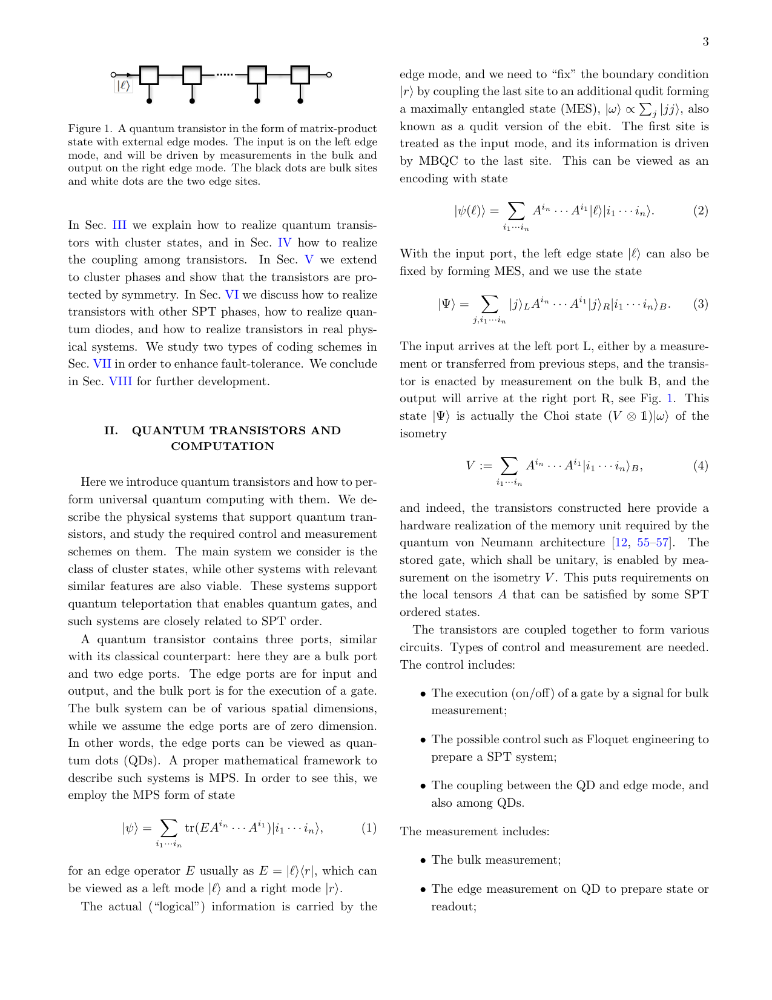
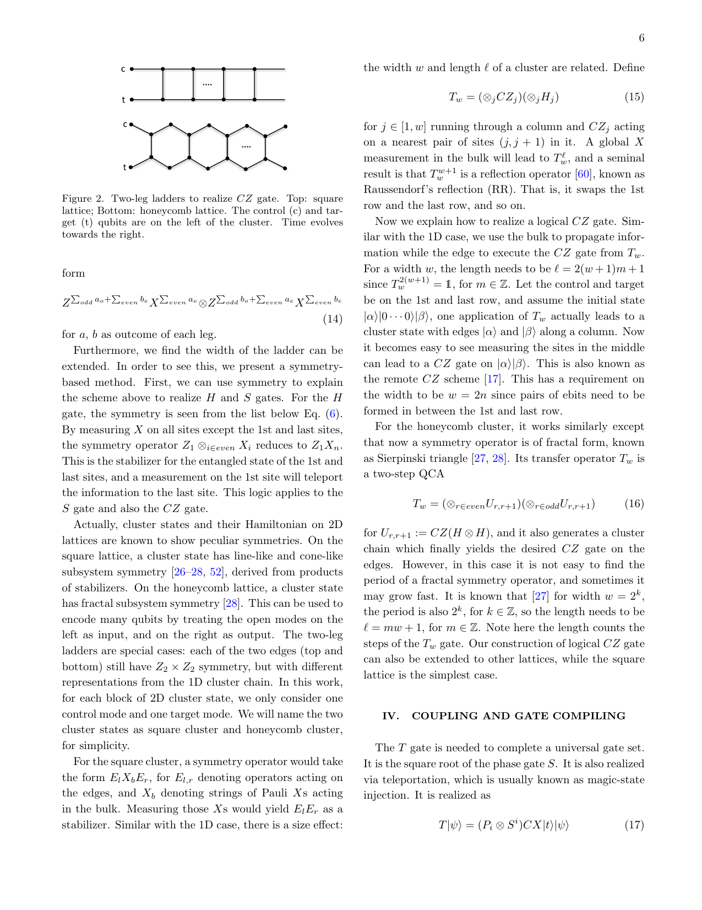
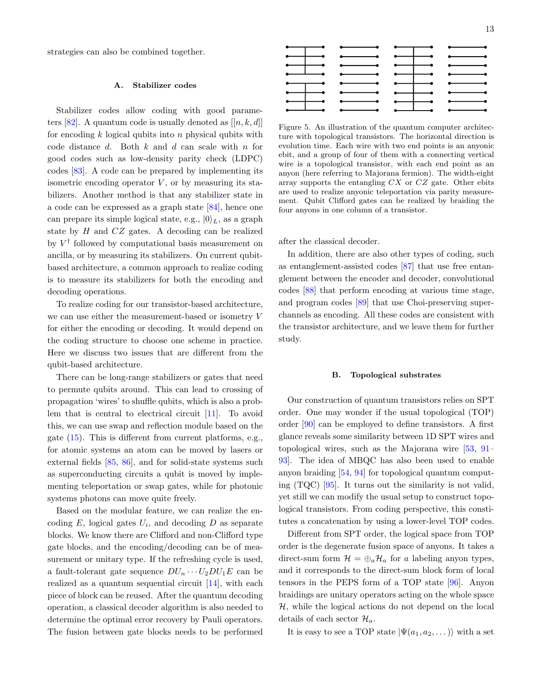

# 量子トランジスタが拓く新しい計算アーキテクチャ

- 執筆日：2026-05-24
- 要旨：本記事では、対称性保護トポロジカル秩序（SPT秩序）に基づく「テレジスタ（telesistor）」と呼ばれるテレポーテーション型量子トランジスタを核に、従来の量子ビット回路モデルを超えた新しい普遍量子計算アーキテクチャを解説する。テレジスタはクラスター状態などのSPT秩序を持つ多体系の基底状態として定義され、能動的な誤り訂正なしに高忠実度なクリフォードゲートを実現する。この物理的保護の上に安定化符号を乗せることで普遍量子計算が可能となる。関連研究として、テレポーテーションとSPT秩序の等価性の理論的証明、断熱的量子トランジスタとの比較、Haldane相の量子プロセッサ上での実証実験、双曲型クラスター状態による新しい誤り耐性MBQC、量子逐次回路の枠組みを取り上げ、量子計算のアーキテクチャ設計における論点を俯瞰する。
- タグ：Electronic Structure / Topological Properties; Spin Liquids and Quantum Many-Body Systems / First-Principles Calculations; Monte Carlo
- 注目論文：[Towards transistor-based quantum computing (arXiv:2605.21045)](https://arxiv.org/abs/2605.21045)
- 参照論文数：6本

---

## 1. 背景：なぜ今この話題か

現代の量子コンピューティングは「量子ビット（qubit）」を基本単位として構築されている。量子ビットに量子ゲートを順次適用し、最後に測定する「回路モデル」は古典コンピューティングにおけるブールゲート回路の量子版として広く普及しており、超伝導量子ビット（例：IBMやGoogle）、捕捉イオン量子ビット（例：IonQ）、光量子ビットなど多様なハードウェアプラットフォームが競い合っている。

しかし、この回路モデルには根本的な問いが未解決のまま残っている。古典コンピュータにおいてトランジスタが演算とメモリの両方を担うように、「量子トランジスタ」に相当するものは何か、そして量子トランジスタを使った量子計算はいかに実現できるのか、という問いである。古典コンピュータのアーキテクチャでは、論理ゲートはハードウェアとして固定された物理的実体（トランジスタ回路）であり、データが動的に生成・処理される。これに対して量子ビット回路モデルでは、ゲートは時間的に順次実行される「操作」として存在し、ゲート自体をハードウェアとして格納するという概念が確立されていない。

この問いへの関心が高まっている背景には、量子コンピュータのスケールアップに伴うアーキテクチャ上の課題がある。現状のNISQ（Noisy Intermediate-Scale Quantum）デバイスは誤り率が高く、実用的な計算には誤り訂正が不可欠である。量子誤り訂正は多数の物理量子ビットで1つの論理量子ビットを保護するため、オーバーヘッドが甚大になる。この課題を克服するには、物理的なノイズ保護を活用したハードウェアレベルの設計が求められている。

同時に、測定ベース量子計算（MBQC: Measurement-Based Quantum Computing）と対称性保護トポロジカル（SPT: Symmetry-Protected Topological）秩序の関係についての理論的理解が深まってきた。Raussendorf and Briegel（2001）が提唱したMBQCは、高度にエンタングルした「リソース状態」（クラスター状態など）に対して単一量子ビット測定を順次適用することで計算を行うモデルである。近年の研究により、このMBQCの計算能力がSPT秩序と深く結びついていることが明らかになり（Wang et al. 2017; Raussendorf et al. 2019）、さらに2023年にはHongら[2310.12227]がテレポーテーション自体がSPT秩序を必然的に伴うことを証明した。

このような理論的基盤の成熟を背景に、2026年5月、Liu, Xu, Wang, Wang（中国科学院理論物理学研究所）は「テレポーテーション型量子トランジスタ（telesistor）」という新概念に基づく普遍量子計算アーキテクチャを提案した[2605.21045]。この論文は、「量子トランジスタとは何か」「それでどう普遍量子計算を実現するか」という問いに真正面から取り組んだ野心的な理論研究である。

---

## 2. 未解決問題は何か

### 量子ゲートのハードウェア格納という問題

古典コンピュータでは、ANDやORなどの論理ゲートはトランジスタで構成された固定された回路として存在し、データは電気信号として動的に流れる。これに対して量子コンピュータでは、量子ゲート（ユニタリ変換）は時間的な操作として実行されるが、ゲートそのものを量子的な物理状態として格納する方法が確立されていない。「チャネル−状態二重性（channel-state duality）」によれば、任意の量子チャネル（ゲート）は対応する量子状態（Choi状態）と一対一に対応する。この数学的構造を活用してゲートを状態として格納し、測定によって実行するという概念は「量子フォンノイマンアーキテクチャ（QvN）」として提案されている（Wang 2022 [2112.09345]）が、実装のための物理的プラットフォームと、ノイズ保護の方策が未解決のままであった。

テレジスタの概念はこの問いに答えを与える試みである：SPT秩序を持つ多体系の基底状態としてChoi状態を実現すれば、その物理的保護を活用できる。しかしどの程度の保護が得られるのか、そしてその保護を故障耐性（fault-tolerance）と組み合わせてどう普遍量子計算を達成するかは、当論文が解決しようとする核心的問題である。

### SPT保護の限界：Cliffordゲートと非Cliffordゲートの非対称性

SPT秩序によるエッジモードの保護は強力だが、保護できるゲートの集合は有限である。具体的には、1次元クラスター相のZ₂×Z₂対称性保護のもとでは、HadamardゲートH、位相ゲートS、CZゲートといったクリフォードゲートは対称性によって保護される。しかしTゲート（π/8ゲートまたは$T = \text{diag}(1, e^{i\pi/4})$）のような非クリフォードゲートはこの保護の外にある。

なぜHやSやCZは保護され、Tは保護されないのか。これはゴッテスマン−ナイル定理（Gottesman-Knill theorem）に深く関わる問題である。クリフォードゲートの集合は量子ビット上のパウリ群を不変に保つゲートであり、安定化符号の形式と相性がよい。SPT秩序の保護はその対称性群の表現論と結びついており、対称性群に属する操作（クリフォード操作）は自然に保護されるが、Tゲートのような非クリフォード操作は保護の外に置かれる。

これを克服するために「マジック状態注入（magic state injection）」が使われる：Tゲートを特別な「マジック状態」$|T\rangle = T|+\rangle$の注入と測定の組み合わせで実現する技法である。マジック状態の高品質な生成とその精製（蒸留）は量子誤り訂正の大きなオーバーヘッドを生む（Bravyi-Kitaev 2005）。テレジスタアーキテクチャがこのオーバーヘッドをどう処理するかは重要な未解決点である。

### モジュール性とプログラム可能性

量子コンピュータのスケールアップには、独立した計算ブロックをモジュール式に組み合わせる能力（modularity）が不可欠である。量子ビット回路モデルでは、二つの独立なゲートブロック $U_1$、$U_2$ を接続するには全体の制御フローを把握する必要があり、未知のユニタリゲートを正しくコンパイルすることは一般に困難である。テレジスタアーキテクチャでは、各ゲートブロックをChoi状態として格納しておき、インターフェース部分の量子ドット（QD）同士を結合することでブロックを接続できる。これは「インターフェースの知識のみで接続できる」というモジュール性を持つが、実際のデバイスでどこまで制御の精度が保証されるかは未解決である。

また量子ドットのカップリング制御によって、どのゲートブロックをどの順序で実行するかというプログラムの保存と切り替えが可能になるとされるが、この「量子プログラムメモリ」の概念を実際のデバイスで実現するためには、Hamiltonianの精密な制御とFloquet工学などの手法が必要であり、技術的な成熟には時間がかかる見込みである。

---

## 3. 注目論文の概説

### 研究目的と中心的な問い

Liu, Xu, Wang, Wang (2026) [2605.21045]の目標は、「量子トランジスタ」という概念を量子力学的に厳密に定義し、それを使って普遍量子計算を実現する具体的なアーキテクチャを構築することである。古典トランジスタが「入力ポート・制御ポート・出力ポート」という3端子素子として論理ゲートを格納するのと類似して、量子トランジスタはどうあるべきかを問う。

### テレジスタの数学的定義

論文のモデルで中心的な役割を果たすのは行列積状態（MPS: Matrix Product State）の形式である。MPS表現でのn量子ビット系の状態は

$$|\psi\rangle = \sum_{i_1,\ldots,i_n} \text{tr}(E A^{i_n} \cdots A^{i_1}) |i_1 \cdots i_n\rangle$$

と書ける。ここで $A^{i_j}$ は各サイトの局所テンソル、 $E = |\ell\rangle\langle r|$ はエッジ演算子で、$|\ell\rangle$（左エッジ）と $|r\rangle$（右エッジ）がそれぞれ入力・出力ポートに対応する。

テレジスタは、左右のエッジを最大エンタングル状態（ebit）で固定した状態

$$|\Psi\rangle = \sum_{j, i_1\cdots i_n} |j\rangle_L A^{i_n} \cdots A^{i_1} |j\rangle_R |i_1 \cdots i_n\rangle_B$$

として定義される（$B$はバルク、$L, R$は左右エッジ）。この $|\Psi\rangle$ は等長写像

$$V = \sum_{i_1\cdots i_n} A^{i_n}\cdots A^{i_1} |i_1\cdots i_n\rangle_B$$

のChoi状態 $|\Psi\rangle = (V \otimes \mathbf{1}) |\omega\rangle$ （ただし $|\omega\rangle \propto \sum_j |jj\rangle$ は最大エンタングル状態）になっている。この等長写像 $V$ がトランジスタが「格納する」ゲートに対応し、バルク上の測定によってゲートが「実行（enable）」される。

ゲートの実行は量子テレポーテーションによって行われる。入力は左エッジポートに届き、バルクの測定によって情報が右エッジへ伝送され、出力として取り出される。これは1次元クラスター状態における測定ベースの1ビットテレポーテーション

$$\langle s|(H \otimes \mathbf{1})CZ|\psi\rangle|+\rangle = HZ^s|\psi\rangle$$

を連鎖させることで実現される。$n$回の$X$基底測定により、ゲートシーケンスは

$$Z^{\sum_{\text{even}} i_k} X^{\sum_{\text{odd}} i_k} H$$

という形になり、パウリ副産物（byproduct）は測定結果のパリティで決まる（Fig. 1）。

*図1: 量子トランジスタのMPS表現。黒丸がバルクサイト、白丸が左右のエッジモード（入出力端子）。入力は左エッジに到達し、バルクの測定によって右エッジへ転送される。この構造が「テレジスタ」の基本単位である。（出典：[arXiv:2605.21045](https://arxiv.org/abs/2605.21045)、CC BY-NC-SA 4.0）*

重要な特徴は、本論文がオンサイト測定（通常のMBQC）ではなく、全サイトを2つのサブ格子に分けた「半大域的測定（semi-global measurement）」を採用している点である。偶数サイト上の$X$のテンソル積と奇数サイト上の$X$のテンソル積を同時に測定することで、パウリ副産物の訂正がフィードフォワードなしに実行でき、実装の要件が大幅に軽減される。

### 各ゲートの実現

HadamardゲートHとSゲートは1次元クラスター状態を用いて実現される。Hゲートは奇数サイト数（例えば3サイト）のクラスター状態のバルクを$X$基底で測定することで得られる。Sゲートは全サイトに$S^{\otimes n}$を適用してから同様の測定を行うことで実現され、測定長が3の倍数のとき$Q = HS$ゲートが得られる（$Q^3 = \mathbf{1}$）。

エンタングルゲートCZゲートは2次元の2脚ラダークラスター状態を用いる。論文では2種類の構成を示している：正方格子上の2脚ラダーは$CZ(H \otimes H)$を実現し、ハニカム格子上の2脚ラダーは$CZ$を直接実現する（Fig. 2）。

*図2: CZゲートを実現する2脚ラダー。上：正方格子（$CZ(H\otimes H)$を実現）、下：ハニカム格子（$CZ$を直接実現）。cが制御量子ビット、tが標的量子ビットで、左端がインプット、時間は右方向に進む。（出典：[arXiv:2605.21045](https://arxiv.org/abs/2605.21045)、CC BY-NC-SA 4.0）*

$$\text{バイプロダクト：} Z^{\sum_{\text{odd } a} + \sum_{\text{even } b}} X^{\sum_{\text{even } a}} \otimes Z^{\sum_{\text{odd } b} + \sum_{\text{even } a}} X^{\sum_{\text{even } b}}$$

Tゲートはマジック状態注入スキームで実現される。マジック状態 $|T\rangle = T|+\rangle = \frac{1}{\sqrt{2}}(|0\rangle + e^{i\pi/4}|1\rangle)$ を量子ドット（QD）系を通じて注入し、クリフォードゲートとの組み合わせでTゲートを実現する。Tゲートのフィデリティはクラスター相によるSPT保護の外にあるため、QDとエッジモードのカップリング精度に依存する。

### SPT秩序による保護

本論文の最も重要な主張は、H、S、CZゲートがSPT対称性により保護されるというものである。1次元クラスター状態はZ₂×Z₂の大域対称性

$$\mathcal{U}_1 = Z_1 \bigotimes_{i:\text{even}} X_i, \quad \mathcal{U}_2 = \bigotimes_{i:\text{odd}} X_i Z_n$$

を持ち（開放境界条件、偶数$n$の場合）、この対称性のもとで基底状態が縮退した「SPT相」に属する。MPS表現の局所テンソル $B_{ij} = HZ^j$ のパウリ関係 $XZ = -ZX$ に現れる「射影表現（projective representation）」がSPT秩序の本質的な特徴であり、この射影表現が論理演算をエッジモードに「閉じ込める」。

ストリング秩序パラメータ（string order parameter）は、SPT秩序の特徴量として測定可能な指標を与える：

$$\mathcal{O}^{\alpha\beta} = \lim_{|i-j|\to\infty} \left\langle \sigma_i^\alpha \left(\prod_{k:i<k<j} U_k^\text{sym}\right) \sigma_j^\beta \right\rangle \neq 0$$

SPT相の内部では、個々のHamiltonianパラメータに依存せず、対称性のみによって論理サブ空間と論理ゲートが規定される。これが「位相的保護」の本質であり、従来のMBQCで問題になっていた測定の精度への感度を低下させる。

### 新規性と限界

論文の新規性は以下の3点にまとめられる。

第一に、量子トランジスタをChoi状態（SPT秩序を持つMPS）として厳密に定義し、それを使った普遍量子計算の具体的なプロトコルを構築したことである。従来のMBQCとの相違点は、全体のリソース状態を事前に用意するのではなく、ゲートごとにモジュール化されたトランジスタを接続する点にある。

第二に、パウリ副産物のフィードフォワードが不要な「半大域的測定」方式を開発した。これはMBQCの実装において大きな简化であり、量子ドットが担うインターフェース部分の制御で十分なプログラム可能性が得られる。

第三に、Majoranaゼロモード（トポロジカル超伝導体のエッジモード）によるトポロジカルトランジスタへの拡張を示した。このトポロジカルトランジスタではアニオンのブレイディングでCliffordゲートが実現でき、さらに高い耐故障性が期待できる（Fig. 5）。

*図5: トポロジカルトランジスタを用いた量子コンピュータアーキテクチャの概念図。水平方向が時間軸。各ワイヤの両端点がアニオン（Majoranaフェルミオン）であり、4本のワイヤとそれをつなぐ垂直ワイヤがトポロジカルトランジスタを構成する。パリティ測定によるアニオンテレポーテーションと、4アニオンのブレイディングによるクリフォードゲート実行が組み合わされる。（出典：[arXiv:2605.21045](https://arxiv.org/abs/2605.21045)、CC BY-NC-SA 4.0）*

限界として、SPT保護はすべての量子ゲートには及ばず、特にTゲートは外部からのマジック状態注入に頼るため、量子ドットとエッジモードのカップリング精度が重要なパラメータになる。また、量子ドットを介したトランジスタ間の接続が、実際の固体系でどの程度の精度で実現できるかは未検証である。さらに、SPT符号の符号距離は短距離エンタングルメント由来の有限値に限られるため、完全な耐故障性には追加の符号化レイヤーが必要である。

---

## 4. 研究史における位置づけ

### 測定ベース量子計算の誕生とSPT秩序との融合

量子計算の標準モデルとしての回路モデル（Nielsen & Chuang 2000）に対し、Raussendorf and Briegel（Phys. Rev. Lett. 86, 5188, 2001）は「一方向量子コンピュータ（one-way quantum computer）」を提案した。クラスター状態と呼ばれる高度にエンタングルした多体状態を「基質（substrate）」として、適応的な単量子ビット測定を順次適用することで任意の量子計算が実行できるという発見は、量子計算のパラダイムに根本的な変革をもたらした。

SPT秩序とMBQCの関係についての体系的研究は2010年代に加速した。Brennen and Miyake（2008）はある2体ハミルトニアンのエネルギーギャップのある基底状態がMBQCの普遍リソース状態になることを示し、Stephen, Wang et al.（Phys. Rev. Lett. 119, 010504, 2017）は1次元SPT相の計算能力を組織的に分類した。Raussendorf et al.（Phys. Rev. Lett. 122, 090501, 2019）は計算的に普遍的な量子物質相の存在を示した。

これらの研究の流れの中で、2023年にHong, Stephen, Friedman [2310.12227]は決定的な結果をもたらした：「標準的なテレポーテーションプロトコルを使うには必ずSPT秩序が必要十分である」という定理である。具体的には、アベリアン対称群 $\mathcal{G}_k = (\mathbb{Z}_2 \times \mathbb{Z}_2)^k$ によるSPT秩序を持つリソース状態が、$k$量子ビットのテレポーテーションの必要十分条件であることを証明した。この結果は、「なぜクラスター状態がMBQCのリソース状態として機能するのか」という問いに根本的な答えを与え、テレポーテーションとSPT秩序が表裏一体であることを確立した。

### 先行する量子トランジスタ概念：断熱的アプローチとの比較

量子トランジスタという概念はBacon, Flammia, Crosswhite（Phys. Rev. X 3, 021015, 2013）[1207.2769]によって先駆的に提案されていた。彼らの「断熱的量子トランジスタ（adiabatic quantum transistors）」は、SPT秩序を持つ量子多体系に大きな外場を断熱的に印加することで量子ゲートを実行するモデルである。このモデルでは計算は系の縮退した基底空間で行われ、断熱過程の不変量としてゲートが保護されるという設計思想を持つ。

注目論文[2605.21045]の「テレジスタ」アプローチはこれと対照的である。断熱的量子トランジスタが「大きな場を系全体に印加して断熱進化させる」という方式をとるのに対し、テレジスタは「測定によってゲートを実行する」。測定ベースのアプローチは、（1）量子状態を時間発展させる必要がないため可逆性を仮定しなくてよい、（2）Hamiltonianの精密な制御ではなく測定の精度が重要となる、（3）各ゲートの使い捨て（one-time use）という量子計算の基本的特性と整合する、という点で実装上の利点がある。Williamson and Bartlett（2015）[1408.3415]による「対称性保護断熱量子トランジスタ」はさらに細かい分析を行ったが、やはり断熱アプローチの枠組みにとどまっていた。

### 量子逐次回路との連続性

注目論文の直接の前身は、同じ著者（D.-S. Wang）による「量子逐次回路（Quantum Sequential Circuits）」（arXiv:2602.05166, 2026）[2602.05166]である。この論文では、量子トランジスタを組み合わせて「逐次回路（sequential circuit）」、すなわち内部状態を持ち順序制御が可能な回路を構成する枠組みを導入した。逐次回路は記憶（状態保持）と計算（ゲート実行）を組み合わせており、古典コンピュータの逐次論理回路に対応する。注目論文はこの枠組みを継承・拡張し、個々の量子トランジスタをSPT秩序で定義し、普遍量子計算への道筋を具体化した。

### テレジスタアーキテクチャの位置づけ

注目論文は量子計算のモデル空間において独自の位置を占める。従来の量子計算モデルを整理すると：

| モデル | 計算の基本単位 | ゲート実行 | メモリ |
|---|---|---|---|
| 回路モデル | 量子ビット | 時間的に順次 | 量子状態のみ |
| MBQC | クラスター状態（大域的） | 適応的測定 | リソース状態 |
| アディアバティック | 基底状態 | 断熱進化 | 基底空間 |
| 量子逐次回路 | 量子ドット | 測定 | 量子状態 |
| テレジスタ（本論文） | Choi状態（SPT基底状態） | 半大域的測定 | 量子状態+ゲート |

テレジスタアーキテクチャの最大の特徴は「ゲートも量子状態として格納される」点にある。これは量子フォンノイマンアーキテクチャ（QvN）の具体的な実現形態として位置づけられる。従来のMBQCとの相違は、MBQCが全体のリソース状態を一度に用意するのに対して、テレジスタはゲートモジュールを分散して用意し、インターフェースで接続するというモジュール性を持つ点にある。

---

## 5. どの解釈が最も妥当か

### テレポーテーション＝SPT秩序：等価性の射程

Hong et al. [2310.12227]の定理は「標準的なテレポーテーション ⟺ SPT秩序」という等価性を証明した。注目論文はこの定理を計算ツールとして活用し、ゲートをSPT基底状態として格納することでテレポーテーションを通じたゲート実行が保護されると主張する。この解釈は理論的に強固に支持されている。

しかし「保護」の厳密な意味には注意が必要である。SPT秩序の保護とは、対称性を尊重するノイズに対する保護であり、対称性を破るノイズには無力である。実際のデバイス（量子ドット、超伝導量子ビット等）では、対称性破れのノイズも存在する。論文はこの点を正直に認め、追加の符号化（ソフトウェア的：安定化符号の使用、またはハードウェア的：アニオンを使ったトポロジカルトランジスタ）が完全な耐故障性に必要であると述べている。

### SPT保護の定量化：ストリング秩序パラメータと系のサイズ

SPT相にあるかどうかの指標はストリング秩序パラメータ（string order parameter）である。これは格子上の長距離相関を非局所演算子（ストリング演算子）で測定する量であり、SPT相では有限の値を持ち、自明相では消える。論文はこのパラメータがノイズ保護の度合いを定量化するとしている。

SPT保護は系のサイズが相関長の2倍以上であることを要求する。系が小さすぎるとエッジモード間のトンネリングが起こり保護が損なわれる。この「十分大きな系」というサイズ要件は実験実現における重要なトレードオフであり、現実的なサイズで十分な保護が得られるかどうかは系統的な数値計算による評価が必要である。

### Haldane相の実験的実証との整合性

Edmunds et al. (2024, PRX Quantum 2025) [2408.04702]は捕捉イオンクォトリットを用いてスピン-1鎖（Haldane相）をネイティブに実現し、長距離ストリング秩序を実測し、エッジに有効スピン-1/2（エッジモード）が出現することを実験的に確認した。Haldane相は1次元クラスター相とは異なるSPT相であるが、同様の計算能力を持つことが理論的に示されている。この実験の成功は、注目論文が想定するSPTプラットフォームが現実の量子デバイスで実現可能であることを強く支持する。

一方、現時点での実験では系のサイズ（5〜10サイト程度）が比較的小さく、大規模なテレジスタネットワークを実現するためのスケーリングは未解決の技術的課題である。

### MBQC改良アプローチとの比較：双曲型クラスター状態

Mahmoud et al. (2026) [2603.27004]は双曲型クラスター状態（hyperbolic cluster states）という全く異なるアプローチでMBQC耐故障性改良を提案した。三次元クラスター状態を双曲幾何（負の曲率空間）上のラティスに一般化することで、Euclidean格子のRHG（Raussendorf-Harrington-Goyal）構成と同等の耐故障性閾値を保ちながら、熱力学的極限での符号化レートが定数（定数オーバーヘッド）になることを示した。これはEuclidean構成に比べて量子ビットオーバーヘッドを大幅に削減できる点で重要な進展である。

テレジスタアプローチと双曲型MBQC アプローチは、クラスター状態のリソース状態としての役割を共有しながら、異なる方向で耐故障性を改善しようとしている。前者はゲートモジュールをSPT秩序で保護し個別に管理するモジュール性を重視し、後者はリソース状態の幾何的構造を変えて符号化効率を向上させる。両アプローチは相補的であり、将来的には組み合わせが検討される可能性がある。

---

## 6. 何が一般化できるか

### クラスター相を超えたSPTプラットフォーム

注目論文は1次元クラスター相を中心的な例として使いながら、他のSPT相への一般化可能性を示している。1次元Haldane相（AKLT状態を母とするスピン-1鎖のSPT相、$O(3)$対称性保護）は、数値的・理論的研究により計算能力を持つことが知られており、金属有機磁性鎖などの実物質系でHaldane相が実現されている（例：ニッケル系チェーン化合物）。2次元バレンス結合固体（VBS）もSPT相として普遍的MBQC能力を持つことが示されている。

また、論文は2次元格子クラスター状態の特殊な対称性（正方格子のライン対称性、ハニカム格子のフラクタル部分系対称性）を活用した複数量子ビットのエンコーディングについても言及している。これらの高次対称性を持つ系では、より多くの論理量子ビットを並列に扱えるため、スケールアップへの道が開ける。

### Majoranaゼロモードとのシナジー

論文が特に強調するのは、Majorana零モードを担体とする「トポロジカルトランジスタ」への拡張である（Fig. 5）。トポロジカル超伝導体のエッジに現れるMajoranaゼロモードは、通常のSPT保護をはるかに超えたトポロジカル保護（位相的秩序（topological order）に基づく）を持つ。アニオンのブレイディングによってCliffordゲートが実現でき、測定によるアニオンのテレポーテーションで非アーベルアニオン演算（Bonderson et al. 2008）が可能になる。

Microsoftのトポロジカル量子コンピューティング計画はMajoranaゼロモードを核に置いており、半導体−超伝導体ハイブリッドデバイスでのMajoranaゼロモード観測が2025年に報告されている。テレジスタ概念はこのトポロジカル量子計算プラットフォームと自然に結合できる。

### 故障耐性の層構造

注目論文のアーキテクチャは、耐故障性を「層構造」として組み立てる設計思想を持つ。
- 第1層：SPT秩序による物理的保護（対称性を尊重するノイズに対して）
- 第2層：安定化符号（低密度パリティ検査符号など）による論理エンコーディング
- 第3層（拡張）：トポロジカルトランジスタによるさらに強固な保護

この層構造は、現在の量子誤り訂正の主流アーキテクチャ（例えばBravyi-Kitaevのマジック状態蒸留 + 表面符号）と同様の哲学を持ちながら、第1層のハードウェア保護が追加されている点で独自性がある。理論的には、この二重のオーバーヘッド削減（物理保護 + 符号化）は資源効率の観点から有利な可能性があるが、実際のオーバーヘッド見積もりは今後の研究課題である。

### 光量子計算との比較とスケーリング

光量子計算プラットフォーム（Knill-Laflamme-Milburn 2001）も測定ベースのゲート実行とクラスター状態を活用するが、エンタングリングゲートが確率的であるという根本的な問題を抱える。テレジスタアーキテクチャは決定論的なSPT系を用いるため、この問題を回避できる可能性があるが、現実の固体系・イオン系における量子ドット間カップリングの精密制御という別の困難がある。

---

## 7. 基礎から理解する

### 量子ビットと量子ゲート

量子ビット（qubit）は古典ビット（0か1）の量子版であり、0と1の重ね合わせ状態を取ることができる。数学的には、量子ビットの状態はヒルベルト空間 $\mathcal{H} = \mathbb{C}^2$ の単位ベクトル

$$|\psi\rangle = \alpha|0\rangle + \beta|1\rangle, \quad |\alpha|^2 + |\beta|^2 = 1$$

で表される。ここで $|0\rangle = \binom{1}{0}$、$|1\rangle = \binom{0}{1}$ は計算基底であり、$\alpha, \beta \in \mathbb{C}$ は確率振幅である。

量子ゲートは量子ビット（あるいは複数量子ビット）に作用するユニタリ変換 $U$ （$UU^\dagger = \mathbf{1}$）である。重要な1量子ビットゲートには以下のものがある：

- Hadamardゲート：$H = \frac{1}{\sqrt{2}}\begin{pmatrix}1 & 1 \\ 1 & -1\end{pmatrix}$、$|0\rangle$ を $|+\rangle = \frac{1}{\sqrt{2}}(|0\rangle + |1\rangle)$ に、$|1\rangle$ を $|-\rangle = \frac{1}{\sqrt{2}}(|0\rangle - |1\rangle)$ に変換する。
- 位相ゲート：$S = \begin{pmatrix}1 & 0 \\ 0 & i\end{pmatrix}$
- Tゲート（$\pi/8$ゲート）：$T = \begin{pmatrix}1 & 0 \\ 0 & e^{i\pi/4}\end{pmatrix}$、非クリフォードゲートの代表例。

2量子ビットゲートの代表例として、制御Zゲート（CZ）がある：

$$CZ|ij\rangle = (-1)^{ij}|ij\rangle, \quad i,j \in \{0,1\}$$

つまり両方が$|1\rangle$のとき$-1$の位相がかかる。{H, S, CZ}の集合（あるいは{H, S, T, CZ}）は普遍量子ゲートセットをなす。

### パウリ群と安定化形式

パウリ行列

$$X = \begin{pmatrix}0 & 1 \\ 1 & 0\end{pmatrix}, \quad Y = \begin{pmatrix}0 & -i \\ i & 0\end{pmatrix}, \quad Z = \begin{pmatrix}1 & 0 \\ 0 & -1\end{pmatrix}$$

は量子ビットの基本演算子であり、反交換関係 $XZ = -ZX$（$\{X, Z\} = 0$）、$XY = iZ$ などを満たす。n量子ビット系のパウリ群 $\mathcal{P}_n$ は $\{\pm 1, \pm i\} \times \{I, X, Y, Z\}^{\otimes n}$ から生成される。

安定化符号（stabilizer code）は、パウリ群の可換部分群 $\mathcal{S}$（安定化群）によって安定化される部分空間 $\mathcal{C} = \{|\psi\rangle : S|\psi\rangle = |\psi\rangle, \forall S \in \mathcal{S}\}$ として定義される符号空間を使った量子誤り訂正符号である。符号距離 $d$ は最小重みの論理演算子の重みであり、$\lfloor (d-1)/2 \rfloor$ 個の誤りを訂正できる。安定化符号の代表例として表面符号（surface code）がある。

### クリフォードゲートと非クリフォードゲート

クリフォードゲートはパウリ群を共役によって不変に保つゲートの集合、すなわち任意のパウリ演算子 $P$ に対して $UPU^\dagger$ もパウリ演算子になるようなユニタリ $U$ である。H、S、CZゲートはすべてクリフォードゲートである。ゴッテスマン−ナイル定理（Gottesman-Knill theorem）により、クリフォードゲートと計算基底測定と安定化状態への初期化からなる量子回路は、古典コンピュータで多項式時間内にシミュレートできる。したがって、クリフォードゲートだけでは量子超越を達成できない。

普遍量子計算のためには非クリフォードゲートが必要であり、Tゲートはその最も標準的な代表例である。Tゲートを実現する方法として「マジック状態注入（magic state injection）」がある：

$$T|\psi\rangle = T(\alpha|0\rangle + \beta|1\rangle) = \alpha|0\rangle + \beta e^{i\pi/4}|1\rangle$$

は、マジック状態 $|T\rangle = \frac{1}{\sqrt{2}}(|0\rangle + e^{i\pi/4}|1\rangle)$ を補助量子ビットとして用いて、クリフォードゲートと測定の組み合わせで実現できる：

1. 制御Sゲート（CS）を入力量子ビットと $|T\rangle$ に適用
2. 入力量子ビットをX基底で測定
3. 測定結果に応じてS補正を適用（または不要）

これは $|T\rangle$ というリソース（マジック状態）を消費する「one-time use」の操作である。

### 量子テレポーテーション

量子テレポーテーションは、2量子ビット間の最大エンタングルメント（Bell状態または ebit）と2ビットの古典通信を使って、量子状態を移送するプロトコルである（Bennett et al. 1993）。

最大エンタングル状態（Bell状態）：$|\Phi^+\rangle = \frac{1}{\sqrt{2}}(|00\rangle + |11\rangle)$

テレポーテーションの手順：
1. AliceとBobが$|\Phi^+\rangle$を共有。Aliceは送りたい状態$|\psi\rangle = \alpha|0\rangle + \beta|1\rangle$を持つ。
2. AliceがBell測定（CNOT後にHを適用してから各量子ビットをZ基底測定）を実行。
3. Aliceの測定結果 $(m_0, m_1) \in \{0,1\}^2$ を古典通信でBobへ送信。
4. BobがBobの量子ビットに$X^{m_0} Z^{m_1}$を適用すると、Bobの量子ビットが$|\psi\rangle$になる。

「ゲートテレポーテーション（gate teleportation）」はこれを拡張して、テレポーテーションによってゲートを実行する技法である（Gottesman and Chuang 1999；Zhou, Leung, Chuang 2000）：マジック状態 $U|+\rangle$（またはChoi状態）を事前に用意しておき、テレポーテーションを実行するとゲート $U$ が適用された状態が得られる。

### クラスター状態とSPT秩序

n量子ビット1次元クラスター状態は

$$|\Phi\rangle = \prod_i CZ_{i,i+1} |+\rangle^{\otimes n}$$

と定義される。安定化群は $S_i = Z_{i-1} X_i Z_{i+1}$（バルクサイト）および $S_1 = X_1 Z_2$、$S_n = Z_{n-1} X_n$（エッジ、開放境界）で生成される。

このクラスター状態は、ハミルトニアン

$$H = -\sum_i S_i$$

の基底状態であり、Z₂×Z₂の大域対称性

$$\mathcal{U}_{\text{even}} = \bigotimes_{i:\text{even}} X_i, \quad \mathcal{U}_{\text{odd}} = \bigotimes_{i:\text{odd}} X_i$$

（周期境界条件の場合）のもとでSPT秩序を持つ。

SPT秩序（Symmetry-Protected Topological order）とは、対称性を保つ局所ユニタリ変換では自明相（積状態）と接続できない位相のことである。1次元系のSPT相はグループコホモロジー（group cohomology）で分類され、対称群Gの1次元系のSPT相は $H^2(G, U(1))$ で分類される。クラスター相はZ₂×Z₂のSPT相に対応する。

SPT秩序の特徴的な現象は「エッジモード（edge mode）」の存在である。開放境界条件のHamiltonianは、バルクのエネルギーギャップを維持しつつ、境界サイトに縮退した状態（エッジモード）を支持する。クラスター鎖の場合、両端のエッジモードは有効スピン-1/2（量子ビット）として振る舞い、バルクとは分離されてエンタングルしている。これが論理量子ビットの格納場所となる。

ストリング秩序パラメータは

$$\mathcal{O}^{zz} = \langle Z_i \bigotimes_{k:i<k<j} X_k Z_j \rangle$$

のような非局所的な相関関数であり、SPT相では $|i-j| \to \infty$ でも有限の値に近づく（ロングレンジに見かけ上、実際は非局所的演算子に関する相関が長距離に及ぶ）。これがSPT秩序の「指紋」として実験的に測定される量である。

### MPS表現と射影表現

行列積状態（MPS）は$n$量子ビット系の状態を局所テンソルの縮約として表現する形式：

$$|\psi\rangle = \sum_{i_1,\ldots,i_n} A^{i_1} A^{i_2} \cdots A^{i_n} |i_1 \cdots i_n\rangle$$

ここで $A^{i_k}$ は $i_k \in \{0,1\}$ ラベルを持つ $D \times D$ 行列（$D$ はボンド次元）。1次元クラスター状態は $D=2$、テンソル $A^0 = HP_0/\sqrt{2}$、$A^1 = HP_1/\sqrt{2}$ で表される。

対称性 $U \otimes U \otimes \cdots \otimes U$ がMPS上に作用するとき、MPS表現の対称性条件は

$$\sum_j u_{ij} A^j = V^\dagger A^i V$$

と書ける（$U = (u_{ij})$、$V$はボンド空間上のユニタリ）。ここで$U$と$V$の関係が射影表現（projective representation）であるとき、すなわち $V^2 = e^{i\phi} \mathbf{1}$ のような位相因子（$U^2 = \mathbf{1}$にも関わらず）が現れるとき、系はSPT秩序を持つ。クラスター状態の場合、$X$対称性に対して $V = Z$ という射影表現が現れ、反交換関係 $XZ = -ZX$ がSPT秩序の根拠となる。

---

## 8. 専門用語の解説

**テレジスタ（telesistor）：** 注目論文が提唱した造語で、「テレポーテーション（teleportation）」と「トランジスタ（transistor）」を組み合わせた名称。対称性保護トポロジカル秩序を持つ量子多体系のChoi状態として定義される量子トランジスタであり、バルクの測定によってゲートテレポーテーションを通じ論理ゲートを実行する。エッジポートが入出力端子、バルクポートが制御端子に対応する、量子回路の「素子」に当たる存在。

**対称性保護トポロジカル秩序（SPT秩序）：** 秩序パラメータ（局所的な密度行列）では区別できないが、エンタングルメント構造（特に境界のエッジモードの縮退）が保護対称性によって守られており、局所ユニタリ変換では自明相（積状態の相）と連続的につながれない量子多体相。1次元系の代表例はクラスター相やHaldane相。エッジモードが論理量子ビットの格納場所として機能し、バルクのSPT秩序がその保護を担う。

**Choi状態（Choi-Jamiołkowski状態）：** 量子チャネル（ゲート） $\mathcal{E}: \mathcal{B}(\mathcal{H}) \to \mathcal{B}(\mathcal{H})$ に対して、最大エンタングル状態$|\omega\rangle$を用いて定義される状態 $|\mathcal{E}\rangle = (\mathcal{E} \otimes \mathbf{1})|\omega\rangle$。チャネル−状態二重性により、任意の量子チャネルはChoi状態と一対一対応する。本論文では、論理ゲートをChoi状態としてSPT系の基底状態に格納し、測定によって「読み出す（実行する）」というアーキテクチャの基礎となる概念。

**クリフォードゲート（Clifford gates）：** パウリ群 $\mathcal{P}_n$ を共役で不変に保つユニタリ演算の集合。H、S、CZ（またはCNOT）が生成元であり、これらだけでは量子超越が得られない（Gottesman-Knill定理）。安定化符号の誤り訂正はクリフォード演算の範囲で完結するため、故障耐性量子コンピューティングにおいてクリフォードゲートは「無料」で実装でき、非クリフォードゲート（Tゲートなど）だけが高コストである。

**マジック状態注入（magic state injection）：** 非クリフォードゲート（特にTゲート）を、クリフォードゲート・測定・マジック状態 $|T\rangle = T|+\rangle$ の使用によって間接的に実現する技法（Bravyi-Kitaev 2005）。マジック状態の高品質な生成（蒸留：magic state distillation）は故障耐性量子計算の大きな資源コストを占める。テレジスタアーキテクチャでは、Tゲートを量子ドット（QD）を通じたマジック状態注入で実現する。

**ストリング秩序パラメータ（string order parameter）：** 非局所的な量子相関を捉えるための観測量で、サイト$i$と$j$の間の連鎖状（ストリング状）に配置された演算子のテンソル積の期待値：$\mathcal{O}^{\alpha\beta} = \langle \sigma_i^\alpha \prod_{k=i+1}^{j-1} e^{i\pi \sigma_k^x / 2} \sigma_j^\beta \rangle$（Haldane相の例）。短距離相関を持ちながらも有限の長距離ストリング秩序を持つのがSPT相の特徴。本論文ではSPT保護の定量化指標として機能し、実験的にはニュートロン散乱や量子ガス顕微鏡で測定できる。

**測定ベース量子計算（MBQC）：** 高度にエンタングルしたリソース状態（クラスター状態など）を事前に用意し、適応的な単量子ビット測定のみで任意の量子計算を実行するモデル（Raussendorf and Briegel 2001）。測定のパターンがゲートシーケンスに対応し、測定の順序依存性（adaptive）がフォワード伝播の「因果構造」を担う。テレジスタアーキテクチャはMBQCを継承しつつ、リソース状態をモジュール化したゲートブロック（Choi状態）に分割する。

**行列積状態（MPS）：** 1次元量子多体系の状態を局所テンソルの縮約で表現する方法：$|\psi\rangle = \sum_{\{i_k\}} \text{tr}(A^{i_1} A^{i_2} \cdots A^{i_n})|i_1 \cdots i_n\rangle$。ボンド次元$D$がエンタングルメントの量を制御し、$D=1$は積状態（非エンタングル）に対応。SPT相はMPS表現において対称性の射影表現を通じて特徴づけられ、テレジスタの数学的基盤を提供する。

**エビット（ebit）：** 最大エンタングル状態（Bell状態）$|\Phi^+\rangle = \frac{1}{\sqrt{2}}(|00\rangle + |11\rangle)$を1単位として数える量子エンタングルメントの単位。テレジスタの入出力エッジポートはebits（量子ドット系によって生成される最大エンタングル状態）でエッジモードと接続され、入力量子状態の注入と出力の取り出しを担う。量子フォンノイマンアーキテクチャにおけるメモリの基本単位としても機能する。

**量子フォンノイマンアーキテクチャ（QvN）：** 古典コンピュータのフォンノイマンアーキテクチャ（プロセッサ+メモリ）の量子版として提案されたアーキテクチャ（D.-S. Wang 2022）。チャネル−状態二重性（Choi状態）を活用してゲートをメモリに格納し、測定によって実行するという設計思想を持つ。テレジスタアーキテクチャはQvNの具体的な物理的実現形態として位置づけられ、ゲートメモリとしてSPT基底状態（テレジスタ）が機能する。

**エッジモード（edge mode）：** 開放境界条件の量子多体系において、バルクのエネルギーギャップが有限であるにも関わらず、境界（端）に現れる縮退した量子状態。SPT相では対称性によってエッジモードの縮退が保護されており、バルクの局所的摂動（対称性を破らない限り）では分裂しない。テレジスタでは論理量子ビットの情報がエッジモードに格納され、ゲート操作はバルク測定後にエッジモード間でテレポートされる。

---

## 9. 将来展望

テレジスタアーキテクチャが提起した最も重要な問いの一つは、「SPT保護とソフトウェア符号化の二重構造が、資源コストとして従来の故障耐性アーキテクチャを下回るか」という点である。現時点では、SPT保護の物理的閾値（どの程度の対称性破れノイズまで保護できるか）の定量的評価は理論的に不完全であり、実際のデバイス（量子ドット、超伝導量子ビット、捕捉イオン）に適用した場合の数値シミュレーションが急務である。特に、量子ドットとクラスター鎖のエッジモードのカップリング精度が、Tゲートのフィデリティに直接影響するため、この接合部分の物性工学的研究が最初の具体的な実験目標になるだろう。また、SPT相のサイズ要件（相関長の2倍以上）が実際にどのサイズに対応するかは材料・系に依存するため、特定の固体系での相関長の数値計算は重要なステップである。

実験的には、捕捉イオン量子プロセッサにおけるHaldane相の実証（Edmunds et al. 2024）が示すように、少数量子ビット（5〜10サイト）規模でのプロトタイプ実験は現在の技術で射程内にある。次の段階として、複数のテレジスタを量子ドットインターフェースで接続し、2ゲート以上の「回路」を測定ベースで実行するというベンチマーク実験が重要な検証になる。また、ストリング秩序パラメータを精密測定し、ゲートフィデリティとの相関を調べることで、SPT保護の有効性を定量的に検証できる。Majoranaゼロモードを用いたトポロジカルトランジスタへの拡張は、Microsoftが進める半導体−超伝導体ハイブリッドデバイスの研究と直接接続されており、今後数年での原理実証実験が期待される。

理論的には、テレジスタアーキテクチャが提案するゲート接続の「コンパイル」スキームの効率が重要な研究課題である。任意の量子回路をテレジスタのネットワークとして実装する際のオーバーヘッド（使用するテレジスタ数、量子ドット数）を、既存のアーキテクチャと定量的に比較する研究が必要である。また、双曲型クラスター状態（Mahmoud et al. 2026）や量子低密度パリティ検査（LDPC）符号との組み合わせによる、さらなる資源効率の向上も興味深い研究方向である。より長期的には、テレジスタ概念を2次元・3次元の量子多体系に拡張し、より豊かなSPT相（部分系対称性を持つ系や非アーベル対称性を持つ系）を活用した計算モデルの構築が、量子計算のアーキテクチャ設計に新たな知見をもたらすと期待される。

---

## 参考論文一覧

1. **[arXiv:2605.21045]** Liu Y.-D., Xu X., Wang Q.-R., Wang D.-S. (2026), "Towards transistor-based quantum computing", [https://arxiv.org/abs/2605.21045](https://arxiv.org/abs/2605.21045)  
   ＊本記事の注目論文。テレジスタ（テレポーテーション型量子トランジスタ）を定義し、SPT秩序による保護のもとで普遍量子計算を実現するアーキテクチャを提案。

2. **[arXiv:2310.12227]** Hong Y., Stephen D. T., Friedman A. J. (2023/Quantum 2024), "Quantum teleportation implies symmetry-protected topological order", [https://arxiv.org/abs/2310.12227](https://arxiv.org/abs/2310.12227)  
   ＊テレポーテーションとSPT秩序が等価であることを厳密に証明した理論論文。テレジスタ概念の数学的基盤を与える。

3. **[arXiv:2602.05166]** Wang D.-S. (2026), "Quantum Sequential Circuits", [https://arxiv.org/abs/2602.05166](https://arxiv.org/abs/2602.05166)  
   ＊注目論文の直接の前身。量子トランジスタを用いた逐次回路（sequential circuits）の枠組みを導入した先行論文。

4. **[arXiv:1207.2769]** Bacon D., Flammia S. T., Crosswhite G. M. (2013), "Adiabatic Quantum Transistors", Phys. Rev. X 3, 021015, [https://arxiv.org/abs/1207.2769](https://arxiv.org/abs/1207.2769)  
   ＊断熱的アプローチによる量子トランジスタの先駆的提案。本論文のテレジスタ概念と対比される「測定ではなく断熱進化でゲートを実行する」方式の代表。

5. **[arXiv:2408.04702]** Edmunds C. L. et al. (2024/PRX Quantum 2025), "Constructing the spin-1 Haldane phase on a qudit quantum processor", [https://arxiv.org/abs/2408.04702](https://arxiv.org/abs/2408.04702)  
   ＊捕捉イオンクォトリットを用いてHaldane相（SPT相）をネイティブに実現し、ストリング秩序とエッジスピン分数化を実験的に実証した論文。テレジスタのプラットフォームとしての現実性を示す。

6. **[arXiv:2603.27004]** Mahmoud A. A., Tournaire G., Bachmann S., Rayan S. (2026), "Hyperbolic Cluster States for Fault-Tolerant Measurement-Based Quantum Computing", [https://arxiv.org/abs/2603.27004](https://arxiv.org/abs/2603.27004)  
   ＊双曲幾何を用いたクラスター状態でMBQCの符号化効率を定数オーバーヘッドに改善した理論論文。テレジスタとは異なる方向でMBQCの資源効率を向上させる最新アプローチ。

