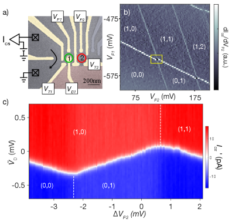
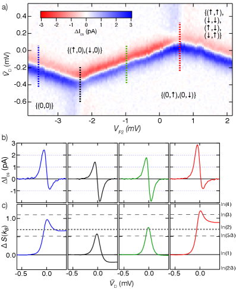
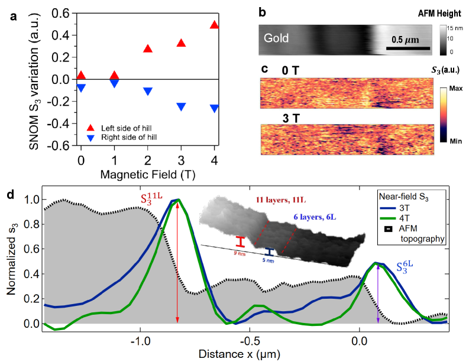

# ESR-STMによる単一分子スピンの遠隔電気的初期化

- 執筆日：2026-05-27
- 要旨：電子スピン共鳴走査型トンネル顕微鏡（ESR-STM）を用い、交換結合した二分子ペア（Fe-FePc）において一方の分子スピンを遠隔かつ全電気的に初期化することに成功した2026年の研究を軸に、単一スピン超高感度計測と制御技術の最前線を解説する。スピン偏極トンネル電流による角運動量移送の機構と交換相互作用の定量的役割を精査するとともに、量子ドットや走査型近接場光学顕微鏡で同時進行する「遠隔結合系の精密計測」という共通パラダイムとの接続を論じ、分子スピン量子ビットアーキテクチャへの波及を展望する。
- タグ：Measurement and Spectroscopy, Low-Dimensional Materials, Nanostructures, Magnons and Spin Dynamics, Sensing, STM/STS, Transport Measurements
- 注目論文：Greule et al. "Electrical Spin Pumping in Exchange-coupled Molecules" arXiv:2605.06450 (2026) [https://arxiv.org/abs/2605.06450]
- 参照論文数：7

---

## 1. 背景：なぜ今この話題か

量子情報処理の実用化に向けた競争が激化する中、単一電子スピンをコヒーレントに制御するという課題は、材料科学・ナノ物理・量子化学の交差点に位置する核心的な問いとなっている。超伝導量子ビットや閉じ込められたイオンが量子コンピュータとして先行する一方で、表面吸着分子のスピンは「原子精度で制御可能な量子メモリ」として独自の地位を占めつつある。分子は化学合成によって精密にスピン量子数を設計でき、有機骨格が金属基板からの軌道混成を抑制することで比較的長いコヒーレンス時間が期待できる。しかし、単一分子スピンを操作するためには、まず「どのような手法で量子状態を初期化するか」という根本的な問いを解決しなければならない。

従来の電子スピン共鳴（ESR）分光は、マイクロ波空洞を使ってアンサンブル平均のスピンを観測するものであり、単一スピンの選択的な読み出しや初期化には本質的に不向きであった。この壁を打ち破ったのが、2015年に登場したESR-STMである。走査型トンネル顕微鏡（STM）の原子分解能と高周波電場による磁気共鳴を組み合わせ、単一原子スピンの共鳴信号を電流変化として検出することに初めて成功したこの技術は、その後急速に発展し、コヒーレンス時間の測定やパルス制御によるラビ振動の観測にまで至っている。

近年の焦点は、単一スピンの読み出しから「複数スピン間の制御」へと移っている。量子ゲートを実現するためには、少なくとも二つのスピンを相互作用させ、一方の状態が他方に情報を伝播させる仕組みが必要だからである。表面上で隣接する分子や原子に働く交換相互作用は、この「スピン間通信路」の自然な候補であり、実際にSTMで交換結合の強さを空間マッピングする研究も進んでいた。しかし、「交換結合を積極的に利用して、離れた分子スピンを電気的に初期化する」というアイデアを実験的に実証した例はこれまで存在しなかった。2026年5月にWillkeグループが報告した論文（arXiv:2605.06450）は、まさにこのギャップを埋める仕事である。

---

## 2. 解決すべき課題

単一分子スピンを量子ビットとして機能させるためには、初期化・操作・読み出しという三段階をすべて高精度で実現する必要がある。本記事が扱う「初期化」に絞っても、少なくとも四つの本質的な問いが未解決であった。

第一の問いは、光学的手段を使わずにスピン状態を選択的に作り出せるかという点である。固体量子ビットの多くは光学的なスピンポンピングで初期化を行うが、表面上の単一分子へのレーザー照射は空間分解能に根本的な限界があり、STMの持つ原子精度を活かせない。全電気的手法、すなわちトンネル電流だけで特定のスピン状態に集団を押し込む方法が求められていた。この鍵となるのが「スピンポンピング」の概念である。スピン偏極した電子が分子へと注入され、スピン角運動量を移送することで熱平衡からの偏りを作り出せるはずだが、どの条件でどれほど効率よく機能するかは不明であった。

第二の問いは、多スピン系への拡張性である。単一スピンの初期化に成功したとして、その効果を交換結合経由で別分子へ「伝播」させるには何が必要か。交換相互作用は二スピン間の量子力学的なエンタングルメントを生み出すが、それはノイズ源にもなりうる。一方の分子でスピンポンピングを行ったとき、交換結合を通じて隣接分子のスピン集団はどう変化するのか。理論的には角運動量保存則によって移送が起こるはずだが、基板との結合や熱揺らぎによる散逸がどこまで効いてくるかは未知であった。

第三の問いは、遠隔制御の忠実度と定量化にかかわる。「遠隔」という言葉は、STMチップが直接接触していない分子を制御するという意味合いを持つ。チップは一方の分子（読み出し・ポンプユニット）に対してのみ電流を流し、もう一方の分子（ターゲット）には直接電流を流さない。このとき、ターゲットのスピン集団変化はどのくらいか、そしてそれが結合強度・電流方向・電流大きさのどれによってどう制御されるかを定量的に明らかにする必要があった。

第四の問いは、一般性に関するものである。Fe-FePcという特定の分子ペアで効果が見えたとしても、それが系固有の偶然なのか、広く適用可能な設計原理なのかを峻別しなければならない。より一般化するためには、機構の物理的な説明が実験と一致し、予測能力を持つ理論モデルが必要である。これはスピントロニクス研究全体の問いでもある。スピン電流の概念がGMRや磁気トンネル接合で実用化されたように、単分子スピン系での「スピン電流エンジニアリング」が設計論として成立するかが問われている。

---

## 3. 注目論文の仮説と成果

Greuleらの論文（arXiv:2605.06450）は、Fe原子とFePc（鉄フタロシアニン）分子という両者ともにS=1/2を持つ分子ペアを対象系として選択し、ESR-STM計測を通じて上記の問いに正面から向き合った研究である。

対象材料の観点から見ると、Fe原子はMgO薄膜上に吸着すると周囲の結晶場により有効スピン1/2の状態に置かれ、MgOの絶縁性が金属基板（Ag）との軌道混成を抑制してT1（縦緩和時間）を数十ミリ秒のオーダーまで延ばすことが先行研究で知られていた。FePcは有機配位子が鉄の磁気モーメントを安定化させるよく知られた単分子磁石の一種であり、やはりS=1/2として振る舞う。この二種を隣接配置することで、両者の間に交換相互作用Jが生じる。ハイゼンベルク型ハミルトニアンで書けば

$$H = -J \, \mathbf{S}_{\mathrm{Fe}} \cdot \mathbf{S}_{\mathrm{FePc}} + g\mu_{\mathrm{B}} B \left( S_{\mathrm{Fe}}^z + S_{\mathrm{FePc}}^z \right)$$

となり、前半が交換結合項、後半が外部磁場Bによるゼーマン項である。Jの正負で強磁性/反強磁性結合が切り替わり、分子間距離によって連続的に変化する。ここでgはランデのg因子、μBはボーア磁子である。

実験アプローチとして、ESR-STM測定では磁気的に偏極したSTMチップ（Fe/Wなど）の先端からスピン偏極した電子を分子へ注入する。DC成分のトンネル電流にRF電圧を重畳し、RFの周波数がゼーマン分裂ΔE = gμBBと一致するところで共鳴吸収が起こり、チップに流れるDC電流の一部（ミキシング信号）が変化する。この検出方式によって、外部磁場と超高真空・低温（数百mK〜数K）環境のもとで単一スピンのESRスペクトルを取得できる。

本論文の核心となる実験では、チップをFe分子の直上に位置させてスピン偏極電流を流し、Feのスピン集団を熱平衡から意図的にずらした（スピンポンプ状態を生成した）。このとき、隣接するFePcのESRスペクトルを同時にモニタリングすると、FePcのスピン集団もまた変化していた。具体的には、チップからの電流方向（電圧の正負）を切り替えることでFeのスピン集団が↑優位か↓優位かを制御でき、それに対応してFePcのスピン集団が逆方向に変化することを確認した。この「逆方向変化」は、交換相互作用が反強磁性的（J < 0）な場合に角運動量保存が予測する応答と一致している。

主要結果を整理すると、第一に電流方向によるリモートスピン状態の制御が実証された。電流を正方向に流すとFeスピンは↑へポンプされ、交換結合を通じてFePcは↓へと移行した。逆方向の電流ではこの関係が反転した。第二に、電流の大きさを増すほどFeのポンプ効率が高まり、遠隔FePcスピンの偏極度も増大した。第三に、Fe-FePcの分子間距離を変えると交換結合の強さJが変化し、それに応じてFePcスピン集団の変化量がJに比例して変わることが確認された。これらの結果は、レート方程式モデルで定量的に再現できる。スピン緩和時間T1とポンプレートΓpumpを用いた定常状態のスピン集団方程式

$$0 = \Gamma_{\mathrm{pump}}\left(n_\downarrow - n_\uparrow\right) - \frac{n_\uparrow - n_\uparrow^{(0)}}{T_1}$$

から定常偏極率を計算すると、実験値と良好に一致した。ここでn↑は↑スピン集団、n↑⁽⁰⁾は熱平衡値、Γpumpは電流と交換結合に依存するポンプレートである。定常偏極率Pは

$$P = \frac{n_\uparrow - n_\downarrow}{n_\uparrow + n_\downarrow} \propto \frac{\Gamma_{\mathrm{pump}} T_1}{1 + 2\Gamma_{\mathrm{pump}} T_1}$$

と書けるため、電流を大きくしてΓpumpを増やすほどPは飽和値1に漸近する。この飽和特性はスピントロニクス系のスピンポンプと共通の現象論であり、分子系と固体スピントロニクス系の物理的連続性を示している。

論文の新規性は、遠隔かつ全電気的な単一分子スピン初期化を初めて実現した点、および一方の分子がセンサーとポンプの二役を兼ねることができることを実証した点にある。従来のESR-STM研究でも個別分子のスピンポンピングは報告されていたが、その効果を交換結合で別分子へ伝播させるというコンセプトは全く新しい。一方、限界として挙げられるのは測定が極低温・超高真空に限られること、および今回のFe-FePcという特定系以外での実証がまだない点である。

---

## 4. 研究史における位置づけ

ESR-STMの系譜をたどると、2015年のBaumannらによるScience掲載論文が出発点となる。彼らは磁気的に被覆したW先端を使い、MgO/Ag(001)表面上に吸着したFe原子において電流変化を通じて単一原子のESRスペクトルを取得することに初めて成功した。それまでのSP-STM（スピン偏極STM）は時間平均された磁気コントラストしか与えず、スピンの量子状態そのものにはアクセスできなかったが、ESR-STMはその壁を破った。

その後2018年には、Willkeら（本記事の注目論文と同じグループ）がコヒーレンス時間T2の測定を実現し、単一原子スピンのT2が数十ナノ秒に達することを示した。この値は室温のアンサンブルESRと比べると短いが、STM環境の各種ノイズを考えると驚異的な成果である。続く2017〜2019年には、Yangら、Paulら、Choiらが原子ペアの交換相互作用を空間マッピングし、結合強度の分子間距離依存性を明らかにした。さらに2019年のYangらのパルス制御実験はラビ振動の観測を達成し、コヒーレント操作の原理実証へと至った。

これら一連の成果を踏まえると、2605.06450はESR-STM研究の「制御対象」を単一スピンから「結合スピン系」へと発展させた重要なステップに位置づけられる。読み出しと初期化という操作を同一の実験セットアップで一つの分子上に集約し、その効果を交換結合経由で隣接分子へ伝播させるという方針は、スピン量子ビット連鎖の基礎実証とも言える。

比較の観点では、固体量子ビット研究の他分野も「二体系における遠隔制御・計測」へと向かっていることがわかる。2026年5月に報告されたFolkグループの量子ドット実験（arXiv:2605.03876）は、GaAs二量子ドット系において容量結合を通じた「遠隔エントロピー測定」を実現した。マクスウェル関係式dS/dN = -dμ/dTを利用し、一方のドットの電荷測定から二ドット系全体の熱力学的エントロピーを読み出すという手法は、「局所測定で結合系の非局所情報を取り出す」という思想を体現している。同月にPiquardらが報告したコンド系の実験（arXiv:2605.00669）では、金属-半導体ハイブリッド量子回路において島の電荷測定とマクスウェル関係式によって非アーベリアンエニオンに対応する分数エントロピーΔS = kB ln(d)を実験的に証拠づけた。スピン系ではなく電荷自由度を扱う系だが、「カップルした量子多体系を最小侵襲で計測する」という共通のパラダイムはESR-STM実験と深く共鳴している。

---

## 5. どの解釈が最も妥当か

本論文の最も重要な主張、すなわち「交換相互作用を通じた角運動量移送がFePcの遠隔スピン初期化を担う」というモデルは、実験データとの定量的一致という強い根拠を持つ。ここで競合しうる代替解釈と各解釈の証拠的強さを整理する。

第一に、基板を経由するRKKY（ルデルマン-キッテル-菊池-吉田）相互作用が原因であるという可能性が考えられる。RKKY相互作用は金属基板中の伝導電子を媒介とした間接交換であり、分子間距離rに応じてcos(2kFr)/r³の形で振動する。しかし本実験では絶縁性MgO薄膜を介したシステムを使っており、MgO層がRKKY結合を大幅に抑制することが先行研究から知られている。また、交換結合Jの距離依存性が指数関数的な直接交換のプロファイルと一致し、かつFePcのスピン変化量がJに線形比例することから、RKKY的な長距離振動機構よりも短距離の直接交換が支配的であると結論づけられる。

第二に、チップの電場や磁場によるFePcへの直接影響という解釈が考えられる。すなわち、チップからの漏れ磁場がFePcを直接励起しているという可能性である。論文はチップとFePcの間の距離を変えた対照実験を行い、チップが遠位にある場合はFePcのスピン集団変化がほぼ消失することを確認している。これは直接的なチップ-FePc相互作用ではなく、Fe原子を経由した間接経路が効いていることを示す。

まだ弱い結論として挙げられるのは、Jの符号（強磁性か反強磁性か）の絶対的な決定に関する不確定性である。遠隔FePcのスピン変化方向から間接的にJの符号を推定することはできるが、直接的なスペクトル分裂（二重共鳴のエネルギー分裂）の観測によってより明確に確認することが望ましい。またレート方程式モデルは現象論的であり、ポンプレートΓpumpの微視的な計算（第一原理スピン移送解析）はまだ行われていない。

2605.00669（分数エントロピー実験）との対比は特に示唆的である。コンド系でのエントロピー測定は電荷センサーを使ったマクスウェル関係式という全く異なる手法を用いるが、どちらも「結合した量子系の状態を一方の端から計測・制御する」という点で共通している。コンド系では測定対象（エニオンのエントロピー）が電荷に現れるのに対し、ESR-STM系では測定対象（スピン偏極）がトンネルコンダクタンスの変化に現れる。「何が『信号』として現れるか」が異なるだけで、両者は「局所結合センサーを使った遠隔状態の読み出し」という同一の枠組みに収まる。この視点の収束は偶然ではなく、量子多体系の計測論の深い統一性を示唆している。

---

## 6. 何が一般化できるか

本研究で確立された「ポンプ分子＋センサー分子」という枠組みは、他の分子系・他の基板・他の量子プラットフォームへの一般化可能性を強く示唆する。

分子系の観点では、Fe-FePcはどちらもS=1/2という最もシンプルなスピン系であり、多段階のスピン（S=1やS=3/2）を持つ他の単分子磁石に対しても同様の実験が原理的には可能である。また、有機ラジカル分子や窒素空孔（NV）センターを組み込んだ分子など、化学合成で精密にスピンを設計した分子への応用が期待される。さらに、分子ペアから三分子・四分子へと鎖を延ばしていくことで、「スピン情報が交換結合チェーンを伝播する」という一次元量子スピン鎖の動的制御実験も視野に入る。各スピンサイトをSTMで独立に読み出しながら、チェーンの一端から初期化パルスを与え伝播をリアルタイム観測するという実験は、量子スピン輸送（quantum spin transport）の直接的な実証になりうる。

異なるプラットフォームとの接続として、GaAsやSi量子ドット系との比較が重要である。2605.03876の量子ドット実験では、二ドット系の容量結合を利用してエントロピー測定を実現した。電荷センサー（一つ目のドット）が他のドット（二つ目）のエントロピー変化を感知するという構造は、ESR-STMにおけるFe（センサー・ポンプ）とFePc（ターゲット）という非対称ペアと概念的に類比できる。一方の系のパラメータを変えると他方のシグナルが応答するという「連成感知」の概念は、量子センシング・量子コンピューティング両面で汎用的な設計原理となりうる。

近接場光学を用いたアプローチ（arXiv:2605.04883）との接続も重要である。Haeuser らは極低温の磁気赤外線sSNOM（散乱型走査近接場光学顕微鏡）を使い、トポロジカル絶縁体表面のスピン偏極ヘリカル端状態をサブ10 nmスケールで実空間可視化した。ESR-STMが電流という電子的な探針を使うのに対し、sSNOMは赤外光という光子的探針を使う。両者は全く異なる手法だが、「スピン偏極状態をナノスケールで空間分解する」という目標を共有している。磁場印加によって端状態の近接場コンダクタンスが変化するという結果は、光学応答にスピン自由度が鮮明に現れることを示しており、ESR-STMとsSNOMの相補的な連携、例えば同一試料をSTMで制御し光学で観測するというマルチモーダル計測、の可能性を開く。

---

## 7. 基礎から理解する

### 走査型トンネル顕微鏡（STM）の基礎

走査型トンネル顕微鏡（STM）は、先端が原子レベルに尖った金属製のチップを導電性試料の表面に1 nm以下まで近づけ、その間に流れるトンネル電流を計測する顕微鏡法である。量子力学的なトンネル効果によると、電子はエネルギー障壁の高さφを超えられなくても、障壁の「下を」確率的にすり抜けることができる。チップと試料の間の真空ギャップd（通常0.3〜1 nm）に対して、トンネル電流Iは

$$I \propto e^{-2\kappa d}, \quad \kappa = \sqrt{\frac{2m_e\phi}{\hbar^2}}$$

と指数関数的に依存する。ここでmeは電子質量、ℏはディラック定数（プランク定数h÷2π）である。φが数eV（仕事関数程度）のとき、κ ≈ 10 nm⁻¹程度となり、dが0.1 nm変化するだけで電流は約e²（≈7.4倍）変わる。この極めて強い距離依存性が、STMの高い垂直方向分解能をもたらす。チップ先端の最先端原子一個だけが試料と電気的に強く相互作用するため、横方向（xy）にも原子分解能が得られる。通常のSTMはトンネル電流を一定に保つようにz方向のチップ高さをフィードバック制御し、その高さマップが試料の局所電子状態密度（DOS）を反映した像を与える。

### スピン偏極STM（SP-STM）

通常のSTMは電子のスピンを区別しないが、チップ先端を磁性材料（Feバルク、Fe/Wコーティング、あるいはCr/Wコーティング）で作製すると、チップの磁気量子化軸方向に沿ったスピン成分だけが優先的にトンネルを担うようになる。スピン依存トンネルの物理的根拠は、スピン偏極した状態密度に基づくTerroff-Hamann近似の拡張にある。コンダクタンスGは

$$G \propto \rho_{\mathrm{tip}}^\uparrow \rho_{\mathrm{sample}}^\uparrow + \rho_{\mathrm{tip}}^\downarrow \rho_{\mathrm{sample}}^\downarrow + (\rho_{\mathrm{tip}}^\uparrow \rho_{\mathrm{sample}}^\uparrow - \rho_{\mathrm{tip}}^\downarrow \rho_{\mathrm{sample}}^\downarrow)\cos\theta$$

と書け、最後の項がチップ磁化と試料スピン方向のなす角θに依存する。θ = 0（平行）で最大、θ = π（反平行）で最小となる。これを利用すると、チップをx方向に走査しながら電流変化を観測することで、試料表面の磁気ドメイン構造やスピン偏極の空間分布をナノスケールで可視化できる。しかし、SP-STMが測定するのは時間平均のスピン方向であり、スピンが急速に熱揺らぎしている場合（単一スピン系では頻繁）には直接的な量子状態情報が消えてしまう。これがESR-STM登場の動機の一つである。

### 電子スピン共鳴（ESR）の基礎

電子は固有の角運動量（スピン）ℏ/2を持ち、外部磁場B（z方向とする）のもとでエネルギーは

$$E = \pm \frac{1}{2} g \mu_\mathrm{B} B$$

と二分割する（ゼーマン効果）。ここで「+」が↑（エネルギー上位）、「−」が↓（エネルギー下位）で、g因子（フリー電子でg ≈ 2.002）とボーア磁子μB = eℏ/(2me) ≈ 9.274 × 10⁻²⁴ J/Tが決まる。ゼーマン分裂のエネルギー差はΔE = gμBBであり、B = 1 Tでは約28 GHzのマイクロ波に対応する（1 T → 28 GHz）。

熱平衡ではボルツマン分布に従い下準位が多く占有されている（低温では↓スピンが優先）。ここで外部から振動磁場（RF電磁波）をB方向に垂直に印加する。RF周波数fがゼーマン周波数fL = gμBB/hに一致する条件

$$hf = g\mu_\mathrm{B} B$$

（これをラーモア条件またはESR条件という）を満たすと、スピンが上下準位の間を共鳴的に遷移する。この遷移を「電子スピン共鳴（ESR）」と呼ぶ。物理的には、RF磁場がスピンの歳差運動（ラーモア歳差）に乗っかってトルクを与えることで、スピン磁化が縦（z）から横（xy）方向へ傾く。

スピン集団の時間発展はブロッホ方程式で記述される。縦磁化Mzと横磁化Mxyの方程式は

$$\frac{dM_z}{dt} = \frac{M_0 - M_z}{T_1}, \quad \frac{dM_{xy}}{dt} = -\frac{M_{xy}}{T_2} + \omega_\mathrm{L} M_{xy}$$

のように書け（簡略形）、T1は縦緩和時間（スピン-格子緩和）、T2は横緩和時間（コヒーレンス時間）を表す。T1はスピンが熱浴と相互作用してエネルギーを交換し、熱平衡集団に戻る時定数であり、表面吸着原子では基板フォノンや伝導電子との結合で決まる。T2はスピン間の位相コヒーレンスが失われる特性時間であり、常にT2 ≤ 2T1の関係が成立する。ESR線幅はT2の逆数に比例する（Δν ∝ 1/T2）ため、T2の長さが測定精度の鍵を握る。

### ESR-STMの動作原理

ESR-STMは、SP-STMの「スピン偏極電流」とESRの「RF共鳴」を組み合わせた手法である。STMのチップとサンプル間のバイアス電圧にRF成分δV cos(2πft)を重畳する。スピン偏極したチップが分子に流す電流は、スピン状態によって僅かに異なる。RF周波数fが分子のESR周波数（hf = gμBB）に一致すると、RF電場がスピンをラビ振動（Rabi oscillation）させる。ラビ振動の角周波数ΩRはRFの電場強度（電圧振幅δV）に比例する：

$$\Omega_R = \frac{g\mu_\mathrm{B} \delta B_\perp}{\hbar} \approx \frac{g\mu_\mathrm{B} \cdot (\delta V / d)}{\hbar}$$

（ここでδB⊥はRF電圧が作る実効的な横方向磁場成分）。このスピンの高速反転は時間平均されたDCトンネル電流の変化として現れる。正確には、RF駆動下の定常状態でのスピン集団変化が電流変化ΔIとして検出される。これを「スピン混合信号（mixing signal）」と呼ぶ。

ESR-STMの信号はRF周波数に対するΔIのプロファイルとして得られ、共鳴周波数fLにピークを持つローレンツ曲線を示す。ピーク幅からT2が、ピーク高さとRF電力の関係からT1が抽出できる。超高真空・低温（数百mK〜数K）の環境では、基板フォノンとの結合が著しく減少してT1が極めて長くなる（ミリ秒〜秒オーダー）ため、精密な集団制御が可能になる。

### スピンポンピングと角運動量移送

スピンポンピングとは、スピン偏極した電流（あるいは光）を物質へ注入することで、スピン集団を熱平衡から意図的にずらす操作である。ESR-STMでは、チップからのスピン偏極電流がDCバイアスを通じて分子へ注入される。電流方向（バイアスの正負）を変えると、注入される電子のスピン偏極方向が反転する。スピン↑を多く含む電流を注入すれば分子の↑集団が増え、↓電流なら↓集団が増える。

定常状態でのスピン集団n↑は、ポンプによる流入と緩和による熱平衡への回復のバランスで決まる：

$$\frac{dn_\uparrow}{dt} = 0 = \Gamma_{\uparrow\leftarrow\downarrow} n_\downarrow - \Gamma_{\downarrow\leftarrow\uparrow} n_\uparrow - \frac{n_\uparrow - n_\uparrow^{(0)}}{T_1}$$

ここでΓ↑←↓はスピン反転（↓→↑）レートで電流の大きさとスピン偏極率に比例し、n↑⁽⁰⁾は熱平衡集団（ボルツマン分布）である。電流を大きくするほどポンプ効率Γpumpが高まり、定常偏極率P = (n↑ − n↓)/(n↑ + n↓)は飽和値へ漸近する。

交換結合を介した角運動量移送のメカニズムは次のように理解できる。ハイゼンベルク相互作用H = -J S1·S2において、S1（Fe）がポンプされて↑優位状態になったとき、ハミルトニアンはS2（FePc）をS1と反平行方向（J < 0なら）に向くよう「引き戻す」力を及ぼす。量子力学的には交換結合がスピン反転フロップ項(S1+S2- + S1-S2+)/2を含み、これがFeのスピン反転とFePcのスピン反転を連動させる（角運動量保存）。このフロップ過程のレートはJ²に比例するため、Jが大きいほどFePcへの角運動量移送が速くなる。

---

## 8. 専門用語の解説

ESR-STM（電子スピン共鳴走査型トンネル顕微鏡）は、STMの原子分解能とESRのスピン選択性を融合した計測技術である。スピン偏極したSTM先端からRF重畳バイアスを印加し、単一原子・単一分子のESR信号をトンネル電流変化として検出する。2015年のBaumannらの先駆的実験以来、単一スピン読み出し・コヒーレンス時間測定・ラビ振動制御へと急速に発展してきた。本論文においては、Fe-FePcペアにおける遠隔スピン初期化のプラットフォームとして機能している。

スピンポンピング（spin pumping）は、スピン偏極した電流（あるいは光）を物質へ注入することで、スピン集団を熱平衡から意図的にずらす操作全般を指す。本研究では、スピン偏極STMチップからのDC電流がFeスピンをポンプし、電流方向の切り替えでポンプ先（↑か↓か）を制御する。スピントロニクス分野では通常マクロな磁性体での磁化励起を指すが、ここでは単一分子スピンへの応用という新しい文脈で使われている。

交換相互作用（exchange interaction）は二電子系において電子の交換対称性（パウリ原理）と電子間クーロン斥力が組み合わさって生じる有効磁気相互作用で、H = -J S1·S2で記述される。Jが正なら強磁性結合（平行状態が安定）、負なら反強磁性結合（反平行が安定）である。本研究では、この結合がFe（ポンプ側）からFePc（ターゲット側）への角運動量移送のチャネルとして機能し、Jの大きさが遠隔スピン制御の効率を直接決める。

スピン偏極電流は磁気的に偏極したSTMチップから流れる電流で、チップのスピン多数派キャリアが選択的にトンネルすることで試料にスピン角運動量を注入する。電流方向（バイアスの正負）を逆転するとスピン偏極方向が反転し、ポンプ先が↑から↓へ切り替わる。これが「電気的なスピン初期化の切り替え」を可能にしている主要な自由度である。

ゼーマン効果（Zeeman effect）は外部磁場Bの中でスピン準位がエネルギー的に分裂する現象である。電子スピン（S = 1/2）の場合、分裂幅ΔE = gμBBは0.1 T程度の磁場で数GHzのRF波に対応する。ESR-STMはこの分裂をRF共鳴として検出・制御し、分裂幅からg因子を精密に測定できる。異なる分子環境では配位子場効果やスピン軌道結合がgを実効値として変化させるため、ESRスペクトルは分子の電子構造の精密なフィンガープリントを与える。

縦緩和時間T1（spin-lattice relaxation time）は、スピン集団が外部環境（フォノン・基板電子など）との熱接触によって熱平衡分布へ戻る特性時間である。T1が長いほどスピン情報が長く保持でき、量子ビットとしての有用性が高い。MgO/Ag上のFeではT1が数十ms以上に達することが先行研究で判明しており、この長いT1がスピンポンプ状態の定常維持を可能にしている。T1はフォノンとの結合・伝導電子の散乱・近傍磁性不純物などのデコヒーレンス源に敏感であるため、材料設計による制御が量子ビット応用の要となる。

横緩和時間T2（spin decoherence time）は、スピンの量子位相のコヒーレンスが失われる時間スケールである。T2以内ではスピンが「↑と↓の重ね合わせ」として振る舞い、量子干渉効果が現れる。量子ゲート操作はT2以内に完了する必要があり、T2の延長が量子情報処理の重要課題となっている。T2 ≤ 2T1の関係から、まずT1を延ばすことがT2延長の必要条件であり、その上で核スピンノイズや電荷揺らぎなどのホモジニアス/インホモジニアス広がりを抑制することが求められる。

トンネル電流は真空（または絶縁体）の障壁を電子が量子力学的にすり抜けることで流れる電流で、障壁幅に対して指数的に敏感である。STMではチップと試料の間のトンネル電流（通常pA〜nAオーダー）を計測する。ESR-STMでは、RF励起によるスピン状態変化がトンネルコンダクタンスGの微小変化（DC信号）として現れ、スピン状態の読み出しが実現される。この「スピン状態→電流変化」という変換が、光子・磁場センサーを必要とせず電気信号だけで単一スピンを検出できることの根拠である。

角運動量移送（angular momentum transfer）はスピン電流がもたらす磁化変化の駆動力で、量子力学的には角運動量保存則から直接導かれる。電子はスピン角運動量ℏ/2を持ち、スピン偏極した電流は流れとともに角運動量を輸送する。本研究ではFeへのポンプが交換相互作用を経由してFePcへ角運動量を伝達し、FePcのスピン集団を変化させる。このプロセスの効率はスピン移送トルク理論で定量化でき、磁気トンネル接合のスピン移送磁化反転（STT-MRAM）の分子版とも解釈できる。

ラーモア歳差運動（Larmor precession）は磁場中での磁気モーメントの歳差運動であり、角周波数ωL = gμBB/ℏで回転する。ESRはRF磁場の周波数がωLに一致するとき（共鳴条件）に起こり、このときスピンが上下準位の間を効率よく遷移する。パルスESR実験では、精密に制御されたRFパルスでスピンを任意の向きに傾けた後、T2の時定数で位相が崩壊していく様子を観測する（スピンエコー法）。これがコヒーレンス時間T2の測定に使われる基本的な実験プロトコルである。

---

## 9. 将来展望

本研究が確立した「遠隔スピン初期化」のコンセプトは、短・中・長期のそれぞれのタイムスケールで異なる方向への展開を示唆している。短期的に最も期待されるのは、Fe-FePcペアの成果をより長いスピン鎖へと拡張することである。三分子・四分子チェーンにおいてポンプした角運動量が段階的に伝播していくか、あるいはどこかで散逸が支配的になるかを追うことで、交換結合を媒介としたスピン情報の伝送距離限界が明らかになる。また、異なる分子種（有機ラジカル分子や異核多スピン錯体）や異なる基板上（h-BN/Ir、Al2O3/NiAl）での検証が間もなく進むと見られており、本機構が系に固有のものか普遍的な設計原理であるかが判明する。さらに、T1とT2の両方を分子ペアで同時計測し、遠隔スピンの初期化後のコヒーレンス保持を定量化する実験が次の焦点になるだろう。2605.03876の量子ドット実験が示したように、遠隔結合系の精密計測技術の水準は現在急速に向上しており、分子スピン系もこの波に乗っている。

中期的には、二つの交換結合したスピン量子ビット間での量子ゲート操作の実証が最大の目標となる。一方のスピンを制御量子ビット（Cビット）、他方を標的量子ビット（Tビット）として制御NOTゲートに相当する条件付きスピン反転を実現できれば、分子ベースの二量子ビット演算が原理実証される。ESR-STMのパルス操作技術と合わせると、ベル状態（量子もつれ状態）の生成・検証も射程に入る。この実現のためにはT2の延長（デコヒーレンス抑制）と繰り返し初期化効率の向上が不可欠であり、分子設計・基板選択・チップ材料の三軸でのエンジニアリングが並走する。2605.00669が示した「分数エントロピー測定」のような熱力学的アプローチは、量子状態の非侵襲的キャラクタリゼーションとして分子スピン系にも取り込まれる可能性がある。

長期的には、表面吸着分子スピンアレイによる小規模量子プロセッサの実証という野心的な目標が視野に入る。STMの原子操作技術は数十個の分子を精密配置する能力をすでに持っており、各分子のスピンを独立に読み書きできれば、分子量子ビットの二次元配列として機能しうる。2605.04883が示したように、sSNOMのような光学手法がサブ10 nmスピン情報を並列取得できるまで成熟すれば、ESR-STMの局所制御とsSNOMの広域観察を組み合わせたハイブリッドアーキテクチャが現実味を帯びる。一方で、室温・大気圧での動作という制約は当面残り続ける。分子をナノカプセル内に封じ込めて振動浴から切り離す手法や、スピン-格子結合を設計で最小化する分子合成戦略が、この分野の最終的な実用化への核心課題となるだろう。

---

## 参考論文一覧

1. Greule P., Huang W., Au-Yeung K.H., Stark M., Schwenk J., Sürgers C., Wernsdorfer W., Willke P. "Electrical Spin Pumping in Exchange-coupled Molecules" arXiv:2605.06450 (2026) [[リンク](https://arxiv.org/abs/2605.06450)] — Fe-FePcペアにおいてESR-STMによる遠隔全電気的スピン初期化を世界初実証した本記事の注目論文。

2. Baumann S., Paul W., Choi T., Lutz C.P., Ardavan A., Heinrich A.J. "Electron paramagnetic resonance of individual atoms constructed on a surface" Science 350, 417 (2015) — MgO/Ag表面上のFe原子でESR-STMを世界で初めて実現した先駆的論文。

3. Willke P., Paul W., Natterer F.D., Yang K., Bae Y., Choi T., et al. "Probing quantum coherence in single-atom electron spin resonance" Science Advances 4, eaaq1543 (2018) — ESR-STMで単一原子スピンのコヒーレンス時間T2を定量測定することに成功した論文。

4. Yang K., et al. "Engineering the Eigenstates of Coupled Spin-1/2 Atoms on a Surface" Physical Review Letters 119, 227206 (2017) — STM上の原子ペアの交換結合を制御し、固有状態のエンジニアリングを行った論文。

5. Sheekey O., Child T., Cornick E., Fallahi S., Gardner G.C., Manfra M.J., Sela E., Kleeorin Y., Meir Y., Lüscher S., Folk J. "Remote entropy measurement in coupled quantum dots" arXiv:2605.03876 (2026) [[リンク](https://arxiv.org/abs/2605.03876)] — GaAs二量子ドット系でマクスウェル関係式に基づく遠隔エントロピー測定を実現し、局所チャージ測定から系全体の熱力学情報を取り出せることを示した論文。

6. Piquard C., Veillon A., Sato Y., Zanichelli F., Aassime A., Cavanna A., Gennser U., Mitchell A.K., Anthore A., Pierre F. "Experimental Evidence of Fractional Entropy in Critical Kondo Systems" arXiv:2605.00669 (2026) [[リンク](https://arxiv.org/abs/2605.00669)] — 金属-半導体ハイブリッド量子回路でコンド臨界点のエニオン的分数エントロピーを電荷センサーとマクスウェル関係式で測定した論文。CC BY-NC-ND 4.0.

7. Haeuser S., Kim R.H.J., Wang L.L., Koschny T., Lozano P.M., Gu G., Chan R.K., Park J., Mootz M., Luo L., Li Q., Wang J. "Magnetic Brightening and Nanoscale Imaging of Spin-Polarized Helical Edge Modes" arXiv:2605.04883 (2026) [[リンク](https://arxiv.org/abs/2605.04883)] — 極低温磁気赤外線sSNOMを使い、トポロジカル絶縁体のスピン偏極ヘリカル端状態をサブ10 nmスケールで実空間可視化した論文。CC BY 4.0.

---

## 図一覧（ライセンス情報）

**図1（arXiv:2605.03876より、CC BY 4.0）**

*GaAs二量子ドット系における遠隔エントロピー測定の実験配置。容量結合した二つの量子ドットのうち一方の電荷測定を通じて、系全体のエントロピー変化を読み出す構成。ESR-STMのFe-FePcペアにおける「センサー＋ターゲット」の非対称ペアと概念的に類比できる。（Sheekey et al., arXiv:2605.03876, CC BY 4.0）*

**図2（arXiv:2605.03876より、CC BY 4.0）**

*マクスウェル関係式に基づくエントロピー測定の実験結果。弱結合領域と強結合領域の両方でエントロピー変化が定量的に再現された。（Sheekey et al., arXiv:2605.03876, CC BY 4.0）*

**図3（arXiv:2605.00669より、CC BY-NC-ND 4.0）**

*チャージ・コンド量子回路の概念図。金属島を疑似スピンとしてコンド効果を模擬し、2チャネル・3チャネルのコンド臨界点を実現する。隣接したセンサーQPCが非侵襲的電荷測定を担い、マクスウェル関係式でエントロピーを測定する。（Piquard et al., arXiv:2605.00669, CC BY-NC-ND 4.0）*

**図4（arXiv:2605.00669より、CC BY-NC-ND 4.0）**

*コンド臨界点における分数エントロピーの実測値。2チャネルコンドではΔS = kB ln(√2)（マヨラナゼロモードに相当）、3チャネルではΔS = kB ln((1+√5)/2)（フィボナッチエニオンに相当）の値が観測された。（Piquard et al., arXiv:2605.00669, CC BY-NC-ND 4.0）*

**図5（arXiv:2605.04883より、CC BY 4.0）**

*極低温磁気赤外線sSNOMを用いたトポロジカル絶縁体のスピン偏極ヘリカルエッジ状態の実空間像。磁場印加により端状態の近接場コンダクタンスが増大し、10 nm以下のスケールでスピン偏極した端状態が可視化されている。ESR-STMとは異なる光学的手法でスピン偏極をナノスケール分解した例。（Haeuser et al., arXiv:2605.04883, CC BY 4.0）*
