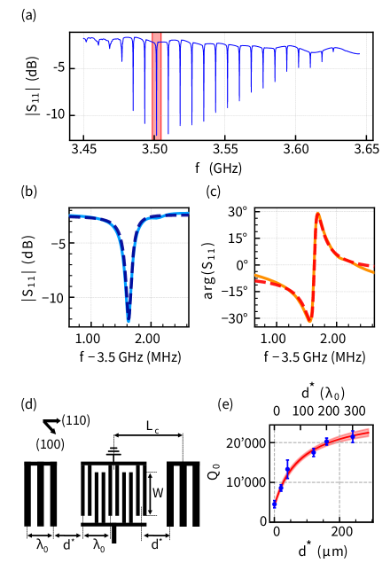
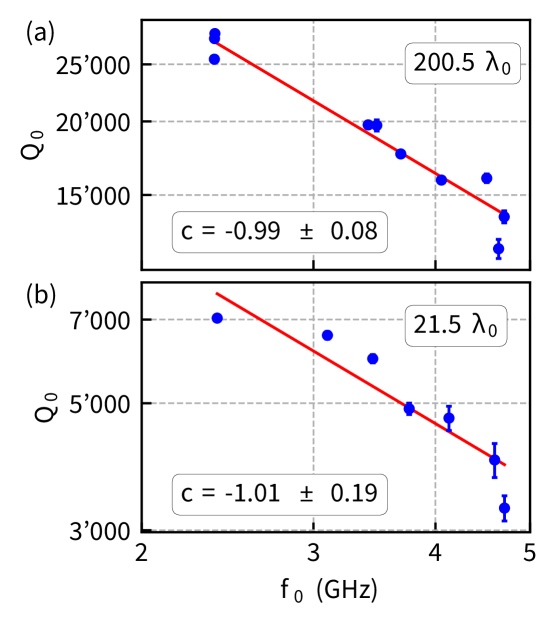
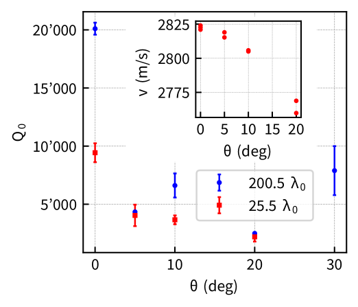
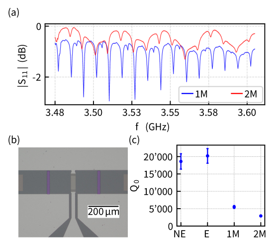

# GaAs上の低温高Q値表面弾性波共振器 — 量子音響プラットフォームへの設計指針

- 執筆日: 2026-05-27
- 要旨: GaAs基板上の表面弾性波（SAW）共振器をGHz帯・極低温で系統的に測定し、Q値28,000を達成した研究を核に、量子音響学に向けたSAWデバイスの物理と設計指針を概説する。キャビティ長・波長・結晶方位・メサステップという4つの設計パラメータを系統的に変化させることで、損失機構を解明し、GaAs系ハイブリッド量子デバイスへの展開を論じる。
- タグ: Devices and Functional Materials; Low-Temperature Properties; Nonlinear Response; Transport Measurements
- 注目論文: [High-Q cryogenic surface acoustic wave resonators in the GHz range](https://arxiv.org/abs/2605.02722)（arXiv:2605.02722）
- 参照論文数: 8

---

## 1. 背景：なぜ今この話題か

量子情報処理の研究は、超伝導量子ビット・半導体スピン量子ビット・光子系など複数のプラットフォームが並走する時代を迎えている。これらを「量子インターフェース」でつなぎ、それぞれの長所を活かしたハイブリッド量子システムを実現しようとする試みが、近年急速に進んでいる。そのような文脈で、音響フォノンを量子情報の媒体として使う「量子音響学（quantum acoustics）」が注目を集めている。フォノンの伝搬速度は電磁波の約10万分の1であるため、同一周波数ならば波長が格段に短く、マイクロメートルスケルのチップ上に共振器を集積できる。この「小型性」と「長いコヒーレンス時間」の組み合わせが、量子音響学を魅力的にしている物理的根拠である。

表面弾性波（Surface Acoustic Wave; SAW）デバイスは、RF通信フィルタや発振器として長年にわたって産業界で使われてきた成熟技術である。スマートフォン一台に数十個のSAWフィルタが搭載されているほど普及している。SAWはフォノンの一種であり、固体表面に沿って伝搬し、その振幅は表面から1波長程度の深さで指数関数的に減衰する。GHz帯では波長が数百nmから数μmに達し、量子ドットや超伝導回路と同じスケールに収まる。これにより、フォノンと電子・光子の間の強結合が原理的に可能になる。

しかし古典的なRF応用で培われた設計指針は、GHz帯・極低温という量子技術に必要な動作条件には必ずしも適用できない。低温・低パワー領域では、表面や電極に存在するアモルファス欠陥が「二準位系（Two-Level System; TLS）」として振る舞い、フォノンを吸収する損失機構として支配的になる。また、室温とは異なる弾性定数・圧電定数のもとでの設計最適化も必要となる。さらに量子デバイスとの集積化のためには、ゲート電極やメサ構造などの付加構造がSAW共振器に与える影響も定量的に理解しなければならない。このような課題群が、量子音響プラットフォームとしてのSAW研究を現在急速に推進させている根本的な動機である。

特にGaAs（ガリウムヒ素）は、量子デバイス基板として独特の優位性を持つ。高移動度二次元電子ガス、スピン量子ビット、単光子エミッタ（量子ドット）、超伝導マイクロ波共振器など、これまでに実績のある量子素子の多くがGaAs上で実現されている。SAWがこれらと統合されれば、単一電子移送やスピン-フォノン結合を通じた量子情報処理の新しい経路が拓ける。ところがGaAs上のSAW共振器の極低温・高周波数での性能は、これまで体系的に調べられてこなかった。この空白を埋めることが、注目論文の動機となっている。

## 2. 解決すべき課題

### 損失機構の多様性と低温における支配的メカニズム

SAW共振器のQ値（品質因数）を向上させる上で最大の障壁となるのが、GHz帯・極低温における多様な損失チャンネルである。古典的なRF動作では、電極の導電損失・音響放射損失・拡散損失が主要な損失であり、これらは設計パラメータの最適化によってある程度制御できる。しかし低温・低パワー（量子レベルのフォノン数）の条件では、TLS損失が支配的になることが知られている。

TLSとは、材料の表面酸化層やアモルファス領域、電極界面に存在する欠陥が示す量子力学的な二状態システムである。電場や応力場に感応するTLSは、SAWフォノンとの共鳴吸収・分散相互作用を通じてエネルギーを散逸させる。特にパワーが低いほど（フォノン数が1個に近いほど）TLSが飽和せずに損失が増大するという非線形な振る舞いが知られており、量子計算で要求されるシングルフォノン動作において致命的な問題となる。Behunin らは2026年2月（arXiv:2602.21388）に、量子マスター方程式を用いてTLSによるフォノンデコヒーレンスを理論的に定式化し、表面欠陥層由来のTLSが特に問題であることを示した。この理論的枠組みは、実験的に観測されたフォノン脱コヒーレンスの解釈に不可欠である。

具体的な損失機構として、内部Q値 $Q_0$ は以下の足し算モデルで記述される：

$$\frac{1}{Q_0} = \frac{1}{Q_g} + \frac{v \, \alpha_p}{\pi f_0} + \frac{1}{Q_{\rm TLS}} + \frac{1}{Q_d} + \cdots$$

ここで $Q_g$ は反射鏡（DBR）の有限反射率による損失、$\alpha_p$ は伝搬損失係数、$Q_{\rm TLS}$ はTLS結合による損失、$Q_d$ は拡散・ビームステアリングによる損失を表す。これらを切り分けるためには、キャビティ長・周波数・パワー・結晶方位を系統的に変化させた実験データが必要であり、まさに注目論文が取り組んだ問いである。

### 幾何学的パラメータの最適化

損失機構の次の課題は、共振器形状の最適化である。キャビティ長 $d^*$ を長くすると反射鏡損失 $Q_g \propto L_c$ が改善されるが、同時に伝搬路が長くなるため伝搬損失が増大する。この競合関係により、最適キャビティ長が存在する。また周波数（波長 $\lambda_0$）を変えると、電極線幅もそれに応じてスケールするため、製造精度の影響も変化する。さらに結晶方位の選択は、GaAsの弾性異方性に起因する拡散損失を大きく左右する。

拡散（回折）損失は、SAWが伝搬するにつれてビーム幅が広がり、DBRで効率よく反射されなくなることから生じる。このビーム広がりは弾性定数の異方性に依存し、特定の方位では広がりが抑制される（コリメーション効果）。GaAsでは [110] および [1-10] 方向が、ビームの非拡散（パワーフロー方向と位相速度方向の一致）条件に近いことが知られており、この効果を利用することが高Q値化のカギとなる。

### 量子デバイスとの統合という現実的課題

量子音響学の究極目標は、SAWフォノンを量子ビットや量子ドットと強く結合させることである。ところが実際の量子デバイスアーキテクチャでは、ゲート電極の配線やエッチングによるメサ構造（高さ数十nmの台地状構造）がSAW伝搬路に必然的に存在する。このような段差があると、SAWは界面で一部反射・散乱し、Q値が劣化する。しかし、この影響がどの程度かを定量的に示した実験データは皆無に近かった。注目論文はこの問いに対しても正面から取り組んでおり、実用的な設計指針の提供という観点で重要な貢献をしている。

## 3. 注目論文の仮説と成果

### 研究の目的と対象

注目論文（arXiv:2605.02722）は、GaAs基板上のSAW共振器をGHz帯・極低温（cryogenic temperatures）で系統的に測定し、Q値向上のための設計指針を確立することを目的とした実験研究である。主に調べた設計パラメータは、(1) キャビティ長 $d^*$、(2) 波長 $\lambda_0$（動作周波数）、(3) 結晶方位角 $\theta$、(4) メサステップの有無、の4種類である。

### 素子構造と測定手法

素子は、IDT（相互デジタルトランスデューサ）を二つの分布ブラッグ反射鏡（DBR）で挟んだ1ポート共振器構造を採用している（図1）。IDTとDBRはいずれも、Ti（3 nm）/Al（40 nm）の薄膜電極から成り、電子線リソグラフィで作製されている。IDTにはダブル電極設計が用いられており、IDT自体がブラッグ反射鏡として働いて共振器のモード構造を乱すことを抑制している。

*図1: (a) キャビティ長 $d^*=200.5\lambda_0$ の共振器の反射スペクトル。ストップバンド内に複数の縦モードが見える。(b)(c) ハイライトされた共振特性の振幅・位相。破線は複素フィットを示す。(d) 素子の模式図。IDTが二つのDBR間に配置され、GaAsの[110]方向に沿って伝搬する。(図はarXiv:2605.02722より、CC BY 4.0)*

DBRは電極本数 $N_{\rm DBR}=500$、単一電極反射率 $|r_s| \simeq 3.4\%$ であり、ほぼ完全反射（高反射率）を達成している。SAW共振周波数は $f_0 = v/\lambda_0$ で与えられ、$v$ はSAW速度（GaAs上で約 $2.9 \times 10^3$ m/s）、$\lambda_0$ は設計波長である。ストップバンド幅は $\Delta f_{\rm DBR} \approx 2f_0|r_s|/\pi$ で与えられる。

有効キャビティ長は $L_c = d^* + \lambda_0/(2|r_s|)$ であり、第2項がDBRへのSAW侵入深さ（ $\approx 7\lambda_0$）を補正する。このため、フリースペクトラルレンジ（隣接モードの周波数間隔）は：

$$\Delta f_{\rm FSR} = \frac{f_0}{2d^*/\lambda_0 + 1/|r_s|}$$

となり、キャビティ長 $d^*$ を変えることでモード間隔を調整できる。測定は希釈冷凍機内（数十mK）で、マイクロ波反射率 $S_{11}$ の測定として実施された。

### 主要結果1：キャビティ長依存性と伝搬損失の定量化

キャビティ長 $d^*$ を $0.5\lambda_0$ から $300.5\lambda_0$ まで変化させると、Q値は最初は $d^*$ に比例して増大し（反射鏡損失支配領域）、$d^* \gtrsim 100\lambda_0$ で飽和する（伝搬損失支配領域）という2段階の挙動が観測された。この振る舞いは以下のモデルで記述できる：

$$Q_0 = \left(\frac{1}{Q_g} + \frac{v\alpha_p}{\pi f_0}\right)^{-1}$$

ここで $Q_g = \omega_0 L_c / [2v(1-|\Gamma|)]$ は反射鏡損失成分、$\alpha_p$ は伝搬損失係数である。フィットの結果、$\alpha_p = 0.14 \pm 0.01 \, {\rm mm}^{-1}$ が得られ、フォノン平均自由行程は $l = 1/\alpha_p \approx 7 \, {\rm mm}$ と推定された。これはGaAs上のSAWのコヒーレント伝搬長として初めて系統的に評価された値である。

### 主要結果2：周波数依存性

動作周波数を 2.4 GHz から 4.8 GHz まで変化させた場合（$\lambda_0 = 575$ nm ～ 1200 nm に対応）、Q値はほぼ $Q_0 \propto f_0^{-1}$ という弱い冪乗則で減少することが示された（図2）。

*図2: キャビティサイズ (a) $d^*=200.5\lambda_0$ および (b) $d^*=21.5\lambda_0$ における内部Q値の周波数依存性。赤線は $Q_0 \propto f_0^c$ のフィット。(図はarXiv:2605.02722より、CC BY 4.0)*

この $f^{-1}$ 依存性は、石英上SAWで報告されている $f^{-2}$ 依存性より緩やかであり、GaAsがGHz帯の高周波量子デバイスにおいても比較的高いQ値を維持できることを示唆している。

### 主要結果3：結晶方位依存性

DBRを[110]方向から角度 $\theta$ 回転させた一連の素子を作製したところ、$\theta$ の増大とともにQ値が低下し、$\theta = 45°$ではシグナルが消失した（図3）。

*図3: 内部Q値の面内回転角 $\theta$ 依存性。インセット: $d^*=25.5\lambda_0$ から抽出した角度依存SAW速度。(図はarXiv:2605.02722より、CC BY 4.0)*

この振る舞いは、GaAsの弾性異方性に起因するビームステアリング・回折損失で定量的に説明できる。拡散損失が支配するQ値の上限は：

$$Q_d = \frac{5\pi}{|1+\gamma|} \left(\frac{W}{\lambda_0}\right)^2$$

と表され、GaAsの [110] 方向では $\gamma = -0.536$ が得られる。この式はアパーチャ $W$ が大きいほど回折が抑制されることも示している。[110] 方向と [1-10] 方向でQ値が最大となり、これらが量子デバイス設計に最適な伝搬方向であるという実践的な結論が得られた。

### 主要結果4：メサステップによる影響

半導体量子デバイスの作製では、ゲート構造の配線のためにエッチングでメサ（高さ数十nmの段差）を形成することが多い。このメサをキャビティ内に導入した場合の影響を測定したところ、メサ1個で $Q_0$ が約4分の1に減少し、2個では更に低下することが定量的に示された（図4）。

*図4: (a) メサなし(NE)、メサ1個(1M)、メサ2個(2M)の各共振器の反射スペクトル。(b) メサ付き素子の光学顕微鏡写真。(c) 各条件でのQ値比較。(図はarXiv:2605.02722より、CC BY 4.0)*

この結果は、実際のハイブリッド量子デバイス設計において、SAW共振器と量子ドットやゲート構造の統合には本質的なトレードオフが存在することを示している。メサが引き起こす散乱・損失を低減するための材料選択・構造設計が今後の重要課題となる。

### 新規性と限界

本研究の新規性は、GaAs SAWデバイスを量子音響の文脈で初めて体系的に評価した点にある。特に、(1) 損失の定式化と伝搬損失係数の定量抽出、(2) 結晶方位効果の拡散損失モデルによる解釈、(3) メサ導入効果の定量化、という3点が独自の貢献である。一方で、TLS起因の損失とその他の伝搬損失の切り分けは本研究の範囲外であり、パワー依存性測定によるTLS損失の定量化は今後の課題として残されている。また、超伝導量子ビットとの実際の結合実証はなく、設計指針の確立が主眼の研究である。

## 4. 研究史における位置づけ

### 古典RF技術から量子音響へ

SAWデバイスの歴史は1965年のIDT発明にさかのぼるが、量子技術への応用が注目され始めたのは2010年代に入ってからである。Manenti らは2016年（arXiv:1510.04965）に、ST-X石英上のSAW共振器を10 mK・0.5 GHz〜4.4 GHz で測定し、内部Q値が0.5 GHzで約50万に達すること、そしてパワー依存性がTLS結合と整合することを示した。この研究が量子音響学における「石英時代」の幕開けとなった。石英はSAWにおいて非常に低損失であるが、圧電結合が弱く、また半導体量子デバイスとの単純な集積化が難しいという制約がある。

### 強圧電基板：LiNbO₃とAlN

その後、LiNbO₃（ニオブ酸リチウム）やAlN（窒化アルミニウム）などより強い圧電結合を持つ材料が量子音響の文脈で探索されるようになった。Luschmann らは2023年（arXiv:2301.11213）に、LiNbO₃薄膜（LNO-on-insulator, LNO-on-Si）上のSAW共振器を5 GHz帯・極低温で評価し、各種基板の性能を比較した。LNO系は強い圧電結合（電気機械結合定数 $k^2$ が石英より大きい）によりIDTから共振器への変換効率が高い反面、伝搬損失がやや大きい。また薄膜LNOはシリコンと組み合わせやすく、CMOSプロセスとの整合性という観点から産業応用への接続も意識されている。

### GaAsが持つ特異な立ち位置

GaAsの量子音響分野での役割は、これらとは異なる動機に基づく。圧電結合定数は石英よりは強く、LiNbO₃より弱い中間的な値を持つが、最大の優位性は「GaAs量子デバイスとのモノリシック統合」にある。GaAs上では、AlGaAs/GaAsヘテロ構造による高移動度二次元電子ガスが実現でき、その上に静電ゲートを加えることで量子ドット（スピン量子ビット）を作製できる。SAW共振器がこれと同一基板上に集積されれば、フォノンと電子・スピン系の間の強結合が一チップで実現できる可能性が開ける。

また、エッジ磁気プラズモンや高インピーダンスマイクロ波共振器など、GaAs固有の物理を利用した最先端量子デバイスが近年活発に研究されており、SAWとこれらを組み合わせた多機能ハイブリッド量子プラットフォームへの展開も見通せる。このような観点から、注目論文はGaAsを「量子音響の実験台」として本格的に開拓する先駆的研究として位置づけられる。

### 超伝導IDTと新機能

Reinermann らは2026年3月（arXiv:2603.02415）に、NbN（窒化ニオブ）超伝導体で作製したIDTをSAWデバイスに適用し、超伝導転移に伴う16倍のSAW透過切り替えを実現した。NbNは金やアルミニウムとは異なり、低温でオーム損失がなく、超伝導量子回路との材料互換性も高い。この「超伝導IDTによるSAW変調」は、電圧印加なしに透過を制御できる新しい機能素子を提供し、量子ネットワーク内のSAW信号スイッチとして応用が期待される。注目論文がGaAs上でAl電極を用いる一方、材料選択の自由度という点でこのアプローチは補完的な位置にある。

### フォノニック結晶によるQ値向上

SAW共振器とは異なるアプローチとして、フォノニック結晶（PnC）構造によるQ値向上も積極的に研究されている。Bolgar らは2024年12月（arXiv:2412.12794）に、フォノニック結晶をブラッグ鏡の間に配置することで、Q値を~1,000から~60,000に60倍向上させることをシミュレーションと実験の両面から示した。フォノニック結晶は音響バンドギャップを利用してフォノンを局在させ、境界からの放射損失を抑制する。GaAs上でのSAW共振器（Q~28,000）とほぼ同等のQ値がフォノニック結晶でも達成されつつあり、両手法は競合的というより相補的な関係にある。

## 5. どの解釈が最も妥当か

### 伝搬損失の正体：TLSか格子欠陥か

注目論文が定量化した伝搬損失係数 $\alpha_p = 0.14 \, {\rm mm}^{-1}$（平均自由行程 $\sim 7 \, {\rm mm}$）の物理的起源は、本研究のみでは同定できていない。最も有力な候補はTLSによる損失である。電極表面や自然酸化膜に存在するアモルファス状欠陥がTLSとして振る舞い、GHz帯フォノンを吸収する。Behunin らによる理論（arXiv:2602.21388）は、TLSが表面や界面に局在する場合、フォノンデコヒーレンスが特に深刻になることを示している。SAW は振幅が表面付近に集中しているため、バルク弾性波よりもTLS影響を受けやすい。

一方、Scigliuzzo らによる実験（arXiv:2410.03005）は、SAW共振器に強結合した超伝導量子ビットを「量子センサ」として用い、フォノンのエネルギー緩和（$T_1$）と位相緩和（$T_2$）を独立に測定した。その結果、$T_1$ と $T_2$ が同程度のオーダーであること（位相緩和が主に エネルギー緩和から来ること）が示され、TLS以外の純粋位相緩和（dephasing）は相対的に小さいことが示唆されている。この結果は、損失削減においてはエネルギー緩和経路（TLSへのフォノン吸収）の遮断が最優先課題であることを示している。

### 周波数依存性の解釈

$Q_0 \propto f^{-1}$ という周波数依存性は、石英での $f^{-2}$ より緩やかである。もし損失がTLS（密度一定）によるものならば、TLSとフォノンの結合が周波数に依存する形を取ることで、このべき指数の違いが説明できる可能性がある。別の解釈として、高周波になるほど電極のラフネス散乱が増大するが、それと同時に伝搬経路当たりのTLS数は増加しないため、トータルとして緩やかな低下になるという説明も考えられる。石英は圧電結合が弱いためTLS-フォノン結合も弱く、結果として損失がより急峻に増大するという解釈も定性的には可能である。この問いに対する決定的な回答は、パワー依存性測定（TLSを飽和させた時の Q値変化）によって得られると期待される。

### メサ散乱：モード変換か放射か

メサ1個でQ値が4分の1に低下するという結果は、メサ段差がSAWを部分的に他のモード（バルク弾性波など）に変換するか、または後方散乱を誘起して放射損失を増大させるためと解釈される。この二つの機構はどちらが支配的かが未解明であり、空間分解測定が必要である。Fisicaro らによる空間分解測定（arXiv:2408.11630）が示すように、ファイバー搭載型マイケルソン干渉計によるSAW振幅の空間マッピングは、このような散乱の可視化に有力な手段である。メサ形状・段差高さ・配向を変えた系統的実験と組み合わせることで、最適なメサ設計指針が得られるだろう。

### トランスバースモードの寄与

Fisicaro らの空間分解測定（arXiv:2408.11630）は、電気的測定だけでは分解できない横モード（transverse modes）が実際のSAW共振器スペクトルに重なっていることを示した。横モードは縦モードと周波数が近接していると、実効的なQ値を下げることがある。GaAs上の素子でも類似の問題が存在する可能性は高く、アパーチャ設計や電極配置による横モード抑制が高Q値化の隠れた要因かもしれない。この観点からの系統的研究は未着手の領域である。

## 6. 何が一般化できるか

### 設計指針の普遍性

本研究が確立した設計指針——(1) 最適キャビティ長の存在、(2) [110]/[1-10]方位の優位性、(3) メサ段差の大きな影響——は、GaAsに限らずSAW一般に適用できる考え方である。ただし各パラメータの具体的な値（最適 $d^*$、$\alpha_p$、$\gamma$ など）は基板材料に依存する。石英・LiNbO₃・AlN・GaAs を比較したデータが蓄積されれば、「どの材料をどのような用途に使うべきか」という量子音響材料選択の指針が体系的に整備されていくと期待される。

### 超伝導量子ビットとの結合

最も直接的な応用は、SAW共振器と超伝導トランスモン量子ビットの強結合系である。Scigliuzzo らは2025年（arXiv:2505.05127）に、7モードのSAW共振器に結合したトランスモン量子ビットを用いた量子音響デバイスを実証し、1つのモードを読み出しに、別のモードを高速リセットに使うというプロトコルを提案した。このような多モード音響共振器の利用は、量子エラー訂正や量子メモリの観点から魅力的である。GaAs上でのSAW高Q値化が本研究で示されたことで、GaAs上での超伝導回路との結合実験（従来はLiNbO₃上での実証が多かった）への道が拓かれる。

### 半導体スピン量子ビットとの統合

GaAsが特に優れているのは、GaAs/AlGaAs二次元電子ガス中の量子ドットスピン量子ビットとの統合可能性である。SAWが量子ドットの近くを通過すると、その移動するポテンシャルが単一電子を捕捉して横方向に輸送する「音響コンベヤーベルト」が実現できる。この「量子音響電子輸送」は量子情報の局所的な移送手段として、チップ内のスピン量子ビット間の量子情報転送を可能にする。本研究が示したGaAs上SAWの高Q値（28,000）は、このような量子輸送デバイスの「蓄え」として使えるフォノン寿命の推定に直接役立つ。

### 光との結合：量子変換器

さらに長期的な応用として、SAWフォノンを光学フォトンとマイクロ波光子の量子変換器に使うアイデアがある。GaAs量子ドット（単一光子エミッタ）とSAW共振器の間の単一フォノン結合定数が最大 $2\pi \times 1.2 \, {\rm MHz}$ に達することが示されており（arXiv:2205.01277）、これは強結合条件の入り口にある。光子-フォノン-マイクロ波光子という変換チェーンを一枚のGaAsチップ上で実現するという野心的な目標に向け、本研究の成果は基盤情報を提供している。

## 7. 基礎から理解する

### 7.1 弾性波と表面弾性波

固体内を伝わる弾性波には、縦波（P波）と横波（S波）があるが、固体の自由表面が存在すると、この二者が組み合わさった「表面弾性波（SAW）」が生じる。SAWの代表的なモードはレイリー波（Rayleigh wave）と呼ばれ、変位が伝搬方向（x）と深さ方向（z）の二次元平面内に限られる。

レイリー波の変位は深さ $z$ に対して指数関数的に減衰する：

$$u_x, u_z \propto e^{-\kappa_z z} \cos(kx - \omega t)$$

ここで $k = 2\pi/\lambda$ は波数、$\omega = 2\pi f$ は角周波数、$\kappa_z \sim k$ は深さ方向の減衰定数である。したがって、エネルギーは表面から約1波長（$\sim \lambda_0$）の深さに集中しており、GHzの周波数では$\lambda_0 \sim$ 数μmに対してエネルギーが数μmの薄い層に閉じ込められる。これがSAWを表面の量子デバイスと効率よく結合させる物理的根拠である。

SAW速度は材料の弾性定数から決まり、GaAs の場合は方向によって異なる（弾性異方性）。[110]方向では $v \approx 2.9 \, {\rm km/s}$ 程度であり、電磁波（光速 $3 \times 10^5 \, {\rm km/s}$）と比べて約10万分の1の速さである。同じGHz周波数でも、電磁波の波長（数十cm）に対してSAW波長は数μmと格段に短く、これがSAWデバイスの小型化を可能にする本質的な理由である。

### 7.2 圧電効果とIDT動作

SAWデバイスが機能するためには、電気信号と弾性波の変換機構が必要である。GaAsは「圧電体」であり、電場をかけると格子が変形し（逆圧電効果）、逆に変形を与えると電場が生じる（正圧電効果）。

相互デジタルトランスデューサ（IDT; Interdigital Transducer）は、二組の噛み合い型電極を持ち、それぞれ $+V$ と $-V$ に交互に印加することで、電極間に交番電場を形成する。この交番電場が圧電効果を通じてSAWを励起する。電極ピッチを $p = \lambda_0/2$ とすると、周期性から $f_0 = v/(2p) = v/\lambda_0$ の周波数に共振する。ダブル電極（分割電極）IDTでは、電極幅が $\lambda_0/4$ ではなく $\lambda_0/8$ となり、IDT自体のブラッグ反射を抑制できる。

電気機械結合定数 $k^2$ は圧電結合の強さを表し、GaAsでは $k^2 \approx 0.07\%$（石英 $\sim 0.01\%$、LiNbO₃ $\sim 5\%$）である。$k^2$ が大きいほど変換効率が高く、また共振帯域幅も広い。GaAsは中程度の結合定数を持ち、LiNbO₃ほどの強結合はないが石英より強く、量子デバイスとの集積化という観点から現実的なバランスにある。

### 7.3 分布ブラッグ反射鏡（DBR）と共振器形成

DBRは電極を等間隔（ピッチ $\lambda_0/2$）に並べた周期構造であり、この周期性がSAWに対してブラッグ反射条件を満たす。各電極の反射率は小さい（$|r_s| \sim$ 数%）が、電極 $N_{\rm DBR}$ 本の反射が加算されると全体の反射率 $|\Gamma| = \tanh(N_{\rm DBR} \cdot r_s)$ は1に近づく。$N_{\rm DBR} = 500$、$r_s = 3.4\%$ なら、$|\Gamma| \approx 1$ である。

IDTを挟む二つのDBRはファブリーペロー共振器のミラーに相当し、その間にSAWが定在波を形成することで離散的な縦モードが生じる。各モードは異なる波長 $\lambda$ を持ち、$f_0 = v/\lambda$ の共振周波数を持つ。モード間の周波数間隔がフリースペクトラルレンジ $\Delta f_{\rm FSR}$ であり、キャビティ長 $d^*$ が長いほど間隔は狭くなる。

### 7.4 品質因数 Q と量子限界

共振器のQ値（品質因数）は、格納されたエネルギー $U$ と1サイクルあたりの損失エネルギー $\Delta U$ の比として定義される：

$$Q = 2\pi \frac{U}{\Delta U / \text{cycle}} = \omega \tau_{\rm ph}$$

ここで $\tau_{\rm ph}$ はフォノンの寿命（エネルギー緩和時間 $T_1$）である。したがって、$Q = 28{,}000$、$f_0 = 3 \, {\rm GHz}$ ならば：

$$\tau_{\rm ph} = \frac{Q}{2\pi f_0} = \frac{28000}{2\pi \times 3 \times 10^9} \approx 1.5 \, \mu{\rm s}$$

量子情報処理の観点では、1量子ビット演算が $\sim 10$ ns で実施できるとすると、$\tau_{\rm ph} = 1.5 \, \mu$s の間に約150回の演算が可能という計算になる。これは現状では量子エラー訂正に必要な水準（$\sim 10^4$ 回以上）には及ばないが、すでに「量子アクチュエーション」（フォノンを量子情報の短期バッファとして使う）用途には十分なオーダーである。

量子限界という観点では、温度 $T$ での熱フォノン数（熱占有数）は：

$$\bar{n} = \frac{1}{e^{\hbar\omega/k_BT} - 1}$$

で与えられる。$f_0 = 3 \, {\rm GHz}$、$T = 20 \, {\rm mK}$（希釈冷凍機）とすれば、$\hbar\omega/k_BT \approx 7.2$ となり、$\bar{n} \approx 7 \times 10^{-4} \ll 1$ となる。すなわち極低温ではSAW共振器は量子基底状態に近く、単一フォノン状態の生成・検出が原理的に可能である。

### 7.5 二準位系（TLS）損失の物理

超伝導量子回路や機械共振器で古くから知られているTLS損失は、量子音響においても主要な課題である。TLSとは、固体中の局所的な欠陥（酸化物・界面・アモルファス膜）が示す「トンネル2準位系」であり、低エネルギー状態と高エネルギー状態の2状態間でのトンネリングによって量子力学的な振る舞いを見せる。

TLSの欠陥パラメータ（エネルギー分裂 $E$、トンネル行列要素 $\Delta_0$）は連続的な分布を持ち、GHz帯のフォノンと共鳴するTLSが広いパラメータ空間に存在する。TLS損失に由来するQ値の制限は：

$$\frac{1}{Q_{\rm TLS}} \propto \tanh\left(\frac{\hbar\omega}{2k_BT}\right) \cdot P_{\rm TLS}(\omega)$$

と表され、温度が低いほど（$T \ll \hbar\omega/k_B$）飽和しない（$\tanh \to 1$）ため、損失が最大化する。駆動パワーを増やすとTLSが飽和（両準位の占有数が等しくなる）して損失が減少するため、実験的にはパワー依存性の測定がTLS損失の識別法として広く用いられる。

## 8. 専門用語の解説

**表面弾性波（SAW; Surface Acoustic Wave）**  
固体の自由表面に沿って伝搬するレイリー型の弾性波。変位振幅は深さ方向に指数減衰し、エネルギーは表面から約1波長の薄い層に集中する。GHz帯では波長が数μmとなり、量子ドットや超伝導回路と同スケルの相互作用が可能になる。本論文では、この性質を利用してGHz帯量子音響デバイスの基盤を構築している。

**相互デジタルトランスデューサ（IDT; Interdigital Transducer）**  
噛み合い型の電極指を持つ変換器で、RF電圧を印加することで圧電効果を通じてSAWを励起する（逆変換も可能）。電極ピッチ $p = \lambda_0/2$ が設計周波数を決める。本論文ではダブル電極IDTを採用し、IDT自体のブラッグ反射を抑制している。

**分布ブラッグ反射鏡（DBR; Distributed Bragg Reflector）**  
周期的な電極パターンからなる音響ミラー。各電極の反射率は小さいが、多数の電極（$N_{\rm DBR} \sim 500$）が揃って反射することで高反射率を実現する。DBR二枚でIDTを挟むとFabry–Pérot型共振器が構成される。反射鏡の反射率が有限なことで「反射鏡損失」が生じ、小キャビティでQ値を制限する。

**内部品質因数（$Q_0$; Internal Quality Factor）**  
共振器内に格納されたエネルギーと1サイクルあたりの損失エネルギーの比。$Q_0 = \omega\tau_{\rm ph}$ としてフォノン寿命と対応する。外部回路への結合損失を除いた本質的な損失だけを反映するため、材料・幾何学的要因の評価に用いる。本論文での最高値は $Q_0 = 28{,}000$ であり、約1.5 μsのフォノン寿命に相当する。

**二準位系（TLS; Two-Level System）**  
固体中のアモルファス欠陥・界面・酸化物層に存在する量子力学的2状態系。GHz帯フォノンや光子と共鳴して吸収を引き起こす。超伝導量子回路の主要損失源として知られ、SAWや機械共振器でも同様の問題をもたらす。駆動パワーが低い（フォノン数が少ない）ほど飽和しにくく損失が大きくなる非線形性を持つ。

**圧電効果（Piezoelectric Effect）**  
電場と機械変形が相互変換される現象。直接圧電効果は変形→電場、逆圧電効果は電場→変形。GaAs、LiNbO₃などの無反転対称結晶で生じる。SAWデバイスでは逆圧電効果でSAWを励起し、正圧電効果で検出する。電気機械結合定数 $k^2$ が結合の強さを表す。

**フォノン平均自由行程（Phonon Mean Free Path）**  
フォノンが散乱されるまでに伝搬する平均距離 $l = 1/\alpha_p$。本論文では $l \approx 7 \, {\rm mm}$ と推定された。この長さがSAW共振器の実効的な動作サイズの上限を規定する。量子デバイスの典型サイズ（数mm以下）より十分に長く、集積化に問題ないことを示している。

**回折損失・ビームステアリング（Diffraction Loss / Beam Steering）**  
SAWが伝搬するにつれてビームが横方向に広がり（回折）、またはエネルギーフロー方向が位相速度方向とずれる（ビームステアリング）ことによる損失。弾性異方性のある結晶では結晶方位に大きく依存する。GaAsでは[110]方向で回折が抑制される（コリメーション）。拡散損失が支配する場合、$Q_d \propto (W/\lambda_0)^2$ でアパーチャを広げるほどQ値が改善する。

**電気機械結合定数（$k^2$; Electromechanical Coupling Constant）**  
圧電結合の強さを表す無次元量で、電気エネルギーと機械エネルギーの相互変換効率に対応する。石英では $k^2 \approx 0.01\%$（弱結合）、LiNbO₃では $\approx 5\%$（強結合）、GaAsでは $\approx 0.07\%$（中程度）。$k^2$ が大きいほど変換効率が高く共振帯域も広いが、電極放射損失も増大する。本論文ではGaAsの中程度の $k^2$ が量子デバイス統合に現実的であることを前提としている。

**量子音響学（Quantum Acoustics）**  
フォノン（量子化された弾性振動）を量子情報の担体として扱う研究分野。超伝導量子ビットや半導体量子ドットとフォノンを強結合させ、量子状態の転写・制御・測定を行う。「回路量子電気力学（cQED）」の音響版として「回路量子音響力学（cQAD）」とも呼ばれる。本論文はGaAs上でのcQAD実現に向けた基盤整備に相当する研究である。

## 9. 将来展望

GaAs上のSAW共振器でQ値28,000を達成したことは、量子音響学分野における一つのマイルストーンである。しかし今後さらなる改善を目指す上で、最も優先すべきは損失機構の詳細な同定である。本研究の系統的測定は損失の大きさを定量化したが、TLS起因の損失と伝搬経路中の格子散乱（欠陥・不純物・表面ラフネス）を分離するためには、パワー依存性測定（TLS飽和の観察）と温度依存性測定（TLSの熱的特性の観察）が不可欠である。GaAsでは自然酸化膜（GaAs$_x$O$_y$）がTLS源として重要である可能性があり、酸化膜除去や表面パッシベーションによって大幅なQ値向上が期待できる。また電極材料の最適化（Alではなく超伝導体への転換）も、電極由来の損失を根本的に排除する手段として注目される。

量子デバイスとの統合という観点では、SAW共振器内の単一フォノン操作の実証が次の大きな目標となる。GaAsは、スピン量子ビット・量子ドット発光・超伝導回路・高インピーダンスマイクロ波共振器など多くの量子素子を同一基板で実現できる唯一のプラットフォームである。SAW共振器が完全なモノリシック統合の一部となれば、フォノンを媒介した「量子情報ハブ」として機能する新しいアーキテクチャが開けてくる。例えば、量子ドットスピン量子ビット間の長距離量子もつれ生成（フォノン介在スピン-スピン相互作用）や、量子ドット光子とSAWフォノンの変換を利用した光-マイクロ波量子変換器などがリアルな展望として描ける。本研究が確立した設計指針——最適キャビティ長・[110]方位・メサ形状の管理——は、これらの統合デバイスを設計する際の確固たる出発点となる。

より長期的には、GaAs SAW共振器の技術がスケーラブルな量子音響ネットワークへと発展する可能性がある。フォノンは電磁波と比べて室温でのデコヒーレンスが速いため、現状では低温動作が前提となるが、これは超伝導量子コンピュータと同じ制約であり、既存の希釈冷凍機インフラと親和性が高い。複数のSAW共振器を量子ビットを介して連結し、フォノン-マイクロ波ハイブリッドバスでチップ内を連結する「量子音響バックボーン」の構想は、今後数年の研究で具体化していくと期待される。本研究が残した課題——メサ散乱の低減、TLS起源の同定、超伝導電極との結合実証——を一つひとつ解決していくことで、GaAsSAW量子音響プラットフォームは確実に成熟の段階を迎えるだろう。

---

## 参考論文一覧

1. **[High-Q cryogenic surface acoustic wave resonators in the GHz range](https://arxiv.org/abs/2605.02722)**（arXiv:2605.02722）
   GaAs上のSAW共振器をGHz帯・極低温で系統的に測定し、キャビティ長・周波数・結晶方位・メサ段差という4パラメータのQ値依存性を明らかにした注目論文。最高Q値28,000を達成。

2. **[Surface acoustic wave resonators in the quantum regime](https://arxiv.org/abs/1510.04965)**（arXiv:1510.04965）
   ST-X石英上のSAW共振器を10 mK・0.5〜4.4 GHzで測定し、量子レジームでの初期的なQ値評価とTLS損失の同定を行った先駆的研究（Manenti et al., 2016）。

3. **[Surface acoustic wave resonators on thin film piezoelectric substrates in the quantum regime](https://arxiv.org/abs/2301.11213)**（arXiv:2301.11213）
   LNO-on-insulatorおよびLNO-on-Siウェハ上のSAW共振器を5 GHz帯・極低温で評価し、各基板の量子音響性能を比較したベンチマーク研究。

4. **[Modulating Surface Acoustic Wave Generation through Superconductivity](https://arxiv.org/abs/2603.02415)**（arXiv:2603.02415）
   NbN超伝導体で作製したIDTにより、超伝導転移を利用したSAW透過の16倍スイッチング動作を実証した研究（2026年3月）。

5. **[Phonon decoherence produced by two-level tunneling states](https://arxiv.org/abs/2602.21388)**（arXiv:2602.21388）
   量子マスター方程式を用いてTLSによるフォノンデコヒーレンスを理論的に定式化し、表面・界面のTLSが主要な損失源となることを示した理論論文（2026年2月）。

6. **[Decoherence of surface phonons in a quantum acoustic system](https://arxiv.org/abs/2410.03005)**（arXiv:2410.03005）
   SAW共振器に強結合した超伝導量子ビットを量子センサとして用い、表面フォノンのエネルギー緩和と位相緩和を独立に測定した実験研究。

7. **[Quantum Acoustics with Superconducting Qubits in the Multimode Transition-Coupling Regime](https://arxiv.org/abs/2505.05127)**（arXiv:2505.05127）
   7モードSAW共振器に結合したトランスモン量子ビットを実証し、読み出しモードとリセットモードを使い分けるプロトコルを提案した最新の応用研究（2025年5月）。

8. **[Imaging transverse modes in a GHz surface acoustic wave cavity](https://arxiv.org/abs/2408.11630)**（arXiv:2408.11630）
   ファイバー搭載マイケルソン干渉計によってSAWの空間振幅分布を測定し、通常の電気測定では見えない横モードの重なりを明らかにした空間分解測定研究（2024年8月）。

9. **[High quality quasinormal modes of phononic crystals for quantum acoustodynamics](https://arxiv.org/abs/2412.12794)**（arXiv:2412.12794）
   フォノニック結晶をブラッグ鏡の間に配置することで音響モードのQ値を60倍に向上（〜60,000）させた、SAWとは異なるアプローチによる高Q値音響共振器の研究（2024年12月）。
