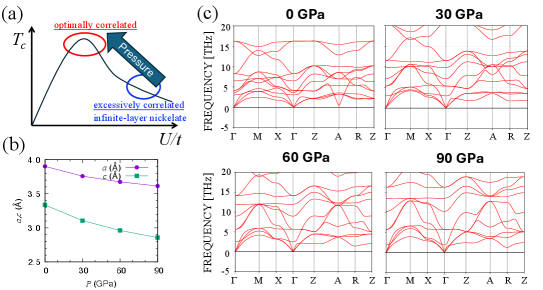
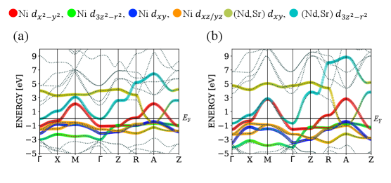
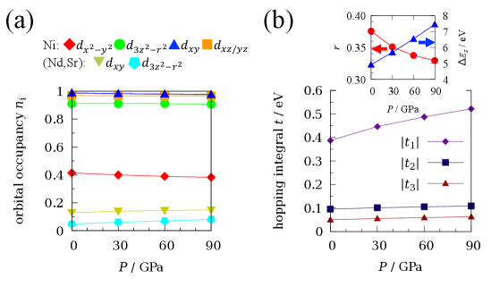
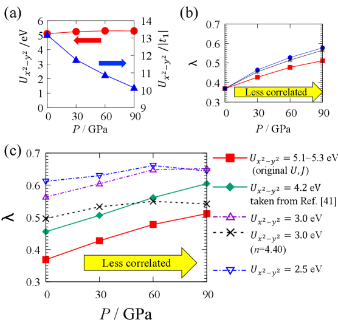

# 無限層ニッケル酸化物超伝導体の圧力下Tc上昇

- 執筆日：2026-05-27
- 要旨：無限層ニッケル酸化物超伝導体 Nd0.85Sr0.15NiO2 の自由膜に圧力を加えると超伝導転移温度 Tc が単調に増加し、90 GPa 近傍で液体窒素温度に迫ることが最近の実験で示された。本稿では、この現象を理論的に解明した注目論文（arXiv:2605.24565）を核に、第一原理計算に基づく7軌道有効モデルと揺らぎ交換（FLEX）近似によって Tc 上昇の機構を詳しく解説する。鍵となる知見は「Ni 1価に由来する過剰に強い電子相関（大きな U/|t| 比）が Tc を抑制しており、圧力がこの比を減少させることで超伝導を増強する」という描像である。ニッケル酸化物と銅酸化物の比較・d 波対称性の証拠・今後の展望についても包括的に論じる。
- タグ：Superconductivity and Strongly Correlated Systems / Thin Films and Interfaces; Low-Temperature Properties / First-Principles Calculations; Transport Measurements
- 注目論文：[Seki et al., "Theoretical study of superconductivity in freestanding infinite-layer nickelate membranes under pressure: mitigation of excess correlation enhances Tc", arXiv:2605.24565 (2026)](https://arxiv.org/abs/2605.24565)
- 参照論文数：7

---

## 1. 背景：なぜ今この話題か

超伝導体の転移温度 Tc をどこまで高くできるか、という問いは凝縮系物理学の中心的な課題であり続けている。1987 年以来、銅酸化物（キュプレート）超伝導体が常圧最高 Tc の記録を保持してきた。その後、長い空白期間を経て 2019 年に大きな転機が訪れた。Li らが無限層構造をもつニッケル酸化物 Nd0.8Sr0.2NiO2 薄膜に超伝導を発見したのである（Nature 572, 624, 2019）。ニッケルは周期表においてニッケルは銅の一つ隣に位置し、Ni1+ の電子配置 d9 はキュプレートの Cu2+ (d9) と同型であるため、理論家たちは長年「ニッケル酸化物にも同様の超伝導が発現するはずだ」と予測していた。その予言が実験的に確証された瞬間だった。

しかし喜びの一方、すぐに大きな疑問が浮かび上がった。Nd0.8Sr0.2NiO2 の Tc はせいぜい 15 K 程度にとどまり、キュプレートの 90〜135 K とは大きく異なる。なぜ「銅酸化物のアナログ」であるはずのニッケル酸化物は、こんなにも低い Tc しか示さないのか？

この謎は、その後数年間で多くの実験・理論研究が積み重なるにつれて、徐々に輪郭を帯びてきた。キュプレートに対してニッケル酸化物は、Ni と O の d-p 軌道混成が弱く、バンド幅が狭く、オンサイトクーロン斥力 U が相対的に大きい「Mott-Hubbard 型」の相関電子系である。これを要約すると「相関が強すぎる」という状況だ。余りに強い電子相関は、超伝導を媒介するスピン揺らぎを促進すると同時に、準粒子ダンピングを増大させて超伝導対形成を抑制することがある。

2023〜2024 年にかけて、状況をさらに複雑にする発見が相次いだ。一方では、二層ルドルスデン・ポッパー構造の La3Ni2O7 が高圧下で Tc ≈ 80 K を示すことが報告され（Sun ら, Nature 621, 493, 2023）、「ニッケルの時代（nickel age）」の到来が宣言された。他方、Ruddlesden-Popper 型の La4Ni3O10 でも 80 K 超の超伝導が報告され、ニッケル酸化物が高 Tc 超伝導の有力な舞台となりつつあることが明確になった。

そして 2024 年、無限層ニッケル酸化物の研究に技術的な大転換が起きた。Lee らが Nd0.85Sr0.15NiO2 の「自由膜（freestanding membrane）」の合成に成功し（arXiv:2402.05104）、さらにこの膜をダイヤモンドアンビルセル（DAC）に組み込むことで、基板の制約なしに等方圧縮できる実験プラットフォームを確立した。そして 2026 年、同グループの Lee, Hwang らはこのプラットフォームを用いて衝撃的な実験結果を報告した（arXiv:2604.09525）。Nd0.85Sr0.15NiO2 膜の Tc は圧力に対して 0.65 K/GPa という直線的な割合で単調増加し、90 GPa 付近では液体窒素温度（77 K）に迫る超伝導の降下（downturn）が観測されたのである。しかも飽和の兆候すら見られない。

この実験結果は理論家に強い問いを突きつけた。なぜ Tc は単調に増え続けるのか？銅酸化物超伝導体は圧力下でドーム型の相図を示すのに、なぜニッケル酸化物は違うのか？この問いに正面から答えたのが、本稿の注目論文 arXiv:2605.24565（Seki, Kono, Tanaka ら、鳥取大学・大阪大学）である。

---

## 2. 解決すべき課題

### なぜ無限層ニッケル酸化物のTcは銅酸化物より低いのか

ニッケル酸化物と銅酸化物を比較すると、両者は表面上類似している。いずれも層状ペロブスカイト型構造をもち、遷移金属（Ni または Cu）が酸素四配位の正方形格子を形成し、電子配置は d9 である。強相関電子系としての基本的な物理——Mott 絶縁体に近い親物質、ホールドープによる超伝導発現——も共通する。

しかし内部構造を詳細に見ると、決定的な違いが存在する。キュプレートでは Cu2+ (d9) の 3dx²-y² 軌道が酸素 O2p 軌道と強く混成（大きな d-p 混成積分 tpd）し、「電荷移動型」の相関電子系を形成する。一方、ニッケル酸化物の Ni1+ は銅よりも価数が 1 低く、電子配置は Ni が Cu より陽性側に大きく移動したため、O2p 軌道との混成は弱い。その結果、Ni-O の d-p 軌道混成積分は Cu-O のそれよりも小さく、純粋な「Mott-Hubbard 型」の相関電子系に近づく。

この違いは複数の実験的観測で確認されている。第一に、バルクニッケル酸化物は薄膜と異なり超伝導を示さない——これはキュプレートが比較的容易にバルク超伝導を示すことと対照的だ。第二に、XAS（X 線吸収分光）や RIXS（共鳴非弾性 X 線散乱）実験は、Ni がほぼ 1+ 価に近いことを確認し、これが強い相関効果の源泉であることを示唆している。第三に、ニッケル酸化物では長距離反強磁性秩序が観測されていないが、短距離スピン揺らぎは存在すると考えられている。

Sakakibara ら（arXiv:1909.00060）は早くも 2019 年に、(Nd,Sr)NiO2 に対して第一原理計算に基づく多軌道モデルと FLEX 計算を行い、「ニッケル酸化物の実効的な電子相互作用パラメータ U は銅酸化物のそれより著しく大きく、その割にバンド幅（∝|t1|）は狭い。この比 U/|t1| の過大さが Tc を抑制している」という仮説を提唱した。この仮説は、低 Tc の謎に対する有力な理論的解釈として以降の研究に引き継がれてきた。

### 圧力はどうTcを上げるのか

圧力を加えるとニッケル酸化物の格子定数が縮む。直感的には格子が縮めば原子間距離が短くなり、軌道重なりが増大する。これはバンド幅（つまり最近接ホッピング積分 |t1|）を増加させる方向に働く。一方、オンサイトクーロン斥力 U は波動関数の形状（軌道の空間的広がり）で決まり、圧力程度の変化では大きく変化しにくい。第一原理計算によれば、U はほぼ圧力に対して不変であることが示されている（Di Cataldo ら, 2023）。

これらを合わせると、「圧力増加 → |t1| 増加 → U/|t1| 減少 → 相関の過剰さが緩和 → Tc 上昇」という経路が成立しうる。しかし、これほど単純な話でないことも考えられる。圧力はフェルミ面の形状も変え、自己ドーピング効果（rare-earth サイトの 5d 軌道とニッケルの 3d 軌道の混成に起因するフェルミポケット）も変化させる。また、圧力が高くなれば結晶構造そのものが不安定になる可能性もある（構造相転移、あるいはソフトモード的なフォノン不安定性）。

さらに、銅酸化物の圧力実験との比較が重要な問いを提起する。HgBa2CuO4 などのキュプレートは圧力下でドーム型の Tc-P 相図を示す——つまりある圧力で最大 Tc に達した後、Tc が下がる。ニッケル酸化物の膜実験（Lee et al. 2026）では 90 GPa まで単調に増加しており、飽和すら見えない。この違いはなぜ生じるのか？これを理解することが、ニッケル酸化物超伝導体の物理を深く理解する上で欠かせない。

### ペアリング対称性は何か

超伝導の「のり（pairing glue）」が何であるかを問うのが、高温超伝導研究の核心的な問いである。BCS 理論ではフォノン（格子振動）が電子対形成を媒介するが、強相関電子系ではスピン揺らぎなどの磁気的揺らぎが同様の役割を果たす可能性がある。スピン揺らぎが超伝導を媒介する場合、対関数の対称性は d 波（dx²-y² 波）となることが多い。

キュプレートでは d 波超伝導が多くの実験的証拠によって確立されている。ニッケル酸化物でも d 波対称性が支持される証拠が蓄積しつつある。Huang ら（arXiv:2512.20928）は超高速テラヘルツ分光法を用いて Sm ニッケル酸化物膜の超流体密度の温度依存性を測定し、温度に対する線形の減少という d 波超伝導の特徴的な振る舞いを報告した。また Semenok ら（arXiv:2310.02586）は無限層ニッケル酸化物の低エネルギー電気力学から、汚い極限（dirty limit）での d 波超伝導と一致する結果を得ている。

---

## 3. 注目論文の仮説と成果

### 研究の問いと対象

注目論文（arXiv:2605.24565）が掲げた問いは明確だ。「Lee et al. (arXiv:2604.09525) が実験で観測した Nd0.85Sr0.15NiO2 自由膜の圧力下 Tc 単調増加を、理論的に説明できるか？そしてその物理的機構は何か？」

対象材料は Nd0.85Sr0.15NiO2 の無限層構造（P4/mmm 空間群、正方晶系）。Sr が Nd の 15% を置換してホールドープを施したもので、最適ドープ近傍に相当する。「自由膜」とは、基板（通常 SrTiO3）の拘束から解放された薄膜であり、基板から生じるエピタキシャル歪みを受けない点が重要だ。自由膜では外部から加える静水圧が直接かつ等方的に物質に作用する。

### 研究アプローチ：第一原理計算 + 7軌道FLEX

研究チームは計算手法として以下の段階を組み合わせた。

第一段階として、QUANTUM ESPRESSO パッケージを用いた第一原理構造最適化を行い、各圧力（0〜90 GPa）における安定格子定数 a, c を決定した。交換相関汎関数は PBE 型 GGA を使用。Nd の 4f 電子はオープンコア処理（凍結コア近似）し、スカラー相対論的擬ポテンシャル（ONCVPSP）を採用した。

第二段階として、フォノン計算（PHONOPY コード）による動的安定性の検証を行った。2×2×2 スーパーセルでの有限変位法によりフォノン分散関係を計算し、虚数モードの有無を確認した。

第三段階として、Wannier90 コードを用いた最局在ワニエ関数（MLWF）の構築と有効モデルハミルトニアンの導出を行った。モデルは、Ni の全3d 軌道（5 軌道）と Nd の 5d 軌道（3z²-r²、xy の2軌道）を含む7軌道モデルである。これは先行研究（arXiv:1909.00060）と同様の枠組みだ。

第四段階として、制限乱位相近似（cRPA）を RESPACK コードで実装し、各圧力での有効オンサイトクーロン斥力 U、U'（軌道間）および交換積分 J、J' を決定した。

第五段階として、FLEX（fluctuation exchange）近似により超伝導不安定性を評価した。FLEX はスピン揺らぎを媒介とした対形成相互作用を自己無撞着に計算する手法であり、線形化アイレンベルガー（Eliashberg）方程式の最大固有値 λ を超伝導強度の指標とした。λ = 1 が Tc を与えるが、固定温度 T = 0.01 eV での λ の圧力依存性を調べることで、Tc の相対的変化を追跡した。

### 主要結果

*図1：(a) 本研究のエッセンスを示した概念図。圧力が U/|t1| を減少させることで Tc が上昇するという描像。(b) 圧力に対して a, c がともに減少し、c がより急速に減少する。(c) P = 0, 30, 60, 90 GPa でのフォノン分散。虚数モードは存在せず、P4/mmm 構造の動的安定性が確認された。（Seki et al., arXiv:2605.24565, CC BY-NC-ND 4.0）*

図 1 の結果はまず、90 GPa までの加圧範囲で正方晶 P4/mmm 構造が動的に安定であることを示している。フォノン分散に虚数モード（ブリルアンゾーン上での負の周波数）が現れないことがその証拠であり、超伝導の解析を P4/mmm 構造に基づいて行うことの妥当性が保証された。格子定数については、c 軸方向（層間方向）が a 軸（面内方向）より速く圧縮されており、圧力が三次元化を促すことがわかる。

*図2：0 GPa（左）と 90 GPa（右）での電子バンド構造。線の太さがワニエ軌道の重みを表す。圧力によって全体的にバンド幅が増加し、5d 軌道由来のフェルミポケットが大きくなり、van Hove 特異点が変化する。（Seki et al., arXiv:2605.24565, CC BY-NC-ND 4.0）*

電子バンド構造（図 2）は、圧力によって全体的にバンド幅が増加することを示している。特に重要な変化として、(i) 5d 軌道由来のフェルミポケット（Γ(A)点近傍）の拡大、および (ii) 3dx²-y² 軌道のファンホーフ特異点の上方シフトが観測された。前者は「自己ドーピング効果」の変化を意味し（rare-earth の 5d 軌道が 3d 軌道に電子を供与するため、3d 軌道の実効充填数は名目値から外れる）、後者はフェルミ面ネスティングの性質を変化させる。

*図3：(a) 圧力増加とともに dx²-y² 軌道の占有数 n_x²-y² が減少する（自己ドーピング効果の増大）。(b) |t1| は圧力とともに著しく増加するが、|t2|, |t3| はほとんど変化しない。挿入図の丸さパラメータ r = (|t2|+|t3|)/|t1| は系統的に減少する。（Seki et al., arXiv:2605.24565, CC BY-NC-ND 4.0）*

ホッピング積分の解析（図 3）は特に重要な発見を含む。最近接ホッピング積分 |t1| が圧力によって著しく増加する一方、次近接 |t2| と次々近接 |t3| はほとんど変化しない。この非対称な変化は Ni の 4s 軌道の効果で理解できる：4s 軌道は周囲の酸素からより強く反発されているため、圧力による 4s-3d 混成の変化が t2, t3 への寄与を相殺する方向に働く。この結果として、丸さパラメータ r = (|t2|+|t3|)/|t1| が圧力とともに単調に減少し、フェルミ面がより正方形に近づく（つまり完全ネスティングに有利）。

*図4：(a) U は圧力に対してほぼ不変だが |t1| が増加するため、U/|t1| は著しく減少する。(b) d 波固有値 λ は圧力とともに単調増加（赤四角）。最もこの増加に寄与するのはバンド構造の変化（青丸）であり、相互作用パラメータの変化（黒アスタリスク）の寄与は小さい。(c) 小さい U の仮定はドーム型を予測するが、現実的な U ≈ 4〜5 eV の場合のみ実験（単調増加）と一致する。（Seki et al., arXiv:2605.24565, CC BY-NC-ND 4.0）*

超伝導固有値の圧力依存性（図 4）が論文の核心的な結果だ。U_x²-y² 自体は圧力に対してほとんど変化しないが（cRPA の結果）、|t1| が大きく増加するために U/|t1| は圧力とともに著しく減少する（図 4a）。そしてアイレンベルガー方程式の d 波固有値 λ は圧力に対して単調に増加し、実験で観測された単調な Tc 上昇と定性的に一致する（図 4b）。

この λ の増加に何が最も寄与するかを切り分けるため、研究グループは仮想的なモデル計算を行った。「ホッピング積分のみを加圧値に変える」と λ は大きく上昇するが、「さらに相互作用パラメータも加圧値に変える」場合の増加は小さい。つまり、Tc 上昇の主要因はバンド構造（ホッピング積分）の変化であり、相互作用パラメータ変化の寄与は副次的だということが明示された。

さらに重要な知見が図 4c から得られる。仮に U を現実より小さく設定した場合（3.0 eV や 2.5 eV）、λ は中間的な圧力で飽和し、さらに高圧ではドーム型になる。これはキュプレートの圧力相図と類似した振る舞いだ。しかし現実的な U ≈ 4〜5 eV（cRPA で計算された値）を用いた場合にのみ、単調増加という実験と一致した振る舞いが再現される。

### 論文の新規性と限界

本論文の新規性は「自由膜という実験的に新しいプラットフォームに対して、第一原理 + FLEX という整合的な理論計算を構築し、Tc の単調増加という実験事実を定量的に説明した」点にある。特に「現実的な大きな U の存在（Mott-Hubbard 的な Ni1+ の過剰相関）が Tc 単調増加の原因だ」という識別力のある結論は、単純な弱相関描像では到達できないものだ。

限界としては以下が挙げられる。まず、FLEX 近似は弱〜中程度の相関には適しているが、強相関領域（大きな U/|t| 比）では精度が不明確であり、DMFT や量子モンテカルロなどより精密な手法との比較が必要だ。次に、仮想結晶近似（VCA）による Sr 置換の扱いは実際のランダムポテンシャル（不均一性）を無視している。また、実験では 90 GPa 付近で Tc が下降し始める「downturn」が観測されているが、理論計算では 90 GPa でも λ は増加し続けており、この downturn の起源については議論の余地が残る。

---

## 4. 研究史における位置づけ

無限層ニッケル酸化物超伝導体の研究史は、理論先行・実験追随の典型例である。1999 年に Anisimov、Bukhvalov、Kovaleva らは「無限層ニッケル酸化物に d9 配置の強相関電子系としての超伝導の可能性がある」と理論予測した。しかし、Ni1+ 状態という通常では不安定な価数を安定化するためには、高度な薄膜成長技術（分子線エピタキシー MBE や PLD による精密な酸素還元処理）が必要で、実験的実現は 2019 年まで待たなければならなかった。

Li ら（Nature 572, 624, 2019）による NdNiO2 の発見以後、実験の焦点は「どうすれば Tc を高められるか」に移った。初期の主要アプローチとして、(a) 希土類元素の変更（La, Pr, Nd → La が最も低い Tc、Pr と Nd は若干高い）、(b) エピタキシャル圧縮歪み（基板選択）、(c) 化学圧力（希土類イオンの組成変更）が試みられた。これらは概ね最大 20 K 程度の Tc 上昇をもたらしたが、銅酸化物との乖離は依然として大きかった。

2024 年の技術的転換点は自由膜の合成だ。Yan ら（arXiv:2401.15980）と Lee ら（arXiv:2402.05104）はほぼ同時期に、水溶性バッファー層（Sr3Al2O6 など）を用いて無限層ニッケル酸化物薄膜を基板から剥離し、自由膜化することに成功した。自由膜は、基板拘束による一軸的歪みを受けず、DAC（ダイヤモンドアンビルセル）への組み込みが可能で、均一な静水圧を印加できるという利点がある。これが Lee et al. (2026) の 90 GPa 実験を可能にした技術基盤だ。

理論面では、Sakakibara ら（arXiv:1909.00060）の 2019 年の仕事が先駆的役割を担った。第一原理計算に基づく多軌道有効モデルを構築し、「ニッケル酸化物では U/|t| 比が銅酸化物より大きく、この過剰相関が Tc を抑制している」という仮説を FLEX 計算で定量化した。この枠組みが、本注目論文（2026 年）の理論的基盤となっている。

一方、La3Ni2O7 系（bilayer Ruddlesden-Popper型）の高圧超伝導（Tc ≈ 80 K）は、無限層型とは電子構造が異なる別の話だが、「ニッケルでも高 Tc は可能」という空気を強く醸成した。Gu ら（arXiv:2306.07275）は La3Ni2O7 の効果的モデルとペアリング機構を調べ、層間の混成が s± 波超伝導を促進する可能性を示した。このような二つの異なるニッケル酸化物ファミリー（無限層型と Ruddlesden-Popper 型）が互いに補完しながら「ニッケル酸化物超伝導学」を形成しつつある。

本注目論文は、この流れの中で「自由膜 + 圧力」という新プラットフォームに対して初めて体系的な第一原理理論を提供した論文として位置づけられる。実験（arXiv:2604.09525）から 7 週間弱という迅速さで理論的解釈を提示したことも、現在の研究コミュニティの熱気を反映している。

---

## 5. どの解釈が最も妥当か

### 単調増加の起源：「過剰相関」緩和説 vs. 他の機構

本論文が提示する中心的解釈は「Ni の Mott-Hubbard 的な Ni1+ 価数に起因する過剰相関（U/|t1| ≫ 1）が常圧での低 Tc の元凶であり、圧力が |t1| を増大させることでこの比を減少させ、超伝導を増強する」というものだ。この解釈を支持する根拠は以下のとおりだ。

第一に、図 4c の検証計算が決定的な証拠を与える。もし U の絶対値が小さければ（3 eV 以下）、FLEX 計算は中間圧力でドーム型の λ を予測する——これはキュプレートの振る舞いと同様だ。しかし現実的な cRPA 値 U ≈ 5 eV を使うと、90 GPa まで λ が単調増加し、実験と定性的に一致する。

第二に、ホッピング積分解析（図 3）が示すように、圧力は主に |t1| を増加させ、U はほぼ変化しない（これは Di Cataldo ら (2023) の先行 DMFT+DΓA 計算とも一致する）。したがって U/|t1| の減少は確かに起きている。

競合する別の解釈として、以下が考えられる。(1) 自己ドーピング効果の変化説：圧力で 5d フェルミポケットが大きくなることで 3d 軌道への充填数が変化し、最適ドープから遠ざかる（または近づく）ことで Tc が変わる可能性。本論文の仮想計算でバンド構造変化が主要因であることは確認されたが、自己ドーピング効果とバンド幅増加効果の寄与の切り分けはまだ明確でない。(2) フェルミ面形状変化説：圧力による丸さパラメータ r の減少がフェルミ面をより正方形に近づけ、反強磁性スピン揺らぎのネスティング条件を改善する。これも Tc 上昇に寄与しうる。(3) 層間結合強化説：c 軸が a 軸より速く圧縮されることで層間方向の三次元性が増し、電子構造が変化する。

本論文では仮想計算によって (1)(2) がバンド構造変化の帰着として重要であることを確認したが、(3) については定量的な寄与評価が不十分だ。

### FLEX近似の妥当性と他の手法との比較

FLEX 近似は弱〜中程度の相関に適した近似手法であり、Mott 絶縁体に近い強相関領域では過大評価や過小評価が生じうる。Di Cataldo ら（2023）は DMFT（動的平均場理論）と DΓA（dynamical vertex approximation）を組み合わせた計算で、基板上の薄膜での圧力効果を調べており、同様の Tc 上昇傾向を示している。ただし彼らの計算では基板からのエピタキシャル歪みを含んでおり、自由膜（等方圧縮）とは条件が異なる。

強相関領域（U/t が大きい領域）でより信頼性の高い手法として、量子モンテカルロ（QMC）や tensor network 法が候補になるが、多軌道モデルへの適用はまだ容易でない。今後、FLEX と DMFT の両方で自由膜の等方圧縮を系統的に計算し、Tc の定量的予測を比較することが必要だ。

### 実験で観測されたdownturnの謎

Lee et al. (2026) の実験では 90 GPa 付近で Tc が下降し始める「downturn」が観測されているが、FLEX 計算では 90 GPa でも λ が増加し続けている。この乖離の原因として、(a) 90 GPa 以上での新しい結晶構造への相転移（本論文は 90 GPa までの安定性は確認しているが、それ以上は検討していない）、(b) 実験的なサンプル品質の劣化（非静水圧的な応力など）、(c) FLEX の過大評価による計算と実験のスケール差、などが考えられる。この問題は今後の重要な研究課題だ。

---

## 6. 何が一般化できるか

### 自由膜プラットフォームの汎用性

Lee et al. が確立した「水溶性バッファー層による自由膜化 + DAC への組み込み」という技術は、ニッケル酸化物に限らず、酸化物エピタキシャル薄膜一般に適用可能な汎用プラットフォームだ。銅酸化物（キュプレート）、マンガン酸化物（コロサル磁気抵抗材料）、バナジウム酸化物（Mott 絶縁体）など、これまで基板拘束という制限の中でしか圧力実験ができなかった薄膜材料すべてが、このプラットフォームの恩恵を受ける可能性がある。

特に注目されるのは、キュプレートの自由膜を同様の手法で圧力実験することだ。基板のない状態で純粋に静水圧を印加すれば、これまでとは異なる圧力相図が得られるかもしれない。無限層ニッケル酸化物と銅酸化物の系統的な自由膜圧力比較実験は、「過剰相関」仮説の普遍性を検証する直接的な手段となる。

### 「過剰相関 → Tc 抑制」という原理の一般性

Mott-Hubbard 型の強相関電子系では、U/|t| 比が最適値を大きく超えると、スピン揺らぎによる超伝導が抑制されることが知られている。これは一般的な強相関超伝導体の設計原理として重要だ。本研究が示したのは「ニッケル酸化物はこの原理を定量的に例示する好例であり、圧力は U/|t| を調整する『つまみ』として機能する」ということだ。

この観点から、「大きな U をもつが高 Tc が期待される材料系」として他に何があるかを探索することが次のステップになる。Ni1+ よりさらに陽性側、例えば Co0+（d9 配置）を含む酸化物や、2D 材料（NiO 単層など）も候補となりうる。

### d波超伝導の普遍的地位

キュプレート、無限層ニッケル酸化物ともに d 波超伝導が支持されつつあることは、スピン揺らぎを媒介とした d 波ペアリングが「遷移金属酸化物系の強相関超伝導体に普遍的」なメカニズムである可能性を示唆する。ただし La3Ni2O7 系（bilayer型）では s± 波が提唱されており、構造によってペアリング対称性が異なることも示唆される。多層・多軌道系でのペアリング対称性の系統的理解が次の課題だ。

---

## 7. 基礎から理解する

### 超伝導とは何か

物質を冷却すると、ある温度 Tc（超伝導転移温度）以下で電気抵抗がゼロになる現象が超伝導である。さらに外部磁場を追い出す「完全反磁性（マイスナー効果）」も超伝導の特徴だ。この現象の量子力学的な本質は、フェルミ粒子であるはずの電子が「クーパー対」というボゾン的な束縛状態を形成し、同一量子状態に凝縮することにある。

クーパー対の形成には、電子間に引力的な相互作用が必要だ。通常の金属では電子同士はクーロン斥力で反発し合うが、格子振動（フォノン）が媒介する間接的な引力（ファン・ゴールデン相互作用）がこれを上回ることで対形成が可能になる。これが 1957 年に提唱された BCS 理論の核心だ。

BCS 理論の枠組みでは、クーパー対は「k↑, -k↓」の運動量と反対スピンをもつ電子ペアを組み、対関数 Δk（ギャップ関数）は k に依存しない等方的（s 波）な形をとる。転移温度は Tc ≈ 1.14 θD exp(-1/N(0)V) で与えられる。ここで θD はデバイ温度（フォノンのエネルギースケール）、N(0) はフェルミ面の状態密度、V は引力相互作用の強さを表す。

### 高温超伝導と強相関電子系

キュプレートなどの高温超伝導体は BCS 理論で説明できない。これらはフォノンよりもはるかに高いエネルギースケールの「のり」（スピン揺らぎや他の電子的励起）によって電子対を形成すると考えられている。

強相関電子系では、電子が特定の軌道（例えば Cu の 3dx²-y² や Ni の 3dx²-y²）に半分ずつ閉じ込められた Mott 絶縁体（または Mott-Hubbard 絶縁体）になる傾向がある。これを記述する最も基本的な理論模型が「ハバード模型（Hubbard model）」である：

$$H = -t \sum_{\langle i,j \rangle, \sigma} \left(c_{i\sigma}^\dagger c_{j\sigma} + \text{h.c.}\right) + U \sum_i n_{i\uparrow} n_{i\downarrow}$$

ここで、$c_{i\sigma}^\dagger$, $c_{j\sigma}$ はサイト i でのスピン σ の電子生成・消滅演算子、$t$ は最近接サイト間のホッピング積分（電子が格子上を「飛び移れる」しやすさ）、$U$ は同一サイト上での上向き・下向きスピン電子のオンサイトクーロン斥力（Hubbard U）、$n_{i\sigma} = c_{i\sigma}^\dagger c_{i\sigma}$ はサイト i, スピン σ の占有数演算子である。

$U/t \ll 1$ の弱相関極限では金属的な振る舞いが現れ、$U/t \gg 1$ の強相関極限では Mott 絶縁体になる。ホールドープされた（電子が少し抜けた）中間領域で超伝導が発現するが、この領域での物理は非常に複雑だ。

### スピン揺らぎとd波超伝導

ハバード模型のドープ Mott 絶縁体において、スピン揺らぎがクーパー対形成を媒介する機構について、少し詳しく説明しよう。

反強磁性に近い系では、波数 Q ≈ (π, π)（d 次元正方格子の場合）の反強磁性スピン揺らぎが発達する。これは「隣り合う格子サイトのスピンが反平行になろうとする」傾向を反映している。このスピン揺らぎが電子に作用すると、フォノンと同様に電子対形成の引力として働くことができる。

重要な点は、この引力の性質だ。フォノン媒介の引力は等方的で s 波超伝導を引き起こすのに対し、反強磁性スピン揺らぎ媒介の引力は異方的で、「隣り合うサイトの電子ペアを好む」という特徴をもつ。これは k 空間でのギャップ関数 Δk が、Δk ∝ cos(kx) - cos(ky) という d 波形状（dx²-y² 波）をとることに対応する。d 波ギャップ関数はフェルミ面上に「節（node）」とよばれるゼロ点を持ち（具体的には kx = ±ky の線上でゼロ）、この節の存在が様々な実験で確認されている。

### FLEX近似とアイレンベルガー方程式

FLEX（fluctuation exchange）近似は、スピン揺らぎによる超伝導を定量的に評価するための実用的な手法だ。ハバード模型に対して、以下のような手順で計算を行う。

まず、スピン感受率（spin susceptibility）を以下のように計算する：

$$\chi_s(\mathbf{k}, i\omega_n) = \frac{\chi_0(\mathbf{k}, i\omega_n)}{1 - U\chi_0(\mathbf{k}, i\omega_n)}$$

ここで $\chi_0$ は非相互作用（バブル）感受率であり、グリーン関数 $G(k, i\omega_n)$ を用いて

$$\chi_0(\mathbf{q}, i\nu_n) = -\frac{T}{N} \sum_{\mathbf{k}, n} G(\mathbf{k}+\mathbf{q}, i\omega_n + i\nu_n) G(\mathbf{k}, i\omega_n)$$

と書ける（$\omega_n = (2n+1)\pi T$, $\nu_n = 2n\pi T$ はそれぞれフェルミオン・ボゾン型の松原周波数）。

この感受率を用いてスピン揺らぎによる自己エネルギー Σ を計算し、自己無撞着に（自己エネルギーで修正されたグリーン関数を用いてまた感受率を計算するというループを収束まで繰り返す）解く。このようにして得られた「ドレスされた」グリーン関数と対形成相互作用を線形化アイレンベルガー方程式に代入する：

$$\lambda \Delta(\mathbf{k}, i\omega_n) = -\frac{T}{N} \sum_{\mathbf{k}', n'} V_{\text{eff}}(\mathbf{k}-\mathbf{k}', i\omega_n - i\omega_{n'}) |G(\mathbf{k}', i\omega_{n'})|^2 \Delta(\mathbf{k}', i\omega_{n'})$$

ここで $\Delta(\mathbf{k}, i\omega_n)$ がギャップ関数（超伝導秩序変数の異常グリーン関数的な量）であり、$V_{\text{eff}}$ は有効対形成相互作用（スピン揺らぎを含む）である。この方程式が固有値問題となり、最大固有値 $\lambda = 1$ が超伝導転移温度 $T_c$ に対応する。固定温度での $\lambda$ の大きさは $T_c$ の指標として使える。

### 第一原理計算とワニエ関数

密度汎関数理論（DFT）による第一原理計算は、原子核の位置と原子番号だけを入力として電子の波動関数とエネルギーを計算する手法だ。ただし DFT のバンド構造は、相互作用効果（相関効果）を厳密に取り込んでおらず、強相関電子系では限界がある。

この DFT バンド構造から「最局在ワニエ関数（MLWF: maximally localized Wannier functions）」を構築すると、実空間での格子サイトに局在した軌道基底（ワニエ基底）とその間のホッピング積分 $t_{ij}$ を系統的に抽出できる。これによって第一原理計算の結果を直接、格子モデル（ハバードモデルなど）のパラメータとして利用する架け橋が得られる。

さらに、「制限乱位相近似（cRPA: constrained random phase approximation）」は、低エネルギー有効模型内の有効クーロン相互作用 $U$ を第一原理的に評価する手法だ。高エネルギーの電子状態からのスクリーニングを考慮した「スクリーニングされた U」が得られるため、裸のクーロン相互作用（∼10 eV）より小さな有効値（∼3〜5 eV）が典型的に得られる。

---

## 8. 専門用語の解説

**無限層ニッケル酸化物（infinite-layer nickelate）**：NiO2 の正方格子面だけが積層した構造（例：NdNiO2）をもつペロブスカイト関連酸化物。「無限層」とは Ni-O 八面体の頂点酸素が存在しないことを指し、Ni 原子が正方形の酸素に囲まれた平面構造をとる。電子配置は Ni1+ に対応し d9 となる。キュプレートとの比較で理論的に超伝導が予測されていたが、合成の困難さから 2019 年まで超伝導は未発見だった。

**クーパー対（Cooper pair）**：超伝導状態における電子ペアの束縛状態。相互作用によって反対の運動量 (k↑, -k↓) をもつ二電子が引き寄せられ、ボゾン的な複合粒子を形成する。クーパー対の凝縮（ボーズ・アインシュタイン凝縮的な現象）が超伝導の量子力学的本質だ。ペアの「のり」がフォノンの場合 BCS 型、スピン揺らぎの場合は d 波型などの非従来型超伝導になる。

**d波超伝導（d-wave superconductivity）**：ギャップ関数 Δ(k) が dx²-y² の対称性 Δ(k) ∝ cos(kx) - cos(ky) をもつ超伝導。フェルミ面上に k = (±π/2, ±π/2) 近傍の「節（ゼロ点）」をもち、この節上では準粒子が超伝導ギャップなしに存在する。節の存在は低温比熱の T 依存性や超流体密度の T 線形依存性などで実験的に検出できる。キュプレートおよびニッケル酸化物超伝導体での主要な超伝導機構と考えられている。

**FLEX近似（fluctuation exchange approximation）**：スピン・電荷揺らぎを自己無撞着に取り込んだ多体摂動展開の一手法。松原周波数空間でグリーン関数と自己エネルギーを繰り返し更新するため、弱〜中程度の相関領域でスピン揺らぎによる超伝導を定量的に評価できる。計算コストが DFT より大きく DMFT より小さい中間的な手法で、FLEX から得られたペアリング固有値 λ が Tc の目安となる。

**Hubbard U（ハバード U）**：同一軌道上に上向きと下向きスピンの電子が同時に存在するときのエネルギーコスト（オンサイトクーロン斥力）。U が大きいと電子の局在化（Mott 絶縁化）が促進され、U が小さいとバンド的な遍歴電子系になる。「Mott-Hubbard 型」とは U がバンド幅（∝ t）に比べて大きく、電荷移動が d-d 間で起きる系を指す。ニッケル酸化物の Ni1+ は Ni の価数が低いため U が特に大きくなる。

**丸さパラメータ（roundness parameter）**：r = (|t2| + |t3|) / |t1| で定義されるフェルミ面の「丸さ」を表す指標。t1, t2, t3 はそれぞれ最近接・次近接・次々近接ホッピング積分。正方格子で t2 = t3 = 0 なら完全にネスティングした（正方形の）フェルミ面、t2 や t3 が大きければ丸みを帯びたフェルミ面になる。スピン揺らぎによる d 波超伝導は正方形フェルミ面（小さい r）で促進されるため、r の圧力による減少が Tc 上昇に寄与する。

**自己ドーピング効果（self-doping effect）**：無限層ニッケル酸化物特有の効果。Nd などの希土類元素の 5d 軌道がフェルミ面に小さなポケットを形成し、そこに電子が入ることで Ni の 3d 軌道からの電子が「引き抜かれ」る。その結果、Ni 3dx²-y² 軌道の実効的な電子数（充填数）が名目値（ホールドープ量）より少なくなる。この効果はニッケル酸化物と銅酸化物の電子構造の根本的な違いの一つで、圧力によっても変化する。

**cRPA（制限乱位相近似）**：有効低エネルギーモデルのクーロン相互作用パラメータを第一原理的に決定するための手法。全電子系のスクリーニングから、低エネルギーモデル内の遷移を除いて計算されるため、「有効 U」が得られる。FLEX や DMFT などの多体計算に使用するパラメータとして広く利用されている。

**線形化アイレンベルガー方程式（linearized Eliashberg equation）**：フォノンやスピン揺らぎによる自己エネルギーを含む有効な対形成方程式の線形化版。固有値 λ がちょうど 1 になる温度が Tc となる。ギャップ関数 Δ(k, ωn) の松原周波数依存性（遅延効果）を取り込む点で、単純な BCS 理論より精密な扱いができる。多軌道系への拡張も可能で、本研究では 7 軌道モデルに対して適用された。

**自由膜（freestanding membrane）**：基板から分離した薄膜。通常の薄膜はエピタキシャル成長により基板の格子定数に合わせた歪みを受けるが、自由膜では基板拘束がなく、格子は自由に弛緩する。外部から均一な静水圧を加えることができ、より「バルクに近い」圧力実験が可能になる。水溶性バッファー層（Sr3Al2O6 など）を薄膜と基板の間に挟んで水に溶かすことで実現される。

**ダイヤモンドアンビルセル（DAC）**：二枚の先端が尖ったダイヤモンドの間に試料を挟んで高圧を発生させる装置。数十 GPa から 100 GPa を超える超高圧を小さな試料に印加できる。電気抵抗・磁化・光学応答の測定が高圧下でも可能で、高圧超伝導の研究に不可欠なツール。

---

## 9. 将来展望

本研究が明確にした「圧力による U/|t| 比の制御が Tc を変化させる」という機構は、今後のニッケル酸化物超伝導研究の設計指針となりうる。最も直接的な次のステップは、理論と実験の定量的精度の向上だ。FLEX 近似は中程度の相関には適しているが、現実の U/|t| 比が大きい領域ではダイナミカル頂点補正（DΓA）や量子モンテカルロ（QMC）など、より系統的な多体手法との比較検証が欠かせない。特に 90 GPa 付近での Tc の「downturn」——実験では観測されているが理論では再現されていない——は、より精密な計算によってどこまで説明できるかが注目される。この downturn が相関効果の「最適点」なのか、結晶構造の変化によるものなのかを解明することが、無限層型ニッケル酸化物の超伝導相図を完成させる上での鍵となる。

もう一つの重要な展開方向は、この自由膜プラットフォームを用いた系統的な物質探索だ。無限層型の希土類系列（La, Pr, Nd, Sm）での自由膜圧力実験を比較することで、希土類元素が Tc に与える影響を「基板拘束なし」で定量評価できる。さらに、銅酸化物やルドルスデン・ポッパー型ニッケル酸化物（La3Ni2O7 など）の自由膜との比較実験は、「Mott-Hubbard 型」と「電荷移動型」という二つの超伝導ファミリーを統一的に理解するための決定的な知見を与えるだろう。特に、La3Ni2O7 自由膜の圧力実験は、二層型と無限層型で異なると言われるペアリング対称性（s± 波 vs. d 波）の問題に新たな光を当てる可能性がある。

超伝導臨界温度の室温化という夢への視点でこの研究を眺めると、ニッケル酸化物の圧力下での Tc が 90 GPa でキュプレートに匹敵するレベルに達しつつあることは、非常に示唆的だ。現在確かに言えることは「U/|t| 比の低減が Tc 向上の本質的な制御因子であり、これを自由膜 + 圧力という外部パラメータで実現できた」という点だ。しかし、90 GPa という極限圧力を実用的な装置設計に生かすことはまだ遠い。今後の研究では、化学的修飾（異なる希土類元素、ドーピング量の最適化）や界面工学（他の強相関材料とのヘテロ構造形成）によって、圧力なしに U/|t| 比を「適正範囲」に設計する方向性が模索されるだろう。この観点からは、ニッケル酸化物は「第二の銅酸化物」を超えて、強相関電子系超伝導の設計学（design science）への扉を開く存在として位置づけられる。

---

## 参考論文一覧

1. [Seki et al., "Theoretical study of superconductivity in freestanding infinite-layer nickelate membranes under pressure: mitigation of excess correlation enhances Tc", arXiv:2605.24565 (2026)](https://arxiv.org/abs/2605.24565)  
   ← **注目論文**。Nd0.85Sr0.15NiO2 自由膜の圧力下超伝導を第一原理+FLEX 計算で解析し、U/|t| 比の減少が Tc 単調増加の鍵であることを示した。

2. [Lee et al., "High-temperature superconductivity in Nd0.85Sr0.15NiO2 membranes under pressure", arXiv:2604.09525 (2026)](https://arxiv.org/abs/2604.09525)  
   ← 実験論文。ダイヤモンドアンビルセルに組み込んだ自由膜に 90 GPa まで圧力を加え、Tc が 0.65 K/GPa の割合で単調増加し液体窒素温度に迫ることを観測した。

3. [Lee et al., "Millimeter-scale freestanding superconducting infinite-layer nickelate membranes", arXiv:2402.05104 (2024)](https://arxiv.org/abs/2402.05104)  
   ← 自由膜合成の技術論文。ミリメートルスケールの (Nd,Sr)NiO2 自由膜を水溶性バッファー層を用いて合成し、通常の薄膜と同等の超伝導特性を確認した。

4. [Yan et al., "Superconductivity in freestanding infinite-layer nickelate membranes", arXiv:2401.15980 (2024)](https://arxiv.org/abs/2401.15980)  
   ← 最初の自由膜超伝導論文。La0.8Sr0.2NiO2 自由膜を合成して Tc = 10.9 K の超伝導を実証し、外部歪みによる Tc チューニングの可能性を開いた。

5. [Sakakibara et al., "Model construction and a possibility of cuprate-like pairing in a new d9 nickelate superconductor (Nd,Sr)NiO2", arXiv:1909.00060 (2019)](https://arxiv.org/abs/1909.00060)  
   ← 第一原理 + 多軌道 FLEX による初期理論論文。d 波超伝導の可能性と U が銅酸化物より大きく低 Tc の原因となりうることを早期に示した。注目論文の著者グループによる先行研究。

6. [Gu et al., "Effective model and pairing tendency in bilayer Ni-based superconductor La3Ni2O7", arXiv:2306.07275 (2023)](https://arxiv.org/abs/2306.07275)  
   ← 二層型ニッケル酸化物 La3Ni2O7 の有効モデルとペアリング機構を第一原理計算から解析し、s± 波超伝導の可能性を提唱した。無限層型との比較のための文脈として参照。

7. [Huang et al., "Evidence for Clean d-wave Superconductivity in Samarium Nickelates", arXiv:2512.20928 (2025)](https://arxiv.org/abs/2512.20928)  
   ← 超高速テラヘルツ分光法で SmNiO2 膜の超流体密度の温度線形依存性を測定し、クリーン極限での d 波超伝導を支持する実験的証拠を提示した。
