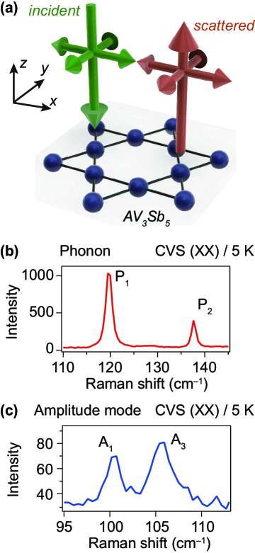
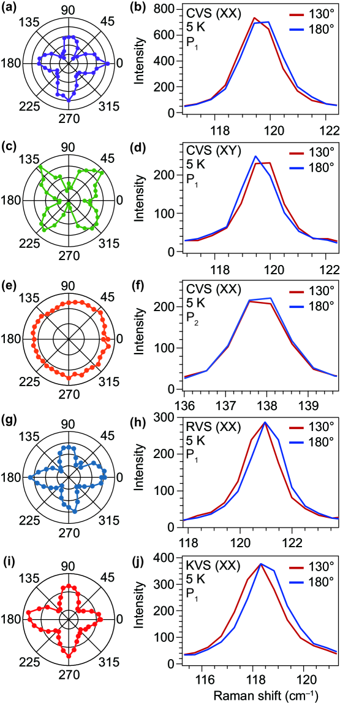
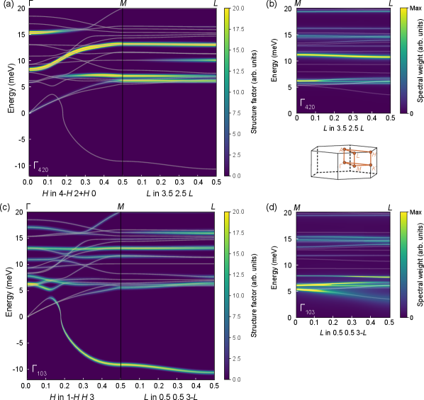
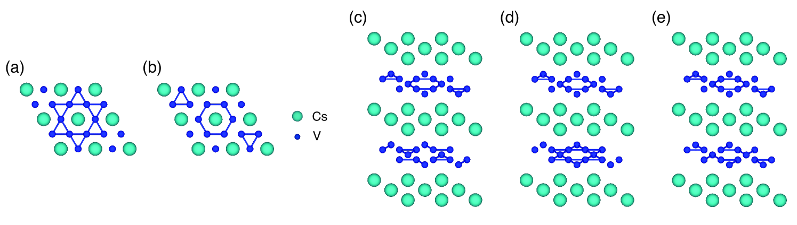
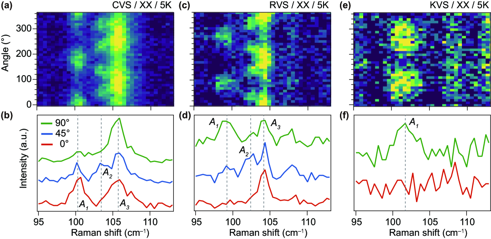
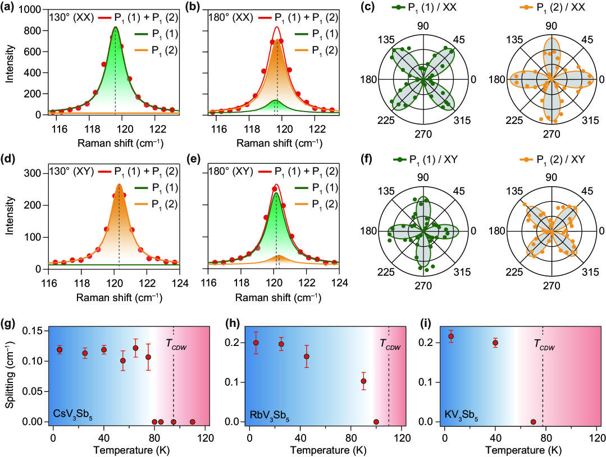

# カゴメ超伝導体AV3Sb5における格子励起と電荷励起の分離

- 執筆日：2026-05-28
- 要旨：カゴメ金属AV3Sb5（A = Cs, Rb, K）では、電荷密度波（CDW）と超伝導が共存することが知られているが、CDWの形成機構をめぐる論争——フォノン軟化か電子ネスティングかという問い——は未解決のまま続いてきた。本稿では、偏光ラマン分光を用いてCsV3Sb5・RbV3Sb5・KV3Sb5の三化合物を系統的に比較した最新研究（arXiv:2605.20573）を主軸とし、E2gフォノンモードの縮退分裂がすべての化合物で普遍的に観測される一方、集団的CDW励起の偏光依存性は化合物ごとに異なることを示す新知見を解説する。この「格子と電荷の分離」という視点は、AV3Sb5のCDW秩序が単純なネスティング描像では説明できず、電子－フォノン結合を介したより複雑な機構によって駆動されることを強く示唆する。関連する最新論文群と組み合わせることで、フォノン軟化機構の実験的証拠、CDWの実空間構造（Star-of-David vs. Tri-hexagonal）をめぐる議論、および超音波ポンプ－プローブ実験による対称性破れの検出まで、この系の物理を俯瞰する。
- タグ：Electronic Structure / Charge Orbital and Spin Order; Phase Transitions / First-Principles Calculations; Synchrotron Measurements; Pump-Probe Measurements
- 注目論文：Dongjin Oh et al., "Distinct lattice and charge excitations in AV3Sb5 kagome superconductors," arXiv:2605.20573 (2026) [https://arxiv.org/abs/2605.20573]
- 参照論文数：8本（注目論文1本＋関連論文7本）

---

## 1. 背景：なぜ今この話題か

カゴメ格子とは、正三角形を共有した辺で繋いで形成される二次元の格子構造であり、幾何学的フラストレーションによってバンド構造に「フラットバンド」「ディラック点」「鞍点（ファン・ホーフ特異点）」という三つの特徴的な構造を同時に内包することが知られている。この三者が共存する電子構造は、多彩な電子相関現象——電荷密度波（CDW）、超伝導（SC）、磁気秩序——の競合を生み出す舞台として理論的に注目されてきた。

2021年に発見されたAV3Sb5（A = Cs, Rb, K）は、カゴメ格子を構成するV原子が理想的な二次元カゴメ面を形成しながら、実際に超伝導とCDWの共存を示す初めての系として材料科学・物性物理の双方から強烈な関心を集めた。CsV3Sb5のCDW転移温度はTCDW ≈ 94 Kであり、その下でTc ≈ 2.5 Kの超伝導が発現する。K系ではTCDW ≈ 78 K、Tc ≈ 0.9 K、Rb系はその中間的な値を持つ。これら三化合物が同じ結晶構造（空間群P6/mmm）を持ちながら転移温度が異なるという事実は、アルカリ金属の化学的圧力効果が有効な制御パラメータであることを示し、理論と実験の両方で系統的比較を可能にしている。

しかし発見から5年が経過した現在も、AV3Sb5のCDW機構をめぐる中心的な問いは未解決のままである。「なぜCDWが生じるのか」という問いに対して、(1) フェルミ面ネスティングによる電子的不安定性説、(2) 特定フォノンモードの軟化を介した格子不安定性説、(3) これら両者が絡み合う電子－フォノン結合説、という三つの立場が競合しており、それぞれを支持する実験的・理論的証拠が蓄積されてきた。今回の注目論文は、偏光角度分解ラマン分光によって「格子自由度と電荷自由度の励起スペクトルを分離する」という新しい視点を提示し、この論争に重要な制約を与えている。

加えて、AV3Sb5のCDWは実空間でどのような電荷パターンを形成するかという問いも長らく論争の的であった。走査型トンネル顕微鏡（STM）や回折実験からは、六角形を「星型」に歪める Star-of-David（SoD）パターンと、六角形を「三角型」に歪める Tri-hexagonal（TrH）パターンの二種類の構造が提案されており、どちらが真の基底状態かという議論は現在進行形である。この実空間構造問題は、CDW形成機構とも密接に絡んでおり、フォノン描像と電子描像のどちらが正しいかによって安定構造の予測が変わる。

このように、カゴメ金属AV3Sb5は「電荷秩序の起源」「実空間構造の決定」「超伝導との相互作用」という三つの未解決問題を一つの系の中に集約しており、多様な実験・理論アプローチが収束しつつある現時点での総合的なレビューには大きな意義がある。

---

## 2. 解決すべき課題

### CDW形成の主導因子はフォノンか電子か

AV3Sb5のCDWがなぜ生じるかという問いの核心は、「フェルミ面のネスティングが電子系の不安定性を直接引き起こすのか、それとも特定の格子振動（フォノン）が軟化することによって格子が不安定になるのか」という二項対立に要約できる。フェルミ面ネスティングとは、ある波数ベクトルQによって結ばれたフェルミ面上の二点が大量に存在する場合、その波数Qの揺らぎに対してコリンズ電気感受率（Lindhard関数のピーク）が発散し、電子系が自発的にQの周期を持つ電荷分布へ転移する現象である。数学的には、

$$\chi_0(\mathbf{Q}, \omega=0) = -\frac{1}{V}\sum_{\mathbf{k}} \frac{f(\varepsilon_{\mathbf{k}+\mathbf{Q}}) - f(\varepsilon_{\mathbf{k}})}{\varepsilon_{\mathbf{k}+\mathbf{Q}} - \varepsilon_{\mathbf{k}}}$$

が波数Qでピークを持つとき、系はQのCDWへ向かう傾向を持つ。ここで$f$はフェルミ分布関数、$\varepsilon_{\mathbf{k}}$はBlochエネルギーである。AV3Sb5のカゴメバンドにはM点付近に複数のファン・ホーフ特異点（VHS）があり、そこを結ぶネスティングベクトルが観測されるCDW波数Q = (1/2, 0, 0)に近いことから、ネスティング説を支持する論者は多かった。

しかし、この説には重大な問題がある。第一に、VHSの位置がフェルミ準位から若干ずれており、ネスティング条件が厳密には成立しない。第二に、三次元性（層間結合）が強いと二次元ネスティングの発散は大幅に抑制される。第三に、同様のカゴメバンドを持ちながらCDWを示さない類似物質が存在する。

一方、フォノン軟化説では、CDW波数での格子振動（特定のフォノンブランチ）が電子－フォノン結合によってその振動数を低下させ（軟化し）、絶対零度付近でゼロに達するとき格子が自発的に歪むというコーン異常（Kohn anomaly）のメカニズムを主張する。フォノン周波数の温度依存性は自己エネルギー補正によって記述され、

$$\omega_{\mathbf{Q}}^2(T) = \omega_{0,\mathbf{Q}}^2 + 2\omega_{0,\mathbf{Q}} \, \text{Re}\,\Pi(\mathbf{Q}, \omega_{\mathbf{Q}}, T)$$

ここで$\Pi(\mathbf{Q}, \omega, T)$はフォノン自己エネルギーであり、これが温度低下とともに負に増大するとき$\omega_{\mathbf{Q}}$がゼロに向かう。軟化説を採れば、CDW転移は格子の不安定化が先行し電子系はそれに追随するという描像になる。

これら二つの描像を区別するためには、CDW転移に至る前のソフトモードの振舞いを実験的に追跡する必要がある。ラマン分光・X線非弾性散乱・ポンプ－プローブ分光など、様々な実験が近年この問いに挑んでいる。

### CDWの実空間構造：SoD vs. TrH

CDWの実空間構造もまた未解決問題として残っている。2×2の面内超周期を持つCDWは、V3三角形クラスターが縮むか伸びるかによってSoD（Star-of-David）とTrH（Tri-hexagonal）の二種類の配置をとりうる。SoDでは六つのV原子が中心のVに向かって収縮し、星型クラスターを形成する。TrHでは三つのV原子が縮んで三角形クラスターを、他の三つが伸びて六角形ネットワークを形成する。

両構造はカイラリティ（chirality）を持ちうるため、CDW相は時間反転対称性（TRS）を破る可能性がある。実際、CsV3Sb5でゼロ磁場での異常ホール効果（AHE）が観測されており、これはTRS破れを示唆する。しかしAHEはCDW転移と独立に発現するとの報告もあり、SoDかTrHかという構造問題はAHEの解釈にも直結している。

理論計算ではTrHが安定であるとの結果が多いが、STM実験ではSoDパターンが観測されることも多く、試料依存性・表面効果・観測温度の違いによって実験結果が食い違う。2022年の実験（arXiv:2201.06477）はSTMと電子回折を組み合わせ、TrHとSoDが相内で混在しうることを示したが、どちらが真の低エネルギー状態かという問いは依然として決着していない。

### 超伝導との関係：CDWは敵か味方か

三つ目の課題は、CDWと超伝導の相互作用である。CDWは通常、フェルミ面を部分的に「ギャップアウト」することで状態密度を減少させ、超伝導を抑制する。しかしAV3Sb5では、圧力印加によってTCDWが下がると同時にTcが上昇するという正の相関が見られる場合があり、CDWの「軟化」がむしろ超伝導を促進するという逆説的な状況が観測される。

この逆説は、CDWを駆動するフォノンが同時に電子対形成（クーパー対）の仲介も担うという「フォノン媒介超伝導」の描像で整合的に理解できる可能性がある。フォノン軟化によりCDW波数のフォノン振動が低周波数化すれば、その周辺の低エネルギーフォノンが超伝導ペアリングに寄与できる。このシナリオが正しければ、CDW形成機構（フォノン説）と超伝導機構（電子－フォノン結合）は同一のミクロな物理で結ばれることになり、非常に統一的な描像が得られる。

---

## 3. 注目論文の仮説と成果

### 研究目的と対象

Dongjin Oh らによるこの研究（arXiv:2605.20573）の核心的な問いは、「AV3Sb5の格子自由度（フォノン）と電荷自由度（CDW集団励起）はラマンスペクトル上で区別できるか、区別できるとすれば化合物間でどちらがより「普遍的」な振る舞いをするか」というものである。対象はCsV3Sb5、RbV3Sb5、KV3Sb5の三化合物であり、偏光依存性のある角度分解ラマン分光を用いてCDW転移前後のスペクトルを系統的に比較している。

### 研究アプローチ：偏光ラマン分光

ラマン分光は、入射レーザー光と散乱光の偏光方向を制御することで、散乱過程に関与するフォノンの対称性（既約表現）を選択的に検出できる。AV3Sb5の常伝導相の空間群P6/mmmの既約表現の観点では、Γ点のフォノンはA1g、A2g、B1g、B2g、E1g、E2gなどの対称性を持つ。このうちE2gモードは六方晶系に固有の二重縮退（2-fold degenerate）モードであり、結晶の六回回転対称性（C6v）が保たれる限り二つの成分の周波数は等しい。

偏光ラマン測定では、入射光と検出光の偏光方位を結晶のa軸・b軸に対して回転させながらラマン信号を記録する。E2gモードが縮退している（対称性が保たれている）場合は偏光回転に対して特定の角度依存性を示す。一方、CDW転移によって結晶の対称性が低下してE2gの縮退が解ける（splitting）場合は、二つの成分が異なる周波数を持つようになり、偏光角度に対して異なるラマン強度パターンを示す。

### 主要結果：E2g分裂の普遍性とCDW励起の多様性

*図1：AV3Sb5の結晶構造とカゴメ格子の概要。V原子がカゴメ面を形成し、Sb/Aの原子が挟む層状構造を持つ（出典：arXiv:2605.20573, CC BY 4.0）。*

この研究の最も重要な発見は二つある。

*図2：三化合物（Cs, Rb, K）の偏光分解ラマンスペクトル。E2gモードの縮退分裂とCDW集団励起の偏光依存パターンを系統的に比較している（出典：arXiv:2605.20573, CC BY 4.0）。*

第一の発見は、E2gフォノンモードの縮退分裂がCsV3Sb5、RbV3Sb5、KV3Sb5の全三化合物でCDW転移以下において普遍的に観測される、という事実である。E2gモードの分裂は、面内の格子対称性がC6vから低い対称性（C2vあるいはC3vなど）へと低下したことを意味する。この対称性の低下はCDW転移によってV-V結合距離に面内異方性が生じることに対応し、カゴメ格子の幾何学的変形を格子振動レベルで検出しているものと解釈できる。このE2g分裂の様相——分裂幅、温度依存性、偏光パターン——は三化合物間で定性的に共通しており、「格子自由度の変化はアルカリ金属の違いによらず普遍的」という結論を支持する。

第二の発見は、集団的CDW励起（CDWアンプリチュードモードなど）の偏光依存パターンが化合物によって異なる、という対照的な事実である。CDWアンプリチュードモードとは、CDW秩序変数の振幅揺らぎに対応する集団励起であり、CDW転移以下でラマンスペクトルに新たなピークとして出現する。このモードの偏光依存性はCDWの実空間秩序の対称性を反映するため、SoDかTrHかという実空間構造の違いを間接的に検出できる感度を持つ。研究グループは、CsV3Sb5とRbV3Sb5（あるいはKV3Sb5）でCDW励起の偏光パターンが異なる傾向を見出し、電荷秩序の詳細な対称性が化合物ごとに異なる可能性を示した。

### 論文の新規性と限界

この研究の新規性は、同一実験手法を三化合物に系統適用することで「格子普遍性 vs. 電荷多様性」という明確な対比を初めて示した点にある。従来の研究はCsV3Sb5に集中しており、三化合物の系統比較は希少であった。また、E2gモードの偏光分解という手法によって、ラマンスペクトルの対称性情報を定量的に引き出す解析手法を洗練させた点も方法論的な貢献である。

一方で限界もある。ラマン分光はΓ点（波数k=0）近傍のフォノンのみを直接検出するため、CDW波数Q = (1/2, 0, 0)でのフォノン軟化を直接観測することはできない。CDW波数での軟化はX線非弾性散乱や中性子散乱で検出する必要があり、本研究単独でフォノン軟化機構を完全に証明するわけではない。また、CDW励起の化合物依存性がSoD/TrH構造の違いを意味するのか、あるいは別の解釈（例えばドメイン構造の違いや積層秩序の違い）が正しいのかは、さらなる局所プローブ実験（STM等）との対応が必要である。

---

## 4. 研究史における位置づけ

AV3Sb5の研究史は、2021年の超伝導とCDW共存の発見から始まる急速な展開を経ており、現在に至るまでの5年間に主要な実験的・理論的知見が集積されてきた。

最初期のラマン分光研究（arXiv:2201.05330; Luo et al., 2022）は、CsV3Sb5のCDW転移以下において通常のフォノンシグナルに加えて「異常なアンプリチュードモード」が出現することを報告し、CDWの集団励起がラマン活性であることを初めて示した。この研究は、CDWが古典的なパイエルス型の一次元ネスティングではなく、より複雑な多バンド・多軌道の集団秩序であることを示唆し、後続の偏光ラマン研究の基盤となった。

*図4：X線非弾性散乱で観測されたCsV3Sb5のQ = (1/2, 0, 0)近傍でのフォノン軟化。CDW転移に先立って特定のフォノンブランチが低周波数化する様子が見える（出典：arXiv:2510.19790, CC BY 4.0）。*

CDW波数でのフォノン軟化に直接的な証拠を与えたのは、X線非弾性散乱とDFTを組み合わせた研究（arXiv:2510.19790; 2025年）である。この研究はCsV3Sb5においてCDW転移に先立ってQ = (1/2, 0, 0)でのフォノンブランチが顕著な軟化を示すことを報告し、ソフトモード機構によるCDWを強く支持した。軟化するフォノンモードは面内のV-Sb面外変位を伴うものであり、特定のフォノンブランチが選択的に不安定化していることを示した。

電子－フォノン結合の定量的解析という観点からは、ARPESと第一原理フォノン自己エネルギー計算を組み合わせた研究（arXiv:2504.07883; 2025年）が重要な知見を提供している。この研究は、単純なフェルミ面ネスティング（Lindhard関数）だけではCDW波数でのコーン異常を定量的に再現できないことを示し、フォノン自己エネルギーには電子－フォノン行列要素の大きさと符号が決定的に重要であることを明らかにした。言い換えれば、どの電子状態がどのフォノンモードとどの強さで結合するかという微視的な情報なしには、CDW不安定性を正確に説明できないという主張である。

*図5：ポンプ－プローブ測定で観測されたCsV3Sb5のコヒーレントフォノン振動。複数モードの干渉パターンがCDW秩序変数の動的揺らぎを反映する（出典：arXiv:2503.07442, CC BY 4.0）。*

ポンプ－プローブ超高速分光（arXiv:2503.07442; 2025年）は、CDW転移以下のコヒーレントフォノンペアを検出し、時間分解振幅の解析からC6対称性の破れを示す証拠を提示した。コヒーレントフォノンペアとは、ポンプ光による非平衡励起後に時間領域で観測される複数フォノンモードの量子的干渉パターンのことで、CDW秩序変数の動的揺らぎに結びついている。この研究は、CDW相において回転対称性がC6からC2へと低下する—すなわち三回軸以上の対称性が破れる—ことを動的測定から示した点で、注目論文のE2g分裂（静的な対称性破れ）と整合的である。

CDWの実空間構造をめぐる議論（arXiv:2201.06477; Hu et al., 2022）は、STMと電子回折の組み合わせによって、CsV3Sb5においてTrHとSoD両方のパターンが同一試料内に共存しうることを示した。SoD型では六方形の中心にある「スター」の向きによって二種類の対掌体（エナンチオマー）が存在し、それらが交互に並ぶとTrH的なパターンとして見えることもある。この描像は、実空間構造の二項対立（SoD vs. TrH）が実は連続的な変数によって特徴付けられる可能性を示し、材料合成条件や冷却速度によってどちらのパターンが優勢になるかが変わりうることを示唆している。

第一原理計算によるCDW安定構造の決定（arXiv:2505.19686; 2025年）では、自由エネルギー最小化を行ったところTrH構造がSoDより安定であるとの結果が得られた。さらに、TrH構造を基底状態とすれば電子－フォノン結合定数λが超伝導のTcを定量的に説明できるとして、フォノン媒介型の超伝導機構を支持した。これは「CDWを引き起こすフォノンが同時に超伝導を媒介する」という統一描像を計算的に裏付けるものである。

最後に、CDWの三次元秩序の崩壊に関する研究（arXiv:2311.14112; 2024年）は、CsV3Sb5において圧力増加または温度上昇によって面内CDWは残りながら層間CDW位相コヒーレンスが失われる「非調和的フォノン崩壊」を報告した。この知見は、AV3Sb5のCDWが本質的に三次元的な長距離秩序であり、層間結合の強さがCDW秩序の強靭さを決めることを示す。

*図6：格子励起（E2g分裂）と電荷励起（CDWアンプリチュードモード）の系統的比較。普遍的な格子応答と化合物依存する電荷応答の対比を示す（出典：arXiv:2605.20573, CC BY 4.0）。*

注目論文（arXiv:2605.20573）はこれらの蓄積の上に位置づけられる。E2gフォノンの普遍的分裂は、格子レベルの対称性破れが三化合物で共通であることを改めて確認し、フォノン軟化機構の普遍性と整合する。一方でCDW励起の化合物依存性は、電荷秩序の詳細な対称性はアルカリ金属の種類（電子数・格子定数・化学圧力）に依存するという新知見を加え、これまでの「どの化合物も同じCDW」という単純化に異を唱えるものである。

---

## 5. どの解釈が最も妥当か

*図3：CsV3Sb5、RbV3Sb5、KV3Sb5におけるE2gフォノンの分裂幅の温度依存性。CDW転移温度以下でのみ分裂が現れる普遍的な振る舞いを示す（出典：arXiv:2605.20573, CC BY 4.0）。*

### フォノン軟化説の現在の強度

現時点でのエビデンスの総合評価として、フォノン軟化を主な駆動力とする描像は比較的強く支持されている。X線非弾性散乱（arXiv:2510.19790）によるQ = (1/2, 0, 0)でのフォノン軟化の直接観測は、CDWに先立つ格子の不安定化を明確に示す。第一原理フォノン自己エネルギー計算（arXiv:2504.07883）が示すように、電子ネスティングではなく電子－フォノン行列要素の構造がコーン異常の選択性を決める。また、ポンプ－プローブ実験（arXiv:2503.07442）で観測されるコヒーレントフォノンは、CDW転移直後の動的自由度がフォノン的であることを示唆する。

注目論文のE2g分裂の普遍性もこの描像と整合する。もし格子とは無関係な純電子的なネスティングがCDWを引き起こすならば、ネスティング条件（VHSの位置・フェルミ面形状）が化合物で多少異なる三系で異なるフォノン応答が出てもよいはずだが、E2g分裂は系統的に同様の振る舞いを示す。これは格子の結晶学的対称性が変化する様子——フォノン応答——が共通の物理機構（電子－フォノン結合を介したフォノン軟化）によって支配されていることを示唆する。

### 電荷励起の化合物依存性と残された問い

一方でCDW集団励起の偏光依存性の化合物差異は、単純なフォノン軟化描像では直接説明しにくい部分がある。CDWアンプリチュードモードの偏光パターンは、CDWの実空間秩序の対称性（すなわちSoD vs. TrH、あるいはそのキラリティ）を反映する。したがってCDW励起の化合物依存性は、電荷秩序の詳細な対称性（どの結晶点群の既約表現に属するか）が化合物ごとに異なることを示唆する。

この解釈が正しければ、「格子の対称性破れは普遍的（E2g分裂）だが、電荷秩序のキラリティや位相の選択は化学的な細部に依存する」ということになる。これはいわば「CDWの大まかな骨格はフォノン軟化が決め、細部の電荷パターンの選択はより微細な電子的効果が担う」という二段階描像であり、これまでの単純な対立図式（フォノン説か電子説か）を超えた複合的理解を要求する。

第一原理計算（arXiv:2505.19686）はTrHを安定構造として予測するが、実験的には試料によってSoD的パターンが観測されることも多い。この矛盾は、試料内のドメイン構造・欠陥・歪みが電荷パターンの選択に影響する可能性を示す。今後は局所プローブ（STM・EELS）と巨視的プローブ（回折・ラマン）を組み合わせ、異なるスケールでの秩序の対応を追うことが不可欠である。

### 時間反転対称性の破れとCDWの関係

AHEが観測されていることから、一部の研究者はCDWが時間反転対称性（TRS）を破ると主張している。TRS破れのCDWは「フラックス相」とも呼ばれ、CDW内に量子化された磁束が自発的に形成される描像である。しかし、TRS破れの証拠とされるAHEがCDWの直接の帰結なのか、それともCDWと独立した別の秩序変数（例えば軌道磁気モーメント）から来るのかは未決定である。ラマン分光では直接的にTRS破れを検出することは難しく、この問題の解決には円偏光分光（磁気ラマン）や中性子散乱が必要である。

---

## 6. 何が一般化できるか

### 他のカゴメ金属への展開

AV3Sb5で得られた「E2g分裂がCDW秩序の対称性破れを鋭敏に反映する」という知見は、他のカゴメ金属系にも適用可能な方法論的枠組みを提供する。近年発見されたFeGeなどの磁性カゴメ系、あるいはCoSnやFe3Snなどのより単純なカゴメ金属でも、フォノン異常とCDW的電子秩序の関係が研究されており、偏光ラマンによる対称性選別は有効な手段となりうる。カゴメバンドの普遍的性質（フラットバンド・ディラック点・VHS）が電子－フォノン結合を通じてCDWを駆動するという描像が正しければ、同様のフォノン軟化は他のカゴメ系でも探索すべき信号となる。

### 超伝導との普遍的接続

フォノン媒介超伝導の観点からは、CDWを引き起こすフォノンの軟化はそのモードの電子－フォノン結合定数λがCDW波数で大きいことを意味する。等方的エリアシュベルク方程式の枠組みでは、

$$T_c \approx 1.13\, \omega_D \exp\!\left(-\frac{1}{\lambda - \mu^*}\right)$$

ここで$\omega_D$はデバイ周波数、$\lambda$は電子－フォノン結合定数、$\mu^*$はクーロン擬ポテンシャルである。CDW形成によってλが有効に増大する——もしくはCDW波数以外のフォノンにおいても電子状態密度の再編成を通じてλが変化する——ならば、CDW転移とTcの間に直接的な相関が現れうる。AV3Sb5で観測される圧力下でのTCDW低下・Tc上昇のトレードオフは、この競合をリアルに示している可能性がある。

### より広い電子秩序問題への展開

「格子自由度と電荷自由度を分離して測定する」という注目論文の方法論は、AV3Sb5に限らず電荷秩序を示す物質全般に適用可能な視点を提供する。銅酸化物高温超伝導体でのCDW、ニッケル酸化物での電荷縞、ルテナイトでの軌道秩序など、電子相関が強い物質では格子変形と電子秩序が常に絡み合っており、どちらが主でどちらが従かを実験的に切り分けることは本質的な問いである。偏光依存ラマンによる対称性分析は、この切り分けに有効なツールとして位置づけられる。

---

## 7. 基礎から理解する

### カゴメ格子とは何か

カゴメ格子（kagome lattice）とは、日本語の「籠目」——六角形の竹籠の編み目模様——に由来する二次元格子構造である。正三角形を共有する辺で互いに繋いだとき、各頂点が六つの辺を持つことなく四つの辺しか持たないという非自明な配置が生まれる。これを頂点として二次元格子を作ると、一辺共有の正三角形が並んだパターンになる。

このカゴメ格子に電子を乗せて量子力学的に扱うと（タイトバインディング模型）、エネルギーバンドに三つの特徴が現れる。一つ目はフラットバンドであり、ある特定のエネルギーでバンド分散が完全に平坦になる。フラットバンドは運動エネルギーが抑制された状態を表し、電子間相互作用が相対的に重要になる。数学的には、カゴメ格子の最近接ホッピング$t$の場合、バンドは$\varepsilon_1 = -2t$（フラットバンド）と$\varepsilon_{2,3}(\mathbf{k}) = t \pm t\sqrt{4\cos^2(k_xa/2) + \ldots}$という形をとる。

二つ目の特徴はディラック点であり、二つのバンドが点で交叉する線形分散を持つ点がブリルアンゾーンのK点に現れる。ディラック点近傍の電子はグラフェンと同様に「質量ゼロのフェルミオン」として振る舞い、ベリー位相などのトポロジカルな性質を持ちうる。

三つ目の特徴は、M点近傍でのファン・ホーフ特異点（VHS; Van Hove Singularity）である。ファン・ホーフ特異点とは、電子のエネルギー分散$\varepsilon(\mathbf{k})$の勾配がゼロになる点、すなわちバンドの鞍点に対応するエネルギーであり、状態密度（DOS; Density of States）が対数的に発散する。

$$D(\varepsilon) = \int \frac{d\mathbf{k}}{(2\pi)^2} \delta(\varepsilon - \varepsilon(\mathbf{k})) \propto -\ln|\varepsilon - \varepsilon_{VHS}| \quad (二次元)$$

フェルミ準位がVHSに一致するとき、あらゆる弱い相互作用（電子－電子相互作用、電子－フォノン相互作用）に対してフェルミ液体が不安定化しやすくなる。AV3Sb5ではフェルミ準位がV由来のバンドのVHSに非常に近い位置にあり、これがCDWや超伝導の出発点となっている。

### 電荷密度波（CDW）とは何か

電荷密度波（CDW; Charge Density Wave）とは、電子密度が自発的に空間的な周期パターンを形成する現象であり、ある波数ベクトルQの周期を持つ電荷変調として記述される。電子密度の空間分布は

$$\rho(\mathbf{r}) = \rho_0 + \Delta\rho \cos(\mathbf{Q}\cdot\mathbf{r} + \phi)$$

と書け、$\Delta\rho$はCDWの振幅、$\phi$は位相を表す。この電荷変調に伴い、格子も同じ波数Qで変形する（ペイエルス変形）。

CDWが発生する基本的な原理は、特定の波数Qでフェルミ面が「ネスティング」している——すなわちQ平行移動によって多数のフェルミ面点が別のフェルミ面点と重なる——ときに電子系がその波数の揺らぎに不安定になる、というものである。一次元系では完全なネスティングが可能であり（ペイエルス不安定性）、CDWは普遍的に現れる。二次元・三次元系では部分的なネスティングが問題となり、ネスティングだけでは不安定性が弱まることが多い。

CDW転移に伴い、フェルミ面上のCDW波数Q付近の電子にはギャップ$2\Delta_{CDW}$が開く。これは超伝導ギャップに類似した「コヒーレンスギャップ」であり、電気抵抗の異常（多くの場合上昇）や磁化の異常として観測される。

### フォノンとラマン散乱

フォノン（phonon）とは、結晶格子の振動の量子であり、固体中を伝播する弾性波を量子化したものである。角周波数$\omega_s(\mathbf{q})$、波数ベクトル$\mathbf{q}$のフォノンはボゾン粒子として扱われ、温度$T$での占有数は

$$n_s(\mathbf{q}) = \frac{1}{\exp(\hbar\omega_s(\mathbf{q})/k_BT) - 1}$$

（ボーズ－アインシュタイン分布）で与えられる。フォノンの分散関係$\omega_s(\mathbf{q})$はブランチ（音響モード・光学モード）と波数に依存し、第一原理計算（密度汎関数摂動理論、DFPT）で予測可能である。

ラマン散乱（Raman scattering）は、入射光子と固体中のフォノン（または他の量子）との非弾性散乱過程であり、散乱光と入射光の周波数差$\Delta\omega$がフォノン周波数に等しい。$\Delta\omega > 0$（ストークス散乱）は入射光がフォノンを生成する過程、$\Delta\omega < 0$（アンチストークス散乱）はフォノンを消滅させる過程に対応する。ラマン活性なフォノンモードは、結晶の点群対称性から群論的に決定できる。

ラマン散乱強度は散乱テンソル（ラマンテンソル）$\mathbf{R}$によって記述され、

$$I \propto |\hat{\mathbf{e}}_s \cdot \mathbf{R} \cdot \hat{\mathbf{e}}_i|^2$$

ここで$\hat{\mathbf{e}}_i, \hat{\mathbf{e}}_s$はそれぞれ入射光・散乱光の偏光方向の単位ベクトルである。偏光方向を変えながら測定することで、ラマンテンソルの対称性——ひいてはフォノンモードの既約表現——を同定できる。E2gモードはその名の通りE（二次元表現）2g（二回対称、g＝偶数パリティ）の対称性を持ち、六方晶系では二重縮退している。

### フォノン軟化とコーン異常

フォノン軟化（phonon softening）とは、特定の波数・モードのフォノン周波数が温度低下や圧力変化とともに減少する現象である。コーン異常（Kohn anomaly）は、フォノン分散に鋭いへこみとして現れるフォノン軟化であり、フェルミ面のネスティングベクトルに対応する波数で電子系からフォノンへのスクリーニング応答が増大することによって引き起こされる。

電子－フォノン相互作用によるフォノン自己エネルギーΠは、電子バブルダイアグラムで与えられ、フォノン周波数の補正は

$$\delta\omega^2 = 2\omega_0 \,\text{Re}\,\Pi \approx -2\omega_0 \cdot |g_{\mathbf{Q}}|^2 \chi_0(\mathbf{Q})$$

と書ける。ここで$g_{\mathbf{Q}}$は電子－フォノン行列要素であり、Lindhard関数$\chi_0(\mathbf{Q})$が大きいほど（ネスティングが強いほど）軟化が大きくなる。$\omega_0$がゼロになる温度で、格子は自発的に変位してCDWを形成する。

この枠組みは一見してネスティング説とフォノン軟化説が同じ式で記述されているように見えるが、実際には$|g_{\mathbf{Q}}|^2$の役割が決定的であり、ネスティング（$\chi_0$のピーク）だけでなく電子－フォノン行列要素の大きさと波数依存性が軟化する波数を決める。

---

## 8. 専門用語の解説

**カゴメ格子（Kagome Lattice）**：正三角形を共有辺で繋いだ二次元格子。フラットバンド・ディラック点・ファン・ホーフ特異点を同時に持つ特殊なバンド構造を生み出す。「籠目」模様に由来する日本語で、物性物理では国際的にこの名称が定着している。AV3Sb5ではV原子がカゴメ面を形成し、電子相関現象の舞台となる。

**電荷密度波（CDW; Charge Density Wave）**：電子密度が自発的に空間的周期変調を形成する集団現象。CDW転移温度以下でフェルミ面の一部にギャップが開く。AV3Sb5のCDWは波数Q = (1/2, 0, 0)（面内2×2）と面外2倍あるいは4倍の超周期を持つ。

**E2gフォノンモード**：六方晶系の空間群P6/mmmにおける二重縮退の面内光学フォノンモード。結晶の六回対称性（C6v）が保たれる間は二つの成分が縮退しているが、CDW転移によって対称性が低下するとその縮退が解け（splitting）、二つの異なる周波数を持つモードに分裂する。この分裂が格子の対称性破れを直接示す観測量となる。

**アンプリチュードモード（Amplitude Mode）**：CDWの秩序変数の振幅揺らぎに対応する集団励起。CDW転移以下でラマンスペクトルに新しいピークとして出現する。アンプリチュードモードの周波数は秩序変数のポテンシャル曲率に対応し、CDW安定性の指標となる。CDWの位相揺らぎ（フェーゾン）はラマン不活性な場合が多いが、ピン留めされると低エネルギーピークとして現れることもある。

**ファン・ホーフ特異点（VHS; Van Hove Singularity）**：ブリルアンゾーン中でバンドの群速度$\nabla_{\mathbf{k}}\varepsilon(\mathbf{k})$がゼロになるエネルギー（鞍点）における状態密度の特異性。二次元系では対数発散$D(\varepsilon) \propto -\ln|\varepsilon - \varepsilon_{VHS}|$となる。フェルミ準位がVHSに一致するとき（VHSチューニング）、多くの電子不安定性が促進される。

**フォノン軟化（Phonon Softening）**：特定の波数・モードのフォノン周波数が転移温度に向かって低下する現象。周波数がゼロに近づくことは「ソフトモード」と呼ばれ、格子不安定化の前駆現象である。CDW波数でのフォノン軟化はX線非弾性散乱（IXS）で直接観測でき、AV3Sb5においても実験的に確認されている（arXiv:2510.19790）。

**Star-of-David（SoD）/ Tri-hexagonal（TrH）**：AV3Sb5の2×2 CDWにおける二種類の実空間電荷パターン。SodではV6クラスターが中心のV1個を囲む「星型」を形成し、TrHでは三角形と六角形のネットワークが交互に並ぶ「三角ヘキサゴナル」パターンを形成する。両者は異なる点群対称性を持ち、CDW励起のラマンスペクトルにも異なる特徴を残す。

**電子－フォノン結合定数（λ）**：フォノンを介した電子間引力の強さを表す無次元の結合定数。エリアシュベルク方程式において$\lambda = 2\int_0^\infty \alpha^2 F(\omega)/\omega\,d\omega$として定義される（$\alpha^2 F$はエリアシュベルク関数）。$\lambda > 1$を「強結合」と呼び、McMillan式に基づけばTcが高くなる方向に働く。CDW形成波数でλが大きいということは同じフォノンが超伝導にも寄与しうることを意味する。

**コヒーレントフォノン（Coherent Phonon）**：ポンプ光パルスによる非平衡励起後に時間分解反射率（または透過率）の振動として観測されるフォノン。多数のフォノンが位相を揃えた（コヒーレントな）重ね合わせ状態を形成しており、フーリエ変換によりフォノン周波数・位相・減衰時間を抽出できる。CDW秩序変数の動的揺らぎと直結するため、CDWの集団励起の時間領域情報を与える。

**偏光分解ラマン分光**：入射光と散乱光の偏光方向を系統的に変えながらラマンスペクトルを測定する手法。各フォノンモードのラマンテンソルの対称性（既約表現）を同定できる。CDWによる対称性低下がどの対称成分のモードに影響するかを選択的に調べることで、CDW秩序変数の対称性クラスを特定する強力な手段となる。注目論文では偏光角度を回転させながら全方位でラマン強度を測定し、E2gモードの縮退分裂とCDW励起の偏光依存性を系統的に分析した。

---

## 9. 将来展望

AV3Sb5研究が現在最も確からしくなっていることは、CDWの形成が純粋な電子ネスティング描像では説明できず、電子－フォノン結合が本質的な役割を果たしているという点である。X線非弾性散乱によるフォノン軟化の直接観測（arXiv:2510.19790）、第一原理フォノン自己エネルギー計算によるコーン異常の電子－フォノン行列要素依存性（arXiv:2504.07883）、そして今回の注目論文による三化合物でのE2gフォノン分裂の普遍性（arXiv:2605.20573）は、互いに独立した方法論から同じ結論——「格子とフォノンがCDWの主役」——を支持する。この描像が確立されれば、今後の設計指針として「どのフォノンモードが軟化しやすいか」を電子構造から予測するアプローチが有効になり、CDW・超伝導機能材料の探索に第一原理的な基盤を与えることができる。

一方でCDW励起の化合物依存性が示すように、電荷秩序の詳細な対称性（実空間パターン、キラリティ、時間反転対称性の破れ）は依然として未確定であり、今後の最優先課題の一つである。この問題には複数の実験が同時に必要であり、STM（局所電子密度の実空間像）・偏光解析X線回折（超構造反射の対称性）・円偏光ラマン（磁気的ラマン活性）・μSR（局所磁気感受率）の組み合わせが決定的な答えを与えうる。特に注目論文が示したCDW励起の偏光依存性の化合物差異を確定するためには、高品質の単結晶試料での精密偏光測定と、それに対応したCD（円二色性）ラマンの測定が次のマイルストーンとなるだろう。また、非局所な電荷秩序（面内と面外での整合性）の問題は、層間結合の強さとCDWの三次元安定性を同時に議論する上で避けられない。

最後に、CDW－超伝導の競合と協調という問題は、この分野の最終的なゴールとも言える。フォノン媒介超伝導の仮説（arXiv:2505.19686）が正しければ、Tcを上昇させるためにはCDW軟化を促進するフォノン（電子－フォノン結合が強いフォノン）を設計するという逆説的な指針が得られる。これを検証するためには、さらなる圧力実験（圧力下でのTCDW・Tc相関）、置換系（Vサイトを他の遷移金属で部分置換した系）での超伝導の変化、そして何よりも電子－フォノン結合のフォノンモード分解（どのモードがλに最も寄与するか）を実験・計算の双方から明らかにすることが必要である。今後5年でこれらが揃えば、カゴメ超伝導体の全体像が初めて一枚の絵として描ける段階に達するだろう。

---

## 参考論文一覧

1. **[注目論文]** Dongjin Oh et al., "Distinct lattice and charge excitations in AV3Sb5 kagome superconductors," arXiv:2605.20573 (2026). [https://arxiv.org/abs/2605.20573]
   三種のAV3Sb5（A = Cs, Rb, K）で偏光ラマン分光を行い、E2gフォノン分裂の普遍性とCDW集団励起の化合物依存性を系統的に示した論文。

2. Luo et al., "Observation of anomalous amplitude modes in the kagome metal CsV3Sb5," arXiv:2201.05330, Nature Physics (2022). [https://arxiv.org/abs/2201.05330]
   CsV3Sb5においてCDW転移以下で異常なアンプリチュードモードをラマンで初めて観測し、CDW集団励起の存在を示した先駆的論文。

3. H. Li et al., "Soft Mode Origin of Charge Ordering in Superconducting Kagome CsV3Sb5," arXiv:2510.19790 (2025). [https://arxiv.org/abs/2510.19790]
   X線非弾性散乱とDFT計算により、CDW波数Q = (1/2, 0, 0)でのフォノン軟化を直接観測し、ソフトモード機構によるCDW駆動を実証した論文。

4. D. Subires et al., "Phonon fluctuation diagnostics: Origin of charge order in AV3Sb5 kagome metals," arXiv:2504.07883 (2025). [https://arxiv.org/abs/2504.07883]
   ARPESと第一原理フォノン自己エネルギー計算を組み合わせ、電子－フォノン行列要素の構造がコーン異常の波数選択性を決めることを示した論文。

5. Z. Liu et al., "Coherent Phonon Pairs and Rotational Symmetry Breaking of Charge Density Wave Order in CsV3Sb5," arXiv:2503.07442 (2025). [https://arxiv.org/abs/2503.07442]
   ポンプ－プローブ超高速分光によってCDW相のコヒーレントフォノンペアを検出し、C6対称性からC2への動的な対称性破れを示した論文。

6. Z. Liang et al., "Symmetry-broken ground state and phonon mediated superconductivity in Kagome CsV3Sb5," arXiv:2505.19686 (2025). [https://arxiv.org/abs/2505.19686]
   第一原理自由エネルギー計算によりTrH構造の安定性を示し、フォノン媒介型超伝導のTcを定量的に再現したことでCDW－超伝導統一描像を支持した論文。

7. Y. Hu et al., "Coexistence of Tri-Hexagonal and Star-of-David Pattern in the Charge Density Wave of AV3Sb5," arXiv:2201.06477, Physical Review B (2022). [https://arxiv.org/abs/2201.06477]
   STMと電子回折を組み合わせてAV3Sb5のCDW実空間パターンを解析し、TrHとSoDが混在しうることを示した論文。

8. Y.-X. Jiang et al., "Phonon collapse and anharmonic melting of the 3D charge-density wave in kagome metals," arXiv:2311.14112 (2024). [https://arxiv.org/abs/2311.14112]
   圧力・温度変化下でのフォノン崩壊と非調和的なCDWの三次元秩序の融解過程を報告し、層間結合がCDW安定性に果たす役割を明らかにした論文。
