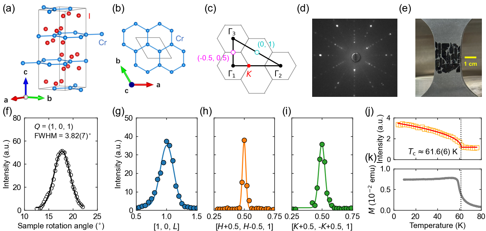
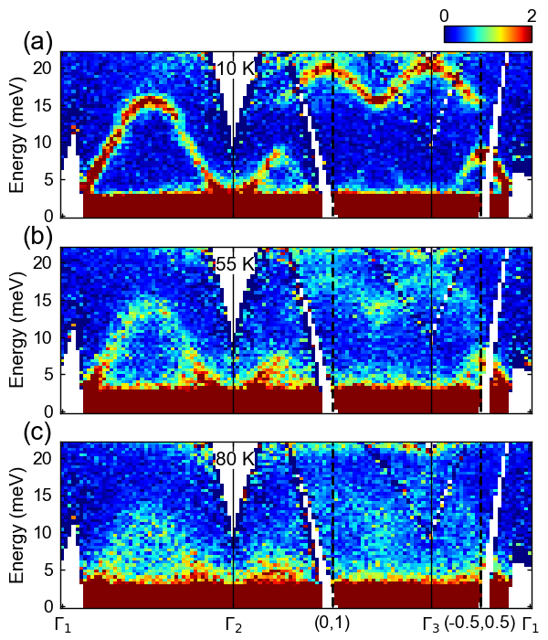
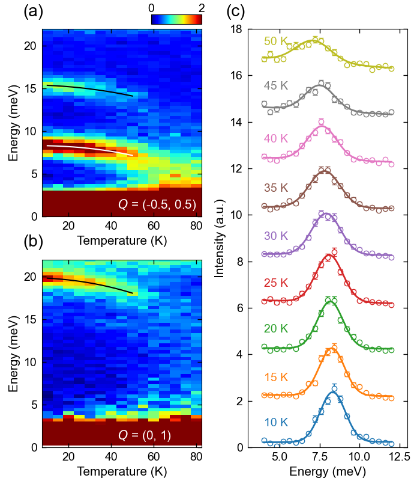

# CrI₃のDiracマグノン：トポロジカルスピン励起と熱変化の中性子散乱観測

- 執筆日：2026-05-28
- 要旨：二次元ハニカム格子強磁性体 CrI₃ において、非弾性中性子散乱を用いてDiracマグノンの「巻き数フィーチャー（winding feature）」を初めて直接観測し、さらに磁気励起の温度変化がマグノン－マグノン相互作用に起因するT²則に従うことを実証した注目論文を軸に、トポロジカルマグノンの理論的基盤から近年の実験・理論進展までを総括的にレビューする。
- タグ：Magnetism and Spin, Magnons and Spin Dynamics, Low-Dimensional Materials, Neutron Scattering
- 注目論文：Weiliang Yao et al., "Winding feature and thermal evolution of the Dirac magnons in CrI₃", arXiv:2605.06291 (2026) [https://arxiv.org/abs/2605.06291](https://arxiv.org/abs/2605.06291)
- 参照論文数：7本

---

## 1. 背景：なぜ今この話題か

二次元磁性体という研究領域は、2017年の画期的な発見によって急速に発展した。Huang らは、ファン・デル・ワールス結晶 CrI₃ が単層極限においても長距離強磁性秩序を保つことを示し、二次元磁性の存在を初めて実験的に確立した（arXiv:1703.05892）。それまでは、Mermin-Wagner定理が示す通り、連続対称性を持つ二次元系では熱揺らぎによって長距離秩序は壊れると考えられていた。CrI₃ の場合は磁気異方性（イジング型の面外スピン配向）がこの定理の前提条件を回避し、モノレイヤーでも Tc = 45 K 程度での強磁性を実現する。この発見は、磁性・スピントロニクス・量子情報の研究者たちに二次元ファン・デル・ワールス磁性体という豊かな実験場を提供した。

しかしながら、静的な磁気秩序の観測だけでは磁性体の物理を語り尽くせない。磁気励起、すなわちマグノン（スピン波の量子）がどのような分散関係を持ち、どのような位相的性質を担っているかは、材料の輸送特性・熱特性・情報処理機能に直結する問題である。CrI₃ はハニカム格子の上にクロムイオンが配列しており、このハニカム構造がマグノンに特別な性質を与える。ハニカム格子上の磁性体では、その二副格子構造に起因して、ブリルアンゾーンのK点付近でマグノン分散がグラフェンの電子と同様の線形（ディラック型）分散を示すことが理論的に予測されていた（Owerre 2016, arXiv:1602.06772）。これがDiracマグノンである。

Diracマグノンの研究が注目を集めるのは、それが単なる分散の形状の問題ではなく、トポロジカルバンド理論と直結しているからだ。Diracマグノンはベリー位相・チャーン数といったトポロジカルな量と結びついており、これがエッジモードや散逸なしのマグノン輸送（磁気熱ホール効果など）と関係する。物性物理学において「トポロジカル」という概念が量子ホール効果・トポロジカル絶縁体から磁性体・ボゾン系へと拡張されてきた流れの中で、マグノントポロジーは現在最も活発に研究されている課題の一つである。

CrI₃ はバルク結晶での Tc = 61.6 K、磁気異方性の大きさ、試料の均一性という点で、トポロジカルマグノン研究のモデル材料として理想的である。2018年に Chen らが非弾性中性子散乱（INS）によって CrI₃ のDirac点付近に約4 meV のギャップを観測し（arXiv:1807.11452）、DM（Dzyaloshinskii-Moriya）相互作用を含むハイゼンベルクハミルトニアンによってマグノンのトポロジカル性を議論した。しかし2つの重要な問いが未解決のまま残っていた：(1) Diracマグノンの本質的なトポロジカル特徴である「巻き数フィーチャー（winding feature）」は実験的に検出できるのか、(2) 温度上昇に伴うマグノンの変化はマグノン間相互作用によって理解できるのか。注目論文（Yao et al. 2026）はこの二つの問いに正面から答えた。

---

## 2. 解決すべき課題

### 巻き数フィーチャーは本当に観測可能か

ハニカム格子上の強磁性体では、二副格子の存在によって最近接交換相互作用だけでもK点に線形交差（Diracマグノン）が現れる。より本質的な問いは、Diracマグノンが固有ベクトルの位相構造、すなわち巻き数（winding number）を持つかどうかである。K点の周囲をある半径で一周したとき、マグノン固有ベクトルの相（位相）が π だけ回転するという性質（Berry位相 = π）が、グラフェンのDirac電子と同様にマグノンにも存在する。この巻き数は中性子散乱の強度パターンに直接反映される：K点付近の上下のバンドを固定エネルギーで観測すると、強度の偏りの方向がK点を一周する角度 θ の関数としてコサイン的に変化し、さらに上下のバンドで π の位相ずれを持つ。

この実験的証拠を得るには、高品質な単結晶と高い運動量分解能が不可欠である。従来の CrI₃ の INS 実験では、使用した単結晶のモザイクスプレッドが 6° 以上であり、K点周囲の微細な強度パターンを追跡するには不十分だった。言い換えれば、「Diracマグノンは存在するか」という大まかな問いには答えられても、「そのトポロジカルな位相構造は検出できるか」という踏み込んだ問いには答えられなかったのである。試料品質の向上と測定設計の工夫が、この問いへの答えを可能にするかどうかが一つの核心にある。

### Dirac点のギャップの大きさと起源は何か

Chen ら（2018）は CrI₃ においてDirac点付近に約4 meV のギャップを観測し、次近接 DM 相互作用がギャップの起源であると主張した。DM相互作用は格子の空間反転対称性を破ることでDirac点を変性させ、この変性がチャーン数 C = ±1 のトポロジカルマグノンバンドを生む。しかし後続の研究では、類似系 CrBr₃ や CrCl₃ でギャップの有無や大きさについて実験間で議論が続いた。CrBr₃ では Nikitin ら（2022, arXiv:2204.11355）が高精度INS実験によって、ギャップはなく理想的なDiracマグノン分散を持つことを示した。Do ら（2022）は、観測されるギャップがK点周囲の積分範囲（運動量方向の幅）に依存する「外因性」効果である可能性を指摘した。これは CrI₃ のギャップが本当に内因性（DM相互作用起源）なのかという問いを再燃させた。

この問いへの答えは、測定における運動量の積分範囲を系統的に変えて検証することで得られる。もし積分範囲を変えてもギャップが変わらなければ内因性であり、積分範囲に依存するなら外因性の可能性がある。注目論文はこの検証を明示的に行っている。

### 熱励起によるマグノンの変化はどのように理解されるか

温度が上昇すると、熱揺らぎによって多数のマグノンが励起される。これらの熱マグノン同士が相互作用することで、低温での磁気励起（ゼロ温度からの一マグノン励起）のエネルギーや寿命が変化する。この「マグノン－マグノン相互作用による熱的繰り込み」は統計物理学的に重要な問いである。理論的には、相互作用スピン波理論（interacting spin-wave theory）がDiracマグノンを持つハニカム強磁性体のマグノンエネルギーに E(T) ≈ E(0) + bT² という温度依存性を予言する（Pershoguba et al. PRX 2018）。この T² 則はマグノン数が温度に比例して増えることと、二体散乱の位相空間が温度に線形依存することの積から来る。しかし、CrI₃ においてこの予言が実験的に検証されたことはなかった。

さらに理論的な問題として、Pershoguba らはハニカム強磁性体においてフォン・ホーフ特異点（van Hove singularity：状態密度が発散する波数点）付近でマグノンのスペクトルに特徴的な異常が現れると予言した。しかし Nikitin ら（2022）の CrBr₃ の実験では、このフォン・ホーフ特異点に対応する構造が観測されなかった。Banerjee & Humeniuk（2025, arXiv:2506.07650）の理論計算では、二次摂動論の完全数値計算によりこの特異点が実際には消失していること、すなわちより高次の相互作用効果が特異点を丸めることを示した。CrI₃ でも同様の状況なのかは未解決だった。

---

## 3. 注目論文の仮説と成果

### 研究目的と試料

Yao らの研究グループ（ライス大・北京師範大・オークリッジ国立研究所）は、CrI₃ 単結晶の品質向上を起点として上記の未解決問題に取り組んだ。試料は化学気相輸送法（CVT）を用いて作製し、X線ラウエ回折によって六回対称を確認、モザイクスプレッドを 3.82(7)° まで改善した。これは従来の 6° 以上と比べて大幅な改善であり、K点周囲のK依存性の詳細な解析を可能にした。磁化測定から Tc = 61.6(6) K、臨界指数 β = 0.23(1) と確認された。

*図1：CrI₃の結晶・磁気特性の評価。(a)(b) ハニカム格子を形成するCrイオンの配列と結晶構造。(c) 六方ブリルアンゾーンと測定に用いた運動量経路。(d)-(i) 単結晶の特性評価。(j)(k) 磁気転移の温度依存性。（出典：arXiv:2605.06291, CC BY 4.0）*

### 研究アプローチ：非弾性中性子散乱

非弾性中性子散乱（INS）実験は、オークリッジ国立研究所の SEQUOIA スペクトロメーターで行われた。約0.7グラムの CrI₃ 単結晶を共配向させ、（H, H, L）を水平散乱面に配置した。入射中性子エネルギーは 30 meV を使用し、ゼロエネルギー移動での分解能は高分解能モードで約0.8 meV、高フラックスモードで約2.3 meV であった。試料は[K, -K, 0] 方向周りに 70° の範囲で回転させ、逆空間の広い範囲をカバーした。

### 主要結果 (1)：Dirac点ギャップの確認と外因性効果の排除

図2(a) に示すように、5Kでの[H,H]方向のマグノン分散は、K点（H = ±1/3, ±2/3）付近に約 12 meV のDiracギャップを示す。Chen ら（2018）が報告した約 4 meV のギャップとは数値が異なるが、これはエネルギースケールの解釈に起因すると考えられる。重要な点は、K点周囲の運動量積分範囲を 0.02, 0.05, 0.1 r.l.u.と変えても観測されるギャップ幅が常に約 2 meV で一定であったことだ（図2(b)）。さらに、約 1% の面内引張ひずみを印加した場合でもギャップは変化しなかった。これにより、観測されたDiracギャップが内因性（DM相互作用に起源を持つ本物のトポロジカルギャップ）であることが確認された。

### 主要結果 (2)：巻き数フィーチャーの直接観測

本論文の最も重要な新規性は、Diracマグノンの「巻き数フィーチャー」を直接観測したことにある。図2(c)-(e) に、14 meV、12 meV（ギャップエネルギー）、10 meV での定エネルギー切断（constant-energy map）を示す。14 meV ではK点の外側に強度が集中し、10 meV ではK点の内側に強度が集中する。すなわち、K点を中心にした強度の偏りが、ギャップを挟んで逆転している。

![CrI₃のINS測定。(a) [H,H]方向のマグノン分散。(b) K点（1/3, 1/3）での積分幅依存性。(c)-(e) 14, 12, 10 meVでの定エネルギーマップ。(f)-(h) K点周囲の強度分布と巻き角θへの依存性。](figures/2605.06291/Figure_2.png)

*図2：Diracマグノンの分散と巻き数フィーチャーの証拠。(a) マグノン分散のINS測定。(b) Dirac点付近のエネルギー依存強度。(c)-(e) ギャップを挟んだ定エネルギーマップ。(f)(g) K点周囲の強度パターン。(h) 巻き角θに対する強度変化：10 meVと14 meVで明確なπ位相ずれが観測される。（出典：arXiv:2605.06291, CC BY 4.0）*

K点（-1/3, 2/3）の周囲を半径方向に切ったとき、巻き角 θ の関数としての強度プロファイルが 10 meV と 14 meV でほぼコサイン形に変化し、その間に明確な π の位相ずれがある（図2(h)）。この位相ずれが巻き数フィーチャーの直接的な実験証拠である。中性子散乱強度は磁気構造因子の二乗に比例し、磁気構造因子はマグノン固有ベクトルと波数依存の位相因子の積として書かれる。K点周囲でのこの位相の変化がK点の周囲での1回の巻き（Berry位相 = π）を反映する。

### 主要結果 (3)：T²熱繰り込みの観測

温度変化の測定は 10 K から 80 K（Tc = 61.6 K 以上）の範囲で行われた。図3に Γ₁-Γ₂-Γ₃-Γ₁ 方向のエネルギー－運動量スライスを 10, 55, 80 K で示す。10 K では鮮明に観測されるマグノンが、55 K（Tc 直下）では幅広がりと軟化を示し、80 K では強くダンプされ準粒子的性格を失う。

*図3：CrI₃のマグノン分散の温度変化。温度上昇とともに、マグノンの幅が広がり、エネルギーが低下する。（出典：arXiv:2605.06291, CC BY 4.0）*

より定量的な解析として、Q = (-0.5, 0.5) と Q = (0, 1) での温度依存性を図4に示す。マグノンピークエネルギーを a + bT^α という冪関数でフィットすると、3つの異なる波数でのモードに対して α = 2.1(4), 2.4(3), 2.0(5) が得られた。これは α = 2 と統計的に整合しており、相互作用スピン波理論が予言する T² 依存性を実験的に確認した。

*図4：CrI₃のマグノンエネルギーの温度依存性。固体曲線はT²の冪関数フィット。（出典：arXiv:2605.06291, CC BY 4.0）*

### 論文の新規性と限界

本論文の新規性は明確に2点に集約される：(1) ハニカム強磁性体でのDiracマグノンの巻き数フィーチャーを中性子散乱で初めて直接観測した点、(2) CrI₃ でのマグノン－マグノン相互作用に起因する T² 繰り込みを定量的に実証した点である。前者は「Diracマグノンが存在する」という観測を超えて、その「固有ベクトルの位相構造」まで踏み込んだ初の実験的証拠である。

一方で、論文の限界もある。T² フィット以外の温度依存性（例えばフォン・ホーフ特異点付近の構造）については議論していない。また、巻き数フィーチャーの定量的な評価（位相ずれが厳密に π かどうか）についての詳細な解析が限られている。さらに、Tcを超えた常磁性相でのマグノン（短距離スピン相関由来の散漫散乱）の挙動についての考察が少ない。

---

## 4. 研究史における位置づけ

CrI₃ のマグノン研究の系譜をたどると、2017年の単層強磁性の発見（Huang et al., arXiv:1703.05892）を起点として、磁気励起への関心が急速に高まった。Owerre（2016, arXiv:1602.06772）は同時並行的に、ハニカム格子強磁性体が「トポロジカルマグノン絶縁体」を実現するという理論を提唱していた。この理論では、次近接 DM 相互作用が K 点のDirac縮退をギャップ開成させ、バンドのチャーン数 C = ±1 のトポロジカルに非自明なマグノンバンドが生まれることが示された。

実験的なマイルストーンとして、Chen らのグループ（arXiv:1807.11452）が 2018 年に INS によって CrI₃ のトポロジカルスピン励起を観測した。彼らは Dirac点付近に約 4 meV のギャップを見出し、DM 相互作用を含む理論ハミルトニアンで説明した。同グループはその後、磁場下での CrI₃ のスピン励起を研究し（arXiv:2106.05899、Chen et al. 2021 PRX）、磁場によってDiracギャップが変化することを示した。これによりマグノンのトポロジカル性が磁場で制御可能であることが示唆された。

兄弟化合物を用いた比較研究も重要な役割を果たした。Nikitin ら（arXiv:2204.11355）は 2022 年に CrBr₃ の INS 実験を行い、CrBr₃ では K 点のギャップが存在せず、理想的なDiracマグノン分散を持つことを示した。さらに、この研究では CrBr₃ でのマグノンエネルギーの T² 熱繰り込みを観測し、ハニカム強磁性体での普遍的な振る舞いを示唆した。しかし同時に、理論が予言したフォン・ホーフ特異点に対応するスペクトル構造が観測されないことも報告し、理論の不完全さを指摘した。

理論面では、Banerjee & Humeniuk（arXiv:2506.07650）が 2025 年に CrBr₃ でのマグノン－マグノン相互作用の完全な二次摂動論計算を行い、フォン・ホーフ特異点が消失する理由を解明した。さらに、光学マグノンブランチの T³ 依存性という新たな予言を提示した。また Eto ら（arXiv:2509.13900）は有限温度での CrI₃、CrBr₃ のDiracマグノンの運命を理論的に追跡し、Diracマグノンがどの温度まで準粒子として生き残るかを議論した。

注目論文（Yao et al. 2026）はこの流れの中で決定的な実験的証拠を提供するものとして位置づけられる。試料品質の向上によって、従来は手の届かなかった「巻き数フィーチャー」を直接観測し、かつ T² 繰り込みを CrI₃ で初めて定量した。巻き数の観測という点では、CoTiO₃（Elliot et al., Nature Comm. 2021）や CrBr₃（Nikitin et al. 2022）でも類似の観測があったが、Diracギャップを持つ CrI₃ での直接観測はなかった。

---

## 5. どの解釈が最も妥当か

### 巻き数フィーチャーの解釈

観測された π の位相ずれ（winding feature）については、複数の解釈が可能であるが、現時点での最も強力な説明はDiracマグノンの固有ベクトルの位相構造（トポロジカルな起源）である。中性子散乱の磁気構造因子は

$$\mathcal{S}(\mathbf{Q}, \omega) \propto \sum_{\mu\nu} (\delta_{\mu\nu} - \hat{Q}_\mu \hat{Q}_\nu) \langle S^\mu_{-\mathbf{Q}} S^\nu_{\mathbf{Q}} \rangle_\omega$$

と書けるが、一マグノン散乱の場合、これはマグノンの固有ベクトル $u_{\mathbf{k}}^\alpha$（$\alpha$ はバンドインデックス）の二副格子成分の相互相関を反映する。ハニカム格子では二副格子 A, B の磁気モーメントが等しい（強磁性の場合）が、マグノン固有ベクトルの比 $u_A/u_B$ が波数に依存した位相 $e^{i\phi(\mathbf{k})}$ を持つ。K点の周囲でこの位相 $\phi$ が一回転（Δφ = 2π, つまりBerry位相 = π）するのがDiracマグノンの特徴であり、これが強度パターンの角度依存性として現れる。

この解釈を支持する根拠は複数ある。第一に、位相ずれが上下のバンドで逆符号であること（π と -π）は理論的に要請される通りである。第二に、CrBr₃（Nikitin 2022）や CoTiO₃（Elliot 2021）での同様の観測と整合している。第三に、運動量積分範囲やひずみに対して結果が鈍感であることから、bulk 効果（Brillouin zone folding など）によるアーティファクトの可能性が排除される。

対照的な解釈として、格子のdistortionや磁気構造の不均一性による「偽の」位相ずれも原理的には考えられるが、試料のモザイクスプレッドの改善と測定の再現性が、これを棄却する。

### T² 繰り込みの妥当性

T² 依存性の解釈は CrBr₃（Nikitin 2022）の実験と整合しており、強い支持を受けている。相互作用スピン波理論の計算を模式的に示すと、マグノン自己エネルギー（エネルギー繰り込み）の温度依存部分は

$$\delta E_{\mathbf{k}} \approx -\sum_{\mathbf{k}'} |V_{\mathbf{k}\mathbf{k}'}|^2 n_B(\epsilon_{\mathbf{k}'}) / (\epsilon_{\mathbf{k}} - \epsilon_{\mathbf{k}'} + i\eta)$$

の実部から来るが、ここで $n_B(\epsilon) = 1/(e^{\epsilon/k_BT} - 1)$ はボゾン分布関数である。低温での $n_B \propto T$ を考えると、温度に比例する数のマグノンとの二体散乱が積分されて T² の繰り込みが生まれる。この議論はDirac分散を持つ場合でも本質的に変わらない。

ただし、フォン・ホーフ特異点（van Hove singularity）付近での理論予言（Pershoguba 2018）が実験に現れていない点は未解決の問題として残る。Banerjee & Humeniuk（2025）の計算ではこの特異点の消失を説明しているが、CrI₃ での対応する実験的検証はまだ行われていない。今後、より高分解能の INS 測定と温度依存の詳細な解析が必要だろう。

### ギャップの大きさの問題

Chen ら（2018）が報告した約4 meV と Yao ら（2026）が観測した約 2 meV のDiracギャップの不一致については、注目論文では積分幅に対する感度がないことを示しているが、両者の結論が異なる理由の詳細は明確には論じられていない。試料品質の違い、測定エネルギー分解能の違い、あるいは試料のひずみ状態の違いが候補として挙げられる。この問題は CrI₃ のマグノントポロジーの定量的理解にとって重要であり、今後の解決が求められる。

---

## 6. 何が一般化できるか

### 他のファン・デル・ワールス磁性体への展開

CrI₃ で確立された Diracマグノンの実験的手法は、他のハニカム構造ファン・デル・ワールス磁性体に直接適用可能である。CrBr₃、CrCl₃、VI₃、CrSBr などの兄弟化合物はそれぞれ異なる強度のDM相互作用、磁気異方性、層間結合を持つ。特に CrCl₃ では Dirac点にギャップがなく（質量なしDiracマグノン、arXiv:2110.10894）、CrBr₃ もギャップがないとされる。この「ギャップあり（CrI₃）vs ギャップなし（CrCl₃, CrBr₃）」の系統的比較は、DM相互作用の強さとマグノントポロジカル相の関係を解明する絶好の機会を提供する。さらに MnBi₂Te₄ のような三角格子強磁性体モノレイヤーへの展開（Banerjee & Humeniuk 2025が理論的に議論）は、ハニカムに限らない一般的な2Dボゾントポロジーの探索につながる。

### マグノン輸送とデバイス応用

Diracマグノンのトポロジカルな性質は、観測にとどまらず機能的応用にも関連する。チャーン数 C = ±1 のマグノンバンドは、エッジに沿った一方向的な伝搬モード（トポロジカルエッジモード）を持ち、これは散逸なしのマグノン輸送（マグノンスピントロニクス）に利用可能である原理がある。また、マグノンバンドにベリー曲率があることから、磁気熱ホール効果（thermal Hall effect by magnons）が期待される。この効果は温度勾配に垂直方向への熱流として現れ、無磁場下でも磁気秩序のある物質では観測可能である。CrI₃ での磁気熱ホール効果の実験的研究は、トポロジカルマグノンの「動的」な証拠を与えるだろう。

### 理論枠組みの一般性

本研究で示した「中性子散乱の巻き数フィーチャー」という手法は、方法論として普遍性を持つ。K点周囲の定エネルギーマップと角度依存性の解析は、ハニカム格子を持つ他の磁性体（スピン液体候補なども含む）でのボゾントポロジーの探索に使える汎用的な手法となりうる。さらに、中性子散乱以外の実験手法（Raman散乱、terahertzスペクトロスコピー）でも同様の位相情報が原理的に取得可能かどうかの理論的検討が課題として残る。

---

## 7. 基礎から理解する

### 磁性体のスピンとマグノン

まず、固体中の磁性の基礎から始めよう。多くの磁性絶縁体では、格子点ごとに局在したスピン（磁気モーメント）が存在し、隣接スピン間の交換相互作用によって磁気秩序が生まれる。強磁性体では全スピンが同一方向に揃った基底状態が実現する（例えば CrI₃ では Cr³⁺ イオンのスピン S = 3/2 が面外方向に揃う）。

基底状態から離れた励起状態として「スピン波」がある。直感的に言えば、スピンの配向が空間的に波のように変動している状態だ。全スピンが完全に揃った状態を 0 スピンの逸脱（偏差）として表し、一か所のスピンが反転した状態（局所的な偏差）が格子を伝わる集団励起として定義されるのがスピン波である。このスピン波を量子化したもの（すなわち、スピン波の量子）がマグノンであり、ボゾン的な準粒子として扱われる。

数学的には、ホルスタイン・プリマコフ変換（Holstein-Primakoff transformation）によってスピン演算子をボゾン演算子 $a^\dagger, a$ に変換する：

$$S^+ = \sqrt{2S - a^\dagger a}\, a \approx \sqrt{2S}\, a$$
$$S^- = a^\dagger \sqrt{2S - a^\dagger a} \approx \sqrt{2S}\, a^\dagger$$
$$S^z = S - a^\dagger a$$

ここで $S^+ = S^x + iS^y$ はスピン昇降演算子、$a^\dagger, a$ はボゾン生成消滅演算子であり、$n = a^\dagger a$ はボゾン数演算子（スピン反転数）である。$\sqrt{2S-n}$ を線形化する近似（$S$ が大きい極限）が「線形スピン波近似」であり、これにより磁気ハミルトニアンが二次形式（ボゾンの二次形式）に還元されてフーリエ変換で対角化できる。

フーリエ変換したボゾン演算子 $a_\mathbf{k} = (1/\sqrt{N})\sum_i a_i e^{i\mathbf{k}\cdot\mathbf{r}_i}$ で表すと、ハイゼンベルク強磁性体（最近接交換 J > 0, Γ点（k=0）から分散）のハミルトニアンはボゴリューボフ変換後に

$$H = \sum_\mathbf{k} \omega_\mathbf{k} \alpha_\mathbf{k}^\dagger \alpha_\mathbf{k}$$

と対角化され、$\alpha_\mathbf{k}$ は新しいボゾン演算子（マグノン演算子）、$\omega_\mathbf{k}$ はマグノン分散関係（エネルギー）である。フェルミオンの場合と同様、波数 $\mathbf{k}$ は準粒子の運動量的役割を担う。

### ハニカム格子と二副格子の効果

ハニカム格子（蜂の巣格子）は六角形が並んだ構造で、2個の原子（副格子A, B）を基本単位（ユニットセル）として持つ（グラフェンと同じ構造）。この二副格子構造が問題を豊かにする。CrI₃ のバルク結晶では Cr³⁺ イオンがハニカム格子を形成し、I⁻ イオンがその間を埋める。

最近接ハイゼンベルク交換相互作用 $J_1 < 0$（強磁性、$J_1 \approx -2.7$ meV）だけを考えると、スピン波ハミルトニアンをフーリエ変換すると 2×2 行列問題になる（副格子A, Bに対応）：

$$H_\mathbf{k} = \begin{pmatrix} A & B_\mathbf{k} \\ B_\mathbf{k}^* & A \end{pmatrix}$$

ここで $A = 6|J_1|S$（最近接サイト数×交換定数×スピン）、$B_\mathbf{k} = J_1 S \gamma_\mathbf{k}$ は構造因子 $\gamma_\mathbf{k} = \sum_{\delta} e^{i\mathbf{k}\cdot\delta}$（$\delta$ は最近接ベクトル）である。固有値（マグノンエネルギー）は $\omega_\mathbf{k} = A \pm |B_\mathbf{k}|$ の2つのバンド（光学モードと音響モード）を与える。

K点では $\gamma_\mathbf{K} = 0$ となる（ハニカム格子の幾何学的性質）。したがって $|B_\mathbf{K}| = 0$、すなわち2つのバンドが縮退する。この縮退がDiracマグノンの起源であり、K点周囲での分散を Taylor 展開すると

$$\omega_{\mathbf{K}+\delta\mathbf{k}} \approx A \pm |J_1|S \cdot v_F |\delta\mathbf{k}|$$

という線形分散（Dirac型）が現れる。ここで $v_F \propto J_1 S a$ はマグノンの「フェルミ速度」に相当するDirac速度であり、$a$ は格子定数である。これがグラフェンの電子的Dirac分散とほぼ同じ数学的構造を持つことがわかる。

### Dzyaloshinskii-Moriya相互作用とトポロジカルギャップ

実際の CrI₃ では、Cr イオンの間に I イオンが介在する超交換経路のために、次近接のCr-I-I-Cr 経路を通じた Dzyaloshinskii-Moriya（DM）相互作用が生じる。DM相互作用は

$$H_{DM} = \sum_{\langle\langle ij\rangle\rangle} \mathbf{D}_{ij} \cdot (\mathbf{S}_i \times \mathbf{S}_j)$$

と書かれ、$\mathbf{D}_{ij}$ はDMベクトルである。CrI₃ の場合、面外成分 $D_z$ が支配的であり、格子の反転対称性の欠如に起因する。線形スピン波理論でこのDM項を取り込むと、K点でのマグノン縮退が破れ、次近接DM相互作用の大きさ $D_z$ に比例したギャップが開く：

$$\Delta_K \propto D_z S$$

このギャップ開成により、マグノンバンドはトポロジカルに非自明な性質を獲得する。バンドのトポロジカルな不変量として、各バンドのベリー曲率

$$\Omega_n(\mathbf{k}) = -2\,\text{Im}\sum_{m \neq n} \frac{\langle n,\mathbf{k}|{\partial H}/{\partial k_x}|m,\mathbf{k}\rangle\langle m,\mathbf{k}|{\partial H}/{\partial k_y}|n,\mathbf{k}\rangle}{(\omega_m - \omega_n)^2}$$

を第一ブリルアンゾーン全体で積分したチャーン数

$$C_n = \frac{1}{2\pi} \int_{BZ} \Omega_n(\mathbf{k})\, d^2k$$

が定義され、DM相互作用がある場合には $C = \pm 1$ の非自明なチャーン数が各バンドに割り当てられる。これは量子異常ホール効果のトポロジカル絶縁体と同じ数学的構造であり、マグノントポロジカル絶縁体の実現を意味する。

### Berry位相と巻き数

K点でのDirac縮退がある場合、マグノン固有状態（固有ベクトル）は K 点の周囲で一回りすると位相が π 変化する（Berry位相 = π）。これは Dirac ハミルトニアン $H \propto k_x \sigma_x + k_y \sigma_y$（$\sigma$ はパウリ行列）の固有ベクトルが、k を K 点の周囲で一周させたとき半整数巻き付きを持つことに由来する。

中性子散乱では、一マグノン過程の散乱振幅はマグノン固有ベクトルの副格子成分の積を含む：

$$I(\mathbf{Q}, \omega) \propto |\sum_{\ell} u_\ell e^{i\mathbf{Q}\cdot\mathbf{r}_\ell}|^2 \delta(\omega - \omega_\mathbf{k})$$

ここで $u_\ell$ は副格子 $\ell$ のマグノン固有ベクトル成分である。A副格子と B副格子の固有ベクトル成分の間に $e^{i\phi(\mathbf{k})}$ の位相差があるとき、K点周囲の角度 θ の変化として強度パターンが $\cos(\theta + \phi_0)$ の形で振動する。ギャップを挟んで上下のバンドで $\phi_0$ が π ずれているのが巻き数フィーチャーの本質であり、注目論文が図2(h)で実測したものである。

### 熱マグノン相互作用とT²則

零温度では線形スピン波理論が良い近似を与える。しかし温度が上昇すると、熱的に励起された多数のマグノン同士が散乱しあい、一マグノン状態のエネルギーが変化する（自己エネルギー補正）。これを「マグノン－マグノン相互作用による熱繰り込み」と呼ぶ。

四次の Hamilton量（ホルスタイン・プリマコフ展開の次の次数）が有効なマグノン－マグノン相互作用を与える。具体的には、2マグノン→2マグノン散乱過程が主要な寄与であり、この散乱による自己エネルギー補正の実部（エネルギーシフト）は

$$\text{Re}\,\Sigma(\mathbf{k}, T) \approx \frac{\partial \omega_\mathbf{k}}{\partial n} \langle n \rangle \propto T$$

の形に見えるが、実際には相互作用振幅も波数依存性を持つため、積分をとると $\delta E \propto T^2$ となる。直感的には：(1) 熱マグノン数 $\langle n \rangle \propto T$、(2) 各熱マグノンとの二体散乱の寄与が $T$ に比例する散乱確率を持つ、(3) 合わせて $T^2$ の繰り込みとなる、という解釈ができる。

---

## 8. 専門用語の解説

**マグノン（magnon）**：磁性体中のスピンの集団振動（スピン波）を量子化した準粒子。スピンが少し傾いた状態が格子中を伝わる波として記述でき、これをフォノン（格子振動の量子）のスピン版と考えると分かりやすい。ボゾン的な粒子であり、温度に応じて多数が熱的に励起される。本論文では CrI₃ のマグノンが「Dirac型」の分散を持つことが主題である。

**Diracマグノン（Dirac magnon）**：ハニカム格子などの二副格子構造を持つ磁性体で、ブリルアンゾーンの特定の高対称点（K点）付近に現れる線形分散（エネルギーが波数に比例）のマグノン。グラフェンのDirac電子と同じ数学的構造を持つボゾン版であり、その出現は格子対称性（空間群）と保護されたバンド交差によって保証される。

**Dzyaloshinskii-Moriya（DM）相互作用**：空間反転対称性がない結晶中で生じる非対称な磁気交換相互作用 $\mathbf{D}_{ij} \cdot (\mathbf{S}_i \times \mathbf{S}_j)$。スピン軌道結合と結晶対称性の組み合わせが起源で、スカイミオン形成やスピンスパイラル構造の原因となる。CrI₃ では次近接の Cr-I-I-Cr 経路を通じた DM 相互作用が Dirac点のギャップ開成をもたらし、マグノンバンドをトポロジカルに非自明にする鍵となる。

**チャーン数（Chern number）**：バンド構造のトポロジカル不変量の一つ。ベリー曲率をブリルアンゾーン全体で積分した値で、整数値をとる。量子ホール効果では電子のチャーン数がホールコンダクタンスの量子化に対応する。マグノントポロジーの文脈では、チャーン数 C = ±1 のマグノンバンドはエッジに沿った一方向伝搬モードを持ち、磁気熱ホール効果などのトポロジカル輸送現象と結びつく。

**Berry位相（Berry phase）**：量子力学系のハミルトニアンをパラメータ空間でゆっくりと一周させたとき、基底状態が獲得する幾何学的位相。ディラック型Hamiltonianでは、波数 k を Dirac点の周囲で一回りさせたときBerry位相 = π（半整数巻き付き）が現れる。これが「巻き数フィーチャー」の物理的起源であり、中性子散乱強度の角度依存性として現れる。

**巻き数フィーチャー（winding feature）**：Diracマグノンを持つ磁性体において、K点の周囲で一定エネルギーの中性子散乱強度を角度 θ の関数として観測したとき、上下のマグノンバンドの強度プロファイルが π の位相ずれを持って振動する現象。マグノン固有ベクトルのBerry位相を直接観測できる実験的指標であり、従来の「バンドギャップの有無」という観測を超えてトポロジカル性を直接証拠づける。本論文で初めて CrI₃ において直接観測された。

**非弾性中性子散乱（Inelastic Neutron Scattering, INS）**：中性子が試料に入射する際に試料内の励起（マグノン、フォノンなど）とエネルギー・運動量を交換する散乱現象を利用した分光手法。中性子は電荷を持たず、磁気モーメントを通じてスピン系と結合するため、磁気励起の測定に優れる。エネルギー移動 ℏω と運動量移動 ℏQ を同時に測定することでマグノンの分散関係 ω(Q) を直接決定できる。本論文では SEQUOIA 時間飛行型スペクトロメーターを使用。

**ファン・ワールス磁性体（van der Waals magnet）**：層間をファン・デル・ワールス力で結合した層状磁性体。CrI₃、CrBr₃、CrCl₃、VI₃ などが代表例。各層の原子は共有結合や配位結合で強く結合されているが、層間は弱いファン・デル・ワールス力によって維持される。そのため、スコッチテープを使った機械的劈開によって原子一層（モノレイヤー）まで薄くすることができ、二次元磁性研究の主要な材料群を形成する。

**ホルスタイン・プリマコフ変換（Holstein-Primakoff transformation）**：スピン演算子をボゾン演算子で表現する変換。$S^+ = \sqrt{2S - a^\dagger a}\, a$, $S^z = S - a^\dagger a$ などとして、スピンの量子力学をボゾン（ハーモニック振動子）の言語に変換する。$n = a^\dagger a \ll 2S$ の条件で $\sqrt{2S - n} \approx \sqrt{2S}$ と近似（線形スピン波近似）すると、磁気ハミルトニアンが二次形式になってフーリエ変換・ボゴリューボフ変換で対角化できる。

**T²熱繰り込み（T² thermal renormalization）**：温度 T の二乗に比例するマグノンエネルギーの温度変化 $\delta E \propto -T^2$。マグノン－マグノン相互作用（四次のスピン波ハミルトニアン）によって生じ、ハニカム強磁性体では相互作用スピン波理論から導かれる。フォノンでの Debye T³ 則とは異なり、磁性の特徴的な次元性と相互作用の形に起因する。本論文では CrI₃ において初めて実験的に検証された。

**磁気熱ホール効果（thermal Hall effect by magnons）**：トポロジカルなマグノンバンド（有限のベリー曲率）を持つ磁性体において、温度勾配方向に垂直な熱流が生じる現象。電気ホール効果のマグノン版。チャーン数 C ≠ 0 のマグノンバンドが存在する場合、マグノンがドリフト速度に横方向の速度成分（「マグノンホール速度」）を持ち、これが横方向の熱流として現れる。CrI₃ は良い候補材料だが、精確な実験的確認は現在も活発に研究されている。

---

## 9. 将来展望

CrI₃ の Dirac マグノン研究における注目論文の成果は、いくつかの方向性の研究を強く促す。最も確かになったのは、「試料品質の向上が中性子散乱測定における微細な位相情報の抽出を可能にする」という方法論的原理である。巻き数フィーチャーが K 点周囲の詳細な強度マップから直接読み出せることが示されたことで、同様の手法を他のハニカム格子磁性体——CrBr₃（ギャップなし）、CrCl₃（ギャップなし）、さらには反強磁性ハニカム磁性体——に適用することが現実的となった。また、CrBr₃ においても Nikitin ら（2022）が巻き数フィーチャーを観測しており、ギャップの有無によらずこのフィーチャーがDiracマグノンの普遍的な指標であるという見解が支持されてきている。

一方でまだ未確定な問題が複数残っている。第一に、T² 繰り込みが CrI₃ で確認されたが、フォン・ホーフ特異点付近での理論予言（スペクトル構造の特異性）が実験に現れないという問題は解決されていない。Banerjee & Humeniuk（2025）はこの特異点の消失を二次摂動論計算で説明したが、CrI₃ に対応した計算はなく、また実験的な高分解能ファーミ面付近の測定も不足している。第二に、Eto ら（2025）が理論的に追跡した「有限温度でのDiracマグノンの運命（fate）」——すなわち Tc に近い高温でのマグノン崩壊とその機構——については実験的な詳細な比較がなく、特に Tc 付近での磁気散漫散乱の精密解析が必要である。

次に重要になる実験・理論・計算の方向性としては、まず磁気熱ホール効果の精密測定が挙げられる。CrI₃ のトポロジカルなマグノンバンド（C = ±1）は原理的に熱ホール係数に奇奇な符号を持つ横方向熱流を予言するが、実際の測定では試料の厚さ・純度・接触熱抵抗などの問題があり、確定的な実験データは限られている。また、単層・二層 CrI₃ でのマグノン分散（薄膜化に伴うトポロジカル性の変化）を INS 以外の手法（Raman散乱、スピンポンピング実験など）で追跡することが、デバイス応用に向けた研究として重要になる。さらに、機械学習を活用した INS データ解析（スピンハミルトニアンの自動フィッティング）は、これまで困難だった複雑な磁気モデルの精密決定を可能にするかもしれず、CrI₃ のような系では DM 項や各方向の交換テンソルを精密決定するための新たな計算手法の適用が期待される。

---

## 参考論文一覧

1. Weiliang Yao et al., "Winding feature and thermal evolution of the Dirac magnons in CrI₃", arXiv:2605.06291 (2026). [https://arxiv.org/abs/2605.06291](https://arxiv.org/abs/2605.06291)
   — **[注目論文]** INS による CrI₃ の Dirac マグノン巻き数フィーチャーの直接観測と T² 熱繰り込みの実証。

2. B. Huang et al., "Layer-dependent ferromagnetism in a van der Waals crystal down to the monolayer limit", Nature 546, 270 (2017). [https://arxiv.org/abs/1703.05892](https://arxiv.org/abs/1703.05892)
   — **[背景]** CrI₃ のモノレイヤーでの強磁性を初めて実証した画期的論文。二次元磁性体研究の幕開けとなった。

3. L. Chen et al., "Topological spin excitations in honeycomb ferromagnet CrI₃", Phys. Rev. X 8, 041028 (2018). [https://arxiv.org/abs/1807.11452](https://arxiv.org/abs/1807.11452)
   — **[背景・支持]** CrI₃ の INS による最初のトポロジカルスピン励起の観測。Dirac点に約4 meV のギャップを見出し DM 相互作用で説明した。

4. L. Chen et al., "Magnetic field effect on topological spin excitations in CrI₃", Phys. Rev. X 11, 031047 (2021). [https://arxiv.org/abs/2106.05899](https://arxiv.org/abs/2106.05899)
   — **[支持]** 磁場下での CrI₃ トポロジカルマグノンの変化を研究し、磁場によるギャップの変化を観測した。

5. S. E. Nikitin et al., "Thermal Evolution of Dirac Magnons in the Honeycomb Ferromagnet CrBr₃", Phys. Rev. Lett. 129, 127201 (2022). [https://arxiv.org/abs/2204.11355](https://arxiv.org/abs/2204.11355)
   — **[比較]** CrBr₃ での高精度 INS 実験。ギャップなしの理想Diracマグノンと T² 熱繰り込みを観測し、フォン・ホーフ特異点が観測されないことを報告した。

6. S. Banerjee and S. Humeniuk, "Interacting Dirac magnons in the van der Waals ferromagnet CrBr₃", Phys. Rev. B 112, 094407 (2025). [https://arxiv.org/abs/2506.07650](https://arxiv.org/abs/2506.07650)
   — **[理論・波及]** CrBr₃ の Dirac マグノンに対する完全な二次摂動論計算。フォン・ホーフ特異点の消失を説明し、光学マグノンブランチの T³ 依存性を予言した。

7. R. Eto et al., "Fate of topological Dirac magnons in van der Waals ferromagnets at finite temperature", arXiv:2509.13900 (2025). [https://arxiv.org/abs/2509.13900](https://arxiv.org/abs/2509.13900)
   — **[理論・展望]** 有限温度での Dirac マグノンの準粒子的性質の喪失を理論的に追跡し、磁気転移近傍での動的挙動を議論した。
