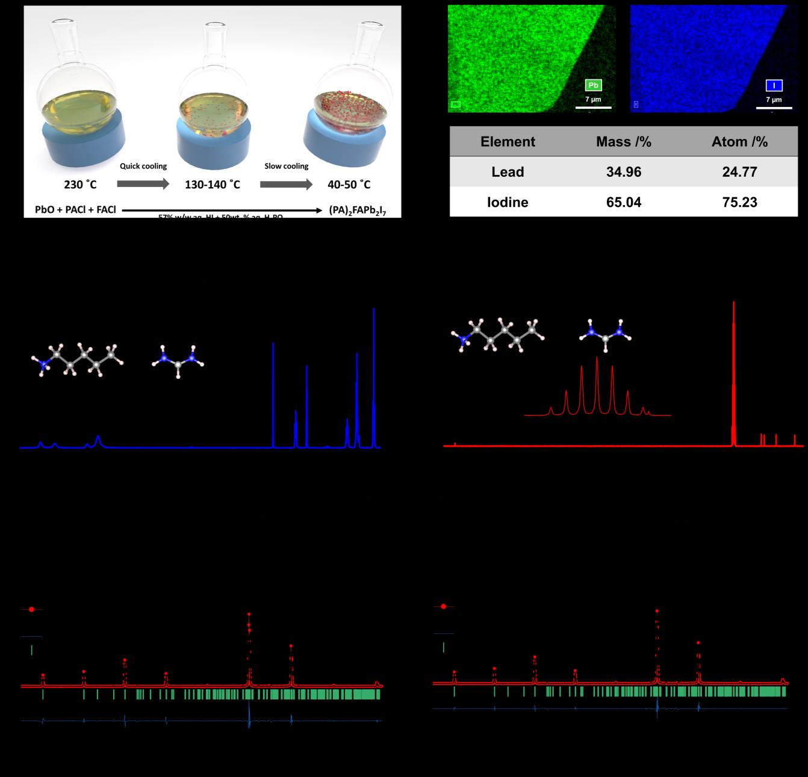
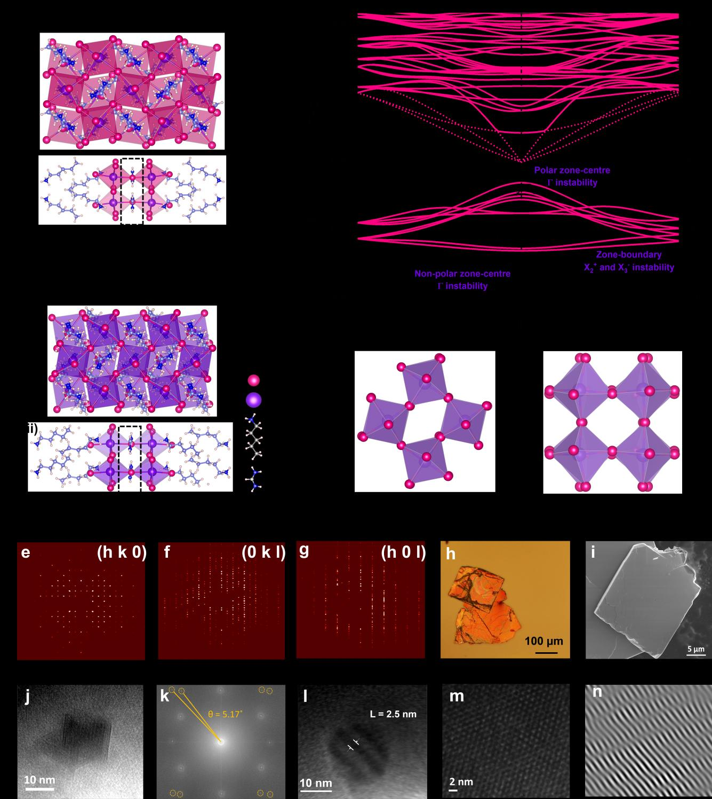
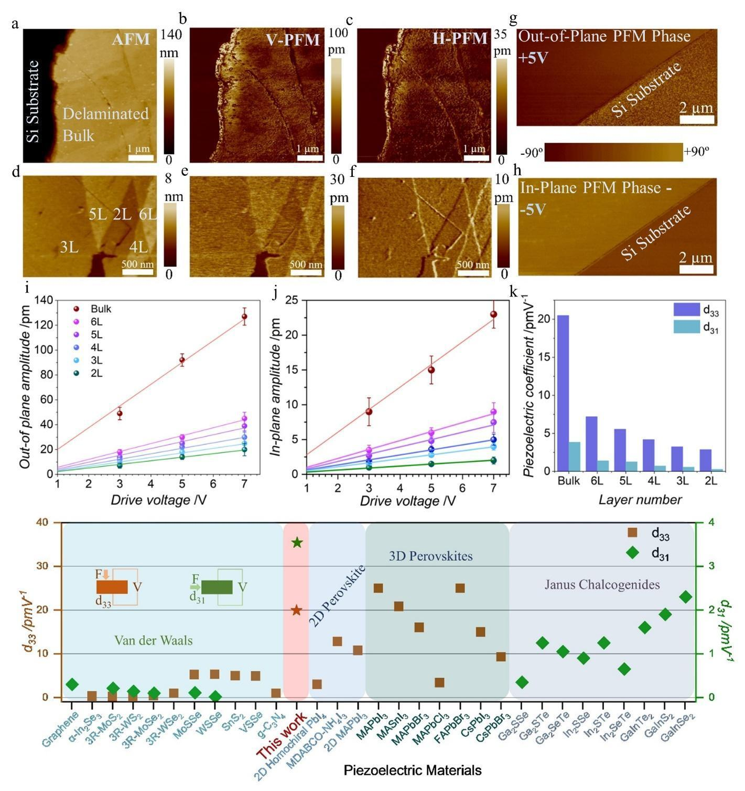
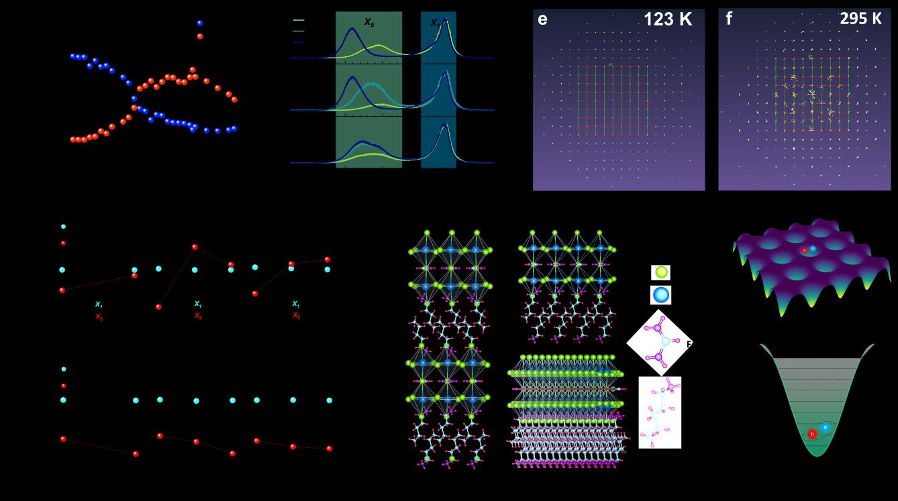
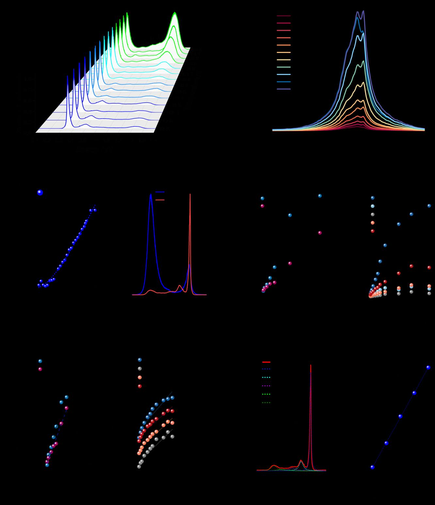

# 2Dハライドペロブスカイトのモアレ誘起エキシトン量子化

- 執筆日: 2026-05-28
- 要旨: 2次元Ruddlesden-Popper型ハライドペロブスカイト(PA)₂FAPb₂I₇において、複合型非固有強誘電性（hybrid improper ferroelectricity）を駆動力とした擬同形双晶（pseudo-merohedral twinning）によって自発的なモアレ超格子が形成されることを報告した論文を軸に、2Dペロブスカイトの強誘電性・光物性・モアレ閉じ込め効果を統合的に解説する。双晶界面でのモアレポテンシャルが低温（123 K）で整合状態に移行しエキシトンを量子化することで、等間隔フォトルミネッセンスラダーとして観測されるという新描像は、長年議論されてきた異常二次発光問題を解決し、ツイストロニクスを2Dペロブスカイト系へ拡張する道を開く。
- タグ: Semiconductors and Electronic Materials, Low-Dimensional Materials, Excitons and Photoinduced Response, Synchrotron Measurements
- 注目論文: [Hybrid Improper Ferroelectricity and Moiré Superlattices-induced Exciton Quantization in Layered 2D Halide Perovskite (arXiv:2605.21449)](https://arxiv.org/abs/2605.21449)
- 参照論文数: 8本

---

## 1. 背景：なぜ今この話題か

2次元（2D）層状ハライドペロブスカイトは、光電変換・発光デバイス・量子光エミッタとして急速に注目を集めている材料系である。一般式 (R-NH₃)₂[A_{n-1}Pb_nI_{3n+1}] で表されるRuddlesden-Popper（RP）型ハライドペロブスカイトは、長鎖有機アンモニウムカチオン（R-NH₃⁺）が金属ハライド層（PbI₆八面体のシート）をn層ずつ積み重ねた構造を持ち、量子閉じ込め効果による強い励起子（エキシトン）束縛エネルギーと鮮やかな発光特性が特徴的である。nを変えるだけで量子井戸の幅を制御でき、バンドギャップを系統的にチューニングできることから、近年では太陽電池・LEDへの応用が急速に進んでいる。

一方、このような2Dペロブスカイト系において、低温でのみ観測される異常な二次発光（secondary PL）が長年報告されており、その起源は強い議論の対象となってきた。いくつかの実験グループはこの発光を自己捕捉エキシトン（self-trapped exciton, STE）に帰属しようとしてきたが、発光のピーク位置が温度によってジャンプするような不連続性や等間隔に並ぶ複数ピーク構造は、STEの描像では説明しにくかった。

さらに時を同じくして、遷移金属ダイカルコゲナイド（TMD）ヘテロ構造で発展してきた「モアレ物理学」が、2Dペロブスカイト系へと拡張されつつある。TMD系では微小な格子定数のミスマッチや微角度ツイストによって生じるモアレ超格子が、エキシトンを量子ドット的に閉じ込め、量子化された発光スペクトルを与えることが知られている。この文脈において、2Dペロブスカイト系でもモアレポテンシャルに類似した閉じ込め機構が働いているのではないかという仮説が浮かび上がってきた。

そして2026年5月、ペロブスカイト研究コミュニティは新しい視点をもたらす論文に接した。Padelkarらは(PA)₂FAPb₂I₇（PA：ペンチルアンモニウム、FA：ホルムアミジニウム）のバルク単結晶において、複合型非固有強誘電性（hybrid improper ferroelectricity, HIF）を駆動力とした擬同形双晶（pseudo-merohedral twinning）が自発的なモアレ超格子を形成することを示した。このモアレ格子は低温で整合（commensurate）状態に移行し、エキシトンを量子化する局在ポテンシャルを提供することで、等間隔の発光ラダーを与えるというのが彼らの主張である。この発見は、2Dペロブスカイトの異常二次発光問題に明快な解答を与えるとともに、有機-無機ハイブリッドペロブスカイト系におけるモアレ物理学の新章を開くものとして注目されている。

---

## 2. 解決すべき課題

2Dハライドペロブスカイト研究が直面する中心的な問いは、大きく3つに整理できる。

第一の問いは、「ヨウ化物組成の2Dペロブスカイトにおいて、なぜ常温で強誘電性が生じにくいのか、また実際にどんな機構で強誘電性が発現しうるか」という問いである。3D有機-無機ペロブスカイト（MAPbI₃など）では自発分極の実験的証拠が長年議論されてきたが、低次元系に目を向けると、強誘電的な長距離秩序が確立されているのは主に酸化物RP系（Ca₃Ti₂O₇など）であり、ハライドRP系ではその証拠が乏しかった。ヨウ化物系で強誘電性が発現するためには適切な格子歪みとフォノン不安定性が必要であり、どのような構造的条件がその閾値を超えさせるかが問われている。

理論的には、複合型非固有強誘電性（HIF）のメカニズムがひとつの答えを与えうる。HIFでは、一次の秩序変数として二つの非極性フォノンモード（Q₁, Q₂）が自発的に凍結し、その三重線形カップリング（trilinear coupling）を通じて二次的に極性変位（分極 P）が誘起される。自由エネルギー密度に

$$F \supset -\lambda Q_1 Q_2 P$$

という項が含まれるとき、Q₁とQ₂が有限の値を持てば、Pの値はF最小化条件から

$$P = \frac{\lambda Q_1 Q_2}{\alpha}$$

（αはPに関する二次の展開係数）と決まる。つまり、Pの「固有の」不安定性がなくても分極が生じうる。この枠組みが2Dハライドペロブスカイトに適用できるかどうかが問われており、注目論文はその肯定的な証拠を提示した。

第二の問いは、「2Dペロブスカイト系における異常二次発光の起源は何か」である。多くの2D RP型ハライドペロブスカイトでは、高エネルギー側に位置する一次励起子発光（主ピーク）に加え、低エネルギー側に複数のサテライトピークが低温で出現する。これらが一般的な自己捕捉エキシトン（STE）によるものならば、ピーク間隔は非対称で連続的であるはずだが、等間隔の梯子状構造が観測されることがある。また、特定の温度でピークが急変するという報告も複数あった。この不連続性を自己トラップモデルで説明するのは困難であり、何らかの構造的相転移が関与している可能性が指摘されていた。

第三の問いは、「モアレ物理はTMD系に固有のものか、それとも他の2D物質系でも同様の現象が現れるか」という普遍性の問いである。TMDヘテロ二層系では微小ツイスト角θに対してモアレ周期 L_M ≈ a / (2 sin(θ/2)) で与えられる周期性が生まれ（aは格子定数）、このモアレポテンシャルによりエキシトンが量子ドット的に局在することが豊富な実験的証拠によって裏付けられている。2Dペロブスカイト系は結晶構造が根本的に異なるが、双晶形成や積み重ね秩序によって類似のモアレ効果が生じうるかは未知数だった。

---

## 3. 注目論文の仮説と成果

### 研究対象と動機

Padelkarら（2026）が扱った系は n=2 のRuddlesden-Popper型ハライドペロブスカイト (PA)₂FAPb₂I₇ であり、ペンチルアンモニウム（PA = CH₃(CH₂)₄NH₃⁺）を長鎖スペーサーとし、ホルムアミジニウム（FA = CH(NH₂)₂⁺）が内部Aサイトに位置するn=2バイレイヤー構造である。この系でヨウ化物組成の2DRP系として常温付近でのフォトルミネッセンスに異常な低エネルギーサテライトが報告されており、その起源が未解決であった。著者らはこの発光の起源を構造的観点から系統的に解明しようとした。

### 研究アプローチ

著者らは溶液法により育てた高品質単結晶に対し、X線回折（単結晶X線構造解析）、ラマン分光、偏光光学顕微鏡、低温フォトルミネッセンス（PL）分光を組み合わせた多面的な実験を行った。X線構造解析によって結晶の空間群と原子変位を精密に決定し、格子のモード分解によりどのフォノンモードが凍結しているかを同定した。ラマン測定では温度依存性を追い、構造相転移の証拠を探した。PLスペクトルの温度依存性を詳細に追跡することで、異常サテライトピークがどの温度でどのように出現・変化するかを明らかにした。

*Figure 1 (Padelkar et al., arXiv:2605.21449, CC BY-NC-SA 4.0): 単結晶合成と基本構造解析。PXRDの実験データ（赤）と非中心対称空間群Pna21のシミュレーション（黒）が一致し、常誘電相（Pnma）からの対称性破れを支持する。*

### 主要結果

**複合型非固有強誘電性の証拠**: 単結晶X線解析によって、(PA)₂FAPb₂I₇は波数ベクトルがBrillouinゾーン境界（X点）にある二つの非極性フォノンモード X₂⁺ と X₃⁻ が同時に凍結していることが示された。これらはPbI₆八面体の面内回転と面外傾きに対応する。対称性解析によれば、この二つのモードが共存すると三重線形カップリング項 $-\lambda Q(X_2^+) \cdot Q(X_3^-) \cdot P(\Gamma_4^-)$ が対称性から許容され、非極性モードの積を通じてΓ点の極性変位（分極）が誘起される。すなわち、この材料系はHIFの典型的な特徴を示す。圧電係数 d₃₃ として約 20 pm/V という値が報告されており、これは2Dペロブスカイトとしては最高水準の値の一つである。

*Figure 2 (Padelkar et al., arXiv:2605.21449, CC BY-NC-SA 4.0): HIFの構造的証拠。Pnma相でフォノン不安定性を持つX₂⁺（回転）とX₃⁻（傾き）モードが同時に凍結し、三重線形カップリングを通じてΓ₄⁻極性変位（分極）を誘起することがフォノン計算で示されている。*

*Figure 3 (Padelkar et al., arXiv:2605.21449, CC BY-NC-SA 4.0): PFMによる圧電性の直接測定。面外・面内の両方向で明瞭な圧電信号が観測され、HIF機構によって誘起された分極の証拠を与えている。2Dペロブスカイト系として高水準の d₃₃ ≈ 20 pm/V が確認された。*

**擬同形双晶とモアレ超格子**: HIFによる構造歪みは、隣接する結晶ドメイン間に約 5.17° の回転ミスアライメントをもたらす擬同形双晶（pseudo-merohedral twinning）を発生させる。通常のX線回折では二つのドメインの反射がほぼ重なって見えるため、標準的な単結晶解析では発見しにくい種類の双晶である。この5°程度のミスアライメントは、二つの格子間に干渉パターン、すなわちモアレ超格子を形成する。モアレ周期は $L_M \approx a / (2\sin\theta/2)$（aは面内格子定数）と概算でき、この系では数nm〜十数nmオーダーとなる。

*Figure 5 (Padelkar et al., arXiv:2605.21449, CC BY-NC-SA 4.0): モアレ超格子の実空間・逆空間表示。123 KとRoom temperatureで逆格子スポットパターンが変化し、C-IC転移を可視化している。モアレポテンシャルV_moiréの空間変調もイラストで示されている。*

**整合-非整合転移（C-IC転移）**: この自発モアレ超格子は温度に依存した整合-非整合（commensurate-incommensurate, C-IC）転移を示す。123 K以下では二つのドメインが互いに整合状態に引き込まれ（commensurate pinning）、ほぼ完全に周期的なモアレポテンシャルが実現する。298 K（室温）では熱ゆらぎによって整合性が崩れた非整合（incommensurate）相となり、モアレポテンシャルは乱れる。この転移はラマン測定で観測された特定フォノンモードの温度依存性とよく対応している。

**エキシトン量子化とPLラダー**: 整合相（低温）における規則的なモアレポテンシャルは、エキシトンに対して周期的な量子閉じ込め環境を提供する。モアレ周期のポテンシャルウェルに局在したエキシトンのエネルギー準位は離散的に量子化され、これが等間隔のPLピーク列（PLラダー）として観測される。低エネルギー側から数えて複数の等間隔ピークが 123 K で観測され、その間隔の均一性は量子化準位に合致する。一方、室温（298 K）では非整合相となりモアレポテンシャルが不規則化するため、PL発光は幅広い単一ブロードピークとなり、等間隔構造は消える。

*Figure 4 (Padelkar et al., arXiv:2605.21449, CC BY-NC-SA 4.0): 本論文の核心。温度低下とともに等間隔のPLピーク（X₁, X₂, X₃, X₄, X₅）が出現する。これらはモアレポテンシャルによって量子化されたエキシトン準位からの発光として解釈される。室温では単一ブロードピークのみ観測され、C-IC転移と対応している。*

**異常二次発光問題の解決**: 以上の描像はまさに、長年未解決だった低温二次発光問題に対する明確な解答を与える。複数の等間隔ピークはモアレ閉じ込めエキシトンの量子化準位からの発光であり、STEや単純な音響フォノンレプリカでは説明できない等間隔構造が自然に説明される。温度による発光形状の急変は、モアレ格子のC-IC転移に対応している。

### 論文の新規性と限界

本論文の最大の新規性は、複合型非固有強誘電性という「材料が自発的に持つ構造対称性の破れ機構」と、モアレ物理という「異なる2D格子間の幾何学的干渉現象」を橋渡しした点にある。従来のモアレ研究の多くは意図的なツイストや人工的なヘテロ積層を前提とするのに対し、本研究では結晶化過程で自発的に形成されたモアレ超格子が長年の謎（異常PL）を解決するという展開が鮮やかである。

一方で限界もある。実験は特定のバルク単結晶に対するものであり、薄膜や単層への展開において同様のHIF機構と双晶形成が生じるかは未確認である。また、HIFを駆動する二つの非極性モードのどちらがより支配的かを定量的に分離するさらなる理論解析が望まれる。さらに、モアレポテンシャルの実空間分布を直接可視化する実験（STMや低温近接場光学測定など）は本論文には含まれておらず、今後の課題である。

---

## 4. 研究史における位置づけ

### 複合型非固有強誘電性の誕生と発展

強誘電性には「固有（proper）強誘電性」と「非固有（improper）強誘電性」という分類がある。固有強誘電性では極性フォノンモード自体が不安定化し（ソフトモード）、その凍結によって自発分極が生じる。代表的な例はBaTiO₃である。これに対し非固有強誘電性では、分極は一次的な秩序変数ではなく、他の次数パラメータに従属した二次的なものとなる。

「複合型（hybrid）」を冠した概念は2011年にBenedek & Fennieによって理論提案された（arXiv:1007.1003）。彼らはRuddlesden-Popper型酸化物Ca₃Mn₂O₇に対して第一原理計算を行い、二種類の非極性八面体回転モードが三重線形カップリングを通じて分極を誘起することを示した。この提案の革新性は、Q₁やQ₂のうちどちらかが単独で不安定化する必要はなく、二つが組み合わさったときに初めて分極が生まれるという点にある。これにより従来の強誘電性の概念が大きく拡張された。

理論予測から4年後の2015年、Oh et al.（arXiv:1411.6315）はRuddlesden-Popper型酸化物(Ca,Sr)₃Ti₂O₇の単結晶においてHIFの実験的証明を達成した。室温スイッチング可能な分極と、HIF特有の帯電ドメイン壁が豊富に存在することが確認され、この描像が実際の材料系で機能することが示された。これ以降、HIFはBaTiO₃系に次ぐ「設計原理」として注目を集め、酸化物ペロブスカイト以外への展開が模索されてきた。

### 2Dハライドペロブスカイトへの連鎖

2Dハライドペロブスカイトに目を向けると、強誘電性の報告は長い間散発的であり、ヨウ化物組成では特に乏しかった。2024年の視点論文（arXiv:2412.03952）が総括しているように、2Dペロブスカイトの強誘電性研究は多くが酸化物系（RP型酸化物の薄膜化）に集中しており、ハライド系への適用は課題の多い段階にあった。同年以降、2Dハライド系の電子的機能性に新たな視野が開かれた。例えばarXiv:2604.08360では、2D強誘電性RP型ハライドペロブスカイトがシフト電流と持続スピンヘリックスという双方の機能を持ちうることが理論的に示されている。ただしこれらはDFT計算に基づく予測であり、HIFの実験的実証とは異なる。注目論文（2605.21449）は、ヨウ化物系の2Dハライドペロブスカイト単結晶において初めてHIFに対応する構造証拠と機能特性（圧電性、モアレ誘起発光量子化）を総合的に示した点で、重要なマイルストーンとなっている。

### エキシトン物理学との交差

2Dペロブスカイトにおけるエキシトン物理の研究も独立して発展してきた。arXiv:2010.15929（Lo et al.）は、バルク型RP系ハライドペロブスカイトのエキシトン拡散において、低温でエネルギーファネリング機構が働き、不均一なエネルギー地形が長距離輸送を実現することを示した。エキシトンはSTEに変わる前に局所エネルギー極小点へと集まり、局所場所によって発光エネルギーが変動することも示された。この「不均一局所環境」という要素は本論文のモアレポテンシャルと深く関連する。

さらにarXiv:2405.02950や2510.13547に見られるように、2D RPペロブスカイトでは「自己ハイブリッド化励起子ポラリトン」が形成されることも近年報告されており、同一材料内部でフォトニックな光閉じ込めと励起子が結合するという現象が豊富な光物理を生み出している。これらの研究は、2Dペロブスカイトがエキシトン物理の多様な側面を示す魅力的な舞台であることを示している。本論文はこうした文脈の中に、モアレ閉じ込めというまったく新しい局在機構を加えた。

---

## 5. どの解釈が最も妥当か

### HIF機構の妥当性

注目論文の中核的主張、すなわち「(PA)₂FAPb₂I₇においてHIFが実現している」という解釈を支持する証拠はいくつかある。第一に、単結晶X線解析によって空間群の対称性破れと原子変位の方向が精密に決定されており、X₂⁺とX₃⁻モードの共存がデータと整合している。第二に、HIFの三重線形カップリングから自然に導かれる分極方向と、測定された圧電性の符号が整合している。

ただし、HIFに対する別の解釈可能性も排除しきれていない。一つは、ヨウ化物系の場合、有機カチオン（FAやPA）自身の配向秩序が強誘電的分極に寄与するという可能性である。有機カチオンの配向相転移は3D系のMAPbI₃でも長年議論されており、2D系でも同様の寄与が疑われる。もし有機カチオンが主役であれば、HIFの三重線形カップリングは補助的な役割にとどまることになる。この点については、選択的重水素化（deuteration）や中性子回折によってカチオンダイナミクスを直接調べる実験が決め手になりうる。

### モアレポテンシャルとC-IC転移の解釈

等間隔PLラダーをモアレ閉じ込めエキシトンで説明するという解釈は非常に魅力的だが、競合する解釈として「音響フォノンレプリカ」や「LO（縦光学）フォノンカップリングによるビブロニック進行」が挙げられる。これらは発光ピーク間のエネルギー差がフォノンエネルギーに対応するという特徴を持つ。ただし、観測されたピーク間隔の等間隔性と、それが特定の温度（C-IC転移温度）で急変するという温度依存性は、フォノンレプリカの描像では自然には説明しにくい。

モアレ閉じ込めを支持する証拠として最も強力なのは、PL特性の急変がX線や光散乱で観測される構造変化（整合-非整合転移）と同じ温度で生じるという相関関係である。この整合性は偶然とは考えにくく、モアレC-IC転移が発光特性を支配しているという描像に強い支持を与えている。

一方、ソフトウェアによる構造シミュレーションや透過型電子顕微鏡（TEM）によるモアレパターンの直接観察が行われていない点は、現時点での限界である。モアレ周期や局所ドメイン構造を実空間で直接確認することで、本論文の主張はさらに強固となるだろう。

### エキシトン-構造カップリングの普遍性

関連研究（arXiv:2510.13547）が示すように、2Dハライドペロブスカイトではエキシトン-ポーラロン強結合という現象も重要であり、エキシトンは格子変形（ポーラロン）と常に強く混合している。モアレポテンシャルによる量子化を議論する場合、ポーラロン形成によるエキシトン質量の重さとモアレ周期の組み合わせが、観測される量子化エネルギーを決定する。この観点からすると、軽いポーラロン（裸のエキシトン）を仮定した単純な量子化モデルと実験値との比較は注意が必要であり、有効質量の補正が今後の精密化に必要とされる。

---

## 6. 何が一般化できるか

本研究の知見は、いくつかの方向への一般化を示唆している。

第一に、HIFを使った「意図的なモアレ設計」という設計原理への道が開ける。従来のモアレ物理学では、ツイスト角を外部から制御することがモアレ周期の設計手段だったが、本研究ではHIFという内部機構が自発的に特定の双晶角度を選択することが示された。これは、化学組成（アンモニウムカチオンの鎖長、Bサイト金属、ハライドの種類）を変えることで双晶角度—ひいてはモアレ周期—を制御できる可能性を示唆する。RP系の豊富な化学的多様性（n=1, 2, 3, …）と有機カチオンの可変性を組み合わせれば、モアレ周期を系統的にチューニングした「ペロブスカイトモアレ設計学」が成立しうる。

第二に、圧電・光電子・ツイストロニクスという複合機能への展開が期待される。本論文が示した d₃₃ ≈ 20 pm/V という圧電係数は、有機-無機ハイブリッドペロブスカイトとしては高水準であり、応力による発光制御（圧電光電子効果 piezophototronic effect）への応用が見込まれる。モアレポテンシャルは外部圧力や電場によって変調できる可能性があり、これは「圧電-光電子-モアレ」三者を統合したマルチファンクショナルデバイスへとつながる概念である。

第三に、HIFと双晶の組み合わせという観点は他の材料系にも輸出できる。たとえばルビジウム系やセシウム系の無機RP型ハライド（Cs₂PbI₄など）、あるいはチタン酸系RP酸化物の薄膜化においても、HIFが双晶角を制御しモアレ超格子を形成するという機構が働きうる。特に、磁気的な秩序を持つRPマンガン酸化物（Benedek-Fennieの原点）においてモアレが形成される場合、磁気・強誘電・光学の三つが結合したマルチフェロイック-モアレ系という全く新しいフロンティアが開けうる。

---

## 7. 基礎から理解する

### Ruddlesden-Popper構造とは

Ruddlesden-Popper（RP）構造は、ペロブスカイト型ユニット（ABO₃やABX₃）がn層ずつ積み重なり、その間にカチオン層（Aサイトカチオンのみの層）が挟まった層状構造の総称である。一般式は A'₂[A_{n-1}B_nX_{3n+1}] と書ける（A'はスペーサーカチオン、XはOまたはハライド）。n=1は単層型、n=2は二層型、n=∞は3Dペロブスカイトに収束する。

ハライド系（X=I, Br, Clのいずれか）では、スペーサーとして長鎖有機アンモニウムカチオン（butylammonium BAなど）を用いることで、金属ハライド面の間隔を広げ、量子閉じ込め効果を利用できる。Pb₂I₇²⁻層（n=2）は二つのPbI₆八面体シートが面共有で結合した「バイレイヤー」をなす。各PbI₆八面体はPb²⁺を中心に六つのI⁻が配位した構造で、s軌道（Pb 6s）とp軌道（I 5p）のハイブリッド化がバンド構造の基礎を形成する。

この量子井戸様の構造では、平面内への光は強く吸収・放出されるため、フォトルミネッセンス効率が高く、エキシトン束縛エネルギーは150〜500 meV（3D系では数meV〜数十meV程度）と非常に大きい。従って、室温においても励起子が安定に存在し、光物性を支配する。

### エキシトンとは

固体中の光励起によって生じる電子-正孔対が、クーロン相互作用によって束縛された複合粒子をエキシトン（励起子）と呼ぶ。自由電子と正孔の対ではなく、中性粒子として振る舞う点が特徴的である。

バルク半導体（例：GaAs）では、Mott-Wannier型エキシトンと呼ばれる空間的に広がったエキシトンが現れ、束縛エネルギーは数meVから数十meVに過ぎない。これは誘電率が大きく（ε ≈ 10〜13）、電子・正孔の有効質量が小さいためである。一方、2D系では誘電定数が小さく（誘電スクリーニングが弱い）、かつ量子閉じ込めによって電子-正孔の空間的重なりが大きくなるため、束縛エネルギーが飛躍的に増大する。2DペロブスカイトではFrenkel型エキシトンに近いほど強く束縛された励起子が生じうる。

エキシトンの発光エネルギーは、バンドギャップ $E_g$ からエキシトン束縛エネルギー $E_b$ を引いた位置に現れる：

$$E_{PL} = E_g - E_b$$

温度、応力、電場、局所ポテンシャルによって $E_g$ や $E_b$ が変化するため、PLスペクトルはこれらの物理量を反映する「プローブ」となる。

### 強誘電性とは

強誘電体とは、外部電場なしに自発的な電気分極（自発分極）を持ち、かつその分極の向きが外部電場によって反転可能な材料のことである。自発分極は結晶内の正イオンと負イオンが等価ではない位置に変位することで生じる。BaTiO₃では、Ti⁴⁺イオンが酸素八面体の中心から微小にずれることで分極が生じる（固有強誘電性の代表例）。

熱力学的には、強誘電体の相転移はLandau理論で記述できる。分極Pを秩序変数とし、自由エネルギーを

$$F(P) = F_0 + \alpha P^2 + \beta P^4 + \cdots - EP$$

と展開する（αは温度に依存し、転移温度Tcでα=0となる）。α > 0のとき（高温相）はP=0が安定（常誘電体）、α < 0のとき（低温相）は $P = \pm\sqrt{-\alpha/2\beta}$ が安定（強誘電体）となる。

### 非固有・複合型非固有強誘電性

「固有」強誘電性では、上述のようにPが一次の秩序変数である。これに対し「非固有（improper）強誘電性」では、Pは他の変数（例えば反強磁性秩序ベクトルや八面体回転のモード振幅）に従属した二次的な量となる。

「複合型非固有強誘電性（HIF）」では特に、二つの異なる非極性モード Q₁ と Q₂ の積が自由エネルギー中で極性変位 P と三重線形に結合する：

$$F \supset -\lambda Q_1 Q_2 P$$

Q₁ と Q₂ のどちらも単独では不安定化しなくてよく、二者の積が有限であれば P が誘起される。Ruddlesden-Popper型酸化物では Q₁ が奇数次の八面体回転（例：in-phase tilting）、Q₂ が偶数次の回転（out-of-phase tilting）に対応するケースが多い。このメカニズムは、ゾーン境界の音響ブランチの不安定性（ソフトモード）から来る場合とは本質的に異なる。

2Dハライド系への適用において、Q₁ = X₂⁺モード（隣接層が逆位相でPbI₆を回転）、Q₂ = X₃⁻モード（同様に別の回転対称性）というモード割り当てが本論文で提案されている。このカップリングが実現するためには、両モードが同時にゼロでない振幅を持つ低温相が存在する必要があり、それが単結晶X線解析で確認された。

### モアレ格子とは

「モアレパターン」は日常的には、細かい格子状パターンを重ね合わせたときに生じる干渉縞として知られている。固体物理では、格子定数や回転角がわずかに異なる2枚の2D格子を積み重ねたとき、その差から生じる長周期の周期構造として現れる。

同一格子定数 a を持つ2枚の格子がツイスト角 θ だけ相対回転している場合、モアレ周期は

$$L_M = \frac{a}{2\sin(\theta/2)} \approx \frac{a}{\theta} \quad (\theta \ll 1 \text{ rad})$$

で与えられる。例えば a = 0.6 nm、θ = 5° ≈ 0.087 rad の場合は $L_M \approx 6.9$ nm 程度となる。このモアレ周期は元の格子定数の何倍もの大きさであり、ナノスケールの「超格子」を形成する。

モアレポテンシャルは、二つの格子が重なり合う領域（AA積み重ね、AB積み重ねなど）で局所的なエネルギーが異なることから生じる。TMD系では、AA積み重ね領域に電子（あるいはエキシトン）が捕捉される「モアレ量子ドット」が形成される。このような周期的量子ドット配列は、低次元量子情報処理の舞台として大きな関心を集めている。

### 整合-非整合転移（C-IC転移）

モアレ格子が形成されると、温度によって「整合（commensurate）相」と「非整合（incommensurate）相」の間で転移が起こりうる。整合相では、二つの格子が互いに整数比の周期関係（公約格子）に引き込まれており、モアレパターンは完全に周期的となる。非整合相では、そのような整数比関係がなく、モアレパターンは長距離では非周期的（または長い周期を持つ）となる。

C-IC転移はFrenkel-Kontorova（FK）モデルで概念化されることが多い。一次元的には、弾性バネで繋がった原子列が基板の周期ポテンシャル V(x) = V₀ cos(2πx/b) の上に置かれ、その原子列の自然周期 a が基板周期 b と微妙に異なるときに整合-非整合転移が生じる。低温・強ポテンシャルでは格子が基板に「ロック」（整合）し、高温・弱ポテンシャルでは「滑り」（非整合）が起きる。2D系でも同様の描像が成り立ち、本論文の場合は双晶ドメイン間の結合が「基板ポテンシャル」に相当する。

---

## 8. 専門用語の解説

**Ruddlesden-Popper（RP）型ペロブスカイト**

一般式 A'₂[A_{n-1}B_nX_{3n+1}] で表される層状ペロブスカイト構造の総称。n枚のペロブスカイト型[BX₆]八面体シートがスペーサーカチオン A' 層によって隔てられる。ハライド系では長鎖有機アンモニウムカチオンがスペーサーとなり、有機-無機ハイブリッド材料を形成する。量子閉じ込め効果と大きなエキシトン束縛エネルギーを特徴とし、高効率発光材料として研究が進む。本論文では n=2 の (PA)₂FAPb₂I₇ が対象であり、ペンチルアンモニウム（PA）スペーサー内にホルムアミジニウム（FA）含有バイレイヤーを挟む構造を持つ。

**複合型非固有強誘電性（Hybrid Improper Ferroelectricity, HIF）**

Benedek & Fennie（2011）が理論提案した強誘電性発現機構。二つの非極性ゾーン境界フォノンモード Q₁ と Q₂ の振幅の積が、対称性から許容される三重線形カップリング項 $-\lambda Q_1 Q_2 P$ を通じて極性変位 P を誘起する。固有の極性不安定性を持たない物質でも、Q₁ と Q₂ の組み合わせが同時に凍結することで強誘電的分極が生まれる。この機構はRuddlesden-Popper型酸化物で実験的に確立されており、本論文はそれをハライドペロブスカイト系に初めて拡張した。

**擬同形双晶（Pseudo-merohedral Twinning）**

二つの結晶ドメインが、回転操作によって互いの格子が（ほぼ）一致するように積み重なった状態。「擬似的に合同」という意味で、通常のX線回折では二つのドメインからの反射が完全に重なり、一見単結晶のように見える。ただし特定の系統消滅則や強度分布の異常として双晶の証拠が現れる。本系では双晶形成によって隣接ドメインが約5°回転しており、これがモアレ超格子の起源となっている。HIFによる構造歪みが特定の双晶角を選択することで、意図せず（自発的に）モアレ超格子が形成される。

**モアレ超格子（Moiré Superlattice）**

格子定数またはツイスト角がわずかに異なる二つの2D格子を重ねたときに生じる干渉縞構造（長周期の超格子）。モアレ周期 $L_M \approx a/(2\sin(\theta/2))$ は元の格子定数 a よりも大きく、数nmから数百nmに及びうる。TMD系のモアレ超格子では電子状態や励起子が周期的ポテンシャルによって変調されることが多くの実験で示されている。本論文では、HIFに起因した擬同形双晶の双晶角（~5°）が自発的モアレ超格子を形成し、エキシトンを量子閉じ込めする舞台を作ることが示された。

**整合-非整合転移（Commensurate-Incommensurate Transition, C-IC転移）**

モアレ格子や密度波構造において、二つの格子の周期が有理数比（整合相）か無理数比（非整合相）かが温度・圧力・組成などによって切り替わる相転移。整合相では格子が「ピン止め」されており、完全に周期的な超構造が実現する。非整合相では長距離的に周期性が乱れ、ソリトン（「sine-Gordon」型の欠陥）が格子内を自由に動ける。本論文では123 K以下が整合相であり、この相においてモアレポテンシャルが規則的な量子ドット列を形成し、エキシトンを量子化した離散準位に閉じ込める。

**三重線形カップリング（Trilinear Coupling）**

自由エネルギー中に現れる三つの秩序変数の積の形 $Q_1 Q_2 P$ で表されるカップリング項。対称性から許容されるとき、Q₁とQ₂が有限であれば $\partial F / \partial P = 0$ の条件から $P \propto Q_1 Q_2$ となり、Pは他の秩序変数に従属して誘起される。この項の存在がHIFの核心であり、二つの非極性モードが自発的に凍結することで分極が「タダ乗り」する形で現れる。Benedek-Fennieのモデルでは、八面体回転のモードがQ₁とQ₂に対応する。

**自己捕捉エキシトン（Self-Trapped Exciton, STE）**

エキシトンが格子歪みと強く結合し（強いエキシトン-フォノン相互作用）、自身が格子を局所的に変形させた「ポーラロン」的な束縛状態。ストークスシフト（吸収ピークと発光ピークのエネルギー差）が大きく（100 meV〜1 eV）、発光スペクトルが広くブロードになる傾向がある。有機-無機ハライドペロブスカイトでは豊富に観測されており、白色発光への応用が提案されている。本論文で対象とする異常低エネルギーPLは、STEモデルによる解釈が試みられてきたが等間隔ラダー構造が説明できなかった。HIF-モアレ閉じ込めという新描像がこれに代わる説明を与えた。

**ソフトモード（Soft Mode）**

構造相転移の前後で振動数（エネルギー）がゼロに近づくフォノンモード。Landau理論では、秩序変数に結合したフォノンが転移温度 Tc に近づくにつれて $\omega^2 \propto (T - T_c)$ で低下し、Tc でゼロ（凍結）となる。これが固有強誘電性のメカニズムである（ソフト横光学フォノン）。HIFの場合、ソフト化するのは極性モードではなく非極性ゾーン境界モードであり、それがフリーズして初めて分極が誘起される。本論文ではラマン測定によって特定のモードの温度依存性が追跡されており、C-IC転移に関連したモードのハーディニングが観測されている。

**圧電効果と d₃₃ 係数**

機械的応力と電気分極の線形結合関係を圧電効果と呼ぶ。逆圧電効果（電場→歪み）と正圧電効果（応力→分極）が両方成り立つ。圧電係数テンソル $d_{ijk}$ の中でも $d_{33}$ は結晶の3軸方向の応力と同方向の分極の結合を表し、実用的に最も重要な係数の一つである（例：PZT では d₃₃ ≈ 200〜600 pm/V）。本論文で得られた d₃₃ ≈ 20 pm/V という値は、有機-無機ハイブリッドペロブスカイトとしては高い水準であり、HIF機構による強誘電性が力学応答として現れていることを示す。

**フォトルミネッセンスラダー（PL Ladder）**

等間隔に並ぶ複数の発光ピークの系列。各ピークが基準エネルギーから $n\Delta E$（n=0,1,2,...）で定義される場合、これは「梯子（ラダー）」状の構造を形成する。量子力学的には、調和振動子型のポテンシャルウェル中に捕捉されたエキシトンのエネルギー準位が等間隔であることに対応する。本論文では低温整合相において複数の等間隔PLピークが観測され、このPLラダーをモアレポテンシャルに閉じ込められたエキシトンの量子化準位からの発光として解釈している。従来のSTEや音響フォノンレプリカモデルでは等間隔性が自然に説明されないことが、HIF-モアレモデルの優位性の根拠の一つとなっている。

---

## 9. 将来展望

本研究が開いた最も興味深い展望は、「化学組成によるモアレ周期の設計」という方向性である。HIFを示す2D RP型ハライドペロブスカイトは非常に多様な化学空間を持ち、スペーサーの鎖長・形状、金属（Pb以外にSnやBiなど）、ハライド種（I/Br/Cl）、内部カチオンの種類（MA, FA, Csなど）をそれぞれ変えることができる。これらのパラメータが非極性モードの振幅比と双晶角を決定し、結果的にモアレ周期を制御する。今後は第一原理フォノン計算と実験的な双晶角測定（電子回折）を組み合わせた系統的な材料探索によって、所望のモアレ周期を持つ「設計型モアレペロブスカイト」を実現できる可能性がある。

エキシトンの量子化を制御できれば、単光子エミッタや量子メモリへの応用も射程に入る。ツイストTMD系では単光子発光の実証例が報告されているが、ペロブスカイト系はより高い発光効率と化学的柔軟性を持つ。本論文が示したモアレ閉じ込めが本当に個別の量子ドット的エミッタを生み出しているとすれば、量子光学応用に向けた競合力のあるプラットフォームとなりうる。今後は、極低温・高分解能共焦点PL測定による単一モアレポケットからの量子化発光の検出、及び光子反強調（antibunching）測定による単光子性の検証が重要な実験となるだろう。

HIFと双晶形成の根本原因が「結晶化過程における核形成・成長」にあることも重要な未解決問題である。溶液プロセスで育てた結晶が自発的にHIF誘起双晶を形成するという本論文の知見は、逆に言えば条件次第でその形成を抑制・制御できることを意味する。薄膜成長における基板エピタキシー、温度プロファイル、溶媒選択、添加剤などによってHIF双晶の密度・サイズ・均一性がどのように制御されるかを解明することは、デバイス応用に向けた実用的な問いとなる。特に、均一かつ長距離秩序を持つモアレ超格子を薄膜全体にわたって実現できるか否かは、量子光学デバイスとしての実用化のための鍵となる問いであり、今後数年の研究で答えが出ると期待される。

---

## 参考論文一覧

1. **[arXiv:2605.21449](https://arxiv.org/abs/2605.21449)** — Padelkar et al. (2026): "Hybrid Improper Ferroelectricity and Moiré Superlattices-induced Exciton Quantization in Layered 2D Halide Perovskite." 本記事の注目論文。(PA)₂FAPb₂I₇単結晶においてHIF誘起擬同形双晶がモアレ超格子を形成し、エキシトンを量子化することを実験的に示した。

2. **[arXiv:1007.1003](https://arxiv.org/abs/1007.1003)** — Benedek & Fennie (2011): "Hybrid Improper Ferroelectricity: A Mechanism for Controllable Magnetization-Polarization Coupling." HIFの概念を最初に提案した理論論文。RP型酸化物Ca₃Mn₂O₇における三重線形カップリングを第一原理計算で示した。

3. **[arXiv:1411.6315](https://arxiv.org/abs/1411.6315)** — Oh et al. (2014/2015): "Experimental demonstration of hybrid improper ferroelectricity and presence of abundant charged walls in (Ca,Sr)₃Ti₂O₇ crystals." HIFの最初の実験的証明。室温でスイッチ可能な分極と特徴的な帯電ドメイン壁を(Ca,Sr)₃Ti₂O₇バルク単結晶で確認した。

4. **[arXiv:2412.03952](https://arxiv.org/abs/2412.03952)** — Zhang et al. (2024): "Perspective on 2D perovskite ferroelectrics and multiferroics." 2Dペロブスカイト（特に酸化物RP薄膜）における強誘電性・マルチフェロイック研究の現状と展望を概説したパースペクティブ論文。

5. **[arXiv:2604.08360](https://arxiv.org/abs/2604.08360)** — (2026): "2D Ferroelectric Ruddlesden-Popper Perovskites: an Emerging Fully Electronically Controllable Shift Current and Persistent Spin Helix." C₂ᵥ対称RP型ハライドペロブスカイトが強誘電性に起因するシフト電流と持続スピンヘリックスを同時に示すことを理論的に予測した。

6. **[arXiv:2510.13547](https://arxiv.org/abs/2510.13547)** — (2025): "Ultrafast exciton-polaron dynamics in 2D Ruddlesden-Popper lead halide perovskites." 同一クラスの2D RPハライドペロブスカイトにおける超高速エキシトン-ポーラロン動力学を時間分解測定で解析し、格子歪みとエキシトンの強い結合を明らかにした。

7. **[arXiv:2405.02950](https://arxiv.org/abs/2405.02950)** — (2024): "Long-range self-hybridized exciton polaritons in 2D Ruddlesden-Popper perovskites." 2D RPペロブスカイトにおける長距離自己ハイブリッド化励起子ポラリトンを実験・理論的に示し、同一材料内でのフォトニック閉じ込めとエキシトン結合の豊かさを描いた。

8. **[arXiv:2010.15929](https://arxiv.org/abs/2010.15929)** — Lo et al. (2020): "Local energy landscape drives long exciton diffusion in 2D halide perovskite semiconductors." 2Dハライドペロブスカイト中のエキシトン拡散がエネルギーファネリング機構によって長距離化することを低温時間分解PL mapping実験で示し、局所エネルギー地形の重要性を明らかにした。
