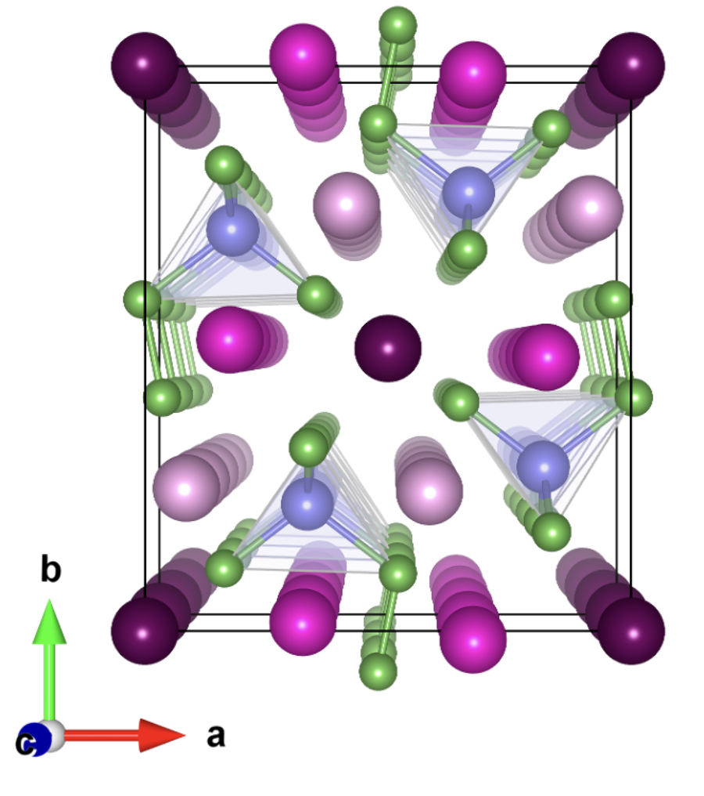
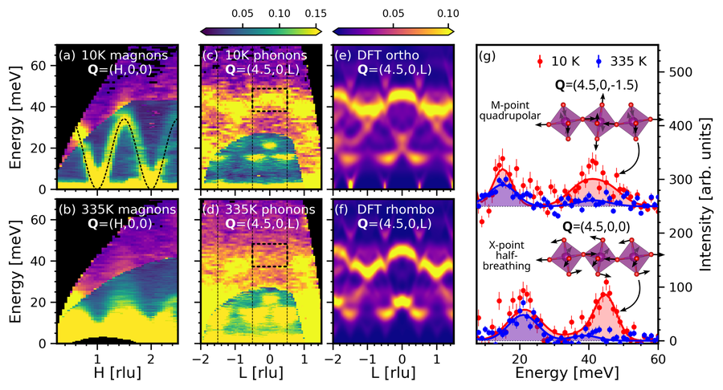
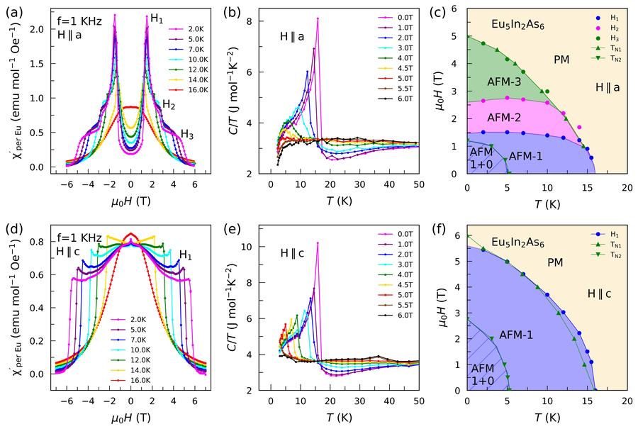

# Eu系Zintl反強磁性半導体における巨大磁気抵抗とフォノン交換ダイナミクス

- **執筆日**: 2026-05-28
- **要旨**: Eu₅Sn₂As₆というEu²⁺系Zintl半導体において、磁場印加により電気抵抗が最大60万%以上低下する「巨大磁気抵抗（CMR）」が実現することが明らかにされてきた。2026年5月に発表されたCairnsらの論文（arXiv:2605.06649）は、この現象の背後にあるフォノン熱伝導率の劇的な磁場依存性と磁気伸縮の測定を通じて、従来のダブル交換やヤーン・テラー機構とは全く異なる「交換ひずみ（exchange striction）」メカニズムの重要性を示した。スピン配置の縮退解消がフォノン散乱の減少と熱伝導率の回復をもたらすという新しい枠組みは、Eu系Zintl化合物全体にわたるCMRの統一的な理解への道を開く可能性がある。
- **タグ**: Magnetism and Spin / Magnetostriction and Magnetoelasticity / High-Magnetic-Field Properties / Transport Measurements / Neutron Scattering
- **注目論文**: [arXiv:2605.06649](https://arxiv.org/abs/2605.06649) — Cairns et al., "Colossal Magnetoresistance and Phonon Driven Exchange Dynamics in Eu₅Sn₂As₆" (2026)
- **参照論文数**: 7本

---

## 1. 背景：なぜ今この話題か

磁場を印加するだけで電気抵抗が劇的に変化する「磁気抵抗（magnetoresistance, MR）」は、1990年代にペロブスカイト型マンガナイト（La₁₋ₓSrₓMnO₃など）において「巨大（colossal）」スケールの変化、すなわちCMRが発見されて以来、凝縮系物理学の中心的な話題であり続けてきた。マンガナイトのCMRは、二重交換相互作用（double exchange）、ヤーン・テラー効果（Jahn-Teller effect）、そして強いキャリア–格子結合の複合作用によって説明されており、磁気秩序の転移点近傍で電気抵抗が数桁低下することが特徴であった。しかし2020年代に入り、マンガナイト以外の全く異なるメカニズムでCMRを示す材料群が次々と見出され、CMR研究は新たな局面を迎えている。

その中心にいるのが、Eu²⁺イオンを含む「Zintl相（Zintl phase）」と呼ばれる半導体材料群である。EuCd₂P₂、EuZn₂P₂、EuZn₂As₂、EuIn₂As₂など、Eu²⁺の局在磁気モーメント（スピン $S = 7/2$）をもつ化合物が反強磁性秩序温度以下で巨大な負の磁気抵抗を示すことが相次いで報告され、2023〜2026年にかけて活発な研究が行われている。これらの材料は混合原子価も二重交換もヤーン・テラー歪みも持たないにもかかわらず、MRが数百〜数万倍以上に達することがある。

その極端な例として注目されるのが、直方晶（斜方晶）Zintl化合物 Eu₅Sn₂As₆ である。2024年7月に発表された先行研究（arXiv:2407.06185）はこの材料において最大60万%以上のCMRを報告した。これはマンガナイトの典型値（〜10⁴ %）を大幅に凌駕するだけでなく、当時知られていた非マンガナイト系CMR材料の中でも最大レベルであった。さらに2026年5月、Cairnsらはより詳細な熱輸送・磁気伸縮測定とスピン動力学シミュレーションを組み合わせることで、この巨大CMRの背後にある新しいメカニズム――スピン相関が格子歪みを制御し、その格子歪みがフォノン散乱を媒介する「交換ひずみ主導のフォノン散乱メカニズム」――の実証的な証拠を提示した。本論文はCMR研究が新たな段階に入ったことを告げる重要な報告であり、その内容と背景を本記事で詳しく解説する。

---

## 2. 解決すべき課題

### CMRのメカニズム：何が電子を「閉じ込め」、磁場が何を「解放」するか

Eu系Zintl反強磁性半導体のCMR研究における最大の謎は、磁場がどのようなメカニズムで電気抵抗を数桁も低下させるのかという点である。マンガナイトであれば、キャリアのスピンが反平行な局在スピンとぶつかると散乱されるが、磁場でスピンが揃えば散乱が減る、という「二重交換」の直感的な描像が使えた。しかし Eu₅Sn₂As₆ のような系ではキャリア密度が極めて低く（熱的に活性化される半導体的な挙動）、二重交換の出番はない。

この問いに対して現在浮上している候補が二つある。一つは「磁気ポーラロン（magnetic polaron）」のモデルである。希薄なキャリアが局在磁気モーメントの周囲に強磁性的なクラスター（ポーラロン）を形成し、このポーラロンが各格子点に閉じ込められているとき、電流は流れにくい。磁場を印加してスピンが揃うと、隣接するポーラロンが重なり合って「パーコレーション（連続するクラスター）」が起き、電気伝導が急に連続するという描像である。もう一つは「フォノン散乱」モデルである。キャリア密度の低い半導体では、熱拡散（フォノン）がエネルギー輸送の主体であり、フォノンの散乱が多ければ熱伝導率も電気伝導率も下がる。スピンが乱れた状態では「スピン配置の縮退」が大きく、その縮退に応じた格子歪みがフォノンを強く散乱する。磁場でスピンが揃えば縮退が解消し、格子歪みが減り、フォノン散乱が弱まる、という連鎖が起きる。この二つのモデルは必ずしも排他的ではないが、どちらが支配的なのかは実験的に区別しにくく、2024年以前は明確な決着がついていなかった。

### スピン–格子結合の定量化：磁気伸縮と交換ひずみ

磁気秩序にある系では、スピンの向きと格子定数が結びついている。この「スピン–格子結合（spin-lattice coupling）」の強さを定量化することが、CMRのフォノン散乱モデルを検証する鍵となる。具体的には、磁場印加によって格子定数がどのくらい変化するか（磁気伸縮 $\Delta l / l$）を精密に測定し、それをスピン配置の変化（磁化曲線）と対応させることで、「スピン相関が変わると格子がどれだけ歪むか」を直接評価できる。さらに、格子歪みがフォノン散乱係数にどの程度寄与するかを理論的に見積もり、測定された熱伝導率の磁場依存性と比較することで、フォノン散乱モデルの妥当性が問われる。

### スピンガラス近傍の縮退：Eu₅Sn₂As₆の特殊性

Eu₅Sn₂As₆は、その複雑な非共線的反強磁性構造のため、磁気基底状態がほぼ縮退している。これは「スピンガラス（spin glass）」的な性質に近く、ゼロ磁場では多数の微視的なスピン配置が同等のエネルギーを持つ。このような状況では、温度わずかな摂動でもスピン配置が大きく変動し、交換ひずみによる格子変形が激しく揺らぐ。その揺らぐ格子がフォノンを強く散乱する、という解釈が Cairns らによって提案されている。この「縮退に起因するスピン・格子結合の増幅」という考え方は、Eu₅Sn₂As₆がなぜ同系統の他の材料よりも特に大きなCMRを示すかを説明しうる重要な概念である。

---

## 3. 注目論文の仮説と成果

### 研究目的と材料

Cairns, Yamakawa, Zhang, Moore, Birgeneau, Analytis らのグループ（UC Berkeley / Lawrence Berkeley National Laboratory）による arXiv:2605.06649「Colossal Magnetoresistance and Phonon Driven Exchange Dynamics in Eu₅Sn₂As₆」は、Eu₅Sn₂As₆の熱伝導率と磁気伸縮を系統的に測定し、スピン動力学シミュレーションと組み合わせることで、CMRにおけるフォノン主導の交換ダイナミクスを明らかにすることを目的としている。

*図1: 姉妹化合物 Eu₅In₂As₆ の結晶構造（斜方晶 Pbam 空間群）、比熱・帯磁率・磁化曲線、および中性子回折で決定した反強磁性スピン構造。Eu₅Sn₂As₆ と同一の空間群を持ち、複数のEu²⁺サイトと複雑な非共線的反強磁性秩序が特徴的である。（Balguri et al., arXiv:2412.13361, CC BY 4.0）*

Eu₅Sn₂As₆は斜方晶（空間群 Pbam）に属するZintl相化合物で、5個のEu²⁺サイトと[Sn₂As₆]¹⁰⁻の多面体アニオンからなる。Eu²⁺は配位子場の影響をほとんど受けないため $S = 7/2, L = 0, J = 7/2$ の純粋なスピン状態にある。この化合物は密度汎関数理論（DFT）計算から弱位相絶縁体（weak topological insulator）として分類されており、非自明なバンドトポロジーを持つ。磁気転移温度 $T_N \approx 10.3$ K 以下で非共線的な反強磁性秩序が現れ、さらに低温で複数の磁気相転移を示す。この磁気構造の複雑さがスピンガラス的な縮退を生み出している。

### 研究アプローチ

本論文では主に3つの実験手法と1つの理論手法が組み合わされている。

**中性子回折（neutron diffraction）**: ゼロ磁場下での磁気構造を精密に決定するために用いられる。Eu₅Sn₂As₆の非共線的なスピン配置、磁気ブリルアン域の磁気ブラッグピークの位置と強度から磁気構造因子が決定される。これにより、交換ひずみ計算に必要な「どのスピンペアがどの方向に向いているか」という情報が得られる。

**熱伝導率測定（$\kappa$(T, H)）**: 磁場をゼロから高磁場まで段階的に印加しながら温度依存性を測定する。電子由来の熱伝導率とフォノン由来のそれを分離するため、Wiedemann-Franz則 $\kappa_{\rm el} = L_0 T / \rho$（$L_0 = 2.44 \times 10^{-8}$ W Ω K⁻²はローレンツ数）を用いてキャリア寄与を差し引く。Eu₅Sn₂As₆のような低キャリア密度半導体では $\kappa_{\rm el} \ll \kappa_{\rm ph}$ であり、観測される熱伝導率のほぼ全部がフォノン由来である。

**磁気伸縮測定（$\Delta l / l$）**: ダイレイトメトリー（dilatometry）または歪みゲージを用いて、磁場印加に伴う相対的な格子定数変化を測定する。測定精度は $\Delta l / l \sim 10^{-7}$ 程度が必要で、磁化曲線と同時測定することでスピン配置と格子変形の対応関係が直接得られる。

**SU(N)NY古典スピンシミュレーション**: SU(N)NY（Sunny.jl）は、任意のスピン量子数 $S$ を持つ古典スピン系の量子補正を取り込んだ変分型Monte Carlo / Landau–Lifshitz–Gilbert (LLG) 動力学計算が可能なソフトウェアである。本論文では $S = 7/2$ のEu²⁺スピンを古典的に扱い、各交換結合のスピン相関 $\langle \mathbf{S}_i \cdot \mathbf{S}_j \rangle$ の温度・磁場依存性を計算する。これを用いて「スピン整列因子（spin alignment factor）」$f$ と格子歪みパラメータ $\varepsilon$ の相関が導出される。

### 主要結果

**フォノン熱伝導率の劇的な磁場増強**: $T_N \approx 10.3$ K 以下においてゼロ磁場での熱伝導率は急激に減少する。これは反強磁性秩序の形成に伴うスピン揺らぎによるフォノン散乱の増大を反映している。しかし磁場を印加すると $\kappa$ は顕著に増大し、磁化曲線の飽和磁場（$\sim 2$ T）付近で $\kappa$ の増大が飽和する。この振る舞いは磁化の磁場依存性とほぼ対応しており、$\kappa(H) \propto M(H)$ の相関が成立する。低温でのフォノン熱伝導率の増強は数倍に及び、これはスピン整列によるフォノン散乱の劇的な減少を意味する。

**磁気伸縮の磁化との相似性**: 磁気伸縮 $\Delta l / l$ の磁場依存性も磁化曲線に酷似した形状を示す。磁場がゼロから飽和磁場まで増加するにつれて格子は収縮し（負の磁気伸縮）、その大きさは $\Delta l / l \sim 10^{-4}$ 以上に達する。この磁気伸縮は等方的ではなく結晶軸依存性があり、非共線的なスピン構造を反映している。フォノン熱伝導率と磁気伸縮が同じ磁場スケールで変化するという事実は、格子歪みがフォノン散乱の原因であることを強く示唆する。

**交換ひずみ理論との対応**: 交換ひずみ（exchange striction）とは、格子歪み $\varepsilon^\alpha$（$\alpha$ は変形モード）が磁気交換相互作用のスピン相関によって決まるという現象で、以下の式で表される：

$$\varepsilon^\alpha = \frac{1}{2} \sum_{ij} s^{\alpha\beta}_{ij} \langle J_i^{(\beta(ij))} J_j^{(\beta(ij))} \rangle_{T, H}$$

ここで $s^{\alpha\beta}_{ij}$ は交換–ひずみ結合テンソル（exchange-striction coupling tensor）、$J_i^{(\beta)}$ は第 $i$ 番目のスピンの $\beta$ 成分、$\langle \cdots \rangle_{T,H}$ は温度 $T$ と磁場 $H$ の下でのアンサンブル平均である。本論文では、中性子回折で決定した磁気構造を入力として $\varepsilon^\alpha$ を計算し、測定された磁気伸縮と比較している。両者の良好な一致は、Eu₅Sn₂As₆の格子変形がスピン相関によって支配されていることを定量的に示している。

**スピン整列因子とフォノン散乱の相関**: SU(N)NY シミュレーションで求めたスピン整列因子 $f = \langle \mathbf{S}_i \cdot \mathbf{S}_j \rangle / |S|^2$（交換結合上の平均）を横軸、交換ひずみ $\varepsilon$ を縦軸としてプロットすると、両者に明確な線形相関が見られる。すなわち、スピンが揃う（$f \to 1$）ほど格子歪みが減少し（$\varepsilon \to 0$）、フォノン散乱が弱まるという因果連鎖が定量的に確認された。

### 論文の新規性と限界

本論文の最大の新規性は、CMRとフォノン熱伝導率・磁気伸縮を同一材料で同時に精密測定し、スピン動力学シミュレーションと組み合わせることで、「スピン配置の縮退→格子歪みの揺らぎ→フォノン散乱増大→電気抵抗増大」という連鎖を初めて定量的に実証した点にある。これまでのCMR研究では、電気抵抗の磁場依存性のみが主に測定されていたが、熱輸送を加えることでメカニズムの理解が大きく深まった。

一方で限界もある。第一に、電気抵抗CMRがフォノン散乱とどのように直接つながるかの定量的なリンクはまだ確立されていない。フォノン散乱が増えればキャリアの散乱も増えるという仮説は合理的だが、低キャリア密度の半導体では電子とフォノンの結合様式が複雑で、単純な比例関係にはならない可能性がある。第二に、非共線的スピン構造の完全な決定にはさらなる中性子実験が必要で、現状の磁気構造モデルは一定の仮定を含む。第三に、磁気ポーラロンの寄与が完全に排除されたわけではなく、ポーラロン形成とフォノン散乱は並行して存在しうる。

---

## 4. 研究史における位置づけ

### マンガナイトCMRから新世代CMRへ

CMRの研究史を振り返れば、ペロブスカイト型マンガナイトにおけるCMRの発見は1950年代にさかのぼるが、1990年代にvan Helmolt らや Jin らが薄膜で劇的な抵抗変化を報告してから研究が爆発的に発展した。マンガナイトのCMRは、Mn³⁺/Mn⁴⁺の混合原子価に起因するダブル交換相互作用（Mn³⁺–O²⁻–Mn⁴⁺を介した電子の跳び移り）が磁場で促進されるという Zener モデルが基本的な理解を与え、さらにヤーン・テラー活性な Mn³⁺ イオンの局所的な格子歪みがキャリアを局在化させることが明らかになった。2026年の Sterling らの報告（arXiv:2603.06708）は、La₁₋ₓSrₓMnO₃において弱いMRの系でもヤーン・テラーフォノンが Curie 温度以上で完全に崩壊することを示しており、マンガナイトにおける電子–フォノン結合の役割が単純な図式を超えることを示している。この発見はEu₅Sn₂As₆の研究と対照的で、マンガナイトではヤーン・テラーが不可欠なのに対し、Eu₅Sn₂As₆では純粋なスピン–格子結合（交換ひずみ）が主役を演じる。

*図2: La₁₋ₓSrₓMnO₃（$x = 0.2$）における中性子非弾性散乱で測定したフォノン分散曲線。強磁性相（低温）では格子振動がDFT計算と良く一致するが、キュリー温度以上の常磁性相ではヤーン–テラー活性な酸素光学フォノンが完全に崩壊する。この「フォノン崩壊」はEu₅Sn₂As₆の「交換ひずみ主導のフォノン散乱」とは起源が異なるが、ともにスピン–格子結合がCMRに本質的な役割を果たすことを示す共通点がある。（Sterling et al., arXiv:2603.06708, CC BY-NC-SA 4.0）*

### Eu系Zintl相のCMR研究の流れ

Eu²⁺を含むZintl相でのCMR研究は2020年代に急速に発展した。EuCd₂P₂（2020年）、EuZn₂P₂（2023年）などのCaAl₂Si₂型化合物で負のCMRが相次いで報告され、磁気ポーラロンのパーコレーションが有力なメカニズムとして提案された。特に Pakhira ら（arXiv:2302.14539）による EuZn₂P₂ の研究はA型反強磁性構造と電子・磁気構造の詳細を明らかにし、CMRが $T_N$ 付近で顕著になることを示した。さらに Marulanda ら（arXiv:2603.21423）はテラヘルツ分光によって EuZn₂P₂ のキャリアダイナミクスを周波数分解し、磁気ポーラロンの成長と重なり合いがテラヘルツ帯域では直流値より3倍大きなCMRをもたらすことを示した。これらの研究は「磁気ポーラロン主導のCMR」という描像を強化している。

しかし Eu₅Sn₂As₆ はこれらのCaAl₂Si₂型化合物とは異なる結晶構造を持ち、Eu イオンサイトが5種類ある複雑な系である。2024年に発表された最初の包括的研究（arXiv:2407.06185, Analytis グループ）は、60万%超のCMRと非等方的なスピンダイナミクスを報告し、小角中性子散乱（SANS）の結果からこの系でも磁気ポーラロンが関与する可能性を指摘していた。しかし2026年の論文（本記事の注目論文）は、フォノン熱伝導率と磁気伸縮の詳細な測定を加え、ポーラロンだけでは説明のつかない「格子のダイナミクス」の重要性を前景化させた。

### Eu₅In₂As₆との比較：CMRの多様性

姉妹化合物である Eu₅In₂As₆（Inが Snの代わりに入る）は、2024年末に Balguri ら（arXiv:2412.13361）によって詳細に研究され、一つの化合物の中に「ピーク型CMR」（抵抗が磁場で単調減少する型）と「アップターン型CMR」（低温で抵抗が再度上昇する型）の両方が存在することが示された。

*図3: Eu₅In₂As₆の抵抗率の温度依存性と磁場依存性。$T_{N1}$（〜17 K）付近ではピーク型CMRが現れ、さらに低温では低抵抗域に入った後にアップターン型の抵抗上昇が観測される。前者は磁気ポーラロンのパーコレーション、後者は電荷秩序の磁場融解によって説明される。Eu₅Sn₂As₆のCMRとの比較において、電荷自由度の役割が重要な検討事項として浮かび上がる。（Balguri et al., arXiv:2412.13361, CC BY 4.0）*前者は磁気ポーラロンのパーコレーション、後者は電荷秩序の磁場によるメルティングで説明されている。この論文は「CMRには複数のメカニズムが並存しうる」という統一的な枠組みを提示しており、Eu₅Sn₂As₆との比較において非常に示唆的である。Eu₅Sn₂As₆でもアップターン型に類似した特徴が磁気相図の一部で観測されており、電荷秩序の可能性も完全には排除されていない。

---

## 5. どの解釈が最も妥当か

### フォノン散乱説の根拠

注目論文（2605.06649）が提示する最も強い証拠は、熱伝導率と磁気伸縮の「同期した」磁場依存性である。$\kappa(H)$ と $\Delta l/l(H)$ がいずれも磁化曲線 $M(H)$ と相似の形を示し、飽和磁場付近で変化が頭打ちになるという事実は偶然の一致とは考えにくい。もし CMR が純粋に磁気ポーラロンのパーコレーションで起きているとすれば、熱伝導率（フォノン輸送）と磁気伸縮（スピン–格子結合）がほぼ同一の磁場スケールで変化する理由を別途説明する必要がある。一方、交換ひずみ理論は「スピン相関が変わると格子歪みが変わり、その歪みがフォノン散乱を変える」という単一の因果連鎖でこれらすべてを説明できる。

さらに、理論計算との定量的一致も重要な証拠である。SU(N)NY シミュレーションから得たスピン整列因子 $f$ と観測された磁気伸縮 $\varepsilon$ の間に線形相関が確認されたことは、交換ひずみモデルが単なる定性的な描像を超えた定量的な予測力を持つことを示している。

### 磁気ポーラロンとの競合

他方、磁気ポーラロンの寄与を完全に否定する証拠も現時点では存在しない。先行研究（2407.06185）の SANS データはポーラロン的な相関長の発達を示唆しており、低温・低磁場域ではポーラロンが優勢である可能性がある。EuZn₂P₂の研究（2603.21423, 2504.05494）が示すように、Eu²⁺系磁気半導体では磁気ポーラロンが普遍的に現れる傾向があり、Eu₅Sn₂As₆もその例外ではないかもしれない。可能な解釈として、低磁場域ではポーラロン形成が電気抵抗を高め、高磁場域ではフォノン散乱の減少が熱伝導率の回復を担う、という「二段階のメカニズム」の可能性が考えられる。Eu₅In₂As₆で観察された「二種類のCMR」（2412.13361）はこの解釈と親和的である。

### スピンガラス的縮退の役割

注目論文が特に強調するのは、Eu₅Sn₂As₆がスピンガラス転移に近い「縮退した磁気基底状態」を持つという点である。縮退が大きいほど、わずかなエネルギーで多様なスピン配置が混在でき、その配置ごとに異なる格子歪みをもたらすため、フォノン散乱の「有効質量」が増大する。この機構は、同じEu系Zintl相でも単純なA型反強磁性（EuZn₂P₂など）より Eu₅Sn₂As₆のほうが格段に大きなCMRを示す理由を自然に説明する。ただしこの解釈はスピンガラス的縮退の定量的な証拠（具体的な縮退度、励起スペクトルなど）をさらに必要としており、今後の中性子非弾性散乱や比熱測定による検証が待たれる。

### まだ弱い部分

電気抵抗とフォノン熱伝導率の定量的な連結は、本論文の議論においても仮説段階にある。熱伝導率が増大するのと同じ機構で電気抵抗が低下するという主張は直感的に魅力的だが、低キャリア密度半導体においてフォノン散乱が電子移動度にどのように影響するかは系によって異なる。キャリアがフォノンによって直接散乱されているのか、あるいはポーラロンとして「格子に乗っかった」状態で動いているのかによって、電気抵抗とフォノン熱伝導率の相関の形も変わってくる。この点を解明するには、電子・フォノン結合定数の第一原理計算や光学伝導度の測定が必要であろう。

---

## 6. 何が一般化できるか

### Eu系Zintl相への一般化

交換ひずみ主導のフォノン散乱という枠組みは、Eu₅Sn₂As₆に限らず、Eu²⁺の局在モーメントを含む他の狭ギャップ半導体一般に適用できる可能性がある。EuZn₂P₂でも磁気伸縮が報告されており（arXiv:2504.05494）、EuCd₂P₂、EuZn₂As₂など系統的な比較が行われることで、交換ひずみのスケールと CMR の大きさの相関関係が明らかになるだろう。特にスピン磁気モーメントが大きい（$S = 7/2$ の Eu²⁺）か、磁気構造が複雑（縮退が大きい）かどうかという因子が、フォノン散乱の大きさを決める重要なパラメータになると予想される。

### トポロジカル特性との接続

Eu₅Sn₂As₆は弱位相絶縁体（weak topological insulator）に分類されており、表面状態の存在が原理的に期待される。現在の CMR 研究はバルクの輸送現象に焦点を当てているが、将来的には表面電子状態がバルクの磁気秩序および格子ダイナミクスとどのように結合するかが興味深い問題となる。トポロジカル表面状態はスピン–運動量ロッキングを持つため、磁気秩序によってギャップが開く可能性があり、この「磁場による表面ギャップの閉鎖」が CMR に追加の寄与をする可能性もある。この点は実験的にはまだ検証されていない。

### 他材料系・応用への展開

CMR 材料は磁場センサー（スピントロニクスデバイス）への応用が考えられるが、Eu 系 Zintl 相の動作温度が現状では10 K 以下（液体ヘリウム温度域）であることが実用化の障壁である。フォノン主導の CMR が理解されれば、格子ダイナミクスを制御する化学的手法（置換、加圧、薄膜化）によってより高温でのCMR実現が設計論的に目指せるかもしれない。また、フォノン熱伝導率の磁場制御という観点は、磁場可変の熱スイッチや熱整流デバイスへの応用という新たな方向性も示唆している。

---

## 7. 基礎から理解する

### 磁気抵抗とその定義

物質の電気抵抗率 $\rho$ が磁場 $H$（または磁束密度 $B$）の印加によって変化する現象を「磁気抵抗（magnetoresistance）」と呼ぶ。通常の金属では量子力学的な軌道効果（ローレンツ力による電子の湾曲）によってごくわずかな抵抗変化しか生じないが、特定の材料系では次式で定義される「磁気抵抗比（MR ratio）」が数桁以上に達することがある：

$$\mathrm{MR} (\%) = \frac{\rho(H) - \rho(0)}{\rho(0)} \times 100$$

$\rho(H) < \rho(0)$ のとき「負の磁気抵抗（negative MR）」という。CMR（Colossal Magnetoresistance）は MR が $-10^4$ % を超えるような極端に大きな場合を指す。たとえば $|\mathrm{MR}| = 600{,}000$ % は、磁場印加で抵抗が元の $1/6001$ 倍（約 $6 \times 10^{-4}$ 倍）に低下することを意味する。

### 反強磁性体の基礎

磁性体では原子の磁気モーメント（スピン）が隣り合う格子点間でどのような向きをとるかによって種類が分かれる。スピンが全部同じ向きなら「強磁性体（ferromagnet）」、交互に逆向きなら「反強磁性体（antiferromagnet）」と呼ぶ。反強磁性体では正味の磁化がゼロであるため外部から磁気的に見えにくいが、電気抵抗や熱伝導率などの輸送特性に大きな影響を与える。反強磁性体における主な交換相互作用は「超交換（superexchange）」であり、非磁性イオン（酸素など）を介した間接的な交換で、Eu²⁺ の場合は Eu–As–Eu のパスを通じて反強磁性的な相互作用が働く。スピンハミルトニアンはハイゼンベルグ型

$$\mathcal{H} = -\sum_{\langle ij \rangle} J_{ij} \mathbf{S}_i \cdot \mathbf{S}_j$$

で記述され、$J_{ij} < 0$ のとき反強磁性的である（$\langle ij \rangle$ は近接スピンペアの和）。反強磁性転移温度をネール温度 $T_N$ と呼び、$T < T_N$ では長距離反強磁性秩序が実現する。

「非共線的（non-collinear）」反強磁性とは、スピンが単純に平行・反平行ではなく、三次元的にさまざまな角度を向いている秩序のことである。Eu₅Sn₂As₆では5種類の非等価なEu²⁺サイトが存在し、それぞれのスピンが異なる方向を向く複雑な非共線的秩序が実現している。このような複雑な磁気構造は「磁気的フラストレーション（magnetic frustration）」、すなわち全ての交換相互作用を同時に最小化できない幾何学的制約が原因の一つである。

### Zintl相の化学的特徴

「Zintl相（Zintl phase）」は1930〜40年代にドイツの化学者 Eduard Zintl が提唱した概念に由来する金属間化合物の一分類で、電気的陰性度の大きな元素からなるアニオン部分と、陽イオン部分が形式的なイオン結合で結びついた化合物を指す。その名の由来となった「Zintl-Klemm 概念」では、カチオン（例 Eu²⁺）が電子をアニオンに供与し、アニオンは共有結合によって閉殻電子構造を形成するとみなす。Eu₅Sn₂As₆ の場合、[Eu₅]¹⁰⁺ が [Sn₂As₆]¹⁰⁻ に10個の電子を供与し、電荷バランスが保たれる。

Zintl 相は通常、イオン性化合物のような絶縁体的特性と、共有結合型半導体のような電子構造を合わせ持つことが多い。Eu₅Sn₂As₆ は室温で半導体的な温度依存性を示し、エネルギーギャップ（約 0.2〜0.3 eV 程度）が存在する。Eu²⁺ の 4f 軌道が完全に満たされているため（4f⁷ 配置）、4f 由来の電子がバンドギャップ内に局在する形をとる。低温での電気伝導は主に熱励起キャリア（電子・ホール）によるため、温度が下がるほど抵抗率が上昇する絶縁体的挙動を示す。

### フォノンと熱伝導率

固体の原子は平衡位置を中心に振動しており、この格子振動を量子力学的に扱った「準粒子」を「フォノン（phonon）」と呼ぶ。フォノンは格子振動のモードに対応し、その波数 $\mathbf{q}$ と分岐（枝）番号 $s$ で特定される準粒子である。固体の熱伝導率 $\kappa$ は、フォノンが温度勾配に従って熱を運ぶ過程を反映しており、気体運動論的な近似では次のように書ける：

$$\kappa = \frac{1}{3} C_V v_s^2 \tau$$

ここで $C_V$ は単位体積あたりの比熱、$v_s$ はフォノンの群速度（音速）、$\tau$ は平均自由時間（緩和時間）である。$\tau$ が小さいほど、すなわちフォノンが頻繁に散乱されるほど $\kappa$ は小さくなる。フォノンの散乱源としては、フォノン–フォノン散乱（アンハーモニック効果）、不純物・欠陥、結晶粒界、そして今回重要な「スピン揺らぎ・磁気秩序による散乱」がある。スピン揺らぎがフォノンを散乱する機構は「スピン–フォノン結合（spin-phonon coupling）」と呼ばれ、スピンの動的揺らぎがフォノンの群速度や散乱時間を変化させる。磁場でスピンが揃うと揺らぎが抑制され、フォノンの散乱が減って $\kappa$ が増大する。

### 交換ひずみと磁気伸縮

「交換ひずみ（exchange striction）」は、スピン間の交換相互作用が格子定数に依存することから生じる格子変形である。ハイゼンベルグ交換 $J_{ij}(\mathbf{u})$（$\mathbf{u}$ は格子変位）を格子変位について展開すると、

$$J_{ij}(\mathbf{u}) \approx J_{ij}^{(0)} + \frac{\partial J_{ij}}{\partial u^\alpha} u^\alpha + \cdots$$

各スピンペア $(i, j)$ が交換エネルギー $-J_{ij} \mathbf{S}_i \cdot \mathbf{S}_j$ を持ち、これを格子変位 $u^\alpha$ で最小化すると、平衡格子変位（交換ひずみ）が

$$\varepsilon^\alpha \propto \sum_{ij} \frac{\partial J_{ij}}{\partial u^\alpha} \langle \mathbf{S}_i \cdot \mathbf{S}_j \rangle$$

として現れる。すなわち「スピン相関 $\langle \mathbf{S}_i \cdot \mathbf{S}_j \rangle$ が変わると（温度や磁場の変化で）格子がそれに応じて歪む」のが交換ひずみである。この格子歪みは結晶全体に長距離的に広がり、「磁気伸縮（magnetostriction）」として実験的に観測できる格子定数の変化をもたらす。Eu₅Sn₂As₆では、Eu²⁺ スピンのサイズが大きい（$S = 7/2$）ため、交換ひずみが特に顕著になる。磁場が増えるとスピン相関 $\langle \mathbf{S}_i \cdot \mathbf{S}_j \rangle$ が変化し（反強磁性的から強磁性的へ）、その変化に応じて格子が変形し（磁気伸縮）、その変形の揺らぎがフォノン散乱を制御するという連鎖が実現する。

---

## 8. 専門用語の解説

**巨大磁気抵抗（CMR, Colossal Magnetoresistance）**
磁場印加によって電気抵抗率が数桁（通常 $10^4$ % 以上）にわたって低下する現象。通常の磁気抵抗効果（〜1%）と区別して「巨大（colossal）」と形容する。1990年代にペロブスカイト型マンガナイト La₁₋ₓCaₓMnO₃ などで発見されたが、2020年代にはマンガナイト以外のさまざまな磁性半導体でも見出されている。本論文では Eu₅Sn₂As₆ における 60 万%超の CMR が研究対象であり、従来のマンガナイト的メカニズム（ダブル交換・ヤーン–テラー効果）とは異なる「交換ひずみ主導のフォノン散乱」が提案されている。

**Zintl相（Zintl phase）**
電気陰性度が大きく異なる二種以上の元素からなる金属間化合物で、陽イオン部分が電子をアニオン部分に供与してイオン的に結合し、アニオンは共有結合で閉殻構造を形成する。Zintl–Klemm の概念にしたがって電荷が平衡する、いわば「塩のような金属」である。Eu₅Sn₂As₆ では [Eu₅]¹⁰⁺ と [Sn₂As₆]¹⁰⁻ が形式的にイオン結合しており、狭いバンドギャップを持つ半導体として振る舞う。低キャリア密度と局在磁気モーメントの共存がCMR発現の舞台を整えている。

**磁気ポーラロン（Magnetic polaron）**
孤立した電荷キャリアが、その周囲の局在磁気モーメントを強磁性的に整列させることで形成される複合準粒子。強磁性クラスター（数ナノメートル程度）に包まれたキャリアが「自己トラッピング」した状態である。温度が下がるとポーラロンが成長し、磁場が増大するとポーラロン同士が重なり合って電気的なパーコレーション（連続導電経路）が起きる。Eu₅Sn₂As₆ では低温・低磁場での CMR にポーラロンが関与する可能性があり、先行研究（2407.06185）が SANS データからポーラロン的な相関長の成長を報告している。本注目論文では磁気ポーラロンを否定する証拠はないが、フォノン散乱メカニズムと並行して存在しうるものとして位置づけられている。

**交換ひずみ（Exchange striction）**
磁気的な交換相互作用 $J_{ij}$ が格子定数（原子間距離）に依存することに起因して生じる格子変形。スピン相関 $\langle \mathbf{S}_i \cdot \mathbf{S}_j \rangle$ が変化するたびに格子歪みも変化する。本注目論文の中心的な概念であり、式 $\varepsilon^\alpha = \frac{1}{2}\sum_{ij} s^{\alpha\beta}_{ij} \langle J_i J_j \rangle_{T,H}$ によって格子歪みとスピン相関が定量的に結びつけられる。温度や磁場によってスピン配置が変われば格子も変形し、その格子変形の揺らぎがフォノン散乱を制御するという連鎖が本論文の主な主張である。

**スピンガラス（Spin glass）**
多数の磁気スピンがランダムな方向に凍りついた、秩序も無秩序も「長距離的なパターン」を持たない磁気相。厳密なスピンガラスとは異なるが、Eu₅Sn₂As₆は複雑な非共線的磁気構造の下でエネルギーがほぼ縮退した多数のスピン配置を持つため、「スピンガラス近傍（spin-glass proximity）」にあると表現される。この縮退は交換ひずみによる格子変形の揺らぎを増幅させ、フォノン散乱を特に強くする役割を果たすと本論文は解釈している。

**フォノン熱伝導率（Phonon thermal conductivity）**
固体における熱の主要な輸送担体であるフォノンによる熱伝導率成分 $\kappa_{\rm ph}$。電子由来の熱伝導率 $\kappa_{\rm el}$ と合わせた全体 $\kappa = \kappa_{\rm ph} + \kappa_{\rm el}$ が測定されるが、低キャリア密度の半導体では $\kappa_{\rm el} \ll \kappa_{\rm ph}$ なので $\kappa \approx \kappa_{\rm ph}$ が良い近似となる。本論文ではまさにこの状況が成立しており、観測される熱伝導率の磁場依存性がほぼそのままフォノン散乱の磁場依存性を反映している。磁場でスピンが揃うと格子歪みの揺らぎが減り、$\kappa_{\rm ph}$ が大きくなる。

**磁気伸縮（Magnetostriction）**
磁場または磁気秩序によって固体の格子定数（形状・体積）が変化する現象。本論文では、Eu₅Sn₂As₆の格子定数が磁場に対して磁化曲線に相似した変化を示すことが中心的な実験結果の一つである。磁気伸縮の大きさ $\Delta l / l$ はスピン相関の変化量に比例し、交換ひずみ理論との直接の比較が可能である。Eu₅Sn₂As₆では $\Delta l / l \sim 10^{-4}$ 程度の磁気伸縮が観測されており、これは一般的な磁性材料の中でも比較的大きい値である。

**SU(N)NY法**
SU(N)NY（Sunny.jl）は、一般スピン $S$ の量子磁性系を「SU(2S+1) スピンコヒーレント状態」という変分的量子状態の多様体上で古典的に扱う計算手法（正確には「SU(N) 古典スピン波」あるいは「変分 Monte Carlo」の亜種）を実装したソフトウェアである。SU(2) に基づく通常の古典スピンモデル（Heisenberg 模型の古典版）を超えた高次の量子効果（スピン多極子など）を取り込めるのが特徴で、$S = 7/2$ のような大きなスピンでも有用である。本論文では、このソフトウェアを用いて Eu₅Sn₂As₆ の磁気構造と熱力学量を計算し、スピン整列因子 $f$ の温度・磁場依存性を求めている。

**弱位相絶縁体（Weak topological insulator）**
バンドトポロジーの分類において、三次元の「強（strong）位相絶縁体」よりも弱い形のトポロジカル特性を持つ絶縁体を指す。強位相絶縁体は全ての表面にトポロジカル表面状態を持つが、弱位相絶縁体は特定の表面方向にのみ表面状態が現れる。Eu₅Sn₂As₆は DFT 計算から弱位相絶縁体に分類されており、バンドトポロジーの観点からも特異な材料である。磁気秩序が時間反転対称性を破ることで表面状態の形状が変わる可能性があり、CMRへの寄与も今後の研究課題である。

**ネール温度（Néel temperature, $T_N$）**
反強磁性体が磁気秩序を獲得する転移温度。強磁性体の「キュリー温度」に対応する。$T > T_N$ では磁気秩序がなく（常磁性相）、$T < T_N$ では反強磁性長距離秩序が実現する。Eu₅Sn₂As₆ では $T_N \approx 10.3$ K であり、この温度付近で電気抵抗、熱伝導率、磁気伸縮のいずれもが著しい変化を示す。CMR が最も顕著になるのも $T_N$ 付近であり、磁気転移と電子輸送の密接な関連を示している。

---

## 9. 将来展望

Eu₅Sn₂As₆ における交換ひずみ主導のフォノン散乱というメカニズムは、今後の研究によってさらに精緻化・検証されることが期待される。最も直接的な次のステップは、フォノン分散の中性子非弾性散乱測定または X 線非弾性散乱測定である。特定のフォノンモードが磁場印加によって散乱幅（線幅）を変化させるかどうか、あるいはフォノン群速度が変化するかどうかを直接観測できれば、交換ひずみ理論の定量的検証が可能になる。またラマン散乱分光法（Raman spectroscopy）によるフォノンモードの温度・磁場依存性も、La₁₋ₓSrₓMnO₃ におけるヤーン–テラーフォノンの研究（2603.06708）と同様のアプローチで行えるだろう。もう一つの重要な方向性は、磁気ポーラロンとフォノン散乱を実験的に切り分けることであり、テラヘルツ時間領域分光（THz-TDS）を Eu₅Sn₂As₆ に適用し、EuZn₂P₂ で行われた研究（2603.21423）と対比することが有効である。

Eu系Zintl相全体を見渡すと、CMR の系統的な材料科学的研究が最重要課題として浮かび上がる。現在知られている材料群（EuCd₂P₂、EuZn₂P₂、EuZn₂As₂、Eu₅Sn₂As₆、Eu₅In₂As₆ など）の間でCMRの大きさが大きく異なる理由は何か、という問いが核心にある。磁気構造の複雑さ（縮退の度合い）、ネール温度の高さ、スピン–格子結合定数の大きさ、バンドギャップの大きさ、キャリア密度の温度依存性 などが候補パラメータとして考えられる。これらを系統的に比較するためには、バンド計算（DFT + U や動的平均場理論）と実験の組み合わせが不可欠であり、特にスピン–軌道結合の効果（Eu²⁺ では小さいが Sn や As の寄与は無視できない）の定量的評価が重要になる。第一原理計算による交換ひずみテンソル $s^{\alpha\beta}_{ij}$ の材料間比較も、今後の理論的挑戦として興味深い。

より長期的な展望として、巨大CMR材料の応用研究がある。現在のEu系Zintl相は液体ヘリウム温度域（10 K 以下）でのみCMRを示すため、常温応用は困難である。しかしフォノン熱伝導率の磁場制御という観点は、低温工学における「磁場可変熱スイッチ（magnetically tunable thermal switch）」として有望である。たとえばヘリウム液化機器や超伝導デバイスの熱管理において、磁場で熱伝導率を数倍に変化させられる材料は、精密な熱流制御に役立つ。また、交換ひずみの原理が解明されれば、磁性ペロブスカイトや有機磁性体など他の系でも同様のフォノン制御が設計論的に探索できるようになり、「磁気–熱–電子」の三者をつなぐ新しい多機能材料の開発につながる可能性がある。

---

## 参考論文一覧

1. **[arXiv:2605.06649]** Cairns, Yamakawa, Zhang, Moore, Birgeneau, Analytis et al., "Colossal Magnetoresistance and Phonon Driven Exchange Dynamics in Eu₅Sn₂As₆" (2026). — 本記事の注目論文。熱伝導率・磁気伸縮の精密測定とSU(N)NYシミュレーションにより、交換ひずみ主導のフォノン散乱メカニズムを実証した。

2. **[arXiv:2407.06185](https://arxiv.org/abs/2407.06185)** Analytis グループ, "Colossal Magnetoresistance and Anisotropic Spin Dynamics in Antiferromagnetic Semiconductor Eu₅Sn₂As₆" (2024). — Eu₅Sn₂As₆における最大60万%超のCMRと非等方的スピンダイナミクスを初めて包括的に報告した先行研究。

3. **[arXiv:2412.13361](https://arxiv.org/abs/2412.13361)** Balguri, Tafti et al., "Two types of colossal magnetoresistance with distinct mechanisms in Eu₅In₂As₆" (2024). — 姉妹化合物Eu₅In₂As₆において、磁気ポーラロンのパーコレーションに起因するピーク型CMRと電荷秩序融解に起因するアップターン型CMRの両方を同一試料で発見し、統一的な枠組みを提案した。

4. **[arXiv:2603.06708](https://arxiv.org/abs/2603.06708)** Sterling, Reznik et al., "Collapse of Jahn-Teller Phonons in La₁₋ₓSrₓMnO₃ with Weak Magnetoresistance" (2026). — マンガナイトにおけるヤーン–テラーフォノンが弱いMRの組成でもキュリー温度以上で完全に崩壊することを中性子散乱とDFTで示し、電子–フォノン結合の役割が従来理解を超えることを明らかにした対照論文。

5. **[arXiv:2603.21423](https://arxiv.org/abs/2603.21423)** Marulanda, Hernandez et al., "Colossal Terahertz Magnetoresistance from Magnetic Polarons in EuZn₂P₂" (2026). — EuZn₂P₂のテラヘルツ磁気分光測定によって磁気ポーラロンの周波数依存的なダイナミクスを直接観測し、テラヘルツ帯域での巨大CMRを実証した。

6. **[arXiv:2302.14539](https://arxiv.org/abs/2302.14539)** Pakhira et al., "Colossal magnetoresistance in EuZn₂P₂ and its electronic and magnetic structure" (2023). — EuZn₂P₂の電子構造とA型反強磁性構造を明らかにし、Eu系Zintl相CMRの基礎的理解を提供した基盤的研究。

7. **[arXiv:2504.05494](https://arxiv.org/abs/2504.05494)** "Magnetic polaron formation in EuZn₂P₂" (2025). — ESR測定と熱力学測定によりEuZn₂P₂における磁気ポーラロン形成を直接観測した研究。Eu系Zintl相CMRにおけるポーラロンの役割を支持する証拠を提供している。
