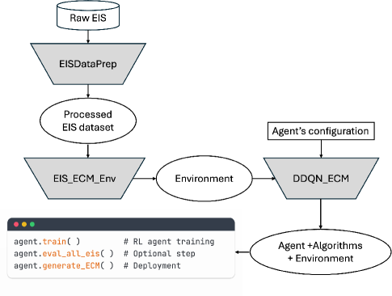
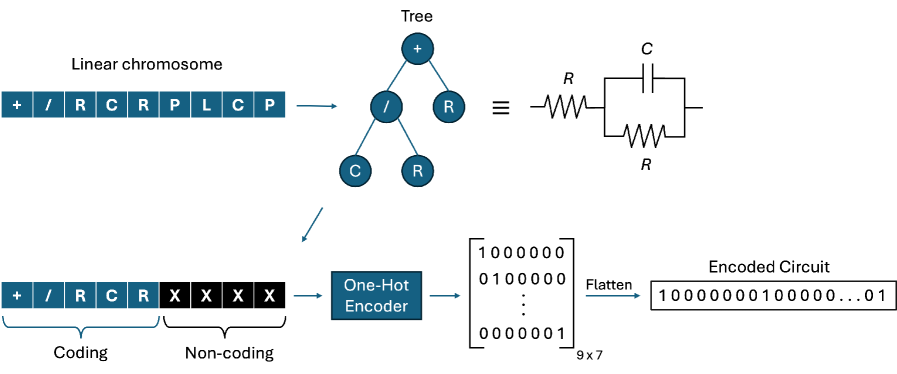
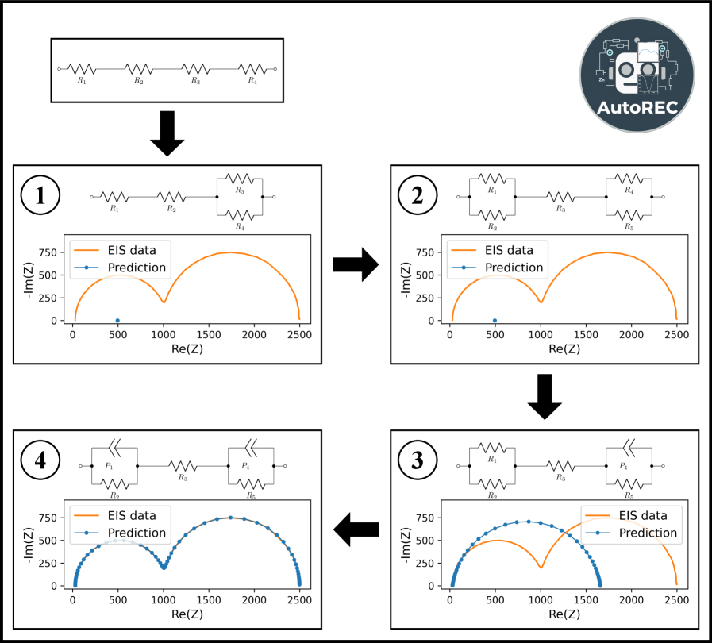
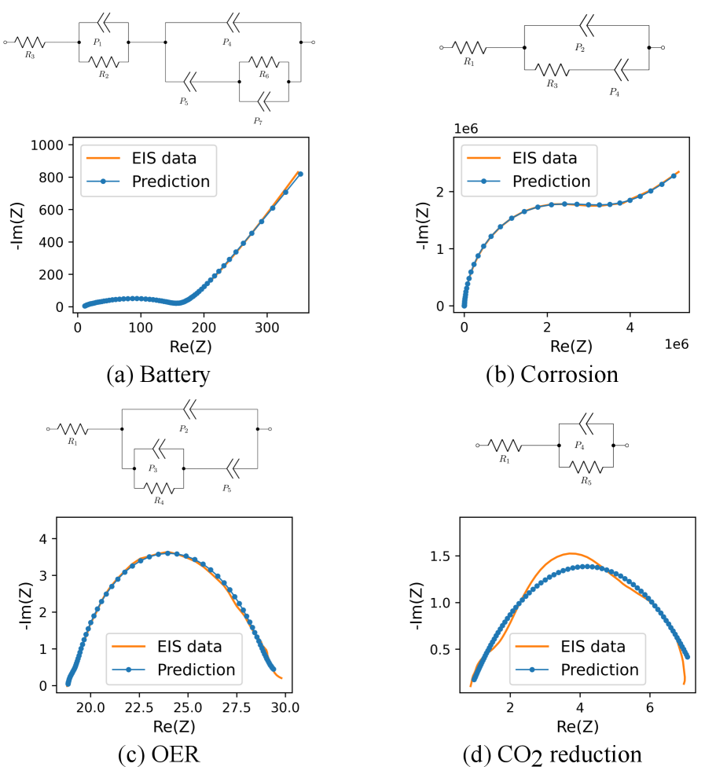

# 強化学習が解く電気化学インピーダンス分光の逆問題：自己駆動型実験室 AutoREC

- 執筆日：2026-05-04
- トピック：強化学習による等価回路モデル自動生成と電気化学インピーダンス分光の自律解析
- タグ：Measurement and Spectroscopy / Sensing / Devices and Functional Materials / Machine Learning
- 注目論文：arXiv:2604.27266「AutoREC: A software platform for developing reinforcement learning agents for equivalent circuit model generation from electrochemical impedance spectroscopy data」
- 参照論文数：6本

---

## 1. なぜ今この話題なのか

電気化学インピーダンス分光（Electrochemical Impedance Spectroscopy; **EIS**）は、リチウムイオン電池の劣化診断、腐食の進行評価、燃料電池の触媒活性測定など、現代の電気化学研究において欠かせない非破壊測定技術である。交流電圧を広い周波数帯域にわたって印加し、系のインピーダンス応答を記録することで、電極反応の抵抗成分や拡散過程、界面容量などを一度に評価できる。このため、電池材料開発から腐食工学、CO₂還元電解触媒まで、多様な電気化学系の特性評価に広く用いられている。

EISデータの解釈において中心的な役割を担うのが**等価回路モデル（Equivalent Circuit Model; ECM）** である。実際の電気化学系を抵抗・容量・インダクタンスなどの理想素子や、定位相素子（Constant Phase Element; CPE）、ワールブルク拡散素子などの特殊素子の組み合わせによって表現し、そのパラメータをデータにフィットさせることで、各物理的プロセスへの定量的な寄与を分離する。

しかし問題は、「どの回路トポロジーを使うか」という選択が本質的に難しいという点にある。正しいECMを見つけるためには通常、電極過程に関する深い物理的洞察と経験が必要であり、研究者が試行錯誤を繰り返しながら手作業で回路を組み立てることが一般的だ。この手動プロセスは、測定件数が数百・数千件に及ぶ高スループット実験や、人間の関与なしに実験を自律的に進める**自己駆動型実験室（Self-Driving Laboratory; SDL）** には根本的になじまない。

近年、材料探索と合成を完全自動化するSDLが急速に現実味を帯びてきている。Alán Aspuru-Guzik, Jason Hattrick-Simpers, Santiago Miretらのグループが主導するSDL研究では、ロボットアームによる実験実行から、機械学習による次の実験条件の決定、データ解析の自動化まで、研究サイクル全体を閉ループ化することが目標とされる。そのループの中でEISが用いられる場合、ECM選択というボトルネックが自動化の障壁になる。

このような背景から、ECM選択を自動化するための機械学習手法の探索が活発化している。初期の試みとして、分類器によるECM推定（Schaeffer et al., arXiv:2302.03362）やサポートベクターマシンを使った回路認識（Zhu et al., arXiv:1907.01802）が提案された。さらに遺伝的プログラミング（GEP）とベイズモデル選択を組み合わせたAutoEIS（Zhang et al., arXiv:2305.04841）が登場し、専門家なしに競争力あるECMを自動提案できることが示された。2025年には大規模言語モデル（LLM）を使った手法（Zhu et al., 2025, *J. Mater. Sci.*）も登場しており、EIS解析の自動化は複数の異なるアプローチが競い合う活況を呈している。

2026年4月にトロント大学のJaberiらが公開したAutoREC（arXiv:2604.27266）は、こうした流れの中で新たな選択肢を提示している。強化学習（Reinforcement Learning; RL）という、それまでECM自動生成に用いられていなかったアプローチを採用し、EIS解析の自動化問題を「逐次的意思決定問題」として定式化した点が本質的な新規性である。99.6%を超える合成データでの成功率と、実験EISデータへの強い汎化能力を示したことで、SDLへの組み込みに向けた有力な候補として注目されている。

## 2. 未解決問題は何か

EIS解析の自動化を妨げる本質的な問題は三つに整理できる。

**第一の問題**は**回路トポロジー探索空間の爆発的拡大**である。ECMを構成する素子（R, C, L, CPE, Warburg, Gerischer など）の種類と数、それらの接続方式（直列・並列の組み合わせ）を考慮すると、可能な回路の数は素子数が増えるにつれて指数関数的に増大する。2素子のシンプルな回路から6〜8素子の複雑な回路まで、実用上考えられる回路の組み合わせは膨大であり、全探索は現実的ではない。分類器ベースの手法（Schaeffer et al.）は事前に定義した回路クラスの中から選ぶため空間を人工的に制限するが、それによって「定義外の正しい回路」を見落とす可能性がある。

**第二の問題**は**識別可能性（identifiability）の問題**である。異なる回路構造が同じまたは非常に似たインピーダンス応答を示すことがある。例えば、直列接続と並列接続の組み合わせ方が異なる二つの回路が、特定の周波数範囲で区別できないインピーダンスプロファイルを持つ場合がある。これは分類精度の上限を設ける根本的な障壁であり、Schaefferらが強調した点でもある。ベイズ的アプローチ（AutoEIS）はモデル選択において統計的尤度を明示的に考慮することでこの問題に対処しようとしているが、計算コストが問題になる。

**第三の問題**は**実験データへの汎化**である。大半の自動化手法は合成データ（既知の回路とパラメータから生成した理想的なインピーダンス応答）で訓練されるが、実際の実験データには測定ノイズ、インストルメンテーションアーティファクト、不完全な定常状態などが含まれる。さらに、訓練に用いていない新しい回路トポロジーに対して、学習した知識をどの程度汎化できるかも重要な問いである。AutoRECが4つの異なる電気化学系（電池、腐食、酸素発生、CO₂還元）の実験データで検証されたことは、この汎化問題への直接的な回答となっている。

## 3. 注目論文の核心

Jaberiら（2026）が発表したAutoRECは、ECM生成問題を**マルコフ決定過程（Markov Decision Process; MDP）** として定式化することで、強化学習による自動解析を実現した。その本質は「EISデータを観察しながら、一ステップずつ回路素子を追加・変更する」という逐次的意思決定として捉えることにある。

*Fig. 4（arXiv:2604.27266, CC BY 4.0）: AutoRECパッケージの全体的なワークフロー。EISDataPrep、EIS_ECM_Env、DDQN_ECMの三つのモジュールで構成される。*

**回路のエンコーディング**では、「線形染色体表現」が採用されている。これはECMを、終端記号（R, C, L, P = CPE）と関数記号（+ = 直列、/ = 並列）からなる線形シーケンスとして表現する方式で、遺伝子発現プログラミング（GEP）にも用いられるアイデアをRLのための状態空間構築に応用したものだ。

*Fig. 1（arXiv:2604.27266, CC BY 4.0）: 線形染色体表現による回路状態の構築。青い四角がコーディング部分（現在の回路トポロジー）、黒い四角が非コーディング部分（将来の拡張余地）。*

状態（state）は「現在の回路トポロジーの染色体エンコーディング」と「EISデータの複合表現」を組み合わせたものである。EISデータは実部・虚部の生スペクトル、ボーデ表示（振幅・位相）、そして回路フィットの残差を組み合わせた多次元ベクトルとして表現される。これにより、エージェントは「今どんな回路が組まれているか」と「それがデータにどの程度合っているか」を同時に把握できる。

行動空間（action space）はR, C, L, CPEの追加・削除と接続方式（直列・並列）の変更から構成される。エージェントが一ステップ行動するたびに回路の染色体が更新され、新しい回路に対してフィッティングが行われ、報酬が計算される。報酬はEISデータへのフィット品質（χ²値をベースとした指標）に基づいて設計されており、優れたフィットには高い報酬が与えられる。

学習アルゴリズムとして**Double Deep Q-Network（DDQN）** と**優先度付き経験再生（Prioritized Experience Replay; PER）** が採用されている。DDQNは標準的なDQNが抱える過大評価バイアスを軽減するアーキテクチャであり、PERは学習効率の高い経験を優先的に再利用するメカニズムである。さらに、回路生成過程でRLエージェントが「ループ」（同じ回路状態から同じ行動を繰り返す）に陥る問題を防ぐ「デッドループ緩和戦略」も実装されており、これがなければ学習の収束が大幅に遅れることが示されている。

*Fig. 7（arXiv:2604.27266, CC BY 4.0）: エピソード内での回路の進化の例。ランダムな初期回路（上段）から、RL エージェントが一ステップずつ素子を追加・変更し、正解回路（下段）に収束する様子。*

**評価結果**は顕著だった。Randles型素子1〜3個を含む合成データセットに対して99.6%を超える成功率を達成した。この成功率は、単に回路トポロジーが正しいだけでなく、フィット誤差が規定の閾値以下であることを要件とする厳しい基準によるものである。

*Fig. 10（arXiv:2604.27266, CC BY 4.0）: 実験データへの適用結果。オレンジ線が実測インピーダンスデータ、青線がエージェントが選んだECMのフィット結果。電池（a）、腐食（b）、酸素発生反応（c, d）の各電気化学系で良好なフィットが得られている。*

特に注目すべきは実験EISデータへの汎化能力である。電池の半電池・全電池インピーダンス、アルミニウム合金の腐食、イリジウム酸化物の酸素発生反応、CO₂還元電解槽という4種類の異なる電気化学系の実験データに対して、エージェントは物理的に妥当なECMを提案し、良好なフィットを実現した。

一方で限界も率直に述べられている。より複雑なEIS応答（例えばRandles型素子を4つ以上含む場合）では成功率が低下すること、実験ノイズの多いデータでは誤った回路を選択するリスクがあること、そして探索済みの行動空間をより効率的に管理するアーキテクチャ改善の余地があることが今後の課題として挙げられている。

## 4. 背景と研究史

EIS解析の自動化への道のりを振り返ると、手動フィッティングから機械学習の本格的な活用まで、複数の段階を経てきたことがわかる。

**最初期（〜2020年代初頭）：分類器アプローチの台頭**

Zhuら（arXiv:1907.01802、2019年）は、EISデータからのECM認識に機械学習を初めて本格的に適用した研究の一つとして、サポートベクターマシン（SVM）を用いた分類を提案した。この研究は78%程度の分類精度を達成したが、あらかじめ定義されたECMクラスの中からの選択に限られるという制約があった。

**ベンチマーク研究の登場（2023年）：問題の難しさの定量化**

Schaefferら（arXiv:2302.03362）は、QuantumScapeのBatteryDEVハッカソンデータ（9,300件のインピーダンススペクトル）を用いてML分類器のベンチマークを実施した。勾配ブースティング木（自動特徴量生成付き）、ランダムフォレスト、畳み込みニューラルネットワーク（CNN）などを比較し、最良でも分類精度に上限があることを示した。彼らが特に強調したのは「識別可能性の問題」であり、専門家でさえ同じスペクトルに対して異なるECMを推奨することがある、という根本的な困難である。

この研究は、ECM自動化の問題は「どのMLモデルを使うか」だけでなく、「問題の定式化そのもの」の再考を要することを示唆した。分類問題として定式化する限り、訓練データに存在しない回路クラスには対応できないというボトルネックが残る。

**AutoEISの登場（2023年）：GEPとベイズ推定の組み合わせ**

Zhangら（arXiv:2305.04841）が開発したAutoEISは、回路トポロジーの生成に遺伝子発現プログラミング（GEP）を用い、提案された候補回路に対してベイズ推論でパラメータを最適化し、ベイズモデル選択基準で最適回路を選ぶという三段階のパイプラインを採用した。酸素発生反応（OER）電気触媒、自己修復型多主成分合金の腐食、CO₂還元電解槽という三つの電気化学系に適用して、専門家の判断と同等かそれ以上のECMを自動で提案できることを実証した。

AutoEISの特徴は、回路トポロジーを生成する際に完全に開放的な探索空間を持ち（事前定義クラスに縛られない）、統計的根拠（Bayes情報量規準やAIC）に基づくモデル選択が行われる点にある。一方で計算コストが比較的高く、大規模なデータストリームへのリアルタイム適用は難しい。AutoRECが参照した「最近のRL研究」（chen_auto-eis_2025）も同様の問題意識からRLを探索した先行研究である。

**損失関数の最適化研究（2025年）：フィッティングの信頼性改善**

Jaberiら（arXiv:2510.09662）は、ECMパラメータのフィッティングに用いる損失関数の選択が精度・計算効率・MAPE（平均絶対パーセント誤差）に与える影響を系統的に調べた。この研究は、EIS解析の自動化においてフィッティングの信頼性が最終成果に直結することを示し、AutoRECが採用したフィッティング手続きの正当性を支える背景知識となっている。

**DRTと深層学習の融合（2024年）：異なる視点からの電池診断**

Khanら（arXiv:2410.15271）は、EISデータから直接ECMを構築する代わりに、**緩和時間分布（Distribution of Relaxation Times; DRT）** への変換を前処理として用い、そこからLSTMニューラルネットワークで電池の健全性（SOH）を推定する手法を提案した。これはAutoRECとは異なるアプローチだが、EISの機械学習活用という共通の問題意識を持ち、特にSDLにおける電池診断への応用という観点で補完的な視点を提供する。

これら先行研究との比較においてAutoRECの位置づけは明確である。分類器ベース手法が「回路を選ぶ」のに対してAutoRECは「回路を構築する」。AutoEISが進化的アルゴリズムで探索するのに対してAutoRECは逐次的意思決定として学習する。そして既存手法の多くが事後的な解析ツールであるのに対して、AutoRECは自律実験パイプラインへの組み込みを最初から意識した設計になっている。

## 5. どの解釈が最も妥当か

AutoRECの主要な主張に対する証拠の強さと、残された不確定性を整理する。

**強く支持される結論①：DDQNとPERの組み合わせは有効**

合成データセットでの99.6%超の成功率は、MDPとしての定式化とDDQN+PERの組み合わせがECM生成に機能することを強く示している。特にデッドループ緩和戦略の効果は学習曲線の比較（Fig. 6）により明確に示されており、この要素がなければ収束が著しく遅れることが実証されている。この成果は再現可能なコード（PyPIで公開）として提供されており、検証の信頼性が高い。

**強く支持される結論②：実験データへの実用的汎化**

4種類の異なる電気化学系の実験データに対して、RL エージェントが物理的に妥当なECMを自動生成できることは実用上重要な成果である。特に注目すべきは、これら4系が腐食・電池・OER・CO₂還元と電気化学のほぼ全領域をカバーしている点で、手法の汎用性に対する証拠として説得力がある。

**まだ弱い結論：複雑なECMへの対応**

Randles型素子が4個以上含まれる複雑な回路への適用では成功率が低下することが著者自身によって認められている。これは探索空間の爆発的拡大によるもので、現状のDDQNアーキテクチャが高次元・大規模な回路空間を効率的に探索しきれていない可能性を示唆する。

AutoEIS（GEP+Bayesian）との比較で言えば、AutoEISは複雑な回路の系統的探索においては強みがあるが、計算コストが高い。AutoRECはより高速で反応的な探索が可能だが、複雑系での限界がある。この両方を組み合わせるハイブリッド戦略（例：AutoEISで候補を絞り込み、AutoRECでリアルタイムフィッティング）は将来的な方向として考えられる。

**識別可能性問題との関係**

Schaefferら（2302.03362）が指摘した識別可能性の問題は、RL アプローチでも原理的に残る。つまり、複数の異なる回路トポロジーが同様のフィット品質を持つ場合、AutoRECは何らかの一つを選択するが、それが「物理的に正しい」保証はない。この問題はAutoEISがベイズモデル選択によって対処しようとしているのと同様に、今後AutoRECに対しても統計的根拠に基づくモデル選択基準の導入が望まれる。

**LLMアプローチとの比較**

Zhu et al.（2025）のLLMベースの手法（AgentEIS）は、事前知識（物理的プロセスの記述）を自然言語でプロンプトとして提供することで、ドメイン知識を取り込んだ回路提案が可能な点で異なるアプローチを採る。LLMは訓練に含まれる物理知識を活用できる反面、特定のシステムへの適応に追加の微調整（LoRA等）が必要になる場合がある。AutoRECのRLは探索を通じて問題固有の知識を獲得する点が異なる。

**今後の決定的な検証として重要なのは**、（1）独立した研究グループによる再現実験、（2）AutoEIS・AutoREC・LLMアプローチの直接比較ベンチマーク（同一データセットで三手法を競わせる）、（3）SDLへの実際の組み込みと長期運用試験、の三点である。特に（2）は異なるアプローチの長所・短所を明確にする上で不可欠だが、現時点では行われていない。

## 6. 何が一般化できるのか

AutoRECの設計思想と手法は、EIS解析を超えて広い応用可能性を持つ。

**他の分光・測定手法への拡張**

EISと類似の「スペクトルを等価回路または基底関数の重ね合わせで記述する」という問題は、誘電緩和分光（BDS）、X線回折のリートベルト解析、核磁気共鳴（NMR）ピーク分離など多くの測定手法で共通して現れる。AutoRECの枠組み——観測されたスペクトルを状態として、モデルコンポーネントの追加・変更を行動として、フィット品質を報酬として学習する——は、これらの問題にも原理的に適用可能である。

特にDRT法との比較・組み合わせは興味深い。DRT（Khanら, arXiv:2410.15271）はEISスペクトルを緩和過程の時間分布として表現するモデルフリーな手法であり、ECMへの依存なしに電池内部のプロセスを可視化できる強みがある。一方でDRT情報から物理パラメータへの変換には依然としてECMが必要であり、両手法の相補的な使い方が探られている。AutoRECが生成したECMの妥当性をDRT解析で交差検証するというワークフローは、SDLにおけるデータ解析の信頼性向上に貢献しうる。

**自己駆動型実験室への統合という本命の舞台**

AutoRECが最も直接的に価値を発揮するのは、自律実験パイプラインへの組み込みである。従来の自動化実験では、EIS測定後に人間の専門家が回路を選び、パラメータを抽出し、その結果をベイズ最適化や強化学習ベースの実験条件提案システムに渡すという「ハンドオフ」が必要だった。AutoRECがこのステップを自動化することで、測定→解析→次の実験条件決定という閉ループが完全に自律的に動作できる。

特に電池材料の組成最適化や、電解触媒の操作条件最適化のように、EISが核心的な診断手法として使われる分野では、AutoRECの実用的意義は大きい。例えば、材料のドーピング量・焼結条件を変えながら電池性能をEISで評価する高スループットスクリーニングでは、数百件の測定データを一晩で自動処理することが実現できる。

**材料設計への逆問題的アプローチ**

より長期的な視野では、EISデータ→ECM→物理パラメータという順方向の解析を逆転させ、「目標とする物理パラメータを達成するための材料組成・構造を逆設計する」という問題への拡張が考えられる。ECMパラメータと材料特性の相関関係をデータベースとして蓄積し、RLエージェントが「EISの目標スペクトル」を達成する回路と材料を同時に探索するような枠組みは、次世代の材料インフォマティクスの一形態となりうる。

ただし現時点では、AutoRECが実現したのは「与えられたEISデータに対してECMを自動生成する」という解析側の自動化であり、材料設計への逆問題拡張はまだ議論の段階にある。

## 7. 基礎から理解する

### 7.1 電気化学インピーダンス分光（EIS）の物理的基礎

電気化学セルに直流バイアス電圧 $V_0$ に加えて小振幅交流摂動 $\Delta v(t) = \Delta V \sin(\omega t)$ を与えると、電流応答 $\Delta i(t) = \Delta I \sin(\omega t + \phi)$ が得られる。ここで $\omega = 2\pi f$ は角周波数、$\phi$ は位相差である。このとき、電気化学系の**インピーダンス** $Z(\omega)$ は複素数として定義される：

$$Z(\omega) = \frac{\Delta V e^{i\omega t}}{\Delta I e^{i(\omega t + \phi)}} = |Z|e^{-i\phi} = Z' + iZ''$$

ここで $Z' = \text{Re}(Z)$ は実部（抵抗成分）、$Z'' = \text{Im}(Z)$ は虚部（リアクタンス成分）である。

EIS測定では、周波数を例えば $10^5$ Hz（高周波）から $10^{-3}$ Hz（低周波）まで数十点にわたってスキャンし、各周波数でのインピーダンスを測定する。測定結果はしばしば**ナイキスト線図（Nyquist plot）** として表示される。これは横軸に $Z'$、縦軸に $-Z''$ をとった複素平面のプロットであり、電気化学プロセスの種類によって特徴的な形状（半円、直線、傾いた直線など）が現れる。

この「特徴的な形状」こそがECM解析の鍵である。例えば、電荷移動抵抗 $R_{ct}$ と電気二重層容量 $C_{dl}$ が並列に接続された素子（Randlesサーキットの中核部分）は、ナイキスト線図上で半径 $R_{ct}/2$ の半円として現れる。拡散制限過程（Warburg拡散）は $45°$ の傾きを持つ直線として現れる。これらの幾何学的特徴を読み取ることで、電極過程のメカニズムを推定するのである。

### 7.2 等価回路モデルの素子と物理的意味

ECMで用いられる基本素子のインピーダンスを理解しておこう。

**理想抵抗（R）**：$Z_R = R$ で周波数に依存しない純実数。電解質抵抗、接触抵抗などに対応。

**理想容量（C）**：$Z_C = 1/(i\omega C)$ で周波数とともに変化する純虚数。電気二重層や誘電体絶縁膜に対応。

**定位相素子（Constant Phase Element; CPE）**：$Z_{CPE} = Q^{-1}(i\omega)^{-\alpha}$ で $0 \leq \alpha \leq 1$。$\alpha = 1$ では理想容量、$\alpha = 0$ では理想抵抗になる中間的な素子で、電極表面のラフネス・不均一性・ポロシティを反映する。実際の電極ではほぼ常にCPEが理想Cより適切なモデルになる。

**ワールブルク素子（Warburg element）**：$Z_W = A_W(i\omega)^{-1/2}$ で、半無限拡散過程に対応する。ナイキスト線図上では $45°$ の直線として現れる。

**Gerischer素子**：$Z_G = A_G(i\omega + k)^{-1/2}$ で、有限速度の化学反応を伴う拡散過程に対応する。

これら素子を直列（和）または並列（逆数の和の逆数）に組み合わせることで、任意の電気化学系のECMが構築される。

### 7.3 強化学習の基礎：Q学習からDDQNへ

強化学習（RL）は、エージェントが環境との相互作用を通じて最適方策を学習するアプローチである。基本的な設定は**マルコフ決定過程（MDP）** で記述される：

- **状態** $s \in \mathcal{S}$：エージェントが観測する環境の状態
- **行動** $a \in \mathcal{A}$：エージェントが選択できる行動
- **報酬** $r$：各ステップで環境から与えられるフィードバック信号
- **遷移確率** $P(s'|s,a)$：行動後の状態遷移の確率分布
- **方策** $\pi(a|s)$：状態 $s$ で行動 $a$ を選択する確率

エージェントの目標は、累積割引報酬 $G_t = \sum_{k=0}^{\infty} \gamma^k r_{t+k}$（$\gamma \in [0,1)$ は割引率）の期待値を最大化する方策を学ぶことである。

**Q学習（Q-learning）** では、状態-行動値関数（Q関数）$Q(s, a) = \mathbb{E}[G_t | s_t=s, a_t=a]$ を定義する。これは「状態 $s$ で行動 $a$ を取り、その後最適に行動し続けたときの期待累積報酬」を表す。Q学習の更新則は：

$$Q(s, a) \leftarrow Q(s, a) + \alpha \left[ r + \gamma \max_{a'} Q(s', a') - Q(s, a) \right]$$

ここで $\alpha$ は学習率、$r + \gamma \max_{a'} Q(s', a')$ は**TD（Temporal Difference）ターゲット**である。

**Deep Q-Network（DQN）** はニューラルネットワークでQ関数を近似し、大規模な状態・行動空間への適用を可能にした。重要な安定化技法として、（1）経験再生（experience replay）——過去の経験をメモリに蓄積してランダムサンプリングで学習するバッファ、（2）ターゲットネットワーク——更新頻度を下げた安定した参照用ネットワーク——が用いられる。

**Double DQN（DDQN）** はDQNの過大評価バイアスを是正する。標準DQNでは $\max_{a'} Q(s', a')$ の計算に同一ネットワークが用いられるため、系統的な過大評価が生じる。DDQNでは行動選択と価値評価を異なるネットワーク（オンラインネットワークとターゲットネットワーク）に分離することでこれを緩和する：

$$Q_{target} = r + \gamma Q_{target}(s', \arg\max_{a'} Q_{online}(s', a'))$$

**優先度付き経験再生（PER）** は、TD誤差の大きい（学習効果の高い）経験を優先的にサンプリングする仕組みで、学習効率を大幅に改善する。

### 7.4 AutoRECにおけるMDPの具体的な定式化

AutoRECにおけるMDPの具体的な構成要素は以下の通りだ。

**状態**：(1) 現在の回路トポロジーの線形染色体エンコーディング、(2) フィット後の残差スペクトル、(3) 対象EISデータのボーデ表示の組み合わせ。現在の回路がどれだけデータに近いかという「フィット進捗」と「EISの形状的特徴」が同時に状態に含まれる。

**行動**：回路に素子を追加する、既存素子を別の種類に置き換える、素子を削除する、直列接続を並列接続に変更する、などの操作。行動の数は有限であり、DDQNの離散的行動空間に自然に収まる。

**報酬**：改訂されたχ²値を用いたフィット品質指標。エピソード終了時（成功判定時）には高いボーナス報酬が与えられ、既定のステップ数を超えても成功しなかった場合はペナルティがある。途中のステップでも小さなシェーピング報酬が与えられ、正しい方向への学習を促進する。

**デッドループ問題への対応**：RL エージェントが「行動 A → 状態 X → 行動 A → 状態 X → ...」のような無限ループに入り込む問題は、有限状態空間でしばしば発生する。AutoRECでは、直近の軌跡においてエージェントが同じ状態に繰り返し訪問したことを検出すると、その行動に対するQ値を一時的に下げることで脱出を促す。この単純だが効果的な仕組みが、学習の収束速度と最終性能に顕著な改善をもたらしている。

## 8. 専門用語の解説

**電気化学インピーダンス分光（EIS）**
電気化学セルに広い周波数範囲の交流電圧を印加し、各周波数でのインピーダンス（電流の流れにくさの複素数表現）を測定する技術。非破壊・非侵襲的に多種の電気化学プロセスを同時に評価できる。電池の内部抵抗評価、腐食速度測定、触媒活性診断など幅広い用途がある。本論文では「自動解析の対象データ」として中心的に扱われる。

**等価回路モデル（ECM）**
電気化学セルの振る舞いを、電気素子（抵抗R、容量C、インダクタンスL、CPE、Warburg等）の回路ネットワークで模擬したモデル。各素子の値（パラメータ）を最適化（フィッティング）することで、電極反応の物理量（電荷移動抵抗、拡散係数、界面容量など）を抽出できる。「どの回路構造を選ぶか」がEIS解析の核心的課題であり、AutoRECが自動化しようとしているのがこの選択である。

**定位相素子（CPE）**
理想的な容量素子（コンデンサ）が $Z = 1/(i\omega C)$ であるのに対して、$Z = Q^{-1}(i\omega)^{-\alpha}$（$0 \leq \alpha \leq 1$）と表されるより一般的な素子。実際の電極表面の粗さ、不均一性、ポーラス構造などにより、理想容量からのずれが生じる場合に有効。$\alpha=1$ が理想容量、$\alpha=0.5$ が Warburg 拡散に対応する中間的な挙動を示す。

**ランダルズ回路（Randles circuit）**
最も基本的な電気化学界面モデル。溶液抵抗 $R_s$ と、電荷移動抵抗 $R_{ct}$ と電気二重層容量 $C_{dl}$（または CPE）の並列接続を直列に組み合わせた構成。さらにワールブルク素子を加えて拡散を表現する拡張版が広く使われる。AutoRECは「Randles型素子を1〜3個含む回路」を評価の基準として用いており、複雑さの指標として機能している。

**マルコフ決定過程（MDP）**
強化学習の数学的枠組み。「現在の状態だけから将来が決まる（マルコフ性）」という仮定のもとで、エージェントが環境と相互作用しながら累積報酬を最大化する問題を定式化する。状態空間・行動空間・遷移確率・報酬関数・割引率の5要素で定義される。AutoRECでは「回路を一素子ずつ変更する」逐次的な回路生成プロセスがMDPの自然な表現となる。

**Double Deep Q-Network（DDQN）**
2015年のDQN（Deep Mind）の改良版。ニューラルネットワークでQ関数を近似し、「行動選択」と「価値評価」に異なるネットワークを用いることで過大評価バイアスを低減する。AutoRECで採用された学習アルゴリズムの中心で、優先度付き経験再生（PER）とデッドループ緩和戦略と組み合わせて用いられる。

**線形染色体表現（Linear Chromosome Encoding）**
回路トポロジーを線形シーケンス（文字列）として表現する符号化方式。終端記号（素子の種類：R, C, L, P）と関数記号（接続方式：直列+、並列/）の組み合わせで任意の回路を一意に表現できる。AutoRECはこの表現をMDPの状態の一部として使用し、行動（素子の追加・変更）によって染色体を更新する。遺伝的プログラミング（AutoEIS）でも用いられる手法だが、AutoRECはこれをRL環境の状態空間に組み込んだ点が独自性である。

**遺伝子発現プログラミング（GEP）**
進化的アルゴリズムの一種で、線形染色体表現で符号化された「遺伝子」の集団を進化させることで数式や回路構造などを自動生成する。AutoEISが採用した回路トポロジー探索の基盤技術。RLとの主な違いは、GEPが集団（多数の候補の同時進化）を使うのに対し、RLは単一エージェントが逐次的に学習する点にある。一般的にGEPは多様性に富んだ探索、RLは経験蓄積による効率的な探索に強みがある。

**緩和時間分布（DRT）**
EISスペクトルを解釈する手法の一つで、インピーダンスデータを緩和過程の時間定数分布関数 $g(\tau)$ として表現する。ECMへの依存なしにスペクトルを処理できるモデルフリーな特徴があり、電池内部の複数の電気化学過程を時間定数で分離して可視化できる。Khanら（2410.15271）はDRTをEISデータの前処理としてLSTMと組み合わせ、電池の健全性推定（SOH）を実現した。AutoRECのECMアプローチとは哲学的に異なるが、両者は相補的な関係にある。

**自己駆動型実験室（SDL）**
ロボットアームによる実験実行、機械学習による次の実験条件の自動決定、データ解析の自動化を閉ループで組み合わせた、人間の関与を最小化した自律的実験システム。製薬、材料探索、触媒開発などへの応用が進んでいる。AutoRECはSDLのデータ解析コンポーネントとして機能することを明示的に想定しており、リアルタイムのEIS解析自動化に向けた設計がなされている。

**優先度付き経験再生（PER）**
深層強化学習の学習効率を改善するメモリ管理技術。過去の経験（状態、行動、報酬、次の状態のタプル）をリプレイバッファに蓄積する際、TD誤差（予測と実際の差）の大きい経験を優先的にサンプリングする。AutoRECでは、難しい回路状態での失敗経験など、学習的に価値の高い経験を効率的に再利用することで収束速度を改善している。

## 9. 今後の展望

AutoRECが示した結果から、EIS解析の自動化において「強化学習は有望なアプローチである」という結論はほぼ確からしい。しかし、それが「最良の」あるいは「SDLで実際に使える」アプローチであるかは、現時点では慎重に判断すべきである。最も重要な未解決事項は、AutoEIS（GEP+Bayesian）、AutoREC（RL）、LLMベース（AgentEIS）という三つのパラダイムを同一の標準ベンチマーク上で直接比較した結果が存在しないことである。Schaefferら（2302.03362）が示したMLベンチマークのアプローチを、これら最新の生成型手法に拡張することで、各手法の長所・短所・適用領域が明確になるはずだ。また、複雑な回路（Randles型素子4個以上）への対応や、測定ノイズに対するロバスト性の向上は、実用化に向けた技術的課題として残っている。

今後1〜3年で注目すべき方向性は二つある。第一は**SDLへの実際の統合**である。AutoRECをロボット実験システム（例：NRC Canadaの自律電気化学実験ラボ）に組み込み、長期的な運用において人間の専門家判断と競えるかを検証することが、技術の成熟を示す最重要のマイルストーンになる。第二は**異種手法の融合**である。LLMの物理的ドメイン知識とRLの経験的学習能力を組み合わせるハイブリッド系——例えば、LLMが初期回路候補を提案し、RLエージェントが細部を最適化する——は有力な方向性であり、材料科学における「AI研究者の共同実験者」としての実用化を加速するだろう。

## 参考論文一覧

1. **[arXiv:2604.27266]** Jaberi, A. et al. (2026). *AutoREC: A software platform for developing reinforcement learning agents for equivalent circuit model generation from electrochemical impedance spectroscopy data.* [https://arxiv.org/abs/2604.27266](https://arxiv.org/abs/2604.27266) — **[注目論文]** DDQNを用いたRLによるECM自動生成フレームワーク。合成・実験データ双方で高い成功率を実証した。

2. **[arXiv:2305.04841]** Zhang, R. et al. (2023). *AutoEIS: automated Bayesian model selection and analysis for electrochemical impedance spectroscopy.* [https://arxiv.org/abs/2305.04841](https://arxiv.org/abs/2305.04841) — **[背景]** GEP＋ベイズ推論によるECM自動提案ツール。AutoRECの直接の先行手法。

3. **[arXiv:2302.03362]** Schaeffer, J. et al. (2023). *Machine Learning Benchmarks for the Classification of Equivalent Circuit Models from Electrochemical Impedance Spectra.* [https://arxiv.org/abs/2302.03362](https://arxiv.org/abs/2302.03362) — **[比較]** 勾配ブースティング・CNN等によるECM分類ベンチマーク。識別可能性問題を明示的に議論した。

4. **[arXiv:2510.09662]** Jaberi, A. et al. (2025). *Assessment of different loss functions for fitting equivalent circuit models to electrochemical impedance spectroscopy data.* [https://arxiv.org/abs/2510.09662](https://arxiv.org/abs/2510.09662) — **[支持]** ECMパラメータフィッティングにおける損失関数の系統的比較。AutoRECのフィット品質評価の基盤を提供。

5. **[arXiv:2410.15271]** Khan, M. A. et al. (2024). *Onboard Health Estimation using Distribution of Relaxation Times for Lithium-ion Batteries.* [https://arxiv.org/abs/2410.15271](https://arxiv.org/abs/2410.15271) — **[異手法]** DRT変換＋LSTMによる電池SOH推定。ECMに依存しないEIS解析アプローチの具体例。

6. **[arXiv:1907.01802]** Zhu, S. et al. (2019). *Equivalent Circuit Model Recognition of Electrochemical Impedance Spectroscopy via Machine Learning.* [https://arxiv.org/abs/1907.01802](https://arxiv.org/abs/1907.01802) — **[背景]** SVMを用いたECMパターン認識の初期研究。分類ベースアプローチの出発点。

7. Zhu, X. et al. (2025). *Integrating large language and multimodal models with machine learning for equivalent circuit analysis of electrochemical impedance spectroscopy.* *Journal of Materials Science.* DOI: 10.1007/s10853-025-11692-x — **[波及]** LLM・マルチモーダルモデルを組み合わせたEIS解析。AutoRECとは異なるAIアプローチとの対比。
