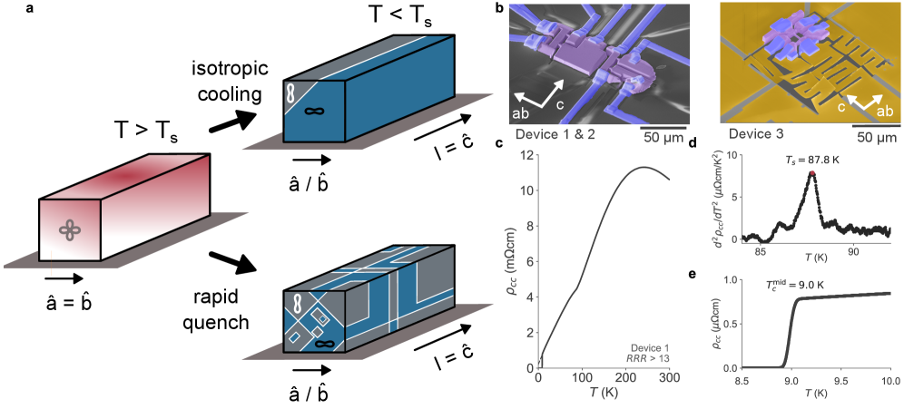
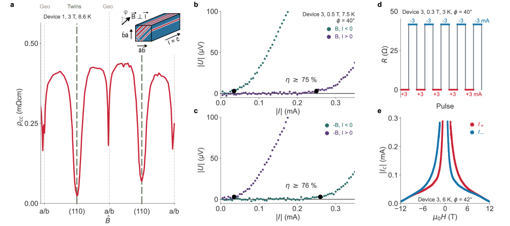
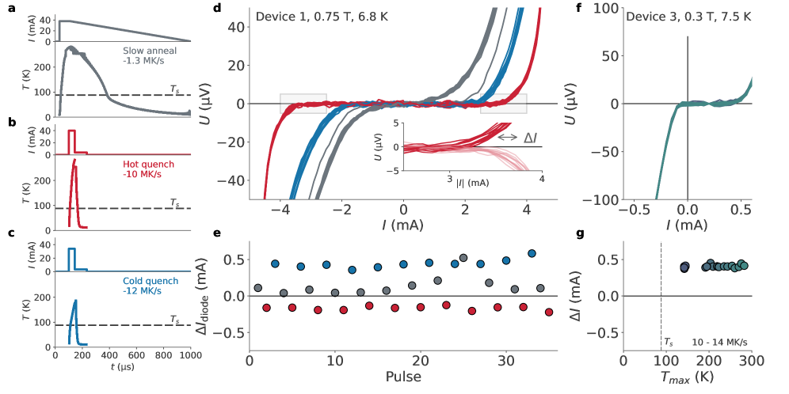
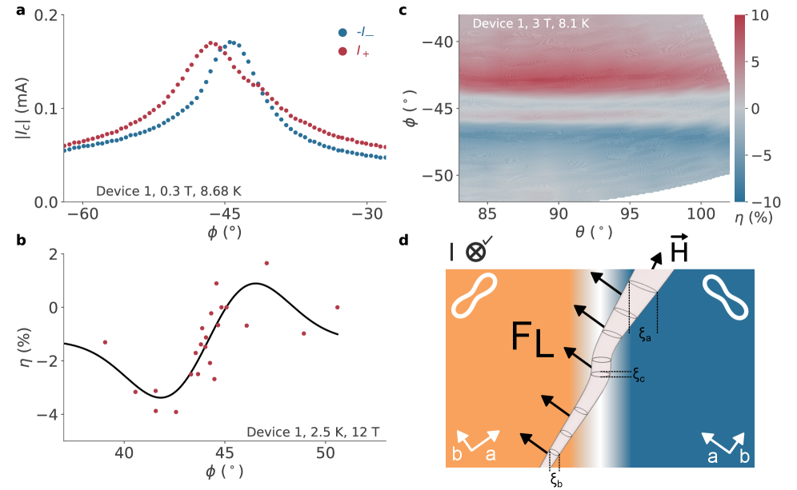

# ネマティック超伝導体 FeSe が拓くプログラマブル超伝導ダイオード

- 執筆日：2026-05-02
- トピック：FeSe のネマティック双晶ドメインを制御することで実現したプログラマブル超伝導ダイオード効果
- Superconductivity and Strongly Correlated Systems / Phase Transitions; Devices and Functional Materials / Transport Measurements
- 注目論文：R. D. H. Hinlopen et al., "Programmable superconducting diode from nematic domain control in FeSe", arXiv:2604.26631 (2026)
- 参照論文数：6

---

## 1. なぜ今この話題なのか

超伝導体は電気抵抗ゼロの状態でクーパー対が流れるという特異な性質を持ち、長年にわたって物理学と応用工学の双方から注目されてきた。しかし近年、超伝導体を従来とは全く異なる視点で見直す研究が急速に進んでいる。それが「超伝導ダイオード効果（Superconducting Diode Effect、SDE）」である。

SDEとは、超伝導体において電流を流す方向によって臨界電流（これを超えると超伝導が壊れる電流値）が異なる、という現象を指す。プラス方向とマイナス方向で「超伝導のしやすさ」が違う、非常に直感に反する現象だ。通常のダイオードが整流作用を持つように、超伝導ダイオードは低損失・無散逸な電流の方向選択性を持ち、量子コンピューティング回路や超伝導エレクトロニクスへの応用が期待されている。

SDEが実験で初めて観測されたのは2020年頃であり（Ando et al., 2020）、それ以来この分野は爆発的な成長を遂げている。SDEの発現には、時間反転対称性と空間反転対称性の両方が破れていることが必要だと理論的に示されており、強い磁場や非対称構造を用いた実験が次々と報告されている。しかしその多くは、非対称性が結晶構造やデバイス形状に固定して刻み込まれた「静的な回路素子」であり、一度作製したら機能を変更できないという根本的な制約がある。

ここに本論文の革新性がある。Hinlopen らは 2026 年、FeSe という特殊な超伝導体の「ネマティック電子ドメイン」を積極的に制御することで、プログラム可能な超伝導ダイオードを実現した。外部から超高速電流パルスを印加するだけで、ダイオードの極性（どちら向きに超伝導が「得意」か）と強度（効率 η）を書き換えられる。これは、超伝導回路素子が相関電子系のドメインパターンによって機能定義される全く新しいパラダイムを提案するものであり、量子情報処理や低消費電力計算素子の設計に新たな地平を開く研究として、分野全体から高い注目を集めている。

FeSe という物質が中心にあることも本研究の重要性を高めている。FeSe は鉄系超伝導体の中でも特に謎が多い物質であり、ネマティック秩序と超伝導が深く絡み合うことが知られている。その複雑な相互作用を「機能素子の書き込み」という工学的な観点から逆利用した発想の転換は、材料科学と超伝導デバイス工学の交差点に位置する、時機を得た研究といえる。

---

## 2. 未解決問題は何か

超伝導ダイオード効果の分野には、現在いくつかの根本的な問いが未解決のまま残っている。

**問い1: SDEの主要発現機構はどれか？**  
SDEが発現するには時間反転対称性と空間反転対称性の両方が破れる必要があるが、実際の材料系でこれをどのように達成するかに関して、複数の機構が競合している。強磁性体との接合によるスピン軌道結合効果、外部磁場下での多バンドのキラリティ、渦糸（磁束量子）のダイナミクスとピン止め不均一性など、機構ごとに予言される特性が異なる。これらを実験的に峻別する方法はいまだ確立されていない。

**問い2: FeSe のネマティック秩序と超伝導はどのように共存・競合するのか？**  
FeSe は常圧では約 90 K でネマティック転移（正方晶から斜方晶への格子対称性の自発的な低下）を起こし、約 9 K で超伝導になる。この二つの秩序が同一の電子系に起源を持つのか、それとも独立して発展するのかについて議論が続いている。特にネマティック揺らぎが超伝導クーパー対の結合グルーになっているという仮説は実験的支持を集めつつあるものの、確立はされていない（Nag et al., 2024）。この問いに答えることは、FeSe 系を理解する上での中心的な課題である。

**問い3: プログラマブル超伝導デバイスの実現可能性と限界はどこか？**  
ネマティックドメインを書き込む手法（本論文ではマイクロ秒電流パルスによる急冷）が、実用的なデバイスとして繰り返し使用に耐えるか、また室温操作との両立ができるか、さらにどの程度の空間分解能でドメインパターンを制御できるかについて、まだほとんど分かっていない。デバイス集積化や量子回路との接続に向けた工学的課題は山積みである。

---

## 3. 注目論文の核心

### 研究の問いと出発点

Hinlopen らの研究の出発点は、FeSe の持つ電子ネマティック性を「バグ」ではなく「フィーチャー」として扱えないか、という問いにある。FeSe は超伝導転移温度 $T_c \approx 9$ K 以下で超伝導となるが、それ以前の $T_s \approx 90$ K においてすでにネマティック転移を起こし、強磁性秩序や電荷密度波を伴わないにもかかわらず結晶の四回回転対称性が自発的に破れている。この結果として試料中には「ネマティック双晶ドメイン」が形成される。隣り合うドメインはネマティック方向が 90 度回転した関係にあり、その境界が「ドメイン壁（ツインバウンダリー）」である。

従来の研究では、このドメイン壁は輸送測定に対するノイズ源あるいは超伝導特性を乱すものとして扱われてきた。Hinlopen らはこれを逆転させ、ドメイン壁が超伝導渦糸のピン止めを方向依存的に行うことに着目し、この特性がSDEを生み出すメカニズムになると着想した。

### 主要な実験手法

著者らは、FeSe 単結晶からマイクロ構造体（マイクロバー）を集束イオンビーム（FIB）加工で切り出し、四端子輸送測定を行った。重要なのは、試料の「ネマティック状態」を人為的に制御した点にある。

- **ゆっくり冷却（マクロドメイン状態）**: $T_s$ を通過する際に数秒かけて冷却すると、試料内に大きなドメインが形成され、少数のドメイン壁しか存在しない状態になる（Fig. 1a）。
- **急速焼入れ（ナノドメイン状態）**: 基板に溶接した試料に対して $10^7$ K/s を超える速度で冷却すると、熱膨張の不均一性により多数の微細なドメインが安定化される（Fig. 1b, c）。

この「ネマティック状態の書き込み」は、マイクロ秒の高強度電流パルスを試料に流すことで実現される。電流パルスは急激なジュール加熱によって試料を $T_s$ 以上に昇温させ、続く急冷がナノドメイン状態を「焼き付ける」。これがデバイス機能のリプログラミングに相当する。

### 超伝導ダイオード効果の実証

SDE を定量するために著者らは効率 $\eta$ を次のように定義した：

$$\eta = \frac{I_c^+ - I_c^-}{(I_c^+ + I_c^-)/2}$$

ここで $I_c^+$、$I_c^-$ はそれぞれプラス方向とマイナス方向の臨界電流である。本研究では $\eta \sim 75\%$ という大きな値が観測された（Fig. 2）。これは先行するSDEの多くの実験値（通常数十%以下）を上回るものである。

SDEの磁場角度依存性を詳細に調べると、特定の方向（ネマティックなa/b軸方向および45度の(110)方向）に対応する角度でのみ強い SDE が現れることが示された（Fig. 4）。この方向選択性はドメイン壁が持つ「傾いた渦糸ピン止め方向」と一致しており、ドメイン壁が SDE の起源であることを強く示唆している。

### 新規性と限界

本研究以前の SDE は、非対称性が試料形状や結晶構造に固定されており、デバイス製造後に変更できなかった。Hinlopen らは、電流パルスによるネマティックドメインの書き換えを通じて：
- SDE の**極性を反転**できること（$\eta$ の符号を変える）
- SDE の**強度を連続的に調整**できること
- この操作を**繰り返し**行えること（1000 回以上のパルス後も動作）

を実証した（Fig. 3）。

ただし現状の限界も明確である。第一に、現在の手法では FeSe を冷却速度の違いによる確率的なドメインパターンに依存しており、特定のドメインパターンを精密に「描画」するには至っていない。第二に、デバイス動作温度は FeSe の $T_c \approx 9$ K であり、液体ヘリウム温度が必要である。第三に、プログラムの繰り返しにおけるパルス最適化や書き込み精度の向上は今後の課題として残る。

---

**Fig. 1** (Hinlopen et al., arXiv:2604.26631, CC BY 4.0): FeSeのネマティック状態制御。(a) ゆっくり冷却によるマクロドメイン状態。(b) 急速焼入れによるナノドメイン状態。(c) 電流パルスによる書き換え概念図。

---

## 4. 背景と研究史

### 超伝導ダイオード効果の誕生

超伝導体で整流作用が現れるという発想は直感的には奇妙に見える。理想的な BCS 超伝導体では時間反転対称性が保たれており、プラス方向とマイナス方向の臨界電流は完全に等しい。非相反輸送が現れるには何らかの対称性の破れが必要である。

初期の研究では、非中心対称超伝導体や強磁性/超伝導ハイブリッド構造における非相反超伝導電流が理論的に議論されていた。実験的な突破口は 2020 年前後に訪れ、NbSe₂/Nb₃Br₈/NbSe₂ などのファン・デル・ワールス積層や非対称 Nb/V/Ta 積層で有限磁場下での SDE が実証された。これらの系では結晶の非中心対称性あるいはデバイス幾何学的非対称性が役割を果たしていた。

しかし、こうした初期の SDE は磁場を必要とするか、あるいは静的なデバイス構造に依存していた。ゼロ磁場 SDE や内因的機構の解明は活発な研究領域となり、スピン軌道結合、ペア密度波（PDW）、渦糸ダイナミクスなど複数の候補機構が検討されてきた。

### 渦糸ピン止めと SDE の接続

超伝導体に磁場を印加すると磁束量子（渦糸）が侵入する。渦糸は欠陥や界面でピン止めされ、電流によるローレンツ力がピン止め力を超えると流動し（フラックスフロー）、電圧が発生する。渦糸のピン止めが空間的に非対称であれば、電流方向によってデピニングが起きる電流閾値（臨界電流）が異なり得る。これが SDE の渦糸機構である。

Li らによる時間依存 Ginzburg-Landau (TDGL) 理論シミュレーション（2603.25147）は、非対称多層構造（Nb/V/Ta 積層）において層の積み重ね順序に依存した非対称渦糸ダイナミクスが SDE を引き起こすことを示した（Fig. 1、2603.25147）。ローレンツ力と非対称ピン止めの組み合わせが SDE の鍵であることが理論的に裏付けられており、単に積み重ね順序を変えるだけで SDE の符号が反転することも示されている。これは、Hinlopen らが FeSe でドメインパターンを書き換えることで SDE 符号を反転させた結果と概念的に対応する。

### FeSe：特異な鉄系超伝導体

FeSe は鉄系超伝導体ファミリーの中でも最も単純な構成（Fe 面と Se 面のみ）を持ちながら、最も複雑な物理を示す物質として知られている。常圧での $T_c \approx 9$ K は低いが、圧力印加や薄膜化により $T_c$ は大幅に上昇し、単層 FeSe/SrTiO₃ では 100 K を超える超伝導が報告されている。

FeSe の最大の特徴は「ネマティック秩序」である。磁気秩序を伴わずに格子の四回回転対称性が $T_s \approx 90$ K で破れるこの現象は、d 軌道の電子の軌道・スピン自由度の相互作用に起因する「電子ネマティック性」として理解されている。ネマティック転移と超伝導の関係について、Nag らは FeSe₁₋ₓSₓ のネマティック量子臨界点付近でネマティック揺らぎが超伝導を媒介する可能性を示した（2403.00615）。また、Noda, Adachi, Ichioka による Ginzburg-Landau 理論研究（2412.18754）は、FeSe の双晶境界においてネマティック渦糸が分数渦糸に分裂し、その流動挙動が双晶壁によって大きく変化することを理論的に示した。これは本論文の渦糸ピン止め機構を理論面から支持する重要な成果である。

---

**Fig. 2** (Hinlopen et al., arXiv:2604.26631, CC BY 4.0): ネマティック双晶ピン止め方向におけるSDE。磁場をin-plane回転したときの渦糸ピン止け（抵抗の角度依存性）と臨界電流の非相反性。

---

## 5. どの解釈が最も妥当か

SDEの発現機構については、現在いくつかの解釈が競合している。Hinlopen らの実験結果がどの解釈を支持し、どこに未解決の問いが残るかを以下に整理する。

### 渦糸ピン止め機構：最も支持される解釈

本論文で示された実験事実の全体像は「渦糸とネマティック双晶境界の相互作用」という機構と最もよく整合する。

まず、SDE が有限磁場下でのみ観測され（渦糸が存在する条件）、磁場をゼロにすると SDE が消滅することが確認されている。これは内因的（intrinsic）な機構——例えばコアペアリングや位相空間でのキラリティが SDE を生む——とは異なる特徴である。次に、SDE の角度依存性が渦糸ピン止め方向と一対一に対応しており、ドメイン壁の向き（ネマティック軸方向）が直接 SDE の選択方向を決めている。さらに、電流パルスによるドメインパターンの書き換えが SDE の符号反転を引き起こすことは、ドメイン壁がなければ SDE もないことを直接示している。

Li らの TDGL シミュレーション（2603.25147）は、非対称な渦糸ダイナミクスだけで η を高い値に達成できることを示しており、FeSe での大きな η もこの枠組みで理解できる。また Noda らの理論（2412.18754）は、FeSe の s + d 波ネマティック超伝導モデルにおいて双晶境界付近で渦糸コアが 90 度回転し、さらに分数渦糸対（メロン状渦糸）になることを示した。こうした特殊な渦糸状態は、ピン止め方向に強い非等方性をもたらすことが期待され、大きな η の起源と整合する。

### 内因的 SDE 機構：一部の材料では有力

一方、渦糸機構では説明できない「ゼロ磁場での SDE」も報告されている。Gao らが Mo₂C ナノフレークで報告した SDE（2604.19525）は磁場奇（field-odd）および磁場なし（field-free）の両方の SDE が観測され、内因的な機構あるいは試料内部に捕捉された磁束が関与している可能性がある。また、Sun らは強相関電子系のジョセフソン接合において強相関効果がゼロ磁場 SDE を引き起こすことを理論的に示した（2604.14045）。これらは FeSe での結果とは直接競合するというよりも、系の違いによって主要機構が変わることを示している。

FeSe での本研究では、磁場なし条件下での SDE の詳細は示されておらず、わずかな残留磁束の寄与が完全には排除されていない点は注意が必要である。しかし、著者らが SDE のドメイン依存性を系統的に示したことで、渦糸-ドメイン壁機構が主役であることはほぼ確定的といってよい。

### 記録的な η の解釈：「傾いた渦糸」仮説

$\eta \sim 75\%$ という大きな値の起源について、著者らは「傾いた渦糸（leaning vortex）」というユニークな描像を提案している（Fig. 4）。磁場が双晶境界と特定の角度をなすとき、渦糸コアが双晶境界に引き込まれながら傾いた状態で安定化される。この傾いた渦糸は、一方向への電流（渦糸を境界から引き剥がす方向）には強い抵抗を示し、逆方向（渦糸を境界に押し込む方向）には弱い抵抗を示す、という強い非対称性をもたらす。

この「傾いた渦糸」仮説は定性的な整合性は示されているが、定量的な理論計算による検証はまだ行われていない。Ginzburg-Landau理論の数値シミュレーション（2412.18754の理論フレームワークを拡張したもの）による定量評価が次のステップとなるだろう。

### まだ弱い結論：ドメイン書き込みの精密制御

本論文の「プログラマブル」という主張は原理的には正しいが、現段階では電流パルスによる書き込みの結果が確率的であり、特定の SDE 強度・極性を指定通りに再現する能力は限定的である。これは、急冷過程が複雑な熱力学的ダイナミクスを経るためであり、ドメインパターンの精密制御には原理的な困難がある。今後、光学的ドメイン書き込みや局所的な加熱・冷却法によってこの精度が改善されるかどうかは未知である。

---

**Fig. 3** (Hinlopen et al., arXiv:2604.26631, CC BY 4.0): FeSe での SDE プログラミング実証。電流パルスのパラメータを変えることで SDE 効率 η の符号と大きさが変化することを示す。

---

## 6. 何が一般化できるのか

### ネマティック秩序を持つ他の鉄系超伝導体への拡張

FeSe は鉄系超伝導体の中でネマティック性が特に顕著な物質だが、BaFe₂As₂ 系など他の鉄系超伝導体もネマティック転移を示し、双晶ドメインを持つ。これらの系でも類似のプログラマブル SDE が実現できるかどうかは重要な問いである。FeSe と比較すると、多くの鉄系超伝導体では磁気秩序とネマティック秩序が競合しており、ドメイン制御はより複雑になる可能性がある。一方、$T_c$ が高い材料（例えば圧力下の FeSe 系や電子ドープした FeSe）でプログラマブル SDE が実現できれば、実用化に近づく。

### コルリド電子系・強相関系への接続

本論文の最も本質的な主張は「相関電子系のドメインパターンが回路素子の機能を定義する」というコンセプトにある。これはモット絶縁体、電荷密度波（CDW）秩序、軌道秩序などを示す強相関系一般に適用できる可能性がある。例えば、VO₂ のように金属絶縁体転移に伴うドメイン形成を持つ材料でも、類似の書き込み型機能デバイスが構想できる。

### 量子回路・量子コンピュータへの接続

超伝導量子ビット（トランズモン等）は Josephson 接合を利用しており、その周辺に SDE を持つ素子を組み込むことで方向依存の電流制御が可能になる。プログラマブル SDE は非相反電流フィルタや単方向信号伝搬素子として、量子回路の分離・制御に使える可能性がある。ただし、FeSe の $T_c \approx 9$ K は標準的な超伝導量子回路（アルミニウム系、$T_c \approx 1$ K 台）より高く、また FIB 加工が必要という加工の複雑さが課題である。より高 $T_c$ かつ量子回路に統合しやすい材料系の探索が鍵となる。

### 設計原理への一般化

本研究が示した設計原理をまとめれば：「時間反転・空間反転の両方を破る秩序（ここでは有限磁場＋ネマティックドメイン壁）を活用し、渦糸と秩序境界の非対称的相互作用によってSDEを生み出す」となる。この原理は特定の材料に縛られない。重要なのは、(1) 可逆的に書き換えられる秩序ドメインが存在すること、(2) ドメイン壁と渦糸（または Cooper 対）の相互作用が強い非対称性を生むこと、の二点である。今後はこの原理に基づいた材料スクリーニングと理論設計が重要な方向性となるだろう。

---

## 7. 基礎から理解する

この節では、本トピックを理解するために必要な背景知識——超伝導の基礎から渦糸物理、ネマティック秩序、そして超伝導ダイオード効果の対称性議論まで——を段階的に解説する。

### 7.1 超伝導の基礎：BCS 理論とクーパー対

金属を冷やすと、通常は抵抗が小さくなるものの、完全にはゼロにはならない。ところが特定の物質では、ある温度（臨界温度 $T_c$）以下で電気抵抗が完全にゼロになる「超伝導」状態が現れる。

超伝導の微視的機構は 1957 年に Bardeen、Cooper、Schrieffer によって提唱された BCS 理論で説明される。鍵となる概念は「クーパー対」である。通常、電子同士はクーロン斥力によって反発し合う。しかし金属中では、一方の電子が格子（イオンの振動、フォノン）を歪めると、その歪みが遅れて別の電子を引き寄せる間接的な引力が生じる。この引力によって、符号の逆で大きさの等しいスピンを持つ二つの電子がペアを組む。これがクーパー対だ。

クーパー対はスピン 0、電荷 $-2e$ のボソン的な合成粒子として振る舞い、ボース・アインシュタイン凝縮に類似した現象（マクロコヒーレント状態）を形成する。この状態は複素スカラー場（超伝導秩序パラメータ）$\psi = |\psi| e^{i\theta}$ で記述される。$|\psi|^2$ はクーパー対の密度、$\theta$ はマクロな量子位相である。

超電流密度 $J_s$ は次のように表される：

$$J_s = \frac{2e\hbar}{m^*} |\psi|^2 \nabla\theta - \frac{(2e)^2}{m^*c}|\psi|^2 \mathbf{A}$$

ここで $m^*$ はクーパー対の有効質量、$\mathbf{A}$ はベクトルポテンシャルである。この式からわかるように、超電流は秩序パラメータの位相勾配 $\nabla\theta$ によって流れる。$|\psi|^2$ が有限のときが超伝導状態、ゼロのときが正常状態である。

BCS 理論のもとでは、時間反転操作 $\mathcal{T}$（$t \to -t$）のもとで電流は符号を変えるが、クーパー対の特性は不変である。プラス方向の電流と同じ大きさのマイナス方向の電流では、臨界電流が同じ——これが通常の超伝導体で $I_c^+ = I_c^-$ が成り立つ理由である。

### 7.2 Ginzburg-Landau 理論と渦糸

より直感的な描像を与えるのが Ginzburg-Landau (GL) 理論である。$T_c$ 付近での超伝導をランダウの相転移理論の枠組みで記述し、秩序パラメータ $\psi$ の空間的変化を許した理論である。自由エネルギー密度は：

$$f = a|\psi|^2 + \frac{b}{2}|\psi|^4 + \frac{1}{2m^*}\left|\left(-i\hbar\nabla - \frac{2e}{c}\mathbf{A}\right)\psi\right|^2 + \frac{H^2}{8\pi}$$

のように書かれる（ここで $a \propto (T-T_c)$ は $T < T_c$ で負となる）。GL 理論から二つの重要な長さスケールが導出される。

- **コヒーレンス長 $\xi$**: 秩序パラメータが空間的に変化するスケール。$\xi = \sqrt{\hbar^2/2m^*|a|}$。超伝導が「壊れる」領域（渦糸コア）の大きさに対応する。
- **London 侵入長 $\lambda$**: 磁場が超伝導体に侵入できる深さ。$\lambda = \sqrt{m^*c^2/4e^2|\psi_0|^2}$（SI 単位系では別の形）。

$\kappa = \lambda/\xi > 1/\sqrt{2}$ のとき（第二種超伝導体）、磁場は量子化された磁束として超伝導体に侵入できる。これが「渦糸（Abrikosov 渦糸、磁束量子）」である。一本の渦糸はコア（正常領域、半径 $\sim\xi$）を中心に磁束量子 $\Phi_0 = h/2e \approx 2.07 \times 10^{-15}$ Wb の磁束を持ち、その周囲に超電流が渦を巻いて流れる。

外部から電流を流すと、渦糸はローレンツ力 $\mathbf{F}_L = (1/c)\mathbf{J} \times \boldsymbol{\Phi}_0$ を受ける。渦糸が動くと電圧が発生し、超伝導が破れる。これを防ぐのが「渦糸ピン止め」であり、結晶欠陥、不純物、界面など、秩序パラメータが局所的に弱い場所が渦糸を捕捉する。電流が「脱ピン電流（臨界電流 $I_c$）」を超えると渦糸が流動し、抵抗が発生する。

### 7.3 ネマティック秩序と鉄系超伝導体

「ネマティック（nematic）」という言葉はもともと液晶物理学から来ており、方向の秩序はあるが位置の秩序はない状態を指す。固体中のネマティック電子状態とは、電子系が結晶の回転対称性（正方晶の C₄ 対称性）を自発的に破り、特定の方向に「向き」を持つ状態である。

FeSe の場合、室温では正方晶（a = b）の結晶構造を持つが、$T_s \approx 90$ K で a 軸と b 軸が異なる長さになる（斜方晶に転移）。ただし磁気秩序が伴わない点が特異であり、純粋に電子的な自由度（d 軌道の $d_{xz}$ と $d_{yz}$ の占有不均一）がネマティック秩序を引き起こしていると考えられている。

試料を $T_s$ 以下に冷却すると、a 軸が伸びる方向と b 軸が伸びる方向の二種類の「ネマティックドメイン」が等確率で核形成し、試料全体に双晶構造が形成される。隣り合うドメインの境界が「ネマティック双晶境界（ツインバウンダリー）」であり、その幅は数 nm から数十 nm 程度と非常に薄い。この境界では FeSeの超伝導秩序パラメータが局所的に乱れており、渦糸のピン止め中心として機能する。

重要なのは、この双晶境界が単純な点欠陥とは違い、空間的方向性を持った「壁」だという点である。渦糸が双晶境界に沿って動く場合と、境界を横切って動く場合とでは、渦糸に働くピン止めポテンシャルが大きく異なる。Noda らの理論（2412.18754）はこの効果を二成分 GL 理論（$s + d$ 波混合）でモデル化し、双晶境界において渦糸がメロン対（位相トポロジカルに分数化した渦糸）になることを示した。

### 7.4 超伝導ダイオード効果の対称性原理

SDEを理解する上での核心は対称性である。対称性の言葉で言えば、「$I_c^+ \neq I_c^-$」は空間的な電流反転操作 $\mathcal{P}$（$I \to -I$ に対応する）と時間反転操作 $\mathcal{T}$ が同時に成り立たないことを意味する。

より正確には：電流を反転する操作は空間反転（$\mathcal{P}$: $\mathbf{r} \to -\mathbf{r}$）と時間反転（$\mathcal{T}$: $t \to -t$）の積 $\mathcal{PT}$ によって表される。$\mathcal{PT}$ 不変の系では $I_c^+ = I_c^-$ が保証される。逆に言えば、$\mathcal{PT}$ 対称性が破れた場合にのみ SDE が現れる。

FeSe での状況を考えると：
- **時間反転の破れ**: 外部磁場 $\mathbf{B}$ を印加すると $\mathcal{T}$ が破れる（$\mathcal{T}: \mathbf{B} \to -\mathbf{B}$）。
- **空間反転の破れ**: ネマティックドメイン壁の方向が試料に固定された方向性（非中心対称構造）を与える。

この二つが組み合わさって $\mathcal{PT}$ 対称性が破れ、SDE が現れる。これが「磁場下でのみ SDE が現れる」という実験事実の対称性による説明である。ドメインパターンを変えると「空間反転の破れ方」が変わり、同じ磁場でも SDE の符号や強度が変化する——これがプログラマブル SDE の本質である。

### 7.5 急速焼入れの物理

電流パルスによるドメイン書き換えの物理を理解するには、ネマティック相転移の動力学を知る必要がある。FeSe を $T_s$ 以上に加熱すると正方晶に戻り、その後冷却すると再びネマティック転移を起こす。この際の核形成とドメイン成長は、冷却速度に強く依存する。

ゆっくり冷却（平衡的プロセス）すると、少数の大きなドメインが成長しマクロドメイン状態になる（ドメイン壁が少ない）。一方、超高速冷却（$10^7$ K/s 以上）では多数の核が等確率で形成され、それぞれが成長する前に固定されるためナノドメイン状態になる（ドメイン壁が多い）。

この「急速焼入れ（quench）」は基板への熱拡散によって達成される。マイクロメートルサイズの FeSe 構造体は、電流パルスによるジュール熱で急激に昇温し、電流を切った後に基板（常温）との温度差によって $10^7$ K/s を超える速度で冷却される。試料の小ささがこの極端な冷却速度を可能にしている。

このプロセスは相変化メモリ（PCM）の物理と類似しており、PCM でも急冷（アモルファス化）と緩冷（結晶化）を繰り返して情報を書き込む。FeSe のプログラマブル SDE は、この概念を超伝導ドメインに適用した新しい情報記録・機能付与パラダイムといえる。

---

## 8. 専門用語の解説

**超伝導ダイオード効果 (Superconducting Diode Effect, SDE)**  
超伝導体において、電流を流す方向によって臨界電流が異なる現象。$I_c^+ \neq I_c^-$ が成立するとき SDE があるという。通常の超伝導体では対称性の保護により $I_c^+ = I_c^-$ だが、時間反転対称性と空間反転対称性の積（$\mathcal{PT}$）が破れると非相反臨界電流が現れる。整流作用と無散逸電流を組み合わせた「超伝導版ダイオード」として量子回路素子への応用が期待される。

**ネマティック秩序 (Nematic Order)**  
液晶でよく知られる分子の方向秩序が、固体中の電子系でも自発的に現れる状態。FeSe では $T_s \approx 90$ K 以下で鉄の $d_{xz}$ 軌道と $d_{yz}$ 軌道の占有率差が生じ、正方晶の四回回転対称性（C₄）が自発的に二回対称性（C₂）に低下する。磁気秩序なしにこの電子ネマティック転移が起きる点が FeSe の特徴であり、本論文の SDE 機能の起源となる。

**双晶ドメイン・ネマティック双晶境界 (Nematic Twin Boundary)**  
ネマティック転移後、a 軸とb 軸が伸びる方向が空間的に異なる領域（ドメイン）が形成され、その境界を双晶境界という。境界幅は数 nm 程度だが、この局所構造では超伝導秩序パラメータが乱れており、渦糸のピン止め中心として機能する。本論文の中心メカニズムは、この双晶境界と渦糸の非対称的相互作用にある。

**渦糸・磁束量子 (Vortex, Magnetic Flux Quantum)**  
第二種超伝導体に磁場を印加すると、磁束が量子化された単位（磁束量子 $\Phi_0 = h/2e \approx 2.07 \times 10^{-15}$ Wb）で超伝導体内に侵入する。各磁束の周囲では超電流が渦を巻いており（渦糸）、中心コア（半径 $\sim\xi$）では超伝導が局所的に破壊されている。渦糸が移動すると電圧が発生するため、渦糸のピン止めが臨界電流を決定する。本論文では渦糸とネマティック双晶境界の相互作用が SDE を生み出す。

**SDE 効率 η (SDE Efficiency)**  
SDE の大きさを定量する指標。 $\eta = (I_c^+ - I_c^-)/[(I_c^+ + I_c^-)/2]$ と定義される。η = 0 は SDE なし、η = 100% は完全な整流（一方向のみ超伝導）に対応する。本論文では η ≈ 75% という大きな値が実現されており、これは先行研究と比較して突出して高い。

**Ginzburg-Landau 理論 (Ginzburg-Landau Theory)**  
超伝導状態を秩序パラメータ（複素スカラー場）$\psi$ を用いて記述する現象論的理論。$T_c$ 付近での熱力学的性質や、渦糸・界面の構造を理論的に扱うのに適している。本論文でも関連論文（2603.25147、2412.18754）はこの枠組みを用いた数値シミュレーションを行い、渦糸ダイナミクスと SDE の関係を明らかにした。

**脱ピン臨界電流 (Depinning Critical Current)**  
渦糸がピン止めを脱して流動を始める電流値。この値が電流方向によって異なること（$I_{c,\text{depin}}^+ \neq I_{c,\text{depin}}^-$）が SDE の本質である。ピン止めサイトの形状・強度・空間配置が非対称であれば非相反性が現れる。本論文では双晶境界が指向性のある非対称ピン止めを提供することで大きな η が生まれる。

**ローレンツ力 (Lorentz Force on Vortex)**  
超伝導体に電流 $\mathbf{J}$ が流れると、渦糸（磁束 $\boldsymbol{\Phi}_0$）はローレンツ力 $\mathbf{F}_L = \mathbf{J} \times \boldsymbol{\Phi}_0 / c$ を受ける（CGS 系）。電流方向によってローレンツ力の向きが変わるため、非対称なピン止めポテンシャルが存在すれば、電流方向によってピン止めが効いたり効かなかったりする。これが渦糸機構によるSDEの基本原理である。

**相変化 (Phase Quench / Nematic Quench)**  
本論文での「焼入れ（quench）」は、試料をネマティック転移温度以上に急加熱した後、基板冷却によって $10^7$ K/s 以上の速度で急冷するプロセス。急冷によって多数の微細なネマティックドメインが形成・固定される。これは相変化メモリ（PCM）の書き込みプロセスと類似した概念であり、ドメインパターン = SDE 機能の情報として扱われる。

**非相反輸送 (Nonreciprocal Transport)**  
電流の向きによって輸送特性（ここでは臨界電流）が異なる現象の総称。SDE はその超伝導版だが、非線形ホール効果（電界方向で符号が変わる横電圧）など正常金属でも類似現象が知られる。非相反性の発現には何らかの対称性の破れが必要であり、材料設計・構造設計によって制御できる可能性がある。非相反量子デバイスの実現は量子情報工学・低消費電力デバイス開発に重要な問いである。

---

## 9. 今後の展望

本研究は「超伝導回路素子を相関電子系のドメインパターンで機能定義する」という概念を初めて実証したという点で画期的だが、実用化および物理的深化に向けて多くの課題が残る。

今かなり確からしくなったこととして、FeSe のネマティック双晶境界が渦糸のピン止め非対称性を通じて大きな SDE を引き起こすこと、電流パルスによるドメインパターンの書き換えが SDE の極性・強度を変化させること、そして渦糸ピン止め機構が SDE の主要因であるという事実は実験的に強く支持されている。また、 η ≈ 75% という大きな効率値は、SDE の実用的応用に向けて十分な性能水準に達することを示している。

一方、まだ不確定な部分も多い。ドメインパターンの精密制御（特定の SDE 特性を狙って書き込む）が可能かどうか、また FeSe 以外のネマティック超伝導体でも同様の機能が実現できるかどうかは未検証である。「傾いた渦糸」仮説の定量的検証も今後の理論計算に依存している。さらに、本論文の実験では磁場を必要とするが、ゼロ磁場での SDE 実現に向けた機構設計も重要な課題として残る。

今後 1〜3 年で注目すべき論点としては、まず TDGL 数値シミュレーションによる「傾いた渦糸」ピン止めの定量モデル化が急務である。さらに、FIB 以外の加工技術（ナノ構造化、光学的書き込み等）によるドメインパターン精密制御の開発が鍵を握る。また、FeSe₁₋ₓSeₓ や圧力下の FeSe のように $T_c$ が高い派生系への展開、あるいはビスマス系酸化物など他の非中心対称超伝導体への一般化も関心を集めるだろう。ゼロ磁場での大きな SDE を実現する物質・機構の探索（2604.14045 や 2604.19525 のような研究が加速する）も活発化すると予想される。本論文が切り開いた「相関電子系によるプログラマブル超伝導デバイス」というパラダイムは、今後の超伝導エレクトロニクスの発展を方向付ける重要な概念として定着していくことが期待される。

---

**Fig. 4** (Hinlopen et al., arXiv:2604.26631, CC BY 4.0): SDE の双晶境界起源と「傾いた渦糸」描像。磁場の角度スキャンによる臨界電流の非相反性と、そのモデル図。

---

## 参考論文一覧

1. **[arXiv:2604.26631](https://arxiv.org/abs/2604.26631)** — R. D. H. Hinlopen et al., "Programmable superconducting diode from nematic domain control in FeSe" (2026). 【注目論文】FeSe のネマティック双晶ドメインを電流パルスで書き換えることで、η ≈ 75% のプログラマブル超伝導ダイオード効果を実証した論文。CC BY 4.0。

2. **[arXiv:2603.25147](https://arxiv.org/abs/2603.25147)** — J. Li, J. Jiang, Q.-H. Chen, "Vortex-driven superconducting diode effect in asymmetric multilayer heterostructures", *Communications Physics* 9, 49 (2026). 非対称 Nb/V/Ta 積層の時間依存 GL 数値シミュレーションにより、渦糸ダイナミクスの非対称性が SDE の主要機構であることを示した理論研究。CC BY 4.0。

3. **[arXiv:2412.18754](https://arxiv.org/abs/2412.18754)** — S. Noda, H. Adachi, M. Ichioka, "Fractional vortex array realized at twin boundary in a nematic superconductor", *J. Phys. Soc. Jpn.* 94, 023702 (2025). FeSe の s+d 波ネマティック超伝導の2成分 GL 理論により、双晶境界でのネマティック渦糸の分数化とメロン状渦糸の形成を理論的に示した研究。CC BY 4.0。

4. **[arXiv:2403.00615](https://arxiv.org/abs/2403.00615)** — P. K. Nag et al., "Superconductivity Mediated by Nematic Fluctuations in Tetragonal FeSe₁₋ₓSₓ", *Nature Physics* 20, 1612–1618 (2024). FeSe₁₋ₓSₓ のネマティック量子臨界点付近でネマティック揺らぎが超伝導を媒介することを実験的に示した研究で、FeSe の超伝導機構の理解を深めた重要論文。

5. **[arXiv:2604.19525](https://arxiv.org/abs/2604.19525)** — W. Gao et al., "Observation of field-odd and field-free superconducting diode effects in Mo₂C nanoflakes" (2026). Mo₂C ナノフレークにおいて磁場奇対称およびゼロ磁場 SDE を観測し、FeSe 系とは異なる内因的メカニズムの可能性を提示した比較系の実験論文。

6. **[arXiv:2604.14045](https://arxiv.org/abs/2604.14045)** — Y. Sun, Z. Zhang, J. J. He, "Strong Correlation Drives Zero-Field Josephson Diode Effect" (2026). 強相関電子効果がゼロ磁場 Josephson ダイオード効果を駆動することを理論的に示し、渦糸ピン止めとは異なるゼロ磁場 SDE の新しい機構として注目される研究。
